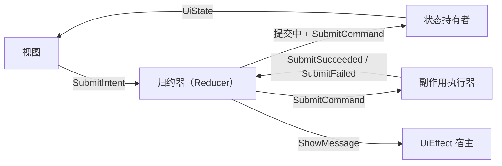
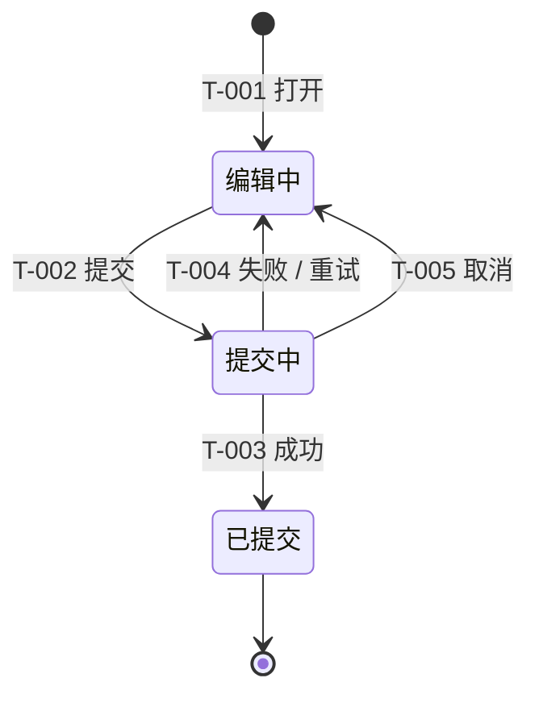
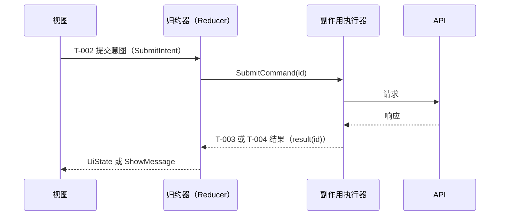

# 通用 MVI 状态流示例

本示例是可复用的 Markdown 参考，不是项目契约。只复制当前切片适用的章节。

> 语言边界：本文件是中文参考。输出到其他语言时，标题、表头/单元格、解释性句子，以及 Mermaid 节点、连线和参与者标签都必须改为用户当前对话语言；机器语法、ID、代码/API/库/协议名称和必要技术标识保持原样。

<!-- ai-delivery:state-flow:start -->
<!-- ai-delivery:state-flow:taxonomy -->
## 状态所有权
| 状态集合 | 所有者 | 事实源 | 生命周期 | 持久化 / 恢复 |
|----------|--------|--------|----------|---------------|
| 领域状态（Domain state） | 状态存储（Store） | 仓储结果（Repository result） | 持久 | 从仓储恢复 |
| 操作状态（Operation state） | 状态存储（Store） | 命令生命周期（Command lifecycle） | 短暂 | 恢复时重置 |
| 本地输入状态（Local input state） | 视图模型（View model） | 用户输入 | 页面 | 仅按明确要求恢复 |
| UiState | 投影函数 | 纯投影 | 派生 | 不持久化 |
| UiEffect | Effect 宿主（Effect host） | 归约器（Reducer）输出 | 一次性 | 不持久化 |

<!-- ai-delivery:state-flow:mvi-loop -->
## MVI 闭环

<!-- ai-delivery:state-flow:lifecycle -->
## 生命周期

<!-- ai-delivery:state-flow:projection -->
## 投影
`UiState = project(DomainState, OperationState, LocalInputState)`

| 投影 ID（Projection ID） | 条件 | 可见 UI | 交互 |
|---------------|------|---------|------|
| P-001 | 编辑中 + 输入有效 | 启用提交 | 编辑和提交 |
| P-002 | 提交中 | 进度和锁定的提交 | 取消 |
| P-003 | 编辑中 + 失败 | 错误提示和重试 | 编辑和重试 |

<!-- ai-delivery:state-flow:matrix -->
## 转换矩阵
| 转换 ID（Transition ID） | 起点 | 意图 / 事件 | 守卫条件 | 决策 | 终点 | 命令（Command） | 结果事件（Result event） |
|---------------|------|----------------|-------|----------|----|---------|--------------|
| T-001 | none | 打开 | 已认证 | 创建草稿 | Editing | none | none |
| T-002 | Editing | SubmitIntent | 输入有效 | 标记为提交中 | Submitting | SubmitCommand(id) | SubmitSucceeded / SubmitFailed |
| T-003 | Submitting | SubmitSucceeded(id) | 当前请求 ID 匹配 | 提交领域结果 | Submitted | none | none |
| T-004 | Submitting | SubmitFailed(id) | 当前请求 ID 匹配 | 保留输入并展示失败 | Editing | none | none |
| T-005 | Submitting | CancelIntent | 命令可取消 | 使 active id 失效 | Editing | CancelCommand(id) | Cancelled(id) |

<!-- ai-delivery:state-flow:sequences -->
## 异步时序

<!-- ai-delivery:state-flow:invariants -->
## 不变量
<!-- ai-delivery:state-flow:stale-result -->
- 不匹配 active correlation ID 的结果视为过期并忽略。
<!-- ai-delivery:state-flow:concurrency -->
- 并发提交使用 request ID 去重，以 active request 为准。
- 相同 request ID 的提交必须幂等。
- 失败不能清除用户输入。
- UiEffect 只消费一次，恢复 UiState 时不能重新构造。

<!-- ai-delivery:state-flow:traceability -->
## 追踪
| ID | 需求 | 场景 | 测试 |
|----|------|------|------|
| T-002 / P-002 | REQ-SUBMIT | SC-SUBMIT | test/submit_test.dart |
<!-- ai-delivery:state-flow:end -->
