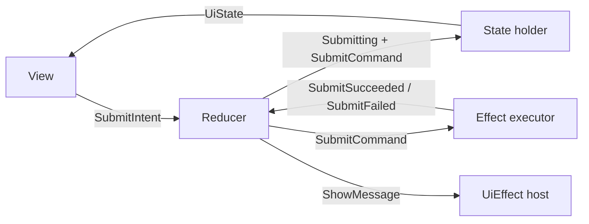
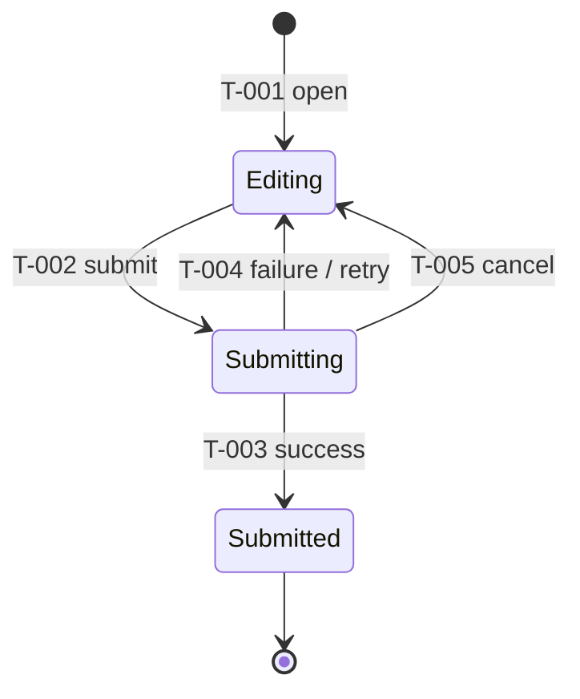
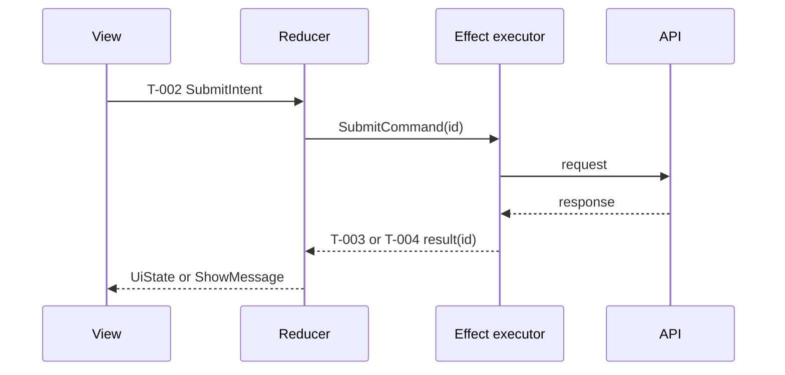

# 通用 MVI 状态流示例

本示例是可复用的 Markdown 参考，不是项目契约。只复制当前切片适用的章节。

<!-- ai-delivery:state-flow:start -->
<!-- ai-delivery:state-flow:taxonomy -->
## 状态所有权
| 状态集合 | 所有者 | 事实源 | 生命周期 | 持久化 / 恢复 |
|----------|--------|--------|----------|---------------|
| Domain state | Store | Repository 结果 | 持久 | 从 Repository 恢复 |
| Operation state | Store | Command 生命周期 | 短暂 | 恢复时重置 |
| Local input state | View model | 用户输入 | 页面 | 仅按明确要求恢复 |
| UiState | 投影函数 | 纯投影 | 派生 | 不持久化 |
| UiEffect | Effect host | Reducer 输出 | 一次性 | 不持久化 |

<!-- ai-delivery:state-flow:mvi-loop -->
## MVI 闭环

<!-- ai-delivery:state-flow:lifecycle -->
## 生命周期

<!-- ai-delivery:state-flow:projection -->
## 投影
`UiState = project(DomainState, OperationState, LocalInputState)`

| Projection ID | 条件 | 可见 UI | 交互 |
|---------------|------|---------|------|
| P-001 | Editing + valid input | 启用提交 | 编辑和提交 |
| P-002 | Submitting | 进度和锁定的提交 | 取消 |
| P-003 | Editing + failure | 错误提示和重试 | 编辑和重试 |

<!-- ai-delivery:state-flow:matrix -->
## 转换矩阵
| Transition ID | From | Intent / Event | Guard | Decision | To | Command | Result event |
|---------------|------|----------------|-------|----------|----|---------|--------------|
| T-001 | none | Open | authenticated | create draft | Editing | none | none |
| T-002 | Editing | SubmitIntent | valid input | mark submitting | Submitting | SubmitCommand(id) | SubmitSucceeded / SubmitFailed |
| T-003 | Submitting | SubmitSucceeded(id) | id matches active id | commit domain result | Submitted | none | none |
| T-004 | Submitting | SubmitFailed(id) | id matches active id | retain input and expose failure | Editing | none | none |
| T-005 | Submitting | CancelIntent | command cancellable | invalidate active id | Editing | CancelCommand(id) | Cancelled(id) |

<!-- ai-delivery:state-flow:sequences -->
## 异步时序

<!-- ai-delivery:state-flow:invariants -->
## 不变量
<!-- ai-delivery:state-flow:stale-result -->
- 非 active correlation ID 的结果视为过期并忽略。
<!-- ai-delivery:state-flow:concurrency -->
- 并发提交使用 request ID 去重，active request 获胜。
- 相同 request ID 的提交必须幂等。
- 失败不能清除用户输入。
- UiEffect 只消费一次，恢复 UiState 时不能重新构造。

<!-- ai-delivery:state-flow:traceability -->
## 追踪
| ID | 需求 | 场景 | 测试 |
|----|------|------|------|
| T-002 / P-002 | REQ-SUBMIT | SC-SUBMIT | test/submit_test.dart |
<!-- ai-delivery:state-flow:end -->
