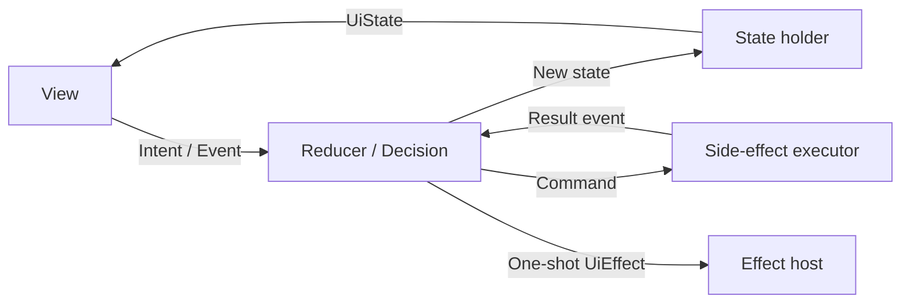
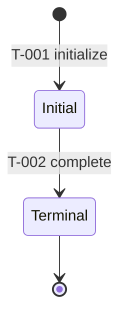
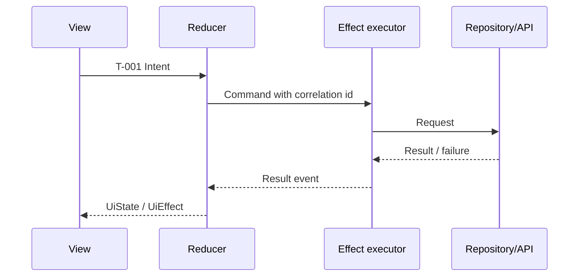

<!-- ai-delivery-meta: {"version":2,"artifact_type":"solution-design","layout_key":"solution_design","canonical_path":"design.md","updated_at":"<ISO8601>","updated_by":"<agent>"} -->
<!-- ai-delivery-template-language
实例化本模板时，保留 ai-delivery-meta 注释及其机器键，仅替换时间戳和作者占位符。所有人类可读的标题、标签和正文都使用用户当前对话语言。ID、路径、命令、代码符号和协议字面量保持原样。完成产物前删除本语言指令注释。
-->

# 方案设计：{{subreq_id}}

> 本文件是 `{subreq_id}` 的规范方案设计记录，归档前为可演进产物。`status.json` 中的批准记录只对本文件当前精确 SHA-256 有效。

## 1. 背景与目标
（说明原因、约束、用户和明确的非目标。）

## 2. 关键决策
- 决策点 A：选择 X，理由…
- 决策点 B：…

## 3. 方案概述
（架构、模块边界、数据流、导航和主要交互路径。）

## 4. UI 场景引用（仅启用 UI truth 模式）

运行时覆盖的唯一真相源是 `contracts/ui-truth-index.json`。本文件只引用已索引的 scenario，不重复维护 Runtime Coverage Plan。

### Unit 与 Scenario 追踪
| Unit ID | 场景 IDs | 职责 | 验证负责人 |
|---------|----------|------|------------|
| ... | ... | ... | ... |

<!-- ai-delivery:state-flow:start -->
<!-- ai-delivery:state-flow:applicability: 当 status.json 的 state_flow_required=true 时必须为 required；否则记录 not_applicable 及理由。 -->

## 5. 状态流设计

状态流适用性：`required` / `not_applicable`。

<!-- ai-delivery:state-flow:taxonomy -->
### 5.1 状态分类与所有权
| 状态集合 | 所有者 | 事实源 | 生命周期 | 持久化 / 恢复 | 渲染或修改规则 |
|----------|--------|--------|----------|---------------|----------------|
| Business/Domain State | ... | ... | ... | ... | ... |
| Operation State | ... | ... | ... | ... | ... |
| Local Input State | ... | ... | ... | ... | ... |
| UiState（派生） | ... | ... | ... | ... | ... |
| UiEffect（一次性） | ... | ... | ... | ... | ... |
| Command / Side Effect | ... | ... | ... | ... | ... |

<!-- ai-delivery:state-flow:mvi-loop -->
### 5.2 MVI / UDF 闭环

Reducer 纯函数边界、Command 所有权、结果事件关联以及一次性 Effect 消费规则：…

<!-- ai-delivery:state-flow:lifecycle -->
### 5.3 业务生命周期（State and Transition Model）

独立区域使用复合状态或并行状态。顶层图保持小型；图中每个 `T-###` 都必须能在下方矩阵中找到。

<!-- ai-delivery:state-flow:projection -->
### 5.4 UI 投影
`UiState = project(BusinessState, OperationState, LocalInputState)`

| Projection ID | 输入状态条件 | 可见 UI | 可用交互 | UiEffect |
|---------------|--------------|---------|----------|----------|
| P-001 | ... | ... | ... | none / ... |

不改变业务事实的 loading、error、empty、disabled 和 refreshing 应归入操作层或本地输入层，而不是业务生命周期。

<!-- ai-delivery:state-flow:matrix -->
### 5.5 权威转换矩阵
| Transition ID | From | Intent / Event | Guard | Decision | To | Command | Result event |
|---------------|------|----------------|-------|----------|----|---------|--------------|
| T-001 | ... | ... | ... | ... | ... | none / ... | none / ... |
| T-002 | ... | ... | ... | ... | ... | none / ... | none / ... |

| Transition ID | UI 投影 | 失败 / 取消 / 过期行为 | 并发 / 幂等 | 持久化 / 恢复 | 需求 / 场景 / 测试 |
|---------------|----------|----------------------|-----------|---------------|--------------------|
| T-001 | P-001 | ... | ... | ... | ... |
| T-002 | P-001 | ... | ... | ... | ... |

矩阵是契约事实源；图表只是视图。发生不一致时，必须同步修正矩阵和图表，不能自行选择其中一份。

<!-- ai-delivery:state-flow:sequences -->
### 5.6 关键异步时序

覆盖适用的重试、取消、过期结果、去重、并行合并、导航 Effect 和进程恢复策略。都不适用时必须写 `not_applicable` 及理由。

<!-- ai-delivery:state-flow:invariants -->
### 5.7 不变量与非法转换
<!-- ai-delivery:state-flow:stale-result -->
- 重入与幂等：…
<!-- ai-delivery:state-flow:concurrency -->
- 过期结果 / correlation ID 策略：…
- 重试、取消和恢复策略：…
- 禁止的状态组合和不可达转换：…
- 导航返回和进程死亡恢复：…

<!-- ai-delivery:state-flow:traceability -->
### 5.8 状态流追踪
| Transition / Projection ID | 需求来源 | UI scenario | 测试或验证命令 |
|----------------------------|----------|-------------|----------------|
| T-001 / P-001 | ... | ... | ... |

<!-- ai-delivery:state-flow:end -->

## 6. 风险与缓解
| 风险 | 影响 | 缓解 |
|------|------|------|
| ... | ... | ... |

## 7. 待决问题 / 开放项
无。任何会改变状态、guard、转换、effect 或恢复策略的未决问题都必须在批准前解决。
