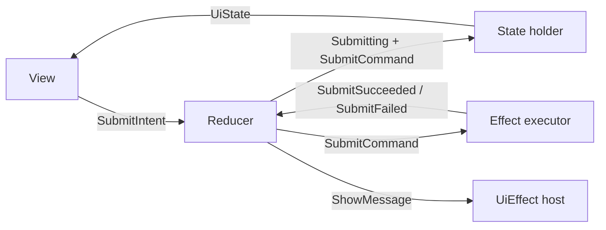
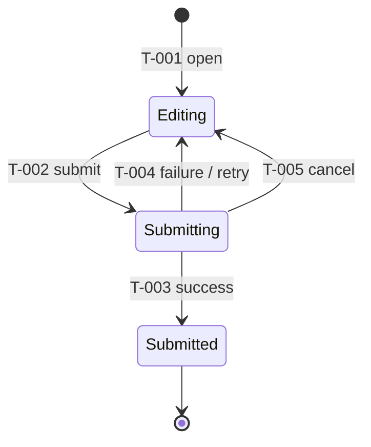
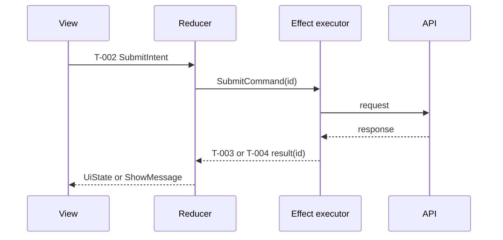

# Generic MVI State-flow Example

This example is a reusable Markdown reference, not a project contract. Copy only the sections that apply to the current slice.

<!-- ai-delivery:state-flow:start -->
<!-- ai-delivery:state-flow:taxonomy -->
## State ownership
| State set | Owner | Source of truth | Lifetime | Persistence / restoration |
|-----------|-------|-----------------|----------|--------------------------|
| Domain state | Store | Repository result | Durable | Restore from repository |
| Operation state | Store | Command lifecycle | Ephemeral | Reset on restore |
| Local input state | View model | User input | Screen | Restore only when specified |
| UiState | Projection | Pure projection | Derived | Never persisted |
| UiEffect | Effect host | Reducer output | One-shot | Never persisted |

<!-- ai-delivery:state-flow:mvi-loop -->
## MVI loop

<!-- ai-delivery:state-flow:lifecycle -->
## Lifecycle

<!-- ai-delivery:state-flow:projection -->
## Projection
`UiState = project(DomainState, OperationState, LocalInputState)`

| Projection ID | Conditions | Visible UI | Interaction |
|---------------|------------|------------|-------------|
| P-001 | Editing + valid input | Enabled submit | Edit and submit |
| P-002 | Submitting | Progress and locked submit | Cancel |
| P-003 | Editing + failure | Error message and enabled retry | Edit and retry |

<!-- ai-delivery:state-flow:matrix -->
## Transition matrix
| Transition ID | From | Intent / Event | Guard | Decision | To | Command | Result event |
|---------------|------|----------------|-------|----------|----|---------|--------------|
| T-001 | none | Open | authenticated | create draft | Editing | none | none |
| T-002 | Editing | SubmitIntent | valid input | mark submitting | Submitting | SubmitCommand(id) | SubmitSucceeded / SubmitFailed |
| T-003 | Submitting | SubmitSucceeded(id) | id matches active id | commit domain result | Submitted | none | none |
| T-004 | Submitting | SubmitFailed(id) | id matches active id | retain input and expose failure | Editing | none | none |
| T-005 | Submitting | CancelIntent | command cancellable | invalidate active id | Editing | CancelCommand(id) | Cancelled(id) |

<!-- ai-delivery:state-flow:sequences -->
## Async sequence

<!-- ai-delivery:state-flow:invariants -->
## Invariants
<!-- ai-delivery:state-flow:stale-result -->
- A result with a non-active correlation ID is ignored as stale.
<!-- ai-delivery:state-flow:concurrency -->
- Concurrent submits use the request ID as a deduplication key; the active request wins.
- Submit is idempotent for the same request ID.
- Failure does not erase user input.
- UiEffect is consumed once and is not reconstructed from restored UiState.

<!-- ai-delivery:state-flow:traceability -->
## Traceability
| ID | Requirement | Scenario | Test |
|----|-------------|----------|------|
| T-002 / P-002 | REQ-SUBMIT | SC-SUBMIT | test/submit_test.dart |
<!-- ai-delivery:state-flow:end -->
