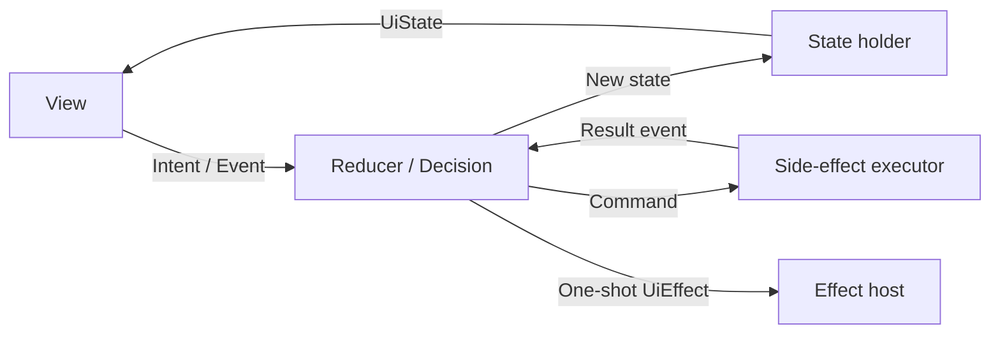
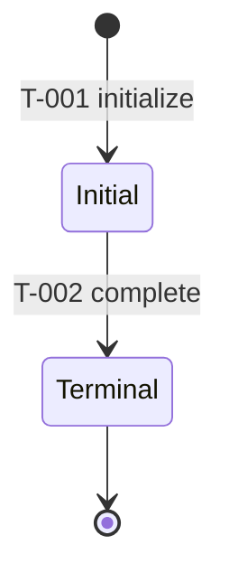
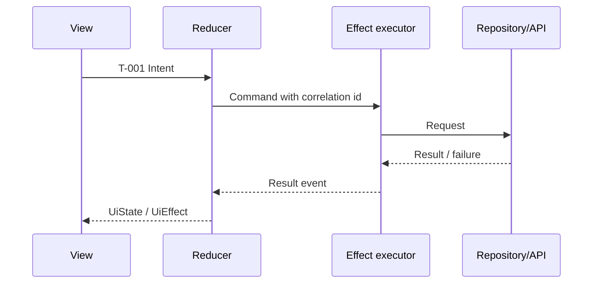

<!-- ai-delivery-meta: {"version":2,"artifact_type":"solution-design","layout_key":"solution_design","canonical_path":"design.md","updated_at":"<ISO8601>","updated_by":"<agent>"} -->
<!-- ai-delivery-template-language
When instantiating this template, preserve the ai-delivery-meta comment and its machine keys, replacing only its timestamp and author placeholders. Write every human-readable heading, label, and prose passage in the user's current conversation language. Keep IDs, paths, commands, code symbols, and literal protocol tokens unchanged. Remove this language-instruction comment from the finished artifact.
-->

# Solution Design: {{subreq_id}}

> This file is the canonical solution-design record for `{subreq_id}`. It is a living artifact until archival. The approval record in `status.json` is valid only for the exact SHA-256 of this file.

## 1. Context and Goals
(Why this work is needed, including constraints, users, and explicit non-goals.)

## 2. Key Decisions
- Decision A: Choose X because ...
- Decision B: ...

## 3. Solution Overview
(Architecture, module boundaries, data flow, navigation, and the main interaction path.)

## 4. UI Scenario References (UI truth modes only)

The runtime coverage source of truth is `contracts/ui-truth-index.json`. This document references indexed scenarios; it does not duplicate their Runtime Coverage Plan.

### Unit and Scenario Traceability
| Unit ID | Scenario IDs | Responsibility | Verification owner |
|---------|--------------|----------------|--------------------|
| ... | ... | ... | ... |

<!-- ai-delivery:state-flow:start -->
<!-- ai-delivery:state-flow:applicability: required when status.json state_flow_required=true; otherwise record not_applicable with a reason. -->

## 5. State Flow Design

State-flow applicability: `required` / `not_applicable`.

<!-- ai-delivery:state-flow:taxonomy -->
### 5.1 State Taxonomy and Ownership
| State set | Owner | Source of truth | Lifetime | Persistence / restoration | Render or mutate rule |
|-----------|-------|-----------------|----------|--------------------------|------------------------|
| Business/Domain State | ... | ... | ... | ... | ... |
| Operation State | ... | ... | ... | ... | ... |
| Local Input State | ... | ... | ... | ... | ... |
| UiState (derived) | ... | ... | ... | ... | ... |
| UiEffect (one-shot) | ... | ... | ... | ... | ... |
| Command / Side Effect | ... | ... | ... | ... | ... |

<!-- ai-delivery:state-flow:mvi-loop -->
### 5.2 MVI / UDF Loop

Reducer purity, command ownership, result-event correlation, and one-shot effect consumption rules: ...

<!-- ai-delivery:state-flow:lifecycle -->
### 5.3 Business Lifecycle (State and Transition Model)

Use composite or parallel states for independent regions. Keep the top-level graph small and link every displayed `T-###` to the matrix below.

<!-- ai-delivery:state-flow:projection -->
### 5.4 UI Projection
`UiState = project(BusinessState, OperationState, LocalInputState)`

| Projection ID | Input state conditions | Visible UI | Enabled interactions | UiEffect |
|----------------|------------------------|------------|----------------------|----------|
| P-001 | ... | ... | ... | none / ... |

Loading, error, empty, disabled, and refreshing states that do not change business facts belong to the operation or local-input layer, not the business lifecycle.

<!-- ai-delivery:state-flow:matrix -->
### 5.5 authoritative Transition Matrix
| Transition ID | From | Intent / Event | Guard | Decision | To | Command | Result event |
|---------------|------|----------------|-------|----------|----|---------|--------------|
| T-001 | ... | ... | ... | ... | ... | none / ... | none / ... |
| T-002 | ... | ... | ... | ... | ... | none / ... | none / ... |

| Transition ID | UI projection | Failure / cancel / stale behavior | Concurrency / idempotency | Persistence / recovery | Requirement / scenario / test |
|---------------|---------------|-----------------------------------|---------------------------|-----------------------|-------------------------------|
| T-001 | P-001 | ... | ... | ... | ... |
| T-002 | P-001 | ... | ... | ... | ... |

The matrix is the contract source of truth. Diagrams are views of it; resolve any disagreement by correcting the matrix and its diagrams together.

<!-- ai-delivery:state-flow:sequences -->
### 5.6 Critical Async Sequences

Cover each applicable retry, cancellation, stale-result, deduplication, parallel-merge, navigation-effect, and process-restoration policy. If none applies, write `not_applicable` and the reason.

<!-- ai-delivery:state-flow:invariants -->
### 5.7 Invariants and Illegal Transitions
<!-- ai-delivery:state-flow:stale-result -->
- Re-entry and idempotency: ...
<!-- ai-delivery:state-flow:concurrency -->
- Stale result / correlation ID policy: ...
- Retry, cancellation, and recovery policy: ...
- Forbidden state combinations and unreachable transitions: ...
- Navigation return and process-death restoration: ...

<!-- ai-delivery:state-flow:traceability -->
### 5.8 State-flow Traceability
| Transition / Projection ID | Requirement source | UI scenario | Test or verification command |
|----------------------------|--------------------|-------------|------------------------------|
| T-001 / P-001 | ... | ... | ... |

<!-- ai-delivery:state-flow:end -->

## 6. Risks and Mitigations
| Risk | Impact | Mitigation |
|------|--------|------------|
| ... | ... | ... |

## 7. Open Questions
None. Any unresolved question that changes a state, guard, transition, effect, or recovery policy must be resolved before approval.
