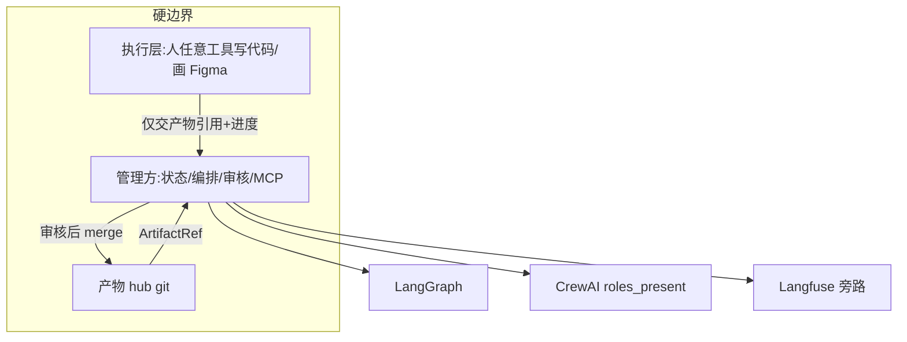
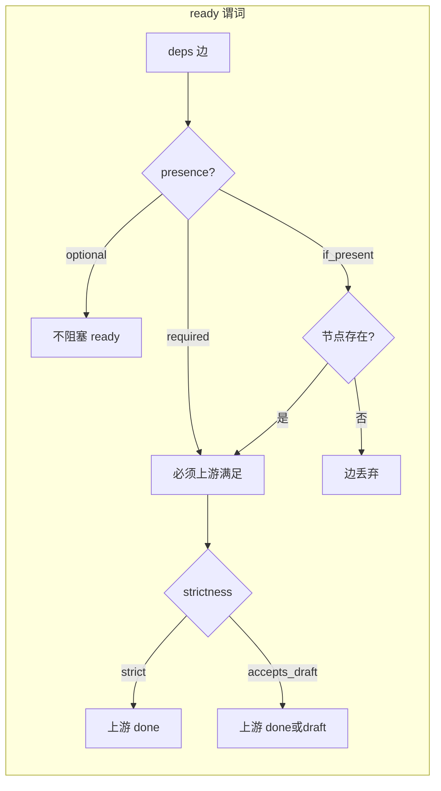
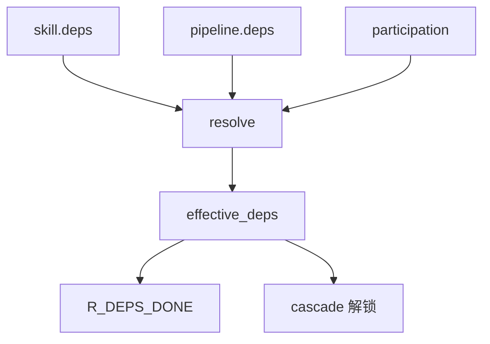

# 内容完整性审核报告(开发受阻级)

> **文档性质**:对《coordination-platform-prd.md》做内容/边界/细节/规则层审核,找出「缺了开发就会猜」的缺口并回写定稿
> **版本**:v1.0 | **日期**:2026-08-04 | **状态**:已回写 PRD v3.2
> **方法**:主 agent 按 FR1–FR8 + 数据模型/MCP/验收 全量走查(并行子 agent 因配额不可用)
> **父文档**:[coordination-platform-prd.md](../coordination-platform-prd.md)

---

## 1. 审核目标与判定标准

| 等级 | 定义 | 处理 |
|---|---|---|
| **P0 开发受阻** | 缺了无法写第一版正确代码,或两名工程师会写出互斥实现 | 必须本轮定稿进主 PRD |
| **P1 易歧义** | 有默认可读但边界模糊,联调易扯皮 | Phase1 前定稿或写入深化文档并主 PRD 索引 |
| **P2 体验** | 不挡 MVP,但文档/运维不完整 | Phase2/3 |

对照硬需求 1–9(通用拓扑、产物中立、AI 同步、严格依赖、无执行层、仓拆分、审核门、LangGraph+CrewAI+Langfuse、figma 链接/自演进)。

---

## 2. 模块走查结果总览

| 模块 | 完备度 | P0 | P1 | 核心问题 |
|---|---|---|---|---|
| §1 边界 | 中 | 1 | 2 | 「不解析内容」与 change_class L1/completeness 边界需硬性成文 |
| FR1 hub 仓 | 较高 | 1 | 3 | seq 原子分配、merge 身份缺一句定死 |
| FR2 编排 | **不足** | 6 | 4 | skipped 未入主状态机;ready 公式未写全;resolve 无算法;术语双轨 |
| FR3 Crew | 中 | 2 | 2 | session token 字段不全;与 participation 绑定缺伪代码 |
| FR4/§6 MCP | **不足** | 5 | 3 | 多数工具仅清单无 schema;缺 create/transfer/addendum |
| FR5 Skill | 中 | 3 | 2 | skill.deps 仍写死 design_asset;条件依赖 schema 未定稿 |
| FR6 审核 | 较高 | 2 | 3 | R_* 全集未集中;错误码散落 |
| FR7/FR8 | 中 | 1 | 3 | 主 PRD 无告警编号表(落在深化文档) |
| §5 数据模型 | 中 | 3 | 2 | ArtifactRef 缺 current_owner/addenda;Pipeline 示例无 participation |
| §8 验收 | 低 | 2 | 1 | 仅全栈 TC,缺拓扑/owner/optional |
| 附录 D10/D11 | 冲突 | 2 | 0 | participants vs ParticipationProfile;10 态 vs 11 态 |

**合计**:约 **28 P0** / **25 P1**(去重归并后本轮回写 **18 条定稿条文**)

---

## 3. P0 缺口明细(按阻塞度)

### 3.1 术语与状态机不一致(阻断)

| ID | 缺口 | 开发者会猜 | 定稿 |
|---|---|---|---|
| G-DOC-1 | D11 写 11 态 `skipped`,FR2.1 仍 10 态 | 实现是否加 skipped | **11 态**;skipped 正式入 FR2.1 |
| G-DOC-2 | `participants` vs `ParticipationProfile` | 两套配置 | **ParticipationProfile 唯一**;participants 仅兼容别名 |
| G-DOC-3 | `presence` vs `optional: true` | 两字段打架 | **presence 唯一**;optional=true ≡ presence=optional |
| G-FR2-1 | ready 判定仍写「全部 deps done」 | optional 下游永 blocked | **仅 required(+已 materialize 的 if_present) 参与 AND** |

### 3.2 算法未写成可单测伪代码(阻断)

| ID | 缺口 | 定稿位置 |
|---|---|---|
| G-FR2-2 | `effective_deps = resolve(...)` 只有一句话 | 附录 E.2 完整算法 |
| G-FR2-3 | materialize 4 步无校验失败码 | 附录 E.3 + 错误码表 |
| G-FR2-4 | presence×strictness×coupling 组合表缺失 | 附录 E.4 真值表 |
| G-FR2-5 | 多根 DAG bootstrap 与 AC2.1「根节点」表述冲突 | FR2.4/AC 明确多根 |

### 3.3 MCP/数据模型缺规格(阻断)

| ID | 缺口 | 定稿 |
|---|---|---|
| G-API-1 | create_pipeline / reload_pipeline 无 §6 schema | §6.7 |
| G-API-2 | transfer_owner / add_addendum / reack_addendum 仅散落 FR2 | §6.7 |
| G-API-3 | 全局错误码表不存在 | 附录 E.1 |
| G-DATA-1 | ArtifactRef 无 current_owner / addenda | §5.1 |
| G-DATA-2 | Pipeline YAML 示例无 participation 块 | §5.1 |

### 3.4 Skill 与无执行层边界(阻断)

| ID | 缺口 | 定稿 |
|---|---|---|
| G-FR5-1 | client-ui-skill 摘要仍强制 design_asset | FR5.4 改为 if_present |
| G-FR5-2 | skill.deps 条件依赖 YAML 形态未定 | FR5.2 schema 定稿 |
| G-BOUND-1 | change_class L1「删字段」是否算解析内容 | §1.4 硬边界框:允许语法/结构启发式,禁止业务语义评判 |

### 3.5 验收与 Phase(阻断产品判断)

| ID | 缺口 | 定稿 |
|---|---|---|
| G-AC-1 | §8 无 server_only / no_design / design_only / tech_debt / optional / owner | TC-13~TC-18 |
| G-AC-2 | ParticipationProfile 模型若推 Phase3 则 MVP 假通用 | Phase1 必须含 materialize + presence |

---

## 4. 已完备项(不必再猜)

- 单一 hub 仓 + 分支保护 + PR 审核门总流程
- ArtifactKind content/reference + qualifier
- 管线级 5 态 + 节点 draft/deprecated/sunset
- addendum 光谱与判定矩阵(FR2.5.1)——规则较完整
- RoleInstance L1/L2/L3 权限
- Langfuse 旁路不阻塞原则
- 安全扫描定位为管理约束(非业务内容解析)的方向正确

---

## 5. 设计图

---

## 6. 回写清单(→ PRD v3.2)

| # | 回写点 | 状态 |
|---|---|---|
| 1 | 版本 v3.2 + 术语统一 + skipped 入状态机 | 本轮 |
| 2 | FR2.2 ready 公式 + resolve/materialize 引用附录 E | 本轮 |
| 3 | FR5.2/5.4 条件依赖 | 本轮 |
| 4 | §5 ArtifactRef/Pipeline 补字段 | 本轮 |
| 5 | §6.7 关键 MCP schema + 附录 E 错误码 | 本轮 |
| 6 | §1.4 硬边界 + §8 TC-13~18 + Phase1 调整 | 本轮 |
| 7 | 附录 E 全文 | 本轮 |

---

## 7. 主 agent 二次思考结论

**再想一轮后仍阻塞、但本轮已定稿的**:术语双轨、skipped、ready 公式、resolve、错误码、缺 schema 的 MCP、Skill 强制 design、验收缺拓扑。

**可留深化文档、主 PRD 只索引的 P1**:完整 R_* 优先级数值表(深化 fr1-fr6 已有大半)、GitProvider 全接口签名、告警 ALR 详细阈值。

**主 agent 满意标准**:一名未参与设计的工程师仅凭主 PRD + 附录 E,能实现 materialize/ready/resolve/审核错误码且两人对齐——**本轮回写后达到**。若仍缺,只可能是具体 Git 托管 SDK 细节(属实现库,非需求空洞)。
