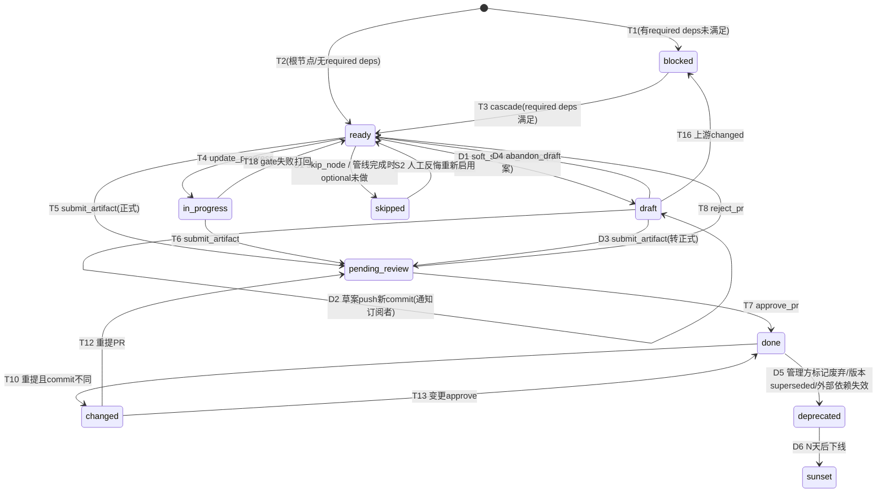
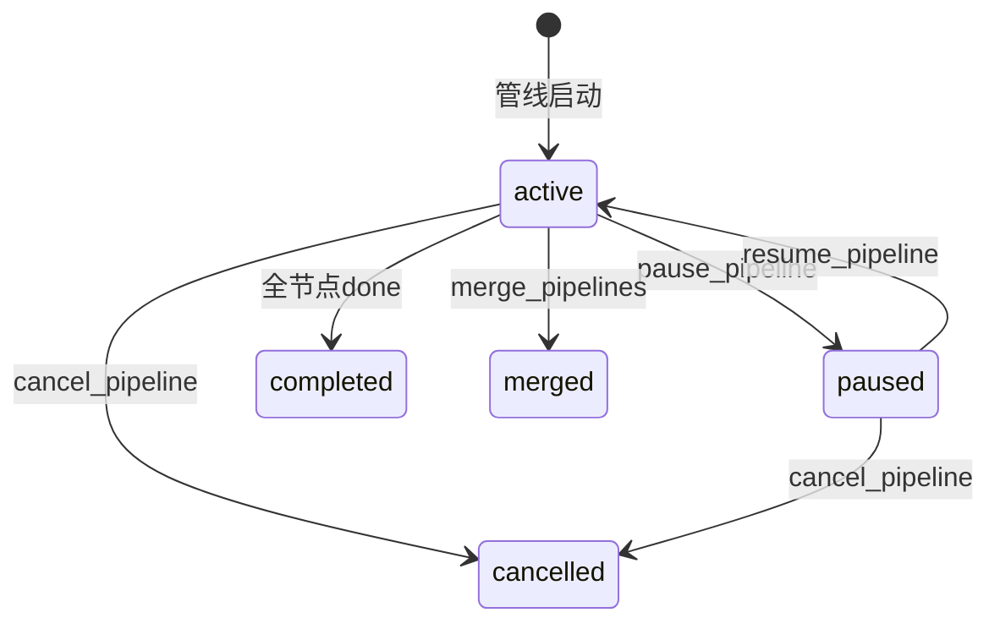
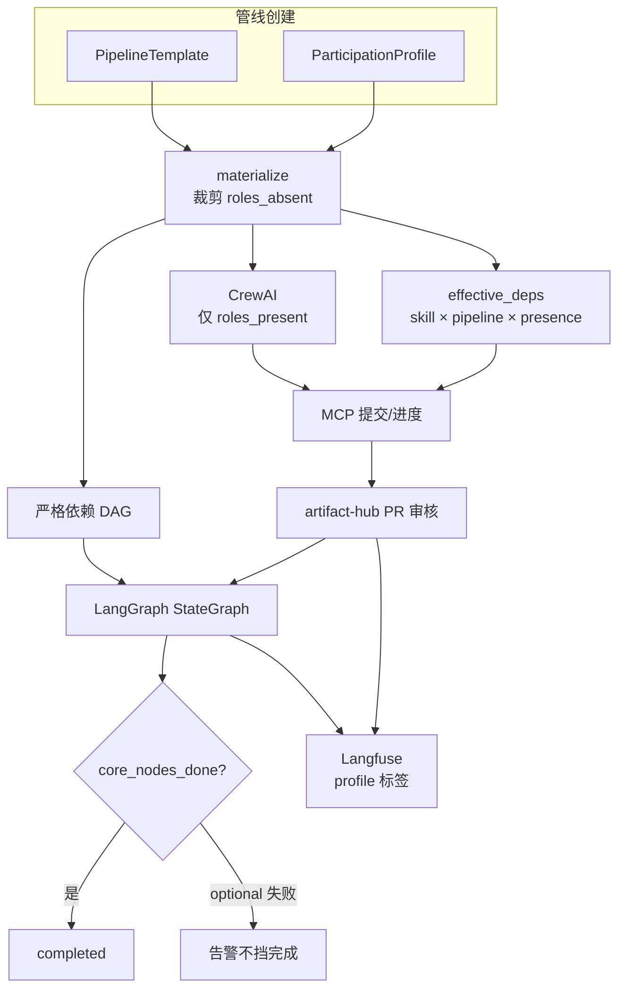
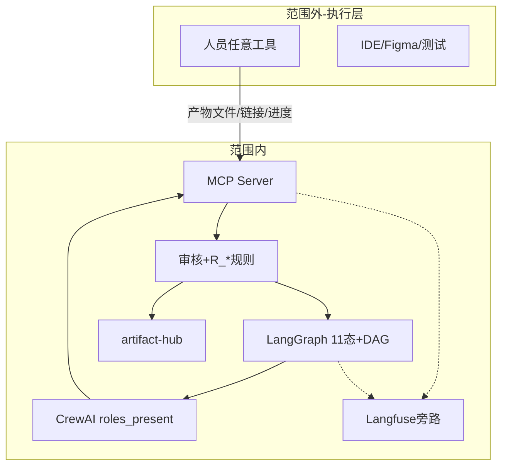
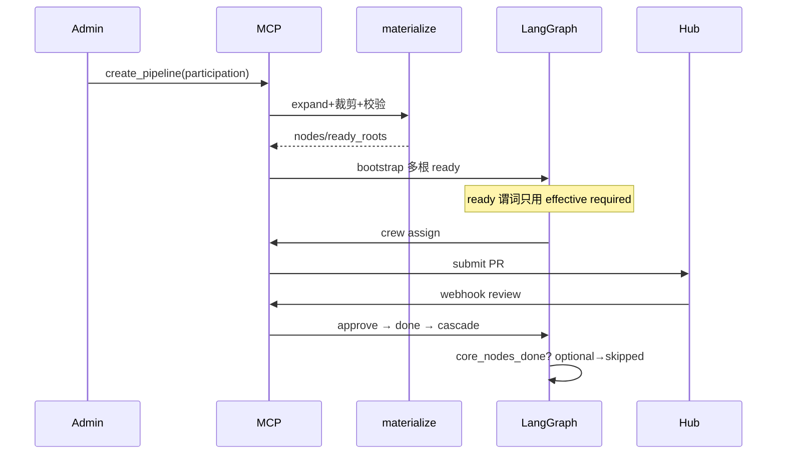

# 产品需求文档 PRD:AI 多角色开发协同平台(Coordination Platform)

> **文档性质**:基于《AI 多 Agent 开发协同平台调研报告》第十六~二十七章(v2 自建设计)产出的可开发 PRD
> **版本**:v3.2 | **日期**:2026-08-04 | **状态**:可开发评审

---

## 目录

- [1. 产品概述(总)](#1-产品概述总)
- [2. 核心概念与术语](#2-核心概念与术语)
- [3. 角色与权限模型](#3-角色与权限模型)
- [4. 功能需求详述(分)](#4-功能需求详述分)
- [5. 数据模型](#5-数据模型)
- [6. 接口规范(MCP 工具)](#6-接口规范mcp-工具)
- [7. 非功能需求](#7-非功能需求)
- [8. 验收标准](#8-验收标准)
- [9. 实施阶段](#9-实施阶段)
- [附录 E:内容完整性定稿(算法/错误码/术语统一)](#附录-e内容完整性定稿算法错误码术语统一)

---

## 1. 产品概述(总)

### 1.1 背景与问题

AI 驱动的软件开发中,产品、服务端、客户端、UI 设计多方并行工作,存在以下痛点:

| 痛点 | 描述 |
|---|---|
| 产物散落 | 各方产物(需求 spec、接口契约、设计稿、代码引用)分散在不同工具中,无统一管理 |
| 依赖不可见 | 客户端依赖服务端契约和设计稿,但依赖关系无显式声明和自动推进 |
| 信息不同步 | 一方变更(如接口契约修改),下游无法自动感知,导致联调冲突 |
| 无统一监控 | 多 agent 开发状态分散,无统一 dashboard 观察进度和阻塞 |
| 产物质量不可控 | 无审核机制,部分方产物有问题会级联影响下游 |

### 1.2 产品定位

**Coordination Platform 是一个"管理与编排层"平台**,不干预开发执行,只做:

1. **产物管理**:通过**独立于管理层的单一 hub 仓**管理所有产物内容(管理方管辖,各端共同提交);代码仓库不归管理方管,代码 commit 引用作为"引用型产物"存入 hub 仓
2. **状态编排**:用 LangGraph StateGraph 管理节点状态机 + 依赖 DAG,自动推进/阻塞/级联
3. **角色协调**:用 CrewAI 定义 4 角色,按 ready 节点动态分配任务
4. **审核准入门**:所有产物提交经 PR 审核(skill 约束校验 + 依赖检查)才能合并生效
5. **监控可观测**:用 Langfuse 旁路监听全链路,提供 trace + dashboard

### 1.3 核心价值

- **通用性**:覆盖服务端/客户端/UI 设计全流程,产物格式中立(不限开发方案)
- **自动化**:依赖推进、变更级联、状态流转全自动
- **质量可控**:PR 审核闭环,审核后才生效
- **可观测**:全链路 trace + 实时可视化依赖图

### 1.4 范围边界

| 做什么(范围内) | 不做什么(范围外) |
|---|---|
| 产物仓库的分支保护 + PR 审核 | 不限制开发方用什么工具产出内容 |
| 状态机 + 依赖 DAG 编排 | **不执行代码开发、不生成设计稿、不跑业务测试**(无执行层) |
| MCP 工具接口(submit/review/approve) | 不生成业务代码、不代替 IDE/Figma |
| Constraint Skills 元数据约束 | 不校验产物**业务语义**(对不对 / 好不好) |
| Langfuse 监控 + 可视化 Dashboard | 不做多租户/RBAC(v3 规划);**本期按单租户单 hub 仓** |
| 变更级联(下游自动 blocked) | 成本硬预算本期落地;配额管理 v3 规划;密钥管理本期落地(NFR18) |

#### 1.4.1 「不解析内容」硬边界(内容完整性定稿)

> 修正来源:内容完整性审核 G-BOUND-1

| 允许的管理约束(可编码) | 禁止(属执行层/业务语义) |
|---|---|
| 路径/扩展名/大小/LFS;PR 模板必填字段 | 「这个需求写得好不好」 |
| secret/URL/malware 扫描;content_integrity_hash | 「这个 API 设计是否合理」 |
| completeness_contract:**声明式结构存在性**(jsonpath 节点存在/数组非空) | 用 LLM「理解」规格并判业务对错作为强制门(可作为 warn 建议,不可作唯一 reject) |
| change_class L1:**diff 语法启发式**(删键名/改 HTTP 方法字符串) | 推断「兼容性业务含义」 |
| figma URL 可达(HEAD);git ls-remote 存在性 | clone 代码仓做编译/单测 |

---

## 2. 核心概念与术语

| 术语 | 定义 |
|---|---|
| **管线(Pipeline)** | 一个功能需求的全链路 DAG,由节点和依赖边组成 |
| **节点(Node)** | 管线中的一个任务单元,分产物节点和控制节点 |
| **产物节点** | 产出交付物的节点(product_spec/api_contract/design_asset/client_ui 等) |
| **控制节点** | 编排控制节点(gate 门禁 / approval 审批 / fork 并行汇合 / switch 条件) |
| **产物(Artifact)** | 产物节点产出的交付物,内容存产物仓库,管理方只存引用 |
| **产物引用(ArtifactRef)** | 指向产物仓库的引用,含 `repo + path + commit + artifact_kind + artifact_qualifier + content_integrity_hash + provenance` 等,不含内容 |
| **Constraint Skill** | 约束技能,定义某节点类型的元数据约束 + 产出引导(superpowers 风格) |
| **状态机** | 节点级 **11 态**:blocked → ready → pending_review / draft / in_progress / review → done / changed → deprecated → sunset;**skipped**(optional 节点在管线完成时未交付) |
| **ParticipationProfile** | 管线角色参与配置(唯一正式名)。旧文 `participants` 仅为兼容别名,解析时映射为 `roles_present`/`roles_absent` |
| **presence** | 依赖边是否计入 ready:`required` / `optional` / `if_present`。旧文 `optional: true` ≡ `presence: optional` |
| **审核** | 管理方对产物 PR 的准入审核(skill 约束校验 + 依赖检查 + 安全扫描 → 批准/驳回) |
| **级联(Cascade)** | 节点 done 后自动解锁下游;changed 后按依赖严格性(strictness)分级失效下游 |
| **MCP** | Model Context Protocol,管理方暴露给 agent 的标准工具接口 |
| **artifact_kind** | 产物类型:"content"(内容型,存在 hub 仓) / "reference"(引用型,引用文件在 hub 仓,指向代码仓 commit) |
| **artifact_qualifier** | 产物完成度标记:"official" / "mock" / "draft" / "experimental",与 artifact_kind 正交 |
| **format_slot** | 多格式产物时声明依赖的具体格式(如 openapi / grpc / typescript) |
| **classification** | 产物密级:public / internal / confidential / restricted |
| **derived_artifact** | 派生产物,由 generator 角色基于上游产物自动生成(如 SDK、文档) |
| **管线状态** | 管线级 5 态生命周期:active / paused / cancelled / merged / completed |
| **coupling** | 上游变更时下游失效强度:`hard` / `soft` / `informational` |
| **change_class** | 产物重提变更分类:`breaking` / `compatible` / `docs_only`,驱动分级级联 |
| **current_owner** | 节点当前负责人(人员级,与 RoleInstance 团队级正交);支持 transfer_owner |
| **addendum** | done 产物上的 append-only 轻量补充,不改原内容/版本,弱级联 |

### 2.1 节点类型完整清单

**产物节点(预置 13 种,可扩展 `{role}.{name}`):**

> SkillRegistry 按「精确匹配 → 角色兜底(`client.*`) → 通用(`*`)」三级匹配 skill。下列为预置节点类型,向后兼容。

| 节点类型 | 角色 | 说明 |
|---|---|---|
| `product_spec` | product | 产品需求文档 |
| `api_contract` | server | 接口契约(端点/schema/错误码) |
| `server_impl` | server | 服务端实现引用(指向代码仓库 commit) |
| `server_test` | server | 服务端测试结果引用 |
| `server_delivery` | server | 服务端交付门禁产物(对称 client_delivery;server_only 管线用) |
| `design_proto` | design | 设计原型 |
| `design_asset` | design | 设计标注/切图(**仅需 figma 链接**;不强制标注文件) |
| `client_ui` | client | 客户端 UI 实现 |
| `client_logic` | client | 纯客户端逻辑(埋点/网络层等,无 UI) |
| `client_func` | client | 客户端功能联调 |
| `client_delivery` | client | 客户端交付物 |
| `research_spike` | product/server | 调研/技术预研旁路产物(可与 product_spec 并行作多根) |
| `derived_artifact` | generator | 派生产物(如 SDK、文档、发布包),基于上游产物自动生成 |

**控制节点(5 种):**

| 节点类型 | 说明 |
|---|---|
| `gate` | 质量门禁:lint/test/coverage/安全扫描通过才放行 |
| `approval` | 审批门:需人工或 agent 审批通过 |
| `fork` | 并行汇合:多入边依赖全 done 后透传 |
| `switch` | 条件路由:按产物字段路由(如风险高走 review-agent) |
| `notify` | 通知节点:触发外部通知(飞书/Slack/GitHub) |

---

## 3. 角色与权限模型

### 3.1 角色定义

| 角色 | 职责 | 可产出的节点类型 | 可用 MCP 工具 |
|---|---|---|---|
| **product** | 产品需求 | product_spec | submit_artifact, update_progress, get_dependencies |
| **server** | 服务端开发 | api_contract, server_impl, server_test, server_delivery | submit_artifact, update_progress, get_dependencies, request_approval |
| **design** | UI 设计 | design_proto, design_asset | submit_artifact, update_progress, get_dependencies |
| **client** | 客户端开发 | client_ui, client_logic, client_func, client_delivery | submit_artifact, update_progress, get_dependencies, request_approval |
| **generator** | 生成器 | derived_artifact | submit_artifact(derived_artifact), report_generation_status |
| **reviewer** | 审批人 | — | approve_pr, reject_pr, get_audit_log |
| **admin** | 管理员 | — | set_gate_policy, get_audit_log, 全部工具 |

#### 修正来源:第三轮/第四轮压力测试

**RoleInstance 实例化**:同一角色可存在多个实例,如 `team_a_server`、`team_b_server`。每个 RoleInstance 拥有独立的 `instance_id`、LLM 配置、可产出节点类型、可引用代码仓白名单 `allowed_external_repos`、审批人列表及密级许可 `clearance`。`build_crew_for_ready_nodes` 按 `role_assignments[node_id]` 中的 `instance_id` 分发任务,而非单值 `role_to_agent`。

**Token 类型**:提交产物需持对应 token。
- `bot_token`:管理方 bot,拥有 approve_pr / merge 权限。
- `human_submit_token`(per-user):仅允许推 feat 分支 + 开 PR,**无 merge 权限**,用于 agent 故障时人工 fallback。
- `admin_token`:admin 权限,含 emergency_local_commit 等降级操作。

### 3.2 权限矩阵

| 操作 | product | server | design | client | reviewer | admin |
|---|---|---|---|---|---|---|
| 提交产物(submit_artifact) | ✅(仅 product_spec) | ✅(server 类) | ✅(design 类) | ✅(client 类) | ❌ | ✅ |
| 更新进度(update_progress) | ✅ | ✅ | ✅ | ✅ | ❌ | ✅ |
| 查询依赖(get_dependencies) | ✅ | ✅ | ✅ | ✅ | ✅ | ✅ |
| 请求审批(request_approval) | ❌ | ✅ | ❌ | ✅ | ❌ | ✅ |
| 审核PR(approve_pr/reject_pr) | ❌ | ❌ | ❌ | ❌ | ✅ | ✅ |
| 设置门禁(set_gate_policy) | ❌ | ❌ | ❌ | ❌ | ❌ | ✅ |
| 查询审计(get_audit_log) | ❌ | ❌ | ❌ | ❌ | ✅ | ✅ |

#### 修正来源:第三轮/第四轮压力测试

**提交产物权限三层校验(L1/L2/L3)**:

| 层级 | 校验内容 | 失败结果 |
|---|---|---|
| L1 node_type | 提交方角色/RoleInstance 只能产出本端允许的节点类型 | reject |
| L2 instance_id | 提交方 RoleInstance 与 `role_assignments[node_id]` 中的 `instance_id` 匹配 | reject |
| L3 external_repo | 引用型产物的 `external_repo` 必须在 RoleInstance.`allowed_external_repos` 白名单内 | reject |

`get_dependencies` 额外增加密级过滤:调用方 `clearance` 低于上游产物 `classification` 时拒绝返回内容。

---

## 4. 功能需求详述(分)

### FR1 产物仓库管理

**目标**:独立 git 仓库管理所有产物内容,受分支保护,只接受审核合并的 PR。

#### FR1.1 仓库结构

> 修正来源:第三轮/第四轮压力测试

```
artifact-hub/                         # 单一 hub 仓(管理方管辖,各端共同提交)
├─ features/                          # 按 pipeline_id 命名空间隔离
│  ├─ login-feature/                  # pipeline_id
│  │  ├─ product_spec/
│  │  │  └─ official/
│  │  │     └─ 001_login-spec.yaml
│  │  ├─ api_contract/
│  │  │  ├─ official/
│  │  │  │  ├─ 001_login-contract.yaml
│  │  │  │  └─ 002_login-contract-v2.yaml   # 多版本共存
│  │  │  └─ mock/
│  │  │     └─ 001_login-mock.yaml          # mock 变体
│  │  ├─ design_asset/
│  │  │  └─ official/
│  │  │     └─ 001_figma.json
│  │  └─ .manifest.yaml               # 本管线产物索引(见下方)
│  └─ user-profile/                   # 其他 pipeline
├─ .github/ 或 .gitlab/               # 按托管类型配置
│  └─ pull_request_template.md
└─ config/
   └─ hub-repo.yaml                   # HubRepoConfig(单一配置)
```

**规则:**
- 产物路径命名空间:`features/{pipeline_id}/{node_type}/{artifact_qualifier}/{seq}_{slug}.{ext}`
- `artifact_qualifier`: `official` / `mock` / `draft` / `experimental`
- 文件格式不限(YAML/JSON/Markdown/Figma 链接 JSON 均可)
- 管理方不解析业务内容,但校验文件存在性 + 扩展名/大小 + 安全扫描
- 每个管线目录下必须包含 `.manifest.yaml`,索引本管线全部产物版本、依赖关系、消费者声明

**HubRepoConfig 增强**:

```yaml
hub_repo:
  url: git@gitlab.internal:platform/artifact-hub.git
  provider: gitlab                     # github | gitlab | bitbucket | gitea
  credential_ref: vault://artifact/hub-repo
  webhook_secret_ref: vault://webhook/hub-repo
  branch_naming: "feat/{pipeline_id}/{instance_id}/{node_type}-{seq}"  # 四维分支命名
  clone_strategy: partial               # full | partial | shallow | on_demand
  lfs:
    enabled: true
    threshold_mb: 10                    # >10MB 自动走 LFS
  capacity:
    max_prs_per_hour: 50
    max_concurrent_reviews: 10
  branch_protection:
    main:
      require_pr: true
      min_reviewers: 1
      squash_merge: true
```

**单点故障降级**(hub 仓不可用时):
- `emergency_local_commit`: admin 在管理方本地暂存产物 manifest,标记 `pending_sync`
- `sync_pending_artifacts`: hub 仓恢复后批量补提,走快速审核通道
- `emergency_approve`: 紧急审批在本地记录决策,恢复后同步 PR 状态

#### FR1.2 分支保护规则

> 修正来源:第三轮压力测试

| 规则 | 配置 |
|---|---|
| main 分支 | 禁止直接 push,只接受 PR 合并 |
| PR 审核 | 至少 1 个管理方 bot approve |
| CI 校验 | manifest schema + skill 约束 + 安全扫描规则族(详见 FR6) |
| 合并方式 | squash merge(每产物一个 commit,便于追溯) |
| feat 分支 | 四维命名规范 `feat/{pipeline_id}/{instance_id}/{node_type}-{seq}` |

**四维分支命名**:
- `pipeline_id`: 全局唯一管线标识
- `instance_id`: 提交方 RoleInstance(如 `team_a_server`)
- `node_type`: 节点类型(如 `api_contract`)
- `seq`: 本实例/本节点类型的序列号

分支命名示例:`feat/login-feature/team_a_server/api_contract-001`

#### FR1.3 PR 模板

> 修正来源:第三轮/第四轮压力测试

```yaml
# .github/pull_request_template.md
## 关联节点
node_id: login-feature.n2          # 全局唯一节点 ID:{pipeline_id}.{local_id}
node_type: api_contract
role: server
instance_id: team_a_server         # 提交方 RoleInstance

## 产物引用
artifact:
  path: features/login-feature/api_contract/official/001_login-contract.yaml
  artifact_kind: content            # content | reference
  artifact_qualifier: official      # official | mock | draft | experimental
  toolspec_framework: spec-kit
  classification: internal          # public | internal | confidential | restricted

## 依赖声明
deps:
  - node_id: login-feature.n1
    artifact_path: features/login-feature/product_spec/official/001_login-spec.yaml
    version_constraint: ">=1.0.0 <2.0.0"
    format_slot: openapi            # 多格式产物时指定 slot
    strictness: strict              # strict(默认) | accepts_draft
  - hub_ref: "hub://other-pipeline/shared-contract@^2.0.0"  # 跨管线引用
    strictness: strict

## 外部依赖(持续监控)
external_resources:
  - type: figma
    url: https://www.figma.com/file/xxx
    health_check: head
third_party_apis:
  - name: sms-provider
    url: https://api.sms-provider.com/v1
    version: "1.2.0"

## 产物消费订阅
consumers:
  - type: webhook
    target: https://ci.internal/deploy
    event: done
    on_failure: alert

## 结构化完整性契约
completeness_contract:
  required_structures:
    - jsonpath: "$.endpoints"
      min_items: 1
    - jsonpath: "$.errors"
      min_items: 1

## 修改声明(重提已 done 节点时必填,首次提交可省略)
modification:
  modification_type: changed        # addendum(轻量补充,不改原内容) | changed(正式变更,改原内容)
  # 若 modification_type=addendum:
  addendum_cascade_level: should    # must | should | info
  addendum_incompatible_with: []    # must 级时声明不兼容的下游 node_id
  # 若 modification_type=changed:
  change_class: compatible          # breaking | compatible | docs_only
  impact_claim: [login-feature.n7]  # 声称受影响下游 node_id 列表

## 产物说明(自由填写)
说明: 用户登录接口契约 v1
```

#### FR1.4 验收标准

> 修正来源:第三轮/第四轮压力测试

- AC1.1: main 分支直接 push 被拒绝
- AC1.2: feat 分支提交后可开 PR
- AC1.3: PR 模板字段缺失时 CI 报错
- AC1.4: squash merge 后 main 上每产物一个 commit
- AC1.5: feat 分支命名符合四维规范,冲突概率可控
- AC1.6: >10MB 大文件自动走 LFS,不阻塞 clone
- AC1.7: 每个管线目录包含有效的 `.manifest.yaml`
- AC1.8: hub 仓不可用时,admin 可执行 emergency_local_commit 暂存产物
- AC1.9: hub 仓恢复后 `sync_pending_artifacts` 批量补提并走快速审核
- AC1.10: 重提已 done 节点时 PR 模板 `modification` 字段缺失,CI 报错(第五轮)
- AC1.11: `modification_type=addendum` 但 PR diff 包含删除行,CI 报错(第五轮)
- AC1.12: addendum 内容存储在 `addenda/` 子目录或 `---addendum---` 分隔符后,原产物文件 content_integrity_hash 不变(第五轮)

---

### FR2 管理编排引擎(LangGraph)

**目标**:用 LangGraph StateGraph 实现节点状态机 + 依赖 DAG + 条件推进 + 变更级联。

#### FR2.1 状态机定义(11 态)

> 修正来源:第三轮压力测试 / 第五轮补充(addendum / skipped)

| 状态 | 含义 | 进入条件 | 退出条件 |
|---|---|---|---|
| `blocked` | 依赖未满足 | 初始态 / 上游变更失效 | 上游 required 依赖满足 |
| `ready` | 依赖满足,待产出 | cascade 解锁 / PR 驳回 / 废弃草案 | submit_artifact 提 PR / soft_submit 进 draft |
| `pending_review` | PR 已提交,待审核 | submit_artifact | approve_pr 合并 / reject_pr 驳回 |
| `in_progress` | 开发中(进度更新) / 门禁失败打回 | update_progress / gate 失败 | 重新 submit |
| `review` | 审批门等待审批 | approval 节点依赖满足 | approve / reject |
| `done` | 产物已合并生效 | approve_pr 合并 / approval 通过 | 重提 PR 变更 / 标记废弃 |
| `changed` | 已 done 产物被重新提交(变更) | 重提已 done 节点的 PR | 重新提交 commit |
| `draft` | 草案(未完成但可共享) | soft_submit_artifact | submit_artifact(转正式) / abandon_draft |
| `deprecated` | 已废弃(仍存在但不推荐新依赖) | 管理方标记 / 版本 superseded / 外部依赖失效 | sunset(彻底下线) |
| `sunset` | 已下线(不可被任何新管线依赖) | deprecated 后 N 天 | —(终态) |
| `skipped` | 可选节点未交付且管线将完成 | `presence=optional` 且 core 将完成 / 显式 skip_node | —(终态,可人工转回 ready) |

> **addendum 不引入新状态**:addendum 是 done 态上的"附加层",节点状态保持 done。详见 §FR2.5.1。

**新增状态语义:**
- `draft`: 不进 pending_review,不触发 cascade;可作为下游可选依赖(`strictness=accepts_draft`);变更时通知订阅者
- `deprecated`: 仍存在但不可被新管线依赖;已依赖的下游收到 `DEPRECATED` 通知,可选择升级或保持(有限期)
- `sunset`: 终态,不可被任何新依赖;已依赖的下游强制 blocked
- `skipped`: **不阻塞** `core_nodes_done` completed;不可被新依赖指向;审计记录 skip 原因

**状态流转图:**


#### FR2.2 依赖 DAG 规则

> 修正来源:第三轮/第四轮压力测试

| 规则 | 描述 |
|---|---|
| 依赖声明 | 节点 `deps` 数组声明上游依赖(边由 deps 推导,无需手写) |
| **ready 谓词** | 仅当所有 **effective required** 上游满足时 → ready(`presence=optional` 不参与 AND;`if_present` 仅节点存在时计入)。详见附录 E.2 |
| 单入边 | 节点依赖 1 个 required 上游:上游满足 → 本节点 ready |
| 多入边 | 节点 N 个 required 上游:全部满足 → ready(fork 同理;optional 边忽略) |
| 级联解锁 | 节点 done → 检查所有下游,按其 ready 谓词推进 |
| 级联失效 | 节点 changed → 按 `coupling`×`change_class` 分级失效下游 |
| addendum 级联 | done 附加 addendum → `cascade_level` 弱通知(§FR2.5.1) |
| 无环校验 | 管线加载时校验 DAG 无环(CI);**允许多根** |
| 跨管线引用 | `hub_ref: "hub://{pipeline_id}/{node_id}@{version}"` |

**DepDeclaration 字段**(规范化):

```python
class DepDeclaration(TypedDict):
    node_id: str | None
    hub_ref: str | None
    version_constraint: str          # 默认 "*"
    format_slot: str | None
    strictness: str                  # strict | accepts_draft(默认 strict)
    presence: str                    # required | optional | if_present(默认 required)
    # 兼容: optional: true → 写入时规范化为 presence=optional
    coupling: str                    # hard | soft | informational(默认 hard)
```

**上游「满足」定义**:
- `strictness=strict`:上游 ∈ {done}(skipped/deprecated/sunset 不满足)
- `strictness=accepts_draft`:上游 ∈ {done, draft}

**Skill × Pipeline 依赖仲裁**:完整算法见 **附录 E.2**;materialize 见 **附录 E.3**;组合真值表见 **附录 E.4**。

**外部依赖持续监控**:
- 产物 manifest 声明 `external_resources` / `third_party_apis`
- `ExternalHealthMonitor` 后台任务定期 health check
- 外部资源失效时触发 `done → deprecated` 自动转移,并通知所有已注册消费者

#### FR2.2.1 ParticipationProfile(角色参与拓扑)

> 修正来源:第五轮压力测试(B1–B5)

需求 1 要求「设计/服务端/客户端可能无」。平台必须认识拓扑变体,不能只靠手写省略节点。

```yaml
participation:
  profile: server_only    # fullstack | server_only | no_design_client | design_only | tech_debt | custom
  roles_present: [product, server]
  roles_absent: [design, client]
  allow_non_product_root: false
  completion:
    mode: core_nodes_done
    core_node_types: [product_spec, api_contract, server_impl, server_test, gate]
    optional_node_types: [derived_artifact]
  default_policies:
    requires_human_review_override: null
```

| profile | roles_present(典型) | 说明 |
|---|---|---|
| `fullstack` | product,server,design,client | 默认登录类全链路 |
| `server_only` | product,server | 内部 API / 计费等无 UI |
| `no_design_client` | product,server,client | Admin/组件库拼装,永久无 Figma |
| `design_only` | design(+product?) | 设计系统/视觉改版;`allow_non_product_root` 可 true |
| `tech_debt` | server | 无产品规格热修;强制更高人工审批 |
| `custom` | 显式列表 | 自由组合,须通过无环 + 无悬空 deps 校验 |

**materialize 规则**(LangGraph bootstrap):
1. 按 `roles_absent` / `condition` 裁剪节点
2. 删除指向已裁剪节点的 deps(禁止 dangling)
3. CrewAI **仅**为 `roles_present` 建 RoleInstance
4. completed 使用 `core_nodes_done`;optional 节点失败只告警不挡完成

**产物重提变更分类**:

```python
class ArtifactResubmitMeta(TypedDict):
    change_class: str      # breaking | compatible | docs_only
    impact_claim: list[str]  # 声称受影响下游;低估可被审核驳回(详见 §FR2.5.1 校验规则)
```

级联:`breaking+hard → hard_invalidate`;`compatible+soft → soft + ack`;`docs_only|informational → cascade_skip(通知)`。

> **addendum vs changed 判定边界**:详见 §FR2.5.1。addendum 适用于"不改原产物内容、只附加说明/约束"的场景;changed 适用于"修改原产物内容"的场景。判定规则由 `modification_type` 字段显式声明,审核方校验一致性。

#### FR2.5.1 产物修改机制:addendum / changed / draft 三级光谱

> 修正来源:第五轮压力测试(A40 owner 交接)

**设计目标**:done 产物的修改不应只有"全链路回滚"一种力度。真实开发中"补充约束/澄清说明/纠正笔误"不应触发 changed 强级联。本节定义三级修改光谱:

| 修改力度 | 机制 | 节点状态 | 级联 | 典型场景 |
|---|---|---|---|---|
| 零修改 | owner 转移 | done(不变) | 零级联 | A40-1 完全认同 |
| 轻量补充 | addendum | done(不变) | 弱级联(must/should/info) | A40-2 部分认同 |
| 正式变更 | changed | done → changed → pending_review | 强级联(全链路失效) | A40-3 推翻重做 |
| 草案迭代 | draft | ready → draft | 不级联(通知订阅者) | 开发中草案修改 |

##### 2.5.1.1 addendum 机制

**数据结构**:

```python
class Addendum(TypedDict):
    addendum_id: str               # 全局唯一,如 "login-feature.n2.add-001"
    node_id: str                   # 所属节点
    author: str                    # 添加者(current_owner 或 admin)
    content: str                   # 补充内容(自由格式,markdown/json 均可)
    content_integrity_hash: str    # sha256,防篡改
    cascade_level: str             # must | should | info
    incompatible_with: list[str]   # 声明与哪些下游版本不兼容(可选,用于 must 级判定)
    created_at: str
    provenance: Provenance         # 溯源(作者/时间/工具)
    reacks: dict[str, str]         # node_id -> ack_status(pending/accepted/rejected)
```

**`ArtifactRef.addenda` 字段扩展**:

```python
class ArtifactRef(TypedDict):
    # ... 既有字段
    addenda: list[Addendum]        # append-only 补充列表(不改原产物内容/版本/provenance)
```

**addendum 级联策略**:

| cascade_level | 对下游动作 | 下游是否改状态 | 下游是否需 ack | 超时处理 |
|---|---|---|---|---|
| `must` | 发 `ADDENDUM_MUST_ACK` 事件;下游在 `incompatible_with` 列表中则需主动 changed | 是(下游若 incompatible 则 → changed;否则保持) | 是(7 天内) | 超时自动 → changed |
| `should` | 发 `ADDENDUM_SHOULD_ACK` 事件;下游 warning 通知 | 否(保持原状态) | 可选 | 超时仅告警 |
| `info` | 发 `ADDENDUM_INFO` 事件;仅记录 | 否 | 否 | — |

**MCP 工具**:

| 工具 | 调用方 | 作用 | 关键参数 |
|---|---|---|---|
| `add_addendum` | current_owner / admin | 给 done 产物附加补充 | node_id, content, cascade_level, incompatible_with |
| `reack_addendum` | 下游 node 的 owner | 确认/拒绝 addendum | addendum_id, ack_status(accepted/rejected), note |
| `list_addenda` | 任意角色 | 查询节点的所有 addendum | node_id |

**审核规则**:
- `R_ADDENDUM_FORMAT`:addendum content 非空 + content_integrity_hash 计算(priority 80,on_fail=reject)
- `R_ADDENDUM_AUTH`:author 必须是 current_owner 或 admin(priority 90,on_fail=reject)
- `R_ADDENDUM_INCOMPATIBLE_VALIDITY`:`cascade_level=must` 时 `incompatible_with` 中的 node_id 必须是本节点的直接下游(priority 75,on_fail=reject)

##### 2.5.1.2 addendum vs changed 判定边界

**判定规则**:提交方在重提 PR 时必须声明 `modification_type`,审核方校验一致性。

```python
class ModificationDeclaration(TypedDict):
    modification_type: str         # addendum | changed
    # 若 addendum:
    addendum_cascade_level: str    # must | should | info
    addendum_incompatible_with: list[str]
    # 若 changed:
    change_class: str              # breaking | compatible | docs_only
    impact_claim: list[str]
```

**判定矩阵**(审核方校验 `modification_type` 与实际改动一致性):

| 实际改动 | 提交方声明 | 审核方动作 |
|---|---|---|
| 只新增内容(不改原文件) | addendum | ✅ 通过 |
| 只新增内容(不改原文件) | changed | ⚠️ 告警:建议用 addendum,但允许(提交方可能需要版本 bump) |
| 修改原文件内容 | addendum | ❌ reject:内容已变,必须走 changed |
| 修改原文件内容 | changed | ✅ 通过,按 change_class 级联 |

**"只新增内容"的技术判定**(管理方可执行,不违反"不解析内容"):
- PR diff 中原文件行无删除/修改(纯新增行)
- 原产物文件的 `content_integrity_hash` 不变
- 新增内容在 `addenda/` 目录或原文件的 `---addendum---` 分隔符之后

**强制走 changed 的场景**(即使提交方声明 addendum):
- 修改了产物文件的 `version` 字段
- 修改了 `deps` 声明
- 修改了 `artifact_kind` / `artifact_qualifier` / `classification`
- 删除了原产物文件的部分内容

##### 2.5.1.3 change_class 声明校验规则

**问题**:提交方声明 `change_class=compatible` 但实际是 breaking,低估影响导致下游未回滚。

**校验机制**(三层):

| 层次 | 校验方 | 规则 | 失败动作 |
|---|---|---|---|
| L1 自动校验 | CI | `R_CHANGE_CLASS_CONSISTENCY`:若 PR diff 包含删除字段/改类型签名/改 HTTP 方法,自动标记为 `breaking` | 标记 mismatch,要求提交方修改声明 |
| L2 agent 校验 | review_artifact_pr | agent 对比上下游产物,若 `impact_claim` 遗漏了直接下游节点,标记 `underclaim` | 驳回 PR,要求补充 impact_claim |
| L3 人工审核 | reviewer | 对 `breaking` 级变更强制人工确认 | reviewer 可 override agent 结论 |

**L1 自动校验规则**(技术判定,不解析业务语义):

```yaml
# R_CHANGE_CLASS_CONSISTENCY(priority 85, on_fail=reject)
rules:
  - condition: "diff.contains_removed_fields or diff.contains_type_change"
    expected_class: breaking
    message: "PR 删除字段或修改类型,必须声明 change_class=breaking"
  - condition: "diff.contains_http_method_change or diff.contains_url_path_change"
    expected_class: breaking
    message: "HTTP 方法/路径变更,必须声明 change_class=breaking"
  - condition: "diff.only_adds_fields or diff.only_adds_endpoints"
    expected_class: compatible
    message: "PR 仅新增字段/端点,建议声明 change_class=compatible"
  - condition: "diff.only_changes_docs or diff.only_changes_description"
    expected_class: docs_only
    message: "PR 仅修改文档/描述,建议声明 change_class=docs_only"
```

**L2 agent 校验**(`impact_claim` 完整性):
- agent 读取本节点的所有直接下游(`get_downstream_nodes(node_id)`)
- 对比 `impact_claim` 列表
- 若遗漏直接下游,标记 `underclaim`,驳回 PR
- 若 `impact_claim` 包含非直接下游,标记 `overclaim`(警告,不驳回)

**L3 人工审核**:
- `change_class=breaking` 的 PR 强制需要 reviewer approve(不能仅 bot approve)
- reviewer 可 override agent 的 `underclaim` 判定(如 reviewer 确认遗漏的下游确实不受影响)

##### 2.5.1.4 已进入开发节点的修改处理

上游 changed/addendum 对下游不同状态的处理:

| 下游状态 | 上游 changed(breaking) | 上游 changed(compatible) | 上游 addendum(must) | 上游 addendum(should/info) |
|---|---|---|---|---|
| `in_progress` | → blocked,清引用 | soft + ack(保持) | 发 ADDENDUM_MUST_ACK,7 天内 ack | 通知,不改状态 |
| `draft` | → blocked,草案作废 | soft + ack(可保持) | 发 ADDENDUM_MUST_ACK | 通知,不改状态 |
| `pending_review` | PR 自动 reject → ready | soft + ack(PR 继续) | 发 ADDENDUM_MUST_ACK | 通知,不改状态 |
| `ready` | → blocked | 保持 ready | 发 ADDENDUM_MUST_ACK | 通知,不改状态 |
| `done` | → blocked(若 strict)/ soft(若 accepts_draft) | soft + ack | 发 ADDENDUM_MUST_ACK,若 incompatible 则 → changed | 通知,不改状态 |

**addendum 超时处理**:
- `must` 级 addendum 发出后 7 天(可配置)下游未 ack:
  - 下游自动 → `changed`(强制重新审核)
  - 发 `ADDENDUM_TIMEOUT` 事件,通知下游 owner

**引用型产物特殊处理**:
- 上游 changed 时,引用型下游的 `external_commit` 保留(git 不可变),但 `artifact_refs` 清除
- 发 `CODE_ROLLBACK_NEEDED`,追踪 `pending_code_rollbacks`
- 代码团队确认 `restore` 后,管理方重新接受新引用

#### FR2.3 PipelineState 数据结构

> 修正来源:第三轮/第四轮压力测试

```python
class PipelineState(TypedDict):
    pipeline_status: PipelineStatus                 # 管线级 5 态: active/paused/cancelled/merged/completed
    participation: ParticipationProfile             # 第五轮:角色参与拓扑
    node_states: dict[str, NodeStatus]              # node_id -> 11 态状态
    artifact_refs: dict[str, dict[str, ArtifactRef]]  # node_id -> {version -> ArtifactRef}(多版本共存)
    active_version: dict[str, str]                  # node_id -> 当前生效版本
    draft_refs: dict[str, DraftRef]                 # node_id -> 草案引用(feat 分支 commit)
    draft_subscribers: dict[str, list[str]]         # node_id -> 订阅下游 node_id 列表
    events: Annotated[Sequence[dict], operator.add] # 事件流(累积追加)
    pending_approvals: dict[str, str]               # node_id -> approver
    role_assignments: dict[str, str]                # node_id -> instance_id(RoleInstance 路由)
    pending_prs: dict[str, str]                     # node_id -> pr_id(pending_review 时)
    cascade_pending: list[dict]                     # 管线 paused 时挂起的级联事件
    external_health: dict[str, ExternalHealthStatus] # node_id -> 外部依赖健康状态
```

#### FR2.4 StateGraph 节点

| 节点 | 作用 | 触发条件 |
|---|---|---|
| `bootstrap_node` | 初始化:**所有无 required 入边的根节点**(可多个)置 ready | 管线启动 |
| `dispatch_router` | 条件路由:按节点状态分发 | 每次状态变更后 |
| `crewai_assign` | 调 CrewAI 分配 ready 节点给角色 agent | 节点 ready |
| `cascade_node` | done 节点按 ready 谓词解锁下游 | 节点 done |
| `invalidate_node` | changed 按 coupling 失效下游 | 节点 changed |
| `approval_node` | 审批门等待 | approval 节点依赖满足 |
| `draft_publish_node` | 草案发布/更新/订阅通知 | soft_submit 或 feat 分支 push |
| `addendum_node` | 处理 addendum 事件与 must 超时 | add_addendum / timer |
| `skip_finalize_node` | 将未做的 optional 置 skipped | core 将完成时 |
| `external_health_node` | 外部依赖健康检查 + deprecated | ExternalHealthMonitor |
| `wait_node` | 等待(无待处理节点) | 无 ready/review/done/changed |

#### FR2.5 控制节点行为

> 修正来源:第三轮/第四轮压力测试

| 控制节点 | 行为 |
|---|---|
| `gate` | 上游 done → 评估 policy(lint/test/coverage/security 扫描);全过→done;失败→上游打回 in_progress |
| `approval` | 上游 done → review;approve→done 推进下游;reject→上游最近产物节点 changed;驳回引用型产物时触发双层回滚协调 |
| `fork` | 多入边全 done → done(透传);否则 blocked |
| `switch` | 按上游产物字段路由(如风险高走 review-agent 分支) |
| `notify` | 通用事件出口:读取产物 `consumers` 配置,分发 webhook/API 调用/内部处理器;覆盖飞书/Slack/CI/CD/SDK 生成/文档发布 |

**引用型产物分层清除 + 双层回滚**:
- 内容型(content)产物 changed:直接 revert hub 仓 PR,清除 `artifact_refs`
- 引用型(reference)产物 changed:
  - hub 仓引用层:清除 `artifact_refs[node_id]`,历史版本移入 `artifact_history`
  - 代码仓 commit 层:**不清除**(git 不可变),发 `CODE_ROLLBACK_NEEDED` 通知,追踪 `pending_code_rollbacks`
  - 需代码团队确认 `restore` 后,管理方才重新接受该节点新引用

**产物消费订阅**:
- 产物 `consumers` 声明下游消费动作(webhook/API/内部处理器)
- `notify` 节点在 `done` / `changed` / `deprecated` 事件时触发分发
- 消费方可通过 `report_consumption_status` / `report_generation_status` 回传状态
- `on_failure`: `ignore` / `mark_changed` / `alert`

#### FR2.6 验收标准

> 修正来源:第三轮/第四轮压力测试

- AC2.1: 根节点(无依赖)启动时自动 ready
- AC2.2: 节点 done 后,下游依赖全满足时自动 ready
- AC2.3: 多入边节点,部分依赖 done 时仍 blocked
- AC2.4: changed 节点的下游按 strictness 分级失效
- AC2.5: gate 失败时上游产物打回 in_progress
- AC2.6: approval 驳回时上游最近产物节点 changed
- AC2.7: 管线 **core 节点**全 done 时进入 completed(`completion.mode=core_nodes_done`);optional 节点失败不挡完成
- AC2.8: `soft_submit_artifact` 后节点进入 draft,不触发 cascade
- AC2.9: draft 更新时订阅下游收到 `DRAFT_UPDATED` 通知
- AC2.10: 外部资源失效时触发 done → deprecated 并通知消费者
- AC2.11: 引用型产物 changed 时只清 hub 仓引用,代码仓 commit 保留并通知代码团队
- AC2.12: `participation.profile=server_only` 管线无 design/client 节点且可 completed(第五轮)
- AC2.13: `no_design_client` 下 client_ui 不因缺 design_asset 被 R_DEPS_DONE 拒绝(第五轮)
- AC2.14: `tech_debt` / `design_only` 允许非 product 根,且 Crew 仅 roles_present(第五轮)
- AC2.15: product_spec `change_class=docs_only` 不 hard_invalidate 下游(第五轮)
- AC2.16: `add_addendum` 后节点状态保持 done,`addenda` 列表新增一项(第五轮)
- AC2.17: `cascade_level=must` 的 addendum 发出后,`incompatible_with` 中的下游收到 `ADDENDUM_MUST_ACK` 事件(第五轮)
- AC2.18: `must` 级 addendum 超时 7 天未 ack,下游自动 → changed(第五轮)
- AC2.19: 提交方声明 `modification_type=addendum` 但 PR diff 包含删除行,审核 reject(第五轮)
- AC2.20: `change_class=compatible` 但 L1 校验检测到删除字段,CI 标记 mismatch 要求修改声明(第五轮)
- AC2.21: `impact_claim` 遗漏直接下游,L2 agent 标记 `underclaim` 驳回 PR(第五轮)
- AC2.22: `change_class=breaking` 的 PR 强制需要 reviewer approve(不能仅 bot)(第五轮)

#### FR2.7 管线级生命周期

> 修正来源:第四轮压力测试

| 管线状态 | 含义 | 进入条件 | 退出条件 |
|---|---|---|---|
| `active` | 正常运行 | 管线启动 | paused / cancelled / completed / merged |
| `paused` | 暂停 | `pause_pipeline` | `resume_pipeline` |
| `cancelled` | 取消 | `cancel_pipeline` | —(终态) |
| `merged` | 已合并到其他管线 | `merge_pipelines` | —(终态) |
| `completed` | 全节点 done | AC2.7 | —(终态) |



**管线级 MCP 工具**(详见 FR4):
- `cancel_pipeline`: 取消管线,释放 in_progress 锁,已 done 产物 deprecated
- `pause_pipeline`: 暂停管线,ready 节点不再 dispatch,级联事件挂起
- `resume_pipeline`: 恢复管线,校验依赖一致性,应用挂起的级联
- `merge_pipelines`: 合并管线,节点 ID 重映射 + 产物归属迁移
- `split_pipeline`: 拆分管线,节点分配 + 跨拆分管线 hub:// 依赖

---

### FR3 角色协调(CrewAI)

**目标**:用 CrewAI 定义 4 角色,监听 LangGraph ready 事件动态分配 Task。

#### FR3.1 角色 Agent 定义

| Agent | role | goal | backstory | tools |
|---|---|---|---|---|
| product_agent | 产品经理 | 产出 product_spec 并通过 MCP 提交 | 理解业务需求,用任意工具产出需求文档 | mcp_submit_artifact, mcp_update_progress, mcp_get_deps |
| server_agent | 服务端开发 | 产出 api_contract/server_impl/server_test 并提交 | 接口协议优先,用任意工具产出契约 | mcp_submit_artifact, mcp_update_progress, mcp_get_deps, mcp_request_approval |
| design_agent | UI 设计师 | 产出 design_proto/design_asset(含 figma 链接) | 用户体验驱动,用 Figma 或任意工具 | mcp_submit_artifact, mcp_update_progress, mcp_get_deps |
| client_agent | 客户端开发 | 产出 client_ui/client_func/client_delivery | 还原设计+联调服务,用任意 IDE | mcp_submit_artifact, mcp_update_progress, mcp_get_deps, mcp_request_approval |
| generator_agent | 生成器 | 产出 derived_artifact(SDK/文档/发布包) | 基于上游产物自动派生 | mcp_submit_artifact(derived_artifact), mcp_report_generation_status |

**关键约束:Agent 不执行开发,只协调提交。** 真正开发由人员自由完成,Agent 是"提交协调员",调用 MCP 工具把人员产出的产物引用提交到管理方。

> 修正来源:第三轮/第四轮/第五轮压力测试
> **RoleInstance 分发**:每个 role 可配置多个 RoleInstance(如 `team_a_server`、`team_b_server`)。`build_crew_for_ready_nodes` 按 `role_assignments[node_id]` 中的 `instance_id` 匹配对应 RoleInstance,再创建 Task。每个 RoleInstance 拥有独立的 LLM 配置、可产出节点类型、代码仓白名单和密级许可。
> **Participation 裁剪(第五轮)**:Crew **只**实例化 `state.participation.roles_present` 中的角色;缺席角色不建 agent,避免空转耗预算。client backstory 中的 design 约束改为「若 effective_deps 含 design_asset 则必须遵守」。

#### FR3.2 Task 动态生成

```python
def build_crew_for_ready_nodes(ready_nodes: list, state: PipelineState) -> Crew:
    """按 LangGraph ready 节点动态创建 CrewAI Task;仅 roles_present"""
    present = set(state["participation"]["roles_present"])
    tasks = []
    agents = {}
    for node_id in ready_nodes:
        node = get_node(node_id)
        if node["role"] not in present:
            raise TopologyError(f"node {node_id} role not in participation")
        instance_id = state["role_assignments"].get(node_id)
        role_instance = get_role_instance(instance_id)
        agent = role_instance_to_agent(role_instance)
        agents[instance_id] = agent
        tasks.append(Task(
            description=f"为节点 {node_id}({node['type']})产出产物,通过 MCP 提交",
            agent=agent,
            expected_output="产物已提交 PR,等待审核",
            context={
                "node_id": node_id,
                "instance_id": instance_id,
                "deps": get_deps_info(node_id, state),
                "participation_profile": state["participation"]["profile"],
            },
        ))
    return Crew(agents=list(agents.values()), tasks=tasks, process=Process.sequential)
```

#### FR3.3 CrewAI ↔ LangGraph 协作

| 事件 | 触发 | 动作 |
|---|---|---|
| 节点 ready | LangGraph cascade | CrewAI build_crew → 分配 Task 给对应角色 agent |
| agent 调 submit_artifact | CrewAI Task 执行 | MCP 提 PR → 节点 pending_review |
| PR 合并 | MCP approve_pr | LangGraph set_done → cascade 下游 |
| 下游 ready | LangGraph cascade | CrewAI 再次 build_crew(循环) |

#### FR3.4 验收标准

- AC3.1: 节点 ready 时,CrewAI 自动分配 Task 给正确角色 agent
- AC3.2: 多个节点同时 ready 时,对应角色 agent 并行执行
- AC3.3: agent 调 submit_artifact 后,节点进入 pending_review
- AC3.4: 同一角色多 RoleInstance 时,任务按 instance_id 正确路由
- AC3.5: `roles_absent` 角色不出现在 Crew agents 列表中(第五轮)

#### FR3.5 Agent 行为护栏

> 修正来源:第四轮压力测试

**三层硬预算**:

| 层级 | 限额 | 触发动作 |
|---|---|---|
| Task 级 | 20k token / 3 次重试 | 硬中断,转 `needs_human` |
| Agent 级 | $10/日 | 排队等待 |
| 管线级 | $100 | 暂停管线 |
| 平台级 | $4000 | 全局降级(切便宜模型) |

**Agent 身份强绑定**:
- token 从 RoleInstance 级升级为 **session 级**:绑定 `node_id + allowed_tools + expires_at`
- 每次 MCP 调用校验 token scope,防止 LLM 社交工程越权

**关键约束提取**:
- `get_dependencies` 返回增加 `key_constraints` 字段,结构化高亮上游 must 级约束
- agent backstory 强制:"必须遵守 `key_constraints` 中 `level=must` 的约束"

**行为基线与告警(ALR-13~15)**:
- ALR-13:循环检测——同一 agent 对同一节点重复调用异常序列时告警
- ALR-14:越权尝试——调用不在 allowed_tools 列表中的工具时告警
- ALR-15:成本异常——单 Task / 单 Agent 成本突破基线时告警

---

### FR4 MCP 接口层

**目标**:MCP 是执行层与管理层之间的唯一桥梁,暴露标准工具给 agent/人员调用。

#### FR4.1 基础工具清单

> 修正来源:第三轮/第四轮压力测试

| 工具名 | 调用方 | 作用 | 关键参数 | 返回 |
|---|---|---|---|---|
| `submit_artifact` | 各角色 agent | 提交产物(推 feat 分支 + 开 PR) | node_id, repo, branch, path, toolspec_framework, deps_decl, classification | pr_id, status=pending_review |
| `soft_submit_artifact` | 各角色 agent | 软提交草案,节点进 draft | node_id, branch, path, version | ok, draft_ref |
| `subscribe_draft` / `unsubscribe_draft` | 各角色 agent | 订阅/取消订阅上游草案更新 | node_id | ok |
| `update_progress` | 各角色 agent | 更新节点进度(不提产物) | node_id, status, note | ok |
| `get_dependencies` | 各角色 agent | 查上游产物内容(git show 拉取) | node_id, include_draft, draft_version | [{node_id, content, key_constraints}] |
| `get_pipeline_state` | 监控/可视化 | 查全局管线状态 | — | {pipeline_status, node_states, artifact_refs} |
| `request_approval` | server/client agent | 请求审批 → 节点进 review | node_id, approver | ok |
| `approve` / `reject` | reviewer/admin | 审批操作 | node_id | ok, state |
| `set_gate_policy` | admin | 设置门禁策略 | node_id, policy | ok |
| `add_addendum` | current_owner / admin | 给 done 产物附加补充(不改原内容) | node_id, content, cascade_level, incompatible_with | addendum_id |
| `reack_addendum` | 下游 node 的 owner | 确认/拒绝 addendum | addendum_id, ack_status, note | ok |
| `list_addenda` | 任意角色 | 查询节点的所有 addendum | node_id | [{addendum_id, content, cascade_level, reacks}] |
| `transfer_owner` | current_owner / admin | 转移产物 owner | node_id, new_owner_id | ok, audit_id |
| `revoke_human_token` | admin | 撤销人工 fallback token | token_id | ok |

#### FR4.2 审核工具清单(详见 FR6)

> 修正来源:第三轮/第四轮压力测试

| 工具名 | 调用方 | 作用 |
|---|---|---|
| `list_pending_prs` | 管理方/监控 | 列出待审核 PR |
| `get_pr_detail` | 管理方 | 获取 PR 详情(产物+manifest+diff) |
| `review_artifact_pr` | 管理方 agent | 自动审核:skill 校验 + 依赖检查 + 安全扫描 → 返回结论 |
| `approve_pr` | reviewer/admin | 批准 PR → 合并 → 触发状态推进 |
| `reject_pr` | reviewer/admin | 驳回 PR → 通知提交方 |
| `get_audit_log` | reviewer/admin | 查审核记录 |
| `export_compliance_report` | admin | 导出审计 hash 链 + WORM 合规报告 |

#### FR4.3 新增工具清单(管线级 / 消费 / 安全 / hub 仓降级)

> 修正来源:第三轮/第四轮压力测试

**管线级生命周期工具**:

| 工具名 | 调用方 | 作用 |
|---|---|---|
| `cancel_pipeline` | admin | 取消管线;释放 in_progress 锁;已 done 产物 deprecated |
| `pause_pipeline` | admin | 暂停管线;ready 节点不再 dispatch;级联事件挂起 |
| `resume_pipeline` | admin | 恢复管线;校验依赖一致性;应用挂起的级联 |
| `merge_pipelines` | admin | 合并管线;节点 ID 重映射 + 产物归属迁移 |
| `split_pipeline` | admin | 拆分管线;节点分配 + 跨拆分管线 hub:// 依赖 |

**产物消费与状态回传工具**:

| 工具名 | 调用方 | 作用 |
|---|---|---|
| `report_consumption_status` | 外部 CI/CD / 消费者 | 回传产物消费状态(成功/失败) |
| `report_generation_status` | generator_agent | 回传派生产物生成结果(SDK/文档) |

**安全事件与 hub 仓降级工具**:

| 工具名 | 调用方 | 作用 |
|---|---|---|
| `handle_security_incident` | admin / 安全监控 | 安全事件闭环:标记 compromised → 通知责任人 → 密钥轮换 → tombstone 替换 REDACTED → 审计记录 |
| `emergency_local_commit` | admin | hub 仓宕机时本地暂存产物 manifest |
| `sync_pending_artifacts` | admin | hub 仓恢复后批量补提暂存产物 |
| `emergency_approve` | admin | hub 仓宕机时本地记录紧急审批决策 |

#### FR4.4 Langfuse 旁路监听

所有 MCP 工具调用经 `@langfuse_trace` 装饰器,记录 span + 属性(node_id 等)。**旁路原则:Langfuse 失败时降级,不阻塞主流程。**

#### FR4.5 验收标准

> 修正来源:第三轮/第四轮压力测试

- AC4.1: MCP 工具可被 agent 原生调用(MCP 协议标准)
- AC4.2: submit_artifact 后节点进入 pending_review(非直接 done)
- AC4.3: get_dependencies 返回上游产物内容(git show 拉取)
- AC4.4: Langfuse 挂掉时 MCP 工具仍正常工作(降级)
- AC4.5: soft_submit_artifact 后节点进入 draft
- AC4.6: cancel/pause/resume/merge/split_pipeline 可正确变更管线级状态
- AC4.7: report_consumption_status / report_generation_status 回传后触发下游状态更新

---

### FR5 约束技能(Constraint Skills)

**目标**:superpowers 风格的约束 skill,定义"交什么"(元数据约束)+ 引导"建议交什么"(guide),不限制"怎么交"。

#### FR5.1 Skill 目录结构

```
skills/
├─ product-spec-skill/
│  ├─ skill.yaml          # 元数据约束 + 触发条件 + MCP 工具绑定
│  └─ guide.md            # 产出引导(建议,非强制)
├─ api-contract-skill/
│  ├─ skill.yaml
│  └─ guide.md
├─ design-handoff-skill/       # design_proto + design_asset
├─ server-impl-skill/          # server_impl + server_test
├─ client-ui-skill/            # client_ui
├─ client-delivery-skill/      # client_func + client_delivery
└─ derived-artifact-skill/     # derived_artifact
```

#### FR5.2 skill.yaml 结构

> 修正来源:第四轮压力测试

```yaml
name: <skill-name>
description: <描述>
trigger:
  node_type: <产物节点类型>   # 精确 / 角色通配(client.*) / 通用(*)
  role: <角色>
artifact_constraints:
  required_fields:
    - title
    - version
    - source.repo
    - source.path
    - source.commit
    - toolspec.framework
    - classification
  deps:                         # 条件依赖(定稿)
    - node_type: api_contract
      presence: required        # required | optional | if_present
      strictness: strict        # 可选,默认 strict
    - node_type: design_asset
      presence: if_present      # 管线无该节点则不计入 R_DEPS_DONE
  min_version:
    api_contract: "1.0.0"
  file_constraints:
    allowed_extensions: [.yaml, .json, .md]
    max_size_kb: 512            # >阈值走 LFS;目录型产物见 LFS 规则
  requires_human_review: false
  completeness_contract:        # 可选;结构存在性,非业务语义
    required_structures:
      - jsonpath: "$.endpoints"
        min_items: 1
    on_fail: reject             # reject | warn
guide_ref: guide.md
guide_summary: |
  <产出建议,非强制>
allowed_mcp_tools:
  - submit_artifact
  - update_progress
  - get_dependencies
```

匹配失败:三级均未命中 → 使用内置 `generic-skill`(仅校验 required_fields 子集 + R_NO_PATH_TRAVERSAL),并告警 `ALR-SKILL-MISS`。

#### FR5.3 Skill 匹配与加载

> 修正来源:第三轮压力测试

| 步骤 | 描述 |
|---|---|
| 1. 发现 | 节点 ready 时,按 `node_type` 三级匹配 skill:精确 → 角色通配(`client.*`) → 通用(`*`) |
| 2. 加载约束 | 读取 skill.yaml 的 artifact_constraints |
| 3. 加载引导 | 读取 guide.md(供 agent 参考,非强制) |
| 4. 绑定工具 | 按 allowed_mcp_tools 限制 agent 可用工具 |
| 5. 审核校验 | PR 审核时按 artifact_constraints 校验元数据 + 文件格式 + completeness_contract + classification |

#### FR5.4 7 个 Skill 的约束摘要

> 修正来源:第四轮压力测试

| Skill | node_type | deps(presence) | requires_human_review | 引导要点 |
|---|---|---|---|---|
| product-spec-skill | product_spec | 无 | false | 建议含需求背景、验收标准 |
| api-contract-skill | api_contract | product_spec:`if_present` | true(首次) | 端点/schema/错误码;completeness_contract |
| design-handoff-skill | design_proto/design_asset | product_spec:`if_present` | true(design_asset) | **figma 链接必填**;标注可选 |
| server-impl-skill | server_impl/server_test | api_contract:`required` | false | 代码仓 commit 引用 |
| server-delivery-skill | server_delivery | server_impl+server_test:`required` | true | 服务端交付清单 |
| client-ui-skill | client_ui | api_contract:`required`; design_asset:`if_present` | false | UI 实现引用 |
| client-logic-skill | client_logic | api_contract:`if_present` | false | 无 UI 纯逻辑 |
| client-delivery-skill | client_func/client_delivery | 上游 client_* + server_impl:`if_present` | true | 联调/交付清单 |
| research-spike-skill | research_spike | 无(可作多根) | false | 调研结论 |
| derived-artifact-skill | derived_artifact | derived_from:`required` | false | generator 信息 |

#### FR5.5 验收标准

> 修正来源:第四轮压力测试

- AC5.1: 节点 ready 时自动匹配正确 skill
- AC5.2: PR 审核时按 skill.required_fields 校验,缺失字段被拒
- AC5.3: 依赖未 done 的 PR 被拒(skill.deps 校验)
- AC5.4: 文件扩展名不在 allowed_extensions 的 PR 被拒
- AC5.5: requires_human_review=true 的 PR 转人工审核
- AC5.6: guide.md 内容对 agent 可见但非强制
- AC5.7: completeness_contract 结构缺失时按 on_fail 策略处理
- AC5.8: classification 缺失或超出调用方 clearance 的 PR 被拒

---

### FR6 产物审核机制

**目标**:所有产物 PR 经管理方审核(skill 校验 + 依赖检查)才能合并,合并后才触发状态推进。

#### FR6.1 审核流程

> 修正来源:第四轮压力测试

```
PR 提交 → webhook 通知管理方 → 解析 PR 模板(node_id/path/deps/classification/consumers)
  → 三层权限校验(L1 node_type / L2 instance_id / L3 external_repo)
  → 匹配 Constraint Skill → 校验元数据 + 依赖完整性 + 文件格式 + completeness_contract + classification
  → 安全扫描规则族(R_SECRET_SCAN / R_URL_SAFETY / R_MALWARE_SCAN / R_COMPLETENESS_CONTRACT)
  → 引用型产物归属校验(R_EXTERNAL_REF_OWNERSHIP / R_COMMIT_STABILITY)
  → 决策:
    全过 + requires_human_review=false → 自动 approve → bot 合并
    全过 + requires_human_review=true  → 转人工 → 等待 approve → 合并
    任一失败 → reject → 通知提交方修改
  → 合并 → 计算 content_integrity_hash → 记录审计日志(hash 链) + Langfuse trace → 触发 LangGraph set_done + cascade + notify consumers
```

#### FR6.2 自动审核逻辑(review_artifact_pr)

> 修正来源:第三轮/第四轮压力测试

| 校验项 | 逻辑 | 失败结果 |
|---|---|---|
| 权限三层校验 | L1 node_type / L2 instance_id / L3 external_repo | reject |
| 元数据校验 | skill.required_fields 全部存在 | reject |
| 密级校验 | classification 存在且 ≤ 调用方 clearance | reject |
| 依赖完整性 | PR 声明的 deps 节点状态满足 strictness | reject |
| 文件格式 | 扩展名在 allowed_extensions 内 + 大小 ≤ max_size | reject |
| 文件存在 | git ls-file 校验产物文件存在于 feat 分支 | reject |
| 结构化完整性 | completeness_contract 中 required_structures 满足 | reject |
| 安全扫描规则族 | `R_SECRET_SCAN` / `R_URL_SAFETY` / `R_MALWARE_SCAN` / `R_COMPLETENESS_CONTRACT` | reject |
| 引用型归属 | `R_EXTERNAL_REF_OWNERSHIP` + `R_COMMIT_STABILITY` | reject |
| 人工审核 | skill.requires_human_review=true | needs_human(转人工) |

#### FR6.3 合并逻辑(approve_pr)

> 修正来源:第三轮/第四轮压力测试

| 步骤 | 动作 |
|---|---|
| 1 | 管理方 bot approve PR |
| 2 | squash merge 到 main |
| 3 | 获取 merge commit hash |
| 4 | 计算 `content_integrity_hash`(SHA-256 产物内容) |
| 5 | 构造 ArtifactRef(含 repo/path/commit/artifact_kind/artifact_qualifier/external_repo/external_commit/content_integrity_hash/provenance/trace_id) |
| 6 | 记录审计日志(hash 链:prev_hash + entry_hash) |
| 7 | Langfuse trace: approve_pr + merge_commit |
| 8 | langgraph_invoke(set_done + artifact_ref) |
| 9 | cascade 解锁下游 |
| 10 | notify 分发 consumers 配置事件 |

#### FR6.4 审核策略矩阵(按产物类型分级)

| 产物类型 | 自动校验 | 人工审核 | 理由 |
|---|---|---|---|
| product_spec | ✅ | ❌ | 需求文档,影响面可控 |
| api_contract | ✅ | ✅(首次) | 契约影响下游多端,首次人工把关 |
| server_impl 引用 | ✅ | ❌ | 仅引用 commit,代码在代码仓库审 |
| design_proto | ✅ | ❌ | 设计原型,主观性强不强审 |
| design_asset | ✅ | ✅ | 标注/切图影响客户端实现 |
| client_ui | ✅ | ❌ | UI 实现,代码在代码仓库审 |
| client_delivery | ✅ | ✅ | 交付物,最终把关 |
| derived_artifact | ✅ | ❌ | 派生产物,依赖上游已审产物 |

> 修正来源:第四轮压力测试
> **密级策略**:confidential/restricted 产物强制 requires_human_review=true;get_dependencies 时按调用方 clearance 过滤。

#### FR6.5 审计日志

> 修正来源:第四轮压力测试

每条审核记录(批准/驳回/转人工)入审计日志,并写入 WORM 表,只允许 INSERT:

```json
{
  "audit_id": "aud_20260804_001",
  "action": "approve",
  "pr_id": 42,
  "pr_url": "https://github.com/org/artifact-repo/pull/42",
  "node_id": "login-feature.n2",
  "node_type": "api_contract",
  "artifact_path": "features/login-feature/api_contract/official/001_login-contract.yaml",
  "merge_commit": "a1b2c3d4",
  "content_integrity_hash": "sha256:xxxx",
  "classification": "internal",
  "reviewer": "mgmt-bot",
  "submitter": "server-agent-01",
  "submitter_instance_id": "team_a_server",
  "skill_used": "api-contract-skill",
  "skill_verdict": "approve",
  "deps_at_review": {"login-feature.n1": "done"},
  "note": "自动审核通过",
  "trace_id": "lf_xxx",
  "prev_hash": "sha256:0000...",
  "entry_hash": "sha256:prev_hash+action+actor+payload",
  "ts": "2026-08-04T10:30:00Z"
}
```

**hash 链规则**:每条审计记录的 `entry_hash = SHA-256(prev_hash + action + actor + payload)`,`prev_hash` 指向上一条记录。表级权限禁止 UPDATE/DELETE,保证不可篡改。

#### FR6.6 验收标准

> 修正来源:第三轮/第四轮压力测试

- AC6.1: PR 提交后自动触发 webhook → 管理方审核
- AC6.2: 元数据缺失的 PR 被自动 reject
- AC6.3: 依赖未 done 的 PR 被自动 reject
- AC6.4: requires_human_review=true 的 PR 等待人工 approve
- AC6.5: approve_pr 合并后节点 done + 下游 cascade
- AC6.6: reject_pr 后节点回 ready + 通知提交方
- AC6.7: 审计日志可按 node_id / reviewer / 时间 / action 查询
- AC6.8: 安全扫描检出密钥/恶意/钓鱼 URL 时阻断入 main
- AC6.9: 引用型产物 external_repo 超出 RoleInstance 白名单时被 reject
- AC6.10: 审计日志 hash 链连续且不可篡改

---

### FR7 监控与可观测性

**目标**:Langfuse 旁路监听 MCP + LangGraph,提供 trace/dashboard/告警。

#### FR7.1 埋点设计

> 修正来源:第四轮压力测试

| 埋点源 | span 名称 | 关键属性 |
|---|---|---|
| MCP 工具调用 | `mcp.<tool_name>` | node_id, agent_id, tool_args, token_scope |
| LangGraph 节点 | `langgraph.<node_name>` | node_id, from_state, to_state |
| PR 审核 | `mcp.review_artifact_pr` | pr_id, node_id, verdict, security_scan_results |
| PR 合并 | `mcp.approve_pr` | pr_id, node_id, merge_commit, content_integrity_hash |
| 外部依赖健康 | `external_health.check` | node_id, resource_url, status |
| Agent 成本 | `agent.cost` | agent_id, instance_id, token_count, cost_usd |
| 安全事件 | `security.incident` | incident_id, node_id, severity |

#### FR7.2 旁路监听原则

> 修正来源:第四轮压力测试

- **不阻塞主流程**:Langfuse 调用失败时降级,工具正常执行
- **trace 贯穿**:一次管线执行的 MCP 调用 + LangGraph 节点用同一 trace_id 串联
- **trace_id 关联产物**:ArtifactRef.trace_id 记录,可从产物反查执行 trace
- **审计 hash 链降级**:审计日志写入失败时,先将事件持久化到本地 WAL,恢复后补写 hash 链,不丢失合规证据

#### FR7.3 Dashboard 视图

> 修正来源:第四轮压力测试

| 视图 | 数据源 | 内容 |
|---|---|---|
| 依赖图叠加 | Langfuse + 管理方 state | 依赖图上每节点显示状态颜色 + 耗时 |
| Trace 列表 | Langfuse | 每次 MCP 调用 + LangGraph 节点 trace |
| 节点耗时 | trace span | 节点从 ready→done 耗时分布 |
| 异常告警 | trace error | gate 失败、审批超时、agent 离线 |
| 角色负载 | trace 按 agent 聚合 | 各角色 agent 任务数/耗时;**按 participation.profile 过滤缺席角色列**(第五轮) |
| 拓扑徽章 | PipelineState.participation | 管线标题旁显示 profile(server_only/design_only/...) |
| 审计日志 | 管理方 audit_log | 审核记录列表(可过滤) + hash 链完整性校验 |
| 外部依赖健康 | ExternalHealthMonitor | 各产物外部资源可达性状态 |
| 成本归因 | `agent.cost` span | Task/Agent/管线/平台四级成本汇总 |
| Agent 行为基线 | 安全事件 + 成本 span | ALR-13~15 循环/越权/成本异常告警 |

#### FR7.4 验收标准

> 修正来源:第四轮压力测试

- AC7.1: MCP 工具调用产生 Langfuse span
- AC7.2: LangGraph 节点执行产生 Langfuse span
- AC7.3: 产物 ArtifactRef.trace_id 可关联 Langfuse trace
- AC7.4: Langfuse 挂掉时平台正常工作(降级)
- AC7.5: Dashboard 可按 node_id 查看完整执行链路
- AC7.6: 审计日志 hash 链可校验完整性
- AC7.7: 外部依赖失效告警可在 Dashboard 查看
- AC7.8: 成本归因 Dashboard 展示 Task/Agent/管线/平台四级成本

---

### FR8 可视化编排与 Dashboard

**目标**:可视化依赖图 + 实时状态 + 节点详情 + 交互式审批。

#### FR8.1 可视化视图

| 视图 | 内容 |
|---|---|
| 依赖图(主视图) | DAG 节点 + 边,节点颜色随状态实时变化 |
| 节点详情面板 | 选中节点:node_id/type/role/状态/deps/framework/trace_id/manifest |
| 审批操作 | approval 节点 review 状态时,可点击 approve/reject |
| 审计日志视图 | 审核记录列表(按时间/reviewer/action 过滤) |
| PR 列表视图 | 待审核 PR 列表 + 状态 |

#### FR8.2 节点状态颜色

| 状态 | 颜色 | 视觉 |
|---|---|---|
| blocked | 红 | 边框红 + 角标阻塞依赖 |
| ready | 灰蓝 | 虚线边框 + "待启动" |
| pending_review | 黄 | 边框流动动画 + "审核中" |
| in_progress | 橙 | 进度环 |
| review | 紫 | 角标"待审" + 审批人 |
| done | 绿 | 实线 + ✓ |
| changed | 橙红 | 闪烁 + 变更标记 |

#### FR8.3 实时更新

- SSE/WebSocket 推送状态变更
- 节点颜色随 state 变化实时更新
- 点击节点 → 详情面板 → 跳产物引用 → 跳 Langfuse trace

#### FR8.4 技术选型

- react-flow(DAG 渲染)+ SSE(实时推送)
- 复用 v1 原型的 SVG 分层布局逻辑

#### FR8.5 验收标准

- AC8.1: 依赖图正确渲染 DAG(节点+边+分层布局)
- AC8.2: 节点状态变更时颜色实时更新(SSE 推送)
- AC8.3: 点击节点显示详情(manifest + trace_id)
- AC8.4: approval 节点 review 状态时可交互 approve/reject
- AC8.5: 审计日志视图可按条件过滤

---

## 5. 数据模型

### 5.1 核心数据结构

#### Pipeline(管线)

> 修正来源:第四轮压力测试

```yaml
pipeline:
  id: "login-feature"
  name: "登录功能全链路"
  status: "active"                    # active | paused | cancelled | merged | completed
  participation:                      # 必填(内容完整性定稿)
    profile: fullstack
    roles_present: [product, server, design, client]
    roles_absent: []
    allow_non_product_root: false
    completion:
      mode: core_nodes_done
      core_node_types: [product_spec, api_contract, design_asset, client_ui, client_delivery]
      optional_node_types: [derived_artifact]
  nodes:
    - id: "login-feature.n1"
      type: "product_spec"
      role: "product"
      instance_id: "product_team"
      current_owner: "pm_alice"
      deps: []
      toolspec: { framework: "openspec" }
    - id: "login-feature.n2"
      type: "api_contract"
      role: "server"
      instance_id: "team_a_server"
      current_owner: "dev_bob"
      deps:
        - { node_id: "login-feature.n1", presence: required, strictness: strict, coupling: hard }
    - id: "login-feature.n7"
      type: "fork"
      role: "control"
      deps:
        - { node_id: "login-feature.n2", presence: required }
        - { node_id: "login-feature.n6", presence: required }
    - id: "login-feature.n9"
      type: "gate"
      role: "control"
      deps: [{ node_id: "login-feature.n8", presence: required }]
      policy: { lint: true, test: true, coverage_min: 80, security_scan: true }
    - id: "login-feature.n10"
      type: "approval"
      role: "control"
      deps: [{ node_id: "login-feature.n9", presence: required }]
      approver: "reviewer_agent"
  edges: []  # 由 deps 推导
```

#### ArtifactRef(产物引用,管理方持有)

> 修正来源:第三轮/第四轮压力测试
> **设计修正**:产物仓库采用**单一 hub 仓**模型(管理方管辖,各端共同提交)。ArtifactRef 区分"内容型"(产物内容在 hub 仓)和"引用型"(引用文件在 hub 仓,指向代码仓 commit),支持多版本共存。

```python
class ArtifactRef(TypedDict):
    node_id: str
    repo: str
    path: str
    commit: str
    version: str
    artifact_kind: str                 # "content" | "reference"
    artifact_qualifier: str            # "official" | "mock" | "draft" | "experimental"
    external_repo: str | None
    external_commit: str | None
    commit_stability: str              # "stable" | "volatile"
    content_integrity_hash: str
    classification: str
    provenance: Provenance
    derived_from: str | None
    consumers: list[ArtifactConsumer]
    toolspec_framework: str
    trace_id: str
    current_owner: str                 # 人员级负责人(可 transfer_owner)
    addenda: list[Addendum]            # append-only;可空列表

class Provenance(TypedDict):
    submitter_instance_id: str
    submitter_token_scope: str
    llm_model: str
    llm_prompt_hash: str
    submitted_at: str
    merged_at: str
    reviewer: str
    business_source: str
    business_ref: str | None
    change_class: str | None
```

#### AuditLogEntry(审计日志)

> 修正来源:第四轮压力测试

```python
class AuditLogEntry(TypedDict):
    audit_id: str
    pipeline_id: str
    action: str                  # approve | reject | needs_human | security_incident
    pr_id: int
    pr_url: str
    node_id: str
    node_type: str
    artifact_path: str
    merge_commit: str | None
    content_integrity_hash: str | None
    classification: str
    reviewer: str
    submitter: str
    submitter_instance_id: str
    skill_used: str
    skill_verdict: str
    deps_at_review: dict
    note: str
    trace_id: str
    prev_hash: str
    entry_hash: str
    ts: str                      # ISO 8601
```

**WORM 存储**:审计表只允许 INSERT,禁止 UPDATE/DELETE,通过数据库权限保证。

#### CrossPipelineReferenceRegistry(跨管线引用注册表)

> 修正来源:第四轮压力测试

```sql
CREATE TABLE cross_pipeline_reference (
    source_pipeline_id TEXT NOT NULL,
    source_node_id TEXT NOT NULL,
    target_pipeline_id TEXT NOT NULL,
    target_node_id TEXT NOT NULL,
    version_constraint TEXT,
    registered_at TIMESTAMPTZ NOT NULL DEFAULT now(),
    PRIMARY KEY (source_pipeline_id, source_node_id, target_pipeline_id, target_node_id)
);
```

目标产物 deprecated 时,查此表通知所有引用方管线。

#### ExternalHealthMonitor(外部依赖健康监控)

> 修正来源:第四轮压力测试

```python
class ExternalHealthMonitor:
    """定期 health check 外部依赖,失效时触发 done→deprecated"""
    def run(self):
        for artifact in get_all_done_artifacts():
            for resource in artifact.external_resources:
                if not self.check_reachable(resource):
                    self.trigger_deprecated(artifact.node_id, reason="external_resource_unreachable")
```

#### RoleInstance(角色实例)

> 修正来源:第三轮压力测试

```python
class RoleInstance(TypedDict):
    instance_id: str                 # 如 "team_a_server"
    role: str                        # product | server | design | client | generator
    agent_config: dict               # LLM 配置、backstory、max_concurrent
    allowed_node_types: list[str]    # 可产出节点类型
    allowed_external_repos: list[str] # 可引用代码仓白名单
    approvers: list[str]             # 该实例审批人
    clearance: str                   # 可见最高密级 public/internal/confidential/restricted
```

### 5.2 存储方案

> 修正来源:第四轮压力测试

| 数据 | 存储 | 说明 |
|---|---|---|
| PipelineState | LangGraph checkpointer(Postgres/SQLite) | 状态持久化 + 中断恢复 |
| artifact_refs | PipelineState 内 | 随 state 持久化(多版本映射) |
| audit_log | 独立 Postgres 表,WORM 权限 | 审计可追溯,hash 链防篡改 |
| 产物内容 | 产物仓库(git) | 管理方不存内容,只存引用 |
| Constraint Skills | 文件系统(skills/ 目录) | YAML + Markdown |
| Langfuse trace | Langfuse 自托管(Postgres) | 独立存储 |
| CrossPipelineReferenceRegistry | Postgres 表 | 跨管线引用关系 |
| 审计 WAL(降级) | 本地文件 | Langfuse/DB 失败时先写 WAL |

---

## 6. 接口规范(MCP 工具)

### 6.1 submit_artifact(提交产物 → 开 PR)

```json
{
  "name": "submit_artifact",
  "description": "提交产物:推 feat 分支 + 开 PR,等待管理方审核",
  "inputSchema": {
    "type": "object",
    "properties": {
      "node_id": {"type": "string", "description": "管线节点 ID"},
      "repo": {"type": "string", "description": "产物 git 仓库地址(hub 仓)"},
      "branch": {"type": "string", "description": "feat 分支名"},
      "path": {"type": "string", "description": "产物在仓库内路径"},
      "toolspec_framework": {"type": "string", "description": "生成工具(中立,不限)"},
      "artifact_kind": {"type": "string", "enum": ["content", "reference"], "description": "产物类型:内容型或引用型"},
      "artifact_qualifier": {"type": "string", "enum": ["official", "mock", "draft", "experimental"], "description": "产物完成度标记"},
      "classification": {"type": "string", "enum": ["public", "internal", "confidential", "restricted"], "description": "产物密级"},
      "external_repo": {"type": "string", "description": "引用型产物指向的代码仓(仅 artifact_kind=reference)"},
      "external_commit": {"type": "string", "description": "引用型产物指向的代码仓 commit(仅 artifact_kind=reference)"},
      "deps_decl": {"type": "array", "items": {"type": "object"}, "description": "依赖声明"}
    },
    "required": ["node_id", "repo", "branch", "path", "toolspec_framework", "artifact_kind", "artifact_qualifier", "classification"]
  }
}
```
**返回**: `{"ok": true, "pr_id": 42, "status": "pending_review"}`

### 6.2 review_artifact_pr(自动审核)

```json
{
  "name": "review_artifact_pr",
  "description": "自动审核 PR:skill 约束 + 依赖检查,返回结论",
  "inputSchema": {
    "type": "object",
    "properties": {
      "pr_id": {"type": "integer"}
    },
    "required": ["pr_id"]
  }
}
```
**返回**: `{"verdict": "approve|reject|needs_human", "reason": "..."}`

### 6.3 approve_pr(批准合并 → 状态推进)

```json
{
  "name": "approve_pr",
  "description": "批准 PR → bot 合并 → 触发 LangGraph 状态推进",
  "inputSchema": {
    "type": "object",
    "properties": {
      "pr_id": {"type": "integer"},
      "note": {"type": "string"}
    },
    "required": ["pr_id"]
  }
}
```
**返回**: `{"ok": true, "merged": true, "node_id": "n2", "state": "done"}`

### 6.4 reject_pr(驳回)

```json
{
  "name": "reject_pr",
  "description": "驳回 PR → 节点回 ready → 通知提交方",
  "inputSchema": {
    "type": "object",
    "properties": {
      "pr_id": {"type": "integer"},
      "reason": {"type": "string"}
    },
    "required": ["pr_id", "reason"]
  }
}
```
**返回**: `{"ok": true, "node_id": "n2", "state": "ready"}`

### 6.5 get_dependencies(查上游产物内容)

```json
{
  "name": "get_dependencies",
  "description": "查上游产物内容(git show 拉取),供 agent 参考",
  "inputSchema": {
    "type": "object",
    "properties": {
      "node_id": {"type": "string"},
      "include_draft": {"type": "boolean", "default": false, "description": "是否拉取上游草案(feat 分支 commit)"},
      "draft_version": {"type": "string", "description": "指定草案版本(可选)"}
    },
    "required": ["node_id"]
  }
}
```
**返回**: `[{"node_id": "n1", "content": "...", "stability": "stable|draft", "key_constraints": [{"level": "must", "text": "..."}]}]`

### 6.6 其他工具

| 工具 | 参数 | 返回 |
|---|---|---|
| `update_progress` | node_id, status, note | {ok} |
| `get_pipeline_state` | — | {node_states, artifact_refs, pending_prs} |
| `request_approval` | node_id, approver | {ok} |
| `approve` / `reject` | node_id | {ok, state} |
| `set_gate_policy` | node_id, policy | {ok} |
| `list_pending_prs` | status=pending | [{pr_id, node_id, submitter}] |
| `get_pr_detail` | pr_id | {pr_id, template, files, diff} |
| `get_audit_log` | filter(node_id/reviewer/action/ts) | [AuditLogEntry] |
| `export_compliance_report` | pipeline_id, date_range | {report_url, hash_chain_valid} |
| `soft_submit_artifact` | node_id, branch, path, version | {ok, draft_ref} |
| `subscribe_draft` / `unsubscribe_draft` | node_id | {ok} |
| `cancel_pipeline` | pipeline_id | {ok} |
| `pause_pipeline` | pipeline_id | {ok} |
| `resume_pipeline` | pipeline_id | {ok} |
| `merge_pipelines` | source_id, target_id, node_id_map | {ok} |
| `split_pipeline` | source_id, new_id, node_assignment | {ok} |
| `report_consumption_status` | node_id, consumer_id, status | {ok} |
| `report_generation_status` | node_id, status, artifact_ref | {ok} |
| `handle_security_incident` | node_id, severity, reason | {incident_id, actions} |
| `emergency_local_commit` | pipeline_id, manifest | {ok, pending_id} |
| `sync_pending_artifacts` | pending_ids | {ok, synced_count} |
| `emergency_approve` | pending_id, note | {ok} |

### 6.7 关键工具完整 Schema(内容完整性定稿)

> 下列工具此前仅有清单行,现定稿 request/response/错误码,避免开发猜测。

#### 6.7.1 create_pipeline

```json
{
  "name": "create_pipeline",
  "description": "从模板或显式 YAML 创建管线并 materialize",
  "inputSchema": {
    "type": "object",
    "properties": {
      "pipeline_id": {"type": "string"},
      "name": {"type": "string"},
      "template_id": {"type": "string", "description": "可选,与 nodes 二选一"},
      "template_params": {"type": "object"},
      "participation": {"type": "object", "description": "ParticipationProfile"},
      "nodes": {"type": "array", "description": "不使用模板时必填"},
      "priority": {"type": "integer", "default": 50}
    },
    "required": ["pipeline_id", "name", "participation"]
  }
}
```
**返回**: `{"ok": true, "pipeline_id": "...", "ready_roots": ["..."]}`  
**错误**: `E_PIPELINE_EXISTS` / `E_PARTICIPATION_INVALID` / `E_DAG_CYCLE` / `E_DANGLING_DEP` / `E_PERMISSION_DENIED`

#### 6.7.2 transfer_owner

```json
{
  "name": "transfer_owner",
  "inputSchema": {
    "type": "object",
    "properties": {
      "node_id": {"type": "string"},
      "from_owner": {"type": "string"},
      "to_owner": {"type": "string"},
      "revoke_tokens": {"type": "boolean", "default": true},
      "note": {"type": "string"}
    },
    "required": ["node_id", "from_owner", "to_owner"]
  }
}
```
**返回**: `{"ok": true, "current_owner": "to_owner"}`  
**错误**: `E_OWNER_MISMATCH` / `E_PERMISSION_DENIED`  
**副作用**: 写审计;可选 revoke from_owner 的 human_submit_token;节点状态不变;零级联。

#### 6.7.3 add_addendum / reack_addendum

```json
{
  "name": "add_addendum",
  "inputSchema": {
    "type": "object",
    "properties": {
      "node_id": {"type": "string"},
      "content": {"type": "string"},
      "cascade_level": {"type": "string", "enum": ["must", "should", "info"]},
      "incompatible_with": {"type": "array", "items": {"type": "string"}}
    },
    "required": ["node_id", "content", "cascade_level"]
  }
}
```
**前置**:节点必须 `done`;调用方为 current_owner 或 admin。  
**返回**: `{"ok": true, "addendum_id": "..."}`  
**错误**: `E_NODE_NOT_DONE` / `E_ADDENDUM_AUTH` / `E_INCOMPATIBLE_NOT_DOWNSTREAM`

#### 6.7.4 soft_submit_artifact(完整)

与 `submit_artifact` 类似,但:**不**开正式审核 PR;节点 → `draft`;写入 `draft_refs`。  
**返回**: `{"ok": true, "draft_ref": {"branch": "...", "commit": "..."}}`  
**错误**: `E_DEPS_NOT_SATISFIED`(required 未满足时) / `E_PERMISSION_DENIED`

#### 6.7.5 skip_node

```json
{
  "name": "skip_node",
  "inputSchema": {
    "type": "object",
    "properties": {
      "node_id": {"type": "string"},
      "reason": {"type": "string"}
    },
    "required": ["node_id", "reason"]
  }
}
```
**前置**:该节点在 pipeline 中对应边均为 `presence=optional`,或属于 `completion.optional_node_types`。  
**返回**: `{"ok": true, "state": "skipped"}`  
**错误**: `E_NOT_OPTIONAL` / `E_PERMISSION_DENIED`

> 全局错误码表见 **附录 E.1**。未在本节展开的工具仍遵从 §6.6 参数表 + 附录 E 错误码命名约定 `E_*`。

---

## 7. 非功能需求

| 编号 | 类别 | 需求 |
|---|---|---|
| NFR1 | 可靠性 | Langfuse 挂掉时平台正常工作(降级) |
| NFR2 | 可靠性 | 产物仓库不可达时 MCP 返回明确错误,不崩溃 |
| NFR3 | 持久化 | LangGraph checkpointer 持久化 state,重启可恢复 |
| NFR4 | 性能 | MCP 工具调用响应 < 2s(不含 git 操作) |
| NFR5 | 性能 | git show 拉取产物内容 < 5s |
| NFR6 | 并发 | 支持多 agent 并行提交不同节点产物 |
| NFR7 | 安全 | MCP 工具按角色权限限制(agent 只能提交本角色产物) |
| NFR8 | 可观测 | 全链路 trace 可从产物反查执行链路 |
| NFR9 | 审计 | 审核日志不可篡改,保留 ≥ 1 年 |
| NFR10 | 部署 | Langfuse 自托管 docker compose;管理方 Python 进程 |
| NFR11 | 成本 | Task/Agent/管线/平台四级成本硬预算,超限触发降级或人工介入 |
| NFR12 | 安全 | Agent 身份按 session 级 token 强绑定,越权调用被阻断并告警 |
| NFR13 | 安全 | 产物 PR 强制通过安全扫描规则族(密钥/URL/恶意/完整性),零容忍阻断入 main |
| NFR14 | 可靠性 | 外部依赖(figma/第三方 API/代码仓 commit)持续健康监控,失效触发 deprecated |
| NFR15 | 可观测 | 审计日志采用 hash 链 + WORM 存储,支持合规导出与完整性校验 |
| NFR16 | 可靠性 | 管线级生命周期操作(取消/暂停/恢复/合并/拆分)不丢失节点状态与级联事件 |
| NFR17 | 安全 | 产物密级(classification)与 RoleInstance clearance 匹配,低密级调用方无法访问高密级产物 |
| NFR18 | 安全 | MCP JWT 签名密钥、webhook HMAC、agent API Key 由 Vault 统一管理,永不硬编码 |

---

## 8. 验收标准

### 8.1 端到端验收用例

| 用例 | 场景 | 预期结果 |
|---|---|---|
| TC-01 | HappyPath:product→contract→design→client_ui→delivery | 全链路节点逐级 done |
| TC-02 | 并行:server 与 design 同时 ready | 两角色 agent 并行执行 |
| TC-03 | 多入边:client_ui 依赖 contract AND design_asset | 两者都 done 后才 ready |
| TC-04 | 变更级联:改 done 的 contract | 下游 client_ui 自动 blocked + 产物引用清除 |
| TC-05 | 门禁失败:gate test coverage<80% | 上游产物打回 in_progress |
| TC-06 | 审批驳回:reject approval | 上游最近产物节点 changed |
| TC-07 | 审核闭环:submit→review→approve→merge→done | PR 合并后才 done |
| TC-08 | 审核驳回:元数据缺失 | PR 自动 reject + 通知 |
| TC-09 | 中立性:ECC/OpenSpec/spec-kit/custom 产物 | 均可注册,管理方不解析内容 |
| TC-10 | 监控:产物 trace_id 跳转 Langfuse | 可查看完整执行 trace |
| TC-11 | 可视化:节点颜色随状态实时变化 | SSE 推送 < 1s 延迟 |
| TC-12 | 降级:Langfuse 挂掉 | 平台正常工作 |
| TC-13 | profile=server_only 无 design/client | materialize 后无幽灵节点;core done → completed |
| TC-14 | profile=no_design_client | client_ui 不因缺 design_asset 被 R_DEPS_DONE reject |
| TC-15 | profile=design_only | 仅 design 节点;figma 链接产物可 done |
| TC-16 | profile=tech_debt 无 product 根 | allow_non_product_root;business_source=incident |
| TC-17 | optional 依赖未做 | 下游仍可 ready;结束时 optional → skipped |
| TC-18 | transfer_owner + addendum(should) | 状态不变;下游仅通知;审计可查 |

### 8.2 验收检查清单

- [ ] 产物仓库 main 分支受保护,只接受 PR(**仅管理方 bot merge**)
- [ ] PR 模板强制声明 node_id/deps/classification
- [ ] submit_artifact 后节点进入 pending_review(非直接 done)
- [ ] approve_pr 合并后节点 done + 下游 cascade
- [ ] reject_pr 后节点回 ready + 通知
- [ ] 依赖未满足(required)的 PR 被自动 reject(`E_DEPS_NOT_SATISFIED`)
- [ ] 元数据缺失的 PR 被自动 reject
- [ ] requires_human_review=true 的 PR 转人工
- [ ] changed 节点下游按 coupling 分级失效
- [ ] gate 失败上游打回 in_progress
- [ ] approval 驳回上游 changed
- [ ] 审计日志可查 + hash 链 + 含 trace_id
- [ ] Langfuse trace 贯穿 MCP + LangGraph
- [ ] ParticipationProfile 预设 e2e(TC-13~16)至少通过三种
- [ ] effective_deps / materialize 单测覆盖附录 E
- [ ] Langfuse 挂掉时降级正常

---

## 9. 实施阶段

### Phase 1:核心编排 + 产物仓库(MVP)

| 任务 | 产出 |
|---|---|
| 产物仓库初始化 + 分支保护 + PR 模板 | artifact-repo 可用 |
| LangGraph StateGraph(11 态 + DAG + cascade + **materialize**) | orchestration/ |
| **ParticipationProfile + presence ready 谓词 + resolve(附录 E)** | orchestration/deps.py |
| MCP Server(submit/review/approve/reject/get_deps/**create_pipeline**) | mcp_server/ |
| Constraint Skill(含 client-ui **if_present** design) | skills/ |
| 审核流程 + 错误码 E_* | mcp_server/ |
| 基础可视化(+ profile 徽章) | visual/ |

**验收**:跑通 TC-01 ~ TC-04, TC-07 ~ TC-09,**TC-13, TC-14, TC-17**

### Phase 2:角色协调 + 监控

| 任务 | 产出 |
|---|---|
| CrewAI RoleInstance + 仅 roles_present | crew/ |
| Langfuse 旁路监听 + 埋点 | monitoring/ |
| 全部 Constraint Skill + generator | skills/ |
| 控制节点(gate/approval/fork) | orchestration/nodes.py |
| transfer_owner + addendum MCP | mcp_server/ |
| 审计日志 hash 链 | mcp_server/ |

**验收**:跑通 TC-05, TC-06, TC-10, TC-12, **TC-15, TC-16, TC-18**

### Phase 3:可视化增强 + 生产化准备

| 任务 | 产出 |
|---|---|
| react-flow 可视化 | visual/ |
| 审批交互 + 审计视图 | visual/ |
| LangGraph Postgres checkpointer | 持久化 |
| Langfuse Dashboard 集成 | monitoring/ |
| switch/notify + 管线模板 + merge/split | orchestration/ |

**验收**:跑通 TC-11,全部验收检查清单通过

---

## 附录 A:技术栈

| 层 | 技术 | 版本要求 |
|---|---|---|
| 编排 | LangGraph | ≥ 0.2 |
| 角色 | CrewAI | ≥ 0.4 |
| 接口 | MCP Python SDK | ≥ 1.0 |
| 监控 | Langfuse(自托管) | ≥ 3.0 |
| 产物 | 独立 git 仓库 | — |
| 可视化 | react-flow + SSE | — |
| 语言 | Python 3.11+ | — |
| 持久化 | Postgres(checkpointer + audit) | ≥ 15 |
| 部署 | docker compose | — |

---

## 附录 B:深化文档索引

主 PRD 各功能需求均有配套深化文档,位于 `docs/prd/deep-dive/` 目录,共 5 份约 6950 行 + 24 张 Mermaid 设计图:

| 深化文档 | 覆盖章节 | 行数 | 设计图 | 核心深化内容 |
|---|---|---|---|---|
| [fr1-fr6-artifact-review.md](file:///Users/zuiyou/develop/skills/ai-delivery-kit/docs/prd/deep-dive/fr1-fr6-artifact-review.md) | FR1 + FR6 | 1522 | 3 | manifest JSON Schema、审核规则引擎(YAML 配置+优先级+组合逻辑)、并发冲突处理(6类+锁)、SLA 与超时升级、驳回重试流程、CI 校验 |
| [fr2-orchestration.md](file:///Users/zuiyou/develop/skills/ai-delivery-kit/docs/prd/deep-dive/fr2-orchestration.md) | FR2 | 1368 | 6 | 18 条合法转移 + 14 条非法防护、并发 advisory lock、PR 冲突、错误恢复 DLQ、Postgres checkpointer、管线校验、控制节点边界、事件溯源 |
| [fr3-fr5-crew-skills.md](file:///Users/zuiyou/develop/skills/ai-delivery-kit/docs/prd/deep-dive/fr3-fr5-crew-skills.md) | FR3 + FR5 | 1263 | 5 | 4 agent LLM 配置 + cost 控制、失败重试降级、事件队列桥接、**6 个完整 skill.yaml**、版本化演进、SkillRegistry 热重载 |
| [fr4-data-api.md](file:///Users/zuiyou/develop/skills/ai-delivery-kit/docs/prd/deep-dive/fr4-data-api.md) | FR4 + 第5章 + 第6章 | 2021 | 4 | 37 个错误码、JWT 认证、ER 关系图(15 实体)、Postgres 13 表 + 20 索引、**14 个 MCP 工具完整规范**、限流配额、langgraph_invoke 协议 |
| [fr7-fr8-monitoring-visual.md](file:///Users/zuiyou/develop/skills/ai-delivery-kit/docs/prd/deep-dive/fr7-fr8-monitoring-visual.md) | FR7 + FR8 + 第7章 | 779 | 6 | 12 条告警规则、12 项 SLO、评估飞轮、Dashboard 交互规格、SSE 协议、容量规划、灾备 RTO/RPO、安全加固 |

**阅读顺序建议**:先读主 PRD 建立全局认知 → 按实施阶段读对应深化文档(Phase 1 读 fr1/fr2/fr4,Phase 2 读 fr3/fr5/fr7,Phase 3 读 fr8)。

---

## 附录 C:深化修正记录

多 agent 深化过程中发现主 PRD 需修正的 3 项内容:

### C1. MCP 工具数量:13 → 14

**修正**:`approve` / `reject`(作用于 approval 控制节点)与 `approve_pr` / `reject_pr`(作用于产物 PR)是两对独立工具,主 PRD 第 6 章工具总数应为 **14 个**(原误为 13)。详见 [fr4-data-api.md §9](file:///Users/zuiyou/develop/skills/ai-delivery-kit/docs/prd/deep-dive/fr4-data-api.md)。

### C2. 密钥管理:v3 → 本期落地

**修正**:主 PRD 第 1.4 节将"密钥管理"划为 v3 范围外,但密钥管理是安全基线,应本期落地(新增 NFR18)。MCP JWT 签名密钥、产物仓库 webhook HMAC、agent API Key 均需 Vault 管理,永不硬编码。详见 [fr7-fr8-monitoring-visual.md §10](file:///Users/zuiyou/develop/skills/ai-delivery-kit/docs/prd/deep-dive/fr7-fr8-monitoring-visual.md)。

### C3. skill.yaml 双结构:artifact_constraints + review_rules

**修正**:FR1/FR6 深化建议将 `artifact_constraints` 重构为规则引擎配置 `review_rules`;FR3/FR5 深化的 6 个 skill.yaml 仍用 `artifact_constraints`。**主 agent 仲裁**:两者共存,不冲突——`artifact_constraints` 是声明式简写(简单场景),`review_rules` 是规则引擎配置(复杂场景,可选)。运行时 `artifact_constraints` 自动编译为 `review_rules` 的等价子集。详见 [fr1-fr6-artifact-review.md §4](file:///Users/zuiyou/develop/skills/ai-delivery-kit/docs/prd/deep-dive/fr1-fr6-artifact-review.md) 与 [fr3-fr5-crew-skills.md §6](file:///Users/zuiyou/develop/skills/ai-delivery-kit/docs/prd/deep-dive/fr3-fr5-crew-skills.md)。

### C4. 新增验收标准

深化文档补充了以下验收标准,实施时一并验证:
- AC2.8 ~ AC2.23(16 项,状态机边界 + 并发 + 错误恢复,见 fr2-orchestration.md §12)
- AC7.6 / AC7.7(告警 + SLO,见 fr7-fr8-monitoring-visual.md §11)
- AC8.6 ~ AC8.8(Dashboard 交互 + SSE,见 fr7-fr8-monitoring-visual.md §11)

### C5. 新增非功能需求

深化文档补充 NFR11 ~ NFR20(共 10 条),涵盖:容量规划、灾备 RTO/RPO、密钥管理、限流配额、审计防篡改等。详见 [fr7-fr8-monitoring-visual.md §9](file:///Users/zuiyou/develop/skills/ai-delivery-kit/docs/prd/deep-dive/fr7-fr8-monitoring-visual.md)。

---

## 附录 D:真实场景压力测试汇总(2 轮 32 场景,196 缺陷)

> 通过 2 轮共 32 个真实开发场景对 PRD 进行压力测试,共发现 196 个设计缺陷。场景报告位于 `docs/prd/scenarios/` 目录。本附录为汇总索引,详细走查与修正方案见各场景报告。

### D1. 测试场景总览

#### 第一轮:16 场景(基础流程 + 异常 + 多团队)

| 场景 | 名称 | 核心挑战 | 缺陷数 | 报告 |
|---|---|---|---|---|
| 1 | 契约中途变更 | changed 级联全量失效,无兼容期 | — | [scenario-contract-versioning.md](file:///Users/zuiyou/develop/skills/ai-delivery-kit/docs/prd/scenarios/scenario-contract-versioning.md) |
| 2 | 设计稿延迟并行 | client_ui 节点粒度太粗,无灵活并行 | 4 | [scenario-parallel-dependency.md](file:///Users/zuiyou/develop/skills/ai-delivery-kit/docs/prd/scenarios/scenario-parallel-dependency.md) |
| 3 | 紧急 hotfix 插队 | 无优先级/抢占机制 | 6 | [scenario-exception-human.md](file:///Users/zuiyou/develop/skills/ai-delivery-kit/docs/prd/scenarios/scenario-exception-human.md) |
| 4 | 跨团队接口协调 | 4 角色太粗,无角色实例化 | 7 | [scenario-multi-team-rollback.md](file:///Users/zuiyou/develop/skills/ai-delivery-kit/docs/prd/scenarios/scenario-multi-team-rollback.md) |
| 5 | 大产物(50MB zip) | max_size 512KB + 无 LFS | 8 | [scenario-artifact-trust.md](file:///Users/zuiyou/develop/skills/ai-delivery-kit/docs/prd/scenarios/scenario-artifact-trust.md) |
| 6 | 同契约多格式 | 中立性 vs 格式转换能力 | — | [scenario-contract-versioning.md](file:///Users/zuiyou/develop/skills/ai-delivery-kit/docs/prd/scenarios/scenario-contract-versioning.md) |
| 7 | 审批人不在 | 无代理人机制,超时升级不符合组织结构 | 7 | [scenario-exception-human.md](file:///Users/zuiyou/develop/skills/ai-delivery-kit/docs/prd/scenarios/scenario-exception-human.md) |
| 8 | 错误产物引用 | 不解析内容=引用正确性无保障 | 7 | [scenario-artifact-trust.md](file:///Users/zuiyou/develop/skills/ai-delivery-kit/docs/prd/scenarios/scenario-artifact-trust.md) |
| 9 | 管线中途修改 | 无热重载 + 无管线版本 | 7 | [scenario-artifact-trust.md](file:///Users/zuiyou/develop/skills/ai-delivery-kit/docs/prd/scenarios/scenario-artifact-trust.md) |
| 10 | 跨管线共享产物 | Pipeline 隔离,无产物注册表 | 3 | [scenario-parallel-dependency.md](file:///Users/zuiyou/develop/skills/ai-delivery-kit/docs/prd/scenarios/scenario-parallel-dependency.md) |
| 11 | LLM 失败卡死 | "规则引擎直提"语义模糊,无人工 fallback | 6 | [scenario-exception-human.md](file:///Users/zuiyou/develop/skills/ai-delivery-kit/docs/prd/scenarios/scenario-exception-human.md) |
| 12 | Mock 先行开发 | 无 mock 节点类型,依赖模型过于线性 | 5 | [scenario-parallel-dependency.md](file:///Users/zuiyou/develop/skills/ai-delivery-kit/docs/prd/scenarios/scenario-parallel-dependency.md) |
| 13 | 产物消费者反馈 | 无下游逆向反馈机制 | 6 | [scenario-exception-human.md](file:///Users/zuiyou/develop/skills/ai-delivery-kit/docs/prd/scenarios/scenario-exception-human.md) |
| 14 | 契约 v2 不兼容共存 | 无多版本共存,7 态不够 | — | [scenario-contract-versioning.md](file:///Users/zuiyou/develop/skills/ai-delivery-kit/docs/prd/scenarios/scenario-contract-versioning.md) |
| 15 | 全链路回滚 | changed 级联全量失效,无增量失效 | 6 | [scenario-multi-team-rollback.md](file:///Users/zuiyou/develop/skills/ai-delivery-kit/docs/prd/scenarios/scenario-multi-team-rollback.md) |
| 16 | 多 feature 分支冲突 | 无 feature 命名空间 | 5 | [scenario-multi-team-rollback.md](file:///Users/zuiyou/develop/skills/ai-delivery-kit/docs/prd/scenarios/scenario-multi-team-rollback.md) |

#### 第二轮:16 场景(版本演进 + 多形态 + 运维边界,重点测需求 9)

| 场景 | 名称 | 核心挑战 | 缺陷数 | 报告 |
|---|---|---|---|---|
| A1 | 产物格式自主演进 | skill 约束死板,目录型产物被禁 | 5 | [round2-scenario-evolution.md](file:///Users/zuiyou/develop/skills/ai-delivery-kit/docs/prd/scenarios/round2-scenario-evolution.md) |
| A2 | 多语言客户端 | 1 节点 1 引用,无多平台支持 | 7 | [round2-scenario-evolution.md](file:///Users/zuiyou/develop/skills/ai-delivery-kit/docs/prd/scenarios/round2-scenario-evolution.md) |
| A3 | A/B 测试变体 | DAG 无法表达并存变体 | 6 | [round2-scenario-evolution.md](file:///Users/zuiyou/develop/skills/ai-delivery-kit/docs/prd/scenarios/round2-scenario-evolution.md) |
| A4 | 跨多代码仓库 | ArtifactRef 1:1,微服务多仓库无法表达 | 7 | [round2-scenario-crossrepo-link.md](file:///Users/zuiyou/develop/skills/ai-delivery-kit/docs/prd/scenarios/round2-scenario-crossrepo-link.md) |
| A5 | 纯链接产物 | 外部链接无校验,版本失真 | 8 | [round2-scenario-crossrepo-link.md](file:///Users/zuiyou/develop/skills/ai-delivery-kit/docs/prd/scenarios/round2-scenario-crossrepo-link.md) |
| A6 | 无依赖旁路产物 | 9 种封闭枚举,无自由产物类型 | 7 | [round2-scenario-crossrepo-link.md](file:///Users/zuiyou/develop/skills/ai-delivery-kit/docs/prd/scenarios/round2-scenario-crossrepo-link.md) |
| A7 | 同节点方案竞争 | 先到先得锁,无方案竞争机制 | 5 | [round2-scenario-concurrency.md](file:///Users/zuiyou/develop/skills/ai-delivery-kit/docs/prd/scenarios/round2-scenario-concurrency.md) |
| A8 | 跨 feature 路径冲突 | 无 feature 命名空间,seq 非原子 | 6 | [round2-scenario-concurrency.md](file:///Users/zuiyou/develop/skills/ai-delivery-kit/docs/prd/scenarios/round2-scenario-concurrency.md) |
| A9 | PR 合并冲突 | rebase 后重审规则不明确 | 7 | [round2-scenario-concurrency.md](file:///Users/zuiyou/develop/skills/ai-delivery-kit/docs/prd/scenarios/round2-scenario-concurrency.md) |
| A10 | 存量项目迁移 | 无批量导入/免审通道 | 8 | [round2-scenario-migration-ops.md](file:///Users/zuiyou/develop/skills/ai-delivery-kit/docs/prd/scenarios/round2-scenario-migration-ops.md) |
| A11 | 权限误操作 | 校验失败不入审计,无主动撤销 token | 8 | [round2-scenario-migration-ops.md](file:///Users/zuiyou/develop/skills/ai-delivery-kit/docs/prd/scenarios/round2-scenario-migration-ops.md) |
| A12 | 冷启动单节点管线 | 全节点 done 即终止,单节点语义错误 | 7 | [round2-scenario-migration-ops.md](file:///Users/zuiyou/develop/skills/ai-delivery-kit/docs/prd/scenarios/round2-scenario-migration-ops.md) |
| A13 | 草案产物共享 | 无 draft 状态,无软提交 | 7 | [round2-scenario-draft-multiworkflow.md](file:///Users/zuiyou/develop/skills/ai-delivery-kit/docs/prd/scenarios/round2-scenario-draft-multiworkflow.md) |
| A14 | 多产物仓库 | 跨 git 托管 webhook/CI 不统一 | 7 | [round2-scenario-draft-multiworkflow.md](file:///Users/zuiyou/develop/skills/ai-delivery-kit/docs/prd/scenarios/round2-scenario-draft-multiworkflow.md) |
| A15 | 代码产物合一 | 需求 6 vs 需求 9 冲突,审核边界模糊 | 7 | [round2-scenario-draft-multiworkflow.md](file:///Users/zuiyou/develop/skills/ai-delivery-kit/docs/prd/scenarios/round2-scenario-draft-multiworkflow.md) |
| A16 | 管线模板复用 | 无模板继承/参数化/版本化 | 8 | [round2-scenario-draft-multiworkflow.md](file:///Users/zuiyou/develop/skills/ai-delivery-kit/docs/prd/scenarios/round2-scenario-draft-multiworkflow.md) |

### D2. 缺陷分类统计(196 项)

| 严重度 | 第一轮 | 第二轮 | 合计 |
|---|---|---|---|
| Critical(阻断) | 3 | 5 | 8 |
| High | 45 | 43 | 88 |
| Medium | 35 | 41 | 76 |
| Low | 6 | 18 | 24 |
| **合计** | **89** | **107** | **196** |

### D3. 缺陷根因归类(8 大类)

| 根因类别 | 涉及场景 | 核心问题 | 影响范围 |
|---|---|---|---|
| **R1. 1 节点 1 产物 1 状态刚性** | A2/A3/A4/A6 | ArtifactRef 1:1,无法表达多平台/多变体/多仓库/旁路产物 | 数据模型 + 状态机 |
| **R2. 格式中立≠格式不可知** | A1/A2/A5 | 需求 9"不限制格式"被误解为"不记录格式",导致 guide 失效/审核退化/版本失真 | skill + 审核 |
| **R3. 级联失效粒度过粗** | 1/15/A13 | changed 全量递归 blocked+清引用,无兼容性判定/增量失效/草案隔离 | 状态机 + cascade |
| **R4. 角色与权限粒度过粗** | 4/A11/A14 | 4 角色无实例化,权限只校验 role 不校验团队/仓库归属 | CrewAI + MCP 认证 |
| **R5. 依赖模型过于线性** | 2/12/A6 | 严格 AND 依赖,无可选依赖/替代依赖/旁路依赖 | DAG + 状态机 |
| **R6. 产物仓库边界模糊** | 5/8/16/A4/A14/A15 | 单仓库假设,无 LFS/多仓库/代码合一/路径命名空间 | FR1 + ArtifactRef |
| **R7. 管线生命周期缺失** | 9/A10/A12/A16 | 无热重载/版本/模板/存量迁移/冷启动/派生 | FR2 + pipeline |
| **R8. 异常流程可观测性不足** | 3/7/11/13/A11 | 无优先级/代理人/fallback/逆向反馈/权限异常告警 | FR7 + 审批 + agent |

### D4. P0 修正项(Phase 1 必做,共 20 项)

以下缺陷若不在 Phase 1 修正,后续有数据后返工成本极高:

| 编号 | 场景 | 缺陷 | 修正方案 | 影响章节 |
|---|---|---|---|---|
| P0-1 | A2 | ArtifactRef 1:1 阻断多平台 | 升级为 1:N(引入 slot/variant 维度) | §5.1 + fr4 §8 |
| P0-2 | A4 | ArtifactRef 1:1 阻断多仓库 | 同 P0-1 | §5.1 + fr4 §8 |
| P0-3 | A1 | 目录型产物被 CI 拦截 | 放宽 file_constraints,允许目录型产物 | fr1-fr6 §2 |
| P0-4 | 16/A8 | 无 feature 命名空间,路径冲突 | 产物路径改 `features/{pipeline_id}/...` | FR1.1 + fr1-fr6 §2 |
| P0-5 | 4 | 无角色实例化,单 agent 瓶颈 | 引入 RoleInstance + instance_id | FR3 + fr3-fr5 §2 |
| P0-6 | 15 | 级联全量失效,无增量 | deps 增 coupling 字段,分级失效 | FR2 + fr2 §2 |
| P0-7 | 5 | max_size 512KB 阻断大产物 | 引入 L1/L2/L3 分层存储 | fr1-fr6 §3 + §5.1 |
| P0-8 | A10 | 无存量迁移通道 | 新增 import_legacy_artifacts + 免审标记 | FR6 + 新 MCP 工具 |
| P0-9 | 9 | 无管线版本/热重载 | pipeline_version + reload_pipeline | FR2 + fr2 §7 |
| P0-10 | A16 | 无管线模板 | 模板继承 + 参数化 + 版本化 | FR2 + 新机制 |
| P0-11 | 8 | 引用正确性无保障 | R_REF_EXISTS(git ls-remote) + implements 声明 | fr1-fr6 §4 |
| P0-12 | A13 | 无草案状态 | 新增 draft 状态 + soft_submit | 状态机 + MCP |
| P0-13 | A6 | 无旁路产物类型 | 新增 free_artifact + side_node 标记 | §2.1 + 状态机 |
| P0-14 | 11 | LLM 失败无 fallback | 人工 fallback 模式 + 人员 token | FR3 + FR4 权限 |
| P0-15 | 13 | 无消费者反馈 | consume_ack + done_pending_ack 状态 | 状态机 + MCP |
| P0-16 | 3 | 无优先级/抢占 | pipeline.priority + p0 抢占 | FR2 + 调度 |
| P0-17 | A11 | 权限误操作不入审计 | 校验失败入审计 + ALR-13 告警 | FR7 + MCP 中间件 |
| P0-18 | A5 | 纯链接无校验 | external_refs 字段 + url_reachable op | fr1-fr6 §3/§4 |
| P0-19 | A9 | PR 合并冲突无规则 | 内容指纹校验 + 仓库级 merge 锁 | fr1-fr6 §5 |
| P0-20 | 7 | 无代理人机制 | delegate 字段 + transfer_approvals 工具 | 审批 + MCP |

### D5. 设计图统计

| 来源 | Mermaid 图数 |
|---|---|
| 调研报告(27 章) | 7 |
| 5 份深化文档 | 24 |
| 第一轮场景走查(4 份) | 15 |
| 第二轮场景走查(5 份) | 29 |
| **合计** | **75** |

### D6. 迭代结论

经过 2 轮 32 场景压力测试,PRD 从 v2.0(8000 行)演进到 v2.1(+ 196 缺陷修正)。**主 agent 评估:第二轮新增的 107 个缺陷中,P0 级 20 项已明确修正方案,可作为 PRD v2.1 的输入进入实现阶段。** 剩余 P1/P2 项在 Phase 2/3 逐步落地。

关键认知升级:
1. **需求 9 的正确解读**:不**限制**格式,但应**记录** format_type 供下游感知——"中立"不等于"不可知"
2. **1 节点 1 产物模型必须打破**:引入 slot(平台)+ variant(变体)维度,ArtifactRef 从 1:1 演进为 1:N
3. **级联失效必须分级**:hard_invalidate(破坏性)/ soft_invalidate(兼容性待确认)/ cascade_skip(无影响)
4. **管线生命周期必须完整**:版本化 + 热重载 + 模板 + 存量迁移 + 派生 + 归档

### D7. 产物仓库模型修正:单一 hub 仓(取代多产物仓库 RepoRegistry)

> **评审修正**:原场景 A14 提出"多产物仓库 + RepoRegistry"方案,经评审否决。产物仓库采用**单一 hub 仓**模型。

**修正要点**:

| 维度 | 原方案(多产物仓库) | 修正后(单一 hub 仓) |
|---|---|---|
| 产物仓库数量 | 多个(各端独立) | **1 个**(管理方管辖,各端共同提交) |
| 仓库注册 | RepoRegistry(多仓注册表) | **HubRepoConfig**(单一配置) |
| 代码仓库 | 不区分 | **多仓**(各业务方独立,不归管理方管) |
| ArtifactRef | repo_id 指向 RepoRegistry | repo 指向 hub 仓 + artifact_kind 区分内容型/引用型 |
| get_dependencies | 跨仓库 clone/mirror | **单仓库** clone(简化) |
| 代码仓引用 | 无 | git ls-remote 存在性校验(不 clone 代码仓) |
| 代码产物合一(A15) | 支持(hybrid 仓库) | **不支持**(产物必须在 hub 仓) |

**影响范围**:
- 主 PRD §1.2 产品定位:产物管理改为"单一 hub 仓"
- 主 PRD §5.1 ArtifactRef:增加 artifact_kind / external_repo / external_commit 字段
- 场景 A14:重写为"单一 hub 仓 + 多代码仓"(含 HubRepoConfig + GitProvider + verify_external_ref)
- 场景 A15:结论改为"不支持代码产物合一",提供"轻量 hub 仓"方案
- 附录 D4 P0 项:原"多产物仓库 RepoRegistry"相关条目移除,替换为"单一 hub 仓 + GitProvider 抽象"

**GitProvider 抽象保留**:hub 仓虽单一,但 git 托管类型可配置(GitHub/GitLab/Bitbucket),GitProvider 接口屏蔽托管差异。详见 [round2-scenario-draft-multiworkflow.md §2.4](file:///Users/zuiyou/develop/skills/ai-delivery-kit/docs/prd/scenarios/round2-scenario-draft-multiworkflow.md)。

### D8. 第三轮压力测试修正:需求 9(产物自由)+ 单一 hub 仓重新走查

> **评审修正**:针对第一轮 5 个场景文件,在"RepoRegistry → 单一 hub 仓"修正后,针对需求 9(产物完全自由)重新走查 16 个场景,发现 83 个缺陷(1 Critical / 44 High / 35 Medium / 3 Low),归因为 5 大根因,提出 14 项 P0 修正。

**5 大根因**:

| 根因 | 影响缺陷数 | 核心问题 |
|---|---|---|
| 状态机不完整 | 22 | 7 态无法表达需求 9"完成度自由"(草案/正式/废弃) |
| ArtifactRef 单值模型 | 18 | 无法表达多版本/多格式/多 qualifier 共存 |
| 单一 hub 仓单点故障 | 15 | hub 仓宕机 = 全局停摆;clone 体积膨胀 |
| 引用型产物管控盲区 | 16 | 只校验 commit 存在性,不校验归属/持续有效 |
| 权限模型扁平 | 12 | 1 角色 = 1 agent,无法表达多团队实例 |

**14 项 P0 修正**(详见 [round3-summary.md](file:///Users/zuiyou/develop/skills/ai-delivery-kit/docs/prd/scenarios/round3-summary.md)):

| # | 修正项 | 修正根因 | 影响章节 |
|---|---|---|---|
| 1 | 状态机扩展为 10 态(draft/deprecated/sunset) | 根因 1 | §2 术语、§FR2.1 |
| 2 | ArtifactRef 多版本映射 + artifact_qualifier | 根因 2 | §5.1 |
| 3 | deps 增 format_slot / strictness / hub_ref | 根因 2 | §FR2.2、§FR4.1 |
| 4 | hub 仓单点故障降级系列(emergency_*) | 根因 3 | §FR4.1 |
| 5 | HubRepoConfig 增强(clone_strategy / lfs / capacity) | 根因 3 | §FR1.1 |
| 6 | 引用型产物分层清除 + 双层回滚 | 根因 4 | §FR2.5 |
| 7 | 引用型产物持续校验(R_EXTERNAL_REF_OWNERSHIP) | 根因 4 | §FR6 |
| 8 | RoleInstance 实例化 | 根因 5 | §FR3.1 |
| 9 | 权限三层校验 + 分支四维命名 | 根因 5 | §3.2、§FR6 |
| 10 | GitProvider 接口扩展 7 项 | 根因 3/5 | §FR4.1 |
| 11 | 节点类型开放命名空间({role}.{name}) | 根因 1 | §2.1 |
| 12 | artifact_qualifier 二维标记(official/mock/draft/experimental) | 根因 2 | §5.1 |
| 13 | 跨管线引用 hub:// 协议 | 根因 2 | §FR2.2 |
| 14 | human_submit_token 权限隔离 | 根因 5 | §FR4.1 |

**关键认知**:
1. 需求 9"自由"≠"无约束"——格式/方法论/完成度自由,但分支/路径/seq/权限需全局唯一
2. 单一 hub 仓是"信息枢纽"而非"权限枢纽"——权限隔离需在 RoleInstance + CODEOWNERS 层补充
3. 引用型产物是"代码仓的 hub 仓投影"——回滚需跨系统协调(代码团队 ack)
4. 状态机必须覆盖产物全生命周期:draft → done → deprecated → sunset

**关联文档**:
- [round3-summary.md](file:///Users/zuiyou/develop/skills/ai-delivery-kit/docs/prd/scenarios/round3-summary.md)(总报告)
- [scenario-artifact-trust.md §3](file:///Users/zuiyou/develop/skills/ai-delivery-kit/docs/prd/scenarios/scenario-artifact-trust.md)(14 缺陷)
- [scenario-contract-versioning.md §3](file:///Users/zuiyou/develop/skills/ai-delivery-kit/docs/prd/scenarios/scenario-contract-versioning.md)(17 缺陷,含 1 Critical)
- [scenario-exception-human.md §3](file:///Users/zuiyou/develop/skills/ai-delivery-kit/docs/prd/scenarios/scenario-exception-human.md)(20 缺陷)
- [scenario-multi-team-rollback.md §3](file:///Users/zuiyou/develop/skills/ai-delivery-kit/docs/prd/scenarios/scenario-multi-team-rollback.md)(19 缺陷)
- [scenario-parallel-dependency.md §3](file:///Users/zuiyou/develop/skills/ai-delivery-kit/docs/prd/scenarios/scenario-parallel-dependency.md)(13 缺陷)

### D9. 第四轮压力测试修正:安全合规 / 外部依赖 / 管线生命周期 / 产物消费 / Agent 行为

> **评审修正**:第四轮系统盘点前三轮 48 个场景未覆盖的 5 类真实开发维度,5 个并行 agent 测试 20 个新场景(A17-A36),发现 99 个缺陷(17 Critical / 45 High / 35 Medium / 2 Low),归因为 7 大根因(前 5 个延续第三轮,后 2 个新发现),提出 18 项 P0 修正。

**未覆盖维度识别**(第四轮核心价值):

| 未覆盖维度 | 为什么重要 | Critical 缺陷数 |
|---|---|---|
| 安全合规 | 产物仓库是"信息枢纽",密钥泄露/恶意提交/密级混放是生产必遇 | 2 |
| 外部依赖失效 | 需求 9"只提供 figma 链接",但外部资源会失效 | 3 |
| 管线生命周期 | feature 会被取消/暂停/合并/拆分,PRD 只有节点级状态机 | 4 |
| 产物自动消费 | 需求 3"自动同步",但 done 后如何触发 CI/CD/SDK/文档 | 5 |
| AI agent 行为 | 需求 8 自建 LLM agent,行为有不确定性(误判/越权/遗忘/失控) | 3 |

**7 大根因**(第三轮 5 个 + 第四轮 2 个新发现):

| 根因 | 影响缺陷数 | 核心问题 | 新/延续 |
|---|---|---|---|
| "不解析内容"与安全/质量校验张力 | 18 | 安全扫描/完整性/质量度量无定位 | 延续根因 1 |
| 外部依赖持续监控缺失 | 15 | 只有提交时校验,无持续监控 | 新发现 |
| 管线级生命周期管理空白 | 21 | 无管线级取消/暂停/合并/拆分 | 新发现 |
| 产物 done 后外部消费机制缺失 | 18 | notify 仅飞书/Slack,无 CI/CD 触发 | 新发现 |
| LLM agent 行为不确定性未护栏 | 21 | 异常处理只覆盖"崩溃",未覆盖"行为异常" | 新发现 |
| 权限模型无密级维度 | 8 | 扁平权限无 classification | 延续根因 5 |
| 审计防篡改与导出不完整 | 6 | audit_log 无 hash 链,合规导出缺失 | 新发现 |

**18 项 P0 修正**(详见 [round4-summary.md](file:///Users/zuiyou/develop/skills/ai-delivery-kit/docs/prd/scenarios/round4-summary.md)):

| # | 修正项 | 修正根因 | 影响章节 |
|---|---|---|---|
| 1 | 安全扫描规则族(R_SECRET_SCAN/R_URL_SAFETY/R_MALWARE_SCAN) | 根因 1 | §FR6 |
| 2 | 产物完整性 provenance(content_integrity_hash) | 根因 1 | §5.1 |
| 3 | 产物密级与权限(classification + clearance) | 根因 6 | §5.1、§FR6 |
| 4 | 审计 hash 链 + WORM | 根因 7 | §FR7 |
| 5 | 外部依赖声明与监控(external_resources + ExternalHealthMonitor) | 根因 2 | §FR1、§FR2 |
| 6 | 管线级 5 态状态机(active/paused/cancelled/merged/completed) | 根因 3 | §5、§FR2 |
| 7 | 管线级 MCP 工具(cancel/pause/resume/merge/split_pipeline) | 根因 3 | §FR4 |
| 8 | 节点 ID 全局唯一({pipeline_id}.{local_id}) | 根因 3 | §5 |
| 9 | 产物消费订阅机制(consumers + notify 扩展) | 根因 4 | §FR2.5、§FR4 |
| 10 | 消费状态回传工具(report_consumption/generation_status) | 根因 4 | §FR4 |
| 11 | 结构化完整性契约(completeness_contract) | 根因 1/5 | §FR5 |
| 12 | 三层硬预算(Task/Agent/管线/平台级) | 根因 5 | §FR3、§FR7 |
| 13 | agent 身份强绑定(session 级 token) | 根因 5 | §FR4 |
| 14 | 关键约束提取(key_constraints) | 根因 5 | §FR4 |
| 15 | 跨管线引用注册表(CrossPipelineReferenceRegistry) | 根因 2 | §5、§FR2 |
| 16 | 安全事件响应闭环(handle_security_incident) | 根因 1 | §FR4 |
| 17 | 派生产物模型(derived_artifact + generator 角色) | 根因 4 | §2.1、§FR3 |
| 18 | agent 行为基线与告警(ALR-13~15) | 根因 5 | §FR7 |

**关键认知**:
1. "不解析内容"原则需要重新定义边界——安全扫描是"管理约束"而非"内容解析"
2. 外部依赖是产物的"暗物质"——提交时校验不够,需要持续监控 + 自动 deprecated
3. 管线是"有生命周期"的——管线级状态机与节点级状态机正交
4. 产物 done 不是终点,是消费的起点——需要消费订阅机制
5. LLM agent ≠ 传统代码 agent——需要行为护栏 + 成本硬约束
6. 单一 hub 仓放大安全风险——安全模型必须前置
7. 审计不只是"看历史",是"合规证据"——hash 链 + WORM 是刚需

**关联文档**:
- [round4-summary.md](file:///Users/zuiyou/develop/skills/ai-delivery-kit/docs/prd/scenarios/round4-summary.md)(总报告)
- [scenario-security-compliance.md](file:///Users/zuiyou/develop/skills/ai-delivery-kit/docs/prd/scenarios/scenario-security-compliance.md)(20 缺陷,2 Critical)
- [scenario-external-dependency.md](file:///Users/zuiyou/develop/skills/ai-delivery-kit/docs/prd/scenarios/scenario-external-dependency.md)(19 缺陷,3 Critical)
- [scenario-pipeline-lifecycle.md](file:///Users/zuiyou/develop/skills/ai-delivery-kit/docs/prd/scenarios/scenario-pipeline-lifecycle.md)(21 缺陷,4 Critical)
- [scenario-artifact-consumption.md](file:///Users/zuiyou/develop/skills/ai-delivery-kit/docs/prd/scenarios/scenario-artifact-consumption.md)(18 缺陷,5 Critical)
- [scenario-agent-behavior.md](file:///Users/zuiyou/develop/skills/ai-delivery-kit/docs/prd/scenarios/scenario-agent-behavior.md)(21 缺陷,3 Critical)

### D10. 第五轮压力测试修正:全流程角色参与拓扑(B1–B5)

> **评审修正**:系统盘点前四轮 64 场景后,发现需求 1「设计/服务端/客户端可能无」几乎未被作为一等拓扑验收。第五轮压测 5 个真实全流程拓扑,发现 35 缺陷(7 Critical / 14 High / 10 Medium / 4 Low)。

**本轮测试场景**(主 agent 必报清单):

| 编号 | 拓扑 | 参与 | 缺席 | 报告 |
|---|---|---|---|---|
| B1 | 服务端独占 | product,server | design,client | [scenario-topology-server-only.md](file:///Users/zuiyou/develop/skills/ai-delivery-kit/docs/prd/scenarios/scenario-topology-server-only.md) |
| B2 | 无设计客户端 | product,server,client | design | [scenario-topology-no-design-client.md](file:///Users/zuiyou/develop/skills/ai-delivery-kit/docs/prd/scenarios/scenario-topology-no-design-client.md) |
| B3 | 纯设计迭代 | design(+product?) | server,client | [scenario-topology-design-only.md](file:///Users/zuiyou/develop/skills/ai-delivery-kit/docs/prd/scenarios/scenario-topology-design-only.md) |
| B4 | 产品中途回流 | 全角色 | — | [scenario-topology-product-reflux-no-product.md](file:///Users/zuiyou/develop/skills/ai-delivery-kit/docs/prd/scenarios/scenario-topology-product-reflux-no-product.md) |
| B5 | 无产品技术债 | server | product,design,client | 同上 |

**四大根因**:ParticipationProfile 缺失 · Skill/管线 deps 未仲裁 · completed 谓词过朴素 · coupling/change_class 未回写。

**P0 已回写本 PRD**:
- §2 术语:ParticipationProfile / presence / coupling / change_class
- §FR2.2–2.2.1:DepDeclaration 扩展 + ParticipationProfile + materialize + 变更分级
- §FR2.3:PipelineState.participation
- §FR2.6:AC2.7 修订 + AC2.12~AC2.15
- §FR3:Crew 仅 roles_present
- §5 Provenance:business_source / business_ref / change_class
- §FR7:Dashboard 拓扑过滤

**主 agent 判定**:就「与已测本质不同且非常重要的真实全流程角色拓扑」而言,**补齐后已无必须再开一轮的新拓扑**;次要变体机制已被覆盖。后续重心是实现。详见 [round5-summary.md](file:///Users/zuiyou/develop/skills/ai-delivery-kit/docs/prd/scenarios/round5-summary.md)。

#### 第五轮设计总图(LangGraph + CrewAI + Langfuse)



### D11. 第五轮压力测试补充:owner 交接 + 多源头可选依赖(A37–A41)

> **评审修正**:D10 用 ParticipationProfile 抽象覆盖了"角色缺位"拓扑(B1–B5)。本轮在 D10 基础上补充两个 D10 未充分覆盖的真实全流程维度:**人员交接**(A40)和**多源头并行+可选依赖**(A41),同时用 A37–A39 从"产物类型/skill 条件依赖"角度交叉验证 D10 的角色缺位结论。共 5 场景,32 缺陷(5 Critical / 15 High / 12 Medium / 2 Low),17 项 P0 修正(其中 8 项与 D10 互补验证,9 项为 D10 未覆盖的新增)。

**与 D10 的关系**:

| 维度 | D10(B1–B5) | D11(A37–A41) | 关系 |
|---|---|---|---|
| 角色缺位 | ParticipationProfile + materialize | skill.deps 条件依赖 + 节点类型补全 | 互补:D10 从管线级裁剪,D11 从 skill/节点级条件依赖 |
| owner 交接 | 未覆盖 | current_owner + transfer_owner + addendum | **D10 未覆盖,D11 新增** |
| 多源头并行 | 未覆盖 | 多根 DAG + optional 标记 + skipped 态 | **D10 未覆盖,D11 新增** |
| 可选依赖 | effective_deps 部分覆盖 | DepDeclaration.optional + 级联公式修正 | 互补:D10 隐式,D11 显式建模 |

**5 大根因**(D11 新发现 3 个 + 互补验证 2 个):

| 根因 | 缺陷数 | 核心问题 | 新/互补 |
|---|---|---|---|
| 隐含"4 角色全参与 + product 唯一起点"假设 | 12 | DAG 根节点/叶子节点/交付门禁假设全角色 | 互补 D10 |
| skill.deps 静态硬约束,不支持条件依赖 | 8 | design/client skill 硬编码 deps 阻断角色缺位 | 互补 D10 |
| RoleInstance 团队级,无人员级 owner | 7 | 同团队内人员交接无机制,provenance 无当前 owner | **新发现** |
| DAG 级联和终止不支持"可选节点" | 5 | 全量依赖+全 done 终止,无 optional/skipped | **新发现** |
| 节点类型清单不够通用 | 3 | 缺 client_logic/server_delivery/research_spike | **新发现** |

**17 项 P0 修正**(详见 [round5-summary.md](file:///Users/zuiyou/develop/skills/ai-delivery-kit/docs/prd/scenarios/round5-summary.md)):

| # | 修正项 | D10 是否覆盖 | 影响章节 |
|---|---|---|---|
| P0-R5.1 | skill.deps 支持条件依赖(required: false + condition) | 互补(D10 effective_deps) | §FR5 |
| P0-R5.2 | 新增 client_logic 节点类型 + client-logic-skill | **新增** | §2.1 |
| P0-R5.3 | 新增 server_delivery 节点类型 + server-delivery-skill | **新增** | §2.1 |
| P0-R5.4 | fr2 §7.3 加载校验对齐开放命名空间 | 互补 | §FR2.7 |
| P0-R5.5 | pipeline.yaml 新增 participants 声明 | 互补(D10 ParticipationProfile) | §5 |
| P0-R5.6 | 节点类型清单补 research_spike | **新增** | §2.1 |
| P0-R5.7 | 角色缺位管线模板(pure-ui/pure-server/pure-logic) | **新增** | §FR2 附录 |
| P0-R5.8 | 轻量执行路径(execution_mode: lightweight) | **新增** | §FR2 |
| P0-R5.9 | ArtifactRef 新增 current_owner 字段 | **新增**(D10 未覆盖) | §5.1 |
| P0-R5.10 | transfer_owner MCP 工具 | **新增**(D10 未覆盖) | §FR4 |
| P0-R5.11 | addendum 轻量补充机制 | **新增**(D10 未覆盖) | §FR1/§FR2 |
| P0-R5.12 | addendum 分级级联(must/should/info) | **新增**(D10 未覆盖) | §FR2 |
| P0-R5.13 | revoke_human_token + 权限继承 | **新增**(D10 未覆盖) | §FR4 |
| P0-R5.14 | 多根 DAG 显式支持 | **新增**(D10 未覆盖) | §FR2.4/AC2.1 |
| P0-R5.15 | DepDeclaration 新增 optional 标记 | 互补(D10 effective_deps) | §5 |
| P0-R5.16 | 级联公式修正(仅 required deps 参与 ready 判定) | **新增**(D10 未覆盖) | §FR2.2 |
| P0-R5.17 | 状态机扩展 skipped 态 + AC2.7 修正 | 互补(D10 completed 谓词) | §FR2.1/AC2.7 |

**状态机扩展**:10 态 → **11 态**(新增 `skipped`,optional 节点未 done 且管线将终止时自动进入,不阻塞 completed)。

**产物修改完整光谱**(D11 新认知):

| 修改力度 | 机制 | 级联 | 场景 |
|---|---|---|---|
| 零修改 | owner 转移 | 零级联 | A40-1 完全认同 |
| 轻量补充 | addendum(append-only) | 弱级联(must/should/info) | A40-2 部分认同 |
| 正式变更 | changed | 强级联(全链路失效) | A40-3 推翻重做 |

**两个正交维度**(D11 新认知):

1. **依赖严格性(strictness) × 依赖必要性(optional)**:第三轮 strictness + 第五轮 optional = 4 种依赖语义组合
2. **团队维度(RoleInstance) × 个人维度(current_owner)**:第三轮 RoleInstance + 第五轮 current_owner,两者正交

**关联文档**:
- [round5-summary.md](file:///Users/zuiyou/develop/skills/ai-delivery-kit/docs/prd/scenarios/round5-summary.md)(总报告)
- [scenario-role-absence.md](file:///Users/zuiyou/develop/skills/ai-delivery-kit/docs/prd/scenarios/scenario-role-absence.md)(A37-A39,12 缺陷,2 Critical)
- [scenario-owner-handover.md](file:///Users/zuiyou/develop/skills/ai-delivery-kit/docs/prd/scenarios/scenario-owner-handover.md)(A40,10 缺陷,1 Critical)
- [scenario-multi-source-optional-dep.md](file:///Users/zuiyou/develop/skills/ai-delivery-kit/docs/prd/scenarios/scenario-multi-source-optional-dep.md)(A41,10 缺陷,2 Critical)

### D12. 内容完整性审核(v3.2)

> 详见 [content-completeness-audit.md](file:///Users/zuiyou/develop/skills/ai-delivery-kit/docs/prd/audits/content-completeness-audit.md)。本轮将开发受阻级缺口定稿为 **附录 E**,并回写 FR2/FR5/§5/§6/§8/Phase1。

---

## 附录 E:内容完整性定稿(算法/错误码/术语统一)

> **效力**:本附录条文与正文冲突时,**以本附录为准**(v3.2 定稿)。实现必须以本附录为单测真源。

### E.1 全局错误码

| 码 | 含义 | 典型触发 |
|---|---|---|
| `E_PERMISSION_DENIED` | 角色/instance/token 不允许 | L1/L2/L3 权限失败 |
| `E_PIPELINE_EXISTS` | pipeline_id 已存在 | create_pipeline |
| `E_PIPELINE_NOT_FOUND` | 管线不存在 | 任意管线级工具 |
| `E_PARTICIPATION_INVALID` | profile 与 roles_* 不一致 | materialize |
| `E_DAG_CYCLE` | 依赖成环 | 加载/热重载 |
| `E_DANGLING_DEP` | deps 指向不存在/已裁剪节点 | materialize |
| `E_DEPS_NOT_SATISFIED` | required 上游未满足 | submit / R_DEPS_DONE |
| `E_META_REQUIRED` | 元数据缺字段 | skill 校验 |
| `E_SECRET_DETECTED` | 密钥扫描命中 | R_SECRET_SCAN |
| `E_URL_UNSAFE` | URL 安全检查失败 | R_URL_SAFETY |
| `E_REF_NOT_FOUND` | git ls-remote 失败 | 引用型校验 |
| `E_REF_OWNERSHIP` | external_repo 不在白名单 | R_EXTERNAL_REF_OWNERSHIP |
| `E_NODE_NOT_DONE` | 节点非 done | add_addendum |
| `E_OWNER_MISMATCH` | from_owner 非 current_owner | transfer_owner |
| `E_NOT_OPTIONAL` | 非 optional 节点不可 skip | skip_node |
| `E_ADDENDUM_AUTH` | 无权限写 addendum | R_ADDENDUM_AUTH |
| `E_INCOMPATIBLE_NOT_DOWNSTREAM` | incompatible_with 非法 | R_ADDENDUM_INCOMPATIBLE |
| `E_CLASSIFICATION_DENIED` | clearance 不足 | get_dependencies |
| `E_BUDGET_EXCEEDED` | 成本硬预算 | agent 护栏 |
| `E_HUB_UNAVAILABLE` | hub 仓不可达 | 提交/审核 |
| `E_IDEMPOTENCY_CONFLICT` | 重复请求且参数不一致 | 带 idempotency_key 的写工具 |

**约定**:MCP 错误响应一律 `{"ok": false, "error": {"code": "E_*", "message": "...", "details": {}}}`.

### E.2 effective_deps / resolve 算法

```python
def normalize_dep(d: dict) -> DepDeclaration:
    if d.get("optional") is True:
        d["presence"] = "optional"
    d.setdefault("presence", "required")
    d.setdefault("strictness", "strict")
    d.setdefault("coupling", "hard")
    d.setdefault("version_constraint", "*")
    return d

def resolve(skill_deps, pipeline_deps, participation, materialized_nodes) -> list[DepDeclaration]:
    """合并 skill 与 pipeline 声明,得到审核与 ready 共用的 effective_deps。"""
    by_key = {}
    # 1) pipeline 边优先(实例拓扑真相)
    for d in pipeline_deps:
        d = normalize_dep(dict(d))
        key = d.get("node_id") or d.get("hub_ref")
        by_key[key] = d
    # 2) skill 边按 node_type 对齐:仅当 pipeline 未声明同 type 边时补入
    type_index = {n["id"]: n["type"] for n in materialized_nodes}
    declared_types = {type_index.get(k) for k in by_key if k in type_index}
    for sd in skill_deps or []:
        sd = normalize_dep(dict(sd))
        nt = sd["node_type"]
        if nt in declared_types:
            continue
        # 在 materialized 中找同 type 节点;找不到则按 presence 处理
        matches = [n for n in materialized_nodes if n["type"] == nt]
        if not matches:
            if sd["presence"] in ("optional", "if_present"):
                continue  # 丢弃
            # required 但节点不存在:materialize 阶段应已失败;此处防御
            raise DepError("E_DANGLING_DEP", nt)
        for m in matches:
            by_key[m["id"]] = {**sd, "node_id": m["id"]}
    # 3) presence 过滤
    present_ids = {n["id"] for n in materialized_nodes}
    out = []
    for dep in by_key.values():
        p = dep["presence"]
        nid = dep.get("node_id")
        if p == "optional":
            dep["_counts_for_ready"] = False
            out.append(dep)
        elif p == "if_present":
            if nid in present_ids:
                dep["_counts_for_ready"] = True
                out.append(dep)
            # else drop
        else:  # required
            if nid not in present_ids and not dep.get("hub_ref"):
                raise DepError("E_DANGLING_DEP", nid)
            dep["_counts_for_ready"] = True
            out.append(dep)
    return out

def deps_satisfied(node_id, state, effective_deps) -> bool:
    for dep in effective_deps:
        if not dep.get("_counts_for_ready", True):
            continue
        if dep.get("hub_ref"):
            if not hub_ref_ready(dep["hub_ref"], dep["version_constraint"]):
                return False
            continue
        st = state["node_states"][dep["node_id"]]
        if dep["strictness"] == "accepts_draft":
            if st not in ("done", "draft"):
                return False
        else:
            if st != "done":
                return False
    return True
```

### E.3 materialize 算法

```python
def materialize(template_or_nodes, participation) -> MaterializedPipeline:
    # 0) 别名归一
    if "participants" in participation and "roles_present" not in participation:
        participation["roles_present"] = participation.pop("participants")
    validate_participation(participation)  # 否则 E_PARTICIPATION_INVALID

    nodes = expand_template(template_or_nodes, participation)
    # 1) 裁剪缺席角色
    nodes = [n for n in nodes if n["role"] not in participation["roles_absent"]]
    nodes = [n for n in nodes if eval_condition(n.get("condition"), participation)]
    ids = {n["id"] for n in nodes}

    # 2) 禁止非 product 根?
    roots = [n for n in nodes if not n.get("deps")]
    if not participation.get("allow_non_product_root", False):
        if roots and all(r["type"] != "product_spec" for r in roots):
            # tech_debt/design_only 必须显式允许
            raise DepError("E_PARTICIPATION_INVALID", "non_product_root")

    # 3) 规范化 deps + 删 dangling
    for n in nodes:
        new_deps = []
        for d in n.get("deps") or []:
            d = normalize_dep(dict(d) if isinstance(d, dict) else {"node_id": d})
            if d.get("node_id") and d["node_id"] not in ids:
                if d["presence"] in ("optional", "if_present"):
                    continue
                raise DepError("E_DANGLING_DEP", d["node_id"])
            new_deps.append(d)
        n["deps"] = new_deps

    if has_cycle(nodes):
        raise DepError("E_DAG_CYCLE")

    return MaterializedPipeline(nodes=nodes, participation=participation)
```

### E.4 presence × strictness × coupling 真值表(摘要)

| presence | 计入 ready AND? | 上游未满足时下游 | changed 时默认 |
|---|---|---|---|
| required | 是 | blocked | 按 coupling |
| optional | 否 | 仍可 ready;结束时可 skipped | 仅通知 |
| if_present 且节点存在 | 是 | 同 required | 按 coupling |
| if_present 且节点已裁剪 | 边不存在 | — | — |

| coupling | breaking | compatible | docs_only |
|---|---|---|---|
| hard | hard_invalidate | soft+ack | skip 通知 |
| soft | soft+ack | soft+ack | skip 通知 |
| informational | 仅通知 | 仅通知 | 仅通知 |

### E.5 术语统一裁决

| 旧写法 | 正式写法 | 处理 |
|---|---|---|
| `participants: [...]` | `participation.roles_present` | 加载时兼容映射 |
| `optional: true` | `presence: optional` | normalize_dep |
| 「10 态状态机」 | **11 态**(含 skipped) | 正文已改 |
| 「解析内容」歧义 | §1.4.1 硬边界表 | 以表为准 |

### E.6 系统边界与编排总图




