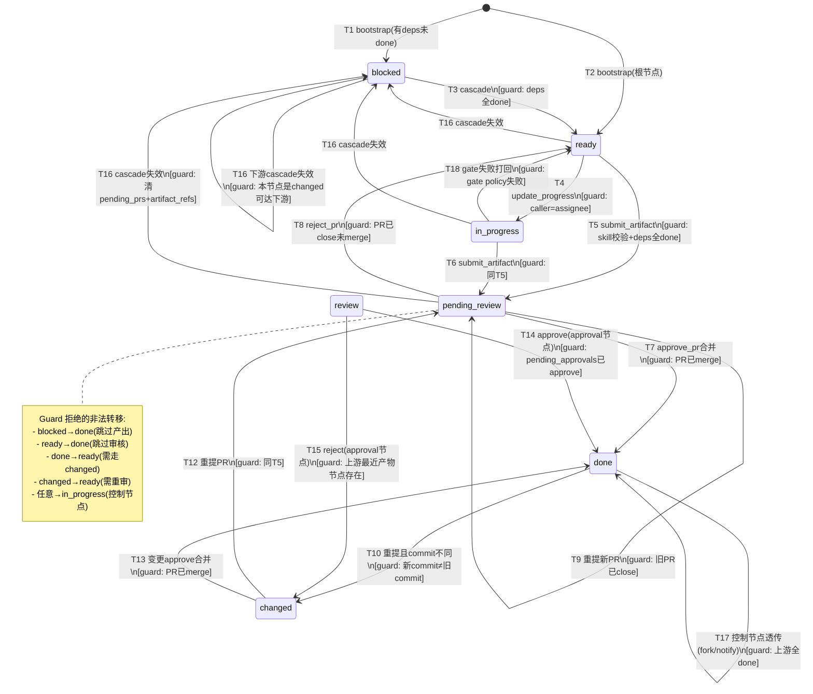
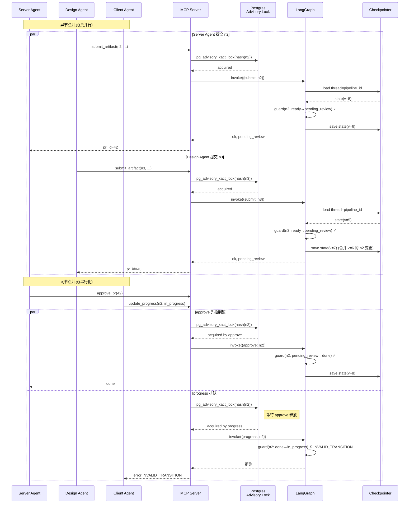
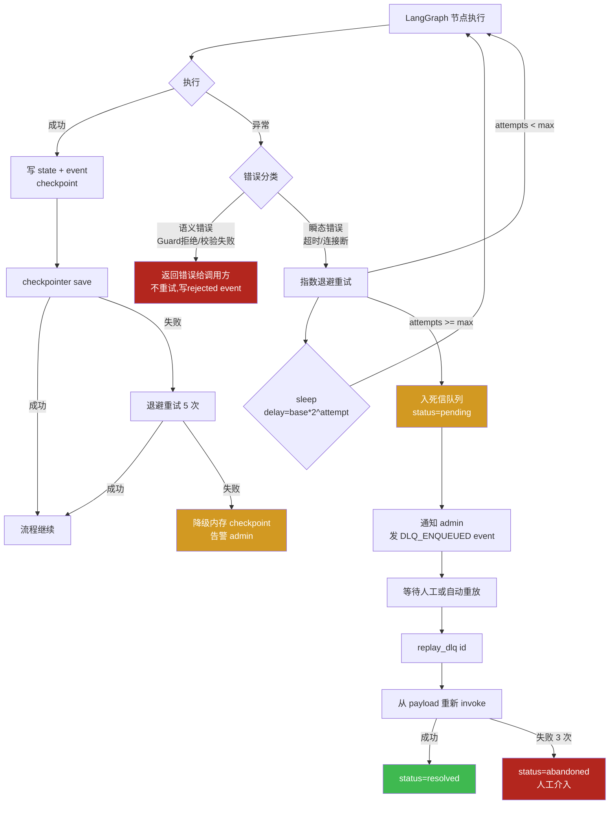
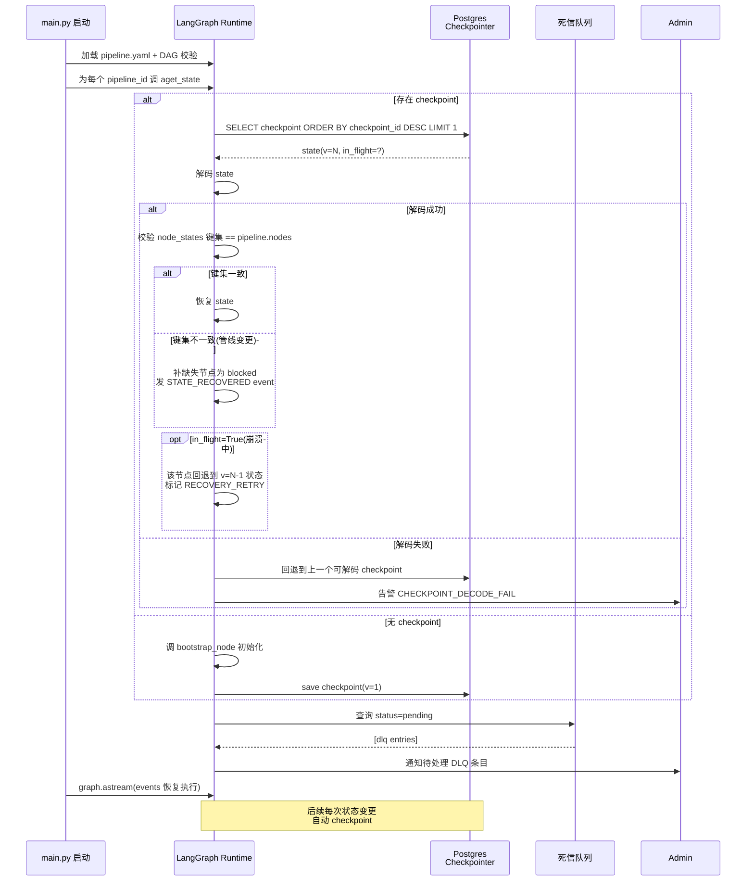
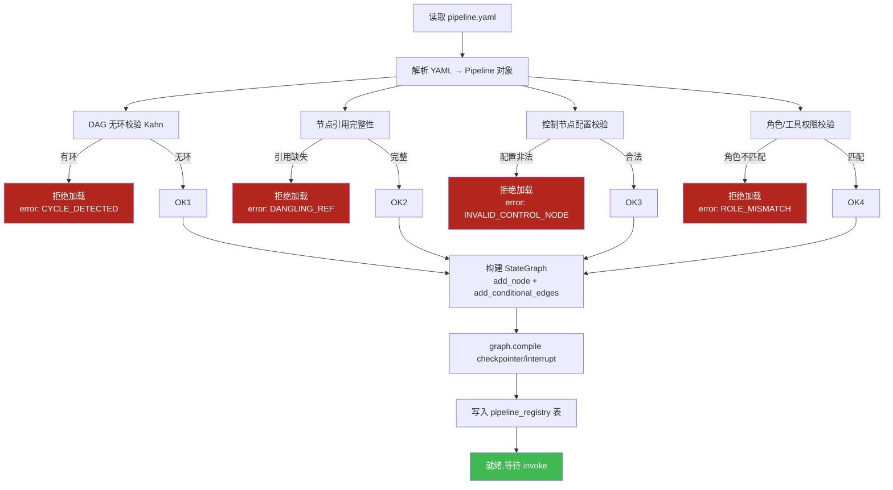
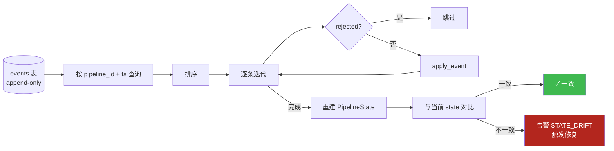

# FR2 管理编排引擎(LangGraph)深化设计

> **文档性质**:对《coordination-platform-prd.md》FR2 章节的深化补充
> **版本**:v2.1 | **日期**:2026-08-04 | **状态**:待评审
> **父文档**:[coordination-platform-prd.md](../coordination-platform-prd.md)
> **调研依据**:[ai-multi-agent-dev-dashboard-research.md](../../research/ai-multi-agent-dev-dashboard-research.md) 第17章 LangGraph 设计

---

## 0. 文档范围与补全说明

本文针对 PRD v2.0 FR2 章节的以下 9 个薄弱点进行深化:

| # | 薄弱点 | 深化章节 |
|---|---|---|
| 1 | 状态机边界条件(多变更/非法跳转/幂等) | §2 |
| 2 | 并发提交处理(同节点/异节点/LangGraph 并发模型) | §3 |
| 3 | PR 冲突处理(多 PR 合并/产物路径冲突) | §4 |
| 4 | 错误恢复与重试(节点失败/MCP/git) | §5 |
| 5 | checkpointer 配置(Postgres schema/频率/恢复点) | §6 |
| 6 | 管线加载与校验(DAG 无环/引用完整/热重载) | §7 |
| 7 | 控制节点完整边界条件(gate/approval/fork/switch/notify) | §8 |
| 8 | LangGraph 配置细节(编译/interrupt/recursion/fan-out) | §9 |
| 9 | 事件溯源(events 累积/回放/审计/state 重建) | §10 |

**最少 4 张 Mermaid 设计图**:`图 2-1` 完整状态机含 guard、`图 3-1` 并发提交时序、`图 5-1` 错误恢复流程、`图 6-1` checkpoint 恢复;另含 `图 7-1` 管线加载校验流程、`图 10-1` 事件回放流程。

**技术栈约束**:LangGraph ≥ 0.2 + CrewAI ≥ 0.4 + Langfuse ≥ 3.0 + Postgres ≥ 15 + Python 3.11+。

---

## 1. 编排引擎定位回顾

LangGraph StateGraph 是管理/编排层的"心脏",承担 4 项职责:

| 职责 | 实现机制 |
|---|---|
| 节点状态机(7 态) | `node_states` dict + 状态转移 guard |
| 依赖 DAG | `deps` 推导边 + `cascade_node` / `invalidate_node` |
| 条件推进 | `add_conditional_edges` 声明式路由 |
| 变更级联 | done→下游 ready / changed→下游 blocked(递归) |

**本深化的 5 条设计原则:**

| 原则 | 含义 | 落地 |
|---|---|---|
| **状态严格性** | 状态转移必须经 guard 校验,非法跳转拒绝 | §2.2 非法转移表 |
| **并发安全性** | 同节点并发变更串行化,异节点并行 fan-out | §3 锁机制 |
| **可恢复性** | 任意节点失败 / 进程崩溃可从最后 checkpoint 恢复 | §5 + §6 |
| **可观测性** | 每次状态变更产 event,事件流可回放重建 state | §10 |
| **幂等性** | 同一 MCP 调用重放结果一致,无副作用叠加 | §2.4 + §3.3 |

---

## 2. 状态机深化设计

### 2.1 完整状态转移表(所有合法转移)

PRD §2.1 只给出 7 态定义和简化流转图,本节穷举所有合法转移及其 guard / 副作用。状态枚举:`blocked` / `ready` / `pending_review` / `in_progress` / `review` / `done` / `changed`。

| # | 源状态 | 目标状态 | 触发事件 | 前置 Guard | 副作用(Side Effect) | 备注 |
|---|---|---|---|---|---|---|
| T1 | `(初始)` | `blocked` | `bootstrap_node` | 节点有 deps 且至少一个未 done | 写 `node_states[nid]=blocked`,发 `BLOCKED` event | 默认初始态 |
| T2 | `(初始)` | `ready` | `bootstrap_node` | 节点无 deps(根节点) | 写 `node_states[nid]=ready`,发 `READY` event,触发 CrewAI 分配 | AC2.1 |
| T3 | `blocked` | `ready` | `cascade_node` 上游全 done | `all(dep_state==done for dep in deps(nid))` | 写 ready,发 `READY` event,CrewAI 分配 | 级联解锁 |
| T4 | `ready` | `in_progress` | `update_progress(status=in_progress)` | 调用方为 `role_assignments[nid]` 对应 agent 或 admin | 发 `IN_PROGRESS` event,Langfuse span 开始 | 进度更新 |
| T5 | `ready` | `pending_review` | `submit_artifact` 开 PR | `skill` 元数据 + 依赖完整性预校验通过;`pending_prs[nid]` 为空 | 写 `pending_prs[nid]=pr_id`,发 `PENDING_REVIEW` event | AC2.7 修正 |
| T6 | `in_progress` | `pending_review` | `submit_artifact` 开 PR | 同 T5;且当前 `role_assignments[nid]` 持有者调用 | 同 T5 | 修复后提 PR |
| T7 | `pending_review` | `done` | `approve_pr` 合并 | PR 已 squash merge;构造 `ArtifactRef` | 写 `artifact_refs[nid]`,清 `pending_prs[nid]`,发 `DONE` event,触发 `cascade_node` | 合并即生效 |
| T8 | `pending_review` | `ready` | `reject_pr` | PR 已关闭未合并 | 清 `pending_prs[nid]`,发 `REJECT` event,通知提交方 | 驳回 |
| T9 | `pending_review` | `pending_review` | 重提新 PR(同一节点) | 旧 PR 已 close;`pending_prs[nid]` 被新 pr_id 覆盖 | 替换 `pending_prs[nid]`,发 `RE_SUBMIT` event | 见 §4.1 |
| T10 | `done` | `changed` | `submit_artifact` 重提已 done 节点的 PR | `artifact_refs[nid]` 已存在;新 commit ≠ 旧 commit | 发 `CHANGED` event,触发 `invalidate_node` 递归失效下游 | AC2.4 |
| T11 | `done` | `done` | 同 commit 重提 | 新 commit == 旧 commit | 幂等返回,不发 `CHANGED`,不级联 | 幂等,见 §2.4 |
| T12 | `changed` | `pending_review` | 重提 PR | 同 T5 | 写 `pending_prs[nid]`,发 `PENDING_REVIEW` event | 变更后重审 |
| T13 | `changed` | `done` | 直接 approve(变更已合并) | PR 合并 commit 已是最新 | 写 `artifact_refs[nid]`(新 commit),发 `DONE` event,触发 `cascade_node` 解锁下游 | 变更生效 |
| T14 | `review` | `done` | `approve`(approval 控制节点) | `pending_approvals[nid]` 已 approve | 清 `pending_approvals[nid]`,发 `DONE` event,cascade | 控制节点 |
| T15 | `review` | `changed` | `reject`(approval 控制节点) | 上游最近产物节点存在 | 上游产物节点置 `changed`(递归),发 `REJECT` event | AC2.6 |
| T16 | `blocked`/`ready`/`in_progress`/`pending_review` | `blocked` | 下游 cascade 失效(上游 changed 递归) | 本节点是某 changed 节点的下游可达节点 | 清 `artifact_refs[nid]`,清 `pending_prs[nid]`,发 `INVALIDATED` event | 递归失效 |
| T17 | `done`(控制节点) | `done` | 控制节点透传(fork/notify) | 控制节点上游全 done | 发 `DONE` event,cascade | 透传 |
| T18 | `in_progress` | `ready` | `gate` 失败打回 | gate policy 校验失败 | 发 `GATE_FAIL` event,通知提交方修复 | AC2.5 |

**说明:**
- `review` 状态仅 `approval` 控制节点进入;产物节点不进 `review`,产物节点走 `pending_review`。
- `in_progress` 仅产物节点会进入(由 `update_progress`);控制节点不进 `in_progress`。
- T11 是幂等转移,不发 `CHANGED` 避免 cascade 风暴。
- T16 是递归失效,需用 visited set 防环(虽然 DAG 无环,但跨管线引用需防护)。

### 2.2 非法转移防护表

以下转移被 Guard 拒绝,返回 `INVALID_TRANSITION` 错误(对齐 FR4 错误码体系):

| 源状态 | 目标状态 | 拒绝原因 | 错误码 |
|---|---|---|---|
| `blocked` | `pending_review` | 依赖未满足不能提 PR | `INVALID_TRANSITION` + `DEPS_NOT_DONE` |
| `blocked` | `done` | 跳过产出/审核 | `INVALID_TRANSITION` |
| `ready` | `done` | 跳过 pending_review | `INVALID_TRANSITION` |
| `ready` | `review` | review 仅 approval 控制节点可进 | `INVALID_TRANSITION` + `NOT_APPROVAL_NODE` |
| `pending_review` | `in_progress` | 审核中不可改进度 | `INVALID_TRANSITION` + `REVIEW_IN_PROGRESS` |
| `pending_review` | `ready`(非 reject 路径) | 仅 `reject_pr` 可回 ready | `INVALID_TRANSITION` |
| `pending_review` | `review` | 产物节点不进 review | `INVALID_TRANSITION` |
| `done` | `ready` | 已生效不能直接回 ready,需走 changed | `INVALID_TRANSITION` + `USE_CHANGED_PATH` |
| `done` | `blocked` | 已生效不能直接 blocked,需先 changed | `INVALID_TRANSITION` |
| `changed` | `ready` | changed 必须经 pending_review 重审 | `INVALID_TRANSITION` |
| `changed` | `done`(无 PR 合并) | 变更必须经审核 | `INVALID_TRANSITION` + `NO_MERGE_COMMIT` |
| `review` | `ready` | approval 节点驳回走 changed,不回 ready | `INVALID_TRANSITION` |
| `review` | `pending_review` | review 与 pending_review 不互通 | `INVALID_TRANSITION` |
| 任意 | `in_progress`(非产物节点) | 控制节点不进 in_progress | `INVALID_TRANSITION` + `CONTROL_NODE_NO_PROGRESS` |

**Guard 实现要点:**
- Guard 在 LangGraph 节点入口校验,失败时**不修改 state**,直接返回错误 event 并终止该次 invoke。
- Guard 校验用纯函数 `guard_transition(from_state, to_state, event, node_type) -> (ok, reason)`,便于单测覆盖上表全部分支。
- Guard 拒绝的 event 仍入 `events` 流(标记 `rejected=true`),供审计与回放。

### 2.3 状态机 Guard 设计

每个 LangGraph 节点入口包含三层 Guard:

```python
def guard_transition(
    state: PipelineState,
    node_id: str,
    target: NodeStatus,
    event: str,
    caller: str,
) -> TransitionVerdict:
    """三层 Guard:身份 / 前置状态 / 上下文"""
    current = state["node_states"].get(node_id)
    node = get_node_def(node_id)

    # L1: 身份 Guard — 调用方是否有权操作此节点
    if not authorize(caller, node, event):
        return TransitionVerdict(ok=False, code="FORBIDDEN",
                                  reason=f"{caller} 无权对 {node_id} 执行 {event}")

    # L2: 前置状态 Guard — 源→目标转移是否合法(查 §2.2 表)
    if not is_legal_transition(current, target, event, node["type"]):
        return TransitionVerdict(ok=False, code="INVALID_TRANSITION",
                                  reason=f"{current}→{target} via {event} 非法")

    # L3: 上下文 Guard — 业务前置条件(依赖全 done / PR 已合并 / commit 不同等)
    ctx_ok, ctx_reason = check_context(state, node_id, target, event)
    if not ctx_ok:
        return TransitionVerdict(ok=False, code="CONTEXT_FAIL", reason=ctx_reason)

    return TransitionVerdict(ok=True)
```

### 2.4 状态幂等性

**幂等键设计**:每次 MCP 工具调用携带 `idempotency_key`(由 agent 生成 UUID,首次失败重试复用同一 key)。LangGraph 入口节点查 `idempotency_keys` 表:

| 场景 | 幂等键 | 行为 |
|---|---|---|
| 重复 `submit_artifact`(同 node_id + 同 commit) | `submit:{node_id}:{commit}` | 直接返回首次的 `pr_id`,不重复开 PR |
| 重复 `approve_pr`(同 pr_id) | `approve:{pr_id}` | 直接返回首次结果,不重复合并 |
| 重复 `reject_pr`(同 pr_id) | `reject:{pr_id}` | 直接返回,不重复关 PR |
| 重复 `update_progress`(同 node_id + 同 note hash) | `progress:{node_id}:{note_hash}` | 直接返回 ok,不重复写 event |
| 重复 `approve`(同 approval 节点 + 同 approver) | `approval:{node_id}:{approver}` | 直接返回,不重复 cascade |

**幂等键存储**:`idempotency_keys(key, response_json, expires_at)` 表, TTL 7 天。重复命中时返回首次响应原文,保证客户端语义等价。

**T11 同 commit 重提**:`submit_artifact` 检测到 `artifact_refs[nid].commit == new_commit` 时,不进 `changed`,直接返回 `{"ok": true, "idempotent": true, "state": "done"}`。

### 2.5 完整状态机含 Guard(图 2-1)



---

## 3. 并发处理模型

### 3.1 LangGraph Annotated 累积策略详解

PRD §2.3 给出了 `PipelineState` 雏形,本节明确每个字段的合并策略:

| 字段 | 类型 | 合并策略 | 理由 |
|---|---|---|---|
| `node_states` | `dict[str, NodeStatus]` | **last-write-wins + 版本号** | 状态是"当前态",覆盖语义;用 `version` 防 lost update |
| `artifact_refs` | `dict[str, ArtifactRef]` | **last-write-wins + 版本号** | 引用是"当前态",覆盖语义 |
| `events` | `Sequence[dict]` | **`Annotated[..., operator.add]`** 累积追加 | 事件是"日志",追加语义,多节点并发写自动合并 |
| `pending_approvals` | `dict[str, str]` | last-write-wins | 当前态 |
| `role_assignments` | `dict[str, str]` | last-write-wins | 当前态 |
| `pending_prs` | `dict[str, str]` | last-write-wins | 当前态 |
| `node_versions` | `dict[str, int]` | **`Annotated[..., max]`** 取最大 | 单调递增版本号,防并发覆盖 |
| `idempotency_seen` | `set[str]` | **`Annotated[..., operator.or_]`** 并集 | 幂等键集合,多分支合并取并集 |

**TypedDict 定义(扩展 PRD §2.3):**

```python
from typing import Annotated
import operator

class PipelineState(TypedDict):
    node_states: dict[str, NodeStatus]
    artifact_refs: dict[str, ArtifactRef]
    events: Annotated[Sequence[dict], operator.add]            # 累积追加
    pending_approvals: dict[str, str]
    role_assignments: dict[str, str]
    pending_prs: dict[str, str]
    node_versions: Annotated[dict[str, int], lambda a, b: {**a, **b,
        **{k: max(a.get(k, 0), b.get(k, 0)) for k in b}}]      # per-key max
    idempotency_seen: Annotated[set[str], operator.or_]        # 并集
    last_checkpoint_ts: str                                    # ISO8601
```

**为什么 `events` 用累积追加**:LangGraph 在并行 fan-out 时,多个分支节点可能同时产 event;`operator.add` 让分支汇聚时 event 自动拼接,无需手动协调。这是调研报告第3章强调的"LangGraph 精髓"。

### 3.2 锁机制(Postgres Advisory Lock)

**并发问题**:多个 MCP 调用同时对**同一节点**触发状态变更时,若直接读-改-写 `node_states`,会丢失更新(lost update)。

**方案**:节点级 Postgres advisory lock,Lock Key = hash(node_id)。所有状态变更节点入口先抢锁,串行化同节点操作;异节点操作无锁,真并行。

```python
import hashlib
from psycopg2.extensions import AsIs

def node_lock_key(node_id: str) -> int:
    """node_id → int64 advisory lock key(稳定哈希)"""
    h = hashlib.blake2b(node_id.encode(), digest_size=8).digest()
    return int.from_bytes(h, "big", signed=True) & ((1 << 63) - 1)

async def with_node_lock(node_id: str, fn):
    """节点级串行化包装器。同节点并发调用排队,异节点并行。"""
    key = node_lock_key(node_id)
    async with db.acquire() as conn:
        async with conn.transaction():
            await conn.execute("SELECT pg_advisory_xact_lock($1)", key)
            return await fn(conn)
```

**锁粒度矩阵:**

| 操作 | 锁对象 | 锁 Key | 持锁时长 |
|---|---|---|---|
| `submit_artifact` | node_id | `hash(node_id)` | 整个开 PR + state 写入 |
| `approve_pr` | node_id + 下游节点集 | `hash(node_id)` + 下游 `hash(downstream_id)` 依次抢 | 合并 + cascade 整体 |
| `reject_pr` | node_id | `hash(node_id)` | 关 PR + state 写入 |
| `cascade_node`(同节点 done) | node_id + 所有下游 | 同上 | cascade 全程 |
| `invalidate_node` | node_id + 所有下游(递归) | 递归抢下游锁(按拓扑序) | 递归失效全程 |
| `approve`(approval 控制节点) | node_id + 上游产物节点 | `hash(node_id)` + `hash(upstream_artifact_node)` | approve + cascade |

**死锁防护:**
- 所有需要多锁的操作,按 node_id 字典序抢锁(规范化加锁顺序)。
- `invalidate_node` 递归失效时按 DAG 拓扑序下游方向加锁,避免反向等待。
- 单锁持有上限 30s,超时自动释放并写 `LOCK_TIMEOUT` event。

### 3.3 同一节点同时收到多个状态变更

**场景示例**:节点 n2 处于 `pending_review`,同时收到 `reject_pr`(来自 reviewer)和 `update_progress`(来自 agent)。

**处理规则(在 `with_node_lock` 串行化下):**

| 时序 | 行为 |
|---|---|
| 先 reject 后 progress | reject 成功:n2→ready;progress 因 guard `pending_review→in_progress 非法` 被拒,返回 `INVALID_TRANSITION` |
| 先 progress 后 reject | progress 因 guard 被拒;reject 成功:n2→ready |
| 同时到达 | advisory lock 串行化,二者其一先执行,另一个按上表 |

**关键**:Guard 是状态变更的"看门人",所有并发竞态由 Guard 兜底——即使锁内顺序不确定,非法转移也会被拒绝,不会破坏状态机不变量。

### 3.4 LangGraph 并发模型

LangGraph 原生支持两种并发:

| 模式 | 实现 | 用途 |
|---|---|---|
| **并行 fan-out** | `Send(node, state)` API + `add_conditional_edges` 返回 list[Send] | 多个 ready 节点同时分配 CrewAI Task |
| **累积分支合并** | `Annotated[..., operator.add]` | 多分支产 event 自动合并 |

**异节点并发提交模型**:

- 多个 agent 同时调 `submit_artifact` 不同 node_id → 不同 advisory lock → 真并行
- 每个 MCP 调用独立 `langgraph.invoke()`,LangGraph checkpointer 用 `thread_id = pipeline_id` 保证 state 跨调用累积
- checkpointer 自身用 Postgres 行锁 + `Annotated` 合并策略,自动协调多 invoke 的 state 写入

### 3.5 并发提交时序(图 3-1)



---

## 4. PR 冲突处理

### 4.1 同节点多个 PR 处理

**场景**:节点 n2 已有 PR #42 在 `pending_review`,同一 agent 或另一 agent 又开了 PR #43。

**处理策略:一次只允许一个活跃 PR**(`pending_prs[nid]` 单值约束):

| 时序 | 行为 |
|---|---|
| PR #42 在审,新开 PR #43 | MCP 检测 `pending_prs[n2]` 非空 → 拒绝开 PR #43,返回 `PR_ALREADY_PENDING` 错误,提示先 close #42 |
| PR #42 被 reject(close),新开 PR #43 | 允许,T9 转移:`pending_prs[n2]` 更新为 43,n2 保持 ready→pending_review |
| PR #42 在审,人为直接 close #42(不经 reject_pr) | webhook 通知 MCP,MCP 清 `pending_prs[n2]`,n2 回 `ready`,发 `PR_CLOSED` event |

**实现**:`submit_artifact` 入口 guard 增加 `pending_prs[nid] is None` 检查(T5/T6 guard 的上下文条件)。

### 4.2 产物路径冲突

**场景**:两个不同节点 PR 提交到同一产物路径 `api_contract/001.yaml`。

**根因**:节点 ID 与产物路径未强绑定,管理方 PR 模板只声明 `node_id` + `artifact.path`,未校验路径唯一性。

**防护方案**:

1. **路径注册表**:新增 `node_path_registry(node_id, artifact_path, commit)` 表,PR 审核时校验路径占用。
2. **审核校验**:`review_artifact_pr` 增加 `path_conflict_check`:
   - 若 `artifact_path` 已被其他 node_id 注册且该 node 处于 `done`/`pending_review` → 拒绝,返回 `PATH_CONFLICT` + 占用方 node_id
   - 若 `artifact_path` 是本 node_id 已注册路径 → 允许(变更场景)
3. **路径命名规范**(建议,非强制):`{node_type}/{node_id}_{seq}.{ext}`,如 `api_contract/n2_001.yaml`,从源头避免冲突。

### 4.3 合并冲突 rebase

**场景**:PR #42 基于的 main commit 已被 PR #41 合并推进,PR #42 合并时 git 报冲突。

**处理流程:**

| 步骤 | 动作 | 失败处理 |
|---|---|---|
| 1 | `approve_pr` 触发 `git merge --squash` | 冲突 → 进步骤 2 |
| 2 | 尝试 `git rebase main` 自动重放 | 仍冲突 → 进步骤 3 |
| 3 | 标记 PR `needs_rebase`,通知提交方 | 提交方本地 rebase 后 force push |
| 4 | 提交方 force push 后,webhook 重新触发 review | 重新走 §4.3 步骤 1 |

**幂等保护**:rebase + force push 产生新 commit,`idempotency_key` 用 `submit:{node_id}:{new_commit}`,不复用旧 key,允许重新走流程。

**重试上限**:同一 PR rebase 失败 3 次后,自动 reject 并标记 `REBASE_GIVE_UP`,要求人工介入。

---

## 5. 错误恢复与重试策略

### 5.1 错误分类与处理矩阵

| 错误类别 | 典型错误 | 影响范围 | 处理策略 | 重试上限 |
|---|---|---|---|---|
| **LangGraph 节点异常** | `cascade_node` 抛 KeyError(节点定义缺失) | 当前 invoke 失败 | 指数退避重试 → 死信队列 | 3 次 |
| **MCP 调用失败** | `submit_artifact` 校验产物引用超时 | 单次 MCP 调用失败 | 指数退避重试 → 返回错误给 agent | 3 次 |
| **git 操作失败** | `git merge` 冲突 / `git ls-file` 超时 | approve_pr 或 verify 失败 | rebase(§4.3)或退避重试 → 死信 | 3 次 |
| **Checkpointer 失败** | Postgres 连接断开 | state 持久化失败 | 退避重试 → 降级内存 checkpoint + 告警 | 5 次 |
| **Guard 拒绝** | 非法状态转移 | 当前 invoke 拒绝 | **不重试**(语义错误,重试无用) | 0 次 |
| **Langfuse 失败** | trace 写入超时 | 监控数据丢失 | **降级本地日志**,主流程继续 | 不重试 |
| **CrewAI 分配失败** | agent 离线 | Task 未派发 | 重新选 agent → 退避重试 → 标记 `NO_AGENT` | 3 次 |

### 5.2 指数退避

**通用退避函数:**

```python
import asyncio
import random

async def retry_with_backoff(
    fn,
    *,
    max_attempts: int = 3,
    base_delay: float = 1.0,
    max_delay: float = 30.0,
    retryable_exceptions: tuple = (TimeoutError, ConnectionError, GitError),
):
    """指数退避 + 抖动。Guard 拒绝等语义错误不重试。"""
    attempt = 0
    last_exc = None
    while attempt < max_attempts:
        try:
            return await fn()
        except retryable_exceptions as e:
            last_exc = e
            attempt += 1
            if attempt >= max_attempts:
                break
            delay = min(max_delay, base_delay * (2 ** attempt)) * (0.5 + 0.5 * random.random())
            await asyncio.sleep(delay)
    # 重试耗尽 → 抛给上层入死信队列
    raise RetryExhausted(attempt=attempt, last_exc=last_exc)
```

**参数矩阵:**

| 操作 | max_attempts | base_delay | max_delay | retryable |
|---|---|---|---|---|
| `submit_artifact`(verify ref) | 3 | 1s | 10s | TimeoutError, ConnectionError |
| `approve_pr`(git merge) | 3 | 2s | 30s | GitError, TimeoutError |
| `langgraph.invoke` | 3 | 1s | 15s | LangGraphRuntimeError |
| checkpointer save | 5 | 0.5s | 5s | psycopg2.OperationalError |
| CrewAI dispatch | 3 | 5s | 60s | AgentOfflineError |

### 5.3 死信队列(DLQ)

**死信表 schema(Postgres):**

```sql
CREATE TABLE dlq (
    id BIGSERIAL PRIMARY KEY,
    created_at TIMESTAMPTZ NOT NULL DEFAULT now(),
    pipeline_id TEXT NOT NULL,
    node_id TEXT,
    operation TEXT NOT NULL,              -- submit_artifact / approve_pr / cascade_node ...
    payload JSONB NOT NULL,               -- 原始请求 + 上下文
    last_error TEXT NOT NULL,
    attempts INT NOT NULL,
    status TEXT NOT NULL DEFAULT 'pending', -- pending / processing / resolved / abandoned
    resolved_at TIMESTAMPTZ,
    resolved_by TEXT,                      -- admin / auto-replay
    resolution_note TEXT
);
CREATE INDEX idx_dlq_status_pipeline ON dlq(status, pipeline_id);
```

**入队规则:**
- `retry_with_backoff` 耗尽 → 写入 DLQ,`status=pending`
- LangGraph 节点异常 → 直接入 DLQ(不经退避,语义错误)
- DLQ 写入后发 `DLQ_ENQUEUED` event,通知 admin

**处理方式:**
- admin 通过 `get_audit_log(filter=dlq)` 查看 DLQ
- 修复根因后调 `replay_dlq(id)` 重放:从 payload 重新 invoke LangGraph
- 重放成功 → `status=resolved`;重放仍失败 → 保持 `pending`,attempts++
- 连续 3 次重放失败 → `status=abandoned`,需人工介入

### 5.4 错误恢复流程(图 5-1)



---

## 6. Checkpointer 配置

### 6.1 Postgres Schema

LangGraph 0.2+ 内置 `AsyncPostgresSaver`,自动管理 checkpoint 表。本节给出完整 schema(含 LangGraph 内置表 + 平台扩展表)。

**LangGraph 内置表(由 `AsyncPostgresSaver.setup()` 自动创建):**

```sql
-- LangGraph checkpointer 内置表(简化,实际由 SDK 管理)
CREATE TABLE checkpoints (
    thread_id TEXT NOT NULL,
    checkpoint_ns TEXT NOT NULL DEFAULT '',
    checkpoint_id TEXT NOT NULL,
    parent_checkpoint_id TEXT,
    type TEXT,
    checkpoint BYTEA,                     -- 序列化后的 PipelineState
    metadata JSONB,
    created_at TIMESTAMPTZ NOT NULL DEFAULT now(),
    PRIMARY KEY (thread_id, checkpoint_ns, checkpoint_id)
);
CREATE INDEX idx_checkpoints_thread ON checkpoints(thread_id, checkpoint_ns, checkpoint_id);

CREATE TABLE writes (
    thread_id TEXT NOT NULL,
    checkpoint_ns TEXT NOT NULL DEFAULT '',
    checkpoint_id TEXT NOT NULL,
    task_id TEXT NOT NULL,
    idx INT NOT NULL,
    channel TEXT NOT NULL,
    type TEXT,
    blob BYTEA,
    PRIMARY KEY (thread_id, checkpoint_ns, checkpoint_id, task_id, idx, channel)
);
```

**平台扩展表(自行管理):**

```sql
-- 幂等键表
CREATE TABLE idempotency_keys (
    key TEXT PRIMARY KEY,
    response_json JSONB NOT NULL,
    created_at TIMESTAMPTZ NOT NULL DEFAULT now(),
    expires_at TIMESTAMPTZ NOT NULL
);
CREATE INDEX idx_idem_expires ON idempotency_keys(expires_at);

-- 节点路径注册表(§4.2)
CREATE TABLE node_path_registry (
    node_id TEXT NOT NULL,
    pipeline_id TEXT NOT NULL,
    artifact_path TEXT NOT NULL,
    commit TEXT NOT NULL,
    registered_at TIMESTAMPTZ NOT NULL DEFAULT now(),
    PRIMARY KEY (pipeline_id, node_id),
    UNIQUE (pipeline_id, artifact_path)   -- 路径全局唯一
);

-- 死信队列(§5.3)
-- 见 §5.3 schema

-- 审计日志(独立表,与 FR6.5 对齐)
CREATE TABLE audit_log (
    audit_id TEXT PRIMARY KEY,
    action TEXT NOT NULL,
    pr_id BIGINT,
    node_id TEXT,
    node_type TEXT,
    artifact_path TEXT,
    merge_commit TEXT,
    reviewer TEXT,
    submitter TEXT,
    skill_used TEXT,
    skill_verdict TEXT,
    deps_at_review JSONB,
    note TEXT,
    trace_id TEXT,
    ts TIMESTAMPTZ NOT NULL DEFAULT now()
);
CREATE INDEX idx_audit_node ON audit_log(node_id, ts);
CREATE INDEX idx_audit_reviewer ON audit_log(reviewer, ts);
CREATE INDEX idx_audit_action ON audit_log(action, ts);

-- 锁状态监控(可选,advisory lock 本身无表)
CREATE TABLE lock_wait_log (
    id BIGSERIAL PRIMARY KEY,
    node_id TEXT NOT NULL,
    waiter_op TEXT NOT NULL,
    wait_ms INT NOT NULL,
    ts TIMESTAMPTZ NOT NULL DEFAULT now()
);
```

### 6.2 Checkpoint 频率

| 触发点 | 是否 checkpoint | 理由 |
|---|---|---|
| `bootstrap_node` 完成 | ✅ | 初始 state 必须落盘 |
| 每次状态转移(T1-T18) | ✅ | state 变更点必须可恢复 |
| `cascade_node` / `invalidate_node` 每跳 | ✅(每跳) | 递归失效中途崩溃可从上一跳恢复 |
| `events` 追加 | ✅(随 state 一起) | event 与 state 同 checkpoint |
| Guard 拒绝 | ✅ | rejected event 也要持久化审计 |
| Langfuse trace | ❌ | 旁路,不阻塞,失败降级 |
| 长时间 `wait_node` | ❌(无 state 变更) | 无变更不 checkpoint |

**频率权衡**:checkpoint 每次状态变更必做,保证强一致性;Postgres WAL + 同步提交(`synchronous_commit=on`)确保不丢。性能瓶颈期可改 `synchronous_commit=remote_apply` 在主从间平衡。

### 6.3 恢复点选择

**thread_id 设计**:`thread_id = pipeline_id`(一个管线一个 thread),`checkpoint_ns = ""`(本平台不嵌套 subgraph)。

**恢复流程:**

1. 进程启动 → 加载 `pipeline.yaml` → 校验 DAG(§7)
2. 对每个 `pipeline_id` 调 `graph.aget_state(thread_id=pipeline_id)`
3. 若存在 checkpoint → 从最新 checkpoint 恢复 `PipelineState`
4. 若不存在 → 调 `bootstrap_node` 初始化
5. 恢复后校验:`state.node_states` 键集 == `pipeline.nodes` 键集;不一致则补缺失节点为 `blocked` 并发 `STATE_RECOVERED` event
6. 恢复 DLQ 中 `status=pending` 的记录,提示 admin 决定是否重放

**部分恢复策略**:
- 若最新 checkpoint 标记 `in_flight=True`(节点执行中崩溃)→ 该节点状态回退到上一 checkpoint 的状态,标记 `RECOVERY_RETRY`,允许重新 invoke
- 若 checkpoint 解码失败(state schema 版本不兼容)→ 回退到上一个能解码的 checkpoint,发 `CHECKPOINT_DECODE_FAIL` 告警

### 6.4 Checkpoint 恢复(图 6-1)



---

## 7. 管线加载与校验

### 7.1 加载流程



### 7.2 DAG 无环校验(Kahn 算法)

```python
def validate_dag_acyclic(nodes: list[NodeDef]) -> tuple[bool, list[str]]:
    """Kahn 拓扑排序判环。返回 (无环?, 环路径若存在)"""
    in_degree = {n["id"]: 0 for n in nodes}
    adj = {n["id"]: [] for n in nodes}
    for n in nodes:
        for dep in n.get("deps", []):
            if dep not in adj:
                return False, [f"DANGLING_REF: {n['id']} 依赖不存在的 {dep}"]
            adj[dep].append(n["id"])
            in_degree[n["id"]] += 1
    queue = [nid for nid, d in in_degree.items() if d == 0]
    visited = 0
    while queue:
        cur = queue.pop(0)
        visited += 1
        for nxt in adj[cur]:
            in_degree[nxt] -= 1
            if in_degree[nxt] == 0:
                queue.append(nxt)
    if visited != len(nodes):
        cycle_nodes = [nid for nid, d in in_degree.items() if d > 0]
        return False, cycle_nodes
    return True, []
```

### 7.3 节点引用完整性

| 校验项 | 规则 | 失败错误码 |
|---|---|---|
| `deps` 引用存在 | 每个 dep 必须在 nodes 列表中 | `DANGLING_REF` |
| `deps` 不自引用 | `node.deps` 不含 `node.id` | `SELF_DEPENDENCY` |
| 控制节点 `deps` 非空 | gate/approval/fork 至少 1 dep | `CONTROL_NO_DEPS` |
| fork 节点 `deps` ≥ 2 | fork 设计为多入边汇合 | `FORK_TOO_FEW_DEPS`(warning,非强制) |
| approval 节点 `approver` 必填 | 非空字符串 | `APPROVAL_NO_APPROVER` |
| gate 节点 `policy` 必填 | 至少含一项 lint/test/coverage/security | `GATE_NO_POLICY` |
| switch 节点 `routes` 必填 | 至少 2 条路由 | `SWITCH_TOO_FEW_ROUTES` |
| 产物节点 `role` 必填 | 在 product/server/design/client 中 | `INVALID_ROLE` |
| 产物节点 `type` 合法 | 在 9 种产物类型中 | `INVALID_NODE_TYPE` |

### 7.4 控制节点配置校验

| 控制节点 | 必填字段 | 取值约束 |
|---|---|---|
| `gate` | `policy` | `policy.lint`/`policy.test`/`policy.coverage_min`/`policy.security` 至少一项;`coverage_min` 为 0-100 整数 |
| `approval` | `approver`, `timeout_hours`(可选) | `approver` 非空;`timeout_hours` 默认 24,范围 [1, 168] |
| `fork` | (无额外) | `deps` ≥ 2(建议) |
| `switch` | `routes` | `routes` 是 list,每项 `{field, op, value, target_branch}`;`op` ∈ {eq, gt, lt, gte, lte, in} |
| `notify` | `channel`, `target` | `channel` ∈ {feishu, slack, github, webhook};`target` 非空 |

### 7.5 热重载机制

**支持的热重载场景:**

| 场景 | 触发 | 行为 |
|---|---|---|
| 新增节点(扩展管线) | `pipeline.yaml` git push | 加载新版本 → 校验 → 对运行中 pipeline 增量添加节点(初始 `blocked`)→ 不影响已有节点状态 |
| 删除节点(收缩管线) | `pipeline.yaml` git push | **拒绝**若该节点已 `done` 或 `pending_review`;允许若 `blocked` 且无下游 |
| 修改 deps | `pipeline.yaml` git push | 重新校验无环 → 重新计算下游 ready 状态 → 发 `DEPS_CHANGED` event |
| 修改 gate policy | `set_gate_policy` MCP 工具 | 仅对未执行 gate 生效;已 `done` 的 gate 不追溯 |
| 修改 approval approver | admin 手动 | 仅对未 approve 的 approval 生效 |

**热重载实现**:
- `pipeline.yaml` 进 git,webhook 触发重载
- 重载用新 `pipeline_id`(版本化,如 `login-feature@v2`),旧 pipeline_id 继续运行至完成或手动迁移
- 迁移工具 `migrate_pipeline(old_id, new_id)` 拷贝 state,按新 DAG 校验一致性

### 7.6 管线加载校验清单

- [ ] YAML 语法合法
- [ ] 所有 `node.id` 唯一
- [ ] 所有 `node.deps` 引用存在(`DANGLING_REF`)
- [ ] 无自引用(`SELF_DEPENDENCY`)
- [ ] DAG 无环(`CYCLE_DETECTED`,Kahn)
- [ ] 产物节点 `role` + `type` 合法
- [ ] 控制节点配置完整(§7.4)
- [ ] 至少 1 个根节点(无 deps)
- [ ] 至少 1 个叶子节点(无下游)
- [ ] switch 路由目标分支都存在
- [ ] gate policy 字段类型正确
- [ ] approval approver 在角色列表中

---

## 8. 控制节点边界条件

PRD §2.5 只给出控制节点正常路径,本节穷举边界条件。

### 8.1 gate 节点边界条件

| 边界条件 | 行为 |
|---|---|
| policy 全通过 | gate→done,cascade 下游 |
| **policy 部分通过**(如 lint 过 test 失败) | gate→失败,上游产物节点回 `in_progress`,发 `GATE_FAIL` event 含失败项详情 |
| policy 缺失(配置错误) | gate 不执行,发 `GATE_CONFIG_MISSING` event,标记 `blocked` 等待 admin 修复 |
| 上游 changed 后 gate 状态 | gate 自动回 `blocked`(T16 cascade 失效),等上游重新 done 后重评 |
| gate 评估超时 | 指数退避重试 3 次 → DLQ,gate 保持 `in_progress` |
| 上游多入边部分 done | gate 保持 `blocked`,等全部上游 done |
| gate 已 done 后 policy 变更 | 不追溯,新 policy 对下次 gate 生效 |
| coverage_min 边界(刚好等于) | 视为通过(`>=`) |

### 8.2 approval 节点边界条件

| 边界条件 | 行为 |
|---|---|
| approve | approval→done,cascade 下游 |
| **reject** | approval→changed(T15),上游最近产物节点 changed,递归失效下游 |
| **超时**(默认 24h,可配 `timeout_hours`) | 自动 reject,发 `APPROVAL_TIMEOUT` event,通知 admin;超时计 1 次驳回 |
| 多审批人(approver 列表) | 全部 approve 才 done;任一 reject 即 reject;`pending_approvals` 存已 approve 集合 |
| approver 离线 | 不影响 approval 节点状态,超时机制兜底;admin 可重新指定 approver |
| 重复 approve(同 approver) | 幂等,返回首次结果,不重复 cascade |
| approval 已 done 后再次 reject | 拒绝,返回 `INVALID_TRANSITION`(done→changed 需走重提 PR 路径) |
| 上游 changed 后 approval 状态 | approval 自动回 `blocked`(T16),等上游重 done 后重新 review |
| approval 上游是控制节点(嵌套) | 递归找最近的产物节点 changed;若全是控制节点,标记 `NO_ARTIFACT_UPSTREAM` 告警 |

### 8.3 fork 节点边界条件

| 边界条件 | 行为 |
|---|---|
| 多入边全 done | fork→done(透传),cascade 下游 |
| 多入边部分 done 部分 blocked | fork 保持 `blocked` |
| **多入边部分 changed** | fork 自动回 `blocked`(任一上游 changed 触发 T16 递归),等上游重 done |
| 多入边全 changed | 同上,fork blocked,所有上游需重审 |
| fork 下游已 done 后某上游 changed | fork→blocked(递归),下游 cascade 失效 |
| 单入边 fork(配置错误但允许) | 退化为普通透传,发 `FORK_SINGLE_EDGE` warning |
| fork 上游包含 fork(嵌套) | 正常处理,递归判 done |

### 8.4 switch 节点边界条件

| 边界条件 | 行为 |
|---|---|
| 路由字段存在,匹配某分支 | switch→done,cascade 路由目标分支的下游 |
| **路由字段缺失** | switch 保持 `blocked`,发 `SWITCH_FIELD_MISSING` event,等上游补字段(重提 PR) |
| **多分支同时满足** | 按声明顺序取第一个匹配分支,发 `SWITCH_MULTI_MATCH` warning |
| 无分支匹配 | switch→done(默认透传),发 `SWITCH_NO_MATCH` warning;或配置 `default: reject` 则 reject |
| 路由目标分支节点不存在 | 加载时校验拒绝(`SWITCH_INVALID_TARGET`) |
| 上游 changed 后 switch 状态 | switch 回 blocked,等上游重 done 重评 |
| switch 嵌套(目标分支是另一个 switch) | 递归处理 |

### 8.5 notify 节点边界条件

| 边界条件 | 行为 |
|---|---|
| 上游 done | 触发外部通知 → notify→done,cascade 下游 |
| **外部系统不可达**(飞书/Slack webhook 超时) | 指数退避重试 3 次 → 仍失败则 **notify 仍→done**(通知是 best-effort,不阻塞管线),发 `NOTIFY_FAIL` event + DLQ 记录供重放 |
| 通知成功但下游 cascade 失败 | notify 已 done,下游 cascade 走正常错误恢复(§5) |
| 上游 changed 后 notify 状态 | notify 回 blocked,等上游重 done 后重新触发通知 |
| notify 配置 channel 不支持 | 加载时校验拒绝(`NOTIFY_INVALID_CHANNEL`) |
| 重复触发(上游 done→changed→done) | 每次重新触发通知,不幂等(通知是外部副作用,需调用方自行幂等) |

### 8.6 控制节点边界条件完整表(汇总)

| 控制节点 | 全过/成功 | 部分失败 | 超时 | 上游 changed | 配置缺失 |
|---|---|---|---|---|---|
| `gate` | →done | 上游回 in_progress | DLQ + 保持 in_progress | →blocked | blocked + 告警 |
| `approval` | →done | (无部分概念) | 自动 reject→上游 changed | →blocked | 加载拒绝 |
| `fork` | →done(透传) | blocked | (无超时) | →blocked | (无需配置) |
| `switch` | →done 路由分支 | 字段缺失→blocked;多匹配取首 | (无超时) | →blocked | 加载拒绝 |
| `notify` | →done + 发通知 | (无部分概念) | 仍→done + DLQ | →blocked | 加载拒绝 |

---

## 9. LangGraph 编译配置

### 9.1 StateGraph 编译选项

```python
from langgraph.graph import StateGraph, END, START
from langgraph.checkpoint.postgres.aio import AsyncPostgresSaver
from langgraph.types import Interrupt, Command

# 见 §6.1 checkpointer 配置
checkpointer = AsyncPostgresSaver.from_conn_string(DB_DSN)
await checkpointer.setup()  # 自动建表

graph_builder = StateGraph(PipelineState)

# 注册节点
graph_builder.add_node("bootstrap", bootstrap_node)
graph_builder.add_node("dispatch_router", dispatch_router)
graph_builder.add_node("crewai_assign", crewai_assign_node)
graph_builder.add_node("cascade", cascade_node)
graph_builder.add_node("invalidate", invalidate_node)
graph_builder.add_node("approval", approval_node)
graph_builder.add_node("wait", wait_node)
graph_builder.add_node("gate_eval", gate_eval_node)
graph_builder.add_node("notify_send", notify_send_node)

# 入口
graph_builder.add_edge(START, "bootstrap")
graph_builder.add_edge("bootstrap", "dispatch_router")

# 条件路由(声明式)
graph_builder.add_conditional_edges(
    "dispatch_router",
    dispatch_router_fn,
    {
        "crewai_assign": "crewai_assign",
        "approval": "approval",
        "cascade": "cascade",
        "invalidate": "invalidate",
        "gate_eval": "gate_eval",
        "notify_send": "notify_send",
        "wait": "wait",
        "end": END,
    },
)

# 回环
graph_builder.add_edge("crewai_assign", "dispatch_router")
graph_builder.add_edge("cascade", "dispatch_router")
graph_builder.add_edge("invalidate", "dispatch_router")
graph_builder.add_edge("gate_eval", "dispatch_router")
graph_builder.add_edge("notify_send", "dispatch_router")
graph_builder.add_edge("approval", "dispatch_router")
graph_builder.add_edge("wait", "dispatch_router")

# 编译(关键配置)
graph = graph_builder.compile(
    checkpointer=checkpointer,
    interrupt_before=["approval"],   # HITL:approval 前暂停等人工
    interrupt_after=[],              # 无 after 中断
    # recursion_limit 见 §9.3
)
```

### 9.2 Interrupt 配置(HITL approval)

**`approval` 控制节点需人工介入**:用 `interrupt_before=["approval"]` 在进入 approval 节点前暂停,等待人工 `approve` / `reject`。

```python
# 触发 approval 暂停
async def trigger_approval(state, node_id):
    # invoke 到 approval 节点前自动暂停(interrupt_before)
    await graph.ainvoke(
        {"trigger_approval": node_id},
        config={"configurable": {"thread_id": state["pipeline_id"]}},
    )
    # 此时 state 处于 interrupted,等人工

# 人工 approve 后恢复
async def human_approve(pipeline_id, approver):
    # 写入 approval 决定到 state(用 Command 恢复)
    await graph.aupdate_state(
        config={"configurable": {"thread_id": pipeline_id}},
        values={"pending_approvals": {current_node: approver},
                "events": [{"type": "HUMAN_APPROVE", "approver": approver}]},
    )
    # 恢复执行
    await graph.ainvoke(None, config={"configurable": {"thread_id": pipeline_id}})
```

**interrupt 与 MCP 工具对应:**
- MCP `request_approval` → 触发 invoke,LangGraph 自动在 approval 节点前 interrupt
- MCP `approve` / `reject` → `aupdate_state` + `ainvoke(None)` 恢复

### 9.3 recursion_limit

**为何需要**:LangGraph 默认 `recursion_limit=25`,即一次 invoke 内最多经过 25 个节点。本平台 `dispatch_router → cascade → dispatch_router → ...` 循环可能超限。

**配置**:

```python
RECURRENCY_LIMIT_PER_PIPELINE = 200  # 单管线一次 invoke 上限

async def safe_invoke(pipeline_id, inputs):
    try:
        return await graph.ainvoke(
            inputs,
            config={
                "configurable": {"thread_id": pipeline_id},
                "recursion_limit": RECURRENCY_LIMIT_PER_PIPELINE,
            },
        )
    except langgraph.errors.RecursionLimit:
        # 超限 → 拆分:把剩余 ready 节点写入 state,返回当前进度
        # 下次 invoke 从 checkpoint 恢复继续
        logger.warning(f"pipeline {pipeline_id} 触发 recursion_limit,拆分重入")
        return await graph.ainvoke(
            None,  # 从 checkpoint 恢复
            config={
                "configurable": {"thread_id": pipeline_id},
                "recursion_limit": RECURRENCY_LIMIT_PER_PIPELINE,
            },
        )
```

**循环检测**:除 recursion_limit 兜底,`dispatch_router` 内置 visited set,同一节点同状态被访问 3 次即抛 `LOOP_DETECTED` 错误入 DLQ。

### 9.4 并行 fan-out(Send API)

**场景**:`cascade_node` 一次解锁多个下游 ready 节点,需并行分配 CrewAI Task。

```python
from langgraph.types import Send

def dispatch_router_fn(state: PipelineState) -> list[Send] | str:
    """并行 fan-out:多个 ready 节点同时分发"""
    ready_nodes = [nid for nid, s in state["node_states"].items() if s == NodeStatus.READY]
    review_nodes = [nid for nid, s in state["node_states"].items() if s == NodeStatus.REVIEW]
    changed_nodes = [nid for nid, s in state["node_states"].items() if s == NodeStatus.CHANGED]
    done_nodes = [nid for nid, s in state["node_states"].items() if s == NodeStatus.DONE]

    sends = []
    # 并行 fan-out 多个 ready 节点到 crewai_assign
    for nid in ready_nodes:
        sends.append(Send("crewai_assign", {"target_node": nid}))
    # 并行 fan-out 多个 review 节点到 approval
    for nid in review_nodes:
        sends.append(Send("approval", {"target_node": nid}))
    # 并行 fan-out 多个 changed 节点到 invalidate
    for nid in changed_nodes:
        sends.append(Send("invalidate", {"target_node": nid}))
    # done 节点并行 cascade
    for nid in done_nodes:
        sends.append(Send("cascade", {"target_node": nid}))

    if not sends:
        # 无待处理 → 检查是否全 done
        if all(s == NodeStatus.DONE for s in state["node_states"].values()):
            return END
        return "wait"
    return sends
```

**Send API 行为**:
- 返回 `list[Send]` 时,LangGraph 并行执行所有目标节点
- 各分支产出的 state 增量用 `Annotated` 合并策略汇聚(`events` 追加,`node_states` last-write-wins + 版本号)
- 分支全部完成后才进下一轮 `dispatch_router`

### 9.5 完整编译代码(整合)

见 §9.1 + §9.2 + §9.3 + §9.4,核心配置汇总:

| 配置项 | 值 | 理由 |
|---|---|---|
| `checkpointer` | `AsyncPostgresSaver` | 持久化 + 多进程共享 |
| `interrupt_before` | `["approval"]` | HITL approval 暂停 |
| `interrupt_after` | `[]` | 无 after 中断 |
| `recursion_limit` | 200 | 允许长管线循环 |
| 条件边 | `dispatch_router_fn` 返回 `list[Send]` | 并行 fan-out |
| `thread_id` | `pipeline_id` | 一管线一 thread |

---

## 10. 事件溯源

### 10.1 events 累积策略

`PipelineState.events` 用 `Annotated[Sequence[dict], operator.add]`,所有节点产出的 event 自动追加,不覆盖。event 流是**只追加日志(append-only log)**,永不修改/删除(除合规清理)。

### 10.2 事件 schema

```python
class Event(TypedDict):
    event_id: str            # UUID
    ts: str                  # ISO8601
    type: str                # BLOCKED / READY / PENDING_REVIEW / DONE / CHANGED / REJECT / INVALIDATED / GATE_FAIL / DLQ_ENQUEUED / ...
    node_id: str
    pipeline_id: str
    from_state: str | None   # 状态转移源
    to_state: str | None     # 状态转移目标
    actor: str               # agent_id / reviewer / system
    trace_id: str            # Langfuse 关联
    payload: dict            # 类型相关上下文(PR id / commit / 失败原因 ...)
    rejected: bool           # Guard 拒绝的转移也记录
    idempotency_key: str | None
    version: int             # state 版本号(对应 node_versions)
```

### 10.3 事件回放

**用途**:state 损坏/丢失时,从事件流重建 state;审计调查时回放历史。

```python
async def replay_state_from_events(pipeline_id: str, up_to_ts: str | None = None) -> PipelineState:
    """从 events 表回放重建 PipelineState(到指定时间点)"""
    events = await db.fetch_all(
        "SELECT * FROM events WHERE pipeline_id=$1 AND ts <= COALESCE($2, now()) ORDER BY ts, event_id",
        pipeline_id, up_to_ts,
    )
    state = initial_empty_state(pipeline_id)
    for ev in events:
        if ev["rejected"]:
            continue  # 被拒转移不影响 state
        apply_event(state, ev)
    return state

def apply_event(state: PipelineState, ev: dict):
    """单个 event 应用到 state(幂等)"""
    nid = ev["node_id"]
    if ev["type"] in ("BLOCKED", "READY", "PENDING_REVIEW", "IN_PROGRESS", "REVIEW", "DONE", "CHANGED"):
        state["node_states"][nid] = ev["to_state"]
        state["node_versions"][nid] = ev["version"]
    elif ev["type"] == "INVALIDATED":
        state["artifact_refs"].pop(nid, None)
        state["pending_prs"].pop(nid, None)
        state["node_states"][nid] = "blocked"
    elif ev["type"] == "DONE":
        if ev.get("payload", {}).get("artifact_ref"):
            state["artifact_refs"][nid] = ev["payload"]["artifact_ref"]
    # ... 其他类型
```

### 10.4 state 重建(图 10-1)



### 10.5 审计与合规

| 审计需求 | 实现 |
|---|---|
| 单节点完整生命周期 | `SELECT * FROM events WHERE node_id=$1 ORDER BY ts` |
| 单 PR 审核链 | `SELECT * FROM events WHERE payload->>'pr_id'=$1 ORDER BY ts` |
| 单 trace 全链路 | `SELECT * FROM events WHERE trace_id=$1 ORDER BY ts` |
| 状态漂移检测 | 定时任务:回放最近 N 个 pipeline 的 state,与 checkpointer 当前 state 比对,不一致告警 |
| 合规清理 | events 保留 ≥ 1 年(NFR9),超期归档冷存储,不删除 |
| 不可篡改 | events 表 append-only,应用层禁止 UPDATE/DELETE;DB 层用触发器拒绝修改 |

**state 漂移告警处理**:
- 漂移检测发现不一致 → 写 `STATE_DRIFT` event
- 自动用回放 state 覆盖 checkpointer state(以回放为准,因 events 是 source of truth)
- 同时告警 admin 排查 checkpointer 写入 bug

---

## 11. 验收扩展(补充 AC2.x)

PRD §2.6 已有 AC2.1-AC2.7,本节补充深化后的验收标准:

| 编号 | 验收项 | 验证方法 |
|---|---|---|
| AC2.8 | 非法状态转移被 Guard 拒绝 | 单测覆盖 §2.2 全部非法转移表,断言返回 `INVALID_TRANSITION` |
| AC2.9 | 同节点并发状态变更串行化 | 50 并发对同 node_id 调 `submit_artifact`,断言只 1 成功,其余 `PR_ALREADY_PENDING` 或排队 |
| AC2.10 | 异节点并发真并行 | 50 agent 并发提交 50 不同 node_id,断言 P95 延迟 < 单节点 5x |
| AC2.11 | 同 commit 重提幂等 | 重复 `submit_artifact` 同 commit,断言返回首次 pr_id,不重复开 PR |
| AC2.12 | 节点崩溃后从 checkpoint 恢复 | kill 进程后重启,断言 state 从最后 checkpoint 恢复,in_flight 节点回退 |
| AC2.13 | DAG 有环被拒 | 构造环路 pipeline.yaml,断言加载失败 `CYCLE_DETECTED` |
| AC2.14 | gate 部分通过打回上游 | lint 过 test 失败,断言上游产物节点回 `in_progress`,event 含失败项 |
| AC2.15 | approval 超时自动 reject | 配置 `timeout_hours=1`,等待超时,断言自动 reject + 上游 changed |
| AC2.16 | fork 部分上游 changed 后 blocked | fork 上游之一 changed,断言 fork 回 `blocked` |
| AC2.17 | switch 路由字段缺失保持 blocked | 上游产物无路由字段,断言 switch 保持 `blocked` + `SWITCH_FIELD_MISSING` event |
| AC2.18 | notify 失败不阻塞管线 | 飞书 webhook 不可达,断言 notify 仍→done + DLQ 记录 |
| AC2.19 | 错误重试耗尽入 DLQ | 模拟 git merge 连续 3 次冲突,断言入 DLQ + 通知 admin |
| AC2.20 | 事件回放重建 state 一致 | 回放 events 重建 state,与 checkpointer state 比对一致 |
| AC2.21 | 热重载新增节点不影响已有 | 运行中 pipeline 添加新节点,断言旧节点状态不变,新节点 `blocked` |
| AC2.22 | recursion_limit 触发拆分重入 | 构造 200+ 节点管线,断言 recursion_limit 后拆分恢复继续 |
| AC2.23 | approval interrupt 暂停等人工 | invoke 到 approval 节点前自动暂停,断言 state `interrupted` |

---

## 12. 与 PRD 主文档的对齐说明

| PRD 章节 | 本深化补充 | 一致性 |
|---|---|---|
| §2.1 状态机 7 态 | §2.1 完整转移表 T1-T18 | ✅ 扩展,不冲突 |
| §2.2 DAG 规则 | §3 并发模型 + §7 加载校验 | ✅ 补全并发与校验 |
| §2.3 PipelineState | §3.1 Annotated 累积策略 | ✅ 扩展字段(node_versions / idempotency_seen) |
| §2.4 StateGraph 节点 | §9 编译配置 + Send API | ✅ 补全 fan-out 与 interrupt |
| §2.5 控制节点行为 | §8 边界条件完整表 | ✅ 补全边界 |
| §2.6 验收标准 | §11 AC2.8-AC2.23 | ✅ 扩展 16 项 |

**本深化未引入与 PRD 冲突的设计**,所有扩展均为补全边界条件与配置细节。若实施中发现冲突,以本深化为准并回写 PRD 主文档。

---

## 附录 A:Postgres 完整 DDL 汇总

```sql
-- LangGraph 内置表由 AsyncPostgresSaver.setup() 创建,此处省略

-- 平台扩展表
CREATE TABLE idempotency_keys (
    key TEXT PRIMARY KEY,
    response_json JSONB NOT NULL,
    created_at TIMESTAMPTZ NOT NULL DEFAULT now(),
    expires_at TIMESTAMPTZ NOT NULL
);
CREATE INDEX idx_idem_expires ON idempotency_keys(expires_at);

CREATE TABLE node_path_registry (
    pipeline_id TEXT NOT NULL,
    node_id TEXT NOT NULL,
    artifact_path TEXT NOT NULL,
    commit TEXT NOT NULL,
    registered_at TIMESTAMPTZ NOT NULL DEFAULT now(),
    PRIMARY KEY (pipeline_id, node_id),
    UNIQUE (pipeline_id, artifact_path)
);

CREATE TABLE dlq (
    id BIGSERIAL PRIMARY KEY,
    created_at TIMESTAMPTZ NOT NULL DEFAULT now(),
    pipeline_id TEXT NOT NULL,
    node_id TEXT,
    operation TEXT NOT NULL,
    payload JSONB NOT NULL,
    last_error TEXT NOT NULL,
    attempts INT NOT NULL,
    status TEXT NOT NULL DEFAULT 'pending',
    resolved_at TIMESTAMPTZ,
    resolved_by TEXT,
    resolution_note TEXT
);
CREATE INDEX idx_dlq_status_pipeline ON dlq(status, pipeline_id);

CREATE TABLE audit_log (
    audit_id TEXT PRIMARY KEY,
    action TEXT NOT NULL,
    pr_id BIGINT,
    node_id TEXT,
    node_type TEXT,
    artifact_path TEXT,
    merge_commit TEXT,
    reviewer TEXT,
    submitter TEXT,
    skill_used TEXT,
    skill_verdict TEXT,
    deps_at_review JSONB,
    note TEXT,
    trace_id TEXT,
    ts TIMESTAMPTZ NOT NULL DEFAULT now()
);
CREATE INDEX idx_audit_node ON audit_log(node_id, ts);
CREATE INDEX idx_audit_reviewer ON audit_log(reviewer, ts);
CREATE INDEX idx_audit_action ON audit_log(action, ts);

CREATE TABLE events (
    event_id TEXT PRIMARY KEY,
    ts TIMESTAMPTZ NOT NULL DEFAULT now(),
    pipeline_id TEXT NOT NULL,
    node_id TEXT,
    type TEXT NOT NULL,
    from_state TEXT,
    to_state TEXT,
    actor TEXT,
    trace_id TEXT,
    payload JSONB,
    rejected BOOLEAN NOT NULL DEFAULT false,
    idempotency_key TEXT,
    version INT
);
CREATE INDEX idx_events_pipeline_ts ON events(pipeline_id, ts);
CREATE INDEX idx_events_node ON events(node_id, ts);
CREATE INDEX idx_events_trace ON events(trace_id);

CREATE TABLE pipeline_registry (
    pipeline_id TEXT PRIMARY KEY,
    version TEXT NOT NULL,
    yaml_hash TEXT NOT NULL,
    loaded_at TIMESTAMPTZ NOT NULL DEFAULT now(),
    active BOOLEAN NOT NULL DEFAULT true
);

-- 防篡改触发器:events/audit_log 禁止 UPDATE/DELETE
CREATE OR REPLACE FUNCTION reject_modify() RETURNS trigger AS $$
BEGIN
  RAISE EXCEPTION 'append-only table, modification rejected';
END;
$$ LANGUAGE plpgsql;
CREATE TRIGGER no_update_events BEFORE UPDATE ON events
  FOR EACH ROW EXECUTE FUNCTION reject_modify();
CREATE TRIGGER no_delete_events BEFORE DELETE ON events
  FOR EACH ROW EXECUTE FUNCTION reject_modify();
CREATE TRIGGER no_update_audit BEFORE UPDATE ON audit_log
  FOR EACH ROW EXECUTE FUNCTION reject_modify();
CREATE TRIGGER no_delete_audit BEFORE DELETE ON audit_log
  FOR EACH ROW EXECUTE FUNCTION reject_modify();
```

---

## 附录 B:关键参数默认值

| 参数 | 默认值 | 环境变量 |
|---|---|---|
| `recursion_limit` | 200 | `LG_RECURSION_LIMIT` |
| advisory lock 超时 | 30s | `LG_LOCK_TIMEOUT_MS` |
| `submit_artifact` 重试 | 3 次,base 1s,max 10s | `LG_SUBMIT_RETRY_*` |
| `approve_pr` 重试 | 3 次,base 2s,max 30s | `LG_APPROVE_RETRY_*` |
| checkpointer 重试 | 5 次,base 0.5s,max 5s | `LG_CKPT_RETRY_*` |
| approval 默认超时 | 24h | `APPROVAL_TIMEOUT_HOURS` |
| 幂等键 TTL | 7 天 | `IDEM_KEY_TTL_DAYS` |
| events 保留 | 365 天 | `EVENTS_RETENTION_DAYS` |
| DLQ 重放上限 | 3 次 | `DLQ_REPLAY_MAX` |
| DLQ abandoned 阈值 | 3 次失败 | `DLQ_ABANDON_THRESHOLD` |

---

**深化结束。** 本文档覆盖 FR2 的 9 个薄弱点,与 PRD 主文档 §2.1-§2.6 对齐,提供可实施的代码示例、完整状态转移表、并发与错误恢复策略、Postgres schema、控制节点边界条件,以及 6 张 Mermaid 设计图。
