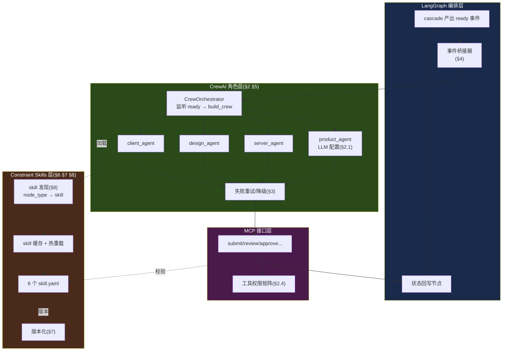
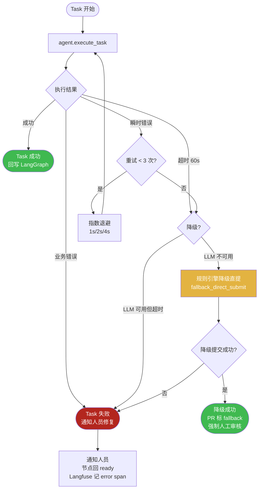
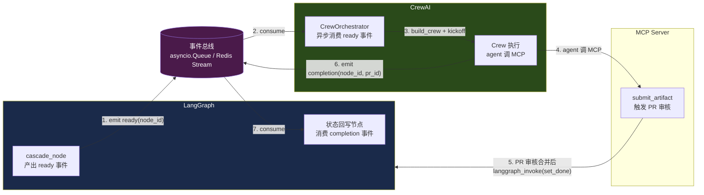
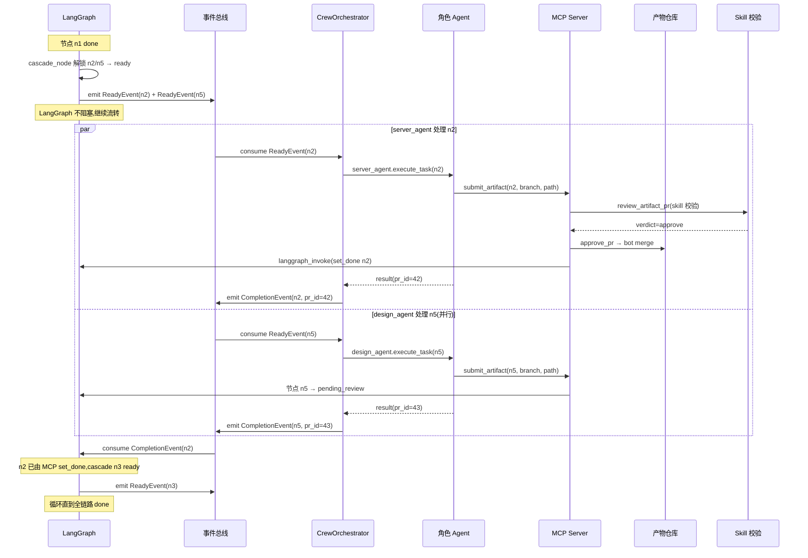
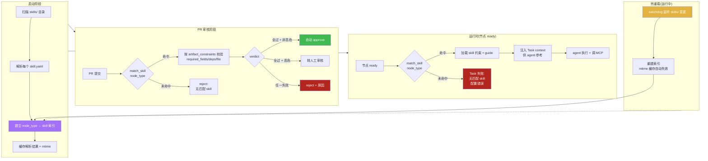

# FR3 角色协调(CrewAI)+ FR5 约束技能(Constraint Skills)深化设计

> **文档性质**:对《coordination-platform-prd.md》FR3 / FR5 的深化补充
> **版本**:v2.1 | **日期**:2026-08-04 | **状态**:待评审
> **父文档**:[coordination-platform-prd.md](../coordination-platform-prd.md)
> **调研依据**:[ai-multi-agent-dev-dashboard-research.md](../../research/ai-multi-agent-dev-dashboard-research.md) 第18章 CrewAI、第20章 Skills
> **关联深化**:[fr4-data-api.md](./fr4-data-api.md)(MCP 工具参数与错误码)、[fr1-fr6-artifact-review.md](./fr1-fr6-artifact-review.md)(审核闭环)

---

## 0. 文档范围与补全说明

本文针对 PRD v2.0 中 FR3(CrewAI 角色协调)与 FR5(Constraint Skills)的 8 个薄弱点进行深化:

| # | 薄弱点 | 深化章节 |
|---|---|---|
| 1 | CrewAI agent 的 LLM 配置(模型/temperature/max_tokens/cost) | §2.1 ~ §2.2 |
| 2 | agent 失败重试与降级策略 | §3(含 Mermaid 图) |
| 3 | CrewAI ↔ LangGraph 事件桥接(双向同步机制) | §4(含代码示例 + Mermaid 时序图) |
| 4 | 6 个完整 skill.yaml(原仅 api-contract-skill 示例) | §6.1 ~ §6.6 |
| 5 | skill 版本化与演进 | §7 |
| 6 | skill 发现与加载机制(运行时匹配/缓存/热重载) | §8(含 Mermaid 图) |
| 7 | agent 工具权限矩阵(细化到参数级) | §2.4 |
| 8 | CrewAI Process 模式选择(sequential vs hierarchical / 并行策略) | §5 |

**核心定位回顾**:Agent **不执行开发,只协调提交**。CrewAI 4 角色(product/server/design/client)agent 是"提交协调员",调用 MCP 工具把人员产出的产物引用提交到管理方。Constraint Skill 是 superpowers 风格的"约束 + 引导",定义"交什么"(元数据约束)+ 引导"建议交什么"(guide),不限制"怎么交"。

---

## 1. 深化总览图



---

## 2. CrewAI Agent 完整定义(深化点 1、7)

### 2.1 LLM 配置策略

Agent 职责是"协调提交"而非"开发",LLM 选型遵循三条原则:

| 原则 | 说明 |
|---|---|
| **工具调用可靠性优先** | agent 核心动作是调 MCP 工具,模型必须支持稳定 function calling,幻觉调错工具不可接受 |
| **低成本优先** | agent 不做创造性推理(代码/设计由人员完成),无需最强推理模型;用中等模型控成本 |
| **低 temperature 保稳定** | 协调提交是确定性流程,temperature 调低避免随机性导致工具参数漂移 |

**4 个 Agent 的 LLM 配置:**

| Agent | 推荐模型 | temperature | max_tokens | 选型理由 |
|---|---|---|---|---|
| `product_agent` | Claude Sonnet 4(或 GPT-4o) | 0.2 | 2048 | 需读懂 product_spec 上下文 + 引导人员补全验收标准;任务轻,中等模型够用 |
| `server_agent` | Claude Sonnet 4 | 0.2 | 2048 | 需校验 api_contract 产物引用与 deps 一致;契约字段结构化,工具调用为主 |
| `design_agent` | Claude Haiku 4(或 GPT-4o-mini) | 0.2 | 1024 | 任务最轻:提交 design_asset 引用(含 figma 链接),几乎无推理,用小模型省钱 |
| `client_agent` | Claude Sonnet 4 | 0.3 | 2048 | 需联调多端依赖(契约+设计+服务实现),上下文最复杂;temperature 略高以处理联调歧义 |

**说明:**
- `max_tokens` 限制输出长度:agent 输出主要是工具调用参数 + 简短说明,无需长输出。`design_agent` 用 1024 因任务最简单;其余 2048 留余量。
- `temperature` 统一低值(0.2~0.3):协调提交是确定性流程,不需要创造性。`client_agent` 联调场景略提到 0.3。
- 模型可配置(`config/llm.yaml`),不硬编码,支持切换 provider。`design_agent` 可降级到 Haiku 进一步省钱。

### 2.2 LLM 配置与 Agent 定义(代码)

```python
# crew/llm_config.py
from crewai import LLM
import os

# 集中配置,支持环境变量切换 provider/model
def make_llm(model: str, temperature: float, max_tokens: int) -> LLM:
    return LLM(
        model=model,                       # 如 "anthropic/claude-sonnet-4"
        temperature=temperature,
        max_tokens=max_tokens,
        api_key=os.getenv("LLM_API_KEY"),
        base_url=os.getenv("LLM_BASE_URL"),  # 支持代理/自托管
        timeout=30,                          # 单次 LLM 调用超时 30s
        max_retries=2,                        # LLM 层重试(provider 级)
    )

# 4 个 agent 的 LLM 配置(集中管理,便于调参)
LLM_CONFIG = {
    "product": make_llm("anthropic/claude-sonnet-4", 0.2, 2048),
    "server":  make_llm("anthropic/claude-sonnet-4", 0.2, 2048),
    "design":  make_llm("anthropic/claude-haiku-4",  0.2, 1024),
    "client":  make_llm("anthropic/claude-sonnet-4", 0.3, 2048),
}
```

```python
# crew/agents.py
from crewai import Agent

product_agent = Agent(
    role="产品经理协调员",
    goal="为 product_spec 节点协调提交:校验人员产出的需求文档引用,通过 MCP 提交 PR",
    backstory=(
        "你是产品需求提交协调员,不写需求文档。"
        "人员用任意工具(ECC/OpenSpec/custom)产出 product_spec 后,"
        "你校验产物引用存在、元数据齐全,调用 MCP submit_artifact 提 PR。"
    ),
    llm=LLM_CONFIG["product"],
    tools=[mcp_submit_artifact, mcp_update_progress, mcp_get_deps],
    allow_delegation=False,          # 不允许委托给其他 agent(职责隔离)
    max_iter=5,                      # 单 Task 最大迭代 5 次,防死循环
    max_rpm=30,                      # 每分钟最大请求数(限流)
    verbose=True,
)

server_agent = Agent(
    role="服务端开发协调员",
    goal="为 api_contract / server_impl / server_test 节点协调提交",
    backstory=(
        "你是服务端提交协调员,不写代码/契约。"
        "人员产出契约或实现引用后,你校验引用与 api_contract 一致性,"
        "调用 MCP 提交。契约类首次提交可 request_approval 触发人工审核。"
    ),
    llm=LLM_CONFIG["server"],
    tools=[mcp_submit_artifact, mcp_update_progress, mcp_get_deps, mcp_request_approval],
    allow_delegation=False,
    max_iter=5,
    max_rpm=30,
    verbose=True,
)

design_agent = Agent(
    role="UI 设计协调员",
    goal="为 design_proto / design_asset 节点协调提交(含 figma 链接校验)",
    backstory=(
        "你是设计提交协调员,不做设计。"
        "人员用 Figma 或任意工具产出原型/标注后,你校验 figma 链接可达、元数据齐全,调 MCP 提交。"
    ),
    llm=LLM_CONFIG["design"],
    tools=[mcp_submit_artifact, mcp_update_progress, mcp_get_deps],
    allow_delegation=False,
    max_iter=3,                       # 任务简单,迭代次数更少
    max_rpm=30,
    verbose=True,
)

client_agent = Agent(
    role="客户端开发协调员",
    goal="为 client_ui / client_func / client_delivery 节点协调提交",
    backstory=(
        "你是客户端提交协调员,不写客户端代码。"
        "你处理多端依赖(契约+设计+服务实现),校验联调依赖完整性后调 MCP 提交。"
        "交付物可 request_approval 触发最终审批。"
    ),
    llm=LLM_CONFIG["client"],
    tools=[mcp_submit_artifact, mcp_update_progress, mcp_get_deps, mcp_request_approval],
    allow_delegation=False,
    max_iter=5,
    max_rpm=30,
    verbose=True,
)

ROLE_TO_AGENT = {
    "product": product_agent,
    "server":  server_agent,
    "design":  design_agent,
    "client":  client_agent,
}
```

### 2.3 Cost 控制

| 控制层 | 指标 | 触发动作 |
|---|---|---|
| 单 Task | token 消耗 ≤ 10k(输入+输出) | 超限记录 warning,不强制中断(避免卡管线) |
| 单 Agent / 日 | 成本 ≤ $5(按模型价格折算) | 超限告警 Langfuse,新 Task 排队等待配额刷新 |
| 管线级 | 全链路 agent 成本 ≤ $50 | 超限告警,允许继续(不阻塞交付)但记审计 |
| 降级开关 | `design_agent` 可切 Haiku→本地小模型 | 配额紧张时自动降级,牺牲少量质量换成本 |

**实现**:每次 LLM 调用经 `@langfuse_trace` 记录 token + cost,按 agent_id 聚合日成本,超阈值触发告警(详见 FR7 监控)。

### 2.4 Agent 工具权限矩阵(细化到参数级)

PRD §3.2 仅到工具级。下表细化每个 agent 调用每个工具时的**参数约束**——这是 MCP Server 鉴权层(见 fr4-data-api.md §3)的强制校验依据:

| 工具 | product_agent | server_agent | design_agent | client_agent | 参数级约束(所有 agent 通用) |
|---|---|---|---|---|---|
| `submit_artifact` | ✅ node_type ∈ {product_spec} | ✅ node_type ∈ {api_contract, server_impl, server_test} | ✅ node_type ∈ {design_proto, design_asset} | ✅ node_type ∈ {client_ui, client_func, client_delivery} | `node_id` 必须属于本 agent 角色(按 pipeline.yaml 的 node.role 校验);`repo` 必须是注册的产物仓库;`branch` 命名 `feat/{role}/{node_type}-{seq}`;`toolspec_framework` 非空且 ≤ 64 字符 |
| `update_progress` | ✅ 仅本角色节点 | ✅ 仅本角色节点 | ✅ 仅本角色节点 | ✅ 仅本角色节点 | `node_id` 属于本角色;`status` ∈ {in_progress}(只能置 in_progress,不能置 done/blocked);`note` ≤ 500 字符 |
| `get_dependencies` | ✅ | ✅ | ✅ | ✅ | `node_id` 必须是调用方节点的上游(防越权读取无关节点产物) |
| `request_approval` | ❌ | ✅ node_type ∈ {api_contract} | ❌ | ✅ node_type ∈ {client_delivery} | `node_id` 属于本角色且为契约/交付物(首次/最终把关);`approver` 必须是合法 reviewer_id |
| `review_artifact_pr` | ❌ | ❌ | ❌ | ❌ | 仅管理方 bot/reviewer 可调(非角色 agent 工具) |
| `approve_pr` / `reject_pr` | ❌ | ❌ | ❌ | ❌ | 仅 reviewer/admin |
| `get_pipeline_state` | ✅ 只读 | ✅ 只读 | ✅ 只读 | ✅ 只读 | 无副作用,所有 agent 可查全局状态 |
| `set_gate_policy` | ❌ | ❌ | ❌ | ❌ | 仅 admin |

**关键约束说明:**
- **node_type 白名单**:agent 只能提交本角色产物类型,server_agent 不能提交 design_asset(防角色越权)。
- **node_id 归属校验**:MCP Server 查 pipeline.yaml 确认 `node.role == agent.role`,不符则返回 `FORBIDDEN_NODE_ROLE` 错误(对齐 fr4-data-api.md §2 错误码)。
- **update_progress 限制 status**:agent 只能置 `in_progress`,不能擅自置 `done`(必须经 PR 审核合并)或 `blocked`(由级联控制)。
- **get_dependencies 上游限制**:agent 只能读自己节点的上游产物,不能读无关节点(防信息泄漏)。

---

## 3. Agent 失败重试与降级(深化点 2)

### 3.1 失败分类

| 失败类型 | 示例 | 可重试? | 处理 |
|---|---|---|---|
| **LLM 调用失败** | 超时 / 限流(429) / provider 不可用 | ✅ | 指数退避重试,降级备用模型 |
| **MCP 工具调用失败 - 瞬时** | 产物仓库 git 不可达 / 网络抖动 | ✅ | 指数退避重试 |
| **MCP 工具调用失败 - 业务** | 元数据校验失败 / 依赖未 done / 权限拒绝 | ❌ | 不重试,Task 失败 + 通知人员修复 |
| **Agent 输出格式错误** | 未正确调用工具 / 参数缺失 | ✅(有限) | 重试 1 次,附错误反馈让 LLM 修正 |
| **Task 超时** | 单 Task 超 60s | ❌ | 中断,降级到规则引擎直提 |

### 3.2 重试策略

```python
# crew/retry.py
import asyncio
from tenacity import retry, stop_after_attempt, wait_exponential, retry_if_exception_type

class TransientError(Exception):
    """可重试的瞬时错误(LLM 超时/限流/网络抖动)"""
class BusinessError(Exception):
    """不可重试的业务错误(校验失败/权限拒绝)"""

@retry(
    stop=stop_after_attempt(3),                          # 最多 3 次
    wait=wait_exponential(multiplier=1, min=1, max=8),   # 指数退避 1s/2s/4s
    retry=retry_if_exception_type(TransientError),       # 仅重试瞬时错误
    reraise=True,                                         # 重试耗尽后抛原异常
)
async def execute_task_with_retry(task: Task, agent: Agent) -> dict:
    try:
        result = await agent.execute_task(task)
        return result
    except LLMTimeoutError as e:
        raise TransientError(f"LLM 超时: {e}")
    except RateLimitError as e:
        raise TransientError(f"限流,稍后重试: {e}")
    except GitRepoUnreachableError as e:
        raise TransientError(f"产物仓库不可达: {e}")
    except (MetadataValidationError, DependencyNotDoneError, ForbiddenNodeRoleError) as e:
        raise BusinessError(f"业务错误,不重试: {e}")
```

### 3.3 超时与降级

| 机制 | 配置 | 降级动作 |
|---|---|---|
| 单 Task 超时 | 60s | 中断 Task,尝试**规则引擎降级直提**(见下) |
| 单 Agent max_iter | product/server/client=5,design=3 | 超限 Task 失败,通知人员 |
| Crew 整体超时 | 5 min(多 Task 累计) | 未完成 Task 标失败,已完成的不回滚 |
| LLM provider 不可用 | 心跳检测 | 切备用 provider(如 Anthropic→OpenAI) |

**规则引擎降级(关键逃生通道)**:当 LLM 持续不可用,agent 无法"理解上下文后调工具"时,降级为**直接构造 MCP 调用**——绕过 LLM 推理,用规则从 node 元数据(deps、role、type)直接拼装 `submit_artifact` 参数。牺牲"智能校验"换"流程不卡死"。

```python
# crew/fallback.py
async def fallback_direct_submit(node_id: str, state: PipelineState) -> dict:
    """LLM 不可用时的降级:规则引擎直接拼参数提交,不走 LLM 推理"""
    node = get_node(node_id)
    # 规则:从 node 配置 + 产物仓库约定直接推导提交参数
    branch = f"feat/{node['role']}/{node['type']}-{node_id}"
    path = f"{node['type']}/{node_id}.yaml"          # 约定路径
    # 校验产物已在分支上(git ls-file)
    if not verify_artifact_on_branch(ARTIFACT_REPO, branch, path):
        return {"ok": False, "error": "降级提交失败:产物文件不存在", "need_human": True}
    # 直接调 MCP(不经 LLM)
    return await mcp_submit_artifact(
        node_id=node_id, repo=ARTIFACT_REPO, branch=branch,
        path=path, toolspec_framework="fallback", deps_decl=node.get("deps", []),
    )
```

**降级原则**:降级提交的 PR 标记 `submitter=fallback-engine`,审核时 `requires_human_review` 强制提级为 true(规则引擎无智能校验,需人工把关)。

### 3.4 Mermaid 图:Agent 失败重试流程



### 3.5 失败后的状态处理

| 失败场景 | 节点状态 | 后续 |
|---|---|---|
| Task 失败(LLM/业务错误) | 回 `ready`(可重试) | 通知人员;CrewOrchestrator 重新入队等待下次 ready 事件 |
| 降级直提成功 | `pending_review` | 正常审核流(但强制人工审) |
| 降级直提失败 | 回 `ready` + `need_human=True` | 节点标记需人工介入,Dashboard 高亮告警 |
| Task 超时 | 回 `ready` | 限流:同一节点连续 3 次超时 → 暂停自动重试,转人工 |

---

## 4. CrewAI ↔ LangGraph 事件桥接(深化点 3)

### 4.1 桥接架构

PRD FR3.3 仅列了事件表,未定义双向同步机制。本节定义两种桥接模式,推荐**事件队列模式**(解耦):

| 模式 | 机制 | 优缺点 |
|---|---|---|
| **同步调用模式**(PRD FR2.4 现有) | LangGraph `crewai_assign` 节点直接同步调 CrewAI `crew.kickoff()` | 简单;但 LangGraph 阻塞等 CrewAI 完成,长任务卡状态机;CrewAI 失败拖垮 LangGraph |
| **事件队列模式**(本文推荐) | LangGraph 写 ready 事件到队列;CrewOrchestrator 异步消费;CrewAI 完成后回写事件 | 解耦,LangGraph 不阻塞;CrewAI 失败不波及编排;支持多 Crew 并行 |

**事件队列模式架构:**



### 4.2 事件契约

两类事件,JSON 结构固定:

```python
# crew/event_bridge.py
from pydantic import BaseModel

class ReadyEvent(BaseModel):
    """LangGraph → CrewAI:节点就绪,需分配 agent"""
    event_type: str = "node_ready"          # 固定
    node_id: str
    node_type: str                          # product_spec / api_contract / ...
    role: str                               # product / server / design / client
    deps_info: list[dict]                   # 上游产物引用 + 内容摘要(供 agent 参考)
    trace_id: str                           # Langfuse trace 贯穿

class CompletionEvent(BaseModel):
    """CrewAI → LangGraph:Task 完成(无论成功/失败/降级)"""
    event_type: str                          # task_completed / task_failed / task_fallback
    node_id: str
    pr_id: int | None                       # 成功时填充
    error: str | None                       # 失败时填充
    fallback_used: bool = False             # 是否用了降级直提
    trace_id: str
```

### 4.3 双向同步机制(代码示例)

```python
# crew/event_bridge.py
import asyncio
from langgraph.graph import StateGraph

class EventBridge:
    """CrewAI ↔ LangGraph 事件桥接器(事件队列模式)"""

    def __init__(self, langgraph_app, mcp_server):
        self.ready_queue: asyncio.Queue[ReadyEvent] = asyncio.Queue()
        self.completion_queue: asyncio.Queue[CompletionEvent] = asyncio.Queue()
        self.langgraph_app = langgraph_app
        self.mcp = mcp_server
        self._orchestrator_task: asyncio.Task | None = None
        self._writeback_task: asyncio.Task | None = None

    # ---------- LangGraph → CrewAI ----------

    async def on_langgraph_ready(self, node_id: str, state: PipelineState):
        """LangGraph cascade_node 产出 ready 事件时调用(注册为 LangGraph callback)"""
        node = get_node(node_id)
        deps_info = self._collect_deps_info(node_id, state)
        event = ReadyEvent(
            node_id=node_id, node_type=node["type"], role=node["role"],
            deps_info=deps_info, trace_id=state.get("current_trace_id", ""),
        )
        await self.ready_queue.put(event)
        # LangGraph 不阻塞等待 CrewAI,直接返回(异步解耦)

    async def _crew_orchestrator(self):
        """异步消费 ready 事件 → build_crew → 执行(独立协程)"""
        while True:
            event: ReadyEvent = await self.ready_queue.get()
            try:
                await self._handle_ready(event)
            except Exception as e:
                # 失败回写 completion(失败事件)
                await self.completion_queue.put(CompletionEvent(
                    event_type="task_failed", node_id=event.node_id,
                    error=str(e), trace_id=event.trace_id,
                ))

    async def _handle_ready(self, event: ReadyEvent):
        agent = ROLE_TO_AGENT[event.role]
        task = Task(
            description=f"为节点 {event.node_id}({event.node_type})协调提交产物",
            agent=agent,
            expected_output="产物 PR 已提交,等待审核",
            context={"node_id": event.node_id, "deps_info": event.deps_info},
        )
        crew = Crew(agents=[agent], tasks=[task], process=Process.sequential)
        try:
            result = await execute_task_with_retry(task, agent)  # §3.2 重试
            pr_id = self._extract_pr_id(result)
            await self.completion_queue.put(CompletionEvent(
                event_type="task_completed", node_id=event.node_id,
                pr_id=pr_id, trace_id=event.trace_id,
            ))
        except BusinessError as e:
            await self.completion_queue.put(CompletionEvent(
                event_type="task_failed", node_id=event.node_id,
                error=str(e), trace_id=event.trace_id,
            ))

    # ---------- CrewAI → LangGraph ----------

    async def _state_writeback(self):
        """异步消费 completion 事件 → 回写 LangGraph 状态(独立协程)"""
        while True:
            event: CompletionEvent = await self.completion_queue.get()
            if event.event_type == "task_failed":
                # 失败:节点回 ready,记录 error 事件(累积追加)
                await self.langgraph_app.ainvoke({
                    "node_states_update": {event.node_id: NodeStatus.READY},
                    "events": [{"type": "task_failed", "node": event.node_id, "error": event.error}],
                })
                # 通知人员(飞书/Slack,详见 FR8)
                await notify_human(event.node_id, event.error)
            elif event.event_type == "task_completed":
                # 成功:节点进 pending_review(submit_artifact 已触发 PR,状态由 MCP 写)
                # 这里仅记录 completion 事件,实际状态由 MCP approve_pr 后 set_done
                await self.langgraph_app.ainvoke({
                    "events": [{"type": "task_completed", "node": event.node_id, "pr_id": event.pr_id}],
                })

    def start(self):
        """启动桥接器(在 main.py 中调用)"""
        self._orchestrator_task = asyncio.create_task(self._crew_orchestrator())
        self._writeback_task = asyncio.create_task(self._state_writeback())

    def _collect_deps_info(self, node_id, state) -> list[dict]:
        """收集上游产物引用 + 内容摘要"""
        deps_info = []
        for dep_id in get_upstream(node_id):
            ref = state["artifact_refs"].get(dep_id)
            if ref:
                content = fetch_artifact_content(ref)  # git show
                deps_info.append({"node_id": dep_id, "ref": ref, "summary": content[:500]})
        return deps_info
```

**关键设计点:**
1. **LangGraph 不阻塞**:cascade_node 产出 ready 事件后立即返回,不等 CrewAI 完成。CrewAI 在独立协程异步执行。
2. **状态回写分离**:CrewAI 完成 → 写 completion 事件 → 独立协程回写 LangGraph。即使回写失败,CrewAI 已完成的 PR 不丢失(MCP 已记录)。
3. **事件累积**:`events` 字段用 `Annotated[Sequence, operator.add]`(PRD FR2.3),completion/failed 事件累积追加,不覆盖。
4. **实际状态由 MCP 驱动**:`task_completed` 只记录事件;节点真正变 `done` 是 PR 审核合并后 MCP `approve_pr` → `langgraph_invoke(set_done)`(见 fr1-fr6-artifact-review.md)。桥接器不直接置 done,避免绕过审核。

### 4.4 LangGraph callback 注册(触发 ready 事件)

```python
# orchestration/langgraph_pipeline.py
from langgraph.graph import StateGraph

def build_graph(bridge: EventBridge):
    graph = StateGraph(PipelineState)

    async def cascade_node(state: PipelineState) -> dict:
        updates = {}
        for node_id, status in state["node_states"].items():
            if status == NodeStatus.DONE:
                for downstream in get_downstream(node_id):
                    if all_deps_done(downstream, state) and \
                       state["node_states"][downstream] == NodeStatus.BLOCKED:
                        state["node_states"][downstream] = NodeStatus.READY
                        # ★ 触发 ready 事件给 CrewAI(非阻塞)
                        await bridge.on_langgraph_ready(downstream, state)
        return {"node_states": state["node_states"]}

    graph.add_node("cascade_node", cascade_node)
    # ... 其余节点
    return graph.compile()
```

### 4.5 Mermaid 图:CrewAI ↔ LangGraph 事件桥接时序



**时序关键点:**
- ready 事件从 LangGraph 异步发出,CrewAI 异步消费,两者解耦。
- `submit_artifact` 后节点进 `pending_review`,**审核合并后** MCP 才 `set_done`(不绕过审核闭环)。
- n2/n5 两个 ready 事件并行消费,server_agent 与 design_agent 并行执行。
- CompletionEvent 回写 LangGraph 仅记录事件流;真正状态推进由 MCP 驱动(单一状态写入源,避免竞争)。

---

## 5. CrewAI Process 模式选择(深化点 8)

### 5.1 模式对比

| 模式 | 机制 | 适用场景 | 本平台适用性 |
|---|---|---|---|
| `Process.sequential` | Task 串行执行,前一个完成才下一个 | 有依赖的 Task 链 | ✅ 同角色多节点串行 |
| `Process.hierarchical` | manager agent 协调,可并行 + 动态分配 | 复杂任务分解 + 并行 | ⚠️ 引入额外 manager agent,增成本与延迟 |

### 5.2 本平台并行策略

**核心洞察**:每个 ready 节点已绑定 `role`,Task 已绑定对应 agent。sequential 模式下不同 agent 的 Task 仍会串行。要并行需按角色分组:

**策略:按角色分组,每角色一个 Crew,多 Crew 并行**

```python
# crew/crew_orchestrator.py
async def handle_ready_batch(events: list[ReadyEvent]):
    """一批 ready 事件 → 按角色分组 → 每组一个 Crew → 多 Crew 并行"""
    by_role: dict[str, list[ReadyEvent]] = {}
    for e in events:
        by_role.setdefault(e.role, []).append(e)

    async def run_role_crew(role: str, role_events: list[ReadyEvent]):
        agent = ROLE_TO_AGENT[role]
        tasks = [build_task(e, agent) for e in role_events]
        # 同角色内 sequential(避免同角色节点并发提交冲突)
        crew = Crew(agents=[agent], tasks=tasks, process=Process.sequential)
        return await crew.kickoff_async()

    # 不同角色 Crew 并行(hierarchical 无需,用 asyncio.gather 即可)
    results = await asyncio.gather(
        *[run_role_crew(role, evs) for role, evs in by_role.items()],
        return_exceptions=True,  # 单角色失败不拖垮其他角色
    )
    return results
```

**为何不用 hierarchical:**
1. 本平台角色固定(4 个),无需 manager 动态分配——role 已由 pipeline.yaml 声明。
2. hierarchical 的 manager agent 额外消耗 LLM token,增成本。
3. `asyncio.gather` 并行多 Crew 已足够,且失败隔离更好(单 Crew 异常不影响其他)。

### 5.3 并发控制

| 维度 | 限制 | 理由 |
|---|---|---|
| 同角色节点 | 串行(sequential) | 避免同角色 agent 并发提交冲突(如 server 多节点抢同一产物仓库分支) |
| 不同角色 | 并行(gather) | server/design/product/client 互不依赖,天然并行 |
| 全局并发 Crew | ≤ 4(每角色一个) | 对应 4 角色 |
| 单 agent 并发 Task | 1(max_rpm 限流) | CrewAI 单 agent 串行处理 Task |

---

## 6. 6 个完整 skill.yaml(深化点 4)

PRD FR5.2 仅给出 `api-contract-skill` 示例。本节补全全部 6 个,均含 `artifact_constraints` / `file_constraints` / `guide_summary` / `allowed_mcp_tools`。版本字段见 §7。

### 6.1 product-spec-skill

```yaml
# skills/product-spec-skill/skill.yaml
name: product-spec-skill
version: "1.0.0"
description: 约束产品需求文档 product_spec 的提交规范
trigger:
  node_type: product_spec
  role: product
artifact_constraints:
  required_fields:
    - title
    - version                   # semver,如 1.0.0
    - source.repo
    - source.path
    - source.commit
    - toolspec.framework        # 不限取值(ECC/OpenSpec/custom 均可)
  deps: []                      # 根节点,无依赖
  min_version: {}
  file_constraints:
    allowed_extensions: [.yaml, .yml, .json, .md]
    max_size_kb: 512
    min_size_kb: 1              # 防空文件
  requires_human_review: false  # 需求文档,自动审核
guide_ref: guide.md
guide_summary: |
  建议 product_spec 包含:需求背景、用户故事、验收标准、非功能需求。
  可用 ECC / OpenSpec / 自定义格式,管理方不解析内容。
  建议含优先级与影响范围,供下游 api_contract/design 评估工作量。
allowed_mcp_tools:
  - submit_artifact
  - update_progress
  - get_dependencies
```

### 6.2 api-contract-skill(完善示例)

```yaml
# skills/api-contract-skill/skill.yaml
name: api-contract-skill
version: "1.1.0"
description: 约束服务端 api_contract 产物的提交规范
trigger:
  node_type: api_contract
  role: server
artifact_constraints:
  required_fields:
    - title
    - version                   # semver
    - source.repo
    - source.path
    - source.commit
    - toolspec.framework        # spec-kit / OpenSpec / custom 均可
  deps:
    - product_spec              # 必须依赖需求文档
  min_version:
    product_spec: "1.0.0"       # 依赖的 product_spec 最低版本
  file_constraints:
    allowed_extensions: [.yaml, .yml, .json]
    max_size_kb: 1024           # 契约可能较大
    min_size_kb: 1
  requires_human_review: true   # 首次契约影响下游多端,人工把关
guide_ref: guide.md
guide_summary: |
  建议 api_contract 包含:端点(method+path)、请求/响应 schema、错误码、鉴权方式。
  可用 spec-kit、OpenSpec 或自定义格式,管理方不解析内容。
  建议含版本化策略(URI 版本 / header 版本),供客户端适配。
  变更契约需 bump version 并通知下游(client_ui/client_func 自动 blocked)。
allowed_mcp_tools:
  - submit_artifact
  - update_progress
  - get_dependencies
  - request_approval            # 契约可请求审批
```

### 6.3 design-handoff-skill

```yaml
# skills/design-handoff-skill/skill.yaml
name: design-handoff-skill
version: "1.0.0"
description: 约束设计交接产物(design_proto / design_asset)的提交规范
trigger:
  node_type: [design_proto, design_asset]   # 一个 skill 覆盖两种设计产物
  role: design
artifact_constraints:
  required_fields:
    - title
    - version
    - source.repo
    - source.path
    - source.commit
    - toolspec.framework        # Figma / TemPad / custom 均可
  deps:
    - product_spec              # 设计依赖需求
  min_version:
    product_spec: "1.0.0"
  file_constraints:
    allowed_extensions: [.json, .md]          # figma 链接 JSON 或标注 Markdown
    max_size_kb: 2048                          # 标注文件可能含图片引用
    min_size_kb: 1
    requires_figma_link: true                  # design_asset 必须含 figma 链接(自定义约束)
  requires_human_review: true                  # 标注/切图影响客户端实现
guide_ref: guide.md
guide_summary: |
  design_proto:建议含页面流、交互说明、状态图。
  design_asset:必须含 figma 链接(源文件)+ 标注(尺寸/颜色/字体)+ 切图引用。
  可用 Figma / 即时设计 / TemPAD 导出,管理方不解析内容。
  标注建议含响应式断点与暗色模式变体。
allowed_mcp_tools:
  - submit_artifact
  - update_progress
  - get_dependencies
```

### 6.4 server-impl-skill

```yaml
# skills/server-impl-skill/skill.yaml
name: server-impl-skill
version: "1.0.0"
description: 约束服务端实现引用(server_impl / server_test)的提交规范
trigger:
  node_type: [server_impl, server_test]
  role: server
artifact_constraints:
  required_fields:
    - title
    - version
    - source.repo                # 代码仓库地址(非产物仓库)
    - source.path                # 代码路径
    - source.commit              # 代码 commit hash
    - toolspec.framework        # Claude Code / Cursor / custom
  deps:
    - api_contract              # 实现依赖契约
  min_version:
    api_contract: "1.0.0"
  file_constraints:
    allowed_extensions: [.json]                # 仅引用文件(ref.json)
    max_size_kb: 64                            # 引用文件很小
    min_size_kb: 1
    must_contain: [commit, repo]               # 引用必须含代码 commit(自定义约束)
  requires_human_review: false                 # 仅引用,代码在代码仓库审
guide_ref: guide.md
guide_summary: |
  server_impl:提交代码仓库的 commit 引用(不提交代码内容)。
  建议引用的 commit 已通过代码仓库 CI(lint/test)。
  server_test:提交测试报告引用,建议含覆盖率数据。
  管理方不解析代码内容,仅校验引用存在性。
  代码质量由代码仓库的 gate 节点(coverage_min)把控。
allowed_mcp_tools:
  - submit_artifact
  - update_progress
  - get_dependencies
```

### 6.5 client-ui-skill

```yaml
# skills/client-ui-skill/skill.yaml
name: client-ui-skill
version: "1.0.0"
description: 约束客户端 UI 实现(client_ui)的提交规范
trigger:
  node_type: client_ui
  role: client
artifact_constraints:
  required_fields:
    - title
    - version
    - source.repo                # 客户端代码仓库
    - source.path
    - source.commit
    - toolspec.framework        # Cursor / Claude Code / custom
  deps:
    - api_contract              # UI 依赖接口契约(数据绑定)
    - design_asset              # UI 依赖设计标注(视觉还原)
  min_version:
    api_contract: "1.0.0"
    design_asset: "1.0.0"
  file_constraints:
    allowed_extensions: [.json]                # 引用文件
    max_size_kb: 64
    min_size_kb: 1
  requires_human_review: false                 # UI 实现,代码在代码仓库审
guide_ref: guide.md
guide_summary: |
  client_ui:提交客户端代码仓库的 commit 引用。
  建议实现已对照 design_asset 还原视觉,并按 api_contract 对接数据层。
  建议含组件清单与页面路由,供 client_func 联调参考。
  管理方不解析代码内容,仅校验引用存在性 + 依赖完整性。
allowed_mcp_tools:
  - submit_artifact
  - update_progress
  - get_dependencies
```

### 6.6 client-delivery-skill

```yaml
# skills/client-delivery-skill/skill.yaml
name: client-delivery-skill
version: "1.0.0"
description: 约束客户端交付物(client_func / client_delivery)的提交规范
trigger:
  node_type: [client_func, client_delivery]
  role: client
artifact_constraints:
  required_fields:
    - title
    - version
    - source.repo
    - source.path
    - source.commit
    - toolspec.framework
  deps:
    - client_ui                 # 功能依赖 UI 实现
    - server_impl               # 联调依赖服务端实现
  min_version:
    client_ui: "1.0.0"
    server_impl: "1.0.0"
  file_constraints:
    allowed_extensions: [.json, .md]            # 引用 + 联调报告(Markdown)
    max_size_kb: 256
    min_size_kb: 1
  requires_human_review: true                  # 交付物最终把关
guide_ref: guide.md
guide_summary: |
  client_func:提交联调结果引用,建议含联调通过的端点清单 + 异常处理记录。
  client_delivery:提交交付包引用,建议含交付清单、版本说明、已知问题。
  联调建议覆盖:正常流程 + 错误码处理 + 边界条件。
  交付物需对照 product_spec 验收标准自检。
allowed_mcp_tools:
  - submit_artifact
  - update_progress
  - get_dependencies
  - request_approval            # 交付物可请求最终审批
```

### 6.7 Skill 约束摘要对照表

| Skill | node_type | deps 必含 | requires_human_review | allowed_mcp_tools 数 |
|---|---|---|---|---|
| product-spec-skill | product_spec | 无 | false | 3 |
| api-contract-skill | api_contract | product_spec | true | 4 |
| design-handoff-skill | design_proto / design_asset | product_spec | true | 3 |
| server-impl-skill | server_impl / server_test | api_contract | false | 3 |
| client-ui-skill | client_ui | api_contract + design_asset | false | 3 |
| client-delivery-skill | client_func / client_delivery | client_ui + server_impl | true | 4 |

---

## 7. Skill 版本化与演进(深化点 5)

### 7.1 版本管理策略

每个 skill.yaml 含 `version` 字段(semver: `MAJOR.MINOR.PATCH`):

| 版本号变更 | 含义 | 兼容性 |
|---|---|---|
| PATCH(1.0.0→1.0.1) | guide.md 更新 / 注释调整 / 修复约束笔误 | 完全向后兼容,旧产物不受影响 |
| MINOR(1.0.0→1.1.0) | 新增可选约束字段 / 新增 allowed_mcp_tools | 向后兼容,旧产物缺新字段不报错(可选字段) |
| MAJOR(1.0.0→2.0.0) | 新增必填字段 / 删除字段 / 改约束语义 | **不向后兼容**,旧产物引用需重新审核 |

### 7.2 产物记录 skill 版本

产物 PR 审核时,审计日志记录所用 skill 版本(扩展 PRD §5.2 AuditLogEntry):

```json
{
  "audit_id": "aud_20260804_001",
  "skill_used": "api-contract-skill",
  "skill_version": "1.1.0",
  "skill_verdict": "approve"
}
```

**已 done 产物的 skill 版本不可追溯变更**:产物合并时锁定 skill 版本,后续 skill 升级不影响已合并产物(避免历史产物被新约束打回)。

### 7.3 Skill 升级对历史产物的影响

| 场景 | 影响 | 处理 |
|---|---|---|
| skill PATCH/MINOR 升级 | 已 done 产物不受影响(锁定旧版本) | 新提交的 PR 用新版本校验 |
| skill MAJOR 升级(新增必填字段) | 已 done 产物不受影响;**重新提交变更**时按新版本校验,可能因缺字段被 reject | 提交方需补字段后重提 |
| skill 新增(新增 node_type) | 不影响现有节点 | 新节点类型用新 skill |
| skill 废弃 | 已 done 产物保留历史引用 | 新节点不再匹配该 skill(需迁移到新 skill) |

**MAJOR 升级迁移流程:**
1. 新 skill 版本发布,旧版本标记 `deprecated: true`(仍可用,但警告)
2. 宽限期(如 2 周):提交方可选新旧版本
3. 宽限期后:旧版本下线,重新提交必须用新版本(缺字段会被 reject,需补)

### 7.4 Skill 仓库与发布

Skill 文件存 `skills/` 目录(随管理方代码仓库版本化)。Skill 变更走管理方仓库 PR(人工评审),合并后触发 skill 索引重建(§8.3 热重载)。

---

## 8. Skill 发现与加载机制(深化点 6)

### 8.1 运行时匹配 node_type → skill

**启动时建立 skill 索引:**

```python
# skills/registry.py
import os, yaml
from pathlib import Path

class SkillRegistry:
    """skill 发现 + 索引 + 缓存"""

    def __init__(self, skills_dir: str = "skills/"):
        self.skills_dir = Path(skills_dir)
        self.index: dict[str, dict] = {}        # node_type → skill 配置
        self.cache: dict[str, dict] = {}        # skill_name → 解析后的 yaml(mtime 校验)
        self.mtimes: dict[str, float] = {}      # skill_name → 文件 mtime

    def build_index(self):
        """启动时扫描 skills/ 目录,建立 node_type → skill 映射"""
        for skill_dir in self.skills_dir.iterdir():
            if not skill_dir.is_dir():
                continue
            yaml_path = skill_dir / "skill.yaml"
            if not yaml_path.exists():
                continue
            skill = self._load_cached(str(yaml_path))
            trigger = skill.get("trigger", {})
            node_types = trigger.get("node_type", [])
            if isinstance(node_types, str):
                node_types = [node_types]
            for nt in node_types:
                if nt in self.index:
                    raise ValueError(f"node_type {nt} 重复匹配 skill: "
                                     f"{self.index[nt]['name']} vs {skill['name']}")
                self.index[nt] = skill

    def match_skill(self, node_type: str) -> dict | None:
        """运行时按 node_type 匹配 skill(节点 ready 时调用)"""
        return self.index.get(node_type)

    def _load_cached(self, yaml_path: str) -> dict:
        """加载 skill.yaml,带 mtime 校验的缓存"""
        mtime = os.path.getmtime(yaml_path)
        skill_name = Path(yaml_path).parent.name
        if skill_name in self.cache and self.mtimes.get(skill_name) == mtime:
            return self.cache[skill_name]       # 缓存命中
        with open(yaml_path) as f:
            skill = yaml.safe_load(f)
        self.cache[skill_name] = skill
        self.mtimes[skill_name] = mtime
        return skill
```

### 8.2 Skill 加载流程

节点 ready 时,EventBridge 在构造 Task context 时加载 skill:

```python
# crew/crew_orchestrator.py(§4.3 _handle_ready 扩展)
async def _handle_ready(self, event: ReadyEvent):
    skill = skill_registry.match_skill(event.node_type)
    if not skill:
        # 无匹配 skill:节点不允许提交(配置错误)
        await self.completion_queue.put(CompletionEvent(
            event_type="task_failed", node_id=event.node_id,
            error=f"无匹配 skill for node_type {event.node_type}", trace_id=event.trace_id,
        ))
        return
    agent = ROLE_TO_AGENT[event.role]
    task = Task(
        description=f"为节点 {event.node_id}({event.node_type})协调提交产物",
        agent=agent,
        expected_output="产物 PR 已提交",
        context={
            "node_id": event.node_id,
            "deps_info": event.deps_info,
            "skill": {                       # 注入 skill 给 agent 参考
                "name": skill["name"],
                "guide_summary": skill.get("guide_summary", ""),
                "allowed_mcp_tools": skill.get("allowed_mcp_tools", []),
                "required_fields": skill["artifact_constraints"]["required_fields"],
            },
        },
    )
    # ... 执行 Task
```

**PR 审核时也用 skill 校验**(对齐 fr1-fr6-artifact-review.md):

```python
# mcp_server/tools.py(review_artifact_pr)
async def review_artifact_pr(pr_id: int) -> dict:
    pr = await get_pr_detail(pr_id)
    node_type = pr["template"]["node_type"]
    skill = skill_registry.match_skill(node_type)   # 同一 skill 索引
    # 用 skill.artifact_constraints 校验元数据/依赖/文件格式
    ...
```

### 8.3 热重载

监听 `skills/` 目录变更,更新索引和缓存(无需重启):

```python
# skills/registry.py
from watchdog.observers import Observer
from watchdog.events import FileSystemEventHandler

class SkillHotReloadHandler(FileSystemEventHandler):
    def __init__(self, registry: SkillRegistry):
        self.registry = registry

    def on_modified(self, event):
        if event.src_path.endswith("skill.yaml"):
            self.registry.build_index()       # 重建索引(mtime 缓存自动失效)
            logger.info("skill 索引已热重载")

def start_hot_reload(registry: SkillRegistry):
    observer = Observer()
    observer.schedule(SkillHotReloadHandler(registry), registry.skills_dir, recursive=True)
    observer.start()
```

**热重载安全约束:**
- 热重载仅影响**新 ready 节点**和**新 PR 审核**。
- 已 `pending_review` 的 PR 按提交时的 skill 版本审核(避免中途换规则导致结果不一致)——审核时从审计上下文恢复提交时的 skill 版本。

### 8.4 Mermaid 图:Skill 发现与加载流程



---

## 9. 验收标准补充

在 PRD FR3.4 / FR5.5 基础上补充:

### FR3 补充验收

- AC3.4: 4 个 agent 的 LLM 配置(模型/temperature/max_tokens)可配置且生效(config/llm.yaml)
- AC3.5: agent Task 失败时,瞬时错误自动重试 ≤ 3 次(指数退避),业务错误不重试
- AC3.6: LLM 不可用时,降级规则引擎能直提 PR(标记 fallback + 强制人工审)
- AC3.7: LangGraph ready 事件异步触发 CrewAI,LangGraph 不阻塞等待
- AC3.8: CompletionEvent 回写 LangGraph,失败 Task 节点回 ready + 通知人员
- AC3.9: 不同角色 Crew 并行执行(asyncio.gather),同角色节点串行
- AC3.10: agent 越权提交(如 server_agent 提交 design_asset)被 MCP 拒绝(FORBIDDEN_NODE_ROLE)
- AC3.11: 单 Task 超 60s 被中断,触发降级或失败通知

### FR5 补充验收

- AC5.7: 6 个 skill.yaml 均可被 skill_registry 加载,索引建立成功
- AC5.8: 节点 ready 时按 node_type 匹配到正确 skill(含多 node_type 的 skill 如 design-handoff)
- AC5.9: skill.yaml 变更后热重载生效,无需重启(watchdog 监听)
- AC5.10: skill 缓存命中时(mtime 未变)不重复解析 yaml
- AC5.11: skill MAJOR 升级后,已 done 产物不受影响;重新提交时按新版本校验
- AC5.12: 审计日志记录 skill_used + skill_version
- AC5.13: 无匹配 skill 的节点提交被拒(配置错误保护)
- AC5.14: guide_summary 内容注入 agent context 可见,但不强制

---

## 10. 与其他深化文档的衔接

| 衔接点 | 关联文档 | 说明 |
|---|---|---|
| MCP 工具参数 schema / 错误码 | [fr4-data-api.md](./fr4-data-api.md) §2 §9 | agent 调 MCP 时的错误码(FORBIDDEN_NODE_ROLE 等)对齐 |
| PR 审核闭环 / review_artifact_pr | [fr1-fr6-artifact-review.md](./fr1-fr6-artifact-review.md) | skill 约束校验是审核流程的一环 |
| Langfuse trace 埋点 | PRD FR7 | agent Task 执行 + 失败/降级均记 Langfuse span |
| LangGraph state schema | PRD FR2.3 / §5.1 | CompletionEvent 回写 events 字段(累积追加) |
| Agent 注册与心跳 | 调研报告 §13.1(4) | CrewOrchestrator 消费 ready 事件前查 AgentRegistry 确认 agent 在线 |

---

## 附录 A:配置文件汇总

### llm.yaml(可选,集中管理 LLM 配置)

```yaml
# config/llm.yaml
agents:
  product:
    model: anthropic/claude-sonnet-4
    temperature: 0.2
    max_tokens: 2048
    max_iter: 5
    max_rpm: 30
    daily_cost_limit_usd: 5
  server:
    model: anthropic/claude-sonnet-4
    temperature: 0.2
    max_tokens: 2048
    max_iter: 5
    max_rpm: 30
    daily_cost_limit_usd: 5
  design:
    model: anthropic/claude-haiku-4
    temperature: 0.2
    max_tokens: 1024
    max_iter: 3
    max_rpm: 30
    daily_cost_limit_usd: 3
  client:
    model: anthropic/claude-sonnet-4
    temperature: 0.3
    max_tokens: 2048
    max_iter: 5
    max_rpm: 30
    daily_cost_limit_usd: 5
pipeline:
  total_cost_limit_usd: 50
task:
  timeout_sec: 60
retry:
  max_attempts: 3
  backoff: exponential
  min_wait_sec: 1
  max_wait_sec: 8
fallback:
  enabled: true
  force_human_review: true
```

### 目录结构补充(PRD §23.2 扩展)

```
coordination-platform/
├─ crew/
│  ├─ agents.py                 # 4 角色 Agent(§2.2)
│  ├─ llm_config.py             # LLM 配置(§2.1)
│  ├─ crew_orchestrator.py      # Crew 编排 + 并行(§4.3 §5.2)
│  ├─ event_bridge.py           # 事件桥接器(§4.3)
│  ├─ retry.py                  # 失败重试(§3.2)
│  └─ fallback.py               # 规则引擎降级(§3.3)
├─ skills/
│  ├─ registry.py               # skill 发现 + 索引 + 热重载(§8)
│  ├─ product-spec-skill/
│  ├─ api-contract-skill/
│  ├─ design-handoff-skill/
│  ├─ server-impl-skill/
│  ├─ client-ui-skill/
│  └─ client-delivery-skill/
├─ config/
│  └─ llm.yaml                  # LLM 集中配置(附录 A)
└─ ...
```
