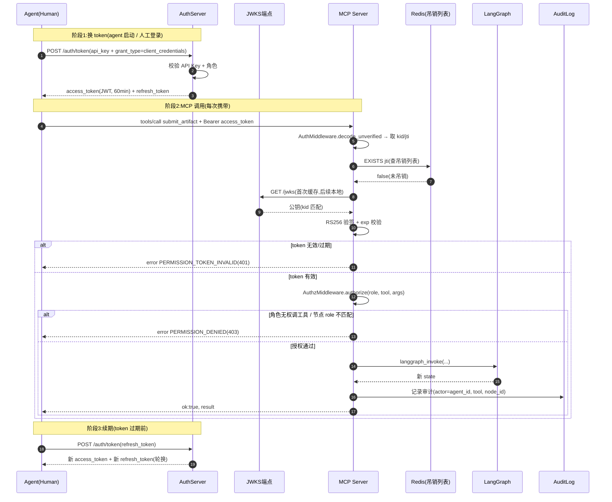
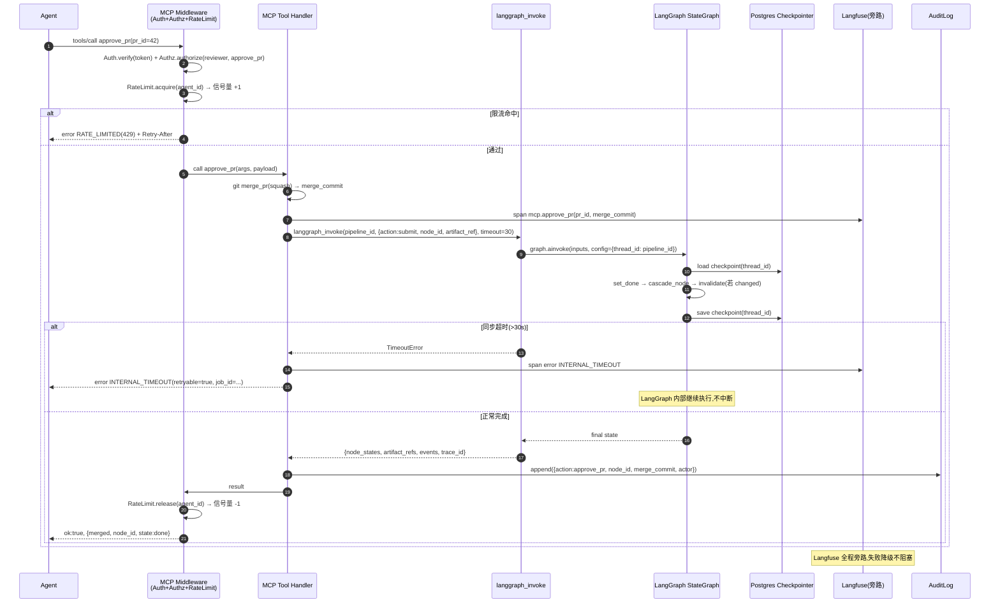
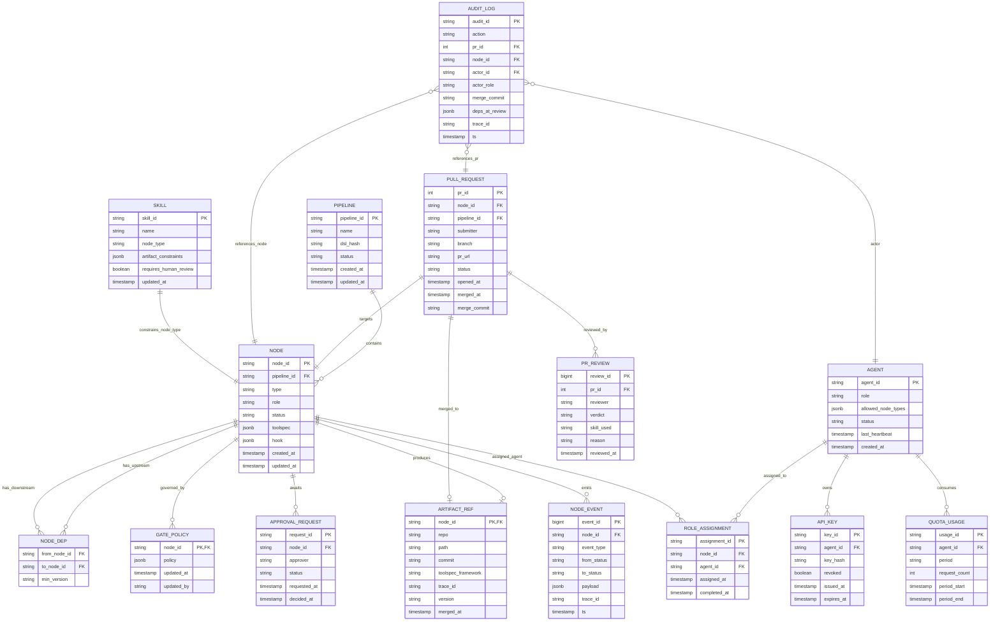

# FR4 MCP 接口层 + 第5章数据模型 + 第6章接口规范 深化设计

> **文档性质**:对《coordination-platform-prd.md》FR4 / 第5章 / 第6章的深化补充
> **版本**:v2.1 | **日期**:2026-08-04 | **状态**:待评审
> **父文档**:[coordination-platform-prd.md](../coordination-platform-prd.md)
> **调研依据**:[ai-multi-agent-dev-dashboard-research.md](../../research/ai-multi-agent-dev-dashboard-research.md) 第19章 MCP 设计

---

## 0. 文档范围与补全说明

本文针对 PRD v2.0 中以下薄弱点进行深化:

| # | 薄弱点 | 深化章节 |
|---|---|---|
| 1 | MCP 错误码体系 | §2 |
| 2 | MCP 认证与授权 | §3 |
| 3 | MCP 版本化 | §4 |
| 4 | 数据模型 ER 关系图 | §7 |
| 5 | Postgres 完整 schema | §8 |
| 6 | 接口规范完整化(13+1 个工具) | §9 |
| 7 | MCP 限流与配额 | §5 |
| 8 | MCP ↔ LangGraph 调用协议 | §6 |

**工具数量说明**:PRD §3.1 / §6 共列出 14 个工具名(`submit_artifact` / `review_artifact_pr` / `approve_pr` / `reject_pr` / `get_dependencies` / `get_pipeline_state` / `update_progress` / `request_approval` / `approve` / `reject` / `set_gate_policy` / `list_pending_prs` / `get_pr_detail` / `get_audit_log`)。任务描述称"13 个",实为 14 个(`approve`/`reject` 与 `approve_pr`/`reject_pr` 是两对独立工具:前者作用于 `approval` 控制节点,后者作用于产物 PR)。本文统一覆盖全部 14 个,不遗漏。

---

## 1. MCP 接口层定位回顾

MCP(Model Context Protocol)是**执行层与管理层之间的唯一桥梁**:

- 管理方通过 MCP Server 暴露 14 个工具给 agent / 人员调用
- 所有状态变更必须经 MCP 工具,不允许 agent 直接读写 LangGraph state 或产物仓库 main 分支
- 技术栈:MCP Python SDK ≥ 1.0 + LangGraph ≥ 0.2 + CrewAI ≥ 0.4 + Langfuse ≥ 3.0 + Postgres ≥ 15

**本深化补充的非功能约束:**

| 约束 | 指标 |
|---|---|
| MCP 工具响应(不含 git 操作) | P95 < 2s |
| git show 拉取产物内容 | P95 < 5s |
| 并发提交不同节点 | ≥ 50 agent 并行 |
| 单 agent 限流 | 60 req/min,并发 ≤ 5 |
| Langfuse 降级 | 监控失败不阻塞主流程 |
| 认证失败率 | < 0.1%(token 校验 < 10ms) |

---

## 2. MCP 错误码体系

### 2.1 错误响应统一结构

所有 MCP 工具错误返回遵循统一结构(对齐 MCP 协议 `error` 字段 + JSON-RPC 2.0):

```json
{
  "ok": false,
  "error": {
    "code": "ARTIFACT_NOT_FOUND",
    "message": "产物文件不存在于 feat 分支: api_contract/001.yaml @ feat/server/n2",
    "http_status": 404,
    "details": {
      "node_id": "n2",
      "repo": "https://github.com/org/artifact-repo",
      "branch": "feat/server/n2",
      "path": "api_contract/001.yaml"
    },
    "trace_id": "lf_abc123",
    "request_id": "req_20260804_001",
    "retryable": false
  }
}
```

**字段约定:**

| 字段 | 类型 | 说明 |
|---|---|---|
| `ok` | bool | 固定 `false`,与成功响应 `ok:true` 对称,便于 agent 解析 |
| `error.code` | string | 机器可读错误码,SCREAMING_SNAKE_CASE |
| `error.message` | string | 人类可读,含上下文(node_id / path / commit) |
| `error.http_status` | int | 对齐 HTTP 语义(仅作映射参考,MCP over stdio 不实际传 HTTP) |
| `error.details` | object | 结构化上下文,供 agent 程序化处理 |
| `error.trace_id` | string | Langfuse trace 关联,可反查执行链路 |
| `error.request_id` | string | 请求追踪 ID,服务端日志可查 |
| `error.retryable` | bool | 是否建议重试(网络抖动 / 限流可重试;权限/状态错误不重试) |

### 2.2 错误码全量表

错误码按域(Domain)分组,前缀体现所属域:

| 域 | 前缀 | 覆盖范围 |
|---|---|---|
| Artifact(产物) | `ARTIFACT_*` | 产物文件、引用、分支 |
| Dependency(依赖) | `DEP_*` | 依赖完整性、版本 |
| Permission(权限) | `PERMISSION_*` | 认证、授权、角色 |
| PR(审核) | `PR_*` | PR 状态、冲突、合并 |
| State(状态机) | `STATE_*` | 节点状态、非法迁移 |
| Gate(门禁) | `GATE_*` | 门禁策略、检查失败 |
| Approval(审批) | `APPROVAL_*` | 审批门、approver |
| RateLimit(限流) | `RATE_*` | 限流、配额 |
| Quota(配额) | `QUOTA_*` | 配额耗尽 |
| Validation(校验) | `VALIDATION_*` | 参数、schema |
| Git(仓库) | `GIT_*` | git 操作、仓库不可达 |
| Internal(内部) | `INTERNAL_*` | 服务端异常、LangGraph、Langfuse |
| Version(版本) | `VERSION_*` | 工具版本、弃用 |

**完整错误码表:**

| 错误码 | HTTP 状态 | 含义 | 触发场景 | 处理建议 | retryable |
|---|---|---|---|---|---|
| `ARTIFACT_NOT_FOUND` | 404 | 产物文件不存在 | `submit_artifact` 校验 `git ls-file` 失败 | agent 检查 path/branch,重新 push feat 分支后重提 | false |
| `ARTIFACT_PATH_INVALID` | 422 | 产物路径不符合规范 | path 不在 `<node_type>/` 目录下,或含 `..` / 绝对路径 | agent 按 `feat/{role}/{node_type}-{seq}` 规范修正 path | false |
| `ARTIFACT_TOO_LARGE` | 413 | 产物文件超限 | 文件大小 > skill.max_size_kb(默认 512KB) | agent 拆分产物或改用 LFS/对象存储,在 manifest 填引用 | false |
| `ARTIFACT_FORMAT_UNSUPPORTED` | 415 | 扩展名不在 allowed_extensions | skill.allowed_extensions 未包含 | agent 改用允许的扩展名(YAML/JSON/MD) | false |
| `ARTIFACT_ALREADY_DONE` | 409 | 节点已 done 且未声明变更 | 对 done 节点重复 submit 而未触发 changed | agent 先调 `update_progress(status=changed)` 或走变更流程 | false |
| `ARTIFACT_LOCKED` | 423 | 产物被编辑锁占用 | 另一 agent 持有该 node_id 的 lock | agent 等待锁释放或调 `update_progress` 协调 | false |
| `DEP_NOT_SATISFIED` | 409 | 依赖节点未全部 done | `review_artifact_pr` 校验 deps 节点状态非 done | agent 等待上游 done(查 `get_dependencies`),或上游加急 | false |
| `DEP_MIN_VERSION` | 422 | 依赖版本低于 min_version | skill.min_version 校验失败 | agent 通知上游 bump 版本后重提 | false |
| `DEP_CYCLE` | 422 | 依赖图存在环 | 管线加载时 DAG 无环校验失败 | 修正 pipeline.yaml 的 deps 声明,CI 阶段拦截 | false |
| `PERMISSION_DENIED` | 403 | 角色无权调用此工具/操作此节点 | product 角色调 `approve_pr`,或 server 提交 `client_ui` 节点 | agent 检查角色与节点 role 匹配,联系 admin 调整 | false |
| `PERMISSION_TOKEN_INVALID` | 401 | token 无效/过期/签名错误 | token 过期、被吊销、签名不匹配 | agent 重新向 AuthServer 申请 token | false |
| `PERMISSION_TOKEN_EXPIRED` | 401 | token 已过期 | token exp 超时 | agent 用 refresh_token 续期或重新登录 | false |
| `PERMISSION_ROLE_MISMATCH` | 403 | 角色与节点 role 不匹配 | server agent 提交 product_spec 节点 | agent 转交对应角色 agent | false |
| `PR_NOT_FOUND` | 404 | PR 不存在 | `approve_pr` / `reject_pr` 的 pr_id 不存在 | agent 调 `list_pending_prs` 获取有效 pr_id | false |
| `PR_CONFLICT` | 409 | PR 冲突(merge conflict) | approve_pr 时 main 与 feat 分支冲突 | agent rebase feat 分支到最新 main 后重新触发 review | true |
| `PR_ALREADY_MERGED` | 409 | PR 已合并 | 对已合并 PR 调 approve_pr/reject_pr | agent 调 `get_pr_detail` 确认状态,无需重复操作 | false |
| `PR_ALREADY_CLOSED` | 409 | PR 已关闭(非合并) | 对已关闭 PR 调 approve_pr | agent 重新 submit 开新 PR | false |
| `PR_WRONG_STATE` | 409 | PR 状态不允许该操作 | 对 pending 之外的状态调 review | agent 调 `get_pr_detail` 确认状态 | false |
| `STATE_ILLEGAL_TRANSITION` | 409 | 节点状态非法迁移 | blocked 节点直接调 approve | agent 先调 `update_progress` 推进到合法前置态 | false |
| `STATE_NODE_NOT_FOUND` | 404 | node_id 不存在 | MCP 参数 node_id 未注册 | agent 查 `get_pipeline_state` 确认 node_id | false |
| `GATE_POLICY_INVALID` | 422 | 门禁策略配置非法 | set_gate_policy 的 policy schema 错误 | admin 修正 policy YAML | false |
| `GATE_CHECK_FAILED` | 422 | 门禁检查未通过 | gate 节点 lint/test/coverage/security 失败 | agent 修复代码后重提产物,触发 gate 重评估 | false |
| `APPROVAL_NO_APPROVER` | 422 | approval 节点未配置 approver | request_approval 时 approver 为空 | admin 在 pipeline.yaml 补 approver | false |
| `APPROVAL_ALREADY_DECIDED` | 409 | approval 已决(同意/驳回) | 对已决 approval 重复 approve/reject | agent 查 `get_audit_log` 确认结果 | false |
| `RATE_LIMITED` | 429 | 触发 per-agent 限流 | 单 agent > 60 req/min | agent 按 `Retry-After` 退避重试 | true |
| `RATE_CONCURRENT` | 429 | 并发超限 | 单 agent 并发 > 5 | agent 串行化调用或排队 | true |
| `QUOTA_EXHAUSTED` | 429 | 配额耗尽 | 日/月配额用尽 | admin 提额或等待配额重置 | true |
| `VALIDATION_FAILED` | 422 | 参数 schema 校验失败 | inputSchema 必填缺失/类型错误 | agent 按 inputSchema 修正参数 | false |
| `VALIDATION_METADATA_MISSING` | 422 | 产物元数据缺失 | skill.required_fields 缺字段 | agent 补全 manifest 元数据后重提 | false |
| `GIT_REPO_UNREACHABLE` | 502 | 产物仓库不可达 | git ls-file / git show 网络失败 | agent 按 `Retry-After` 重试;admin 检查仓库连通性 | true |
| `GIT_AUTH_FAILED` | 401 | git 凭据失败 | 管理方 bot 对仓库无权限 | admin 检查 deploy key / PAT 配置 | false |
| `INTERNAL_LANGGRAPH_ERROR` | 500 | LangGraph 执行异常 | state 合并/条件路由抛异常 | agent 重试;admin 查 LangGraph 日志 + trace_id | true |
| `INTERNAL_LANGFUSE_DOWN` | 200 | Langfuse 降级(非阻塞) | Langfuse 不可达 | **不返回错误**,主流程正常返回,降级日志记录 | n/a |
| `INTERNAL_TIMEOUT` | 504 | LangGraph 调用超时 | langgraph_invoke 超过 30s | agent 按 `Retry-After` 重试或拆分任务 | true |
| `VERSION_DEPRECATED` | 422 | 工具版本已弃用 | 调用已弃用工具版本 | agent 升级到 `tools[tool_name@v2]` | false |
| `VERSION_UNSUPPORTED` | 422 | 工具版本不支持 | 客户端请求不存在的版本 | agent 查 `list_tools` 获取支持版本 | false |

### 2.3 错误处理约定

**1. agent 侧重试策略:**

```python
# agent 重试决策树(伪码)
def handle_mcp_error(error: McpError) -> RetryDecision:
    if not error.retryable:
        return Abort(notify_human=True, reason=error.message)
    if error.code in ("RATE_LIMITED", "RATE_CONCURRENT"):
        return Retry(after=error.details["retry_after"], backoff="exponential")
    if error.code in ("GIT_REPO_UNREACHABLE", "INTERNAL_TIMEOUT", "INTERNAL_LANGGRAPH_ERROR"):
        return Retry(after=5, max_attempts=3, backoff="exponential")
    if error.code == "PR_CONFLICT":
        return RebaseAndResubmit(branch=error.details["branch"])
    return Abort(reason=error.message)
```

**2. 服务端日志与告警:**

| 错误级别 | 触发条件 | 动作 |
|---|---|---|
| WARN | Langfuse 降级、限流命中 | 记日志,不告警 |
| ERROR | INTERNAL_*、GIT_REPO_UNREACHABLE | 记日志 + Langfuse trace error span |
| CRITICAL | LangGraph 持续异常、Postgres 不可达 | 告警 admin(飞书/Slack)+ 自动熔断 |

**3. 错误响应与 Langfuse 关联:** 所有错误响应必须带 `trace_id`,即使降级也用本地生成的 fallback trace_id,保证可追溯。

---

## 3. MCP 认证与授权

### 3.1 身份模型

MCP 调用方分两类,均需携带身份:

| 身份类型 | 标识 | 认证方式 | 典型调用方 |
|---|---|---|---|
| **Agent** | `agent_id`(如 `server-agent-01`) | API Key + 短期 JWT token | CrewAI 4 角色 agent |
| **Human** | `user_id`(如 `alice@org`) | OAuth 2.1 / SSO + JWT token | reviewer / admin 人工审批 |

身份字段在 token payload 中声明:

```json
{
  "sub": "server-agent-01",
  "identity_type": "agent",
  "role": "server",
  "agent_id": "server-agent-01",
  "allowed_node_types": ["api_contract", "server_impl", "server_test"],
  "iat": 1735660800,
  "exp": 1735664400,
  "jti": "tok_abc123",
  "scope": "mcp:tools:submit_artifact mcp:tools:update_progress mcp:tools:get_dependencies mcp:tools:request_approval"
}
```

### 3.2 Token 机制

采用 **API Key(长期) + JWT(短期) 双层模型**:

| 层 | 用途 | 有效期 | 颁发方 |
|---|---|---|---|
| API Key | agent 启动时向 AuthServer 换 JWT | 长期(admin 配置,默认 90 天轮换) | admin 预签 |
| Access Token (JWT) | 每次 MCP 调用携带 | 短期(默认 60 min) | AuthServer |
| Refresh Token | 续期 Access Token | 中期(默认 7 天) | AuthServer |

**JWT 签名:** RS256(非对称),公钥由 AuthServer 的 `/jwks` 端点发布,MCP Server 缓存公钥并本地校验(避免每次调用回源)。

**Token 续期流程:**

```http
POST /auth/token
Content-Type: application/json

{
  "grant_type": "refresh_token",
  "refresh_token": "rt_xxx",
  "api_key": "ak_xxx"
}
```

返回新的 access_token + refresh_token(refresh_token 轮换,防重放)。

### 3.3 角色权限校验中间件

MCP Server 在 `call_tool` 入口前置两层中间件:**AuthMiddleware(认证)+ AuthzMiddleware(授权)**。

```python
# mcp_server/middleware.py
from mcp.server import Server
from functools import wraps

class AuthMiddleware:
    """认证中间件:校验 JWT 签名 + 过期 + 吊销"""

    def __init__(self, jwks_client: JwksClient, revocation_cache: Redis):
        self.jwks = jwks_client
        self.revocation = revocation_cache  # 吊销列表,1h TTL

    async def verify(self, token: str) -> TokenPayload:
        # 1. 解析 JWT header,取 kid
        unverified = jwt.decode_unverified(token)
        # 2. 本地吊销列表快查(O(1))
        if self.revocation.exists(unverified["jti"]):
            raise McpError("PERMISSION_TOKEN_INVALID", "token 已被吊销", 401)
        # 3. 用 kid 从 JWKS 取公钥,验签 + exp
        key = self.jwks.get_key(unverified["kid"])
        payload = jwt.decode(token, key, algorithms=["RS256"])
        if payload["exp"] < time.time():
            raise McpError("PERMISSION_TOKEN_EXPIRED", "token 已过期", 401)
        return TokenPayload(payload)


class AuthzMiddleware:
    """授权中间件:角色 → 工具 → 节点 三级校验"""

    # 角色 → 允许工具白名单(对齐 PRD §3.2 权限矩阵)
    ROLE_TOOLS = {
        "product": {"submit_artifact", "update_progress", "get_dependencies"},
        "server":  {"submit_artifact", "update_progress", "get_dependencies", "request_approval"},
        "design":  {"submit_artifact", "update_progress", "get_dependencies"},
        "client":  {"submit_artifact", "update_progress", "get_dependencies", "request_approval"},
        "reviewer": {"approve_pr", "reject_pr", "approve", "reject", "get_audit_log", "list_pending_prs", "get_pr_detail", "get_dependencies"},
        "admin":   {"*"},  # 全部工具
    }

    # 角色 → 允许产出的节点类型(对齐 PRD §3.1)
    ROLE_NODE_TYPES = {
        "product": {"product_spec"},
        "server":  {"api_contract", "server_impl", "server_test"},
        "design":  {"design_proto", "design_asset"},
        "client":  {"client_ui", "client_func", "client_delivery"},
    }

    async def authorize(self, payload: TokenPayload, tool: str, args: dict) -> None:
        role = payload.role
        allowed = self.ROLE_TOOLS.get(role, set())
        if "*" not in allowed and tool not in allowed:
            raise McpError("PERMISSION_DENIED",
                f"角色 {role} 无权调用工具 {tool}", 403,
                details={"role": role, "tool": tool})

        # 节点角色匹配校验(submit_artifact / update_progress 等需校验)
        if tool in ("submit_artifact", "update_progress") and "node_id" in args:
            node = await get_node(args["node_id"])
            if node["role"] != role and role != "admin":
                raise McpError("PERMISSION_ROLE_MISMATCH",
                    f"角色 {role} 无权操作 role={node['role']} 的节点 {args['node_id']}", 403,
                    details={"node_id": args["node_id"], "node_role": node["role"], "caller_role": role})

            # 节点类型与角色允许类型匹配
            if node["type"] not in self.ROLE_NODE_TYPES.get(role, set()) and role != "admin":
                raise McpError("PERMISSION_ROLE_MISMATCH",
                    f"角色 {role} 无权产出节点类型 {node['type']}", 403)


def require_auth(server: Server):
    """装饰器:在 call_tool 前注入认证 + 授权"""
    original = server.call_tool_handler

    @wraps(original)
    async def wrapped(name: str, arguments: dict, context: McpContext) -> list:
        token = context.meta.get("authorization", "").removeprefix("Bearer ")
        try:
            payload = await server.auth.verify(token)
            await server.authz.authorize(payload, name, arguments)
            context.payload = payload  # 注入到下游工具
            return await original(name, arguments, context)
        except McpError as e:
            return [TextContent(type="text", text=json.dumps(e.to_dict()))]
        except Exception as e:
            # 兜底:未预期异常包装为 INTERNAL 错误,不泄漏堆栈
            logger.exception("MCP 内部错误")
            err = McpError("INTERNAL_LANGGRAPH_ERROR", "内部错误", 500, retryable=True)
            return [TextContent(type="text", text=json.dumps(err.to_dict()))]
    return wrapped
```

### 3.4 MCP 认证流程图



### 3.5 API Key 管理

| 管理项 | 策略 |
|---|---|
| 颁发 | admin 通过 `admin_create_agent` 内部 API 预签,绑定 role + allowed_node_types |
| 存储 | Postgres `api_keys` 表存 hash(不存明文),明文仅返回一次 |
| 轮换 | 默认 90 天到期,提前 7 天告警;支持手动轮换 |
| 吊销 | admin 调 `admin_revoke_api_key` → 写 Redis 吊销列表 + DB 标记 revoked |
| 审计 | 颁发/轮换/吊销入 `audit_log`,action=`api_key_issue/rotate/revoke` |
| 防泄漏 | API Key 不入 git,从环境变量 / Vault 读取;MCP 不记录 Key 到日志 |

---

## 4. MCP 版本化策略

### 4.1 工具版本号

每个 MCP 工具独立版本化,采用 **语义化版本 SemVer**(`MAJOR.MINOR.PATCH`):

| 版本变更 | 触发条件 | 兼容性 |
|---|---|---|
| `PATCH`(1.0.0→1.0.1) | bug 修复、日志优化 | 完全向后兼容 |
| `MINOR`(1.0.0→1.1.0) | 新增可选参数、新增返回字段、新增错误码 | 向后兼容(老客户端不受影响) |
| `MAJOR`(1.0.0→2.0.0) | 删除/重命名参数、改变参数类型、改变默认行为 | **破坏性**,需客户端升级 |

**工具元数据声明版本:**

```json
{
  "name": "submit_artifact",
  "version": "1.2.0",
  "description": "提交产物:推 feat 分支 + 开 PR",
  "deprecated": false,
  "sunset_at": null,
  "inputSchema": {...},
  "outputSchema": {...},
  "changelog": [
    {"version": "1.2.0", "date": "2026-08-04", "change": "新增可选参数 deps_decl,声明依赖"},
    {"version": "1.1.0", "date": "2026-07-15", "change": "返回新增字段 pr_url"},
    {"version": "1.0.0", "date": "2026-06-01", "change": "初始版本"}
  ]
}
```

### 4.2 客户端版本协商

调用方可显式指定版本(默认最新兼容):

```json
// tools/call 请求
{
  "name": "submit_artifact@1.2",
  "arguments": {...}
}
```

- `submit_artifact`(无版本)→ 服务端返回最新 MAJOR 版本(向后兼容假设)
- `submit_artifact@1.2`→ 服务端匹配 `1.2.x` 最新 PATCH
- `submit_artifact@1`→ 服务端匹配 `1.x.x` 最新 MINOR+PATCH
- `submit_artifact@2`→ 若不存在 2.x,返回 `VERSION_UNSUPPORTED`

服务端 `list_tools` 返回每个工具的全部可用版本,客户端据此协商。

### 4.3 向后兼容规则

| 变更类型 | 是否允许 | 说明 |
|---|---|---|
| 新增可选 input 参数 | ✅ | 老客户端不传,服务端用默认值 |
| 新增 output 字段 | ✅ | 老客户端忽略未知字段 |
| 新增错误码 | ✅ | 老客户端按 `error.code` 字符串处理,未知码按通用错误兜底 |
| 删除 input 参数 | ❌(需 MAJOR) | 老客户端仍传该参数会报错 |
| 改 input 参数类型 | ❌(需 MAJOR) | 类型不匹配 |
| 改默认行为(如 submit 后状态) | ❌(需 MAJOR) | 业务语义变更 |
| 改 output 必填字段 | ❌(需 MAJOR) | 老客户端可能依赖 |

### 4.4 弃用(Deprecation)策略

**弃用生命周期(对齐 RFC 8594 思路):**

| 阶段 | 时长 | 行为 |
|---|---|---|
| 1. Active | — | 正常可用,无弃用标记 |
| 2. Deprecated | ≥ 90 天 | `deprecated:true` + `sunset_at` 日期;调用返回 `Warning: 299` 响应头(仍正常执行) |
| 3. Frozen | ≥ 30 天 | 仅安全修复,不再接收新功能;调用返回 `VERSION_DEPRECATED` 警告(仍执行) |
| 4. Sunset | — | 工具下线,调用返回 `VERSION_UNSUPPORTED` 错误 |

**弃用公告渠道:**

- `list_tools` 响应的 `deprecated` + `sunset_at` 字段
- CHANGELOG 文档
- Langfuse trace 中标记 `deprecation_warning` span 属性
- admin 飞书/Slack 通知

---

## 5. MCP 限流与配额

### 5.1 限流维度

| 维度 | 算法 | 限制 | 触发后 |
|---|---|---|---|
| per-agent QPS | 令牌桶 | 60 req/min,突发 ≤ 10 | 返回 `RATE_LIMITED` + `Retry-After` |
| per-agent 并发 | 信号量 | ≤ 5 并发 | 返回 `RATE_CONCURRENT` + `Retry-After` |
| per-tool QPS | 滑动窗口 | 全局 200 req/min(如 approve_pr) | 返回 `RATE_LIMITED` |
| per-pipeline 并发 | 信号量 | 单 pipeline ≤ 10 并发 langgraph_invoke | 排队等待 |
| 全局 QPS | 令牌桶 | 1000 req/min(集群) | 返回 `RATE_LIMITED` |

### 5.2 并发控制

**per-agent 并发:** 用 Redis 分布式信号量实现(支持多 MCP Server 实例):

```python
# mcp_server/ratelimit.py
import redis.asyncio as redis

class AgentConcurrencyLimiter:
    """per-agent 并发信号量(Redis 分布式实现)"""

    def __init__(self, redis: redis.Redis, max_concurrent: int = 5, ttl: int = 60):
        self.redis = redis
        self.max = max_concurrent
        self.ttl = ttl  # 防僵尸锁,60s 自动释放

    async def acquire(self, agent_id: str) -> bool:
        key = f"sem:agent:{agent_id}"
        current = await self.redis.incr(key)
        if current == 1:
            await self.redis.expire(key, self.ttl)
        if current > self.max:
            await self.redis.decr(key)
            return False
        return True

    async def release(self, agent_id: str):
        await self.redis.decr(f"sem:agent:{agent_id}")
```

**per-pipeline 并发:** 同理,key 为 `sem:pipeline:{pipeline_id}`,防止单管线并发 langgraph_invoke 过多导致 state 冲突。

### 5.3 队列机制

超过并发限制的请求进入**优先级队列**(Redis Sorted Set),按角色 + 工具优先级出队:

| 优先级 | 角色/工具 | 说明 |
|---|---|---|
| P0(最高) | reviewer/admin 的 approve_pr/reject_pr | 审批阻塞链路,优先处理 |
| P1 | server/client 的 submit_artifact | 主链路推进 |
| P2 | get_dependencies / get_pipeline_state | 只读查询 |
| P3(最低) | update_progress | 进度更新,容忍延迟 |

队列配置:最大长度 1000,超出返回 `QUOTA_EXHAUSTED`;队列入参带 `request_id`,agent 可调 `get_request_status` 查询。

### 5.4 配额设计

| 配额项 | 默认值 | 维度 | 超限 |
|---|---|---|---|
| 日调用量 | 10000 req | per-agent | `QUOTA_EXHAUSTED` |
| 月调用量 | 200000 req | per-agent | `QUOTA_EXHAUSTED` |
| 日 submit_artifact | 100 次 | per-agent | 防止刷 PR |
| 日 approve_pr | 200 次 | per-reviewer | 防止误操作 |
| 管线并发 | 10 | per-pipeline | 排队 |
| Langfuse trace 量 | 不限 | — | Langfuse 自托管,无配额 |

配额在 Postgres `quota_usage` 表按日/月累计,Redis 做实时计数(异步同步到 DB)。

### 5.5 限流响应头

成功响应也带限流信息,便于 agent 自适应:

```json
{
  "ok": true,
  "result": {...},
  "_meta": {
    "rate_limit": {
      "limit": 60,
      "remaining": 58,
      "reset_at": "2026-08-04T10:01:00Z"
    },
    "quota": {
      "daily_limit": 10000,
      "daily_used": 42,
      "monthly_limit": 200000,
      "monthly_used": 1240
    }
  }
}
```

---

## 6. MCP ↔ LangGraph 调用协议

MCP 工具是 LangGraph 的唯一外部入口。所有状态推进经 `langgraph_invoke` 触发。

### 6.1 langgraph_invoke 参数与返回

```python
# orchestration/invoke.py
from langgraph.graph import StateGraph
from langgraph.checkpoint.postgres import PostgresSaver

async def langgraph_invoke(
    pipeline_id: str,
    inputs: dict,
    *,
    thread_id: str | None = None,
    config: dict | None = None,
    timeout: float = 30.0,
    wait: bool = True,
) -> dict:
    """
    统一的 LangGraph 调用入口。

    Args:
        pipeline_id: 管线 ID,用于定位 StateGraph 实例
        inputs: 调用输入,结构由 action 决定(见下表)
        thread_id: LangGraph checkpointer 的 thread_id,默认 = pipeline_id
            (同一管线共享 thread,实现中断恢复 + 状态累积)
        config: 透传 LangGraph config(可含 recursion_limit 等)
        timeout: 超时秒数,默认 30s
        wait: True=同步等结果;False=异步返回 job_id,后续轮询

    Returns:
        {
            "thread_id": "...",
            "node_states": {node_id: status},
            "artifact_refs": {node_id: ArtifactRef},
            "events": [...],
            "job_id": "..." (仅 wait=False),
            "trace_id": "lf_xxx"
        }
    """
```

**`inputs` 的 action 模式(按工具归类):**

| action | 触发工具 | inputs 结构 | LangGraph 节点流转 |
|---|---|---|---|
| `submit` | submit_artifact(经 approve_pr 合并后) | `{"action":"submit", "node_id":"n2", "artifact_ref": ArtifactRef}` | → set_done → cascade |
| `reject_pr` | reject_pr | `{"action":"reject_pr", "node_id":"n2"}` | → set_ready(回 ready) |
| `update_progress` | update_progress | `{"action":"update_progress", "node_id":"n8", "status":"in_progress", "note":"..."}` | → monitor_node |
| `request_approval` | request_approval | `{"action":"request_approval", "node_id":"n10", "approver":"..."}` | → approval_node(review 态) |
| `approve` | approve | `{"action":"approve", "node_id":"n10"}` | approval_node → set_done → cascade |
| `reject` | reject | `{"action":"reject", "node_id":"n10"}` | → set_changed(上游最近产物) → invalidate |
| `set_gate_policy` | set_gate_policy | `{"action":"set_gate_policy", "node_id":"n9", "policy":{...}}` | 仅更新 policy,不流转状态 |

### 6.2 异步调用模式

长耗时操作(如 gate 跑全量 test)用异步模式:

```python
# 异步提交
result = await langgraph_invoke(
    pipeline_id="login-feature",
    inputs={"action": "approve", "node_id": "n10"},
    wait=False,
    timeout=300,  # gate 可能跑 5min
)
# 返回 {"job_id": "job_abc", "thread_id": "login-feature"}

# 轮询状态(或 MCP 工具 get_job_status)
status = await get_job_status(job_id="job_abc")
# 返回 {"status": "running"|"done"|"failed", "result": {...}}
```

**异步任务调度:** LangGraph 内部长耗时节点(如 gate 评估)用 `astream` 异步推进,MCP 层通过 `job_id` 关联。job 状态存 Redis(`job:{job_id}`,TTL 1h)。

### 6.3 超时与熔断

| 层 | 超时 | 触发动作 |
|---|---|---|
| MCP 工具入口 | 2s(不含 git) | 返回 `INTERNAL_TIMEOUT` |
| git ls-file / git show | 5s | 返回 `GIT_REPO_UNREACHABLE` |
| langgraph_invoke(同步) | 30s | 返回 `INTERNAL_TIMEOUT`,但 LangGraph 内部继续执行(不中断),agent 可轮询 |
| langgraph_invoke(异步) | 由调用方指定(默认 300s) | 超时标 job failed |
| LangGraph 节点单步 | 10s | 节点级超时,记 trace error,跳到 error_handler 节点 |

**熔断(对 LangGraph 异常):**

- 滑动窗口 1min 内 LangGraph 异常率 > 50% → 熔断 30s
- 熔断期间 MCP 返回 `INTERNAL_LANGGRAPH_ERROR`(retryable=true)
- 半开状态放 10% 流量探测,成功则恢复

### 6.4 MCP ↔ LangGraph 调用协议图



---

## 7. 数据模型 ER 关系图



**关系说明:**

| 关系 | 基数 | 说明 |
|---|---|---|
| PIPELINE → NODE | 1:N | 一个管线含多个节点 |
| NODE → NODE_DEP | N:M(自引用) | 节点间多对多依赖,经 NODE_DEP 关联表 |
| NODE → ARTIFACT_REF | 1:0..1 | 产物节点产出唯一 ArtifactRef;控制节点无 |
| NODE → GATE_POLICY | 1:0..1 | 仅 gate 节点有策略 |
| NODE → APPROVAL_REQUEST | 1:0..N | approval 节点可能有多次审批请求 |
| NODE → NODE_EVENT | 1:N | 状态变更全记录(事件溯源) |
| AGENT → ROLE_ASSIGNMENT → NODE | M:N | agent 与节点多对多分配 |
| PULL_REQUEST → NODE | N:1 | 多个 PR 可关联同一节点(变更重提) |
| PULL_REQUEST → PR_REVIEW | 1:N | 一个 PR 可多次 review(自动 + 人工) |
| AUDIT_LOG → PULL_REQUEST/AGENT/NODE | N:1 | 审计关联多维主体 |
| SKILL → NODE | 1:N | 一个 skill 约束同 type 的所有节点 |

---

## 8. Postgres 完整 Schema

### 8.1 建表语句

```sql
-- ============================================================
-- Coordination Platform Schema
-- Postgres ≥ 15,启用 pgcrypto 扩展
-- ============================================================
CREATE EXTENSION IF NOT EXISTS pgcrypto;

-- ---------- 管线 ----------
CREATE TABLE pipeline (
    pipeline_id     TEXT PRIMARY KEY,
    name            TEXT NOT NULL,
    dsl_hash        TEXT NOT NULL,                  -- pipeline.yaml 的 sha256,变更检测
    dsl_content     JSONB NOT NULL,                 -- 完整 DSL 快照(便于审计 + 重放)
    status          TEXT NOT NULL DEFAULT 'active', -- active | paused | completed | archived
    created_at      TIMESTAMPTZ NOT NULL DEFAULT now(),
    updated_at      TIMESTAMPTZ NOT NULL DEFAULT now(),
    CONSTRAINT pipeline_status_chk CHECK (status IN ('active','paused','completed','archived'))
);

-- ---------- 节点 ----------
CREATE TABLE node (
    node_id         TEXT NOT NULL,
    pipeline_id     TEXT NOT NULL REFERENCES pipeline(pipeline_id) ON DELETE CASCADE,
    type            TEXT NOT NULL,                  -- product_spec | api_contract | ... | gate | approval | fork | switch | notify
    role            TEXT NOT NULL,                  -- product | server | design | client | control
    status          TEXT NOT NULL DEFAULT 'blocked',-- blocked|ready|in_progress|pending_review|review|done|changed
    toolspec        JSONB,                          -- {framework: ...}
    hook            TEXT,                           -- 代码 hook 模块路径(可选)
    approver        TEXT,                           -- approval 节点的审批人
    created_at      TIMESTAMPTZ NOT NULL DEFAULT now(),
    updated_at      TIMESTAMPTZ NOT NULL DEFAULT now(),
    PRIMARY KEY (node_id, pipeline_id),
    CONSTRAINT node_status_chk CHECK (status IN (
        'blocked','ready','in_progress','pending_review','review','done','changed'
    ))
);
-- 节点 type 与 role 的合法组合由应用层(skill 注册时)校验,DB 层不强制(避免耦合)

-- ---------- 节点依赖(多对多自引用) ----------
CREATE TABLE node_dep (
    from_node_id    TEXT NOT NULL,                  -- 上游节点
    to_node_id      TEXT NOT NULL,                  -- 下游节点
    pipeline_id     TEXT NOT NULL,
    min_version     TEXT,                           -- 依赖最低版本(semver)
    PRIMARY KEY (from_node_id, to_node_id, pipeline_id),
    FOREIGN KEY (from_node_id, pipeline_id) REFERENCES node(node_id, pipeline_id) ON DELETE CASCADE,
    FOREIGN KEY (to_node_id, pipeline_id) REFERENCES node(node_id, pipeline_id) ON DELETE CASCADE
);

-- ---------- 产物引用 ----------
CREATE TABLE artifact_ref (
    node_id             TEXT NOT NULL,
    pipeline_id         TEXT NOT NULL,
    repo                TEXT NOT NULL,
    path                TEXT NOT NULL,
    commit              TEXT NOT NULL,
    toolspec_framework  TEXT NOT NULL,
    version             TEXT NOT NULL,              -- semver
    trace_id            TEXT,                       -- Langfuse trace 关联
    merged_at           TIMESTAMPTZ NOT NULL DEFAULT now(),
    PRIMARY KEY (node_id, pipeline_id),
    FOREIGN KEY (node_id, pipeline_id) REFERENCES node(node_id, pipeline_id) ON DELETE CASCADE
);

-- ---------- 门禁策略 ----------
CREATE TABLE gate_policy (
    node_id     TEXT NOT NULL,
    pipeline_id TEXT NOT NULL,
    policy      JSONB NOT NULL,                     -- {lint, test, coverage_min, security, ...}
    updated_by  TEXT NOT NULL,                      -- admin agent_id
    updated_at  TIMESTAMPTZ NOT NULL DEFAULT now(),
    PRIMARY KEY (node_id, pipeline_id),
    FOREIGN KEY (node_id, pipeline_id) REFERENCES node(node_id, pipeline_id) ON DELETE CASCADE
);

-- ---------- 审批请求 ----------
CREATE TABLE approval_request (
    request_id      TEXT PRIMARY KEY DEFAULT gen_random_uuid()::text,
    node_id         TEXT NOT NULL,
    pipeline_id     TEXT NOT NULL,
    approver        TEXT NOT NULL,                  -- agent_id | user_id | role
    status          TEXT NOT NULL DEFAULT 'pending',-- pending | approved | rejected
    requested_at    TIMESTAMPTZ NOT NULL DEFAULT now(),
    decided_at      TIMESTAMPTZ,
    FOREIGN KEY (node_id, pipeline_id) REFERENCES node(node_id, pipeline_id) ON DELETE CASCADE
);

-- ---------- 节点事件流(事件溯源) ----------
CREATE TABLE node_event (
    event_id    BIGSERIAL PRIMARY KEY,
    node_id     TEXT NOT NULL,
    pipeline_id TEXT NOT NULL,
    event_type  TEXT NOT NULL,                      -- state_change | submit | approve | reject | cascade | invalidate
    from_status TEXT,
    to_status   TEXT,
    payload     JSONB NOT NULL DEFAULT '{}'::jsonb,
    trace_id    TEXT,
    ts          TIMESTAMPTZ NOT NULL DEFAULT now(),
    FOREIGN KEY (node_id, pipeline_id) REFERENCES node(node_id, pipeline_id) ON DELETE CASCADE
);

-- ---------- Agent 注册 ----------
CREATE TABLE agent (
    agent_id            TEXT PRIMARY KEY,
    role                TEXT NOT NULL,              -- product | server | design | client | reviewer | admin
    allowed_node_types  JSONB NOT NULL DEFAULT '[]'::jsonb,
    status              TEXT NOT NULL DEFAULT 'offline', -- online | offline | drained
    max_concurrent      INT NOT NULL DEFAULT 5,
    last_heartbeat      TIMESTAMPTZ,
    created_at          TIMESTAMPTZ NOT NULL DEFAULT now()
);

-- ---------- 角色分配(agent ↔ node) ----------
CREATE TABLE role_assignment (
    assignment_id   TEXT PRIMARY KEY DEFAULT gen_random_uuid()::text,
    node_id         TEXT NOT NULL,
    pipeline_id     TEXT NOT NULL,
    agent_id        TEXT NOT NULL REFERENCES agent(agent_id) ON DELETE CASCADE,
    assigned_at     TIMESTAMPTZ NOT NULL DEFAULT now(),
    completed_at    TIMESTAMPTZ,
    UNIQUE (node_id, pipeline_id, agent_id),
    FOREIGN KEY (node_id, pipeline_id) REFERENCES node(node_id, pipeline_id) ON DELETE CASCADE
);

-- ---------- API Key ----------
CREATE TABLE api_key (
    key_id      TEXT PRIMARY KEY DEFAULT gen_random_uuid()::text,
    agent_id    TEXT NOT NULL REFERENCES agent(agent_id) ON DELETE CASCADE,
    key_hash    TEXT NOT NULL UNIQUE,               -- bcrypt(argon2) hash,不存明文
    revoked     BOOLEAN NOT NULL DEFAULT false,
    issued_by   TEXT NOT NULL,                      -- admin agent_id
    issued_at   TIMESTAMPTZ NOT NULL DEFAULT now(),
    expires_at  TIMESTAMPTZ NOT NULL
);

-- ---------- 配额使用 ----------
CREATE TABLE quota_usage (
    usage_id        BIGSERIAL PRIMARY KEY,
    agent_id        TEXT NOT NULL REFERENCES agent(agent_id) ON DELETE CASCADE,
    period          TEXT NOT NULL,                  -- daily | monthly
    period_start    TIMESTAMPTZ NOT NULL,
    period_end      TIMESTAMPTZ NOT NULL,
    request_count   INT NOT NULL DEFAULT 0,
    UNIQUE (agent_id, period, period_start)
);

-- ---------- Pull Request ----------
CREATE TABLE pull_request (
    pr_id       BIGSERIAL PRIMARY KEY,
    node_id     TEXT NOT NULL,
    pipeline_id TEXT NOT NULL,
    submitter   TEXT NOT NULL,                      -- agent_id | user_id
    branch      TEXT NOT NULL,                      -- feat/{role}/{node_type}-{seq}
    pr_url      TEXT NOT NULL,
    status      TEXT NOT NULL DEFAULT 'open',       -- open | merged | closed | rejected
    opened_at   TIMESTAMPTZ NOT NULL DEFAULT now(),
    merged_at   TIMESTAMPTZ,
    merge_commit TEXT,
    FOREIGN KEY (node_id, pipeline_id) REFERENCES node(node_id, pipeline_id) ON DELETE CASCADE
);

-- ---------- PR Review 记录 ----------
CREATE TABLE pr_review (
    review_id   BIGSERIAL PRIMARY KEY,
    pr_id       BIGINT NOT NULL REFERENCES pull_request(pr_id) ON DELETE CASCADE,
    reviewer    TEXT NOT NULL,                      -- mgmt-bot | reviewer_id
    verdict     TEXT NOT NULL,                      -- approve | reject | needs_human
    skill_used  TEXT,
    reason      TEXT NOT NULL,
    reviewed_at TIMESTAMPTZ NOT NULL DEFAULT now()
);

-- ---------- 审计日志(append-only) ----------
CREATE TABLE audit_log (
    audit_id        TEXT PRIMARY KEY DEFAULT gen_random_uuid()::text,
    action          TEXT NOT NULL,                  -- submit_artifact|approve_pr|reject_pr|approve|reject|set_gate_policy|api_key_issue|...
    pr_id           BIGINT REFERENCES pull_request(pr_id) ON DELETE SET NULL,
    node_id         TEXT,
    pipeline_id     TEXT,
    actor_id        TEXT NOT NULL,                  -- agent_id | user_id
    actor_role      TEXT NOT NULL,
    merge_commit    TEXT,
    skill_used      TEXT,
    skill_verdict   TEXT,
    deps_at_review  JSONB,
    note            TEXT,
    trace_id        TEXT,
    ts              TIMESTAMPTZ NOT NULL DEFAULT now()
);

-- ---------- Constraint Skill 注册 ----------
CREATE TABLE skill (
    skill_id                TEXT PRIMARY KEY,       -- 如 api-contract-skill
    name                    TEXT NOT NULL,
    node_type               TEXT NOT NULL UNIQUE,   -- 一个 node_type 一个 skill
    artifact_constraints    JSONB NOT NULL,         -- required_fields/deps/min_version/file_constraints
    requires_human_review   BOOLEAN NOT NULL DEFAULT false,
    allowed_mcp_tools       JSONB NOT NULL DEFAULT '[]'::jsonb,
    version                 TEXT NOT NULL DEFAULT '1.0.0',
    updated_at              TIMESTAMPTZ NOT NULL DEFAULT now()
);

-- ---------- LangGraph Checkpointer 表(由 PostgresSaver 自动管理) ----------
-- 官方 schema,此处仅占位,实际由 langgraph.checkpoint.postgres 初始化
-- 表名:checkpoints / checkpoint_writes / checkpoint_blobs
-- 不在本 schema 内手动建,由 SDK migration 创建
```

### 8.2 索引设计

```sql
-- ---------- 节点查询索引 ----------
CREATE INDEX idx_node_pipeline_status ON node (pipeline_id, status);
CREATE INDEX idx_node_status ON node (status) WHERE status IN ('ready','pending_review','review');
-- 部分索引:仅活跃状态,加速 dispatch_router 查询

-- ---------- 依赖图查询索引 ----------
CREATE INDEX idx_node_dep_from ON node_dep (from_node_id, pipeline_id);
CREATE INDEX idx_node_dep_to   ON node_dep (to_node_id, pipeline_id);
-- cascade(invalidate) 时:从 done(changed)节点反查下游

-- ---------- 产物引用索引 ----------
CREATE INDEX idx_artifact_ref_commit ON artifact_ref (commit);
-- 按 commit 反查产物(变更追溯)

-- ---------- 事件流索引(时序查询) ----------
CREATE INDEX idx_node_event_node_ts ON node_event (node_id, pipeline_id, ts DESC);
CREATE INDEX idx_node_event_trace   ON node_event (trace_id) WHERE trace_id IS NOT NULL;
-- trace_id 反查事件(Langfuse 关联)

-- ---------- 审批索引 ----------
CREATE INDEX idx_approval_pending ON approval_request (status, requested_at) WHERE status = 'pending';
-- reviewer 查待审列表

-- ---------- PR 索引 ----------
CREATE INDEX idx_pr_status      ON pull_request (status, opened_at DESC);
CREATE INDEX idx_pr_node        ON pull_request (node_id, pipeline_id);
CREATE INDEX idx_pr_review_pr   ON pr_review (pr_id, reviewed_at DESC);

-- ---------- 审计日志索引(多维度查询) ----------
CREATE INDEX idx_audit_node_ts   ON audit_log (node_id, ts DESC);
CREATE INDEX idx_audit_actor_ts  ON audit_log (actor_id, ts DESC);
CREATE INDEX idx_audit_action_ts ON audit_log (action, ts DESC);
CREATE INDEX idx_audit_pr        ON audit_log (pr_id) WHERE pr_id IS NOT NULL;
CREATE INDEX idx_audit_trace     ON audit_log (trace_id) WHERE trace_id IS NOT NULL;
CREATE INDEX idx_audit_ts        ON audit_log (ts DESC);
-- 覆盖 get_audit_log 的过滤:node_id / reviewer(actor) / action / 时间范围

-- ---------- Agent 索引 ----------
CREATE INDEX idx_agent_role_status ON agent (role, status) WHERE status = 'online';
-- CrewAI 分配 ready 节点时按 role 查在线 agent
CREATE INDEX idx_agent_heartbeat   ON agent (last_heartbeat) WHERE status = 'online';
-- 心跳超时检测(定时任务扫)

-- ---------- 配额索引 ----------
CREATE INDEX idx_quota_agent_period ON quota_usage (agent_id, period, period_start DESC);

-- ---------- API Key 索引 ----------
CREATE INDEX idx_api_key_agent ON api_key (agent_id) WHERE revoked = false;
```

**索引设计原则:**

1. **部分索引(Partial Index)** 优先:`WHERE status = 'pending'` 等高频过滤条件,减少索引体积
2. **时序查询** 一律 `ts DESC`,对齐"最新优先"的 UI 展示
3. **trace_id 索引** 仅对非 NULL 行,Langfuse 关联查询 O(log N)
4. **避免过度索引**:写多读少的表(如 node_event)索引精简,靠分区表(见下)承担规模

### 8.3 外键约束策略

| 外键 | ON DELETE | 理由 |
|---|---|---|
| node → pipeline | CASCADE | 管线删除时节点级联清理 |
| node_dep → node(双向) | CASCADE | 节点删除时依赖自动清理 |
| artifact_ref → node | CASCADE | 节点删除时引用失效 |
| gate_policy → node | CASCADE | 同上 |
| approval_request → node | CASCADE | 同上 |
| node_event → node | CASCADE | 同上 |
| role_assignment → node / agent | CASCADE | 双向级联 |
| api_key → agent | CASCADE | agent 删除时 Key 失效 |
| pull_request → node | CASCADE | 节点删除时 PR 清理 |
| pr_review → pull_request | CASCADE | PR 删除时 review 清理 |
| audit_log → pull_request | SET NULL | **审计日志不可删**,PR 删除时仅置 NULL |
| audit_log → node | (无外键) | 用 node_id 文本字段,不强制外键,保审计独立性 |

**审计日志特殊约束:** `audit_log` 表为 **append-only**,应用层禁止 UPDATE/DELETE,DB 层可用触发器强制:

```sql
CREATE OR REPLACE FUNCTION prevent_audit_mutation() RETURNS trigger AS $$
BEGIN
    RAISE EXCEPTION 'audit_log is append-only: % operation not allowed', TG_OP;
END;
$$ LANGUAGE plpgsql;

CREATE TRIGGER audit_no_update BEFORE UPDATE ON audit_log
    FOR EACH ROW EXECUTE FUNCTION prevent_audit_mutation();
CREATE TRIGGER audit_no_delete BEFORE DELETE ON audit_log
    FOR EACH ROW EXECUTE FUNCTION prevent_audit_mutation();
```

### 8.4 分区与迁移策略

**分区(Partitioning):**

`node_event` 和 `audit_log` 是高写入时序表,按月分区:

```sql
-- node_event 按月分区(pg_partman 自动维护)
CREATE TABLE node_event (
    -- 同上字段
) PARTITION BY RANGE (ts);

CREATE TABLE node_event_2026_08 PARTITION OF node_event
    FOR VALUES FROM ('2026-08-01') TO ('2026-09-01');
-- 后续月份由 pg_partman 自动创建

-- audit_log 同理按月分区
```

**分区策略:**

| 表 | 分区键 | 粒度 | 保留期 | 归档 |
|---|---|---|---|---|
| node_event | ts | 月 | 6 个月 | 归档到冷存储(S3) |
| audit_log | ts | 月 | ≥ 12 个月(合规) | 归档到冷存储,保留索引 |

**迁移策略(Alembic):**

- 迁移工具:Alembic(与 SQLAlchemy 集成)
- 迁移文件命名:`YYYYMMDD_HHmm_<slug>.py`
- 原则:
  - **向前兼容**:迁移不破坏老版本运行(如加列用默认值,不删列,先停用再删)
  - **可回滚**:每个 upgrade 必有对应 downgrade
  - **零停机**:大表加列用 `ALTER TABLE ... ADD COLUMN ... DEFAULT ...`(PG 11+ 元数据级,不重写表)
  - **分批**:数据回填分批进行,避免长事务锁表
- CI 校验:迁移 PR 必须通过 `alembic upgrade head` + `alembic downgrade -1` + `alembic upgrade head` 往返测试

**种子数据:**

```sql
-- 初始化 6 个 skill 注册
INSERT INTO skill (skill_id, name, node_type, artifact_constraints, requires_human_review, allowed_mcp_tools) VALUES
('product-spec-skill', 'product-spec-skill', 'product_spec', '{"required_fields":["title","version","source.repo","source.path","source.commit","toolspec.framework"],"deps":[],"file_constraints":{"allowed_extensions":[".yaml",".json",".md"],"max_size_kb":512}}', false, '["submit_artifact","update_progress","get_dependencies"]'),
-- ... 其余 5 个 skill
;
```

---

## 9. 13+1 个 MCP 工具完整规范

> 通用约定:
> - 所有工具响应均为 JSON,成功 `{"ok":true, "result":{...}, "_meta":{...}}`,失败见 §2.1
> - 所有工具响应带 `_meta.trace_id`(Langfuse)和 `_meta.rate_limit`(限流信息)
> - 所有写操作工具记审计日志(`audit_log` 表)
> - `outputSchema` 用 JSON Schema 描述,与 MCP 协议 `content` 字段中的 JSON 文本对齐

### 9.1 submit_artifact

**作用:** 开发方提交产物:推 feat 分支 + 开 PR,等待管理方审核。节点进入 `pending_review`。

```json
{
  "name": "submit_artifact",
  "version": "1.2.0",
  "description": "提交产物:推 feat 分支 + 开 PR,等待管理方审核",
  "inputSchema": {
    "type": "object",
    "properties": {
      "node_id": {"type": "string", "description": "管线节点 ID"},
      "repo": {"type": "string", "description": "产物 git 仓库地址"},
      "branch": {"type": "string", "description": "feat 分支名,格式 feat/{role}/{node_type}-{seq}", "pattern": "^feat/(product|server|design|client)/[a-z_]+-[0-9]+$"},
      "path": {"type": "string", "description": "产物在仓库内路径,如 api_contract/001.yaml"},
      "toolspec_framework": {"type": "string", "description": "生成工具(中立,不限取值)"},
      "deps_decl": {
        "type": "array",
        "description": "依赖声明(可选,缺省时从 node 配置读)",
        "items": {
          "type": "object",
          "properties": {
            "node_id": {"type": "string"},
            "artifact_path": {"type": "string"}
          },
          "required": ["node_id"]
        }
      },
      "version": {"type": "string", "description": "产物版本(semver,如 1.0.0)", "pattern": "^\\d+\\.\\d+\\.\\d+$"}
    },
    "required": ["node_id", "repo", "branch", "path", "toolspec_framework", "version"],
    "additionalProperties": false
  },
  "outputSchema": {
    "type": "object",
    "properties": {
      "ok": {"type": "boolean", "const": true},
      "result": {
        "type": "object",
        "properties": {
          "pr_id": {"type": "integer"},
          "pr_url": {"type": "string"},
          "node_id": {"type": "string"},
          "status": {"type": "string", "enum": ["pending_review"]}
        },
        "required": ["pr_id", "pr_url", "node_id", "status"]
      }
    }
  }
}
```

**成功响应示例:**
```json
{"ok": true, "result": {"pr_id": 42, "pr_url": "https://github.com/org/artifact-repo/pull/42", "node_id": "n2", "status": "pending_review"}, "_meta": {"trace_id": "lf_abc", "rate_limit": {"limit": 60, "remaining": 58, "reset_at": "2026-08-04T10:01:00Z"}}}
```

**错误响应:**

| 错误码 | 触发条件 |
|---|---|
| `ARTIFACT_NOT_FOUND` | `git ls-file branch:path` 失败 |
| `ARTIFACT_PATH_INVALID` | path 不符合 `<node_type>/` 前缀或含非法字符 |
| `PERMISSION_DENIED` | 角色无权调 submit_artifact |
| `PERMISSION_ROLE_MISMATCH` | 节点 role 与调用者 role 不匹配 |
| `STATE_NODE_NOT_FOUND` | node_id 不存在 |
| `ARTIFACT_ALREADY_DONE` | 节点已 done 且未声明变更 |
| `VALIDATION_FAILED` | inputSchema 校验失败 |
| `GIT_REPO_UNREACHABLE` | 仓库不可达 |
| `RATE_LIMITED` | 触发限流 |

### 9.2 review_artifact_pr

**作用:** 自动审核 PR:skill 约束 + 依赖完整性 + 文件格式校验,返回结论(不直接合并)。

```json
{
  "name": "review_artifact_pr",
  "version": "1.1.0",
  "description": "自动审核 PR:skill 约束 + 依赖检查,返回结论(approve/reject/needs_human)",
  "inputSchema": {
    "type": "object",
    "properties": {
      "pr_id": {"type": "integer"}
    },
    "required": ["pr_id"],
    "additionalProperties": false
  },
  "outputSchema": {
    "type": "object",
    "properties": {
      "ok": {"type": "boolean", "const": true},
      "result": {
        "type": "object",
        "properties": {
          "pr_id": {"type": "integer"},
          "verdict": {"type": "string", "enum": ["approve", "reject", "needs_human"]},
          "reason": {"type": "string"},
          "checks": {
            "type": "object",
            "properties": {
              "metadata": {"type": "string", "enum": ["pass", "fail"]},
              "deps": {"type": "string", "enum": ["pass", "fail"]},
              "file_format": {"type": "string", "enum": ["pass", "fail"]},
              "file_exists": {"type": "string", "enum": ["pass", "fail"]}
            }
          },
          "skill_used": {"type": "string"}
        },
        "required": ["pr_id", "verdict", "reason", "checks"]
      }
    }
  }
}
```

**错误响应:** `PR_NOT_FOUND` / `PR_WRONG_STATE`(PR 非 open)/ `INTERNAL_LANGGRAPH_ERROR`

### 9.3 approve_pr

**作用:** 批准 PR → bot squash merge → 构造 ArtifactRef → 触发 LangGraph set_done + cascade。

```json
{
  "name": "approve_pr",
  "version": "1.3.0",
  "description": "批准 PR → bot 合并 → 触发 LangGraph 状态推进",
  "inputSchema": {
    "type": "object",
    "properties": {
      "pr_id": {"type": "integer"},
      "note": {"type": "string", "description": "审核备注(可选)"},
      "override_skill": {"type": "boolean", "description": "admin 强制覆盖 skill 结论(仅 admin)", "default": false}
    },
    "required": ["pr_id"],
    "additionalProperties": false
  },
  "outputSchema": {
    "type": "object",
    "properties": {
      "ok": {"type": "boolean", "const": true},
      "result": {
        "type": "object",
        "properties": {
          "merged": {"type": "boolean", "const": true},
          "pr_id": {"type": "integer"},
          "node_id": {"type": "string"},
          "merge_commit": {"type": "string"},
          "state": {"type": "string", "enum": ["done"]},
          "cascaded": {
            "type": "array",
            "items": {"type": "string"},
            "description": "本次合并解锁的下游 node_id 列表"
          }
        },
        "required": ["merged", "pr_id", "node_id", "merge_commit", "state"]
      }
    }
  }
}
```

**错误响应:** `PR_NOT_FOUND` / `PR_ALREADY_MERGED` / `PR_ALREADY_CLOSED` / `PR_CONFLICT` / `PR_WRONG_STATE`(未先 review)/ `PERMISSION_DENIED`(非 reviewer/admin)/ `INTERNAL_TIMEOUT`(LangGraph cascade 超时,但合并已成功,下游解锁异步)/ `GIT_AUTH_FAILED`

### 9.4 reject_pr

**作用:** 驳回 PR → 节点回 ready → 通知提交方修改。

```json
{
  "name": "reject_pr",
  "version": "1.2.0",
  "description": "驳回 PR → 节点回 ready → 通知提交方",
  "inputSchema": {
    "type": "object",
    "properties": {
      "pr_id": {"type": "integer"},
      "reason": {"type": "string", "description": "驳回原因(必填,反馈给提交方)"}
    },
    "required": ["pr_id", "reason"],
    "additionalProperties": false
  },
  "outputSchema": {
    "type": "object",
    "properties": {
      "ok": {"type": "boolean", "const": true},
      "result": {
        "type": "object",
        "properties": {
          "pr_id": {"type": "integer"},
          "node_id": {"type": "string"},
          "state": {"type": "string", "enum": ["ready"]},
          "notified_submitter": {"type": "boolean"}
        },
        "required": ["pr_id", "node_id", "state"]
      }
    }
  }
}
```

**错误响应:** `PR_NOT_FOUND` / `PR_ALREADY_MERGED` / `PR_WRONG_STATE` / `PERMISSION_DENIED` / `VALIDATION_FAILED`(reason 为空)

### 9.5 get_dependencies

**作用:** 查上游产物内容(git show 拉取),供 agent 参考。

```json
{
  "name": "get_dependencies",
  "version": "1.1.0",
  "description": "查上游产物内容(git show 拉取),供 agent 参考",
  "inputSchema": {
    "type": "object",
    "properties": {
      "node_id": {"type": "string"},
      "include_content": {"type": "boolean", "default": true, "description": "是否拉取内容(false 仅返回引用元数据)"},
      "max_content_kb": {"type": "integer", "default": 512, "description": "单产物内容上限,超出截断"}
    },
    "required": ["node_id"],
    "additionalProperties": false
  },
  "outputSchema": {
    "type": "object",
    "properties": {
      "ok": {"type": "boolean", "const": true},
      "result": {
        "type": "object",
        "properties": {
          "node_id": {"type": "string"},
          "deps": {
            "type": "array",
            "items": {
              "type": "object",
              "properties": {
                "node_id": {"type": "string"},
                "node_type": {"type": "string"},
                "status": {"type": "string"},
                "artifact_ref": {
                  "type": "object",
                  "properties": {
                    "repo": {"type": "string"},
                    "path": {"type": "string"},
                    "commit": {"type": "string"},
                    "toolspec_framework": {"type": "string"},
                    "version": {"type": "string"}
                  }
                },
                "content": {"type": "string", "description": "产物内容(include_content=true 时)"},
                "truncated": {"type": "boolean"}
              },
              "required": ["node_id", "node_type", "status"]
            }
          }
        },
        "required": ["node_id", "deps"]
      }
    }
  }
}
```

**错误响应:** `STATE_NODE_NOT_FOUND` / `GIT_REPO_UNREACHABLE` / `GIT_AUTH_FAILED` / `INTERNAL_TIMEOUT`(git show > 5s)

### 9.6 get_pipeline_state

**作用:** 查全局管线状态(只读,所有角色可调)。

```json
{
  "name": "get_pipeline_state",
  "version": "1.2.0",
  "description": "查全局管线状态",
  "inputSchema": {
    "type": "object",
    "properties": {
      "pipeline_id": {"type": "string", "description": "管线 ID(可选,缺省返回全部活跃管线)"},
      "filter_status": {
        "type": "array",
        "items": {"type": "string", "enum": ["blocked","ready","in_progress","pending_review","review","done","changed"]},
        "description": "按状态过滤(可选)"
      }
    },
    "additionalProperties": false
  },
  "outputSchema": {
    "type": "object",
    "properties": {
      "ok": {"type": "boolean", "const": true},
      "result": {
        "type": "object",
        "properties": {
          "pipelines": {
            "type": "array",
            "items": {
              "type": "object",
              "properties": {
                "pipeline_id": {"type": "string"},
                "status": {"type": "string"},
                "node_states": {"type": "object", "additionalProperties": {"type": "string"}},
                "artifact_refs": {"type": "object"},
                "pending_prs": {
                  "type": "array",
                  "items": {"type": "object", "properties": {"pr_id": {"type":"integer"}, "node_id": {"type":"string"}, "submitter": {"type":"string"}}}
                },
                "pending_approvals": {"type": "object"}
              }
            }
          }
        }
      }
    }
  }
}
```

**错误响应:** `VALIDATION_FAILED` / `INTERNAL_LANGGRAPH_ERROR`

### 9.7 update_progress

**作用:** 更新节点进度(不提产物,仅状态 + 备注)。

```json
{
  "name": "update_progress",
  "version": "1.1.0",
  "description": "更新节点进度(不提产物,仅状态 + 备注)",
  "inputSchema": {
    "type": "object",
    "properties": {
      "node_id": {"type": "string"},
      "status": {"type": "string", "enum": ["in_progress", "ready", "changed"]},
      "note": {"type": "string", "description": "进度备注(可选)"},
      "progress_pct": {"type": "integer", "minimum": 0, "maximum": 100, "description": "进度百分比(可选,仅 in_progress)"}
    },
    "required": ["node_id", "status"],
    "additionalProperties": false
  },
  "outputSchema": {
    "type": "object",
    "properties": {
      "ok": {"type": "boolean", "const": true},
      "result": {
        "type": "object",
        "properties": {
          "node_id": {"type": "string"},
          "previous_status": {"type": "string"},
          "current_status": {"type": "string"}
        },
        "required": ["node_id", "current_status"]
      }
    }
  }
}
```

**错误响应:** `STATE_NODE_NOT_FOUND` / `STATE_ILLEGAL_TRANSITION`(如从 done 直接转 in_progress 非法)/ `PERMISSION_ROLE_MISMATCH` / `VALIDATION_FAILED`

### 9.8 request_approval

**作用:** 请求审批 → 节点进 review 态(approval 控制节点专用)。

```json
{
  "name": "request_approval",
  "version": "1.1.0",
  "description": "请求审批 → 节点进 review 态",
  "inputSchema": {
    "type": "object",
    "properties": {
      "node_id": {"type": "string", "description": "approval 控制节点 ID"},
      "approver": {"type": "string", "description": "指定审批人(agent_id | user_id | role),可选,缺省用节点配置"},
      "note": {"type": "string"}
    },
    "required": ["node_id"],
    "additionalProperties": false
  },
  "outputSchema": {
    "type": "object",
    "properties": {
      "ok": {"type": "boolean", "const": true},
      "result": {
        "type": "object",
        "properties": {
          "node_id": {"type": "string"},
          "request_id": {"type": "string"},
          "approver": {"type": "string"},
          "status": {"type": "string", "enum": ["review"]}
        },
        "required": ["node_id", "request_id", "status"]
      }
    }
  }
}
```

**错误响应:** `STATE_NODE_NOT_FOUND` / `APPROVAL_NO_APPROVER` / `STATE_ILLEGAL_TRANSITION`(节点非 approval 类型或上游未 done)/ `PERMISSION_DENIED`(仅 server/client/admin 可调)

### 9.9 approve

**作用:** 审批通过(approval 控制节点)→ done → cascade 下游。

```json
{
  "name": "approve",
  "version": "1.1.0",
  "description": "审批通过 → 节点 done → cascade 下游",
  "inputSchema": {
    "type": "object",
    "properties": {
      "node_id": {"type": "string", "description": "approval 控制节点 ID"},
      "request_id": {"type": "string", "description": "审批请求 ID(可选,校验一致性)"},
      "note": {"type": "string"}
    },
    "required": ["node_id"],
    "additionalProperties": false
  },
  "outputSchema": {
    "type": "object",
    "properties": {
      "ok": {"type": "boolean", "const": true},
      "result": {
        "type": "object",
        "properties": {
          "node_id": {"type": "string"},
          "state": {"type": "string", "enum": ["done"]},
          "cascaded": {"type": "array", "items": {"type": "string"}}
        },
        "required": ["node_id", "state"]
      }
    }
  }
}
```

**错误响应:** `STATE_NODE_NOT_FOUND` / `APPROVAL_ALREADY_DECIDED` / `STATE_ILLEGAL_TRANSITION`(非 review 态)/ `PERMISSION_DENIED`(非 reviewer/admin)

### 9.10 reject

**作用:** 审批驳回(approval 控制节点)→ 上游最近产物节点 changed → invalidate 下游。

```json
{
  "name": "reject",
  "version": "1.1.0",
  "description": "审批驳回 → 上游最近产物节点 changed → invalidate 下游",
  "inputSchema": {
    "type": "object",
    "properties": {
      "node_id": {"type": "string", "description": "approval 控制节点 ID"},
      "request_id": {"type": "string"},
      "reason": {"type": "string", "description": "驳回原因(必填)"}
    },
    "required": ["node_id", "reason"],
    "additionalProperties": false
  },
  "outputSchema": {
    "type": "object",
    "properties": {
      "ok": {"type": "boolean", "const": true},
      "result": {
        "type": "object",
        "properties": {
          "node_id": {"type": "string"},
          "invalidated_upstream": {"type": "string", "description": "被打回 changed 的上游产物节点 ID"},
          "invalidated_downstream": {"type": "array", "items": {"type": "string"}, "description": "级联 blocked 的下游节点"}
        },
        "required": ["node_id", "invalidated_upstream"]
      }
    }
  }
}
```

**错误响应:** `STATE_NODE_NOT_FOUND` / `APPROVAL_ALREADY_DECIDED` / `STATE_ILLEGAL_TRANSITION` / `PERMISSION_DENIED` / `VALIDATION_FAILED`(reason 为空)

### 9.11 set_gate_policy

**作用:** 设置/更新 gate 节点的门禁策略(仅 admin)。

```json
{
  "name": "set_gate_policy",
  "version": "1.0.0",
  "description": "设置 gate 节点的门禁策略",
  "inputSchema": {
    "type": "object",
    "properties": {
      "node_id": {"type": "string", "description": "gate 控制节点 ID"},
      "policy": {
        "type": "object",
        "properties": {
          "lint": {"type": "object", "properties": {"enabled": {"type": "boolean"}, "runner": {"type": "string"}, "fail_on": {"type": "string", "enum": ["error", "warning"]}}},
          "test": {"type": "object", "properties": {"enabled": {"type": "boolean"}, "coverage_min": {"type": "integer", "minimum": 0, "maximum": 100}}},
          "security": {"type": "object", "properties": {"enabled": {"type": "boolean"}, "scanner": {"type": "string"}, "severity": {"type": "string", "enum": ["critical", "high", "medium", "low"]}}}
        },
        "additionalProperties": false
      }
    },
    "required": ["node_id", "policy"],
    "additionalProperties": false
  },
  "outputSchema": {
    "type": "object",
    "properties": {
      "ok": {"type": "boolean", "const": true},
      "result": {
        "type": "object",
        "properties": {
          "node_id": {"type": "string"},
          "policy": {"type": "object"},
          "updated_at": {"type": "string", "format": "date-time"}
        },
        "required": ["node_id", "updated_at"]
      }
    }
  }
}
```

**错误响应:** `STATE_NODE_NOT_FOUND` / `GATE_POLICY_INVALID` / `PERMISSION_DENIED`(非 admin)/ `VALIDATION_FAILED`

### 9.12 list_pending_prs

**作用:** 列出待审核 PR(只读)。

```json
{
  "name": "list_pending_prs",
  "version": "1.1.0",
  "description": "列出待审核 PR",
  "inputSchema": {
    "type": "object",
    "properties": {
      "pipeline_id": {"type": "string", "description": "按管线过滤(可选)"},
      "status": {"type": "string", "enum": ["open", "needs_human"], "default": "open"},
      "limit": {"type": "integer", "minimum": 1, "maximum": 100, "default": 50},
      "offset": {"type": "integer", "minimum": 0, "default": 0}
    },
    "additionalProperties": false
  },
  "outputSchema": {
    "type": "object",
    "properties": {
      "ok": {"type": "boolean", "const": true},
      "result": {
        "type": "object",
        "properties": {
          "total": {"type": "integer"},
          "prs": {
            "type": "array",
            "items": {
              "type": "object",
              "properties": {
                "pr_id": {"type": "integer"},
                "node_id": {"type": "string"},
                "node_type": {"type": "string"},
                "submitter": {"type": "string"},
                "branch": {"type": "string"},
                "pr_url": {"type": "string"},
                "opened_at": {"type": "string", "format": "date-time"},
                "skill_verdict": {"type": "string", "description": "已自动 review 的结论(若有)"}
              }
            }
          }
        },
        "required": ["total", "prs"]
      }
    }
  }
}
```

**错误响应:** `VALIDATION_FAILED` / `INTERNAL_LANGGRAPH_ERROR`

### 9.13 get_pr_detail

**作用:** 获取 PR 详情(产物引用 + manifest 模板 + diff)。

```json
{
  "name": "get_pr_detail",
  "version": "1.1.0",
  "description": "获取 PR 详情(产物 + manifest + diff)",
  "inputSchema": {
    "type": "object",
    "properties": {
      "pr_id": {"type": "integer"},
      "include_diff": {"type": "boolean", "default": true, "description": "是否包含 git diff"},
      "include_content": {"type": "boolean", "default": false, "description": "是否拉取产物内容"}
    },
    "required": ["pr_id"],
    "additionalProperties": false
  },
  "outputSchema": {
    "type": "object",
    "properties": {
      "ok": {"type": "boolean", "const": true},
      "result": {
        "type": "object",
        "properties": {
          "pr_id": {"type": "integer"},
          "pr_url": {"type": "string"},
          "status": {"type": "string"},
          "node_id": {"type": "string"},
          "node_type": {"type": "string"},
          "submitter": {"type": "string"},
          "branch": {"type": "string"},
          "template": {"type": "object", "description": "PR 模板解析结果(node_id/artifact/deps)"},
          "files": {"type": "array", "items": {"type": "object"}},
          "diff": {"type": "string", "description": "git diff(include_diff=true)"},
          "content": {"type": "string", "description": "产物内容(include_content=true)"},
          "reviews": {"type": "array", "items": {"type": "object"}}
        },
        "required": ["pr_id", "status", "node_id", "template"]
      }
    }
  }
}
```

**错误响应:** `PR_NOT_FOUND` / `GIT_REPO_UNREACHABLE` / `INTERNAL_TIMEOUT`

### 9.14 get_audit_log

**作用:** 查询审计日志(多维度过滤)。

```json
{
  "name": "get_audit_log",
  "version": "1.2.0",
  "description": "查审核记录(支持按 node_id / actor / action / 时间过滤)",
  "inputSchema": {
    "type": "object",
    "properties": {
      "node_id": {"type": "string", "description": "按节点过滤"},
      "actor_id": {"type": "string", "description": "按操作者过滤(agent_id | user_id)"},
      "action": {"type": "string", "description": "按动作过滤(approve_pr/reject_pr/submit_artifact/...)"},
      "pr_id": {"type": "integer", "description": "按 PR 过滤"},
      "trace_id": {"type": "string", "description": "按 trace_id 过滤(反查执行链路)"},
      "ts_from": {"type": "string", "format": "date-time", "description": "起始时间"},
      "ts_to": {"type": "string", "format": "date-time", "description": "结束时间"},
      "limit": {"type": "integer", "minimum": 1, "maximum": 500, "default": 100},
      "offset": {"type": "integer", "minimum": 0, "default": 0}
    },
    "additionalProperties": false
  },
  "outputSchema": {
    "type": "object",
    "properties": {
      "ok": {"type": "boolean", "const": true},
      "result": {
        "type": "object",
        "properties": {
          "total": {"type": "integer"},
          "entries": {
            "type": "array",
            "items": {
              "type": "object",
              "properties": {
                "audit_id": {"type": "string"},
                "action": {"type": "string"},
                "pr_id": {"type": "integer"},
                "pr_url": {"type": "string"},
                "node_id": {"type": "string"},
                "node_type": {"type": "string"},
                "artifact_path": {"type": "string"},
                "merge_commit": {"type": "string"},
                "reviewer": {"type": "string"},
                "submitter": {"type": "string"},
                "skill_used": {"type": "string"},
                "skill_verdict": {"type": "string"},
                "deps_at_review": {"type": "object"},
                "note": {"type": "string"},
                "trace_id": {"type": "string"},
                "ts": {"type": "string", "format": "date-time"}
              }
            }
          }
        },
        "required": ["total", "entries"]
      }
    }
  }
}
```

**错误响应:** `PERMISSION_DENIED`(非 reviewer/admin)/ `VALIDATION_FAILED` / `INTERNAL_LANGGRAPH_ERROR`

---

## 10. 工具调用矩阵速查

### 10.1 角色 → 工具 → 错误码 映射

| 工具 | 可调角色 | 主要错误码 |
|---|---|---|
| submit_artifact | product/server/design/client/admin | ARTIFACT_NOT_FOUND, PERMISSION_ROLE_MISMATCH, ARTIFACT_ALREADY_DONE |
| review_artifact_pr | admin(自动 bot) | PR_NOT_FOUND, PR_WRONG_STATE |
| approve_pr | reviewer/admin | PR_NOT_FOUND, PR_CONFLICT, PERMISSION_DENIED |
| reject_pr | reviewer/admin | PR_NOT_FOUND, VALIDATION_FAILED(reason) |
| get_dependencies | 全部角色 | STATE_NODE_NOT_FOUND, GIT_REPO_UNREACHABLE |
| get_pipeline_state | 全部角色 | INTERNAL_LANGGRAPH_ERROR |
| update_progress | product/server/design/client/admin | STATE_ILLEGAL_TRANSITION, PERMISSION_ROLE_MISMATCH |
| request_approval | server/client/admin | APPROVAL_NO_APPROVER, STATE_ILLEGAL_TRANSITION |
| approve | reviewer/admin | APPROVAL_ALREADY_DECIDED, PERMISSION_DENIED |
| reject | reviewer/admin | APPROVAL_ALREADY_DECIDED, VALIDATION_FAILED(reason) |
| set_gate_policy | admin | GATE_POLICY_INVALID, PERMISSION_DENIED |
| list_pending_prs | reviewer/admin/监控 | VALIDATION_FAILED |
| get_pr_detail | reviewer/admin | PR_NOT_FOUND, GIT_REPO_UNREACHABLE |
| get_audit_log | reviewer/admin | PERMISSION_DENIED |

### 10.2 工具 → LangGraph action 映射

| 工具 | 是否触发 langgraph_invoke | action | 异步建议 |
|---|---|---|---|
| submit_artifact | 否(仅开 PR) | — | 同步 |
| review_artifact_pr | 否(仅校验) | — | 同步 |
| approve_pr | 是 | submit | 同步(cascade 短) |
| reject_pr | 是 | reject_pr | 同步 |
| get_dependencies | 否(只读 git) | — | 同步 |
| get_pipeline_state | 否(只读 state) | — | 同步 |
| update_progress | 是 | update_progress | 同步 |
| request_approval | 是 | request_approval | 同步 |
| approve | 是 | approve | 同步(cascade 短) |
| reject | 是 | reject | 同步(invalidate 可能递归,建议异步) |
| set_gate_policy | 否(仅更新 DB) | — | 同步 |
| list_pending_prs | 否(只读 DB) | — | 同步 |
| get_pr_detail | 否(只读 git + DB) | — | 同步 |
| get_audit_log | 否(只读 DB) | — | 同步 |

---

## 11. 附录:实施优先级

按 PRD §9 实施阶段对齐:

| 阶段 | 本文深化项 | 优先级 |
|---|---|---|
| Phase 1 MVP | 错误码体系(§2)、认证授权(§3)、Postgres schema 核心表(§8.1 pipeline/node/node_dep/artifact_ref)、submit/review/approve/reject/get_deps 工具(§9.1-9.5) | P0 |
| Phase 1 MVP | ER 关系图(§7)、langgraph_invoke 协议(§6) | P0 |
| Phase 2 | 限流配额(§5)、版本化(§4)、审计表 + append-only 触发器(§8.3)、其余工具(§9.6-9.14) | P1 |
| Phase 2 | 分区策略(§8.4)、配额表(§8.1 quota_usage) | P1 |
| Phase 3 | 异步 job 模式(§6.2)、熔断(§6.3)、弃用生命周期(§4.4)、冷存储归档(§8.4) | P2 |

---

## 12. 与父 PRD 的差异/修正点

| 项 | 父 PRD v2.0 | 本深化 v2.1 | 理由 |
|---|---|---|---|
| MCP 工具数量 | "13 个"(FR4.1+FR4.2) | 实为 14 个(approve/reject 与 approve_pr/reject_pr 是两对) | 控制节点 approval 与产物 PR 是不同审核对象 |
| 错误响应 | 文字描述("错误:产物引用不存在") | 标准化结构(ok/code/message/http_status/details/trace_id/retryable) | agent 程序化处理需要 |
| 认证 | 仅 PRD §3.2 权限矩阵 | 补全 API Key + JWT 双层 + AuthMiddleware/AuthzMiddleware | 生产必需 |
| 数据模型 | TypedDict 描述 | Postgres 完整 DDL + 索引 + 外键 + 分区 | 落地需要 |
| langgraph_invoke | 伪码调用 | 统一入口 + action 模式 + 同步/异步 + 超时熔断 | 多工具复用统一协议 |
| 限流 | NFR6"支持多 agent 并发" | per-agent QPS/并发 + per-tool + per-pipeline + 队列 + 配额 | 可落地 |
| 版本化 | 未提及 | SemVer + 客户端协商 + 弃用生命周期 | 长期演进必需 |

---

**文档结束。** 本深化补全了 FR4 / 第5章 / 第6章的所有薄弱点,与父 PRD v2.0 配套使用,可直接进入 Phase 1 MVP 开发。
