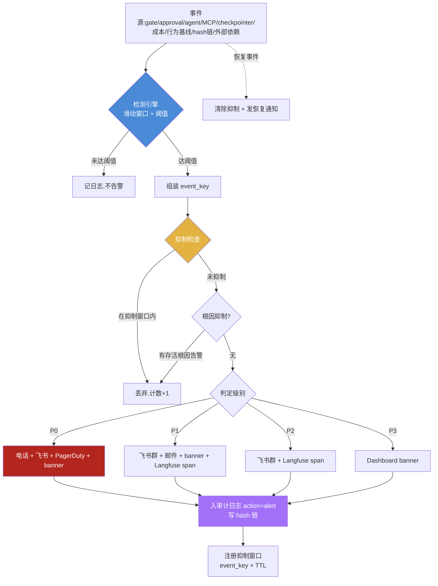
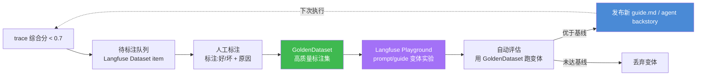
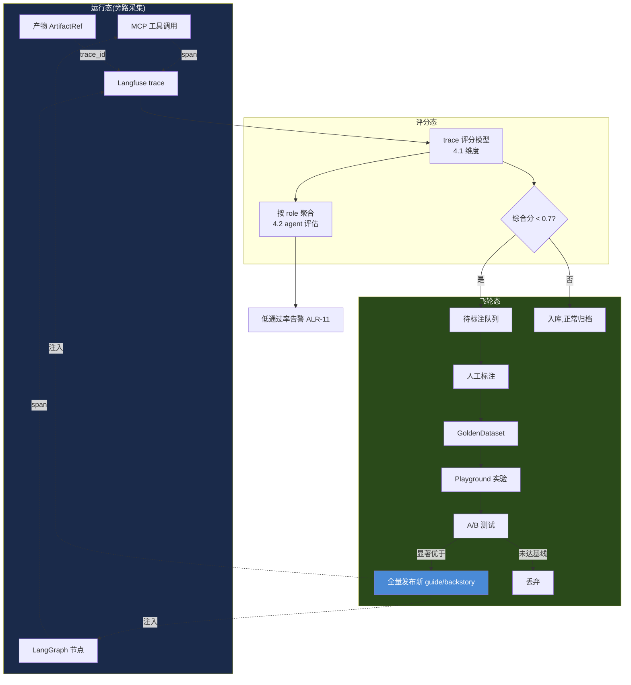
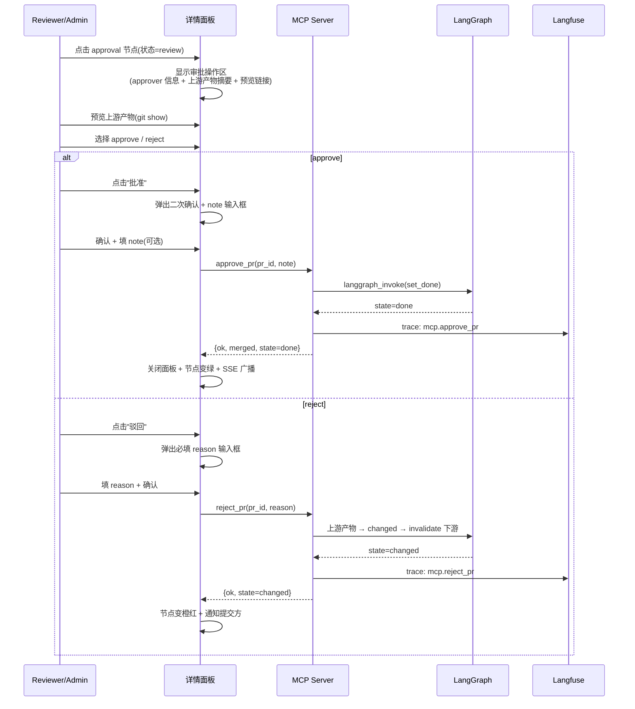
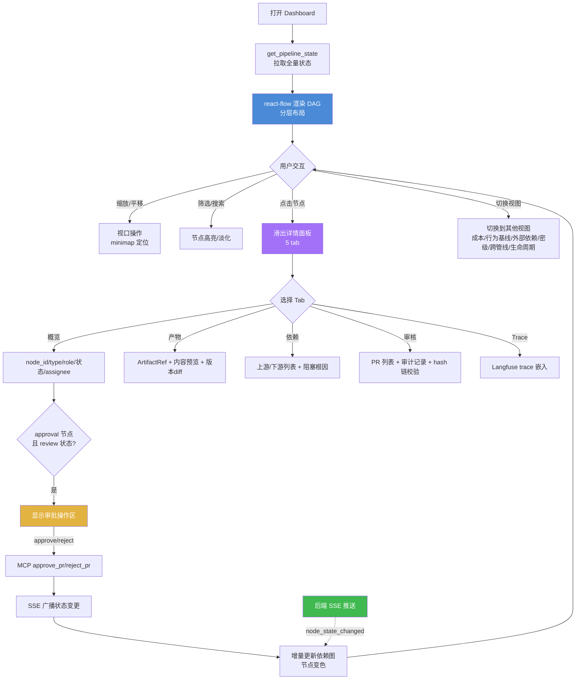
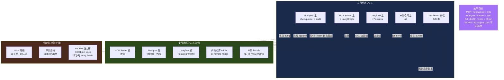
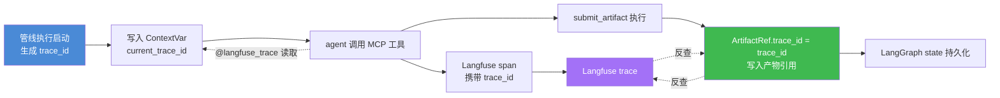

# PRD 深化:FR7 监控与可观测性 & FR8 可视化编排与 Dashboard & 第7章非功能需求

> **文档性质**:对主 PRD `coordination-platform-prd.md`(v3.0)中 FR7、FR8、第7章非功能需求的深化补充
> **版本**:v3.0 | **日期**:2026-08-04 | **状态**:待评审
> **上游文档**:[coordination-platform-prd.md](file:///Users/zuiyou/develop/skills/ai-delivery-kit/docs/prd/coordination-platform-prd.md)、[调研报告第21章 Langfuse 监控层](file:///Users/zuiyou/develop/skills/ai-delivery-kit/docs/research/ai-multi-agent-dev-dashboard-research.md)
> **深化范围**:告警规则、SLO 指标、Langfuse 评估飞轮、Dashboard 交互规格、react-flow 性能优化、SSE 推送协议、容量规划、灾备高可用、安全加固、**审计 hash 链与 WORM 锚定**、**成本归因 Dashboard**、**Agent 行为基线告警**、**外部依赖健康监控**、**Langfuse 集成细化**、**NFR11-NFR18 深化**
> **技术栈约束**:LangGraph + CrewAI + Langfuse(旁路)+ react-flow + SSE

### 变更记录(Changelog)

| 版本 | 日期 | 变更摘要 |
|---|---|---|
| v1.0 | 2026-08-04 | 初版:告警规则、SLO、评估飞轮、Dashboard 交互、react-flow 性能、SSE 协议、容量规划、灾备、安全加固;提议 NFR11-NFR20(容量/灾备/安全类)同步回主 PRD |
| v2.0 | 2026-08-04 | 内部评审:补 AC8.6~8.8 性能验收;明确 SSE 重连退避策略 |
| **v3.0** | **2026-08-04** | **与主 PRD v3.0 同步,补充第四轮压力测试(D9)新增内容**:① 新增 §11 审计 hash 链与 WORM 锚定(算法/创世条目/每小时锚定/篡改检测/数据结构/降级补写/合规导出);② 新增 §12 成本归因 Dashboard(管线/Agent/Task/模型四维归因 + 四级视图 + 80%/100%/3 次告警规则);③ 新增 §13 Agent 行为基线与告警(allowed_sequences/forbidden_tools/偏离检测/ALR-13~15/info-warning-critical 三级);④ 新增 §14 外部依赖健康监控(ExternalHealthMonitor 24h URL/7d API 版本/每日 CVE + healthy/degraded/down 三态 + 自动 deprecated);⑤ 新增 §15 Langfuse 集成细化(@langfuse_trace 装饰器/span 属性清单/降级策略/trace 关联产物);⑥ 新增 §16 NFR11-NFR18 深化(对齐主 PRD 权威定义,展开量化指标);⑦ §2.1 告警表补 ALR-13~18;⑧ §5 补 §5.6 第四轮新增 Dashboard 视图;⑨ 旧 §11 NFR 表对齐主 PRD(NFR11-NFR18 已被主 PRD 重定义为成本/安全/审计/外部依赖/密级/生命周期/消费/行为护栏,本深化旧提议的容量/灾备类编号让位,其内容保留在 §8/§9/§10) |

---

## 目录

- [1. 设计目标与深化边界](#1-设计目标与深化边界)
- [2. 告警规则设计](#2-告警规则设计)
  - [2.1 告警事件清单与分级](#21-告警事件清单与分级)
  - [2.2 告警渠道矩阵](#22-告警渠道矩阵)
  - [2.3 告警抑制策略](#23-告警抑制策略)
  - [2.4 告警流程图](#24-告警流程图)
- [3. SLO 指标定义](#3-slo-指标定义)
  - [3.1 SLO 指标定义表](#31-slo-指标定义表)
  - [3.2 错误预算与燃尽](#32-错误预算与燃尽)
- [4. Langfuse 评估飞轮设计](#4-langfuse-评估飞轮设计)
  - [4.1 trace 评分模型](#41-trace-评分模型)
  - [4.2 agent 质量评估](#42-agent-质量评估)
  - [4.3 prompt 优化闭环](#43-prompt-优化闭环)
  - [4.4 A/B 测试机制](#44-ab-测试机制)
  - [4.5 评估飞轮图](#45-评估飞轮图)
- [5. Dashboard 交互规格](#5-dashboard-交互规格)
  - [5.1 依赖图交互](#51-依赖图交互)
  - [5.2 节点详情面板](#52-节点详情面板)
  - [5.3 审批操作流](#53-审批操作流)
  - [5.4 审计日志查询](#54-审计日志查询)
  - [5.5 Dashboard 交互流图](#55-dashboard-交互流图)
  - [5.6 第四轮新增 Dashboard 视图](#56-第四轮新增-dashboard-视图)
- [6. react-flow 性能优化](#6-react-flow-性能优化)
  - [6.1 大管线渲染策略](#61-大管线渲染策略)
  - [6.2 增量更新与批处理](#62-增量更新与批处理)
- [7. SSE 推送协议规范](#7-sse-推送协议规范)
  - [7.1 事件格式](#71-事件格式)
  - [7.2 事件类型定义](#72-事件类型定义)
  - [7.3 重连与续传机制](#73-重连与续传机制)
  - [7.4 心跳与压缩](#74-心跳与压缩)
- [8. 容量规划](#8-容量规划)
- [9. 灾备与高可用](#9-灾备与高可用)
  - [9.1 备份策略](#91-备份策略)
  - [9.2 RTO/RPO 目标](#92-rtorpo-目标)
  - [9.3 灾备架构图](#93-灾备架构图)
- [10. 安全加固清单](#10-安全加固清单)
- [11. 审计 hash 链与 WORM 锚定](#11-审计-hash-链与-worm-锚定)
  - [11.1 hash 链算法](#111-hash-链算法)
  - [11.2 数据结构与存储](#112-数据结构与存储)
  - [11.3 WORM 锚定机制](#113-worm-锚定机制)
  - [11.4 篡改检测](#114-篡改检测)
  - [11.5 降级与 WAL 补写](#115-降级与-wal-补写)
  - [11.6 合规导出](#116-合规导出)
  - [11.7 hash 链校验流程图](#117-hash-链校验流程图)
- [12. 成本归因 Dashboard](#12-成本归因-dashboard)
  - [12.1 成本归因维度](#121-成本归因维度)
  - [12.2 四级 Dashboard 视图](#122-四级-dashboard-视图)
  - [12.3 告警规则与降级动作](#123-告警规则与降级动作)
  - [12.4 成本计算模型](#124-成本计算模型)
- [13. Agent 行为基线与告警](#13-agent-行为基线与告警)
  - [13.1 行为基线定义](#131-行为基线定义)
  - [13.2 偏离检测](#132-偏离检测)
  - [13.3 告警通道与级别](#133-告警通道与级别)
  - [13.4 ALR-13~15 规则定义](#134-alr-1315-规则定义)
  - [13.5 行为基线告警流程图](#135-行为基线告警流程图)
- [14. 外部依赖健康监控](#14-外部依赖健康监控)
  - [14.1 ExternalHealthMonitor 后台任务](#141-externalhealthmonitor-后台任务)
  - [14.2 健康状态定义](#142-健康状态定义)
  - [14.3 触发动作](#143-触发动作)
  - [14.4 Dashboard 视图](#144-dashboard-视图)
- [15. Langfuse 集成细化](#15-langfuse-集成细化)
  - [15.1 @langfuse_trace 装饰器实现](#151-langfuse_trace-装饰器实现)
  - [15.2 span 属性清单](#152-span-属性清单)
  - [15.3 降级策略](#153-降级策略)
  - [15.4 trace 关联产物](#154-trace-关联产物)
- [16. NFR11-NFR18 深化](#16-nfr11-nfr18-深化)
- [17. 与主 PRD 的对齐与修正](#17-与主-prd-的对齐与修正)

---

## 1. 设计目标与深化边界

### 1.1 深化目标

主 PRD 的 FR7/FR8/第7章已定义"Langfuse 旁路监听 + react-flow 依赖图 + SSE 实时更新 + 18 条非功能需求"的主干,但以下 15 个薄弱点需深化:

| 薄弱点 | 现状(主 PRD) | 深化后 |
|---|---|---|
| 告警规则 | 仅列举"gate 失败、审批超时、agent 离线"3 个事件 | 18 类事件(ALR-01~18)+ 4 级分级 + 渠道矩阵 + 抑制策略 |
| SLO 指标 | 仅 NFR4/NFR5 两条性能阈值 | 12 项 SLO + 错误预算模型 |
| 评估飞轮 | 未涉及(调研报告 4.5 提及但 PRD 未落地) | trace 评分 + agent 评估 + prompt 闭环 + A/B |
| Dashboard 交互 | 仅"点击节点→详情面板→跳 trace"一句 | 缩放/拖拽/筛选/搜索 + 详情面板字段 + 审批流 + 审计查询 + 第四轮新增 5 视图 |
| react-flow 性能 | 未涉及 | 100+ 节点虚拟化 + 增量更新 + 批处理节流 |
| SSE 协议 | 仅"SSE/WebSocket 推送"一句 | 事件格式 + 7 事件类型 + 重连续传 + 心跳 + 压缩 |
| 容量规划 | 未涉及 | 节点/管线/agent/PR 容量上限 + 资源配额 |
| 灾备高可用 | 仅 NFR1/NFR3 两条 | 5 类数据备份策略 + RTO/RPO 表 + 灾备架构 |
| 安全加固 | 仅 NFR7/NFR9 两条 | MCP 认证 + 仓库访问控制 + 审计防篡改 + 密钥管理 |
| **审计 hash 链** | FR7.2/NFR15 仅一句"hash 链 + WORM",算法/锚定/校验未定义 | §11:完整算法 + 创世条目 + 每小时 WORM 锚定 + 篡改检测 + 数据结构 + 降级补写 + 合规导出 |
| **成本归因 Dashboard** | FR3.5 三层硬预算 + FR7.3"四级成本汇总",视图/告警未展开 | §12:四维归因 + 四级视图 + 80%/100%/3 次告警规则 + 计算模型 |
| **Agent 行为基线** | FR3.5/FR7.3 仅提"ALR-13~15 循环/越权/成本异常",规则未定义 | §13:allowed_sequences + forbidden_tools + 偏离检测 + ALR-13~15 + info/warning/critical 三级 |
| **外部依赖监控** | FR6/§5.1 ExternalHealthMonitor 仅伪码,NFR14 频率/动作未量化 | §14:24h URL + 7d API 版本 + 每日 CVE + healthy/degraded/down 三态 + 自动 deprecated |
| **Langfuse 集成** | FR4.4 仅"经 @langfuse_trace 装饰器",实现/属性/降级未定义 | §15:装饰器实现 + span 属性清单 + 降级策略 + trace 关联产物 |
| **NFR11-NFR18** | §7 各一条一句话,无量化指标 | §16:逐条展开阈值表/验收点 |

### 1.2 设计原则

1. **旁路原则不动摇**:Langfuse 全程旁路,所有监控/告警/评估失败时降级,绝不阻塞主流程(继承 FR7.2 / NFR1)
2. **可观测性服务于编排**:监控数据必须能反查到 `node_id` / `trace_id` / `pr_id`,形成"产物→执行链路→质量评估"闭环
3. **可视化与编排同源**:Dashboard 的状态数据来自 LangGraph `PipelineState`,不存在第二份状态源
4. **渐进式容量**:容量上限按 Phase 给出阶梯(MVP→生产化→规模化),避免过度设计
5. **审计即合规证据**(v3.0 新增):审计日志不只是"看历史",是合规证据——hash 链 + WORM 锚定 + 每日校验是刚需(继承第四轮根因 7)
6. **外部依赖是产物的暗物质**(v3.0 新增):提交时校验不够,需持续监控 + 自动 deprecated(继承第四轮根因 2)
7. **LLM agent 需行为护栏**(v3.0 新增):agent 行为有不确定性(误判/越权/遗忘/失控),需基线 + 偏离告警 + 成本硬约束(继承第四轮根因 5)

---

## 2. 告警规则设计

### 2.1 告警事件清单与分级

告警级别定义:

| 级别 | 含义 | 响应时效 | 示例 |
|---|---|---|---|
| **P0 Critical** | 平台不可用 / 数据丢失风险 | 立即(< 5min) | LangGraph checkpointer 失败、产物仓库不可达、hash 链断裂 |
| **P1 High** | 核心流程受阻 / SLA 即将违约 | < 15min | gate 失败、审批超时、管线停滞、agent 越权、预算耗尽 |
| **P2 Medium** | 局部异常 / 需关注 | < 1h | agent 离线、PR 审核积压、行为基线偏离、外部依赖 degraded |
| **P3 Low** | 降级提示 / 容量预警 | 工作日处理 | Langfuse 降级、节点数接近上限、成本 80% 预警 |

告警规则表:

| 编号 | 事件 | 触发条件 | 级别 | 渠道 | 抑制策略 |
|---|---|---|---|---|---|
| ALR-01 | gate 门禁失败 | `gate` 节点 policy 任一项(lint/test/coverage/security)失败 | P1 | 飞书群 + Dashboard banner | 按 `node_id` 聚合,同一 gate 10min 内只告 1 次 |
| ALR-02 | 审批超时 | `approval` 节点进入 `review` 超过 SLA(自动 10s / 人工 4h)未决策 | P1 | 飞书 @审批人 + 邮件 | 按 `node_id` 抑制;超时升级时按审批人聚合 |
| ALR-03 | agent 离线 | AgentRegistry 心跳超过 90s 未上报(正常 30s) | P2 | 飞书群 | 按 `agent_id` 抑制;离线恢复后发恢复通知 |
| ALR-04 | 管线停滞 | 管线无状态变更持续时间 > 30min 且仍有非 done 节点 | P1 | 飞书群 + Dashboard banner | 按 `pipeline_id` 抑制,30min 一次;根因排查后手动消除 |
| ALR-05 | Langfuse 降级 | 旁路监听装饰器连续 3 次捕获异常进入降级路径 | P3 | Dashboard banner + 日志 | 降级期间静默;恢复后告"已恢复" |
| ALR-06 | 产物仓库不可达 | git 操作(submit/verify/get_deps)连续失败 ≥ 3 次 | P0 | 电话 + 飞书群 + PagerDuty | 5min 窗口抑制;恢复后告恢复 |
| ALR-07 | MCP 错误率飙升 | MCP 工具调用 5min 滑动窗口错误率 > 10% | P1 | 飞书群 + Dashboard banner | 按 `tool_name` 聚合;错误率回落自动恢复 |
| ALR-08 | 级联失效风暴 | 单次 `changed` 触发下游 `blocked` 节点数 > 5 | P1 | 飞书群 + Dashboard banner | 按 `pipeline_id` + 根因 `node_id` 抑制;展示影响面节点列表 |
| ALR-09 | PR 审核积压 | `pending_review` 状态 PR 数 > 10 或最老 PR 等待 > 2h | P2 | 飞书 @reviewer | 工作时间抑制(夜间合并到早 9 点);按 reviewer 聚合 |
| ALR-10 | checkpointer 持久化失败 | LangGraph state 写入 Postgres 失败 | P0 | 电话 + 飞书群 + PagerDuty | 不抑制(每次都告);立即触发降级到内存 checkpointer |
| ALR-11 | 审批驳回率异常 | 某 role 24h 内 PR 驳回率 > 40% | P3 | 飞书群(对应 role 频道) | 按 `role` 每日 1 次;提示可能 skill 引导不足 |
| ALR-12 | 节点数接近上限 | 单管线节点数 > 80(上限 100) | P3 | Dashboard banner | 按 `pipeline_id` 抑制;提示考虑拆分管线 |
| ALR-13 | agent 行为循环检测 | 同一 agent 对同一节点重复调用异常序列(见 §13.4) | P2 | Langfuse span 属性 + Dashboard 告警卡片 + 飞书 | 按 `agent_id` + `node_id` 抑制 30min;偏离 1 次仅记 info |
| ALR-14 | agent 越权尝试 | agent 调用不在其 `allowed_tools` 列表中的工具(见 §13.4) | P1 | Langfuse span 属性 + Dashboard banner + 飞书 @admin | 按 `agent_id` 抑制;连续 2 次 warning,3 次 critical |
| ALR-15 | agent 成本异常 | 单 Task/单 Agent 成本突破基线(见 §13.4 / §12.3) | P1 | Langfuse span 属性 + Dashboard banner + 飞书 | 按 `agent_id` + `node_id` 抑制;联动 §12 成本告警 |
| ALR-16 | 成本预算 80% 预警 | 任一层级(Task/Agent/管线/平台)预算消耗达 80% | P3 | Dashboard banner + 飞书群 | 按 `层级维度` 每日 1 次;触发自动降级到便宜模型 |
| ALR-17 | 成本预算 100% 硬中断 | 任一层级预算消耗达 100% | P1 | 飞书群 + Dashboard banner + 邮件 | 不抑制;触发硬中断/排队/暂停 |
| ALR-18 | hash 链完整性断裂 | 篡改检测发现 `entry_hash` 不匹配或 WORM 锚定校验失败 | P0 | 电话 + 飞书群 + PagerDuty + 邮件 | 不抑制;立即冻结审计写入并启动安全事件闭环 |

> **说明**:ALR-13~15 对应主 PRD §FR7.3"Agent 行为基线"与 §FR3.5;ALR-16~17 对应 §FR3.5 三层硬预算;ALR-18 对应 NFR15 / AC7.6。详细规则见 §12、§13、§11。

### 2.2 告警渠道矩阵

| 渠道 | 适用级别 | 实现方式 | 备注 |
|---|---|---|---|
| **飞书 / Slack IM** | P1 / P2 / P3 | `notify` 控制节点 + webhook 机器人 | 默认渠道,按 role 分群 |
| **电话 / PagerDuty** | P0 | PagerDuty webhook 或飞书电话加急 | 值班 on-call 轮值 |
| **邮件** | P1 / P2 | SMTP | 审批超时升级上级时用 |
| **Dashboard banner** | 全部 | SSE 推送 `alert` 事件,前端顶部横幅 | P0/P1 常驻,P2/P3 可关闭 |
| **Langfuse span 属性** | ALR-13~15 | 在 agent 工具调用 span 打 `alert_code` / `baseline_deviation` 标签 | 行为基线告警的可观测载体 |
| **审计日志** | 全部 | 告警动作入 `audit_log`(action=`alert`) | 告警本身也要可追溯(hash 链) |

### 2.3 告警抑制策略

抑制是为避免"告警风暴"淹没真正问题。四种抑制策略组合使用:

| 抑制策略 | 机制 | 适用场景 |
|---|---|---|
| **时间窗抑制** | 同一 `(event_key)` 在 N 分钟内只告首次 | gate 反复失败、agent 反复离线 |
| **聚类抑制** | 相同维度(`node_id`/`agent_id`/`pipeline_id`)聚合成一条 | 级联失效风暴、批量驳回 |
| **根因抑制** | 根因告警存活期间,抑制其衍生告警 | checkpointer 失败导致的所有下游报错 |
| **维护窗口** | 预设维护时间段内静默非 P0 告警 | 计划内升级、数据迁移 |

`event_key` 组装规则:`{alert_code}:{primary_dim}`,例如 `ALR-01:n7`、`ALR-03:server-agent-02`、`ALR-04:login-feature`、`ALR-14:server-agent-01`。

### 2.4 告警流程图



---

## 3. SLO 指标定义

### 3.1 SLO 指标定义表

SLO 分四类:性能、可靠性、业务质量、可观测性。所有指标以 Langfuse trace + 管理方 `audit_log` 为数据源。

| 编号 | 类别 | 指标 | SLO 目标 | 测量方法 | 数据源 |
|---|---|---|---|---|---|
| SLO-01 | 性能 | MCP 工具调用响应时间(不含 git) | P95 < 2s | trace span `mcp.*` 的 duration 分布 | Langfuse |
| SLO-02 | 性能 | git show 拉取产物内容延迟 | P95 < 5s | trace span `mcp.get_dependencies` duration | Langfuse |
| SLO-03 | 性能 | Dashboard 首屏渲染 | P95 < 2s | 前端 RUM(首屏 `get_pipeline_state` 返回到 DAG 渲染完成) | 前端埋点 |
| SLO-04 | 性能 | SSE 状态推送延迟 | P99 < 1s | state 变更时间戳 → 前端收到事件时间戳 | 管理方 + 前端 |
| SLO-05 | 可靠性 | 平台可用性 | ≥ 99.5%(月) | 成功 MCP 调用 / 总 MCP 调用(排除客户端误用) | Langfuse |
| SLO-06 | 可靠性 | Langfuse 可用性(允许降级) | ≥ 99%(月);降级不计平台故障 | Langfuse `/health` 探针 | Langfuse |
| SLO-07 | 可靠性 | MCP 工具错误率 | < 1%(5min 窗口) | `error_spans / total_spans` by `tool_name` | Langfuse |
| SLO-08 | 业务 | 管线推进延迟(ready→done) | 中位 < 30min;P90 < 4h | `node_states` 从 `ready` 到 `done` 的 wall-clock | 管理方 state 日志 |
| SLO-09 | 业务 | 自动审核处理时间 | P95 < 10s | `mcp.review_artifact_pr` span duration | Langfuse |
| SLO-10 | 业务 | 人工审核处理时间 | 中位 < 4h;P90 < 1 工作日 | approval 进 `review` 到 `approve/reject` 时长 | audit_log |
| SLO-11 | 业务 | PR 一次通过率 | ≥ 80%(按 role) | `approve / (approve + reject)` 首次提交 | audit_log |
| SLO-12 | 可观测 | trace 覆盖率 | ≥ 99% 产物含 `trace_id` | `ArtifactRef.trace_id` 非空率 / 总产物 | 管理方 + Langfuse |
| SLO-13 | 可观测 | hash 链完整性校验通过率 | 100%(每日校验) | 每日全量重算 hash 链,断裂条数 / 总条数 | audit_log |
| SLO-14 | 可靠性 | 外部依赖健康检查覆盖率 | 100% done 产物 24h 内被检查 | 最近一次 `external_health.check` 时间 ≤ 24h | ExternalHealthMonitor |

### 3.2 错误预算与燃尽

基于 SLO-05(99.5% 可用性),月度错误预算:

| 可用性目标 | 月度错误预算(按 30 天) | 含义 |
|---|---|---|
| 99.5% | 216 min / 月(3.6h) | 平台不可用总时长不得超过此值 |

错误预算燃尽规则:
- **燃尽 < 50%**:正常,无动作
- **燃尽 50%~80%**:P3 告警(Dashboard banner),提示稳定性风险,暂停非紧急变更
- **燃尽 > 80%**:P1 告警,冻结所有非紧急发布,优先修复稳定性问题
- **燃尽 100%**:该月剩余时间默认拒绝新功能部署,仅允许修复类变更

错误预算每月 1 号重置,剩余预算不结转。

---

## 4. Langfuse 评估飞轮设计

> 调研报告 4.5 提出"评估数据飞轮:低分 case → 人工标注 → 回流 GoldenDataset → 下轮实验"。本节将其落地到平台的具体评估对象与闭环。

### 4.1 trace 评分模型

对每条管线执行 trace,按节点类型定义评分维度。评分在 Langfuse 的 `score` API 写入,旁路执行(失败降级)。

| node_type | 评分维度 | 分值 | 数据来源 |
|---|---|---|---|
| 全类型 | 元数据完整度 | 0~1 | skill `required_fields` 校验结果 |
| 全类型 | 依赖声明准确性 | 0~1 | deps 节点是否真实存在且 done |
| 全类型 | 审核结果 | 0(驳回)/0.5(转人工)/1(通过) | audit_log `action` |
| 全类型 | 重试次数惩罚 | -0.2/次 | 同 node_id 的 PR 提交次数 |
| `api_contract` | 契约稳定性 | 0~1 | 后续是否触发下游 `changed`(30 天窗口) |
| `client_*` | 联调一次通过 | 0/1 | `client_func` 是否首次 submit 即 done |

trace 综合分 = 各维度加权平均。**综合分 < 0.7 的 trace 自动入"待标注队列"**。

### 4.2 agent 质量评估

按 role 聚合 trace 评分,形成 agent 质量看板:

| 指标 | 计算方式 | 用途 |
|---|---|---|
| 任务完成率 | `done` 节点数 / 分配给该 role 的 ready 节点数 | 评估 role 整体产能 |
| 平均推进延迟 | 该 role 节点 `ready→done` 中位耗时 | 评估 role 效率 |
| 一次通过率 | 首次 PR 即 `approve` 的比例 | 评估产物质量 |
| 平均驳回次数 | `reject` 次数 / 总 PR 数 | 评估 skill 引导是否充分 |
| trace 平均分 | 该 role 所有 trace 综合分均值 | 综合质量信号 |

当某 role 的"一次通过率"连续 3 天 < 60%,触发 P3 告警(ALR-11),提示该 role 的 skill `guide.md` 可能需要优化。

### 4.3 prompt 优化闭环

低分 trace 回流到 Langfuse Datasets,驱动 prompt/guide 优化:



优化对象分两类:
- **Constraint Skill `guide.md`**:影响 agent 产出的元数据质量与依赖声明准确性
- **CrewAI Agent `backstory`**:影响 agent 的产出倾向与一次通过率

### 4.4 A/B 测试机制

| 维度 | 设计 |
|---|---|
| 实验单元 | 按 `pipeline_id` 哈希分桶(同一管线内保持一致,避免污染) |
| 流量分配 | 50/50,默认基线组 vs 实验组 |
| 实验对象 | `guide.md` 变体 / `backstory` 变体 / gate policy 阈值 |
| 评估指标 | 一次通过率(SLO-11)、trace 综合分、推进延迟(SLO-08) |
| 显著性 | 双比例 z 检验,p < 0.05 且样本量 ≥ 30 视为显著 |
| 决策 | 实验组显著优于基线 → 全量发布;否则保留基线 |

A/B 配置存储在管理方 `ab_config` 表,Langfuse trace 打 `experiment_group` 标签以区分。

### 4.5 评估飞轮图



---

## 5. Dashboard 交互规格

### 5.1 依赖图交互

基于 react-flow,主视图为 DAG 依赖图。交互能力分四组:

| 交互组 | 操作 | 行为 | 实现 |
|---|---|---|---|
| **缩放** | 滚轮 / 双指捏合 | 缩放范围 0.2x ~ 3x;双击节点自适应居中 | react-flow `zoomLevel` 限制 |
| **平移** | 拖拽画布空白 / 方向键 | 画布平移;超出视口显示 minimap 定位 | react-flow `panOnDrag` |
| **节点拖拽** | 拖拽节点 | 仅在编辑模式下可调整位置(只读模式锁定位置) | `nodesDraggable` 按 mode 切换 |
| **框选** | 框选多节点 | 批量高亮 + 批量操作(仅 admin) | react-flow `selectionOnDrag` |

筛选与搜索:

| 功能 | 入口 | 行为 |
|---|---|---|
| 按状态筛选 | 顶部状态 chip(blocked/ready/review/done/changed) | 非选中状态的节点降透明度至 20%,边同步淡化 |
| 按角色筛选 | 侧栏 role 复选框(product/server/design/client) | 同上 |
| 按 type 筛选 | 侧栏 type 下拉 | 同上 |
| 节点搜索 | 顶部搜索框(node_id / type) | 命中节点高亮 + 视口居中 + minimap 标记 |
| 阻塞链路高亮 | 选中 blocked 节点 → "显示阻塞根因" | 反向追溯未 done 的上游链路,红色高亮 |

视图辅助:
- **Minimap**:右下角缩略图,大管线(> 30 节点)自动显示,显示当前视口框
- **布局切换**:分层布局(默认,DAG 自上而下)/ 力导向布局(可选)
- **全屏**:依赖图全屏模式,隐藏侧栏

### 5.2 节点详情面板

点击节点 → 右侧滑出详情面板。面板分 5 个 tab:

| Tab | 字段 | 数据源 | 说明 |
|---|---|---|---|
| **概览** | node_id / type / role / 状态 / 当前 assignee | PipelineState | 顶部状态色条与依赖图一致 |
| **产物** | ArtifactRef(repo/path/commit/toolspec_framework/trace_id) + 产物内容预览 + 版本历史 | 管理方 + 产物仓库 git show | 预览按扩展名选渲染器(YAML/JSON/Markdown/Figma 链接);`trace_id` 可点击跳 Langfuse |
| **依赖** | 上游依赖列表(node_id/type/status) + 下游影响列表 | PipelineState | 上游未 done 的标红;点击可跳转对应节点 |
| **审核** | PR 列表(pr_id/状态/提交时间/reviewer) + 审计记录 | audit_log | 展开可见 skill_verdict / 驳回原因 |
| **Trace** | Langfuse trace 嵌入(span 列表 + 耗时瀑布) | Langfuse iframe | 按 `trace_id` 嵌入 Langfuse trace 视图 |

字段联动:
- `trace_id` 点击 → 新开 Langfuse trace 页面(带鉴权 token)
- 产物内容预览的"版本历史"→ 选两个版本 → diff 对比
- 审核记录的"驳回原因"→ 点击"查看 skill 约束"→ 跳对应 Constraint Skill 详情

### 5.3 审批操作流

`approval` 节点处于 `review` 状态时,详情面板的"概览"tab 显示审批操作区:



审批操作约束:
- **权限校验**:仅 `reviewer` / `admin` 角色可见审批按钮(`get_audit_log` 权限校验)
- **二次确认**:approve/reject 均需二次确认,防误触
- **reject 必填 reason**:驳回必须填理由,写入 audit_log
- **并发控制**:同一 approval 同时只能有一个进行中的审批操作(乐观锁,基于 `node_states` 版本号)

### 5.4 审计日志查询

审计日志视图(顶部"审计"tab)支持多维度查询:

| 查询条件 | 类型 | 说明 |
|---|---|---|
| node_id | 文本(精确) | 查某节点的全部审核记录 |
| reviewer | 下拉(mgmt-bot / reviewer_id) | 按审核人过滤 |
| action | 多选(approve / reject / needs_human / alert / security_incident) | 按动作类型 |
| 时间范围 | 日期选择器 | 默认最近 7 天 |
| pr_id | 文本 | 精确查某 PR |
| node_type | 下拉 | 按产物类型 |

查询结果:
- 表格展示:`ts / audit_id / action / node_id / node_type / reviewer / merge_commit / trace_id / entry_hash(前 8 位) / anchored_to_worm`
- `trace_id` 可点击跳 Langfuse
- `merge_commit` 可点击跳产物仓库 commit
- `entry_hash` 可点击展开查看完整 hash + prev_hash,并触发该条及前后的 hash 链校验
- 支持导出 CSV(仅 admin),导出动作本身入审计日志(hash 链)

### 5.5 Dashboard 交互流图



### 5.6 第四轮新增 Dashboard 视图

> 修正来源:第四轮压力测试(主 PRD §FR7.3)。主 PRD Dashboard 视图表已从 6 个扩展到 10 个,本节细化第四轮新增的 5 个视图。

Dashboard 顶部导航除原有"依赖图 / Trace / 审计日志 / PR 列表"外,新增 5 个视图入口:

| 视图 | 入口 | 数据源 | 核心内容 | 关联章节 |
|---|---|---|---|---|
| **产物密级视图** | 顶部"密级"tab | `artifact_ref.classification` + `RoleInstance.clearance` | 密级分布饼图(public/internal/confidential/restricted)+ 按管线/角色的密级堆叠柱状图 + 越权访问尝试列表(NFR17) | §16 NFR17 |
| **外部依赖健康视图** | 顶部"外部依赖"tab | `ExternalHealthMonitor` + `external_health.check` span | 全部 done 产物的外部资源状态列表(healthy/degraded/down)+ 最近检查时间 + 失效产物快捷跳转 | §14 |
| **跨管线引用视图** | 顶部"跨管线引用"tab | `CrossPipelineReferenceRegistry` 表 | 引用关系有向图(source_pipeline → target_pipeline)+ 目标产物 deprecated 时的受影响引用方高亮 + 通知状态 | 主 PRD §5.1 |
| **管线生命周期视图** | 顶部"生命周期"tab | `pipeline.status` | 5 态状态机分布(active/paused/cancelled/merged/completed)+ 暂停/取消管线的恢复入口 + 合并/拆分操作历史 | §16 NFR16 |
| **Agent 行为基线偏离视图** | 顶部"行为基线"tab | `security.incident` span + ALR-13~15 告警 | 各 agent 偏离次数热力图(agent × 时间)+ allowed_sequences/forbidden_tools 违规明细 + critical 级自动暂停的 agent 列表 | §13 |

视图交互通用规则:
- 所有视图支持按 `pipeline_id` / `agent_id` / 时间范围筛选
- 视图数据通过 SSE 增量更新(复用 §7 协议,新增 `cost_update` / `behavior_deviation` / `external_health` 三类事件,见 §7.2)
- 视图异常项可点击跳转到对应节点详情面板或审计日志

---

## 6. react-flow 性能优化

### 6.1 大管线渲染策略

主 PRD 未定义大管线场景。本节针对 100+ 节点管线给出渲染策略:

| 策略 | 机制 | 触发条件 | 效果 |
|---|---|---|---|
| **视口虚拟化** | 仅渲染当前视口可见的节点 + 视口外 1 层缓冲;滚动时动态挂载/卸载 | 节点数 > 30 | DOM 节点数从 N 降到 ~20 |
| **Minimap 概览** | 右下角缩略图显示全量节点(简化渲染,无动画) | 节点数 > 30 | 全局导航不丢失 |
| **节点组件 memo 化** | 自定义 Node 组件用 `React.memo` + `areEqual` 比较仅 `data.status` 变化 | 全局 | 避免无关 re-render |
| **边简化** | 节点数 > 50 时,边不渲染动画箭头,仅静态贝塞尔曲线 | 节点数 > 50 | 减少 SVG 动画开销 |
| **分层布局缓存** | dagre 布局结果按 `pipeline_id + version` 缓存,仅结构变更时重算 | 全局 | 避免每次渲染重算布局 |
| **缩放降级** | zoom < 0.5 时,节点仅显示色块 + node_id,隐藏详情 | zoom < 0.5 | 远视图减少渲染细节 |

### 6.2 增量更新与批处理

SSE 推送频繁时(如级联失效风暴),需批处理避免逐帧渲染:

| 机制 | 实现 | 说明 |
|---|---|---|
| **事件缓冲队列** | 前端收到 SSE 事件先入队列,不立即更新 react-flow state | 解耦接收与渲染 |
| **16ms 节流** | 用 `requestAnimationFrame` 合并队列,每帧(16ms)批量 flush 一次 | 保证 60fps 不丢帧 |
| **增量 patch** | 后端 SSE 推送 JSON Patch(`RFC 6902`),前端只 patch 变更节点的 `data` | 避免全量 `get_pipeline_state` 重拉 |
| **同节点合并** | 同一 `node_id` 在一帧内多次状态变更,只保留最终态 | 如 ready→pending_review→done 快速跳变 |

性能验收标准(补充 AC8.6):
- 100 节点管线首屏渲染 < 2s(SLO-03)
- 100 节点管线下,SSE 推送到节点变色延迟 < 1s(SLO-04)
- 拖拽/缩放帧率 ≥ 30fps(节点数 ≤ 100 时)

---

## 7. SSE 推送协议规范

主 PRD 仅提"SSE/WebSocket 推送"。本节明确采用 SSE(Server-Sent Events,单向推送够用且更轻量),定义完整协议。

### 7.1 事件格式

采用标准 SSE 格式,每事件 4 个字段:

```
id: <event_id>          # 单调递增,用于断线续传(Last-Event-ID)
event: <event_type>     # 事件类型(见 7.2)
data: <json_payload>    # 事件载荷(JSON 字符串)
retry: 3000             # 重连等待(ms),客户端断线后 3s 自动重连

```

事件载荷通用结构:

```json
{
  "event_id": "evt_20260804_001",
  "ts": "2026-08-04T10:30:00.123Z",
  "pipeline_id": "login-feature",
  "version": 42,
  "patch": [{ "op": "replace", "path": "/node_states/n2", "value": "done" }]
}
```

`version` 为 PipelineState 逻辑版本号,客户端据此丢弃乱序的旧事件。

### 7.2 事件类型定义

| event 类型 | 触发时机 | data 关键字段 | 前端动作 |
|---|---|---|---|
| `node_state_changed` | 节点状态变更(blocked/ready/review/done/changed) | `node_id`, `from`, `to`, `patch` | 增量更新节点颜色 + 详情面板 |
| `pr_updated` | PR 状态变更(提交/审核中/合并/驳回) | `pr_id`, `node_id`, `pr_status` | 刷新 PR 列表视图 |
| `approval_required` | approval 节点进入 review | `node_id`, `approver`, `deadline` | 通知对应 reviewer + banner |
| `alert` | 告警触发(2.1 表) | `alert_code`, `level`, `message`, `event_key` | 顶部 banner + 飞书同步 |
| `pipeline_done` | 管线全部节点 done | `pipeline_id`, `duration`, `stats` | 全局通知 + 统计更新 |
| `agent_status` | agent 上下线 | `agent_id`, `role`, `status`(online/offline) | 更新角色负载视图 |
| `heartbeat` | 心跳(见 7.4) | `ts` | 维持连接,无 UI 动作 |
| `cost_update` | 成本归因数据更新(每分钟聚合) | `pipeline_id`, `agent_id`, `cost_usd`, `budget_usage_pct` | 刷新成本归因 Dashboard(§12) |
| `behavior_deviation` | agent 行为基线偏离(ALR-13~15) | `agent_id`, `node_id`, `deviation_type`, `count`, `level` | 刷新行为基线偏离视图(§13) |
| `external_health` | 外部依赖健康状态变更 | `node_id`, `resource_url`, `from`, `to` | 刷新外部依赖健康视图(§14) |

### 7.3 重连与续传机制

```
客户端断线 ──> 等 retry ms(默认 3s) ──> 自动重连
                                         │
                                         ▼
                       带 Last-Event-ID: <最后收到的事件 id>
                                         │
                                         ▼
                    服务端从该 id 之后续发,不丢事件
```

重连退避策略(指数退避 + 抖动):

| 重试次数 | 等待时间 | 说明 |
|---|---|---|
| 1~3 | 3s(基础 retry) | 快速重试 |
| 4~6 | 3s × 2^(n-3) + 随机抖动(0~1s) | 指数退避,避免惊群 |
| > 6 | 60s 封顶 | 长时间断连,降频重试 |
| > 10 | 提示"连接丢失,请刷新" | 前端 UI 提示 + 手动重连按钮 |

服务端续传实现:
- 事件按 `event_id` 存环形缓冲区(保留最近 1000 条,约 10min 水位)
- 客户端带 `Last-Event-ID` 重连时,从缓冲区续发
- 若 `Last-Event-ID` 已被淘汰(超出缓冲区),返回 `sync_required` 事件,客户端全量拉 `get_pipeline_state` 重建

### 7.4 心跳与压缩

**心跳**:
- 服务端每 15s 发送 SSE comment(`:heartbeat\n\n`),维持连接防中间代理超时
- comment 不触发前端 `onmessage`,仅保活
- 客户端 30s 未收到任何数据(含 heartbeat)→ 主动断连触发重连

**压缩**:
- HTTP 层启用 `Content-Encoding: gzip`(Nginx/反代配置)
- 应用层:`patch` 字段使用 JSON Patch(RFC 6902)增量,而非全量 state
- 高频场景(级联风暴):同一 `pipeline_id` 的多事件合并为一条 `batch` 事件,`data` 为 patch 数组

---

## 8. 容量规划

按实施阶段给出阶梯容量上限,避免过早投入资源。容量指标基于主 PRD 数据模型(Pipeline / Node / Agent / PR)。

| 维度 | Phase 1(MVP) | Phase 2(生产化) | Phase 3(规模化) | 资源配额(Phase 2 基准) |
|---|---|---|---|---|
| 并发管线数 | 5 | 20 | 100 | 每 100 节点约 50MB state |
| 单管线节点数 | 30 | 100 | 200(需虚拟化) | — |
| 在线 agent 数 | 4(每 role 1) | 16(每 role 4) | 64 | 每 agent 并发任务上限 3 |
| 并发 PR 数 | 10 | 50 | 200 | — |
| MCP QPS | 5 | 50 | 300 | 单实例 ~100 QPS,可水平扩 |
| SSE 连接数 | 10 | 100 | 500 | 单实例 ~1000 连接 |
| Langfuse trace/天 | 1k | 10k | 100k | Postgres ~100GB/月(Phase 2) |
| 产物仓库大小 | 100MB | 2GB | 20GB | git clone < 30s |
| LangGraph checkpointer | SQLite | Postgres(单实例) | Postgres(主从) | — |
| Dashboard 并发用户 | 5 | 30 | 100 | — |

资源配额与限制策略:

| 资源 | 配额机制 | 超限行为 |
|---|---|---|
| agent 并发任务 | AgentRegistry `max_concurrent` 字段(默认 3) | 超限任务排队,ready 节点等待 |
| 单管线节点数 | 软上限 100,硬上限 200 | > 100 触发 ALR-12;> 200 拒绝创建 |
| 产物文件大小 | skill `max_size_kb`(默认 512KB) | PR 审核 reject |
| Langfuse trace 保留 | 热数据 30 天,冷归档 90 天 | 超期转冷存储 |
| 审计日志保留 | ≥ 1 年(NFR9) | 超期归档到冷存储 |
| SSE 单 IP 连接数 | 10 | 超限拒绝新连接(防滥用) |

---

## 9. 灾备与高可用

### 9.1 备份策略

针对平台 5 类核心数据,分别定义备份策略。所有备份遵循"3-2-1 原则"(3 份副本、2 种介质、1 份异地)。

| 数据 | 存储 | 备份方式 | 频率 | 保留 | 恢复方式 |
|---|---|---|---|---|---|
| **LangGraph PipelineState** | Postgres checkpointer | WAL 归档 + 全量 pg_dump | WAL 实时;全量每日 | 7 份滚动 | PITR(时间点恢复)或全量恢复 |
| **产物仓库(内容)** | 独立 git | git mirror 到备库 + bundle 打包 | 每次 merge 触发 mirror;bundle 每日 | mirror 实时;bundle 30 份 | git fetch from mirror 或 clone bundle |
| **Langfuse trace** | Postgres(自托管) | pg_dump + 异步流复制到备库 | 流复制实时;dump 每日 | dump 30 份 | 流复制切换或 dump 恢复 |
| **审计日志** | Postgres 独立表 / 独立 audit 仓库 | append-only + hash chain + 异地副本 + **WORM 锚定** | 实时复制;每小时锚定 | ≥ 1 年(NFR9) | 从备库读;WORM 防篡改(见 §11) |
| **Constraint Skills** | 文件系统(skills/) | git 版本控制 + mirror | 每次变更 commit | 永久 | git checkout |

### 9.2 RTO/RPO 目标

| 数据 | RTO(恢复时间目标) | RPO(恢复点目标) | 说明 |
|---|---|---|---|
| PipelineState | < 15min | < 1min | WAL 归档 + checkpointer 自动恢复;RTO 含切换 |
| 产物仓库 | < 30min | 0(同步 mirror) | git mirror 近实时;最坏丢失最后一个未 mirror 的 merge |
| Langfuse trace | < 4h | < 5min | 允许降级运行(NFR1);trace 非主流程,RTO 宽松 |
| 审计日志 | < 1h | 0(同步复制) | 合规要求,不允许丢失;WORM 锚定每小时一次 |
| Constraint Skills | < 5min | 0(git) | 文件量小,git clone 即恢复 |

高可用部署拓扑(Phase 2 基准):

| 组件 | 部署 | 故障切换 |
|---|---|---|
| MCP Server + LangGraph | 主备(1 主 1 备,Keepalived 或 K8s) | 心跳检测,主挂 < 10s 切备 |
| Postgres(checkpointer + audit) | 主从流复制 | Patroni 自动切换 < 30s |
| 产物仓库(git) | 主 + mirror | 主挂手动切 mirror(RTO < 30min) |
| Langfuse | 主备 Postgres + 无状态前端 | 前端多副本;DB Patroni 切换 |
| Dashboard 前端 | 多副本(无状态) | 负载均衡自动剔除 |

### 9.3 灾备架构图



---

## 10. 安全加固清单

主 PRD 仅 NFR7(角色权限)/ NFR9(审计不可篡改)两条。本节展开为 4 类安全加固。

### 10.1 MCP 认证与授权

| 加固项 | 设计 | 说明 |
|---|---|---|
| MCP 工具认证 | 每次 MCP 调用携带 `Authorization: Bearer <token>`(JWT) | token 由管理方签发,含 `role` / `agent_id` claim |
| token 生命周期 | access token 1h;refresh token 7 天 | 短期 token 限制泄露窗口 |
| 工具级 RBAC | MCP Server 按 token 的 `role` 校验工具权限(主 PRD 3.2 权限矩阵) | 如 product role 调 `approve_pr` 拒绝 |
| 参数校验 | MCP `inputSchema` 强校验(必填/类型),拒绝非法参数 | 防 injection |
| 限流 | 按 `agent_id` 限流(默认 10 QPS),按 IP 限流(默认 100 QPM) | 防滥用 / 暴力调用 |

### 10.2 产物仓库访问控制

| 加固项 | 设计 | 说明 |
|---|---|---|
| 分支保护 | main 禁止直接 push,只接受 PR(FR1.2 已定义) | 继承主 PRD |
| 签名 commit | feat 分支 commit 推荐 GPG 签名;管理方 bot merge commit 强制签名 | 防伪造提交 |
| bot 账号最小权限 | 管理方 bot 仅有 `write` + `merge` 权限,无 `admin` | 限制 bot 被盗影响面 |
| 产物内容访问 | `get_dependencies` 拉取内容时校验调用方 role 与节点 role 匹配 | 防越权读其他角色产物(可选,按需) |
| 仓库 webhook secret | PR webhook 携带 HMAC 签名,管理方校验 | 防伪造 webhook 触发审核 |

### 10.3 审计日志防篡改(摘要)

> 本节为摘要,完整算法、锚定与校验见 §11。

| 加固项 | 设计 | 说明 |
|---|---|---|
| hash chain | `entry_hash = sha256(prev_hash + canonical_json(payload))`,形成链式结构 | 任何篡改导致链断裂,可检测(详见 §11.1) |
| WORM 存储 | 审计日志表设为 append-only(Postgres `REVOKE UPDATE/DELETE`)+ 独立 ROLE 仅授 INSERT | 数据库层禁止修改 |
| WORM 锚定 | 每小时将最新 `entry_hash` 锚定到外部 S3 Object Lock | 防 DBA 篡改,信任边界外延(详见 §11.3) |
| 异地副本 | 审计日志实时复制到异地备库(9.1) | 主库被入侵不影响备库 |
| 定期校验 | 每日定时任务全量重算 hash 链 + WORM 锚定校验,异常告警 P0(ALR-18) | 及时发现篡改(详见 §11.4) |
| 导出审计 | 审计日志导出动作本身入审计日志(`action=export`) | 导出可追溯 |

### 10.4 密钥管理

| 密钥类型 | 存储方式 | 访问方式 | 说明 |
|---|---|---|---|
| MCP JWT 签名密钥 | 环境变量 / Vault | MCP Server 启动时加载 | 轮换周期 90 天 |
| 产物仓库 bot token | Vault(per-bot scoped) | MCP Server 运行时从 Vault 取 | token 仅 `repo` scope |
| Langfuse API key | 环境变量 / Vault | 旁路监听装饰器加载 | public/secret key 分离 |
| webhook secret | Vault | webhook 校验时取 | 每个 repo 独立 secret |
| Postgres 凭据 | Vault | 服务启动时取 | 定期轮换 |
| 第三方集成密钥(飞书/Slack) | Vault | `notify` 节点运行时取 | 按 app scoped |
| WORM 锚定凭据(S3 / KMS) | Vault | 锚定任务运行时取 | 仅审计服务账号可写 WORM 桶 |

密钥管理原则:
- **永不硬编码**:密钥不进代码仓库,不进镜像
- **最小暴露**:密钥仅在运行时内存中,日志脱敏(打码)
- **per-agent scoped**:agent 的 token 仅限其 role 范围,不支持提权
- **轮换机制**:所有密钥定义轮换周期,过期告警(P3)

---

## 11. 审计 hash 链与 WORM 锚定

> 修正来源:第四轮压力测试根因 7(主 PRD 附录 D9 P0 修正 #4)。主 PRD §FR6.5 / §FR7.2 / NFR15 / AC7.6 / AC6.10 要求审计日志采用 hash 链 + WORM 存储,但仅给出"hash(prev + current_fields)"一句话,未定义算法、创世条目、锚定机制、校验流程。本节补全。
> 对应审核报告发现 2.2 / 3.7:P0 级"hash 链信任边界(防 DBA 篡改)未定义"与"hash 计算方式未定义"。

### 11.1 hash 链算法

**hash 函数**:SHA-256(输出 64 字符 hex digest)。

**核心公式**:

```
entry_hash = sha256(prev_hash + canonical_json(payload))
```

其中:

- `prev_hash`:上一条 audit_log 记录的 `entry_hash`;**创世条目**(第一条)的 `prev_hash = sha256("genesis")`,固定值 `sha256("genesis") = 8d4e...`(运行时计算,不硬编码)
- `canonical_json(payload)`:对 payload 字段做规范化 JSON 序列化,确保字节级稳定:
  1. 按 key 的字典序(lexicographic)排序
  2. 移除所有可选空白(紧凑模式,无缩进、无换行)
  3. 字符串用 UTF-8 编码
  4. 非 ASCII 字符不转义(保证中文可读 + 字节稳定)
  5. `null` / `true` / `false` / 数字按 JSON 规范输出
- `+`:字节串拼接(将 `prev_hash` 的 UTF-8 字节与 `canonical_json` 的 UTF-8 字节直接拼接,无分隔符)
- 输出:`sha256(...)` 取 hex digest,存入 `entry_hash` 字段,格式 `sha256:<64 hex>`

**payload 字段集合**(参与 hash 计算的字段,即 AuditLogEntry 中除 `prev_hash` / `entry_hash` / `anchored_to_worm` / `worm_anchor_id` 之外的全部字段):

```python
payload_fields = [
    "audit_id", "pipeline_id", "action", "pr_id", "pr_url",
    "node_id", "node_type", "artifact_path", "merge_commit",
    "content_integrity_hash", "classification", "reviewer",
    "submitter", "submitter_instance_id", "skill_used",
    "skill_verdict", "deps_at_review", "note", "trace_id", "ts"
]
```

> 注:`action` 取值为 `approve | reject | needs_human | alert | security_incident | export`(对齐主 PRD §5.1 AuditLogEntry)。

**示例(创世条目)**:

```
prev_hash = sha256("genesis")
payload   = {"action":"approve","audit_id":"aud_001",...,"ts":"2026-08-04T10:30:00Z"}
entry_hash = sha256(sha256("genesis") + canonical_json(payload))
```

**示例(后续条目)**:

```
prev_hash = <上一条的 entry_hash>
entry_hash = sha256(prev_hash + canonical_json(payload))
```

### 11.2 数据结构与存储

**audit_log 表字段扩展**(对齐主 PRD §5.1 AuditLogEntry,补审核报告发现 1.8 / 4.5):

```sql
ALTER TABLE audit_log
  ADD COLUMN prev_hash        TEXT NOT NULL,           -- 上一条 entry_hash;创世为 sha256("genesis")
  ADD COLUMN entry_hash       TEXT NOT NULL,           -- 本条 hash = sha256(prev_hash + canonical_json(payload))
  ADD COLUMN anchored_to_worm BOOLEAN NOT NULL DEFAULT FALSE,  -- 是否已锚定到外部 WORM
  ADD COLUMN worm_anchor_id   TEXT,                    -- WORM 锚定对象 ID(如 S3 Object Lock key)
  ADD COLUMN content_integrity_hash TEXT,              -- 产物内容完整性 hash(NFR15)
  ADD COLUMN classification   TEXT NOT NULL,           -- 产物密级 public/internal/confidential/restricted(NFR17)
  ADD COLUMN node_type        TEXT,
  ADD COLUMN artifact_path    TEXT,
  ADD COLUMN reviewer         TEXT,
  ADD COLUMN submitter        TEXT,
  ADD COLUMN submitter_instance_id TEXT;

CREATE INDEX idx_audit_hash_chain ON audit_log(entry_hash);
CREATE INDEX idx_audit_classification ON audit_log(classification);
```

**写入流程**(应用层在 INSERT 时计算 hash 链):

```python
def append_audit_log(entry: AuditLogEntry) -> str:
    # 1. 取上一条 entry_hash 作为 prev_hash(创世用 sha256("genesis"))
    prev = db.query("SELECT entry_hash FROM audit_log ORDER BY ts DESC, audit_id DESC LIMIT 1")
    prev_hash = prev[0] if prev else sha256("genesis")
    # 2. 计算 entry_hash
    payload = {k: v for k, v in entry.items()
               if k not in ("prev_hash","entry_hash","anchored_to_worm","worm_anchor_id")}
    entry_hash = sha256((prev_hash + canonical_json(payload)).encode("utf-8"))
    # 3. 插入(DB ROLE 仅 INSERT 权限)
    db.insert("audit_log", {**entry, "prev_hash": prev_hash, "entry_hash": entry_hash,
                            "anchored_to_worm": False, "worm_anchor_id": None})
    return entry_hash
```

**WORM 表级权限**(防 DBA 直接改表):

- 创建独立 ROLE `audit_writer`,仅授予 `audit_log` 表的 `INSERT` + `SELECT`
- `REVOKE UPDATE, DELETE ON audit_log FROM PUBLIC, <app_role>, <dba_role>`
- 应用服务账号使用 `audit_writer`;DBA superuser 不持有应用凭据,操作需走审计化变更流程
- 触发器补充:任何 `UPDATE` / `DELETE` / `TRUNCATE` 抛异常(防止 superuser 绕过 REVOKE 后仍尝试)

> 信任边界说明:REVOKE + 触发器防"应用层误操作"和"普通 DBA";防 superuser 篡改依赖 §11.3 的外部 WORM 锚定(信任边界外延到 S3 Object Lock)。

### 11.3 WORM 锚定机制

**目的**:将 hash 链头定期锚定到平台之外的不可变存储,即使 DBA(superuser)篡改 DB 内的 audit_log,锚定记录仍可证明篡改。

**锚定频率**:每小时一次(整点触发,如 `0 * * * *`)。

**锚定目标**:S3 Object Lock(Compliance 模式,不可删除、不可覆盖,保留期 ≥ 1 年)。

**锚定对象结构**(每个锚定周期写一个对象):

```json
{
  "anchor_id": "worm_20260804_1000",
  "anchored_at": "2026-08-04T10:00:00Z",
  "latest_audit_id": "aud_20260804_042",
  "latest_entry_hash": "sha256:abc123...",
  "latest_ts": "2026-08-04T09:59:58Z",
  "chain_length": 42,
  "anchor_hash": "sha256(latest_entry_hash + anchored_at + chain_length)",
  "anchored_by": "audit-anchoring-svc"
}
```

**锚定流程**:

1. 锚定任务读取当前最新 `entry_hash` + `audit_id` + `ts` + 链长度
2. 计算 `anchor_hash = sha256(latest_entry_hash + anchored_at + chain_length)`
3. 写入 S3 Object Lock 桶(key = `worm_YYYYMMDD_HH.tar.gz`,含上述 JSON + 该小时全部 audit_log 行的压缩副本)
4. 写入成功后,批量回填 DB:`UPDATE audit_log SET anchored_to_worm = TRUE, worm_anchor_id = 'worm_...' WHERE ts BETWEEN <hour_start> AND <hour_end> AND anchored_to_worm = FALSE`
   - 注意:此 UPDATE 仅允许锚定服务账号(独立 ROLE `audit_anchorer`)执行,且仅能更新 `anchored_to_worm` / `worm_anchor_id` 两列(列级权限),不能碰 `entry_hash` / `prev_hash`
5. 锚定失败 → 重试 3 次(指数退避);仍失败 → P1 告警,但**不阻塞** audit_log 写入(锚定是事后加固,降级见 §11.5)

**S3 Object Lock 配置**:
- 模式:Compliance(连 root 都不能删)
- 保留期:≥ 1 年(对齐 NFR9 审计保留)
- 版本控制:开启(对象不可覆盖,但保留历史版本)

### 11.4 篡改检测

**全量 hash 链校验**(每日定时任务,如每日 03:00):

```python
def verify_hash_chain() -> Report:
    rows = db.query("SELECT * FROM audit_log ORDER BY ts ASC, audit_id ASC")
    prev_hash = sha256("genesis")
    broken = []
    for row in rows:
        payload = strip_hash_fields(row)
        expected = sha256((prev_hash + canonical_json(payload)).encode())
        if row["entry_hash"] != expected:
            broken.append({"audit_id": row["audit_id"], "expected": expected, "actual": row["entry_hash"]})
            # 不 return,继续校验后续(定位所有断裂点)
        prev_hash = row["entry_hash"]  # 用存储值继续,定位后续是否连锁断裂
    # WORM 锚定交叉校验
    anchors = s3.list_worm_anchors()
    for a in anchors:
        row = db.query("SELECT entry_hash FROM audit_log WHERE audit_id = ?", a["latest_audit_id"])
        if not row or row[0]["entry_hash"] != a["latest_entry_hash"]:
            broken.append({"anchor_id": a["anchor_id"], "type": "worm_mismatch"})
    if broken:
        alert(ALR_18, level=P0, detail=broken)   # 触发 hash 链断裂 P0 告警
        trigger_security_incident("audit_tamper", broken)  # 启动安全事件闭环
    return Report(total=len(rows), broken=len(broken))
```

**校验内容**:
- **链式完整性**:遍历全部记录,用 `prev_hash` 重算每条 `entry_hash`,与存储值对比
- **WORM 交叉校验**:每小时锚定对象的 `latest_entry_hash` 与 DB 中对应 `audit_id` 的 `entry_hash` 对比;若 DB 被篡改但 WORM 未动,此处检出
- **锚定完整性**:检查 `anchored_to_worm = TRUE` 的记录数与 S3 桶中锚定对象覆盖的记录数一致

**触发动作**(检测到断裂):
- P0 告警 ALR-18(电话 + 飞书 + PagerDuty + 邮件,不抑制)
- 冻结审计写入(切换到 WAL 降级模式,见 §11.5)
- 启动安全事件闭环 `handle_security_incident(incident_type="audit_tamper")`(主 PRD FR4.3)
- 从 WORM 锚定副本恢复被篡改区间

**校验 SLA**(对应 SLO-13):每日校验通过率 100%;断裂检出到告警 < 5min。

### 11.5 降级与 WAL 补写

> 对应主 PRD §FR7.2"审计 hash 链降级:先将事件持久化到本地 WAL,恢复后补写 hash 链,不丢失合规证据"。

**降级触发条件**(任一):
- audit_log 表 INSERT 失败(如 Postgres 不可达、连接池耗尽)
- WORM 锚定连续 3 次失败(ALR-18 之外的 P1 告警,不阻断写入)

**WAL 格式**(本地文件,append-only):

```
/var/log/audit-wal/2026-08-04.wal
# 每行一个 JSON,含完整 payload + ts + 本地序号 local_seq
{"local_seq":1,"payload":{...},"ts":"..."}
{"local_seq":2,"payload":{...},"ts":"..."}
```

**补写顺序保证**(审核报告发现 2.1):
- WAL 每行带单调递增 `local_seq`(进程内原子计数 + 落盘 fsync)
- 多实例场景:每个实例独立 WAL 文件,补写时按 `(instance_id, local_seq)` 全局排序后顺序计算 `prev_hash` 链
- 补写幂等:补写前查 DB 最后一条 `entry_hash` 作为起点;若 WAL 中某条 `audit_id` 已存在于 DB,跳过(幂等)

**恢复探测**:
- 健康检查每 10s 探测 Postgres 可达性 + audit_log INSERT 权限
- 连续 3 次成功 → 进入补写模式
- 补写完成(WAL 清空)→ 恢复正常直写模式

**WAL 保留**:补写成功后即删除对应行;未补写的 WAL 保留 ≤ 7 天,超期告警(P1)。

### 11.6 合规导出

对应主 PRD FR4.2 `export_compliance_report`(admin 工具)。

**导出内容**:
- 指定时间范围内全部 audit_log 记录(含 `prev_hash` / `entry_hash` / `anchored_to_worm` / `worm_anchor_id`)
- 对应的 WORM 锚定对象列表(S3 key + anchor_hash)
- hash 链完整性校验报告(全量重算结果)
- 导出动作本身入审计日志(`action=export`,写入 hash 链)

**导出格式**:签名 ZIP(含 CSV + JSON + 校验报告 Markdown),附管理方 GPG 签名。

**权限**:仅 `admin` 角色可调用;导出动作触发 ALR 级 P3 提示(避免大量导出)。

### 11.7 hash 链校验流程图

```mermaid
flowchart TB
    WRITE[管理方写入 audit_log] --> CALC[计算 entry_hash<br/>= sha256(prev_hash + canonical_json(payload))]
    CALC --> DB{DB INSERT 成功?}

    DB -->|成功| OK[正常写入<br/>anchored_to_worm=FALSE]
    DB -->|失败| WAL[降级写本地 WAL<br/>带 local_seq + fsync]
    WAL --> PROBE[健康探测每 10s]
    PROBE -->|恢复| REPLAY[按 local_seq 排序补写<br/>幂等跳过已存在 audit_id]
    REPLAY --> OK

    OK -.每小时.-> ANCHOR[锚定任务]
    ANCHOR --> S3[写 S3 Object Lock<br/>Compliance 模式 ≥1年]
    S3 --> BACKFILL[回填 anchored_to_worm=TRUE<br/>+ worm_anchor_id<br/>仅 audit_anchorer ROLE 列级权限]
    BACKFILL --> OK

    OK -.每日 03:00.-> VERIFY[全量 hash 链校验]
    VERIFY --> RECALC[遍历重算 entry_hash]
    RECALC --> CMP{与存储值一致?}
    CMP -->|一致| PASS[通过 SLO-13 100%]
    CMP -->|不一致| BROKEN[断裂]
    VERIFY --> WCMP{WORM 锚定交叉校验}
    WCMP -->|一致| PASS
    WCMP -->|不一致| BROKEN

    BROKEN --> ALR18[P0 告警 ALR-18<br/>不抑制]
    ALR18 --> FREEZE[冻结写入 切 WAL 模式]
    ALR18 --> SEC[启动安全事件闭环<br/>handle_security_incident]
    SEC --> RESTORE[从 WORM 副本恢复被篡改区间]

    style CALC fill:#4a8ad6,color:#fff
    style S3 fill:#3fb950,color:#fff
    style BROKEN fill:#b3261e,color:#fff
    style ALR18 fill:#b3261e,color:#fff
    style WAL fill:#e3b341,color:#fff
```

---

## 12. 成本归因 Dashboard

> 修正来源:第四轮压力测试根因 5(主 PRD §FR3.5 三层硬预算 + §FR7.3 成本归因视图 + NFR11)。主 PRD 已定义四级硬预算阈值,但成本归因维度、Dashboard 视图、告警规则未展开。本节补全。
> 对应审核报告发现 2.6:P1 级"成本硬预算的降级或人工介入边界不明确"。

### 12.1 成本归因维度

成本归因按四个维度逐层下钻,数据源为 Langfuse `agent.cost` span(`agent_id` / `instance_id` / `token_count` / `cost_usd`):

| 维度 | 键 | 聚合方式 | 用途 |
|---|---|---|---|
| **平台级** | 全平台 | sum(全部 `agent.cost` span 的 `cost_usd`) | 月度成本趋势 + 全局降级决策 |
| **管线级** | `pipeline_id` | sum(该管线关联的全部 Task 成本) | 单管线预算上限 + 暂停风险 |
| **Agent 级** | `agent_id` / `instance_id` | sum(该 agent 全部 span `cost_usd`) | 日度成本 + 预算上限 + 排队状态 |
| **Task 级** | `node_id` | sum(该 node 关联的全部 span) | token 消耗 + 重入队次数 + 硬中断次数 |
| **模型级**(辅助维度) | `model_name` | sum(按模型分组) | 降级决策依据(切便宜模型时按此拆分) |

**归因计算公式**:
- `task_cost(node_id) = Σ cost_usd where span.node_id = node_id`
- `agent_cost(agent_id, day) = Σ cost_usd where span.agent_id = agent_id AND span.ts::date = day`
- `pipeline_cost(pipeline_id) = Σ task_cost(node_id) where node ∈ pipeline`
- `platform_cost(month) = Σ pipeline_cost(p) where p.status != cancelled`

### 12.2 四级 Dashboard 视图

对应主 PRD §FR7.3"成本归因"视图 + AC7.8。视图入口:Dashboard 顶部"成本"tab。

#### 12.2.1 平台级视图

| 组件 | 内容 | 数据源 |
|---|---|---|
| 月度成本趋势线 | 近 6 个月 `platform_cost` 折线 + 预算线($4000/月) | `agent.cost` span 按月聚合 |
| 预算消耗率 | 当月已消耗 / $4000,百分比环 + 燃尽预测(按当前速率外推) | 实时计数器 |
| 降级状态 | 当前是否处于全局降级(切便宜模型)+ 降级触发时间 + 涉及 agent 列表 | ALR-16/17 告警状态 |
| 模型分布 | 各 `model_name` 成本占比饼图 | `agent.cost` span 按 model 分组 |

#### 12.2.2 管线级视图

| 组件 | 内容 |
|---|---|
| 管线成本列表 | `pipeline_id` / 已消耗 / 预算上限($100)/ 消耗率 / 暂停风险标签 |
| 单管线成本趋势 | 选中管线的逐日成本柱状图 |
| 暂停风险 | 消耗率 > 80% 标黄,> 100% 标红 + "即将暂停"提示 |

#### 12.2.3 Agent 级视图

| 组件 | 内容 |
|---|---|
| Agent 成本列表 | `agent_id` / `instance_id` / role / 今日已消耗 / 日预算($10)/ 消耗率 / 排队状态 |
| 排队状态 | 该 agent 当前 ready 但因预算/并发排队等待的 Task 数 |
| 日成本趋势 | 选中 agent 近 7 日成本折线 |

#### 12.2.4 Task 级视图

| 组件 | 内容 |
|---|---|
| Task 成本明细 | `node_id` / pipeline_id / token 消耗 / cost_usd / 重入队次数 / 硬中断次数 |
| 重入队热力图 | 按 `node_id` × 时间的重入队次数热力(≥ 3 次高亮) |
| 硬中断列表 | 触发硬中断(20k token / 3 次重试)的 Task 列表 + 转 `needs_human` 状态 |

### 12.3 告警规则与降级动作

对应主 PRD §FR3.5 三层硬预算阈值表 + ALR-16/17:

| 层级 | 预算上限 | 80% 预警(ALR-16) | 100% 硬中断(ALR-17) | 异常次数告警 |
|---|---|---|---|---|
| **Task 级** | 20k token / 3 次重试 | 80%(16k token)→ 记 P3 banner | 100% → **硬中断**,转 `needs_human`(ALR-15 联动) | 单 Task 重入队 **3 次** → 转 `needs_human` 告警 |
| **Agent 级** | $10/日 | 80%($8)→ 自动降级到便宜模型 | 100%($10)→ **排队等待**(不接新 Task) | 日成本突破基线 → ALR-15 |
| **管线级** | $100 | 80%($80)→ 降级 + banner | 100%($100)→ **暂停管线**(FR4.3 pause_pipeline) | — |
| **平台级** | $4000/月 | 80% → **全局降级**(切便宜模型) | 100% → 冻结新管线创建,仅允许修复类 | — |

**降级动作明细**:
- **自动降级到便宜模型**:按 §12.1 模型维度,将受影响 agent 的 LLM 调用从贵模型(如 GPT-4)切到便宜模型(如 GPT-3.5),降级期间 Langfuse span 打 `degraded=true` 标签
- **硬中断(Task)**:终止当前 LLM 调用,节点状态回退,审计记录 `action=alert`,转 `needs_human` 等待人工介入
- **排队等待(Agent)**:AgentRegistry 标记该 agent 为 `throttled`,新 ready 节点进入等待队列,不 dispatch
- **暂停管线(管线)**:调用 `pause_pipeline`(主 PRD FR4.3),ready 节点不再 dispatch,级联事件挂起

**告警通道**:ALR-16 走 Dashboard banner + 飞书群(P3);ALR-17 走飞书群 + Dashboard banner + 邮件(P1,不抑制)。

### 12.4 成本计算模型

**token_count 来源**:LLM provider API 响应的 `usage.prompt_tokens` + `usage.completion_tokens`(从 MCP 工具调用的 LLM 响应中提取,写入 `agent.cost` span)。

**cost_usd 计算**:
- 维护模型价格表(`model_price` 表:`model_name` / `input_price_per_1k` / `output_price_per_1k`,单位 USD)
- `cost_usd = (prompt_tokens / 1000) * input_price + (completion_tokens / 1000) * output_price`
- 价格表来源:LLM provider 官方定价;每月 1 号校准;降级模型的便宜价格也维护在内

**实时计数**:
- Redis 实时计数器:`agent:{agent_id}:cost:{date}` / `pipeline:{pipeline_id}:cost` / `platform:cost:{month}`
- 每次 `agent.cost` span 写入时,Redis INCRBYFLOAT;超阈值时即时触发 ALR-16/17
- 每分钟将 Redis 计数同步到 Postgres `cost_summary` 表(供 Dashboard 查询)+ 推送 `cost_update` SSE 事件(§7.2)

---

## 13. Agent 行为基线与告警

> 修正来源:第四轮压力测试根因 5(主 PRD §FR3.5 / §FR7.3"Agent 行为基线 ALR-13~15")。主 PRD 仅提"循环/越权/成本异常"三类告警名,未定义基线结构、偏离检测、告警级别。本节补全。
> 对应审核报告发现 1.16:P1 级"ALR-13~15 告警规则在主 PRD §FR7 未定义"。

### 13.1 行为基线定义

每个 RoleInstance 关联一份行为基线(`BehaviorBaseline`),定义合法工具调用序列与禁止工具:

```python
class BehaviorBaseline(TypedDict):
    instance_id: str                  # RoleInstance ID
    role: str                         # product | server | design | client | generator
    allowed_sequences: list[list[str]]  # 合法工具调用序列(允许的相邻调用模式)
    forbidden_tools: list[str]        # 禁止该角色调用的工具
    max_consecutive_calls: int        # 同一节点连续调用同一工具上限(默认 5,防循环)
    deviation_threshold_critical: int # 触发 critical(自动暂停)的偏离次数(默认 3)
```

**allowed_sequences 示例**(合法工具调用序列,基于主 PRD §3.2 权限矩阵 + 典型工作流):

| role | 合法序列示例 | 说明 |
|---|---|---|
| server | `get_dependencies → submit_artifact` | 拉依赖后提交产物 |
| server | `get_dependencies → update_progress → submit_artifact` | 含进度更新 |
| client | `get_dependencies → submit_artifact` | 同上 |
| product | `submit_artifact → request_approval` | 提交后请求审批 |
| reviewer/admin | `get_audit_log → approve_pr / reject_pr` | 查审计后审批 |

> 序列匹配规则:允许在合法序列中插入 `update_progress` / `get_pipeline_state`(只读/进度类工具不破坏序列);其余工具跳变视为偏离。

**forbidden_tools 示例**(禁止调用的工具,基于角色权限隔离):

| role | forbidden_tools | 原因 |
|---|---|---|
| server / design / client | `approve_pr`, `reject_pr`, `set_gate_policy`, `cancel_pipeline`, `pause_pipeline`, `emergency_approve` | 仅 reviewer/admin 可审批/管控 |
| product | `approve_pr`(除非同时是 reviewer) | 产品角色不审批 |
| generator | `submit_artifact`(主产物)| generator 只产出派生产物,用 `report_generation_status` |
| 所有 agent | `revoke_human_token`, `export_compliance_report`, `handle_security_incident` | 仅 admin |

### 13.2 偏离检测

**记录每次工具调用**:每次 MCP 工具调用经 `@langfuse_trace`(§15)记录 span,同时写入"行为轨迹表"(内存滑动窗口,保留每个 agent 最近 50 次调用)。

**偏离类型与检测**:

| 偏离类型 | 检测逻辑 | 对应告警 |
|---|---|---|
| **越权调用** | 调用工具 ∈ `forbidden_tools` | ALR-14(每次都记) |
| **序列异常** | 相邻调用不在任何 `allowed_sequences` 中(忽略只读工具后) | ALR-13 |
| **循环检测** | 同一 `agent_id` + `node_id` 连续调用同一工具 ≥ `max_consecutive_calls`(默认 5),或同一序列重复 ≥ 3 次 | ALR-13 |
| **成本异常** | 单 Task token > 16k(80%)或单 Agent 日成本 > $8(80%) | ALR-15(联动 §12.3) |

**偏离计数**:每个 `(agent_id, deviation_type)` 维护滚动计数器(窗口 1h):
- 越权调用:每次 +1(不衰减,因性质严重)
- 序列异常 / 循环:1h 窗口内累计,超窗口衰减

### 13.3 告警通道与级别

**告警级别**(按偏离累计次数,默认阈值):

| 级别 | 触发次数 | 动作 | 通道 |
|---|---|---|---|
| **info** | 1 次 | 仅记录,不告警;Langfuse span 打 `baseline_deviation=info` 属性 | Langfuse span 属性 |
| **warning** | 2 次 | Dashboard 告警卡片 + 飞书群通知;span 打 `baseline_deviation=warning` | Langfuse span + Dashboard 卡片 + 飞书 |
| **critical** | 3 次(达 `deviation_threshold_critical`) | **自动暂停 agent**(AgentRegistry 标记 `suspended`,停止 dispatch)+ P1 告警 + 飞书 @admin | Langfuse span + Dashboard banner + 飞书 @admin + 邮件 |

> 注:越权调用(ALR-14)性质严重,首次即 warning,2 次 critical 自动暂停;不必等 3 次。

**自动暂停后的恢复**:
- agent 进入 `suspended` 状态后,需 admin 手动调用 `resume` (或通过 AgentRegistry 管理)恢复
- 恢复动作入审计日志(`action=alert`,note 记录恢复原因)
- 恢复后偏离计数器清零

### 13.4 ALR-13~15 规则定义

对齐 §2.1 告警表,完整规则:

| 编号 | 事件 | 触发条件 | 级别 | 抑制策略 |
|---|---|---|---|---|
| **ALR-13** | agent 行为循环检测 | 同一 `agent_id` + `node_id`:① 连续调用同一工具 ≥ 5 次;或 ② 同一调用序列重复 ≥ 3 次;或 ③ 相邻调用不在 `allowed_sequences` 中(序列异常) | P2(1~2 次)/ P1(3 次 critical) | 按 `agent_id` + `node_id` 抑制 30min |
| **ALR-14** | agent 越权尝试 | agent 调用 ∈ 其 `forbidden_tools` 列表的工具 | P1(首次 warning,2 次 critical) | 按 `agent_id` 抑制;不衰减 |
| **ALR-15** | agent 成本异常 | 单 Task token > 16k(80%)或单 Agent 日成本 > $8(80%)或单管线成本 > $80(80%) | P1 | 按 `agent_id` + `node_id` 抑制;联动 §12.3 ALR-16/17 |

### 13.5 行为基线告警流程图

```mermaid
flowchart TB
    CALL[agent 发起 MCP 工具调用] --> DEC{@langfuse_trace<br/>记录 span + 行为轨迹}

    DEC --> CHK{基线校验}
    CHK -->|工具 ∈ forbidden_tools| AUTH[越权 ALR-14]
    CHK -->|序列不在 allowed_sequences| SEQ[序列异常 ALR-13]
    CHK -->|连续同工具 ≥5 或同序列 ≥3| LOOP[循环 ALR-13]
    CHK -->|token/cost 超 80%| COST[成本异常 ALR-15]
    CHK -->|合规| OK[正常执行]

    AUTH & SEQ & LOOP & COST --> CNT[偏离计数器 +1<br/>1h 滚动窗口]

    CNT --> LVL{次数判定}
    LVL -->|1 次| INFO[info: 仅 span 属性<br/>baseline_deviation=info]
    LVL -->|2 次| WARN[warning: Dashboard 卡片 + 飞书<br/>span=warning]
    LVL -->|3 次| CRIT[critical: 自动暂停 agent<br/>P1 告警 + 飞书@admin]

    AUTH -.越权不衰减.-> LVL2{越权判定}
    LVL2 -->|首次| WARN
    LVL2 -->|2 次| CRIT

    CRIT --> SUSP[AgentRegistry 标记 suspended<br/>停止 dispatch]
    SUSP --> AUD[入审计日志 action=alert<br/>写 hash 链]
    SUSP --> RESTORE[等待 admin 手动 resume]

    style CRIT fill:#b3261e,color:#fff
    style SUSP fill:#e3b341,color:#fff
    style OK fill:#3fb950,color:#fff
```

---

## 14. 外部依赖健康监控

> 修正来源:第四轮压力测试根因 2(主 PRD §FR6 / §5.1 ExternalHealthMonitor / NFR14)。主 PRD 仅给出 `ExternalHealthMonitor.run()` 伪码,NFR14 未量化检查频率/超时/动作。本节补全。
> 对应审核报告发现 2.8 / 3.12:P2 级"外部依赖健康监控的检查频率/超时/重试边界未定义"与"check_reachable 实现细节缺失"。

### 14.1 ExternalHealthMonitor 后台任务

**三类周期性检查任务**:

| 任务 | 频率 | 检查对象 | 检查方式 | 超时 | 来源 |
|---|---|---|---|---|---|
| **URL 可达性检查** | 每 24h(每日 04:00) | 全部 `done` 产物的 `external_resources`(figma URL / 第三方 API URL / 代码仓 commit) | HTTP HEAD(对 web 资源)/ `git ls-remote`(对代码仓) | 5s/资源 | NFR14 |
| **第三方 API 版本检查** | 每 7 天(每周一 04:00) | 引用型产物的 `external_repo` 对应的第三方 API | 调用其 `/version` 或 version endpoint,对比上次记录 | 10s/API | 第四轮 |
| **CVE 漏洞检查** | 每日(每日 05:00) | 产物 `provenance.dependencies` 声明的依赖包 | 查 OSV API(`https://api.osv.dev/v1/query`)按包名+版本 | 30s/批 | 第四轮 |

**check_reachable 实现**(按资源类型分发):

```python
class ExternalHealthMonitor:
    def check_reachable(self, resource: ExternalResource) -> HealthResult:
        if resource.type == "web_url":        # figma / 第三方 API URL
            return self._http_head(resource.url, timeout=5)
        elif resource.type == "git_commit":   # 代码仓 commit
            return self._git_ls_remote(resource.repo, resource.commit, timeout=5)
        elif resource.type == "api_version":  # 第三方 API 版本
            return self._check_api_version(resource, timeout=10)
        elif resource.type == "package":      # 依赖包(CVE)
            return self._osv_query(resource.name, resource.version, timeout=30)
```

**HealthResult 结构**:

```python
class HealthResult(TypedDict):
    resource_url: str
    status: str           # healthy | degraded | down
    status_code: int | None
    latency_ms: int | None
    error_message: str | None
    checked_at: str       # ISO8601
    consecutive_failures: int  # 连续失败次数
```

**重试与降级触发**:
- 单次检查失败:记 `consecutive_failures += 1`,状态 `degraded`
- 连续 3 次失败(即连续 3 天 URL 检查失败):状态 `down`,触发 `trigger_deprecated`
- CVE 检出高危漏洞:立即 `down`,触发 `trigger_deprecated`(reason=`cve_vulnerable`)

### 14.2 健康状态定义

| 状态 | 含义 | 触发条件 | Dashboard 展示 |
|---|---|---|---|
| **healthy** | 外部资源可达 + 无高危漏洞 | 最近一次检查成功 | 绿色 |
| **degraded** | 可达性下降或非致命问题 | 1~2 次连续失败;或 API 版本落后(非破坏性) | 黄色 + 警告图标 |
| **down** | 不可达或有高危漏洞 | 连续 3 次失败;或 CVE 高危;或 API 版本破坏性变更 | 红色 + 产物标 deprecated |

### 14.3 触发动作

**down 状态触发链**(对应主 PRD §5.1 `trigger_deprecated` + FR2.1 状态机):

1. 调用 `trigger_deprecated(node_id, reason)` → 产物节点 `done → deprecated`
2. 查 `CrossPipelineReferenceRegistry` 找到所有引用该产物的下游管线
3. 通知所有引用方管线(飞书 + 邮件),附失效原因 + 建议替代方案
4. 写审计日志(`action=alert`,note=`external_resource_down: <url>`,入 hash 链)
5. 写 Langfuse `external_health.check` span,status=`down`
6. 推送 `external_health` SSE 事件(§7.2)刷新 Dashboard

**degraded 状态动作**:
- 仅记录 + Dashboard 黄色提示,不触发 deprecated
- 连续 degraded 达 3 次升级为 down

**恢复检测**:
- down 状态的产物,其外部资源在后续 24h 检查中若恢复 → 状态回 `degraded`(不自动回 done,需人工确认重新激活)
- 人工确认后调用相应工具恢复产物状态

### 14.4 Dashboard 视图

对应 §5.6"外部依赖健康视图"。核心组件:

| 组件 | 内容 |
|---|---|
| 健康状态总览 | 全部 done 产物的外部资源状态饼图(healthy/degraded/down) |
| 资源状态列表 | `node_id` / `pipeline_id` / `resource_url` / `status` / `last_checked` / `consecutive_failures` |
| 失效产物快捷跳转 | down 状态产物列表,点击跳节点详情面板 |
| CVE 漏洞列表 | 检出 CVE 的依赖包 + 严重级别 + 影响产物 + OSV 链接 |

**SLO-14 约束**:100% done 产物 24h 内被检查(最近一次 `external_health.check` 时间 ≤ 24h)。

---

## 15. Langfuse 集成细化

> 修正来源:主 PRD §FR4.4"所有 MCP 工具调用经 `@langfuse_trace` 装饰器" + §FR7.1 埋点设计。主 PRD 仅一句描述,本节展开装饰器实现、span 属性、降级策略、trace 关联。
> 对应审核报告发现 2.1 / 3.6:P0/P1 级"Langfuse 旁路降级的具体策略未定义"与"span 属性和采样策略不完整"。

### 15.1 @langfuse_trace 装饰器实现

所有 MCP 工具调用经 `@langfuse_trace` 装饰器包装,记录 span + 属性,**旁路原则:Langfuse 失败时降级,不阻塞主流程**。

```python
import functools, logging
from langfuse import Langfuse
from contextvars import ContextVar

langfuse = Langfuse()  # 单例
logger = logging.getLogger("langfuse_fallback")
current_trace_id: ContextVar[str] = ContextVar("trace_id", default="")

def langfuse_trace(span_name: str):
    """MCP 工具调用旁路 trace 装饰器。失败降级到本地日志,不抛异常。"""
    def decorator(func):
        @functools.wraps(func)
        def wrapper(*args, **kwargs):
            trace_id = current_trace_id.get()
            span = None
            try:
                span = langfuse.span(
                    name=span_name,
                    trace_id=trace_id,
                    metadata=_extract_span_attrs(func, args, kwargs)
                )
            except Exception as e:
                # 降级:Langfuse 不可达,记本地日志,不阻塞
                logger.warning("langfuse_unavailable span=%s err=%s", span_name, e)
                _write_local_trace_wal(span_name, trace_id, args, kwargs)

            try:
                result = func(*args, **kwargs)
                if span:
                    span.end(status="OK", output=_safe_output(result))
                return result
            except Exception as e:
                if span:
                    span.end(status="ERROR", error=str(e))
                raise  # 主流程异常正常抛出,Langfuse 不吞
        return wrapper
    return decorator
```

**关键设计**:
- 装饰器内 try/except 包裹 Langfuse 调用,任何 Langfuse 异常(连接超时/拒绝/序列化失败)被捕获,仅记本地日志
- 主流程(`func` 调用)的异常正常抛出,Langfuse 不吞主流程错误
- trace_id 通过 `ContextVar` 在一次管线执行内传递(MCP 层 → LangGraph 层共享同一 trace_id)

### 15.2 span 属性清单

对齐主 PRD §FR7.1 埋点表,每个 span 携带的标准化属性:

| 属性 | 类型 | 适用 span | 说明 |
|---|---|---|---|
| `node_id` | str | 全部 | 管线节点 ID |
| `agent_id` | str | `mcp.*` / `agent.cost` | 调用方 agent ID |
| `instance_id` | str | `mcp.*` / `agent.cost` | RoleInstance ID(多团队) |
| `session_id` | str | `mcp.*` | session 级 token 绑定 ID(NFR12) |
| `trace_id` | str | 全部 | 一次管线执行的统一 trace ID |
| `tool_name` | str | `mcp.*` | MCP 工具名 |
| `tool_args` | object | `mcp.*` | 工具入参(脱敏) |
| `token_scope` | str | `mcp.*` | token scope(node_id + allowed_tools) |
| `from_state` / `to_state` | str | `langgraph.*` | 节点状态迁移 |
| `pr_id` | int | `mcp.review_artifact_pr` / `mcp.approve_pr` / `mcp.reject_pr` | PR ID |
| `verdict` | str | `mcp.review_artifact_pr` | approve/reject/needs_human |
| `merge_commit` | str | `mcp.approve_pr` | 合并 commit |
| `content_integrity_hash` | str | `mcp.approve_pr` | 产物内容完整性 hash |
| `security_scan_results` | object | `mcp.review_artifact_pr` | 安全扫描结果 |
| `token_consumed` | int | `agent.cost` | 本次 LLM 调用 token 数 |
| `cost_usd` | float | `agent.cost` | 本次成本(USD) |
| `model_name` | str | `agent.cost` | LLM 模型名 |
| `degraded` | bool | `agent.cost` | 是否降级到便宜模型 |
| `resource_url` | str | `external_health.check` | 外部资源 URL |
| `status` | str | `external_health.check` | healthy/degraded/down |
| `incident_id` | str | `security.incident` | 安全事件 ID |
| `severity` | str | `security.incident` | 严重级别 |
| `baseline_deviation` | str | `mcp.*`(行为基线) | info/warning/critical(ALR-13~15) |
| `alert_code` | str | `mcp.*`(告警) | ALR-XX |

**采样策略**:
- 错误 span(ERROR status):100% 采样
- 成功 span:100% 采样(Phase 1/2 流量可控);Phase 3 规模化时对成功 `mcp.*` span 做 10% head-based 采样,但 `agent.cost` / `security.incident` / `external_health.check` 始终 100%

### 15.3 降级策略

**降级触发条件**:
- Langfuse SDK 调用抛异常(连接超时 500ms / 拒绝 / 序列化失败)
- Langfuse `/health` 探针连续 3 次失败

**降级动作**:
1. 装饰器捕获异常,记本地日志(`langfuse_fallback` logger,WARNING 级)
2. 写本地 trace WAL(`/var/log/langfuse-wal/`,格式同 §11.5 audit WAL),含 span_name + 属性 + ts
3. 触发 ALR-05(P3,Dashboard banner + 日志),降级期间静默
4. **不阻塞主流程**:工具调用正常执行并返回

**恢复探测**:
- 健康检查每 30s 探测 Langfuse `/health`
- 连续 3 次成功 → 进入补写模式:按 WAL 时间序回放 span 到 Langfuse
- 补写完成(WAL 清空)→ ALR-05 恢复通知,退出降级

**降级期间查询**(审核报告发现 2.1):
- Dashboard 查询 trace 时,Langfuse 降级期间返回缓存(最近成功时的 trace 快照)+ "降级中"提示
- 不返回空结果(避免误判为无 trace)

### 15.4 trace 关联产物

**关联机制**:主 PRD §FR7.2"trace_id 关联产物:ArtifactRef.trace_id 记录,可从产物反查执行 trace"。

**trace_id 传递链**:



**双向反查**:
- **产物 → trace**:Dashboard 节点详情面板"产物"tab,`ArtifactRef.trace_id` 可点击跳 Langfuse trace 页面(带鉴权 token)
- **trace → 产物**:Langfuse trace 视图按 `node_id` 属性反查管理方 `artifact_ref` 表,定位产物

**一致性保证**:
- `submit_artifact` 工具在创建 PR 时,将当前 `trace_id` 写入 `ArtifactRef.trace_id`(SLO-12:≥ 99% 产物含 trace_id)
- 若 `trace_id` 缺失(Langfuse 降级期间提交),填 `trace_id="degraded_<ts>"` 标记,补写后回填真实 trace_id

---

## 16. NFR11-NFR18 深化

> 修正来源:主 PRD §7 已将 NFR11-NFR18 重定义为第四轮新增需求(成本/安全/审计/外部依赖/密级/生命周期/消费/行为护栏)。主 PRD 各条仅一句话,本节逐条展开量化指标、验收点、关联章节。
> 注:本深化文档 v1.0 曾提议 NFR11-NFR20(容量/灾备/安全类),但主 PRD v3.0 已将 NFR11-NFR18 重新定义,旧提议的容量/灾备/安全内容保留在 §8(容量规划)、§9(灾备)、§10(安全加固),编号让位给主 PRD 权威定义。

| 编号 | 类别 | 主 PRD 原文 | 量化指标 | 验收点 | 关联章节 |
|---|---|---|---|---|---|
| **NFR11** | 成本 | Task/Agent/管线/平台四级成本硬预算,超限触发降级或人工介入 | Task:20k token/3 次重试;Agent:$10/日;管线:$100;平台:$4000/月。80% → 降级;100% → 硬中断/排队/暂停;单 Task 重入队 3 次 → `needs_human` | AC7.8 成本归因 Dashboard 展示四级成本;ALR-16/17 触发 | §12 / §FR3.5 |
| **NFR12** | 安全 | Agent 身份按 session 级 token 强绑定,越权调用被阻断并告警 | token 绑定 `node_id + allowed_tools + expires_at`(access 1h);越权调用首次 warning、2 次 critical 自动暂停 | 越权调用触发 ALR-14;agent 被自动 suspended | §13 / §10.1 |
| **NFR13** | 安全 | 产物 PR 强制通过安全扫描规则族(密钥/URL/恶意/完整性),零容忍阻断入 main | 扫描覆盖率 **100%**(R_SECRET_SCAN/R_URL_SAFETY/R_MALWARE_SCAN/R_COMPLETENESS_CONTRACT);扫描超时 60s;检出即 reject,零容忍 | AC6.8 安全扫描检出密钥/恶意/钓鱼 URL 阻断入 main | §FR6 / §10 |
| **NFR14** | 可靠性 | 外部依赖(figma/第三方 API/代码仓 commit)持续健康监控,失效触发 deprecated | URL 可达性每 24h 检查;API 版本每 7 天;CVE 每日(OSV);超时 5s/资源;连续 3 次失败 → deprecated | AC7.7 外部依赖失效告警可 Dashboard 查看;SLO-14 覆盖率 100% | §14 |
| **NFR15** | 可观测 | 审计日志采用 hash 链 + WORM 存储,支持合规导出与完整性校验 | `entry_hash=sha256(prev_hash+canonical_json(payload))`;每小时 WORM 锚定(S3 Object Lock ≥1年);每日全量校验通过率 100% | AC7.6 hash 链可校验完整性;AC6.10 链连续不可篡改;ALR-18 断裂 P0 | §11 |
| **NFR16** | 可靠性 | 管线级生命周期操作(取消/暂停/恢复/合并/拆分)不丢失节点状态与级联事件 | 5 态状态机(active/paused/cancelled/merged/completed);操作延迟 < 5s;暂停期间级联事件挂起,resume 后回放不丢失 | TC 验证 cancel/pause/resume/merge/split 不丢状态 | §5.6 / §FR2.7 / §FR4.3 |
| **NFR17** | 安全 | 产物密级(classification)与 RoleInstance clearance 匹配,低密级调用方无法访问高密级产物 | 密级校验覆盖率 **100%**;`get_dependencies` 校验 `caller.clearance >= artifact.classification`;越权访问拒绝并告警 | 低密级访问高密级产物被拒 + 告警 | §5.6 / §10 / §5.1 RoleInstance.clearance |
| **NFR18** | 安全 | MCP JWT 签名密钥、webhook HMAC、agent API Key 由 Vault 统一管理,永不硬编码 | 全部密钥 100% 走 Vault;轮换周期:JWT 90 天 / webhook 180 天 / agent key 90 天;永不硬编码(代码扫描零命中) | 密钥轮换/永不硬编码测试;密钥不在代码/镜像/日志 | §10.4 |

---

## 17. 与主 PRD 的对齐与修正

本深化文档与主 PRD v3.0 的关系:补充细化,不推翻主干。以下为需同步回主 PRD 的修正点与对齐说明:

| 主 PRD 位置 | 现状 | 修正/补充 | 说明 |
|---|---|---|---|
| FR7.3 Dashboard 视图 | v3.0 已扩到 10 个视图 | 本深化 §5.6 细化第四轮新增 5 视图;§12 细化成本归因;§14 细化外部依赖;§13 细化行为基线 | 视图交互规格补全 |
| FR7.4 验收标准 | AC7.1~7.8 | 已对齐:AC7.6 hash 链(§11)、AC7.7 外部依赖(§14)、AC7.8 成本归因(§12) | 第四轮 AC 落地 |
| FR3.5 三层硬预算 | 四级阈值表 | §12.3 展开降级动作明细 + 告警规则 ALR-16/17 | 成本控制可实施 |
| FR7.2 旁路监听 | hash 链降级一句话 | §11.5 展开 WAL 补写 + 顺序保证 + 恢复探测 | 降级方案明确 |
| FR4.4 Langfuse 装饰器 | 一句话 | §15 展开装饰器实现 + span 属性清单 + 降级策略 + trace 关联 | 集成方案明确 |
| FR6.5 审计 hash 链 | "hash(prev+current)"一句 | §11 完整算法 + 创世 + WORM 锚定 + 校验 + 合规导出 | 算法与信任边界补全 |
| §5.1 ExternalHealthMonitor | 伪码 run() | §14 展开三类检查任务 + 三态 + 触发动作 | 监控方案可实施 |
| FR8.3 实时更新 | "SSE/WebSocket 推送" | §7 明确 SSE + 完整协议 + 新增 cost/behavior/external 事件类型 | 协议规范化 |
| FR8.4 技术选型 | react-flow + SSE | §6 大管线虚拟化 + 增量更新 | 性能可扩展 |
| FR8.5 验收标准 | AC8.1~8.5 | 补充 AC8.6:100 节点首屏 < 2s;AC8.7:SSE < 1s;AC8.8:断线重连不丢事件 | 性能与可靠性验收 |
| 第7章 NFR11-NFR18 | v3.0 已重定义(一句话/条) | §16 逐条展开量化指标 + 验收点 | NFR 可测试 |
| ALR-13~15 | 主 PRD 仅提告警名 | §13 + §2.1 完整规则定义 | 告警可实施 |

**关于 NFR 编号的对齐说明**:

本深化文档 v1.0 曾提议 NFR11-NFR20(容量/灾备/安全类),但主 PRD v3.0 已将 NFR11-NFR18 重新定义为第四轮新增需求(成本/安全/审计/外部依赖/密级/生命周期/消费/行为护栏)。**以主 PRD 为权威源**,本深化:
- §16 完全对齐主 PRD NFR11-NFR18 的权威定义并展开
- 旧提议的容量/灾备/安全内容保留在 §8(容量规划)、§9(灾备)、§10(安全加固),不再占用 NFR 编号
- 主 PRD §7 仅到 NFR18,无 NFR19/NFR20(审核报告发现 1.14 所提"NFR19/20 缺失"已由本对齐说明澄清:主 PRD 不采用 NFR19/20)

---

## 附录:Mermaid 图索引

| 图名 | 位置 | 说明 |
|---|---|---|
| 告警流程图 | 2.4 | 事件检测 → 抑制 → 分级 → 渠道 → 审计(含成本/行为/hash 链/外部依赖事件源) |
| prompt 优化闭环 | 4.3 | 低分 trace → 标注 → GoldenDataset → Playground → 发布 |
| 评估飞轮图 | 4.5 | 运行态采集 → 评分态 → 飞轮态(标注/实验/发布) |
| Dashboard 交互流图 | 5.5 | 加载 → 渲染 → 交互 → 详情面板 → 审批 → SSE 增量更新(含视图切换) |
| 审批操作时序图 | 5.3 | reviewer 点击 → 预览 → approve/reject → MCP → LangGraph → SSE |
| 灾备架构图 | 9.3 | 主备可用区 + WAL 流复制 + git mirror + 冷存储归档 + WORM 锚定桶 |
| **hash 链校验流程图** | 11.7 | 写入 → 计算 entry_hash → DB/WAL 降级 → 每小时 WORM 锚定 → 每日全量校验 → 断裂 P0 告警 |
| **行为基线告警流程图** | 13.5 | 工具调用 → 基线校验 → 偏离计数 → info/warning/critical → 自动暂停 agent |
| **trace 关联产物图** | 15.4 | trace_id 经 ContextVar 传递 → ArtifactRef.trace_id → 双向反查 |
