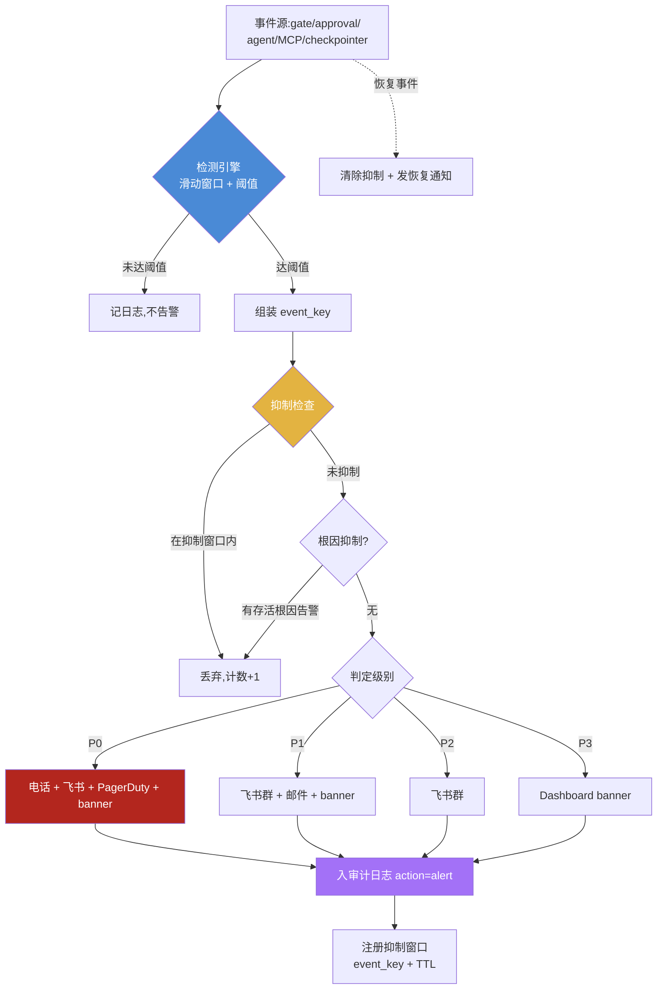
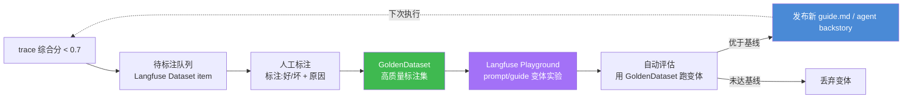
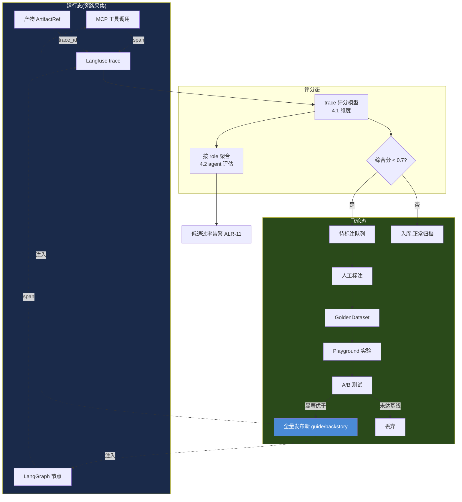
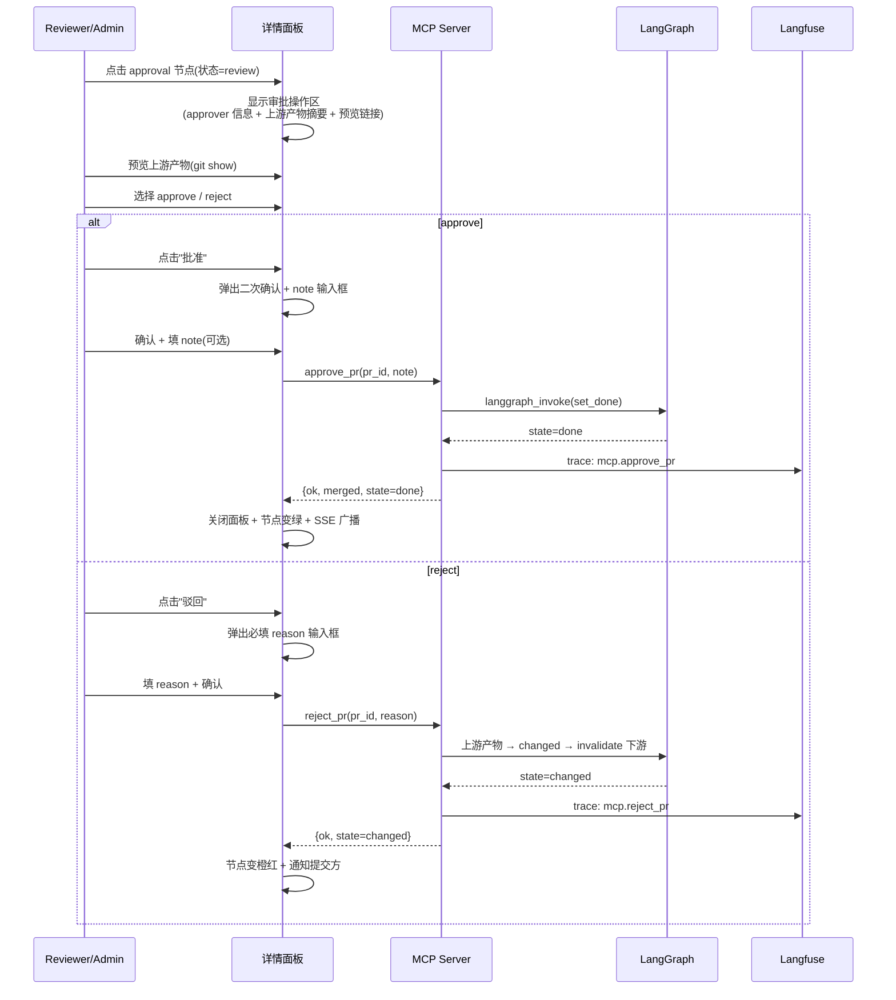
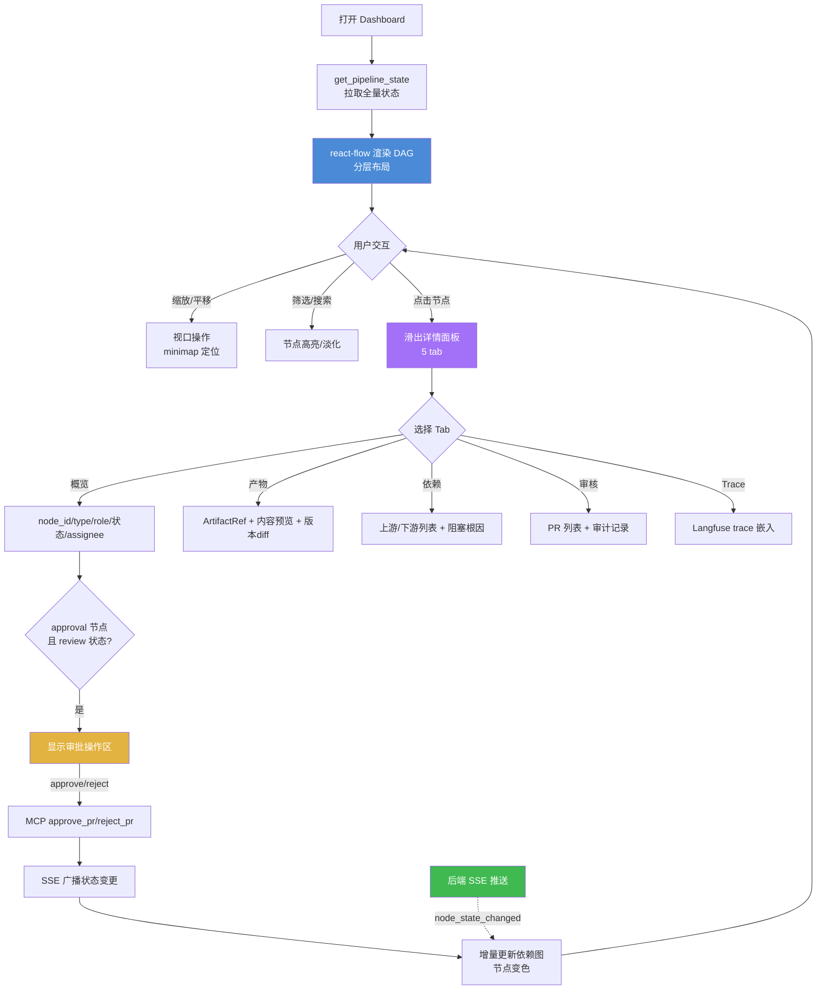
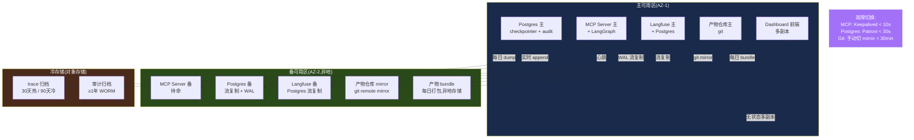

# PRD 深化:FR7 监控与可观测性 & FR8 可视化编排与 Dashboard & 第7章非功能需求

> **文档性质**:对主 PRD `coordination-platform-prd.md` 中 FR7、FR8、第7章非功能需求的深化补充
> **版本**:v1.0 | **日期**:2026-08-04 | **状态**:待评审
> **上游文档**:[coordination-platform-prd.md](file:///Users/zuiyou/develop/skills/ai-delivery-kit/docs/prd/coordination-platform-prd.md)、[调研报告第21章 Langfuse 监控层](file:///Users/zuiyou/develop/skills/ai-delivery-kit/docs/research/ai-multi-agent-dev-dashboard-research.md)
> **深化范围**:告警规则、SLO 指标、Langfuse 评估飞轮、Dashboard 交互规格、react-flow 性能优化、SSE 推送协议、容量规划、灾备高可用、安全加固
> **技术栈约束**:LangGraph + CrewAI + Langfuse(旁路)+ react-flow + SSE

---

## 目录

- [1. 设计目标与深化边界](#1-设计目标与深化边界)
- [2. 告警规则设计](#2-告警规则设计)
  - [2.1 告警事件清单与分级](#21-告警事件清单与分级)
  - [2.2 告警渠道矩阵](#22-告警渠道矩阵)
  - [2.3 告警抑制策略](#23-告警抑制策略)
  - [2.4 告警流程图](#24-告警流程图)
- [3. SLO 指标定义](#3-slo-指标定义)
  - [3.1 SLO 指标定义表](#31-slo-指标定义表)
  - [3.2 错误预算与燃尽](#32-错误预算与燃尽)
- [4. Langfuse 评估飞轮设计](#4-langfuse-评估飞轮设计)
  - [4.1 trace 评分模型](#41-trace-评分模型)
  - [4.2 agent 质量评估](#42-agent-质量评估)
  - [4.3 prompt 优化闭环](#43-prompt-优化闭环)
  - [4.4 A/B 测试机制](#44-ab-测试机制)
  - [4.5 评估飞轮图](#45-评估飞轮图)
- [5. Dashboard 交互规格](#5-dashboard-交互规格)
  - [5.1 依赖图交互](#51-依赖图交互)
  - [5.2 节点详情面板](#52-节点详情面板)
  - [5.3 审批操作流](#53-审批操作流)
  - [5.4 审计日志查询](#54-审计日志查询)
  - [5.5 Dashboard 交互流图](#55-dashboard-交互流图)
- [6. react-flow 性能优化](#6-react-flow-性能优化)
  - [6.1 大管线渲染策略](#61-大管线渲染策略)
  - [6.2 增量更新与批处理](#62-增量更新与批处理)
- [7. SSE 推送协议规范](#7-sse-推送协议规范)
  - [7.1 事件格式](#71-事件格式)
  - [7.2 事件类型定义](#72-事件类型定义)
  - [7.3 重连与续传机制](#73-重连与续传机制)
  - [7.4 心跳与压缩](#74-心跳与压缩)
- [8. 容量规划](#8-容量规划)
- [9. 灾备与高可用](#9-灾备与高可用)
  - [9.1 备份策略](#91-备份策略)
  - [9.2 RTO/RPO 目标](#92-rtorpo-目标)
  - [9.3 灾备架构图](#93-灾备架构图)
- [10. 安全加固清单](#10-安全加固清单)
- [11. 与主 PRD 的对齐与修正](#11-与主-prd-的对齐与修正)

---

## 1. 设计目标与深化边界

### 1.1 深化目标

主 PRD 的 FR7/FR8/第7章已定义"Langfuse 旁路监听 + react-flow 依赖图 + SSE 实时更新 + 10 条非功能需求"的主干,但以下 9 个薄弱点需深化:

| 薄弱点 | 现状(主 PRD) | 深化后 |
|---|---|---|
| 告警规则 | 仅列举"gate 失败、审批超时、agent 离线"3 个事件 | 10 类事件 + 4 级分级 + 渠道矩阵 + 抑制策略 |
| SLO 指标 | 仅 NFR4/NFR5 两条性能阈值 | 12 项 SLO + 错误预算模型 |
| 评估飞轮 | 未涉及(调研报告 4.5 提及但 PRD 未落地) | trace 评分 + agent 评估 + prompt 闭环 + A/B |
| Dashboard 交互 | 仅"点击节点→详情面板→跳 trace"一句 | 缩放/拖拽/筛选/搜索 + 详情面板字段 + 审批流 + 审计查询 |
| react-flow 性能 | 未涉及 | 100+ 节点虚拟化 + 增量更新 + 批处理节流 |
| SSE 协议 | 仅"SSE/WebSocket 推送"一句 | 事件格式 + 7 事件类型 + 重连续传 + 心跳 + 压缩 |
| 容量规划 | 未涉及 | 节点/管线/agent/PR 容量上限 + 资源配额 |
| 灾备高可用 | 仅 NFR1/NFR3 两条 | 5 类数据备份策略 + RTO/RPO 表 + 灾备架构 |
| 安全加固 | 仅 NFR7/NFR9 两条 | MCP 认证 + 仓库访问控制 + 审计防篡改 + 密钥管理 |

### 1.2 设计原则

1. **旁路原则不动摇**:Langfuse 全程旁路,所有监控/告警/评估失败时降级,绝不阻塞主流程(继承 FR7.2 / NFR1)
2. **可观测性服务于编排**:监控数据必须能反查到 `node_id` / `trace_id` / `pr_id`,形成"产物→执行链路→质量评估"闭环
3. **可视化与编排同源**:Dashboard 的状态数据来自 LangGraph `PipelineState`,不存在第二份状态源
4. **渐进式容量**:容量上限按 Phase 给出阶梯(MVP→生产化→规模化),避免过度设计

---

## 2. 告警规则设计

### 2.1 告警事件清单与分级

告警级别定义:

| 级别 | 含义 | 响应时效 | 示例 |
|---|---|---|---|
| **P0 Critical** | 平台不可用 / 数据丢失风险 | 立即(< 5min) | LangGraph checkpointer 失败、产物仓库不可达 |
| **P1 High** | 核心流程受阻 / SLA 即将违约 | < 15min | gate 失败、审批超时、管线停滞 |
| **P2 Medium** | 局部异常 / 需关注 | < 1h | agent 离线、PR 审核积压 |
| **P3 Low** | 降级提示 / 容量预警 | 工作日处理 | Langfuse 降级、节点数接近上限 |

告警规则表:

| 编号 | 事件 | 触发条件 | 级别 | 渠道 | 抑制策略 |
|---|---|---|---|---|---|
| ALR-01 | gate 门禁失败 | `gate` 节点 policy 任一项(lint/test/coverage/security)失败 | P1 | 飞书群 + Dashboard banner | 按 `node_id` 聚合,同一 gate 10min 内只告 1 次 |
| ALR-02 | 审批超时 | `approval` 节点进入 `review` 超过 SLA(自动 10s / 人工 4h)未决策 | P1 | 飞书 @审批人 + 邮件 | 按 `node_id` 抑制;超时升级时按审批人聚合 |
| ALR-03 | agent 离线 | AgentRegistry 心跳超过 90s 未上报(正常 30s) | P2 | 飞书群 | 按 `agent_id` 抑制;离线恢复后发恢复通知 |
| ALR-04 | 管线停滞 | 管线无状态变更持续时间 > 30min 且仍有非 done 节点 | P1 | 飞书群 + Dashboard banner | 按 `pipeline_id` 抑制,30min 一次;根因排查后手动消除 |
| ALR-05 | Langfuse 降级 | 旁路监听装饰器连续 3 次捕获异常进入降级路径 | P3 | Dashboard banner + 日志 | 降级期间静默;恢复后告"已恢复" |
| ALR-06 | 产物仓库不可达 | git 操作(submit/verify/get_deps)连续失败 ≥ 3 次 | P0 | 电话 + 飞书群 + PagerDuty | 5min 窗口抑制;恢复后告恢复 |
| ALR-07 | MCP 错误率飙升 | MCP 工具调用 5min 滑动窗口错误率 > 10% | P1 | 飞书群 + Dashboard banner | 按 `tool_name` 聚合;错误率回落自动恢复 |
| ALR-08 | 级联失效风暴 | 单次 `changed` 触发下游 `blocked` 节点数 > 5 | P1 | 飞书群 + Dashboard banner | 按 `pipeline_id` + 根因 `node_id` 抑制;展示影响面节点列表 |
| ALR-09 | PR 审核积压 | `pending_review` 状态 PR 数 > 10 或最老 PR 等待 > 2h | P2 | 飞书 @reviewer | 工作时间抑制(夜间合并到早 9 点);按 reviewer 聚合 |
| ALR-10 | checkpointer 持久化失败 | LangGraph state 写入 Postgres 失败 | P0 | 电话 + 飞书群 + PagerDuty | 不抑制(每次都告);立即触发降级到内存 checkpointer |
| ALR-11 | 审批驳回率异常 | 某 role 24h 内 PR 驳回率 > 40% | P3 | 飞书群(对应 role 频道) | 按 `role` 每日 1 次;提示可能 skill 引导不足 |
| ALR-12 | 节点数接近上限 | 单管线节点数 > 80(上限 100) | P3 | Dashboard banner | 按 `pipeline_id` 抑制;提示考虑拆分管线 |

### 2.2 告警渠道矩阵

| 渠道 | 适用级别 | 实现方式 | 备注 |
|---|---|---|---|
| **飞书 / Slack IM** | P1 / P2 / P3 | `notify` 控制节点 + webhook 机器人 | 默认渠道,按 role 分群 |
| **电话 / PagerDuty** | P0 | PagerDuty webhook 或飞书电话加急 | 值班 on-call 轮值 |
| **邮件** | P1 / P2 | SMTP | 审批超时升级上级时用 |
| **Dashboard banner** | 全部 | SSE 推送 `alert` 事件,前端顶部横幅 | P0/P1 常驻,P2/P3 可关闭 |
| **审计日志** | 全部 | 告警动作入 `audit_log`(action=`alert`) | 告警本身也要可追溯 |

### 2.3 告警抑制策略

抑制是为避免"告警风暴"淹没真正问题。四种抑制策略组合使用:

| 抑制策略 | 机制 | 适用场景 |
|---|---|---|
| **时间窗抑制** | 同一 `(event_key)` 在 N 分钟内只告首次 | gate 反复失败、agent 反复离线 |
| **聚类抑制** | 相同维度(`node_id`/`agent_id`/`pipeline_id`)聚合成一条 | 级联失效风暴、批量驳回 |
| **根因抑制** | 根因告警存活期间,抑制其衍生告警 | checkpointer 失败导致的所有下游报错 |
| **维护窗口** | 预设维护时间段内静默非 P0 告警 | 计划内升级、数据迁移 |

`event_key` 组装规则:`{alert_code}:{primary_dim}`,例如 `ALR-01:n7`、`ALR-03:server-agent-02`、`ALR-04:login-feature`。

### 2.4 告警流程图



---

## 3. SLO 指标定义

### 3.1 SLO 指标定义表

SLO 分四类:性能、可靠性、业务质量、可观测性。所有指标以 Langfuse trace + 管理方 `audit_log` 为数据源。

| 编号 | 类别 | 指标 | SLO 目标 | 测量方法 | 数据源 |
|---|---|---|---|---|---|
| SLO-01 | 性能 | MCP 工具调用响应时间(不含 git) | P95 < 2s | trace span `mcp.*` 的 duration 分布 | Langfuse |
| SLO-02 | 性能 | git show 拉取产物内容延迟 | P95 < 5s | trace span `mcp.get_dependencies` duration | Langfuse |
| SLO-03 | 性能 | Dashboard 首屏渲染 | P95 < 2s | 前端 RUM(首屏 `get_pipeline_state` 返回到 DAG 渲染完成) | 前端埋点 |
| SLO-04 | 性能 | SSE 状态推送延迟 | P99 < 1s | state 变更时间戳 → 前端收到事件时间戳 | 管理方 + 前端 |
| SLO-05 | 可靠性 | 平台可用性 | ≥ 99.5%(月) | 成功 MCP 调用 / 总 MCP 调用(排除客户端误用) | Langfuse |
| SLO-06 | 可靠性 | Langfuse 可用性(允许降级) | ≥ 99%(月);降级不计平台故障 | Langfuse `/health` 探针 | Langfuse |
| SLO-07 | 可靠性 | MCP 工具错误率 | < 1%(5min 窗口) | `error_spans / total_spans` by `tool_name` | Langfuse |
| SLO-08 | 业务 | 管线推进延迟(ready→done) | 中位 < 30min;P90 < 4h | `node_states` 从 `ready` 到 `done` 的 wall-clock | 管理方 state 日志 |
| SLO-09 | 业务 | 自动审核处理时间 | P95 < 10s | `mcp.review_artifact_pr` span duration | Langfuse |
| SLO-10 | 业务 | 人工审核处理时间 | 中位 < 4h;P90 < 1 工作日 | approval 进 `review` 到 `approve/reject` 时长 | audit_log |
| SLO-11 | 业务 | PR 一次通过率 | ≥ 80%(按 role) | `approve / (approve + reject)` 首次提交 | audit_log |
| SLO-12 | 可观测 | trace 覆盖率 | ≥ 99% 产物含 `trace_id` | `ArtifactRef.trace_id` 非空率 / 总产物 | 管理方 + Langfuse |

### 3.2 错误预算与燃尽

基于 SLO-05(99.5% 可用性),月度错误预算:

| 可用性目标 | 月度错误预算(按 30 天) | 含义 |
|---|---|---|
| 99.5% | 216 min / 月(3.6h) | 平台不可用总时长不得超过此值 |

错误预算燃尽规则:
- **燃尽 < 50%**:正常,无动作
- **燃尽 50%~80%**:P3 告警(Dashboard banner),提示稳定性风险,暂停非紧急变更
- **燃尽 > 80%**:P1 告警,冻结所有非紧急发布,优先修复稳定性问题
- **燃尽 100%**:该月剩余时间默认拒绝新功能部署,仅允许修复类变更

错误预算每月 1 号重置,剩余预算不结转。

---

## 4. Langfuse 评估飞轮设计

> 调研报告 4.5 提出"评估数据飞轮:低分 case → 人工标注 → 回流 GoldenDataset → 下轮实验"。本节将其落地到平台的具体评估对象与闭环。

### 4.1 trace 评分模型

对每条管线执行 trace,按节点类型定义评分维度。评分在 Langfuse 的 `score` API 写入,旁路执行(失败降级)。

| node_type | 评分维度 | 分值 | 数据来源 |
|---|---|---|---|
| 全类型 | 元数据完整度 | 0~1 | skill `required_fields` 校验结果 |
| 全类型 | 依赖声明准确性 | 0~1 | deps 节点是否真实存在且 done |
| 全类型 | 审核结果 | 0(驳回)/0.5(转人工)/1(通过) | audit_log `action` |
| 全类型 | 重试次数惩罚 | -0.2/次 | 同 node_id 的 PR 提交次数 |
| `api_contract` | 契约稳定性 | 0~1 | 后续是否触发下游 `changed`(30 天窗口) |
| `client_*` | 联调一次通过 | 0/1 | `client_func` 是否首次 submit 即 done |

trace 综合分 = 各维度加权平均。**综合分 < 0.7 的 trace 自动入"待标注队列"**。

### 4.2 agent 质量评估

按 role 聚合 trace 评分,形成 agent 质量看板:

| 指标 | 计算方式 | 用途 |
|---|---|---|
| 任务完成率 | `done` 节点数 / 分配给该 role 的 ready 节点数 | 评估 role 整体产能 |
| 平均推进延迟 | 该 role 节点 `ready→done` 中位耗时 | 评估 role 效率 |
| 一次通过率 | 首次 PR 即 `approve` 的比例 | 评估产物质量 |
| 平均驳回次数 | `reject` 次数 / 总 PR 数 | 评估 skill 引导是否充分 |
| trace 平均分 | 该 role 所有 trace 综合分均值 | 综合质量信号 |

当某 role 的"一次通过率"连续 3 天 < 60%,触发 P3 告警(ALR-11),提示该 role 的 skill `guide.md` 可能需要优化。

### 4.3 prompt 优化闭环

低分 trace 回流到 Langfuse Datasets,驱动 prompt/guide 优化:



优化对象分两类:
- **Constraint Skill `guide.md`**:影响 agent 产出的元数据质量与依赖声明准确性
- **CrewAI Agent `backstory`**:影响 agent 的产出倾向与一次通过率

### 4.4 A/B 测试机制

| 维度 | 设计 |
|---|---|
| 实验单元 | 按 `pipeline_id` 哈希分桶(同一管线内保持一致,避免污染) |
| 流量分配 | 50/50,默认基线组 vs 实验组 |
| 实验对象 | `guide.md` 变体 / `backstory` 变体 / gate policy 阈值 |
| 评估指标 | 一次通过率(SLO-11)、trace 综合分、推进延迟(SLO-08) |
| 显著性 | 双比例 z 检验,p < 0.05 且样本量 ≥ 30 视为显著 |
| 决策 | 实验组显著优于基线 → 全量发布;否则保留基线 |

A/B 配置存储在管理方 `ab_config` 表,Langfuse trace 打 `experiment_group` 标签以区分。

### 4.5 评估飞轮图



---

## 5. Dashboard 交互规格

### 5.1 依赖图交互

基于 react-flow,主视图为 DAG 依赖图。交互能力分四组:

| 交互组 | 操作 | 行为 | 实现 |
|---|---|---|---|
| **缩放** | 滚轮 / 双指捏合 | 缩放范围 0.2x ~ 3x;双击节点自适应居中 | react-flow `zoomLevel` 限制 |
| **平移** | 拖拽画布空白 / 方向键 | 画布平移;超出视口显示 minimap 定位 | react-flow `panOnDrag` |
| **节点拖拽** | 拖拽节点 | 仅在编辑模式下可调整位置(只读模式锁定位置) | `nodesDraggable` 按 mode 切换 |
| **框选** | 框选多节点 | 批量高亮 + 批量操作(仅 admin) | react-flow `selectionOnDrag` |

筛选与搜索:

| 功能 | 入口 | 行为 |
|---|---|---|
| 按状态筛选 | 顶部状态 chip(blocked/ready/review/done/changed) | 非选中状态的节点降透明度至 20%,边同步淡化 |
| 按角色筛选 | 侧栏 role 复选框(product/server/design/client) | 同上 |
| 按 type 筛选 | 侧栏 type 下拉 | 同上 |
| 节点搜索 | 顶部搜索框(node_id / type) | 命中节点高亮 + 视口居中 + minimap 标记 |
| 阻塞链路高亮 | 选中 blocked 节点 → "显示阻塞根因" | 反向追溯未 done 的上游链路,红色高亮 |

视图辅助:
- **Minimap**:右下角缩略图,大管线(> 30 节点)自动显示,显示当前视口框
- **布局切换**:分层布局(默认,DAG 自上而下)/ 力导向布局(可选)
- **全屏**:依赖图全屏模式,隐藏侧栏

### 5.2 节点详情面板

点击节点 → 右侧滑出详情面板。面板分 5 个 tab:

| Tab | 字段 | 数据源 | 说明 |
|---|---|---|---|
| **概览** | node_id / type / role / 状态 / 当前 assignee | PipelineState | 顶部状态色条与依赖图一致 |
| **产物** | ArtifactRef(repo/path/commit/toolspec_framework/trace_id) + 产物内容预览 + 版本历史 | 管理方 + 产物仓库 git show | 预览按扩展名选渲染器(YAML/JSON/Markdown/Figma 链接);`trace_id` 可点击跳 Langfuse |
| **依赖** | 上游依赖列表(node_id/type/status) + 下游影响列表 | PipelineState | 上游未 done 的标红;点击可跳转对应节点 |
| **审核** | PR 列表(pr_id/状态/提交时间/reviewer) + 审计记录 | audit_log | 展开可见 skill_verdict / 驳回原因 |
| **Trace** | Langfuse trace 嵌入(span 列表 + 耗时瀑布) | Langfuse iframe | 按 `trace_id` 嵌入 Langfuse trace 视图 |

字段联动:
- `trace_id` 点击 → 新开 Langfuse trace 页面(带鉴权 token)
- 产物内容预览的"版本历史"→ 选两个版本 → diff 对比
- 审核记录的"驳回原因"→ 点击"查看 skill 约束"→ 跳对应 Constraint Skill 详情

### 5.3 审批操作流

`approval` 节点处于 `review` 状态时,详情面板的"概览"tab 显示审批操作区:



审批操作约束:
- **权限校验**:仅 `reviewer` / `admin` 角色可见审批按钮(`get_audit_log` 权限校验)
- **二次确认**:approve/reject 均需二次确认,防误触
- **reject 必填 reason**:驳回必须填理由,写入 audit_log
- **并发控制**:同一 approval 同时只能有一个进行中的审批操作(乐观锁,基于 `node_states` 版本号)

### 5.4 审计日志查询

审计日志视图(顶部"审计"tab)支持多维度查询:

| 查询条件 | 类型 | 说明 |
|---|---|---|
| node_id | 文本(精确) | 查某节点的全部审核记录 |
| reviewer | 下拉(mgmt-bot / reviewer_id) | 按审核人过滤 |
| action | 多选(approve / reject / needs_human / alert) | 按动作类型 |
| 时间范围 | 日期选择器 | 默认最近 7 天 |
| pr_id | 文本 | 精确查某 PR |
| node_type | 下拉 | 按产物类型 |

查询结果:
- 表格展示:`ts / audit_id / action / node_id / node_type / reviewer / merge_commit / trace_id`
- `trace_id` 可点击跳 Langfuse
- `merge_commit` 可点击跳产物仓库 commit
- 支持导出 CSV(仅 admin),导出动作本身入审计日志

### 5.5 Dashboard 交互流图



---

## 6. react-flow 性能优化

### 6.1 大管线渲染策略

主 PRD 未定义大管线场景。本节针对 100+ 节点管线给出渲染策略:

| 策略 | 机制 | 触发条件 | 效果 |
|---|---|---|---|
| **视口虚拟化** | 仅渲染当前视口可见的节点 + 视口外 1 层缓冲;滚动时动态挂载/卸载 | 节点数 > 30 | DOM 节点数从 N 降到 ~20 |
| **Minimap 概览** | 右下角缩略图显示全量节点(简化渲染,无动画) | 节点数 > 30 | 全局导航不丢失 |
| **节点组件 memo 化** | 自定义 Node 组件用 `React.memo` + `areEqual` 比较仅 `data.status` 变化 | 全局 | 避免无关 re-render |
| **边简化** | 节点数 > 50 时,边不渲染动画箭头,仅静态贝塞尔曲线 | 节点数 > 50 | 减少 SVG 动画开销 |
| **分层布局缓存** | dagre 布局结果按 `pipeline_id + version` 缓存,仅结构变更时重算 | 全局 | 避免每次渲染重算布局 |
| **缩放降级** | zoom < 0.5 时,节点仅显示色块 + node_id,隐藏详情 | zoom < 0.5 | 远视图减少渲染细节 |

### 6.2 增量更新与批处理

SSE 推送频繁时(如级联失效风暴),需批处理避免逐帧渲染:

| 机制 | 实现 | 说明 |
|---|---|---|
| **事件缓冲队列** | 前端收到 SSE 事件先入队列,不立即更新 react-flow state | 解耦接收与渲染 |
| **16ms 节流** | 用 `requestAnimationFrame` 合并队列,每帧(16ms)批量 flush 一次 | 保证 60fps 不丢帧 |
| **增量 patch** | 后端 SSE 推送 JSON Patch(`RFC 6902`),前端只 patch 变更节点的 `data` | 避免全量 `get_pipeline_state` 重拉 |
| **同节点合并** | 同一 `node_id` 在一帧内多次状态变更,只保留最终态 | 如 ready→pending_review→done 快速跳变 |

性能验收标准(补充 AC8.6):
- 100 节点管线首屏渲染 < 2s(SLO-03)
- 100 节点管线下,SSE 推送到节点变色延迟 < 1s(SLO-04)
- 拖拽/缩放帧率 ≥ 30fps(节点数 ≤ 100 时)

---

## 7. SSE 推送协议规范

主 PRD 仅提"SSE/WebSocket 推送"。本节明确采用 SSE(Server-Sent Events,单向推送够用且更轻量),定义完整协议。

### 7.1 事件格式

采用标准 SSE 格式,每事件 4 个字段:

```
id: <event_id>          # 单调递增,用于断线续传(Last-Event-ID)
event: <event_type>     # 事件类型(见 7.2)
data: <json_payload>    # 事件载荷(JSON 字符串)
retry: 3000             # 重连等待(ms),客户端断线后 3s 自动重连

```

事件载荷通用结构:

```json
{
  "event_id": "evt_20260804_001",
  "ts": "2026-08-04T10:30:00.123Z",
  "pipeline_id": "login-feature",
  "version": 42,
  "patch": [{ "op": "replace", "path": "/node_states/n2", "value": "done" }]
}
```

`version` 为 PipelineState 逻辑版本号,客户端据此丢弃乱序的旧事件。

### 7.2 事件类型定义

| event 类型 | 触发时机 | data 关键字段 | 前端动作 |
|---|---|---|---|
| `node_state_changed` | 节点状态变更(blocked/ready/review/done/changed) | `node_id`, `from`, `to`, `patch` | 增量更新节点颜色 + 详情面板 |
| `pr_updated` | PR 状态变更(提交/审核中/合并/驳回) | `pr_id`, `node_id`, `pr_status` | 刷新 PR 列表视图 |
| `approval_required` | approval 节点进入 review | `node_id`, `approver`, `deadline` | 通知对应 reviewer + banner |
| `alert` | 告警触发(2.1 表) | `alert_code`, `level`, `message`, `event_key` | 顶部 banner + 飞书同步 |
| `pipeline_done` | 管线全部节点 done | `pipeline_id`, `duration`, `stats` | 全局通知 + 统计更新 |
| `agent_status` | agent 上下线 | `agent_id`, `role`, `status`(online/offline) | 更新角色负载视图 |
| `heartbeat` | 心跳(见 7.4) | `ts` | 维持连接,无 UI 动作 |

### 7.3 重连与续传机制

```
客户端断线 ──> 等 retry ms(默认 3s) ──> 自动重连
                                         │
                                         ▼
                       带 Last-Event-ID: <最后收到的事件 id>
                                         │
                                         ▼
                    服务端从该 id 之后续发,不丢事件
```

重连退避策略(指数退避 + 抖动):

| 重试次数 | 等待时间 | 说明 |
|---|---|---|
| 1~3 | 3s(基础 retry) | 快速重试 |
| 4~6 | 3s × 2^(n-3) + 随机抖动(0~1s) | 指数退避,避免惊群 |
| > 6 | 60s 封顶 | 长时间断连,降频重试 |
| > 10 | 提示"连接丢失,请刷新" | 前端 UI 提示 + 手动重连按钮 |

服务端续传实现:
- 事件按 `event_id` 存环形缓冲区(保留最近 1000 条,约 10min 水位)
- 客户端带 `Last-Event-ID` 重连时,从缓冲区续发
- 若 `Last-Event-ID` 已被淘汰(超出缓冲区),返回 `sync_required` 事件,客户端全量拉 `get_pipeline_state` 重建

### 7.4 心跳与压缩

**心跳**:
- 服务端每 15s 发送 SSE comment(`:heartbeat\n\n`),维持连接防中间代理超时
- comment 不触发前端 `onmessage`,仅保活
- 客户端 30s 未收到任何数据(含 heartbeat)→ 主动断连触发重连

**压缩**:
- HTTP 层启用 `Content-Encoding: gzip`(Nginx/反代配置)
- 应用层:`patch` 字段使用 JSON Patch(RFC 6902)增量,而非全量 state
- 高频场景(级联风暴):同一 `pipeline_id` 的多事件合并为一条 `batch` 事件,`data` 为 patch 数组

---

## 8. 容量规划

按实施阶段给出阶梯容量上限,避免过早投入资源。容量指标基于主 PRD 数据模型(Pipeline / Node / Agent / PR)。

| 维度 | Phase 1(MVP) | Phase 2(生产化) | Phase 3(规模化) | 资源配额(Phase 2 基准) |
|---|---|---|---|---|
| 并发管线数 | 5 | 20 | 100 | 每 100 节点约 50MB state |
| 单管线节点数 | 30 | 100 | 200(需虚拟化) | — |
| 在线 agent 数 | 4(每 role 1) | 16(每 role 4) | 64 | 每 agent 并发任务上限 3 |
| 并发 PR 数 | 10 | 50 | 200 | — |
| MCP QPS | 5 | 50 | 300 | 单实例 ~100 QPS,可水平扩 |
| SSE 连接数 | 10 | 100 | 500 | 单实例 ~1000 连接 |
| Langfuse trace/天 | 1k | 10k | 100k | Postgres ~100GB/月(Phase 2) |
| 产物仓库大小 | 100MB | 2GB | 20GB | git clone < 30s |
| LangGraph checkpointer | SQLite | Postgres(单实例) | Postgres(主从) | — |
| Dashboard 并发用户 | 5 | 30 | 100 | — |

资源配额与限制策略:

| 资源 | 配额机制 | 超限行为 |
|---|---|---|
| agent 并发任务 | AgentRegistry `max_concurrent` 字段(默认 3) | 超限任务排队,ready 节点等待 |
| 单管线节点数 | 软上限 100,硬上限 200 | > 100 触发 ALR-12;> 200 拒绝创建 |
| 产物文件大小 | skill `max_size_kb`(默认 512KB) | PR 审核 reject |
| Langfuse trace 保留 | 热数据 30 天,冷归档 90 天 | 超期转冷存储 |
| 审计日志保留 | ≥ 1 年(NFR9) | 超期归档到冷存储 |
| SSE 单 IP 连接数 | 10 | 超限拒绝新连接(防滥用) |

---

## 9. 灾备与高可用

### 9.1 备份策略

针对平台 5 类核心数据,分别定义备份策略。所有备份遵循"3-2-1 原则"(3 份副本、2 种介质、1 份异地)。

| 数据 | 存储 | 备份方式 | 频率 | 保留 | 恢复方式 |
|---|---|---|---|---|---|
| **LangGraph PipelineState** | Postgres checkpointer | WAL 归档 + 全量 pg_dump | WAL 实时;全量每日 | 7 份滚动 | PITR(时间点恢复)或全量恢复 |
| **产物仓库(内容)** | 独立 git | git mirror 到备库 + bundle 打包 | 每次 merge 触发 mirror;bundle 每日 | mirror 实时;bundle 30 份 | git fetch from mirror 或 clone bundle |
| **Langfuse trace** | Postgres(自托管) | pg_dump + 异步流复制到备库 | 流复制实时;dump 每日 | dump 30 份 | 流复制切换或 dump 恢复 |
| **审计日志** | Postgres 独立表 / 独立 audit 仓库 | append-only + hash chain + 异地副本 | 实时复制 | ≥ 1 年(NFR9) | 从备库读;WORM 防篡改 |
| **Constraint Skills** | 文件系统(skills/) | git 版本控制 + mirror | 每次变更 commit | 永久 | git checkout |

### 9.2 RTO/RPO 目标

| 数据 | RTO(恢复时间目标) | RPO(恢复点目标) | 说明 |
|---|---|---|---|
| PipelineState | < 15min | < 1min | WAL 归档 + checkpointer 自动恢复;RTO 含切换 |
| 产物仓库 | < 30min | 0(同步 mirror) | git mirror 近实时;最坏丢失最后一个未 mirror 的 merge |
| Langfuse trace | < 4h | < 5min | 允许降级运行(NFR1);trace 非主流程,RTO 宽松 |
| 审计日志 | < 1h | 0(同步复制) | 合规要求,不允许丢失 |
| Constraint Skills | < 5min | 0(git) | 文件量小,git clone 即恢复 |

高可用部署拓扑(Phase 2 基准):

| 组件 | 部署 | 故障切换 |
|---|---|---|
| MCP Server + LangGraph | 主备(1 主 1 备,Keepalived 或 K8s) | 心跳检测,主挂 < 10s 切备 |
| Postgres(checkpointer + audit) | 主从流复制 | Patroni 自动切换 < 30s |
| 产物仓库(git) | 主 + mirror | 主挂手动切 mirror(RTO < 30min) |
| Langfuse | 主备 Postgres + 无状态前端 | 前端多副本;DB Patroni 切换 |
| Dashboard 前端 | 多副本(无状态) | 负载均衡自动剔除 |

### 9.3 灾备架构图



---

## 10. 安全加固清单

主 PRD 仅 NFR7(角色权限)/ NFR9(审计不可篡改)两条。本节展开为 4 类安全加固。

### 10.1 MCP 认证与授权

| 加固项 | 设计 | 说明 |
|---|---|---|
| MCP 工具认证 | 每次 MCP 调用携带 `Authorization: Bearer <token>`(JWT) | token 由管理方签发,含 `role` / `agent_id` claim |
| token 生命周期 | access token 1h;refresh token 7 天 | 短期 token 限制泄露窗口 |
| 工具级 RBAC | MCP Server 按 token 的 `role` 校验工具权限(主 PRD 3.2 权限矩阵) | 如 product role 调 `approve_pr` 拒绝 |
| 参数校验 | MCP `inputSchema` 强校验(必填/类型),拒绝非法参数 | 防 injection |
| 限流 | 按 `agent_id` 限流(默认 10 QPS),按 IP 限流(默认 100 QPM) | 防滥用 / 暴力调用 |

### 10.2 产物仓库访问控制

| 加固项 | 设计 | 说明 |
|---|---|---|
| 分支保护 | main 禁止直接 push,只接受 PR(FR1.2 已定义) | 继承主 PRD |
| 签名 commit | feat 分支 commit 推荐 GPG 签名;管理方 bot merge commit 强制签名 | 防伪造提交 |
| bot 账号最小权限 | 管理方 bot 仅有 `write` + `merge` 权限,无 `admin` | 限制 bot 被盗影响面 |
| 产物内容访问 | `get_dependencies` 拉取内容时校验调用方 role 与节点 role 匹配 | 防越权读其他角色产物(可选,按需) |
| 仓库 webhook secret | PR webhook 携带 HMAC 签名,管理方校验 | 防伪造 webhook 触发审核 |

### 10.3 审计日志防篡改

| 加固项 | 设计 | 说明 |
|---|---|---|
| hash chain | 每条审计日志含 `prev_hash`,形成链式结构(`hash(prev + current_fields)`) | 任何篡改导致链断裂,可检测 |
| WORM 存储 | 审计日志表设为 append-only(Postgres `REVOKE UPDATE/DELETE`) | 数据库层禁止修改 |
| 异地副本 | 审计日志实时复制到异地备库(9.1) | 主库被入侵不影响备库 |
| 定期校验 | 每日定时任务校验 hash chain 完整性,异常告警(P0) | 及时发现篡改 |
| 导出审计 | 审计日志导出动作本身入审计日志(`action=export`) | 导出可追溯 |

### 10.4 密钥管理

| 密钥类型 | 存储方式 | 访问方式 | 说明 |
|---|---|---|---|
| MCP JWT 签名密钥 | 环境变量 / Vault | MCP Server 启动时加载 | 轮换周期 90 天 |
| 产物仓库 bot token | Vault(per-bot scoped) | MCP Server 运行时从 Vault 取 | token 仅 `repo` scope |
| Langfuse API key | 环境变量 / Vault | 旁路监听装饰器加载 | public/secret key 分离 |
| webhook secret | Vault | webhook 校验时取 | 每个 repo 独立 secret |
| Postgres 凭据 | Vault | 服务启动时取 | 定期轮换 |
| 第三方集成密钥(飞书/Slack) | Vault | `notify` 节点运行时取 | 按 app scoped |

密钥管理原则:
- **永不硬编码**:密钥不进代码仓库,不进镜像
- **最小暴露**:密钥仅在运行时内存中,日志脱敏(打码)
- **per-agent scoped**:agent 的 token 仅限其 role 范围,不支持提权
- **轮换机制**:所有密钥定义轮换周期,过期告警(P3)

---

## 11. 与主 PRD 的对齐与修正

本深化文档与主 PRD 的关系:补充细化,不推翻主干。以下为需同步回主 PRD 的修正点:

| 主 PRD 位置 | 现状 | 修正/补充 | 说明 |
|---|---|---|---|
| FR7.3 Dashboard 视图 | 仅 6 个视图表格 | 补充:告警规则表(2.1)、SLO 指标表(3.1)、评估飞轮(第4章) | 新增三大可观测能力 |
| FR7.4 验收标准 | AC7.1~7.5 | 补充 AC7.6:trace 综合分 < 0.7 自动入标注队列;AC7.7:SLO 月度报告可生成 | 评估飞轮验收 |
| FR8.3 实时更新 | "SSE/WebSocket 推送" | 明确为 SSE,补充完整协议(第7章) | 协议规范化 |
| FR8.4 技术选型 | react-flow + SSE | 补充:大管线虚拟化策略(6.1)、增量更新(6.2) | 性能可扩展 |
| FR8.5 验收标准 | AC8.1~8.5 | 补充 AC8.6:100 节点管线首屏 < 2s;AC8.7:SSE 推送 < 1s;AC8.8:断线重连不丢事件 | 性能与可靠性验收 |
| 第7章 NFR1~NFR10 | 10 条 | 补充 NFR11~NFR20(见下表) | 容量/灾备/安全 |
| 第1.4 范围边界 | "不做成本/配额/密钥管理(v3)" | 修正:密钥管理本期做(10.4),成本/配额仍 v3 | 密钥为安全基线,不可延后 |

补充的非功能需求(建议同步回主 PRD 第7章):

| 编号 | 类别 | 需求 |
|---|---|---|
| NFR11 | 容量 | 单管线节点数软上限 100,硬上限 200(第8章) |
| NFR12 | 容量 | Phase 2 支持并发管线 20、在线 agent 16、SSE 连接 100 |
| NFR13 | 灾备 | PipelineState RTO < 15min / RPO < 1min(9.2) |
| NFR14 | 灾备 | 产物仓库 git mirror 近实时同步,RPO = 0 |
| NFR15 | 灾备 | 审计日志 append-only + hash chain,异地副本,RPO = 0 |
| NFR16 | 安全 | MCP 工具调用强制 JWT 认证 + RBAC(10.1) |
| NFR17 | 安全 | 审计日志防篡改(hash chain + WORM + 每日校验) |
| NFR18 | 安全 | 密钥统一 Vault 管理,永不硬编码,定期轮换(10.4) |
| NFR19 | 可观测 | trace 覆盖率 ≥ 99% 产物含 trace_id(SLO-12) |
| NFR20 | 可观测 | 月度错误预算燃尽 > 80% 冻结非紧急发布(3.2) |

---

## 附录:Mermaid 图索引

| 图名 | 位置 | 说明 |
|---|---|---|
| 告警流程图 | 2.4 | 事件检测 → 抑制 → 分级 → 渠道 → 审计 |
| prompt 优化闭环 | 4.3 | 低分 trace → 标注 → GoldenDataset → Playground → 发布 |
| 评估飞轮图 | 4.5 | 运行态采集 → 评分态 → 飞轮态(标注/实验/发布) |
| Dashboard 交互流图 | 5.5 | 加载 → 渲染 → 交互 → 详情面板 → 审批 → SSE 增量更新 |
| 审批操作时序图 | 5.3 | reviewer 点击 → 预览 → approve/reject → MCP → LangGraph → SSE |
| 灾备架构图 | 9.3 | 主备可用区 + WAL 流复制 + git mirror + 冷存储归档 |
