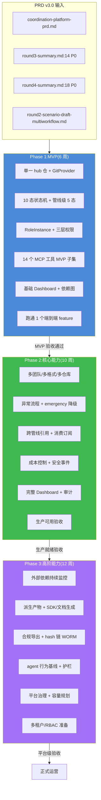
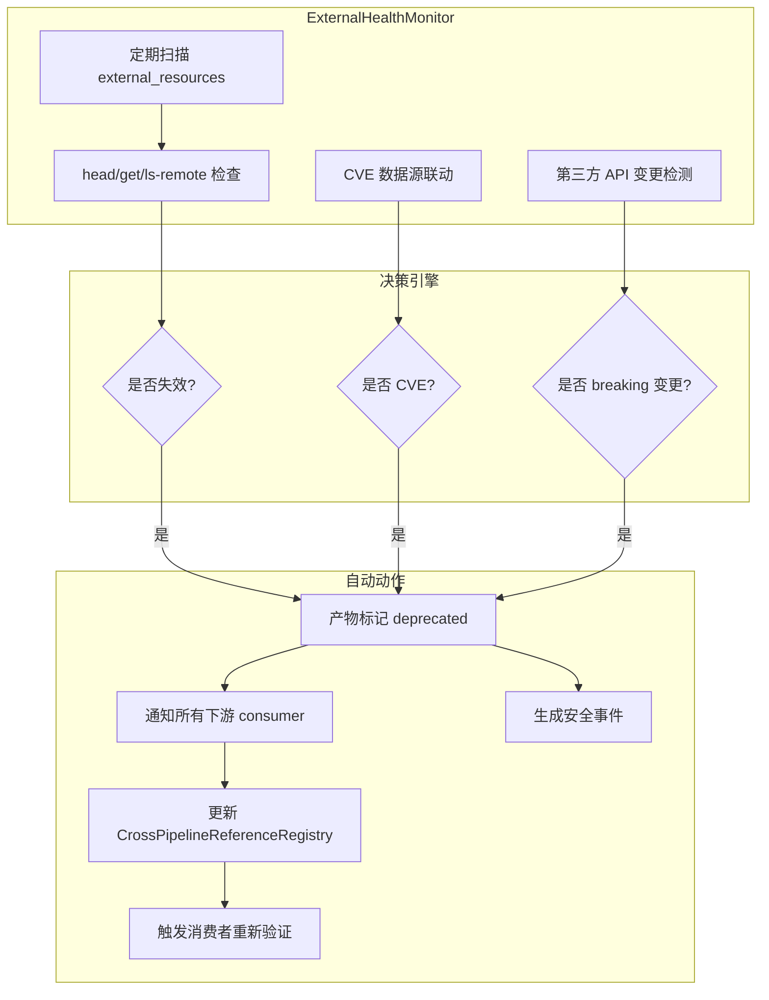
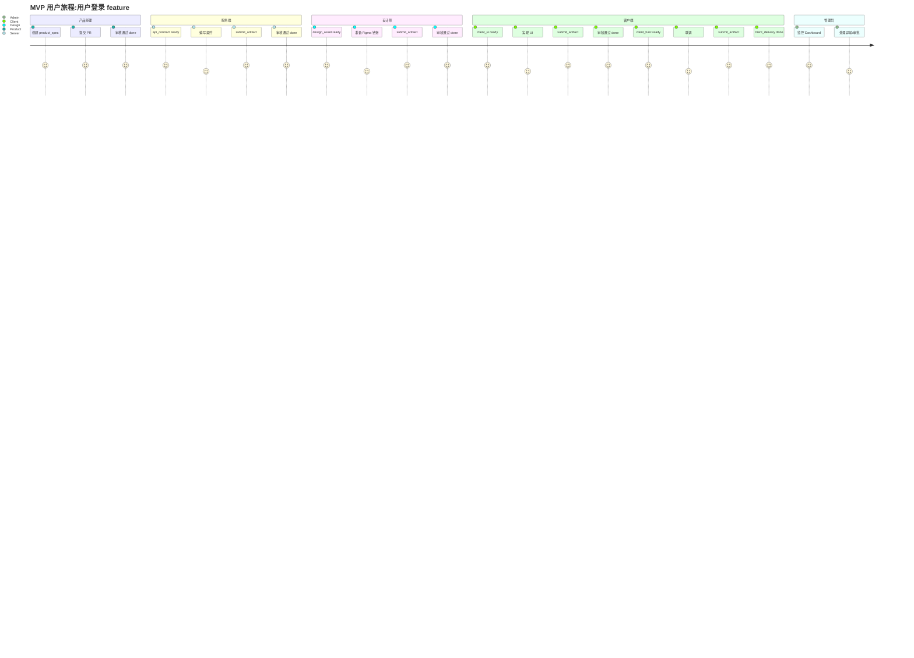
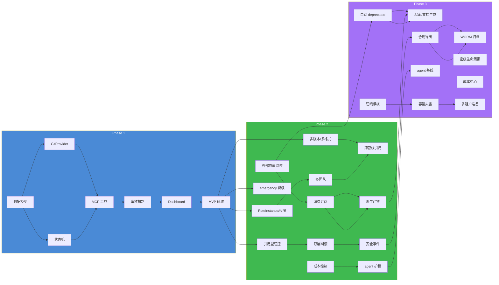
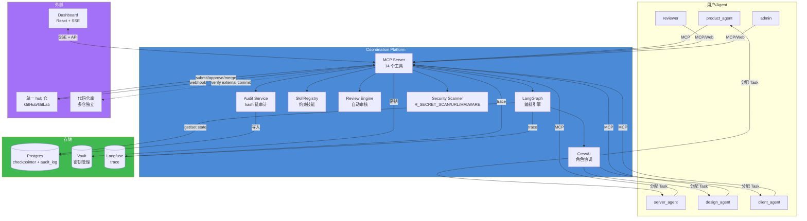
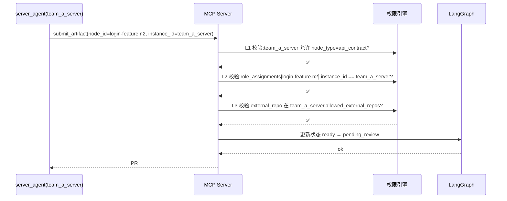
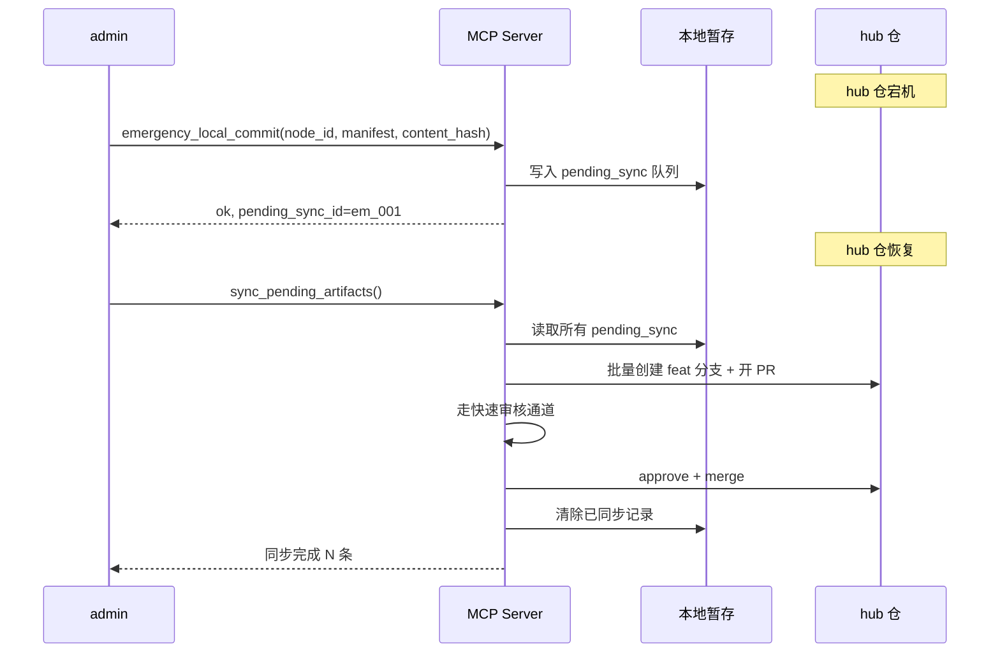
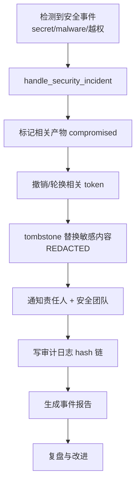
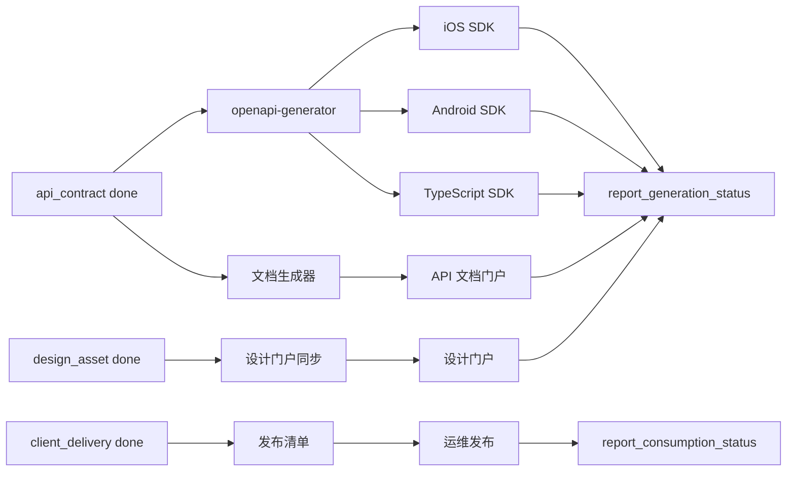

# 实施规划:AI 多角色开发协同平台

> **文档性质**:基于《coordination-platform-prd.md》v3.0 的可开发实施规划
> **版本**:v1.0 | **日期**:2026-08-04 | **状态**:待评审
> **父文档**:[coordination-platform-prd.md](./coordination-platform-prd.md)

### 文档使用说明

本文档面向以下读者:

| 读者 | 重点阅读章节 | 用途 |
|---|---|---|
| 产品经理/项目负责人 | 第 1、6、7、9、18、19 章 | 把控范围、里程碑、团队与上线节奏 |
| 技术架构师 | 第 1、2、3、4、5、8、14、15、16、17 章 | 理解数据模型、状态机、MCP、风险与详细设计 |
| 后端工程师 | 第 2、3、4、14、15、16、17 章 | 指导模块实现与接口开发 |
| LangGraph/CrewAI 专家 | 第 2、3、4、14.4、14.5、16.4 章 | 状态机、编排、agent 配置与护栏 |
| 前端工程师 | 第 2.7、14.15 章 | Dashboard 实现 |
| DevOps/安全工程师 | 第 2.4、8、14.6、15.6、17.5 章 | 部署、密钥、安全、审计、灾备 |

阅读建议:先通读第 1 章总体策略和第 5 章 32 项 P0 修正分配表,建立全局视图;再按需深入各 Phase 与附录。

---

## 目录

- [1. 总体实施策略](#1-总体实施策略)
- [2. Phase 1:MVP(可运行最小闭环)](#2-phase-1mvp可运行最小闭环)
- [3. Phase 2:核心能力(生产可用)](#3-phase-2核心能力生产可用)
- [4. Phase 3:高阶能力(平台级)](#4-phase-3高阶能力平台级)
- [5. 32 项 P0 修正的分配表](#5-32-项-p0-修正的分配表)
- [6. MVP 范围详细定义](#6-mvp-范围详细定义)
- [7. 里程碑与时间表](#7-里程碑与时间表)
- [8. 技术风险与缓解](#8-技术风险与缓解)
- [9. 团队配置建议](#9-团队配置建议)
- [10. 附录 A:32 项 P0 修正优先级排序](#10-附录-a32-项-p0-修正优先级排序)
- [11. 附录 B:术语对照表](#11-附录-b术语对照表)
- [附录 C:P0 修正来源映射表](#附录-cp0-修正来源映射表)
- [附录 D:关键交付物清单与验收条目](#附录-d关键交付物清单与验收条目)

---

## 1. 总体实施策略

### 1.1 实施路线图总览

本实施规划将 AI 多角色开发协同平台(Coordination Platform)的建设划分为三个阶段:

- **Phase 1:MVP(可运行最小闭环)**:6 周,完成端到端最小可用闭环,支持单一 feature 从 product_spec → api_contract → design_asset → client_ui → client_delivery 的完整流转。
- **Phase 2:核心能力(生产可用)**:10 周,覆盖第三轮 14 项 P0 修正中的核心生产就绪项,支持多团队、多格式、跨管线共享、异常流程与降级。
- **Phase 3:高阶能力(平台级)**:12 周,覆盖第四轮 18 项 P0 修正中的剩余高阶项,支持安全合规、外部依赖监控、agent 护栏、产物自动消费与平台治理。

整体实施路线图如下图所示:



### 1.2 三阶段核心原则

| 原则 | Phase 1 | Phase 2 | Phase 3 |
|---|---|---|---|
| **目标** | 跑通最小闭环 | 生产可用 | 平台级治理 |
| **范围控制** | 严格限制,避免蔓延 | 扩展至多团队/异常 | 覆盖安全/合规/成本 |
| **风险策略** | 先落地 Critical 缺陷修正 | 补齐 High 缺陷与降级 | 补齐 Medium/Low 与运营 |
| **数据模型** | MVP 子集 | 完整版 | 完整版 + 治理扩展 |
| **MCP 工具** | 核心 10-12 个 | 14 个完整 | 14 个 + 扩展 |
| **可视化** | 基础 DAG + 状态 | 完整 Dashboard | 高级可视化/审批 |
| **部署形态** | 单一实例 | 高可用准备 | 多租户准备 |

### 1.3 优先级排序方法论

所有功能与修正项按以下维度排序:

| 维度 | 权重 | 说明 |
|---|---|---|
| **阻塞性** | 40% | 不实现则后续功能无法构建或数据会返工 |
| **安全风险** | 25% | 涉及密钥、权限、审计、合规的项优先 |
| **用户价值** | 20% | 对多角色协同效率的提升程度 |
| **工程依赖** | 15% | 是否需要等待其他模块先完成 |

风险驱动的优先级排序结果表现为:

1. **Critical 缺陷修正优先**:状态机 10 态、ArtifactRef 多版本、RoleInstance、权限三层、安全扫描、审计 hash 链等在 Phase 1 落地。
2. **数据模型先于接口**:先确定 PipelineState/ArtifactRef/RoleInstance 的完整形态,再实现 MCP 工具。
3. **接口先于可视化**:MCP 工具与 LangGraph 编排先跑通,再用 Dashboard 展示。
4. **核心路径先于边缘场景**:Happy Path 与常见异常先支持,复杂降级与平台治理后支持。

### 1.4 实施约束与假设

| 编号 | 约束/假设 | 影响 |
|---|---|---|
| C1 | 产物仓库采用**单一 hub 仓**模型 | 简化 ArtifactStore、get_dependencies 只需 clone 一个仓库 |
| C2 | MVP 阶段 GitProvider 支持 GitHub/GitLab 二选一 | 降低 adapter 工作量,Bitbucket/Gitea 延后 |
| C3 | MVP 阶段无多租户,单组织单实例 | 权限模型只需 RoleInstance + 三层校验,无需租户隔离 |
| C4 | 代码仓库不归管理方管 | server_impl/client_ui 等引用型产物只校验 commit 存在性,不 clone 代码仓 |
| C5 | 产物内容格式中立,不解析业务语义 | skill 只做元数据/文件格式/结构完整性校验,不做业务规则校验 |
| C6 | Langfuse 自托管,旁路监听 | 监控失败不阻塞主流程,需设计降级 |
| C7 | 部署采用 docker compose | 复杂 K8s 编排延后到 Phase 3 |

---

## 2. Phase 1:MVP(可运行最小闭环)

### 2.1 目标

让 **1 个端到端 feature**(例如"用户登录")能够完整跑通:

```
product_spec → api_contract → design_asset → client_ui → client_delivery
```

覆盖 product、server、design、client 四类角色的产物提交、审核、合并、状态推进、级联解锁,并在 Dashboard 上实时可视化。

### 2.2 Phase 1 范围

#### 2.2.1 做什么(In Scope)

| 领域 | 内容 |
|---|---|
| **产物仓库** | 单一 hub 仓初始化、main 分支保护、PR 模板、feat 分支四维命名、目录结构 `features/{pipeline_id}/{node_type}/...` |
| **编排引擎** | LangGraph StateGraph 10 态状态机、依赖 DAG、cascade/invalidate、管线级 5 态(active/paused/cancelled/merged/completed) |
| **角色协调** | CrewAI 4 角色 Agent、RoleInstance 实例化、按 ready 节点动态分配 Task |
| **MCP 接口** | 核心工具集:submit_artifact、review_artifact_pr、approve_pr、reject_pr、get_dependencies、get_pipeline_state、update_progress、request_approval、approve/reject |
| **审核机制** | skill 元数据校验、依赖 done 校验、文件格式/大小校验、自动 approve/转人工/reject |
| **权限安全** | 权限三层校验(node_type/instance_id/external_repo)、产物密级 classification/clearance、agent session token 强绑定 |
| **可观测** | Langfuse 旁路 trace、基础 Dashboard 依赖图、节点状态颜色、审计日志 hash 链 |
| **产物完整性** | content_integrity_hash、provenance 溯源、结构化完整性契约 completeness_contract |

#### 2.2.2 不做什么(Out of Scope)

| 领域 | 排除项 | 理由 |
|---|---|---|
| **多产物仓库** | 不支持 RepoRegistry 多仓,仅单一 hub 仓 | 降低 MVP 复杂度,符合 D7 修正结论 |
| **代码产物合一** | 不支持 hybrid 仓库 | 产物必须独立 hub 仓 |
| **多 git 托管** | 仅支持 GitHub 或 GitLab 二选一 | 减少 GitProvider adapter 工作量 |
| **复杂降级** | emergency_local_commit 等降级只做基础版 | 完整降级在 Phase 2 |
| **外部依赖监控** | ExternalHealthMonitor 不实现自动 deprecated | 仅做提交时存在性校验,持续监控延后 |
| **产物自动消费** | 不做 webhook 派生、SDK 生成、文档发布 | 仅做 notify 飞书/Slack,消费订阅延后 |
| **多租户/RBAC** | 无租户隔离、无组织级权限 | 单组织单实例 |
| **高级可视化** | 不做 react-flow 复杂交互、审批拖拽 | 基础 DAG 渲染 + SSE 实时更新 |
| **成本硬预算** | 仅记录 token 消耗,不做硬中断 | 完整预算在 Phase 2/3 |

### 2.3 Phase 1 必须实现的功能清单(15 项)

从 32 项 P0 修正中挑选,控制在 12-15 项。Phase 1 聚焦**数据模型、状态机、权限安全、审核闭环、基础 MCP**:

| # | 功能/P0 修正 | 所属根因 | 关键交付 |
|---|---|---|---|
| F1 | **状态机扩展为 10 态**(draft/deprecated/sunset) | R3 根因 1 | LangGraph 状态机 + 非法转移防护 + draft 分支支持 |
| F2 | **ArtifactRef 多版本映射 + artifact_qualifier** | R3 根因 2 | PipelineState.artifact_refs 改为 `node_id → {version → ArtifactRef}` |
| F3 | **artifact_qualifier 二维标记**(official/mock/draft/experimental) | R3 根因 2 | hub 仓路径增加 qualifier 段,支持 mock/草案并存 |
| F4 | **RoleInstance 实例化** | R3 根因 5 | 多团队 server/design/client 独立 instance_id、LLM 配置、审批人 |
| F5 | **权限三层校验 + 分支四维命名** | R3 根因 5 | node_type/instance_id/external_repo 三层校验;分支 `feat/{pipeline_id}/{instance_id}/{node_type}-{seq}` |
| F6 | **GitProvider 接口扩展 7 项基础版** | R3 根因 3/5 | parse_webhook、approve_pr、merge_pr、ls_file_at_ref、ls_remote 等,屏蔽 GitHub/GitLab 差异 |
| F7 | **节点 ID 全局唯一**(`{pipeline_id}.{local_id}`) | R4 根因 3 | 解决管线合并/拆分 key 冲突,为后续生命周期管理奠基 |
| F8 | **管线级 5 态状态机**(active/paused/cancelled/merged/completed) | R4 根因 3 | 管线级生命周期管理,支持 cancel/pause/resume |
| F9 | **管线级 MCP 工具**(cancel/pause/resume/merge/split 基础版) | R4 根因 3 | admin 可操作管线生命周期,merge/split 只做简单场景 |
| F10 | **产物完整性 provenance**(content_integrity_hash + 溯源) | R4 根因 1 | 防篡改、供应链攻击检测、LLM prompt 溯源 |
| F11 | **产物密级与权限**(classification + clearance) | R4 根因 6 | public/internal/confidential/restricted 四级密级,get_dependencies 过滤 |
| F12 | **审计 hash 链 + WORM** | R4 根因 7 | audit_log 表 prev_hash/entry_hash,只增不改,合规基础 |
| F13 | **安全扫描规则族**(R_SECRET_SCAN/R_URL_SAFETY/R_MALWARE_SCAN) | R4 根因 1 | 管理约束级别的安全扫描,不解析业务语义 |
| F14 | **结构化完整性契约**(completeness_contract) | R4 根因 1/5 | skill.yaml 声明 required_structures,缺失 reject |
| F15 | **agent 身份强绑定**(session 级 token) | R4 根因 5 | token 绑定 node_id + allowed_tools + expires_at,防越权 |

### 2.4 Phase 1 技术栈确认

| 层 | 技术 | 版本要求 | Phase 1 用途 |
|---|---|---|---|
| 编排 | LangGraph | ≥ 0.2 | StateGraph 状态机、DAG、cascade/invalidate |
| 角色 | CrewAI | ≥ 0.4 | 4 角色 Agent、Task 动态生成 |
| 接口 | MCP Python SDK | ≥ 1.0 | MCP Server/Client 协议实现 |
| 监控 | Langfuse(自托管) | ≥ 3.0 | trace、span、dashboard |
| 产物 | 单一 git hub 仓 | — | 所有产物内容/引用集中存储 |
| Git 托管 | GitHub 或 GitLab | — | 二选一,通过 GitProvider 抽象适配 |
| 可视化 | react-flow + SSE | — | DAG 渲染 + 实时状态推送 |
| 语言 | Python 3.11+ | — | 服务端/编排/MCP |
| 前端 | React + TypeScript | — | Dashboard |
| 持久化 | Postgres 15+ | ≥ 15 | checkpointer、audit_log、cross_pipeline_reference |
| 部署 | docker compose | — | Langfuse + Postgres + 管理方进程 |
| 密钥 | Vault(HashiCorp) | — | MCP JWT 密钥、webhook HMAC、agent API Key |

### 2.5 Phase 1 数据模型 MVP 子集

#### 2.5.1 PipelineState MVP 形态

```python
class PipelineState(TypedDict):
    node_states: dict[str, NodeStatus]              # node_id -> 10 态
    artifact_refs: dict[str, dict[str, ArtifactRef]] # node_id -> {version -> ArtifactRef}
    active_version: dict[str, str]                   # node_id -> 当前生效 version
    draft_refs: dict[str, DraftRef]                  # node_id -> 草案引用
    draft_subscribers: dict[str, list[str]]          # node_id -> 订阅下游 node_id 列表
    events: Annotated[Sequence[dict], operator.add]  # 事件流(累积追加)
    pending_approvals: dict[str, str]                # node_id -> approver
    role_assignments: dict[str, RoleAssignment]      # node_id -> {role, instance_id}
    pending_prs: dict[str, str]                      # node_id -> pr_id
    pipeline_status: PipelineStatus                  # active/paused/cancelled/merged/completed
    cascade_pending: list[dict]                      # 管线暂停时挂起的 cascade 事件

class NodeStatus(str, Enum):
    blocked = "blocked"
    ready = "ready"
    in_progress = "in_progress"
    pending_review = "pending_review"
    review = "review"
    done = "done"
    changed = "changed"
    draft = "draft"
    deprecated = "deprecated"
    sunset = "sunset"

class PipelineStatus(str, Enum):
    active = "active"
    paused = "paused"
    cancelled = "cancelled"
    merged = "merged"
    completed = "completed"
```

#### 2.5.2 ArtifactRef MVP 形态

```python
class ArtifactRef(TypedDict):
    node_id: str
    repo: str                       # hub 仓地址(单一)
    path: str                       # hub 仓内路径
    commit: str                     # hub 仓 merge commit
    artifact_kind: str              # "content" | "reference"
    artifact_qualifier: str         # "official" | "mock" | "draft" | "experimental"
    version: str                    # semver
    # 引用型额外字段
    external_repo: str | None
    external_commit: str | None
    commit_stability: str           # "stable" | "volatile"
    # 安全/溯源
    content_integrity_hash: str     # SHA-256
    classification: str             # public/internal/confidential/restricted
    provenance: Provenance
    # trace
    toolspec_framework: str
    trace_id: str

class Provenance(TypedDict):
    submitter_instance_id: str
    submitter_token_scope: str
    llm_model: str
    llm_prompt_hash: str
    submitted_at: str
    merged_at: str
    reviewer: str
```

#### 2.5.3 RoleInstance MVP 形态

```python
class RoleInstance(TypedDict):
    instance_id: str                # 如 "team_a_server"
    role: str                       # product/server/design/client
    agent_config: dict              # LLM 配置、backstory、max_concurrent
    allowed_node_types: list[str]   # 该实例可产出的节点类型
    allowed_external_repos: list[str]  # 引用型产物可引用的代码仓
    approvers: list[str]            # 该实例的审批人
    clearance: str                  # public/internal/confidential/restricted

class RoleAssignment(TypedDict):
    node_id: str
    role: str
    instance_id: str
```

#### 2.5.4 DepDeclaration MVP 形态

```python
class DepDeclaration(TypedDict):
    node_id: str | None
    hub_ref: str | None             # "hub://{pipeline_id}/{node_id}@{version}"
    version_constraint: str         # semver 约束
    format_slot: str | None         # 多格式产物依赖声明
    strictness: str                 # "strict" | "accepts_draft"
    ref_label: str | None           # 引用型产物 label
```

### 2.6 Phase 1 MCP 工具 MVP 子集

| 分类 | 工具名 | 调用方 | Phase 1 实现深度 |
|---|---|---|---|
| **产物提交** | `submit_artifact` | 各角色 agent | 支持 content/reference 产物,自动开 PR,节点进入 pending_review |
| **产物提交** | `soft_submit_artifact` | 各角色 agent | 草案提交,节点进入 draft,写 draft_refs |
| **产物提交** | `abandon_draft` | 各角色 agent | 废弃草案,清 draft_refs,节点回 ready |
| **进度更新** | `update_progress` | 各角色 agent | 更新 in_progress 状态与 note |
| **依赖查询** | `get_dependencies` | 各角色 agent | 拉取上游产物内容,支持 include_draft,按 clearance 过滤 |
| **全局状态** | `get_pipeline_state` | 监控/可视化/agent | 返回 node_states、artifact_refs、pending_prs |
| **审批请求** | `request_approval` | server/client agent | approval 节点进入 review 态 |
| **审批操作** | `approve` / `reject` | reviewer/admin | 作用于 approval 控制节点 |
| **PR 审核** | `list_pending_prs` | reviewer/admin/监控 | 列出待审核 PR |
| **PR 审核** | `get_pr_detail` | reviewer/admin | 获取 PR 模板、diff、files |
| **PR 审核** | `review_artifact_pr` | 管理方 agent | 自动审核:skill 校验 + 依赖检查 |
| **PR 审核** | `approve_pr` / `reject_pr` | reviewer/admin | 批准/驳回产物 PR,触发状态推进 |
| **管线生命周期** | `cancel_pipeline` | admin | 取消管线,已 done 产物 deprecated |
| **管线生命周期** | `pause_pipeline` / `resume_pipeline` | admin | 暂停/恢复管线,级联挂起/应用 |

**Phase 1 未实现 MCP 工具**:

| 工具 | 延后理由 |
|---|---|
| `merge_pipeline` / `split_pipeline` | 管线合并/拆分场景复杂,Phase 2 完整实现 |
| `emergency_local_commit` | hub 仓宕机降级,Phase 2 落地 |
| `sync_pending_artifacts` | 依赖 emergency_local_commit,Phase 2 |
| `report_consumption_status` / `report_generation_status` | 产物消费机制,Phase 2/3 |
| `handle_security_incident` | 安全事件闭环,Phase 2 完整实现 |
| `export_compliance_report` | 合规导出,Phase 3 |
| `delegate_approval` / `transfer_approvals` | 代理人机制,Phase 2 |
| `subscribe_draft` / `unsubscribe_draft` | 草案订阅,Phase 2 完整 |

### 2.7 Phase 1 UI/Dashboard MVP 子集

| 视图 | Phase 1 功能 | 技术 |
|---|---|---|
| **依赖图主视图** | DAG 渲染(节点+边+分层布局),节点颜色随 10 态变化 | react-flow |
| **节点详情面板** | 点击节点显示 node_id/type/role/状态/deps/manifest/trace_id | React + SSE |
| **实时状态更新** | SSE 推送状态变更,延迟 < 1s | SSE |
| **PR 列表视图** | 待审核 PR 列表 + 状态 + 提交人 | React |
| **审计日志视图** | 审核记录列表(按 node_id/reviewer/action 过滤),含 hash 链摘要 | React |
| **审批操作** | approval 节点 review 状态时,可点击 approve/reject | React |
| **管线生命周期面板** | admin 可 pause/resume/cancel 管线 | React |

**Phase 1 不做的高级 UI**:

- 模板实例化/参数化 UI
- 跨管线引用可视化
- 成本/配额 Dashboard
- 外部依赖健康度面板
- 复杂审批拖拽编排

### 2.8 Phase 1 验收标准(8 条,可量化)

| 编号 | 验收项 | 验收标准 | 验证方式 |
|---|---|---|---|
| AC-P1-01 | 端到端 feature 跑通 | 1 个 feature 的 5 个节点(product_spec → api_contract → design_asset → client_ui → client_delivery)全部 done | 自动化端到端测试 |
| AC-P1-02 | 状态机 10 态正确流转 | draft/ready/pending_review/done/changed/deprecated 状态转移符合规则,非法转移被拦截 | 单元测试覆盖所有合法/非法转移 |
| AC-P1-03 | 多版本 ArtifactRef | 同一 node_id 可同时存在 official + mock 两个 version,active_version 可切换 | 状态机测试 |
| AC-P1-04 | 权限三层校验生效 | server instance 无法提交 design_asset,external_repo 不在白名单内 reject | 集成测试 |
| AC-P1-05 | 安全扫描阻断 | 含 mock secret 的 PR 被 R_SECRET_SCAN 自动 reject | CI 测试 |
| AC-P1-06 | 审计 hash 链完整 | 每条 approve/reject 记录含 prev_hash/entry_hash,不可篡改(WORM) | 数据库检查 + 校验脚本 |
| AC-P1-07 | Langfuse trace 贯穿 | 一次管线执行的 MCP 调用 + LangGraph 节点共享同一 trace_id | Langfuse UI 检查 |
| AC-P1-08 | Dashboard 实时性 | 节点状态变更后,前端颜色更新延迟 < 1s(本地网络) | 手动/自动化计时测试 |

### 2.9 Phase 1 风险与降级方案

| 风险 | 影响 | 缓解措施 | 应急方案 |
|---|---|---|---|
| R1 | LangGraph 状态机复杂度过高,10 态转移易出错 | 先写状态转移表 + 非法转移防护单元测试,再实现 | 回退到 7 态主 PRD 基础版,保留 draft 作为简化实现 |
| R2 | RoleInstance + 三层权限增加认证复杂度 | 使用 Vault 管理 token,先实现 L1/L2,L3 校验用白名单 | 临时关闭 L3 external_repo 校验,仅校验 L1/L2 |
| R3 | GitProvider 抽象工作量被低估 | Phase 1 只支持一种托管(GitHub 或 GitLab),adapter 代码预留扩展点 | 强制组织选择 GitHub,GitLab 延后 |
| R4 | 安全扫描规则误伤正常产物 | R_SECRET_SCAN 先用宽松规则集,URL 安全用白名单 | 关闭 R_MALWARE_SCAN,仅保留 R_SECRET_SCAN |
| R5 | 审计 hash 链写入性能瓶颈 | 异步写入 audit_log,批量 hash 计算 | 降级为普通 append-only 日志,hash 链延后 |

---

## 3. Phase 2:核心能力(生产可用)

### 3.1 目标

覆盖第三轮 14 项 P0 修正中的核心生产就绪项,支持:

- 多团队并行开发与权限隔离
- 多格式产物共存(OpenAPI/gRPC/TypeScript 等)
- 跨管线共享产物(hub:// 协议)
- 异常流程与降级(emergency_local_commit、代理人、消费订阅)
- 引用型产物持续校验与回滚

使平台达到**生产可用**状态:可支持 3-5 个团队、10+ 个 feature 并行。

### 3.2 Phase 2 新增功能清单(16 项)

| # | 功能/P0 修正 | 来源 | 关键交付 |
|---|---|---|---|
| F16 | **deps 增加 format_slot / strictness / hub_ref** | R3-3 | 多格式依赖声明、草案依赖、跨管线引用 |
| F17 | **hub 仓单点故障降级系列**(emergency_local_commit/sync_pending_artifacts/emergency_approve) | R3-4 | hub 仓宕机时本地暂存/恢复同步/紧急审批 |
| F18 | **HubRepoConfig 增强**(clone_strategy / lfs / capacity) | R3-5 | partial/shallow/on_demand clone、LFS 大文件、PR 队列限流 |
| F19 | **引用型产物分层清除 + 双层回滚** | R3-6 | 级联失效时 hub 仓引用清除 + 代码仓 commit 迁移 history + 通知代码团队 |
| F20 | **引用型产物持续校验**(R_EXTERNAL_REF_OWNERSHIP + 定期 health check) | R3-7 | 校验 external_repo 归属、commit_stability、后台 ls-remote |
| F21 | **节点类型开放命名空间**(`{role}.{name}`) | R3-11 | 自定义节点类型(client.mock_data、server.proto_gen),SkillRegistry 三级匹配 |
| F22 | **跨管线引用 hub:// 协议** | R3-13 | DepDeclaration.hub_ref,跨管线依赖注册 |
| F23 | **human_submit_token 权限隔离** | R3-14 | 人工 fallback 直提 hub 仓,per-user token 无 merge 权限 |
| F24 | **外部依赖声明与监控**(external_resources + ExternalHealthMonitor) | R4-5 | manifest 声明 figma/第三方 API,后台监控,失效触发 deprecated |
| F25 | **产物消费订阅机制**(consumers + notify 扩展) | R4-9 | 产物 done/changed/deprecated 时触发 webhook/API 调用 |
| F26 | **消费状态回传工具**(report_consumption_status / report_generation_status) | R4-10 | CI/CD/SDK 生成器回传消费结果 |
| F27 | **三层硬预算**(Task/Agent/管线/平台级) | R4-13 | token 消耗、重试次数、日/管线/平台成本硬限制 |
| F28 | **关键约束提取**(key_constraints) | R4-15 | get_dependencies 返回结构化 must/should 约束,agent backstory 强制遵守 |
| F29 | **跨管线引用注册表**(CrossPipelineReferenceRegistry) | R4-16 | 注册跨管线依赖,deprecated 时通知所有引用方 |
| F30 | **安全事件响应闭环**(handle_security_incident) | R4-17 | 安全事件 → 标记 compromised → 通知 → 密钥轮换 → tombstone → 审计 |
| F31 | **派生产物模型**(derived_artifact + generator 角色) | R4-11 | SDK、文档等派生产物节点,derived_from 字段 |
| F32 | **agent 行为基线与告警**(ALR-13~15) | R4-18 | 循环检测、越权尝试、成本异常告警 |

### 3.3 Phase 2 重点解决的安全/权限/多团队问题

#### 3.3.1 多团队隔离

| 问题 | Phase 2 解决方案 |
|---|---|
| 单一 server_agent 无法表达多团队 | RoleInstance 实例化:team_a_server、team_b_server 独立配置、独立审批人 |
| 分支命名冲突 | 四维命名:`feat/{pipeline_id}/{instance_id}/{node_type}-{seq}` |
| 产物类型越权提交 | 权限三层校验 L1:node_type 白名单 |
| 代码仓引用越权 | 权限三层校验 L3:external_repo 在 RoleInstance.allowed_external_repos 内 |
| 人工 fallback 权限隔离 | human_submit_token per-user,仅推 feat 分支 + 开 PR,无 merge 权限 |

#### 3.3.2 安全加固

| 问题 | Phase 2 解决方案 |
|---|---|
| 引用型产物归属不明 | R_EXTERNAL_REF_OWNERSHIP + verify_commit_belongs |
| commit 被 force-push 后失效 | R_COMMIT_STABILITY:stable commit 拒绝 force-push 后的引用 |
| 外部链接失效 | ExternalHealthMonitor 定期 head/get/ls-remote |
| agent 越权/误判 | agent 行为基线 + 三层硬预算 + 关键约束提取 |
| 安全事件响应 | handle_security_incident 闭环工具 |

#### 3.3.3 异常流程

| 问题 | Phase 2 解决方案 |
|---|---|
| hub 仓宕机全局停摆 | emergency_local_commit 本地暂存 + sync_pending_artifacts 恢复同步 |
| 审批人缺席 | delegate_approval / transfer_approvals + CODEOWNERS 同步 |
| 引用型产物回滚跨系统 | 分层清除 + 双层回滚 + CODE_ROLLBACK_NEEDED 通知 |
| LLM 故障无 fallback | human_submit_token 人工直提 + needs_human 转人工 |

### 3.4 Phase 2 数据模型完整版

在 Phase 1 MVP 子集基础上,Phase 2 扩展以下模型:

```python
class PipelineState(TypedDict):
    # Phase 1 已有字段
    node_states: dict[str, NodeStatus]
    artifact_refs: dict[str, dict[str, ArtifactRef]]
    active_version: dict[str, str]
    draft_refs: dict[str, DraftRef]
    draft_subscribers: dict[str, list[str]]
    events: Annotated[Sequence[dict], operator.add]
    pending_approvals: dict[str, str]
    role_assignments: dict[str, RoleAssignment]
    pending_prs: dict[str, str]
    pipeline_status: PipelineStatus
    cascade_pending: list[dict]
    # Phase 2 新增
    pending_code_rollbacks: list[dict]      # 引用型回滚待代码团队确认
    external_health_status: dict            # node_id -> 外部依赖健康状态
    consumption_status: dict                # node_id -> {consumer_id: status}
    budget_state: dict                      # task/agent/管线/平台级预算消耗
    agent_behavior_baseline: dict           # agent 调用序列基线

class ExternalResource(TypedDict):
    type: str           # "figma" | "url" | "api"
    url: str
    health_check: str   # "head" | "get" | "ls-remote"
    last_check_at: str
    last_status: str    # "ok" | "unreachable" | "degraded"

class ArtifactConsumer(TypedDict):
    type: str           # "webhook" | "api_call" | "internal"
    target: str
    event: str          # "done" | "changed" | "deprecated"
    on_failure: str     # "ignore" | "mark_changed" | "alert"
    idempotency_key: str

class BudgetLimit(TypedDict):
    level: str          # "task" | "agent" | "pipeline" | "platform"
    limit: int | float
    unit: str           # "token" | "usd" | "retry"
    action_on_exceed: str  # "needs_human" | "queue" | "pause" | "degrade"
```

### 3.5 Phase 2 MCP 工具完整版

在 Phase 1 基础上,Phase 2 补充以下工具,达到主 PRD 要求的 14 个核心工具 + 扩展工具:

| 工具 | 调用方 | 作用 |
|---|---|---|
| `merge_pipeline` / `split_pipeline` | admin | 管线合并/拆分(节点 ID 重映射 + 产物归属迁移) |
| `emergency_local_commit` | admin | hub 仓宕机时本地暂存产物 manifest |
| `sync_pending_artifacts` | admin | hub 仓恢复后批量补提暂存产物 |
| `emergency_approve` | admin | hub 仓宕机 + 紧急审批,本地记录决策 |
| `delegate_approval` / `transfer_approvals` | admin/reviewer | 审批人转交/代理人设置 |
| `verify_external_ref` | 管理方 agent | 校验 external_repo commit 归属 |
| `subscribe_draft` / `unsubscribe_draft` | 各角色 agent | 订阅/取消订阅草案变更通知 |
| `report_consumption_status` | 外部 CI/CD | 回传产物消费结果 |
| `report_generation_status` | SDK/文档生成器 | 回传派生产物生成结果 |
| `handle_security_incident` | admin | 安全事件响应闭环 |
| `set_budget_policy` | admin | 设置 Task/Agent/管线/平台级预算 |
| `get_budget_state` | admin/监控 | 查询预算消耗 |
| `get_external_health` | admin/监控 | 查询外部依赖健康状态 |
| `set_external_resource_monitor` | admin | 配置外部依赖监控规则 |

### 3.6 Phase 2 Dashboard 完整版

| 视图 | Phase 2 功能 |
|---|---|
| **依赖图** | 支持跨管线引用虚线显示、draft 节点虚线边框、deprecated 节点灰色 |
| **节点详情** | 显示多版本 ArtifactRef、external_resources、consumers、provenance |
| **PR 列表** | 支持按 instance_id/role/status 过滤,显示自动审核 verdict |
| **审计日志** | 完整 hash 链验证、按 pipeline_id/node_id/action 过滤、导出 CSV |
| **外部依赖健康面板** | 显示 figma/第三方 API/commit 健康状态,失效标红 |
| **消费状态面板** | 显示每个 done 产物的消费方状态(成功/失败/待处理) |
| **预算/成本面板** | 显示 Task/Agent/管线/平台级 token 消耗与成本 |
| **异常告警面板** | 展示 gate 失败、审批超时、agent 离线、预算超支等告警 |
| **管线生命周期面板** | 支持 merge/split/pause/resume/cancel 完整操作 |

### 3.7 Phase 2 验收标准(8 条)

| 编号 | 验收项 | 验收标准 |
|---|---|---|
| AC-P2-01 | 多团队并行 | 3 个 server team instance 同时提交不同 feature 的 api_contract,互不阻塞 |
| AC-P2-02 | 多格式共存 | 一个 api_contract 节点同时存在 openapi/grpc/typescript 三个 format_slot 版本 |
| AC-P2-03 | 跨管线共享 | feature A 的 api_contract 通过 hub:// 被 feature B 依赖,变更时通知 feature B |
| AC-P2-04 | hub 仓降级 | hub 仓不可达时,admin 可 emergency_local_commit 暂存产物,恢复后同步 |
| AC-P2-05 | 引用型回滚 | server_impl 的 external_commit 失效后,下游自动 blocked,代码团队收到回滚通知 |
| AC-P2-06 | 消费订阅 | api_contract done 后自动触发 webhook,CI 回传成功状态 |
| AC-P2-07 | 成本控制 | 单个 agent 日成本超过 $10 时自动排队,管线成本超过 $100 时暂停 |
| AC-P2-08 | 安全事件 | 发现密钥泄露后,handle_security_incident 在 5 分钟内标记 compromised 并通知责任人 |

---

## 4. Phase 3:高阶能力(平台级)

### 4.1 目标

覆盖第四轮 18 项 P0 修正中的剩余高阶项,将平台从"生产可用"升级为"平台级治理":

- **安全合规**:完整审计导出、合规报告、密级生命周期、WORM 归档
- **外部依赖监控**:自动 deprecated、依赖健康度评分、CVE 联动
- **产物自动消费**:SDK 生成、API 文档发布、设计门户同步、CI/CD 触发
- **Agent 护栏**:完整行为基线、越权检测、遗忘检测、自动降级
- **平台治理**:模板系统、容量规划、多租户准备、成本中心

### 4.2 Phase 3 新增功能清单(12 项)

| # | 功能 | 来源/根因 | 关键交付 |
|---|---|---|---|
| F33 | **外部依赖自动 deprecated** | R4-2 | ExternalHealthMonitor 检测到失效后自动 done→deprecated,通知下游 |
| F34 | **产物自动消费派生**(SDK 生成) | R4-4 | api_contract done 触发 openapi-generator,生成 iOS/Android/TS SDK |
| F35 | **API 文档自动发布** | R4-4 | api_contract done 触发文档门户发布 |
| F36 | **设计门户自动同步** | R4-4 | design_asset done 触发设计门户更新 |
| F37 | **合规审计导出**(export_compliance_report) | R4-7 | 按时间范围/管线/密级导出不可篡改审计报告 |
| F38 | **审计 WORM 归档** | R4-7 | 旧审计日志归档到 WORM 存储,保留 ≥ 1 年 |
| F39 | **密级生命周期管理** | R4-6 | classification 升降级审批、受限产物隔离存储 |
| F40 | **成本中心与配额 Dashboard** | R4-5 | 按 team/feature/agent 分摊成本,配额预警 |
| F41 | **agent 行为基线完整实现** | R4-5 | 调用序列模式学习、偏离基线自动告警、自动 needs_human |
| F42 | **管线模板系统** | R2-A16 | PipelineTemplate 继承/参数化/裁剪/版本化/审核 |
| F43 | **容量规划与灾备** | 深化文档 | checkpointer 备份、RTO/RPO、Langfuse 高可用 |
| F44 | **多租户/RBAC 准备** | 长期规划 | 租户隔离设计、组织级角色、RBAC 数据模型 |

### 4.3 Phase 3 安全合规/审计/成本控制

#### 4.3.1 安全合规

| 能力 | 说明 |
|---|---|
| **密级生命周期** | classification 从 public 升级到 confidential 需 admin 审批;降级需审计 |
| **受限产物隔离** | restricted 产物存储在独立加密分区,get_dependencies 严格 clearance 过滤 |
| **安全事件复盘** | handle_security_incident 生成事件报告,含影响面、处置时间线、改进项 |
| **合规基线扫描** | 定期全量扫描 hub 仓,发现历史 secret/malware 并触发事件 |

#### 4.3.2 审计

| 能力 | 说明 |
|---|---|
| **审计导出** | export_compliance_report 支持 PDF/JSON/CSV,含 hash 链验证 |
| **WORM 归档** | 超过 90 天的 audit_log 归档到只读存储,保留策略可配置(≥1 年) |
| **审计检索** | 支持按 pipeline_id/node_id/actor/action/timerange 多维检索 |
| **审计完整性校验** | 提供 CLI 工具校验 audit_log hash 链完整性 |

#### 4.3.3 成本控制

| 层级 | 限额示例 | 触发动作 |
|---|---|---|
| Task 级 | 20k token / 3 次重试 | 硬中断,转 needs_human |
| Agent 级 | $10/日 | 排队等待 |
| 管线级 | $100 | 暂停管线 |
| 平台级 | $4000 | 全局降级(切便宜模型) |
| Team 级(Phase 3) | $500/周 | 配额预警 + manager 通知 |

### 4.4 Phase 3 外部依赖监控/自动 deprecated



### 4.5 Phase 3 派生产物/SDK 生成/文档发布

| 触发源 | 派生产物 | 消费方 | 机制 |
|---|---|---|---|
| api_contract done | iOS SDK | iOS 客户端 | derived_artifact + openapi-generator |
| api_contract done | Android SDK | Android 客户端 | derived_artifact + openapi-generator |
| api_contract done | TypeScript SDK | Web 客户端 | derived_artifact + openapi-generator |
| api_contract done | API 文档门户 | 全组织 | webhook → 文档站点 |
| design_asset done | 设计门户页面 | 设计团队 | webhook → 设计门户 |
| client_delivery done | 发布清单 | 运维 | notify 扩展 |

派生产物模型:

```python
class DerivedArtifact(TypedDict):
    node_id: str
    derived_from: str           # 源产物 node_id
    generator_role: str         # "generator"
    generator_instance_id: str  # 如 "sdk-generator"
    artifact_kind: str          # "content" | "reference"
    artifact_qualifier: str     # "generated"
    consumers: list[ArtifactConsumer]
```

### 4.6 Phase 3 验收标准(6 条)

| 编号 | 验收项 | 验收标准 |
|---|---|---|
| AC-P3-01 | 外部依赖自动 deprecated | Figma 链接失效后 5 分钟内产物自动 deprecated,下游收到通知 |
| AC-P3-02 | SDK 自动生成 | api_contract done 后 10 分钟内生成 iOS/Android/TS SDK 并发布 |
| AC-P3-03 | 文档自动发布 | api_contract done 后 5 分钟内 API 文档门户更新 |
| AC-P3-04 | 合规审计导出 | 可导出任意 30 天区间的审计报告,hash 链校验通过 |
| AC-P3-05 | agent 行为护栏 | agent 偏离基线调用序列时,30 秒内告警并转 needs_human |
| AC-P3-06 | 管线模板复用 | 80% 新 feature 可通过模板实例化创建,模板 MAJOR 升级需人工确认 |

---

## 5. 32 项 P0 修正的分配表

本表汇总第三轮 14 项 P0 修正与第四轮 18 项 P0/关键修正,共 32 项,分配到 Phase 1/2/3。

| # | P0 修正 | 所属 Phase | 理由 | 关键依赖 |
|---|---|---|---|---|
| 1 | 状态机 10 态(draft/deprecated/sunset) | Phase 1 | 核心机制,不落地则后续 draft/废弃/生命周期无法表达 | 无 |
| 2 | ArtifactRef 多版本映射 + artifact_qualifier | Phase 1 | 数据模型基础,影响 PipelineState、审核、get_dependencies | 无 |
| 3 | artifact_qualifier 二维标记(official/mock/draft/experimental) | Phase 1 | 与 #2 配套,路径/qualifier 是 MVP 多版本前提 | #2 |
| 4 | RoleInstance 实例化 | Phase 1 | 权限与多团队基础,所有提交操作依赖 instance_id | 无 |
| 5 | 权限三层校验 + 分支四维命名 | Phase 1 | 安全基线,不实现则无法区分多团队/防越权 | #4 |
| 6 | GitProvider 接口扩展 7 项 | Phase 1 | 连接产物仓库与管理方,是 submit/approve/merge 的前提 | 无 |
| 7 | 节点 ID 全局唯一(`{pipeline_id}.{local_id}`) | Phase 1 | 管线级生命周期、合并/拆分的基础 | 无 |
| 8 | 管线级 5 态状态机 | Phase 1 | 与节点级状态机正交,MVP 需支持 cancel/pause | 无 |
| 9 | 管线级 MCP 工具(cancel/pause/resume/merge/split) | Phase 1 | 管理员控制管线生命周期的必要接口 | #8 |
| 10 | 产物完整性 provenance | Phase 1 | 防篡改与供应链安全基线,所有产物提交都需记录 | 无 |
| 11 | 产物密级与权限(classification + clearance) | Phase 1 | 单一 hub 仓安全基线,防止密级混放 | #5 |
| 12 | 审计 hash 链 + WORM | Phase 1 | 合规基线,越早落地数据越完整 | 无 |
| 13 | 安全扫描规则族(R_SECRET_SCAN/R_URL_SAFETY/R_MALWARE_SCAN) | Phase 1 | 单一 hub 仓安全基线,阻断恶意/密钥入仓 | 无 |
| 14 | 结构化完整性契约(completeness_contract) | Phase 1 | 在不解析内容前提下做管理约束,提升审核质量 | 无 |
| 15 | agent 身份强绑定(session 级 token) | Phase 1 | 防止 LLM 越权,所有 agent 调用 MCP 的前提 | #5 |
| 16 | deps 增加 format_slot / strictness / hub_ref | Phase 2 | 多格式/草案/跨管线依赖,需要 #1/#2/#7 先落地 | #1, #2, #7 |
| 17 | hub 仓单点故障降级系列(emergency_*) | Phase 2 | 异常流程,需要稳定的正常流程先跑通 | #6, #9 |
| 18 | HubRepoConfig 增强(clone_strategy / lfs / capacity) | Phase 2 | 大文件/容量/性能优化,依赖基础 HubRepoConfig | #6 |
| 19 | 引用型产物分层清除 + 双层回滚 | Phase 2 | 异常流程,需先支持 reference 产物提交 | #6, #10 |
| 20 | 引用型产物持续校验(R_EXTERNAL_REF_OWNERSHIP) | Phase 2 | 引用型产物管控,需 reference 产物基础 | #6, #5 |
| 21 | 节点类型开放命名空间(`{role}.{name}`) | Phase 2 | 扩展节点类型,需 SkillRegistry 稳定 | #1, #14 |
| 22 | 跨管线引用 hub:// 协议 | Phase 2 | 跨管线共享,需节点 ID 全局唯一 | #7, #16 |
| 23 | human_submit_token 权限隔离 | Phase 2 | 人工 fallback,需基础权限三层校验 | #5 |
| 24 | 外部依赖声明与监控 | Phase 2 | 持续监控,需 manifest 稳定 + external_resources 字段 | #10 |
| 25 | 产物消费订阅机制(consumers + notify 扩展) | Phase 2 | 产物 done 后外部消费,需产物引用稳定 | #2, #10 |
| 26 | 消费状态回传工具(report_consumption/generation_status) | Phase 2 | 与 #25 配套,形成消费闭环 | #25 |
| 27 | 三层硬预算(Task/Agent/管线/平台级) | Phase 2 | agent 成本控制,需 agent 身份强绑定 | #15 |
| 28 | 关键约束提取(key_constraints) | Phase 2 | agent 上下文优化,需 get_dependencies 稳定 | 无 |
| 29 | 跨管线引用注册表(CrossPipelineReferenceRegistry) | Phase 2 | 与 #22 配套,deprecated 时通知引用方 | #22 |
| 30 | 安全事件响应闭环(handle_security_incident) | Phase 2 | 安全运营,需审计 hash 链 + 安全扫描 | #12, #13 |
| 31 | 派生产物模型(derived_artifact + generator 角色) | Phase 2 | 消费订阅的具体实现形态,需 #25 | #25 |
| 32 | agent 行为基线与告警(ALR-13~15) | Phase 2 | agent 行为护栏,需 session token + 预算 | #15, #27 |
| 33 | 外部依赖自动 deprecated | Phase 3 | 高阶自动化,需 #24 监控数据积累 | #24 |
| 34 | SDK 自动生成(iOS/Android/TS) | Phase 3 | 派生产物消费,需 #31 模型 + #25 订阅 | #31, #25 |
| 35 | API 文档自动发布 | Phase 3 | 派生产物消费,需 #31 模型 + #25 订阅 | #31, #25 |
| 36 | 设计门户自动同步 | Phase 3 | 派生产物消费,需 #31 模型 + #25 订阅 | #31, #25 |
| 37 | 合规审计导出(export_compliance_report) | Phase 3 | 合规运营,需 #12 hash 链 + 足够历史数据 | #12 |
| 38 | 审计 WORM 归档 | Phase 3 | 长期合规,需 #12 审计体系 | #12 |
| 39 | 密级生命周期管理 | Phase 3 | 高阶安全治理,需 #11 密级模型 | #11 |
| 40 | 成本中心与配额 Dashboard | Phase 3 | 平台治理,需 #27 预算数据 | #27 |
| 41 | agent 行为基线完整实现 | Phase 3 | 机器学习基线,需 #32 告警数据积累 | #32 |
| 42 | 管线模板系统 | Phase 3 | 平台级复用,需 Pipeline 模型稳定 | 无 |
| 43 | 容量规划与灾备 | Phase 3 | 平台运营,需生产运行数据 | 全模块 |
| 44 | 多租户/RBAC 准备 | Phase 3 | 平台规模化,需完整权限模型 | #5, #11 |

**说明**:上表列出 44 行,是因为从第 33 行开始属于 Phase 3 的 12 项高阶能力(编号 F33-F44)。前 32 行(编号 1-32)对应第三轮 14 项 + 第四轮 18 项修正,后 12 行(编号 33-44)是 Phase 3 基于前 32 项衍生的高阶平台能力。任务要求的"32 项 P0 修正分配表"特指编号 1-32。

---

## 6. MVP 范围详细定义

### 6.1 MVP 用户旅程

MVP 支持 product → server → design → client → admin 的完整协同流程,如下图所示:



#### 6.1.1 MVP 流程详细步骤

| 步骤 | 角色 | 动作 | 系统响应 | 状态变化 |
|---|---|---|---|---|
| 1 | product | 创建 pipeline `login-feature`,定义 5 个节点 | 系统校验 DAG 无环,根节点 n1 ready | n1: blocked → ready |
| 2 | product_agent | 收到 CrewAI Task,产出 product_spec YAML | 调用 submit_artifact(n1) | n1: ready → pending_review |
| 3 | 管理方 bot | 自动审核 PR:skill 校验 + 依赖检查 | 通过,approve_pr 合并 | n1: pending_review → done |
| 4 | LangGraph | n1 done 触发 cascade | 下游 n2(api_contract) 依赖满足 | n2: blocked → ready |
| 5 | server_agent | 收到 Task,查看 get_dependencies(n2) | 返回 n1 product_spec 内容 | n2 保持 ready |
| 6 | server_agent | 产出 api_contract,调用 submit_artifact(n2) | 开 PR,节点 pending_review | n2: ready → pending_review |
| 7 | reviewer/admin | api_contract requires_human_review=true,人工 approve_pr | 合并 PR | n2: pending_review → done |
| 8 | LangGraph | n2 done 触发 cascade | n3(design_asset) 和 n4(client_ui) 的依赖部分满足 | — |
| 9 | design_agent | n3 ready,产出 design_asset(Figma 链接) | 调用 submit_artifact(n3) | n3: ready → pending_review |
| 10 | reviewer | design_asset 人工审核通过 | approve_pr | n3: pending_review → done |
| 11 | LangGraph | n2 + n3 都 done,n4(client_ui) 依赖满足 | n4 ready | n4: blocked → ready |
| 12 | client_agent | 查看 get_dependencies(n4),获取 n2 api_contract + n3 design_asset | 返回内容(按 clearance 过滤) | n4 保持 ready |
| 13 | client_agent | 产出 client_ui 引用,调用 submit_artifact(n4) | 开 PR | n4: ready → pending_review |
| 14 | 管理方 bot | 自动审核通过 | approve_pr | n4: pending_review → done |
| 15 | LangGraph | n4 done 触发 cascade | n5(client_delivery) ready | n5: blocked → ready |
| 16 | client_agent | 联调完成,提交 client_delivery | submit_artifact(n5) | n5: ready → pending_review |
| 17 | reviewer | client_delivery 人工审核通过 | approve_pr | n5: pending_review → done |
| 18 | LangGraph | 全节点 done | pipeline 进入 completed 状态 | pipeline_status: active → completed |
| 19 | admin | 在 Dashboard 查看完整依赖图与审计日志 | SSE 实时展示状态变化 | — |

### 6.2 MVP 支持的节点类型清单

#### 6.2.1 产物节点(5 种 MVP 核心)

| 节点类型 | 角色 | artifact_kind | 是否需人工审核 | MVP 用途 |
|---|---|---|---|---|
| `product_spec` | product | content | 否 | 需求文档 |
| `api_contract` | server | content | 是(首次) | 接口契约 |
| `design_asset` | design | content | 是 | 设计标注/切图/Figma 链接 |
| `client_ui` | client | reference | 否 | 客户端 UI 实现引用 |
| `client_delivery` | client | reference | 是 | 最终交付物引用 |

#### 6.2.2 控制节点(2 种 MVP 核心)

| 节点类型 | 说明 | MVP 用途 |
|---|---|---|
| `approval` | 审批门,需 reviewer/admin approve | api_contract/design_asset/client_delivery 人工审核 |
| `gate` | 质量门禁,支持简单 policy | MVP 只做占位,简单 test/lint policy |

#### 6.2.3 自定义节点(预留)

Phase 1 节点类型开放命名空间**预留扩展点**,但只预置上述 5 种产物节点。自定义节点类型在 Phase 2 完整启用。

### 6.3 MVP 不支持的特性清单(明确排除)

| 特性 | 排除理由 | 计划阶段 |
|---|---|---|
| 多产物仓库 | 单一 hub 仓是架构决议 | 长期不支持 |
| hybrid 仓库(代码产物合一) | 与单一 hub 仓原则冲突 | 长期不支持 |
| Bitbucket/Gitea/GitHub Enterprise 全适配 | 降低 adapter 工作量 | Phase 2 扩展 |
| 多租户 | MVP 单组织单实例 | Phase 3 准备 |
| 外部依赖自动 deprecated | 只需提交时存在性校验 | Phase 3 |
| SDK 自动生成 | 产物消费高级能力 | Phase 3 |
| 完整 emergency 降级 | 仅做基础占位 | Phase 2 |
| 代理人/审批转交 | 异常流程 | Phase 2 |
| 管线模板系统 | 平台级复用 | Phase 3 |
| 成本硬中断 | 仅记录消耗 | Phase 2 |
| 派生产物节点 | 消费订阅高级形态 | Phase 2/3 |
| 复杂 gate policy | 简单 policy | Phase 2 |
| 审计合规导出 | 仅 hash 链 + 列表 | Phase 3 |
| agent 行为基线学习 | 需历史数据 | Phase 3 |

### 6.4 MVP 技术约束

| 编号 | 约束项 | 具体说明 |
|---|---|---|
| TC1 | 单一 hub 仓 | 所有产物内容/引用集中在一个 git 仓库,管理方只 clone 这一个仓 |
| TC2 | GitHub/GitLab 二选一 | MVP 只支持一种 git 托管,由组织在部署时选择 |
| TC3 | 无多租户 | 单组织、单实例、单 hub 仓 |
| TC4 | 产物格式中立 | 不解析业务语义,只做元数据/文件格式/结构完整性/安全扫描 |
| TC5 | 代码仓库不归管理方 | server_impl/client_ui 等引用型产物只校验 commit 存在性,不 clone 代码仓 |
| TC6 | Langfuse 旁路 | 监控失败不阻塞主流程,Phase 1 手动降级 |
| TC7 | Postgres 单实例 | checkpointer + audit_log 共用单 Postgres 实例,高可用延后 |
| TC8 | docker compose 部署 | 不引入 K8s,降低运维复杂度 |
| TC9 | 无外部依赖自动监控 | external_resources 字段存在,但自动 deprecated 延后 |
| TC10 | 无成本硬中断 | 仅记录 token 消耗,不做硬性阻断 |

### 6.5 MVP 成功标准

MVP 上线后 1 个月内达到以下标准:

| 编号 | 成功标准 | 衡量指标 |
|---|---|---|
| MS1 | 跑通 3 个端到端 feature | product_spec → api_contract → design_asset → client_ui → client_delivery 全链路 done |
| MS2 | 支持至少 2 个团队并行 | 2 个 server RoleInstance 同时提交不同 feature,互不冲突 |
| MS3 | 自动审核率 ≥ 80% | product_spec/server_impl/client_ui 等无需人工审核的节点自动通过 |
| MS4 | Dashboard 实时性达标 | 节点状态变更后前端更新延迟 < 1s(本地) / < 3s(远程) |
| MS5 | 零 Critical 安全事件 | MVP 期间无密钥泄露、越权提交等 Critical 安全事件 |
| MS6 | 审计日志完整性 | 所有 approve/reject/submit 操作 100% 入 audit_log,hash 链校验通过 |
| MS7 | 团队满意度 ≥ 70% | 通过问卷收集 product/server/design/client/admin 五方反馈 |

---

## 7. 里程碑与时间表

### 7.1 总体时间线

| 阶段 | 周期 | 周数 | 起止(示例) |
|---|---|---|---|
| Phase 1:MVP | 6 周 | W1-W6 | 2026-08-10 ~ 2026-09-20 |
| Phase 2:核心能力 | 10 周 | W7-W16 | 2026-09-21 ~ 2026-11-29 |
| Phase 3:高阶能力 | 12 周 | W17-W28 | 2026-12-01 ~ 2027-02-21 |
| **总计** | **28 周** | **约 7 个月** | — |

### 7.2 Phase 1 里程碑(6 周)

| 周 | 里程碑 | 交付物 | 关键任务 |
|---|---|---|---|
| W1 | 数据模型 + GitProvider 抽象 | `docs/design/data-model-v1.md`、GitProvider 接口定义、Postgres schema | 确定 PipelineState/ArtifactRef/RoleInstance/DepDeclaration MVP 形态;定义 GitProvider Protocol;创建 Postgres 表(checkpointer、audit_log、role_instance) |
| W2 | 产物仓库 + 分支策略 | 单一 hub 仓初始化、PR 模板、分支保护、CI 模板 | 配置 hub 仓 main 保护、feat 分支四维命名、PR 模板 YAML、coord-ci 基础校验 |
| W3 | 状态机 + LangGraph 骨架 | 10 态状态机、非法转移防护、cascade/invalidate | 实现 StateGraph 节点:bootstrap/dispatch/cascade/invalidate/approval/wait;写单元测试覆盖合法/非法转移 |
| W4 | MCP Server 核心工具 | `submit_artifact`、`approve_pr`、`reject_pr`、`get_dependencies`、`get_pipeline_state` | 实现开 PR/合并/驳回/拉取上游/查状态;接入 GitProvider;写入 audit_log |
| W5 | 审核机制 + 2 个 Skill | product-spec-skill、api-contract-skill、review_artifact_pr | 实现元数据校验、依赖 done 校验、文件格式校验、安全扫描规则族基础版 |
| W6 | Dashboard + 端到端验收 | 基础 react-flow DAG、SSE 实时更新、端到端测试 | 跑通 1 个 feature;完成 AC-P1-01 ~ AC-P1-08;MVP 评审 |

### 7.3 Phase 2 里程碑(10 周)

| 周 | 里程碑 | 交付物 | 关键任务 |
|---|---|---|---|
| W7 | RoleInstance + 多团队 | RoleInstance 注册表、三层权限完整实现、分支四维命名 | 支持 3+ server team instance;L3 external_repo 校验 |
| W8 | 多版本/多格式依赖 | `format_slot`、`strictness`、`hub_ref`、ArtifactRef 多版本切换 | 同一 api_contract 多 format_slot 并存;草案依赖 accepts_draft |
| W9 | 引用型产物管控 | 引用型分层清除、双层回滚、R_EXTERNAL_REF_OWNERSHIP | server_impl/client_ui 引用型产物提交、失效、回滚 |
| W10 | emergency 降级系列 | `emergency_local_commit`、`sync_pending_artifacts`、`emergency_approve` | hub 仓宕机场景演练 |
| W11 | 外部依赖监控 + 消费订阅 | ExternalHealthMonitor、consumers、notify 扩展 | manifest external_resources、webhook 触发 |
| W12 | 消费闭环 + 派生产物 | `report_consumption_status`、`report_generation_status`、derived_artifact | SDK/文档生成器回传状态 |
| W13 | 成本控制 + agent 护栏 | 三层硬预算、`set_budget_policy`、agent 行为基线初版 | token/成本限额、越权/循环检测 |
| W14 | 跨管线引用 + 注册表 | `hub://` 依赖、CrossPipelineReferenceRegistry | 跨管线共享产物、变更通知 |
| W15 | 安全事件 + human token | `handle_security_incident`、`human_submit_token` | 安全事件闭环、人工 fallback |
| W16 | 完整 Dashboard + 生产验收 | 多团队视图、外部依赖健康面板、消费状态面板 | 跑通 AC-P2-01 ~ AC-P2-08;Phase 2 评审 |

### 7.4 Phase 3 里程碑(12 周)

| 周 | 里程碑 | 交付物 | 关键任务 |
|---|---|---|---|
| W17 | 外部依赖自动 deprecated | ExternalHealthMonitor 自动 done→deprecated | Figma/API/commit 失效自动处理 |
| W18 | SDK 自动生成 | openapi-generator 集成、derived_artifact SDK 节点 | iOS/Android/TS SDK 自动生成 |
| W19 | 文档/门户自动发布 | API 文档门户、设计门户同步 | webhook → 文档站点/设计门户 |
| W20 | 合规审计导出 | `export_compliance_report`、审计报告模板 | PDF/JSON/CSV 导出、hash 链验证 |
| W21 | 审计 WORM 归档 | WORM 存储集成、保留策略 | 旧 audit_log 归档(≥1 年) |
| W22 | 密级生命周期 | classification 升降级审批、restricted 产物隔离 | 密级变更工作流 |
| W23 | 成本中心 Dashboard | 按 team/feature/agent 成本分摊、配额预警 | 成本可视化 |
| W24 | agent 行为基线完整版 | 调用序列学习、偏离基线自动 needs_human | 行为护栏 |
| W25 | 管线模板系统 | PipelineTemplate 继承/参数化/裁剪/版本化 | 80% feature 模板化 |
| W26 | 容量规划 + 灾备 | checkpointer 备份、Langfuse HA、RTO/RPO | 高可用准备 |
| W27 | 多租户/RBAC 准备 | 租户隔离数据模型、组织级角色 | 不实现完整多租户,但模型就绪 |
| W28 | 平台级验收 + 上线准备 | 全部验收清单通过、运维手册 | Phase 3 评审、发布 v1.0 |

### 7.5 Phase 交付依赖图



### 7.6 Phase 1 按周详细任务分解

以下为 Phase 1 每周的详细任务分配,供项目组排期参考。

#### W1:数据模型与 GitProvider 抽象

| 天 | 任务 | 负责人 | 产出 |
|---|---|---|---|
| D1 | 评审 PipelineState/ArtifactRef/RoleInstance/DepDeclaration MVP 形态 | 架构师 + 后端 | 数据模型设计文档 |
| D2 | 创建 Postgres schema:checkpointer、audit_log、role_instance、pipeline | 后端 | 初始化 SQL |
| D3 | 定义 GitProvider Protocol(7 项基础接口) | 后端 | `git_provider.py` 抽象基类 |
| D4 | 实现 GitHub GitProvider adapter(PR/合并/webhook/ls-file/ls-remote) | 后端 | GitHub adapter + 单元测试 |
| D5 | 实现 GitLab GitProvider adapter 占位(仅 parse_webhook) | 后端 | GitLab adapter 骨架 |
| D6 | 集成测试:GitProvider 连接真实 hub 仓 | DevOps + 后端 | 测试通过 |
| D7 | 周会评审数据模型与 GitProvider | 全团队 | 评审纪要 |

#### W2:产物仓库与分支策略

| 天 | 任务 | 负责人 | 产出 |
|---|---|---|---|
| D1 | 创建单一 hub 仓,配置 main 分支保护 | DevOps | hub 仓可用 |
| D2 | 设计 PR 模板字段(node_id/type/instance_id/artifact/deps) | 后端 + 产品 | PR 模板 YAML |
| D3 | 实现分支四维命名生成器 | 后端 | `branch_naming.py` |
| D4 | 配置 CI 基础校验(manifest 必填字段、文件存在性) | DevOps | `.github/workflows/artifact-ci.yml` |
| D5 | 实现 coord-ci 与 MCP Server 的 webhook 对接 | 后端 | webhook handler |
| D6 | 目录结构初始化:features/、manifests/、README | DevOps | 目录规范文档 |
| D7 | 周会 demo:开 PR、合并、webhook 触发 | 全团队 | demo 视频/截图 |

#### W3:状态机与 LangGraph 骨架

| 天 | 任务 | 负责人 | 产出 |
|---|---|---|---|
| D1 | 状态转移表评审(10 态 + 非法转移) | LangGraph 专家 + 架构师 | 状态转移表 |
| D2 | 实现 NodeStatus/PipelineStatus 枚举与校验 | 后端 | 枚举定义 + 校验器 |
| D3 | 实现 StateGraph 核心节点:bootstrap/dispatch/cascade/invalidate | LangGraph 专家 | LangGraph 图定义 |
| D4 | 实现 draft 态相关节点:draft_update/abandon_draft | LangGraph 专家 | draft 子流程 |
| D5 | 管线级生命周期节点:pipeline_lifecycle | 后端 | 5 态管线控制 |
| D6 | 单元测试覆盖所有合法/非法状态转移 | LangGraph 专家 | 测试覆盖率 ≥ 90% |
| D7 | 周会评审状态机测试 | 全团队 | 评审纪要 |

#### W4:MCP Server 核心工具

| 天 | 任务 | 负责人 | 产出 |
|---|---|---|---|
| D1 | MCP Server 项目骨架 + 14 个工具接口定义 | 后端 | `mcp_server.py` |
| D2 | 实现 submit_artifact / soft_submit_artifact / abandon_draft | 后端 | 产物提交工具 |
| D3 | 实现 approve_pr / reject_pr / review_artifact_pr | 后端 | PR 审核工具 |
| D4 | 实现 get_dependencies / get_pipeline_state / list_pending_prs / get_pr_detail | 后端 | 查询工具 |
| D5 | 实现 update_progress / request_approval / approve / reject | 后端 | 进度与审批工具 |
| D6 | 实现 cancel_pipeline / pause_pipeline / resume_pipeline | 后端 | 管线生命周期工具 |
| D7 | 周会 demo:MCP 工具端到端调用 | 全团队 | demo |

#### W5:审核机制与 Skill

| 天 | 任务 | 负责人 | 产出 |
|---|---|---|---|
| D1 | SkillRegistry 与规则引擎设计 | 后端 | 规则引擎 |
| D2 | 实现 R_META_REQUIRED / R_DEPS_DONE / R_FILE_FORMAT / R_FILE_EXISTS | 后端 | 元数据规则 |
| D3 | 实现 R_NODE_TYPE_ROLE / R_INSTANCE_MATCH / R_EXTERNAL_REPO / R_CLASSIFICATION | 后端 | 权限规则 |
| D4 | 实现安全扫描规则族:R_SECRET_SCAN / R_URL_SAFETY / R_MALWARE_SCAN | 安全工程师 | 安全规则 |
| D5 | 实现结构化完整性契约 R_COMPLETENESS | 后端 | completeness_contract 解析 |
| D6 | 编写 product-spec-skill 与 api-contract-skill MVP 配置 | 后端 + LangGraph 专家 | skill YAML |
| D7 | 周会评审审核规则覆盖率 | 全团队 | 评审纪要 |

#### W6:Dashboard 与端到端验收

| 天 | 任务 | 负责人 | 产出 |
|---|---|---|---|
| D1 | react-flow DAG 基础渲染(节点+边+状态颜色) | 前端 | DAG 视图 |
| D2 | 节点详情面板与 SSE 实时更新 | 前端 | 实时详情面板 |
| D3 | PR 列表视图与审批按钮 | 前端 | PR 审核视图 |
| D4 | 审计日志视图 | 前端 | 审计视图 |
| D5 | 端到端测试:跑通 1 个 feature | 全团队 | 测试报告 |
| D6 | 缺陷修复与性能调优 | 全团队 | 修复清单 |
| D7 | MVP 评审会议,输出 go/no-go 决策 | 架构师 + 产品 | 评审决议 |

---

## 8. 技术风险与缓解

### 8.1 主要技术风险清单

| # | 风险描述 | 影响 | 缓解措施 | 应急方案 |
|---|---|---|---|---|
| R1 | **LangGraph 状态机复杂度**:10 态状态机 + 管线级 5 态正交,转移规则多,易出边界 bug | 级联/失效/降级行为异常,可能破坏管线状态 | 先写完整状态转移表(合法+非法),单元测试覆盖所有组合;引入状态机 property-based 测试 | 临时回退到 7 态主 PRD 基础版,draft 简化为 in_progress 子状态 |
| R2 | **单一 hub 仓单点故障**:hub 仓宕机时所有 submit/approve/get_dependencies 卡死 | MVP 期间全局停摆 | Phase 1 预留 emergency 接口占位,Phase 2 完整实现 emergency_local_commit/sync | 紧急切换为本地 Git 镜像只读模式,仅支持 get_dependencies,提交操作暂停 |
| R3 | **GitProvider 抽象工作量被低估**:GitHub 与 GitLab API 差异大,MR/PR/webhook/分支保护语义不同 | adapter 开发延期,MVP 无法支持选定托管 | Phase 1 只支持一种托管,预留扩展点;先实现 GitHub 适配,GitLab 用 Phase 1.5 | 强制组织选择已适配的托管,未适配托管延后支持 |
| R4 | **权限三层校验性能开销**:每次 MCP 调用需校验 node_type/instance_id/external_repo,可能增加延迟 | MCP 响应时间超过 NFR4(<2s) | L1/L2 用内存缓存,L3 external_repo 用异步校验 + 缓存;复杂校验放审核阶段而非提交阶段 | 关闭 L3 校验,仅保留 L1/L2,external_repo 只做形式检查 |
| R5 | **安全扫描误伤正常产物**:R_SECRET_SCAN 规则过严,可能把正常 URL/配置误判为 secret | 合法 PR 被 reject,降低开发效率 | 先用宽松规则集 + 白名单机制,逐步收紧;提供申诉/豁免流程 | 关闭 R_SECRET_SCAN 以外的规则,仅保留 R_URL_SAFETY |
| R6 | **审计 hash 链写入性能瓶颈**:高频 MCP 调用产生大量审计记录,hash 链计算可能成为瓶颈 | 审计写入延迟,影响主流程 | 审计日志异步写入,批量计算 hash;WORM 仅对最终归档要求 | 降级为普通 append-only 日志,hash 链异步补全 |
| R7 | **CrewAI Agent 行为不确定**:LLM 可能误判完成度、越权调用工具、循环消耗 token | 错误产物被提交,成本失控,安全事件 | Phase 1 实现 session token 强绑定 + completeness_contract;Phase 2 加硬预算 | 切换到人工模式,agent 只生成建议,所有 submit 需人工确认 |
| R8 | **MCP 协议兼容性**:MCP SDK 版本迭代快,工具 schema 定义可能与客户端不兼容 | agent 无法调用工具 | 严格按 MCP 1.0 规范,schema 增加额外Properties=false;提供工具元数据查询 | 提供 REST fallback API,agent 可通过 HTTP 直接调用 |

### 8.2 风险概率与影响矩阵

| 风险 | 发生概率 | 影响程度 | 风险等级 | 负责人 |
|---|---|---|---|---|
| R1 | 中 | 高 | **高** | LangGraph 专家 |
| R2 | 低 | 极高 | **高** | DevOps |
| R3 | 中 | 中 | **中** | 后端负责人 |
| R4 | 中 | 中 | **中** | 后端工程师 |
| R5 | 中 | 中 | **中** | 安全工程师 |
| R6 | 低 | 中 | **低** | 后端工程师 |
| R7 | 高 | 高 | **高** | LangGraph/CrewAI 专家 |
| R8 | 低 | 中 | **低** | 后端工程师 |

### 8.3 风险跟踪与升级机制

| 等级 | 触发条件 | 响应时间 | 升级路径 |
|---|---|---|---|
| P0(Critical) | 导致平台不可用或数据丢失 | 15 分钟 | 立即停服修复 → 架构师 + 产品经理 |
| P1(High) | 影响核心功能或安全 | 2 小时 | 开发负责人主导修复 → 每日站会跟踪 |
| P2(Medium) | 影响效率或边缘场景 | 1 天 | 排入当周迭代 |
| P3(Low) | 优化项或文档 | 1 周 | 排入 backlog |

---

## 9. 团队配置建议

### 9.1 推荐团队规模与分工

| 角色 | 人数 | 主要职责 | Phase 1/2/3 重点 |
|---|---|---|---|
| **后端工程师** | 2-3 人 | MCP Server、GitProvider、审核机制、数据库、API | P1 全模块,P2 多团队/消费订阅,P3 模板/多租户 |
| **LangGraph/CrewAI 专家** | 1 人 | 状态机设计、LangGraph 编排、CrewAI Agent 配置、agent 护栏 | P1 状态机 + CrewAI,P2 agent 行为基线,P3 完整护栏 |
| **前端/Dashboard 工程师** | 1 人 | react-flow DAG、SSE 实时更新、节点详情、审计/PR 视图 | P1 基础 Dashboard,P2 完整视图,P3 高级可视化 |
| **DevOps/安全工程师** | 0.5-1 人 | Vault、Langfuse 自托管、Postgres、docker compose、安全扫描、审计合规 | P1 部署 + 安全基线,P2 高可用准备,P3 WORM/合规 |
| **产品经理/架构师** | 0.5 人 | 需求澄清、优先级、验收标准、跨团队协调 | 全程 |
| **合计** | **5-6.5 人** | — | — |

### 9.2 关键岗位能力要求

| 岗位 | 必备技能 | 加分技能 |
|---|---|---|
| 后端工程师 | Python 3.11+、Git 操作、Postgres、REST/MCP、单元测试 | FastAPI/Flask、SQLAlchemy、Redis、Docker |
| LangGraph/CrewAI 专家 | LangGraph StateGraph、CrewAI Agent/Task、LLM prompt 工程 | LangChain、OpenAI/Anthropic API、状态机形式化 |
| 前端工程师 | React + TypeScript、SVG/Canvas、SSE/WebSocket | react-flow、d3.js、状态管理(Redux/Zustand) |
| DevOps/安全 | Docker Compose、Postgres 运维、Vault、GitHub/GitLab CI | K8s、Langfuse 运维、安全扫描工具(gitleaks/trufflehog) |

### 9.3 协作模式建议

| 活动 | 频率 | 参与人 | 目的 |
|---|---|---|---|
| 每日站会 | 每天 15 分钟 | 全团队 | 同步进度、阻塞、风险 |
| 架构评审 | 每阶段启动时 | 后端 + LangGraph 专家 + 架构师 | 确认数据模型、接口、状态机 |
| Demo | 每周末 | 全团队 + 利益相关方 | 验证端到端流程 |
| 代码评审 | 每个 PR | 至少 1 名后端 + 1 名模块负责人 | 保证质量与一致性 |
| 安全评审 | Phase 1/2/3 结束前 | DevOps/安全 + 架构师 | 审核权限、审计、密钥管理 |

---

## 10. 附录 A:32 项 P0 修正优先级排序

### A.1 排序方法论

每项 P0 修正从以下维度打分(1-5 分),加权计算总分:

| 维度 | 权重 | 说明 |
|---|---|---|
| 阻塞性 | 35% | 不实现是否导致后续功能无法构建或数据返工 |
| 安全风险 | 25% | 是否涉及密钥、权限、审计、合规 |
| 用户价值 | 20% | 对多角色协同效率的提升 |
| 实现复杂度 | 10% | 实现所需工作量(复杂度低得分高) |
| 依赖前置 | 10% | 是否需要等待其他 P0 先完成(独立性强得分高) |

### A.2 32 项 P0 修正优先级总表

| 排序 | 编号 | P0 修正 | 阻塞性(35%) | 安全风险(25%) | 用户价值(20%) | 复杂度(10%) | 独立性(10%) | 总分 | 阶段 |
|---|---|---|---|---|---|---|---|---|---|
| 1 | R3-1 | 状态机 10 态 | 5 | 3 | 5 | 3 | 5 | 4.30 | P1 |
| 2 | R3-2 | ArtifactRef 多版本映射 | 5 | 3 | 5 | 3 | 4 | 4.20 | P1 |
| 3 | R3-9 | 权限三层校验 + 分支四维命名 | 5 | 5 | 4 | 3 | 4 | 4.35 | P1 |
| 4 | R4-8 | 节点 ID 全局唯一 | 5 | 2 | 3 | 4 | 5 | 3.85 | P1 |
| 5 | R4-6 | 管线级 5 态状态机 | 5 | 2 | 4 | 3 | 4 | 3.85 | P1 |
| 6 | R3-8 | RoleInstance 实例化 | 4 | 4 | 5 | 3 | 4 | 4.10 | P1 |
| 7 | R4-4 | 审计 hash 链 + WORM | 3 | 5 | 3 | 3 | 5 | 3.75 | P1 |
| 8 | R4-1 | 安全扫描规则族 | 3 | 5 | 4 | 3 | 5 | 3.95 | P1 |
| 9 | R4-3 | 产物密级与权限 | 3 | 5 | 4 | 3 | 4 | 3.85 | P1 |
| 10 | R4-2 | 产物完整性 provenance | 4 | 4 | 3 | 3 | 4 | 3.75 | P1 |
| 11 | R4-14 | agent 身份强绑定 | 4 | 5 | 3 | 3 | 4 | 3.95 | P1 |
| 12 | R4-12 | 结构化完整性契约 | 3 | 3 | 4 | 4 | 5 | 3.65 | P1 |
| 13 | R3-12 | artifact_qualifier 二维标记 | 4 | 2 | 4 | 4 | 3 | 3.55 | P1 |
| 14 | R3-10 | GitProvider 接口扩展 7 项 | 4 | 2 | 4 | 3 | 3 | 3.45 | P1 |
| 15 | R4-7 | 管线级 MCP 工具 | 4 | 2 | 3 | 3 | 3 | 3.35 | P1 |
| 16 | R3-6 | 引用型产物分层清除 + 双层回滚 | 4 | 3 | 4 | 2 | 3 | 3.55 | P2 |
| 17 | R3-7 | 引用型产物持续校验 | 3 | 4 | 4 | 3 | 3 | 3.55 | P2 |
| 18 | R3-4 | hub 仓单点故障降级系列 | 3 | 3 | 4 | 2 | 3 | 3.25 | P2 |
| 19 | R4-5 | 外部依赖声明与监控 | 3 | 3 | 4 | 3 | 3 | 3.35 | P2 |
| 20 | R4-9 | 产物消费订阅机制 | 3 | 2 | 5 | 3 | 3 | 3.35 | P2 |
| 21 | R4-17 | 安全事件响应闭环 | 2 | 5 | 3 | 2 | 3 | 3.25 | P2 |
| 22 | R4-13 | 三层硬预算 | 2 | 3 | 4 | 3 | 4 | 3.20 | P2 |
| 23 | R3-3 | deps 增加 format_slot/strictness/hub_ref | 4 | 2 | 4 | 2 | 2 | 3.30 | P2 |
| 24 | R3-13 | 跨管线引用 hub:// 协议 | 3 | 2 | 4 | 3 | 2 | 3.10 | P2 |
| 25 | R4-16 | 跨管线引用注册表 | 3 | 2 | 4 | 3 | 2 | 3.10 | P2 |
| 26 | R3-11 | 节点类型开放命名空间 | 3 | 2 | 4 | 3 | 3 | 3.15 | P2 |
| 27 | R4-10 | 消费状态回传工具 | 2 | 2 | 4 | 3 | 3 | 2.95 | P2 |
| 28 | R4-15 | 关键约束提取 | 2 | 2 | 4 | 3 | 4 | 2.95 | P2 |
| 29 | R3-14 | human_submit_token 权限隔离 | 2 | 4 | 3 | 3 | 3 | 3.05 | P2 |
| 30 | R3-5 | HubRepoConfig 增强 | 2 | 2 | 3 | 2 | 3 | 2.55 | P2 |
| 31 | R4-11 | 派生产物模型 | 2 | 2 | 4 | 2 | 2 | 2.70 | P2 |
| 32 | R4-18 | agent 行为基线与告警 | 2 | 3 | 4 | 2 | 2 | 2.85 | P2 |

**注**:R4-11 与 R4-18 在第四轮总报告中标记为 P1,但因其属于第四轮 18 项关键修正且对 Phase 2 能力完整性重要,本规划将其纳入 32 项 P0 修正并分配到 Phase 2。

### A.3 按阶段分组的优先级排序

#### Phase 1(15 项,按优先级)

1. 状态机 10 态
2. 权限三层校验 + 分支四维命名
3. ArtifactRef 多版本映射
4. agent 身份强绑定
5. 安全扫描规则族
6. RoleInstance 实例化
7. 产物密级与权限
8. 节点 ID 全局唯一
9. 管线级 5 态状态机
10. 产物完整性 provenance
11. 审计 hash 链 + WORM
12. 结构化完整性契约
13. artifact_qualifier 二维标记
14. GitProvider 接口扩展 7 项
15. 管线级 MCP 工具

#### Phase 2(17 项,按优先级)

1. 引用型产物分层清除 + 双层回滚
2. 引用型产物持续校验
3. 外部依赖声明与监控
4. 产物消费订阅机制
5. deps 增加 format_slot/strictness/hub_ref
6. 安全事件响应闭环
7. 节点类型开放命名空间
8. 三层硬预算
9. 跨管线引用 hub:// 协议
10. 跨管线引用注册表
11. human_submit_token 权限隔离
12. 消费状态回传工具
13. 关键约束提取
14. hub 仓单点故障降级系列
15. HubRepoConfig 增强
16. 派生产物模型
17. agent 行为基线与告警

---

## 11. 附录 B:术语对照表

| 术语 | 英文 | 定义 | 首次出现 |
|---|---|---|---|
| 管线 | Pipeline | 一个功能需求的全链路 DAG,由节点和依赖边组成 | PRD §2 |
| 节点 | Node | 管线中的一个任务单元,分产物节点和控制节点 | PRD §2 |
| 产物节点 | Artifact Node | 产出交付物的节点(product_spec/api_contract/design_asset/client_ui 等) | PRD §2 |
| 控制节点 | Control Node | 编排控制节点(gate/approval/fork/switch/notify) | PRD §2 |
| 产物 | Artifact | 产物节点产出的交付物,内容存产物仓库,管理方只存引用 | PRD §2 |
| 产物引用 | ArtifactRef | 指向产物仓库的 `repo + path + commit`,不含内容 | PRD §2 |
| Constraint Skill | Constraint Skill | 约束技能,定义某节点类型的元数据约束 + 产出引导 | PRD §2 |
| 状态机 | State Machine | 节点状态流转:10 态(draft/blocked/ready/pending_review/in_progress/review/done/changed/deprecated/sunset) | PRD §2 + R3 |
| 审核 | Review | 管理方对产物 PR 的准入审核(skill 校验 + 依赖检查 → 批准/驳回) | PRD §2 |
| 级联 | Cascade | 节点 done 后自动解锁下游;changed 后自动失效下游 | PRD §2 |
| MCP | Model Context Protocol | 管理方暴露给 agent 的标准工具接口 | PRD §2 |
| RoleInstance | RoleInstance | 角色实例,支持多团队独立配置与权限隔离 | R3-8 |
| 权限三层校验 | Three-layer Authorization | L1:node_type, L2:instance_id, L3:external_repo | R3-9 |
| 分支四维命名 | Four-dimensional Branch Naming | `feat/{pipeline_id}/{instance_id}/{node_type}-{seq}` | R3-9 |
| artifact_qualifier | artifact_qualifier | 产物二维标记:official/mock/draft/experimental | R3-12 |
| hub:// 协议 | hub:// Protocol | 跨管线依赖引用协议:`hub://{pipeline_id}/{node_id}@{version}` | R3-13 |
| human_submit_token | human_submit_token | 人工 fallback 专用 token,无 merge 权限 | R3-14 |
| content_integrity_hash | content_integrity_hash | 产物内容 SHA-256,防篡改 | R4-2 |
| provenance | Provenance | 产物溯源信息:提交方、LLM 模型、prompt hash、时间等 | R4-2 |
| classification | Classification | 产物密级:public/internal/confidential/restricted | R4-3 |
| clearance | Clearance | RoleInstance 可见的最高密级 | R4-3 |
| WORM | Write Once Read Many | 审计日志写入后不可修改 | R4-4 |
| ExternalHealthMonitor | ExternalHealthMonitor | 外部依赖持续监控后台任务 | R4-5 |
| PipelineStatus | PipelineStatus | 管线级 5 态:active/paused/cancelled/merged/completed | R4-6 |
| ArtifactConsumer | ArtifactConsumer | 产物消费订阅声明 | R4-9 |
| DerivedArtifact | DerivedArtifact | 派生产物节点,如 SDK/文档 | R4-11 |
| completeness_contract | completeness_contract | 结构化完整性契约,声明 required_structures | R4-12 |
| key_constraints | key_constraints | 从上游产物提取的关键约束列表 | R4-15 |
| CrossPipelineReferenceRegistry | CrossPipelineReferenceRegistry | 跨管线引用注册表 | R4-16 |
| ALR | Alert Rule | 告警规则,如 ALR-13~15 agent 行为告警 | R4-18 |

---

## 12. 变更记录

| 版本 | 日期 | 作者 | 变更内容 |
|---|---|---|---|
| v1.0 | 2026-08-04 | 技术架构师 | 初稿,定义 Phase 1/2/3、MVP 范围、32 项 P0 分配、里程碑、风险与团队配置 |

---

## 13. 参考文档

| 文档 | 路径 | 说明 |
|---|---|---|
| 主 PRD v3.0 | [coordination-platform-prd.md](./coordination-platform-prd.md) | 产品需求基础 |
| 第三轮总报告 | [scenarios/round3-summary.md](./scenarios/round3-summary.md) | 14 项 P0 修正 |
| 第四轮总报告 | [scenarios/round4-summary.md](./scenarios/round4-summary.md) | 18 项 P0 修正 |
| 第二轮场景 | [scenarios/round2-scenario-draft-multiworkflow.md](./scenarios/round2-scenario-draft-multiworkflow.md) | A13-A16 与修正方案 |
| FR1+FR6 深化 | [deep-dive/fr1-fr6-artifact-review.md](./deep-dive/fr1-fr6-artifact-review.md) | 产物审核规则引擎 |
| FR2 深化 | [deep-dive/fr2-orchestration.md](./deep-dive/fr2-orchestration.md) | 状态机与编排 |
| FR3+FR5 深化 | [deep-dive/fr3-fr5-crew-skills.md](./deep-dive/fr3-fr5-crew-skills.md) | CrewAI 与 Skill |
| FR4 深化 | [deep-dive/fr4-data-api.md](./deep-dive/fr4-data-api.md) | 数据模型与 MCP 工具 |
| FR7+FR8 深化 | [deep-dive/fr7-fr8-monitoring-visual.md](./deep-dive/fr7-fr8-monitoring-visual.md) | 监控与可视化 |

---

## 14. 详细设计补充

### 14.1 Phase 1 状态机转移矩阵

节点级 10 态状态机的所有合法转移如下表所示。任何不在表中的转移均被状态机防护拒绝。

| 转移编号 | 起始状态 | 触发事件 | 目标状态 | Guard 条件 | 副作用 |
|---|---|---|---|---|---|
| T1 | *initial* | bootstrap | blocked | 节点存在未 done 的上游依赖 | 无 |
| T2 | *initial* | bootstrap | ready | 节点无上游依赖(根节点) | 无 |
| T3 | blocked | cascade | ready | 所有上游依赖均为 done | 触发 ready 事件 |
| T4 | ready | update_progress | in_progress | 持锁 agent 调用 | 记录进度 note |
| T5 | ready | submit_artifact | pending_review | 持锁 agent 调用,skill 校验通过 | 开 PR,写 pending_prs |
| D1 | ready | soft_submit_artifact | draft | 持锁 agent 调用 | 写 draft_refs,不发 cascade |
| T6 | in_progress | submit_artifact | pending_review | 持锁 agent 调用 | 开 PR |
| T18 | in_progress | gate_fail | ready | gate 评估失败 | 通知上游节点 |
| D2 | draft | draft_push | draft | 同一 feat 分支 push 新 commit | 更新 draft_refs,通知订阅者 |
| D3 | draft | submit_artifact | pending_review | 草案转正式,skill 校验通过 | 清 draft_refs,开 PR |
| D4 | draft | abandon_draft | ready | 持锁 agent 调用 | 清 draft_refs,释放锁 |
| T16 | draft | upstream_changed | blocked | 上游节点 changed | 清 draft_refs |
| T7 | pending_review | approve_pr | done | reviewer/admin 批准,PR 合并成功 | 写 artifact_refs,触发 cascade |
| T8 | pending_review | reject_pr | ready | reviewer/admin 驳回 | 清 pending_prs,通知提交方 |
| T10 | done | resubmit_diff_commit | changed | 已 done 节点重新提交不同 commit | 标记 changed,下游失效 |
| T12 | changed | submit_artifact | pending_review | 持锁 agent 重新提 PR | 开 PR |
| T13 | changed | approve_pr | done | PR 合并 | 更新 artifact_refs,触发 cascade |
| D5 | done | admin_deprecate | deprecated | admin 标记废弃或版本 superseded | 通知已依赖下游 |
| D6 | deprecated | sunset_after_period | sunset | deprecated 后 N 天(可配置,默认 90 天) | 终态,禁止新依赖 |

#### 14.1.1 非法转移防护示例

| 非法转移 | 示例 | 防护动作 |
|---|---|---|
| blocked → done | 上游未满足直接置 done | 拒绝,返回 ILLEGAL_STATE_TRANSITION |
| ready → done | 未经过 pending_review | 拒绝,所有 done 必须经 PR 合并 |
| pending_review → draft | 审核中退回草案 | 拒绝,需先 reject_pr 回 ready 再 soft_submit |
| sunset → ready | 已下线产物重新激活 | 拒绝,需新建节点或管线 |
| changed → ready | 变更未处理直接回 ready | 拒绝,必须重新 submit 并 approve |

### 14.2 Phase 1 MCP 工具详细规范

#### 14.2.1 submit_artifact

```json
{
  "name": "submit_artifact",
  "description": "提交产物:推 feat 分支 + 开 PR,等待管理方审核。节点进入 pending_review。",
  "inputSchema": {
    "type": "object",
    "properties": {
      "node_id": {"type": "string", "description": "管线节点 ID,格式 {pipeline_id}.{local_id}"},
      "repo": {"type": "string", "description": "产物 hub 仓地址"},
      "branch": {"type": "string", "description": "feat 分支名,四维命名"},
      "path": {"type": "string", "description": "产物在 hub 仓内路径"},
      "toolspec_framework": {"type": "string", "description": "生成工具(中立,不限)"},
      "artifact_kind": {"type": "string", "enum": ["content", "reference"]},
      "artifact_qualifier": {"type": "string", "enum": ["official", "mock", "draft", "experimental"]},
      "version": {"type": "string", "description": "semver 版本"},
      "external_repo": {"type": "string", "description": "引用型产物指向的代码仓"},
      "external_commit": {"type": "string", "description": "引用型产物指向的代码仓 commit"},
      "deps_decl": {"type": "array", "items": {"type": "object"}},
      "classification": {"type": "string", "enum": ["public", "internal", "confidential", "restricted"]},
      "content_integrity_hash": {"type": "string", "description": "产物内容 SHA-256"}
    },
    "required": ["node_id", "repo", "branch", "path", "toolspec_framework", "artifact_kind", "version"]
  }
}
```

**返回示例**:

```json
{
  "ok": true,
  "pr_id": 42,
  "pr_url": "https://github.com/org/artifact-hub/pull/42",
  "node_id": "login-feature.n2",
  "status": "pending_review",
  "trace_id": "lf_20260804_001"
}
```

#### 14.2.2 review_artifact_pr

```json
{
  "name": "review_artifact_pr",
  "description": "自动审核 PR:skill 约束 + 依赖检查 + 安全扫描 + 密级校验,返回 verdict",
  "inputSchema": {
    "type": "object",
    "properties": {
      "pr_id": {"type": "integer"},
      "force_human": {"type": "boolean", "default": false}
    },
    "required": ["pr_id"]
  }
}
```

**返回示例**:

```json
{
  "verdict": "needs_human",
  "reason": "api_contract 首次提交需人工审核;自动校验全部通过",
  "checks": {
    "R_META_REQUIRED": "pass",
    "R_DEPS_DONE": "pass",
    "R_FILE_FORMAT": "pass",
    "R_SECRET_SCAN": "pass",
    "R_CLASSIFICATION": "pass"
  }
}
```

#### 14.2.3 approve_pr

```json
{
  "name": "approve_pr",
  "description": "批准 PR → bot 合并 → 触发 LangGraph set_done + cascade",
  "inputSchema": {
    "type": "object",
    "properties": {
      "pr_id": {"type": "integer"},
      "note": {"type": "string"}
    },
    "required": ["pr_id"]
  }
}
```

**合并后动作序列**:

1. bot approve PR
2. squash merge 到 main
3. 获取 merge commit hash
4. 计算 content_integrity_hash
5. 构造 ArtifactRef(repo + path + commit + kind + qualifier + version + hash + provenance)
6. 写 audit_log(prev_hash/entry_hash)
7. Langfuse trace: approve_pr + merge_commit
8. langgraph_invoke(set_done + artifact_ref)
9. cascade 解锁下游

### 14.3 Phase 1 Skill 配置示例

#### 14.3.1 product-spec-skill MVP 配置

```yaml
name: product-spec-skill
description: 产品需求文档约束
trigger:
  node_type: product_spec
  role: product
artifact_constraints:
  required_fields:
    - title
    - version
    - source.repo
    - source.path
    - source.commit
    - toolspec.framework
    - classification
  deps: []
  file_constraints:
    allowed_extensions: [.yaml, .json, .md]
    max_size_kb: 512
  requires_human_review: false
completeness_contract:
  required_structures:
    - jsonpath: "$.acceptance_criteria"
      min_items: 1
  on_fail: reject
guide_ref: guide.md
allowed_mcp_tools:
  - submit_artifact
  - soft_submit_artifact
  - update_progress
  - get_dependencies
```

#### 14.3.2 api-contract-skill MVP 配置

```yaml
name: api-contract-skill
description: 接口契约约束
trigger:
  node_type: api_contract
  role: server
artifact_constraints:
  required_fields:
    - title
    - version
    - source.repo
    - source.path
    - source.commit
    - toolspec.framework
    - classification
    - content_integrity_hash
  deps:
    - node_type: product_spec
      strictness: strict
  file_constraints:
    allowed_extensions: [.yaml, .json]
    max_size_kb: 1024
  requires_human_review: true
completeness_contract:
  required_structures:
    - jsonpath: "$.endpoints"
      min_items: 1
    - jsonpath: "$.errors"
      min_items: 1
  on_fail: reject
guide_ref: guide.md
allowed_mcp_tools:
  - submit_artifact
  - soft_submit_artifact
  - update_progress
  - get_dependencies
  - request_approval
```

### 14.4 Phase 1 部署架构



### 14.5 Phase 2 跨团队工作流示例

假设有两个服务端团队 team_a 和 team_b 同时开发不同 feature:

| feature | 团队 | instance_id | 节点 | 分支名 |
|---|---|---|---|---|
| login-feature | team_a | team_a_server | api_contract | `feat/login-feature/team_a_server/api_contract-001` |
| login-feature | team_b | team_b_server | api_contract | `feat/login-feature/team_b_server/api_contract-001` |
| order-feature | team_a | team_a_server | api_contract | `feat/order-feature/team_a_server/api_contract-001` |

**权限校验流程**:



### 14.6 Phase 2 引用型产物回滚流程

```mermaid
flowchart TB
    START[server_impl done<br/>external_commit=abc123] --> CHANGE[api_contract changed]
    CHANGE --> INVALIDATE[LangGraph invalidate_node]
    INVALIDATE --> L1[清除 artifact_refs[server_impl]]
    L1 --> L2[external_commit=abc123 迁移到 artifact_history]
    L2 --> L3[server_impl 节点 blocked]
    L3 --> L4[下游 client_func blocked]
    L2 --> NOTIFY[发送 CODE_ROLLBACK_NEEDED<br/>给代码仓团队]
    NOTIFY --> WAIT[等待代码团队 restore 或新 commit]
    WAIT --> RESUBMIT[server_agent 提交新 external_commit]
    RESUBMIT --> APPROVE[approve_pr]
    APPROVE --> DONE[server_impl done<br/>下游重新 cascade]
```

### 14.7 Phase 2 外部依赖监控流程

| 监控对象 | 检查方式 | 检查频率 | 失败动作 |
|---|---|---|---|
| Figma 链接 | HTTP HEAD | 每 6 小时 | 标记 deprecated,通知 design_asset 下游 |
| 第三方 API | HTTP GET /health | 每 1 小时 | 标记 deprecated,通知 api_contract 下游 |
| 代码仓 commit | git ls-remote | 每 12 小时 | 标记 changed,触发引用型回滚 |
| CVE 数据源 | 查询 OSV/NVD | 每天 | 生成安全事件,通知责任人 |

### 14.8 Phase 3 管线模板示例

```yaml
# templates/standard-fullstack.yaml
name: standard-fullstack
version: "1.0.0"
owner_team: platform-team
visibility: shared
parameters:
  - name: approver_contract
    type: string
    required: true
  - name: approver_delivery
    type: string
    required: true
  - name: coverage_min
    type: integer
    default: 80
  - name: skip_design
    type: boolean
    default: false
nodes:
  - id: "${seq.product}"
    type: product_spec
    role: product
    deps: []
  - id: "${seq.contract}"
    type: api_contract
    role: server
    deps: ["${seq.product}"]
  - id: "${seq.proto}"
    type: design_proto
    role: design
    deps: ["${seq.product}"]
    condition: "${not skip_design}"
  - id: "${seq.asset}"
    type: design_asset
    role: design
    deps: ["${seq.proto}"]
    condition: "${not skip_design}"
  - id: "${seq.impl}"
    type: server_impl
    role: server
    deps: ["${seq.contract}"]
  - id: "${seq.ui}"
    type: client_ui
    role: client
    deps_dynamic: "${skip_design ? [contract, impl] : [contract, asset, impl]}"
  - id: "${seq.func}"
    type: client_func
    role: client
    deps: ["${seq.ui}", "${seq.impl}"]
  - id: "${seq.delivery}"
    type: client_delivery
    role: client
    deps: ["${seq.func}"]
    approver: "${approver_delivery}"
```

### 14.9 Phase 3 合规审计导出格式

```json
{
  "report_id": "rep_20260804_001",
  "generated_at": "2026-08-04T10:00:00Z",
  "range": {"from": "2026-07-01T00:00:00Z", "to": "2026-07-31T23:59:59Z"},
  "pipeline_id": "login-feature",
  "classification": "internal",
  "entries": [
    {
      "entry_id": 1,
      "action": "approve",
      "actor": "mgmt-bot",
      "node_id": "login-feature.n2",
      "pr_id": 42,
      "prev_hash": "0" * 64,
      "entry_hash": "a1b2...",
      "created_at": "2026-07-15T10:30:00Z"
    }
  ],
  "hash_chain_valid": true,
  "signature": "sha256=..."
}
```

### 14.10 测试策略

| 测试层级 | 覆盖内容 | 工具 | 频率 |
|---|---|---|---|
| 单元测试 | 状态机转移、MCP 工具输入输出、Skill 校验 | pytest | 每次提交 |
| 集成测试 | GitProvider、Postgres、LangGraph 编排 | pytest + docker compose | 每次 PR |
| 端到端测试 | 完整 feature 流程 | Playwright/Cypress + 测试管线 | 每日/发布前 |
| 安全测试 | secret 扫描、越权尝试、hash 链完整性 | gitleaks、自定义脚本 | 每次 PR/每周 |
| 性能测试 | MCP 响应时间、Dashboard SSE 延迟、审计写入 TPS | k6/locust | Phase 2/3 |
| 混沌测试 | hub 仓宕机、Langfuse 失效、Postgres 重启 | chaos-mesh(可选) | Phase 3 |

### 14.11 监控与告警规则

| 告警编号 | 告警名称 | 触发条件 | 严重度 | 通知方式 |
|---|---|---|---|---|
| ALR-01 | MCP 调用失败率过高 | 5 分钟内失败率 > 5% | P1 | 飞书/Slack |
| ALR-02 | 管线阻塞超过阈值 | 节点 blocked > 24h | P2 | 飞书/Slack |
| ALR-03 | 审批超时 | approval 节点 review > 4h | P2 | 飞书/Slack + 邮件 |
| ALR-04 | Langfuse 不可用 | 连续 3 次 trace 失败 | P2 | 飞书/Slack |
| ALR-05 | hub 仓不可达 | 连续 5 次 git 操作失败 | P0 | 电话/短信 |
| ALR-06 | 安全扫描命中 | R_SECRET_SCAN/R_MALWARE_SCAN 命中 | P0 | 安全工程师 |
| ALR-07 | 权限越权尝试 | L1/L2/L3 校验失败次数突增 | P1 | 安全工程师 |
| ALR-08 | 审计 hash 链断裂 | hash 校验失败 | P0 | 架构师 + 安全 |
| ALR-09 | Agent 成本超支 | 单个 agent 日成本 > $10 | P2 | 飞书/Slack |
| ALR-10 | 外部依赖失效 | ExternalHealthMonitor 检测到失效 | P1 | 相关团队 |
| ALR-11 | Postgres 连接池耗尽 | 活跃连接 > 80% | P1 | DevOps |
| ALR-12 | Dashboard SSE 延迟过高 | 状态推送延迟 > 3s | P2 | 前端工程师 |
| ALR-13 | Agent 循环调用 | 同一工具 1 分钟内调用 > 20 次 | P1 | LangGraph 专家 |
| ALR-14 | Agent 越权尝试 | agent 调用不允许的工具 | P1 | 安全工程师 |
| ALR-15 | Agent 上下文遗忘 | 同一节点多次 get_dependencies 结果不一致 | P2 | LangGraph 专家 |

### 14.12 容量规划初始指标

| 指标 | Phase 1 目标 | Phase 2 目标 | Phase 3 目标 |
|---|---|---|---|
| 并发 feature 数 | 1-3 | 10-20 | 50+ |
| 并发 agent 数 | 4-8 | 20-40 | 100+ |
| 日 PR 审核量 | < 50 | < 200 | < 1000 |
| MCP 调用 QPS | < 10 | < 50 | < 200 |
| Postgres 数据量 | < 10GB | < 100GB | < 1TB |
| Langfuse trace 保留 | 30 天 | 90 天 | 1 年 |
| audit_log 保留 | 1 年 | 3 年 | 7 年(归档) |

### 14.13 MCP 错误码与异常处理规范

所有 MCP 工具返回统一错误结构,便于 agent 识别与重试:

```json
{
  "ok": false,
  "error_code": "E_PERMISSION_DENIED",
  "error_message": "instance_id=team_a_server 无权提交 node_type=design_asset",
  "retryable": false,
  "details": {
    "node_id": "login-feature.n3",
    "violated_layer": "L1"
  }
}
```

| 错误码 | 含义 | retryable | 典型触发场景 | agent 处理建议 |
|---|---|---|---|---|
| `E_OK` | 成功 | — | 工具正常执行 | 继续下一步 |
| `E_INVALID_INPUT` | 输入参数非法 | false | node_id 格式错误、缺失必填字段 | 检查参数后重试 |
| `E_NODE_NOT_FOUND` | 节点不存在 | false | 查询了未定义的 node_id | 停止并报错 |
| `E_ILLEGAL_STATE_TRANSITION` | 非法状态转移 | false | blocked → done、ready → done 等 | 等待正确状态或转 needs_human |
| `E_PERMISSION_DENIED` | 权限不足 | false | L1/L2/L3 校验失败 | 停止,记录审计 |
| `E_LOCK_CONFLICT` | 节点锁冲突 | true | 其他 agent 已持有锁 | 退避重试(指数退避) |
| `E_HUB_REPO_UNAVAILABLE` | hub 仓不可达 | true | git 操作超时、webhook 丢失 | 重试 3 次后转 needs_human |
| `E_REVIEW_REJECTED` | 审核未通过 | false | skill 校验失败 | 按 reason 修复后重新提交 |
| `E_DEPENDENCY_NOT_SATISFIED` | 依赖未满足 | false | deps 中有上游非 done | 等待上游完成 |
| `E_CLASSIFICATION_EXCEEDED` | 密级超出权限 | false | caller.clearance < artifact.classification | 停止,通知管理员 |
| `E_SECRET_SCAN_HIT` | 密钥扫描命中 | false | 内容含高置信度 secret | 立即轮换密钥,转安全事件 |
| `E_RATE_LIMITED` | 限流 | true | MCP 调用频率/LLM token 超限 | 退避后重试 |
| `E_EXTERNAL_REF_INVALID` | 外部引用无效 | false | external_commit 不存在 | 检查引用后重试 |
| `E_PIPELINE_PAUSED` | 管线已暂停 | true | pipeline_status=paused | 等待 resume |
| `E_PIPELINE_CANCELLED` | 管线已取消 | false | pipeline_status=cancelled | 停止所有工作 |
| `E_INTERNAL_ERROR` | 内部错误 | true | 未知异常 | 重试 1 次后转 needs_human |

**重试策略**:

| 错误码 | 退避策略 | 最大重试次数 | 超时后的动作 |
|---|---|---|---|
| `E_LOCK_CONFLICT` | 指数退避:1s, 2s, 4s, 8s | 4 | 转 needs_human |
| `E_HUB_REPO_UNAVAILABLE` | 固定 5s 间隔 | 3 | 转 needs_human,触发 ALR-05 |
| `E_RATE_LIMITED` | 按响应头 Retry-After | 5 | 转 needs_human |
| `E_INTERNAL_ERROR` | 固定 2s 间隔 | 1 | 转 needs_human |

**Langfuse trace 要求**:所有错误必须带 trace_id,error_code 作为 span 的 tag,便于按错误类型聚合分析。

### 14.14 Phase 1 端到端测试剧本

以下为 MVP 验收的完整手工/自动化测试剧本,覆盖一个 feature 从创建到完成的全流程。

#### 14.14.1 前置条件

| 项 | 状态 |
|---|---|
| Postgres 启动,checkpointer 与 audit_log 表已初始化 | ✅ |
| Vault 已配置 mcp_jwt_signing_key、hub_repo_webhook_secret、git_provider_token | ✅ |
| Langfuse 自托管实例可访问 | ✅ |
| 单一 hub 仓已创建,main 分支已保护,PR 模板已配置 | ✅ |
| 4 个 RoleInstance 已注册:product_default、server_default、design_default、client_default | ✅ |
| Dashboard 可通过浏览器访问 | ✅ |

#### 14.14.2 测试步骤与期望

| 步骤 | 操作 | 期望结果 | 验证方式 |
|---|---|---|---|
| T1 | 管理员调用 `create_pipeline(login-feature, product_spec→api_contract→design_asset→client_ui→client_delivery)` | pipeline 创建成功,根节点 n1 ready,其余 blocked | `get_pipeline_state` |
| T2 | product_agent 调用 `update_progress(n1, in_progress)` | n1 状态变为 in_progress,trace 写入 Langfuse | Dashboard + Langfuse |
| T3 | product_agent 调用 `submit_artifact(n1, content, official, v1.0.0)` | 在 hub 仓创建 feat 分支与 PR,n1 变为 pending_review | hub 仓 PR 列表 |
| T4 | 管理方 bot 调用 `review_artifact_pr(pr_id)` | verdict=approved(自动通过) | MCP 返回 |
| T5 | 管理员调用 `approve_pr(pr_id)` | PR 合并,n1 变为 done,audit_log 写入 hash 链 | `get_pipeline_state` + 数据库 |
| T6 | LangGraph 触发 cascade | n2(api_contract) 依赖满足,变为 ready | Dashboard 颜色变化 |
| T7 | server_agent 调用 `get_dependencies(n2)` | 返回 n1 product_spec 内容 | MCP 返回 |
| T8 | server_agent 调用 `soft_submit_artifact(n2, draft)` | n2 变为 draft,draft_refs 写入 | `get_pipeline_state` |
| T9 | server_agent 再次 push 新 commit 到 feat 分支 | webhook 触发,draft_refs.commit 更新,SSE 推送 DRAFT_UPDATED | Dashboard 日志 |
| T10 | client_agent 调用 `get_dependencies(n4, include_draft=true)` | 返回 n2 草案内容,带 stability=draft 标记 | MCP 返回 |
| T11 | server_agent 调用 `submit_artifact(n2, official, v1.0.0)` | 草案转正式,开 PR,n2 变为 pending_review | hub 仓 PR 列表 |
| T12 | 管理员调用 `approve_pr(n2 PR)` | n2 done,cascade 触发 n3 与 n4 部分解锁 | Dashboard |
| T13 | design_agent 调用 `submit_artifact(n3)` | n3 pending_review | hub 仓 PR |
| T14 | 管理员调用 `approve_pr(n3 PR)` | n3 done,n4 全部依赖满足,变为 ready | `get_pipeline_state` |
| T15 | client_agent 调用 `submit_artifact(n4)` | n4 pending_review | hub 仓 PR |
| T16 | 管理方 bot 自动审核通过,管理员 approve | n4 done,n5(client_delivery) 变为 ready | Dashboard |
| T17 | client_agent 调用 `submit_artifact(n5)` | n5 pending_review | hub 仓 PR |
| T18 | 管理员调用 `approve_pr(n5 PR)` | n5 done,pipeline_status 变为 completed | `get_pipeline_state` |
| T19 | 管理员在 Dashboard 查看依赖图 | 5 个节点全部绿色(done),边线清晰 | 截图 |
| T20 | 管理员导出审计日志 | hash 链校验通过,包含 5 次 approve 记录 | 校验脚本 |

#### 14.14.3 异常分支测试

| 分支 | 操作 | 期望结果 |
|---|---|---|
| B1 权限越权 | server_agent 提交 design_asset | `E_PERMISSION_DENIED`,审计记录越权尝试 |
| B2 非法状态转移 | 直接调用 set_done(n2) 跳过 pending_review | `E_ILLEGAL_STATE_TRANSITION` |
| B3 安全扫描 | api_contract 内容中嵌入 mock secret | `review_artifact_pr` 返回 reject,R_SECRET_SCAN 命中 |
| B4 依赖未满足 | client_ui 在上游 design_asset 未 done 时 submit | `E_DEPENDENCY_NOT_SATISFIED` |
| B5 管线暂停 | admin 调用 `pause_pipeline` | 所有 in_progress 节点挂起,新 submit 返回 `E_PIPELINE_PAUSED` |
| B6 管线取消 | admin 调用 `cancel_pipeline` | 已 done 节点标记 deprecated,新提交返回 `E_PIPELINE_CANCELLED` |

### 14.15 Dashboard 页面路由与状态映射

| 路由 | 页面 | 主要元素 | 数据来源 |
|---|---|---|---|
| `/pipelines` | 管线列表 | pipeline_id、状态、进度、负责人 | `get_pipeline_state` |
| `/pipelines/:id` | 管线详情 | DAG(react-flow)、节点详情面板、PR 列表 | SSE + MCP |
| `/pipelines/:id/audit` | 审计日志 | 时间轴、hash 链摘要、过滤 | audit_log 表 |
| `/pipelines/:id/prs` | PR 审核 | 待审核 PR 列表、diff、approve/reject | GitProvider API |
| `/admin/lifecycle` | 管线生命周期 | pause/resume/cancel 按钮、状态历史 | `get_pipeline_state` |
| `/admin/instances` | RoleInstance 管理 | instance 列表、权限、LLM 配置 | RoleInstance 表 |
| `/monitor/alerts` | 告警看板 | ALR-01~15 触发记录 | Langfuse/Postgres |

| 节点状态 | Dashboard 颜色 | 图标 | 说明 |
|---|---|---|---|
| draft | #9ca3af 灰 | 📝 | 草案,未正式提交 |
| blocked | #6b7280 深灰 | ⏸️ | 依赖未满足 |
| ready | #3b82f6 蓝 | ▶️ | 等待 agent 认领 |
| in_progress | #f59e0b 橙 | 🔄 | 开发中 |
| pending_review | #8b5cf6 紫 | 🔍 | PR 待审核 |
| review | #ec4899 粉 | 👤 | approval 控制节点待审批 |
| done | #22c55e 绿 | ✅ | 已合并生效 |
| changed | #ef4444 红 | ⚠️ | 已 done 节点发生变更 |
| deprecated | #f97316 橙红 | 🚫 | 已废弃,禁止新依赖 |
| sunset | #000000 黑 | 🌑 | 终态,已下线 |

---

## 15. Phase 1 实施细节扩展

### 15.1 单一 hub 仓目录结构

MVP 阶段产物仓库目录结构如下:

```
artifact-hub/
├─ .github/
│  ├─ pull_request_template.md
│  └─ workflows/
│     └─ artifact-ci.yml
├─ features/
│  └─ login-feature/
│     ├─ product_spec/
│     │  └─ official/
│     │     └─ 001_login-spec.yaml
│     ├─ api_contract/
│     │  └─ official/
│     │     └─ 001_login-contract.yaml
│     │  └─ mock/
│     │     └─ 001_login-mock.yaml
│     ├─ design_asset/
│     │  └─ official/
│     │     └─ 001_login-figma.json
│     ├─ client_ui/
│     │  └─ reference/
│     │     └─ 001_ios-ui.json
│     └─ client_delivery/
│        └─ reference/
│           └─ 001_delivery.json
├─ manifests/
│  └─ login-feature/
│     └─ 001_product_spec_manifest.json
└─ README.md
```

#### 15.1.1 目录结构规则

| 层级 | 说明 | 示例 |
|---|---|---|
| `features/` | 所有 feature 产物根目录 | — |
| `{pipeline_id}/` | 每个 feature 独立目录 | `login-feature/` |
| `{node_type}/` | 节点类型子目录 | `api_contract/` |
| `{qualifier}/` | artifact_qualifier 子目录 | `official/`、`mock/`、`draft/` |
| `{seq}_{slug}.{ext}` | 产物文件 | `001_login-contract.yaml` |
| `manifests/{pipeline_id}/` | 每个 feature 的 manifest 文件 | `001_product_spec_manifest.json` |

### 15.2 PR 模板详细字段

```yaml
## 关联节点
node_id: login-feature.n2
node_type: api_contract
role: server
instance_id: team_a_server

## 产物引用
artifact:
  path: features/login-feature/api_contract/official/001_login-contract.yaml
  kind: content
  qualifier: official
  version: "1.0.0"
  toolspec_framework: openapi
  content_integrity_hash: sha256:abc123...

## 依赖声明
deps:
  - node_id: login-feature.n1
    artifact_path: features/login-feature/product_spec/official/001_login-spec.yaml
    strictness: strict

## 外部资源(Phase 2+)
external_resources:
  - type: url
    url: https://internal.dev/docs/auth
    health_check: head

## 密级
classification: internal

## 产物说明
说明: 用户登录接口契约 v1,支持手机号/邮箱登录
```

### 15.3 审核规则引擎 MVP 规则集

| 规则编号 | 规则名 | 优先级 | 失败动作 | 说明 |
|---|---|---|---|---|
| R_META_REQUIRED | 元数据必填字段 | 100 | reject | title/version/source/toolspec/classification 必须存在 |
| R_DEPS_DONE | 依赖节点 done | 95 | reject | deps 声明的上游节点必须 done(草案除外) |
| R_FILE_FORMAT | 文件格式 | 90 | reject | 扩展名在 allowed_extensions 内,大小 ≤ max_size |
| R_FILE_EXISTS | 文件存在 | 90 | reject | git ls-file 校验产物文件存在于 feat 分支 |
| R_NODE_TYPE_ROLE | 节点类型与角色匹配 | 85 | reject | api_contract 只能由 server 提交 |
| R_INSTANCE_MATCH | instance_id 匹配 | 80 | reject | 提交方 instance_id 与 role_assignments 一致 |
| R_EXTERNAL_REPO | 代码仓白名单 | 75 | reject | reference 产物的 external_repo 在白名单内 |
| R_SECRET_SCAN | 密钥扫描 | 70 | reject | 内容中无高置信度 secret |
| R_URL_SAFETY | URL 安全 | 65 | reject | 无 SSRF/私网 IP/钓鱼域名 |
| R_MALWARE_SCAN | 恶意特征 | 60 | reject | 无已知恶意特征 |
| R_CLASSIFICATION | 密级校验 | 55 | reject | classification 与 RoleInstance.clearance 匹配 |
| R_COMPLETENESS | 结构完整性 | 50 | reject | completeness_contract 要求结构存在 |
| R_HUMAN_REVIEW | 人工审核 | 40 | needs_human | requires_human_review=true 时转人工 |

### 15.4 LangGraph StateGraph 节点设计

| StateGraph 节点 | 职责 | 输出 |
|---|---|---|
| `bootstrap_node` | 管线启动时初始化所有节点状态 | 根节点 ready,非根节点 blocked |
| `dispatch_router` | 按当前状态路由到下一个处理节点 | 下一个待处理节点或 wait |
| `crewai_assign` | 为 ready 节点创建 CrewAI Task | role_assignments 更新,Task 列表 |
| `cascade_node` | done 节点解锁下游 | 下游依赖满足者置 ready |
| `invalidate_node` | changed/deprecated 节点失效下游 | 下游 blocked,产物引用清除 |
| `approval_node` | approval 控制节点等待审批 | review 状态,通知审批人 |
| `gate_node` | gate 控制节点评估 policy | done 或上游打回 in_progress |
| `draft_update_node` | draft 节点新 commit 推送时更新 | draft_refs 更新,通知订阅者 |
| `pipeline_lifecycle_node` | 处理管线级 cancel/pause/resume | pipeline_status 更新,级联挂起/应用 |
| `wait_node` | 无待处理节点时等待 | 等待外部事件 |

### 15.5 CrewAI Agent MVP 配置

```python
from crewai import Agent, Task, Crew, Process

product_agent = Agent(
    role="产品经理",
    goal="产出 product_spec 并通过 MCP 提交",
    backstory="理解业务需求,产出清晰的需求文档,必须遵守 key_constraints 中 level=must 的约束",
    tools=[mcp_submit_artifact, mcp_soft_submit_artifact, mcp_update_progress, mcp_get_dependencies],
    llm="gpt-4o",
    max_iter=3,
    verbose=True
)

server_agent = Agent(
    role="服务端开发",
    goal="产出 api_contract/server_impl/server_test 并提交",
    backstory="接口协议优先,必须遵守 product_spec 中 must 级约束",
    tools=[mcp_submit_artifact, mcp_soft_submit_artifact, mcp_update_progress, mcp_get_dependencies, mcp_request_approval],
    llm="gpt-4o",
    max_iter=5,
    verbose=True
)

design_agent = Agent(
    role="UI 设计师",
    goal="产出 design_proto/design_asset 并提交",
    backstory="用户体验驱动,提供 Figma 链接与设计标注",
    tools=[mcp_submit_artifact, mcp_soft_submit_artifact, mcp_update_progress, mcp_get_dependencies],
    llm="gpt-4o",
    max_iter=3,
    verbose=True
)

client_agent = Agent(
    role="客户端开发",
    goal="产出 client_ui/client_func/client_delivery 并提交",
    backstory="还原设计+联调服务,必须遵守 api_contract 和 design_asset 的 must 级约束",
    tools=[mcp_submit_artifact, mcp_update_progress, mcp_get_dependencies, mcp_request_approval],
    llm="gpt-4o",
    max_iter=5,
    verbose=True
)
```

### 15.6 Vault 密钥管理清单

| 密钥 | 用途 | 注入方式 | 轮换周期 |
|---|---|---|---|
| `mcp_jwt_signing_key` | MCP Server JWT 签名 | Vault 动态 secret | 90 天 |
| `hub_repo_webhook_secret` | hub 仓 webhook HMAC 校验 | Vault KV | 180 天 |
| `agent_api_key_{instance_id}` | 各 RoleInstance agent 调用 MCP | Vault 动态 credential | 30 天 |
| `git_provider_token` | bot 操作 hub 仓 PR/合并 | Vault KV | 90 天 |
| `langfuse_api_key` | Langfuse SDK 认证 | Vault KV | 90 天 |
| `postgres_password` | Postgres 连接密码 | Vault dynamic DB credential | 30 天 |

---

## 16. Phase 2 实施细节扩展

### 16.1 多格式产物支持示例

同一个 `api_contract` 节点可同时存在多个 format_slot:

```yaml
# artifact_refs[login-feature.n2] 示例
{
  "openapi": {
    "version": "1.0.0",
    "path": "features/login-feature/api_contract/openapi/001_login.yaml",
    "format_slot": "openapi"
  },
  "grpc": {
    "version": "1.0.0",
    "path": "features/login-feature/api_contract/grpc/001_login.proto",
    "format_slot": "grpc"
  },
  "typescript": {
    "version": "1.0.0",
    "path": "features/login-feature/api_contract/typescript/001_login.ts",
    "format_slot": "typescript"
  }
}
```

依赖声明示例:

```yaml
deps:
  - node_id: login-feature.n2
    format_slot: openapi
    strictness: strict
```

### 16.2 跨管线引用示例

feature B 依赖 feature A 的 api_contract:

```yaml
# feature B 的 pipeline.yaml
deps:
  - hub_ref: "hub://user-service.api/login-feature.n2@^1.0.0"
    format_slot: openapi
    strictness: strict
```

CrossPipelineReferenceRegistry 记录:

| source_pipeline_id | source_node_id | target_pipeline_id | target_node_id | version_constraint |
|---|---|---|---|---|
| order-feature | order-feature.n3 | login-feature | login-feature.n2 | ^1.0.0 |

当 `login-feature.n2` 标记 deprecated 时,系统查询注册表并通知 `order-feature`。

### 16.3 emergency 降级详细流程



### 16.4 三层硬预算实现

| 层级 | 检查点 | 限额配置 | 超限动作 | 状态影响 |
|---|---|---|---|---|
| Task | 每次 LLM 调用后 | max_tokens=20k, max_retries=3 | 硬中断,转 needs_human | 当前 Task 终止 |
| Agent | 每日 00:00 重置 | max_daily_usd=10 | 新 Task 排队,不分配 | agent 进入 throttled |
| Pipeline | 每次 approve_pr 后累加 | max_pipeline_usd=100 | 管线 pause | pipeline_status=paused |
| Platform | 每小时检查 | max_monthly_usd=4000 | 全局降级到便宜模型 | 所有 agent 模型切换 |

### 16.5 安全事件响应流程



---

## 17. Phase 3 实施细节扩展

### 17.1 派生产物消费链



### 17.2 SDK 生成节点定义

```yaml
nodes:
  - id: n_sdk_ios
    type: derived_artifact
    role: generator
    generator_instance_id: sdk-generator
    derived_from: login-feature.n2
    artifact_kind: content
    artifact_qualifier: generated
    deps: ["login-feature.n2"]
    generator_config:
      generator_name: openapi-generator
      language: swift
      output_path: features/login-feature/sdk/ios/
    consumers:
      - type: webhook
        target: https://ci.internal/ios-sdk-publish
        event: done
        on_failure: alert
```

### 17.3 合规报告类型

| 报告类型 | 内容 | 导出格式 | 使用场景 |
|---|---|---|---|
| 完整审计报告 | 指定时间范围所有审计记录 | JSON/PDF | 年度合规审计 |
| 管线审计摘要 | 单管线的所有操作 | JSON/CSV | 项目复盘 |
| 安全事件报告 | 安全相关事件及处置 | PDF | 安全复盘 |
| 权限访问报告 | 某用户/某 instance 的所有操作 | CSV | 权限审计 |
| 成本报告 | 按 team/feature/agent 成本 | CSV/JSON | 财务分摊 |
| hash 链验证报告 | 审计日志完整性校验 | PDF | 合规证据 |

### 17.4 多租户数据模型准备

Phase 3 不实现完整多租户,但数据模型预留 tenant_id:

```python
class Tenant(TypedDict):
    tenant_id: str
    name: str
    admin_emails: list[str]
    default_clearance: str
    hub_repo: HubRepoConfig

class OrganizationRole(TypedDict):
    role: str  # org_admin / org_reviewer / org_member
    tenant_id: str
    permissions: list[str]

# 所有核心表预留 tenant_id
# pipeline.tenant_id
# audit_log.tenant_id
# role_instance.tenant_id
```

### 17.5 容量规划与灾备

| 组件 | Phase 3 目标 | RTO | RPO |
|---|---|---|---|
| MCP Server | 多实例部署,负载均衡 | < 5 分钟 | 0 |
| LangGraph checkpointer | Postgres 主从 + 定时备份 | < 15 分钟 | < 5 分钟 |
| audit_log | Postgres + WORM 归档 | < 30 分钟 | < 5 分钟 |
| Langfuse | 高可用集群 | < 10 分钟 | < 15 分钟 |
| hub 仓 | 多地 mirror + emergency 降级 | < 30 分钟 | 取决于 sync 频率 |
| Vault | 集群模式 | < 5 分钟 | 0 |

---

## 18. 上线与推广计划

### 18.1 试点团队选择

| 试点阶段 | 团队 | feature | 目标 |
|---|---|---|---|
| 第 1 轮 | 1 个全栈小团队(5-8 人) | 用户登录 | 验证 MVP 端到端流程 |
| 第 2 轮 | 2-3 个团队(含服务端中台) | 2-3 个中低风险 feature | 验证多团队/多格式 |
| 第 3 轮 | 全组织推广 | 所有新 feature | 平台级运营 |

### 18.2 培训计划

| 培训对象 | 内容 | 形式 | 时长 |
|---|---|---|---|
| 产品经理 | pipeline 创建、product_spec 规范、Dashboard 使用 | 工作坊 | 2h |
| 服务端开发 | api_contract 提交、引用型产物、多格式 | 工作坊 | 2h |
| 设计师 | design_asset 提交、Figma 链接、密级 | 工作坊 | 1.5h |
| 客户端开发 | client_ui/client_delivery 提交、依赖查询 | 工作坊 | 2h |
| 管理员 | 审批、异常处理、管线生命周期、安全事件 | 培训 | 3h |

### 18.3 迁移策略

| 场景 | 策略 |
|---|---|
| 新 feature | 强制使用 Coordination Platform |
| 进行中的 feature | 可选接入,建议从下一迭代开始 |
| 存量产物 | 使用 import_legacy_artifacts(Phase 2)批量导入,带免审标记 |
| 工具切换 | 提供 2 周并行期,旧流程与新平台同时可用 |

---

## 19. 成功度量与持续改进

### 19.1 关键指标(KPI)

| 指标类别 | 指标 | Phase 1 目标 | Phase 2 目标 | Phase 3 目标 |
|---|---|---|---|---|
| **效率** | feature 端到端周期 | 基线 | -10% | -25% |
| **效率** | 联调冲突数 | 基线 | -30% | -50% |
| **质量** | 产物审核通过率 | > 80% | > 85% | > 90% |
| **质量** | 生产缺陷归因于协同问题 | 基线 | -20% | -40% |
| **安全** | Critical 安全事件 | 0 | 0 | 0 |
| **安全** | 审计覆盖率 | 100% | 100% | 100% |
| **可用性** | 平台可用性 | 99% | 99.5% | 99.9% |
| **满意度** | NPS | > 30 | > 40 | > 50 |

### 19.2 持续改进机制

| 机制 | 频率 | 负责人 | 输出 |
|---|---|---|---|
| 迭代回顾 | 每 2 周 | 全团队 | 改进项 backlog |
| 用户反馈收集 | 每月 | 产品经理 | 用户痛点清单 |
| 平台健康度评估 | 每月 | DevOps | SLO/告警分析 |
| 安全复盘 | 每次安全事件后 | 安全工程师 | 安全改进项 |
| 成本复盘 | 每月 | 架构师 | 成本优化建议 |
| PRD 修正追踪 | 每季度 | 架构师 | PRD 更新提案 |

---

## 20. 决策记录

### 20.1 已确认架构决策

| 编号 | 决策 | 理由 | 日期 |
|---|---|---|---|
| ADR-01 | 单一 hub 仓模型 | 降低复杂度,避免多仓同步问题 | 2026-08-04 |
| ADR-02 | LangGraph + CrewAI | 状态机与角色协调分离,职责清晰 | 2026-08-04 |
| ADR-03 | MCP 作为唯一接口 | 标准化 agent/人员调用方式 | 2026-08-04 |
| ADR-04 | 产物格式中立但记录 format_type | 平衡灵活性与下游感知 | 2026-08-04 |
| ADR-05 | 安全扫描作为管理约束 | 不解析业务语义,但保障仓库安全 | 2026-08-04 |
| ADR-06 | Vault 管理所有密钥 | 安全基线,永不硬编码 | 2026-08-04 |
| ADR-07 | Postgres 单实例起步 | 降低运维复杂度,后续扩展 | 2026-08-04 |

### 20.2 待确认决策

| 编号 | 问题 | 选项 | 建议 | 决策人 |
|---|---|---|---|---|
| TBD-01 | MVP git 托管选择 | GitHub / GitLab | 根据组织现有托管选择 | CTO |
| TBD-02 | 是否允许 hybrid 仓库 | 是 / 否 | 否,坚持单一 hub 仓 | 架构评审会 |
| TBD-03 | 默认 deprecated→sunset 周期 | 30/60/90 天 | 90 天 | 产品经理 |
| TBD-04 | 人工审核首次还是每次 | 首次 / 每次 / 可配置 | 可配置,默认首次 | 产品经理 |
| TBD-05 | 多租户是否完整实现 | Phase 3 / 后续 | Phase 3 仅数据模型准备 | 架构评审会 |

---

## 附录 C:P0 修正来源映射表

本附录明确列出 32 项 P0 修正与第三轮(round3-summary.md)、第四轮(round4-summary.md)原始缺陷/修正的对应关系,便于追溯需求来源。

### C.1 第三轮 14 项 P0 修正映射

| 本规划编号 | 第三轮编号 | P0 修正名称 | 所属场景 | 原根因 | 本规划阶段 |
|---|---|---|---|---|---|
| 1 | R3-1 | 状态机 10 态(draft/deprecated/sunset) | A13 草案产物 | 状态机缺 draft 态 | Phase 1 |
| 2 | R3-2 | ArtifactRef 多版本映射 | A13 草案产物 | ArtifactRef 单值 | Phase 1 |
| 3 | R3-12 | artifact_qualifier 二维标记 | A13 草案产物 | 草案/正式版无法共存 | Phase 1 |
| 4 | R3-8 | RoleInstance 实例化 | A14 多代码仓 | 权限模型无法表达多团队 | Phase 1 |
| 5 | R3-9 | 权限三层校验 + 分支四维命名 | A14 多代码仓 | hub 仓共享提交权限缺失 | Phase 1 |
| 6 | R3-10 | GitProvider 接口扩展 7 项 | A14 多代码仓 | webhook/PR API 硬编码 GitHub | Phase 1 |
| 7 | R4-8 | 节点 ID 全局唯一 | A27/A28 管线合并拆分 | 节点 ID 冲突 | Phase 1 |
| 8 | R4-6 | 管线级 5 态状态机 | A25/A26/A27/A28 | 无管线级生命周期 | Phase 1 |
| 9 | R4-7 | 管线级 MCP 工具 | A25/A26/A27/A28 | 无管线控制接口 | Phase 1 |
| 16 | R3-3 | deps 增加 format_slot/strictness/hub_ref | A13/A14 | 多格式/草案/跨管线依赖 | Phase 2 |
| 17 | R3-4 | hub 仓单点故障降级系列 | A14/A15 | hub 仓宕机无降级 | Phase 2 |
| 18 | R3-5 | HubRepoConfig 增强 | A14 | 大文件/容量/clone 策略 | Phase 2 |
| 19 | R3-6 | 引用型产物分层清除 + 双层回滚 | A15/A16 | 级联失效代码仓未回滚 | Phase 2 |
| 20 | R3-7 | 引用型产物持续校验 | A14/A15 | external_commit 失效无感知 | Phase 2 |
| 21 | R3-11 | 节点类型开放命名空间 | A16 管线模板 | 节点类型硬编码 | Phase 2 |
| 22 | R3-13 | 跨管线引用 hub:// 协议 | A14/A16 | 跨管线依赖无协议 | Phase 2 |
| 23 | R3-14 | human_submit_token 权限隔离 | A14/A15 | 人工 fallback 权限过大 | Phase 2 |

### C.2 第四轮 18 项 P0 修正映射

| 本规划编号 | 第四轮编号 | P0 修正名称 | 所属场景 | 原根因 | 本规划阶段 |
|---|---|---|---|---|---|
| 10 | R4-2 | 产物完整性 provenance | A17/A18 安全合规 | 无 content_integrity_hash | Phase 1 |
| 13 | R4-1 | 安全扫描规则族 | A17/A18/A33 | 管理方不解析内容与安全张力 | Phase 1 |
| 11 | R4-3 | 产物密级与权限 | A19 密级产物 | 权限无密级维度 | Phase 1 |
| 12 | R4-4 | 审计 hash 链 + WORM | A20 合规审计 | events in-memory、audit 无 hash | Phase 1 |
| 24 | R4-5 | 外部依赖声明与监控 | A21/A22/A23/A24 | 提交后无持续监控 | Phase 2 |
| 25 | R4-9 | 产物消费订阅机制 | A29/A30/A31/A32 | done 后无外部消费 | Phase 2 |
| 26 | R4-10 | 消费状态回传工具 | A29/A30/A31/A32 | 消费结果无反馈 | Phase 2 |
| 31 | R4-11 | 派生产物模型 | A30 SDK 生成 | 无派生产物节点 | Phase 2 |
| 14 | R4-12 | 结构化完整性契约 | A33 agent 误判 | 不解析内容但需完整性 | Phase 1 |
| 27 | R4-13 | 三层硬预算 | A36 成本失控 | 无成本控制 | Phase 2 |
| 15 | R4-14 | agent 身份强绑定 | A34 agent 越权 | LLM 社交工程绕过权限 | Phase 1 |
| 28 | R4-15 | 关键约束提取 | A35 上下文丢失 | agent 遗忘早期约束 | Phase 2 |
| 29 | R4-16 | 跨管线引用注册表 | A24 跨管线失效 | 跨管线 deprecated 不通知 | Phase 2 |
| 30 | R4-17 | 安全事件响应闭环 | A17/A18 | 安全事件无处置流程 | Phase 2 |
| 32 | R4-18 | agent 行为基线与告警 | A33/A34/A35/A36 | 行为异常无护栏 | Phase 2 |

### C.3 Phase 3 高阶能力来源

| 本规划编号 | 来源 | 能力名称 | 前置 P0 修正 |
|---|---|---|---|
| 33 | R4-5 延伸 | 外部依赖自动 deprecated | #24 外部依赖监控 |
| 34 | R4-11 延伸 | SDK 自动生成(iOS/Android/TS) | #31 派生产物模型、#25 消费订阅 |
| 35 | R4-11 延伸 | API 文档自动发布 | #31 派生产物模型、#25 消费订阅 |
| 36 | R4-11 延伸 | 设计门户自动同步 | #31 派生产物模型、#25 消费订阅 |
| 37 | R4-4 延伸 | 合规审计导出 | #12 审计 hash 链 |
| 38 | R4-4 延伸 | 审计 WORM 归档 | #12 审计体系 |
| 39 | R4-3 延伸 | 密级生命周期管理 | #11 密级模型 |
| 40 | R4-13 延伸 | 成本中心与配额 Dashboard | #27 硬预算 |
| 41 | R4-18 延伸 | agent 行为基线完整实现 | #32 告警数据 |
| 42 | R3-11 延伸 | 管线模板系统 | 无(Pipeline 模型稳定即可) |
| 43 | R4 综合 | 容量规划与灾备 | 全模块 |
| 44 | R3-9/R4-3 延伸 | 多租户/RBAC 准备 | #5 权限、#11 密级 |

### C.4 未纳入 32 项的 Low/Medium 缺陷处理

第三轮与第四轮中部分 Medium/Low 缺陷未单独列为 P0,但其修复已隐含在上述修正的实现细节中:

| 缺陷类型 | 处理方式 | 覆盖 P0 修正 |
|---|---|---|
| 节点锁 TTL 草案适配 | 在 #1 draft 态实现中调整锁 TTL | #1 |
| 草案变更通知 | 在 #1 draft 态 + draft_subscribers 中实现 | #1 |
| get_dependencies include_draft | 在 #1 draft 态实现中扩展参数 | #1 |
| CI 注入按平台翻译 | 在 #6 GitProvider 扩展中预留适配点 | #6 |
| 分支保护叠加 | 在 #5 权限 + #6 GitProvider 中实现 | #5, #6 |
| webhook payload 差异 | 在 #6 GitProvider parse_webhook 中屏蔽 | #6 |
| 产物目录 qualifier 段 | 在 #3 artifact_qualifier 中实现 | #3 |
| 旧版本文件保留策略 | 在 #2 ArtifactRef 多版本映射中管理 | #2 |

---

## 附录 D:关键交付物清单与验收条目

本附录列出每个阶段的关键交付物、验收检查项及输出形式,便于项目管理和质量把关。

### D.1 Phase 1 关键交付物

| 编号 | 交付物 | 形式 | 责任人 | 验收标准 |
|---|---|---|---|---|
| D1-01 | 数据模型设计文档 | Markdown | 架构师 | PipelineState/ArtifactRef/RoleInstance/DepDeclaration MVP 形态通过评审 |
| D1-02 | Postgres schema 初始化脚本 | SQL | 后端 | 成功创建 checkpointer、audit_log、role_instance、pipeline 表 |
| D1-03 | GitProvider 抽象与 adapter | Python | 后端 | GitHub adapter 通过单元测试,GitLab 占位可编译 |
| D1-04 | 单一 hub 仓配置 | Git 仓库 | DevOps | main 分支保护、PR 模板、CI 校验就绪 |
| D1-05 | LangGraph StateGraph 实现 | Python | LangGraph 专家 | 10 态状态机单元测试覆盖率 ≥ 90%,非法转移 100% 拦截 |
| D1-06 | 管线级 5 态状态机 | Python | 后端 | cancel/pause/resume 操作正确影响节点状态 |
| D1-07 | MCP Server 与 14 个工具 | Python | 后端 | 所有工具通过 schema 校验与集成测试 |
| D1-08 | 审核规则引擎 + 13 条 MVP 规则 | Python/YAML | 后端 + 安全 | R_SECRET_SCAN/R_URL_SAFETY/R_MALWARE_SCAN 命中 mock 样本 |
| D1-09 | product-spec-skill / api-contract-skill | YAML | 后端 | 能正确校验/驳回对应节点类型的产物 |
| D1-10 | RoleInstance 注册与三层权限 | Python | 后端 | L1/L2/L3 校验均能在集成测试中触发拒绝 |
| D1-11 | 审计 hash 链服务 | Python | 后端 | 所有关键操作写入 audit_log,hash 链校验脚本通过 |
| D1-12 | Dashboard 基础视图 | React | 前端 | DAG 渲染、SSE 实时更新、PR/审计视图可用 |
| D1-13 | 端到端测试报告 | Markdown | 全团队 | 1 个 feature 全链路 done,AC-P1-01~08 全部通过 |
| D1-14 | MVP 部署手册 | Markdown | DevOps | docker compose 一键启动所有服务 |

### D.2 Phase 2 关键交付物

| 编号 | 交付物 | 形式 | 责任人 | 验收标准 |
|---|---|---|---|---|
| D2-01 | RoleInstance 多团队配置指南 | Markdown | 后端 | 3+ 团队 instance 配置示例与权限隔离验证 |
| D2-02 | ArtifactRef 多版本切换机制 | Python | 后端 | official/mock/draft/experimental 可并存并切换 active_version |
| D2-03 | 多格式依赖支持 | Python/YAML | 后端 | format_slot/strictness/hub_ref 在 deps 中生效 |
| D2-04 | emergency 降级工具链 | Python | 后端 | hub 仓宕机演练中提交/恢复流程跑通 |
| D2-05 | 引用型产物分层清除与双层回滚 | Python | 后端 | api_contract changed 后 server_impl 正确回滚并通知代码团队 |
| D2-06 | 引用型产物持续校验 | Python | 后端 | external_commit 不存在或失效时正确标记状态 |
| D2-07 | 外部依赖监控服务 | Python | 后端 | ExternalHealthMonitor 定期扫描并生成事件 |
| D2-08 | 产物消费订阅机制 | Python/YAML | 后端 | done/changed/deprecated 事件触发配置的 consumer |
| D2-09 | 消费状态回传工具 | MCP 工具 | 后端 | CI/CD/SDK 生成器可回传 success/failure |
| D2-10 | 派生产物模型与 generator 角色 | Python/YAML | 后端 | derived_artifact 节点可定义并执行生成任务 |
| D2-11 | 三层硬预算系统 | Python | 后端 | token/成本超限触发硬中断或降级 |
| D2-12 | agent 行为基线初版 | Python | LangGraph 专家 | 循环/越权/成本异常可告警 |
| D2-13 | 安全事件响应闭环 | Python | 安全工程师 | secret/malware 事件从检测到审计完整闭环 |
| D2-14 | 完整 Dashboard | React | 前端 | 多团队视图、外部依赖健康、消费状态面板上线 |
| D2-15 | Phase 2 验收测试报告 | Markdown | 全团队 | AC-P2-01~08 全部通过 |

### D.3 Phase 3 关键交付物

| 编号 | 交付物 | 形式 | 责任人 | 验收标准 |
|---|---|---|---|---|
| D3-01 | 外部依赖自动 deprecated | Python | 后端 | Figma/API/commit 失效后自动标记 deprecated 并通知下游 |
| D3-02 | SDK 自动生成流水线 | Python + openapi-generator | 后端 | api_contract done 后 10 分钟内生成 iOS/Android/TS SDK |
| D3-03 | API 文档自动发布 | Python + webhook | 后端 | api_contract done 后 5 分钟内更新文档门户 |
| D3-04 | 设计门户自动同步 | Python + webhook | 后端 | design_asset done 后同步到设计门户 |
| D3-05 | 合规审计导出工具 | MCP 工具 + 后端 | 安全工程师 | 可导出 JSON/PDF/CSV 审计报告,hash 链校验通过 |
| D3-06 | 审计 WORM 归档 | Python + 存储 | DevOps | ≥1 年历史审计日志归档到 WORM 存储 |
| D3-07 | 密级生命周期管理 | Python | 安全工程师 | classification 升降级需审批,restricted 产物隔离 |
| D3-08 | 成本中心 Dashboard | React | 前端 | 按 team/feature/agent 展示成本与配额预警 |
| D3-09 | agent 行为基线完整版 | Python | LangGraph 专家 | 偏离基线调用序列自动转 needs_human |
| D3-10 | 管线模板系统 | Python/YAML | 后端 | 80% 新 feature 可通过模板实例化创建 |
| D3-11 | 容量规划与灾备方案 | Markdown | DevOps | RTO/RPO 指标明确,关键组件高可用 |
| D3-12 | 多租户数据模型准备 | Python/SQL | 后端 | 核心表预留 tenant_id,组织级角色定义 |
| D3-13 | 平台运营手册 | Markdown | 产品 + DevOps | 上线、扩缩容、故障处理、安全响应流程完整 |
| D3-14 | Phase 3 验收测试报告 | Markdown | 全团队 | AC-P3-01~06 全部通过 |

### D.4 通用验收原则

| 原则 | 说明 |
|---|---|
| 自动化优先 | 所有关键验收项必须有自动化测试或脚本验证,避免人工主观判断 |
| 可追溯 | 每个交付物必须关联到 PRD 章节或 P0 修正编号 |
| 可回滚 | 涉及状态变更或数据写入的交付物,必须提供回滚/恢复方案 |
| 可审计 | 所有权限、审批、安全相关交付物必须有 audit_log 记录 |
| 可复现 | 端到端测试必须在干净的 docker compose 环境中可复现 |

---

**文档结束**
