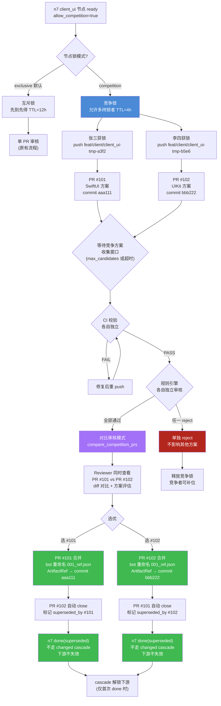
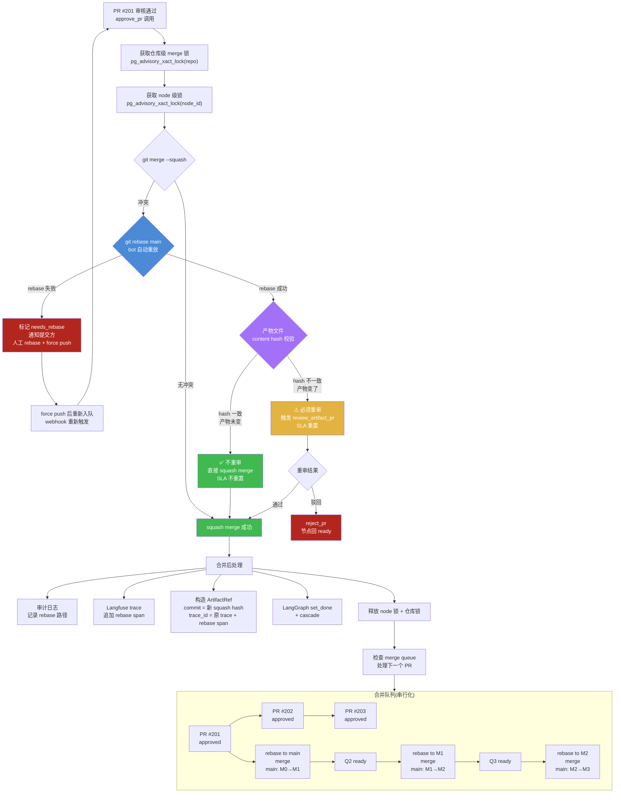

# PRD 压力测试第二轮:并发竞争与合并冲突场景走查

> **文档性质**:对《coordination-platform-prd.md》v2.0 及其深化文档(fr2-orchestration.md / fr1-fr6-artifact-review.md)的真实开发场景压力测试报告(第二轮)
> **版本**:v1.0 | **日期**:2026-08-04 | **状态**:待评审
> **方法**:选取 3 个围绕"并发竞争 + 路径冲突 + 合并冲突"的真实场景,逐步走查 PRD 当前设计能否处理,定位设计缺陷并提出修正方案
> **父文档**:[coordination-platform-prd.md](../coordination-platform-prd.md)
> **关联深化**:[fr2-orchestration.md](../deep-dive/fr2-orchestration.md) | [fr1-fr6-artifact-review.md](../deep-dive/fr1-fr6-artifact-review.md)
> **核心原则**:产物完全自由(需求 9),管理方不限制内容格式,只做管理约束

---

## 0. 测试方法说明

第一轮场景走查(scenario-parallel-dependency 等 5 份)已覆盖节点粒度、依赖模型、跨管线共享等结构性问题。本轮聚焦于**并发与合并**这一运维级压力点,选取 3 个第一轮未触及的场景:

| 场景 | 核心挑战 | 压测的 PRD 设计点 |
|---|---|---|
| A7 | 同节点两个 agent 提交不同实现方案(方案竞争,非误操作) | 锁机制(C1)、单活跃 PR 约束、需求 9 产物自由 |
| A8 | 不同 feature 的同类型产物文件同名(跨管线路径冲突) | 仓库目录结构、seq 分配、node_path_registry 唯一性 |
| A9 | PR 审核期间 main 分支已有新合并(rebase 重审矛盾) | 合并冲突处理(C5)、rebase 后重审规则、累积漂移 |

每个场景按 **场景描述 → PRD 走查 → 设计缺陷 → 修正方案 → 设计图** 组织,所有缺陷均可定位到 PRD 具体章节。最后附**缺陷汇总表**。

---

## 1. 场景 A7:两个 agent 同时对同一节点提交不同产物(方案竞争)

### 1.1 场景描述

**业务背景**:登录功能管线中,`client_ui` 节点(n7)已 ready,依赖 `api_contract`(n2)+ `design_asset`(n6)均已 done。

**人员安排**:两位客户端开发者张三、李四都在开发 client_ui 实现,各自有不同技术方案:

| 开发者 | 方案 | 产物文件 | 引用代码仓库 commit |
|---|---|---|---|
| 张三 | SwiftUI 声明式 UI, MVVM 架构 | `client_ui/001_ref.json` | `org/ios-app` commit `aaa111` |
| 李四 | UIKit 命令式 UI, MVC 架构 | `client_ui/001_ref.json` | `org/ios-app` commit `bbb222` |

两个 PR 几乎同时到达管理方:
- 张三通过 client_agent 提交 PR #101
- 李四通过 client_agent 提交 PR #102

**关键特征**:这不是"误操作冲突"(两人不是改同一个文件的笔误),而是**方案竞争**——两个实现方案都合理,只是技术路线不同。需求 9 明确"产物由各端自己决定",意味着同一节点允许多套合理方案并存,管理方应支持"对比审核,选优合并"。

### 1.2 PRD 走查

**走查点 1:同节点单活跃 PR 约束(C1 冲突)**

fr1-fr6-artifact-review.md §5.2.1《节点级编辑锁》:
> 节点 `ready` 时,第一个调 `submit_artifact` 的 agent 获得锁。持锁者有权为该节点提 PR;其他 agent 提 PR 时,管理方 webhook 收到后**立即 reject**,提示"节点 n2 正在被 server-agent-01 编辑,请等待或协调"。

fr1-fr6-artifact-review.md §5.2.4《锁与 PR 审核的关系》:
> **提 PR 前必须持锁**:webhook 收到 PR 时,先查 node_id 的锁,若提交者非持锁者 → 立即 reject(C1 解决)
> **PR pending_review 期间持锁**:锁不释放,防止他人在审核期间提新 PR

fr2-orchestration.md §4.1《同节点多个 PR 处理》:
> **处理策略:一次只允许一个活跃 PR**(`pending_prs[nid]` 单值约束):
> PR #42 在审,新开 PR #43 → MCP 检测 `pending_prs[n2]` 非空 → 拒绝开 PR #43,返回 `PR_ALREADY_PENDING` 错误

**走查结论**:PRD 把所有同节点并发都按"误操作冲突"处理,**先到先得 + 锁互斥**。张三先到获锁,李四的 PR #102 被立即 reject,返回 `R_NODE_LOCKED_BY_OTHER`。李四的方案完全无法进入审核流程。

**走查点 2:锁 TTL 与持锁者不动作**

fr1-fr6-artifact-review.md §5.2.1:
> 锁有 TTL(默认 12 小时,可配置),超时自动释放(`expires_at`),避免死锁

fr1-fr6-artifact-review.md §6.1《SLA 分级》:
> SLA-Human-2(关键,如 api_contract 首次、client_delivery)| 4 工作小时 | 升级到 admin + 告警

**走查结论**:假设张三提了 PR #101 后去处理别的任务(不主动放弃锁),李四要等:
- 张三的 PR #101 审核完成(SLA-Human-2 最长 4h,若 client_ui 走自动审核则 30s)
- 若 PR #101 被驳回,锁释放,李四可竞争
- 若 PR #101 被批准合并,节点进 done,李四要走 changed 路径重提(级联失效下游)
- 若张三提 PR 后既不改也不撤销,锁 TTL 12h 才释放

**最坏情况**:张三的方案其实更差,但李四的方案被埋没 12h;即使李四重提,也走 changed 路径级联失效下游,代价巨大。

**走查点 3:方案竞争合并后的状态机语义**

fr2-orchestration.md §2.1 T10 转移:
> T10 | `done` | `changed` | `submit_artifact` 重提已 done 节点的 PR | `artifact_refs[nid]` 已存在;新 commit ≠ 旧 commit | 发 `CHANGED` event,触发 `invalidate_node` 递归失效下游

fr2-orchestration.md §2.2 非法转移防护:
> `done` | `ready` | 已生效不能直接回 ready,需走 changed | `INVALID_TRANSITION` + `USE_CHANGED_PATH`

**走查结论**:如果张三的 PR #101 先合并(n7 → done),李四的 PR #102 要走 changed 路径(T10),触发 `invalidate_node` 递归失效 n7 的所有下游(client_func、client_delivery 等)。但李四的提交是"方案替换"不是"产物变更"——下游不应该因为"换了一个 UI 实现方案"而全部失效。changed 的级联语义被误用。

**走查点 4:产物路径冲突(client_ui/001.json)**

fr1-fr6-artifact-review.md §5.2.2《seq 预分配锁》简化方案:
> seq 在 merge 时由 bot 统一分配(取 main 上 max seq + 1,原子操作),分支内文件名用临时 slug,merge 时 bot 重命名。

fr1-fr6-artifact-review.md §5.3.1《路径冲突检测(C2)》:
> PR 审核时,管理方检查 PR 修改的文件 path 是否已被其他 pending PR 修改

**走查结论**:按简化方案,张三和李四的分支内文件名是临时 slug(如 `tmp_a3f2.json` 和 `tmp_b5e6.json`),merge 时 bot 分别重命名为 `001_ref.json` 和 `002_ref.json`。路径冲突检测基于 path 完全匹配,两个临时 slug 不同,不会触发冲突。但 §5.3.1 的检测逻辑与简化方案的"merge 时 bot 重命名"存在交互歧义——CI 检查时看到的是临时 slug,而 node_path_registry 注册的是最终 path,两者不一致。

### 1.3 设计缺陷

| # | 缺陷 | 定位 | 严重度 |
|---|---|---|---|
| D7-1 | **缺乏方案竞争机制**:PRD 只有"先到先得 + 锁互斥",把方案竞争当误操作处理,与需求 9"产物自由定义"矛盾 | fr1-fr6 §5.2.1 / §5.2.4 | 高 |
| D7-2 | **锁 TTL 12h 对方案竞争场景过长**:持锁者不动作时,竞争者要等 12h,无"持锁者活跃度检测"快速释放机制 | fr1-fr6 §5.2.1 | 中 |
| D7-3 | **changed 级联语义被误用**:方案替换走 T10 changed 路径,触发下游递归失效,但"换方案"不应级联失效下游 | fr2 §2.1 T10 / §2.2 | 高 |
| D7-4 | **路径冲突检测与 seq bot 分配的交互不清晰**:CI 检查临时 slug,node_path_registry 注册最终 path,检测时机与路径定义不一致 | fr1-fr6 §5.2.2 / §5.3.1 | 中 |
| D7-5 | **无"对比审核"能力**:review_artifact_pr 只审核单个 PR,无法让 reviewer 同时看多个竞争方案选优 | fr1-fr6 §4 / FR6.2 | 高 |

### 1.4 修正方案

**修正 1:引入"方案竞争模式"(competition mode)**

在 pipeline DSL 中,产物节点可声明 `allow_competition: true`,启用后该节点允许多个 agent 并行提交竞争方案:

```yaml
# pipeline.yaml 片段
- id: "n7"
  type: "client_ui"
  role: "client"
  deps: ["n2", "n6"]
  allow_competition: true       # 新增:允许方案竞争
  competition:
    max_candidates: 3            # 最多 3 个竞争方案
    selection_mode: "manual"     # manual(人工选优) | auto_best(按 gate 自动选)
    review_strategy: "comparative"  # comparative(对比审核) | sequential(顺序审核)
```

**修正 2:锁机制分级**

将节点锁分为两种模式:
- **互斥锁(exclusive)**:默认模式,防误操作,先到先得,TTL 12h
- **竞争锁(competition)**:`allow_competition: true` 时启用,允许多持锁者,每持锁者独立 TTL

```python
# 锁获取逻辑修正
async def acquire_node_lock(node_id: str, agent_id: str, mode: str = "exclusive") -> LockResult:
    node = get_node_def(node_id)
    if node.get("allow_competition"):
        # 竞争模式:允许多持锁者,每人独立锁
        existing = await get_competition_locks(node_id)
        if len(existing) >= node["competition"]["max_candidates"]:
            return LockResult(ok=False, reason="max_candidates_reached")
        await insert_competition_lock(node_id, agent_id, ttl=4h)  # 竞争锁 TTL 缩短至 4h
        return LockResult(ok=True, mode="competition")
    else:
        # 互斥模式:原有逻辑
        return await acquire_exclusive_lock(node_id, agent_id, ttl=12h)
```

**修正 3:缩短竞争锁 TTL + 活跃度检测**

竞争锁 TTL 从 12h 缩短至 4h,并增加活跃度检测:
- 持锁者 1h 内无 `update_progress` 或 commit push → 自动释放锁
- 持锁者可调 `renew_lock` 续期(最多续 2 次,共 12h 上限)

**修正 4:方案替换不走 changed cascade**

引入新的状态转移 T19 `done → done(superseded)`:
- 当竞争模式下,新 PR 合并时,旧 ArtifactRef 被标记 `superseded_by` 新 commit
- **不触发 invalidate_node**,下游产物引用不变(因为下游依赖的是 node 的"当前生效版本",方案替换不改变依赖语义)
- 仅当新方案破坏了上游契约(如 API 变更)时,才走 changed cascade

```python
# fr2 §2.1 新增转移
# T19 | done | done(superseded) | submit_artifact(competition winner) | 
#   artifact_refs[nid] 已存在;新 commit ≠ 旧 commit;node.allow_competition=true |
#   旧 ArtifactRef 标记 superseded_by;写新 ArtifactRef;发 SUPERSEDED event;不 cascade
```

**修正 5:对比审核工具**

新增 MCP 工具 `compare_competition_prs`:
```json
{
  "name": "compare_competition_prs",
  "description": "对比审核同一节点的多个竞争 PR,reviewer 同时查看后选优",
  "inputSchema": {
    "type": "object",
    "properties": {
      "node_id": {"type": "string"},
      "pr_ids": {"type": "array", "items": {"type": "integer"}},
      "winner_pr_id": {"type": "integer", "description": "选中的 PR"}
    },
    "required": ["node_id", "pr_ids", "winner_pr_id"]
  }
}
```

调用后:winner PR 合并,其余 PR 自动 close 并标记 `superseded_by`。

### 1.5 设计图:A7 方案竞争审核流程



---

## 2. 场景 A8:不同节点的产物文件同名(跨 feature 路径冲突)

### 2.1 场景描述

**业务背景**:两个 feature 并行开发,共享同一个产物仓库:

| Feature | Pipeline ID | product_spec 节点 | 产物内容 | 欲提交路径 |
|---|---|---|---|---|
| Feature A:登录功能 | `login-feature` | n1 | 登录需求文档 | `product_spec/001_login.md` |
| Feature B:用户资料 | `profile-feature` | n1 | 用户资料需求文档 | `product_spec/001_profile.md` |

两个 feature 的 product_spec 节点都是各自 pipeline 的 n1(节点 ID 是 pipeline 内的),产物内容完全不同,但都想在产物仓库的 `product_spec/` 目录下提交。

**当前 PRD 仓库结构**(fr1-fr6 §2.1.1):
```
artifact-repo/
├─ product_spec/          # 按产物类型分目录,不按 feature 分
│  └─ 001_xxx.md          # seq 类型目录内全局递增
├─ api_contract/
└─ ...
```

**问题演变**:
1. Feature A 先 merge,`product_spec/001_login.md` 占用 seq 001
2. Feature B 后 merge,bot 分配 seq 002,文件名 `product_spec/002_profile.md`
3. 看似不冲突(seq 不同),但:
   - 两个 feature 的产物混在同一个 `product_spec/` 目录,无法从路径判断归属
   - node_id 都是 n1,`node_path_registry` 的 PRIMARY KEY 是 `(pipeline_id, node_id)`,两个 pipeline 各自的 n1 都能注册——但 `UNIQUE(pipeline_id, artifact_path)` 允许不同 pipeline 有相同 path!
   - 如果并发提交(两个 PR 同时 merge),seq 分配 `max seq + 1` 不是原子的,可能都拿到 002

### 2.2 PRD 走查

**走查点 1:仓库目录结构——无 feature 命名空间**

主 PRD §FR1.1《仓库结构》:
```
artifact-repo/
├─ product_spec/                      # 按产物类型分目录
│  └─ 001.yaml                        # 产物文件
```

fr1-fr6-artifact-review.md §2.1.1《目录命名》:
> 产物类型目录 | `<node_type>`(与节点 type 完全一致) | `product_spec/`、`api_contract/`
> 禁止在产物类型目录下建子目录(扁平化,避免路径歧义)

fr1-fr6-artifact-review.md §2.3.2《不同节点的同类型产物共存》:
> 多个节点同为 `api_contract` 类型(如 n2 登录契约、n12 用户信息契约),它们以不同 seq 共存:
> seq 是类型目录内全局递增,不按节点分段。node_id 与 seq 的映射通过 manifest 的 `node_id` 字段维护。

**走查结论**:PRD 明确"按类型分目录,扁平化,seq 全局递增",**无 feature/pipeline 命名空间**。两个 feature 的产物混在同一目录,只能靠 manifest 的 `node_id` 反查归属。但 node_id 是 pipeline 内的(两个 pipeline 都可能有 n1),无法全局唯一标识。

**走查点 2:node_path_registry 唯一性约束矛盾**

fr2-orchestration.md §6.1《Postgres Schema》:
```sql
CREATE TABLE node_path_registry (
    pipeline_id TEXT NOT NULL,
    node_id TEXT NOT NULL,
    artifact_path TEXT NOT NULL,
    commit TEXT NOT NULL,
    PRIMARY KEY (pipeline_id, node_id),
    UNIQUE (pipeline_id, artifact_path)   -- 路径全局唯一
);
```

**走查发现**:`UNIQUE(pipeline_id, artifact_path)` 的注释写"路径全局唯一",但约束实际是 `(pipeline_id, artifact_path)` 联合唯一——意味着:
- `('login-feature', 'product_spec/001_login.md')` ✓
- `('profile-feature', 'product_spec/001_login.md')` ✓(pipeline_id 不同,不冲突!)

这与注释"路径全局唯一"矛盾。git 仓库的 path 是全局唯一的(一个 path 只能有一个文件),但 registry 允许不同 pipeline 注册相同 path。当两个 feature 真的提交同名文件时,registry 不报错,但 git merge 会冲突。

**走查点 3:seq 分配的原子性**

fr1-fr6-artifact-review.md §5.2.2《seq 预分配锁》简化方案:
> seq 在 merge 时由 bot 统一分配(取 main 上 max seq + 1,原子操作),分支内文件名用临时 slug,merge 时 bot 重命名。

**走查发现**:"原子操作"未定义实现。如果 bot 是单进程串行 merge,自然原子;但如果 bot 是多进程/分布式(多 MCP 实例并发 approve_pr),`max seq + 1` 的读-改-写不是原子的:
- Bot A 读取 max seq = 001,计算 002
- Bot B 读取 max seq = 001,计算 002
- Bot A 写入 002
- Bot B 写入 002 → 冲突!

PRD 未定义 seq 分配的并发控制机制(如 Postgres 行锁、序列号、分布式锁)。

**走查点 4:get_dependencies 的路径查找**

主 PRD §6.5《get_dependencies》:
> 查上游产物内容(git show 拉取),供 agent 参考
> 返回: `[{"node_id": "n1", "content": "..."}]`

fr2-orchestration.md §5.1 数据模型:
> `artifact_refs: dict[str, ArtifactRef]` — node_id -> 产物引用

**走查结论**:get_dependencies 按 node_id 查 `artifact_refs`,取得 ArtifactRef(repo + path + commit),再 `git show` 拉取内容。如果引入 feature 命名空间(path 变成 `features/login/product_spec/001.md`),ArtifactRef.path 自然包含完整路径,get_dependencies 不受影响。**这证明引入 feature 命名空间不会破坏 get_dependencies 的实现**。

**走查点 5:CI-8 seq 唯一性检查与 bot 分配的矛盾**

fr1-fr6-artifact-review.md §8.1.1 CI-8:
> seq 唯一性 | 同目录内 seq 不重复 | CI fail

fr1-fr6-artifact-review.md §5.2.2 简化方案:
> 分支内文件名用临时 slug,merge 时 bot 重命名

**走查发现**:CI 在 PR 提交时触发,此时分支内文件名是临时 slug(如 `tmp_a3f2.json`),没有 seq。CI-8 检查"同目录内 seq 不重复"——但临时 slug 没有 seq,CI-8 如何检查?如果 CI-8 检查的是"临时 slug 不与 main 上已有文件冲突",那检查的是 slug 不是 seq,与 CI-8 的描述不符。**CI-8 在简化方案下形同虚设**。

### 2.3 设计缺陷

| # | 缺陷 | 定位 | 严重度 |
|---|---|---|---|
| D8-1 | **缺少 feature/pipeline 命名空间**:产物路径只有 type/seq,跨 feature 产物混在同一目录,无法从路径判断归属 | 主 PRD §FR1.1 / fr1-fr6 §2.1.1 | 高 |
| D8-2 | **node_path_registry 唯一性约束与注释矛盾**:`UNIQUE(pipeline_id, artifact_path)` 允许不同 pipeline 注册相同 path,但注释说"路径全局唯一",git 仓库 path 全局唯一 | fr2 §6.1 | 高 |
| D8-3 | **node_id 跨 pipeline 不唯一**:两个 pipeline 都有 n1,manifest 的 node_id 无法全局唯一标识产物归属 | fr1-fr6 §3.3 / §2.3.2 | 高 |
| D8-4 | **seq 分配无并发控制**:`max seq + 1` 的读-改-写非原子,多 bot 并发 merge 可能分配重复 seq | fr1-fr6 §5.2.2 | 高 |
| D8-5 | **CI-8 在简化方案下失效**:分支内文件名是临时 slug 无 seq,CI-8 "seq 唯一性"检查无对象 | fr1-fr6 §8.1.1 CI-8 / §5.2.2 | 中 |
| D8-6 | **扁平化目录禁令与 feature 隔离需求冲突**:fr1-fr6 §2.1.1 "禁止建子目录"阻止了 feature 命名空间的引入 | fr1-fr6 §2.1.1 | 中 |

### 2.4 修正方案

**修正 1:引入 feature 命名空间**

产物路径改为 `features/{pipeline_id}/{node_type}/{seq}_{slug}.{ext}`:

```
artifact-repo/
├─ features/
│  ├─ login-feature/              # pipeline_id 作为命名空间
│  │  ├─ product_spec/
│  │  │  └─ 001_login.md          # Feature A 的产物
│  │  ├─ api_contract/
│  │  │  └─ 001_login-contract.yaml
│  │  └─ client_ui/
│  │     └─ 001_ref.json
│  ├─ profile-feature/            # Feature B 的命名空间
│  │  └─ product_spec/
│  │     └─ 001_profile.md        # Feature B 的产物,seq 独立从 001 开始
│  └─ shared/                     # 跨 feature 共享产物(如通用 API 契约)
│     └─ api_contract/
│        └─ 001_auth.yaml
├─ manifests/                     # manifest 副本(可选)
└─ .github/
```

**关键变化**:
- seq 在 `features/{pipeline_id}/{node_type}/` 范围内递增(不再全局递增),每个 feature 独立编号
- 跨 feature 共享产物放 `features/shared/` 目录
- fr1-fr6 §2.1.1 "禁止建子目录"修正为"禁止在 `{node_type}/` 下建子目录,但 `features/{pipeline_id}/` 层级允许"

**修正 2:node_path_registry 唯一性修正**

```sql
CREATE TABLE node_path_registry (
    pipeline_id TEXT NOT NULL,
    node_id TEXT NOT NULL,
    artifact_path TEXT NOT NULL,          -- 现在含 features/{pipeline_id}/ 前缀
    commit TEXT NOT NULL,
    registered_at TIMESTAMPTZ NOT NULL DEFAULT now(),
    PRIMARY KEY (pipeline_id, node_id),
    UNIQUE (artifact_path)                -- 修正:全局唯一(去掉 pipeline_id)
);
```

由于 artifact_path 现在含 pipeline_id 前缀,全局 UNIQUE 自然保证不同 pipeline 的 path 不冲突。

**修正 3:node_id 全局唯一化**

manifest 的 `node_id` 改为 `{pipeline_id}:{node_id}` 格式(如 `login-feature:n1`),或在 manifest 中增加 `pipeline_id` 必填字段:

```json
// manifest 新增 pipeline_id 字段
{
  "manifest_version": "1.0",
  "pipeline_id": "login-feature",    // 新增
  "node_id": "n1",
  "node_type": "product_spec",
  ...
}
```

**修正 4:seq 分配并发控制**

使用 Postgres 序列(sequence)或行级锁保证原子性:

```sql
-- 每个 (pipeline_id, node_type) 一个序列
CREATE SEQUENCE seq_login_product_spec START 1;
CREATE SEQUENCE seq_profile_product_spec START 1;

-- 分配时
SELECT nextval('seq_' || pipeline_id || '_' || node_type);
```

或用单行表 + 行锁:
```sql
-- seq 计数器表
CREATE TABLE seq_counters (
    pipeline_id TEXT NOT NULL,
    node_type TEXT NOT NULL,
    next_seq INT NOT NULL DEFAULT 1,
    PRIMARY KEY (pipeline_id, node_type)
);

-- 分配(原子)
UPDATE seq_counters SET next_seq = next_seq + 1
WHERE pipeline_id = $1 AND node_type = $2
RETURNING next_seq - 1 AS allocated_seq;
```

**修正 5:CI-8 检查修正**

CI-8 改为检查"PR 内声明的 artifact_path(含 pipeline_id 前缀)与 main 上已有 path 不冲突":

```yaml
# CI-8 修正描述
- id: CI-8
  name: 产物路径唯一性
  check: |
    # 解析 manifest 获取 pipeline_id + path
    # 检查 features/{pipeline_id}/{node_type}/{file} 在 main 上不存在
    # (变更场景除外:本 node_id 已注册的 path 允许覆盖)
```

### 2.5 设计图:A8 产物路径分配机制

```mermaid
flowchart TD
    subgraph BEFORE["修正前:扁平化目录(有问题)"]
        B_REPO["artifact-repo/"]
        B_REPO --> B_PS["product_spec/"]
        B_PS --> B_001["001_login.md (Feature A n1)"]
        B_PS --> B_002["002_profile.md (Feature B n1)"]
        B_PS --> B_N1["❓ 哪个 feature?只能查 manifest"]
        B_N1 --> B_COLLIDE["并发 merge 时 seq 竞争<br/>max+1 非原子"]
    end

    subgraph AFTER["修正后:feature 命名空间"]
        A_REPO["artifact-repo/"]
        A_REPO --> A_FEAT["features/"]
        A_FEAT --> A_LOGIN["login-feature/"]
        A_FEAT --> A_PROFILE["profile-feature/"]
        A_FEAT --> A_SHARED["shared/"]

        A_LOGIN --> A_LOGIN_PS["product_spec/"]
        A_LOGIN_PS --> A_LOGIN_001["001_login.md<br/>seq 独立从 001 开始"]

        A_PROFILE --> A_PROFILE_PS["product_spec/"]
        A_PROFILE_PS --> A_PROFILE_001["001_profile.md<br/>seq 独立从 001 开始<br/>不与 Feature A 竞争"]

        A_SHARED --> A_SHARED_API["api_contract/"]
        A_SHARED_API --> A_SHARED_001["001_auth.yaml<br/>跨 feature 共享"]
    end

    subgraph SEQ_ALLOC["seq 原子分配流程"]
        MERGE["PR approve → bot merge"]
        MERGE --> LOCK_SEQ["SELECT FOR UPDATE<br/>seq_counters<br/>WHERE pipeline_id=X AND node_type=Y"]
        LOCK_SEQ --> INC["next_seq = next_seq + 1<br/>RETURNING allocated_seq"]
        INC --> RENAME["bot 重命名临时 slug<br/>→ {allocated_seq}_{slug}.{ext}"]
        RENAME --> SQUASH["squash merge to main"]
        SQUASH --> REGISTER["node_path_registry<br/>INSERT path (UNIQUE 全局)"]
    end

    subgraph CONCURRENT["并发场景处理"]
        BOT_A["Bot A merge Feature A"]
        BOT_B["Bot B merge Feature B"]
        BOT_A --> LOCK_A["锁 seq_login_product_spec"]
        BOT_B --> LOCK_B["锁 seq_profile_product_spec"]
        LOCK_A --> ALLOC_A["分配 001(独立序列)"]
        LOCK_B --> ALLOC_B["分配 001(独立序列)"]
        ALLOC_A --> NO_CONFLICT["✅ 无冲突<br/>不同序列不同路径"]
        ALLOC_B --> NO_CONFLICT
    end

    style B_COLLIDE fill:#b3261e,color:#fff
    style B_N1 fill:#e3b341,color:#fff
    style NO_CONFLICT fill:#3fb950,color:#fff
    style A_LOGIN_001 fill:#3fb950,color:#fff
    style A_PROFILE_001 fill:#3fb950,color:#fff
```



---

## 3. 场景 A9:PR 审核期间产物仓库 main 分支已有新合并(合并冲突)

### 3.1 场景描述

**业务背景**:产物仓库 main 分支上有多个 PR 排队合并:

| 时间 | PR | 节点 | 产物路径 | 状态 |
|---|---|---|---|---|
| T0 | #201 | n2 (api_contract) | `api_contract/001.yaml` | pending_review |
| T1 | #202 | n12 (api_contract) | `api_contract/002.yaml` | pending_review |
| T2 | #202 审核通过,合并到 main | | | main 推进到 commit M2 |
| T3 | #201 审核通过,尝试合并 | | | 发现与 main 冲突 |

**冲突原因**:#202 合并时修改了 `.github/pull_request_template.md`(比如新增了一个 `version` 字段声明),#201 也基于旧模板。合并 #201 时,git 报冲突。

**关键特征**:
- 冲突文件是 `.github/pull_request_template.md`(非产物文件),产物文件 `api_contract/001.yaml` 本身无冲突
- rebase 后产物内容不变,但 commit hash 变了
- PRD 对"rebase 后是否重审"的规则不清晰

### 3.2 PRD 走查

**走查点 1:合并冲突处理流程**

fr2-orchestration.md §4.3《合并冲突 rebase》:
> | 步骤 | 动作 | 失败处理 |
> |---|---|---|
> | 1 | `approve_pr` 触发 `git merge --squash` | 冲突 → 进步骤 2 |
> | 2 | 尝试 `git rebase main` 自动重放 | 仍冲突 → 进步骤 3 |
> | 3 | 标记 PR `needs_rebase`,通知提交方 | 提交方本地 rebase 后 force push |
> | 4 | 提交方 force push 后,webhook 重新触发 review | 重新走 §4.3 步骤 1 |

**走查发现**:步骤 2 的"自动 rebase 重放"是 bot 做的(不需要提交方介入)。如果自动重放成功(无冲突或自动合并),步骤 2 完成后直接 merge,还是进步骤 4 重新审核?PRD 未明确。

步骤 4 说"提交方 force push 后,webhook 重新触发 review"——这是步骤 3(人工 rebase)后的流程。但步骤 2(bot 自动 rebase)成功后,是否也需要重新审核?PRD 没说。

**走查点 2:分支漂移重审(C5)的适用范围**

fr1-fr6-artifact-review.md §5.3.4《分支漂移处理(C5)》:
> PR 审核期间,feat 分支被推送新 commit(提交者修改产物):
> - webhook 重新触发审核,旧审核结论作废,重新跑规则引擎
> - 审核计时器重置(SLA 重新计算)
> - 若 PR 已被 approve 但未 merge,新 commit 导致 approve 自动撤销(GitHub 原生行为),需重新审核

**走查发现**:C5 的定义是"feat 分支被推送新 commit(提交者修改产物)"——即**提交者主动修改**。场景 A9 是"main 变了导致 rebase",不是提交者主动修改。C5 的重审规则是否适用于 rebase 场景?PRD 未明确。

关键区别:
- C5(提交者修改):产物内容可能变了,重审合理
- A9(rebase):产物内容未变(仅 commit hash 变了),重审浪费资源

**走查点 3:rebase 后 ArtifactRef 的 commit 更新**

主 PRD §5.1《ArtifactRef》:
```python
class ArtifactRef(TypedDict):
    node_id: str
    repo: str
    path: str
    commit: str              # git commit hash(合并后的)
    toolspec_framework: str
    trace_id: str
```

fr1-fr6-artifact-review.md §FR6.3《合并逻辑》:
> | 3 | 获取 merge commit hash |
> | 4 | 构造 ArtifactRef(repo + path + commit + toolspec_framework + trace_id) |

**走查结论**:ArtifactRef.commit 是 squash merge 后的 commit hash,不是 feat 分支的 commit hash。rebase 改的是 feat 分支的 commit,merge 后的 squash commit 是全新的,ArtifactRef.commit 自然是新的。**这部分没有问题**。

但 trace_id 是审核时的 Langfuse trace,rebase 后如果重新审核,trace_id 变了;如果不重审,trace_id 还是旧的,但 merge commit 是 rebase 后的新 commit——trace 关联的是旧审核,rebase 操作本身没有 trace。

**走查点 4:多个 PR 排队合并的累积漂移**

假设 5 个 PR 同时审核通过,排队合并:
- PR #1 合并,main: M0 → M1
- PR #2 基于 M0,合并时 rebase 到 M1,main: M1 → M2
- PR #3 基于 M0,合并时 rebase 到 M2,main: M2 → M3
- PR #4 基于 M0,合并时 rebase 到 M3,main: M3 → M4
- PR #5 基于 M0,合并时 rebase 到 M4,main: M4 → M5

每个 PR 都要 rebase,且 rebase 的"距离"越来越远(M0→M4)。fr2 §4.3 的重试上限 3 次,如果每个 PR 的 rebase 都算一次"失败"(因为 main 又变了),3 次可能不够。

**走查发现**:PRD 无"合并队列"(merge queue)机制,approve 后的 PR 是立即合并还是排队?fr2 §4.3 步骤 1 说"approve_pr 触发 git merge --squash"——似乎是立即合并。如果多个 PR 同时 approve,并发 merge 会互相冲突(main 在 merge 过程中变化)。

fr2 §3.2《锁机制》的锁粒度矩阵:
> `approve_pr` | node_id + 下游节点集 | `hash(node_id)` + 下游 `hash(downstream_id)` 依次抢 | 合并 + cascade 整体

**走查发现**:approve_pr 的锁是 node_id 级别的,不是仓库级别的。两个不同 node_id 的 PR 同时 approve(如 n2 和 n12),锁不互斥,可以并发 merge——但它们 merge 到同一个 main 分支,git 操作层面会冲突。**PRD 缺少仓库级 merge 锁**。

**走查点 5:非产物文件冲突 vs 产物文件冲突**

fr1-fr6-artifact-review.md §8.1.1 CI 检查项只校验产物文件,不涉及 `.github/` 等非产物文件。fr2 §4.3 的 rebase 流程不区分冲突文件类型——无论冲突的是产物文件还是模板文件,都走同一流程。

**走查发现**:场景 A9 的冲突是 `.github/pull_request_template.md`(非产物文件),rebase 自动解决后产物内容不变。但 PRD 的 rebase 流程会触发"重新审核"(步骤 4),审核者要重新看一遍 diff(包含模板文件变更),这是不必要的重审。

### 3.3 设计缺陷

| # | 缺陷 | 定位 | 严重度 |
|---|---|---|---|
| D9-1 | **bot 自动 rebase 后是否重审不明确**:步骤 2 成功后直接 merge 还是重审?PRD 未定义 | fr2 §4.3 步骤 2 | 高 |
| D9-2 | **C5 分支漂移重审规则不适用于 rebase**:C5 是"提交者主动修改",rebase 是"main 变了",两者语义不同但 PRD 未区分 | fr1-fr6 §5.3.4 | 高 |
| D9-3 | **缺少仓库级 merge 锁**:approve_pr 锁是 node_id 级,不同 node_id 的 PR 并发 merge 会 git 冲突 | fr2 §3.2 锁粒度矩阵 | 高 |
| D9-4 | **无合并队列(merge queue)机制**:多 PR 排队合并时累积漂移,每个都要 rebase,无串行化队列 | fr2 §4.3 | 高 |
| D9-5 | **不区分产物文件冲突与非产物文件冲突**:模板/CI 配置冲突与产物冲突走同一 rebase 流程,非产物冲突重审浪费资源 | fr2 §4.3 / fr1-fr6 §8.1 | 中 |
| D9-6 | **rebase 后 trace_id 关联断裂**:rebase 不重审时 trace_id 指向旧审核,rebase 操作无 trace 记录 | 主 PRD §5.1 ArtifactRef / fr2 §4.3 | 中 |
| D9-7 | **重试上限 3 次对高频合并场景不足**:main 频繁变化时,3 次 rebase 可能都因 main 又变了而失败 | fr2 §4.3 重试上限 | 中 |

### 3.4 修正方案

**修正 1:明确 bot 自动 rebase 后的重审规则——内容指纹校验**

引入产物文件 content hash 校验,rebase 后判断产物内容是否变化:

```python
async def approve_pr_with_rebase(pr_id: int) -> ApproveResult:
    pr = await get_pr(pr_id)
    
    # 1. 尝试 squash merge
    merge_result = await try_squash_merge(pr)
    
    if merge_result.conflict:
        # 2. bot 自动 rebase
        rebase_result = await auto_rebase_to_main(pr)
        
        if rebase_result.success:
            # 3. 内容指纹校验(关键)
            product_files = [f for f in pr.files if is_product_file(f.path)]
            old_hashes = {f.path: content_hash(f.old_content) for f in product_files}
            new_hashes = {f.path: content_hash(f.new_content) for f in product_files}
            
            if old_hashes == new_hashes:
                # 产物内容未变(仅非产物文件冲突被 rebase 解决)
                # 不重审,直接合并
                await squash_merge(pr)
                return ApproveResult(merged=True, rebase=True, re_review=False,
                                     reason="product_content_unchanged")
            else:
                # 产物内容变了(rebase 引入了自动合并)
                # 必须重审
                await trigger_re_review(pr)
                return ApproveResult(merged=False, rebase=True, re_review=True,
                                     reason="product_content_changed")
        else:
            # 3. 自动 rebase 失败,标记 needs_rebase
            await mark_needs_rebase(pr)
            return ApproveResult(merged=False, needs_manual_rebase=True)
    
    await squash_merge(pr)
    return ApproveResult(merged=True)
```

**修正 2:区分 C5(提交者修改)与 rebase(main 变化)**

```yaml
# fr1-fr6 §5.3 修正:冲突场景分类扩展
C5_branch_drift:      # 提交者主动 push 新 commit 到 feat 分支
  detection: webhook on feat branch push
  action: re_review   # 重审(产物可能变了)
  sla: reset

C7_main_drift:        # main 变化导致 PR 合并冲突(新增)
  detection: approve_pr 时 git merge 冲突
  action: auto_rebase + content_hash_check
  re_review: only_if_product_changed   # 仅产物变化时重审
  sla: not_reset_if_product_unchanged  # 产物未变不重置 SLA
```

**修正 3:引入仓库级 merge 锁**

在 node_id 级锁之上,增加仓库级 merge 锁,串行化所有 merge 操作:

```python
async def approve_pr(pr_id: int):
    # 1. 仓库级 merge 锁(串行化所有 PR 合并)
    async with repository_merge_lock(repo="artifact-repo"):
        # 2. node_id 级锁(原有逻辑)
        async with node_lock(node_id):
            # 3. 尝试 merge
            result = await try_merge_or_rebase(pr)
            ...
```

仓库级锁用 Postgres advisory lock,key 固定为仓库 hash:
```python
REPO_MERGE_LOCK_KEY = hash("artifact-repo:merge")  # 固定 key

async with db.transaction():
    await db.execute("SELECT pg_advisory_xact_lock($1)", REPO_MERGE_LOCK_KEY)
    # 所有 merge 串行化
```

**修正 4:合并队列(merge queue)**

approve 通过的 PR 不立即 merge,而是进入合并队列,按 FIFO 顺序串行 rebase + merge:

```python
# 合并队列处理(定时任务 or 事件触发)
async def process_merge_queue():
    async with repository_merge_lock():
        while True:
            pr = await pop_from_merge_queue()  # FIFO
            if pr is None:
                break
            
            # rebase 到最新 main
            await rebase_to_main(pr)
            
            # 内容指纹校验
            if product_content_changed(pr):
                # 产物变了,退回重审
                await trigger_re_review(pr)
                continue
            
            # squash merge
            await squash_merge(pr)
            
            # 更新 ArtifactRef
            await update_artifact_ref(pr)
```

**修正 5:rebase 操作的 trace 记录**

rebase 操作(无论是否重审)都记录到 Langfuse trace:

```python
@langfuse_trace(operation="auto_rebase")
async def auto_rebase_to_main(pr) -> RebaseResult:
    span = langfuse.start_span(
        name="mcp.auto_rebase",
        trace_id=pr.trace_id,   # 关联原审核 trace
        metadata={
            "pr_id": pr.pr_id,
            "old_base": pr.base_commit,
            "new_base": main_head,
            "conflict_files": conflict_files,
            "product_files_changed": product_changed,
        }
    )
    ...
    span.end()
```

**修正 6:重试上限改为时间窗口 + 指数退避**

```python
# fr2 §4.3 重试策略修正
REBASE_RETRY_POLICY = {
    "max_attempts": 5,           # 增加到 5 次
    "time_window_seconds": 1800, # 30 分钟窗口
    "backoff": "exponential",    # 指数退避: 5s, 10s, 20s, 40s, 80s
    "give_up_action": "needs_admin_attention",  # 不自动 reject,转人工
}
```

### 3.5 设计图:A9 PR 合并冲突处理流程



---

## 4. 缺陷汇总表

### 4.1 全部缺陷一览

| 场景 | 缺陷 ID | 缺陷描述 | 定位章节 | 严重度 | 修正方案 |
|---|---|---|---|---|---|
| A7 | D7-1 | 缺乏方案竞争机制,先到先得 + 锁互斥与需求 9 矛盾 | fr1-fr6 §5.2.1 / §5.2.4 | 高 | 引入 competition mode + 竞争锁 |
| A7 | D7-2 | 锁 TTL 12h 对方案竞争场景过长,无活跃度检测 | fr1-fr6 §5.2.1 | 中 | 竞争锁 TTL 4h + 活跃度检测 |
| A7 | D7-3 | changed 级联语义被误用,方案替换不应级联失效下游 | fr2 §2.1 T10 / §2.2 | 高 | 新增 T19 done→done(superseded) |
| A7 | D7-4 | 路径冲突检测与 seq bot 分配交互不清晰 | fr1-fr6 §5.2.2 / §5.3.1 | 中 | CI 检查改为 manifest path 注册检查 |
| A7 | D7-5 | 无对比审核能力,review_artifact_pr 只审单 PR | fr1-fr6 §4 / FR6.2 | 高 | 新增 compare_competition_prs 工具 |
| A8 | D8-1 | 缺少 feature/pipeline 命名空间,跨 feature 产物混在一起 | 主 PRD §FR1.1 / fr1-fr6 §2.1.1 | 高 | 路径改为 features/{pipeline_id}/{type}/ |
| A8 | D8-2 | node_path_registry UNIQUE 约束与注释矛盾 | fr2 §6.1 | 高 | UNIQUE(artifact_path) 去掉 pipeline_id |
| A8 | D8-3 | node_id 跨 pipeline 不唯一,无法全局标识产物 | fr1-fr6 §3.3 / §2.3.2 | 高 | manifest 增加 pipeline_id 字段 |
| A8 | D8-4 | seq 分配无并发控制,max+1 非原子 | fr1-fr6 §5.2.2 | 高 | Postgres 序列或行锁原子分配 |
| A8 | D8-5 | CI-8 在简化方案下失效,临时 slug 无 seq | fr1-fr6 §8.1.1 / §5.2.2 | 中 | CI-8 改为 manifest path 唯一性检查 |
| A8 | D8-6 | 扁平化目录禁令阻止 feature 命名空间引入 | fr1-fr6 §2.1.1 | 中 | 修正为 type 目录下禁子目录,features/ 层级允许 |
| A9 | D9-1 | bot 自动 rebase 后是否重审不明确 | fr2 §4.3 步骤 2 | 高 | 内容指纹校验决定是否重审 |
| A9 | D9-2 | C5 分支漂移重审规则不适用于 rebase 场景 | fr1-fr6 §5.3.4 | 高 | 新增 C7 main_drift 场景分类 |
| A9 | D9-3 | 缺少仓库级 merge 锁,不同 node 并发 merge 冲突 | fr2 §3.2 | 高 | 新增仓库级 advisory lock |
| A9 | D9-4 | 无合并队列机制,累积漂移无串行化 | fr2 §4.3 | 高 | 引入 merge queue FIFO 串行 |
| A9 | D9-5 | 不区分产物文件冲突与非产物文件冲突 | fr2 §4.3 / fr1-fr6 §8.1 | 中 | 按文件类型分类处理 |
| A9 | D9-6 | rebase 后 trace_id 关联断裂 | 主 PRD §5.1 / fr2 §4.3 | 中 | rebase 操作记录 trace span |
| A9 | D9-7 | 重试上限 3 次对高频合并场景不足 | fr2 §4.3 | 中 | 改为 5 次 + 30 分钟窗口 |

### 4.2 缺陷严重度分布

| 严重度 | 数量 | 占比 | 说明 |
|---|---|---|---|
| 高 | 10 | 56% | 阻断核心场景,必须在 Phase 1 MVP 修正 |
| 中 | 8 | 44% | 影响效率/可观测性,Phase 2 修正 |

### 4.3 缺陷与 PRD 章节热力图

| PRD 章节 | 缺陷数 | 涉及缺陷 ID |
|---|---|---|
| fr1-fr6 §5.2(锁机制) | 4 | D7-1, D7-2, D7-4, D8-4 |
| fr1-fr6 §2.1(目录规范) | 3 | D8-1, D8-5, D8-6 |
| fr2 §4.3(合并冲突) | 4 | D9-1, D9-4, D9-5, D9-7 |
| fr2 §2.1/§2.2(状态机) | 2 | D7-3, D9-2 |
| fr2 §3.2(锁粒度) | 1 | D9-3 |
| fr2 §6.1(数据库 schema) | 1 | D8-2 |
| fr1-fr6 §3.3(manifest) | 1 | D8-3 |
| fr1-fr6 §4(规则引擎) | 1 | D7-5 |
| fr1-fr6 §5.3(冲突检测) | 1 | D9-2 |
| fr1-fr6 §8.1(CI 校验) | 1 | D9-5 |
| 主 PRD §FR1.1(仓库结构) | 1 | D8-1 |
| 主 PRD §5.1(ArtifactRef) | 1 | D9-6 |

**热点**:`fr1-fr6 §5.2(锁机制)` 和 `fr2 §4.3(合并冲突)` 是缺陷最集中的章节,建议优先修正。

### 4.4 修正方案实施优先级

| 优先级 | 修正项 | 涉及缺陷 | 实施阶段 |
|---|---|---|---|
| P0(Phase 1 MVP) | feature 命名空间 + seq 原子分配 + node_path_registry 修正 | D8-1, D8-2, D8-3, D8-4 | Phase 1 |
| P0(Phase 1 MVP) | 仓库级 merge 锁 + 合并队列 | D9-3, D9-4 | Phase 1 |
| P0(Phase 1 MVP) | rebase 内容指纹校验(不重审规则) | D9-1, D9-2 | Phase 1 |
| P1(Phase 2) | 方案竞争模式 + 竞争锁 + 对比审核 | D7-1, D7-2, D7-5 | Phase 2 |
| P1(Phase 2) | T19 superseded 转移(方案替换不级联) | D7-3 | Phase 2 |
| P1(Phase 2) | CI-8 修正 + 路径冲突检测修正 | D7-4, D8-5, D8-6 | Phase 2 |
| P2(Phase 3) | rebase trace 关联 + 重试策略优化 | D9-6, D9-7 | Phase 3 |

### 4.5 与第一轮场景走查的关联

| 本轮缺陷 | 第一轮关联发现 | 是否新发现 |
|---|---|---|
| D8-1(feature 命名空间) | 第一轮 scenario-parallel-dependency 场景 10 已提出"跨管线共享产物"问题 | 是(第一轮提出概念,本轮确认目录结构级缺陷) |
| D8-3(node_id 跨 pipeline 不唯一) | 第一轮未涉及 | 是(新发现) |
| D9-3(仓库级 merge 锁) | 第一轮未涉及并发 merge | 是(新发现) |
| D7-1(方案竞争) | 第一轮未涉及 | 是(新发现,需求 9 的直接推论) |

---

## 5. 结论

本轮 3 个场景共发现 **18 个设计缺陷**(10 高 / 8 中),集中在**并发锁机制**(fr1-fr6 §5.2)和**合并冲突处理**(fr2 §4.3)两个章节。

**核心结论**:

1. **PRD 的并发模型是"防误操作"导向,不是"支持方案竞争"导向**。需求 9"产物自由定义"意味着同一节点可能有多套合理方案,但 PRD 的锁机制把所有并发都当冲突处理。需要引入 competition mode。

2. **仓库目录结构缺少 feature 命名空间是结构性缺陷**。当前"按类型分目录 + seq 全局递增"的设计,在多 feature 并行时会导致产物归属不明、seq 竞争、node_id 冲突。必须引入 `features/{pipeline_id}/` 命名空间。

3. **合并冲突的 rebase 重审规则存在语义漏洞**。"rebase 后是否重审"没有明确规则,C5 分支漂移重审不适用于 main 变化场景。需要引入内容指纹校验,区分"产物变化"与"非产物文件冲突"。

4. **缺少仓库级 merge 锁和合并队列**。node_id 级锁无法防止不同 node 的 PR 并发 merge 导致 git 冲突,累积漂移无串行化机制。

**建议**:P0 修正项(feature 命名空间 + merge 锁 + rebase 指纹校验)必须在 Phase 1 MVP 落地,否则多 feature 并行开发和合并的场景无法运行。
