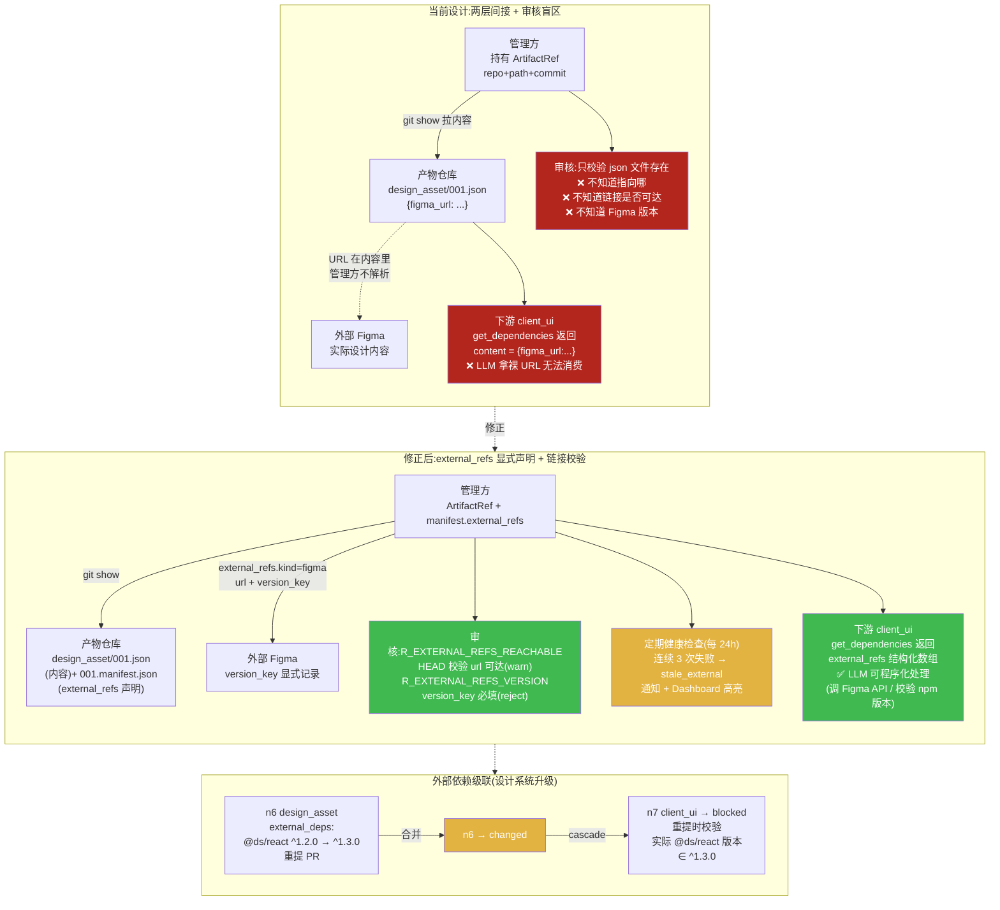
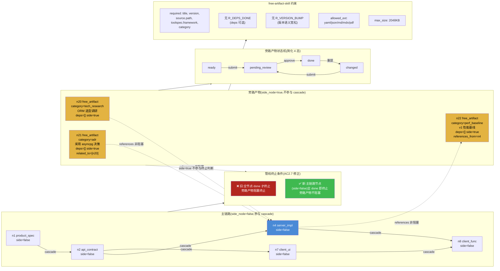

# 第二轮压力测试:跨仓库引用 / 纯链接产物 / 旁路产物

> **文档性质**:对《coordination-platform-prd.md》及配套深化文档的第二轮"压力测试"场景走查
> **版本**:v1.0 | **日期**:2026-08-04 | **状态**:待评审
> **上游文档**:
> - [coordination-platform-prd.md](../coordination-platform-prd.md)(主 PRD)
> - [fr1-fr6-artifact-review.md](../deep-dive/fr1-fr6-artifact-review.md)(FR1/FR6 深化)
> - [fr4-data-api.md](../deep-dive/fr4-data-api.md)(FR4 深化)
> **核心原则**:需求 9"产物完全自由"——产物怎么定义由各端决定;设计只提供 figma 链接;客户端/服务端开发不限制方式,只提供产物和更新状态

---

## 0. 走查方法说明

本轮 3 个场景聚焦"需求 9 产物自由"与 PRD 既有数据模型/审核模型之间的张力。每个场景按以下步骤走查:

1. **场景描述**:还原真实开发情境
2. **PRD 走查**:逐步对照 PRD 具体章节(含行号),判断当前设计能否处理
3. **设计缺陷**:列出"纸上谈兵"的具体问题
4. **修正方案**:给出可落地的数据结构/规则变更
5. **设计图**:Mermaid 图示

---

## 1. 场景 A4:产物引用跨多个代码仓库(微服务架构)

### 1.1 场景描述

服务端团队负责"下单支付"功能,采用微服务架构,实现横跨 3 个代码仓库:

| 仓库 | 服务 | 职责 |
|---|---|---|
| repo A | user-service | 用户鉴权、用户信息查询 |
| repo B | order-service | 订单创建、订单查询 |
| repo C | payment-service | 支付扣款、支付回调 |

需求 9 明确"服务端开发不限制方式,提供产物即可"。服务端开发完成后,3 个仓库各有若干 commit,团队希望把它们作为 `server_impl` 节点的产物提交。

管线中 `server_impl` 节点(n4)下游是 `client_func` 联调节点(n8),client 需要知道:调用 user-service 看 repo A 的 commit、调用 order-service 看 repo B 的 commit、调用 payment-service 看 repo C 的 commit。

### 1.2 PRD 走查

#### 走查点 1:ArtifactRef 是 1 节点 1 引用

主 PRD §5.1(第 698-705 行)定义:

```python
class ArtifactRef(TypedDict):
    node_id: str
    repo: str                    # 产物仓库地址
    path: str                    # 产物在仓库内路径
    commit: str                  # git commit hash
    toolspec_framework: str
    trace_id: str
```

主 PRD §FR2.3(第 267 行)`PipelineState`:

```python
artifact_refs: dict[str, ArtifactRef]   # node_id -> 产物引用
```

**结论**:数据结构是"1 节点 → 1 个 ArtifactRef",ArtifactRef 内 `repo/path/commit` 均为单值 string。3 个代码仓库无法用单个 ArtifactRef 表达。

#### 走查点 2:引用型产物 schema 是单仓库

fr1-fr6 深化 §3.4(第 446-466 行)定义引用型产物子 schema:

```json
{
  "required": ["code_repo", "code_commit", "code_path"],
  "properties": {
    "code_repo": { "type": "string" },
    "code_commit": { "type": "string", "pattern": "^[0-9a-f]{7,40}$" },
    "code_path": { "type": "string" }
  }
}
```

fr1-fr6 §2.3.3(第 199-207 行)给出示例 `server_impl/001_ref.json`:

```json
{
  "code_repo": "org/backend-services",
  "code_commit": "e5f6g7h8",
  "code_path": "src/api/login.py",
  "build_status": "passed"
}
```

**结论**:引用型产物 schema 的 required 字段是单数(`code_repo` 而非 `code_repos`),`additionalProperties: true` 虽允许扩展,但管理方审核规则引擎(§4)只校验已声明字段,扩展字段不被校验。3 个仓库的 commit 无法被审核。

#### 走查点 3:Postgres artifact_ref 表主键锁死 1:1

fr4 深化 §8.1(第 951-963 行)建表:

```sql
CREATE TABLE artifact_ref (
    node_id             TEXT NOT NULL,
    pipeline_id         TEXT NOT NULL,
    repo                TEXT NOT NULL,
    path                TEXT NOT NULL,
    commit              TEXT NOT NULL,
    ...
    PRIMARY KEY (node_id, pipeline_id),   -- 一节点一行
    ...
);
```

**结论**:主键 `(node_id, pipeline_id)` 决定一个节点只能存一行 ArtifactRef。要存 3 个仓库,要么破坏主键约束,要么拆表。

#### 走查点 4:get_dependencies 返回单一引用

fr4 §9.5(第 1497-1506 行)get_dependencies 的 outputSchema:

```json
"artifact_ref": {
  "type": "object",
  "properties": {
    "repo": {"type": "string"},
    "path": {"type": "string"},
    "commit": {"type": "string"},
    ...
  }
}
```

**结论**:返回结构是单一 `artifact_ref` 对象(非数组)。下游 client_func agent 调 get_dependencies(n4) 只能拿到一个仓库引用,无法知道还有另外 2 个仓库。

#### 走查点 5:拆成 3 个节点会导致节点类型爆炸

若把 n4 拆成 n4_user / n4_order / n4_payment 三个 `server_impl` 节点:

- 主 PRD §2.1 节点类型清单(第 93-106 行)只有 9 种产物类型,不区分 user/order/payment 子类型
- fr1-fr6 §2.1.1(第 96 行)"不允许出现未在 9 种产物类型之外的目录"——3 个节点都要用 `server_impl/` 目录,seq 共享,可共存,但节点 ID 不同
- fr1-fr6 §2.3.2(第 183-193 行)不同节点同类型产物共存是允许的
- 但下游 client_func(n8)的 deps 要声明 3 个上游(n4_user, n4_order, n4_payment),cascade 时 3 个全 done 才解锁——这符合 fork 语义,但管线 DSL 膨胀
- 更严重:**3 个节点逻辑上是"一次服务端交付"**,拆成 3 个节点后,审核要审 3 个 PR,SLA 计时要 3 次,人工审核(若有)要 3 次签字。这违背"一次交付一次审核"的工程直觉

**结论**:拆节点方案技术上可行,但工程上不合理——节点粒度应由"逻辑交付单元"决定,而非"代码仓库数量"决定。

### 1.3 设计缺陷

| # | 缺陷 | 严重度 | 根因 |
|---|---|---|---|
| A4-D1 | ArtifactRef 数据模型是 1 节点 1 引用,无法表达 1 节点 N 仓库 | 高 | 主 PRD §5.1 TypedDict 字段均为单值 |
| A4-D2 | Postgres `artifact_ref` 表主键 `(node_id, pipeline_id)` 锁死 1:1 | 高 | fr4 §8.1 主键设计未考虑多仓库 |
| A4-D3 | 引用型产物 schema 的 required 字段是单数,多仓库扩展字段不被审核 | 高 | fr1-fr6 §3.4 schema 单仓库假设 |
| A4-D4 | get_dependencies 返回单一 artifact_ref,下游无法区分 N 个仓库 | 高 | fr4 §9.5 outputSchema 单对象 |
| A4-D5 | 审核规则引擎无"多仓库 commit 存在性校验"op | 中 | fr1-fr6 §4.1.4 op 清单只有 `git_ls_file_exists`(单文件) |
| A4-D6 | 下游 client_func 无法声明"我依赖 server_impl 的哪个仓库" | 中 | deps 结构只有 node_id,无 sub-ref 标签 |
| A4-D7 | 拆节点方案导致审核/SLA 翻倍,违背"一次交付一次审核" | 中 | 节点粒度与代码仓库 1:1 绑定的隐含假设 |

### 1.4 修正方案

#### 1.4.1 将 ArtifactRef 升级为"1 节点 N 引用"

**数据结构变更(主 PRD §5.1):**

```python
class ArtifactRefItem(TypedDict):
    repo: str                    # 代码/产物仓库地址
    path: str                    # 仓库内路径
    commit: str                  # commit hash
    label: str                   # 可选,语义标签(如 "user-service"),供下游引用
    build_status: str            # 可选:passed|failed|skipped

class ArtifactRef(TypedDict):
    node_id: str
    items: list[ArtifactRefItem] # 1 节点 N 引用(单仓库时 items 长度为 1)
    toolspec_framework: str
    trace_id: str
    version: str                 # semver,整体版本
```

`PipelineState.artifact_refs: dict[str, ArtifactRef]` 不变,但内部从单引用变为引用列表。

**向后兼容:** 单仓库场景 `items` 长度为 1,`label` 可省略。老数据迁移:将原 `repo/path/commit` 包装为 `items: [{repo, path, commit}]`。

#### 1.4.2 引用型产物 schema 支持多仓库

**fr1-fr6 §3.4 schema 变更:**

```json
{
  "required": ["repos"],
  "properties": {
    "repos": {
      "type": "array",
      "minItems": 1,
      "items": {
        "type": "object",
        "required": ["code_repo", "code_commit", "code_path"],
        "properties": {
          "code_repo": { "type": "string" },
          "code_commit": { "type": "string", "pattern": "^[0-9a-f]{7,40}$" },
          "code_path": { "type": "string" },
          "label": { "type": "string", "description": "语义标签,供下游引用" },
          "build_status": { "type": "string", "enum": ["passed", "failed", "skipped"] }
        }
      }
    }
  }
}
```

`server_impl/001_ref.json` 示例(3 仓库):

```json
{
  "repos": [
    {"code_repo": "org/user-service", "code_commit": "a1b2c3d", "code_path": "src/", "label": "user-service", "build_status": "passed"},
    {"code_repo": "org/order-service", "code_commit": "e5f6g7h", "code_path": "src/", "label": "order-service", "build_status": "passed"},
    {"code_repo": "org/payment-service", "code_commit": "i9j0k1l", "code_path": "src/", "label": "payment-service", "build_status": "passed"}
  ]
}
```

#### 1.4.3 Postgres 表拆为主表 + 子表

```sql
-- 主表:节点级元数据(1 节点 1 行)
CREATE TABLE artifact_ref (
    node_id             TEXT NOT NULL,
    pipeline_id         TEXT NOT NULL,
    toolspec_framework  TEXT NOT NULL,
    version             TEXT NOT NULL,
    trace_id            TEXT,
    merged_at           TIMESTAMPTZ NOT NULL DEFAULT now(),
    PRIMARY KEY (node_id, pipeline_id),
    FOREIGN KEY (node_id, pipeline_id) REFERENCES node(node_id, pipeline_id) ON DELETE CASCADE
);

-- 子表:引用项(1 节点 N 行)
CREATE TABLE artifact_ref_item (
    item_id     BIGSERIAL PRIMARY KEY,
    node_id     TEXT NOT NULL,
    pipeline_id TEXT NOT NULL,
    repo        TEXT NOT NULL,
    path        TEXT NOT NULL,
    commit      TEXT NOT NULL,
    label       TEXT,
    build_status TEXT,
    item_idx    INT NOT NULL,   -- 顺序,保证 items 列表有序
    FOREIGN KEY (node_id, pipeline_id) REFERENCES artifact_ref(node_id, pipeline_id) ON DELETE CASCADE,
    UNIQUE (node_id, pipeline_id, item_idx)
);
CREATE INDEX idx_artifact_ref_item_node ON artifact_ref_item (node_id, pipeline_id);
CREATE INDEX idx_artifact_ref_item_commit ON artifact_ref_item (commit);
```

#### 1.4.4 get_dependencies 返回结构升级

fr4 §9.5 outputSchema 的 `artifact_ref` 改为数组:

```json
"artifact_refs": {
  "type": "array",
  "items": {
    "type": "object",
    "properties": {
      "repo": {"type": "string"},
      "path": {"type": "string"},
      "commit": {"type": "string"},
      "label": {"type": "string"},
      "build_status": {"type": "string"}
    }
  }
}
```

#### 1.4.5 审核规则引擎新增多仓库校验 op

fr1-fr6 §4.1.4 op 清单新增:

| op | 适用 field | 说明 |
|---|---|---|
| `all_repos_commit_exists` | `repos` | 遍历 repos 数组,对每个 `code_repo + code_commit` 校验存在性(管理方调 git ls-remote 或 git cat-file) |
| `all_repos_build_passed` | `repos` | 所有 repo 的 build_status=passed(若声明) |

新增规则 `R_MULTI_REPO_EXISTS`(priority 75,on_fail=reject)。

#### 1.4.6 下游 deps 支持标签引用

manifest 的 deps 结构新增可选 `ref_label` 字段:

```json
"deps": [
  {"node_id": "n4", "node_type": "server_impl", "ref_label": "user-service", "min_version": "1.0.0"}
]
```

client_func 的 manifest 可声明:"我联调时,用户服务部分依赖 n4 的 user-service 标签引用"。审核时校验:`ref_label` 必须在上游 ArtifactRefItem.label 中存在。

### 1.5 设计图:A4 多仓库引用模型

```mermaid
flowchart LR
    subgraph BEFORE["当前设计(1:1 模型,无法处理)"]
        direction TB
        B_N4["n4 server_impl<br/>1 节点"]
        B_REF["ArtifactRef<br/>repo=A, commit=xxx<br/>⚠️ 只能存 1 个仓库"]
        B_N4 --> B_REF
        B_N8["n8 client_func<br/>get_dependencies(n4)<br/>⚠️ 只拿到 1 个仓库"]
        B_REF -.-> B_N8
    end

    subgraph AFTER["修正后(1:N 模型)"]
        direction TB
        A_N4["n4 server_impl<br/>1 节点(逻辑交付单元)"]
        A_REF["ArtifactRef<br/>items: list[ArtifactRefItem]"]
        A_N4 --> A_REF

        A_REF --> A_ITEM1["item[0]<br/>repo=A user-service<br/>commit=a1b2c3d<br/>label=user-service"]
        A_REF --> A_ITEM2["item[1]<br/>repo=B order-service<br/>commit=e5f6g7h<br/>label=order-service"]
        A_REF --> A_ITEM3["item[2]<br/>repo=C payment-service<br/>commit=i9j0k1l<br/>label=payment-service"]

        A_N8["n8 client_func<br/>get_dependencies(n4)<br/>返回 artifact_refs 数组"]
        A_ITEM1 -.->|ref_label=user-service| A_N8
        A_ITEM2 -.->|ref_label=order-service| A_N8
        A_ITEM3 -.->|ref_label=payment-service| A_N8
    end

    BEFORE -.->|修正| AFTER

    subgraph DB["Postgres 表结构(拆主子表)"]
        direction TB
        T_MAIN["artifact_ref 主表<br/>PK(node_id, pipeline_id)<br/>1 节点 1 行"]
        T_ITEM["artifact_ref_item 子表<br/>PK(item_id)<br/>1 节点 N 行<br/>UNIQUE(node_id, pipeline_id, item_idx)"]
        T_MAIN ||--o{ T_ITEM : "1:N"
    end

    AFTER -.-> DB

    style B_REF fill:#b3261e,color:#fff
    style B_N8 fill:#b3261e,color:#fff
    style A_REF fill:#3fb950,color:#fff
    style A_N8 fill:#3fb950,color:#fff
    style T_MAIN fill:#4a8ad6,color:#fff
    style T_ITEM fill:#4a8ad6,color:#fff
```

---

## 2. 场景 A5:纯链接产物(Figma 链接 + 设计系统 URL)

### 2.1 场景描述

需求 9 明确"设计只提供 figma 链接即可"。设计师提交 3 个设计相关产物:

| 节点 | type | 产物内容 |
|---|---|---|
| n3 | design_proto | `{"figma_url": "https://figma.com/file/xxx/proto"}` |
| n5 | design_asset | `{"figma_url": "https://figma.com/file/xxx/asset", "version_key": "2026-08-04"}` |
| n6 | design_asset(设计系统) | `{"figma_url": "https://figma.com/file/yyy/ds", "npm_dep": "@design-system/react@^1.2.0"}` |

产物内容只有一个外部链接(或最多加几行元数据)。设计系统还涉及一个外部 npm 包依赖。

下游 client_ui(n7)依赖 n5 和 n6,通过 get_dependencies 拿到产物内容后,LLM agent 需要据此还原 UI。

### 2.2 PRD 走查

#### 走查点 1:ArtifactRef 指向产物仓库,但产物内容是外部链接

主 PRD §2(第 84 行):"产物引用(ArtifactRef)指向产物仓库的 `repo + path + commit`,不含内容"

主 PRD §1.2(第 49 行):"通过独立 git 仓库管理所有产物内容,管理方只持有引用"

主 PRD §1.4(第 69 行):"不校验产物内容格式(YAML/JSON/Figma 均可)"

**结论**:产物仓库存的是一个只有 `figma_url` 的 json 文件。ArtifactRef(repo+path+commit) 指向这个 json 文件。这是"两层间接":管理方 → 产物仓库 json → 外部 Figma。管理方不解析 json 内容,所以**完全不知道产物实际指向哪里**。

#### 走查点 2:source.path 不允许 URL

fr1-fr6 §3.3(第 349 行)manifest schema 的 `source.path` pattern:

```
"pattern": "^[a-z_]+/[0-9]{3}[_a-z0-9-]*\\.(yaml|yml|json|md|mdx)$"
```

**结论**:`source.path` 只能是产物仓库内相对路径,不能是外部 URL。纯链接产物的"内容位置"在 Figma,但 manifest 的 source 字段无法表达——只能把 figma_url 塞进产物文件内容,manifest 仍指向产物仓库内的 json 文件。这导致管理方对"产物的真实位置"一无所知。

#### 走查点 3:design_asset 不在引用型产物子 schema 覆盖范围

fr1-fr6 §3.4(第 446-466 行)引用型产物子 schema 覆盖 5 种:`server_impl/server_test/client_ui/client_func/client_delivery`。

**结论**:`design_asset` 不是引用型产物,它是"内容型产物"——但需求 9 允许它的内容就是一个 figma 链接。fr1-fr6 没有为"纯链接型内容产物"定义 schema,design_asset 仍走 §3.3 的通用 manifest schema,产物文件内容格式不限(可以是只含 figma_url 的 json)。但这意味着审核规则引擎对 design_asset 的内容校验是空的。

#### 走查点 4:纯链接产物的版本管理

fr1-fr6 §2.2.1(第 137-146 行)双重版本化:semver(manifest.version)+ git commit。

fr1-fr6 §2.2.2(第 148-162 行):版本号必须 semver,首次 1.0.0,变更必须 bump。

fr1-fr6 §3.3(第 332-335 行)manifest.version pattern:`^(0|[1-9]\d*)\.(0|[1-9]\d*)\.(0|[1-9]\d*)$`

**结论**:Figma 文件没有 semver,只有 version key(如 `2026-08-04` 或 Figma API 返回的 `lastModified`)。设计师生成产物时,要为 figma 链接产物编造一个 semver(如 1.0.0 → 1.0.1 → 1.1.0),这个 semver 与 Figma 文件的实际版本无任何关联——**版本号失真**。下游通过 min_version 校验依赖版本时,校验的是人为编造的 semver,而非 Figma 实际版本。

#### 走查点 5:外部依赖(npm 包)无表达方式

设计系统产物涉及 `@design-system/react@^1.2.0`。manifest 的 `deps` 字段(§3.3 第 379-410 行)只支持**节点级依赖**(node_id + node_type),不支持**包级依赖**(package name + version range)。

**结论**:设计系统的 npm 包依赖在 PRD 数据模型中无处声明。client_ui 开发者通过 get_dependencies 拿到 design_asset 内容后,需要自己解析 json 里的 `npm_dep` 字段(管理方不解析)。这导致:
- 管理方无法校验"客户端是否使用了正确版本的设计系统"
- 设计系统升级(@ds/react 1.2.0 → 1.3.0)无法触发下游级联(因为不是节点级依赖)

#### 走查点 6:链接失效无人知晓

Figma 文件可能因删除/权限变更而失效。PRD 无链接可达性校验机制。

主 PRD §1.4(第 69 行):"不校验产物内容格式"

fr1-fr6 §4.1.4 op 清单:无 `url_reachable` 类 op。

fr1-fr6 §8.1 CI 检查项:无链接校验项。

**结论**:产物仓库里的 json 文件一直存在(git 不可变),但里面的 figma_url 可能早已失效。下游 get_dependencies 拿到一个失效链接,LLM agent 调用 Figma API 失败,阻塞开发——而管理方对此毫无感知,审计日志显示"产物已审核通过"。

#### 走查点 7:get_dependencies 返回的 content 对 LLM 价值有限

fr4 §9.5(第 1507 行)get_dependencies 返回 `content: string`。

主 PRD §1.2(第 49 行):"管理方不解析内容"

**结论**:纯链接产物的 content 就是一行 `{"figma_url": "..."}`。LLM agent 拿到这个字符串,需要:
1. 解析 JSON 提取 figma_url
2. 调用 Figma API(需要 Figma token,管理方不提供)
3. 或提示人工打开 Figma 查看

但 PRD 的 agent 模型(FR3)假设 agent 通过 get_dependencies 拿到"上游产物内容"即可推进开发。对纯链接产物,这个假设不成立——content 是一个 URL,不是可直接消费的 spec/契约/代码。

### 2.3 设计缺陷

| # | 缺陷 | 严重度 | 根因 |
|---|---|---|---|
| A5-D1 | "两层间接"(管理方→产物仓库 json→外部 Figma)导致管理方对产物真实位置一无所知 | 高 | ArtifactRef 只指向产物仓库,不感知外部链接 |
| A5-D2 | source.path pattern 不允许 URL,纯链接产物的位置无法在 manifest 显式声明 | 高 | fr1-fr6 §3.3 path pattern 限定仓库内路径 |
| A5-D3 | design_asset 非"引用型产物",无专属 schema,纯链接内容审核形同虚设 | 高 | fr1-fr6 §3.4 引用型 schema 未覆盖 design_asset |
| A5-D4 | 纯链接产物强制 semver,版本号与 Figma 实际版本无关联,版本失真 | 高 | fr1-fr6 §2.2 semver 假设不适用于外部链接产物 |
| A5-D5 | 外部 npm 包依赖无表达方式,manifest deps 只支持节点级依赖 | 中 | manifest deps 结构缺少包级依赖字段 |
| A5-D6 | 链接失效无人知晓,无可达性校验机制 | 高 | 审核规则引擎无 url_reachable op,无定期校验 |
| A5-D7 | get_dependencies 返回的 content 对纯链接产物是裸 URL,LLM 无法直接消费 | 中 | get_dependencies 假设 content 是可直接消费的产物 |
| A5-D8 | 设计系统升级(npm 包)无法触发下游级联,因非节点级依赖 | 中 | cascade 只沿节点 DAG 传播 |

### 2.4 修正方案

#### 2.4.1 manifest 引入 external_refs 字段

fr1-fr6 §3.3 manifest schema 新增可选字段:

```json
"external_refs": {
  "type": "array",
  "description": "外部链接引用(产物内容在外部系统,如 Figma/npm)",
  "items": {
    "type": "object",
    "required": ["kind", "url"],
    "properties": {
      "kind": {"type": "string", "enum": ["figma", "npm", "url", "api"]},
      "url": {"type": "string", "format": "uri"},
      "version_key": {"type": "string", "description": "外部系统的版本标识(Figma version key / npm version / 自定义)"},
      "access": {"type": "string", "enum": ["public", "authenticated"], "default": "public"},
      "label": {"type": "string", "description": "语义标签"}
    }
  }
}
```

design_asset 的 manifest 示例:

```json
{
  "node_id": "n5",
  "node_type": "design_asset",
  "version": "1.0.0",
  "source": {"path": "design_asset/001_login.json"},
  "external_refs": [
    {"kind": "figma", "url": "https://figma.com/file/xxx/asset", "version_key": "2026-08-04T10:00:00Z", "access": "authenticated", "label": "login-screen"}
  ],
  "external_deps": [
    {"kind": "npm", "name": "@design-system/react", "version_range": "^1.2.0", "label": "design-system"}
  ]
}
```

**关键**:`external_refs` 是声明式的,管理方不解析 Figma 内容,但**知道产物指向哪里**。这打破了"两层间接"的信息不对称。

#### 2.4.2 纯链接产物的版本策略放宽

fr1-fr6 §2.2.2 新增规则:

> 当 manifest 含 `external_refs` 时,`version` 字段允许使用以下任一形式:
> - semver(默认,推荐)
> - 外部版本引用:`ext:<ref_label>:<version_key>`,如 `ext:login-screen:2026-08-04T10:00:00Z`
> - 自增序号:`seq:001`、`seq:002`(适合无版本概念的外部资源)

`R_VERSION_BUMP` 规则针对纯链接产物:校验 `version_key` 是否变化(而非 semver 递增)。

#### 2.4.3 审核规则引擎新增链接校验 op

fr1-fr6 §4.1.4 新增:

| op | 适用 field | 说明 |
|---|---|---|
| `external_refs_url_reachable` | `external_refs` | 对每个 ref 调 HTTP HEAD 校验可达性(超时 5s,authenticated 类型跳过或用配置的 token) |
| `external_refs_version_key_present` | `external_refs` | 每个 ref 必须有 version_key(用于变更检测) |
| `external_deps_version_range_valid` | `external_deps` | npm 版本范围语法校验 |

新增规则 `R_EXTERNAL_REFS_REACHABLE`(priority 70,on_fail=warn,可选开启)、`R_EXTERNAL_REFS_VERSION`(priority 75,on_fail=reject)。

**注意**:`url_reachable` 默认 `on_fail=warn` 而非 `reject`,因为外部链接可能因网络抖动暂时不可达,不应阻塞合并。但会记录 warning 供人工关注。

#### 2.4.4 定期链接健康检查

新增后台任务(非 PRD 既有组件,需补充到 FR7 监控):

```
对每个含 external_refs 的已合并产物:
  每 24 小时校验一次 external_refs.url 可达性
  连续 3 次失败 → 标记产物为 stale_external
  通知 submitter + 下游节点 owner
  下游节点状态不自动 blocked(保守原则,避免误伤),但 Dashboard 高亮警告
```

#### 2.4.5 get_dependencies 对纯链接产物返回结构化元数据

fr4 §9.5 outputSchema 新增 `external_refs` 字段到返回结构:

```json
"deps": [{
  "node_id": "n5",
  "node_type": "design_asset",
  "artifact_refs": [...],
  "content": "{\"figma_url\": \"...\"}",
  "external_refs": [
    {"kind": "figma", "url": "...", "version_key": "...", "label": "login-screen"}
  ],
  "external_deps": [
    {"kind": "npm", "name": "@design-system/react", "version_range": "^1.2.0"}
  ]
}]
```

LLM agent 拿到结构化 `external_refs` 后,可程序化处理(如调 Figma API、检查 npm 版本),而非解析裸 content 字符串。

#### 2.4.6 外部依赖的级联策略

设计系统 npm 包升级场景:

- design_asset(n6)重提 PR,manifest 的 `external_deps` 版本范围变更(@ds/react ^1.2.0 → ^1.3.0)
- 审核合并后,n6 → changed → 下游 client_ui(n7)自动 blocked(走既有 cascade)
- client_ui 重提时,需在 manifest 声明使用的 @ds/react 实际版本,审核校验是否在 n6 声明的 `version_range` 内

这样外部依赖通过"节点级变更触发 cascade"+"审核时校验版本范围"实现间接管理,无需引入包级依赖图。

### 2.5 设计图:A5 纯链接产物的信任链



---

## 3. 场景 A6:无依赖的"旁路产物"(技术调研/架构决策/性能基线)

### 3.1 场景描述

开发过程中,团队产出 3 类"旁路产物":

| 产物 | 内容 | 产出方 | 依赖 | 下游 |
|---|---|---|---|---|
| 技术调研报告 | ORM 选型对比(SQLAlchemy vs Tortoise vs asyncpg) | server 团队 | 无 | 无直接下游,但希望可追溯、可分享 |
| 架构决策记录(ADR) | 决定采用 asyncpg + 手写 SQL | 架构师(无对应角色) | 技术调研 | 影响后续 server_impl,但不阻塞 |
| 性能基线测试报告 | v1 版本 QPS=500, P99=200ms | QA(无对应角色) | server_impl | 无直接下游,但希望存档对比 |

这些产物的共同特征:
- **无上游依赖**(或可选依赖,不强制)
- **无下游阻塞**(不 cascade 解锁任何节点)
- **团队希望纳入管理**(可追溯、可分享、可引用),但它们不是主交付链路的一环

### 3.2 PRD 走查

#### 走查点 1:9 种产物节点类型是封闭枚举

主 PRD §2.1(第 93-106 行)列出 9 种产物节点类型:`product_spec / api_contract / server_impl / server_test / design_proto / design_asset / client_ui / client_func / client_delivery`。

fr1-fr6 §3.3(第 302-313 行)manifest schema 的 `node_type` enum:

```json
"enum": ["product_spec", "api_contract", "server_impl", "server_test",
         "design_proto", "design_asset", "client_ui", "client_func", "client_delivery"]
```

fr1-fr6 §8.1.1 CI-1(第 1134 行):"修改的目录在 9 种产物类型 + manifests/ 内"——CI 阻断其他目录。

fr1-fr6 §2.1.1(第 97 行):"不允许出现未在 9 种产物类型之外的目录(CI 阻断)"。

**结论**:技术调研 / ADR / 性能基线 不属于 9 种类型,无法作为产物节点提交。CI 会阻断;manifest schema 会 reject;没有对应目录;没有对应 skill。

#### 走查点 2:DAG 要求所有节点在依赖图中

主 PRD §FR2.2(第 251-260 行)DAG 规则:

> 依赖声明:节点 `deps` 数组声明上游依赖
> 级联解锁:节点 done → 检查所有下游
> 级联失效:节点 changed → 所有下游递归 blocked

主 PRD §FR2.4(第 278 行):`bootstrap_node` 初始化"无依赖根节点置 ready"。

主 PRD §FR2.6 AC2.7(第 304 行):"管线全节点 done 时自动终止"。

**结论**:旁路产物如果作为节点加入管线:
- 无 deps → 被 bootstrap_node 置 ready(与 product_spec 一样)
- done 后 → 检查下游,无下游 → 不 cascade 任何节点(成为 DAG "孤岛")
- 但 **AC2.7 要求全节点 done 才终止**——旁路产物如果一直没提交,管线无法终止

#### 走查点 3:6 个 skill 无旁路产物对应

主 PRD §FR5.4(第 463-470 行)6 个 skill 对应 6 类产物节点。fr1-fr6 §4 审核规则引擎按 skill 的 `review_rules` 执行。

fr4 §8.1(第 1092-1101 行)`skill` 表:`node_type TEXT NOT NULL UNIQUE`——一个 node_type 一个 skill。

**结论**:旁路产物无 skill → 审核规则引擎无法匹配 → 无法走 `review_artifact_pr` 自动审核 → PR 无法合并。

#### 走查点 4:角色模型不覆盖架构师 / QA

主 PRD §3.1(第 123-130 行)角色定义:product / server / design / client / reviewer / admin。

**结论**:ADR 的产出方"架构师"、性能基线的产出方"QA"均不在角色清单内。若用 server 角色提交 ADR,语义不符;若用 admin 提交,权限过宽。fr4 §3.3(第 278-283 行)`ROLE_NODE_TYPES` 限定角色可产出的节点类型,server 只能产出 `api_contract/server_impl/server_test`,无法产出 ADR。

#### 走查点 5:需求 1 "通用"与 9 种封闭枚举的矛盾

主 PRD §1.3(第 57 行)核心价值:"通用性:覆盖服务端/客户端/UI 设计全流程"。

主 PRD §1.2(第 47 行)产品定位:"管理与编排层平台"。

任务描述需求 1:"通用,通过通用来扩展支持整体开发流程"——旁路产物(技术调研/ADR/性能基线)是开发流程的一部分。

**结论**:9 种产物类型的封闭枚举与"通用"定位矛盾。微服务架构下,架构决策、技术调研、性能基线是高频产物,若无法纳入管理,平台只能覆盖"交付链路",而非"整体开发流程"。

#### 走查点 6:旁路产物若不纳入管线则不被管理

主 PRD §1.2(第 49 行):"通过独立 git 仓库管理所有产物内容"。

但 fr1-fr6 §8.1 CI-1 阻断 9 种类型外的目录——旁路产物连放进产物仓库都不行。

**结论**:旁路产物陷入两难:加入管线则阻塞终止(AC2.7)且无 skill;不加入管线则不被管理(无法追溯、无法分享)。需求 2"通用产物管理"在旁路产物场景下落空。

### 3.3 设计缺陷

| # | 缺陷 | 严重度 | 根因 |
|---|---|---|---|
| A6-D1 | 9 种产物节点类型封闭枚举,无"自由产物"类型 | 高 | 主 PRD §2.1 枚举固化 |
| A6-D2 | manifest schema node_type enum 锁死 9 种,CI 阻断其他目录 | 高 | fr1-fr6 §3.3 + §8.1 CI-1 |
| A6-D3 | 旁路产物无 skill,审核规则引擎无法匹配,PR 无法合并 | 高 | fr4 §8.1 skill 表 node_type UNIQUE |
| A6-D4 | 旁路产物作为节点加入 DAG 成为"孤岛",但阻塞 AC2.7 管线终止 | 高 | AC2.7 全节点 done 才终止,未区分主链路与旁路 |
| A6-D5 | 角色模型不覆盖架构师/QA,旁路产物无合法产出方 | 中 | 主 PRD §3.1 角色固定 6 种 |
| A6-D6 | 旁路产物无 cascade 语义,done 后无任何效果,但仍占用审核资源 | 中 | 状态机 done → cascade 的固定流程 |
| A6-D7 | "通用"定位与封闭枚举矛盾,旁路产物无法纳入管理 | 中 | 需求 1 通用性 vs 9 种类型封闭 |

### 3.4 修正方案

#### 3.4.1 新增 free_artifact 节点类型

主 PRD §2.1 节点类型清单新增第 10 种:

| 节点类型 | 角色 | 说明 |
|---|---|---|
| `free_artifact` | 任意(admin 配置) | 自由产物:不限制 deps,不限制下游,只做审核和存档。用于技术调研/ADR/性能基线等旁路产物 |

manifest schema 的 `node_type` enum 新增 `"free_artifact"`。

fr1-fr6 §8.1 CI-1 目录白名单新增 `free_artifact/`。

#### 3.4.2 free_artifact 的 skill 设计

新增 `free-artifact-skill`:

```yaml
name: free-artifact-skill
description: 自由产物约束(最小化,仅元数据 + 文件格式)
trigger:
  node_type: free_artifact
  role: any   # 任意角色可提交(admin 配置 allowed_roles)
artifact_constraints:
  required_fields:
    - title
    - version
    - source.path
    - toolspec.framework
    - category          # 新增:产物分类(tech_research / adr / perf_baseline / other)
  deps: []              # 无强制依赖(可选声明关联节点)
  file_constraints:
    allowed_extensions: [.yaml, .yml, .json, .md, .mdx, .pdf]
    max_size_kb: 2048   # 调研报告可能较大,放宽到 2MB
  requires_human_review: false
review_rules:
  - id: R_META_REQUIRED
    priority: 100
    on_fail: reject
    checks: [...]
  - id: R_FILE_FORMAT
    priority: 80
    on_fail: reject
    checks: [...]
  # 无 R_DEPS_DONE(自由产物不强制依赖)
  # 无 R_VERSION_BUMP(自由产物版本语义宽松)
allowed_mcp_tools:
  - submit_artifact
  - update_progress
  - get_dependencies
```

**关键**:`free_artifact` 的约束最小化,只校验元数据存在性和文件格式,不校验依赖完整性(因为 deps 可选)。

#### 3.4.3 引入 side_node 标记,区分主链路与旁路

主 PRD §5.1 Pipeline DSL 新增节点属性:

```yaml
nodes:
  - id: "n20"
    type: "free_artifact"
    role: "server"
    deps: []              # 无上游依赖
    side_node: true       # 新增:旁路节点标记
    category: "tech_research"
    title: "ORM 选型调研"
```

`side_node: true` 的语义:
- **不参与 cascade**:done 后不检查下游(因无下游);changed 后不失效下游
- **不阻塞管线终止**:AC2.7 修改为"主链路节点(side_node=false)全 done 时自动终止"
- **不参与 SLA 升级链**:旁路产物审核超时不触发 admin 加急(避免旁路产物占用升级资源)
- **可声明关联节点**(可选):`related_to: [n4]` 表示与 server_impl(n4)相关,但不构成依赖

#### 3.4.4 旁路产物的状态机简化

旁路产物的状态机不使用完整 7 态,简化为 4 态:

| 状态 | 含义 | 说明 |
|---|---|---|
| `ready` | 可提交 | 无 deps,bootstrap 后直接 ready |
| `pending_review` | 审核中 | submit_artifact 后 |
| `done` | 已存档 | 审核合并后 |
| `changed` | 变更重提 | done 后重提 |

**不进入**:`blocked`(无依赖不会 blocked)、`in_progress`(旁路产物无开发进度概念)、`review`(不走 approval 控制节点)。

fr2 深化的状态机转移规则需补充:`side_node=true` 的节点只能在这 4 态间转移。

#### 3.4.5 角色模型扩展

主 PRD §3.1 角色定义新增:

| 角色 | 职责 | 可产出的节点类型 |
|---|---|---|
| `architect` | 架构决策 | free_artifact(category=adr) |
| `qa` | 质量保证 | free_artifact(category=perf_baseline) |

或更简洁的方案:**`free_artifact` 的 role 不限定**,由 admin 在 pipeline DSL 中配置 `allowed_roles: [server, architect, qa]`。fr4 §3.3 的 `ROLE_NODE_TYPES` 新增 `free_artifact` 到所有角色的允许列表(或单独处理)。

#### 3.4.6 旁路产物的引用与关联

旁路产物虽不阻塞主链路,但可被主链路节点**引用**(非依赖):

manifest 新增 `references` 字段(与 `deps` 区分):

```json
{
  "node_id": "n4",
  "node_type": "server_impl",
  "deps": [{"node_id": "n2", "node_type": "api_contract"}],
  "references": [
    {"node_id": "n20", "node_type": "free_artifact", "category": "tech_research", "note": "ORM 选型依据"},
    {"node_id": "n21", "node_type": "free_artifact", "category": "adr", "note": "采用 asyncpg 的决策"}
  ]
}
```

`references` 与 `deps` 的区别:

| 维度 | deps | references |
|---|---|---|
| 强制性 | 强制:deps 未 done 则 blocked | 可选:references 不影响节点状态 |
| 级联 | done/changed 沿 deps 传播 | 不传播 |
| 审核 | R_DEPS_DONE 校验 | 不校验(仅记录关联) |
| 目的 | 阻塞式依赖 | 可追溯引用 |

这样 server_impl(n4)可引用 ADR(n21)作为决策依据,但 ADR 未提交不阻塞 n4;ADR 变更也不失效 n4(因 n4 已基于该 ADR 实现)。

### 3.5 设计图:A6 旁路产物在管线中的位置



---

## 4. 缺陷汇总表

### 4.1 三场景缺陷汇总

| 场景 | 缺陷 ID | 缺陷描述 | 严重度 | 涉及文档章节 |
|---|---|---|---|---|
| A4 | A4-D1 | ArtifactRef 1 节点 1 引用,无法表达 N 仓库 | 高 | 主 PRD §5.1 |
| A4 | A4-D2 | Postgres artifact_ref 表主键锁死 1:1 | 高 | fr4 §8.1 |
| A4 | A4-D3 | 引用型产物 schema required 字段单数,多仓库扩展不被审核 | 高 | fr1-fr6 §3.4 |
| A4 | A4-D4 | get_dependencies 返回单一 artifact_ref | 高 | fr4 §9.5 |
| A4 | A4-D5 | 审核规则引擎无多仓库 commit 校验 op | 中 | fr1-fr6 §4.1.4 |
| A4 | A4-D6 | 下游 deps 无法声明依赖哪个仓库 | 中 | fr1-fr6 §3.3 deps 结构 |
| A4 | A4-D7 | 拆节点导致审核/SLA 翻倍 | 中 | 主 PRD §2.1 + fr1-fr6 §6 |
| A5 | A5-D1 | 两层间接,管理方对产物真实位置一无所知 | 高 | 主 PRD §1.2 + §2 |
| A5 | A5-D2 | source.path 不允许 URL | 高 | fr1-fr6 §3.3 |
| A5 | A5-D3 | design_asset 无专属 schema,纯链接审核形同虚设 | 高 | fr1-fr6 §3.4 |
| A5 | A5-D4 | 纯链接产物强制 semver,版本失真 | 高 | fr1-fr6 §2.2 |
| A5 | A5-D5 | 外部 npm 包依赖无表达方式 | 中 | fr1-fr6 §3.3 deps 结构 |
| A5 | A5-D6 | 链接失效无人知晓,无可达性校验 | 高 | fr1-fr6 §4.1.4 + §8.1 |
| A5 | A5-D7 | get_dependencies 返回裸 URL,LLM 无法消费 | 中 | fr4 §9.5 |
| A5 | A5-D8 | 设计系统 npm 升级无法触发级联 | 中 | 主 PRD §FR2.2 |
| A6 | A6-D1 | 9 种产物类型封闭枚举,无自由产物 | 高 | 主 PRD §2.1 |
| A6 | A6-D2 | manifest node_type enum + CI 阻断其他类型 | 高 | fr1-fr6 §3.3 + §8.1 |
| A6 | A6-D3 | 旁路产物无 skill,审核无法匹配 | 高 | fr4 §8.1 skill 表 |
| A6 | A6-D4 | 旁路产物阻塞 AC2.7 管线终止 | 高 | 主 PRD §FR2.6 |
| A6 | A6-D5 | 角色模型不覆盖架构师/QA | 中 | 主 PRD §3.1 |
| A6 | A6-D6 | 旁路产物 done 后无效果但占用审核资源 | 中 | 主 PRD §FR2.1 状态机 |
| A6 | A6-D7 | "通用"定位与封闭枚举矛盾 | 中 | 主 PRD §1.3 |

### 4.2 缺陷分类统计

| 缺陷类别 | 数量 | 涉及场景 |
|---|---|---|
| 数据模型缺陷(结构无法表达) | 7 | A4-D1/D2/D3/D4, A5-D2/D5, A6-D1/D2 |
| 审核机制缺陷(规则不覆盖) | 5 | A4-D5, A5-D3/D6, A6-D3, A5-D4 |
| 接口缺陷(返回结构不满足) | 2 | A4-D4, A5-D7 |
| 状态机/DAG 缺陷 | 3 | A6-D4/D6, A5-D8 |
| 角色模型缺陷 | 1 | A6-D5 |
| 工程合理性缺陷 | 3 | A4-D6/D7, A6-D7 |

### 4.3 修正方案对 PRD 的影响范围

| 修正项 | 影响文档 | 影响章节 | 兼容性 |
|---|---|---|---|
| ArtifactRef 1:N 模型 | 主 PRD §5.1, fr4 §8.1, fr1-fr6 §3.4, fr4 §9.5 | 数据结构 + Postgres + schema + MCP 工具 | 需数据迁移(单仓库包装为 items[0]) |
| external_refs 字段 | fr1-fr6 §3.3, fr4 §9.5 | manifest schema + get_dependencies | 向后兼容(可选字段) |
| 纯链接产物版本策略 | fr1-fr6 §2.2 | 版本化规则 | 向后兼容(新增 ext: 形式) |
| 链接校验 op + 健康检查 | fr1-fr6 §4.1.4, 主 PRD §FR7 | 规则引擎 + 监控 | 新增能力,不影响既有 |
| free_artifact 节点类型 | 主 PRD §2.1, fr1-fr6 §3.3/§8.1, fr4 §8.1 | 节点清单 + schema + CI + skill 表 | 新增类型,不影响既有 9 种 |
| side_node 标记 | 主 PRD §5.1/§FR2.6, fr2 状态机 | Pipeline DSL + 终止条件 + 状态转移 | 向后兼容(默认 false) |
| references 字段 | fr1-fr6 §3.3 | manifest schema | 向后兼容(可选字段) |
| 角色扩展 | 主 PRD §3.1, fr4 §3.3 | 角色定义 + ROLE_NODE_TYPES | 新增角色,不影响既有 |

### 4.4 优先级建议

| 优先级 | 修正项 | 理由 |
|---|---|---|
| P0(Phase 1 必须做) | A4: ArtifactRef 1:N 模型 + Postgres 拆表 | 微服务架构是常见场景,1:1 模型直接阻塞 |
| P0 | A6: free_artifact 节点类型 + side_node 标记 | 旁路产物是高频需求,封闭枚举违背"通用"定位 |
| P1(Phase 2) | A5: external_refs 字段 + 链接校验 op | 纯链接产物是需求 9 明确允许的场景,当前审核盲区 |
| P1 | A5: 纯链接产物版本策略放宽 | 版本失真影响变更追溯 |
| P2(Phase 3) | A5: 定期链接健康检查 | 需新增后台任务,可延后 |
| P2 | A6: references 字段 | 非阻塞引用,增强可追溯性,可延后 |
| P2 | A6: 角色扩展(architect/qa) | 可暂用 admin 代行,后续细化 |

---

## 5. 结论

本轮 3 个场景暴露的核心问题是:**需求 9"产物完全自由"与 PRD 既有的"1:1 引用模型 + 9 种封闭枚举 + 不解析内容"三重约束之间存在结构性矛盾**。

- **A4(跨仓库)**:1:1 引用模型假设"1 节点 = 1 仓库 commit",微服务架构下 1 节点 = N 仓库,模型崩塌。
- **A5(纯链接)**:"不解析内容"假设产物内容在产物仓库内,纯链接产物的内容在外部,管理方对产物真实位置一无所知,审核盲区。
- **A6(旁路产物)**:9 种封闭枚举假设所有产物都在交付链路上,旁路产物无依赖无下游,既无法纳入管线(阻塞终止),又无法不纳入(不被管理)。

三个场景的修正方案共同指向一个方向:**ArtifactRef 从"单引用"升级为"多引用 + 外部链接声明",节点类型从"封闭枚举"升级为"9 种固定 + 1 种自由",DAG 从"全节点参与 cascade"升级为"主链路参与 + 旁路节点标记"**。这些修正保持向后兼容(单仓库/内容型产物/纯主链路管线不受影响),同时让平台真正支撑"产物完全自由"的核心理念。

---

**文档结束。**
