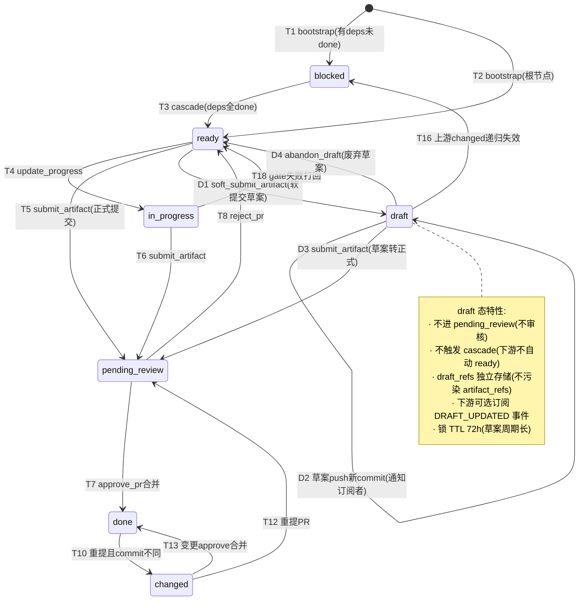
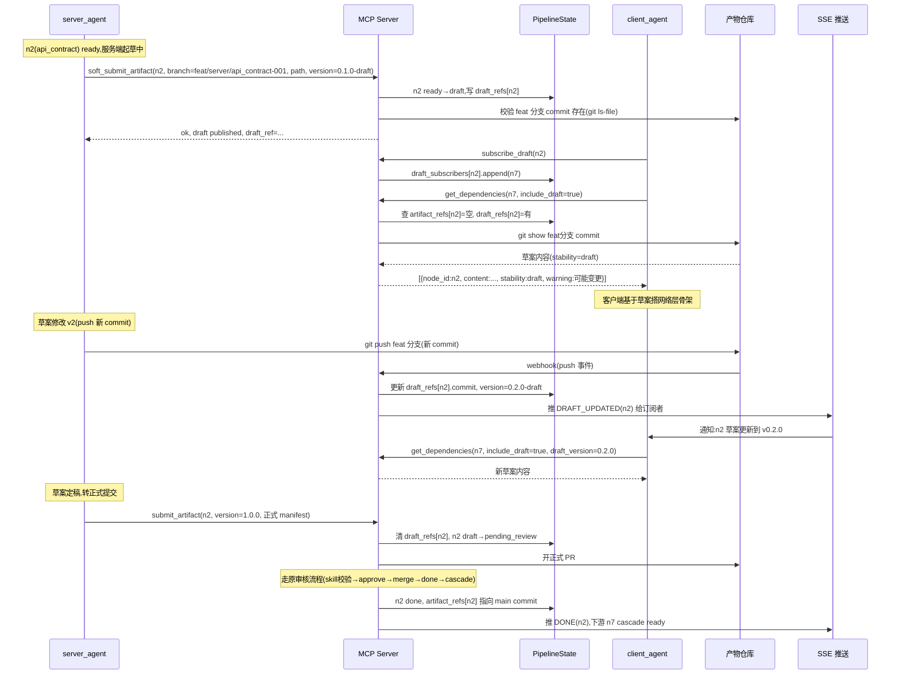
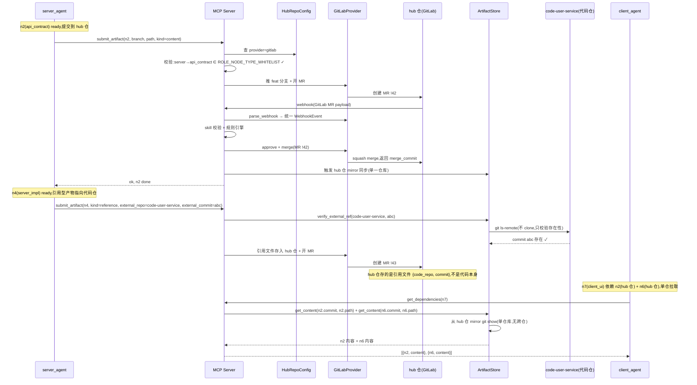
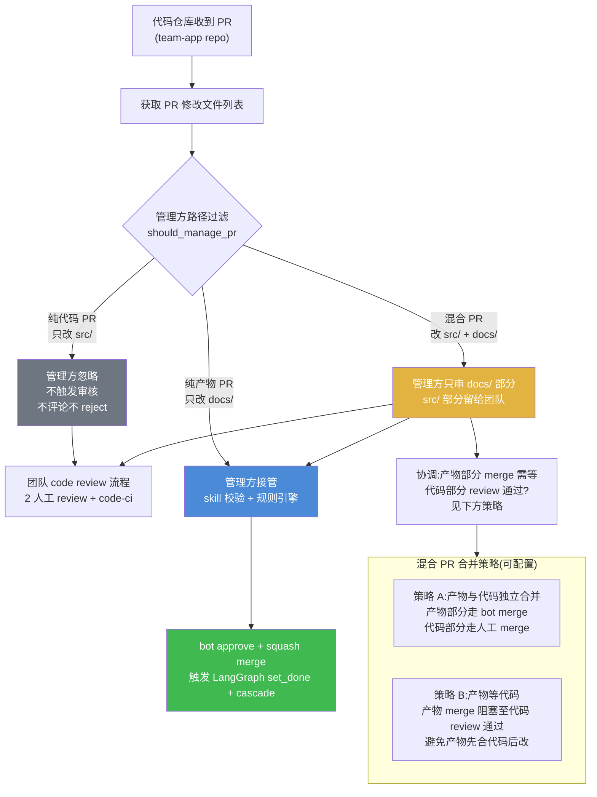

# 第三轮压力测试:草案产物 / 多产物仓库 / 代码产物合一 / 管线模板复用

> **文档性质**:对《coordination-platform-prd.md》v2.0 及其深化文档(fr1-fr6-artifact-review.md / fr2-orchestration.md / fr3-fr5-crew-skills.md)的第三轮"压力测试"场景走查报告
> **版本**:v1.0 | **日期**:2026-08-04 | **状态**:待评审
> **方法**:选取 4 个真实开发场景(编号 A13-A16,不与第一轮 16 个场景、第二轮 A1-A12 重复),逐步走查 PRD 当前设计能否处理,定位"纸上谈兵"的设计缺陷,并提出可落地修正方案
> **父文档**:[coordination-platform-prd.md](../coordination-platform-prd.md)
> **关联深化**:[fr1-fr6-artifact-review.md](../deep-dive/fr1-fr6-artifact-review.md) | [fr2-orchestration.md](../deep-dive/fr2-orchestration.md) | [fr3-fr5-crew-skills.md](../deep-dive/fr3-fr5-crew-skills.md)
> **核心原则**:需求 9"产物完全自由"——产物怎么定义由各端自己决定;设计只提供 figma 链接即可;客户端/服务端开发不限制方式。管理方不限制内容格式,只做管理约束。

---

## 0. 走查方法说明

第一轮(scenario-*.md 5 份)覆盖节点粒度、依赖模型、跨管线共享等结构性问题;第二轮(round2-scenario-concurrency / crossrepo-link / evolution / migration-ops 4 份,A1-A12)覆盖并发竞争、跨仓库引用、演进迁移、运维操作。本轮 4 个场景聚焦于**"产物自由"与"管理约束"的边界张力**以及**"通用性"的实现机制缺失**,选取前两轮未触及的 4 个真实情境:

| 场景 | 核心挑战 | 压测的 PRD 设计点 |
|---|---|---|
| A13 | 草案产物(未完成但要共享给下游预览) | 状态机 7 态无 draft、ArtifactRef 单值、节点锁 TTL、get_dependencies 拉取边界 |
| A14 | 多产物仓库(不同团队用不同 git 托管) | 单仓库假设、webhook 跨托管适配、CI 注入、角色→仓库权限、跨仓库 git show |
| A15 | 代码仓库与产物仓库合一(混合仓库) | 需求 6"独立"语义、webhook 路径过滤、CI 目录白名单、分支保护叠加、审核边界声明 |
| A16 | 管线模板复用(80% feature 走标准流程) | 模板抽象缺失、pipeline.yaml 无继承/参数化、模板版本化与实例化关系、模板审核、通用性实现机制 |

每个场景按 **场景描述 → PRD 走查 → 设计缺陷 → 修正方案 → 设计图** 组织,所有缺陷均可定位到 PRD 具体章节(含行号)。最后附**缺陷汇总表**。

---

## 1. 场景 A13:草案产物(产物未完成但要共享给下游预览)

### 1.1 场景描述

**业务背景**:登录功能管线中,`api_contract` 节点(n2)依赖 `product_spec`(n1,n1 已 done)。下游 `client_ui`(n7)依赖 `api_contract` + `design_asset`。

服务端团队正在起草 `api_contract`,但**契约尚未定稿**(还在和产品讨论字段命名、错误码),预计还要 2-3 天才能正式提交。客户端团队为了加速并行,想**基于当前草案**先把网络层骨架搭起来(URL 拼接、错误码枚举、模型映射),等服务端正式版出来再对齐细节。

**服务端的诉求**:
- 不想提交"正式 PR"——草案还会改,提了正式 PR 进 `pending_review` 会被 skill 校验(如 `required_fields` 缺失、字段不全)reject,还要消耗审核配额
- 但又想让客户端看到当前草案,避免客户端瞎猜

**客户端的诉求**:
- 愿意基于草案开发,接受"草案变更我要跟着改"的风险
- 需要在草案变更时收到通知,而不是等正式版 done 才知道

**关键特征**:需求 9 说"产物完全自由",产物的**完成度**也应该是自由的——草案 / 正式 / 废弃都是产物的合理状态。但 PRD 的状态机只有 ready → pending_review → done,没有"草案"概念。

### 1.2 PRD 走查

#### 走查点 1:状态机没有 draft 态

主 PRD §2 术语表(第 86 行):

> 状态机:节点状态流转:blocked → ready → pending_review → done / changed

fr2-orchestration.md §2.1(第 59 行)穷举了 7 态:`blocked` / `ready` / `pending_review` / `in_progress` / `review` / `done` / `changed`。fr2 §2.2(第 88-107 行)的非法转移防护表里,所有"非 pending_review → done"路径都被拒绝。

**结论**:草案无立身之处。要么走 `ready → pending_review`(提交正式 PR,被审核),要么不提交(草案留在本地 feat 分支,下游 `get_dependencies` 拉不到)。

#### 走查点 2:正式 PR 会被 skill 校验 reject

fr1-fr6 §3.3 manifest JSON Schema(第 266-444 行)规定 `required` 字段含 `title` / `version` / `source` / `toolspec` / `deps` / `created_at` / `submitter`。fr1 §4.1.1 规则 `R_META_REQUIRED`(priority 100, on_fail=reject)会校验这些字段全存在。

fr3-fr5 §6.2 `api-contract-skill`(第 711-749 行)guide 建议 api_contract 含"端点、schema、错误码"。草案阶段这些大概率不全。

**结论**:服务端若提正式 PR,`R_META_REQUIRED` / `R_DEPS_DONE` 等规则会 reject。草案根本进不了审核门。

#### 走查点 3:get_dependencies 只拉 main 上的 commit

主 PRD §6.5 `get_dependencies`(第 819-834 行):

```json
"description": "查上游产物内容(git show 拉取),供 agent 参考"
```

fr1 §2.3.1(第 169-180 行):

> 管理方 ArtifactRef 只指向"当前生效版本"的 commit,旧版本文件保留在仓库但不被引用。

**结论**:`get_dependencies` 拉 `artifact_refs[node_id].commit`(即 main 上已合并的 commit)。草案在 feat 分支,未合并,`artifact_refs[n2]` 为空,客户端 `get_dependencies(n7)` 拿不到 n2 的草案内容。

#### 走查点 4:节点锁 TTL 与草案长期持有矛盾

fr1 §5.2.1(第 784-803 行):

> 节点 `ready` 时,第一个调 `submit_artifact` 的 agent 获得锁……锁有 TTL(默认 12 小时,可配置),超时自动释放。

**结论**:服务端想长期持有草案(2-3 天)持续修改,但节点锁 TTL 12h,超时自动释放。草案场景下锁语义不适用——草案不是"独占编辑权",而是"持续预览"。

#### 走查点 5:草案变了下游怎么办

fr2 §2.1 T10(第 72 行):`done → changed` 是"已 done 产物被重新提交"。fr1 §5.3.3 依赖失效:依赖节点 `changed` 时,pending PR 自动 reject。

**结论**:`changed` 机制只针对 `done` 节点重提。草案从未 done,草案变更不触发任何下游通知。客户端无法感知草案 v1 → v2 的变化。

#### 走查点 6:草案与正式版如何在产物仓库共存

fr1 §2.3.1(第 169-180 行)示例:

```
api_contract/
├─ 001_login-contract.yaml      # n2 v1.0.0(commit a1b2c3)
├─ 002_login-contract.yaml      # n2 v1.1.0(变更)
└─ 003_login-contract.yaml      # n2 v2.0.0(breaking)
```

`ArtifactRef` 是 `dict[str, ArtifactRef]`(node_id → 单值引用),只指向"当前生效版本"。

**结论**:若草案与正式版都要存,同一 node_id 有 draft + final 两份产物,但 ArtifactRef 单值只能指向一份。数据模型无法表达"草案 + 正式版并存"。

### 1.3 设计缺陷

| # | 缺陷 | 定位 |
|---|---|---|
| D13.1 | 状态机缺 `draft` 态,产物完成度被强制二元化(要么没提交、要么正式提交审核) | fr2 §2.1(第 59 行)、主 PRD §2(第 86 行) |
| D13.2 | 无"软提交(soft submit)"机制——提交即进 `pending_review` 即被审核,草案无法"提交但不审核" | 主 PRD §6.1 `submit_artifact`(第 744-764 行)、fr2 T5/T6(第 67-68 行) |
| D13.3 | `ArtifactRef` 单值,无法同时表达 draft + final,下游无法选择"是否接受草案依赖" | 主 PRD §5.1(第 698-705 行)、fr1 §2.3.1(第 169-180 行) |
| D13.4 | `get_dependencies` 只拉 main commit,拉不到 feat 分支草案,下游预览机制缺失 | 主 PRD §6.5(第 819-834 行) |
| D13.5 | 节点锁 TTL 12h 与草案长期持有矛盾,草案场景锁语义错位 | fr1 §5.2.1(第 784-803 行) |
| D13.6 | `changed` 机制只针对 `done` 节点,草案变更无下游通知机制 | fr2 §2.1 T10(第 72 行)、fr1 §5.3.3(第 863-871 行) |
| D13.7 | 需求 9"产物自由"未延伸到"产物完成度自由",草案/正式/废弃的产物状态未纳入状态机 | 主 PRD §1.3(第 57 行)、§1.4(第 64-72 行) |

### 1.4 修正方案

#### 修正 1:状态机新增 `draft` 态 + 软提交工具

在 7 态基础上新增 `draft` 态,作为 `ready` 的并行分支(不进 `pending_review`):

| 转移 | 触发 | Guard | 副作用 |
|---|---|---|---|
| `ready` → `draft` | `soft_submit_artifact`(新工具) | 持锁者调用;产物文件在 feat 分支存在 | 写 `draft_refs[node_id]`(新字段,指向 feat 分支 commit);发 `DRAFT_PUBLISHED` event;**不进 pending_review,不触发 cascade** |
| `draft` → `draft` | 草案 push 新 commit | 同分支 | 更新 `draft_refs[node_id].commit`;发 `DRAFT_UPDATED` event;通知订阅者 |
| `draft` → `pending_review` | `submit_artifact`(正式提交) | skill 校验通过(草案可能字段不全,正式提交必须补全) | 清 `draft_refs[node_id]`;走原 T5 转移 |
| `draft` → `ready` | `abandon_draft` | 持锁者调用 | 清 `draft_refs[node_id]`;发 `DRAFT_ABANDONED` event;释放锁 |
| `draft` → `blocked` | 上游 `changed` 递归失效 | T16 既有逻辑 | 清 `draft_refs`;草案作废 |

**关键**:`draft` 态不触发 cascade——下游不会因草案发布而自动 ready(草案不是生效产物)。下游是否用草案,由下游自己声明。

#### 修正 2:PipelineState 新增 `draft_refs` + `draft_subscribers`

```python
class PipelineState(TypedDict):
    # ... 既有字段
    draft_refs: dict[str, DraftRef]            # node_id → 草案引用(feat 分支 commit)
    draft_subscribers: dict[str, list[str]]    # node_id → 订阅下游 node_id 列表

class DraftRef(TypedDict):
    node_id: str
    repo: str
    branch: str            # feat 分支(未合并)
    path: str
    commit: str            # feat 分支最新 commit
    version: str           # 草案版本(如 0.1.0-draft,允许 0.x.y)
    stability: str         # "draft" | "preview" | "abandoned"
    published_at: str
    updated_at: str
    trace_id: str
```

#### 修正 3:get_dependencies 支持 `include_draft` 参数

```json
{
  "name": "get_dependencies",
  "inputSchema": {
    "properties": {
      "node_id": {"type": "string"},
      "include_draft": {"type": "boolean", "default": false, "description": "是否拉取上游草案(feat 分支 commit)"},
      "draft_version": {"type": "string", "description": "指定草案版本(可选)"}
    }
  }
}
```

- `include_draft=false`(默认):行为不变,拉 `artifact_refs` 的 main commit
- `include_draft=true`:若上游 `artifact_refs` 为空但 `draft_refs` 有值,拉 feat 分支 commit(git show feat 分支);返回时标记 `stability=draft`,提示"草案内容,可能变更"

#### 修正 4:草案变更通知机制

草案 push 新 commit 时,webhook 触发管理方:
1. 更新 `draft_refs[node_id].commit`
2. 查 `draft_subscribers[node_id]`,向每个订阅下游发 `DRAFT_UPDATED` event(SSE 推送 + 飞书/Slack 通知)
3. 订阅下游可选择:a) 忽略,继续用旧草案;b) 拉新草案更新本地实现;c) 取消订阅

下游通过新工具 `subscribe_draft(node_id)` / `unsubscribe_draft(node_id)` 管理订阅。

#### 修正 5:节点锁对 draft 态的语义调整

`draft` 态下锁语义改为"草案发布权"(谁发布的草案谁负责更新),TTL 可配置更长(默认 72h,因草案周期长);正式 `submit_artifact` 时锁语义回到"编辑独占权"。`abandon_draft` 主动释放锁。

#### 修正 6:ArtifactRef 增加 `stability` 字段(向后兼容)

```python
class ArtifactRef(TypedDict):
    node_id: str
    repo: str
    path: str
    commit: str
    toolspec_framework: str
    trace_id: str
    stability: str    # 新增:"stable"(默认)| "draft"(草案合并标记,极少用)
```

`artifact_refs` 仍只指向生效版本(stable);草案走独立的 `draft_refs`,不污染 `artifact_refs` 单值语义。这样既满足"草案 + 正式并存",又不破坏既有 ArtifactRef 单值约束。

### 1.5 设计图:草案产物状态机与下游预览流程





---

## 2. 场景 A14:跨部门协同——单一产物 hub 仓 + 多代码仓

> **设计修正说明**:经评审,产物仓库采用**单一 hub 仓**模型(由管理方统一管理,各端共同提交),而非"多产物仓库"。理由:(1) 产物仓库是信息同步枢纽,多仓会导致产物散落、依赖追溯困难;(2) 各端**代码仓库**天然多仓(各业务方独立),但产物需要集中才能高效编排;(3) 单 hub 仓 + GitProvider 抽象,既支持任意 git 托管(GitHub/GitLab/Bitbucket),又保证产物集中管理。

### 2.1 场景描述

**业务背景**:大公司,部门墙明显。一个跨部门 feature"统一登录"涉及服务端、设计、客户端、产品四端。

**关键区分——两种仓库**:

| 仓库类型 | 数量 | 归属 | 存放内容 | 管理方角色 |
|---|---|---|---|---|
| **产物 hub 仓**(唯一) | **1 个** | 管理方管辖 | 所有产物(product_spec/api_contract/design_asset/client_ui/...) | 全权管理(审核/合并/分支保护) |
| **代码仓**(多个) | N 个 | 各业务方独立 | 各端源代码 | 不归管理方管(代码 review 在各仓自己做) |

各端代码仓库示例:

| 代码仓 | git 托管 | 归属部门 | 说明 |
|---|---|---|---|
| code-user-service | GitLab 内网 | 服务端中台 | user-service 源码 |
| code-order-service | GitLab 内网 | 服务端中台 | order-service 源码 |
| design-figma | Figma(非 git) | 设计中心 | 设计源文件(产物只提交 figma 链接) |
| code-ios-app | GitHub 企业版 | 客户端团队 | iOS 源码 |
| code-android-app | GitHub 企业版 | 客户端团队 | Android 源码 |

**团队诉求**:
- 各端代码仓库独立(合规、审计、网络隔离)——**代码仓多仓**
- 产物集中到一个 hub 仓,方便依赖编排和信息同步——**产物仓单仓**
- hub 仓由管理方管理,各端往 hub 仓提 PR 提交产物
- hub 仓可以是任意 git 托管(GitHub/GitLab/Bitbucket),由组织选择
- 代码仓的 commit 引用(如 server_impl 产物)指向代码仓,产物内容(如 api_contract)存在 hub 仓

**关键特征**:产物 hub 仓是"信息同步枢纽",各端代码仓是"业务实现独立区"。管理方只管 hub 仓,不碰代码仓(代码仓 commit 引用只校验存在性)。

### 2.2 PRD 走查

#### 走查点 1:产物仓库假设单仓(符合),但未明确"hub 仓"定位

主 PRD §5.1 `ArtifactRef`(第 698-705 行):

```python
class ArtifactRef(TypedDict):
    repo: str                    # 产物仓库地址
```

`repo` 是单个 string。fr1 §1.1(主 PRD 第 152-174 行)仓库结构示例只有一个 `artifact-repo/`,9 种产物类型目录都在这一个仓库下。

**结论**:PRD 数据模型**已假设单产物仓库**,这与"单一 hub 仓"设计一致。但 PRD 没有明确:
- 这个仓库是"hub 仓"(各端共同提交)还是"管理方私有仓"(只管理方写)
- 各端如何往 hub 仓提交(分支命名/权限)
- hub 仓的 git 托管类型(GitHub/GitLab)是否可配置
- 代码仓引用(如 server_impl 指向 code-user-service)与产物仓的区分

#### 走查点 2:webhook 只适配 GitHub 语义

主 PRD §FR6.1(第 489-497 行):

> PR 提交 → webhook 通知管理方 → 解析 PR 模板(node_id/path/deps)

fr1 §8.1.3(第 1166-1199 行)CI 配置示例只给了 GitHub Actions(`.github/workflows/artifact-ci.yml`)。

**结论**:hub 仓若选用 GitLab 或 Bitbucket,webhook payload、PR 模板、PR API、分支保护 API 全部不同。PRD 硬编码 GitHub 语义,hub 仓无法选用其他 git 托管。需要 GitProvider 抽象层。

#### 走查点 3:CI 校验只给 GitHub Actions 示例

fr1 §8.1.1(第 1130-1145 行)CI 检查项 CI-1~CI-11。fr1 §8.1.3 只给 GitHub Actions 示例。

**结论**:hub 仓选用 GitLab 时,`.gitlab-ci.yml` 配置缺失。`coord-ci` 本身平台无关,但注入语法需按平台翻译。

#### 走查点 4:各端往 hub 仓提交的权限未定义

fr3-fr5 §2.4(第 228-238 行)工具权限矩阵:

> `submit_artifact`:`repo` 必须是注册的产物仓库

但"注册的产物仓库"是 hub 仓(单数),各端都往同一个仓提交。当前权限只校验 `node_type` 白名单(server → {api_contract, server_impl, server_test}),不校验"各端只能提交本端产物类型"——server agent 理论上能提交 design_asset 到 hub 仓。

**结论**:hub 仓是共享仓,需要"各端只能提交本端 node_type"的权限校验(角色→node_type 映射),而非"角色→仓库"映射(因为只有一个仓)。

#### 走查点 5:代码仓引用 vs 产物仓内容的区分

`server_impl` 产物是"代码仓 commit 引用"(如 `{"code_repo": "code-user-service", "commit": "abc123"}`),这个引用文件本身存在 hub 仓,但指向的是代码仓。`api_contract` 产物是契约文件,直接存在 hub 仓。

**结论**:ArtifactRef 需要区分:
- **内容型产物**(api_contract/design_asset/product_spec):内容在 hub 仓,ArtifactRef.repo = hub 仓
- **引用型产物**(server_impl/client_ui):引用文件在 hub 仓,但引用指向代码仓。ArtifactRef 指向 hub 仓的引用文件,引用文件内容记录代码仓 commit

#### 走查点 6:hub 仓的 git 托管类型未配置化

PRD 假设 hub 仓是 GitHub(从 CI 配置推断),但没有"hub 仓托管类型"的配置项。

**结论**:需要 HubRepoConfig(单一配置,非 RepoRegistry),声明 hub 仓的 url/provider/credential/branch_protection。

### 2.3 设计缺陷(修正后)

| # | 缺陷 | 定位 | 修正后状态 |
|---|---|---|---|
| D14.1 | PRD 未明确"hub 仓"定位(各端共享提交 vs 管理方私有) | 主 PRD §5.1 + fr1 §1.1 | **需修正**:明确 hub 仓为各端共享,管理方管辖 |
| D14.2 | webhook/PR 模板/PR API 硬编码 GitHub 语义,hub 仓无法选其他托管 | 主 PRD §FR6.1 + fr1 §8.1.3 | **需修正**:引入 GitProvider 抽象 |
| D14.3 | CI 注入只给 GitHub Actions,hub 仓选 GitLab 时缺配置 | fr1 §8.1.3 | **需修正**:提供各平台 CI 模板 |
| D14.4 | 分支保护规则只给规则表,跨平台落地未设计 | fr1 §1.2 | **需修正**:GitProvider 适配各平台分支保护 API |
| D14.5 | 各端往 hub 仓提交时,角色→node_type 权限未校验(可越权提他端产物) | fr3-fr5 §2.4 | **需修正**:submit 时校验 caller_role → node_type |
| D14.6 | 代码仓引用 vs 产物仓内容未区分,ArtifactRef 语义模糊 | 主 PRD §5.1 | **需修正**:ArtifactRef 区分内容型/引用型 |
| D14.7 | ~~需求 6 多产物仓库~~ | — | **已解决**:采用单一 hub 仓,需求 6"独立"指"独立于管理层" |

> **注**:原 D14.1/D14.6(多仓库 clone/mirror)在单一 hub 仓模型下**不再存在**——管理方只需 clone 一个 hub 仓。代码仓引用只做 `git ls-remote` 存在性校验,不 clone 代码仓。

### 2.4 修正方案

#### 修正 1:明确 hub 仓定位 + HubRepoConfig(单一配置,非 RepoRegistry)

主 PRD §1.2 + §5.1 修正为:

> 产物管理通过**独立于管理层的单一 hub 仓**进行。hub 仓由管理方管辖,各端共同提交(各端只能提交本端产物类型)。hub 仓可选任意 git 托管(GitHub/GitLab/Bitbucket),由组织通过 HubRepoConfig 配置。代码仓库不归管理方管,代码 commit 引用作为"引用型产物"存入 hub 仓。

```yaml
# config/hub-repo.yaml(单一配置,非多仓注册表)
hub_repo:
  url: git@gitlab.internal:platform/artifact-hub.git   # 任意 git 托管
  provider: gitlab              # gitlab | github | bitbucket | gitea
  credential_ref: vault://artifact/hub-repo            # Vault 凭证引用
  webhook_secret_ref: vault://webhook/hub-repo
  branch_protection:
    main:
      require_pr: true
      min_reviewers: 1          # 管理方 bot
      squash_merge: true
  ci_config_path: .gitlab-ci.yml
  directory_layout:
    version: 2                  # features/{pipeline_id}/ 命名空间
    pattern: "features/{pipeline_id}/{node_type}/{seq}_{slug}.{ext}"
```

`ArtifactRef` 保持 `repo` 字段(指向 hub 仓),增加 `artifact_kind` 区分内容型/引用型:

```python
class ArtifactRef(TypedDict):
    node_id: str
    repo: str                   # hub 仓地址(单一)
    path: str                   # 产物在 hub 仓内路径
    commit: str                 # hub 仓 merge commit
    artifact_kind: str          # "content"(内容型) | "reference"(引用型)
    # 引用型产物额外字段(artifact_kind="reference" 时):
    external_repo: str | None   # 代码仓地址(引用型指向代码仓)
    external_commit: str | None # 代码仓 commit hash
    toolspec_framework: str
    trace_id: str
```

#### 修正 2:引入 GitProvider 抽象层(hub 仓单仓,但适配多托管)

hub 仓是单一仓库,但 git 托管类型可配置。GitProvider 抽象屏蔽托管差异:

```python
class GitProvider(Protocol):
    """git 托管抽象层,屏蔽 GitHub/GitLab/Bitbucket 差异(hub 仓单仓)"""
    def parse_webhook(self, headers: dict, body: bytes) -> WebhookEvent: ...
    def verify_webhook_signature(self, headers: dict, body: bytes, secret: str) -> bool: ...
    def get_pr_detail(self, pr_id: str) -> PRDetail: ...           # 无需 repo_id(单仓)
    def approve_pr(self, pr_id: str, bot_token: str) -> None: ...
    def merge_pr(self, pr_id: str, merge_method: str) -> str: ...  # 返回 merge commit
    def close_pr(self, pr_id: str) -> None: ...
    def comment_pr(self, pr_id: str, body: str) -> None: ...
    def set_branch_protection(self, branch: str, rules: dict) -> None: ...
    def get_pr_template(self) -> str | None: ...
    def ls_file_at_ref(self, ref: str, path: str) -> bytes: ...    # hub 仓 git show
    def ls_remote(self, external_repo: str, commit: str) -> bool: ...  # 代码仓存在性校验

class GitHubProvider(GitProvider): ...
class GitLabProvider(GitProvider): ...
class BitbucketProvider(GitProvider): ...
```

管理方启动时按 `HubRepoConfig.provider` 实例化对应 GitProvider。webhook 入口、PR 模板解析、approve_pr 合并、分支保护都走 GitProvider,管理方核心逻辑平台无关。

#### 修正 3:CI 注入的平台无关化(hub 仓)

`coord-ci`(Python 包)平台无关。hub 仓 CI 配置按 `provider` 选择模板:

| provider | 配置文件 | 模板内容(核心) |
|---|---|---|
| github | `.github/workflows/artifact-ci.yml` | `pip install coord-ci && coord-ci check --pr $PR` |
| gitlab | `.gitlab-ci.yml` | `pip install coord-ci && coord-ci check --mr $MR` |
| bitbucket | `bitbucket-pipelines.yml` | `pip install coord-ci && coord-ci check --pr $PR` |

skill 约束(`review_rules`)在 `coord-ci` 内统一执行。`coord-ci` 输出平台无关 JSON 报告,GitProvider 翻译为各平台评论格式。

#### 修正 4:角色→node_type 权限校验(hub 仓共享,按产物类型隔离)

hub 仓是共享仓,各端都往同一个仓提交。权限校验从"角色→仓库"改为"角色→node_type"(因为只有一个仓):

```python
# 角色→node_type 白名单(已有,fr3-fr5 §2.4)
ROLE_NODE_TYPE_WHITELIST = {
    "product": ["product_spec"],
    "server": ["api_contract", "server_impl", "server_test"],
    "design": ["design_proto", "design_asset"],
    "client": ["client_ui", "client_func", "client_delivery"],
}

def authorize_submit(caller_role: str, node_type: str) -> bool:
    """hub 仓共享,校验角色只能提交本端 node_type"""
    if node_type not in ROLE_NODE_TYPE_WHITELIST.get(caller_role, []):
        return False  # 如 design 不能提交 api_contract
    return True
    # 注:无需 repo_id 校验(只有一个 hub 仓)
```

#### 修正 5:get_dependencies 只需 clone hub 仓(简化)

单一 hub 仓,管理方只需 clone/mirror 一个仓库。代码仓引用只做 `git ls-remote` 存在性校验(不 clone 代码仓):

```python
class ArtifactStore:
    """单一 hub 仓产物存储"""
    def __init__(self, hub_config: HubRepoConfig, provider: GitProvider):
        self.hub_mirror = clone_or_update(hub_config)   # 只 clone hub 仓
        self.provider = provider

    async def get_content(self, commit: str, path: str) -> bytes:
        """从 hub 仓 git show 产物内容"""
        return await git_show(self.hub_mirror, commit, path)

    async def verify_external_ref(self, external_repo: str, external_commit: str) -> bool:
        """校验代码仓 commit 存在性(不 clone,用 git ls-remote)"""
        return await self.provider.ls_remote(external_repo, external_commit)
```

`get_dependencies` 调 `ArtifactStore.get_content`,所有产物内容都在 hub 仓,无需跨仓库 clone。代码仓引用存在性由 `verify_external_ref` 校验(审核时调用)。

#### 修正 6:明确需求 6"独立"语义

主 PRD §1.2 修正为:

> 产物管理通过**独立于管理层的单一 hub 仓**进行(管理方管辖但不持有代码,各端共同提交产物)。hub 仓可选任意 git 托管(GitHub/GitLab/Bitbucket)。**代码仓库不归管理方管**,各业务方独立维护,代码 commit 引用作为"引用型产物"存入 hub 仓。

### 2.5 设计图:单一 hub 仓 + 多代码仓架构

```mermaid
graph TB
    subgraph MGMT["管理方(Coordination Platform)"]
        HUB[HubRepoConfig<br/>config/hub-repo.yaml<br/>单一配置]
        GP[GitProvider 抽象层]
        GH[GitHubProvider]
        GL[GitLabProvider]
        BB[BitbucketProvider]
        AS[ArtifactStore<br/>hub 仓 mirror(单一)]
        SK[Skill 校验 + 规则引擎]
        LG[LangGraph 编排]
    end

    subgraph HUBREPO["产物 hub 仓(单一,管理方管辖)"]
        HR["artifact-hub.git<br/>各端共同提交<br/>features/{pipeline_id}/..."]
    end

    subgraph CODEREPOS["代码仓(多个,各业务方独立)"]
        CA1[code-user-service<br/>GitLab]
        CA2[code-order-service<br/>GitLab]
        CA3[code-ios-app<br/>GitHub]
        CA4[code-android-app<br/>GitHub]
    end

    subgraph AGENTS["角色 Agent(往 hub 仓提交,按 node_type 隔离)"]
        PA[product_agent<br/>提 product_spec]
        SA[server_agent<br/>提 api_contract/server_impl]
        DA[design_agent<br/>提 design_proto/design_asset]
        CLA[client_agent<br/>提 client_ui/client_func]
    end

    HUB --> GP
    GP --> GH
    GP --> GL
    GP --> BB
    GP -.->|适配 hub 仓托管类型| HR

    PA & SA & DA & CLA -->|submit_artifact<br/>各端提交本端产物| HR
    HR -->|webhook| GP
    GP -->|统一 WebhookEvent| SK
    SK --> LG

    AS -->|clone/sync(单一)| HR
    LG -->|get_dependencies<br/>hub 仓 git show| AS

    SA -.->|server_impl 引用型产物<br/>指向代码仓 commit| CA1
    SA -.-> CA2
    CLA -.->|client_ui 引用型产物| CA3
    CLA -.-> CA4
    AS -.->|verify_external_ref<br/>git ls-remote(不 clone)| CA1
    AS -.-> CA2
    AS -.-> CA3
    AS -.-> CA4

    style HR fill:#b3261e,color:#fff
    style HUB fill:#a371f7,color:#fff
    style AS fill:#3fb950,color:#fff
```



---

## 3. 场景 A15:产物引用同一仓库(代码仓库和产物仓库合一)

> **设计修正说明**:经评审,产物仓库采用**单一 hub 仓**模型(A14 修正)。本场景"代码产物合一"与 hub 仓集中管理原则**冲突**——产物必须在 hub 仓,不能与代码同仓。但本场景的走查仍有价值:它暴露了"管理方审核边界"问题(hub 仓 vs 代码仓),以及"小团队不想维护多仓"的真实诉求。修正方向:不支持代码产物合一,但提供"轻量 hub 仓"方案降低小团队维护成本。

### 3.1 场景描述

**业务背景**:小团队(5 人创业公司),做一个 feature"用户资料页"。团队不想维护两个仓库(代码仓库 + 产物仓库),想把产物存到代码仓库的 `docs/` 目录,代码和产物在一起:

```
team-app/                          # 代码仓库(唯一仓库)
├─ src/                            # 代码
│  ├─ api/
│  ├─ ui/
│  └─ ...
├─ docs/                           # 产物存放处(希望)
│  ├─ product_spec/
│  │  └─ 001.yaml
│  ├─ api_contract/
│  │  └─ 001.yaml
│  ├─ design_asset/
│  │  └─ 001_figma.json
│  └─ ...
├─ .github/
│  ├─ workflows/
│  │  ├─ code-ci.yml              # 代码 CI(lint/test/build)
│  │  └─ artifact-ci.yml          # 产物 CI(coord-ci)
│  └─ pull_request_template.md
└─ README.md
```

需求 6(主 PRD §1.2 第 49 行)说"产物管理通过独立 git 仓库进行",但需求 9(§1.3 第 57 行)说"产物格式中立、通用性"。小团队认为"独立"应理解为"独立于管理层"(管理方不持有内容),而非"必须与代码仓库物理分离"。

**团队诉求**:
- 代码和产物在同一仓库,PR 能同时改代码和产物(如改 API 实现同时更新 api_contract)
- 管理方只审核 `docs/` 下的产物 PR,不审核 `src/` 下的代码 PR(代码 PR 走团队自己的 code review)
- 分支保护规则:产物路径用管理方规则(1 个 bot approve),代码路径用团队规则(2 个人工 review + 代码 CI)

**关键特征**:这是需求 6 与需求 9 的边界冲突。产物仓库"独立"是硬性约束还是建议?若硬性,小团队被迫维护两个仓库,违反需求 9 的灵活性;若建议,则混合仓库的审核边界、webhook 过滤、分支保护叠加都需要设计。

### 3.1.1 修正后结论:不支持代码产物合一,提供"轻量 hub 仓"

> **评审决议**:产物仓库必须独立(hub 仓),不支持代码产物合一。理由:
> 1. **信息同步枢纽**:产物是各端协同的"单一事实源",与代码同仓会导致产物散落、跨端依赖追溯困难
> 2. **审核边界清晰**:hub 仓由管理方全权管辖(分支保护/CI/审核),代码仓归各业务方,职责分明;混合仓的 per-path 审核边界复杂且脆弱
> 3. **小团队成本可控**:hub 仓可以是 GitHub/GitLab 免费私有仓,维护成本极低(只需管理方 clone 一个仓)
> 4. **引用型产物已解决"代码关联"**:server_impl 等"引用型产物"存 hub 仓,指向代码仓 commit——代码和产物的关联通过引用保持,无需物理同仓
>
> 原走查(3.2-3.4)保留作为"为什么不支持合一"的设计依据。

### 3.2 PRD 走查

#### 走查点 1:需求 6"独立"语义模糊

主 PRD §1.2(第 49 行):

> 产物管理:通过独立 git 仓库管理所有产物内容,管理方只持有引用

主 PRD §1.4(第 64-72 行)范围边界:

> 产物仓库的分支保护 + PR 审核(做什么) | 不限制开发方用什么工具产出内容(不做什么)

fr1 §1.2(第 64-69 行)"不变的核心原则":

> 产物内容存独立 git 仓库,管理方只存引用(repo + path + commit)

**结论**:PRD 反复强调"独立 git 仓库",但"独立"的语义有两种解读:
- 解读 A(物理独立):产物仓库与代码仓库物理分离,两个仓库
- 解读 B(逻辑独立):产物内容独立于管理层(管理方不持有内容),存放位置可以是独立仓库或代码仓库子目录

PRD 未明确哪种。若解读 A,小团队场景被排除;若解读 B,则混合仓库的审核边界、CI、分支保护都需要设计,但 PRD 完全没涉及。

#### 走查点 2:webhook 没有路径过滤

主 PRD §FR6.1(第 489-497 行):

> PR 提交 → webhook 通知管理方 → 解析 PR 模板(node_id/path/deps)

fr1 §8.1.3(第 1166-1199 行)GitHub Actions 配置有 `paths` 过滤:

```yaml
on:
  pull_request:
    paths:
      - 'product_spec/**'
      - 'api_contract/**'
      # ... 9 种产物类型目录
```

但这是 **CI 触发过滤**,不是 **webhook 过滤**。管理方 webhook 收到的是整个仓库的所有 PR 事件(除非在 GitHub 侧配置 webhook 的 path 过滤,但 GitHub webhook 原生不支持 path 过滤,只有 CI 的 paths 过滤)。

**结论**:混合仓库下,代码 PR(改 `src/`)也会触发管理方 webhook,管理方会尝试解析代码 PR 的"PR 模板"(找不到 node_id)、走 skill 校验(失败)、reject——这是误伤。PRD 没有"管理方只处理产物路径下 PR"的过滤机制。

#### 走查点 3:CI 目录白名单冲突

fr1 §8.1.1(第 1130-1145 行)CI-1:

> 目录白名单:修改的目录在 9 种产物类型 + `manifests/` 内 → CI fail 若违反

fr1 §2.1.1(第 87-92 行):

> 不允许出现未在 9 种产物类型之外的目录(CI 阻断)

**结论**:混合仓库下,代码 PR 改 `src/` 目录,会触发 CI-1 "目录白名单"失败(因 `src/` 不在 9 种产物类型内)。PRD 的 CI 白名单假设仓库**只有产物目录**,混合仓库下白名单会误伤所有代码 PR。

#### 走查点 4:分支保护规则无法 per-path 叠加

fr1 §1.2(第 182-190 行)分支保护:

| 规则 | 配置 |
|---|---|
| main 分支 | 禁止直接 push,只接受 PR 合并 |
| PR 审核 | 至少 1 个管理方 bot approve |
| CI 校验 | manifest schema + skill 约束 |
| 合并方式 | squash merge |

**结论**:GitHub/GitLab 的分支保护是**仓库级**或**branch 级**的,不支持"per-path 不同规则"(如 `docs/` 要 1 bot approve、`src/` 要 2 人工 review)。混合仓库下,若仓库级要求"1 bot approve",代码 PR 也只需 1 bot approve(太松);若要求"2 人工 review",产物 PR 也要 2 人工 review(太严,违反 fr1 §1.2"至少 1 个管理方 bot approve"的自动审核设计)。

#### 走查点 5:ArtifactRef.path 限定在产物类型目录

fr1 §3.3 manifest schema `source.path`(第 346-354 行):

```json
"path": {
  "pattern": "^[a-z_]+/[0-9]{3}[_a-z0-9-]*\\.(yaml|yml|json|md|mdx)$"
}
```

**结论**:正则要求 path 形如 `api_contract/001_xxx.yaml`(产物类型目录开头)。混合仓库下产物在 `docs/api_contract/001.yaml`,前缀多了 `docs/`,不匹配正则。PRD 的 path 约束假设产物在仓库根的产物类型目录下,混合仓库需要 `docs/` 前缀。

#### 走查点 6:管理方审核边界未声明

PRD 全文假设"管理方审核该仓库的所有产物 PR",但没有"管理方管辖哪些路径"的声明机制。

**结论**:混合仓库下,管理方需要声明"我只管 `docs/` 下的 PR,`src/` 的 PR 不归我管"。PRD 没有这个声明机制,管理方默认接管整个仓库的所有 PR,与代码 PR 的团队 review 流程冲突。

### 3.3 设计缺陷

| # | 缺陷 | 定位 |
|---|---|---|
| D15.1 | 需求 6"独立 git 仓库"的"独立"语义模糊(物理独立 vs 逻辑独立),混合仓库场景被排除或未设计 | 主 PRD §1.2(第 49 行)、fr1 §1.2(第 64-69 行) |
| D15.2 | webhook 无路径过滤,混合仓库下代码 PR 会误触发管理方审核 | 主 PRD §FR6.1(第 489-497 行) |
| D15.3 | CI 目录白名单假设仓库只有产物目录,混合仓库下代码 PR 会被 CI-1 误伤 | fr1 §8.1.1 CI-1(第 1134 行)、fr1 §2.1.1(第 87-92 行) |
| D15.4 | 分支保护规则是仓库级,不支持 per-path 叠加(产物路径 vs 代码路径规则冲突) | fr1 §1.2(第 182-190 行) |
| D15.5 | `ArtifactRef.path` 正则限定产物类型目录开头,混合仓库的 `docs/` 前缀不匹配 | fr1 §3.3(第 346-354 行) |
| D15.6 | 管理方审核边界未声明,无"管辖路径"配置,默认接管整个仓库所有 PR | 主 PRD §FR6(第 483-568 行)整体 |
| D15.7 | 需求 6 与需求 9 在混合仓库场景直接冲突,PRD 未调和 | 主 PRD §1.2(第 49 行)vs §1.3(第 57 行) |

### 3.4 修正方案

#### 修正 1:明确"独立"语义 + 引入 RepoType

主 PRD §1.2 修正为:

> 产物管理通过**独立于管理层**的 git 仓库进行(管理方不持有产物内容,只持有引用)。仓库形态有两种:
> - **artifact-only 仓库**:仓库只装产物(默认,适合大团队/跨部门)
> - **hybrid 仓库**:代码与产物同仓(产物在指定子目录,适合小团队)
>
> 仓库类型由 RepoRegistry 声明,管理方按类型应用不同的审核边界与 CI 规则。

RepoRegistry 增加 `repo_type` 与 `managed_paths`:

```yaml
# config/repo-registry.yaml
repos:
  - repo_id: team-app
    url: git@github.com:team/team-app.git
    provider: github
    repo_type: hybrid            # artifact-only | hybrid
    managed_paths:               # 管理方管辖路径(hybrid 必填)
      - "docs/**"
    managed_node_types: [product_spec, api_contract, design_asset, ...]
    allowed_roles: [product, server, design, client]   # 小团队同仓库多角色
    # artifact-only 仓库:managed_paths 留空(整仓管辖)
```

#### 修正 2:webhook 路径过滤(管理方侧)

管理方 webhook 收到 PR 事件后,先按 `managed_paths` 过滤:

```python
def should_manage_pr(repo: RepoConfig, pr_files: list[str]) -> bool:
    """判断管理方是否应接管该 PR"""
    if repo.repo_type == "artifact-only":
        return True   # 整仓管辖
    # hybrid:只接管触及 managed_paths 的 PR
    for f in pr_files:
        for pattern in repo.managed_paths:
            if fnmatch(f, pattern):
                return True
    return False   # 纯代码 PR,管理方不接管
```

纯代码 PR(不触及 `docs/`)管理方不接管,直接忽略 webhook,不触发审核、不 reject、不评论——避免误伤。

混合 PR(同时改 `src/` 和 `docs/`)管理方只审核 `docs/` 部分的产物,`src/` 部分留给团队 code review(管理方对代码内容不解析,本就不关心)。

#### 修正 3:CI 目录白名单按 repo_type 区分

```python
def ci_directory_whitelist(repo: RepoConfig) -> list[str]:
    if repo.repo_type == "artifact-only":
        # 既有逻辑:9 种产物类型 + manifests/
        return NINE_ARTIFACT_TYPES + ["manifests/"]
    # hybrid:产物类型目录前缀 managed_paths + 允许代码目录
    product_dirs = [f"docs/{t}/" for t in NINE_ARTIFACT_TYPES]
    code_dirs = ["src/", "tests/", "config/"]   # 代码目录白名单(不归 CI-1 管)
    return product_dirs + code_dirs + ["manifests/"]
```

CI-1 校验逻辑调整:hybrid 仓库下,产物文件必须在 `docs/<产物类型>/` 下,代码文件必须在代码目录白名单内,二者都不在则 CI fail。

#### 修正 4:分支保护 per-path overlay

利用 GitHub 的 **rulesets**(2023+ 支持 path-based rules)或 GitLab 的 **push rules**(路径级),实现 per-path 规则叠加:

```yaml
# hybrid 仓库分支保护
branch_protection:
  main:
    base_rules:                    # 仓库级基础规则(所有 PR)
      require_pr: true
      squash_merge: true
    path_overlays:                 # 路径级叠加规则
      - paths: ["docs/**"]
        rules:
          min_reviewers: 1
          required_reviewer: mgmt-bot   # 产物 PR 需管理方 bot approve
          required_ci: [artifact-ci]
      - paths: ["src/**", "tests/**"]
        rules:
          min_reviewers: 2               # 代码 PR 需 2 人工 review
          required_ci: [code-ci]
          disallow_bot_review: true      # 代码 PR 不接受 bot review
```

GitProvider 适配器负责将 `path_overlays` 翻译为各平台原生配置(GitHub rulesets / GitLab push rules)。不支持 path-based rules 的旧平台降级为"仓库级统一规则 + 管理方 webhook 侧路径过滤兜底"。

#### 修正 5:ArtifactRef.path 正则支持 managed_paths 前缀

manifest schema `source.path` 正则放宽,支持可选前缀:

```json
"path": {
  "pattern": "^(docs/)?[a-z_]+/[0-9]{3}[_a-z0-9-]*\\.(yaml|yml|json|md|mdx)$"
}
```

或更通用地,正则从 RepoRegistry 的 `managed_paths` 动态生成:

```python
def path_regex(repo: RepoConfig) -> str:
    prefix = repo.managed_paths[0].replace("/**", "/")  # "docs/**" → "docs/"
    return f"^{prefix}[a-z_]+/[0-9]{{3}}[_a-z0-9-]*\\.(yaml|yml|json|md|mdx)$"
```

#### 修正 6:管理方审核边界显式声明

RepoRegistry 每个仓库声明 `managed_paths`,管理方启动时加载并据此过滤 webhook。Dashboard 展示每个仓库的"管辖路径",让 admin 明确管理方管什么、不管什么。审计日志记录"该 PR 因触及 managed_paths 被接管/因未触及被忽略",可追溯。

### 3.5 设计图:代码产物合一的审核边界



```mermaid
graph LR
    subgraph REPO["hybrid 仓库(team-app)"]
        SRC[src/<br/>代码]
        DOCS[docs/<br/>产物]
        CI_CODE[.github/workflows/code-ci.yml]
        CI_ART[.github/workflows/artifact-ci.yml]
    end

    subgraph BRANCH["main 分支保护(per-path overlay)"]
        BASE[基础规则<br/>require_pr + squash_merge]
        OV1[docs/ overlay<br/>1 bot approve + artifact-ci]
        OV2[src/ overlay<br/>2 人工 review + code-ci<br/>disallow bot]
    end

    subgraph MGMT["管理方"]
        REG[RepoRegistry<br/>repo_type=hybrid<br/>managed_paths=docs/**]
        FILTER[webhook 路径过滤]
        SK[skill 校验]
    end

    SRC --> OV2
    DOCS --> OV1
    OV1 --> SK
    OV2 -.->|不归管理方| TEAM[团队 review]
    DOCS --> CI_ART
    SRC --> CI_CODE

    REPO -->|webhook(所有 PR)| FILTER
    FILTER -->|触及 docs/| SK
    FILTER -->|不触及 docs/| IGNORE[管理方忽略]
    REG --> FILTER

    style OV1 fill:#4a8ad6,color:#fff
    style OV2 fill:#3fb950,color:#fff
    style FILTER fill:#e3b341,color:#fff
    style IGNORE fill:#6e7681,color:#fff
```

---

## 4. 场景 A16:管线模板复用(多个类似 feature 用同一管线模板)

### 4.1 场景描述

**业务背景**:某产品团队复盘过去半年的 30 个 feature,发现 **80% 的 feature 都走"标准流程"**:

```
product_spec → api_contract → design_proto → design_asset → server_impl → client_ui → client_func → client_delivery
```

每个 feature 新建时,都要手写一遍 `pipeline.yaml`(8 个节点 + 7 条依赖边 + 各节点 role/type/deps),重复且易错:

- 节点 id 要重新编(n1-n8)
- 依赖关系要重新声明
- 偶尔漏掉某个依赖边(如忘声明 client_ui 依赖 design_asset),导致下游不阻塞、联调才发现
- 不同 feature 的管线"应该一样但实际有细微差异"(人为失误)

**团队诉求**:
- 定义"标准流程模板",新 feature 实例化模板即可,只填 feature 特有参数(如 approver 是谁、gate 的 coverage_min 阈值)
- 某些 feature 不需要全套(如纯后端 feature 不需要 design_proto/design_asset/client_ui),模板支持"裁剪"
- 模板升级了(如标准流程新增 `security_review` 节点),已实例化的管线要不要同步更新?
- 跨团队共享模板(如设计团队的"设计交付标准流程"模板),怎么管理?

**关键特征**:主 PRD §1.3(第 57 行)宣称"通用性:覆盖服务端/客户端/UI 设计全流程"——但"通用性"靠什么机制实现?PRD 没有管线模板抽象,每个 `pipeline.yaml` 都是独立的,通用性只是"理论上能描述任意流程",而非"提供标准流程的复用机制"。这是"纸上谈兵"的典型:声称通用,实则无复用机制。

### 4.2 PRD 走查

#### 走查点 1:无管线模板抽象

主 PRD §5.1 `Pipeline`(第 664-693 行):

```yaml
pipeline:
  id: "login-feature"
  name: "登录功能全链路"
  nodes:
    - id: "n1"
      type: "product_spec"
      role: "product"
      deps: []
    # ... 8 个节点逐个声明
  edges: []  # 由 deps 推导
```

fr2 §7.1(第 730-758 行)管线加载流程:`读取 pipeline.yaml → 解析 YAML → Pipeline 对象 → DAG 校验 → 构建 StateGraph`。

**结论**:每个 `pipeline.yaml` 是完全独立的声明,无 `extends` / `template` 字段。30 个 feature 要写 30 份几乎一样的 pipeline.yaml,无复用机制。

#### 走查点 2:pipeline.yaml 无继承/参数化机制

fr2 §7.5(第 813-827 行)热重载:

> `pipeline.yaml` 进 git,webhook 触发重载。重载用新 `pipeline_id`(版本化,如 `login-feature@v2`)。

**结论**:
- pipeline.yaml 是静态声明,节点 id / type / role / deps 全部硬编码
- 无参数化:approval 节点的 `approver`、gate 节点的 `policy.coverage_min` 每个 feature 都要手填,无法用 `${param}` 占位
- 无继承:无法 `extends: standard-pipeline-template` 后只覆盖差异(如裁剪 design 节点)

#### 走查点 3:模板版本化与实例化管线关系未定义

fr2 §7.5(第 820-822 行):

> 修改 deps:pipeline.yaml git push → 重新校验无环 → 重新计算下游 ready 状态 → 发 DEPS_CHANGED event

fr2 §7.5(第 825-827 行):

> 重载用新 `pipeline_id`(版本化,如 `login-feature@v2`),旧 pipeline_id 继续运行至完成或手动迁移

**结论**:PRD 的"版本化"是**单管线实例**的版本化(login-feature@v1 → @v2),不是**模板**的版本化。模板升级(standard-template@v1 → @v2)后,已用 v1 实例化的 30 个管线要不要同步升级?PRD 无此机制。若强制同步,可能破坏运行中管线;若不同步,模板升级只对新 feature 生效,旧 feature 用旧模板,长期分化。

#### 走查点 4:模板存储位置未定义

fr1 §2.4.3(第 228-237 行)`repo-meta.yaml` 是产物仓库元数据。主 PRD §5.2(第 730-738 行)存储方案:

| 数据 | 存储 |
|---|---|
| Constraint Skills | 文件系统(skills/ 目录) |
| 产物内容 | 产物仓库(git) |

**结论**:管线模板存哪?PRD 没有"模板仓库"或"模板目录"的设计。若存管理方仓库的 `templates/` 目录,模板变更走管理方 PR(人工评审);若存产物仓库,与产物混在一起。PRD 未定义。

#### 走查点 5:模板审核机制缺失

fr1 §FR6(第 483-568 行)审核机制只针对**产物 PR**。模板本身不是产物(不对应任何 node_type),不进 skill 校验流程。

**结论**:模板错了(如标准流程漏了 client_ui 对 design_asset 的依赖),所有实例化的管线都错。模板变更无审核机制,admin 改模板直接生效,风险高。模板应该有审核 + dry-run 校验(用模板实例化一个测试管线,跑一遍校验)。

#### 走查点 6:跨团队模板共享未设计

需求 1(主 PRD §1.3 第 57 行)"通用性"暗示跨团队复用,但 PRD 无团队级模板隔离/共享机制。

**结论**:设计团队有自己的"设计交付标准流程"模板(只含 design_proto → design_asset → handoff),客户端团队有"客户端交付标准流程"模板。模板如何跨团队共享?权限?版本?PRD 未设计。

#### 走查点 7:模板裁剪机制缺失

标准流程 8 节点,纯后端 feature 不需要 design_proto/design_asset/client_ui。PRD 无"模板裁剪"机制——只能手写裁剪后的 pipeline.yaml,又回到"重复且易错"的问题。

### 4.3 设计缺陷

| # | 缺陷 | 定位 |
|---|---|---|
| D16.1 | 无管线模板抽象,每个 pipeline.yaml 独立,通用性(需求 1)无复用机制支撑 | 主 PRD §1.3(第 57 行)、§5.1(第 664-693 行) |
| D16.2 | pipeline.yaml 无继承(`extends`)与参数化(`${param}`)机制 | fr2 §7.1(第 730-758 行) |
| D16.3 | 模板版本化与实例化管线的关系未定义(模板升级是否同步到实例) | fr2 §7.5(第 813-827 行) |
| D16.4 | 模板存储位置未定义(管理方仓库 / 产物仓库 / 独立模板仓库) | 主 PRD §5.2(第 730-738 行) |
| D16.5 | 模板审核机制缺失,模板变更无 skill 校验 + dry-run,错模板级联影响所有实例 | 主 PRD §FR6(第 483-568 行) |
| D16.6 | 跨团队模板共享与权限未设计 | 主 PRD §1.3(第 57 行) |
| D16.7 | 模板裁剪机制缺失(标准流程裁剪为子流程)缺失 | fr2 §7.1(第 730-758 行) |
| D16.8 | fr2 §7 管线加载校验无"模板实例化后的校验"(模板本身可能非法) | fr2 §7.6(第 829-843 行) |

### 4.4 修正方案

#### 修正 1:引入 PipelineTemplate 抽象

```yaml
# templates/standard-fullstack.yaml
name: standard-fullstack
version: "1.2.0"
description: 全栈 feature 标准流程模板(8 节点)
author: platform-team

# 参数定义(实例化时填充)
parameters:
  - name: approver_contract
    type: string
    description: api_contract 审批人
    required: true
  - name: approver_delivery
    type: string
    description: client_delivery 审批人
    required: true
  - name: coverage_min
    type: integer
    default: 80
    description: gate 覆盖率阈值
  - name: skip_design
    type: boolean
    default: false
    description: 是否裁剪设计节点(纯后端 feature)

# 节点骨架(id 用占位符,实例化时按序号生成)
nodes:
  - id: "${seq.product}"
    type: product_spec
    role: product
    deps: []
  - id: "${seq.contract}"
    type: api_contract
    role: server
    deps: ["${seq.product}"]
  - id: "${seq.proto}"
    type: design_proto
    role: design
    deps: ["${seq.product}"]
    condition: "${not skip_design}"    # 条件节点:skip_design=true 时裁剪
  - id: "${seq.asset}"
    type: design_asset
    role: design
    deps: ["${seq.proto}"]
    condition: "${not skip_design}"
  - id: "${seq.impl}"
    type: server_impl
    role: server
    deps: ["${seq.contract}"]
  - id: "${seq.ui}"
    type: client_ui
    role: client
    deps: ["${seq.contract}", "${seq.asset}"]
    condition: "${not skip_design}"
    deps_dynamic: "${skip_design ? [contract] : [contract, asset]}"  # 裁剪时依赖收缩
  - id: "${seq.func}"
    type: client_func
    role: client
    deps: ["${seq.ui}", "${seq.impl}"]
  - id: "${seq.delivery}"
    type: client_delivery
    role: client
    deps: ["${seq.func}"]
  # 控制节点
  - id: "${seq.gate}"
    type: gate
    role: control
    deps: ["${seq.impl}"]
    policy: { lint: true, test: true, coverage_min: "${coverage_min}" }
  - id: "${seq.approval}"
    type: approval
    role: control
    deps: ["${seq.delivery}"]
    approver: "${approver_delivery}"
```

#### 修正 2:pipeline.yaml 支持 extends + override

```yaml
# pipelines/login-feature.yaml
extends: standard-fullstack@1.2.0       # 继承模板(锁定版本)
id: login-feature
name: 登录功能全链路

# 实例化参数
parameters:
  approver_contract: reviewer-alice
  approver_delivery: reviewer-bob
  coverage_min: 85                       # 本 feature 收紧覆盖率
  skip_design: false

# 覆盖差异(可选)
overrides:
  - node_id: "${seq.approval}"
    approver: reviewer-carol             # 本 feature 换审批人
  - add_node:                            # 本 feature 新增安全审查节点
      id: n_sec
      type: approval
      role: control
      deps: ["${seq.contract}"]
      approver: security-team
  - insert_edge:                         # 在 contract done 后插入 n_sec
      from: "${seq.contract}"
      to: "n_sec"
      before: "${seq.impl}"              # n_sec done 后才 impl
```

实例化流程:
1. 加载 `extends` 指向的模板(锁定版本 `@1.2.0`)
2. 用 `parameters` 填充模板参数占位符
3. 按 `condition` 裁剪节点(skip_design=true 时移除 design 节点)
4. 应用 `overrides`(覆盖节点配置、新增节点、插入边)
5. 生成最终的 `pipeline.yaml`(展开后的、无占位符的、可直接加载的)
6. 走 fr2 §7 既有管线加载校验(DAG 无环、引用完整等)

实例化后的 pipeline.yaml 缓存到管理方,运行时加载的是展开后的版本(模板变更不影响已实例化管线,见修正 3)。

#### 修正 3:模板版本化与实例化管线的关系

| 策略 | 行为 | 适用场景 |
|---|---|---|
| **锁定版本**(默认) | pipeline.yaml `extends: template@1.2.0`,实例化后锁定 1.2.0,模板升级不影响已实例化管线 | 生产环境,稳定性优先 |
| **浮动版本**(可选) | `extends: template@^1.0`(semver range),模板 PATCH/MINOR 升级时,新实例化的管线用新版 | 开发环境,跟进模板修复 |
| **显式升级** | admin 调 `upgrade_pipeline(pipeline_id, to_template_version)` 命令,重新实例化 + 校验 + 迁移 state | 已实例化管线主动升级模板 |

模板 MAJOR 升级(不向后兼容)**永不自动同步**到已实例化管线,必须显式升级 + 人工确认。

#### 修正 4:模板存储与审核

模板存管理方仓库的 `templates/` 目录,走管理方 PR 审核:

```
coordination-platform/
├─ templates/
│  ├─ standard-fullstack.yaml
│  ├─ standard-backend.yaml          # 纯后端模板(裁剪 design/client)
│  ├─ standard-design-handoff.yaml   # 设计交付模板
│  └─ ...
├─ skills/
├─ crew/
└─ ...
```

模板 PR 审核流程(新增):
1. **语法校验**:模板 YAML 符合 PipelineTemplate schema(参数定义、节点骨架、condition 合法)
2. **dry-run 实例化**:用测试参数实例化模板,生成测试 pipeline.yaml,走 fr2 §7.6 加载校验清单(DAG 无环、引用完整、控制节点配置合法)
3. **diff 评估**:模板变更时,自动实例化一个 dry-run 管线,与旧版本实例化结果 diff,评估影响(新增/删除/改了哪些节点)
4. **admin 审核**:模板 MAJOR 升级需 admin 人工审核 + 签名
5. **影响面告知**:模板 PR 评论列出"该模板被 N 个管线实例化使用",提示影响面

模板审核不进 skill 校验(模板不是产物,无 node_type),走独立的 `template-review-ci`。

#### 修正 5:跨团队模板共享与权限

```yaml
# templates/standard-design-handoff.yaml
name: standard-design-handoff
version: "1.0.0"
owner_team: design-center          # 模板归属团队
visibility: shared                 # private(仅本团队) | shared(全组织共享)
allowed_consumer_teams: [client-team, product-team]   # shared 时可限制消费方
```

模板权限:
- `private`:仅 owner_team 可实例化
- `shared`:allowed_consumer_teams 内的团队可实例化;留空则全组织可实例化
- 模板变更需 owner_team 审核;消费团队只能"用",不能"改"
- 模板废弃(`deprecated: true`)后,新管线不可实例化,已实例化管线继续运行

#### 修正 6:模板裁剪机制(condition + deps_dynamic)

模板节点支持 `condition` 字段(布尔表达式),实例化时按参数求值:
- `condition: false` 的节点被裁剪
- 被裁剪节点的下游 `deps` 自动收缩(通过 `deps_dynamic` 表达式重新计算依赖)
- 裁剪后重新校验 DAG 无环(裁剪可能产生孤立节点或断链)

fr2 §7.1 加载流程增加"模板实例化 + 裁剪"步骤,在 DAG 校验前完成。

### 4.5 设计图:管线模板继承与实例化

```mermaid
flowchart TD
    subgraph TEMPLATES["模板仓库(templates/)"]
        T1[standard-fullstack@1.2.0<br/>8 节点全栈模板]
        T2[standard-backend@1.0.0<br/>纯后端模板(裁剪 design/client)]
        T3[standard-design-handoff@1.0.0<br/>设计交付模板]
    end

    subgraph INSTANCE["实例化流程"]
        EXT[读取 pipeline.yaml<br/>extends: standard-fullstack@1.2.0]
        PARAM[填充 parameters<br/>approver/coverage_min/skip_design]
        COND[求值 condition<br/>裁剪节点]
        OVERRIDE[应用 overrides<br/>覆盖/新增/插边]
        EXPAND[展开为最终 pipeline.yaml<br/>无占位符]
        VALIDATE[fr2 §7.6 加载校验<br/>DAG 无环/引用完整/控制节点]
    end

    subgraph PIPELINES["实例化管线(运行时)"]
        P1[login-feature<br/>基于 standard-fullstack@1.2.0]
        P2[user-profile<br/>基于 standard-fullstack@1.2.0<br/>skip_design=false]
        P3[batch-job<br/>基于 standard-backend@1.0.0<br/>纯后端]
        P4[icon-refresh<br/>基于 standard-design-handoff@1.0.0]
    end

    T1 --> EXT
    EXT --> PARAM
    PARAM --> COND
    COND --> OVERRIDE
    OVERRIDE --> EXPAND
    EXPAND --> VALIDATE
    VALIDATE -->|通过| P1
    VALIDATE -->|失败| FAIL[拒绝加载<br/>error: TEMPLATE_INVALID]

    T1 -.-> P2
    T2 -.-> P3
    T3 -.-> P4

    subgraph UPGRADE["模板升级策略"]
        U1[锁定版本<br/>extends: tmpl@1.2.0<br/>模板升级不影响实例]
        U2[浮动版本<br/>extends: tmpl@^1.0<br/>PATCH/MINOR 自动跟进]
        U3[显式升级<br/>upgrade_pipeline cmd<br/>重新实例化+迁移 state]
        U4[MAJOR 升级<br/>永不自动同步<br/>必须人工确认]
    end

    TEMPLATES -.-> UPGRADE

    style T1 fill:#a371f7,color:#fff
    style EXPAND fill:#4a8ad6,color:#fff
    style VALIDATE fill:#3fb950,color:#fff
    style FAIL fill:#b3261e,color:#fff
    style UPGRADE fill:#e3b341,color:#fff
```

```mermaid
sequenceDiagram
    participant DEV as 开发者
    participant MGMT as 管理方
    participant TREG as TemplateRegistry
    participant INST as 实例化引擎
    participant VAL as fr2 管线校验
    participant LG as LangGraph

    Note over DEV: 新建 feature,基于标准模板
    DEV->>MGMT: 提交 pipeline.yaml(extends: standard-fullstack@1.2.0, parameters: {...})
    MGMT->>TREG: 加载模板 standard-fullstack@1.2.0(锁定版本)
    TREG-->>MGMT: 模板骨架(8 节点 + 参数定义)

    MGMT->>INST: 实例化(模板 + parameters + overrides)
    INST->>INST: 1. 填充参数占位符 ${approver} ${coverage_min}
    INST->>INST: 2. 求值 condition(skip_design=false → 保留 design 节点)
    INST->>INST: 3. 应用 overrides(覆盖审批人、新增安全节点)
    INST->>INST: 4. 生成 seq(n1-n10 含新增节点)
    INST-->>MGMT: 展开后的 pipeline.yaml(无占位符)

    MGMT->>VAL: 校验展开后的 pipeline.yaml
    VAL->>VAL: DAG 无环(Kahn) ✓
    VAL->>VAL: 引用完整(无 DANGLING_REF) ✓
    VAL->>VAL: 控制节点配置合法 ✓
    VAL-->>MGMT: 校验通过

    MGMT->>MGMT: 缓存展开后的 pipeline.yaml(运行时加载此版本)
    MGMT->>LG: 构建 StateGraph + bootstrap
    LG-->>MGMT: 管线就绪,根节点 ready

    Note over DEV: 模板升级 standard-fullstack@1.3.0(新增 security_review 节点)
    DEV->>MGMT: 模板 PR(1.2.0 → 1.3.0,新增节点)
    MGMT->>MGMT: 模板审核:语法校验 + dry-run 实例化 + diff 评估
    MGMT->>MGMT: 影响面:该模板被 N 个管线实例化使用
    MGMT->>MGMT: admin 审核 + 合并 → 模板 1.3.0 发布

    Note over MGMT: 已实例化的 login-feature 仍用 1.2.0(锁定版本)
    Note over DEV: 新 feature 用 1.3.0;旧 feature 显式 upgrade
    DEV->>MGMT: upgrade_pipeline(login-feature, to=1.3.0)
    MGMT->>INST: 重新实例化(1.3.0 + 原 parameters)
    INST->>VAL: 校验 + 与旧管线 diff(新增 security_review 节点)
    VAL-->>MGMT: 校验通过,diff: +1 节点
    MGMT->>LG: 迁移 state(旧 state + 新节点 blocked 初始化)
    LG-->>MGMT: 升级完成,login-feature@v2 运行
```

---

## 5. 缺陷汇总表

| 场景 | 缺陷 # | 缺陷描述 | 严重度 | PRD 定位 | 修正方案 |
|---|---|---|---|---|---|
| A13 | D13.1 | 状态机缺 draft 态,产物完成度被强制二元化 | 高 | fr2 §2.1(第 59 行) | 新增 draft 态 + 转移 D1-D4 |
| A13 | D13.2 | 无软提交机制,提交即审核,草案无法"提交但不审核" | 高 | 主 PRD §6.1(第 744-764 行) | 新增 soft_submit_artifact 工具 |
| A13 | D13.3 | ArtifactRef 单值,无法表达 draft + final 并存 | 高 | 主 PRD §5.1(第 698-705 行) | 新增 draft_refs 独立字段 |
| A13 | D13.4 | get_dependencies 只拉 main commit,拉不到 feat 分支草案 | 高 | 主 PRD §6.5(第 819-834 行) | 增加 include_draft 参数 |
| A13 | D13.5 | 节点锁 TTL 12h 与草案长期持有矛盾 | 中 | fr1 §5.2.1(第 784-803 行) | draft 态锁 TTL 72h |
| A13 | D13.6 | changed 机制只针对 done,草案变更无下游通知 | 中 | fr2 §2.1 T10(第 72 行) | DRAFT_UPDATED event + 订阅机制 |
| A13 | D13.7 | 需求 9 产物自由未延伸到完成度自由 | 中 | 主 PRD §1.3(第 57 行) | 草案/正式/废弃纳入状态机 |
| A14 | D14.1 | 数据模型假设单仓库,无仓库注册表 | 高 | 主 PRD §5.1(第 698-705 行) | 引入 RepoRegistry |
| A14 | D14.2 | webhook/PR 模板/PR API/合并逻辑硬编码 GitHub 语义 | 高 | 主 PRD §FR6.1(第 489-497 行) | GitProvider 抽象层 + 适配器 |
| A14 | D14.3 | CI 注入只给 GitHub Actions 示例,跨平台翻译缺失 | 中 | fr1 §8.1.3(第 1166-1199 行) | coord-ci 平台无关 + 各平台配置模板 |
| A14 | D14.4 | 分支保护跨平台落地未设计 | 中 | fr1 §1.2(第 182-190 行) | GitProvider 适配器翻译 |
| A14 | D14.5 | 角色→仓库权限映射缺失,可越权提交 | 高 | fr3-fr5 §2.4(第 228-238 行) | 权限矩阵增加 repo_id 校验 |
| A14 | D14.6 | 跨仓库 get_dependencies 需 clone 多仓库,未设计 | 高 | 主 PRD §6.5(第 819-834 行) | ArtifactStore 多仓库 mirror |
| A14 | D14.7 | 需求 6"独立"语义未明确,多仓库场景未纳入 | 中 | 主 PRD §1.2(第 49 行) | 明确"独立于管理层" + 支持多仓库 |
| A15 | D15.1 | 需求 6"独立"语义模糊,混合仓库被排除或未设计 | 高 | 主 PRD §1.2(第 49 行) | 引入 RepoType:artifact-only / hybrid |
| A15 | D15.2 | webhook 无路径过滤,代码 PR 误触发管理方审核 | 高 | 主 PRD §FR6.1(第 489-497 行) | should_manage_pr 路径过滤 |
| A15 | D15.3 | CI 目录白名单假设纯产物仓库,代码 PR 被 CI-1 误伤 | 高 | fr1 §8.1.1(第 1134 行) | CI 白名单按 repo_type 区分 |
| A15 | D15.4 | 分支保护仓库级,不支持 per-path 叠加 | 中 | fr1 §1.2(第 182-190 行) | path_overlays + GitHub rulesets/GitLab push rules |
| A15 | D15.5 | ArtifactRef.path 正则限定产物类型目录开头,docs/ 前缀不匹配 | 中 | fr1 §3.3(第 346-354 行) | 正则支持可选前缀 / 动态生成 |
| A15 | D15.6 | 管理方审核边界未声明,默认接管整仓所有 PR | 高 | 主 PRD §FR6(第 483-568 行) | managed_paths 显式声明 |
| A15 | D15.7 | 需求 6 与需求 9 在混合仓库场景直接冲突 | 中 | 主 PRD §1.2 vs §1.3 | RepoType 调和二者 |
| A16 | D16.1 | 无管线模板抽象,通用性(需求 1)无复用机制支撑 | 高 | 主 PRD §1.3(第 57 行)、§5.1(第 664-693 行) | 引入 PipelineTemplate |
| A16 | D16.2 | pipeline.yaml 无继承与参数化机制 | 高 | fr2 §7.1(第 730-758 行) | extends + parameters + overrides |
| A16 | D16.3 | 模板版本化与实例化管线关系未定义 | 中 | fr2 §7.5(第 813-827 行) | 锁定/浮动/显式升级三策略 |
| A16 | D16.4 | 模板存储位置未定义 | 低 | 主 PRD §5.2(第 730-738 行) | templates/ 目录(管理方仓库) |
| A16 | D16.5 | 模板审核机制缺失,错模板级联影响所有实例 | 高 | 主 PRD §FR6(第 483-568 行) | 模板 PR 审核 + dry-run 实例化 |
| A16 | D16.6 | 跨团队模板共享与权限未设计 | 中 | 主 PRD §1.3(第 57 行) | visibility + owner_team + allowed_consumer_teams |
| A16 | D16.7 | 模板裁剪机制缺失 | 中 | fr2 §7.1(第 730-758 行) | condition + deps_dynamic |
| A16 | D16.8 | 管线加载校验无模板实例化后的校验 | 中 | fr2 §7.6(第 829-843 行) | 实例化后走 §7.6 校验清单 |

---

## 6. 关键发现与优先级建议

### 6.1 三类"纸上谈兵"问题

本轮 4 个场景暴露的 29 项缺陷可归为三类:

| 类别 | 典型缺陷 | 根因 |
|---|---|---|
| **假设单数、实则多数** | D13.3(ArtifactRef 单值)、D14.1(单仓库)、D15.6(接管整仓) | PRD 用"产物仓库"单数叙述,数据模型与流程都按单数设计,但现实是多草案、多仓库、多路径 |
| **声明通用、缺实现机制** | D13.7(产物完成度自由)、D16.1(通用性无复用机制) | 需求 9 声称"产物自由"、需求 1 声称"通用",但状态机/数据模型/管线定义都没有支撑自由与通用的具体机制 |
| **平台耦合、缺抽象层** | D14.2(GitHub 语义硬编码)、D14.3(CI 仅 GitHub Actions)、D15.4(分支保护跨平台) | PRD 以 GitHub 为隐式假设,未抽象 GitProvider,跨 git 托管不可用 |

### 6.2 优先级建议

| 优先级 | 缺陷 | 理由 |
|---|---|---|
| P0(MVP 必修) | D14.1、D14.2、D14.5、D15.2、D15.3、D15.6 | 多仓库与混合仓库是真实部署的硬约束,不修则大公司/小团队两类场景都不可用 |
| P0(MVP 必修) | D13.1、D13.2、D13.4 | 草案是开发常态(并行加速),无 draft 态则并行开发被阻塞 |
| P1(Phase 2) | D13.3、D13.6、D14.6、D15.1、D15.4、D15.7、D16.1、D16.2、D16.5 | 影响数据模型完整性与通用性兑现,Phase 2 落地 |
| P2(Phase 3) | D13.5、D13.7、D14.3、D14.4、D14.7、D15.5、D16.3、D16.4、D16.6、D16.7、D16.8 | 优化项,不影响主干,可迭代 |

### 6.3 与既有深化的对齐

- A13 的 `draft_refs` 与 fr1 §2.3.1 的多版本共存一致(同 node_id 多版本),但草案是 feat 分支 commit(未合并),与 fr1 的"main 上多 seq 共存"不同——草案不入 main,走独立 `draft_refs`
- A14 的 `RepoRegistry` 与 fr1 §2.4.3 `repo-meta.yaml` 互补:repo-meta 是**单仓库内**元数据,RepoRegistry 是**管理方管辖多仓库**的注册表,二者层级不同
- A15 的 `managed_paths` 与 fr1 §8.1.3 的 CI `paths` 过滤互补:CI paths 是**CI 触发**过滤,managed_paths 是**管理方 webhook 接管**过滤,职责不同
- A16 的 `PipelineTemplate` 与 fr2 §7.5 热重载互补:热重载是**单管线实例**版本化,模板是**跨管线复用**抽象,模板实例化后仍走热重载的版本化机制
- A13/A14 的 `ArtifactRef` 修改(repo_id 替代 repo URL)与 A15 的 path 正则修改,建议在主 PRD §5.1 统一修订,避免分散

---

**走查结束。** 本轮 4 个场景共发现 29 项设计缺陷,其中 9 项 P0(MVP 必修)、9 项 P1、11 项 P2。核心结论:PRD 在"产物自由"与"通用性"的声明与实现之间存在显著落差,需通过 draft 态、RepoRegistry、RepoType、PipelineTemplate 四个核心抽象补全。
