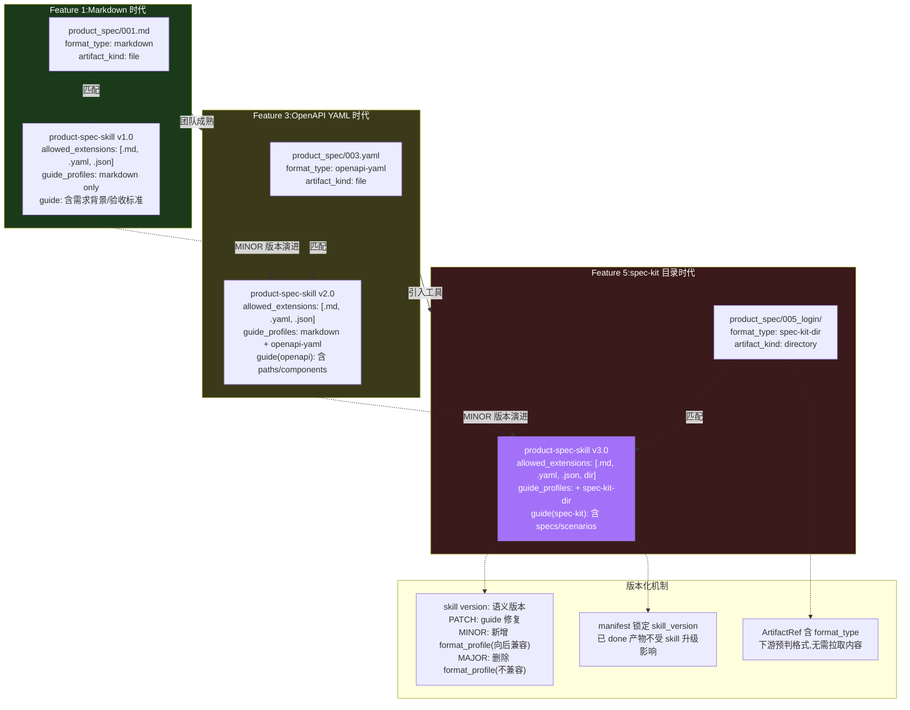
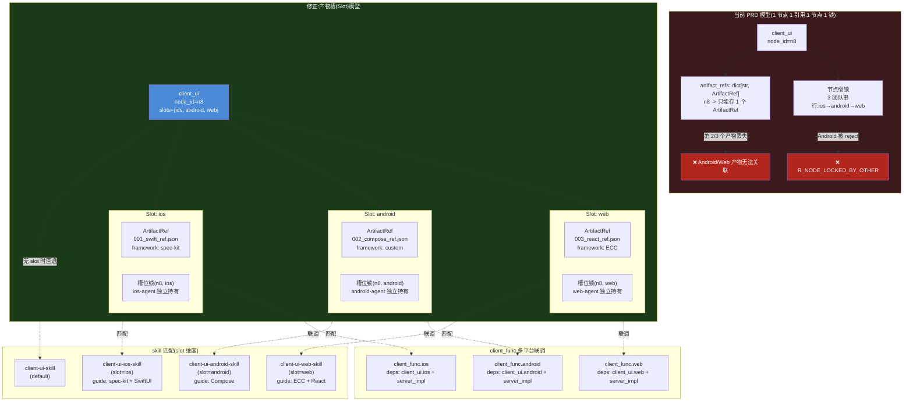
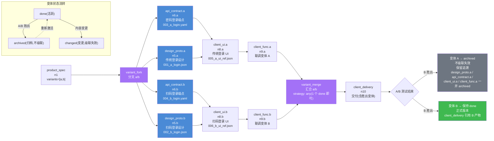

# PRD 压力测试 Round 2:产物演进场景走查

> **文档性质**:对 coordination-platform-prd.md 及其深化文档的第 2 轮压力测试报告
> **版本**:v1.0 | **日期**:2026-08-04 | **状态**:待评审
> **测试范围**:3 个"产物演进"真实场景(A1 格式自主演进 / A2 多语言客户端 / A3 A/B 测试变体)
> **上游文档**:
> - [coordination-platform-prd.md](../coordination-platform-prd.md)(主 PRD)
> - [fr1-fr6-artifact-review.md](../deep-dive/fr1-fr6-artifact-review.md)(FR1/FR6 深化)
> - [fr3-fr5-crew-skills.md](../deep-dive/fr3-fr5-crew-skills.md)(FR3/FR5 深化)

---

## 测试目标与方法

本轮压力测试聚焦"需求 9 强调的产物格式自由"在真实演进场景下的张力。核心原则是:**产物格式完全自由,管理方不限制内容格式**。但"自由"不等于"无治理"——当产物格式随团队成熟度演进(场景 A1)、跨平台分化(场景 A2)、按业务变体分叉(场景 A3)时,PRD 的约束机制、状态机、DAG 模型是否仍能 work?

每个场景按"场景描述 → PRD 走查 → 设计缺陷 → 修正方案 → 设计图"组织,所有缺陷引用具体章节与行号。

---

## 场景 A1:产物格式自主演进

### A1.1 场景描述

**背景**:产品方团队在多个 feature 迭代中逐步成熟,产物格式随之演进。

| Feature | 产物格式 | toolspec.framework | 文件形态 |
|---|---|---|---|
| Feature 1 | Markdown 自由文档 | custom | 单文件 `product_spec/001.md` |
| Feature 3 | OpenAPI 风格 YAML(结构化) | openspec | 单文件 `product_spec/003.yaml` |
| Feature 5 | spec-kit 生成的目录结构 | spec-kit | **目录** `product_spec/005/`(含 `specs/`、`scenarios/`、`README.md`) |

**触发**:Feature 5 时,产品方引入 spec-kit 工具,产物从单文件变为目录结构。

**影响面**:
- 产物仓库目录规范(扁平化约束)
- skill 的 `allowed_extensions` 白名单
- guide.md 的引导内容
- manifest 的格式记录
- 下游 agent 的 LLM 解析(get_dependencies)
- 审核校验逻辑

### A1.2 PRD 走查

#### 走查点 1:spec-kit 目录结构 vs 扁平化约束

fr1-fr6 深化文档 §2.1.1(第 96 行)明确:

> 禁止在产物类型目录下建子目录(扁平化,避免路径歧义),例外见 §2.3.2 多产物共存

而 §2.3.2(第 182-194 行)的"例外"是"不同节点的同类型产物共存",并非"同一产物是目录结构"。spec-kit 生成的产物形态:

```
product_spec/
└─ 005_login/                    # ← 违反扁平化约束!
   ├─ specs/
   │  ├─ login-flow.md
   │  └─ logout-flow.md
   ├─ scenarios/
   │  └─ happy-path.md
   └─ README.md
```

**结论**:spec-kit 目录结构直接被 CI-2 文件命名规范(fr1-fr6 §8.1.1 第 1136 行)拦截,CI 报错。产品方无法提交 spec-kit 产物。这与需求 9"产物格式自由"冲突。

#### 走查点 2:guide.md 在格式演进后失效

fr3-fr5 §6.1(第 702-704 行)product-spec-skill 的 guide_summary:

> 建议 product_spec 包含:需求背景、用户故事、验收标准、非功能需求。

Feature 3 改用 OpenAPI YAML 后,产物内容是 `paths`/`components`/`schemas` 等字段,**根本没有"需求背景""用户故事""验收标准"这些字段**。guide 是"建议非强制"(主 PRD FR5.2 第 400 行),所以不会 reject,但:

- fr3-fr5 §8.2(第 1054-1059 行)将 guide_summary 注入 Task context 供 agent 参考
- agent 收到的 guide 是针对 Markdown 写的,对 OpenAPI YAML 产物毫无指导意义
- agent 可能误导人员"补充需求背景",但 OpenAPI YAML 里没有这个字段

**结论**:guide 与格式强耦合,格式演进后 guide 静默失效,既不报错也不引导。

#### 走查点 3:产物格式类型未记录

fr1-fr6 §3.3 manifest JSON Schema(第 355-378 行)的 `toolspec` 字段:

```json
"toolspec": {
  "required": ["framework"],
  "properties": {
    "framework": {"type": "string", "examples": ["spec-kit", "openspec", "ecc", "custom"]},
    "version": {"type": "string"},
    "schema_ref": {"type": "string"}
  }
}
```

`framework` 记录的是**工具名**(spec-kit/openspec/custom),不是**格式类型**(markdown/openapi-yaml/spec-kit-dir)。同一 framework 可能产出不同格式(如 spec-kit 既能生成单文件也能生成目录),同一格式也可能由不同 framework 产出。

下游 agent 通过 `get_dependencies`(主 PRD FR4.1 第 368 行)拿到上游产物 content,但 **ArtifactRef 和 manifest 都不记录格式类型**,下游无法预判格式。

#### 走查点 4:get_dependencies 的 LLM 解析无格式适配

fr3-fr5 §4.3(第 524-532 行)`_collect_deps_info` 返回:

```python
deps_info.append({"node_id": dep_id, "ref": ref, "summary": content[:500]})
```

下游 agent(如 server_agent 处理 api_contract)用 LLM 解析 product_spec 内容提取需求。fr3-fr5 §2.2(第 142-156 行)agent 的 backstory 是**固定文本**:

> 人员用任意工具(ECC/OpenSpec/custom)产出 product_spec 后,你校验产物引用存在、元数据齐全

backstory 没有说"如果 product_spec 是 Markdown 就按段落提取,如果是 OpenAPI YAML 就按 paths 提取"。LLM 需要自行推断格式——这在格式稳定时可行,但格式演进时解析质量会下降(LLM 没有格式预期)。

#### 走查点 5:审核校验在"格式自由"下的空洞

fr1-fr6 §4.1.1 R_FILE_FORMAT 规则(第 531-543 行)只校验:

```yaml
checks:
  - field: __files__
    op: extensions_in
    value: [".yaml", ".yml", ".json"]
  - field: __files__
    op: size_le
    value_kb: 512
```

如果 skill 不限制扩展名(满足需求 9 的完全自由),那审核时**只校验扩展名在白名单 + 大小不超标**。这意味着:
- 一个空的 `.md` 文件可以通过审核(只要有 manifest 元数据)
- 一个内容完全无关的 `.yaml` 文件可以通过审核
- "这是个合法的 product_spec"的校验完全依赖人工(但 product-spec-skill 的 `requires_human_review: false`,fr3-fr5 §6.1 第 699 行)

**结论**:格式越自由,自动审核的"空洞"越大——审核退化为"文件存在 + 扩展名对",失去了对产物合法性的实质校验。

### A1.3 设计缺陷

| 缺陷 ID | 缺陷描述 | 严重度 | 涉及章节 |
|---|---|---|---|
| **A1-1** | spec-kit 等工具的目录型产物被扁平化约束(fr1-fr6 §2.1.1 第 96 行)硬性拦截,无法提交 | **高(阻断)** | fr1-fr6 §2.1.1、§8.1.1 CI-2 |
| **A1-2** | guide.md 与格式强耦合,格式演进后 guide 静默失效,既不报错也不引导 | 中 | fr3-fr5 §6.1 guide_summary、§8.2 context 注入 |
| **A1-3** | manifest 与 ArtifactRef 不记录"格式类型",下游无法预判上游格式 | 中 | fr1-fr6 §3.3 toolspec 字段、主 PRD §5.1 ArtifactRef |
| **A1-4** | get_dependencies 返回原始 content,agent 的 LLM prompt 无格式适配机制 | 中 | fr3-fr5 §4.3 _collect_deps_info、§2.2 agent backstory |
| **A1-5** | skill 的 allowed_extensions 是全局固定白名单,新增格式(如目录)需改 skill,影响所有 feature | 中 | fr3-fr5 §6.1 file_constraints、§8.1 SkillRegistry |
| **A1-6** | 格式自由导致自动审核退化为"扩展名+大小"校验,产物合法性校验实质缺失(尤其 product_spec 无人工审核) | 中 | fr1-fr6 §4.1.1 R_FILE_FORMAT、fr3-fr5 §6.1 requires_human_review=false |

### A1.4 修正方案

#### 修正 A1-1:支持目录型产物(产物包)

**改 fr1-fr6 §2.1.1**:将"禁止子目录"调整为"单文件产物禁止子目录;目录型产物(artifact bundle)须声明"。

manifest schema(fr1-fr6 §3.3)新增 `artifact_kind` 字段:

```json
"artifact_kind": {
  "type": "string",
  "enum": ["file", "directory"],
  "default": "file",
  "description": "产物形态:file=单文件,directory=目录型产物包"
}
```

CI 校验(fr1-fr6 §8.1.1)调整:
- CI-2 文件命名规范:仅对 `artifact_kind=file` 强制三段式命名
- `artifact_kind=directory` 时,校验目录下有 `manifest.json` + 至少 1 个内容文件
- 目录型产物的 `source.path` 指向目录(如 `product_spec/005_login/`),扩展名校验跳过

#### 修正 A1-3:manifest 增加 format_type 字段

**改 fr1-fr6 §3.3** toolspec 字段增加 `format_type`:

```json
"toolspec": {
  "properties": {
    "framework": {"type": "string"},
    "format_type": {
      "type": "string",
      "description": "产物格式类型,供下游预判解析方式",
      "examples": ["markdown", "openapi-yaml", "openapi-json", "spec-kit-dir", "figma-json", "custom"]
    },
    "version": {"type": "string"},
    "schema_ref": {"type": "string"}
  }
}
```

ArtifactRef(主 PRD §5.1 第 698-705 行)同步增加 `format_type` 字段,下游通过 ArtifactRef 即可预判格式,无需拉取内容推断。

#### 修正 A1-2 + A1-5:guide 按 format_profile 分化

**改 fr3-fr5 §6.1** product-spec-skill 的 guide 结构,从单一 guide_summary 改为按 format_profile 分化:

```yaml
guide_profiles:
  - format_type: markdown
    guide_ref: guide-markdown.md
    guide_summary: |
      建议含:需求背景、用户故事、验收标准、非功能需求。
  - format_type: openapi-yaml
    guide_ref: guide-openapi.md
    guide_summary: |
      建议含:paths(端点)、components/schemas(数据模型)、
      security(鉴权)、examples(示例)。
  - format_type: spec-kit-dir
    guide_ref: guide-spec-kit.md
    guide_summary: |
      建议含:specs/(规格)、scenarios/(场景)、README.md(概述)。
```

agent 注入 context 时(fr3-fr5 §8.2),按 manifest 的 `format_type` 匹配对应 profile 的 guide,而非注入单一 guide。

#### 修正 A1-4:get_dependencies 返回 format_type,agent prompt 适配

**改 fr3-fr5 §4.3** `_collect_deps_info` 返回值增加 format_type:

```python
deps_info.append({
    "node_id": dep_id,
    "ref": ref,
    "format_type": ref.get("format_type", "unknown"),  # 新增
    "summary": content[:500],
})
```

agent backstory(fr3-fr5 §2.2)增加格式适配指令:

> 上游产物可能是 Markdown / OpenAPI YAML / spec-kit 目录等格式,根据 deps_info 中的 format_type 选择解析策略。

#### 修正 A1-6:product_spec 增加"非空 + 最小结构"校验

**改 fr3-fr5 §6.1** product-spec-skill 增加内容最小校验规则(规则引擎,fr1-fr6 §4):

```yaml
review_rules:
  - id: R_PRODUCT_SPEC_NONEMPTY
    name: product_spec 非空校验
    priority: 78
    combinators: AND
    on_fail: reject
    checks:
      - field: __content__
        op: min_content_length
        value: 100          # 产物内容至少 100 字符
  - id: R_PRODUCT_SPEC_FORMAT_MATCH
    name: format_type 与内容一致性(软提示)
    priority: 40
    combinators: AND
    on_fail: warn
    checks:
      - field: __content__
        op: format_type_consistent   # 校验内容与声明的 format_type 大体一致
```

### A1.5 设计图:格式演进的 skill 版本化



---

## 场景 A2:多语言客户端的产物差异

### A2.1 场景描述

**背景**:同一 feature 有 3 个客户端团队并行开发:

| 团队 | 平台 | 语言 | 产物形态 | 开发方法论 |
|---|---|---|---|---|
| iOS 团队 | iOS | Swift | SwiftUI 代码引用(`swift_ref.json`) | spec-kit |
| Android 团队 | Android | Kotlin | Compose 代码引用(`compose_ref.json`) | custom |
| Web 团队 | Web | TypeScript | React 组件引用(`react_ref.json`) | ECC |

3 个团队都产出 `client_ui`,但产物格式完全不同。需求 9 说"客户端开发不限制方式,提供产物即可",但 PRD 只有 1 个 `client_ui` 节点类型(主 PRD §2.1 第 103 行)。

**触发**:3 个团队同时 ready,同时提交 client_ui 产物。

**影响面**:
- ArtifactRef 一对一模型
- 节点锁机制(3 团队互斥)
- skill 一对一匹配
- 路径冲突检测
- client_func 联调节点
- 产物仓库文件共存

### A2.2 PRD 走查

#### 走查点 1:ArtifactRef 一对一模型

主 PRD §5.1(第 698-705 行):

```python
class ArtifactRef(TypedDict):
    node_id: str
    repo: str
    path: str
    commit: str
    toolspec_framework: str
    trace_id: str
```

fr2 §FR2.3 PipelineState(主 PRD 第 267 行):

```python
artifact_refs: dict[str, ArtifactRef]   # node_id -> 产物引用
```

`artifact_refs` 是 `node_id → ArtifactRef` 的**一对一映射**。3 个平台的产物无法同时关联到同一 `node_id`。

fr1-fr6 §2.3.1(第 169-180 行)的"同一节点多版本共存"是**时间维度**的版本迭代(v1→v2→v3),不是**空间维度**的多平台并存。3 个平台产物是同时存在的,不是迭代关系。

**结论**:3 个平台产物要么挤进 1 个 ArtifactRef(只能存 1 个,另外 2 个丢失),要么拆成 3 个 node_id。

#### 走查点 2:节点锁机制导致 3 团队串行

fr1-fr6 §5.2.1(第 783-803 行):

> 节点 `ready` 时,第一个调 `submit_artifact` 的 agent 获得锁。持锁者有权为该节点提 PR;其他 agent 提 PR 时,管理方 webhook 收到后立即 reject。

fr1-fr6 §5.2.4(第 826-831 行):

> PR 合并后释放锁。

如果 3 个团队都往 `client_ui` 节点(n8)提交:
1. iOS agent 先获锁 → 提交 → pending_review(锁不释放)
2. Android agent 提交 → 被 reject("节点 n8 正在被 ios-agent 编辑")
3. Web agent 提交 → 同样被 reject
4. iOS PR 合并 → 锁释放 → Android agent 才能提交
5. Android PR 合并 → Web agent 才能提交

**结论**:3 个平台**完全串行**,无法并行开发。这与 PRD 强调的"并行"(主 PRD §1.3 第 58 行"自动化")矛盾。

#### 走查点 3:skill 一对一匹配无法适配多平台不同方法论

fr3-fr5 §8.1(第 1006-1012 行)SkillRegistry:

```python
for nt in node_types:
    if nt in self.index:
        raise ValueError(f"node_type {nt} 重复匹配 skill: ...")
    self.index[nt] = skill
```

同一 `node_type` 只能匹配 **1 个 skill**。但 3 个团队用不同方法论:
- iOS 用 spec-kit → 期望 guide 引导 spec-kit 风格
- Android 用 custom → 期望 guide 宽松
- Web 用 ECC → 期望 guide 引导 ECC 风格

fr3-fr5 §6.5 client-ui-skill(第 832-871 行)只有 1 个 guide_summary,无法按平台分化。

**结论**:skill 一对一匹配要么牺牲平台差异化引导(用通用 guide),要么节点类型爆炸。

#### 走查点 4:节点类型爆炸 vs 通用性矛盾

如果拆成 `client_ui_ios`/`client_ui_android`/`client_ui_web`:

- 主 PRD §2.1(第 91-106 行)9 种产物节点类型变成 11+ 种
- 主 PRD §1.3(第 57 行)强调"通用性:覆盖服务端/客户端/UI 设计全流程"
- fr1-fr6 §2.1.1(第 97 行)"不允许出现未在 9 种产物类型之外的目录(CI 阻断)" → 需改 CI 白名单
- 每新增平台(RN/Flutter/鸿蒙)都要加节点类型 → 不可持续

**结论**:节点类型爆炸损害通用性,且无法支持未来新增平台。

#### 走查点 5:client_func 联调节点的多平台处理

主 PRD §2.1(第 104 行):`client_func` 是"客户端功能联调"。

fr3-fr5 §6.6 client-delivery-skill(第 891-893 行):

```yaml
deps:
  - client_ui
  - server_impl
```

3 个平台都要和 server_impl 联调:
- 是 3 个 client_func(每平台 1 个)?→ 节点类型/节点数量膨胀
- 是 1 个 client_func?→ 3 个平台的联调结果怎么存?ArtifactRef 一对一存不下
- deps 声明 `client_ui` —— 是 3 个平台的 client_ui 都 done 才 ready,还是任一 done 即 ready?

PRD 未定义。

### A2.3 设计缺陷

| 缺陷 ID | 缺陷描述 | 严重度 | 涉及章节 |
|---|---|---|---|
| **A2-1** | ArtifactRef 一对一模型(node_id → ArtifactRef)无法表达同一节点的多平台并存产物 | **高(阻断)** | 主 PRD §5.1 第 267/698 行、fr1-fr6 §2.3.1 |
| **A2-2** | 节点锁是节点级,3 个平台团队只能串行提交,无法并行 | **高** | fr1-fr6 §5.2.1 第 783-803 行、§5.2.4 |
| **A2-3** | skill 一对一匹配(node_type → skill),无法按平台适配不同方法论/guide | 中 | fr3-fr5 §8.1 第 1006-1012 行、§6.5 |
| **A2-4** | 拆分节点类型(client_ui_ios/android/web)导致类型爆炸,损害通用性,且不可持续 | 中 | 主 PRD §2.1 第 91-106 行、§1.3 第 57 行 |
| **A2-5** | client_func 联调节点的多平台处理未定义(deps 怎么声明、产物怎么存) | 中 | 主 PRD §2.1 第 104 行、fr3-fr5 §6.6 第 891-893 行 |
| **A2-6** | 路径冲突检测(fr1-fr6 §5.3.1)可能误判多平台产物为冲突(若命名规则未区分平台) | 低 | fr1-fr6 §5.3.1 第 836-853 行 |

### A2.4 修正方案

#### 修正 A2-1 + A2-2:引入"产物槽(Slot)"模型

**改主 PRD §5.1** ArtifactRef 模型,从一对一改为一对多(按 slot):

```python
class ArtifactSlot(TypedDict):
    slot_key: str               # 槽位标识,如 "ios" / "android" / "web"
    ref: ArtifactRef            # 该槽位的产物引用
    lock: dict | None           # 槽位级锁(独立于其他槽位)

class NodeArtifactMap(TypedDict):
    node_id: str
    slots: dict[str, ArtifactSlot]   # slot_key -> 槽位(单槽位节点退化为 {"default": ...})
```

PipelineState 的 `artifact_refs` 从 `dict[str, ArtifactRef]` 改为 `dict[str, NodeArtifactMap]`。

**单槽位节点**(如 product_spec、api_contract)退化为 `slots={"default": ...}`,与现有逻辑兼容。

**多槽位节点**(如 client_ui)声明 `slots={"ios": ..., "android": ..., "web": ...}`。

#### 修正 A2-2:锁粒度从 node_id 细化到 (node_id, slot_key)

**改 fr1-fr6 §5.2.1**:节点锁改为槽位锁。

```python
# 获取锁的 key 从 node_id 改为 (node_id, slot_key)
INSERT INTO node_locks (node_id, slot_key, holder, expires_at)
VALUES ($1, $2, $3, $4)
ON CONFLICT (node_id, slot_key) DO NOTHING
RETURNING holder;
```

3 个平台的 agent 分别获取 `(n8, ios)`/`(n8, android)`/`(n8, web)` 锁,互不阻塞。

#### 修正 A2-3 + A2-4:skill 匹配增加 slot 维度

**改 fr3-fr5 §8.1** SkillRegistry 索引,从 `node_type → skill` 改为 `(node_type, slot_key) → skill`:

```python
# 索引键变为 (node_type, slot_key),slot_key 可选
# 未声明 slot_key 的 skill 作为 default 匹配
self.index: dict[tuple[str, str | None], dict] = {}

def match_skill(self, node_type: str, slot_key: str | None = None) -> dict | None:
    # 先精确匹配 (node_type, slot_key)
    if (node_type, slot_key) in self.index:
        return self.index[(node_type, slot_key)]
    # 回退到 (node_type, None) default skill
    return self.index.get((node_type, None))
```

client-ui-skill 拆分为:
- `client-ui-skill`(default,通用 guide)
- `client-ui-ios-skill`(slot_key=ios,guide 引导 spec-kit + SwiftUI)
- `client-ui-android-skill`(slot_key=android,guide 引导 Compose)
- `client-ui-web-skill`(slot_key=web,guide 引导 ECC + React)

节点类型不变(仍是 `client_ui`),仅 skill 匹配增加 slot 维度,避免节点类型爆炸。

#### 修正 A2-5:client_func 支持多平台变体

**改 fr3-fr5 §6.6** client-delivery-skill 的 deps 声明,支持按 slot 匹配:

```yaml
deps:
  - node_type: client_ui
    slot: matching        # matching=按同名 slot 匹配(client_func.ios 依赖 client_ui.ios)
  - node_type: server_impl
    slot: default         # server_impl 是单槽位,所有平台共用
```

client_func 节点声明 `slots=["ios", "android", "web"]`,每个 slot 独立 ready/done:
- `client_func.ios` ready 当 `client_ui.ios` done AND `server_impl` done
- 3 个平台的联调可并行

#### 修正 A2-6:路径冲突检测排除不同 slot

**改 fr1-fr6 §5.3.1**:路径冲突检测时,若两个 PR 的 `(node_id, slot_key)` 不同,则不视为冲突(即使修改同一目录下的不同文件)。

### A2.5 设计图:多语言客户端的节点模型



---

## 场景 A3:A/B 测试变体的产物管理

### A3.1 场景描述

**背景**:产品方要求登录页做 A/B 测试:

| 变体 | 登录方式 | 设计 | 契约 | 客户端 UI |
|---|---|---|---|---|
| 变体 A | 传统登录(账号密码) | design_proto_A | api_contract_A(密码登录端点) | client_ui_A |
| 变体 B | 扫码登录 | design_proto_B | api_contract_B(扫码登录端点) | client_ui_B |

设计师产出 2 份 design_proto,服务端 api_contract 要同时支持两种登录,客户端要同时实现两套 UI。

**触发**:A/B 测试期间,A 和 B 两个变体需并行开发、并行上线、并行运行。

**影响面**:
- DAG 模型(1 节点 1 产物 → 怎么表达 2 变体?)
- 产物仓库文件共存
- ArtifactRef 模型
- 依赖关系(变体间依赖)
- 状态机(变体归档)
- 控制节点(变体分叉/汇合)

### A3.2 PRD 走查

#### 走查点 1:DAG 模型无法表达"同节点的并存变体"

主 PRD §5.1 Pipeline(第 664-693 行):

```yaml
nodes:
  - id: "n1"
    type: "product_spec"
    deps: []
  - id: "n2"
    type: "api_contract"
    deps: ["n1"]
```

每个 node 是 1 个任务单元,产出 1 个产物。A/B 两个变体怎么表达?

**方案 a:同一节点 2 个产物**
- design_proto 节点产出 2 个文件(`001_a.json` + `002_b.json`)
- 但 ArtifactRef 一对一(主 PRD §5.1 第 267 行),存不下 2 个
- fr1-fr6 §2.3.1(第 169-180 行)的"多版本共存"是版本迭代(v1→v2),不是变体并存

**方案 b:拆成 2 个节点(design_proto_a + design_proto_b)**
- 但 PRD 只有 1 个 `design_proto` 节点类型(主 PRD §2.1 第 101 行)
- 拆成 2 个 node_id(n5_a + n5_b)可行,但节点数量翻倍
- 下游 client_ui 的 deps 声明变复杂(依赖 n5_a 还是 n5_b?还是都依赖?)

**方案 c:用 A2 的 slot 模型**
- design_proto 声明 `slots=["variant_a", "variant_b"]`
- 但 slot 模型的 slot_key 是"平台维度",A/B 是"变体维度",语义不同
- 且 A/B 变体之间有依赖链(A 的 client_ui 依赖 A 的 design_proto),slot 模型不支持跨节点 slot 依赖匹配

**结论**:三种方案都有缺口。PRD 的 DAG 本质是"1 节点 1 产物 1 状态",无法原生表达"1 逻辑节点 N 变体并存"。

#### 走查点 2:产物仓库的变体共存

假设用方案 b(拆 2 个节点),产物仓库:

```
design_proto/
├─ 001_login_a.json     # n5_a 变体 A
└─ 002_login_b.json     # n5_b 变体 B
```

fr1-fr6 §2.3.2(第 182-194 行):

> 不同节点的同类型产物共存...node_id 与 seq 的映射通过 manifest 的 node_id 字段维护

管理方通过 manifest 的 `node_id` 区分(n5_a vs n5_b),技术上可行。但:

- fr1-fr6 §2.1.2(第 104-113 行)三段式命名 `<seq>_<slug>.<ext>`,slug 是 `login_a`/`login_b`,**没有变体维度**
- 管理方无法从文件名识别"这是一组 A/B 变体",只能从 manifest 反查
- 若 A/B 结束后变体 A 归档,文件 `001_login_a.json` 仍在仓库,管理方怎么标记"已归档"?

#### 走查点 3:api_contract 同时支持 A 和 B

api_contract 节点的产物怎么写?

**方案 a:1 个契约文件覆盖两种登录**
- 文件含 `/login/password`(A)和 `/login/qrcode`(B)两套端点
- 下游 client_ui 怎么知道哪些端点是 A 的、哪些是 B 的?(管理方不解析内容)
- A/B 结束后删 A 端点 → 整个 api_contract 变 changed → 下游全 blocked

**方案 b:2 个契约节点(api_contract_a + api_contract_b)**
- 节点数量翻倍
- server_impl 依赖哪个?还是都依赖?

**结论**:1 契约覆盖多变体无法区分;拆节点则节点膨胀。

#### 走查点 4:依赖关系没有变体级别匹配

主 PRD FR2.2(第 251-261 行)依赖 DAG 规则:

> 节点 deps 数组声明上游依赖

fr3-fr5 §6.5 client-ui-skill(第 850-855 行):

```yaml
deps:
  - api_contract
  - design_asset
```

deps 是 **node_type 级别**,不是变体级别。A/B 变体需:
- `client_ui_a` 依赖 `api_contract_a` + `design_asset_a`
- `client_ui_b` 依赖 `api_contract_b` + `design_asset_b`

但 PRD 的 deps 无法表达"变体 A 的 client_ui 依赖变体 A 的 api_contract"。若 `client_ui_a` 依赖了 `api_contract_b`,DAG 无法检测到错误(都满足"依赖 api_contract 类型")。

#### 走查点 5:A/B 结束后的变体处理

变体 B 胜出,变体 A 怎么处理?

主 PRD FR2.1(第 238 行)状态机:

| 状态 | 含义 |
|---|---|
| `changed` | 已 done 产物被重新提交(变更) |

`changed` 的语义是"变更失效"(fr1-fr6 §2.2.2、主 PRD FR2.2 第 259 行"级联失效:节点 changed → 所有下游产物引用清除 + 置 blocked")。

变体 A 不是"变更",是"归档/废弃":
- 归档不应级联失效下游(client_ui_a 可能还需维护灰度回滚)
- 归档不应清除产物引用(需保留追溯)
- 归档后变体 A 的产物仍存在,只是不再活跃

PRD 没有"归档(archived)"状态,只有 changed(级联失效)和 done(活跃)。变体 A 无法优雅退出。

#### 走查点 6:控制节点缺少"变体分叉"能力

主 PRD FR2.5(第 286-294 行)控制节点:

| 控制节点 | 行为 |
|---|---|
| `fork` | 多入边全 done → done(透传) |
| `switch` | 按上游产物字段路由 |

A/B 测试需要的是"1 个上游分叉成 2 条并行链",但:
- `fork` 是**汇合**(多入边→1 出边),不是分叉(1 入边→多出边)
- `switch` 是**条件路由**(按字段选 1 条),不是并存(2 条都走)

PRD 的控制节点无法表达"变体分叉"。

### A3.3 设计缺陷

| 缺陷 ID | 缺陷描述 | 严重度 | 涉及章节 |
|---|---|---|---|
| **A3-1** | DAG 模型"1 节点 1 产物 1 状态"无法表达同逻辑节点的 N 个并存变体 | **高(阻断)** | 主 PRD §5.1 第 664-693 行、§FR2.2 |
| **A3-2** | 状态机缺少"归档/废弃"状态,变体退出只能用 changed(级联失效,不适合) | **高** | 主 PRD FR2.1 第 238 行、FR2.2 第 259 行 |
| **A3-3** | 依赖关系(deps)是 node_type/node_id 级别,无变体级别匹配,变体间错误依赖无法检测 | 中 | 主 PRD FR2.2 第 254 行、fr3-fr5 §6.5 第 850-855 行 |
| **A3-4** | 产物命名规则(fr1-fr6 §2.1.2)无变体维度,无法从文件名识别变体归属 | 中 | fr1-fr6 §2.1.2 第 104-113 行 |
| **A3-5** | 控制节点无"变体分叉"能力(fork 是汇合,switch 是条件路由,都不是并存分叉) | 中 | 主 PRD FR2.5 第 286-294 行 |
| **A3-6** | api_contract 同时支持多变体时,1 契约文件无法区分变体端点(管理方不解析内容) | 中 | 主 PRD §1.4 第 69 行"不校验内容" |

### A3.4 修正方案

#### 修正 A3-1 + A3-3 + A3-5:引入"变体维度(variant)"与"变体分叉"控制节点

**改主 PRD §5.1** Pipeline 节点定义,增加 `variant` 维度:

```yaml
nodes:
  - id: "n1"
    type: "product_spec"
    deps: []
    variants: ["a", "b"]          # 声明该节点有 2 个变体(可选,默认 ["default"])

  - id: "n5"
    type: "design_proto"
    deps: ["n1"]
    variant_fork: true             # 标记:从上游 product_spec 的 variants 分叉
    variants: ["a", "b"]           # 变体 a / 变体 b

  - id: "n6"
    type: "api_contract"
    deps: ["n1"]
    variant_fork: true
    variants: ["a", "b"]

  - id: "n8"
    type: "client_ui"
    deps: ["n5", "n6"]
    variants: ["a", "b"]
    deps_variant_match: matching   # 依赖按同名变体匹配:client_ui.a 依赖 n5.a + n6.a
```

**新增控制节点 `variant_fork`**(改主 PRD §2.1 控制节点清单 + FR2.5):

| 控制节点 | 行为 |
|---|---|
| `variant_fork` | 1 入边 → N 出边(按 variants 声明分叉);上游 done → N 个变体并行 ready |

与 `fork` 的区别:
- `fork`:多入边汇合(AND 语义,N 个上游全 done 才 ready)
- `variant_fork`:1 入边分叉(FAN-OUT 语义,1 个上游 done → N 个变体都 ready)

**新增控制节点 `variant_merge`**:

| 控制节点 | 行为 |
|---|---|
| `variant_merge` | N 个变体入边 → 1 出边(汇合);所有变体 done → 下游 ready;支持声明"只需 1 个变体 done 即可"(A/B 胜出场景) |

#### 修正 A3-3:deps 增加变体匹配规则

**改主 PRD FR2.2** 依赖 DAG 规则,新增变体匹配:

```yaml
deps_variant_match:
  - strategy: matching       # 按同名变体匹配(client_ui.a 依赖 design_proto.a)
  - strategy: any            # 任一变体 done 即可(如 client_delivery 依赖任一 client_ui 变体)
  - strategy: all            # 所有变体 done 才 ready(如最终交付需 A/B 都完成)
```

CI 校验(改 fr1-fr6 §8.1.1)新增:
- CI-12 变体依赖一致性:变体 A 的下游依赖变体 A 的上游(防交叉依赖)

#### 修正 A3-2:状态机新增"归档(archived)"状态

**改主 PRD FR2.1** 状态机,从 7 态扩展为 8 态:

| 状态 | 含义 | 进入条件 | 退出条件 |
|---|---|---|---|
| `archived` | 变体已归档(不活跃,但保留追溯) | admin 手动归档 / A/B 胜出后败者归档 | 重新激活(回 done) |

`archived` 与 `changed` 的关键区别:
- `archived`:**不级联失效**下游,下游产物引用保留,仅标记"该变体不再活跃"
- `changed`:**级联失效**下游,下游产物引用清除 + blocked

`archived` 的下游处理:
- 下游若也有对应变体(如 client_ui.a),一并 archived(变体级联归档,非失效)
- 下游若是公共节点(如 client_delivery 含 A/B),不受影响

#### 修正 A3-4:命名规则增加变体段

**改 fr1-fr6 §2.1.2** 三段式命名扩展为四段式(变体可选):

```
<seq>_<variant>_<slug>.<ext>
```

| 段 | 规则 | 示例 |
|---|---|---|
| `seq` | 3 位序号 | `001` |
| `variant` | 变体标识(可省略,非变体产物不填) | `a` / `b` |
| `slug` | kebab-case 描述 | `login` |
| `ext` | 扩展名 | `.json` |

示例:`design_proto/001_a_login.json` / `design_proto/002_b_login.json`

CI-2 文件命名规范(改 fr1-fr6 §8.1.1)同步更新正则。

#### 修正 A3-6:api_contract 变体拆分

A/B 测试的 api_contract 建议拆为变体节点(api_contract.a / api_contract.b),每变体 1 个契约文件,而非 1 契约覆盖多变体。理由:
- 管理方不解析内容,1 契约内的端点无法区分变体归属
- 拆变体后,变体 A 归档时 api_contract.a 一并 archived,不影响 api_contract.b
- server_impl 可声明 `deps_variant_match: matching`,按变体实现

### A3.5 设计图:A/B 测试的变体 DAG



---

## 缺陷汇总表

### 按严重度排序

| 缺陷 ID | 场景 | 缺陷描述 | 严重度 | 涉及 PRD 章节 | 修正方案 |
|---|---|---|---|---|---|
| **A1-1** | A1 | spec-kit 等工具的目录型产物被扁平化约束硬性拦截,无法提交 | **高(阻断)** | fr1-fr6 §2.1.1 第 96 行、§8.1.1 CI-2 | manifest 增 `artifact_kind`(file/directory),CI 按类型分别校验 |
| **A2-1** | A2 | ArtifactRef 一对一模型无法表达同一节点的多平台并存产物 | **高(阻断)** | 主 PRD §5.1 第 267/698 行、fr1-fr6 §2.3.1 | 引入产物槽(Slot)模型,artifact_refs 改为 dict[str, NodeArtifactMap] |
| **A2-2** | A2 | 节点锁是节点级,多平台团队只能串行提交,无法并行 | **高** | fr1-fr6 §5.2.1 第 783-803 行 | 锁粒度从 node_id 细化到 (node_id, slot_key) |
| **A3-1** | A3 | DAG 模型"1 节点 1 产物 1 状态"无法表达同逻辑节点的 N 个并存变体 | **高(阻断)** | 主 PRD §5.1 第 664-693 行、FR2.2 | 引入 variant 维度 + variant_fork/variant_merge 控制节点 |
| **A3-2** | A3 | 状态机缺少"归档"状态,变体退出只能用 changed(级联失效,不适合) | **高** | 主 PRD FR2.1 第 238 行、FR2.2 第 259 行 | 新增 archived 状态(不级联失效,仅标记不活跃) |
| **A1-2** | A1 | guide.md 与格式强耦合,格式演进后 guide 静默失效 | 中 | fr3-fr5 §6.1 第 702-704 行、§8.2 | guide 按 format_profile 分化,按 manifest.format_type 匹配 |
| **A1-3** | A1 | manifest 与 ArtifactRef 不记录"格式类型",下游无法预判上游格式 | 中 | fr1-fr6 §3.3 第 355-378 行、主 PRD §5.1 | manifest 增 format_type 字段,ArtifactRef 同步 |
| **A1-4** | A1 | get_dependencies 返回原始 content,agent LLM prompt 无格式适配 | 中 | fr3-fr5 §4.3 第 524-532 行、§2.2 | get_dependencies 返回 format_type,backstory 增格式适配指令 |
| **A1-5** | A1 | skill allowed_extensions 全局固定,新增格式需改 skill 影响所有 feature | 中 | fr3-fr5 §6.1 第 696 行、§8.1 | allowed_extensions 可含 dir,guide_profiles 按 format_type 分化 |
| **A1-6** | A1 | 格式自由导致自动审核退化为"扩展名+大小",产物合法性校验缺失 | 中 | fr1-fr6 §4.1.1、fr3-fr5 §6.1 第 699 行 | product_spec 增非空+最小结构校验规则 |
| **A2-3** | A2 | skill 一对一匹配无法按平台适配不同方法论/guide | 中 | fr3-fr5 §8.1 第 1006-1012 行、§6.5 | skill 匹配增 slot 维度:(node_type, slot_key) → skill |
| **A2-4** | A2 | 拆分节点类型导致类型爆炸,损害通用性,不可持续 | 中 | 主 PRD §2.1 第 91-106 行、§1.3 第 57 行 | 用 slot 维度替代节点类型拆分 |
| **A2-5** | A2 | client_func 联调节点的多平台处理未定义 | 中 | 主 PRD §2.1 第 104 行、fr3-fr5 §6.6 | client_func 支持 slot,deps 增 slot: matching |
| **A3-3** | A3 | 依赖关系无变体级别匹配,变体间错误依赖无法检测 | 中 | 主 PRD FR2.2 第 254 行、fr3-fr5 §6.5 | deps 增 deps_variant_match(matching/any/all)+ CI-12 校验 |
| **A3-4** | A3 | 产物命名规则无变体维度,无法从文件名识别变体归属 | 中 | fr1-fr6 §2.1.2 第 104-113 行 | 四段式命名 <seq>_<variant>_<slug>.<ext> |
| **A3-5** | A3 | 控制节点无"变体分叉"能力(fork 是汇合,switch 是条件路由) | 中 | 主 PRD FR2.5 第 286-294 行 | 新增 variant_fork(FAN-OUT)+ variant_merge(汇合) |
| **A3-6** | A3 | 1 契约文件覆盖多变体时无法区分变体端点(管理方不解析内容) | 中 | 主 PRD §1.4 第 69 行 | api_contract 按变体拆分,每变体 1 契约文件 |
| **A2-6** | A2 | 路径冲突检测可能误判多平台产物为冲突 | 低 | fr1-fr6 §5.3.1 第 836-853 行 | 冲突检测排除不同 slot 的 PR |

### 按涉及文件分组

| 涉及文件 | 缺陷数 | 需修正章节 |
|---|---|---|
| **coordination-platform-prd.md** | 8 | §2.1(节点类型+控制节点)、§5.1(ArtifactRef+Pipeline)、FR2.1(状态机)、FR2.2(DAG 规则)、FR2.5(控制节点) |
| **fr1-fr6-artifact-review.md** | 7 | §2.1.1(扁平化约束)、§2.1.2(命名规则)、§3.3(manifest schema)、§4.1.1(审核规则)、§5.2(锁机制)、§5.3.1(冲突检测)、§8.1.1(CI 校验) |
| **fr3-fr5-crew-skills.md** | 7 | §2.2(agent backstory)、§4.3(get_dependencies)、§6.1(product-spec-skill)、§6.5(client-ui-skill)、§6.6(client-delivery-skill)、§8.1(SkillRegistry) |

### 共性根因分析

3 个场景的缺陷有 2 个共性根因:

#### 根因 1:"1 节点 1 产物 1 状态"的刚性模型

PRD 的核心数据模型(ArtifactRef 一对一、状态机单态、DAG 单链)假设"1 个节点 = 1 个产物 = 1 个状态"。但真实场景中:
- A2 多平台:1 节点 N 产物(平台维度)
- A3 A/B 测试:1 节点 N 产物(变体维度)

**统一修正方向**:引入"维度(dimensions)"概念,节点产物按维度展开:
- `slot`(平台维度):ios/android/web
- `variant`(变体维度):a/b

ArtifactRef 模型从 `dict[str, ArtifactRef]` 演进为 `dict[str, dict[str, ArtifactRef]]`(node_id → dimension_key → ArtifactRef),单维度节点退化为 `{"default": ...}`。

#### 根因 2:"格式中立"与"格式感知"的张力

需求 9 强调"产物格式自由,管理方不限制内容格式",但完全格式中立导致:
- A1 格式演进后 guide 失效(格式中立 → guide 无法适配)
- A1 审核退化为扩展名校验(格式中立 → 无实质校验)
- A3 1 契约覆盖多变体无法区分(格式中立 → 不解析内容)

**统一修正方向**:格式中立不等于格式不可知。管理方不**限制**格式(允许任意格式),但应**记录**格式类型(format_type),供下游感知与适配。这是"不限制"与"不可知"的关键区别——当前 PRD 把两者混为一谈了。

---

## 附录:与 Round 1 已测场景的去重说明

本轮 3 个场景与 Round 1 已测场景无重叠:

| 本轮场景 | 易混淆的 Round 1 场景 | 区别 |
|---|---|---|
| A1 格式自主演进 | 多格式契约(契约格式多样) | A1 是**同一节点类型跨 feature 的格式演进**(Markdown→YAML→目录),Round 1 是**同一时刻不同契约用不同格式** |
| A1 格式自主演进 | 版本共存(多版本并存) | A1 是**格式维度**的演进,版本共存是**内容版本**的迭代 |
| A2 多语言客户端 | 跨团队协调(多方协作) | A2 聚焦**同一节点的多平台产物模型**,跨团队协调是**流程协调问题** |
| A3 A/B 测试变体 | 管线中途修改(流程变更) | A3 是**变体并存的 DAG 建模**,管线中途修改是**流程结构变更** |
| A3 A/B 测试变体 | hotfix 插队(并行分支) | A3 的变体是**预设计的并存分支**,hotfix 是**临时插入的修复分支** |
