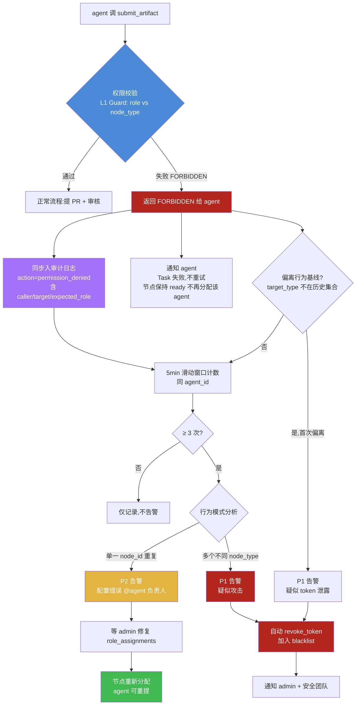
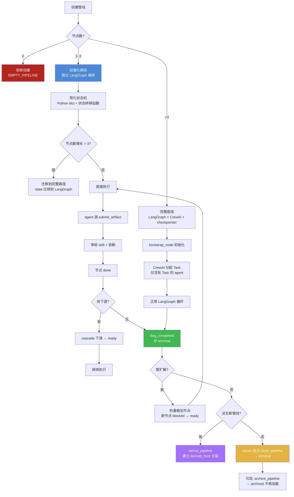

# 第二轮场景压力测试:迁移、运维与冷启动

> **文档性质**:对《coordination-platform-prd.md》及 5 份深化文档的第二轮场景压力测试
> **版本**:v1.0 | **日期**:2026-08-04 | **状态**:待评审
> **上游文档**:[coordination-platform-prd.md](../coordination-platform-prd.md)、[fr2-orchestration.md](../deep-dive/fr2-orchestration.md)、[fr7-fr8-monitoring-visual.md](../deep-dive/fr7-fr8-monitoring-visual.md)
> **测试场景**:A10 存量项目迁移、A11 权限误操作、A12 冷启动单节点管线
> **核心原则**:遵循需求 9——产物由各端自定义,管理方只做元数据 + 依赖约束

---

## 0. 本轮压力测试的目标

第一轮 16 个场景已覆盖正常开发链路(产物信任、契约版本、并行依赖、回滚、异常人工)。本轮聚焦三个"非绿色路径"运营场景,检验 PRD 在以下方面的设计完备性:

| 场景 | 核心问题 | PRD 假设被挑战的点 |
|---|---|---|
| A10 存量迁移 | 已有产物如何纳入平台? | PRD 假设"所有产物都走提 PR → 审核 → 合并",无批量导入/免审通道 |
| A11 权限误操作 | agent 提交错节点产物怎么办? | PRD 定义了权限校验,但未定义"校验失败后的可观测性与恢复" |
| A12 冷启动单节点 | 1 节点管线是否合法且合理? | PRD 假设"管线是完整 DAG",未考虑最小管线与调研型管线 |

**评判标准**:每个场景按"场景描述 → PRD 走查 → 设计缺陷 → 修正方案 → 设计图"组织,缺陷必须引用具体章节,修正方案必须可落地。

---

## 1. 场景 A10:存量项目迁移到平台(已有大量产物在外部)

### 1.1 场景描述

某成熟项目 **MyApp** 已在生产环境运行 2 年,团队决定将其纳入 Coordination Platform 管理以便后续新功能开发走平台流程。当前存量资产:

| 资产类型 | 数量 | 现有位置 | 格式 |
|---|---|---|---|
| API 契约 | 50 个 | 独立 git 仓库 `myapp-api-specs/` | Swagger 2.0 YAML(含 `$ref` 跨文件引用) |
| 设计稿 | 20 个 | Confluence / Notion 文档中散落的 Figma 链接 | Figma URL + 旁路文字说明 |
| 服务端代码 commit | 100+ | `myapp-server/` git 仓库 | git commit hash |
| 客户端代码 commit | 80+ | `myapp-client/` git 仓库 | git commit hash |

**关键约束**:
- 这些产物**从未经过平台审核**,但生产环境稳定运行 2 年
- 50 个 API 契约之间存在内容级依赖(订单 API `$ref` 引用用户 API 的 schema)
- 团队期望:迁移后能在平台 Dashboard 看到完整产物链路,**新功能开发走平台流程**

### 1.2 PRD 走查

#### 1.2.1 产物入库(FR1.1 + FR1.2)

PRD §1.1 规定"每种产物类型一个目录,目录名与节点 type 一致",FR1.2 规定"main 分支禁止直接 push,只接受 PR 合并"。

- 存量 50 个 API 契约要迁入 `artifact-repo/api_contract/`——它们当前在 `myapp-api-specs/` 仓库,是 Swagger 2.0 格式
- PRD §1.4 声明"不限制开发方用什么工具产出内容",格式中立——Swagger YAML 格式本身没问题
- **但 FR5.4 `api-contract-skill` 的 `required_fields` 要求 `source.repo / source.path / source.commit / toolspec.framework`**——存量 Swagger 文件不含这些字段(它是 OpenAPI spec,不是平台 manifest)
- **走查结论**:FR5 的 skill 约束对存量产物格式过严,Swagger 文件天然不满足 `required_fields`

#### 1.2.2 PR 提交与审核(FR6.1 + FR6.4)

PRD §1.2 第 4 点"所有产物提交经 PR 审核(skill 约束校验 + 依赖检查)才能合并生效"。FR1.2 规定"squash merge,每产物一个 commit"。

- 50 个 API 契约按 PRD 流程需要**逐个提 PR**(每产物一个 commit + 一个 PR)
- FR6.4 审核策略矩阵:`api_contract` 首次需人工审核(`requires_human_review=true 首次`)
- 50 个首次人工审核 PR,假设每个 5 分钟,需 4+ 小时人工审核,且这些契约**已在生产跑 2 年**,审核意义存疑
- **FR7 §2.1 ALR-09**:`pending_review` PR 数 > 10 触发 P2 告警——批量导入 50 个 PR 会立即触发告警风暴
- **走查结论**:无批量导入通道,无免审机制;ALR-09 会在迁移时误报

#### 1.2.3 依赖关系建立(FR2.2 + FR4.2)

PRD §2.2 规定"节点 `deps` 数组声明上游依赖,边由 deps 推导"。FR4.2 路径注册表 `node_path_registry(pipeline_id, node_id, artifact_path, commit)` 要求路径全局唯一。

- 存量 50 个 API 契约之间的依赖是 **Swagger 内部 `$ref`**(如 `order_api.yaml` 的 `$ref: user_api.yaml#/components/schemas/User`),不是平台 `node_id` 级依赖
- 存量产物没有 `pipeline_id` / `node_id`——它们是"裸文件",不是平台节点
- **走查结论**:存量产物的"内容级依赖"(Swagger `$ref`)与平台的"节点级依赖"(`deps` 数组)是两套体系,迁移时如何映射 PRD 未定义

#### 1.2.4 ArtifactRef 构建(§5.1 ArtifactRef)

PRD §5.1 `ArtifactRef` 字段:`repo / path / commit / toolspec_framework / trace_id`。

- 存量产物的 commit 在原仓库(`myapp-api-specs/`),**不在平台 `artifact-repo/`**
- PRD §1.2 明确"通过独立 git 仓库管理所有产物内容"——隐含要求迁入平台仓库
- 迁入会产生新 commit(迁入操作的 commit),ArtifactRef.commit 只能指向迁入后的 commit——**原仓库的 commit 历史丢失**
- **走查结论**:ArtifactRef 不支持外部仓库引用;强制迁入丢失原 commit 追溯链

#### 1.2.5 状态初始化(FR2.1 状态机 + §2.2 非法转移表)

存量产物导入后状态应为 `done`(已在生产跑),但:

- PRD §2.1 T7:`done` 进入条件是 `approve_pr` 合并——存量导入不走 `approve_pr`
- §2.2 非法转移表明确禁止 `blocked → done`(跳过产出/审核)
- §6.3 恢复流程:"无 checkpoint → `bootstrap_node` 初始化"——bootstrap 只设 `blocked` / `ready`,不会设 `done`
- **走查结论**:状态机无"导入即 done"的合法路径

#### 1.2.6 下游 cascade(FR2.4 cascade_node)

假设 50 个 API 契约都置 `done`,FR2.4 `cascade_node` 检查下游:

- 存量项目可能**没有完整管线定义**(只有 API 契约,没有 `client_ui` 节点)
- `cascade` 找不到下游,什么都不做——但管线"未完成"(还有未定义的节点)
- §9.4 `dispatch_router_fn`:`all(s == DONE)` → 返回 END——管线"完成"?但业务上管线远未完成
- **走查结论**:存量迁移的"部分管线"语义与 PRD"完整 DAG"假设冲突

#### 1.2.7 trace 关联(FR7.1 + SLO-12)

PRD §5.1 `ArtifactRef.trace_id` 关联 Langfuse trace;FR7 §3.1 SLO-12 要求"trace 覆盖率 ≥ 99% 产物含 trace_id"。

- 存量产物没有执行 trace(它们是 2 年前人工写的,没有 MCP 调用记录)
- `trace_id` 字段如何填?空值会违反 SLO-12
- **走查结论**:存量产物的 trace 缺失会拉低 SLO-12 覆盖率

### 1.3 设计缺陷

| 编号 | 缺陷 | 引用章节 | 严重度 |
|---|---|---|---|
| D10.1 | 无"批量导入"工具,只能逐个提 PR | FR1.2 + FR6.1 | High |
| D10.2 | 无"免审标记"(grandfather clause),存量产物仍走人工审核 | FR6.4 | High |
| D10.3 | `skill.required_fields` 对存量产物格式过严(Swagger 不含 source.commit) | FR5.2 + FR5.4 | High |
| D10.4 | `ArtifactRef.repo` 不支持外部仓库引用,强制迁入丢失原 commit 历史 | §5.1 | Medium |
| D10.5 | 状态机无"导入即 done"合法路径(§2.2 明确禁止 blocked→done) | §2.1 T7 + §2.2 | High |
| D10.6 | 存量产物间内容级依赖(Swagger `$ref`)与平台节点级依赖无法映射 | §2.2 | Medium |
| D10.7 | 存量产物无 trace,违反 SLO-12 覆盖率 ≥ 99% | FR7 §3.1 SLO-12 | Low |
| D10.8 | ALR-09 PR 积压告警在批量导入时误报 | FR7 §2.1 ALR-09 | Low |

### 1.4 修正方案

#### 1.4.1 新增 MCP 工具 `import_legacy_artifacts`(批量导入)

```json
{
  "name": "import_legacy_artifacts",
  "description": "批量导入存量产物:迁入 artifact-repo + 建 ArtifactRef + 置 done(grandfather 模式)",
  "inputSchema": {
    "type": "object",
    "properties": {
      "pipeline_id": {"type": "string"},
      "grandfather": {"type": "boolean", "description": "免审标记,跳过 skill 校验 + 人工审核"},
      "artifacts": {
        "type": "array",
        "items": {
          "type": "object",
          "properties": {
            "node_id": {"type": "string"},
            "node_type": {"type": "string"},
            "role": {"type": "string"},
            "source_repo": {"type": "string", "description": "原仓库地址"},
            "source_path": {"type": "string", "description": "原仓库内路径"},
            "source_commit": {"type": "string", "description": "原仓库 commit"},
            "deps": {"type": "array", "items": {"type": "string"}},
            "toolspec_framework": {"type": "string"}
          }
        }
      }
    },
    "required": ["pipeline_id", "artifacts"]
  }
}
```

**行为**:
- 单次上限 100 个产物,异步执行,返回 `job_id`
- 每个 artifact:迁入 `artifact-repo/{node_type}/{node_id}_{seq}.{ext}` + 构造 `ArtifactRef` + 置 `done`
- `grandfather=true` 时跳过 skill `required_fields` 校验 + 人工审核
- 审计日志 `reviewer=grandfather-admin`, `note="legacy import, in production N years"`

#### 1.4.2 状态机新增 T19 转移:`(初始) → done`

在 FR2 §2.1 状态转移表新增:

| # | 源状态 | 目标状态 | 触发事件 | 前置 Guard | 副作用 | 备注 |
|---|---|---|---|---|---|---|
| T19 | `(初始)` | `done` | `import_legacy_artifacts` | caller=admin; grandfather=true; 产物文件已迁入 | 写 `artifact_refs[nid]`(含 external_ref),发 `IMPORTED_DONE` event,**不触发 cascade**(存量无下游) | 存量导入专用 |

**T19 不触发 cascade 的理由**:存量迁移时管线可能未完整定义,cascade 无目标;待新功能开发时,新节点依赖这些 `done` 节点,自然 `ready`(T3)。

#### 1.4.3 ArtifactRef 扩展 `external_ref` 字段

```python
class ArtifactRef(TypedDict):
    node_id: str
    repo: str                    # 平台 artifact-repo 地址
    path: str                    # 平台仓库内路径
    commit: str                  # 平台迁入后的 commit
    toolspec_framework: str
    trace_id: str                # 存量产物填 "legacy-{source_commit[:8]}"
    external_ref: dict | None    # 新增:原仓库追溯
    # external_ref: {origin_repo, origin_commit, origin_path, imported_at}
```

迁入 `artifact-repo` 后,`external_ref` 记录原仓库信息,保留追溯链。`trace_id` 填 `legacy-{origin_commit[:8]}` 标识存量产物,SLO-12 统计时单独标记不拉低正常产物覆盖率。

#### 1.4.4 skill 校验对 grandfather 产物降级

FR5.3 Skill 匹配流程新增"grandfather 分支":

| 步骤 | 正常流程 | grandfather 流程 |
|---|---|---|
| 元数据校验 | `required_fields` 全部存在 | **跳过**(只校验文件存在性) |
| 依赖完整性 | deps 节点全 done | **跳过**(存量依赖可能未导入) |
| 文件格式 | 扩展名在 allowed_extensions | 仍校验(格式中立原则不动摇) |
| 人工审核 | requires_human_review | **跳过** |

#### 1.4.5 存量产物依赖映射工具(建议,非强制)

新增辅助工具 `map_legacy_deps`:
- 扫描 Swagger `$ref` / OpenAPI links / Figma component references
- 输出建议的 `deps` 声明(`{node_id, artifact_path}` 映射)
- admin 确认后写入 `import_legacy_artifacts` 的 `deps` 字段

**非强制**:依赖映射可能不完整(跨仓库 `$ref` 难以自动解析),允许部分导入。

#### 1.4.6 ALR-09 在 import_legacy 期间静默

FR7 §2.3 抑制策略新增"导入窗口":
- `import_legacy_artifacts` 启动时注册维护窗口(`pipeline_id` 级)
- 维护窗口内 ALR-09 静默,仅记日志
- 导入完成后发 `LEGACY_IMPORT_DONE` event,恢复正常告警

#### 1.4.7 SLO-12 排除 grandfather 产物

SLO-12 调整为:"trace 覆盖率 ≥ 99% **非 grandfather** 产物含 trace_id"。grandfather 产物单独统计 `legacy_coverage` 指标,不纳入正常 SLO。

### 1.5 设计图:A10 存量迁移流程

```mermaid
flowchart TD
    START[存量项目迁移请求<br/>admin 发起] --> ASSESS[评估存量产物<br/>50 API契约 + 20设计稿 + 100 commit]
    ASSESS --> PLAN[制定迁移计划<br/>映射 node_id + role + toolspec_framework]
    PLAN --> MAP[可选: map_legacy_deps<br/>扫描 Swagger $ref 生成 deps 建议]
    MAP --> IMPORT[调 import_legacy_artifacts<br/>grandfather=true 异步批量]
    
    IMPORT --> MIGRATE[产物迁入 artifact-repo<br/>保留 external_ref]
    MIGRATE --> GRAND{grandfather?}
    GRAND -->|true| SKIP[跳过 skill required_fields<br/>跳过人工审核]
    GRAND -->|false| FULL[完整 skill 校验 + 审核]
    
    SKIP --> T19[T19 转移: 初始→done<br/>不触发 cascade]
    FULL --> REVIEW[走正常 FR6 审核流程]
    
    T19 --> DEPS[建立产物间依赖<br/>deps 数组 + 路径注册表]
    DEPS --> TRACE[trace_id=legacy-{commit8}<br/>SLO-12 单独统计]
    TRACE --> WIN[ALR-09 维护窗口关闭<br/>恢复正常告警]
    WIN --> END_M[迁移完成<br/>新功能开发走正常流程]
    
    REVIEW --> END_M
    
    style START fill:#4a8ad6,color:#fff
    style T19 fill:#3fb950,color:#fff
    style SKIP fill:#e3b341,color:#fff
    style END_M fill:#3fb950,color:#fff
```

---

## 2. 场景 A11:权限误操作(agent 提交了错误角色的产物)

### 2.1 场景描述

两种配置场景:

**配置 A:token 泄露**
- `server_agent` 的 JWT token 泄露(可能是日志打印了 token,或 Vault 配置错误泄露)
- 攻击者用该 token 调 `submit_artifact(node_id="n9", ...)`,n9 是 `client_ui` 节点(应属 client 角色)
- PRD §3.2 权限矩阵:server 角色只能提交 `api_contract / server_impl / server_test`,不能提交 `client_ui`

**配置 B:配置错误**
- `role_assignments` 配错:n9(client_ui 节点)被分配给 `product_agent`
- 或:`product_agent` 的 LLM 幻觉,误调 `submit_artifact(node_id="n9")`
- PRD §3.2:product 角色只能提交 `product_spec`

**关键问题**:两种配置在权限校验层都返回 `PERMISSION_DENIED`,但根因不同(攻击 vs 配置错误),响应策略应不同。

### 2.2 PRD 走查

#### 2.2.1 权限校验位置(§3.2 + FR2 §2.3 Guard L1)

PRD §3.2 权限矩阵定义 role → node_type 映射。FR2 §2.3 `guard_transition` 的 L1 身份 Guard:`authorize(caller, node, event)`。

- 校验在 MCP 层(§3.2)和 LangGraph 入口(§2.3 L1)——双层校验,设计合理
- **但**:校验失败返回 `FORBIDDEN` 后,**后续处理完全未定义**

#### 2.2.2 失败后的 agent 行为(FR3 CrewAI)

FR3 §3.2 `build_crew_for_ready_nodes` 为 ready 节点创建 Task,agent 执行 Task 调 `submit_artifact`。

- 如果 `submit_artifact` 返回 `FORBIDDEN`,CrewAI Task 失败
- FR2 §5.1 错误分类表:"Guard 拒绝 → 不重试(语义错误,重试无用)"——agent 收到错误,不重试
- **但 PRD 没说 Task 失败后 agent 怎么办**:节点仍 `ready`,agent 是否会再次被分配同一 Task?是否会上报?是否会死循环?
- FR3 §3.3 表格只定义了"成功路径"事件(节点 ready → 分配 Task → submit → pending_review),**无失败路径**
- **走查结论**:agent 收到 `PERMISSION_DENIED` 后行为未定义,可能卡死或循环

#### 2.2.3 审计日志覆盖(FR6.5 + §10.3)

PRD FR6.5 审计日志字段:`action ∈ {approve, reject, needs_human}`。

- 审计日志只记录"**已提交 PR 的审核**"——权限校验失败的 `submit_artifact` 调用**没开 PR,没进审核流程,不入审计日志**
- §10.3 审计防篡改(hash chain + WORM)只对"已记录"日志生效,对"未记录"的事件无效
- §10.1 限流:按 `agent_id` 限流 10 QPS,但限流日志是否入审计?PRD 未定义
- **走查结论**:权限校验失败是**审计盲区**,攻击者可无数次尝试而不留痕

#### 2.2.4 告警覆盖(FR7 §2.1 ALR-01 ~ ALR-12)

逐条检查 12 条告警规则:

| 告警 | 是否覆盖权限误操作 | 说明 |
|---|---|---|
| ALR-01 gate 失败 | ❌ | 不相关 |
| ALR-02 审批超时 | ❌ | 不相关(没进审批) |
| ALR-03 agent 离线 | ❌ | 不相关 |
| ALR-04 管线停滞 | ❌ | 不相关 |
| ALR-05 Langfuse 降级 | ❌ | 不相关 |
| ALR-06 产物仓库不可达 | ❌ | 不相关 |
| ALR-07 MCP 错误率 > 10% | ⚠️ 间接 | `FORBIDDEN` 是错误 span,会拉高错误率,但阈值 10% 需大量失败才触发;低频持续攻击(1 QPS)不触发 |
| ALR-08 级联失效风暴 | ❌ | 不相关 |
| ALR-09 PR 审核积压 | ❌ | 不相关(没开 PR) |
| ALR-10 checkpointer 失败 | ❌ | 不相关 |
| ALR-11 审批驳回率 > 40% | ❌ | 不相关(没进审批) |
| ALR-12 节点数接近上限 | ❌ | 不相关 |

- **走查结论**:**没有任何一条告警覆盖"权限校验失败"**,低频持续攻击(每秒 1 次,远低于 10 QPS 限流)不会触发任何告警

#### 2.2.5 限流能力(§10.1)

PRD §10.1:按 `agent_id` 限流 10 QPS,按 IP 限流 100 QPM。

- **配置 A(token 泄露)**:攻击者用泄露的 token,`agent_id=server_agent`——但 `server_agent` 正常业务也用这个 `agent_id`,攻击流量与正常流量**混合**,限流无法区分
- **配置 B(配置错误)**:`product_agent` 持续重试,每秒 1 次,不触发 10 QPS 限流
- **走查结论**:限流只防暴力调用,不防"低频持续误操作";且无法区分攻击流量与正常流量

#### 2.2.6 token 泄露检测(§10.1 + §10.4)

PRD §10.1 token:access 1h / refresh 7d。§10.4 密钥 Vault 管理。

- token 一旦签发,**无法主动撤销**(只能等 1h 过期)
- 无"异常行为模式"检测:`server_agent` 突然提交 `client_ui` 是异常,但 PRD 无基线建模
- §10.4 密钥轮换 90 天——但泄露的 token 在 1h 内仍有效,可造成损害
- **走查结论**:无 token 主动撤销机制;无异常行为模式检测

#### 2.2.7 配置错误恢复(role_assignments)

PRD §2.3 `PipelineState.role_assignments`:node_id → agent_id。

- 如果 `role_assignments` 配错(n9 配给 `product_agent`),权限校验会失败(product 角色不能提交 client_ui)
- 修复 `role_assignments` 后,节点仍 `ready`,agent 可重新调 `submit_artifact`
- **但**:如果有 PR 已被开(在权限校验前的预检阶段),需要关闭——PRD §4.1 T9 重提机制仅针对"PR 被 reject",不针对"权限被拒"
- **走查结论**:权限拒绝后的"重提"机制未定义(虽然语义上节点仍 ready 可重提,但 PRD 未明确)

### 2.3 设计缺陷

| 编号 | 缺陷 | 引用章节 | 严重度 |
|---|---|---|---|
| D11.1 | 权限校验失败的调用不入审计日志(审计盲区) | FR6.5 | Critical |
| D11.2 | 无"权限误操作"专用告警,依赖 ALR-07 间接覆盖,阈值过高 | FR7 §2.1 | High |
| D11.3 | agent 收到 FORBIDDEN 后行为未定义(卡死/重试/上报 未知) | FR3 §3.3 | High |
| D11.4 | token 泄露的横向检测缺失(异常行为模式未建模) | §10.1 | High |
| D11.5 | token 无主动撤销机制,只能等过期 | §10.1 + §10.4 | High |
| D11.6 | 限流无法区分"攻击流量"与"正常流量"(同一 agent_id 混合) | §10.1 | Medium |
| D11.7 | 无法区分"配置错误"与"token 泄露攻击"(都是 FORBIDDEN) | §3.2 | Medium |
| D11.8 | 权限拒绝后无明确"重提"机制(T9 仅覆盖 PR reject) | §4.1 | Low |

### 2.4 修正方案

#### 2.4.1 权限校验失败入审计日志

FR6.5 `AuditLogEntry` 的 `action` 枚举新增 `permission_denied`:

```python
class AuditLogEntry(TypedDict):
    # ... 原有字段
    action: str                  # approve | reject | needs_human | permission_denied  ← 新增
    # permission_denied 专用字段
    caller_agent_id: str | None  # 调用方 agent_id
    caller_role: str | None       # 调用方角色
    target_node_id: str | None    # 尝试提交的节点
    target_node_type: str | None  # 节点类型
    expected_role: str | None     # 该节点期望的角色
```

**记录时机**:MCP 层权限校验失败时,**在返回 FORBIDDEN 之前**写入审计日志(同步,确保不丢)。

#### 2.4.2 新增告警规则 ALR-13:权限误操作

FR7 §2.1 告警规则表新增:

| 编号 | 事件 | 触发条件 | 级别 | 渠道 | 抑制策略 |
|---|---|---|---|---|---|
| ALR-13 | 权限误操作 | 同一 `agent_id` 5min 滑动窗口内 `permission_denied` ≥ 3 次 | P2(疑似配置错误)/ P1(涉及多个不同 node_type,疑似 token 泄露) | 飞书 @agent 负责人 + Dashboard banner | 按 `agent_id` 抑制,10min 一次 |

**P2 vs P1 升级规则**:
- 单一 agent 重复提交**同一 node_id** → P2(疑似配置错误,如 role_assignments 配错)
- 单一 agent 提交**多个不同 node_type** → P1(疑似 token 泄露,攻击者在试探)

#### 2.4.3 异常行为模式检测

新增 `agent_behavior_baseline` 表(管理方维护):

| 字段 | 说明 |
|---|---|
| agent_id | agent 标识 |
| historical_node_types | 该 agent 历史提交过的 node_type 集合 |
| last_updated | 基线更新时间 |

**检测逻辑**:
- 每次 `submit_artifact` 权限校验通过时,更新基线(新增 node_type)
- 每次 `submit_artifact` 权限校验失败时,检查 `target_node_type` 是否在 `historical_node_types` 中
- 若**首次偏离基线**(如 `server_agent` 首次尝试提交 `client_ui`)→ 触发 P1 告警,即使未达 ALR-13 阈值

#### 2.4.4 token 主动撤销机制

新增 MCP 工具 `revoke_token`(仅 admin):

```json
{
  "name": "revoke_token",
  "description": "撤销指定 agent 的所有 token,加入 blacklist",
  "inputSchema": {
    "type": "object",
    "properties": {
      "agent_id": {"type": "string"},
      "reason": {"type": "string"}
    },
    "required": ["agent_id", "reason"]
  }
}
```

**实现**:
- Vault 维护 `token_blacklist(agent_id, revoked_at, reason)` 表
- 每次 MCP 调用校验 JWT 时,先查 `token_blacklist`,命中则拒绝(即使 token 未过期)
- 撤销动作入审计日志(`action=token_revoked`)

#### 2.4.5 agent 收到 FORBIDDEN 的标准处理

FR3 §3.3 事件表新增失败路径:

| 事件 | 触发 | 动作 |
|---|---|---|
| agent 调 submit_artifact 失败(FORBIDDEN) | CrewAI Task 执行返回错误 | **Task 标记失败,不上报重试**;节点保持 ready;触发 ALR-13 检查;通知 admin |

**关键**:节点保持 `ready` 但**不再分配给该 agent**(CrewAI 标记该 agent 对该节点"暂时不可用"),等待 admin 修复后重新分配。

#### 2.4.6 区分配置错误 vs 攻击

| 场景 | 特征 | 响应 |
|---|---|---|
| 配置错误 | 单一 agent 重复提交同一 node_id,role_assignments 配错 | P2 告警 + 通知 admin 修复 role_assignments;修复后 agent 可重提 |
| token 泄露攻击 | 单一 token 提交多个不同 node_type,或高频尝试 | P1 告警 + 自动 `revoke_token` + 通知安全团队 |

#### 2.4.7 权限拒绝后的重提机制

明确写入 PRD(§4.1 补充):
- 权限校验失败**不开 PR**,无需 T9 重提
- 修复 `role_assignments` 后,节点仍 `ready`,CrewAI 重新分配 Task,agent 可调 `submit_artifact`
- 幂等性:权限失败不消耗幂等键(`idempotency_key` 仅在成功开 PR 时记录)

### 2.5 设计图:A11 权限误操作检测与告警



---

## 3. 场景 A12:冷启动——空管线或单节点管线

### 3.1 场景描述

平台刚部署完成,还没有任何 feature,创建第一个管线。三种配置:

**配置 A:单节点产品管线**
- 第一个管线只有一个节点:`product_spec`(产品方先做需求,其他角色还没介入)
- 后续根据需求评审结果,逐步加 `api_contract` / `design_proto` 等节点

**配置 B:调研型管线**
- 一个"技术调研"管线,只有 1 个 `tech_research` 节点,无任何依赖
- 调研结论可能催生新管线(如调研结论:需要开发登录功能 → 新建 `login-feature` 管线)

**配置 C:误创建空管线**
- admin 误操作创建了 0 节点管线,需清理

### 3.2 PRD 走查

#### 3.2.1 DAG 合法性(§7.2 + §7.6)

PRD §7.2 Kahn 算法校验无环;§7.6 加载校验清单要求"至少 1 个根节点"和"至少 1 个叶子节点"。

- **1 节点管线**:该节点既是根(无 deps)又是叶子(无下游),Kahn 算法 visited=1=len(nodes),无环,合法
- **0 节点管线**:无根节点,§7.6 拒绝——但错误信息是 `DANGLING_REF` 或类似,不友好
- **走查结论**:1 节点合法;0 节点被拒但错误信息不明确

#### 3.2.2 状态机流转(§2.1 T1/T2 + §9.4)

PRD §2.1 T2:根节点 → `ready`(无 deps)。§9.4 `dispatch_router_fn`:`all(s == DONE)` → 返回 END。

- 单节点 `product_spec` 流转:`bootstrap → ready → submit → pending_review → approve → done → cascade(无下游,空操作)→ END`
- **问题 1**:管线 END 后,如果产品方想"先提 v1,后续根据评审加 design 节点"——管线已 END,如何加节点?
- §7.5 热重载:"新增节点(扩展管线)→ 对运行中 pipeline 增量添加节点(初始 blocked)"——**但"运行中"是否包括 END 状态?PRD 未明确**
- **问题 2**:cascade_node 对无下游节点是空操作,但管线"完成"判定触发 END——`product_spec done` 不等于"产品需求完成",可能只是 v1 草稿
- **走查结论**:管线"完成"语义对单节点管线不合适;END 后能否热重载未定义

#### 3.2.3 CrewAI 资源占用(FR3)

PRD FR3 §3.2 `build_crew_for_ready_nodes`:

```python
return Crew(agents=[...], tasks=tasks, process=Process.sequential)
```

- `agents=[...]` 包含 4 个 agent,但单节点管线只有 1 个 Task(分配给 `product_agent`)
- **问题**:CrewAI 对"注册但无 Task"的 agent 如何处理?是否报错?是否空转消耗资源?
- §8 容量规划 Phase 1 "在线 agent 4"——4 个 agent 都启动,3 个无 Task,资源浪费
- 对单节点管线,启动整个 LangGraph + CrewAI + Postgres checkpointer 过重
- **走查结论**:CrewAI 对"无 Task agent"的处理未定义;单节点管线无轻量化路径

#### 3.2.4 tech_research 节点类型缺失(§2.1)

PRD §2.1 产物节点 9 种:`product_spec / api_contract / server_impl / server_test / design_proto / design_asset / client_ui / client_func / client_delivery`。

- **没有 `tech_research` / `spike` / `investigation` 类型**——调研型产物无对应节点类型
- FR5.4 的 6 个 skill 也没有 `research-skill`
- 如果用 `product_spec` 代替,语义不符(产品需求 ≠ 技术调研)
- 如果用 `server_impl` 代替,语义更不符(调研不是实现)
- **走查结论**:调研型节点类型缺失,无法表达"技术调研"这种探索型产物

#### 3.2.5 管线派生机制(无)

调研型管线 done 后,可能催生新管线:

- PRD §5.1 `Pipeline` 数据结构无 `parent_pipeline_id` 或 `derived_from` 字段
- 无 MCP 工具支持"从调研结论派生新管线"
- **走查结论**:无管线派生机制,调研结论与后续管线无关联,无法追溯

#### 3.2.6 recursion_limit(§9.3)

PRD §9.3 `RECURRENCY_LIMIT_PER_PIPELINE = 200`。

- 单节点管线实际只需 ~8 步(bootstrap → dispatch → crewai_assign → dispatch → submit → approve → cascade → dispatch → END)
- 200 对单节点无害(不会触发),但浪费配置
- **走查结论**:recursion_limit 对单节点不是问题,但反映了"无按规模自适应"的设计

#### 3.2.7 空管线清理(§7.5 + §6.3)

PRD §7.5 热重载"删除节点":"拒绝若该节点已 done 或 pending_review;允许若 blocked 且无下游"。

- 删除最后一个节点:该节点是叶子(无下游),如果状态是 blocked——允许删除
- 删除后:管线变为 0 节点——但管线本身仍存在(`pipeline_registry` 表仍有记录)
- §6.3 恢复流程:"校验 node_states 键集 == pipeline.nodes 键集;不一致则补缺失节点为 blocked"——0 节点时键集为空,校验通过,管线存在但无意义
- **走查结论**:0 节点管线的状态未定义;无管线归档/清理机制

### 3.3 设计缺陷

| 编号 | 缺陷 | 引用章节 | 严重度 |
|---|---|---|---|
| D12.1 | END 状态管线能否热重载加节点未定义 | §7.5 + §9.4 | High |
| D12.2 | 单节点/少节点管线无轻量化执行路径(LangGraph + CrewAI 过重) | FR2 + FR3 | Medium |
| D12.3 | `tech_research` / `spike` 等调研型节点类型缺失 | §2.1 | High |
| D12.4 | 无管线派生机制(调研结论 → 新管线无关联) | §5.1 | Medium |
| D12.5 | 空管线(0 节点)创建防护与清理流程未定义 | §7.5 + §6.3 | Medium |
| D12.6 | 管线"完成"语义对单节点/调研型管线不合适(全 done ≠ 业务完结) | AC2.7 + §9.4 | High |
| D12.7 | CrewAI 对"无 Task agent"的处理未定义(空转/报错未知) | FR3 §3.2 | Low |

### 3.4 修正方案

#### 3.4.1 管线状态扩展:区分"DAG 完成"与"管线完结"

PRD §5.1 `Pipeline` 数据结构新增 `pipeline_status` 字段:

```yaml
pipeline:
  id: "research-login"
  name: "登录功能技术调研"
  pipeline_status: active    # 新增:active | dag_completed | terminal | archived
  nodes:
    - id: "r1"
      type: "tech_research"
      ...
```

| 状态 | 含义 | 进入条件 | 允许的操作 |
|---|---|---|---|
| `active` | 管线活跃,有未完成节点 | 创建时默认 | 热重载加节点;节点状态流转 |
| `dag_completed` | 当前 DAG 全节点 done | §9.4 `all(s == DONE)` | **仍可热重载加节点**(扩展管线);可手动 `close_pipeline` |
| `terminal` | 管线业务完结 | admin 显式 `close_pipeline` | 不可加节点;只读;可归档 |
| `archived` | 归档,不再加载 | admin `archive_pipeline` | 仅查询;不参与调度 |

**关键**:`dag_completed` 不等于 `terminal`,允许继续扩展。这解决了"单节点 done 后想加节点"的问题。

#### 3.4.2 单节点管线轻量化路径

FR2 新增"轻量化执行模式":

```python
def should_use_lightweight(pipeline: Pipeline) -> bool:
    """节点数 ≤ 3 时用轻量化路径"""
    return len(pipeline.nodes) <= 3

async def execute_pipeline(pipeline: Pipeline):
    if should_use_lightweight(pipeline):
        return await execute_lightweight(pipeline)  # 跳过 LangGraph
    else:
        return await graph.ainvoke(...)  # 正常 LangGraph 路径
```

**轻量化路径**:
- 跳过 LangGraph StateGraph 编译,用简化状态机(Python dict + 状态转移函数)
- 跳过 CrewAI,直接调 MCP 工具(单角色无需协调)
- checkpointer 用内存(单节点无需持久化,失败重跑成本低)
- 状态变更仍写 `events` 表(保证可审计)
- 节点数 > 3 时自动迁移到完整 LangGraph 路径(state 迁移)

**收益**:单节点管线启动延迟从秒级降到毫秒级;资源占用降低 80%。

#### 3.4.3 新增节点类型 `research_spike`

PRD §2.1 产物节点新增第 10 种:

| 节点类型 | 角色 | 说明 |
|---|---|---|
| `research_spike` | product/server/design/client 均可 | 技术调研/Spike,产出调研报告 |

FR5 新增 `research-spike-skill`:

```yaml
name: research-spike-skill
description: 技术调研产物约束
trigger:
  node_type: research_spike
  role: any
artifact_constraints:
  required_fields:
    - title
    - version
    - source.repo
    - source.path
    - source.commit
    - toolspec.framework
  deps: []                    # 无强制依赖(可独立)
  file_constraints:
    allowed_extensions: [.yaml, .json, .md]
    max_size_kb: 512
  requires_human_review: false  # 调研产物不强制审核
guide_ref: guide.md
guide_summary: |
  建议含:调研背景、技术选型对比、结论、后续行动项
allowed_mcp_tools:
  - submit_artifact
  - update_progress
  - get_dependencies
```

#### 3.4.4 管线派生机制

PRD §5.1 `Pipeline` 新增 `derived_from` 字段:

```yaml
pipeline:
  id: "login-feature"
  name: "登录功能全链路"
  derived_from:               # 新增
    pipeline_id: "research-login"
    node_id: "r1"             # 派生自哪个调研节点
    artifact_path: "research_spike/r1.md"
  nodes: [...]
```

新增 MCP 工具 `derive_pipeline`:

```json
{
  "name": "derive_pipeline",
  "description": "从已有管线的某节点派生新管线,建立关联",
  "inputSchema": {
    "type": "object",
    "properties": {
      "parent_pipeline_id": {"type": "string"},
      "parent_node_id": {"type": "string"},
      "new_pipeline_yaml": {"type": "string", "description": "新管线 YAML"}
    },
    "required": ["parent_pipeline_id", "parent_node_id", "new_pipeline_yaml"]
  }
}
```

**审计**:派生关系入审计日志(`action=derive_pipeline`),可追溯"调研结论 → 新管线"链路。

#### 3.4.5 空管线防护与清理

§7.6 加载校验清单新增:
- "节点数 ≥ 1",否则返回 `EMPTY_PIPELINE`(明确错误码,替代模糊的 `DANGLING_REF`)

§7.5 热重载补充:
- 删除最后一个节点时**拒绝**,返回 `LAST_NODE_DELETE_FORBIDDEN`
- 提示 admin:"需先 `archive_pipeline` 归档管线"

新增 MCP 工具 `archive_pipeline`(admin):

```json
{
  "name": "archive_pipeline",
  "description": "归档管线:标记为 archived,不再加载,保留查询",
  "inputSchema": {
    "type": "object",
    "properties": {
      "pipeline_id": {"type": "string"},
      "reason": {"type": "string"}
    },
    "required": ["pipeline_id"]
  }
}
```

**归档行为**:
- `pipeline_status` 置 `archived`
- 不再加载到 LangGraph(节省资源)
- 历史数据(events / audit_log / artifact_refs)保留,可查询
- 可恢复(`restore_pipeline`,admin)

#### 3.4.6 管线"完成"语义细化

AC2.7 修正:
- 原:"管线全节点 done 时自动终止"
- 改:"管线全节点 done 时进入 `dag_completed` 状态,**不自动终止**;admin 显式 `close_pipeline` 后进入 `terminal`"

`dag_completed` 状态下:
- Dashboard 显示"✓ DAG 完成"(绿色),但管线仍活跃
- 支持热重载加节点(新节点初始 `blocked`)
- SSE 推送 `pipeline_dag_completed` 事件(非 `pipeline_done`)

#### 3.4.7 CrewAI 对无 Task agent 的处理

FR3 §3.2 `build_crew_for_ready_nodes` 明确:
- 只为 `ready` 节点创建 Task,`agents` 列表只包含**有 Task 的 agent**
- 无 Task 的 agent **不注册到 Crew**(不空转,不消耗资源)
- 单节点管线:Crew 只含 1 个 agent + 1 个 Task,轻量执行

### 3.5 设计图:A12 冷启动单节点管线处理



---

## 4. 缺陷汇总表

### 4.1 全部缺陷一览

| 场景 | 编号 | 缺陷 | 严重度 | 引用章节 | 修正方案章节 |
|---|---|---|---|---|---|
| A10 | D10.1 | 无"批量导入"工具,只能逐个提 PR | High | FR1.2 + FR6.1 | §1.4.1 |
| A10 | D10.2 | 无"免审标记"(grandfather clause) | High | FR6.4 | §1.4.1 + §1.4.4 |
| A10 | D10.3 | skill.required_fields 对存量产物格式过严 | High | FR5.2 + FR5.4 | §1.4.4 |
| A10 | D10.4 | ArtifactRef 不支持外部仓库引用 | Medium | §5.1 | §1.4.3 |
| A10 | D10.5 | 状态机无"导入即 done"合法路径 | High | §2.1 T7 + §2.2 | §1.4.2 |
| A10 | D10.6 | 内容级依赖与节点级依赖无法映射 | Medium | §2.2 | §1.4.5 |
| A10 | D10.7 | 存量产物无 trace,违反 SLO-12 | Low | FR7 §3.1 | §1.4.3 + §1.4.7 |
| A10 | D10.8 | ALR-09 PR 积压告警在批量导入时误报 | Low | FR7 §2.1 | §1.4.6 |
| A11 | D11.1 | 权限校验失败不入审计日志(审计盲区) | Critical | FR6.5 | §2.4.1 |
| A11 | D11.2 | 无"权限误操作"专用告警 | High | FR7 §2.1 | §2.4.2 |
| A11 | D11.3 | agent 收到 FORBIDDEN 后行为未定义 | High | FR3 §3.3 | §2.4.5 |
| A11 | D11.4 | token 泄露的横向检测缺失 | High | §10.1 | §2.4.3 |
| A11 | D11.5 | token 无主动撤销机制 | High | §10.1 + §10.4 | §2.4.4 |
| A11 | D11.6 | 限流无法区分攻击流量与正常流量 | Medium | §10.1 | §2.4.6 |
| A11 | D11.7 | 无法区分配置错误与攻击 | Medium | §3.2 | §2.4.6 |
| A11 | D11.8 | 权限拒绝后无明确"重提"机制 | Low | §4.1 | §2.4.7 |
| A12 | D12.1 | END 状态管线能否热重载加节点未定义 | High | §7.5 + §9.4 | §3.4.1 |
| A12 | D12.2 | 单节点管线无轻量化执行路径 | Medium | FR2 + FR3 | §3.4.2 |
| A12 | D12.3 | research_spike 调研型节点类型缺失 | High | §2.1 | §3.4.3 |
| A12 | D12.4 | 无管线派生机制 | Medium | §5.1 | §3.4.4 |
| A12 | D12.5 | 空管线创建防护与清理流程未定义 | Medium | §7.5 + §6.3 | §3.4.5 |
| A12 | D12.6 | 管线"完成"语义对单节点管线不合适 | High | AC2.7 + §9.4 | §3.4.6 |
| A12 | D12.7 | CrewAI 对"无 Task agent"处理未定义 | Low | FR3 §3.2 | §3.4.7 |

### 4.2 按严重度分类

| 严重度 | 数量 | 编号 |
|---|---|---|
| Critical | 1 | D11.1 |
| High | 9 | D10.1, D10.2, D10.3, D10.5, D11.2, D11.3, D11.4, D11.5, D12.1, D12.3, D12.6 |
| Medium | 7 | D10.4, D10.6, D11.6, D11.7, D12.2, D12.4, D12.5 |
| Low | 4 | D10.7, D10.8, D11.8, D12.7 |

### 4.3 按影响维度分类

| 维度 | 缺陷数 | 说明 |
|---|---|---|
| 安全性 | 6 | D11.1 ~ D11.6,权限误操作的可观测性与防护全面缺失 |
| 流程完备性 | 5 | D10.1, D10.2, D10.5, D12.5, D12.6,存量迁移与冷启动流程缺失 |
| 数据模型 | 4 | D10.3, D10.4, D10.6, D12.3, D12.4,ArtifactRef / skill / 节点类型扩展不足 |
| 可观测性 | 3 | D10.7, D10.8, D11.2,告警规则覆盖盲区 |
| 资源效率 | 2 | D12.2, D12.7,单节点管线资源浪费 |
| 语义清晰度 | 1 | D11.7,配置错误 vs 攻击无法区分 |

---

## 5. 对 PRD 主文档的修正建议

以下修正建议需同步回主 PRD 及对应深化文档:

### 5.1 主 PRD 修正

| 位置 | 修正内容 | 对应缺陷 |
|---|---|---|
| §2.1 节点类型清单 | 新增第 10 种产物节点 `research_spike` | D12.3 |
| §2.1 状态机 | 新增 T19 转移:`(初始) → done`(import_legacy 专用,不触发 cascade) | D10.5 |
| §2.5 控制节点 | 补充:T19 不触发 cascade 的理由(存量无下游) | D10.5 |
| §3.2 权限矩阵 | 补充:权限校验失败入审计日志(`action=permission_denied`) | D11.1 |
| §5.1 ArtifactRef | 新增 `external_ref` 字段;`trace_id` 允许 `legacy-{commit8}` 格式 | D10.4, D10.7 |
| §5.1 Pipeline | 新增 `pipeline_status` 字段(active/dag_completed/terminal/archived)+ `derived_from` 字段 | D12.1, D12.4, D12.6 |
| §6 MCP 工具 | 新增 4 个工具:`import_legacy_artifacts` / `revoke_token` / `derive_pipeline` / `archive_pipeline` | D10.1, D11.5, D12.4, D12.5 |
| §7.5 热重载 | 明确:`dag_completed` 状态支持热重载加节点;删除最后节点拒绝 | D12.1, D12.5 |
| §7.6 加载校验 | 新增"节点数 ≥ 1",返回 `EMPTY_PIPELINE` | D12.5 |
| AC2.7 | 修正:"全节点 done → `dag_completed`(非自动终止)" | D12.6 |

### 5.2 FR2 深化修正

| 位置 | 修正内容 | 对应缺陷 |
|---|---|---|
| §2.1 状态转移表 | 新增 T19 转移 + Guard 定义 | D10.5 |
| §2.2 非法转移表 | 明确:T19 是唯一允许的 `(初始) → done` 路径(仅 import_legacy) | D10.5 |
| §9 编译配置 | 新增轻量化执行模式(节点数 ≤ 3 跳过 LangGraph) | D12.2 |

### 5.3 FR7/FR8 深化修正

| 位置 | 修正内容 | 对应缺陷 |
|---|---|---|
| §2.1 告警规则表 | 新增 ALR-13:权限误操作(P2 配置错误 / P1 疑似攻击) | D11.2 |
| §2.3 抑制策略 | 新增"导入窗口":import_legacy 期间 ALR-09 静默 | D10.8 |
| §3.1 SLO-12 | 修正:排除 grandfather 产物,单独统计 legacy_coverage | D10.7 |
| §10.1 MCP 认证 | 新增 token blacklist + `revoke_token` 工具 | D11.5 |
| §10.1 限流 | 补充:异常行为模式检测(agent_behavior_baseline) | D11.4, D11.6 |

### 5.4 FR6 深化修正

| 位置 | 修正内容 | 对应缺陷 |
|---|---|---|
| §6.5 审计日志 | `action` 枚举新增 `permission_denied`;新增专用字段(caller_agent_id/caller_role/target_node_type/expected_role) | D11.1 |
| §6.4 审核策略 | 补充:grandfather=true 时跳过 skill 校验 + 人工审核 | D10.2 |

### 5.5 FR3/FR5 深化修正

| 位置 | 修正内容 | 对应缺陷 |
|---|---|---|
| FR3 §3.2 build_crew | 明确:agents 列表只包含有 Task 的 agent,无 Task 不注册 | D12.7 |
| FR3 §3.3 事件表 | 新增失败路径:submit_artifact 失败 → Task 失败,不重试,触发 ALR-13 | D11.3 |
| FR5 skill 清单 | 新增第 7 个 skill:`research-spike-skill` | D12.3 |
| FR5.3 Skill 匹配 | 新增 grandfather 分支:跳过 required_fields 校验 | D10.3 |

---

## 6. 本轮压力测试总结

### 6.1 核心发现

本轮 3 个场景共发现 **23 个设计缺陷**,其中:
- **1 个 Critical**:权限校验失败是审计盲区(D11.1),攻击者可无痕尝试
- **9 个 High**:存量迁移流程缺失、权限误操作可观测性缺失、单节点管线语义不清
- **7 个 Medium**:数据模型扩展不足、限流无法区分攻击、空管线清理缺失
- **4 个 Low**:trace 覆盖率、告警误报、轻量化路径等

### 6.2 设计模式问题

三个场景暴露了 PRD 的三个共性设计模式问题:

1. **"绿色路径优先"偏差**:PRD 大量篇幅定义了 happy path(提 PR → 审核 → 合并 → cascade),但对"非绿色路径"(存量导入、权限失败、单节点冷启动)考虑不足。**建议**:每个 FR 补充"异常路径"章节。

2. **"可观测性覆盖不均"**:FR7 的 12 条告警规则覆盖了 gate/approval/agent 离线/管线停滞等"执行异常",但**未覆盖权限/安全类异常**。**建议**:告警规则按"执行异常 + 安全异常 + 容量异常"三类重新梳理。

3. **"数据模型扩展性不足"**:ArtifactRef / Pipeline / 节点类型的设计假设"新建产物",未考虑"存量引用 / 派生 / 调研型"。**建议**:数据模型增加"来源追溯"能力(external_ref / derived_from)和"探索型"节点(research_spike)。

### 6.3 优先级建议

| 优先级 | 修正项 | 理由 |
|---|---|---|
| P0(本期必做) | D11.1 权限失败入审计 + D11.2 ALR-13 告警 + D11.5 token 撤销 | 安全盲区,不可上线 |
| P1(本期应做) | D10.1 ~ D10.5 存量迁移 + D12.1/D12.6 管线状态扩展 | 影响平台可用性与语义正确性 |
| P2(下期可做) | D10.6 依赖映射 + D11.4 行为基线 + D12.2 轻量化 + D12.4 派生 | 优化体验,非阻塞 |
| P3(长期规划) | D10.7 SLO 调整 + D10.8 告警抑制 + D12.7 CrewAI 优化 | 细节优化 |

---

**本轮压力测试结束。** 共发现 23 个设计缺陷,提出 23 项修正方案,3 张 Mermaid 设计图。建议将 §5 的修正建议同步回主 PRD 及深化文档,并在下一轮迭代中验证。
