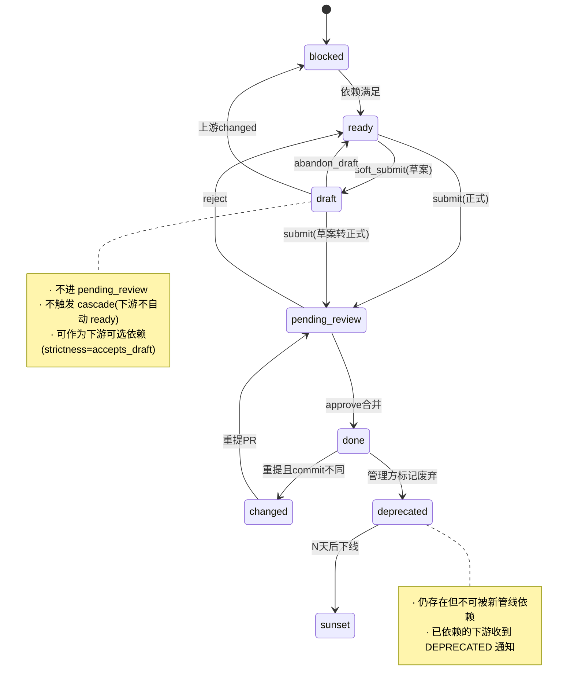
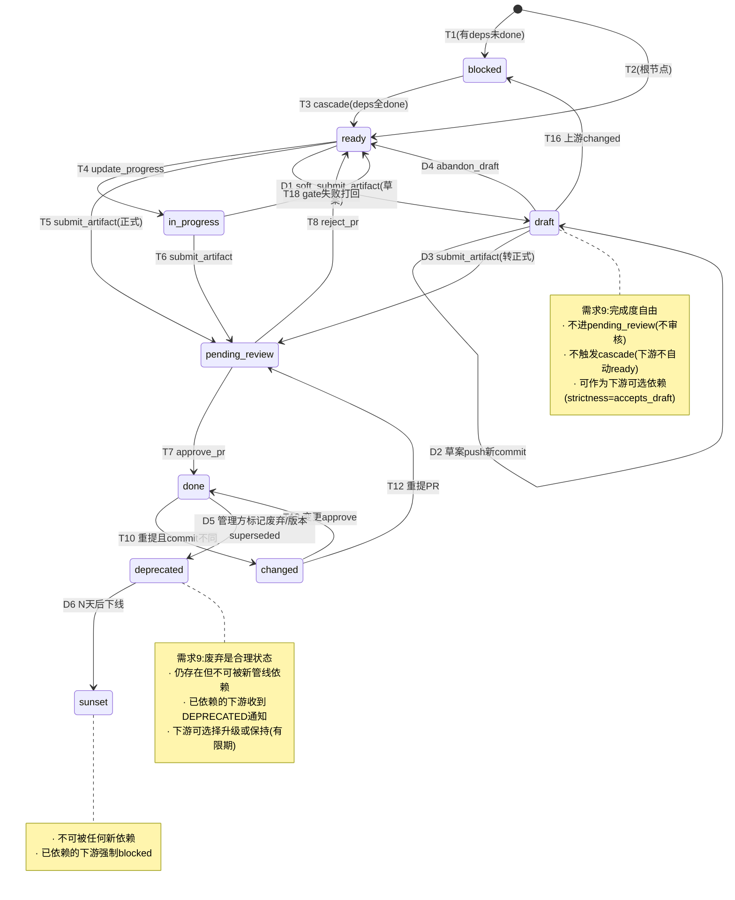

# 第三轮压力测试总报告:需求 9(产物自由)+ 单一 hub 仓模型重新走查

> **文档性质**:对第一轮 5 个场景文件在"RepoRegistry → 单一 hub 仓"修正后的重新走查汇总
> **版本**:v1.0 | **日期**:2026-08-04 | **状态**:架构评审输入
> **父文档**:[coordination-platform-prd.md](../coordination-platform-prd.md)
> **测试方法**:5 个并行 agent 各负责 1 个场景文件,针对需求 9(产物完全自由)+ 单一 hub 仓(各端共同提交)重新走查 16 个场景
> **核心原则**:需求 9"产物完全自由"——产物怎么定义由各端自己决定;设计只提供 figma 链接;客户端/服务端开发不限制方式,只提供产物和更新状态

---

## 1. 测试覆盖总览

### 1.1 测试场景矩阵

| 场景文件 | 场景编号 | 场景主题 | 核心压测点 |
|---|---|---|---|
| [scenario-artifact-trust.md](scenario-artifact-trust.md) | 场景 5 | 大文件产物(50MB 切图 zip) | hub 仓 clone 放大效应 + LFS 分层存储 |
| | 场景 8 | 引用型产物错误引用 | 跨托管代码仓 commit 校验 + 归属验证 |
| | 场景 9 | 管线热重载 | 产物路径与 pipeline_id 解耦 + 完成度自由 |
| [scenario-contract-versioning.md](scenario-contract-versioning.md) | 场景 1 | 契约中途变更(offset→cursor) | 破坏性 vs 兼容性变更分级级联 |
| | 场景 6 | 多格式契约(OpenAPI+gRPC+TS) | 多格式共存 + format_slot 依赖声明 |
| | 场景 14 | v2 不兼容版本共存 | 状态机缺 draft/deprecated/sunset + 多版本映射 |
| [scenario-exception-human.md](scenario-exception-human.md) | 场景 3 | 紧急 hotfix 插队 | hub 仓 main 合并锁 + 优先级队列 |
| | 场景 7 | 审批人缺席 | GitProvider 扩展 + CODEOWNERS 同步 |
| | 场景 11 | agent LLM 故障 | 人工 fallback 直提 hub 仓 + token 隔离 |
| | 场景 13 | 逆向打回 | hub 仓 revert PR + 引用型双层回滚 |
| [scenario-multi-team-rollback.md](scenario-multi-team-rollback.md) | 场景 4 | 跨团队接口协调 | 角色实例化 + 分支四维命名 + 权限三层校验 |
| | 场景 15 | 全链路回滚 | 引用型跨系统回滚 + 代码团队 ack |
| | 场景 16 | 多 Feature 并行 | 分支策略 + PR 审核队列拥塞 |
| [scenario-parallel-dependency.md](scenario-parallel-dependency.md) | 场景 2 | 设计稿延迟先行 | 草案依赖 accepts_draft + draft_dependent 态 |
| | 场景 12 | mock 数据先行 | artifact_qualifier 二维标记 + dev_alternatives |
| | 场景 10 | 跨管线共享契约 | hub:// 协议 + hub_ref 跨管线引用 |

### 1.2 缺陷统计

| 场景文件 | 场景数 | 缺陷总数 | Critical | High | Medium | Low |
|---|---|---|---|---|---|---|
| scenario-artifact-trust.md | 3 | 14 | 0 | 5 | 7 | 2 |
| scenario-contract-versioning.md | 3 | 17 | 1 | 9 | 7 | 0 |
| scenario-exception-human.md | 4 | 20 | 0 | 13 | 7 | 0 |
| scenario-multi-team-rollback.md | 3 | 19 | 0 | 9 | 9 | 1 |
| scenario-parallel-dependency.md | 3 | 13 | 0 | 8 | 5 | 0 |
| **合计** | **16** | **83** | **1** | **44** | **35** | **3** |

---

## 2. 五大根因分析

83 个缺陷归因为 5 大根因:

### 根因 1:状态机不完整(影响 22 个缺陷)

**问题**:7 态(blocked/ready/pending_review/in_progress/review/done/changed)无法表达需求 9"产物完成度自由"——草案/正式/废弃都是合理状态。

**表现**:
- 场景 14(Critical):需求 9 明确"草案/正式/废弃都是合理状态",但状态机无 deprecated/sunset/draft 态,需求与状态机直接矛盾
- 场景 2:草案产物无法作为下游依赖(draft 态不触发 cascade)
- 场景 9:产物完成度变更(草案→正式→废弃)与管线热重载冲突

**修正**:状态机扩展为 10 态,新增 draft/deprecated/sunset(详见 §3.1)。

### 根因 2:ArtifactRef 单值模型(影响 18 个缺陷)

**问题**:`dict[str, ArtifactRef]` 是 node_id → 单值引用,无法表达多版本/多格式/多 qualifier 共存。

**表现**:
- 场景 14:v1 和 v2 不兼容版本无法在 hub 仓同时保留
- 场景 6:OpenAPI/gRPC/TypeScript 多格式产物无法用单值 ArtifactRef 表达
- 场景 12:mock 数据与正式产物无法用 artifact_kind(仅 content/reference)区分

**修正**:ArtifactRef 升级为多版本映射 + artifact_qualifier 二维标记(详见 §3.2/§3.3)。

### 根因 3:单一 hub 仓单点故障(影响 15 个缺陷)

**问题**:所有端共用一个 hub 仓,hub 仓宕机 = 全局停摆;hub 仓 clone 体积随产物累积膨胀。

**表现**:
- 场景 3/7/11/13:hub 仓宕机时 hotfix/审批/人工 fallback/逆向打回全部卡死
- 场景 5:50MB 大文件入库导致 hub 仓 clone 爆炸
- 场景 16:多 Feature 并行时 PR 审核队列拥塞

**修正**:emergency_local_commit 降级系列 + HubRepoConfig clone_strategy + 大文件 LFS 分层(详见 §3.4/§3.5)。

### 根因 4:引用型产物管控盲区(影响 16 个缺陷)

**问题**:引用型产物(artifact_kind=reference)只做 git ls-remote 一次性存在性校验,不校验内容/归属/持续有效。

**表现**:
- 场景 8:错误引用(指向错误代码仓/commit)到联调才暴露
- 场景 1:T16 级联失效时清 hub 仓 commit,但代码仓 commit 不可变,引用历史丢失
- 场景 15:全链路回滚时,代码仓 HEAD 已漂移,引用型产物回滚需跨系统协调

**修正**:引用型产物分层清除 + 双层回滚 + commit_stability 分级 + 归属校验(详见 §3.6/§3.7)。

### 根因 5:权限模型扁平(影响 12 个缺陷)

**问题**:1 角色 = 1 agent = 1 套权限,无法表达多团队实例(团队 A/B 各有独立 server_agent)。

**表现**:
- 场景 4:跨服务端团队无法用单个 server_agent 协调
- 场景 4:分支命名 `feat/{role}/{node_type}-{seq}` 在多团队下冲突
- 场景 11:人工 fallback 直提 hub 仓,权限无法隔离

**修正**:RoleInstance 实例化 + 分支四维命名 + 权限三层校验 + human_submit_token(详见 §3.8/§3.9)。

---

## 3. P0 修正方案(14 项,跨场景共性)

### 3.1 状态机扩展为 10 态(P0,修正根因 1)

> 来源:场景 14(Critical)、场景 2、场景 9

在 7 态基础上新增 3 态:

| 新态 | 含义 | 进入条件 | 退出条件 |
|---|---|---|---|
| `draft` | 草案(未完成但可共享) | `soft_submit_artifact` | `submit_artifact`(转正式)/ `abandon_draft` |
| `deprecated` | 已废弃(仍存在但不推荐新依赖) | 管理方标记 / 版本 superseded | `sunset`(彻底下线) |
| `sunset` | 已下线(不可被新管线依赖) | deprecated 后 N 天 | —(终态) |



### 3.2 ArtifactRef 多版本映射(P0,修正根因 2)

> 来源:场景 14、场景 6

```python
class ArtifactRef(TypedDict):
    node_id: str
    repo: str                    # hub 仓地址
    path: str                    # hub 仓内路径
    commit: str                  # hub 仓 merge commit
    artifact_kind: str           # "content" | "reference"
    artifact_qualifier: str      # "official" | "mock" | "draft" | "experimental"(新增,与 kind 正交)
    # 引用型额外字段
    external_repo: str | None
    external_commit: str | None
    commit_stability: str        # "stable" | "volatile"(新增,引用型 commit 稳定性)
    toolspec_framework: str
    trace_id: str
    version: str                 # semver

# PipelineState 升级:支持多版本共存
class PipelineState(TypedDict):
    artifact_refs: dict[str, dict[str, ArtifactRef]]  # node_id → {version → ArtifactRef}(多版本)
    active_version: dict[str, str]                    # node_id → 当前生效版本
```

### 3.3 deps 增加 format_slot + strictness(P0,修正根因 2)

> 来源:场景 6(多格式)、场景 2(草案依赖)

```python
class DepDeclaration(TypedDict):
    node_id: str
    version_constraint: str       # semver 约束(如 ">=1.0.0 <2.0.0")
    format_slot: str | None       # 多格式产物:声明依赖哪个格式(如 "openapi" / "grpc" / "typescript")
    strictness: str               # "strict"(默认,要求 done) | "accepts_draft"(允许 draft 态上游)
    ref_label: str | None         # 引用型产物:声明依赖哪个 label(如 "user-service")
```

### 3.4 hub 仓单点故障降级系列(P0,修正根因 3)

> 来源:场景 3/7/11/13

| 降级工具 | 触发条件 | 行为 |
|---|---|---|
| `emergency_local_commit` | hub 仓宕机 | admin 在管理方本地暂存产物 manifest,标记 `pending_sync` |
| `sync_pending_artifacts` | hub 仓恢复 | 批量补提暂存的产物到 hub 仓,走快速审核通道 |
| `emergency_approve` | hub 仓宕机 + 紧急审批 | admin 本地记录审批决策,恢复后同步 PR 状态 |

### 3.5 HubRepoConfig 增强(P0,修正根因 3)

> 来源:场景 5(大文件)、场景 4(分支命名)、场景 16(容量)

```yaml
hub_repo:
  url: git@gitlab.internal:platform/artifact-hub.git
  provider: gitlab
  branch_naming: "feat/{pipeline_id}/{instance_id}/{node_type}-{seq}"  # 四维命名(新增)
  clone_strategy: partial          # full | partial | shallow | on_demand(新增)
  lfs:
    enabled: true                  # 大文件走 LFS(新增)
    threshold_mb: 10               # >10MB 自动走 LFS
  capacity:
    max_prs_per_hour: 50           # PR 审核队列限流(新增)
    max_concurrent_reviews: 10     # 并发审核上限(新增)
```

### 3.6 引用型产物分层清除 + 双层回滚(P0,修正根因 4)

> 来源:场景 1(级联)、场景 15(回滚)

T16 级联失效时,引用型产物分层处理:

| 层 | 行为 |
|---|---|
| hub 仓引用层 | 清除 `artifact_refs[node_id]`(hub 仓 commit 引用) |
| 代码仓 commit 层 | **不清除**(git 不可变),迁移到 `artifact_history[node_id]` |
| 跨系统通知 | 向代码仓团队发 `CODE_ROLLBACK_NEEDED` 通知,追踪 `pending_code_rollbacks` |

回滚策略分级:

| 产物类型 | 回滚方式 |
|---|---|
| 内容型(content) | 自动 revert PR(hub 仓) |
| 引用型(reference) | hub 仓 revert 引用 + 代码团队确认 `restore`(代码仓 HEAD 可能已漂移) |

### 3.7 引用型产物持续校验(P0,修正根因 4)

> 来源:场景 8(错误引用)

新增审核规则 + 工具:

| 规则/工具 | 说明 |
|---|---|
| `R_EXTERNAL_REF_OWNERSHIP` | 校验 `external_repo` 归属:提交方的 RoleInstance 是否有权引用该代码仓 |
| `R_COMMIT_STABILITY` | 引用型产物 `commit_stability=stable` 时拒绝 force-push 后的 commit |
| `verify_external_ref_ownership` | 新增 op:校验 commit 归属(代码仓 git log --author) |
| 定期 health check | 后台任务定期 `git ls-remote` 校验引用型 commit 仍存在 |

### 3.8 RoleInstance 实例化(P0,修正根因 5)

> 来源:场景 4(跨团队)

```python
class RoleInstance(TypedDict):
    instance_id: str              # 如 "team_a_server"、"team_b_server"
    role: str                     # "product" | "server" | "design" | "client"
    agent_config: dict            # LLM 配置、backstory、max_concurrent
    allowed_node_types: list[str] # 该实例可产出的节点类型
    allowed_external_repos: list[str]  # 该实例可引用的代码仓(新增,权限隔离)
    approvers: list[str]          # 该实例的审批人
```

`build_crew_for_ready_nodes` 升级:按 `role_assignments[node_id]` 中的 `instance_id` 分发到对应 RoleInstance,而非单值 `role_to_agent`。

### 3.9 权限三层校验 + 分支四维命名(P0,修正根因 5)

> 来源:场景 4、场景 16

| 校验层 | 规则 |
|---|---|
| L1: node_type | 提交方角色只能提交本端 node_type(server → api_contract/server_impl/server_test) |
| L2: instance_id | 提交方 RoleInstance 与 `role_assignments[node_id]` 匹配 |
| L3: external_repo | 引用型产物的 `external_repo` 在 RoleInstance.`allowed_external_repos` 内 |

分支命名:`feat/{pipeline_id}/{instance_id}/{node_type}-{seq}`(全局唯一,避免冲突)。

### 3.10 GitProvider 接口扩展(P0,修正根因 3/5)

> 来源:场景 7、场景 11

新增 7 项接口:

| 接口 | 用途 |
|---|---|
| `update_pr_reviewers` | 转交 PR reviewer(审批人缺席) |
| `get_codeowners` | 读取 CODEOWNERS 文件 |
| `update_codeowners` | 更新 CODEOWNERS(代理人转交) |
| `add_pr_comment` | PR 评论(审核反馈) |
| `submit_pr_review` | 提交 PR review(approve/reject) |
| `create_pr_lite` | 轻量 PR(人工 fallback) |
| `verify_commit_belongs` | 校验 commit 归属(引用型产物) |

### 3.11 节点类型开放命名空间(P0,修正根因 1)

> 来源:场景 2、场景 12(mock 数据)

节点类型从固定 9 种改为 `{role}.{name}` 命名空间:

```yaml
# 既有节点类型(向后兼容)
product_spec: { role: product, ... }
api_contract: { role: server, ... }

# 自定义节点类型(需求 9:各端自己定义和演进)
client.mock_data: { role: client, ... }
server.proto_gen: { role: server, ... }
```

SkillRegistry 三级匹配:精确(`client.mock_data`) → 角色兜底(`client.*`) → generic(`*`)。

### 3.12 artifact_qualifier 二维标记(P0,修正根因 2)

> 来源:场景 12(mock 数据)

`artifact_qualifier` 与 `artifact_kind` 正交:

| artifact_kind | artifact_qualifier | 含义 |
|---|---|---|
| content | official | 正式内容型产物 |
| content | mock | mock 数据产物 |
| content | draft | 草案内容型产物 |
| content | experimental | 实验性产物 |
| reference | official | 正式引用型产物 |
| reference | mock | 引用 mock 代码 commit |

hub 仓路径增加 qualifier 段:`features/{pipeline_id}/{node_type}/{qualifier}/{seq}_{slug}.{ext}`

### 3.13 跨管线引用 hub:// 协议(P0,修正根因 2)

> 来源:场景 10(跨管线共享)

```python
class DepDeclaration(TypedDict):
    node_id: str | None           # 管线内依赖(node_id)
    hub_ref: str | None           # 跨管线依赖(新增):"hub://{pipeline_id}/{node_id}@{version}"
```

`hub_ref` 绕过 `DANGLING_REF` 校验(跨管线节点不在本管线 node 表内)。

### 3.14 human_submit_token 权限隔离(P0,修正根因 5)

> 来源:场景 11(agent 故障人工 fallback)

| token 类型 | 权限 |
|---|---|
| `bot_token`(管理方 bot) | merge 权限(approve_pr) |
| `human_submit_token`(per-user) | 仅允许推 feat 分支 + 开 PR,**无 merge 权限** |
| `admin_token`(admin) | 全部权限(含 emergency_local_commit) |

---

## 4. 主 PRD 修正建议

### 4.1 必须回写的章节(P0)

| PRD 章节 | 修正内容 | 关联修正项 |
|---|---|---|
| §2 术语表 | 状态机改为 10 态 | §3.1 |
| §5.1 ArtifactRef | 增 artifact_qualifier / commit_stability / version | §3.2/§3.12 |
| §5.1 PipelineState | artifact_refs 改多版本映射 | §3.2 |
| §FR2.1 状态机 | 新增 draft/deprecated/sunset 转移 | §3.1 |
| §FR2.2 DAG 规则 | deps 增 format_slot / strictness / hub_ref | §3.3/§3.13 |
| §FR2.5 控制节点 | T16 引用型分层清除 | §3.6 |
| §FR3.1 角色 | RoleInstance 实例化 | §3.8 |
| §FR4.1 MCP 工具 | 增 emergency_*/sync_pending_artifacts/soft_submit_artifact | §3.4 |
| §FR6 审核 | 权限三层校验 + R_EXTERNAL_REF_OWNERSHIP | §3.7/§3.9 |
| 附录 D8(新增) | 第三轮压力测试修正记录 | 全部 |

### 4.2 整体状态机扩展图



---

## 5. 修正优先级矩阵

| 优先级 | 修正项 | 影响 | 阶段 |
|---|---|---|---|
| **P0** | 状态机 10 态(§3.1) | 22 缺陷 | Phase 1 |
| **P0** | ArtifactRef 多版本 + qualifier(§3.2/§3.12) | 18 缺陷 | Phase 1 |
| **P0** | hub 仓降级系列(§3.4) | 15 缺陷 | Phase 1 |
| **P0** | 引用型分层清除 + 双层回滚(§3.6) | 16 缺陷 | Phase 1 |
| **P0** | RoleInstance + 权限三层(§3.8/§3.9) | 12 缺陷 | Phase 1 |
| **P1** | deps format_slot/strictness/hub_ref(§3.3/§3.13) | 8 缺陷 | Phase 2 |
| **P1** | GitProvider 扩展 7 接口(§3.10) | 6 缺陷 | Phase 2 |
| **P1** | 节点类型开放命名空间(§3.11) | 5 缺陷 | Phase 2 |
| **P1** | 引用型持续校验(§3.7) | 4 缺陷 | Phase 2 |
| **P2** | HubRepoConfig 增强(§3.5) | 3 缺陷 | Phase 3 |
| **P2** | human_submit_token(§3.14) | 2 缺陷 | Phase 3 |

---

## 6. 第三轮关键认知

1. **需求 9"自由"≠"无约束"**:格式/方法论/完成度自由,但分支/路径/seq/权限需全局唯一——自由边界在"管理约束"之内
2. **单一 hub 仓是"信息枢纽"而非"权限枢纽"**:权限隔离需在 RoleInstance + CODEOWNERS 层补充
3. **引用型产物是"代码仓的 hub 仓投影"**:回滚需跨系统协调(代码团队 ack),管理方不强制但协调
4. **状态机必须覆盖产物全生命周期**:draft(草案)→ done(正式)→ deprecated(废弃)→ sunset(下线),对应需求 9"完成度自由"
5. **单一 hub 仓放大单点故障**:所有异常流程需补充 emergency_* 降级系列
6. **第一轮部分修正未采纳追踪**:change_type/derived_from/deprecated 在 RepoRegistry→hub 仓修正中未采纳,需建立修正追踪机制

---

## 7. 测试场景明细索引

| 场景文件 | 第三轮章节 | Mermaid 图数 |
|---|---|---|
| [scenario-artifact-trust.md](scenario-artifact-trust.md) §3 | 3 场景重新走查 + 缺陷汇总 | 3 |
| [scenario-contract-versioning.md](scenario-contract-versioning.md) §3 | 3 场景重新走查 + 缺陷汇总 | 2 |
| [scenario-exception-human.md](scenario-exception-human.md) §3 | 4 场景重新走查 + 缺陷汇总 | 4 |
| [scenario-multi-team-rollback.md](scenario-multi-team-rollback.md) §3 | 3 场景重新走查 + 缺陷汇总 | 3 |
| [scenario-parallel-dependency.md](scenario-parallel-dependency.md) §3 | 3 场景重新走查 + 缺陷汇总 | 3 |
| **合计** | **16 场景** | **15 张 Mermaid 图** |
