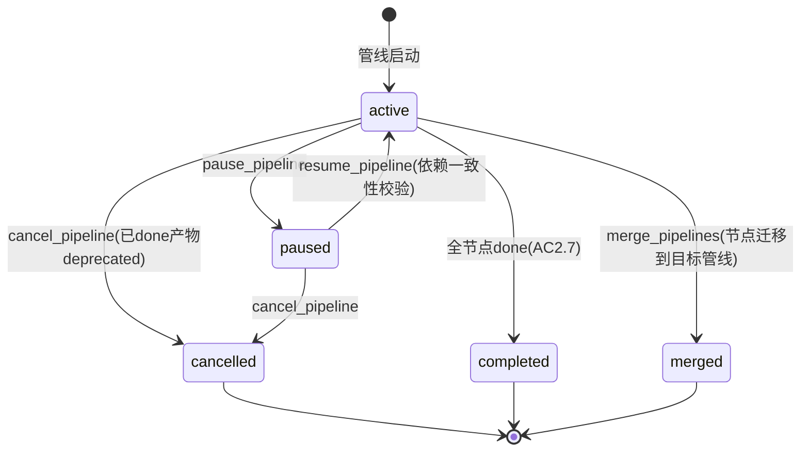

# 第四轮压力测试总报告:安全合规 / 外部依赖 / 管线生命周期 / 产物消费 / Agent 行为

> **文档性质**:对《coordination-platform-prd.md》v2.0 + 第三轮修正的第四轮压力测试汇总
> **版本**:v1.0 | **日期**:2026-08-04 | **状态**:架构评审输入
> **父文档**:[coordination-platform-prd.md](../coordination-platform-prd.md)
> **测试方法**:5 个并行 agent 各负责 1 类未覆盖维度,共 20 个新场景(A17-A36)
> **核心目标**:寻找前三轮(48 场景)未覆盖的真实开发场景,暴露新的"纸上谈兵"设计缺陷

---

## 1. 第四轮覆盖维度(前三轮未覆盖)

### 1.1 为什么需要第四轮

前三轮 48 个场景覆盖了产物管理/异常流程/多团队/并行依赖/并发/跨仓/演进/运维,但系统盘点后发现 5 类真实开发中必遇的场景**完全未覆盖**:

| 未覆盖维度 | 为什么重要 | 前三轮盲区 |
|---|---|---|
| 安全合规 | 产物仓库是"信息枢纽",密钥泄露/恶意提交/密级混放是生产必遇 | PRD 无安全模型,管理方"不解析内容"与安全扫描存在根本张力 |
| 外部依赖失效 | 需求 9"只提供 figma 链接/引用",但外部资源会失效 | PRD 只有"提交时校验存在性",无"提交后持续监控失效" |
| 管线生命周期 | feature 会被取消/暂停/合并/拆分 | PRD 只有节点级状态机,无管线级生命周期管理 |
| 产物自动消费 | 需求 3"自动同步管理方",但 done 后如何触发 CI/CD/SDK/文档 | PRD 只有 cascade 解锁下游节点,无产物 done 后的外部消费机制 |
| AI agent 行为 | 需求 8 自建 LLM agent,行为有不确定性 | PRD 假设 agent 行为正确,未覆盖误判/越权/遗忘/成本失控 |

### 1.2 测试场景矩阵

| 场景文件 | 场景编号 | 场景主题 | 核心压测点 |
|---|---|---|---|
| [scenario-security-compliance.md](scenario-security-compliance.md) | A17 | 产物密钥泄露 | CI 无 secret scanning + git 历史不可变 |
| | A18 | 恶意提交/供应链攻击 | 产物无完整性校验 + 无 URL 安全检测 |
| | A19 | 密级产物混入 hub 仓 | 扁平权限模型无密级维度 |
| | A20 | 合规审计与溯源 | 事件流 in-memory + audit_log 无 hash 链 |
| [scenario-external-dependency.md](scenario-external-dependency.md) | A21 | Figma 链接失效 | 需求 9"只提供链接" vs 链接会失效 |
| | A22 | 第三方 API 变更 | api_contract 依赖第三方,变更无感知 |
| | A23 | 开源依赖 CVE | 引用型产物指向含漏洞 commit |
| | A24 | 跨管线共享产物外部失效 | hub:// 跨管线引用,失效不通知 |
| [scenario-pipeline-lifecycle.md](scenario-pipeline-lifecycle.md) | A25 | 管线取消(feature 砍) | 无管线级 cancelled 状态 |
| | A26 | 管线暂停与恢复 | 无管线级 paused 状态 |
| | A27 | 管线合并 | 节点 ID 冲突 + 产物合并 |
| | A28 | 管线拆分 | 跨拆分管线依赖 + 产物归属 |
| [scenario-artifact-consumption.md](scenario-artifact-consumption.md) | A29 | 产物 done 触发 CI/CD | notify 仅飞书/Slack,无 CI/CD 触发 |
| | A30 | 自动生成多端 SDK | 无派生产物模型 |
| | A31 | 设计稿自动发布门户 | 无产物 done 副作用机制 |
| | A32 | 文档自动发布 | 无文档发布机制 |
| [scenario-agent-behavior.md](scenario-agent-behavior.md) | A33 | agent 误判完成度 | 不解析内容 vs 完整性谁校验 |
| | A34 | agent 越权提交 | 权限校验 vs LLM 社交工程 |
| | A35 | agent 上下文丢失 | get_dependencies 全量返回 vs 上下文窗口 |
| | A36 | agent 成本失控 | 无成本控制 + LLM 循环消耗 |

### 1.3 缺陷统计

| 场景文件 | 场景数 | 缺陷数 | Critical | High | Medium | Low |
|---|---|---|---|---|---|---|
| scenario-security-compliance.md | 4 | 20 | 2 | 10 | 8 | 0 |
| scenario-external-dependency.md | 4 | 19 | 3 | 10 | 5 | 1 |
| scenario-pipeline-lifecycle.md | 4 | 21 | 4 | 8 | 8 | 1 |
| scenario-artifact-consumption.md | 4 | 18 | 5 | 9 | 4 | 0 |
| scenario-agent-behavior.md | 4 | 21 | 3 | 8 | 10 | 0 |
| **合计** | **20** | **99** | **17** | **45** | **35** | **2** |

---

## 2. 七大根因分析

99 个缺陷归因为 7 大根因(前 5 个与第三轮根因延续,后 2 个为第四轮新发现):

### 根因 1:管理方"不解析内容"与安全/质量校验的根本张力(影响 18 个缺陷)

**问题**:需求 9"产物完全自由" + 管理方"不解析内容"原则,导致安全扫描(密钥/恶意)、内容完整性、质量度量全部无定位。

**第四轮新发现**:
- A17:CI 无 secret scanning,密钥泄露到 hub 仓
- A18:产物无 content_integrity_hash,供应链攻击无检测
- A33:agent 误判完成度,内容完整性零校验

**修正定位**:安全扫描是"管理约束"(类比已有的 `R_NO_PATH_TRAVERSAL` 扫描 path 内容查 `..`),不是"内容解析"。扩展安全规则族 `R_SECRET_SCAN`/`R_URL_SAFETY`/`R_MALWARE_SCAN` + 结构化完整性契约 `completeness_contract`。

### 根因 2:外部依赖持续监控缺失(影响 15 个缺陷)

**问题**:PRD 只有"提交时校验存在性"(git ls-remote),没有"提交后持续监控失效"。外部资源(figma 链接/第三方 API/代码仓 commit)会失效,但产物仍标记 done。

**第四轮新发现**:
- A21:Figma 链接被删/改权限,产物仍 done
- A22:第三方 API v1→v2,产物仍 done
- A23:代码仓依赖 CVE,引用型产物仍指向旧 commit
- A24:跨管线共享产物失效,不通知其他管线

**修正**:manifest 新增 `external_resources`/`third_party_apis`/`security_monitoring` 声明 + ExternalHealthMonitor 后台任务 + 状态机新增 done→deprecated 自动转移。

### 根因 3:管线级生命周期管理空白(影响 21 个缺陷)

**问题**:PRD 只有节点级状态机(10 态),无管线级生命周期。管线取消/暂停/合并/拆分是真实开发中必遇操作,但 PRD 只有"管线全节点 done 时自动终止"(AC2.7)。

**第四轮新发现**:
- A25:管线取消,in_progress 锁不释放,已 done 产物不 deprecated
- A26:管线暂停,agent 资源不释放,恢复后依赖不一致
- A27:管线合并,节点 ID 冲突,产物合并冲突
- A28:管线拆分,跨拆分管线依赖,产物归属变更

**修正**:管线级 5 态状态机(active/paused/cancelled/merged/completed)+ 5 个管线级 MCP 工具 + 节点 ID 全局唯一(`{pipeline_id}.{local_id}`)+ 级联延迟挂起。

### 根因 4:产物 done 后的外部消费机制缺失(影响 18 个缺陷)

**问题**:需求 3"自动同步管理方",但产物 done 后如何触发 CI/CD/SDK 生成/文档发布?PRD 的 `notify` 控制节点只触发飞书/Slack 通知,无通用 webhook/消费订阅。

**第四轮新发现**:
- A29:server_impl done 后无法触发 CI/CD 部署
- A30:api_contract done 后无法自动生成多端 SDK
- A31:design_asset done 后无法自动发布到设计门户
- A32:api_contract done 后无法自动发布 API 文档

**修正**:manifest 新增 `consumers` 字段声明下游消费动作 + `notify` 扩展为通用事件出口 + 新增 `report_consumption_status`/`report_generation_status` MCP 工具 + 派生产物模型(`derived_artifact` 节点类型)。

### 根因 5:LLM agent 行为不确定性未护栏(影响 21 个缺陷)

**问题**:需求 8 自建 LLM agent,但 PRD 的异常处理全针对"agent 崩溃"(场景 11),未覆盖"agent 行为异常"(误判/越权/遗忘/成本失控)。LLM agent 失败是"活着但做错",比"崩溃"更隐蔽。

**第四轮新发现**:
- A33:agent 误判产物完成度,错误标记 done
- A34:agent 越权提交,LLM 社交工程绕过权限
- A35:agent 上下文丢失,长管线遗忘早期决策
- A36:agent 成本失控,LLM 循环消耗 token

**修正**:结构化完整性契约 `completeness_contract` + 三层硬预算(Task/Agent/管线/平台级)+ agent 身份强绑定(session 级 token)+ 关键约束提取 `key_constraints` + agent 行为基线告警。

### 根因 6:权限模型无密级维度(影响 8 个缺陷,第四轮新发现)

**问题**:第三轮已加权限三层校验(node_type/instance_id/external_repo),但权限模型只有"角色→node_type"维度,无"产物密级"维度。单一 hub 仓中涉密产物和公开产物混放。

**第四轮新发现**:
- A19:涉密产物被无权限人员看到
- A19:get_dependencies 无密级过滤

**修正**:manifest 新增 `classification`(public/internal/confidential/restricted)+ RoleInstance 新增 `clearance`(可见密级)+ get_dependencies 密级过滤。

### 根因 7:审计防篡改与导出不完整(影响 6 个缺陷,第四轮新发现)

**问题**:PRD 的 events 事件流是 in-memory(PipelineState),管线结束/重启后事件丢失。get_audit_log 无 hash 链,可被 DBA 篡改。合规导出缺失。

**第四轮新发现**:
- A20:审计日志无 hash 链,不可篡改保证缺失
- A20:合规导出缺失

**修正**:audit_log hash 链(prev_hash/entry_hash)+ WORM 锚定 + `export_compliance_report` 工具 + 可配置保留策略。

---

## 3. P0 修正方案(18 项,跨场景共性)

### 3.1 安全扫描规则族(根因 1,P0)

> 来源:A17/A18/A33

| 规则 | op | 说明 |
|---|---|---|
| `R_SECRET_SCAN` | `secret_scan` | CI 密钥扫描零容忍阻断入 main |
| `R_URL_SAFETY` | `url_safety_check` | 拦截 SSRF(私网 IP)/钓鱼域名 |
| `R_MALWARE_SCAN` | `malware_scan` | 恶意特征扫描 |
| `R_COMPLETENESS_CONTRACT` | `structure_exists` | 结构化完整性校验(如 `$.errors` 非空) |

**定位**:安全扫描是"管理约束"(类比 `R_NO_PATH_TRAVERSAL`),不是"内容解析"。

### 3.2 产物完整性 provenance(根因 1,P0)

> 来源:A17/A18

```python
class ArtifactRef(TypedDict):
    # ... 既有字段
    content_integrity_hash: str    # 新增:SHA-256(产物内容),防篡改
    provenance: Provenance         # 新增:溯源信息

class Provenance(TypedDict):
    submitter_instance_id: str     # 提交方 RoleInstance
    submitter_token_scope: str     # token 权限范围
    llm_model: str                 # LLM 模型版本(prompt injection 溯源)
    llm_prompt_hash: str           # prompt hash
    submitted_at: str
    merged_at: str
    reviewer: str
```

### 3.3 产物密级与权限(根因 6,P0)

> 来源:A19

```python
# manifest 新增
classification: str    # "public" | "internal" | "confidential" | "restricted"

# RoleInstance 新增
class RoleInstance(TypedDict):
    # ... 既有字段
    clearance: str      # 该实例可见的最高密级

# get_dependencies 密级过滤
def get_dependencies(node_id, caller_instance_id):
    upstream = get_upstream(node_id)
    caller_clearance = get_instance(caller_instance_id).clearance
    for dep in upstream:
        if dep.classification > caller_clearance:
            return {"status": "denied", "reason": "classification_exceeds_clearance"}
```

### 3.4 审计 hash 链(根因 7,P0)

> 来源:A20

```sql
CREATE TABLE audit_log (
    entry_id BIGSERIAL PRIMARY KEY,
    pipeline_id TEXT NOT NULL,
    node_id TEXT,
    action TEXT NOT NULL,
    actor TEXT NOT NULL,
    payload JSONB,
    prev_hash TEXT NOT NULL,     -- 前一条 entry 的 hash
    entry_hash TEXT NOT NULL,    -- 本条 hash(SHA-256(prev_hash + action + actor + payload))
    created_at TIMESTAMPTZ NOT NULL DEFAULT now()
);
-- WORM:只允许 INSERT,不允许 UPDATE/DELETE(通过权限控制)
```

### 3.5 外部依赖声明与监控(根因 2,P0)

> 来源:A21/A22/A23/A24

```python
# manifest 新增
external_resources: list[ExternalResource]    # figma 链接等
third_party_apis: list[ThirdPartyAPI]          # 第三方 API 依赖
security_monitoring: SecurityMonitoring        # CVE 监控配置

class ExternalResource(TypedDict):
    type: str           # "figma" | "url" | "api"
    url: str
    health_check: str   # "head" | "get" | "ls-remote"

# 后台监控任务
class ExternalHealthMonitor:
    """定期 health check 外部依赖,失效时触发 done→deprecated"""
    def run(self):
        for artifact in get_all_done_artifacts():
            for resource in artifact.external_resources:
                if not self.check_reachable(resource):
                    self.trigger_deprecated(artifact.node_id, reason="external_resource_unreachable")
```

### 3.6 管线级 5 态状态机(根因 3,P0)

> 来源:A25/A26/A27/A28

| 管线状态 | 含义 | 进入条件 | 退出条件 |
|---|---|---|---|
| `active` | 正常运行 | 管线启动 | paused/cancelled/completed |
| `paused` | 暂停 | `pause_pipeline` | `resume_pipeline` |
| `cancelled` | 取消 | `cancel_pipeline` | —(终态) |
| `merged` | 已合并到其他管线 | `merge_pipelines` | —(终态) |
| `completed` | 全节点 done | AC2.7 | —(终态) |



### 3.7 管线级 MCP 工具(根因 3,P0)

> 来源:A25/A26/A27/A28

| 工具 | 调用方 | 作用 |
|---|---|---|
| `cancel_pipeline` | admin | 取消管线(in_progress 释放锁,已 done 产物 deprecated) |
| `pause_pipeline` | admin | 暂停管线(ready 不 dispatch,级联挂起 cascade_pending) |
| `resume_pipeline` | admin | 恢复管线(依赖一致性校验 + 应用 cascade_pending) |
| `merge_pipelines` | admin | 合并管线(节点 ID 重映射 + 产物归属迁移) |
| `split_pipeline` | admin | 拆分管线(节点分配 + 跨拆分管线 hub:// 依赖) |

### 3.8 节点 ID 全局唯一(根因 3,P0)

> 来源:A27/A28

节点 ID 从 `local_id` 改为 `{pipeline_id}.{local_id}`,解决合并/拆分时 key 冲突。

### 3.9 产物消费订阅机制(根因 4,P0)

> 来源:A29/A30/A31/A32

```python
# manifest 新增
consumers: list[ArtifactConsumer]

class ArtifactConsumer(TypedDict):
    type: str           # "webhook" | "api_call" | "internal"
    target: str         # webhook URL / API endpoint / 内部处理器
    event: str          # "done" | "changed" | "deprecated"
    on_failure: str     # "ignore" | "mark_changed" | "alert"
    idempotency_key: str  # "${node_id}:${version}"
```

`notify` 控制节点扩展:从"仅飞书/Slack"扩展为"通用事件出口",读取 `consumers` 分发。

### 3.10 消费状态回传工具(根因 4,P0)

> 来源:A29/A30

| 工具 | 说明 |
|---|---|
| `report_consumption_status` | 外部 CI/CD 回传部署状态(成功/失败) |
| `report_generation_status` | SDK 生成器回传生成结果 |

### 3.11 派生产物模型(根因 4,P1)

> 来源:A30/A32

新增 `derived_artifact` 节点类型 + `generator` 角色 + `derived_from` 字段:

```python
class ArtifactRef(TypedDict):
    # ... 既有字段
    derived_from: str | None    # 新增:派生自哪个产物(如 SDK 派生自 api_contract)
```

### 3.12 结构化完整性契约(根因 1/5,P0)

> 来源:A33

```yaml
# skill.yaml 新增
completeness_contract:
  required_structures:
    - jsonpath: "$.endpoints"
      min_items: 1
    - jsonpath: "$.errors"
      min_items: 1
  on_fail: reject    # 结构缺失时 reject
```

### 3.13 三层硬预算(根因 5,P0)

> 来源:A36

| 层级 | 限额 | 触发动作 |
|---|---|---|
| Task 级 | 20k token / 3 次重试 | 硬中断,转 `needs_human` |
| Agent 级 | $10/日 | 排队等待 |
| 管线级 | $100 | 暂停管线 |
| 平台级 | $4000 | 全局降级(切便宜模型) |

### 3.14 agent 身份强绑定(根因 5,P0)

> 来源:A34

token 从 RoleInstance 级升级为 session 级:绑定 `node_id + allowed_tools + expires_at`,防止 LLM 社交工程越权。

### 3.15 关键约束提取与高亮(根因 5,P0)

> 来源:A35

```python
# get_dependencies 返回结构
{
    "node_id": "n1",
    "content": "...",              # 全量内容
    "key_constraints": [           # 新增:结构化关键约束
        {"level": "must", "text": "必须支持多语言"},
        {"level": "must", "text": "不能使用同步阻塞"},
    ]
}
```

agent backstory 强制:"必须遵守 `key_constraints` 中 `level=must` 的约束"。

### 3.16 agent 行为基线与告警(根因 5,P1)

> 来源:A33/A34/A36

定义允许调用序列,偏离基线告警(ALR-13~15):循环检测/越权尝试/成本异常。

### 3.17 跨管线引用注册表(根因 2,P0)

> 来源:A24

```sql
CREATE TABLE cross_pipeline_reference (
    source_pipeline_id TEXT NOT NULL,
    source_node_id TEXT NOT NULL,
    target_pipeline_id TEXT NOT NULL,
    target_node_id TEXT NOT NULL,
    version_constraint TEXT,
    registered_at TIMESTAMPTZ NOT NULL DEFAULT now(),
    PRIMARY KEY (source_pipeline_id, source_node_id, target_pipeline_id, target_node_id)
);
```

deprecated 时查此表,通知所有引用方管线。

### 3.18 安全事件响应闭环(根因 1,P0)

> 来源:A17/A18

新增 `handle_security_incident` 工具:安全事件创建 → 产物标记 `compromised` → 通知责任人 → 密钥轮换 → tombstone 替换 REDACTED → 审计记录。

---

## 4. 修正优先级矩阵

| 优先级 | 修正项 | 影响缺陷数 | 阶段 |
|---|---|---|---|
| **P0** | 安全扫描规则族(§3.1) | 18 | Phase 1 |
| **P0** | 产物完整性 provenance(§3.2) | 12 | Phase 1 |
| **P0** | 产物密级与权限(§3.3) | 8 | Phase 1 |
| **P0** | 审计 hash 链(§3.4) | 6 | Phase 1 |
| **P0** | 外部依赖声明与监控(§3.5) | 15 | Phase 1 |
| **P0** | 管线级 5 态状态机(§3.6) | 21 | Phase 1 |
| **P0** | 管线级 MCP 工具(§3.7) | 21 | Phase 1 |
| **P0** | 节点 ID 全局唯一(§3.8) | 8 | Phase 1 |
| **P0** | 产物消费订阅机制(§3.9) | 18 | Phase 1 |
| **P0** | 消费状态回传工具(§3.10) | 10 | Phase 1 |
| **P0** | 结构化完整性契约(§3.12) | 6 | Phase 1 |
| **P0** | 三层硬预算(§3.13) | 8 | Phase 1 |
| **P0** | agent 身份强绑定(§3.14) | 5 | Phase 1 |
| **P0** | 关键约束提取(§3.15) | 5 | Phase 1 |
| **P0** | 跨管线引用注册表(§3.17) | 4 | Phase 1 |
| **P0** | 安全事件响应闭环(§3.18) | 6 | Phase 1 |
| **P1** | 派生产物模型(§3.11) | 8 | Phase 2 |
| **P1** | agent 行为基线告警(§3.16) | 6 | Phase 2 |

---

## 5. 第四轮关键认知

1. **"不解析内容"原则需要重新定义边界**:安全扫描(密钥/恶意/完整性)是"管理约束"(类比 `R_NO_PATH_TRAVERSAL`),不是"内容解析"——管理方校验"仓库安全"而非"业务语义"
2. **外部依赖是产物的"暗物质"**:figma 链接/第三方 API/代码仓 commit 都会失效,提交时校验不够,需要持续监控 + 自动 deprecated
3. **管线是"有生命周期"的**:不是只有"启动→全 done 终止",还有取消/暂停/合并/拆分——管线级状态机与节点级状态机正交
4. **产物 done 不是终点,是消费的起点**:需求 3"自动同步管理方"意味着产物 done 后要触发 CI/CD/SDK/文档发布——需要消费订阅机制
5. **LLM agent ≠ 传统代码 agent**:传统 agent 失败是"崩溃"(可 try/catch),LLM agent 失败是"误判/越权/遗忘/失控"(活着但做错)——需要行为护栏 + 成本硬约束
6. **单一 hub 仓放大安全风险**:所有产物集中,密钥泄露/恶意提交/密级混放的影响范围是全量的——安全模型必须前置
7. **审计不只是"看历史",是"合规证据"**:金融/医疗要求审计日志不可篡改 + 可导出 + 可追溯——hash 链 + WORM 是刚需

---

## 6. 四轮压力测试累计统计

| 轮次 | 场景数 | 缺陷数 | Critical | High | 核心覆盖维度 |
|---|---|---|---|---|---|
| 第一轮 | 16 | ~80 | 0 | ~40 | 节点粒度/依赖模型/跨管线共享 |
| 第二轮 | 12 | 107 | 0 | ~50 | 并发竞争/跨仓库引用/演进迁移/运维操作 |
| 第三轮(重新走查) | 16 | 83 | 1 | 44 | 需求 9 + 单一 hub 仓重新走查 |
| **第四轮** | **20** | **99** | **17** | **45** | **安全合规/外部依赖/管线生命周期/产物消费/agent 行为** |
| **累计** | **64** | **~369** | **18** | **~179** | **5 大维度全覆盖** |

**趋势分析**:
- 第四轮 Critical 缺陷(17 个)远超前三轮总和(1 个)——说明前三轮未覆盖的维度(安全/外部依赖/管线生命周期/产物消费/agent 行为)是**更高危的设计盲区**
- 第四轮每个维度都有 Critical 缺陷,验证了"这 5 类场景确实未被覆盖且非常重要"

---

## 7. 测试场景明细索引

| 场景文件 | 场景数 | Mermaid 图数 |
|---|---|---|
| [scenario-security-compliance.md](scenario-security-compliance.md) | 4(A17-A20) | 5 |
| [scenario-external-dependency.md](scenario-external-dependency.md) | 4(A21-A24) | 5 |
| [scenario-pipeline-lifecycle.md](scenario-pipeline-lifecycle.md) | 4(A25-A28) | 5 |
| [scenario-artifact-consumption.md](scenario-artifact-consumption.md) | 4(A29-A32) | 5 |
| [scenario-agent-behavior.md](scenario-agent-behavior.md) | 4(A33-A36) | 4 |
| **合计** | **20** | **24 张 Mermaid 图** |
