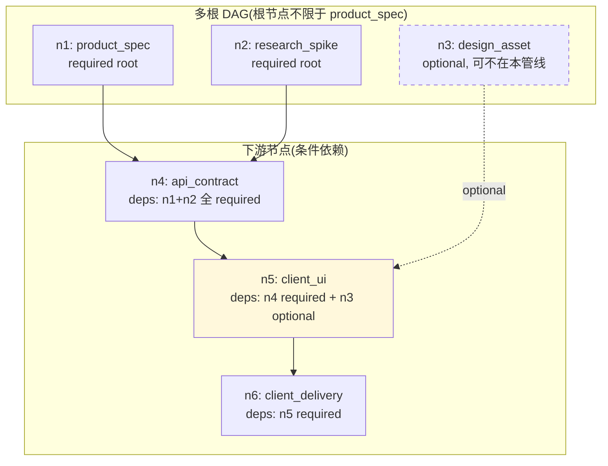
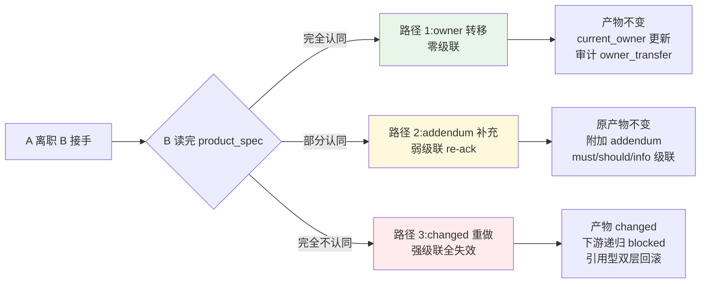
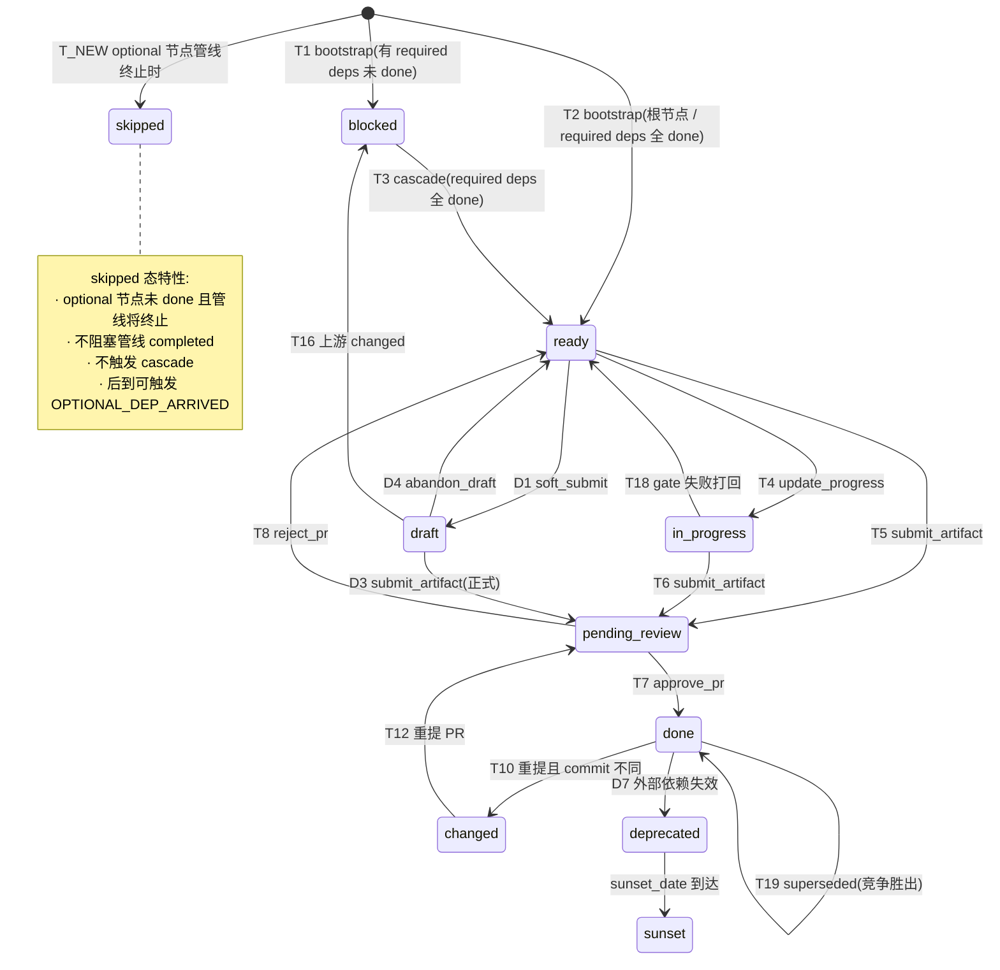

# 第五轮压力测试总报告:全流程灵活性与角色缺位

> **文档性质**:对《coordination-platform-prd.md》v3.0 的第五轮压力测试汇总
> **版本**:v1.0 | **日期**:2026-08-04 | **状态**:架构评审输入
> **父文档**:[coordination-platform-prd.md](../coordination-platform-prd.md)
> **测试方法**:聚焦"全流程开发"中**角色缺位、人员交接、多源头并行、可选依赖**四类真实场景,验证需求 1"通用性"
> **场景文件**:
> - [scenario-role-absence.md](./scenario-role-absence.md)(A37-A39)
> - [scenario-owner-handover.md](./scenario-owner-handover.md)(A40)
> - [scenario-multi-source-optional-dep.md](./scenario-multi-source-optional-dep.md)(A41)

---

## 1. 测试覆盖

| 场景 | 主题 | 参与角色 | 缺失角色/维度 | 缺陷数 | Critical | High |
|---|---|---|---|---|---|---|
| A37 | 纯 UI 驱动(banner 换皮) | design + client | product + server | 4 | 1 | 1 |
| A38 | 纯服务端(数据清洗) | product + server | design + client | 3 | 0 | 1 |
| A39 | 纯客户端逻辑(埋点/网络层) | client(可选 product) | product + design + server | 5 | 1 | 3 |
| A40 | 产品 owner 交接(3 子场景) | product(A→B) | — | 10 | 1 | 6 |
| A41 | 多源头 + 可选依赖 | product + research + server + client | — | 10 | 2 | 4 |
| **合计** | **5 场景** | — | — | **32** | **5** | **15** |

**严重度分布**:5 Critical / 15 High / 12 Medium / 2 Low

---

## 2. 五大根因

第五轮 32 个缺陷可归为 5 大根因,均与"通用性"诉求直接相关:

### 根因 1:PRD 隐含"4 角色全参与 + product 唯一起点"假设(12 缺陷)

**表现**:
- A37 纯 UI 管线无 product_spec,DAG 根节点缺失,bootstrap_node 不知从何起
- A38 纯服务端管线无 design/client,但 server_impl 默认下游是 client_func,叶子节点无下游无法触发交付
- A41 多源头(product_spec + research_spike 并行),DAG 假设单根
- A39 client_func 强依赖 design_asset,纯逻辑功能无法独立存在

**根因**:PRD §2.1 节点类型清单和 §FR2.4 bootstrap_node 隐含"所有角色都参与、product_spec 是唯一源头"的工程假设,与需求 1"通用性"冲突。

### 根因 2:skill.deps 是静态硬约束,不支持条件依赖(8 缺陷)

**表现**:
- A37 design-handoff-skill.deps 硬编码 `[product_spec]`,纯 UI 管线无 product_spec 时 skill 无法匹配(Critical)
- A39 client-delivery-skill.deps 硬编码 `[client_ui, server_impl]`,纯逻辑功能无 UI 无 server 时阻断(Critical)
- A41 client-ui-skill.deps 硬编码 `[api_contract, design_asset]`,可选依赖 design_asset 时 skill 不知如何处理

**根因**:Constraint Skill 的 deps 字段是"静态全量依赖",不支持"条件依赖"(required: false + condition)。

### 根因 3:RoleInstance 团队级实例化,无人员级 owner 概念(7 缺陷)

**表现**:
- A40 产品经理 A 离职 B 接手,RoleInstance 只到团队级,无 owner 转移机制
- A40 子场景 2(B 部分认同):无"轻量补充"机制,要么不改要么触发 changed 全链路回滚
- provenance.submitter 是不可变历史,当前 owner 变了无法表达
- token/权限/agent 上下文(decision_log)无传承机制

**根因**:RoleInstance 解决了"多团队"(组织维度),但没解决"同团队内人员交接"(个人维度)——两者正交。

### 根因 4:DAG 级联和终止条件不支持"可选节点"(5 缺陷)

**表现**:
- A41 design_asset 是可选依赖,未 done 时 client_ui 是否 ready?级联公式未定义
- A41 optional dep 后到(已 done 下游是否 re-evaluate)?无机制
- A37/A39 可选角色未参与时,管线能否终止?AC2.7"全节点 done"会阻塞
- fork(全 done)和 optional(可选)语义混淆

**根因**:DAG 模型是"全量依赖 + 全 done 终止",不支持"部分依赖可选 + 部分节点可跳过"。

### 根因 5:节点类型清单不够通用,缺关键节点类型(3 缺陷)

**表现**:
- A39 纯客户端逻辑(埋点/网络层)无对应节点类型,client_func 是"UI 联调"不匹配
- A38 纯服务端管线无 server_delivery 节点(对称补全 client_delivery)
- A41 research_spike 虽在 PRD 但未在主节点类型清单(§2.1)中明确列出

**根因**:节点类型清单仍偏向"标准 4 角色全参与流程",未充分覆盖"角色缺位"场景的产物类型。

---

## 3. P0 修正项(17 项)

### 3.1 角色缺位(8 项 P0,来自 A37-A39)

| # | P0 修正 | 场景 | 章节 | 说明 |
|---|---|---|---|---|
| P0-R5.1 | skill.deps 支持条件依赖 | A37/A39/A41 | §FR5 | deps 新增 `required: false` + `condition` + `deps_mode: conditional` |
| P0-R5.2 | 新增 client_logic 节点类型 + client-logic-skill | A39 | §2.1 | 区分"UI 联调"(client_func)与"纯逻辑"(client_logic) |
| P0-R5.3 | 新增 server_delivery 节点类型 + server-delivery-skill | A38 | §2.1 | 对称补全 client_delivery,纯服务端管线有交付门禁 |
| P0-R5.4 | fr2 §7.3 加载校验对齐开放命名空间 | A39 | §FR2.7 | 修正"声称开放但实现封闭"矛盾,支持 {role}.{name} 自定义节点 |
| P0-R5.5 | pipeline.yaml 新增 participants 声明 | A37-A39 | §5 | 显式声明参与角色,agent 按需实例化 |
| P0-R5.6 | 节点类型清单补 research_spike | A41 | §2.1 | 明确列入主清单 |
| P0-R5.7 | 角色缺位管线模板(pure-ui/pure-server/pure-logic) | A37-A39 | §FR2 附录 | 预置 3 个标准模板 |
| P0-R5.8 | 轻量执行路径(execution_mode: lightweight) | A39 | §FR2 | 节点 ≤3 时跳过 CrewAI,用 MemorySaver + 简化 StateGraph |

### 3.2 owner 交接(5 项 P0,来自 A40)

| # | P0 修正 | 场景 | 章节 | 说明 |
|---|---|---|---|---|
| P0-R5.9 | ArtifactRef 新增 current_owner 字段 | A40 | §5.1 | 可变状态,与 provenance(不可变历史)解耦 |
| P0-R5.10 | transfer_owner MCP 工具 | A40 | §FR4 | 权限校验 + 密级继承 + 审计 action |
| P0-R5.11 | addendum 轻量补充机制 | A40 | §FR1/§FR2 | done 产物 append-only 附加,不改原内容/版本 |
| P0-R5.12 | addendum 分级级联(must/should/info) | A40 | §FR2 | must: incompatible 时下游 changed;should: warning;info: 不通知 |
| P0-R5.13 | revoke_human_token + 权限继承 | A40 | §FR4 | owner 转移时撤销旧 token,新 owner 继承权限 |

### 3.3 多源头 + 可选依赖(4 项 P0,来自 A41)

| # | P0 修正 | 场景 | 章节 | 说明 |
|---|---|---|---|---|
| P0-R5.14 | 多根 DAG 显式支持 | A41 | §FR2.4/AC2.1 | bootstrap 对所有根节点并行 fan-out,根节点不限于 product_spec |
| P0-R5.15 | DepDeclaration 新增 optional 标记 | A41 | §5 | `optional: true` 与 strictness 正交,4 种组合语义 |
| P0-R5.16 | 级联公式修正 | A41 | §FR2.2 | T3 ready 判定改为"仅 required deps 全 done"(optional 不参与) |
| P0-R5.17 | 状态机扩展 skipped 态 + AC2.7 修正 | A41 | §FR2.1/AC2.7 | optional 节点未 done 自动 skipped,终止条件改为"required 全 done" |

---

## 4. 关键设计图

### 4.1 通用管线模型(支持角色缺位 + 多源头 + 可选依赖)

### 4.2 owner 交接三种路径

### 4.3 状态机扩展(10 → 11 态,新增 skipped)

---

## 5. 五轮累计统计

| 轮次 | 场景数 | 缺陷数 | Critical | High | P0 修正 |
|---|---|---|---|---|---|
| 第一轮+第三轮 | 16 | 83 | 1 | 44 | 14 |
| 第二轮 | 12 | 107 | 0 | — | — |
| 第四轮 | 20 | 99 | 17 | 45 | 18 |
| **第五轮** | **5** | **32** | **5** | **15** | **17** |
| **累计** | **53** | **~321** | **23** | **~104** | **49** |

---

## 6. 核心认知升级

### 6.1 通用性的三层含义

第五轮揭示了"通用性"(需求 1)的三层含义,前四轮只覆盖了第一层:

| 层次 | 含义 | 覆盖轮次 |
|---|---|---|
| 第一层:产物格式通用 | 产物怎么定义由各端决定(YAML/JSON/Figma/Markdown) | 第一~四轮 |
| 第二层:角色组合通用 | 不是所有功能都需要 4 角色全参与(可缺位) | **第五轮** |
| 第三层:依赖拓扑通用 | 不是所有管线都单源头、全量依赖(可多源头、可选依赖) | **第五轮** |

### 6.2 两个正交维度

第五轮发现了两个之前未显式建模的正交维度:

1. **依赖严格性(strictness) × 依赖必要性(optional)**:第三轮引入 strictness(accepts_draft),第五轮引入 optional,组合出 4 种依赖语义
2. **团队维度(RoleInstance) × 个人维度(current_owner)**:第三轮 RoleInstance 解决多团队,第五轮 current_owner 解决人员交接,两者正交

### 6.3 产物修改的完整光谱

第五轮 addendum 机制补全了"产物修改"的完整光谱:

| 修改力度 | 机制 | 级联 | 场景 |
|---|---|---|---|
| 零修改 | owner 转移 | 零级联 | A40-1 完全认同 |
| 轻量补充 | addendum | 弱级联(must/should/info) | A40-2 部分认同 |
| 正式变更 | changed | 强级联(全链路失效) | A40-3 推翻重做 |

---

## 7. 下一步建议

1. **将 17 项 P0-R5 修正回写到主 PRD 各章节**(附录 D10 记录,各章节落地)
2. **更新 implementation-plan.md**:Phase 1 新增 P0-R5.1/R5.5/R5.14/R5.15/R5.16/R5.17(通用性基础),Phase 2 新增 P0-R5.9~R5.13(owner 交接)
3. **节点类型清单更新**:新增 client_logic、server_delivery、research_spike(正式列入 §2.1)
4. **状态机更新**:10 态 → 11 态(新增 skipped)
5. **第六轮压测方向**:若仍有余力,可测试"跨管线模板复用 + 多管线并发资源调度"(但预计边际收益递减)
