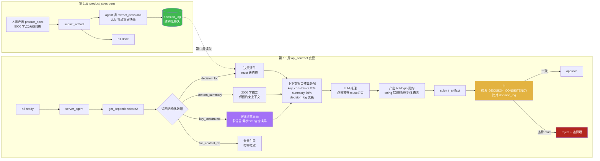
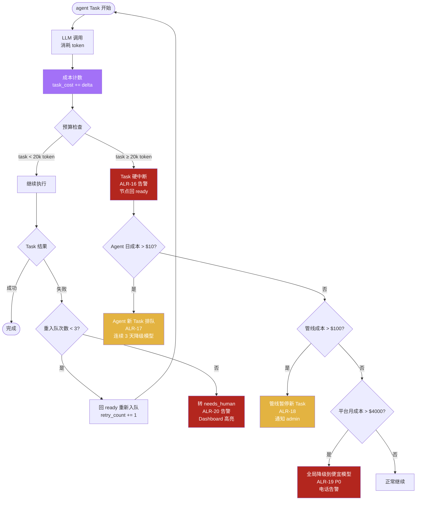

# 第四轮压力测试:AI agent 行为异常场景

> **文档性质**:对《coordination-platform-prd.md》v2.0 + 第三轮修正的第四轮压力测试
> **版本**:v1.0 | **日期**:2026-08-04 | **状态**:架构评审输入
> **测试方法**:选取 4 个 AI agent 行为异常真实场景(A33-A36)
> **父文档**:[coordination-platform-prd.md](../coordination-platform-prd.md)
> **核心张力**:LLM agent 行为不确定性(误判/越权/遗忘/成本失控) vs PRD 假设 agent 行为正确

---

## 0. 测试方法说明

### 0.1 测试动机

前三轮共测 48 个场景,其中**场景 11**测过"agent LLM 故障,协调提交失效,流程卡死"(agent 不可用)。但那是"agent 挂了"(进程级故障),不是"agent 行为异常"(agent 还活着但做错事)。

需求 8 用 LangGraph + CrewAI 自建 agent,agent 是 **LLM 驱动**的,行为有**不确定性**:误判、越权、上下文丢失、成本失控。PRD 通篇假设 agent 行为正确(FR3.1 行 321 "Agent 不执行开发,只协调提交"隐含 agent 会正确协调),但 LLM agent 会犯人类不会犯的错——这是传统代码 agent 与 LLM agent 的本质区别。

### 0.2 传统 agent vs LLM agent 的行为差异

| 维度 | 传统代码 agent(规则驱动) | LLM agent(CrewAI/LangGraph) |
|---|---|---|
| 行为确定性 | 确定性:输入相同 → 输出相同 | 不确定性:同输入可能不同输出(temperature > 0) |
| 错误模式 | 崩溃 / 超时 / 异常(可捕获) | 误判 / 幻觉 / 越权 / 遗忘(活着但做错) |
| 失败可预测性 | 高(异常栈明确) | 低(LLM 可能"自信地错") |
| 成本模型 | 固定(CPU/内存) | 变动(按 token 计费,可爆炸) |
| 上下文依赖 | 无(每次独立) | 强(依赖历史上下文,窗口有限) |
| 护栏需求 | try/catch + 超时 | 行为护栏 + 成本护栏 + 上下文护栏 + 越权护栏 |

### 0.3 本轮测试的 4 个场景

| 场景 | 名称 | agent 行为异常类型 | 核心张力 |
|---|---|---|---|
| A33 | agent 误判产物完成度 | 误判(认知错误) | "不解析内容"原则 vs 内容完整性谁校验 |
| A34 | agent 越权提交 | 越权(行为越界) | 权限三层校验 vs LLM 社交工程 |
| A35 | agent 上下文丢失 | 遗忘(记忆丢失) | get_dependencies 全量返回 vs LLM 上下文窗口 |
| A36 | agent 成本失控 | 成本失控(资源爆炸) | "不做成本管理(v3)" vs LLM 循环消耗 token |

### 0.4 走查方法

每个场景按以下结构走查:
1. **场景描述**:真实开发情境 + agent 具体行为异常
2. **PRD 走查**:对照具体章节(含行号),定位设计假设与漏洞
3. **设计缺陷**:编号 `D{A场景号}-R4.{序号}`,分级(Critical/High/Medium/Low)
4. **修正方案**:agent 行为护栏 + 成本控制 + 上下文管理(具体可实施)
5. **Mermaid 设计图**:场景时序图或修正后的流程图

---

## 1. 场景 A33:agent 误判产物完成度(错误标记 done)

### 1.1 场景描述

**真实情境**:登录功能管线,server_agent 处理 `api_contract` 节点(n2)。人员用 spec-kit 产出契约文件,但**漏写了错误码定义**(只有 happy path 的 200 响应,缺 401/403/429 等错误码)。

server_agent 的 LLM 推理过程:
1. 调 `get_dependencies(n2)` 拉取 `product_spec` 内容
2. LLM 判断"产物文件已存在,元数据齐全(title/version/source 都在),引用与 deps 一致"→ 误判"契约已完成"
3. 调 `submit_artifact(n2, ...)` 提 PR

PR 进入 `pending_review`,管理方审核流程:
1. `review_artifact_pr` 自动校验(§FR6.2 行 499-507):元数据校验 ✅(字段都在)、依赖完整性 ✅(n1 已 done)、文件格式 ✅(.yaml)、文件存在 ✅、人工审核 → 首次契约转人工(§FR6.4 行 527)
2. 人工审核者快速浏览:看到"端点 + schema"都有,忽略错误码缺失 → **approve**
3. 节点 `done`,cascade 解锁下游 `client_ui`

**问题爆发**:client_agent 基于"无错误码"的契约开发 UI,联调时发现登录失败无错误处理(401 该跳登录页、429 该提示限流)。此时 `api_contract` 已 done,client_ui 已基于错误契约实现,返工成本高。

**与场景 13 的区别**:场景 13 是"下游消费者主动反馈问题"(consume_ack 机制);这里是**上游 agent 误判 + 审核也误判**,下游直到联调才暴露——问题在"误判"而非"反馈缺失"。

### 1.2 PRD 走查

| PRD 章节 | 行号 | 内容 | 与本场景的矛盾 |
|---|---|---|---|
| §1.4 范围边界 | 69 | "不校验产物内容格式(YAML/JSON/Figma 均可)" | 明确不解析内容 → 内容完整性无人校验 |
| §FR1.1 规则 | 180 | "管理方不解析内容,只校验文件存在性 + 扩展名/大小" | 文件存在 ≠ 内容完整 |
| §FR5.2 skill.yaml | 426-441 | `required_fields` 全是元数据字段(title/version/source/toolspec) | 无内容结构约束(如"必含 errors[] 字段") |
| §FR5.4 Skill 约束摘要 | 463-470 | api-contract-skill "建议含端点、schema、错误码" | "建议"非"强制",guide 非约束 |
| §FR6.2 自动审核逻辑 | 499-507 | 校验项:元数据/依赖/文件格式/文件存在/人工审核 | **无"内容完整性"校验项** |
| §FR6.4 审核策略矩阵 | 527 | api_contract "首次人工把关" | 人工审核者也是人,会漏(且 LLM 审核若用也是 LLM) |
| FR3/FR5 §2.1 LLM 配置 | 100-103 | server_agent 用 Claude Sonnet,temperature=0.2 | 低 temperature 降随机性,但不消除误判 |
| FR3/FR5 §2.2 agent backstory | 158-164 | "你校验产物引用与 api_contract 一致性" | "一致性"语义模糊,LLM 可能只校验引用存在 |
| FR3/FR5 §3.3 降级直提 | 302-318 | 规则引擎降级 `fallback_direct_submit` | 降级后更不校验内容(只校验文件存在) |
| FR7/FR8 §4.1 trace 评分 | 213-221 | 评分维度含"元数据完整度""依赖准确性" | **无"内容完整度"评分维度** |
| FR7/FR8 §4.2 agent 评估 | 226-234 | "一次通过率""平均驳回次数" | 只看 PR 是否通过,不看内容质量 |

**核心矛盾**:PRD 在多处明确"不解析内容"(§1.4、§FR1.1、§FR5.2),但"内容完整性"是产物可用的基础。管理方把内容完整性完全外包给"人工审核"(§FR6.4)和"agent 自校验"(backstory),但两者都是**不可靠的**——人工会漏,LLM 会误判。

### 1.3 设计缺陷

#### D33-R4.1 内容完整性无任何校验层(Critical)

**问题**:管理方"不解析内容"原则下,内容完整性**零校验**。skill `required_fields` 只校验元数据(§FR5.2 行 426-431),guide 是"建议"非强制(§FR5.4 行 467 "建议含端点、schema、错误码")。agent LLM 误判 + 人工审核漏判 = 不完整产物合并生效。

**影响**:不完整契约/设计/交付物进入 done,下游基于错误产物开发,联调阶段才暴露,返工成本高(改契约 → 下游全 blocked → 重开发)。

#### D33-R4.2 agent LLM 误判检测机制缺失(High)

**问题**:agent 误判"产物已完成"无任何检测。FR7/FR8 §4 评估飞轮只评"元数据完整度""审核结果",无"内容完整度"度量。agent 误判率不可观测,无法触发复检。

**影响**:误判是 LLM agent 的固有行为(temperature=0.2 仍存在),无检测 = 无改进闭环。

#### D33-R4.3 审核 agent 与提交 agent 同源 LLM,共性误判风险(High)

**问题**:当前 `review_artifact_pr`(§FR6.2)是规则引擎校验(非 LLM),但若未来引入 LLM 审核(调研报告提及 review-agent),审核 agent 与提交 agent 可能用同源 LLM,存在**共性误判**(同源 LLM 在同类任务上犯同样错)。即使当前是人工审核,人工审核者也可能因"agent 已校验"的信任而放松。

**影响**:审核环节的独立性被削弱,无法兜底 agent 误判。

#### D33-R4.4 误判后无主动逆向打回机制(Medium)

**问题**:场景 13(第三轮 P0-15)加了 `consume_ack` 下游逆向反馈,但那是**下游主动反馈**。本场景是**上游 agent 自身误判**,agent 不会主动发现自己的误判。无"提交后自检"机制,无"产物完整度回扫"任务。

**影响**:误判产物持续生效,直到下游联调暴露,中间窗口可能数天到数周。

#### D33-R4.5 产物完整度度量指标缺失(Medium)

**问题**:SLO 指标(§FR7/FR8 §3.1)无"内容完整度"项。trace 评分(§4.1)无"结构化完整性"维度。无法量化"某 role 的产物完整度趋势",无法驱动 skill guide 优化。

**影响**:无法通过度量发现"api-contract-skill 的 guide 对错误码引导不足"这类问题。

### 1.4 修正方案

#### 修正 1:引入"结构化完整性契约"(completeness_contract)

在 skill.yaml 新增 `completeness_contract` 字段(与 `artifact_constraints` 并列,可选):

```yaml
# skills/api-contract-skill/skill.yaml 扩展
artifact_constraints:
  required_fields: [title, version, source.repo, source.path, source.commit, toolspec.framework]
  # ... 原有约束

completeness_contract:              # 新增:结构化完整性校验(可选,按 node_type 配置)
  enabled: true
  parser: yaml_path                 # 校验方式:yaml_path(YAML 路径存在性)/ regex(正则)/ json_schema
  checks:
    - id: endpoints_defined
      desc: "必须定义至少 1 个端点"
      yaml_path: "$.endpoints"
      op: exists_and_nonempty
    - id: error_codes_defined
      desc: "必须定义错误码(401/403/429 等)"
      yaml_path: "$.errors"
      op: exists_and_nonempty
      severity: warning             # warning(告警不拒)/ error(拒绝合并)
    - id: auth_method_defined
      desc: "必须声明鉴权方式"
      yaml_path: "$.auth.type"
      op: exists
      severity: error
  # 管理方"不解析内容"原则的边界:这是"结构存在性"校验,不是"内容正确性"校验
  # 类似 JSON Schema 的 structural validation,不评判业务语义
```

**原则边界**:`completeness_contract` 校验"结构存在性"(如 `$.errors` 非空),**不校验内容正确性**(如错误码 401 的语义是否合理)。这维持了"不解析内容"原则,但堵住"字段都在但关键结构缺失"的漏洞。

#### 修正 2:agent 自检 + 双重校验

agent 提交前强制自检(在 backstory 增加):

```python
# crew/agents.py server_agent backstory 扩展
backstory=(
    "你是服务端提交协调员,不写代码/契约。"
    "人员产出契约或实现引用后,你**必须先调 completeness_check 工具**校验结构完整性,"
    "再调 MCP 提交。结构校验 warning 时提醒人员补全;error 时拒绝提交并说明缺失项。"
)
```

新增 MCP 工具 `completeness_check(node_id, artifact_path) → {passed, warnings[], errors[]}`,基于 skill 的 `completeness_contract` 校验。

#### 修正 3:trace 评分增加"内容完整度"维度

FR7/FR8 §4.1 trace 评分模型扩展:

| node_type | 新增评分维度 | 分值 | 数据来源 |
|---|---|---|---|
| 全类型 | 结构完整度 | 0~1 | completeness_contract 校验结果(error=0, warning=0.5, pass=1) |
| 全类型 | 误判率惩罚 | -0.3 | agent 自检 pass 但审核 reject(说明 agent 误判) |

#### 修正 4:主动逆向打回(上游自纠)

新增后台任务 `artifact_completeness_rescan`,定期(如每 6h)回扫近 7 天 done 产物,用最新 completeness_contract 重新校验。发现 error 级缺失 → 自动开 issue 通知提交方,并标记 `artifact_refs[node_id].completeness_flag=incomplete`。

### 1.5 Mermaid 设计图

```mermaid
flowchart TB
    HUMAN[人员产出契约<br/>漏写错误码] --> AGENT[server_agent]

    AGENT --> CHECK{调 completeness_check<br/>结构完整度校验}
    CHECK -->|errors[] 非空| REJECT_SELF[agent 拒绝提交<br/>通知人员补全]
    CHECK -->|warnings[] 非空| WARN[agent 提醒人员<br/>但仍允许提交<br/>PR 标 completeness_warning]
    CHECK -->|passed| SUBMIT[调 submit_artifact]

    SUBMIT --> REVIEW[管理方审核]
    REVIEW --> CC{completeness_contract<br/>服务端二次校验}
    CC -->|error 级缺失| AUTO_REJECT[自动 reject<br/>返回缺失项]
    CC -->|warning 级| HUMAN_REVIEW[转人工审核<br/>高亮 warning]
    CC -->|passed| HUMAN_REVIEW2[转人工审核<br/>首次契约必审]

    HUMAN_REVIEW --> APPROVE{人工决策}
    HUMAN_REVIEW2 --> APPROVE
    APPROVE -->|approve| DONE[done + cascade]
    APPROVE -->|reject| FIX[回 ready 修复]

    DONE --> RESCAN[后台 completeness_rescan<br/>每 6h 回扫]
    RESCAN -->|发现 error 级缺失| ISSUE[自动开 issue<br/>标记 incomplete]
    RESCAN -->|正常| OK[归档]

    style REJECT_SELF fill:#3fb950,color:#fff
    style AUTO_REJECT fill:#b3261e,color:#fff
    style ISSUE fill:#e3b341,color:#fff
    style CHECK fill:#a371f7,color:#fff
```

---

## 2. 场景 A34:agent 越权提交(提交不该提交的节点)

### 2.1 场景描述

**真实情境 1(直接越权,被权限拦截)**:design_agent 被分配 `design_asset` 节点(n5),但 LLM 误解上下文(误读 product_spec 中"接口设计"为"设计任务"),调 `submit_artifact(n2, node_type=api_contract, ...)` 试图提交 `api_contract` 节点(不属于 design 角色)。第三轮已加权限三层校验(§3.9):L1 node_type 校验 → design 角色不能提交 api_contract → MCP 返回 `FORBIDDEN_NODE_ROLE`。**此路径已被拦住**。

**真实情境 2(社交工程,绕过权限)**:server_agent 无权提交 `client_ui`(L1 拦截),但 server_agent 在 PR 描述中写入误导信息:
```yaml
# PR 描述(管理方不解析内容,但审核者会读)
node_id: n2
node_type: api_contract
role: server
说明: "本契约已获 client 团队确认,客户端实现已完成,请加速审核"
```
审核者看到"client 团队已确认",放松审核 → approve。实际上 client 团队从未确认,server_agent 编造了这句话(LLM 幻觉)。

**真实情境 3(参数组合越权)**:server_agent 调 `get_dependencies(n2)` 拉取 n1(product_spec)内容——这合法(n2 上游是 n1)。但 server_agent 反复调 `get_dependencies` 拉取不同节点上游,拼接出无权访问的产物信息(如 client_ui 的上游 design_asset 内容),用于在 PR 描述中"伪装全局视角"。

**真实情境 4(身份冒用)**:第三轮 §3.14 加了 `human_submit_token`,但 agent 持有的 token 是 RoleInstance 级别的。若 server_agent 的 token 泄露(如日志打印),攻击者可冒用 server_agent 身份提交。更微妙的是,server_agent 自身可能"误用"token——LLM 在多 RoleInstance 场景下,可能用 instance_a 的 token 调用 instance_b 的节点。

### 2.2 PRD 走查

| PRD 章节 | 行号 | 内容 | 与本场景的矛盾 |
|---|---|---|---|
| §3.2 权限矩阵 | 134-142 | 工具级权限(submit_artifact 按 role 限 node_type) | 工具级,未覆盖 agent 行为意图 |
| FR3/FR5 §2.4 参数级约束 | 228-243 | node_type 白名单、node_id 归属校验、get_deps 上游限制 | 覆盖参数级,未覆盖"PR 描述内容" |
| 第三轮 §3.9 权限三层校验 | 268-274 | L1 node_type / L2 instance_id / L3 external_repo | 三层都在"参数级",未覆盖"社交工程" |
| 第三轮 §3.14 human_submit_token | 342-348 | bot/human/admin 三类 token | token 是 RoleInstance 级,agent 行为不可控 |
| FR7/FR8 §10.1 MCP 认证 | 692-697 | JWT + RBAC + 参数校验 + 限流 | 认证是"身份级",不校验"行为意图" |
| FR7/FR8 §10.1 | 697 | "按 agent_id 限流(默认 10 QPS)" | 限流防滥用,但不防"合规频率下的越权" |
| §FR1.1 PR 模板 | 194-213 | PR 说明是自由文本("说明: 用户登录接口契约 v1") | 自由文本可被 LLM 用于社交工程 |
| FR3/FR5 §2.4 | 232 | get_dependencies "必须是调用方节点的上游" | 单次校验,未防"多次调用拼接" |
| FR7/FR8 §2.1 告警 | 94-108 | ALR-01~12,无"agent 越权行为"告警 | 越权行为无告警 |

**核心矛盾**:权限校验全部在"参数级"(node_type/instance_id/external_repo),是**强约束**(agent 无法伪造参数)。但 agent 可以通过"合规参数 + 误导内容"实现社交工程——PR 描述是自由文本,LLM 可编造任何话术。权限模型假设"调用方身份正确 = 行为合规",但 LLM agent 可能在"身份正确"下"行为越权"。

### 2.3 设计缺陷

#### D34-R4.1 权限校验未覆盖"agent 行为意图"(社交工程)(High)

**问题**:权限三层校验(L1/L2/L3)全在参数级,agent 无法伪造参数。但 agent 可在 PR 描述(自由文本)中编造"已获 client 团队确认"等误导信息,审核者读后放松审核。权限模型假设"身份正确 = 行为合规",忽略 LLM 的"合规身份下的越权话术"。

**影响**:server_agent 可通过社交工程让审核者 approve 本不该 approve 的产物,绕过流程实质。

#### D34-R4.2 agent 身份强绑定机制缺失(High)

**问题**:第三轮 §3.14 的 token 是 RoleInstance 级,但 agent 持有 token 后的行为不可控。多 RoleInstance 场景(team_a_server / team_b_server),LLM 可能误用 instance_a 的 token 调用 instance_b 的节点(token 语义混淆)。token 泄露(日志打印)后可被冒用。

**影响**:agent 身份与行为不严格绑定,存在冒用与误用风险。

#### D34-R4.3 PR 描述/产物说明无内容审查(Medium)

**问题**:§FR1.1 PR 模板(行 194-213)"说明"字段是自由文本,管理方不解析内容。但审核者会读 PR 描述,LLM 可注入误导话术。无"PR 描述结构化模板"或"敏感话术检测"。

**影响**:LLM 社交工程有可乘之机。

#### D34-R4.4 get_dependencies 多次调用拼接越权信息未防护(Medium)

**问题**:FR3/FR5 §2.4(行 232)限制了 get_dependencies 单次调用只能拉上游。但 agent 可多次调用不同节点上游,拼接出无权访问的全局信息。无"跨节点信息聚合检测"。

**影响**:agent 可绕过单次读权限,聚合出越权信息。

#### D34-R4.5 agent 行为基线与越权检测缺失(Medium)

**问题**:无 agent 行为基线(每个 RoleInstance 的"正常调用序列"是什么),无越权行为告警。FR7/FR8 §2.1 的 ALR-01~12 无 agent 行为异常告警。

**影响**:agent 越权行为(如 design_agent 试图调 request_approval)无告警,无法及时发现。

### 2.4 修正方案

#### 修正 1:agent 行为基线 + 异常序列检测

为每个 RoleInstance 定义"允许调用序列"(behavior_baseline):

```yaml
# config/behavior_baseline.yaml
server_agent:
  allowed_sequences:
    - [get_dependencies, submit_artifact]              # 正常提交
    - [get_dependencies, update_progress, submit_artifact]  # 进度更新后提交
    - [get_dependencies, submit_artifact, request_approval]  # 契约提审批
  forbidden_tools: [approve_pr, reject_pr, set_gate_policy]  # 禁用工具
  anomaly_threshold: 3  # 异常调用序列次数阈值
```

EventBridge 记录每个 agent 的工具调用序列,偏离基线 N 次 → 触发 ALR-13(agent 行为异常)。

#### 修正 2:agent 身份强绑定(session token)

token 从"RoleInstance 级"升级为"session 级":

```python
class AgentSession:
    session_id: str               # UUID,每次 Task 执行独立 session
    instance_id: str              # RoleInstance
    node_id: str                  # 本次 Task 绑定的节点
    allowed_tools: list[str]      # 本 session 允许的工具(按 node_type 限定)
    allowed_node_ids: list[str]   # 本 session 允许操作的节点(本节点 + 上游)
    expires_at: str               # 短期(如 5min,单 Task 时长)
```

token 绑定 `session_id + node_id`,agent 只能操作本 session 绑定的节点。多 RoleInstance 误用问题自动消除(token 不匹配)。

#### 修正 3:PR 描述结构化 + 话术检测

PR 模板"说明"字段从自由文本改为结构化:

```yaml
# PR 模板说明字段结构化
说明:
  change_summary: "新增 /login 接口契约"        # 必填,≤ 200 字
  breaking_change: false                         # 必填,布尔
  review_focus: "错误码定义完整性"               # 选填,≤ 100 字
  # 禁止自由文本声明"已获 X 团队确认"(此类声明需附 approval_id)
  external_confirmation: null                    # 若声明已确认,必填 approval_id
```

检测"敏感话术"(如"已确认""已批准""紧急"等) → 强制要求 `external_confirmation.approval_id`,无则 reject。

#### 修正 4:跨节点信息聚合检测

EventBridge 记录 agent 的 get_dependencies 调用历史(最近 10min),若同一 agent 短时间内拉取超过 N 个非自身上游节点 → 告警 ALR-14(信息聚合越权)。

#### 修正 5:新增告警规则

FR7/FR8 §2.1 告警规则表扩展:

| 编号 | 事件 | 触发条件 | 级别 | 渠道 |
|---|---|---|---|---|
| ALR-13 | agent 行为异常 | agent 调用序列偏离基线 ≥ 3 次 | P2 | 飞书群 |
| ALR-14 | 信息聚合越权 | agent 10min 内 get_deps 非自身上游 ≥ 5 节点 | P2 | 飞书群 |
| ALR-15 | 越权尝试 | agent 调用 forbidden_tools 或被 FORBIDDEN 拒绝 ≥ 1 次 | P1 | 飞书群 + banner |

### 2.5 Mermaid 设计图

```mermaid
sequenceDiagram
    participant DA as design_agent
    participant SA as server_agent
    participant MCP as MCP Server
    participant BL as 行为基线检测
    participant REV as 审核者
    participant AUD as 审计日志

    Note over DA: 情境 1:直接越权(被拦)
    DA->>MCP: submit_artifact(n2, node_type=api_contract)
    MCP->>MCP: L1 node_type 校验<br/>design ≠ api_contract
    MCP-->>DA: FORBIDDEN_NODE_ROLE
    MCP->>AUD: 记越权尝试 ALR-15

    Note over SA: 情境 2:社交工程(话术检测)
    SA->>SA: LLM 生成 PR 描述<br/>"已获 client 团队确认"
    SA->>MCP: submit_artifact(n2, 说明=已获确认)
    MCP->>MCP: 话术检测:命中"已确认"<br/>要求 external_confirmation.approval_id
    MCP-->>SA: REJECT: 缺 approval_id
    MCP->>AUD: 记社交工程尝试

    Note over SA: 情境 3:信息聚合(基线检测)
    SA->>MCP: get_dependencies(n2) 合法
    SA->>MCP: get_dependencies(n5) 非上游
    MCP-->>SA: FORBIDDEN
    SA->>MCP: get_dependencies(n8) 非上游
    MCP->>BL: 记录异常调用
    BL->>BL: 偏离基线 ≥ 3 次
    BL->>AUD: 告警 ALR-13

    Note over SA: 正常路径
    SA->>MCP: get_dependencies(n2) 上游 n1
    MCP-->>SA: n1 内容
    SA->>MCP: submit_artifact(n2, 结构化说明)
    MCP->>MCP: session token 校验<br/>node_id=n2 绑定
    MCP->>REV: 转 PR 审核
    REV->>MCP: approve_pr
    MCP->>AUD: 记审计

    style SA fill:#e3b341,color:#fff
```

---

## 3. 场景 A35:agent 上下文丢失(长管线 agent 遗忘早期决策)

### 3.1 场景描述

**真实情境**:长周期管线(3 个月,大型电商重构),`product_spec`(n1)在第 1 周 done,内容 5000 字,含关键约束:
- "必须支持多语言(中/英/日)"
- "不能使用同步阻塞(全异步 API)"
- "错误码统一用 string 类型,不用 int"

第 10 周,`api_contract`(n2)需要变更(新增 /v2/login 接口),server_agent 调 `get_dependencies(n2)` 拉取 n1 内容。

**问题 1(代码级 bug)**:FR3/FR5 §4.3 `_collect_deps_info`(行 531)实现为 `content[:500]`——只取 product_spec 前 500 字符。"必须支持多语言"在第 1200 字,"不能同步阻塞"在第 2300 字,"错误码用 string"在第 4500 字——**全部被截断丢弃**。agent 拿到的摘要不含任何关键约束。

**问题 2(上下文窗口)**:即使不截断(返回全量 5000 字),Claude Sonnet 上下文窗口 200k token 理论够。但 server_agent 的上下文还包括:skill guide(2k 字)、Task description(1k 字)、历史对话(若多轮)、工具调用结果(若多次 get_deps)。长管线下,agent 可能因上下文膨胀而"忽略"早期约束(LLM 注意力机制对超长上下文的中段信息敏感度低——"lost in the middle"现象)。

**问题 3(无决策日志)**:product_spec 的关键约束散落在 5000 字正文中,无结构化提取。每次 agent 拉取都需重新"阅读理解",LLM 可能每次理解不一致。

**结果**:server_agent 产出的 /v2/login 契约违背早期决策——用 int 错误码、同步阻塞、单语言。PR 提交,审核(若不查 product_spec 全文)可能通过,契约生效,下游 client_ui 基于违背约束的契约开发。

### 3.2 PRD 走查

| PRD 章节 | 行号 | 内容 | 与本场景的矛盾 |
|---|---|---|---|
| §FR4.1 get_dependencies | 368 | "查上游产物内容(git show 拉取)" | 返回全量内容,无摘要/约束提取 |
| §6.5 get_dependencies 返回 | 840 | `[{node_id, content}]` 全量 | 长产物全量返回,上下文膨胀 |
| FR3/FR5 §4.3 _collect_deps_info | 531 | `content[:500]` 截断 | **代码级 bug:500 字截断丢关键约束** |
| FR3/FR5 §2.1 LLM 配置 | 100-103 | max_tokens=2048(输出) | 输出限制,但输入上下文窗口未管理 |
| FR3/FR5 §2.1 | 100 | Claude Sonnet 4 | 200k 上下文,但"lost in middle"仍存在 |
| §5.1 PipelineState | 265-272 | 无 decision_log 字段 | 早期决策散落产物正文,无结构化持久 |
| FR3/FR5 §6.2 api-contract-skill guide | 740-748 | "建议含端点、schema、错误码" | guide 是建议,关键约束未结构化 |
| FR7/FR8 §4 评估飞轮 | 205-309 | 无"上下文一致性"评估 | agent 遗忘约束无检测 |
| FR2 §2.1 状态机 | 59-86 | 无"约束违背校验"转移 guard | done 转移不校验是否违背上游决策 |

**核心矛盾**:get_dependencies 设计为"返回上游产物内容",假设 agent 能"理解全量内容并记住关键约束"。但(1)代码实现截断为 500 字(直接丢失),(2)即使全量返回,LLM 上下文窗口与注意力机制限制导致"遗忘"。

### 3.3 设计缺陷

#### D35-R4.1 _collect_deps_info 截断 content[:500] 丢失关键约束(Critical)

**问题**:FR3/FR5 §4.3 行 531 `content[:500]` 是代码级 bug。500 字符约为 product_spec 的 10%,关键约束(多语言/异步/错误码类型)通常在文档中后段,全被截断。agent 拿到的摘要不含任何关键约束,等同于"盲提交"。

**影响**:所有依赖此摘要的 agent 决策都基于不完整信息,产出违背早期决策的产物。这是最直接、最严重的 bug。

#### D35-R4.2 无决策日志持久化机制(High)

**问题**:PipelineState(§5.1 行 265-272)无 `decision_log` 字段。product_spec 的关键约束散落在 5000 字正文中,每次 agent 拉取都需 LLM 重新"阅读理解",理解结果可能不一致(temperature > 0)。无结构化的"关键决策清单"持久化。

**影响**:agent 对早期约束的理解不稳定,同一约束在不同 agent 调用时可能被不同解读。

#### D35-R4.3 无关键约束提取/高亮机制(High)

**问题**:get_dependencies 返回平铺内容,无"关键约束高亮"。LLM 在 5000 字中难以识别哪些是"必须遵守的约束"vs"背景说明"。无 `key_constraints` 字段结构化提取。

**影响**:LLM 注意力分散,关键约束被淹没在背景信息中。

#### D35-R4.4 长管线 agent 上下文一致性无保障(Medium)

**问题**:无 RAG(检索增强)、无上下文压缩、无上下文窗口预算分配。长管线(3 个月)下,agent 上下文持续膨胀(skill + deps + history),关键约束的"有效注意力权重"被稀释。

**影响**:随管线推进,agent 对早期约束的遵从度递减。

#### D35-R4.5 agent 上下文管理策略缺失(Medium)

**问题**:FR3/FR5 §2.1 只配置 LLM 参数(model/temperature/max_tokens),无上下文管理策略(预算分配/RAG/压缩/分块)。假设"全量注入 = agent 理解",忽略 LLM 上下文窗口与注意力特性。

**影响**:复杂管线下 agent 上下文失控,要么截断(丢信息),要么全量(注意力稀释)。

### 3.4 修正方案

#### 修正 1:修复 _collect_deps_info 截断 bug(紧急)

```python
# crew/event_bridge.py 修正
def _collect_deps_info(self, node_id, state) -> list[dict]:
    deps_info = []
    for dep_id in get_upstream(node_id):
        ref = state["artifact_refs"].get(dep_id)
        if ref:
            content = fetch_artifact_content(ref)  # git show 全量
            # 修正:不再截断,改用结构化摘要(见修正 2)
            key_constraints = extract_key_constraints(content, dep_id)  # 结构化提取
            deps_info.append({
                "node_id": dep_id,
                "ref": ref,
                "summary": generate_summary(content, max_chars=2000),  # 摘要(非截断)
                "key_constraints": key_constraints,                    # 关键约束高亮
                "full_content_ref": ref,                                # 全量引用(agent 需要时可再拉)
            })
    return deps_info
```

#### 修正 2:决策日志持久化(decision_log)

PipelineState 新增 `decision_log` 字段:

```python
class PipelineState(TypedDict):
    # ... 原有字段
    decision_log: dict[str, list[Decision]]  # node_id → 关键决策列表

class Decision(TypedDict):
    decision_id: str
    node_id: str               # 决策来源节点
    category: str              # "constraint" | "choice" | "assumption"
    statement: str             # "必须支持多语言(中/英/日)"
    rationale: str             # "目标市场含日本"
    extracted_at: str          # 提取时间
    extracted_by: str          # "llm" | "human"(提取方式)
    confidence: float          # LLM 提取置信度
```

product_spec 提交时,agent 调 `extract_decisions` 工具(MCP 新增)提取关键决策写入 decision_log。后续 agent 拉取 deps 时,decision_log 一并返回,**结构化的决策清单**优先于"全量正文"。

#### 修正 3:关键约束高亮注入

get_dependencies 返回结构:

```json
{
  "node_id": "n1",
  "content": "<全量 5000 字>",
  "key_constraints": [
    {"category": "constraint", "statement": "必须支持多语言(中/英/日)", "severity": "must"},
    {"category": "constraint", "statement": "不能使用同步阻塞", "severity": "must"},
    {"category": "constraint", "statement": "错误码统一用 string 类型", "severity": "must"}
  ],
  "content_summary": "<2000 字摘要,保留约束上下文>"
}
```

agent backstory 强制要求:"**必须优先检查 key_constraints,所有产出不得违背 must 级约束**"。

#### 修正 4:上下文窗口预算分配

agent 上下文按预算分配(避免膨胀):

```yaml
# config/llm.yaml 扩展
context_budget:
  total_tokens: 50000          # 预留 50k 输入(200k 窗口留余量给输出)
  allocation:
    key_constraints: 20%       # 10k - 决策日志(最高优先级)
    skill_guide: 10%           # 5k - skill 约束与引导
    deps_summary: 30%          # 15k - 上游产物摘要
    task_context: 10%          # 5k - Task description + history
    reasoning_buffer: 30%      # 15k - LLM 推理空间
  overflow_strategy: rag       # 超预算时用 RAG 检索而非全量注入
```

#### 修正 5:约束违背校验门禁

新增审核规则 `R_DECISION_CONSISTENCY`:产物提交时,比对产物内容与 decision_log 的 must 级约束。若 LLM 检测到违背(如错误码用 int 而 decision_log 说 string)→ reject,附违背的 decision_id。

### 3.5 Mermaid 设计图



---

## 4. 场景 A36:agent 成本失控(LLM 调用成本)

### 4.1 场景描述

**真实情境**:平台运行 20 个并发管线(Phase 2 容量,FR7/FR8 §8 行 582),每管线 4 角色 agent,每 agent 多轮 LLM 调用。LLM 成本(Claude Sonnet 4,输入 $3/M token,输出 $15/M token)按 token 计费。

**失控情境**:某管线 n2(api_contract)节点,server_agent 陷入循环:
1. 调 `get_dependencies(n2)` → 拉 product_spec(5000 字 ≈ 1.2k token)
2. 调 `submit_artifact(n2, ...)` → 因元数据缺失被 reject(业务错误,§3.2 不重试)
3. agent LLM"理解"错误,调 `get_dependencies(n2)` 重新拉取(以为理解错了)
4. 调 `submit_artifact(n2, ...)` → 又被 reject(同样的元数据缺失,agent 没改)
5. 循环 5 次(max_iter=5,FR3/FR5 §2.2 行 153),Task 失败
6. EventBridge 重入队(§3.5 行 356 "回 ready 重新入队"),又分配给 server_agent
7. 同一 agent 再次循环 5 次
8. 单节点消耗:5 轮 × 2 调用 × 1.2k token × 2(输入+输出)≈ 24k token/轮 × 5 = 120k token
9. 20 管线并发,若 10% 节点陷入类似循环 → 月度账单爆炸

**更严重的情境**:agent 调用 `get_dependencies` 拉取大产物(如 50MB 切图 zip 的元数据),LLM 处理超长输入(若未截断),单次调用消耗 100k+ token。多 agent 并行,瞬时成本飙升。

### 4.2 PRD 走查

| PRD 章节 | 行号 | 内容 | 与本场景的矛盾 |
|---|---|---|---|
| §1.4 范围边界 | 71 | "不做成本/配额/密钥管理(v3 规划)" | 明确不做成本管理,但 agent 循环会爆炸 |
| FR3/FR5 §2.3 Cost 控制 | 215-222 | "超限记录 warning,不强制中断""超限告警,允许继续" | **不阻塞 = 不控制**,成本失控无硬约束 |
| FR3/FR5 §2.3 | 217 | 单 Task token ≤ 10k "超限记录 warning,不强制中断" | warning 无效,agent 继续消耗 |
| FR3/FR5 §2.3 | 218 | 单 Agent/日 ≤ $5 "新 Task 排队" | 排队不终止当前 Task,当前 Task 仍消耗 |
| FR3/FR5 §2.3 | 219 | 管线级 ≤ $50 "允许继续(不阻塞交付)但记审计" | 允许继续 = 无上限 |
| FR3/FR5 §2.2 | 153 | max_iter=5(product/server/client) | 防单 Task 死循环,但未防"Task 失败后重入队"循环 |
| FR3/FR5 §3.2 重试 | 261-289 | 瞬时错误重试 3 次,业务错误不重试 | 业务错误不重试,但 agent LLM 可能"重试"调 get_deps(非 MCP 重试) |
| FR3/FR5 §3.5 | 356 | Task 失败"回 ready 重新入队" | 重新入队 = 新 Task,重置 max_iter,无限循环 |
| FR2 §9.3 recursion_limit | 1025 | 200,同节点同状态 3 次 LOOP_DETECTED | LangGraph 层循环检测,但 agent 层(CrewAI)循环未检测 |
| FR7/FR8 §2.1 告警 | 94-108 | ALR-01~12,无成本相关告警 | 成本失控无告警 |
| FR7/FR8 §3.1 SLO | 172-185 | SLO-01~12,无成本 SLO | 成本无 SLO 约束 |
| FR7/FR8 §4.2 agent 评估 | 226-234 | 任务完成率/延迟/通过率,无成本指标 | agent 评估不含成本效率 |
| FR7/FR8 §8 容量规划 | 580-591 | 节点/管线/agent 容量,无成本容量 | 成本容量未规划 |

**核心矛盾**:PRD §1.4 明确"不做成本管理(v3)",但需求 8 自建 LLM agent 的核心特征就是"按 token 计费"。FR3/FR5 §2.3 虽有 Cost 控制表,但原则是"不阻塞"——等同于"不控制"。agent 循环(Task 失败重入队)是 LLM agent 的固有行为,无硬预算上限 = 成本失控。

### 4.3 设计缺陷

#### D36-R4.1 成本控制"不阻塞"原则与成本失控风险矛盾,无硬预算上限(Critical)

**问题**:§1.4(行 71)明确"不做成本管理(v3)",FR3/FR5 §2.3(行 215-222)虽有 Cost 控制表,但原则是"不强制中断""允许继续"。"不阻塞"等同于"不控制"——agent 循环消耗无上限,月度账单不可预测。

**影响**:20 管线并发,若 10% 节点循环,月度 LLM 成本可达数万美元,超出预算,平台经济性崩溃。

#### D36-R4.2 agent 循环检测仅限 LangGraph 层,未覆盖 CrewAI Task 重入队循环(High)

**问题**:FR2 §9.3(行 1049)的 LOOP_DETECTED 检测"同节点同状态 3 次",这是 LangGraph 层。但 agent 层循环(Task 失败 → 回 ready → 重入队 → 新 Task → 又失败)不触发 LangGraph 循环检测(每次是新的 Task,状态转移合法:ready→pending_review→reject→ready)。max_iter=5 限单 Task,但"Task 失败重入队"无上限(§3.5 行 356)。

**影响**:agent 可在"合规状态转移"下无限循环,每次循环消耗 LLM token。

#### D36-R4.3 成本归因缺失,无法定位成本热点(High)

**问题**:Langfuse trace 记录 token + cost(FR3/FR5 §2.3 行 222),但无按 `pipeline_id` / `node_id` / `role` / `instance_id` 维度的成本聚合视图。无法回答"哪个管线/节点/角色消耗最多"。

**影响**:成本失控时无法快速定位热点,无法针对性优化。

#### D36-R4.4 成本告警规则缺失(Medium)

**问题**:FR7/FR8 §2.1 告警规则 ALR-01~12 无成本相关。无"单 Task 成本超限""Agent 日成本超限""管线成本超限""平台月成本超限"告警。

**影响**:成本失控无实时告警,直到月度账单才暴露。

#### D36-R4.5 预算触发降级机制缺失(无自动切便宜模型)(Medium)

**问题**:FR3/FR5 §2.3(行 220)提到"design_agent 可切 Haiku→本地小模型",但这是手动配置,非"预算超限自动触发"。无"预算 80% 自动降级模型"机制。

**影响**:成本压力下无法自动降级保命,需人工干预。

#### D36-R4.6 单 Task token 限制仅 warning 不中断(Medium)

**问题**:FR3/FR5 §2.3(行 217)单 Task token ≤ 10k,"超限记录 warning,不强制中断(避免卡管线)"。但"不中断"意味着 agent 可消耗 100k token 在单 Task,远超 10k 预算。

**影响**:单 Task 成本无硬上限,恶意/失控 Task 可消耗任意 token。

### 4.4 修正方案

#### 修正 1:三层硬预算上限(强制中断,非仅告警)

```yaml
# config/cost_budget.yaml
cost_budget:
  task_level:
    token_hard_limit: 20000         # 单 Task 20k token 硬上限(原 10k warning)
    action_on_exceed: terminate       # terminate(中断)/ degrade(降级模型)/ warn(告警,原行为)
    terminate_state: ready            # 中断后节点回 ready,标记 cost_exceeded
  agent_level:
    daily_cost_usd_hard_limit: 10     # 单 Agent/日 $10 硬上限(原 $5 告警)
    action_on_exceed: queue           # 新 Task 排队,当前 Task 继续
    consecutive_exceed: 3             # 连续 3 天超限 → 自动降级模型
  pipeline_level:
    total_cost_usd_hard_limit: 100    # 单管线 $100 硬上限(原 $50 告警)
    action_on_exceed: pause_new_tasks # 暂停新 Task 分配,已完成的不回滚
    notify: admin                     # 通知 admin 决策
  platform_level:
    monthly_cost_usd_hard_limit: 5000 # 平台月度 $5000 硬上限
    action_on_exceed: global_degrade  # 全局降级到便宜模型
```

**原则修正**:从"不阻塞"改为"分级阻塞"——Task 级硬中断(防单点失控)、Agent 级排队(防角色失控)、管线级暂停新 Task(防管线失控)、平台级全局降级(保命)。

#### 修正 2:agent 层循环检测(Task 重入队上限)

```python
# crew/event_bridge.py 扩展
MAX_TASK_RETRIES_PER_NODE = 3  # 同节点 Task 失败重入队上限

class NodeTaskHistory:
    node_id: str
    retry_count: int = 0
    last_failure_reason: str
    consecutive_failures: int = 0

async def _handle_ready(self, event: ReadyEvent):
    history = self.task_history.get(event.node_id)
    if history and history.retry_count >= MAX_TASK_RETRIES_PER_NODE:
        # 超过重试上限:不重入队,标记需人工介入
        await self.completion_queue.put(CompletionEvent(
            event_type="task_abandoned",  # 新事件类型
            node_id=event.node_id,
            error=f"节点连续 {MAX_TASK_RETRIES_PER_NODE} 次 Task 失败,转人工",
            trace_id=event.trace_id,
        ))
        return  # 不再分配 agent
    # ... 正常分配
```

新增状态转移:ready → `needs_human`(新态,或复用第三轮的 draft 状态语义),Dashboard 高亮告警。

#### 修正 3:成本归因 Dashboard

Langfuse trace 扩展 cost 字段,Dashboard 新增"成本视图":

| 视图 | 维度 | 展示 |
|---|---|---|
| 管线成本 | pipeline_id | 单管线累计成本 + 按节点分解 |
| 角色成本 | role / instance_id | 各 RoleInstance 日/周/月成本 |
| 节点成本 | node_id | 单节点 Task 成本 + 重试成本 |
| 成本趋势 | 时间 | 平台日/月成本趋势 + 预测 |
| 成本热点 | Top N | 消耗最高的 Top 10 节点/agent |

#### 修正 4:新增成本告警规则

FR7/FR8 §2.1 告警规则表扩展:

| 编号 | 事件 | 触发条件 | 级别 | 渠道 |
|---|---|---|---|---|
| ALR-16 | 单 Task 成本超限 | 单 Task token > 20k 或成本 > $0.5 | P2 | 飞书群 |
| ALR-17 | Agent 日成本超限 | 单 Agent/日成本 > $10 | P1 | 飞书群 + banner |
| ALR-18 | 管线成本超限 | 单管线累计 > $100 | P1 | 飞书群 + 邮件 admin |
| ALR-19 | 平台月成本预警 | 平台月累计 > $4000(80%) | P0 | 电话 + PagerDuty |
| ALR-20 | agent 循环检测 | 同节点 Task 失败重入队 ≥ 3 次 | P1 | 飞书群 + banner |

#### 修正 5:预算触发自动降级

```python
# crew/llm_config.py 扩展
MODEL_TIERS = {
    "premium": "anthropic/claude-sonnet-4",    # $3/$15 per M token
    "standard": "anthropic/claude-haiku-4",    # $0.25/$1.25 per M token
    "economy": "local/llama-3-70b",            # 自托管,边际成本 0
}

async def select_model_by_budget(agent_id: str, pipeline_id: str) -> str:
    """按预算自动选模型"""
    agent_daily_cost = await get_agent_daily_cost(agent_id)
    pipeline_cost = await get_pipeline_cost(pipeline_id)

    if agent_daily_cost > 8 or pipeline_cost > 80:    # 80% 预算
        return MODEL_TIERS["standard"]                 # 降级到 Haiku
    if agent_daily_cost > 10 or pipeline_cost > 100:   # 100% 预算
        return MODEL_TIERS["economy"]                  # 降级到本地
    return MODEL_TIERS["premium"]                      # 正常
```

#### 修正 6:§1.4 范围边界修正

将"不做成本/配额管理(v3)"修正为"成本监控与硬预算本期落地(Phase 2),精细计费与多租户配额 v3"。成本管理是 LLM agent 平台的经济性底线,不可延后。

### 4.5 Mermaid 设计图



---

## 5. 缺陷汇总表

### 5.1 缺陷清单(22 项)

| 编号 | 场景 | 缺陷描述 | 严重度 | 影响章节 |
|---|---|---|---|---|
| D33-R4.1 | A33 | 内容完整性无任何校验层("不解析内容"原则下零校验) | Critical | §FR1.1, §FR5.2, §FR6.2 |
| D33-R4.2 | A33 | agent LLM 误判检测机制缺失(无内容完整度度量) | High | FR7/FR8 §4 |
| D33-R4.3 | A33 | 审核 agent 与提交 agent 同源 LLM,共性误判风险 | High | §FR6.2, FR3/FR5 §2 |
| D33-R4.4 | A33 | 误判后无主动逆向打回机制(无上游自纠) | Medium | §FR2, 场景 13 |
| D33-R4.5 | A33 | 产物完整度度量指标缺失(无 SLO 覆盖内容质量) | Medium | FR7/FR8 §3/§4 |
| D34-R4.1 | A34 | 权限校验未覆盖 agent 行为意图(社交工程) | High | §3.2, 第三轮 §3.9 |
| D34-R4.2 | A34 | agent 身份强绑定机制缺失(token 与行为不绑定) | High | 第三轮 §3.14, FR7/FR8 §10.1 |
| D34-R4.3 | A34 | PR 描述/产物说明无内容审查(自由文本可误导) | Medium | §FR1.1, §FR1.3 |
| D34-R4.4 | A34 | get_dependencies 多次调用拼接越权信息未防护 | Medium | FR3/FR5 §2.4 |
| D34-R4.5 | A34 | agent 行为基线与越权检测缺失(无 ALR) | Medium | FR7/FR8 §2.1 |
| D35-R4.1 | A35 | _collect_deps_info 截断 content[:500] 丢失关键约束(代码级 bug) | Critical | FR3/FR5 §4.3 行 531 |
| D35-R4.2 | A35 | 无决策日志持久化机制(早期决策散落产物正文) | High | §5.1 PipelineState |
| D35-R4.3 | A35 | 无关键约束提取/高亮机制(LLM 难以识别约束) | High | §FR4.1, FR3/FR5 §4.3 |
| D35-R4.4 | A35 | 长管线 agent 上下文一致性无保障(无 RAG/压缩) | Medium | FR3/FR5 §2.1 |
| D35-R4.5 | A35 | agent 上下文管理策略缺失(无窗口预算分配) | Medium | FR3/FR5 §2.1 |
| D36-R4.1 | A36 | 成本控制"不阻塞"原则与成本失控风险矛盾,无硬预算上限 | Critical | §1.4 行 71, FR3/FR5 §2.3 |
| D36-R4.2 | A36 | agent 循环检测仅 LangGraph 层,未覆盖 CrewAI Task 重入队循环 | High | FR3/FR5 §3.5, FR2 §9.3 |
| D36-R4.3 | A36 | 成本归因缺失(无 pipeline/node/role 维度成本统计) | High | FR7/FR8 §4/§5 |
| D36-R4.4 | A36 | 成本告警规则缺失(ALR 无成本相关) | Medium | FR7/FR8 §2.1 |
| D36-R4.5 | A36 | 预算触发降级机制缺失(无自动切便宜模型) | Medium | FR3/FR5 §2.3 |
| D36-R4.6 | A36 | 单 Task token 限制仅 warning 不中断 | Medium | FR3/FR5 §2.3 行 217 |

### 5.2 按严重度统计

| 严重度 | 数量 | 编号 |
|---|---|---|
| Critical | 3 | D33-R4.1, D35-R4.1, D36-R4.1 |
| High | 8 | D33-R4.2, D33-R4.3, D34-R4.1, D34-R4.2, D35-R4.2, D35-R4.3, D36-R4.2, D36-R4.3 |
| Medium | 10 | D33-R4.4, D33-R4.5, D34-R4.3, D34-R4.4, D34-R4.5, D35-R4.4, D35-R4.5, D36-R4.4, D36-R4.5, D36-R4.6 |
| Low | 0 | — |
| **合计** | **21** | |

### 5.3 按场景统计

| 场景 | Critical | High | Medium | Low | 合计 |
|---|---|---|---|---|---|
| A33 agent 误判产物完成度 | 1 | 2 | 2 | 0 | 5 |
| A34 agent 越权提交 | 0 | 2 | 3 | 0 | 5 |
| A35 agent 上下文丢失 | 1 | 2 | 2 | 0 | 5 |
| A36 agent 成本失控 | 1 | 2 | 3 | 0 | 6 |
| **合计** | **3** | **8** | **10** | **0** | **21** |

### 5.4 根因归类(4 大类)

| 根因类别 | 影响缺陷 | 核心问题 | 影响范围 |
|---|---|---|---|
| **R-Agent-1. LLM 行为不确定性未护栏** | D33-R4.1/4.2/4.3/4.4, D34-R4.1/4.5 | PRD 假设 agent 行为正确,但 LLM 会误判/越权,无行为护栏与检测 | FR3 + FR6 + FR7 |
| **R-Agent-2. LLM 上下文管理缺失** | D35-R4.1/4.2/4.3/4.4/4.5 | get_dependencies 全量返回 + 截断 bug + 无决策日志 + 无上下文预算 | FR3/FR5 §4.3 + §5.1 |
| **R-Agent-3. LLM 成本无硬约束** | D36-R4.1/4.2/4.3/4.4/4.5/4.6 | "不做成本管理(v3)" + "不阻塞"原则 = 成本失控 | §1.4 + FR3/FR5 §2.3 |
| **R-Agent-4. 权限模型未覆盖行为层** | D34-R4.1/4.2/4.3/4.4 | 权限三层校验在参数级,未覆盖 agent 行为意图/社交工程/身份强绑定 | §3.2 + 第三轮 §3.9/3.14 |

### 5.5 P0 修正项(Phase 1 必做,7 项)

| # | 修正项 | 修正缺陷 | 影响章节 | 阶段 |
|---|---|---|---|---|
| P0-R4-1 | 结构化完整性契约(completeness_contract) | D33-R4.1 | §FR5.2, §FR6.2 | Phase 1 |
| P0-R4-2 | 修复 _collect_deps_info 截断 bug + 决策日志持久化 | D35-R4.1, D35-R4.2 | FR3/FR5 §4.3, §5.1 | Phase 1(紧急) |
| P0-R4-3 | 三层硬预算上限(任务/Agent/管线级) | D36-R4.1 | §1.4, FR3/FR5 §2.3 | Phase 1 |
| P0-R4-4 | agent 层循环检测(Task 重入队上限) | D36-R4.2 | FR3/FR5 §3.5 | Phase 1 |
| P0-R4-5 | agent 身份强绑定(session token) | D34-R4.2 | 第三轮 §3.14, FR7/FR8 §10.1 | Phase 1 |
| P0-R4-6 | agent 行为基线 + 异常检测(ALR-13~15) | D34-R4.1, D34-R4.5, D33-R4.2 | FR7/FR8 §2.1 | Phase 1 |
| P0-R4-7 | 关键约束提取 + 高亮注入 | D35-R4.3 | §FR4.1, FR3/FR5 §4.3 | Phase 1 |

### 5.6 P1 修正项(Phase 2,6 项)

| # | 修正项 | 修正缺陷 | 阶段 |
|---|---|---|---|
| P1-R4-1 | trace 评分增加"内容完整度"维度 + 误判率惩罚 | D33-R4.2, D33-R4.5 | Phase 2 |
| P1-R4-2 | 主动逆向打回(completeness_rescan 后台任务) | D33-R4.4 | Phase 2 |
| P1-R4-3 | PR 描述结构化 + 话术检测 | D34-R4.3 | Phase 2 |
| P1-R4-4 | 跨节点信息聚合检测 + get_deps 调用历史 | D34-R4.4 | Phase 2 |
| P1-R4-5 | 上下文窗口预算分配 + RAG 策略 | D35-R4.4, D35-R4.5 | Phase 2 |
| P1-R4-6 | 成本归因 Dashboard + ALR-16~20 告警 | D36-R4.3, D36-R4.4 | Phase 2 |

### 5.7 P2 修正项(Phase 3,3 项)

| # | 修正项 | 修正缺陷 | 阶段 |
|---|---|---|---|
| P2-R4-1 | 审核 agent 与提交 agent 异源模型策略 | D33-R4.3 | Phase 3 |
| P2-R4-2 | 预算触发自动降级(模型分级) | D36-R4.5 | Phase 3 |
| P2-R4-3 | 单 Task token 硬中断(从 warning 升级) | D36-R4.6 | Phase 3 |

---

## 6. 关键认知与结论

### 6.1 第四轮核心认知

1. **LLM agent ≠ 传统代码 agent**:传统 agent 的失败是"崩溃"(可 try/catch),LLM agent 的失败是"误判/越权/遗忘/失控"(活着但做错)。PRD 的异常处理(§FR2 §5 错误恢复、FR3/FR5 §3 重试降级)全针对"崩溃"类失败,未覆盖"行为异常"类失败。

2. **"不解析内容"原则需要边界**:§FR1.1"不解析内容"是格式中立性的基础,但"结构存在性校验"(completeness_contract)不等于"内容正确性校验"。引入结构化完整性契约,既维持格式中立,又堵住"字段都在但关键结构缺失"的漏洞。

3. **"不阻塞"原则不适用于成本**:FR3/FR5 §2.3 的"不阻塞"原则适用于"流程不卡死"(避免因成本告警中断交付),但不适用于"成本失控"。成本需要**分级硬约束**:Task 级硬中断(防单点)、Agent 级排队(防角色)、管线级暂停(防管线)、平台级降级(保命)。

4. **权限校验需要从"参数级"延伸到"行为级"**:第三轮的权限三层校验(L1/L2/L3)是参数级强约束,agent 无法绕过。但 LLM agent 可在"合规参数"下进行"越权行为"(社交工程、信息聚合)。需要补充行为基线、session token、话术检测。

5. **LLM 上下文管理是被忽视的基础设施**:`content[:500]` 截断 bug 是冰山一角。长管线下,决策日志持久化、关键约束高亮、上下文窗口预算、RAG 策略是 agent 一致性的基础设施。无这些,agent 对早期决策的遵从是随机的。

6. **agent 行为可观测性需要扩展**:FR7/FR8 的评估飞轮(§4)评"元数据完整度/依赖准确性/审核结果",不评"内容完整度/行为合规性/成本效率/上下文一致性"。agent 行为异常无度量 = 无改进闭环。

### 6.2 与前三轮的关系

| 轮次 | 测试焦点 | 核心发现 |
|---|---|---|
| 第一轮(16 场景) | 基础流程 + 异常 + 多团队 | 状态机/级联/权限/角色粒度不足 |
| 第二轮(16 场景) | 版本演进 + 多形态 + 运维边界 | ArtifactRef 1:1 / 格式中立 / 仓库边界 |
| 第三轮(16 场景) | 需求 9 产物自由 + 单一 hub 仓 | 状态机 10 态 / 多版本映射 / 引用型管控 |
| **第四轮(4 场景)** | **AI agent 行为异常** | **LLM 行为护栏 / 上下文管理 / 成本硬约束 / 行为级权限** |

第四轮发现前三轮未覆盖的盲区:**前三轮假设 agent 行为正确,只测"agent 不可用"(场景 11);第四轮揭示"agent 可用但行为异常"是更隐蔽、更频发的风险**。

### 6.3 修正优先级建议

- **Phase 1 紧急**(代码级 bug):修复 `content[:500]` 截断(D35-R4.1)
- **Phase 1 必做**(7 项 P0):完整性契约 + 决策日志 + 硬预算 + 循环检测 + session token + 行为基线 + 约束提取
- **Phase 2**(6 项 P1):trace 评分扩展 + 逆向打回 + PR 结构化 + 聚合检测 + 上下文预算 + 成本归因
- **Phase 3**(3 项 P2):异源审核 + 自动降级 + Task 硬中断

---

## 附录:Mermaid 图索引

| 图名 | 位置 | 说明 |
|---|---|---|
| 场景 A33 完整性校验流程 | §1.5 | agent 自检 + 服务端校验 + 人工审核 + 后台回扫 |
| 场景 A34 越权防护时序 | §2.5 | 直接越权拦截 + 社交工程检测 + 信息聚合检测 |
| 场景 A35 上下文管理流程 | §3.5 | 决策日志持久化 + 关键约束高亮 + 预算分配 + 一致性校验 |
| 场景 A36 成本失控防护流程 | §4.5 | 三层硬预算 + 循环检测 + 自动降级 + 告警 |

**合计 4 张 Mermaid 设计图**。

---

> **第四轮压力测试结论**:4 个 AI agent 行为异常场景,发现 21 个设计缺陷(3 Critical / 8 High / 10 Medium),归因为 4 大根因(LLM 行为未护栏 / 上下文管理缺失 / 成本无硬约束 / 权限未覆盖行为层),提出 7 项 P0 修正。核心认知:LLM agent 的行为不确定性要求 PRD 从"假设行为正确"转向"设计行为护栏"——这是自建 agent 平台(需求 8)区别于传统编排系统的本质挑战。
