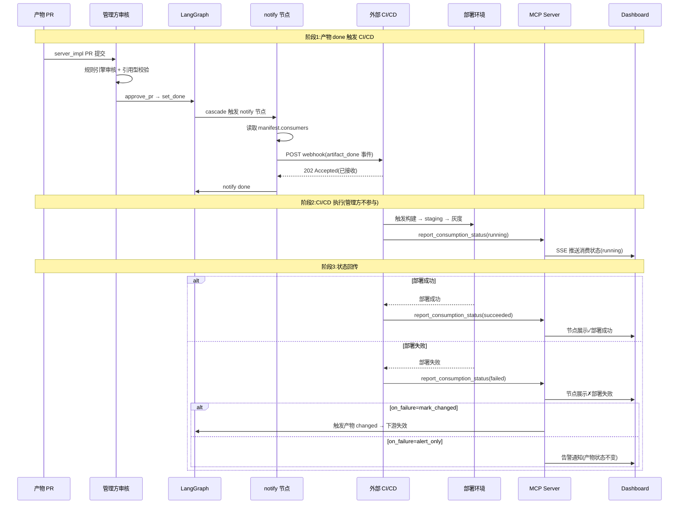
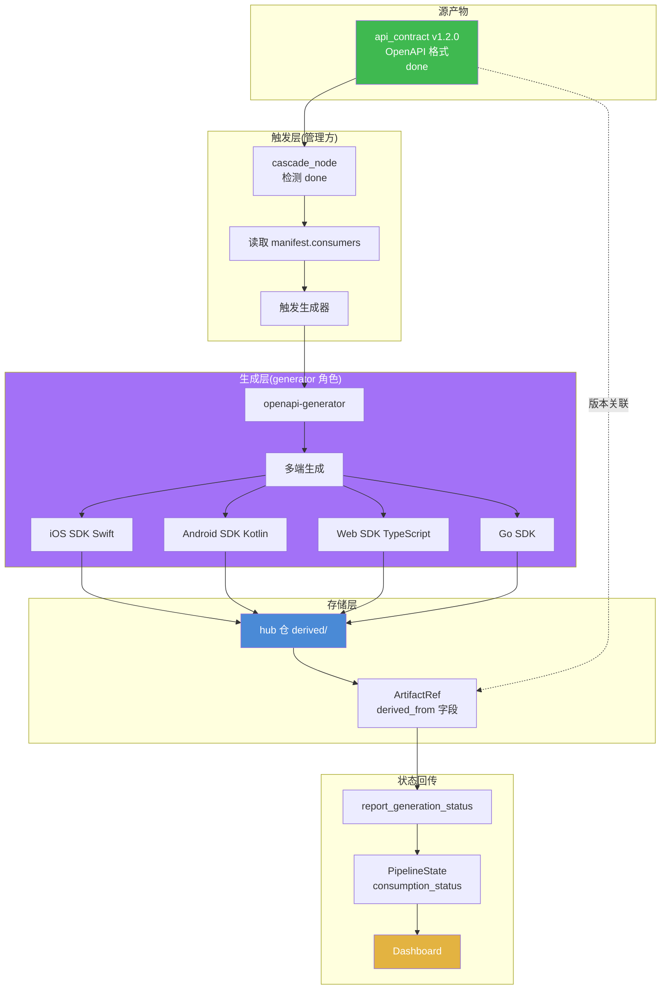
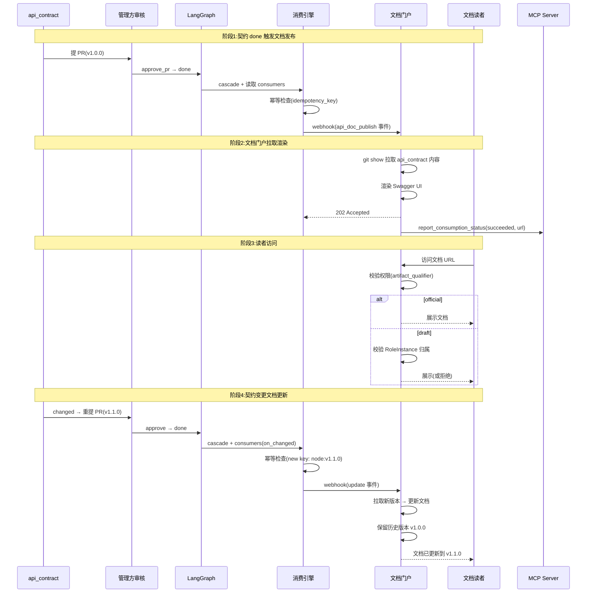
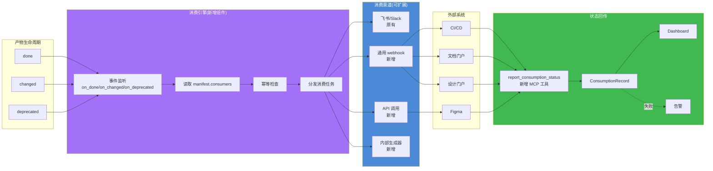

# 第四轮压力测试:产物自动消费与下游集成场景

> **文档性质**:对《coordination-platform-prd.md》v2.0 + 第三轮修正的第四轮压力测试
> **版本**:v1.0 | **日期**:2026-08-04 | **状态**:架构评审输入
> **测试方法**:选取 4 个产物消费集成真实场景(A29-A32)
> **父文档**:[coordination-platform-prd.md](../coordination-platform-prd.md)
> **核心张力**:需求 3"自动同步管理方" vs PRD 无产物 done 后的下游消费/集成机制;需求 5"不执行代码开发" vs CI/CD 触发需求——管理方"触发"而非"执行",边界在哪?

---

## 0. 测试方法说明

### 0.1 测试背景

前三轮已测 48 个场景(第一轮 16 + 第二轮 16 + 第三轮 16 重新走查),发现 279 个设计缺陷(196 + 83)。其中场景 13 测过"产物 done 后下游消费发现问题需逆向打回",但那是"人工发现问题后逆向反馈",不是"产物 done 后自动消费集成"。

需求 3 明确"AI 自主管理. 开发完, 设计完, 契约设计完, 等等. 自动同步管理方." 产物合并(done)后触发 cascade 解锁下游节点。但**产物 done 后的下游消费与集成**(CI/CD 触发、SDK 自动生成、文档发布、设计门户同步)在 PRD 中几乎空白——`notify` 控制节点只触发飞书/Slack 通知,无外部系统集成能力。

### 0.2 本轮聚焦:产物自动消费与集成(前三轮未覆盖)

| 维度 | PRD 现状 | 本轮测点 |
|---|---|---|
| 产物 done 后动作 | 仅 cascade 解锁下游节点 + 飞书/Slack 通知 | 外部系统消费(CI/CD、SDK、文档、设计门户) |
| notify 控制节点 | 触发"飞书/Slack 通知"→ done(第 294 行) | 能否触发 webhook / API 调用外部系统? |
| MCP 工具 | 7 基础 + 6 审核 = 13 个(第 362-383 行) | 无产物消费触发/回传工具 |
| 需求 5 边界 | "不执行代码开发(无执行层)"(第 67 行) | "触发" vs "执行"边界在哪? |

### 0.3 场景清单

| 场景 | 主题 | 产物类型 | 下游消费 |
|---|---|---|---|
| A29 | 产物 done 触发 CI/CD 部署 | server_impl(引用型) | CI 构建 → staging → 灰度 |
| A30 | api_contract done 自动生成多端 SDK | api_contract(内容型) | iOS/Android/Web/Go SDK |
| A31 | design_asset done 自动发布到设计门户 | design_asset(内容型) | 设计门户 + figma 同步 + 走查清单 |
| A32 | 产物 done 后的文档自动发布 | api_contract(内容型) | Swagger UI / Redoc / 内部门户 |

### 0.4 走查结构

每个场景按以下结构走查:
1. **场景描述**:真实开发情境
2. **PRD 走查**:对照具体章节(含行号),指出空白
3. **设计缺陷**:编号 `D{A场景号}-R4.{序号}`,分级(Critical/High/Medium/Low)
4. **修正方案**:产物消费订阅机制 + webhook 扩展 + 副作用声明
5. **Mermaid 设计图**:流程图或时序图

---

## 1. 场景 A29:产物 done 触发 CI/CD 部署

### 1.1 场景描述

**真实情境**:服务端团队完成 `server_impl` 产物提交,产物为引用型(`artifact_kind: reference`),指向代码仓库 commit `e5f6g7h8`。PR 经审核合并,节点状态流转至 `done`。

此时,真实开发流程需要**自动触发**下游 CI/CD 链路:
1. 代码仓库 CI 流水线构建镜像
2. 部署到 staging 环境
3. 灰度发布到生产(按流量百分比)

**核心矛盾**:需求 5 明确"不执行代码开发(无执行层)"(主 PRD 第 67 行),管理方只做管理不做执行。但 CI/CD 触发是"管理动作"还是"执行动作"?管理方通过 webhook 通知代码仓触发 CI/CD,是"触发"而非"执行",边界在哪?部署状态(成功/失败)如何回传?部署失败是否触发产物 `changed`?

### 1.2 PRD 走查

#### 走查点 1:notify 控制节点能力

**对照章节**:主 PRD §FR2.5 控制节点行为(第 286-294 行)

```
| notify | 上游 done → 触发外部通知(飞书/Slack)→ done |
```

**问题**:`notify` 节点硬编码为"飞书/Slack 通知",无通用 webhook 触发能力,无法调用外部 CI/CD 系统 API。fr7-fr8 深化文档 §2.2 告警渠道矩阵(第 110-117 行)也仅限飞书/Slack/电话/邮件/Dashboard,无 CI/CD 集成渠道。

#### 走查点 2:产物 done 后的动作链

**对照章节**:主 PRD §FR6.3 合并逻辑(第 510-521 行)

```
| 7 | langgraph_invoke(set_done + artifact_ref) |
| 8 | cascade 解锁下游 |
```

**问题**:合并后只触发 `set_done + cascade`,无"产物 done 事件广播"机制。外部 CI/CD 系统无法感知"server_impl 已 done,请触发部署"。

#### 走查点 3:MCP 工具清单

**对照章节**:主 PRD §FR4.1 基础工具(第 362-372 行)、§FR4.2 审核工具(第 374-383 行)

**问题**:13 个 MCP 工具中,无 `trigger_downstream_consumption` / `report_consumption_status` 类工具。外部 CI/CD 系统无标准接口回传部署状态给管理方。

#### 走查点 4:需求 5 边界

**对照章节**:主 PRD §1.4 范围边界(第 62-71 行)

```
| 不执行代码开发(无执行层) | 不生成代码、不生成设计稿 |
```

**问题**:"不执行代码开发"是否包含"不触发 CI/CD"?管理方通过 webhook 触发外部 CI/CD 是"管理编排"还是"执行开发"?边界未定义。

### 1.3 设计缺陷

| 编号 | 严重度 | 缺陷描述 | 影响章节 |
|---|---|---|---|
| **D29-R4.1** | Critical | `notify` 控制节点硬编码为飞书/Slack 通知,无通用 webhook 触发能力,无法调用外部 CI/CD 系统 API | §FR2.5(第 294 行) |
| **D29-R4.2** | Critical | 产物 done 事件无外部广播机制(仅 cascade 解锁下游节点),外部 CI/CD 系统无法感知产物状态变更 | §FR6.3(第 510-521 行) |
| **D29-R4.3** | High | 部署状态(成功/失败/进行中)无法回传管理方,管理方对部署结果"失明",无法在 Dashboard 展示部署链路 | §FR4.1 MCP 工具(无回传工具) |
| **D29-R4.4** | High | 部署失败与产物 `changed` 的关联未定义——部署失败是否应触发产物 `changed` 导致下游失效?还是仅告警不改产物状态? | §FR2.1 状态机(第 228-248 行) |
| **D29-R4.5** | Medium | 需求 5"不执行代码开发"与 CI/CD 触发的边界模糊——"触发"vs"执行"的语义边界未在 PRD 中明确 | §1.4 范围边界(第 67 行) |

### 1.4 修正方案

#### 修正 1:notify 控制节点扩展为通用 webhook + 通知

将 `notify` 控制节点从"仅飞书/Slack"扩展为"通用事件出口",支持多渠道:

```yaml
# pipeline DSL 中 notify 节点配置
- id: n_notify_deploy
  type: notify
  deps: ["n_server_impl"]
  channels:
    - type: im                    # 即时通知(原有能力)
      target: feishu:#server-team
    - type: webhook               # 新增:通用 webhook
      url: https://ci.internal/api/trigger
      method: POST
      headers:
        Authorization: Bearer ${Vault:ci_token}
      payload:
        event: artifact_done
        node_id: ${node_id}
        artifact_ref: ${artifact_ref}
        external_repo: ${external_repo}
        external_commit: ${external_commit}
      retry: { count: 3, backoff: exponential }
      timeout_sec: 10
```

**边界澄清(回应 D29-R4.5)**:管理方"触发"webhook 通知外部系统,不"执行"CI/CD 流水线本身。类比:`notify` 发飞书消息是触发通知,发 webhook 也是触发通知,只是通道不同。管理方不持有 CI/CD 凭据、不执行构建脚本,仅传递"产物 done 事件"。

#### 修正 2:产物消费订阅机制(ArtifactConsumer)

在产物 manifest 增加 `consumers` 字段,声明产物 done 后的下游消费动作:

```json
// server_impl/001_ref.json 的 manifest 增加 consumers
{
  "consumers": [
    {
      "consumer_id": "ci-cd-pipeline",
      "type": "webhook",
      "trigger": "on_done",
      "endpoint": "https://ci.internal/api/trigger",
      "expected_ack": true,
      "ack_timeout_sec": 300,
      "on_failure": "alert_only",
      "idempotency_key": "${node_id}:${version}"
    }
  ]
}
```

**`on_failure` 策略**(回应 D29-R4.4):
- `alert_only`:仅告警,不改产物状态(默认,适用于"部署是外部系统职责")
- `mark_changed`:部署失败触发产物 `changed`,下游失效(适用于"部署失败意味着产物不可用")
- `block_downstream`:阻塞下游但产物不改状态(中间态)

#### 修正 3:消费状态回传工具

新增 MCP 工具 `report_consumption_status`:

```json
{
  "name": "report_consumption_status",
  "description": "外部系统回传产物消费结果(部署状态)",
  "inputSchema": {
    "type": "object",
    "properties": {
      "node_id": {"type": "string"},
      "consumer_id": {"type": "string"},
      "status": {"type": "string", "enum": ["running", "succeeded", "failed", "skipped"]},
      "detail": {"type": "object"},
      "external_url": {"type": "string", "description": "CI/CD 流水线链接"}
    },
    "required": ["node_id", "consumer_id", "status"]
  }
}
```

回传状态记录到 `PipelineState.consumption_status`(新增字段),Dashboard 节点详情面板新增"消费状态"tab 展示部署链路。

### 1.5 Mermaid 设计图:CI/CD 触发与状态回传时序



---

## 2. 场景 A30:api_contract done 自动生成多端 SDK

### 2.1 场景描述

**真实情境**:`api_contract` 产物 done(OpenAPI 3.0 格式,内容型产物)。下游需要自动生成多端 SDK:
- iOS SDK(Swift)
- Android SDK(Kotlin)
- Web SDK(TypeScript)
- Go SDK

**关键问题**:
1. 生成的 SDK 存到哪里?代码仓?hub 仓?
2. SDK 版本与 `api_contract` 版本如何关联?
3. SDK 生成失败怎么办?
4. SDK 是自动生成的,需求 9"各端自己定义产物"——各端要不要自定义生成规则?

### 2.2 PRD 走查

#### 走查点 1:节点类型清单

**对照章节**:主 PRD §2.1 节点类型(第 91-116 行)

```
| api_contract | server | 接口契约(端点/schema/错误码) |
```

**问题**:9 种产物节点类型无 `sdk` / `generated_sdk` 类型。SDK 是自动生成的产物,不归属任何现有角色——它既不是 `server_impl`(服务端实现),也不是 `client_ui`(客户端 UI 实现)。

#### 走查点 2:产物归属与权限

**对照章节**:主 PRD §3.1 角色定义(第 119-130 行)、§3.2 权限矩阵(第 132-142 行)

**问题**:SDK 产物归哪个角色提交?server 角色?client 角色?还是新增"生成器"角色?需求 9 说"各端自己定义产物",但 SDK 是**自动生成**的,无人手写,谁有权限提交?

#### 走查点 3:SDK 版本与契约版本关联

**对照章节**:fr1-fr6 深化 §2.2 版本化策略(第 135-165 行)

**问题**:semver 双重模型(语义版本 + git commit)只覆盖单一产物。SDK 版本与 `api_contract` 版本的关联机制缺失——`api_contract` v1.2.0 变更后,SDK 应自动 bump 到对应版本?还是独立版本号?

#### 走查点 4:生成失败处理

**对照章节**:fr1-fr6 深化 §7 驳回重试流程(第 1006-1118 行)

**问题**:SDK 生成是"产物消费"的副产品,不是 PR 提交,不进 `pending_review`。生成失败的回传与重试机制未定义——`report_consumption_status` 不适用于此场景,因为 SDK 是产物而非部署状态。

### 2.3 设计缺陷

| 编号 | 严重度 | 缺陷描述 | 影响章节 |
|---|---|---|---|
| **D30-R4.1** | Critical | 无 SDK 自动生成机制——9 种节点类型封闭枚举,无 `generated_sdk` / `derived_artifact` 类型,无法表达自动派生产物 | §2.1 节点类型(第 91-116 行) |
| **D30-R4.2** | High | SDK 产物归属角色未定义——既非 server 也非 client,权限矩阵无"生成器"角色,SDK 提交权限归属空白 | §3.1 角色(第 119-130 行) |
| **D30-R4.3** | High | SDK 版本与 `api_contract` 版本关联机制缺失——semver 双重模型不覆盖派生关系,`api_contract` 变更后 SDK 版本如何联动未定义 | fr1-fr6 §2.2(第 135-165 行) |
| **D30-R4.4** | High | SDK 生成失败的回传与重试机制缺失——生成不进 PR 审核流,`reject_pr` / 驳回重试流程不适用 | fr1-fr6 §7(第 1006-1118 行) |
| **D30-R4.5** | Medium | 需求 9"各端自定义产物"与 SDK 自动生成的冲突——SDK 是自动生成的,各端是否要自定义生成规则?生成规则放哪? | §1.3 核心价值(第 55-60 行) |

### 2.4 修正方案

#### 修正 1:新增 `derived_artifact` 节点类型 + 生成器角色

```yaml
# 节点类型扩展(开放命名空间,继承第三轮 §3.11)
derived.sdk:
  role: generator              # 新增角色
  generated_from: api_contract # 源产物类型
  generator_config:
    tool: openapi-generator     # 生成工具
    targets: [swift, kotlin, typescript, go]
    output_repo: hub            # hub 仓 | external_code_repo
```

新增 `generator` 角色(非人类角色,管理方 bot 执行):

```python
class Role(TypedDict):
    # 既有 4 角色:product/server/design/client
    # 新增:generator(生成器,管理方内置 bot,无 LLM agent)
    ...
```

**权限边界**:generator 角色仅能提交 `derived.*` 类型产物,无 `request_approval` 权限(派生产物自动审核,因源产物已审核)。

#### 修正 2:派生产物版本关联机制

```python
class ArtifactRef(TypedDict):
    # 既有字段...
    derived_from: str | None    # 新增:派生源 "hub://{pipeline_id}/{node_id}@{version}"
    derived_at: str | None       # 派生时间
    generator_tool: str | None   # 生成工具(如 openapi-generator@6.6.0)
```

版本联动规则:
- `api_contract` v1.2.0 变更 → 触发 `derived.sdk` 重新生成
- SDK 版本采用 `{contract_version}+{build_seq}`,如 `1.2.0+1`(避免与契约版本冲突)

#### 修正 3:生成失败回传与重试

```json
{
  "name": "report_generation_status",
  "description": "生成器回传 SDK 生成结果",
  "inputSchema": {
    "type": "object",
    "properties": {
      "derived_node_id": {"type": "string"},
      "source_node_id": {"type": "string"},
      "status": {"type": "string", "enum": ["succeeded", "failed", "partial"]},
      "targets": {
        "type": "array",
        "items": {"type": "object", "properties": {
          "platform": {"type": "string"},
          "status": {"type": "string"},
          "artifact_path": {"type": "string"},
          "error": {"type": "string"}
        }}
      }
    }
  }
}
```

重试策略:
- 生成失败:自动重试 3 次(间隔 60s)
- 3 次仍失败:`derived.sdk` 节点标记 `generation_failed`,触发告警(ALR-13 新增)
- 源产物 `api_contract` 不受影响(生成失败不影响源产物状态)

#### 修正 4:各端自定义生成规则(回应 D30-R4.5)

需求 9"自由"体现在**生成规则可配置**,而非产物本身自由——SDK 是自动生成的,但生成规则由各端自定义:

```yaml
# 各端在管线 DSL 中声明生成规则(需求 9:各端自定义)
- id: n_sdk_ios
  type: derived.sdk
  role: generator
  deps: [{node_id: n2_api_contract, strictness: strict}]
  generator:
    tool: openapi-generator
    target: swift
    config_override:             # 各端自定义配置
      packageName: com.example.ios.sdk
      additionalModelTypeAnnotations: ["Codable"]
```

### 2.5 Mermaid 设计图:SDK 自动生成架构



---

## 3. 场景 A31:design_asset done 自动发布到设计门户/figma 同步

### 3.1 场景描述

**真实情境**:`design_asset` 产物 done(含 figma 链接 + 标注 JSON)。下游需要**自动**:
1. 发布到内部设计门户(供产品经理、测试、非开发人员查看)
2. 同步 figma 标注到客户端开发工具(IDE 插件)
3. 生成设计走查清单(供 QA 团队验收)

这些"消费动作"不在管线 DAG 中(不是产物节点),是产物 done 后的**副作用**。

### 3.2 PRD 走查

#### 走查点 1:产物 done 后的副作用机制

**对照章节**:主 PRD §FR2.4 StateGraph 节点(第 274-284 行)、§FR2.5 控制节点(第 286-294 行)

```
| cascade_node | done 节点解锁下游 | 节点 done |
| notify | 上游 done → 触发外部通知(飞书/Slack)→ done |
```

**问题**:`cascade_node` 只解锁下游节点,`notify` 只发通知。产物 done 后的"副作用"(发布到设计门户、同步 figma、生成走查清单)无机制承载——它们不是下游节点(不产出新产物),也不是通知(有实际动作)。

#### 走查点 2:消费动作声明方式

**对照章节**:fr1-fr6 深化 §3 manifest JSON Schema(第 241-477 行)

**问题**:manifest schema 无 `consumers` / `side_effects` 字段。manifest 只描述产物元数据,不描述"产物 done 后要做什么"。消费动作无法声明,只能硬编码在管线 DSL 或外部系统。

#### 走查点 3:消费失败对产物状态的影响

**对照章节**:主 PRD §FR2.1 状态机(第 228-248 行)

**问题**:状态机 7 态(第三轮扩展为 10 态)无"消费中"/"消费失败"状态。设计门户发布失败是否影响 `design_asset` 的 `done` 状态?如果设计门户宕机,产物是否应回退?

#### 走查点 4:消费幂等性

**对照章节**:fr1-fr6 深化 §5.3 冲突检测(第 833-890 行)

**问题**:`design_asset` `changed` 后(重新提 PR 合并),设计门户应自动更新。但"更新"是覆盖旧文档还是新增版本?幂等性未定义——如果产物多次 changed,设计门户是否会收到多次同步请求?去重机制缺失。

### 3.3 设计缺陷

| 编号 | 严重度 | 缺陷描述 | 影响章节 |
|---|---|---|---|
| **D31-R4.1** | Critical | 无产物 done 后的副作用机制——`cascade` 只解锁节点,`notify` 只发通知,设计门户发布/figma 同步/走查清单生成等"实际动作"无载体 | §FR2.4/§FR2.5(第 274-294 行) |
| **D31-R4.2** | High | 消费动作声明方式缺失——manifest schema 无 `consumers`/`side_effects` 字段,无法声明产物 done 后的消费动作 | fr1-fr6 §3 manifest(第 241-477 行) |
| **D31-R4.3** | High | 消费失败对产物状态的影响未定义——状态机无"消费中"/"消费失败"状态,设计门户宕机时产物是否回退未定义 | §FR2.1 状态机(第 228-248 行) |
| **D31-R4.4** | Medium | 消费幂等性未设计——产物 `changed` 后重新消费,设计门户是否会收到多次同步请求?去重/覆盖策略缺失 | fr1-fr6 §5.3(第 833-890 行) |

### 3.4 修正方案

#### 修正 1:产物消费订阅机制(完整设计)

manifest schema 新增 `consumers` 字段(声明式副作用):

```json
// design_asset manifest 增加 consumers
{
  "consumers": [
    {
      "consumer_id": "design-portal-publish",
      "type": "webhook",
      "trigger": "on_done | on_changed",
      "endpoint": "https://design-portal.internal/api/publish",
      "payload_template": "design_asset_payload",
      "idempotency_key": "${node_id}:${version}",
      "on_failure": "alert_only",
      "retry": { "count": 3, "backoff": "exponential" }
    },
    {
      "consumer_id": "figma-sync",
      "type": "api_call",
      "trigger": "on_done",
      "endpoint": "https://figma-sync.internal/api/sync",
      "payload": {
        "figma_url": "${manifest.figma_url}",
        "node_id": "${node_id}"
      }
    },
    {
      "consumer_id": "checklist-gen",
      "type": "internal",           // 内部生成器
      "trigger": "on_done",
      "generator": "design-checklist-skill"
    }
  ]
}
```

#### 修正 2:消费状态机(与产物状态解耦)

产物状态与消费状态**解耦**——消费失败不回退产物 `done`(因产物本身没问题),仅记录消费失败:

```python
class ConsumptionRecord(TypedDict):
    consumer_id: str
    node_id: str
    status: str          # "scheduled" | "running" | "succeeded" | "failed"
    triggered_at: str
    completed_at: str | None
    error: str | None
    external_url: str | None
    idempotency_key: str  # 去重键(回应 D31-R4.4)
```

**幂等性设计(回应 D31-R4.4)**:
- `idempotency_key = ${node_id}:${version}` 唯一标识一次消费
- 外部系统收到重复 key 时返回"已处理",不重复执行
- 产物 `changed` 后 version bump,key 变化,触发新消费(设计门户更新为新版本)

#### 修正 3:消费失败处理策略

```yaml
# on_failure 策略(按 consumer 配置)
on_failure:
  design-portal-publish: alert_only    # 仅告警,不影响产物
  figma-sync: retry_then_alert         # 重试3次后告警
  checklist-gen: mark_degraded         # 标记节点降级(可选)
```

**关键原则**:消费失败**不触发产物 `changed`**(产物内容未变),仅记录 `consumption_status=failed` + 告警。人工决定是否重试或修复外部系统。

### 3.5 Mermaid 设计图:产物消费订阅机制

```mermaid
flowchart TB
    subgraph ARTIFACT["产物生命周期"]
        DONE[design_asset done]
        CHANGED[design_asset changed]
    end

    subgraph CONSUMER_ENGINE["消费引擎(新增)"]
        DETECT[事件检测<br/>on_done / on_changed]
        READ[读取 manifest.consumers]
        DISPATCH[分发消费任务]
    end

    subgraph CONSUMERS["消费方(外部系统)"]
        PORTAL[设计门户<br/>publish]
        FIGMA[figma-sync<br/>api_call]
        CHECKLIST[走查清单<br/>internal generator]
    end

    subgraph STATUS["状态管理"]
        RECORD[ConsumptionRecord]
        IDEM[幂等性检查<br/>idempotency_key]
        STATE[PipelineState<br/>consumption_status]
    end

    subgraph FEEDBACK["反馈"]
        REPORT[report_consumption_status]
        DASH[Dashboard 展示]
        ALERT[告警(on_failure)]
    end

    DONE --> DETECT
    CHANGED --> DETECT
    DETECT --> READ
    READ --> DISPATCH
    DISPATCH --> IDEM
    IDEM -->|首次| PORTAL
    IDEM -->|首次| FIGMA
    IDEM -->|首次| CHECKLIST
    IDEM -->|重复key| SKIP[跳过(幂等)]

    PORTAL & FIGMA & CHECKLIST --> RECORD
    RECORD --> STATE
    RECORD --> REPORT
    REPORT --> DASH

    PORTAL -.失败.-> ALERT
    FIGMA -.失败.-> ALERT

    style DONE fill:#3fb950,color:#fff
    style CHANGED fill:#e3b341,color:#fff
    style CONSUMER_ENGINE fill:#a371f7,color:#fff
    style IDEM fill:#4a8ad6,color:#fff
    style ALERT fill:#b3261e,color:#fff
```

---

## 4. 场景 A32:产物 done 后的文档自动发布

### 4.1 场景描述

**真实情境**:`api_contract` 产物 done(OpenAPI 格式)。需要自动发布到 API 文档门户(如 Swagger UI / Redoc / 内部门户),供前端、测试、产品团队查看。文档版本与 `api_contract` 版本同步。`api_contract` `changed` 后文档自动更新。

**关键问题**:
1. 文档发布是管理方职责还是外部系统?
2. 文档版本与产物版本如何同步?
3. 文档门户的权限(公开/内部)如何管控?

### 4.2 PRD 走查

#### 走查点 1:文档发布机制

**对照章节**:主 PRD §FR2.5 控制节点(第 286-294 行)、§FR4.1 MCP 工具(第 362-372 行)

**问题**:无文档发布机制。`notify` 只触发飞书/Slack 通知,无法调用文档门户 API。MCP 工具无 `publish_documentation` 类工具。

#### 走查点 2:文档发布职责归属

**对照章节**:主 PRD §1.2 产品定位(第 46-54 行)、§1.4 范围边界(第 62-71 行)

```
| 不执行代码开发(无执行层) | 不生成代码、不生成设计稿 |
```

**问题**:文档发布是"管理编排"还是"执行开发"?管理方持有产物内容(`api_contract` 在 hub 仓),有条件直接渲染文档。但需求 5"不执行代码开发"是否包含"不发布文档"?边界模糊。

#### 走查点 3:文档版本与产物版本同步

**对照章节**:fr1-fr6 深化 §2.2 版本化策略(第 135-165 行)

**问题**:semver 双重模型只覆盖单一产物。文档版本与 `api_contract` 版本的同步机制缺失——文档是 `api_contract` 的派生物,但无版本关联字段。

#### 走查点 4:文档门户权限

**对照章节**:主 PRD §3 角色与权限模型(第 119-142 行)、fr7-fr8 深化 §10 安全加固(第 685-734 行)

**问题**:文档门户面向多角色(前端/测试/产品/外部合作方),权限分级(公开/内部/机密)未定义。管理方权限模型只覆盖 MCP 工具调用,不覆盖文档门户访问。

### 4.3 设计缺陷

| 编号 | 严重度 | 缺陷描述 | 影响章节 |
|---|---|---|---|
| **D32-R4.1** | Critical | 无文档自动发布机制——`notify` 只触发通知,MCP 无 `publish_documentation` 工具,API 文档门户无法自动更新 | §FR2.5/§FR4.1(第 286-372 行) |
| **D32-R4.2** | High | 文档发布职责归属未定义——管理方持有产物内容可渲染文档,但需求 5"不执行代码开发"边界模糊,文档发布归管理方还是外部系统未明确 | §1.2/§1.4(第 46-71 行) |
| **D32-R4.3** | High | 文档版本与产物版本同步机制缺失——semver 双重模型不覆盖文档派生关系,`api_contract` 变更后文档版本如何联动未定义 | fr1-fr6 §2.2(第 135-165 行) |
| **D32-R4.4** | Medium | 文档门户权限管控未设计——面向多角色的文档访问权限(公开/内部/机密)未定义,管理方权限模型不覆盖文档门户 | §3 权限模型(第 119-142 行) |

### 4.4 修正方案

#### 修正 1:文档发布作为产物消费订阅(复用 A31 机制)

文档发布是产物消费的一种特例,复用 `consumers` 字段:

```json
// api_contract manifest 增加 consumers
{
  "consumers": [
    {
      "consumer_id": "api-docs-portal",
      "type": "webhook",
      "trigger": "on_done | on_changed",
      "endpoint": "https://docs.internal/api/publish",
      "payload": {
        "doc_type": "swagger_ui",
        "version": "${version}",
        "source_artifact": "hub://${pipeline_id}/${node_id}@${version}"
      },
      "idempotency_key": "${node_id}:${version}",
      "on_failure": "alert_only"
    }
  ]
}
```

#### 修正 2:文档发布职责边界(回应 D32-R4.2)

**边界澄清**:管理方"触发"文档发布(webhook 通知文档门户),不"渲染"文档内容。文档门户是外部系统,负责:
- 拉取 hub 仓产物内容(`git show`)
- 渲染 Swagger UI / Redoc
- 管理访问权限

管理方职责仅限于:
- 触发 webhook(产物 done 事件)
- 回传消费状态(发布成功/失败)

**类比**:管理方触发 CI/CD 不执行构建;触发文档发布不渲染文档——"触发"而非"执行",符合需求 5。

#### 修正 3:文档版本同步机制(复用 A30 派生机制)

文档作为 `api_contract` 的派生物,复用 `derived_from` 字段:

```python
# 文档门户侧记录
class DocPortalRecord(TypedDict):
    doc_id: str
    source_node_id: str
    source_version: str          # api_contract 版本
    doc_version: str             # 文档版本(= 源版本,或 +build_seq)
    published_at: str
    url: str                     # 文档门户 URL
    idempotency_key: str         # 去重
```

版本同步规则:
- `api_contract` v1.0.0 → 文档 v1.0.0(初次发布)
- `api_contract` changed → v1.1.0 → 文档自动更新到 v1.1.0(webhook 触发)
- 文档门户保留历史版本(可查看 v1.0.0 与 v1.1.0 的 diff)

#### 修正 4:文档门户权限管控(新增 NFR21)

文档门户权限与产物 `artifact_qualifier` 联动:

| artifact_qualifier | 文档门户可见性 | 访问角色 |
|---|---|---|
| official | 内部全员 | product/server/design/client/reviewer |
| draft | 仅产线团队 | 对应 RoleInstance |
| experimental | 仅提交方 | submitter + admin |
| deprecated | 内部全员(标记废弃) | 全部 + 废弃提示 |

新增非功能需求:
- **NFR21(安全)**:文档门户访问权限与产物 `artifact_qualifier` 联动,文档 URL 含签名 token(限时有效),防未授权访问。

### 4.5 Mermaid 设计图:文档自动发布流程



---

## 5. 缺陷汇总表

### 5.1 缺陷统计

| 场景 | Critical | High | Medium | Low | 小计 |
|---|---|---|---|---|---|
| A29 CI/CD 部署 | 2 | 2 | 1 | 0 | 5 |
| A30 SDK 生成 | 1 | 3 | 1 | 0 | 5 |
| A31 设计门户同步 | 1 | 2 | 1 | 0 | 4 |
| A32 文档发布 | 1 | 2 | 1 | 0 | 4 |
| **合计** | **5** | **9** | **4** | **0** | **18** |

### 5.2 缺陷根因归类(3 大根因)

| 根因 | 影响缺陷数 | 核心问题 | 影响范围 |
|---|---|---|---|
| **R1. 产物 done 后无外部消费机制** | 10 | `notify` 仅触发飞书/Slack,无通用 webhook/消费订阅;MCP 无消费触发/回传工具;无副作用声明机制 | §FR2.5 + §FR4.1 + §FR6.3 |
| **R2. 派生产物模型缺失** | 4 | 无 `derived_artifact` 节点类型;ArtifactRef 无 `derived_from` 字段;版本关联机制缺失 | §2.1 + §5.1 + fr1-fr6 §2.2 |
| **R3. 需求 5 边界模糊** | 4 | "不执行代码开发"与"触发 CI/CD / 发布文档"的边界未定义;管理方"触发"vs"执行"语义不清 | §1.4 + §1.2 |

### 5.3 缺陷明细表

| 编号 | 场景 | 严重度 | 缺陷摘要 | 根因 |
|---|---|---|---|---|
| D29-R4.1 | A29 | Critical | notify 硬编码飞书/Slack,无通用 webhook | R1 |
| D29-R4.2 | A29 | Critical | 产物 done 事件无外部广播机制 | R1 |
| D29-R4.3 | A29 | High | 部署状态无法回传管理方 | R1 |
| D29-R4.4 | A29 | High | 部署失败与产物 changed 关联未定义 | R1 |
| D29-R4.5 | A29 | Medium | 需求 5"不执行"vs CI/CD 触发边界模糊 | R3 |
| D30-R4.1 | A30 | Critical | 无 SDK 自动生成机制,节点类型封闭 | R2 |
| D30-R4.2 | A30 | High | SDK 产物归属角色未定义 | R2 |
| D30-R4.3 | A30 | High | SDK 版本与契约版本关联缺失 | R2 |
| D30-R4.4 | A30 | High | SDK 生成失败回传与重试缺失 | R1 |
| D30-R4.5 | A30 | Medium | 需求 9"自定义"vs SDK 自动生成冲突 | R3 |
| D31-R4.1 | A31 | Critical | 无产物 done 后的副作用机制 | R1 |
| D31-R4.2 | A31 | High | 消费动作声明方式缺失(manifest 无 consumers) | R1 |
| D31-R4.3 | A31 | High | 消费失败对产物状态影响未定义 | R1 |
| D31-R4.4 | A31 | Medium | 消费幂等性未设计 | R1 |
| D32-R4.1 | A32 | Critical | 无文档自动发布机制 | R1 |
| D32-R4.2 | A32 | High | 文档发布职责归属未定义 | R3 |
| D32-R4.3 | A32 | High | 文档版本与产物版本同步缺失 | R2 |
| D32-R4.4 | A32 | Medium | 文档门户权限管控未设计 | R3 |

---

## 6. 核心修正方案:产物消费订阅机制

### 6.1 整体架构

第四轮 4 个场景的共同根因是"产物 done 后无外部消费机制"。本节给出统一修正方案:**产物消费订阅机制(ArtifactConsumer)**。



### 6.2 manifest schema 扩展

fr1-fr6 深化 §3.3 manifest JSON Schema 新增 `consumers` 字段:

```json
{
  "consumers": {
    "type": "array",
    "description": "产物 done 后的下游消费动作声明(新增)",
    "items": {
      "type": "object",
      "required": ["consumer_id", "type", "trigger", "on_failure"],
      "properties": {
        "consumer_id": {
          "type": "string",
          "description": "消费方唯一标识"
        },
        "type": {
          "type": "string",
          "enum": ["im", "webhook", "api_call", "internal"],
          "description": "消费类型:即时通知/通用 webhook/API 调用/内部生成器"
        },
        "trigger": {
          "type": "string",
          "enum": ["on_done", "on_changed", "on_deprecated", "on_sunset"],
          "description": "触发时机"
        },
        "endpoint": {
          "type": "string",
          "description": "webhook/api_call 的 URL"
        },
        "payload": {
          "type": "object",
          "description": "自定义 payload(支持变量插值 ${node_id} ${version} 等)"
        },
        "headers": {
          "type": "object",
          "description": "HTTP 头(支持 Vault 引用 ${Vault:key})"
        },
        "idempotency_key": {
          "type": "string",
          "description": "幂等键(默认 ${node_id}:${version})"
        },
        "on_failure": {
          "type": "string",
          "enum": ["alert_only", "retry_then_alert", "mark_changed", "mark_degraded"],
          "description": "失败处理策略"
        },
        "retry": {
          "type": "object",
          "properties": {
            "count": {"type": "integer", "default": 3},
            "backoff": {"type": "string", "enum": ["fixed", "exponential"], "default": "exponential"},
            "interval_sec": {"type": "integer", "default": 60}
          }
        },
        "timeout_sec": {
          "type": "integer",
          "default": 30
        }
      }
    }
  }
}
```

### 6.3 notify 控制节点扩展

主 PRD §FR2.5 `notify` 控制节点从"仅飞书/Slack"扩展为"通用事件出口":

```
| notify(扩展) | 上游 done → 读取 consumers → 分发到多渠道(webhook/api/im/generator)→ done |
```

**关键设计**:
- `notify` 节点读取上游产物的 `manifest.consumers`
- 按类型分发:im → 飞书/Slack;webhook → 通用 HTTP;api_call → 外部 API;internal → 内部生成器
- 消费状态记录到 `PipelineState.consumption_status`
- 消费失败按 `on_failure` 策略处理(默认 alert_only,不改产物状态)

### 6.4 MCP 工具扩展(新增 2 个)

| 工具名 | 调用方 | 作用 | 关键参数 |
|---|---|---|---|
| `report_consumption_status` | 外部系统 | 回传消费结果(部署/发布/同步状态) | node_id, consumer_id, status, detail, external_url |
| `report_generation_status` | 生成器 | 回传派生产物生成结果(SDK/文档) | derived_node_id, source_node_id, status, targets[] |

**工具总数**:14(第三轮)→ 16(第四轮 +2)。

### 6.5 状态机扩展(消费状态与产物状态解耦)

产物状态机**不变**(第三轮 10 态),新增**消费状态**作为旁路记录:

| 消费状态 | 含义 | 触发 |
|---|---|---|
| `scheduled` | 已调度,待执行 | 产物 done/changed,触发 consumer |
| `running` | 消费中 | 外部系统回传 |
| `succeeded` | 消费成功 | 外部系统回传 |
| `failed` | 消费失败 | 外部系统回传或超时 |
| `skipped` | 跳过(幂等去重) | 幂等检查命中 |

**关键原则**:消费状态与产物状态解耦——消费失败**不触发产物 `changed`**(产物内容未变),仅记录消费失败 + 告警。例外:consumer 显式配置 `on_failure=mark_changed` 时才联动。

### 6.6 需求 5 边界澄清

| 动作 | 归属 | 理由 |
|---|---|---|
| 触发 webhook 通知 CI/CD | 管理方(触发) | 类似 notify 发飞书,仅换通道 |
| 执行 CI/CD 构建流水线 | 外部系统(执行) | 不持有 CI/CD 凭据,不执行脚本 |
| 触发文档发布 webhook | 管理方(触发) | 同上 |
| 渲染 Swagger UI 文档 | 文档门户(执行) | 管理方不渲染内容 |
| 触发 SDK 生成 | 管理方 generator(触发) | generator 是管理方内置 bot |
| 执行 SDK 代码生成 | 管理方 generator(执行,边界) | 生成器是管理方组件,生成的是派生产物非代码开发 |

**边界定义**:管理方"触发"外部系统集成(webhook/api),不"执行"外部系统的内部逻辑。例外:generator 角色执行派生产物生成(SDK/文档),属于"管理编排"的延伸(派生产物是管理方职责,非业务代码)。

---

## 7. 第四轮关键认知

1. **需求 3"自动同步"≠仅 cascade 解锁**:产物 done 后的下游消费(CI/CD、SDK、文档、设计门户)是"自动同步"的应有之义,PRD 仅做到 cascade 解锁节点,未做到外部系统集成。

2. **需求 5"不执行代码开发"的边界**:"触发" ≠ "执行"——管理方通过 webhook 触发外部 CI/CD,是"管理编排"不是"执行开发"。类比 `notify` 发飞书是触发通知,发 webhook 也是触发通知。generator 角色执行派生产物生成(SDK/文档)是边界扩展,属于管理方职责。

3. **产物消费订阅机制是缺失的核心能力**:manifest `consumers` 字段 + `notify` 节点扩展 + `report_consumption_status` 工具,三者构成完整的"产物 done → 外部消费 → 状态回传"闭环。

4. **派生产物模型必须补充**:`derived_artifact` 节点类型 + `derived_from` 字段 + 版本关联机制,支撑 SDK 自动生成、文档自动发布等派生场景。

5. **消费状态与产物状态解耦**:消费失败不回退产物 `done`(产物本身没问题),仅记录消费失败 + 告警。例外:consumer 显式配置 `on_failure=mark_changed` 时联动。

6. **幂等性是消费机制的基础**:产物 `changed` 后重新消费,需通过 `idempotency_key` 去重,避免外部系统重复执行。

---

## 8. 修正优先级矩阵

| 优先级 | 修正项 | 影响缺陷数 | 影响章节 | 实施阶段 |
|---|---|---|---|---|
| **P0** | manifest `consumers` 字段(D31-R4.2/D32-R4.1) | 6 | fr1-fr6 §3 | Phase 2 |
| **P0** | `notify` 节点扩展为通用 webhook(D29-R4.1) | 5 | §FR2.5 | Phase 2 |
| **P0** | `report_consumption_status` MCP 工具(D29-R4.3) | 5 | §FR4.1 | Phase 2 |
| **P0** | 消费状态机 + PipelineState 扩展(D31-R4.3) | 4 | §FR2.3 + §FR2.1 | Phase 2 |
| **P1** | `derived_artifact` 节点类型 + generator 角色(D30-R4.1/D30-R4.2) | 5 | §2.1 + §3.1 | Phase 2 |
| **P1** | `derived_from` 字段 + 版本关联(D30-R4.3/D32-R4.3) | 4 | §5.1 + fr1-fr6 §2.2 | Phase 2 |
| **P1** | `report_generation_status` MCP 工具(D30-R4.4) | 3 | §FR4.1 | Phase 2 |
| **P1** | 需求 5 边界澄清(触发 vs 执行)(D29-R4.5/D32-R4.2) | 4 | §1.4 + §1.2 | Phase 2 |
| **P2** | 消费幂等性 + `idempotency_key`(D31-R4.4) | 3 | fr1-fr6 §5.3 | Phase 3 |
| **P2** | 文档门户权限管控 + NFR21(D32-R4.4) | 2 | §3 + NFR | Phase 3 |
| **P2** | Dashboard 消费状态 tab 展示 | 2 | §FR7.3 + §FR8.1 | Phase 3 |

---

## 9. 与前三轮的关系

### 9.1 第三轮修正的衔接

| 第三轮修正 | 第四轮影响 | 衔接点 |
|---|---|---|
| §3.1 状态机 10 态 | 消费状态与产物状态解耦,不新增产物状态 | 消费状态作为旁路记录 |
| §3.2 ArtifactRef 多版本 | `derived_from` 字段复用多版本映射 | 派生产物作为源产物的"版本变体" |
| §3.11 节点类型开放命名空间 | `derived.sdk` / `derived.docs` 复用开放命名空间 | `{role}.{name}` 扩展为 `derived.{name}` |
| §3.4 emergency_* 降级 | 消费引擎也需降级(外部系统宕机时) | 消费失败按 on_failure 处理 |

### 9.2 第四轮不重复前三轮已测场景

前三轮场景 13(逆向打回)测过"产物 done 后下游人工发现问题",本轮聚焦"产物 done 后自动消费集成",不重复。

### 9.3 第四轮未覆盖(留待第五轮)

- 消费链路的跨管线传播(产物 A done 触发管线 B 的消费)
- 消费的事务性(多 consumer 部分成功部分失败的回滚)
- 消费结果的版本化存档(历史消费记录查询)
- 消费成本计费(外部系统调用成本归集)

---

## 附录:Mermaid 图索引

| 图名 | 位置 | 说明 |
|---|---|---|
| CI/CD 触发与状态回传时序图 | §1.5 | 产物 done → webhook → CI/CD → 状态回传 |
| SDK 自动生成架构图 | §2.5 | api_contract → 生成器 → 多端 SDK → hub 仓 |
| 产物消费订阅机制图 | §3.5 | 产物事件 → 消费引擎 → 多渠道 → 状态回传 |
| 文档自动发布流程时序图 | §4.5 | 契约 done → 文档门户 → 渲染 → 权限校验 → 变更更新 |
| 消费订阅整体架构图 | §6.1 | 4 场景统一修正方案的完整架构 |
| **合计** | | **5 张 Mermaid 图** |
