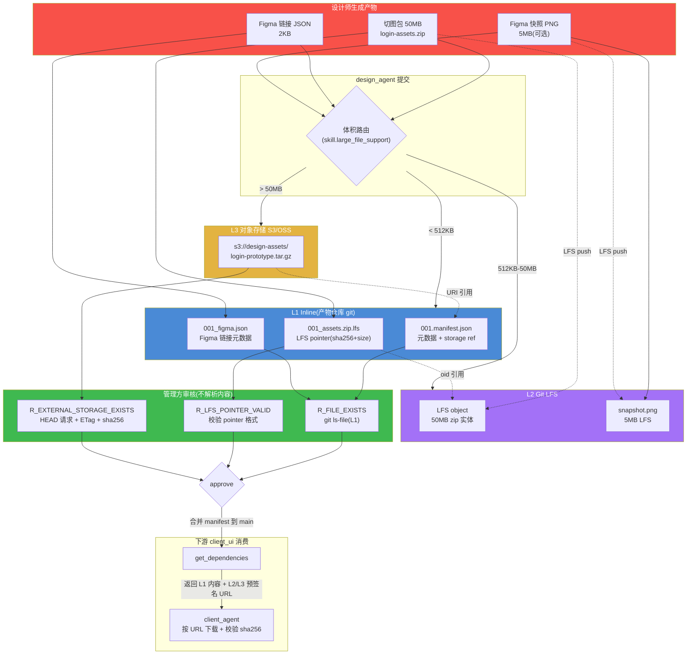
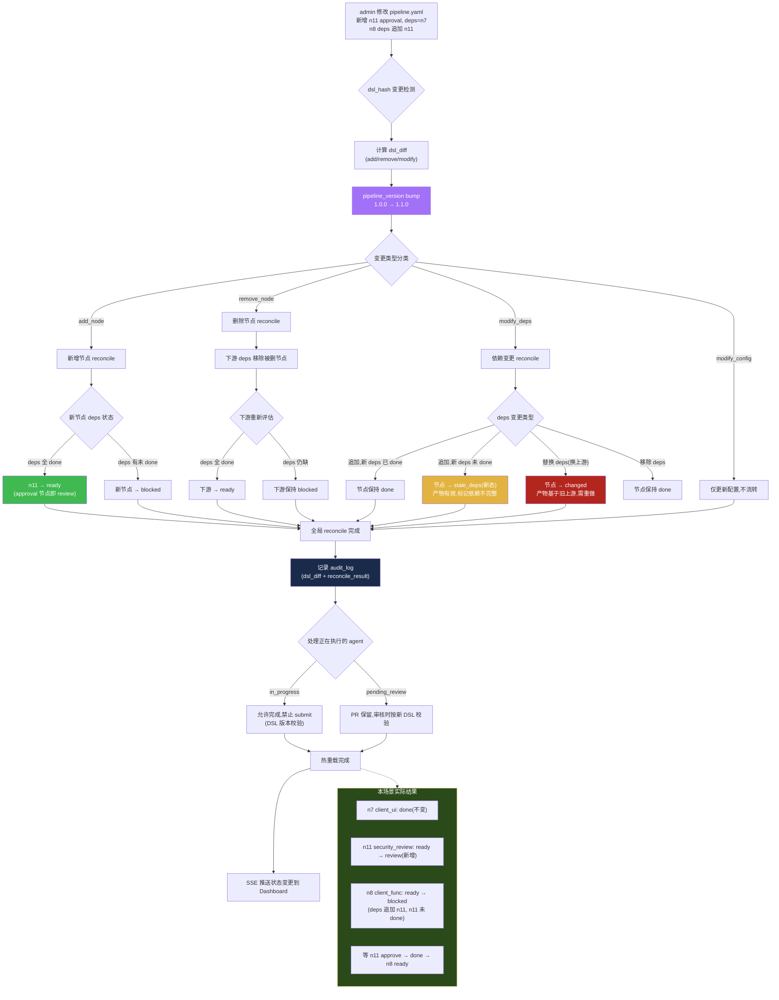

# PRD 压力测试报告:大文件产物 / 错误引用 / 管线热重载

> **文档性质**:对《coordination-platform-prd.md》v2.0 及其深化文档(fr1-fr6-artifact-review / fr4-data-api)的真实场景压力测试
> **版本**:v1.0 | **日期**:2026-08-04 | **状态**:架构评审输入
> **测试方法**:选取 3 个真实开发场景,逐步走查 PRD 当前设计能否承载,定位设计缺陷并提出修正方案
> **被测文档**:
> - [coordination-platform-prd.md](../coordination-platform-prd.md)(主 PRD)
> - [fr1-fr6-artifact-review.md](../deep-dive/fr1-fr6-artifact-review.md)(FR1/FR6 深化)
> - [fr4-data-api.md](../deep-dive/fr4-data-api.md)(FR4 深化)

---

## 0. 测试结论摘要

| 场景 | PRD 能否承载 | 核心缺陷数 | 严重度 |
|---|---|---|---|
| 场景 5:设计稿含 50MB 切图 zip | ❌ 不能 | 8 | **高**(设计资产完全无法入库) |
| 场景 8:开发方提交错误产物引用 | ⚠️ 勉强能跑但引用正确性裸奔 | 7 | **高**(错误到联调才暴露,回溯成本高) |
| 场景 9:管线中途修改漏加节点 | ⚠️ 部分能跑 | 7 | **中**(热重载语义不清,已 done 节点行为未定义) |

**总体判断**:PRD v2.0 的"产物仓库只存 git + 管理方不解析内容 + 管线静态 DAG"三件套,在 MVP 小文件/自觉提交/管线不变的场景下成立,但**一旦遇到设计稿大文件、引用正确性、管线演进三类真实压力,会出现存储模型不匹配、信任链断裂、状态机语义缺失三类系统性缺陷**。本报告给出可落地的修正方案,均不破坏"管理方中立性"与"合并即推进"两大不变项。

---

## 1. 场景 5:产物体积大(设计稿含大量切图 zip)

### 1.1 场景描述

设计师为登录功能产出 `design_asset`,交付物包含:
- **切图包**:`login-assets.zip`,内含 120 张 PNG/WebP 切图,体积 **50MB**
- **Figma 链接 JSON**:`001_figma.json`,含 figma file_key、frame 链接、最后修改时间,体积 2KB

设计师通过 design_agent 调 `submit_artifact` 提交。预期流程:推 feat 分支 → 开 PR → 管理方审核 → 合并 → client_ui 节点解锁可消费设计资产。

现实约束:
- 产物仓库是普通 git,50MB 单文件 push 慢、clone 更慢
- 管理方审核时不下载内容(中立性原则),无法预览 zip 内切图
- Figma 链接指向的外部资源随时可能被设计师改/删(外部依赖不稳定)
- 产物仓库随项目累积,clone 越来越慢

### 1.2 PRD 走查

逐步查 PRD 当前设计能否处理此场景:

**走查 1:文件大小约束能否放行 50MB zip?**

主 PRD FR5.2 `skill.yaml` 结构(第 438-440 行):
```yaml
file_constraints:
  allowed_extensions: [.yaml, .json, .md]
  max_size_kb: 512
```

fr1-fr6 深化 §4.1.1 规则 `R_FILE_FORMAT`:
```yaml
checks:
  - field: __files__
    op: size_le
    value_kb: 512
```

fr1-fr6 深化 §3.3 manifest schema 的 `source.path` pattern:
```
^[a-z_]+/[0-9]{3}[_a-z0-9-]*\.(yaml|yml|json|md|mdx)$
```

**结论**:50MB zip **直接被三道门挡死**——扩展名 `.zip` 不在白名单(只允许 yaml/yml/json/md/mdx)、大小 51200KB 远超 512KB 上限、path 正则不匹配 `.zip` 后缀。设计资产**根本无法入库**。

**走查 2:错误码 ARTIFACT_TOO_LARGE 的提示是否可行?**

fr4 深化 §2.2 错误码表:
> `ARTIFACT_TOO_LARGE` (413):agent 拆分产物或改用 LFS/对象存储,在 manifest 填引用

这只是一个错误提示,**PRD 全文没有定义 LFS/对象存储的集成机制**——manifest 怎么填外部存储引用?ArtifactRef 结构(repo + path + commit)能指向 S3 吗?审核规则怎么校验外部存储的存在性?全部空白。

**走查 3:产物仓库 clone 性能有无优化策略?**

- 主 PRD FR1.1 规则:"管理方不解析内容,只校验文件存在性 + 扩展名/大小"
- fr4 深化 NFR5:"git show 拉取产物内容 < 5s"
- fr4 深化 §9.5 `get_dependencies` 的 `max_content_kb: 512` 默认上限

**结论**:50MB 文件的 `git show` 必然超 5s;`get_dependencies` 会直接截断;产物仓库随设计资产累积,clone 时间线性增长。**PRD 没有任何浅克隆/partial clone/LFS 策略**。

**走查 4:Figma 链接的可追溯性有无保障?**

主 PRD FR1.1 仓库结构(第 162-163 行):
```
design_asset/
└─ 001_figma.json     # 含 figma 链接
```

fr1-fr6 深化 §3.3 manifest schema **不含**任何 figma 相关字段;`source.path` 只指向产物仓库内路径,无法记录 figma file_key/version。

**结论**:设计师把 Figma 链接 JSON 提交后,如果 Figma 上原图被改/删,产物仓库里的 JSON 仍在,但**链接指向的内容已变质**,管理方无从感知。中立性原则下,管理方既不校验链接有效性,也不快照 Figma 内容。

**走查 5:审核时能否对 zip 做抽查?**

fr1-fr6 深化 §1.2 不变原则:"管理方不解析产物内容,只校验元数据 + 文件格式";§4.1.4 op 清单无"解压校验"或"内容抽样"op。

**结论**:50MB zip 入库后,管理方审核时只能确认"文件存在 + 大小符合",**无法预览切图内容**。`design_asset` 在 fr1-fr6 §4.4 审核策略矩阵中是 `requires_human_review=true`,人工审核者也无法在 PR 里预览 zip——中立性变成了"盲目性"。

### 1.3 设计缺陷

| # | 缺陷 | 严重度 | 涉及章节 |
|---|---|---|---|
| D5-1 | `max_size_kb: 512` 对设计资产完全不现实,切图包普遍 10-100MB | **高** | 主 PRD FR5.2、fr1-fr6 §4.1.1 |
| D5-2 | `allowed_extensions` 白名单只允许 yaml/yml/json/md/mdx,不支持 zip/二进制设计资产 | **高** | 主 PRD FR5.2、fr1-fr6 §3.3 path 正则 |
| D5-3 | 无 Git LFS / 对象存储(S3/OSS)集成设计,错误码提示的"改用 LFS/对象存储"无落地路径 | **高** | fr4 §2.2 ARTIFACT_TOO_LARGE |
| D5-4 | `ArtifactRef` 结构(repo + path + commit)只能指向 git 仓库,无法指向外部存储 URI | **高** | 主 PRD §5.1、fr4 §8.1 artifact_ref 表 |
| D5-5 | 无 Figma 外部依赖的可追溯机制(无 file_key/version/snapshot 字段),链接失效无法感知 | **中** | fr1-fr6 §3.3 manifest schema |
| D5-6 | 无仓库克隆优化策略(浅克隆/partial clone/LFS),产物累积后 clone 线性变慢 | **中** | 主 PRD FR1、fr4 NFR5 |
| D5-7 | `get_dependencies` 的 `max_content_kb: 512` 对大文件直接截断,下游 agent 拿不到完整设计资产 | **中** | fr4 §9.5 |
| D5-8 | `design_asset` 的 `requires_human_review=true` 但人工审核者无法预览 zip,中立性变盲目性 | **中** | fr1-fr6 §4.4、主 PRD FR6.4 |

### 1.4 修正方案

#### 1.4.1 引入"分层存储"模型

将产物存储分为三层,按文件类型与体积自动路由:

| 层 | 存储 | 存什么 | 体积特征 | 校验方式 |
|---|---|---|---|---|
| L1 Inline | 产物仓库 git | 元数据 manifest、引用 JSON、YAML/JSON/MD 文档 | < 512KB | git ls-file + 内容 schema |
| L2 LFS | 产物仓库 Git LFS | 中型二进制(设计稿源文件 .fig/.sketch、PDF) | 512KB - 50MB | LFS pointer + sha256 |
| L3 Object | 外部对象存储(S3/OSS) | 大型二进制(切图包 zip、视频、原型包) | > 50MB | HEAD 请求 + ETag + sha256 |

**设计资产目录结构调整**(放宽 fr1-fr6 §2.1.1 "禁止子目录"约束,design_asset 例外):
```
design_asset/
├─ 001_login.manifest.json        # 元数据(L1,管理方校验)
├─ 001_login_figma.json           # Figma 链接元数据(L1)
├─ 001_login_assets.zip.lfs        # LFS pointer 文件(L1,指向 L2 实体)
└─ 001_login_prototype/            # 大型原型包(L3,manifest 里记 S3 URI)
```

#### 1.4.2 扩展 ArtifactRef 与 manifest schema

`ArtifactRef` 增加 `storage` 字段,支持多存储后端:

```python
class ArtifactRef(TypedDict):
    node_id: str
    repo: str                    # 产物仓库地址(L1 必填)
    path: str                    # 产物在仓库内路径(L1 必填)
    commit: str                  # git commit hash(L1 必填)
    toolspec_framework: str
    trace_id: str
    # 新增
    storage: StorageRef          # 存储位置描述(可选,默认 git inline)
    version: str                 # semver(对齐 fr1-fr6 §3.3)

class StorageRef(TypedDict):
    type: str                    # "git_inline" | "git_lfs" | "object_storage"
    # type=git_lfs 时
    lfs_oid: str                 # LFS object id(sha256)
    lfs_size: int                # 字节数
    # type=object_storage 时
    external_uri: str            # s3://bucket/key 或 oss://bucket/key
    etag: str                    # 对象 ETag
    content_sha256: str          # 内容校验值(独立于 ETag)
    expires_at: str | None       # 预签名 URL 过期时间(可选)
```

manifest schema(fr1-fr6 §3.3)的 `source` 段扩展:

```json
"source": {
  "type": "object",
  "required": ["path"],
  "properties": {
    "path": { "type": "string" },
    "storage": {
      "type": "object",
      "properties": {
        "type": { "enum": ["git_inline", "git_lfs", "object_storage"] },
        "external_uri": { "type": "string" },
        "content_sha256": { "type": "string", "pattern": "^[0-9a-f]{64}$" },
        "size_bytes": { "type": "integer" }
      }
    }
  }
}
```

#### 1.4.3 扩展 skill.yaml 的 file_constraints

```yaml
file_constraints:
  # 原有(适用 L1 inline)
  allowed_extensions: [.yaml, .json, .md]
  max_size_kb: 512
  # 新增:分层存储支持
  large_file_support:
    enabled: true
    lfs_threshold_kb: 512          # 超过此大小走 LFS
    object_storage_threshold_kb: 51200  # 超过 50MB 走对象存储
    lfs_allowed_extensions: [.zip, .fig, .sketch, .pdf, .png, .webp]
    object_storage_allowed_extensions: [.zip, .tar.gz, .mp4]
```

#### 1.4.4 新增审核规则

在 fr1-fr6 §4 规则引擎中新增:

```yaml
- id: R_EXTERNAL_STORAGE_EXISTS
  name: 外部存储存在性校验
  priority: 76
  combinators: AND
  on_fail: reject
  checks:
    - field: source.storage
      op: external_storage_exists   # HEAD 请求 S3/OSS,校验 ETag + sha256
    - field: source.storage.content_sha256
      op: exists

- id: R_LFS_POINTER_VALID
  name: LFS pointer 校验
  priority: 76
  combinators: AND
  on_fail: reject
  checks:
    - field: __files__
      op: lfs_pointer_valid          # 校验 .lfs pointer 文件格式 + oid 存在
```

**关键:管理方仍不解析内容**——只校验"对象存在 + ETag/sha256 匹配",不下载内容、不解压 zip。中立性不变。

#### 1.4.5 Figma 外部依赖可追溯

manifest 增加 `external_refs` 段:

```json
"external_refs": {
  "type": "array",
  "items": {
    "type": "object",
    "properties": {
      "kind": { "enum": ["figma", "sketch", "external_url"] },
      "uri": { "type": "string" },
      "snapshot_at": { "type": "string", "format": "date-time" },
      "snapshot_artifact_path": { "type": "string", "description": "本地快照副本路径(可选)" }
    }
  }
}
```

**策略:**
- `external_refs[].uri` 必填(记录 Figma 链接)
- `snapshot_at` 记录设计师导出时刻的 Figma 版本时间戳
- `snapshot_artifact_path` 可选:设计师同时导出一份 PNG 快照存 L2 LFS,作为"防失效备份"
- 管理方**不校验 Figma 链接有效性**(保持中立),但记录 snapshot_at 便于追溯

#### 1.4.6 仓库克隆优化

| 策略 | 适用场景 | 实现 |
|---|---|---|
| Git LFS | 中型二进制(切图包、设计源文件) | `.gitattributes` 配置 `*.zip filter=lfs diff=lfs merge=lfs -text` |
| Partial clone | agent 拉取产物仓库 | `git clone --filter=blob:none`(默认不拉 LFS 对象,按需 fetch) |
| Shallow clone | CI 审核(只需最新 commit) | `git clone --depth 1` |
| 按需拉取 | `get_dependencies` 拉大文件 | 返回 LFS pointer + 预签名 URL,agent 自行下载 |

`get_dependencies` 工具扩展返回结构:

```json
{
  "deps": [{
    "node_id": "n6",
    "artifact_ref": { "repo": "...", "path": "...", "storage": { "type": "object_storage", "external_uri": "s3://..." } },
    "content": null,
    "content_uri": "https://s3-signed-url/...",
    "content_sha256": "abc123...",
    "truncated": false,
    "hint": "大文件,请按 content_uri 下载,校验 sha256"
  }]
}
```

#### 1.4.7 大文件人工审核预览

`design_asset` 的 `requires_human_review=true` 时,审核界面提供:
- L1 元数据(manifest)直接展示
- L2/L3 大文件提供**预签名下载 URL**(短期有效)+ sha256 校验值
- 人工审核者自行下载抽查,管理方不代为下载/解析

### 1.5 设计图:大文件分层存储架构



---

## 2. 场景 8:开发方提交了错误的产物引用

### 2.1 场景描述

`server_impl` 节点(n4),开发方通过 server_agent 调 `submit_artifact` 提交 `ArtifactRef`,指向代码仓库 `org/backend-services` 的 commit `abc123`。

但 `abc123` 实际是**另一个功能**(用户头像上传)的代码,开发方在多个 commit 里搞混了 commit hash。

预期流程:提交 → 管理方审核 → 合并 → client_func 联调。现实:
- 管理方不解析内容,只校验元数据(commit hash 格式对就过)
- 代码 review 在代码仓库做(不归管理方管),reviewer 看的是代码质量,不会发现"这个 commit 不是登录功能的"
- 引用错误直到 **client_func 联调时**才暴露——客户端调登录接口返回 404,排查发现服务端实现的是头像上传

### 2.2 PRD 走查

**走查 1:审核规则能否发现引用错误?**

fr1-fr6 深化 §4.1.1 规则 `R_FILE_EXISTS`:
```yaml
checks:
  - field: __files__
    op: git_ls_file_exists       # git ls-file 校验
```

fr4 深化 §9.1 `submit_artifact` 错误码 `ARTIFACT_NOT_FOUND`:
> `git ls-file branch:path` 失败

**关键问题**:这里的 `git ls-file` 校验的是**产物仓库里 `server_impl/001_ref.json` 这个文件是否存在**,而**不是**校验 `001_ref.json` 里 `code_commit: abc123` 指向的代码仓库 commit 是否存在。

fr1-fr6 深化 §3.4 引用型产物子 schema:
```json
{
  "required": ["code_repo", "code_commit", "code_path"],
  "properties": {
    "code_repo": { "type": "string" },
    "code_commit": { "pattern": "^[0-9a-f]{7,40}$" },
    "code_path": { "type": "string" }
  }
}
```

**结论**:`code_commit` 只校验"是 7-40 位 hex",**完全不校验 commit 是否真实存在于 code_repo**。开发方填一个格式正确的假 commit 也能过审。

**走查 2:有无"引用存在性校验"(git ls-remote 确认 commit 存在)?**

检索 fr1-fr6 §4.1.4 op 清单:只有 `git_ls_file_exists`(校验产物仓库文件),**没有** `git_ls_remote_exists` 或 `ref_target_exists`。

检索 fr4 §2.2 错误码:有 `GIT_REPO_UNREACHABLE`(产物仓库不可达),**没有** `REF_TARGET_NOT_FOUND`(代码仓库 commit 不存在)。

**结论**:管理方**完全不校验引用目标的存在性**。开发方提交一个指向已删除 commit 的引用,也能审核通过并入库。

**走查 3:有无"引用一致性校验"(commit 的代码确实属于该 feature)?**

主 PRD §1.4 范围边界:"不校验产物内容格式(YAML/JSON/Figma 均可)";fr1-fr6 §1.2:"管理方不解析产物内容"。

**结论**:一致性校验需要解析代码内容(读 commit 的 diff、判断是否实现 api_contract),**直接违反中立性原则**。PRD 刻意回避了这一点,但也因此完全放弃了对引用正确性的保障。

**走查 4:引用错误能否回溯?**

fr1-fr6 深化 §5.1 AuditLogEntry 结构:
```python
class AuditLogEntry(TypedDict):
    submitter: str          # 提交者标识
    merge_commit: str       # 产物仓库 merge commit
    deps_at_review: dict    # 审核时依赖状态
    trace_id: str
```

fr4 深化 §9.14 `get_audit_log` 支持按 node_id / actor_id / action / pr_id 过滤。

**结论**:审计日志**能查到"是谁提交的、什么时候合并的"**,但 `deps_at_review` 只记录依赖节点状态(如 `{"n2": "done"}`),**不记录引用校验结果**(因为根本没校验)。回溯只能定位到"server-agent-01 在 PR #42 提交了引用",但无法证明"提交时引用就是错的"。

**走查 5:联调发现不符后,能否触发 server_impl 的 changed?**

主 PRD FR2.1 状态机:`changed` 状态的进入条件是"重提已 done 节点的 PR"。即只有开发方主动重提 PR 才能触发 changed。

fr4 §6.1 `langgraph_invoke` action 模式:有 `submit` / `reject_pr` / `update_progress` / `request_approval` / `approve` / `reject` / `set_gate_policy`,**没有** `report_mismatch` 或 `trigger_invalidate`。

**结论**:客户端联调发现服务端实现和契约不符时,**没有标准机制触发 server_impl 的 changed**。只能靠人工通知开发方,开发方手动重提 PR。级联失效链路无法自动启动。

**走查 6:有无"引用签名"机制?**

检索 fr1-fr6 §3.3 manifest schema:无 `implements` / `claims_to_satisfy` / `signature` 字段。

**结论**:开发方提交时无需声明"这个 commit 实现了 api_contract 001 v1.0.0",管理方也就无从记录"开发方声称实现了什么"。事后追责缺少声明证据。

### 2.3 设计缺陷

| # | 缺陷 | 严重度 | 涉及章节 |
|---|---|---|---|
| D8-1 | `R_FILE_EXISTS` 只校验产物仓库内的 ref.json 文件存在,不校验 ref.json 指向的代码仓库 commit 是否真实存在 | **高** | fr1-fr6 §4.1.1、§4.1.4 |
| D8-2 | 无"引用存在性校验"(git ls-remote 确认 commit 存在),假 commit 可过审 | **高** | fr1-fr6 §4.1.4 op 清单 |
| D8-3 | 无"引用签名"机制,开发方无需声明 commit 实现了哪个契约版本,事后追责无证据 | **高** | fr1-fr6 §3.3 manifest schema |
| D8-4 | 无"下游验证/上报不符"机制,联调发现引用错误无法自动触发 server_impl changed | **高** | 主 PRD FR2.1、fr4 §6.1 action 清单 |
| D8-5 | 审计日志 `deps_at_review` 只记录依赖状态,不记录引用校验结果,回溯证据不足 | **中** | fr1-fr6 §5.1、fr4 §8.1 audit_log 表 |
| D8-6 | 错误码无 `REF_TARGET_NOT_FOUND` / `REF_REPO_UNREACHABLE`,agent 无法程序化处理引用错误 | **中** | fr4 §2.2 错误码表 |
| D8-7 | "管理方不解析内容"原则下,引用一致性(代码属于该 feature)完全裸奔,错误到联调才暴露 | **中** | 主 PRD §1.4、fr1-fr6 §1.2 |

### 2.4 修正方案

**设计原则:管理方保持中立(不解析代码内容),但补全"存在性校验 + 声明记录 + 下游反馈闭环"三道防线。**

#### 2.4.1 第一道防线:引用存在性校验(R_REF_EXISTS)

新增审核规则,用 `git ls-remote` 校验 code_repo + code_commit 真实存在:

```yaml
- id: R_REF_EXISTS
  name: 引用目标存在性校验
  priority: 78
  combinators: AND
  on_fail: reject
  applies_to: [server_impl, server_test, client_ui, client_func, client_delivery]
  checks:
    - field: content.code_repo
      op: ref_target_exists       # git ls-remote 确认 commit 存在
      timeout_s: 5
    - field: content.code_commit
      op: ref_target_reachable    # commit 未被 gc、仓库可达
```

**关键:只校验"commit 存在",不解析 commit 内容**——中立性不变,但消灭了"假 commit 过审"的漏洞。

新增错误码:

| 错误码 | HTTP | 含义 | retryable |
|---|---|---|---|
| `REF_TARGET_NOT_FOUND` | 404 | code_commit 在 code_repo 中不存在 | false |
| `REF_REPO_UNREACHABLE` | 502 | code_repo 不可达 | true |
| `REF_TARGET_GC` | 410 | code_commit 已被 git gc 回收 | false |

#### 2.4.2 第二道防线:引用签名机制(manifest.implements)

manifest schema 增加 `implements` 段,开发方提交时**声明**本产物实现了哪个上游契约的哪个版本:

```json
"implements": {
  "type": "array",
  "description": "声明本产物实现了哪些上游产物(开发方声明,管理方记录但不验证内容)",
  "items": {
    "type": "object",
    "required": ["node_id", "version"],
    "properties": {
      "node_id": { "type": "string", "pattern": "^n[0-9]+$" },
      "version": { "type": "string", "description": "声明的上游版本(semver)" },
      "declared_at": { "type": "string", "format": "date-time" },
      "declared_by": { "type": "string", "description": "agent_id | user_id" }
    }
  }
}
```

**语义:**
- 开发方提交 `server_impl` 时声明 `implements: [{"node_id": "n2", "version": "1.0.0"}]`
- 管理方**不验证** commit 内容是否真的实现了 n2 v1.0.0(保持中立)
- 管理方**记录**声明到审计日志,作为事后追责证据
- 若 `implements` 声明的 node_id 不在 `deps` 列表里 → `R_IMPLEMENTS_IN_DEPS` 规则 reject(声明与依赖不一致)

```yaml
- id: R_IMPLEMENTS_IN_DEPS
  name: 实现声明与依赖一致
  priority: 73
  on_fail: reject
  checks:
    - field: implements
      op: implements_subset_of_deps   # implements 的 node_id 必须在 deps 内
```

#### 2.4.3 第三道防线:下游验证与上报不符(report_mismatch)

新增 MCP 工具 `report_mismatch`,允许下游角色上报"上游实现与契约不符":

```json
{
  "name": "report_mismatch",
  "version": "1.0.0",
  "description": "下游角色上报上游产物与契约不符,触发上游 changed(附证据)",
  "inputSchema": {
    "type": "object",
    "required": ["upstream_node_id", "evidence"],
    "properties": {
      "upstream_node_id": { "type": "string", "description": "被上报的上游节点(如 server_impl)" },
      "downstream_node_id": { "type": "string", "description": "发现问题的下游节点(如 client_func)" },
      "mismatch_type": { "enum": ["contract_violation", "wrong_ref", "missing_impl", "behavior_diff"] },
      "evidence": {
        "type": "object",
        "required": ["summary"],
        "properties": {
          "summary": { "type": "string", "maxLength": 500 },
          "test_log_uri": { "type": "string" },
          "repro_steps": { "type": "string" }
        }
      },
      "severity": { "enum": ["blocker", "major", "minor"], "default": "major" }
    }
  }
}
```

**处理流程:**
1. `report_mismatch` 调用 → 上游节点进入 `disputed` 新状态(非直接 changed,避免误报导致级联)
2. 管理方记录到审计日志(action=mismatch_reported)
3. 通知上游角色 agent + reviewer
4. reviewer 人工裁定:
   - **裁定成立**:上游节点 → `changed` → invalidate 下游 → 重提
   - **裁定不成立**:驳回上报,下游继续

**为什么需要 `disputed` 中间态?** 直接 `changed` 会导致下游级联 blocked,若上报是误报(如下游自己 bug),代价过大。`disputed` 给 reviewer 一个裁断窗口。

#### 2.4.4 扩展状态机(新增 disputed 态)

主 PRD FR2.1 状态机从 7 态扩展为 8 态:

| 状态 | 含义 | 进入条件 | 退出条件 |
|---|---|---|---|
| `disputed`(新增) | 被下游上报不符,待裁定 | `report_mismatch` | reviewer 裁定成立 → changed;不成立 → 恢复原态 |

状态流转补充:
```
done →(report_mismatch)→ disputed →(裁定成立)→ changed → invalidate 下游
                                  →(裁定不成立)→ done(恢复)
```

#### 2.4.5 审计日志扩展

audit_log 表增加引用校验相关字段:

```sql
ALTER TABLE audit_log ADD COLUMN ref_verification JSONB;
-- 示例值:{"ref_exists": true, "ref_checked_at": "...", "implements": [{"node_id":"n2","version":"1.0.0"}]}
```

审计日志记录内容扩展:
- `submit_artifact` 时:记录 `ref_verification`(引用存在性校验结果)+ `implements`(声明)
- `report_mismatch` 时:记录上报者、证据摘要、severity
- `approve_pr` 时:记录 `ref_verification` + `implements`(合并时的声明快照)

### 2.5 设计图:引用信任链与下游验证流程

```mermaid
flowchart LR
    subgraph UPSTREAM["上游(api_contract n2)"]
        CONTRACT["api_contract v1.0.0<br/>已 done"]
    end

    subgraph SERVER["开发方提交 server_impl(n4)"]
        SUBMIT["submit_artifact<br/>code_commit=abc123"]
        DECLARE["声明 implements:<br/>n2@1.0.0"]
        SUBMIT --> DECLARE
    end

    subgraph REVIEW["管理方审核(三道防线)"]
        F1["第一道:R_REF_EXISTS<br/>git ls-remote 确认 commit 存在"]
        F2["第二道:R_IMPLEMENTS_IN_DEPS<br/>声明 node_id 在 deps 内"]
        F3["记录声明到审计日志<br/>(不验证内容,保持中立)"]
        F1 --> F2 --> F3
    end

    DECLARE --> F1
    F3 --> APPROVE{"approve"}
    APPROVE -->|"合并"| DONE["n4 = done"]
    APPROVE -->|"reject REF_TARGET_NOT_FOUND"| READY["回 ready"]

    subgraph DOWNSTREAM["下游联调(client_func n8)"]
        INTEG["联调测试"]
        MISMATCH{"发现契约不符?"}
        INTEG --> MISMATCH
    end

    DONE --> INTEG

    MISMATCH -->|"是"| REPORT["report_mismatch<br/>upstream=n4<br/>evidence=..."]
    MISMATCH -->|"否"| PASS["继续"]

    subgraph DISPUTE["裁定流程"]
        DISPUTED["n4 → disputed<br/>(新增状态)"]
        REVIEWER["reviewer 人工裁定<br/>(查契约 + 代码 commit)"]
        UPHOLD{"裁定成立?"}
        DISPUTED --> REVIEWER --> UPHOLD
    end

    REPORT --> DISPUTED

    UPHOLD -->|"成立"| CHANGED["n4 → changed<br/>invalidate 下游"]
    UPHOLD -->|"不成立"| RESTORE["n4 → done 恢复<br/>记录误报"]

    CHANGED --> READY

    subgraph AUDIT["审计日志(可追溯)"]
        A1["submit: server-agent-01<br/>ref_verification: exists=true<br/>implements: n2@1.0.0"]
        A2["mismatch: client-agent-02<br/>evidence: 调登录接口 404"]
        A3["verdict: reviewer-01<br/>upheld, 代码实现的是头像上传"]
        A1 --> A2 --> A3
    end

    F3 -.-> A1
    REPORT -.-> A2
    UPHOLD -.-> A3

    style F1 fill:#4a8ad6,color:#fff
    style F2 fill:#4a8ad6,color:#fff
    style F3 fill:#a371f7,color:#fff
    style DISPUTED fill:#e3b341,color:#fff
    style CHANGED fill:#b3261e,color:#fff
    style AUDIT fill:#1a2a4a,color:#fff
```



---

## 3. 场景 9:管线定义中途修改(漏了节点)

### 3.1 场景描述

登录功能管线开发到一半,`client_ui`(n7)已 done,即将进入 `client_func` 联调。此时安全团队要求所有功能必须经过 `security_review` 审批节点。

admin 修改 `pipeline.yaml`,新增 approval 节点:
```yaml
- id: "n11"
  type: "approval"
  role: "control"
  deps: ["n7"]           # client_ui 已 done
  approver: "security_agent"
```

并在 `client_func`(n8)的 deps 里追加 `n11`:
```yaml
- id: "n8"
  type: "client_func"
  deps: ["n7", "n11"]    # 原来只依赖 n7
```

### 3.2 PRD 走查

**走查 1:管线热重载机制是否定义?**

主 PRD FR2.2:"无环校验:管线加载时校验 DAG 无环(CI 校验)"——只说"加载时",没说"运行中修改"。

fr4 深化 §8.1 pipeline 表:
```sql
dsl_hash TEXT NOT NULL,          -- pipeline.yaml 的 sha256,变更检测
dsl_content JSONB NOT NULL,      -- 完整 DSL 快照
status TEXT NOT NULL DEFAULT 'active'  -- active | paused | completed | archived
```

fr4 深化 §6.1 `langgraph_invoke` action 模式:`submit` / `reject_pr` / `update_progress` / `request_approval` / `approve` / `reject` / `set_gate_policy`——**没有** `reload_pipeline` / `reconcile_state` action。

**结论**:PRD **没有定义管线热重载机制**。pipeline 表有 dsl_hash 变更检测,但 dsl_hash 变了之后如何处理——是拒绝、是重置状态、还是热重载?全部空白。

**走查 2:新增节点 deps=["client_ui"](已 done),新节点会被 cascade 解锁吗?**

主 PRD FR2.2 级联规则:"节点 done → 检查所有下游,依赖全满足的下游置 ready"。

fr4 深化 §8.1 node_dep 表记录依赖关系,但 cascade 逻辑只在"节点 done"时触发,不在"节点新增"时触发。

**结论**:新增 n11 deps=["n7"](n7 已 done),按 cascade 语义 n11 应该 ready,但**cascade 触发点是"上游 done 事件",不是"新节点加入"**。PRD 没有定义"新节点加入后,若上游已 done,如何初始化新节点状态"。

**走查 3:新增 approval 节点 deps 已 done,要不要补审?security_review 是事后补的,合理吗?**

主 PRD FR2.1 状态机:`approval` 节点"上游 done → review;approve→done"。

fr1-fr6 深化 §4.4 审核策略矩阵:`client_delivery` 是 `requires_human_review=true`。

**结论**:n11 是 approval 控制节点,deps=["n7"] 已 done,n11 进入 review 态,等待 security_agent 审批。**语义上合理**(安全审查是事后补的),但 PRD 没有明确"补审"的合法性——approval 节点的上游产物已经合并生效,补审的意义是"放行下游"而非"准入上游"。

**走查 4:如果删掉一个已 done 的节点,下游依赖它的节点怎么办?**

主 PRD FR2.2 级联失效:"节点 changed → 所有下游产物引用清除 + 置 blocked(递归)"。但"删除节点"不是"changed",是节点本身消失。

fr4 深化 §8.3 外键策略:`node_dep → node` 是 `ON DELETE CASCADE`——节点删除时依赖记录自动清理。

**结论**:DB 层 cascade 删除依赖记录,但**应用层语义未定义**。如果 n9(gate)被删除,n10(approval)原本 deps=["n9"],删除后 n10 的 deps 变空,n10 应该 ready 还是保持 blocked?PRD 没说。

**走查 5:修改已 done 节点的 deps,该节点要重做吗?**

假设给已 done 的 `client_ui`(n7)追加 `design_system`(n0)依赖。

主 PRD FR2.1 状态机:done 的退出条件是"重新提 PR 变更",没有"deps 变更触发重做"。

fr4 深化 §8.1 node 表的 status 字段:done 是终态之一,只有"重提 PR"才到 changed。

**结论**:PRD **没有定义"deps 变更对已 done 节点的影响"**。三种可能语义都没定义:
- (a) deps 追加但已 done,忽略新 deps(保守,但 design_system 的变更不会传导到 client_ui)
- (b) deps 追加 → client_ui → changed(需重做,代价大)
- (c) deps 追加 → client_ui 保持 done,但新 deps 的变更会级联(混合语义,复杂)

**走查 6:管线版本化有无定义?**

fr4 深化 §8.1 pipeline 表只有 `dsl_hash`(变更检测),**没有** `pipeline_version` 字段。

fr1-fr6 深化 §2.4.3 `repo-meta.yaml` 有 `directory_layout_version`,但那是**产物仓库**的版本,不是**管线**的版本。

fr4 深化 §8.1 node 表的 PRIMARY KEY 是 `(node_id, pipeline_id)`,如果 DSL 删了某 node_id,该节点的历史状态怎么办?

**结论**:PRD **没有管线版本概念**。DSL 变更后,旧版本 state 与新版本 DSL 的兼容性完全未定义。node_id 删除后,该节点的 audit_log、artifact_ref 因 `ON DELETE CASCADE` 会丢失历史。

**走查 7:热重载 vs 冷重启,改管线要不要停掉正在进行的 agent?**

主 PRD FR3.3 CrewAI ↔ LangGraph 协作:节点 ready → CrewAI build_crew 分配 Task。如果管线热重载时 n8 正在 in_progress,n8 的 deps 被修改,会发生什么?

fr4 深化 §6.3 超时与熔断:有 LangGraph 异常熔断,但没有"管线变更时正在执行的节点如何处理"。

**结论**:PRD **没有定义热重载与冷重启的边界**。正在执行的 agent 是否要中断?正在 pending_review 的 PR 是否要作废?全部未定义。

### 3.3 设计缺陷

| # | 缺陷 | 严重度 | 涉及章节 |
|---|---|---|---|
| D9-1 | 无"管线热重载"机制,DSL 变更后如何生效未定义 | **高** | 主 PRD FR2.2、fr4 §8.1 pipeline 表 |
| D9-2 | cascade 触发点只有"上游 done",没有"新节点加入后上游已 done"的初始化逻辑 | **高** | 主 PRD FR2.2、fr2 深化 |
| D9-3 | 删除已 done 节点后,下游节点状态未定义(DB cascade 删依赖,但应用层语义空) | **高** | fr4 §8.3 外键策略 |
| D9-4 | 修改已 done 节点的 deps,该节点是否重做未定义(三种语义都未选) | **高** | 主 PRD FR2.1 状态机 |
| D9-5 | 无管线版本化概念,pipeline 表只有 dsl_hash 没有 pipeline_version | **中** | fr4 §8.1 |
| D9-6 | 旧版本 state 与新版本 DSL 兼容性未定义,node_id 删除后历史丢失 | **中** | fr4 §8.1 node 表 PK |
| D9-7 | 热重载 vs 冷重启边界未定义,正在执行的 agent/PR 如何处理空白 | **中** | 主 PRD FR3.3、fr4 §6.3 |

### 3.4 修正方案

#### 3.4.1 引入管线版本化

pipeline 表扩展:

```sql
ALTER TABLE pipeline ADD COLUMN pipeline_version TEXT NOT NULL DEFAULT '1.0.0';
ALTER TABLE pipeline ADD COLUMN dsl_diff JSONB;  -- 本次版本与上版的差异(add/remove/modify)
ALTER TABLE node ADD COLUMN pipeline_version TEXT NOT NULL DEFAULT '1.0.0';
```

**版本规则:**
- DSL 变更 → pipeline_version bump(按变更类型:MAJOR=删节点/改 deps;MINOR=加节点;PATCH=改配置)
- DSL 变更入 audit_log(action=pipeline_reloaded,记录 dsl_diff)
- 旧版本节点的 audit_log / artifact_ref **不删除**,改为软删除(node 表加 `deleted_at` 字段)

#### 3.4.2 管线变更分类与状态影响矩阵

| 变更类型 | 影响 | 已 done 上游 | 未 done 上游 |
|---|---|---|---|
| **add_node**(新增节点) | 新节点按 deps 评估 | deps 全 done → new node ready | deps 有未 done → new node blocked |
| **remove_node**(删除节点) | 下游 deps 移除该节点 | 下游重新评估(见下) | 下游重新评估 |
| **modify_deps**(改依赖) | 受影响节点重新评估 | 见 §3.4.4 | 重新评估 |
| **modify_config**(改 approver/policy) | 仅配置更新,不流转状态 | 不影响 | 不影响 |

#### 3.4.3 新增节点的状态初始化(reconcile 逻辑)

管线热重载后,对新增节点执行 reconcile:

```python
def reconcile_new_node(node_id: str, state: PipelineState) -> NodeStatus:
    """新节点加入后,根据上游状态初始化"""
    deps = get_deps(node_id)
    if not deps:
        return "ready"                          # 无依赖根节点
    upstream_statuses = [state.node_states[d] for d in deps]
    if all(s == "done" for s in upstream_statuses):
        return "ready"                          # 上游全 done → 直接 ready
    return "blocked"                            # 有未 done 上游 → blocked
```

**新增 approval 节点 deps=["client_ui"](已 done)的处理:**
- n11 → ready → 进入 review 态(approval 节点 ready 即 review)
- security_agent 审批:approve → n11 done → n8(client_func)deps 满足 → n8 ready
- **补审语义合法**:approval 节点的意义是"放行下游",不是"准入上游产物"

#### 3.4.4 修改已 done 节点 deps 的语义

采用**混合语义**(方案 c 的细化):

| deps 变更 | 已 done 节点行为 |
|---|---|
| **追加**新 deps,且新 deps 已 done | 保持 done(新 deps 已满足) |
| **追加**新 deps,但新 deps 未 done | 节点 → `stale_deps` 新状态(产物仍有效,但标记依赖不完整);新 deps done 后自动恢复 done |
| **移除** deps | 保持 done(依赖减少不影响已生效产物) |
| **替换** deps(改上游) | 节点 → changed(产物基于旧上游,需基于新上游重做) |

新增状态 `stale_deps`(状态机从 7/8 态扩展为 9 态):

| 状态 | 含义 | 进入条件 | 退出条件 |
|---|---|---|---|
| `stale_deps`(新增) | 已 done 节点因 deps 追加,新 deps 未满足 | 管线热重载追加未 done deps | 新 deps 全 done → 恢复 done |

**为什么需要 `stale_deps` 而非直接 `changed`?** `changed` 会清除产物引用 + 级联 blocked 下游,代价过大。`stale_deps` 是"软警告":产物仍有效,下游不受影响,但节点标记为"依赖不完整",提醒开发方关注新 deps。

#### 3.4.5 删除已 done 节点的处理

```python
def reconcile_remove_node(removed_node_id: str, state: PipelineState):
    """删除节点后,下游重新评估"""
    downstream = get_downstream(removed_node_id)
    for ds_node_id in downstream:
        # 从下游的 deps 中移除被删节点
        remove_dep(ds_node_id, removed_node_id)
        # 重新评估下游状态
        deps = get_deps(ds_node_id)
        upstream_statuses = [state.node_states[d] for d in deps]
        if all(s == "done" for s in upstream_statuses):
            # 下游原 blocked(因被删节点未 done)→ 现在 deps 满足 → ready
            if state.node_states[ds_node_id] == "blocked":
                state.node_states[ds_node_id] = "ready"
        # 若下游已 done,保持 done(依赖减少不影响)
```

**被删节点的历史保留:**
- node 表加 `deleted_at` 字段,软删除而非物理删除
- audit_log / artifact_ref 不再 `ON DELETE CASCADE`,改为保留(node_id 字段保留,即使节点软删除)
- 外键策略修改:`audit_log → node` 改为 `SET NULL` 而非 `CASCADE`(对齐 fr4 §8.3 审计日志特殊约束)

#### 3.4.6 热重载 vs 冷重启

| 模式 | 触发 | 行为 | 适用场景 |
|---|---|---|---|
| **热重载**(默认) | DSL 变更 + pipeline active | 重建 graph + 保留 node_states + reconcile | 加节点、改 approver、加 deps |
| **冷重启**(显式) | admin 调 `reload_pipeline(cold=true)` | 重建 graph + 重置非 done 节点到 blocked + reconcile | 大幅重构、deps 全换 |
| **拒绝加载** | DSL 变更破坏不变项(如删 done 节点且下游无替代) | 拒绝 DSL 变更,要求 admin 先处理下游 | 保护性兜底 |

新增 `langgraph_invoke` action:

```python
# action=reload_pipeline
inputs = {
    "action": "reload_pipeline",
    "pipeline_id": "login-feature",
    "new_dsl": {...},
    "mode": "hot" | "cold"
}
# 返回 reconcile 结果:每个节点的 from_status → to_status
```

**热重载时正在执行的 agent 处理:**
- in_progress 节点:允许完成当前工作(不中断),但禁止 submit(提交时校验 DSL 版本,若 DSL 已变 → 提示"管线已变更,请基于新 DSL 重新评估")
- pending_review 节点:PR 保留,审核时按新 DSL 校验 deps(若 deps 已变 → 参考 fr1-fr6 §5.3.3 依赖失效处理)

#### 3.4.7 管线变更审计

DSL 变更入 audit_log:

```json
{
  "action": "pipeline_reloaded",
  "actor_id": "admin-01",
  "pipeline_id": "login-feature",
  "note": "新增 security_review 节点",
  "dsl_diff": {
    "added_nodes": [{"id": "n11", "type": "approval", "deps": ["n7"]}],
    "modified_nodes": [{"id": "n8", "deps_change": {"added": ["n11"]}}],
    "removed_nodes": []
  },
  "reconcile_result": {
    "n11": {"from": null, "to": "review"},
    "n8": {"from": "ready", "to": "blocked"}
  },
  "pipeline_version": "1.1.0"
}
```

### 3.5 设计图:管线热重载状态兼容流程



---

## 4. 缺陷汇总表

### 4.1 全部缺陷清单

| 场景 | 缺陷 ID | 缺陷描述 | 严重度 | 涉及文档章节 | 修正方案章节 |
|---|---|---|---|---|---|
| 场景 5 | D5-1 | `max_size_kb: 512` 对设计资产不现实,切图包普遍 10-100MB | 高 | 主 PRD FR5.2、fr1-fr6 §4.1.1 | §1.4.3 |
| 场景 5 | D5-2 | `allowed_extensions` 不支持 zip/二进制设计资产 | 高 | 主 PRD FR5.2、fr1-fr6 §3.3 | §1.4.3 |
| 场景 5 | D5-3 | 无 Git LFS / 对象存储集成设计,错误码提示无落地路径 | 高 | fr4 §2.2 | §1.4.1-1.4.2 |
| 场景 5 | D5-4 | `ArtifactRef` 只能指向 git 仓库,无法指向外部存储 URI | 高 | 主 PRD §5.1、fr4 §8.1 | §1.4.2 |
| 场景 5 | D5-5 | 无 Figma 外部依赖可追溯机制(无 file_key/snapshot 字段) | 中 | fr1-fr6 §3.3 | §1.4.5 |
| 场景 5 | D5-6 | 无仓库克隆优化策略(浅克隆/partial clone/LFS) | 中 | 主 PRD FR1、fr4 NFR5 | §1.4.6 |
| 场景 5 | D5-7 | `get_dependencies` 的 512KB 上限对大文件直接截断 | 中 | fr4 §9.5 | §1.4.6 |
| 场景 5 | D5-8 | `design_asset` 人工审核无法预览 zip,中立性变盲目性 | 中 | fr1-fr6 §4.4 | §1.4.7 |
| 场景 8 | D8-1 | `R_FILE_EXISTS` 只校验产物仓库 ref.json 存在,不校验代码 commit 存在 | 高 | fr1-fr6 §4.1.1 | §2.4.1 |
| 场景 8 | D8-2 | 无"引用存在性校验",假 commit 可过审 | 高 | fr1-fr6 §4.1.4 | §2.4.1 |
| 场景 8 | D8-3 | 无"引用签名"机制,开发方无需声明 commit 实现了哪个契约 | 高 | fr1-fr6 §3.3 | §2.4.2 |
| 场景 8 | D8-4 | 无"下游上报不符"机制,联调发现错误无法触发 server_impl changed | 高 | 主 PRD FR2.1、fr4 §6.1 | §2.4.3-2.4.4 |
| 场景 8 | D8-5 | 审计日志不记录引用校验结果,回溯证据不足 | 中 | fr1-fr6 §5.1、fr4 §8.1 | §2.4.5 |
| 场景 8 | D8-6 | 错误码无 REF_TARGET_NOT_FOUND 等,agent 无法程序化处理 | 中 | fr4 §2.2 | §2.4.1 |
| 场景 8 | D8-7 | "不解析内容"原则下引用一致性完全裸奔,错误到联调才暴露 | 中 | 主 PRD §1.4、fr1-fr6 §1.2 | §2.4.1-2.4.3 |
| 场景 9 | D9-1 | 无"管线热重载"机制,DSL 变更后如何生效未定义 | 高 | 主 PRD FR2.2、fr4 §8.1 | §3.4.1, §3.4.6 |
| 场景 9 | D9-2 | cascade 触发点只有"上游 done",无"新节点加入后上游已 done"初始化 | 高 | 主 PRD FR2.2 | §3.4.3 |
| 场景 9 | D9-3 | 删除已 done 节点后,下游节点状态未定义 | 高 | fr4 §8.3 | §3.4.5 |
| 场景 9 | D9-4 | 修改已 done 节点 deps,该节点是否重做未定义 | 高 | 主 PRD FR2.1 | §3.4.4 |
| 场景 9 | D9-5 | 无管线版本化概念,pipeline 表无 pipeline_version | 中 | fr4 §8.1 | §3.4.1 |
| 场景 9 | D9-6 | 旧版本 state 与新版本 DSL 兼容性未定义,node 删除后历史丢失 | 中 | fr4 §8.1 | §3.4.1, §3.4.5 |
| 场景 9 | D9-7 | 热重载 vs 冷重启边界未定义,正在执行的 agent/PR 处理空白 | 中 | 主 PRD FR3.3、fr4 §6.3 | §3.4.6 |

### 4.2 修正方案对主 PRD 的影响汇总

| 修正项 | 影响的 PRD 章节 | 是否破坏不变项 | 实施优先级 |
|---|---|---|---|
| 分层存储(L1/L2/L3) | FR1.1、FR5.2、§5.1 ArtifactRef | 否(管理方仍不解析内容) | P1(阻塞设计资产入库) |
| ArtifactRef 增加 storage 字段 | §5.1、fr4 §8.1 artifact_ref 表 | 否(扩展,非破坏) | P1 |
| file_constraints 增加 large_file_support | FR5.2 skill.yaml | 否(扩展) | P1 |
| 新增规则 R_EXTERNAL_STORAGE_EXISTS / R_LFS_POINTER_VALID | fr1-fr6 §4 | 否(只校验存在性,不解析内容) | P1 |
| manifest 增加 external_refs 段 | fr1-fr6 §3.3 | 否(记录,不校验) | P2 |
| 新增规则 R_REF_EXISTS / R_IMPLEMENTS_IN_DEPS | fr1-fr6 §4 | 否(存在性校验,不解析代码) | P1 |
| manifest 增加 implements 段 | fr1-fr6 §3.3 | 否(声明记录,不验证内容) | P1 |
| 新增 MCP 工具 report_mismatch | fr4 §9(第 15 个工具) | 否(新增,不改现有) | P2 |
| 状态机新增 disputed 态 | 主 PRD FR2.1(8 态) | 否(扩展) | P2 |
| 状态机新增 stale_deps 态 | 主 PRD FR2.1(9 态) | 否(扩展) | P2 |
| pipeline 表增加 pipeline_version | fr4 §8.1 | 否(扩展) | P1 |
| 新增 langgraph_invoke action: reload_pipeline | fr4 §6.1 | 否(新增 action) | P1 |
| 节点软删除(deleted_at) | fr4 §8.1 node 表 | 否(改 CASCADE 为软删除) | P2 |
| 审计日志增加 ref_verification 字段 | fr4 §8.1 audit_log 表 | 否(扩展) | P2 |

### 4.3 不变项验证

本报告所有修正方案均**不破坏** PRD 的两大不变项:

1. **管理方不解析产物内容**:
   - 分层存储:管理方只校验对象存在性(HEAD + ETag),不下载/解压内容
   - 引用存在性校验:只 `git ls-remote` 确认 commit 存在,不读 commit 内容
   - 引用签名:管理方记录声明,不验证声明真实性
   - 下游上报:由 reviewer 人工裁定,管理方不自动判定

2. **合并即推进**:
   - 分层存储:大文件校验通过 + PR 合并后才 set_done
   - 引用校验:R_REF_EXISTS 通过才 approve_pr
   - 管线热重载:不改变"合并即推进"语义,只补充"DSL 变更后 reconcile"

---

## 5. 实施建议

| 阶段 | 修正项 | 优先级 | 理由 |
|---|---|---|---|
| Phase 1 MVP 补丁 | D5-1~D5-4(分层存储基础)、D8-1~D8-3(引用校验+签名)、D9-1~D9-2(热重载+reconcile) | P0 | 阻塞真实场景,不补无法上线 |
| Phase 2 | D5-5~D5-8(Figma 追溯+克隆优化)、D8-4~D8-7(下游验证+disputed 态)、D9-3~D9-7(删除/deps 变更+版本化) | P1 | 提升可靠性,可在 MVP 后迭代 |
| Phase 3 | report_mismatch 工具、stale_deps 态、节点软删除、审计扩展 | P2 | 增强可观测与可追溯 |

**建议在主 PRD v2.1 中纳入本报告的修正项,作为 v2.0 → v2.1 的架构升级输入。**

---

**文档结束。** 本报告基于 3 个真实场景的压力测试,定位 22 项设计缺陷,给出可落地的修正方案,均不破坏 PRD 核心不变项。建议与 [fr1-fr6-artifact-review.md](../deep-dive/fr1-fr6-artifact-review.md)、[fr4-data-api.md](../deep-dive/fr4-data-api.md) 配套评审。
