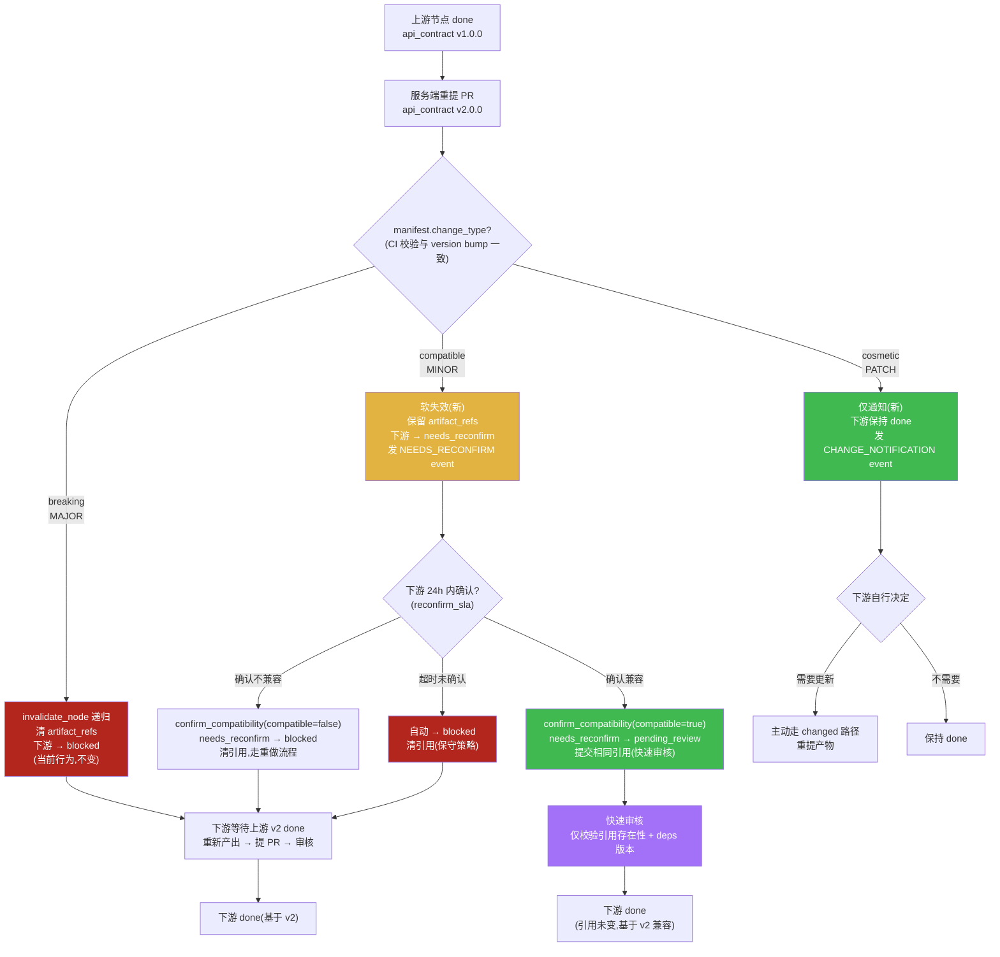
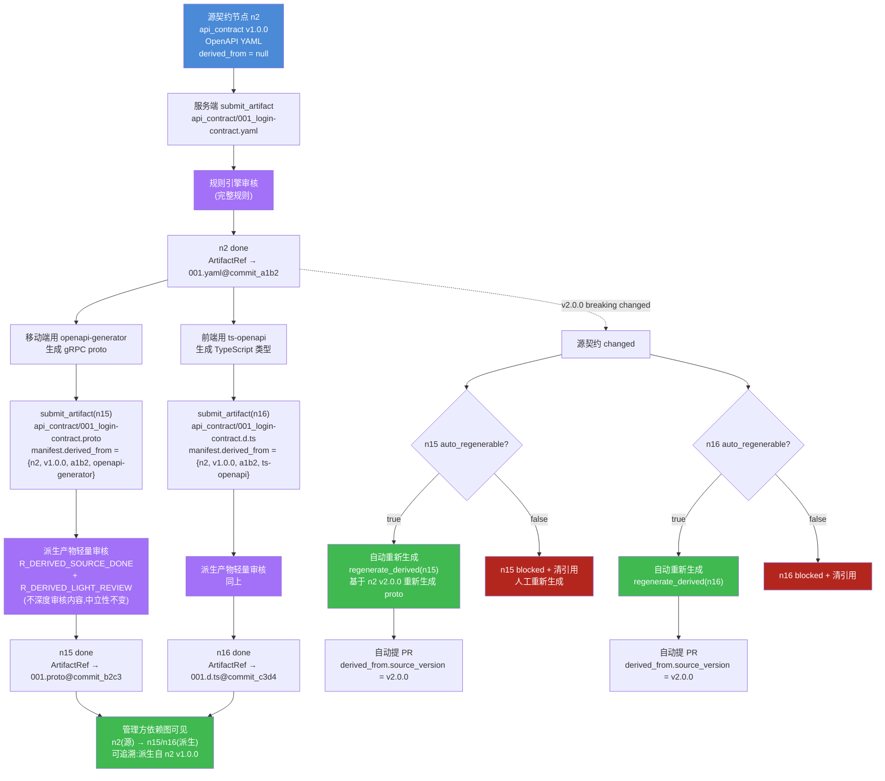

# 场景压力测试:契约版本与多格式管理

> **文档性质**:对主 PRD `coordination-platform-prd.md` 及深化文档 `fr1-fr6-artifact-review.md`、`fr2-orchestration.md` 的真实开发场景压力测试报告
> **版本**:v1.0 | **日期**:2026-08-04 | **状态**:待评审
> **测试方法**:选取 3 个高频真实开发场景,逐步走查 PRD 当前设计能否处理,定位设计缺陷并提出修正方案
> **上游文档**:
> - [coordination-platform-prd.md](../coordination-platform-prd.md)
> - [fr1-fr6-artifact-review.md](../deep-dive/fr1-fr6-artifact-review.md)
> - [fr2-orchestration.md](../deep-dive/fr2-orchestration.md)

---

## 目录

- [场景 1:接口契约中途变更(offset → cursor)](#场景-1接口契约中途变更offset--cursor)
- [场景 6:同一接口契约多种格式(OpenAPI + gRPC + TypeScript)](#场景-6同一接口契约多种格式openapi--grpc--typescript)
- [场景 14:契约 v2 向后不兼容的版本共存](#场景-14契约-v2-向后不兼容的版本共存)
- [缺陷汇总表](#缺陷汇总表)

---

## 场景 1:接口契约中途变更(offset → cursor)

### 1.1 场景描述

**背景**:`login-feature` 管线已推进到中后期,三个产物节点均已 `done`:

| 节点 | 类型 | 状态 | 内容 |
|---|---|---|---|
| n2 | `api_contract` | done | v1.0.0,分页方案为 `offset` + `limit` |
| n6 | `design_asset` | done | 基于 v1 数据结构完成标注(字段标注、分页控件标注) |
| n8 | `client_ui` | done | 基于 v1 已开发完整 UI 代码,引用代码仓库 commit `e5f6g7h8` |

**触发**:服务端在压测中发现 `offset` 分页在深分页时性能急剧下降(典型 `OFFSET 100000` 慢查询),决定将分页方案改为 `cursor`(基于 `last_id` + `limit`)。这是一次**破坏性变更**:删除 `offset` 字段、新增 `cursor` 字段、响应结构变更。

服务端重新提交 `api_contract` v2.0.0(MAJOR bump),走 `changed` 路径:对已 done 的 n2 重提 PR。

**影响面**:
- n2 自身:`done` → `changed` → `pending_review` → (审核合并)→ `done`(ArtifactRef 更新到 v2 commit)
- 下游 n6(design_asset)、n8(client_ui):按 PRD 当前设计会被递归失效

### 1.2 PRD 走查

#### 走查点 A:changed 级联会把 client_ui 和 design_asset 都 blocked + 清引用,合理吗?

**PRD 依据**:
- 主 PRD FR2.2(第 259 行):"级联失效 | 节点 changed → 所有下游产物引用清除 + 置 blocked(递归)"
- 主 PRD FR2.1 状态机(第 238 行):"changed | 已 done 产物被重新提交(变更)"
- FR2 深化 T10(第 72 行):"done → changed | submit_artifact 重提已 done 节点的 PR | 副作用:触发 invalidate_node 递归失效下游"
- FR2 深化 T16(第 78 行):"blocked/ready/in_progress/pending_review → blocked | 下游 cascade 失效 | 副作用:清 artifact_refs[nid],清 pending_prs[nid]"

**走查结论**:**当前设计无法区分"破坏性变更"与"兼容性变更",一律清引用 + blocked**。

本场景是 breaking 变更(删 `offset` 字段),清引用 + blocked 表面合理。但问题在于:PRD 的级联逻辑是**无条件的**——即使 v2 只是新增一个可选字段(MINOR,向后兼容),也会触发同样的清引用 + blocked。主 PRD FR2.2(第 259 行)没有任何条件分支,FR2 深化 T10/T16 也没有根据变更类型分级。

FR1/FR6 深化 §2.2.2(第 149-156 行)已经定义了 semver 语义:
- MAJOR = breaking 变更(删字段、改字段类型)
- MINOR = 向后兼容新增
- PATCH = 修复性变更

**但这个 semver 信息在级联逻辑中完全未被利用**。semver 只用于 `R_DEPS_MIN_VERSION`(第 522-529 行,校验依赖最低版本)和 `R_VERSION_BUMP`(第 553-560 行,校验版本递增),从未用于决定级联行为。这是一个明显的**信息-行为脱节**。

#### 走查点 B:客户端代码已基于 v1 写好,管理方"清引用"后,代码还在代码仓库,怎么"恢复"?

**PRD 依据**:
- 主 PRD FR1.1(第 166-167 行):`client_ui/001_ref.json` 是引用型产物,内容是 `{"code_repo", "code_commit", "code_path", ...}`
- FR1/FR6 深化 §3.4(第 446-466 行):引用型产物子 schema,指向外部代码仓库 commit
- FR1/FR6 深化 §2.3.3(第 196-207 行):"引用型产物的共存策略同上,但文件内容是引用 JSON 而非实际代码"
- FR2 深化 T16(第 78 行):清 `artifact_refs[nid]`

**走查结论**:**"清引用"清的是管理方持有的 `ArtifactRef`(指向 `client_ui/001_ref.json` 的 `repo + path + commit`),不是代码仓库的代码**。代码仓库的代码(commit `e5f6g7h8`)仍然存在,git 不可变。

但问题在于:管理方**丢失了对客户端代码的追踪**。`artifact_refs[n8]` 被清空后,管理方不知道:
1. 客户端代码对应代码仓库的哪个 commit
2. 客户端代码是基于 v1 还是 v2 开发的
3. 客户端代码是否需要修改

"恢复"的唯一路径是:客户端 agent 重新调 `submit_artifact(n8)`,重新提交一个 `client_ui/002_ref.json`(可能指向相同或新的代码 commit),走完整 `ready → pending_review → done` 流程。

这在 breaking 场景下是必要的(客户端确实要改代码)。但在**兼容性变更**场景下(v2 只是新增可选字段,客户端代码完全兼容),这是**纯浪费**:客户端没有改任何代码,却要重新走一遍产出 → 提 PR → 审核 → 合并流程,仅仅是为了把"引用"重新填回去。

更严重的是:FR1/FR6 深化 §7.2.2(第 1076-1082 行)有重试次数限制(同 node_id 反复提新 PR 5 次/节点,第 6 次起强制 needs_human)。如果上游频繁做兼容性变更,下游反复"恢复引用",很容易触达 5 次上限被强制人工介入。

#### 走查点 C:设计稿标注基于 v1 数据结构,重做成本极高,有没有"兼容期"机制?

**PRD 依据**:
- 主 PRD FR2.2(第 259 行):changed → 下游 blocked(递归,立即生效)
- FR2 深化 T16(第 78 行):cascade 失效是递归的,无延迟
- 主 PRD 状态机(第 228-238 行):7 态中无"过渡期"或"宽限期"状态

**走查结论**:**没有兼容期机制**。changed 触发后,下游**立即** blocked,设计稿标注立即失效。

设计稿标注(design_asset)的重做成本极高:标注是基于字段名、数据结构、分页方案做的视觉标注。v2 改了分页方案,标注要全部重做。但实际工作中:
1. 设计稿可能已经交付给开发,正在实现中
2. 重做标注需要设计师排期,不是即时的
3. 在标注重做完成前,客户端开发只能干等(blocked)

PRD 没有"软失效"或"宽限期"机制:即下游被标记为"需要更新",但保留旧引用可用,给下游一个修复窗口。当前是硬失效:引用立即清除,下游立即无法工作。

#### 走查点 D:如果 v2 是向后兼容的(只加字段不改字段),还需要级联失效吗?

**PRD 依据**:
- 主 PRD FR2.2(第 259 行):无条件级联
- FR1/FR6 深化 §2.2.2(第 149-156 行):MINOR = 向后兼容新增
- FR1/FR6 深化 §4.1.1(第 491-571 行):规则引擎有 `R_VERSION_BUMP`、`R_DEPS_MIN_VERSION`,但**没有** `R_BREAKING_CHANGE_DETECTION` 或 `R_COMPATIBILITY_CHECK`

**走查结论**:**PRD 没有"兼容性变更"vs"破坏性变更"的区分机制**。

即使提交者在 manifest 声明了 `version: 1.1.0`(MINOR,向后兼容),级联逻辑依然无条件清引用 + blocked。提交者无法通过任何机制告诉管理方"这次变更是兼容的,下游不需要重做"。

这是一个**架构级的缺口**:semver 的 MAJOR/MINOR/PATCH 语义本应驱动级联行为,但 PRD 把 semver 仅仅当作"版本号格式校验"和"最低版本校验"用,没有把它作为"变更影响面判断"的输入。

#### 走查点 E:变更通知下游后,下游是必须重做,还是可以"确认兼容"后直接重新提交相同引用?

**PRD 依据**:
- 主 PRD FR2.1 状态机(第 228-238 行):blocked → ready → pending_review → done,无"确认兼容"快捷路径
- 主 PRD FR4.1(第 364-372 行):MCP 工具无 `confirm_compatibility` 或 `revalidate` 工具
- FR1/FR6 深化 §7.2.1(第 1065-1072 行):重试前置条件是"读取驳回原因 → 修复问题 → 重新持锁 → bump 版本"

**走查结论**:**没有"确认兼容"的快速通道**。下游被 blocked 后,唯一出路是完整重走:
1. 等待上游 v2 done
2. 下游从 blocked → ready(cascade 解锁)
3. CrewAI 分配 Task 给客户端 agent
4. agent 调 `get_dependencies` 拉取 v2 内容
5. agent(或人工)判断是否兼容
6. 即使兼容,也要重新调 `submit_artifact` 提交一次(可能指向相同代码 commit)
7. 走 PR 审核 → 合并 → done

步骤 5-7 在兼容场景下是**纯冗余**:产物内容没变(代码 commit 相同),只是因为上游 changed 了,下游就要重新走一遍审核。这违背了 PRD §1.3(第 57-60 行)宣称的"自动化"价值——自动化应该减少冗余工作,而不是制造冗余。

### 1.3 设计缺陷

| # | 缺陷 | 严重度 | PRD 位置 |
|---|---|---|---|
| D1-1 | changed 级联无条件清引用 + blocked,不区分 breaking/compatible/cosmetic | **高** | 主 PRD 第 259 行;FR2 深化 T10(第 72 行)、T16(第 78 行) |
| D1-2 | semver 的 MAJOR/MINOR/PATCH 语义未与级联行为关联(信息-行为脱节) | **高** | FR1/FR6 深化 §2.2.2(第 149-156 行)定义了 semver,但 FR2.2(第 259 行)未引用 |
| D1-3 | 引用型产物(client_ui `*_ref.json`)清引用后,无"快速恢复"机制,兼容场景下需重走完整审核 | **高** | FR1/FR6 深化 §3.4(第 446 行);FR2 深化 T16(第 78 行);主 PRD FR4.1 无相应工具 |
| D1-4 | 无"兼容期/宽限期"机制,changed 立即硬失效,设计稿等高成本产物无修复窗口 | **中** | 主 PRD 状态机(第 228-238 行)无过渡态;FR2 深化 T16(第 78 行)无延迟 |
| D1-5 | 无"下游确认兼容"的快速通道,兼容场景下下游被迫重走产出→提PR→审核全流程 | **高** | 主 PRD FR4.1(第 364-372 行)工具清单缺确认工具;FR1/FR6 深化 §7.2(第 1063 行)重试流程无快速路径 |
| D1-6 | 兼容性变更反复触发时,下游反复"恢复引用"易触达 5 次重试上限被强制人工介入 | **中** | FR1/FR6 深化 §7.2.2(第 1076-1082 行)重试限制未区分"恢复引用"与"真实重做" |

### 1.4 修正方案

#### 修正 1.1:manifest 增加 `change_type` 字段(改 FR1/FR6 深化 §3.3)

在 manifest JSON Schema(第 266-443 行)的 `properties` 中新增:

```json
"change_type": {
  "type": "string",
  "description": "本次变更相对上一版本的影响类型,changed 路径必填,首次为 null",
  "enum": ["breaking", "compatible", "cosmetic"],
  "enumDescriptions": {
    "breaking": "破坏性变更(删字段/改字段类型/改语义),对应 semver MAJOR",
    "compatible": "向后兼容新增(加可选字段/加错误码),对应 semver MINOR",
    "cosmetic": "修复性变更(改描述/改示例),对应 semver PATCH"
  }
}
```

**约束**:
- `changed` 路径(已 done 节点重提)必填 `change_type`
- `change_type` 必须与 `version` bump 一致:`breaking` → MAJOR,`compatible` → MINOR,`cosmetic` → PATCH(CI 校验,违例 reject)
- 首次提交(`supersedes` 为 null)`change_type` 为 null

#### 修正 1.2:changed 级联按 `change_type` 分级处理(改主 PRD FR2.2 + FR2 深化 T10/T16)

**改主 PRD FR2.2(第 259 行)**,将"级联失效"从单一规则改为分级规则:

| change_type | 级联行为 | 下游状态 | 下游 artifact_refs | 下游后续动作 |
|---|---|---|---|---|
| `breaking` | 当前行为(递归清引用 + blocked) | blocked | **清除** | 下游必须重新产出,走完整 ready→review→done |
| `compatible` | 软失效(不清引用,置 `needs_reconfirm`) | needs_reconfirm(新态) | **保留** | 下游"确认兼容"后快速重提相同引用 |
| `cosmetic` | 仅通知,不级联 | 保持 done | **保留** | 仅发 `CHANGE_NOTIFICATION` event,下游自行决定是否更新 |

**改 FR2 深化 T10/T16**:T10 副作用根据 `change_type` 分支;T16 仅在 `breaking` 时清引用,`compatible` 时触发新转移 T19(done → needs_reconfirm)。

#### 修正 1.3:状态机增加 `needs_reconfirm` 态(改主 PRD FR2.1 + FR2 深化 §2.1)

7 态扩展为 8 态(或复用 `in_progress` 语义但加 `reconfirm_context` 标记,避免破坏 7 态不变量)。推荐新增独立态:

| 状态 | 含义 | 进入条件 | 退出条件 |
|---|---|---|---|
| `needs_reconfirm` | 上游兼容性变更,下游需确认是否兼容 | 上游 changed(compatible) 级联 | 下游确认兼容→pending_review(快速);下游确认不兼容→blocked |

**新增转移**(FR2 深化 §2.1 补充):
- T19: `done` → `needs_reconfirm` | 上游 changed(compatible) 级联 | 保留 artifact_refs,发 `NEEDS_RECONFIRM` event
- T20: `needs_reconfirm` → `pending_review` | 下游调 `confirm_compatibility` 提交相同引用 | 快速审核(仅校验引用存在性)
- T21: `needs_reconfirm` → `blocked` | 下游确认不兼容(需重做) | 清 artifact_refs,等上游 done 后 ready

#### 修正 1.4:新增 MCP 工具 `confirm_compatibility`(改主 PRD FR4.1)

```json
{
  "name": "confirm_compatibility",
  "description": "下游确认对上游兼容性变更兼容,快速重新提交相同引用",
  "inputSchema": {
    "type": "object",
    "properties": {
      "node_id": {"type": "string", "description": "下游节点 ID"},
      "upstream_node_id": {"type": "string", "description": "上游变更节点 ID"},
      "upstream_version": {"type": "string", "description": "上游新版本"},
      "compatible": {"type": "boolean", "description": "是否兼容"},
      "note": {"type": "string", "description": "确认说明"}
    },
    "required": ["node_id", "upstream_node_id", "upstream_version", "compatible"]
  }
}
```

**行为**:
- `compatible=true`:节点 `needs_reconfirm` → `pending_review`,提交相同 artifact_ref(指向原 commit),走**快速审核**(仅校验引用文件存在性 + deps 版本达标,不重跑全部规则)
- `compatible=false`:节点 `needs_reconfirm` → `blocked`,清 artifact_refs,等上游 done 后重新产出

#### 修正 1.5:skill.yaml 增加 `compatibility_policy`(改 FR1/FR6 深化 §4.1)

```yaml
# skills/api-contract-skill/skill.yaml 片段
compatibility_policy:
  # 定义该节点类型作为上游时,兼容性变更的默认级联策略
  compatible_cascade: needs_reconfirm   # breaking→blocked(固定);compatible→needs_reconfirm;cosmetic→notify
  cosmetic_cascade: notify
  reconfirm_sla_hours: 24               # 下游确认兼容的 SLA,超时自动置 blocked
```

### 1.5 设计图:变更级联改进流程



---

## 场景 6:同一接口契约多种格式(OpenAPI + gRPC + TypeScript)

### 6.1 场景描述

**背景**:一个跨端登录功能,服务端用 OpenAPI YAML 写接口契约。但不同消费方需要不同格式:

| 角色 | 需要的格式 | 用途 |
|---|---|---|
| server | OpenAPI YAML(`api_contract/001.yaml`) | 服务端实现依据,提交到产物仓库 |
| client(移动端) | gRPC proto | 移动端用 gRPC 通信,需要 proto 生成 stub |
| client(Web 前端) | TypeScript 类型定义 | 前端用 TS,需要类型定义做类型检查 |

**触发**:服务端只提交 OpenAPI YAML 到 `api_contract/`。移动端和前端各自用工具(如 `openapi-generator`、`grpc-cli`)生成自己需要的格式。

**影响面**:
- 管理方中立性原则下,不解析内容,不做格式转换
- 派生产物(gRPC proto、TS 类型)是否纳入管理?
- 若不纳入,联调时格式不一致无法追溯
- 若纳入,目录结构、节点关系、审核规则如何设计?

### 6.2 PRD 走查

#### 走查点 A:管理方中立性原则在这里是优点还是缺点?

**PRD 依据**:
- 主 PRD FR1.1(第 180 行):"管理方不解析内容,只校验文件存在性 + 扩展名/大小"
- 主 PRD §1.4(第 69 行):"不校验产物内容格式(YAML/JSON/Figma 均可)"
- 主 PRD §1.3(第 57 行):"通用性:产物格式中立(不限开发方案)"

**走查结论**:**中立性是"格式自由"的优点,但也是"缺少格式转换与一致性校验"的缺点**。

优点:服务端可以用任意工具写契约,管理方不限制。这符合 §1.3 的"通用性"价值。

缺点:当同一契约需要多格式表达时,管理方无法:
1. 校验 gRPC proto 与 OpenAPI 是否语义一致(中立性禁止解析内容)
2. 自动生成派生格式(管理方不做内容转换)
3. 追踪"客户端的 TS 类型是基于哪个版本的 OpenAPI 生成的"

这导致一个**可观测性黑洞**:客户端用了自己生成的 TS 类型,联调时和服务端实际行为不一致,管理方无法追溯——因为它根本不知道客户端生成了 TS 类型,也不知道基于哪个版本生成。

#### 走查点 B:如果服务端只提交 OpenAPI,客户端和前端各自生成自己的格式,这些"派生产物"要不要纳入管理?

**PRD 依据**:
- 主 PRD §2.1(第 93-105 行):9 种产物节点类型,无"派生产物"或"衍生契约"类型
- 主 PRD FR1.1(第 154-174 行):仓库目录结构,9 个产物类型目录,无派生产物目录
- FR1/FR6 深化 §2.1.1(第 96 行):"禁止在产物类型目录下建子目录(扁平化)"

**走查结论**:**PRD 没有"派生产物"概念,无法纳入管理**。

当前 9 种产物节点类型(第 93-105 行)中,`api_contract` 是唯一的契约类型。如果客户端把生成的 gRPC proto 也作为 `api_contract` 提交,会混淆"源契约"与"派生契约"——它们的角色、审核规则、依赖关系不同:
- 源契约:服务端产出,需人工审核,是下游依赖的根
- 派生契约:客户端产出,由工具生成,依赖源契约,不需深度审核(只需校验生成工具 + 源版本)

如果当作独立 `api_contract` 节点提交,PR 模板(第 194-213 行)要求声明 `deps`,但 deps 只能声明 `node_id`,无法表达"这是从 n2 v1.0.0 用 openapi-generator 生成的"这种派生关系。

#### 走查点 C:如果纳入管理,它们是独立节点还是 api_contract 的"附件"?

**PRD 依据**:
- 主 PRD §5.1 ArtifactRef(第 698-705 行):`node_id` → 单个 `ArtifactRef`,`repo + path + commit + toolspec_framework + trace_id`
- FR1/FR6 深化 §3.3 manifest schema(第 266-443 行):无 `derived_from` 字段
- FR1/FR6 深化 §2.3.2(第 182-193 行):不同节点的同类型产物以不同 seq 共存,但它们是**独立节点**,无派生关系

**走查结论**:**当前数据模型无法表达派生关系**。

ArtifactRef(第 698-705 行)是扁平的 `node_id → 引用` 映射,没有"这个产物是从哪个产物派生的"字段。manifest schema(第 266-443 行)也没有 `derived_from` 或 `source_artifact` 字段。

如果作为独立节点,会丢失"派生自 n2 v1.0.0"的信息;如果作为附件,PRD 没有"产物附件"机制——每个产物节点对应一个 ArtifactRef,不支持一对多。

#### 走查点 D:如果不纳入管理,客户端用了自己生成的 TypeScript 类型,联调时发现和服务端实际行为不一致,怎么追溯?

**PRD 依据**:
- 主 PRD FR7.2(第 586-588 行):"trace 贯穿:一次管线执行的 MCP 调用 + LangGraph 节点用同一 trace_id 串联"
- 主 PRD FR7.3(第 592-599 行):Dashboard 视图,依赖图叠加状态
- FR2 深化 §10.5(第 1186-1200 行):审计与合规,events 表 append-only

**走查结论**:**派生产物不在管理方视野内,无法追溯**。

如果客户端自己生成 TS 类型但不提交到管理方,那么:
1. 管理方的依赖图上看不到"客户端依赖了哪个版本的契约"
2. `client_ui` 的 ArtifactRef 只记录代码仓库 commit,不知道代码里用的 TS 类型是基于 OpenAPI v1.0.0 还是 v1.1.0 生成的
3. 联调出问题时,审计日志(第 538-556 行)只能查到 `client_ui` 提交时的 `deps_at_review`,但 deps 只到 node_id 粒度,不到"派生格式 + 源版本"粒度
4. Langfuse trace 也没有派生产物的任何 span

这是一个**可追溯性断裂**:管理方声称"全链路 trace"(§1.3 第 60 行),但派生产物是链路外的暗物质。

#### 走查点 E:产物仓库能存多种格式的同一契约吗?目录结构怎么设计?

**PRD 依据**:
- 主 PRD FR1.1(第 154-174 行):`api_contract/001.yaml`,扁平化
- FR1/FR6 深化 §2.1.1(第 96 行):"禁止在产物类型目录下建子目录(扁平化,避免路径歧义)"
- FR1/FR6 深化 §2.1.2(第 99-120 行):三段式命名 `<seq>_<slug>.<ext>`,seq 是类型目录内全局递增

**走查结论**:**当前目录规范可以存多种格式文件(扩展名白名单允许),但无法表达它们是同一契约的派生关系**。

技术上,`api_contract/` 目录下可以并存:
```
api_contract/
├─ 001_login-contract.yaml        # OpenAPI(源)
├─ 002_login-contract.proto       # gRPC(派生)
└─ 003_login-contract.d.ts        # TypeScript(派生)
```

但问题:
1. 它们是**独立 seq**,管理方无法知道 002 和 003 是从 001 派生的
2. 如果 001 changed(v2),002 和 003 不会自动级联失效(它们是独立节点,除非显式声明 deps)
3. 即使声明 deps(`002.deps = [001]`),当前级联是"blocked + 清引用",派生产物应该的是"自动重新生成"而非"手动重做"
4. FR1/FR6 深化 §2.1.1(第 96 行)的扁平化约束虽然允许同目录多文件,但语义上是"多个独立产物",不是"一个契约的多格式表达"

### 6.3 设计缺陷

| # | 缺陷 | 严重度 | PRD 位置 |
|---|---|---|---|
| D6-1 | 无"派生产物(derived artifact)"概念,同一契约的多格式表达无法建模 | **高** | 主 PRD §2.1(第 93-105 行)9 种节点类型无派生类型;§5.1 ArtifactRef 无派生字段 |
| D6-2 | manifest schema 无 `derived_from` 字段,无法表达派生关系 | **高** | FR1/FR6 深化 §3.3(第 266-443 行)无该字段 |
| D6-3 | 派生产物不纳入管理时,联调不一致无法追溯(可观测性黑洞) | **高** | 主 PRD FR7(第 574-608 行)trace 不覆盖派生产物;§1.3 第 60 行"全链路 trace"承诺落空 |
| D6-4 | 源契约 changed 时,派生产物无法"自动重新生成",只能走手动重做流程 | **中** | 主 PRD FR2.2(第 259 行)级联仅 blocked + 清引用,无"重新生成"语义 |
| D6-5 | 扁平化目录约束(禁止子目录)虽允许同目录多格式,但丢失派生关系语义 | **中** | FR1/FR6 深化 §2.1.1(第 96 行) |
| D6-6 | 审核规则无"派生产物校验"规则(校验 derived_from 源版本 + 生成工具) | **中** | FR1/FR6 深化 §4.1(第 491-571 行)规则清单无派生校验规则 |

### 6.4 修正方案

#### 修正 6.1:引入"派生产物"概念与 `derived_from` 字段(改 FR1/FR6 深化 §3.3 + 主 PRD §2.1)

**manifest schema 新增字段**(FR1/FR6 深化 §3.3 第 266-443 行):

```json
"derived_from": {
  "type": ["object", "null"],
  "description": "派生关系:本产物从哪个源产物派生生成。null 表示源产物(非派生)",
  "properties": {
    "source_node_id": {"type": "string", "pattern": "^n[0-9]+$"},
    "source_version": {"type": "string", "description": "派生时所基于的源产物版本(semver)"},
    "source_commit": {"type": "string", "pattern": "^[0-9a-f]{7,40}$"},
    "derivation_tool": {"type": "string", "description": "生成工具,如 openapi-generator、grpc-cli、ts-openapi"},
    "derivation_tool_version": {"type": "string"},
    "auto_regenerable": {"type": "boolean", "description": "源变更时是否可自动重新生成"}
  },
  "additionalProperties": false
}
```

**约束**:
- `derived_from` 非 null 时,该产物是派生产物
- 派生产物的 `deps` 必须包含 `source_node_id`
- 派生产物的 `deps[source_node_id].min_version` 必须等于 `source_version`(锁定派生基础)

#### 修正 6.2:节点类型扩展或复用策略(改主 PRD §2.1)

**方案 A(推荐,低侵入)**:复用 `api_contract` 类型,通过 `derived_from` 字段区分源/派生。审核规则按 `derived_from` 是否为 null 分流。

**方案 B(高侵入)**:新增节点类型 `derived_contract`,但需改 9 种 → 10 种,影响目录白名单、CI、skill 等多处。

推荐方案 A:不新增节点类型,`api_contract` 既可是源(derived_from=null)也可是派生(derived_from 非 null)。

#### 修正 6.3:目录结构支持派生产物分组(改 FR1/FR6 深化 §2.1.1)

放宽扁平化约束,允许按"源契约"分组:

```
api_contract/
├─ 001_login-contract.yaml              # 源(n2 v1.0.0,OpenAPI)
├─ 001_login-contract.manifest.json
├─ 001_login-contract.proto             # 派生(n15 v1.0.0,gRPC,derived_from n2)
├─ 001_login-contract.proto.manifest.json
├─ 001_login-contract.d.ts              # 派生(n16 v1.0.0,TS,derived_from n2)
├─ 001_login-contract.d.ts.manifest.json
└─ 002_user-profile.yaml                # 另一源契约(n12)
```

**命名规则扩展**:派生产物文件名与源产物共享 `<seq>_<slug>` 前缀,扩展名不同。seq 仍全局递增,但**派生产物的 slug 必须与源相同**(CI 校验),表达"同一契约的多格式"。

**替代方案(更严格)**:派生产物路径用 `{source_seq}_{source_slug}.{format_ext}`,即派生产物复用源的 seq,仅扩展名不同。但这与"seq 全局唯一递增"冲突,需调整 seq 语义为"源契约 seq + 派生格式标识"。

#### 修正 6.4:审核规则增加派生产物校验(改 FR1/FR6 深化 §4.1)

新增规则:

```yaml
- id: R_DERIVED_SOURCE_DONE
  name: 派生产物源版本校验
  priority: 88
  combinators: AND
  on_fail: reject
  condition: "manifest.derived_from != null"
  checks:
    - field: derived_from.source_node_id
      op: exists
    - field: derived_from.source_version
      op: dep_version_matches   # 源节点存在该 version 且状态 done
    - field: derived_from.source_commit
      op: commit_exists_in_repo
    - field: derived_from.derivation_tool
      op: exists

- id: R_DERIVED_LIGHT_REVIEW
  name: 派生产物轻量审核
  priority: 40
  combinators: AND
  on_fail: needs_human
  condition: "manifest.derived_from != null"
  checks:
    - field: __skill__.requires_human_review
      op: equals
      value: false              # 派生产物默认不需人工审核(工具生成,可信)
```

**语义**:派生产物走轻量审核(仅校验源版本 + 文件存在性),不深度审核内容(中立性原则不变)。

#### 修正 6.5:源契约 changed 时派生产物的级联策略(改主 PRD FR2.2)

源契约 changed 时,派生产物的级联按 `auto_regenerable` 分流:

| 源变更类型 | 派生 `auto_regenerable` | 派生产物行为 |
|---|---|---|
| breaking | true | blocked + 清引用,但触发**自动重新生成**(若工具可用)→ 自动提 PR |
| breaking | false | blocked + 清引用(需人工重新生成) |
| compatible | true | needs_reconfirm + 自动重新生成(可选) |
| compatible | false | needs_reconfirm(同场景 1) |

**新增 MCP 工具 `regenerate_derived(node_id)`**:调用 `derivation_tool` 基于源最新版本重新生成派生产物,自动提 PR。

### 6.5 设计图:多格式契约管理



---

## 场景 14:契约 v2 向后不兼容的版本共存

### 14.1 场景描述

**背景**:`user-profile` 管线,`api_contract` v1.0.0 已 done,所有下游(客户端 UI、设计稿、服务端实现)均基于 v1 done 并上线运行。

**触发**:产品决定重构用户信息接口,v2 删除 `legacy_field` 字段(破坏性变更)。但旧版本客户端(v1 客户端 App)正在线上运行,不能立刻强制升级——需要**版本共存期**:v1 保持可用(线上客户端继续调用),v2 供新客户端开发,等老客户端逐步迁移后再下线 v1。

**影响面**:
- 产物仓库:能否同时存 v1 和 v2?
- 管线:DAG 中是新增节点还是 changed 原节点?
- 状态机:旧版本是什么状态(done?deprecated?)
- 下游:客户端要不要同时维护两套 UI?

### 14.2 PRD 走查

#### 走查点 A:产物仓库能同时存 v1 和 v2 吗?PRD 的目录规范支持多版本共存吗?

**PRD 依据**:
- FR1/FR6 深化 §2.3.1(第 169-180 行):"同一节点在不同时期产出多个版本(变更迭代),它们以不同 seq 共存于同一类型目录"
- FR1/FR6 深化 §2.3.1(第 180 行)关键句:**"管理方 ArtifactRef 只指向'当前生效版本'的 commit,旧版本文件保留在仓库(可追溯)但不被引用"**
- 主 PRD §5.1 ArtifactRef(第 698-705 行):`artifact_refs: dict[str, ArtifactRef]`,node_id → 单个 ArtifactRef

**走查结论**:**文件可共存,但"引用"不能共存——ArtifactRef 是单值的,一个 node_id 只有一个"当前生效版本"**。

FR1/FR6 深化 §2.3.1(第 180 行)明确:旧版本文件保留在仓库**但不被引用**。这意味着:
- v1 文件(`api_contract/001.yaml`)还在仓库
- 但 `artifact_refs[n2]` 只指向 v2(`api_contract/003.yaml@commit_c3d4e5`)
- v1 的 ArtifactRef 被覆盖(丢失)

本场景需要 v1 和 v2 **同时被引用**(线上客户端用 v1,新客户端用 v2),但当前数据模型不支持。`artifact_refs` 是 `dict[str, ArtifactRef]`(第 267 行),node_id → 单值,无法存多个版本的引用。

#### 走查点 B:管线里是新增一个 api_contract_v2 节点,还是把原节点 changed?

**PRD 依据**:
- 主 PRD FR2.1 状态机(第 228-238 行):`done → changed`(重提已 done 节点)
- FR2 深化 T10(第 72 行):done → changed,触发 invalidate_node 递归失效下游
- 主 PRD §5.1 Pipeline(第 664-693 行):nodes 列表,node_id 唯一
- FR2 深化 §7.5(第 812-828 行):热重载,新增节点初始 blocked,不影响已有节点

**走查结论**:**两种路径都有问题**。

**路径 1:changed 原节点(n2)**
- n2: done → changed → (审核)v2 done,ArtifactRef 更新到 v2
- 下游(n8 client_ui 等):T16 递归失效,清引用 + blocked
- **问题**:旧版本客户端的产物引用被清,但线上客户端还在跑 v1。管理方丢失了"线上客户端对应 v1"的追踪。这在本场景是不可接受的——线上系统的引用不能因为"做了 v2"就消失。

**路径 2:新增节点(n17 = api_contract_v2)**
- n2 保持 done(v1 不动)
- n17 新增,初始 blocked → ready → ... → done(v2)
- n17 的下游也要新增(n18 = client_ui_v2)
- **问题**:
  1. 管线 DAG 改动大,要新增一整条下游链路
  2. v1 和 v2 的下游怎么区分?n8(基于 v1)和 n18(基于 v2)是独立节点,管理方不知道它们是"同一功能的两套实现"
  3. 客户端要不要同时维护两套 UI(n8 + n18)?成本高
  4. 何时下线 v1?没有机制标记"v1 即将下线,新下游不应再依赖 v1"

PRD 没有为"版本共存"提供专门机制,两种路径都是权宜之计。

#### 走查点 C:如果新增节点,v1 和 v2 的下游怎么区分?客户端要不要同时维护两套 UI?

**PRD 依据**:
- 主 PRD §2.1(第 93-105 行):节点类型清单,无"版本"维度
- 主 PRD §5.1 Pipeline(第 664-693 行):node_id 是唯一标识,无版本后缀约定
- FR1/FR6 深化 §2.3.2(第 182-193 行):不同节点的同类型产物以不同 seq 共存,node_id 与 seq 映射通过 manifest 维护

**走查结论**:**PRD 无版本区分机制,下游节点无法表达"我依赖 v1 还是 v2"**。

`client_ui` 节点 n8 的 deps 声明(第 207-210 行 PR 模板):
```yaml
deps:
  - node_id: n2
    artifact_path: api_contract/001.yaml
```

deps 只能声明 `node_id` + 可选 `min_version`(FR1/FR6 深化 §3.3 第 397-400 行)。`min_version` 是"最低版本",不是"版本范围"或"精确版本"。当 n2 有 v1.0.0 和 v2.0.0 共存时:
- n8 声明 `min_version: 1.0.0` → v2.0.0 也满足(2.0.0 ≥ 1.0.0),但 v2 是 breaking 的,n8 代码不兼容 v2
- `min_version` 无法表达"只要 1.x.x,不要 2.x.x"的版本范围约束

#### 走查点 D:如果 changed 原节点,旧版本客户端的产物引用被清了,但线上还在跑,怎么办?

**PRD 依据**:
- FR2 深化 T16(第 78 行):清 `artifact_refs[nid]`
- FR1/FR6 深化 §2.3.1(第 180 行):旧版本文件保留但不被引用
- 主 PRD FR7.3(第 592-599 行):Dashboard 依赖图叠加状态
- FR2 深化 §10.5(第 1186-1200 行):events 表 append-only,可查历史

**走查结论**:**changed 路径会丢失线上系统的引用追踪,存在运维风险**。

changed 后,`artifact_refs[n8]` 被清空。虽然:
- 代码仓库的客户端代码还在(不可变)
- events 表有历史记录(可查 n8 曾引用 v1)
- 产物仓库的 v1 文件还在

但管理方的**当前 state** 丢失了"n8 对应 v1"的信息。Dashboard 依赖图上 n8 显示 blocked,无法体现"n8 对应的代码正在线上运行 v1"。这对运维决策(能否安全下线 v1)是关键信息缺失。

#### 走查点 E:有没有"废弃(deprecated)但不禁用"的中间态?PRD 的 7 态状态机够用吗?

**PRD 依据**:
- 主 PRD FR2.1(第 228-238 行):7 态:blocked / ready / pending_review / in_progress / review / done / changed
- FR2 深化 §2.1(第 57-86 行):T1-T18 转移表,无 deprecated 相关转移
- 主 PRD FR8.2(第 626-635 行):节点状态颜色,7 种颜色,无 deprecated 颜色

**走查结论**:**7 态状态机不够用,没有 deprecated 中间态**。

本场景需要:
- v1 保持 `done`(可用,线上运行)但标记为"不再推荐新下游依赖"
- v2 是 `done`(推荐新下游依赖)
- 等老客户端迁移完成后,v1 进入"禁用"状态(不再可用)

7 态中没有任何一个能表达"deprecated 但不禁用":
- `done`:表达"已生效",但不区分"推荐"与"不推荐"
- `changed`:表达"已变更",会触发级联失效,不是"共存"
- `blocked`:表达"不可用",不是"可用但不推荐"

缺一个 `deprecated` 态:已 done 但不再推荐新依赖,旧依赖可继续使用,有计划下线时间。

### 14.3 设计缺陷

| # | 缺陷 | 严重度 | PRD 位置 |
|---|---|---|---|
| D14-1 | ArtifactRef 单值(`dict[str, ArtifactRef]`),无法同时持有多版本引用,版本共存场景下旧版本引用丢失 | **高** | 主 PRD §5.1(第 267 行、第 698-705 行);FR1/FR6 深化 §2.3.1(第 180 行) |
| D14-2 | 7 态状态机无 `deprecated` 中间态,无法表达"可用但不再推荐" | **高** | 主 PRD FR2.1(第 228-238 行);FR2 深化 §2.1(第 57-86 行) |
| D14-3 | deps 仅有 `min_version`(最低版本),无版本范围约束(`^1.0.0`/`~1.2`/`<2.0.0`),无法表达"依赖 1.x 不依赖 2.x" | **高** | FR1/FR6 深化 §3.3 deps.min_version(第 397-400 行) |
| D14-4 | changed 路径会清掉旧版本客户端引用,但线上系统仍在运行,丢失运维追踪 | **高** | FR2 深化 T16(第 78 行)清 artifact_refs |
| D14-5 | 新增节点路径无"版本节点分组"机制,v1/v2 下游无法表达"同一功能两套实现" | **中** | 主 PRD §5.1 Pipeline(第 664-693 行)无版本分组字段 |
| D14-6 | 无"版本生命周期"管理(active/deprecated/sunset),无法规划版本下线 | **中** | PRD 全文无版本生命周期概念 |
| D14-7 | 无 MCP 工具标记版本 deprecated 或查询版本生命周期 | **中** | 主 PRD FR4.1(第 364-372 行)工具清单无相应工具 |

### 14.4 修正方案

#### 修正 14.1:状态机新增 `deprecated` 态(改主 PRD FR2.1 + FR2 深化 §2.1)

7 态扩展为 8 态:

| 状态 | 含义 | 进入条件 | 退出条件 |
|---|---|---|---|
| `deprecated` | 已 done 但不再推荐新下游依赖;旧下游引用保留可用;有计划下线时间 | admin 调 `deprecate_version` | sunset(彻底下线,清引用)/ 重新激活回 done |

**新增转移**(FR2 深化 §2.1 补充):
- T22: `done` → `deprecated` | admin 调 `deprecate_version(node_id, version, sunset_date)` | 保留 artifact_refs,发 `DEPRECATED` event,通知下游
- T23: `deprecated` → `sunset` | 到达 sunset_date 或 admin 手动 | 清 artifact_refs,下游 cascade blocked(可选:给宽限期)
- T24: `deprecated` → `done` | admin 重新激活(撤销 deprecated) | 恢复推荐

**deprecated 对下游的影响**:
- 已依赖该版本的下游:**不受影响**,artifact_refs 保留,下游保持 done
- 新下游尝试依赖:**警告**(不阻断),Dashboard 提示"n2 v1.0.0 已 deprecated,计划 YYYY-MM-DD 下线,建议依赖 v2.0.0"

#### 修正 14.2:ArtifactRef 支持多版本(改主 PRD §5.1 + FR2 深化 §3.1)

将 `artifact_refs` 从单值改为多版本映射:

```python
# 修改前(主 PRD 第 267 行)
artifact_refs: dict[str, ArtifactRef]           # node_id -> 单个引用

# 修改后
artifact_refs: dict[str, dict[str, ArtifactRef]]  # node_id -> {version -> ArtifactRef}
```

**或保持单值但新增 `artifact_refs_history`**:

```python
artifact_refs: dict[str, ArtifactRef]              # 当前生效版本(向后兼容)
artifact_refs_history: dict[str, list[ArtifactRef]]  # 历史版本(含 deprecated)
```

推荐方案一(多版本映射),语义更清晰