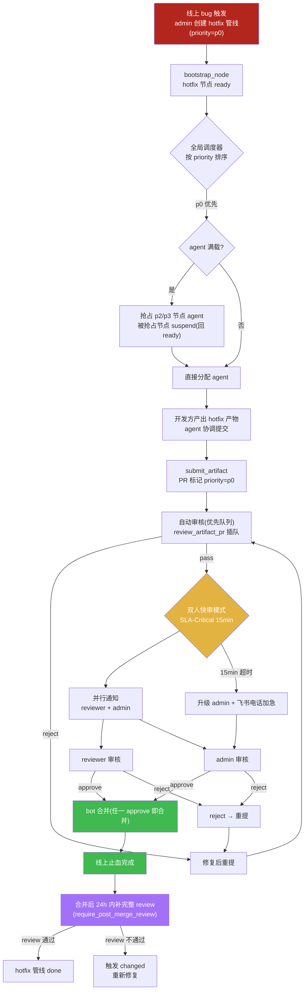
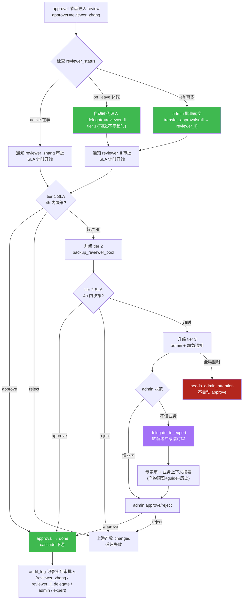
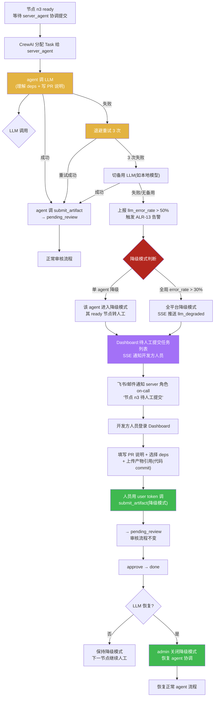
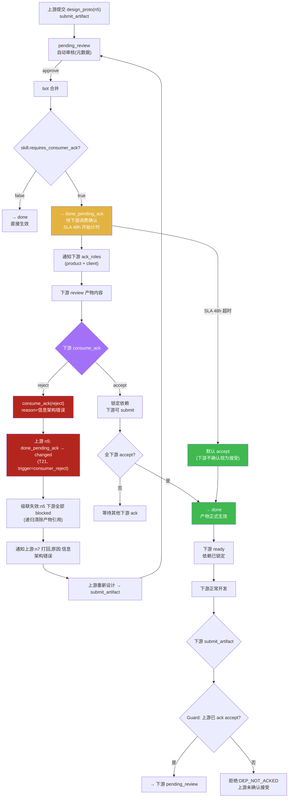

# PRD 压力测试:异常与人工介入场景走查与设计缺陷修正

> **文档性质**:对《coordination-platform-prd.md》v2.0 及其深化文档(fr2-orchestration.md / fr1-fr6-artifact-review.md / fr7-fr8-monitoring-visual.md)的真实开发场景压力测试报告
> **版本**:v1.0 | **日期**:2026-08-04 | **状态**:待评审
> **方法**:选取 4 个"异常流程 + 人工介入"的真实场景,逐步走查 PRD 当前设计能否处理,定位设计缺陷并提出修正方案
> **父文档**:[coordination-platform-prd.md](../coordination-platform-prd.md)
> **关联深化**:[fr2-orchestration.md](../deep-dive/fr2-orchestration.md) | [fr1-fr6-artifact-review.md](../deep-dive/fr1-fr6-artifact-review.md) | [fr7-fr8-monitoring-visual.md](../deep-dive/fr7-fr8-monitoring-visual.md)

---

## 0. 测试方法说明

本文不验证 HappyPath(TC-01 已覆盖),而是用 4 个"异常但高频"的真实场景压力测试 PRD 的**优先级模型、审批韧性、降级路径、产物消费闭环**:

| 场景 | 核心挑战 | 压测的 PRD 设计点 |
|---|---|---|
| 场景 3 | 紧急 hotfix 插队,需抢占资源 + 加速审核 | 管线优先级 + agent 资源调度 + 审核快速通道 |
| 场景 7 | 审批人休假/离职,approval 节点与 PR reviewer 双重缺席 | 升级链 + 代理人机制 + 批量转交 |
| 场景 11 | agent LLM 故障,"协调提交"本身失效,流程卡死 | 降级方案语义 + 人工 fallback + 卡死检测 |
| 场景 13 | 产物 done 后下游消费发现问题,需逆向打回 | consume_ack 机制 + 逆向 changed 流程 |

每个场景按 **场景描述 → PRD 走查 → 设计缺陷 → 修正方案 → 设计图** 组织,所有缺陷均可定位到 PRD 具体章节。

---

## 1. 场景 3:紧急 hotfix 插队

### 1.1 场景描述

**业务背景**:
- 管线 A(Feature A,登录功能优化)正在进行中:product_spec(n1)已 done,api_contract(n2)pending_review,server_impl(n3)in_progress,design_asset(n6)pending_review,client_ui(n7)blocked
- 线上 Feature B(支付功能)突发 bug:用户支付后偶发扣款成功但订单状态未更新
- 需要紧急修复:定位问题 → 修改 server_impl → 提交 hotfix

**资源约束**:
- 4 个角色 agent(server_agent / client_agent / design_agent / product_agent)全部在忙 Feature A
- server_agent 正在处理 n3(in_progress),max_concurrent=3 已满
- hotfix 管线 B 需要 server_agent 协调提交

**关键矛盾**:
1. hotfix 管线 B 与 Feature A 管线平等竞争 agent 资源,但 hotfix 紧急程度高 10 倍
2. hotfix 的 server_impl 产物要不要走 PR 审核?如果要,SLA-Human-3 最快 2 工作小时,线上 bug 等不了
3. 如果给 hotfix 开"跳过审核"通道,破坏"所有提交都审核"原则(FR1.2 分支保护)
4. server_agent 在忙 n3,hotfix 的 n_b2 怎么抢资源?

### 1.2 PRD 走查

**走查点 1:管线有无优先级概念**

PRD §2.1《核心概念与术语》定义 Pipeline 为"一个功能需求的全链路 DAG",§5.1 数据模型 `Pipeline` 结构含 `id / name / nodes / edges`,**无 priority 字段**。

fr2-orchestration.md §2.3《PipelineState 数据结构》扩展字段含 `node_states / artifact_refs / events / pending_approvals / role_assignments / pending_prs / node_versions / idempotency_seen / last_checkpoint_ts`,**无 priority 字段**。

→ **PRD 无管线/节点优先级概念,所有管线平等。**

**走查点 2:agent 资源调度有无抢占**

PRD §3.2 NFR6:"支持多 agent 并行提交不同节点产物"——仅声明并发能力,无调度策略。

fr7-fr8-monitoring-visual.md §8《容量规划》:"agent 并发任务配额:AgentRegistry `max_concurrent` 字段(默认 3),超限任务排队,ready 节点等待"——**超限后只能排队,无抢占**。

fr3-fr5-crew-skills.md(主 PRD §3.2 引用)的 `build_crew_for_ready_nodes` 按 `ready_nodes` 列表顺序创建 Task,**无优先级排序**:

```python
def build_crew_for_ready_nodes(ready_nodes: list, state: PipelineState) -> Crew:
    tasks = []
    for node_id in ready_nodes:  # ← 按 ready 顺序,无 priority 排序
        ...
```

→ **agent 调度无优先级,hotfix 节点与普通节点平等排队。**

**走查点 3:审核有无快速通道**

PRD §6.4《审核策略矩阵》按**产物类型**分级(product_spec 自动 / api_contract 首次人工 / design_asset 人工 / ...),**无按紧急程度分级**。

fr1-fr6-artifact-review.md §6.1《SLA 分级》:
- SLA-Auto:30 秒(自动审核)
- SLA-Human-1:8 工作小时(常规)
- SLA-Human-2:4 工作小时(关键)
- SLA-Human-3:2 工作小时(交付级)

**最快人工审核 2 工作小时**,线上 hotfix 通常要求分钟级。SLA 级别由 skill 的 `sla_level` 配置,**无 hotfix 专用 SLA**。

**走查点 4:能否跳过审核**

PRD §1.2 产品定位第 4 条:"审核准入门:所有产物提交经 PR 审核(skill 约束校验 + 依赖检查)才能合并生效"。

fr1-fr6-artifact-review.md §6.3.4:"关键原则:超时可升级、可告警,但不可自动 approve。审核的本质是准入,自动放行违背需求 7"。

→ **审核不可跳过,hotfix 必须走 PR 审核。**

**走查点 5:多管线并行有无跨管线协调**

PRD §5.1 数据模型每个 Pipeline 独立,fr2 §3.4 异节点并发模型:"多个 agent 同时调 submit_artifact 不同 node_id → 不同 advisory lock → 真并行"——这是**单管线内**的异节点并发,未涉及**跨管线**资源协调。

fr2 §6.1 `thread_id = pipeline_id`(一管线一 thread),管线的 state 隔离,**无全局资源视图**。

### 1.3 设计缺陷

| # | 缺陷 | PRD 位置 | 影响 |
|---|---|---|---|
| D3-1 | **管线/节点无优先级字段** | §5.1 Pipeline 结构 / fr2 §2.3 PipelineState | hotfix 管线与普通管线平等,无法区分紧急程度 |
| D3-2 | **agent 调度无优先级排序** | §3.2 build_crew_for_ready_nodes / fr7 §8 容量规划 | hotfix 节点 ready 后与普通节点一起排队,无法优先分配 agent |
| D3-3 | **无 agent 资源抢占机制** | fr7 §8 max_concurrent 超限排队 | agent 满载时 hotfix 只能等,无法抢占低优先级节点的 agent |
| D3-4 | **审核 SLA 无紧急通道** | fr1-fr6 §6.1 SLA 分级 | 最快 2 工作小时,hotfix 等不了;无"分钟级快审"通道 |
| D3-5 | **无跨管线资源视图** | fr2 §3.4 单管线并发 / §6.1 thread_id 隔离 | 多管线并行时无法全局调度 agent,hotfix 无法跨管线抢资源 |
| D3-6 | **hotfix 与正常 feature 审核策略无差异** | §6.4 审核策略矩阵仅按产物类型分 | hotfix 的 server_impl 与普通 server_impl 走相同审核,无紧急差异化 |

### 1.4 修正方案

**修正 1:PipelineState 新增 `priority` 字段**

```python
class PipelineState(TypedDict):
    # ... 原有字段 ...
    priority: str  # "p0" | "p1" | "p2" | "p3"(对齐告警级别 ALR)
    priority_reason: str  # 优先级理由(如 "线上 hotfix:支付扣款异常")
```

管线 DSL 新增 priority 字段,admin 可动态调整:
```yaml
pipeline:
  id: "pay-hotfix-001"
  priority: "p0"          # 新增
  priority_reason: "线上支付扣款异常,P0 紧急"
```

**修正 2:CrewAI 调度按优先级排序 + 资源抢占**

`dispatch_router_fn` 改造为跨管线全局调度(新增 GlobalDispatchState 聚合所有 active pipeline 的 ready 节点):

```python
def dispatch_router_fn_global(all_pipelines_state: list[PipelineState]) -> list[Send]:
    """跨管线全局调度:按 priority 排序 ready 节点"""
    all_ready = []
    for ps in all_pipelines_state:
        for nid, s in ps["node_states"].items():
            if s == NodeStatus.READY:
                all_ready.append((ps["priority"], ps["pipeline_id"], nid))
    # 按 priority 排序:p0 > p1 > p2 > p3
    priority_order = {"p0": 0, "p1": 1, "p2": 2, "p3": 3}
    all_ready.sort(key=lambda x: priority_order[x[0]])
    # 高优先级先分配 agent
    return [Send("crewai_assign", {"pipeline_id": pid, "target_node": nid})
            for _, pid, nid in all_ready]
```

**资源抢占机制**:当 p0 节点 ready 但 agent 满载时,可抢占 p2/p3 节点的 agent:
- 被抢占节点 suspend(状态回 ready,释放 agent)
-抢占节点立即获得 agent
- 被抢占节点记录 `PREEMPTED` event,待 p0 完成后恢复
- p0 节点不可被抢占(最高优先级)

**修正 3:hotfix 快速审核通道(不跳过审核,但加速)**

新增 `sla_level: SLA-Critical`,配置于 hotfix skill:
```yaml
sla:
  level: SLA-Critical
  timeout_minutes: 15            # 15 分钟 SLA(替代小时制)
  review_mode: dual_fast_review  # 双人快审模式
  escalate_to: admin
```

**双人快审模式(dual_fast_review)**:
- 自动审核优先处理(review_artifact_pr 优先队列,p0 PR 插队)
- 自动审核通过后,**并行**通知 1 个 reviewer + 1 个 admin,任一 approve 即合并(替代串行 SLA 升级)
- 15 分钟无决策 → 自动升级到 admin + 飞书电话加急

**关键:不跳过审核,保留"所有提交都审核"原则,但用并行快审 + 极短 SLA 把时间压到分钟级。**

**修正 4:hotfix skill 标记**

新增 `hotfix-server-impl-skill`(或现有 skill 增加 `hotfix_variant` 配置):
```yaml
# skill.yaml
hotfix_variant:
  enabled: true
  sla_level: SLA-Critical
  skip_gates: [lint]           # hotfix 可跳过 lint 门禁(保留 test/security)
  require_post_merge_review: true  # 合并后 24h 内补完整 review(hotfix 先合后审)
```

`require_post_merge_review`:hotfix 先合并止血,24h 内补完整 review,若 review 不通过则触发 changed 重新修复。这是"先上车后补票"模式,平衡紧急性与审核原则。

### 1.5 设计图:hotfix 快速通道流程



---

## 2. 场景 7:审批人不在(休假/离职)

### 2.1 场景描述

**业务背景**:
- 管线进行中,approval 节点 n10(approver = reviewer_zhang)处于 `review` 状态,等待张三审批
- 张三休假 3 天,无法操作
- 同时,产物 PR #42(reviewer = reviewer_zhang)也在 pending_review,等待张三审核
- 第 4 天张三回来,但发现其实张三已离职,不会再回来

**关键矛盾**:
1. PRD 的 SLA 升级是"超时后升级到 backup→admin",但要等 4h/8h 才触发,张三休假 3 天会触发多次超时升级,效率极低
2. backup_reviewer 怎么确定?PRD 没说怎么配置、谁来当 backup
3. 张三离职,他名下所有 approval 节点和 PR 怎么办?要逐个等超时?还是能批量转交?
4. 升级到 admin 后,admin 不懂设计稿审批细节,approve 质量怎么保证?
5. 真实组织是"代理人制度"(事先指定),不是"超时升级"(事后兜底)

### 2.2 PRD 走查

**走查点 1:approval 节点的 approver 配置**

PRD §5.1 Pipeline 数据结构:
```yaml
- id: "n10"
  type: "approval"
  approver: "reviewer_agent"   # 单一 approver
```

fr2-orchestration.md §7.4 控制节点配置校验:"approval 节点 `approver` 必填,非空字符串"——**单一 approver,无 delegate 字段**。

fr2 §8.2 approval 边界条件:"approver 离线:不影响 approval 节点状态,超时机制兜底;admin 可重新指定 approver"——**离线靠超时兜底,admin 手动改 approver,无自动代理人**。

**走查点 2:SLA 升级链**

fr1-fr6-artifact-review.md §6.3.1 升级链配置:
```yaml
escalation:
  - tier: 1
    approver: reviewer_agent
    sla_hours: 4
  - tier: 2
    approver: backup_reviewer   # ← backup 怎么来?
    sla_hours: 4
  - tier: 3
    approver: admin
    sla_hours: 2
```

§6.3.2 升级触发:"定时任务(每 5 分钟扫描)检查 pending 人工审核,elapsed > tier.sla_hours 则升级"——**被动超时升级,无主动委托**。

**走查点 3:backup_reviewer 的确定方式**

PRD 全文搜索 "backup_reviewer":仅出现在 escalation 配置示例中,**未定义 backup_reviewer 的来源、配置方式、维护机制**。是 admin 手动配?是角色池自动选?PRD 空白。

**走查点 4:批量转交机制**

fr2 §7.5 热重载:"修改 approval approver:admin 手动,仅对未 approve 的 approval 生效"——**逐个手动改,无批量转交工具**。

MCP 工具清单(§6)无 `transfer_approvals` 工具,reviewer 离职后 admin 只能逐个节点改 approver。

**走查点 5:admin 不懂业务细节**

fr1-fr6 §6.3.4 全局超时兜底:"admin 手动处理(approve/reject/驳回重做)"——**未解决 admin 不懂业务的问题**。

PRD §3.1 角色定义:admin 职责是"管理员",可产出的节点类型为"—"(不产出),可用工具为"全部工具"。admin 是平台管理员,不是业务专家(如设计稿审批需 UI 专业知识)。

**走查点 6:PR reviewer 与 approval approver 是两套人**

PRD §3.1 reviewer 角色:可用工具 `approve_pr, reject_pr, get_audit_log`——审核**产物 PR**。
PRD §5.1 approval 控制节点:approver 配置——审核**审批门**。

两者是独立的审核机制,场景中张三是 reviewer(审 PR)又是 approver(审 approval 节点),两套都缺席,PRD 没有统一覆盖。

### 2.3 设计缺陷

| # | 缺陷 | PRD 位置 | 影响 |
|---|---|---|---|
| D7-1 | **无代理人(delegate)机制** | §5.1 approver 单一 / fr2 §7.4 无 delegate 字段 | reviewer 休假无法主动委托,只能等超时升级 |
| D7-2 | **backup_reviewer 来源未定义** | fr1-fr6 §6.3.1 escalation 配 backup_reviewer 但无来源 | backup 是空配置,实施时不知道填谁 |
| D7-3 | **无批量转交工具** | §6 MCP 工具清单 / fr2 §7.5 逐个手动改 | reviewer 离职后名下 N 个 approval 要逐个改,效率极低 |
| D7-4 | **超时升级是被动机制,不符合真实组织** | fr1-fr6 §6.3.2 定时扫描超时升级 | 真实组织是"事先指定代理人",PRD 是"事后超时兜底",3 天休假要触发多次 4h 超时 |
| D7-5 | **升级到 admin 后业务质量无保障** | fr1-fr6 §6.3.4 admin 手动处理 | admin 不懂设计稿/UI 业务,approve 质量存疑 |
| D7-6 | **PR reviewer 与 approval approver 缺席未统一覆盖** | §3.1 reviewer 审 PR / §5.1 approver 审 approval | 两套审核机制独立,reviewer 缺席时两套都卡,PRD 无统一代理人覆盖 |
| D7-7 | **reviewer 无"休假/在职"状态** | fr7 ALR-03 agent 心跳 / 无 reviewer 状态 | approver 离线靠 approval 超时(4h)才发现,无主动"休假设置" |

### 2.4 修正方案

**修正 1:approval 节点新增 `delegate` 字段(代理人)**

```yaml
- id: "n10"
  type: "approval"
  approver: "reviewer_zhang"
  delegate: "reviewer_li"        # 新增:代理人,approver 缺席时自动转
  delegate_active_when: "approver_offline"  # 触发条件
```

`delegate` 与 approver 有同等 approve 权限,但 audit_log 记录实际审批人身份(delegate_reviewer_li)。

**修正 2:reviewer 休假/在职状态管理**

新增 `reviewer_status` 表 + Dashboard 入口:
```sql
CREATE TABLE reviewer_status (
    reviewer_id TEXT PRIMARY KEY,
    status TEXT NOT NULL,           -- active | on_leave | left
    delegate_id TEXT,               -- 代理人(reviewer_id)
    leave_start TIMESTAMPTZ,
    leave_end TIMESTAMPTZ,
    updated_at TIMESTAMPTZ DEFAULT now()
);
```

reviewer 可在 Dashboard 设置休假时段,系统自动在该时段将 approval/PR 转给 delegate。

**修正 3:升级链补充代理人优先级**

```yaml
escalation:
  - tier: 1
    approver: reviewer_zhang
    sla_hours: 4
  - tier: 1'                      # 新增:代理人(同级,非超时升级)
    approver: reviewer_li         # 来自 delegate / reviewer_status
    trigger: approver_offline     # 主动触发,不等超时
    sla_hours: 4
  - tier: 2
    approver: backup_reviewer_pool  # 角色池(同 role 的其他 reviewer)
    sla_hours: 4
  - tier: 3
    approver: admin
    sla_hours: 2
    fallback_expert: true         # 新增:admin 可转专家审
```

**升级优先级**:代理人(tier 1') > 超时升级(tier 2/3)。代理人在线时直接转,不等 SLA 超时。

**修正 4:批量转交 MCP 工具**

新增 `transfer_approvals` 工具:
```json
{
  "name": "transfer_approvals",
  "description": "批量转交 reviewer 名下所有 pending approval/PR",
  "inputSchema": {
    "type": "object",
    "properties": {
      "from_reviewer": {"type": "string"},
      "to_reviewer": {"type": "string"},
      "scope": {"type": "string", "enum": ["all", "by_pipeline", "by_node"]},
      "pipeline_id": {"type": "string", "description": "scope=by_pipeline 时填"},
      "node_ids": {"type": "array", "items": {"type": "string"}, "description": "scope=by_node 时填"}
    },
    "required": ["from_reviewer", "to_reviewer", "scope"]
  }
}
```

张三离职,admin 一键转交:`transfer_approvals(from=reviewer_zhang, to=reviewer_li, scope=all)`。

**修正 5:admin "转专家审"机制**

升级到 admin 后,admin 可指定领域专家临时 reviewer:
```json
{
  "name": "delegate_to_expert",
  "description": "admin 将 approval 转给领域专家临时审核",
  "inputSchema": {
    "properties": {
      "node_id": {"type": "string"},
      "expert_id": {"type": "string", "description": "专家用户 ID"},
      "expertise": {"type": "string", "description": "如 UI/design/server"}
    }
  }
}
```

系统附带"业务上下文摘要"辅助决策:上游产物预览 + skill guide + 历史 review 记录 + 相似节点的历史审批结论。

**修正 6:PR reviewer 与 approval approver 统一代理人**

`reviewer_status.delegate_id` 同时覆盖 PR 审核(approve_pr)和 approval 节点(approve),确保 reviewer 缺席时两套机制都有代理人。

### 2.5 设计图:审批代理人机制



---

## 3. 场景 11:agent LLM 失败导致流程卡死

### 3.1 场景描述

**业务背景**:
- 管线正常推进,n2(api_contract)已 done,n3(server_impl)处于 ready,等待 server_agent 协调提交
- LLM 服务商(如 OpenAI / 自部署模型)突发故障,所有 LLM 调用返回 500 或超时
- server_agent 在线(心跳正常),但调 LLM 失败,无法理解 n2 的 deps 内容,无法写 PR 说明,无法调 MCP submit_artifact
- 开发方人员已产出 server_impl 产物(代码已提交到代码仓库),等 agent 协调提交到管理方
- 人工不知道流程卡住了(Dashboard 显示 n3 ready,看似正常)

**关键矛盾**:
1. PRD 说降级方案是"规则引擎直提(绕过 LLM)",但"规则引擎直提"是什么意思?谁来调 MCP?
2. agent 是"协调提交员",LLM 挂了,开发方人员能不能直接调 MCP submit_artifact 绕过 agent?
3. agent 在线(心跳正常)但 LLM 失败,ALR-03(agent 离线告警)不会触发,卡死无人知
4. ALR-04(管线停滞 30min)太粗,n3 卡住但其他节点在动,管线不算停滞

### 3.2 PRD 走查

**走查点 1:"规则引擎直提"的定义**

主 PRD 附录 B 引用 fr3-fr5-crew-skills.md 提到"失败重试降级:规则引擎直提(绕过 LLM)",但主 PRD 本身未定义。fr3-fr5-crew-skills.md(本次未读,但主 PRD 附录 B 摘要)说"CrewAI agent LLM 配置 + cost 控制、失败重试降级"。

问题:agent 的职责是"理解 deps 内容、写 PR 说明、调 MCP submit_artifact"(§3.1)。"规则引擎直提"意味着绕过 LLM,但:
- 谁来调 MCP submit_artifact?规则引擎本身不能调 MCP(规则引擎是审核用的,§4.4)
- 谁来写 PR 说明?PR 模板(§1.3)有"说明: 用户登录接口契约 v1"自由文本,LLM 挂了谁来写?
- 谁来填 deps_decl?agent 需要读 deps 内容理解上下文,规则引擎不能理解

→ **"规则引擎直提"语义模糊,无法落地。规则引擎是审核组件,不能替代 agent 协调。**

**走查点 2:开发方人员能否直接调 MCP**

PRD §3.2 权限矩阵:`submit_artifact` 调用方是"各角色 agent"(product/server/design/client),**人员(人类用户)不在调用方列表**。

§4.1 MCP 工具清单:`submit_artifact` 调用方="各角色 agent"。

fr7-fr8 §10.1 MCP 认证:JWT token 含 `role` / `agent_id` claim——**token 绑定 agent_id,人员无独立 token**。

→ **开发方人员无法直接调 MCP submit_artifact,必须经 agent。LLM 挂了 = 流程卡死。**

**走查点 3:agent LLM 失败的告警覆盖**

fr7-fr8 §2.1 告警规则:
- ALR-03:agent 离线(心跳 > 90s 未上报)——**agent 进程级,LLM 失败时 agent 心跳正常,不触发**
- ALR-04:管线停滞(无状态变更 > 30min)——**管线级,n3 卡住但其他节点在动则不触发**
- ALR-07:MCP 错误率飙升(5min 窗口 > 10%)——**MCP 调用级,但 LLM 失败时 agent 不调 MCP,无 MCP 错误**

→ **无"agent 在线但 LLM 调用失败"的专用告警,卡死无人知。**

**走查点 4:节点级卡死检测**

fr2 §8.2 approval 超时有节点级检测(节点进 review 后 SLA 超时)。但产物节点 ready 后"无进展"的检测:
- ALR-04 管线级停滞 30min,非节点级
- 无"节点 ready 后 N 小时无 update_progress 或 submit_artifact"的告警

→ **节点级卡死检测缺失。**

**走查点 5:CrewAI 分配失败 ≠ LLM 失败**

fr2 §5.1 错误分类:"CrewAI 分配失败:agent 离线,重新选 agent → 退避重试 → 标记 NO_AGENT"——这是 **agent 进程离线**的处理。

LLM 失败是 **agent 在线但内部调 LLM 失败**,两者不同:
- agent 离线:CrewAI 分配失败,可重新选 agent
- LLM 失败:agent 在线,CrewAI 分配成功,但 agent 执行 Task 时调 LLM 失败,Task 卡住

PRD 未区分这两种失败,错误处理矩阵无"LLM 调用失败"类别。

### 3.3 设计缺陷

| # | 缺陷 | PRD 位置 | 影响 |
|---|---|---|---|
| D11-1 | **"规则引擎直提"语义模糊,无法落地** | 附录 B 引用 fr3-fr5 | 规则引擎是审核组件,不能调 MCP / 写 PR 说明 / 填 deps_decl,无法替代 agent |
| D11-2 | **开发方人员无法直接调 MCP** | §3.2 权限矩阵 / §4.1 调用方=agent / fr7 §10.1 token 绑 agent_id | LLM 挂了 = 流程卡死,无人工绕过路径 |
| D11-3 | **无"agent 在线但 LLM 失败"专用告警** | fr7 §2.1 ALR-03 仅 agent 离线 | LLM 失败时 agent 心跳正常,ALR-03 不触发,卡死无人知 |
| D11-4 | **节点级卡死检测缺失** | fr7 ALR-04 管线级 30min | 单节点卡住但管线在动则不告警 |
| D11-5 | **LLM 失败与 agent 离线未区分** | fr2 §5.1 错误分类 | LLM 失败按 agent 离线处理(重新选 agent)无效,根因不同 |
| D11-6 | **无人工 fallback 模式** | 全文无 | LLM 不可用时无降级到"人工通过 Dashboard 提交"的机制 |

### 3.4 修正方案

**修正 1:明确"人工 fallback 模式"替代"规则引擎直提"**

废弃"规则引擎直提"表述,改为**人工 fallback 模式**:LLM 不可用时,开发方人员通过 Dashboard 直接提交产物,绕过 agent 协调。

**修正 2:权限矩阵扩展——人员可调 submit_artifact(降级模式)**

§3.2 权限矩阵新增"开发方人员(降级模式)"列:

| 操作 | product 人员 | server 人员 | design 人员 | client 人员 | 触发条件 |
|---|---|---|---|---|---|
| submit_artifact(降级) | ✅(product_spec) | ✅(server 类) | ✅(design 类) | ✅(client 类) | LLM 降级模式开启 |

MCP JWT token 新增 `user_id` claim(人员身份),降级模式下人员用 user token 调 MCP,audit_log 记录 `submitter=user:zhangsan`(而非 agent_id)。

**修正 3:LLM 降级模式触发与切换**

新增 `llm_health` 监控 + 降级开关:

```python
# LLM 健康度监控(嵌入 agent 心跳上报)
class AgentHeartbeat(TypedDict):
    agent_id: str
    ts: str
    llm_error_rate: float       # 新增:5min 窗口 LLM 调用失败率
    llm_avg_latency_ms: float   # 新增:LLM 调用平均延迟
    pending_tasks: int
```

降级触发规则:
- agent 心跳 `llm_error_rate > 50%`(5min 窗口)→ 该 agent 进入降级模式
- 全局 LLM 错误率 > 30% → 全平台降级模式
- 降级模式开启 → SSE 推送 `llm_degraded` 事件 → Dashboard banner 提示

降级模式行为:
- ready 节点不分配 agent,改为 Dashboard "待人工提交"任务列表
- 开发方人员收到飞书/邮件通知"节点 n3 待人工提交"
- 人员在 Dashboard 填写 PR 说明 + 选择 deps + 上传产物引用 → 调 MCP submit_artifact
- LLM 恢复后,admin 手动关闭降级模式,恢复 agent 协调

**修正 4:LLM 失败专用告警(ALR-13)**

fr7 §2.1 告警规则新增:

| 编号 | 事件 | 触发条件 | 级别 | 渠道 |
|---|---|---|---|---|
| ALR-13 | agent LLM 失败率飙升 | agent 心跳 `llm_error_rate > 50%`(5min 窗口) | P1 | 飞书群 + Dashboard banner |
| ALR-14 | 节点卡死 | 产物节点 ready 后 > 2h 无 update_progress/submit_artifact | P1 | 飞书 @对应 role on-call |

ALR-14 是节点级卡死检测,补充 ALR-04(管线级)的盲区:
```python
# 节点级卡死检测定时任务
for nid, s in state["node_states"].items():
    if s == NodeStatus.READY:
        ready_since = get_ready_ts(nid)
        if now - ready_since > 2 * 3600:  # 2h
            emit_alert(ALR_14, node_id=nid, role=node["role"])
```

**修正 5:错误分类区分 LLM 失败**

fr2 §5.1 错误分类矩阵新增:

| 错误类别 | 典型错误 | 影响范围 | 处理策略 | 重试上限 |
|---|---|---|---|---|
| **LLM 调用失败** | OpenAI 500 / 模型超时 / 配额耗尽 | agent Task 卡住 | 退避重试 → 切备用 LLM → 进入降级模式 | 3 次 |

### 3.5 设计图:LLM 失败人工 fallback 流程



---

## 4. 场景 13:产物消费者反馈(设计稿评审打回)

### 4.1 场景描述

**业务背景**:
- 管线推进中,design_proto(n5)已提交,requires_human_review=false(FR6.4 设计原型主观性强不强审),自动审核通过 → done
- 产品方(product 角色)和客户端方(client 角色)在 downstream 开发时 review 设计稿,认为信息架构错误(导航层级混乱,核心入口埋得太深)
- 客户端方基于这个设计稿做的 client_ui 会有问题,需要设计稿重新设计

**关键矛盾**:
1. PRD 审核只发生在"产物提交时"(submit→review→approve/reject),产物 done 后无审核入口
2. design_proto 自动审核通过(元数据合规),但"是否符合需求"不在自动审核范围(§1.4 不校验内容)
3. changed 状态是"上游主动重提"(T10),下游不能替上游触发 changed
4. 下游发现问题只能飞书通知上游"改一下",上游手动重提 PR——纯人工,失去平台价值
5. 产物 done 不代表"被下游接受",缺少"消费确认"环节

### 4.2 PRD 走查

**走查点 1:审核只发生在提交时**

PRD §6.1 审核流程:"PR 提交 → webhook 通知管理方 → 解析 → 校验 → 决策(approve/reject)"——**审核入口仅 PR 提交**。

fr1-fr6 §9.1 审核决策树:从 PR 提交开始,到合并/驳回结束——**无"产物 done 后的反馈"路径**。

**走查点 2:changed 状态的触发权**

fr2 §2.1 状态转移表:
- T10:`done → changed`,触发事件=`submit_artifact 重提已 done 节点的 PR`,触发者是**上游(产物所有者)**
- T15:`review → changed`(approval reject),触发者是**审批人**

下游(消费者)无触发 changed 的路径。下游发现问题,只能通知上游,由上游主动 submit_artifact 重提。

**走查点 3:级联失效是单向的**

fr2 §2.2 DAG 规则:"级联失效:节点 changed → 所有下游产物引用清除 + 置 blocked(递归)"——**上游 changed → 下游 blocked,单向**。

无"下游打回 → 上游 changed"的逆向流程。

**走查点 4:产物 done 后下游无确认环节**

PRD §2.1 状态机:`done` 是终态(产物已合并生效),无"消费确认"中间态。

fr2 §2.1 T7:`pending_review → done`,合并即 done,无"待消费确认"环节。

§2.2 DAG 规则:"节点 done → 检查所有下游,依赖全满足的下游置 ready"——**done 即解锁下游,无下游确认步骤**。

**走查点 5:design_proto 的审核策略**

PRD §6.4 审核策略矩阵:`design_proto | 自动校验 ✅ | 人工审核 ❌ | 设计原型,主观性强不强审`——**自动审核仅校验元数据,不校验内容是否符合需求**。

§1.4 范围边界:"不校验产物内容格式(YAML/JSON/Figma 均可)" + "管理方不解析内容"——**内容是否符合需求,不在管理方审核范围**。

但真实场景中,设计稿"是否符合需求"需要下游(产品方/客户端方)人工判断,PRD 无此环节。

**走查点 6:下游依赖锁定机制**

fr1-fr6 §5.3.3 依赖失效:PR pending_review 期间依赖变 changed → PR reject。但这是**审核期间**的依赖失效保护,不是**产物 done 后**的消费确认。

产物 done 后,下游直接基于该产物开发,无"先确认接受再锁定依赖"的机制。

### 4.3 设计缺陷

| # | 缺陷 | PRD 位置 | 影响 |
|---|---|---|---|
| D13-1 | **审核仅发生在提交时,无 done 后反馈机制** | §6.1 / fr1-fr6 §9.1 | 产物 done 后下游发现问题,无平台内打回路径 |
| D13-2 | **changed 仅上游主动触发,下游无触发权** | fr2 §2.1 T10 / §2.2 级联单向 | 下游不能打回上游,只能人工通知 |
| D13-3 | **无 consume_ack 消费确认机制** | §2.1 状态机 / §2.2 DAG | 产物 done 即解锁下游,无"下游确认接受"环节 |
| D13-4 | **自动审核不校验内容符合度,且无下游验收补充** | §6.4 / §1.4 不校验内容 | design_proto 自动通过但不符合需求,下游被动接受 |
| D13-5 | **产物 done 即终态,缺"待消费确认"中间态** | fr2 §2.1 done 是终态 | done 不等于"被下游接受",但状态机无区分 |
| D13-6 | **下游反馈纯靠人工(飞书/Slack)** | 无平台内逆向流程 | 失去平台价值,打回靠口头通知,无追溯 |

### 4.4 修正方案

**修正 1:新增 `consume_ack` 消费确认机制**

产物 done 后,下游节点在 ready 或 in_progress 阶段,可对上游产物做"接受/打回"操作:

新增 MCP 工具:
```json
{
  "name": "consume_ack",
  "description": "下游确认接受/打回上游产物",
  "inputSchema": {
    "type": "object",
    "properties": {
      "node_id": {"type": "string", "description": "下游节点 ID(调用方)"},
      "dep_node_id": {"type": "string", "description": "上游产物节点 ID(被确认的)"},
      "verdict": {"type": "string", "enum": ["accept", "reject"]},
      "reason": {"type": "string", "description": "reject 时必填,结构化理由"}
    },
    "required": ["node_id", "dep_node_id", "verdict"]
  }
}
```

- `verdict=accept`:锁定依赖,下游正常推进,上游产物进入"已消费确认"态
- `verdict=reject`:触发上游节点 changed(下游触发的 changed),级联失效该上游的其他下游

**修正 2:状态机新增"待消费确认"中间态**

fr2 §2.1 状态机新增 `done_pending_ack` 态(扩展 7 态为 8 态):

| 状态 | 含义 | 进入条件 | 退出条件 |
|---|---|---|---|
| `done_pending_ack` | 产物已合并,待下游消费确认 | approve_pr 合并 + skill.requires_consumer_ack=true | 全下游 ack accept / ack SLA 超时默认 accept / 任一下游 ack reject |

状态转移新增:
- T19:`pending_review → done_pending_ack`(requires_consumer_ack=true 时,合并后进待确认)
- T20:`done_pending_ack → done`(全下游 ack accept 或 SLA 超时默认 accept)
- T21:`done_pending_ack → changed`(下游 consume_ack reject 触发,逆向打回)
- T22:`done → changed`(下游 consume_ack reject 触发,已 done 但未过 ack SLA 的产物)

**T21/T22 与 T10 的区别**:T10 是上游主动重提,T21/T22 是下游 reject 触发,audit_log 记录 `trigger=consumer_reject`。

**修正 3:skill 新增 `requires_consumer_ack` 配置**

```yaml
# skill.yaml
consumer_ack:
  requires_consumer_ack: true       # 是否需下游消费确认
  ack_sla_hours: 48                 # 确认 SLA:48h 内下游未 ack 视为默认 accept
  ack_roles: [product, client]      # 哪些下游角色需确认(design_proto 需产品+客户端确认)
  reject_triggers_changed: true     # reject 是否触发上游 changed
```

按产物类型分级(补充 §6.4 审核策略矩阵):

| 产物类型 | requires_consumer_ack | ack_roles | 理由 |
|---|---|---|---|
| product_spec | true | [server, design, client] | 需求文档需下游认可 |
| api_contract | true | [client, server_impl] | 契约需消费方确认 |
| design_proto | true | [product, client] | 设计稿需产品+客户端验收(本场景核心) |
| design_asset | true | [client] | 标注/切图需客户端确认 |
| server_impl | false | — | 代码引用,由代码仓库 review |
| client_ui | false | — | 代码引用,由代码仓库 review |
| client_delivery | true | [product] | 交付物需产品验收 |

**修正 4:逆向 changed 流程(下游打回上游)**

`consume_ack(reject)` 触发的 changed 与上游主动 changed 的级联行为一致(§2.2 级联失效),但触发链路不同:

```
下游 consume_ack(node_id=n7, dep_node_id=n5, verdict=reject, reason="信息架构错误")
  → n5 状态 done → changed(T21,trigger=consumer_reject)
  → n5 下游全部 blocked(递归失效,包括 n7 自身)
  → n5 上游通知"下游 n7 打回,原因:信息架构错误"
  → n5 上游重新 submit_artifact → pending_review → 审核合并 → done_pending_ack
  → 下游重新 ready → 重新 consume_ack
```

**修正 5:consume_ack SLA 与默认接受**

为避免下游无限期不 ack 导致流程卡死,设 SLA(默认 48h):
- 产物进入 `done_pending_ack` 后,SLA 计时开始
- SLA 内全下游 ack accept → done
- SLA 内任一下游 ack reject → changed(逆向打回)
- SLA 超时未 ack → 默认 accept(锁定依赖,下游不能再打回)

SLA 超时默认 accept 是保守策略:下游不主动确认视为接受,避免流程停滞。但若下游后续发现问题,仍可通过"人工 notify + 上游主动 changed"路径处理(T10)。

**修正 6:consume_ack 与依赖锁定的关系**

产物 done_pending_ack 期间,下游可正常开始开发(基于该产物),但**依赖未锁定**:
- 下游 in_progress 时,若上游被 ack reject → 下游 blocked(产物引用清除)
- 下游 in_progress 时,若上游 ack accept → 依赖锁定,下游继续
- 下游 submit_artifact 时,Guard 检查上游是否已 ack accept,未 accept 则拒绝提交(`DEP_NOT_ACKED` 错误)

### 4.5 设计图:产物消费确认机制



---

## 5. 缺陷汇总表

### 5.1 缺陷全量清单

| 场景 | 缺陷 ID | 缺陷描述 | PRD 位置 | 严重度 | 修正方案 |
|---|---|---|---|---|---|
| 场景 3 | D3-1 | 管线/节点无优先级字段 | §5.1 / fr2 §2.3 | 高 | PipelineState 新增 priority 字段 |
| 场景 3 | D3-2 | agent 调度无优先级排序 | §3.2 / fr7 §8 | 高 | dispatch_router 按 priority 排序 |
| 场景 3 | D3-3 | 无 agent 资源抢占机制 | fr7 §8 | 高 | p0 可抢占 p2/p3 的 agent |
| 场景 3 | D3-4 | 审核 SLA 无紧急通道 | fr1-fr6 §6.1 | 高 | 新增 SLA-Critical + 双人快审 |
| 场景 3 | D3-5 | 无跨管线资源视图 | fr2 §3.4 / §6.1 | 中 | GlobalDispatchState 聚合多管线 |
| 场景 3 | D3-6 | hotfix 与正常审核无差异 | §6.4 | 中 | hotfix skill + 合并后补审 |
| 场景 7 | D7-1 | 无代理人(delegate)机制 | §5.1 / fr2 §7.4 | 高 | approval 新增 delegate 字段 |
| 场景 7 | D7-2 | backup_reviewer 来源未定义 | fr1-fr6 §6.3.1 | 高 | reviewer_status 表 + 角色池 |
| 场景 7 | D7-3 | 无批量转交工具 | §6 / fr2 §7.5 | 高 | transfer_approvals MCP 工具 |
| 场景 7 | D7-4 | 超时升级是被动,不符真实组织 | fr1-fr6 §6.3.2 | 高 | 代理人优先于超时升级 |
| 场景 7 | D7-5 | 升级到 admin 业务质量无保障 | fr1-fr6 §6.3.4 | 中 | delegate_to_expert + 上下文摘要 |
| 场景 7 | D7-6 | PR reviewer 与 approval approver 未统一覆盖 | §3.1 / §5.1 | 中 | reviewer_status.delegate 统一覆盖 |
| 场景 7 | D7-7 | reviewer 无休假/在职状态 | fr7 ALR-03 | 中 | reviewer_status 表 + Dashboard 入口 |
| 场景 11 | D11-1 | "规则引擎直提"语义模糊 | 附录 B / fr3-fr5 | 高 | 改为人工 fallback 模式 |
| 场景 11 | D11-2 | 开发方人员无法直接调 MCP | §3.2 / §4.1 / fr7 §10.1 | 高 | 降级模式下人员可调 submit_artifact |
| 场景 11 | D11-3 | 无"agent 在线但 LLM 失败"告警 | fr7 §2.1 ALR-03 | 高 | 新增 ALR-13(LLM 失败率) |
| 场景 11 | D11-4 | 节点级卡死检测缺失 | fr7 ALR-04 | 高 | 新增 ALR-14(节点 ready 后 2h 无进展) |
| 场景 11 | D11-5 | LLM 失败与 agent 离线未区分 | fr2 §5.1 | 中 | 错误分类新增 LLM 失败类别 |
| 场景 11 | D11-6 | 无人工 fallback 模式 | 全文 | 高 | 降级模式 + Dashboard 人工提交 |
| 场景 13 | D13-1 | 审核仅提交时,无 done 后反馈 | §6.1 / fr1-fr6 §9.1 | 高 | consume_ack 机制 |
| 场景 13 | D13-2 | changed 仅上游触发,下游无权 | fr2 §2.1 T10 / §2.2 | 高 | T21/T22 下游 reject 触发 changed |
| 场景 13 | D13-3 | 无 consume_ack 消费确认 | §2.1 / §2.2 | 高 | 新增 consume_ack MCP 工具 |
| 场景 13 | D13-4 | 自动审核不校验内容,无下游验收 | §6.4 / §1.4 | 中 | requires_consumer_ack + 下游 ack |
| 场景 13 | D13-5 | done 即终态,缺待确认中间态 | fr2 §2.1 | 中 | 新增 done_pending_ack 态 |
| 场景 13 | D13-6 | 下游反馈纯靠人工 | 无 | 高 | 平台内逆向打回流程 + 追溯 |

### 5.2 缺陷按严重度统计

| 严重度 | 数量 | 典型缺陷 |
|---|---|---|
| 高 | 17 | D3-1/2/3/4、D7-1/2/3/4、D11-1/2/3/4/6、D13-1/2/3/6 |
| 中 | 9 | D3-5/6、D7-5/6/7、D11-5、D13-4/5 |

### 5.3 修正方案按实施阶段分布

| 阶段 | 修正项 | 优先级 |
|---|---|---|
| Phase 1 MVP | D3-1 priority 字段 + D11-2 人员降级提交 + D11-4 节点卡死告警 + D13-3 consume_ack 基础 | P0 |
| Phase 2 生产化 | D3-2/3/4 优先级调度+抢占+快审 + D7-1/2/3/4 代理人+转交 + D11-1/3/6 人工 fallback + D13-1/2/5 逆向打回 | P1 |
| Phase 3 规模化 | D3-5/6 跨管线协调 + D7-5/6/7 专家审+统一覆盖 + D11-5 LLM 错误分类 + D13-4/5 消费确认分级 | P2 |

### 5.4 对 PRD 主文档的修正建议

| PRD 位置 | 现状 | 修正 |
|---|---|---|
| §2.1 状态机 7 态 | 7 态 | 扩展为 8 态,新增 `done_pending_ack` |
| §2.2 DAG 规则 | 级联单向(上游→下游) | 补充逆向级联(下游 ack reject → 上游 changed) |
| §3.2 权限矩阵 | 仅 agent 可调 submit_artifact | 新增"人员(降级模式)"列 |
| §5.1 Pipeline 数据结构 | 无 priority | 新增 priority + priority_reason |
| §6.1 审核流程 | 仅 submit 时审核 | 补充 consume_ack 反馈环节 |
| §6.4 审核策略矩阵 | 按产物类型分 | 补充 requires_consumer_ack 列 + hotfix 快速通道 |
| §6 MCP 工具 | 14 个 | 新增 consume_ack / transfer_approvals / delegate_to_expert(共 17 个) |
| fr1-fr6 §6.1 SLA | 4 级(最快 2h) | 新增 SLA-Critical(15min,双人快审) |
| fr1-fr6 §6.3 升级链 | 超时升级 | 补充代理人(tier 1')优先于超时升级 |
| fr2 §2.1 状态转移 | T1-T18 | 新增 T19-T22(done_pending_ack 相关) |
| fr2 §5.1 错误分类 | 无 LLM 失败 | 新增"LLM 调用失败"类别 |
| fr7 §2.1 告警规则 | ALR-01~12 | 新增 ALR-13(LLM 失败)+ ALR-14(节点卡死) |
| fr7 §8 容量规划 | max_concurrent 排队 | 补充优先级抢占语义 |

---

## 附录:Mermaid 设计图索引

| 图名 | 位置 | 说明 |
|---|---|---|
| hotfix 快速通道流程 | §1.5 | bug 触发 → 优先级调度 → 资源抢占 → 双人快审 → 合并止血 → 补审 |
| 审批代理人机制 | §2.5 | reviewer 状态检查 → 代理人转交 → 升级链 → 专家审 → 全局兜底 |
| LLM 失败人工 fallback 流程 | §3.5 | LLM 调用 → 重试 → 降级模式 → Dashboard 人工提交 → 恢复 |
| 产物消费确认机制 | §4.5 | 合并 → done_pending_ack → 下游 ack → accept/reject → 逆向 changed |

---

**本文档共发现 26 项设计缺陷(17 高 / 9 中),提出 24 项修正方案,涵盖优先级模型、审批韧性、降级路径、产物消费闭环四大主题。所有缺陷均可定位到 PRD 具体章节,修正方案均给出可落地的字段/工具/状态扩展。建议按 Phase 1/2/3 分阶段实施,P0 项优先落地。**
