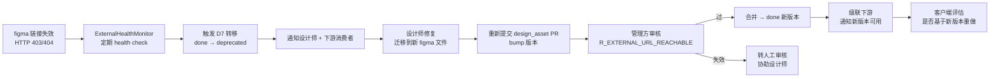
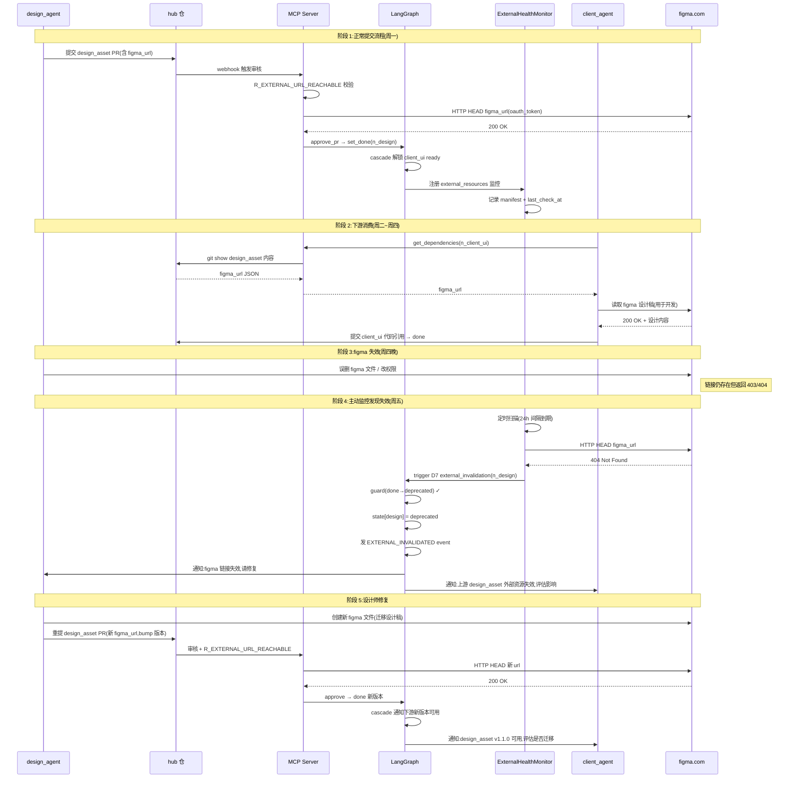
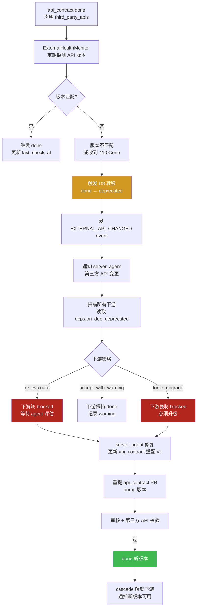
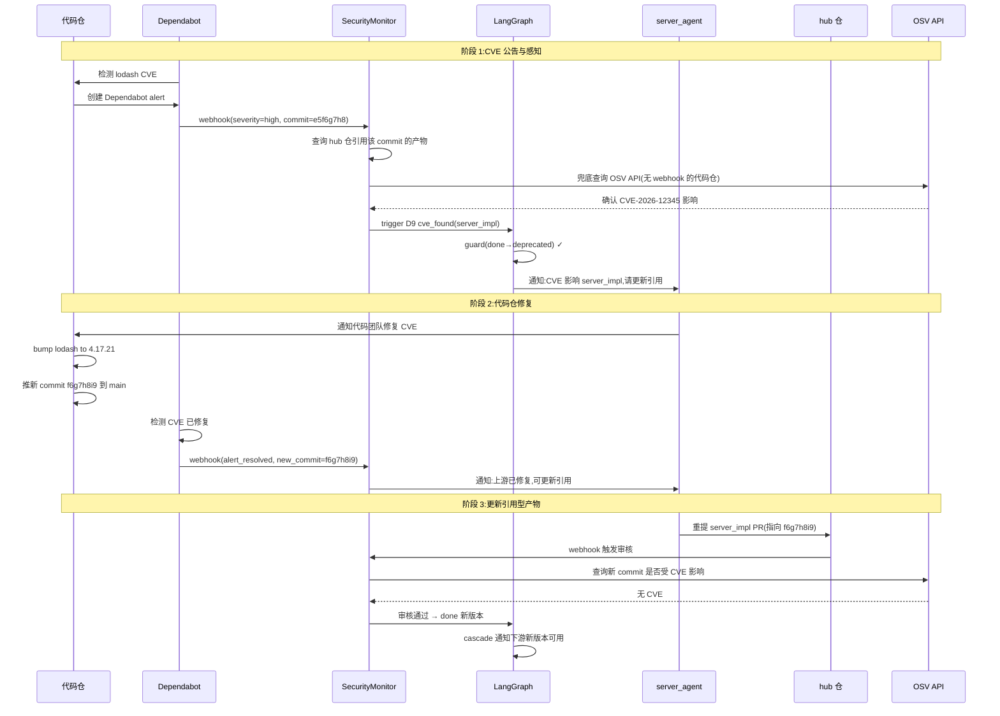
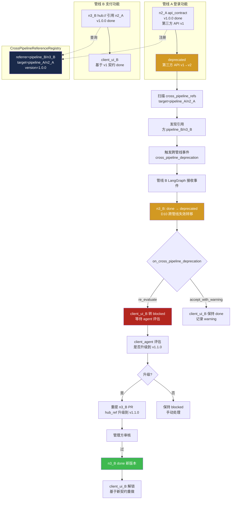

# 第四轮压力测试:外部依赖失效场景

> **文档性质**:对《coordination-platform-prd.md》v2.0 + 第三轮修正的第四轮压力测试
> **版本**:v1.0 | **日期**:2026-08-04 | **状态**:架构评审输入
> **测试方法**:选取 4 个外部依赖失效真实场景(A21-A24)
> **父文档**:[coordination-platform-prd.md](../coordination-platform-prd.md)
> **核心张力**:需求 9"只提供 figma 链接/引用"vs 外部资源会失效;管理方"提交时校验"vs"持续监控"

---

## 0. 测试方法说明

### 0.1 测试动机

前三轮共 48 个场景、279 个缺陷,已修正 7 态→10 态、ArtifactRef 单值→多版本、hub 仓单点故障降级等系统性问题。但**所有修正都聚焦"提交时校验"**——产物 PR 审核通过即视为合法。真实开发中,**外部资源会在产物 done 之后失效**:

- Figma 链接被删除/转移/改权限(需求 9 明确"设计只提供 figma 链接")
- 第三方 API 升级版本(v1→v2),旧版本废弃
- 引用型产物指向的代码 commit 中,开源依赖爆出 CVE
- 跨管线共享产物的外部依赖失效,级联影响多个管线

PRD 现有设计(含第三轮修正)的**核心盲区**:

| 已覆盖 | 未覆盖 |
|---|---|
| 提交时 `R_EXTERNAL_REF_OWNERSHIP` 校验归属(第三轮 §3.7) | done 后持续监控外部资源可访问性 |
| 引用型 commit `git ls-remote` 存在性校验(第三轮 §3.7) | figma 链接 403/404、第三方 API 版本变更 |
| `deprecated` 状态(第三轮 §3.1,管理方手动标记) | 外部失效自动触发 `done → deprecated` |
| 单管线内 T16 递归失效 | 跨管线 `hub://` 引用的失效级联 |
| 引用型分层清除 + 双层回滚(第三轮 §3.6) | 代码仓依赖 CVE 漏洞感知与通知 |

### 0.2 核心张力:管理方中立性 vs 外部依赖监控

PRD §1.2 明确"管理方不解析产物内容";§1.4 范围边界"不限制开发方用什么工具产出内容"。外部依赖监控似乎与"不解析内容"冲突:

| 看似冲突 | 实际可调和 |
|---|---|
| 校验 figma 链接可访问 = 解析内容? | 否——只校验 HTTP 状态码,不读取链接内容(类比 TLS 证书过期校验,不读证书内容) |
| 感知第三方 API 变更 = 解析 API? | 否——订阅第三方 webhook 或定期 health check,不解析契约语义 |
| 感知代码仓 CVE = 审计代码? | 否——订阅代码仓的 CVE 通知(GitHub Dependabot),不审代码内容 |

**修正定位**:外部依赖监控是**"管理约束"**(Management Constraint),不是"内容解析"(Content Parsing)——管理方维护产物的"外部依赖健康度"元数据,与"产物内容中立"原则正交。类比:`ArtifactRef.trace_id` 关联 Langfuse 不解析内容,但提供可观测性;`ArtifactRef.external_health` 同理。

### 0.3 测试范围

4 个场景编号 A21-A24(延续第二轮 A1-A16、第三轮的编号体系):

| 场景 | 失效类型 | 触发源 | 影响范围 |
|---|---|---|---|
| A21 | Figma 设计稿链接失效 | 设计师在 figma 删文件/改权限 | design_asset + 下游 client_ui |
| A22 | 第三方 API 变更 | 第三方升级 API 版本 | api_contract + 下游 client_ui/server_impl |
| A23 | 开源依赖 CVE 漏洞 | CVE 数据库公告 | server_impl 引用型产物 + 下游 client_delivery |
| A24 | 跨管线共享产物外部失效 | 第三方 API 变更 | 多管线级联 |

---

## 1. 场景 A21:Figma 设计稿链接失效(design_asset 外部链接失效)

### 1.1 场景描述

**真实情境**:

1. 周一:设计师通过 `design_agent` 提交 `design_asset` 产物到 hub 仓,内容为 figma 链接 JSON:
   ```json
   // design_asset/001_login.json
   {
     "figma_url": "https://www.figma.com/file/abc123/Login-Design",
     "figma_node_id": "1:2",
     "version": "1.0.0"
   }
   ```
2. 周一:管理方审核通过(`R_FILE_FORMAT`、`R_FILE_EXISTS`、`R_HUMAN_REVIEW` 均过),节点 `done`,ArtifactRef 指向 hub 仓 commit。下游 `client_ui` 解锁 `ready`。
3. 周二~周四:客户端 agent 调 `get_dependencies(n_client_ui)` 拉到 figma 链接 JSON,基于该链接开发 UI 代码,提交 `client_ui` 引用型产物,审核通过 `done`。
4. 周四晚:设计师在 figma 中:
   - **方案 A**:删除了该文件(误操作或清理)
   - **方案 B**:将文件转移到其他团队空间(组织调整)
   - **方案 C**:修改了权限(从"组织可访问"改为"仅设计团队")
5. 周五:服务端联调时,客户端 agent 再次调 `get_dependencies` 拉 figma 链接 → HTTP 403/404。但 hub 仓中 `design_asset` 产物仍为 `done`,ArtifactRef 仍指向有效 commit。

**关键矛盾**:hub 仓产物内容不可变(git commit 永远存在),但产物**指向的外部资源**已失效。管理方"提交时校验文件存在性"对此完全无感知。

### 1.2 PRD 走查

| 走查点 | PRD 章节(行号) | 现状 | 缺口 |
|---|---|---|---|
| design_asset 产物校验 | §FR1.1 行 180 "管理方不解析内容,只校验文件存在性 + 扩展名/大小" | 只校验 hub 仓内 JSON 文件存在 | **不校验 figma_url 字段可访问性** |
| 审核规则 | fr1-fr6 §4.1.1 `R_FILE_EXISTS` `git_ls_file_exists` op | 校验 hub 仓文件存在 | **无 `R_EXTERNAL_URL_REACHABLE` 规则** |
| 需求 9 | 附录 D8 行 1192 "需求 9 自由≠无约束——格式/方法论/完成度自由" | 自由指格式/方法论 | **未明确"可访问性"是否属于管理约束** |
| 状态机 10 态 | fr2 §2.1 + 第三轮 §3.1 `deprecated` 态 | "管理方标记 / 版本 superseded" 进入 | **无"外部失效自动进入"路径** |
| get_dependencies | §FR4.1 行 368 "查上游产物内容(git show 拉取)" | 返回 figma 链接 JSON | **拉到的是失效链接,但工具无感知** |
| 引用型产物持续校验 | 第三轮 §3.7 行 245 "定期 health check 后台任务定期 git ls-remote 校验引用型 commit 仍存在" | 校验代码仓 commit 存在 | **不覆盖 figma 链接可访问性** |
| 失效通知 | 第三轮 §3.1 `deprecated` note "已依赖的下游收到 DEPRECATED 通知" | deprecated 时通知下游 | **figma 失效不触发 deprecated,通知不触发** |
| 客户端已开发代码 | 无 | 无应对策略 | **完全空白** |

### 1.3 设计缺陷

| 编号 | 严重度 | 缺陷描述 |
|---|---|---|
| **D-A21-R4.1** | Critical | design_asset 产物审核规则无 `R_EXTERNAL_URL_REACHABLE`,figma 链接 403/404 在提交时和 done 后均不感知。需求 9"只提供 figma 链接"被误读为"不校验链接",但链接是产物的**唯一实质内容**,失效等同产物失效。 |
| **D-A21-R4.2** | High | 状态机无"外部失效自动转移"路径:`done → deprecated` 仅靠管理方手动标记或版本 superseded,无 `external_health_check` 触发的自动转移。 |
| **D-A21-R4.3** | High | 失效感知时机错误:仅在下游消费时(`get_dependencies` 返回链接,agent 调用 figma API 失败)才发现,无主动 health check。客户端已基于失效链接开发完代码,损失已发生。 |
| **D-A21-R4.4** | High | 设计师无通知机制:figma 链接失效后,管理方无渠道通知 `design_agent` 修复(重新提供有效链接或迁移到新 figma 文件)。`notify` 控制节点(§FR2.5)只在管线流中触发,不响应外部事件。 |
| **D-A21-R4.5** | Medium | 已基于失效 figma 链接开发的 `client_ui` 代码无应对策略:状态机无"上游外部资源失效"的下游级联,client_ui 仍 `done`,联调时才发现 UI 与设计不一致。 |

### 1.4 修正方案

> **定位**:figma 链接可访问性是"管理约束"(类比 `trace_id` 可观测性),不是"内容解析"。管理方不读取 figma 文件内容,只校验 HTTP 状态码与 OAuth token 有效性。

#### 1.4.1 manifest schema 扩展(内容型产物的外部资源声明)

在 `design_asset` 等"链接型"内容产物的 manifest 中,显式声明外部资源(不强制 figma,保持中立):

```json
// manifest 扩展字段(可选,需求 9 自由:不声明则不监控)
{
  "external_resources": [
    {
      "type": "figma",                          // 资源类型(中立,允许 figma/sketch/zip_url/...)
      "url": "https://www.figma.com/file/abc123/Login-Design",
      "auth_strategy": "oauth_token",           // 鉴权策略(管理方据此选择 health check 方式)
      "expected_status": [200],                 // 预期 HTTP 状态码
      "health_check_interval_hours": 24,        // 健康检查间隔(默认 24h)
      "on_failure": "mark_deprecated"           // 失效动作:mark_deprecated | notify_only | ignore
    }
  ]
}
```

**关键中立性**:管理方不解析 figma 文件内容,只发 HTTP HEAD 请求校验状态码。`auth_strategy` 由提交方声明,管理方按策略选择 token(GitHub App / OAuth / 服务账号)。

#### 1.4.2 新增审核规则 R_EXTERNAL_URL_REACHABLE

```yaml
# skills/design-handoff-skill/skill.yaml 扩展
review_rules:
  - id: R_EXTERNAL_URL_REACHABLE
    name: 外部资源可访问性校验
    priority: 70                                # 与 R_FILE_EXISTS 同层
    combinators: OR                             # OR:声明 external_resources 时校验,未声明时跳过
    on_fail: needs_human                        # 失效转人工(不直接 reject,允许设计师修复)
    checks:
      - field: external_resources
        op: url_reachable                       # 新增 op:HTTP HEAD 校验状态码
        expected_status: [200, 302]             # 允许重定向
        timeout_seconds: 10
      - field: __no_external_resources__        # 未声明 external_resources 时通过
        op: exists
        negated: true
```

**op `url_reachable` 语义**:管理方按 `auth_strategy` 选择鉴权方式,发 HTTP HEAD 请求,状态码在 `expected_status` 内即通过。**不读取响应体**(不解析内容)。

#### 1.4.3 ExternalHealthMonitor 后台任务

新增后台监控组件(与 LangGraph 编排引擎解耦,独立进程):

```python
class ExternalHealthMonitor:
    """定期 health check 产物的外部资源,失效时触发状态转移。"""

    async def run_periodic_check(self):
        # 每小时扫描所有 done 状态产物
        artifacts = await self.db.fetch_all("""
            SELECT node_id, pipeline_id, manifest
            FROM artifact_refs
            WHERE state = 'done'
              AND manifest->'external_resources' IS NOT NULL
              AND last_health_check_at < now() - interval '24 hours'
        """)
        for art in artifacts:
            for resource in art["manifest"]["external_resources"]:
                ok = await self.check_url_reachable(resource)
                if not ok and resource["on_failure"] == "mark_deprecated":
                    await self.trigger_external_invalidation(
                        node_id=art["node_id"],
                        pipeline_id=art["pipeline_id"],
                        reason=f"external resource unreachable: {resource['url']}"
                    )

    async def trigger_external_invalidation(self, node_id, pipeline_id, reason):
        """触发 done → deprecated 转移(新转移 D7,见 1.4.4)。"""
        # 通过 LangGraph invoke 触发(走状态机,不绕过 guard)
        await self.graph.ainvoke(
            {"external_invalidation": node_id, "reason": reason},
            config={"configurable": {"thread_id": pipeline_id}}
        )
```

#### 1.4.4 状态机新增转移 D7(外部失效)

在第三轮 10 态基础上新增合法转移:

| # | 源状态 | 目标状态 | 触发 | 副作用 |
|---|---|---|---|---|
| **D7** | `done` | `deprecated` | `external_invalidation` 事件(由 ExternalHealthMonitor 触发) | 发 `EXTERNAL_INVALIDATED` event,触发下游级联通知(不强制 blocked,允许下游评估) |

**关键设计**:`done → deprecated`(非 `done → changed`),因为外部失效不是"提交方主动变更",而是"外部资源被动失效"。下游收到 `DEPRECATED` 通知后:

- 下游产物可选择 `consume_ack`(确认接受失效,继续 done)或 `re-evaluate`(重新评估,转 blocked)
- 客户端已基于失效 figma 开发的代码:由客户端 agent 决定是否回滚(管理方不强制)

#### 1.4.5 失效通知与修复闭环



### 1.5 Mermaid 设计图:外部失效监控全链路



---

## 2. 场景 A22:第三方 API 变更(api_contract 上游变更)

### 2.1 场景描述

**真实情境**:

1. 服务端 agent 产出 `api_contract`,契约定义了"用户登录"端点,响应 schema 中含 `token` 字段。该契约依赖第三方支付网关 API(用于登录后绑定支付方式),第三方 API 版本为 v1。
2. `api_contract` 审核通过 `done`,ArtifactRef 指向 hub 仓 commit。下游 `client_ui`、`server_impl` 基于 v1 契约开发。
3. 2 周后:第三方支付网关升级 API v1→v2,旧版本废弃(返回 410 Gone 或重定向到 v2 schema),v2 响应中 `token` 字段改为 `access_token`。
4. 客户端联调时:基于 v1 契约的代码调第三方 API,收到 v2 响应,解析失败。
5. 服务端 `api_contract` 在 hub 仓中仍 `done`,但实际已与第三方 API 不一致。

**关键矛盾**:`api_contract` 声明依赖管线内 `product_spec`(manifest.deps),但**不声明依赖外部第三方 API**。管理方校验"依赖完整性"只覆盖管线内 node 依赖,不覆盖外部 API 依赖。

### 2.2 PRD 走查

| 走查点 | PRD 章节(行号) | 现状 | 缺口 |
|---|---|---|---|
| api_contract manifest.deps | fr1-fr6 §3.3 行 379 `deps: [{node_id, node_type, min_version}]` | 只声明管线内 node 依赖 | **无 third_party_api 字段声明外部 API 依赖** |
| 审核规则 R_DEPS_DONE | fr1-fr6 §4.1.1 行 513 `all_deps_done` op | 校验管线内 deps 全 done | **不校验外部 API 可用性** |
| 引用型产物持续校验 | 第三轮 §3.7 行 245 "git ls-remote 校验引用型 commit 仍存在" | 只覆盖引用型产物的代码仓 commit | **不覆盖 api_contract 内容型产物引用的第三方 API** |
| 状态机 | fr2 §2.1 + 第三轮 §3.1 | `done → deprecated` 由管理方手动标记 | **第三方 API 变更无自动触发 deprecated 机制** |
| 第三方变更感知 | 全文 | 无设计 | **无 webhook 接收 / 定期轮询 / API 版本探测机制** |
| 下游级联通知 | fr1-fr6 §5.3.3 行 863 "依赖状态变更时扫描 pending PRs 标记 stale" | 只覆盖 PR pending 期间的依赖变更 | **done 产物的下游无级联通知** |
| 跨管线引用 | 第三轮 §3.13 hub:// 协议 | 跨管线引用其他管线节点 | **不覆盖跨管线引用同一 api_contract 的失效级联**(见场景 A24) |

### 2.3 设计缺陷

| 编号 | 严重度 | 缺陷描述 |
|---|---|---|
| **D-A22-R4.1** | Critical | api_contract manifest schema 无 `third_party_api` 字段,无法声明外部 API 依赖。第三方 API 变更时管理方无任何渠道感知,客户端联调失败时才暴露,已造成开发浪费。 |
| **D-A22-R4.2** | High | 第三方 API 变更感知机制完全缺失:无 webhook 接收(第三方通常不主动通知)、无定期 API 版本探测、无 API schema diff 检测。 |
| **D-A22-R4.3** | High | 第三方 API 变更后,api_contract 仍 `done`,无自动标记 `deprecated` 机制。下游 client_ui/server_impl 基于过期契约继续开发,错误累积。 |
| **D-A22-R4.4** | High | 下游级联通知无设计:`done → deprecated` 时,下游产物如何感知、是否自动 blocked、是否需要重新评估,均无定义。第三轮 §3.1 `deprecated` note 仅说"已依赖的下游收到 DEPRECATED 通知",未规定下游响应行为。 |
| **D-A22-R4.5** | Medium | 多版本共存场景下,第三方 API v1 和 v2 可能并存(过渡期):api_contract 如何声明支持多版本、客户端如何选择版本,与第三轮 §3.2 多版本映射未对齐。 |

### 2.4 修正方案

> **定位**:第三方 API 依赖声明是"管理约束"(manifest 元数据),不是"内容解析"。管理方不解析 API 响应 schema,只校验 API 端点可达 + 响应版本号匹配。

#### 2.4.1 manifest 扩展:third_party_api 字段

```json
// api_contract manifest 扩展字段
{
  "third_party_apis": [
    {
      "name": "payment-gateway",
      "base_url": "https://api.payment.com/v1",
      "expected_version": "v1",
      "version_detection": {
        "method": "response_header",            // 检测方式:response_header / endpoint / schema_diff
        "header_name": "X-API-Version"
      },
      "deprecation_policy": {
        "on_version_mismatch": "mark_deprecated", // 版本不匹配时触发 deprecated
        "on_410_gone": "mark_deprecated",          // 收到 410 时触发 deprecated
        "on_301_redirect": "notify_only"           // 重定向仅通知,不标记
      },
      "health_check_interval_hours": 12
    }
  ]
}
```

**中立性**:管理方不解析 API 响应 body schema,只检查 HTTP 状态码 + 响应头中的版本号(类比 figma 链接校验)。

#### 2.4.2 第三方 API 变更感知策略矩阵

不同第三方 API 的变更通知能力不同,管理方按策略选择:

| 第三方类型 | 感知策略 | 触发频率 | 适用场景 |
|---|---|---|---|
| 提供 webhook | 接收第三方 webhook | 实时 | GitHub API、Stripe API |
| 提供 deprecation header | 定期 HEAD 请求检查 `Deprecation`/`Sunset` header | 12h | 符合 RFC 8594 的 API |
| 仅提供版本端点 | 定期 GET `/version` 端点比对 | 24h | 自定义企业内部 API |
| 无任何机制 | 定期 GET 样例端点 + schema diff(只比关键字段) | 7d | 老旧第三方 API |

**关键**:`schema diff` 不解析契约语义,只对比关键字段(如响应中是否含 `token` 字段),由提交方在 manifest 中声明"关键字段集合"。

#### 2.4.3 状态机新增转移 D8(第三方 API 变更)

| # | 源状态 | 目标状态 | 触发 | 副作用 |
|---|---|---|---|---|
| **D8** | `done` | `deprecated` | `third_party_api_changed` 事件(由 ExternalHealthMonitor 检测版本不匹配触发) | 发 `EXTERNAL_API_CHANGED` event,下游级联通知 |

#### 2.4.4 下游响应策略(deprecated 通知的语义化)

扩展第三轮 §3.1 `deprecated` note,明确下游响应行为:

```yaml
# 下游产物 deps 声明扩展(第三轮 §3.3 DepDeclaration 已有 strictness,新增 on_dep_deprecated)
deps:
  - node_id: n2_api_contract
    strictness: strict
    on_dep_deprecated: re_evaluate   # 新增:上游 deprecated 时下游行为
                                    # re_evaluate(默认,转 blocked 等待评估)
                                    # | accept_with_warning(继续 done,记录 warning)
                                    # | force_upgrade(强制 blocked,必须升级到新版本)
```

**语义**:
- `re_evaluate`:下游转 `blocked`,由对应 agent 评估是否兼容新版本
- `accept_with_warning`:下游保持 `done`,记录 warning(适用于兼容性变更)
- `force_upgrade`:下游强制 `blocked`,必须基于新版本重做(适用于 breaking 变更)

### 2.5 Mermaid 设计图:第三方 API 变更感知与级联



---

## 3. 场景 A23:开源依赖 CVE 漏洞(server_impl 引用代码仓含漏洞依赖)

### 3.1 场景描述

**真实情境**:

1. 服务端 agent 提交 `server_impl` 引用型产物,指向代码仓 `org/backend-services` 的 commit `e5f6g7h8`。该 commit 的 `package.json` 中依赖 `lodash@4.17.4`。
2. 管理方审核:`R_EXTERNAL_REF_OWNERSHIP` 校验归属通过,`R_COMMIT_STABILITY` 校验 commit 稳定通过,`git ls-remote` 校验 commit 存在。`server_impl` 节点 `done`。
3. 1 个月后:CVE 数据库公告 `CVE-2026-12345` 影响 `lodash < 4.17.21`,代码仓的 `e5f6g7h8` commit 含漏洞版本。
4. 代码仓团队响应 CVE:修复 `package.json`,推新 commit `f6g7h8i9`,合并到代码仓 main 分支。**但 hub 仓中 `server_impl` 仍指向旧 commit `e5f6g7h8`**。
5. 管理方无感知渠道:不订阅 CVE 数据库、不订阅代码仓的 Dependabot 警报、不解析代码内容。
6. 客户端 `client_delivery` 依赖 `server_impl`,联调时虽然功能正常,但安全审计发现服务端运行的是含 CVE 的 lodash 版本,交付被阻塞。

**关键矛盾**:引用型产物只校验 commit 存在性(第三轮 §3.7),不感知 commit 内容的安全状态。代码仓团队修复 CVE 后,无机制通知管理方更新引用。

### 3.2 PRD 走查

| 走查点 | PRD 章节(行号) | 现状 | 缺口 |
|---|---|---|---|
| 引用型产物校验 | §5.1 行 706-708 `external_repo`/`external_commit` + 第三轮 §3.2 `commit_stability` | 校验 commit 存在 + 稳定性 | **不校验 commit 内容的安全状态** |
| R_EXTERNAL_REF_OWNERSHIP | 第三轮 §3.7 行 243 "校验 external_repo 归属" | 校验归属(权限) | **不校验代码仓依赖漏洞** |
| R_COMMIT_STABILITY | 第三轮 §3.7 行 244 "commit_stability=stable 时拒绝 force-push 后的 commit" | 防 commit 被篡改 | **不感知 commit 引用的依赖是否有 CVE** |
| 定期 health check | 第三轮 §3.7 行 245 "后台任务定期 git ls-remote 校验引用型 commit 仍存在" | 校验存在性 | **不校验代码仓的依赖安全公告** |
| 审核策略 | §FR6.4 行 528 "server_impl 引用:仅引用 commit,代码在代码仓库审" | 代码内容由代码仓审 | **CVE 修复后无通知管理方机制,引用不更新** |
| 状态机 | fr2 §2.1 + 第三轮 §3.1 | done → deprecated 仅手动标记 | **CVE 公告无自动触发 deprecated** |
| 代码仓事件订阅 | 全文 | 无 | **无 GitHub Dependabot / Snyk / CVE 数据库订阅机制** |
| 引用型产物更新 | fr1-fr6 §2.3 行 197 "引用型产物的特殊共存" | 多版本共存,旧版本保留 | **CVE 修复后如何触发 server_impl changed/bump** |

### 3.3 设计缺陷

| 编号 | 严重度 | 缺陷描述 |
|---|---|---|
| **D-A23-R4.1** | High | 引用型产物的持续校验只覆盖 commit 存在性(第三轮 §3.7),不覆盖 commit 引用的代码依赖是否有 CVE 公告。CVE 数据库(GitHub Advisory / OSV / NVD)有公开 API,可定期查询,但 PRD 无设计。 |
| **D-A23-R4.2** | High | 代码仓团队修复 CVE 后,无机制通知管理方更新 server_impl 引用到新 commit。代码仓 main 分支已漂移,但 hub 仓 ArtifactRef 仍指向旧 commit。 |
| **D-A23-R4.3** | Medium | server_impl 产物指向旧 commit(含漏洞),无自动触发 `changed` 机制。需依赖提交方主动重提 PR,但提交方可能不知情(代码仓团队与管理方是不同组织)。 |
| **D-A23-R4.4** | Medium | 管理方是否订阅代码仓的 CVE 通知(GitHub Dependabot Alerts)未定义。若订阅,订阅范围(全代码仓 / 仅引用型产物涉及的 commit)未明确。 |
| **D-A23-R4.5** | Low | `client_delivery` 依赖 `server_impl`,CVE 暴露后,client_delivery 是否需要重新安全审计、是否阻塞交付,无设计。 |

### 3.4 修正方案

> **定位**:CVE 感知是"管理约束"(订阅公开 CVE 数据库 + 代码仓 Dependabot 警报),不是"代码审计"。管理方不解析 package.json/go.mod 内容,只接收代码仓的 Dependabot webhook 与 CVE 数据库的查询结果。

#### 3.4.1 引用型产物扩展:声明代码仓依赖监控

manifest 中引用型产物(已在第三轮 §3.4 引入 `*_ref.json` 子 schema)扩展:

```json
// server_impl/001_ref.json 扩展
{
  "code_repo": "org/backend-services",
  "code_commit": "e5f6g7h8",
  "code_path": "src/api/login.py",
  "build_status": "passed",
  "security_monitoring": {                    // 新增
    "enabled": true,
    "channels": [
      "github_dependabot_alerts",             // 订阅代码仓 Dependabot 警报
      "cve_database_polling"                  // 定期查询 CVE 数据库(OSV API)
    ],
    "cve_severity_threshold": "high",        // high 及以上触发 deprecated
    "on_cve_found": "mark_deprecated",
    "on_cve_fixed_upstream": "notify_owner"  // 代码仓修复后通知提交方更新引用
  }
}
```

**中立性**:管理方不解析 `package.json` 内容,只接收代码仓的 Dependabot 警报(webhook)或定期查询 OSV API(`GET https://api.osv.dev/v1/query` 传 commit hash)。

#### 3.4.2 SecurityMonitor 后台任务

```python
class SecurityMonitor:
    """监听代码仓 CVE 警报 + 定期查询 CVE 数据库。"""

    async def on_dependabot_alert(self, webhook_payload):
        """接收代码仓 Dependabot 警报 webhook。"""
        repo = webhook_payload["repository"]
        commit = webhook_payload["commit_sha"]
        cve_id = webhook_payload["alert"]["security_advisory"]["ghsa_id"]
        severity = webhook_payload["alert"]["security_vulnerability"]["severity"]

        # 查询 hub 仓中引用该 repo+commit 的所有 server_impl/client_ui 产物
        affected = await self.db.fetch_all("""
            SELECT node_id, pipeline_id, manifest
            FROM artifact_refs
            WHERE manifest->>'code_repo' = $1
              AND manifest->>'code_commit' = $2
              AND state = 'done'
        """, repo, commit)

        for art in affected:
            threshold = art["manifest"]["security_monitoring"]["cve_severity_threshold"]
            if SEVERITY_ORDER[severity] >= SEVERITY_ORDER[threshold]:
                await self.trigger_cve_invalidation(
                    node_id=art["node_id"],
                    pipeline_id=art["pipeline_id"],
                    cve_id=cve_id
                )

    async def poll_cve_database(self):
        """定期查询 OSV API(无 webhook 的代码仓兜底)。"""
        artifacts = await self.db.fetch_all("""
            SELECT node_id, pipeline_id, manifest
            FROM artifact_refs
            WHERE state = 'done'
              AND manifest->'security_monitoring'->'channels' ? 'cve_database_polling'
        """)
        for art in artifacts:
            commit = art["manifest"]["code_commit"]
            # OSV API 查询 commit 是否受 CVE 影响
            response = await self.http.post(
                "https://api.osv.dev/v1/query",
                json={"commit": commit}
            )
            vulns = response.json().get("vulns", [])
            if vulns:
                await self.trigger_cve_invalidation(
                    node_id=art["node_id"],
                    pipeline_id=art["pipeline_id"],
                    cve_id=",".join(v["id"] for v in vulns)
                )
```

#### 3.4.3 状态机新增转移 D9(CVE 公告)

| # | 源状态 | 目标状态 | 触发 | 副作用 |
|---|---|---|---|---|
| **D9** | `done` | `deprecated` | `cve_found` 事件(由 SecurityMonitor 触发) | 发 `CVE_FOUND` event,通知提交方修复,下游按 `on_dep_deprecated` 策略响应 |

#### 3.4.4 代码仓修复后的引用更新闭环

```mermaid
flowchart LR
    CVE[CVE 公告<br/>lodash 漏洞]
    CVE --> MON[SecurityMonitor<br/>接收 Dependabot webhook]
    MON --> SCAN[扫描受影响 server_impl<br/>引用该 code_repo+commit]
    SCAN --> TRIGGER[触发 D9 转移<br/>done → deprecated]
    TRIGGER --> NOTIFY[通知 server_agent<br/>CVE-2026-12345 影响 server_impl]

    NOTIFY --> CODEFIX[代码仓团队修复 CVE<br/>推新 commit f6g7h8i9]
    CODEFIX --> DEPABOT[Dependabot 警报 resolved]
    DEPABOT --> MON2[SecurityMonitor<br/>接收 resolved webhook]
    MON2 --> NOTIFY2[通知 server_agent<br/>上游修复可用]

    NOTIFY2 --> RESUBMIT[server_agent 重提 server_impl PR<br/>指向新 commit f6g7h8i9]
    RESUBMIT --> REVIEW[管理方审核<br/>R_EXTERNAL_REF_OWNERSHIP + commit 稳定性]
    REVIEW -->|过| MERGE[done 新版本]
    MERGE --> CASCADE[cascade 下游<br/>通知新版本可用]

    style TRIGGER fill:#d29922,color:#fff
    style CODEFIX fill:#3fb950,color:#fff
    style MERGE fill:#3fb950,color:#fff
```



### 3.5 Mermaid 设计图:CVE 监控与修复闭环



---

## 4. 场景 A24:跨管线共享产物的外部依赖失效(场景 10 延伸)

### 4.1 场景描述

**真实情境**:

1. **管线 A**(登录功能)产出 `api_contract_A`(节点 `n2_A`),该契约依赖第三方支付网关 v1。管线 A 完成,`n2_A` 节点 `done`。
2. **管线 B**(支付功能)需要复用登录功能的 api_contract。管线 B 通过 `hub://` 协议跨管线引用(第三轮 §3.13):
   ```yaml
   # 管线 B 的节点 n3_B 声明依赖
   deps:
     - hub_ref: "hub://pipeline_A/n2_A@1.0.0"   # 跨管线引用
   ```
3. 管线 B 的 `client_ui_B` 依赖 `n3_B`(管线 B 内节点),基于 `api_contract_A` v1.0.0 开发,`done`。
4. 第三方支付网关 v1→v2 变更(场景 A22 触发):管线 A 的 ExternalHealthMonitor 检测到变更,触发 `n2_A: done → deprecated`。
5. **关键问题**:管线 B 的 `n3_B` 通过 `hub://` 引用 `n2_A`,但管线 A 的 `deprecated` 通知**不跨管线**。管线 B 的 `client_ui_B` 仍 `done`,联调时才发现第三方 API 已变更,客户端代码基于 v1 契约,失败。

**关键矛盾**:`hub://` 协议支持跨管线引用产物(第三轮 §3.13),但**外部依赖失效的级联通知不跨管线**。第三轮 §3.1 `deprecated` note "已依赖的下游收到 DEPRECATED 通知"——但"下游"仅指管线内下游,跨管线引用方不在通知范围。

### 4.2 PRD 走查

| 走查点 | PRD 章节(行号) | 现状 | 缺口 |
|---|---|---|---|
| hub:// 协议 | 第三轮 §3.13 行 331 `hub_ref: "hub://{pipeline_id}/{node_id}@{version}"` | 跨管线引用语法 | **无反向引用注册表:管线 A 不知道哪些管线引用了 n2_A** |
| 跨管线 DAG | 第三轮 §3.13 行 337 "hub_ref 绕过 DANGLING_REF 校验" | 跨管线引用不进 DAG | **跨管线引用不在 T16 级联失效范围内** |
| deprecated 通知 | 第三轮 §3.1 行 119 "已依赖的下游收到 DEPRECATED 通知" | 管线内下游通知 | **跨管线引用方不在通知范围** |
| ExternalHealthMonitor | 本场景 §1.4.3 提议 | 单管线内监控 | **跨管线共享产物的外部失效,如何通知所有引用管线** |
| 管线 B 级联 | fr2 §2.2 行 259 "级联失效:节点 changed → 所有下游产物引用清除 + 置 blocked(递归)" | 管线内递归 | **跨管线引用的递归级联无设计** |
| 跨管线产物注册表 | 第三轮 §3.13 行 333 `DepDeclaration` | 只在依赖方声明 | **被引用方无注册表(谁引用了我)** |
| 多版本共存 | 第三轮 §3.2 行 170 `artifact_refs: dict[str, dict[str, ArtifactRef]]` | 多版本映射 | **跨管线引用如何选择版本、版本升级如何通知** |

### 4.3 设计缺陷

| 编号 | 严重度 | 缺陷描述 |
|---|---|---|
| **D-A24-R4.1** | Critical | `hub://` 协议无反向引用注册表:管线 A 的 `n2_A` deprecated 时,无法知道管线 B、管线 C 等都引用了它。跨管线失效通知完全缺失,管线 B 联调时才发现失效,损失已发生。 |
| **D-A24-R4.2** | High | 跨管线引用的级联失效无设计:T16 级联失效只在管线内递归,跨管线引用的产物(管线 B 的 `n3_B`)不会自动 blocked。管线 B 的 `client_ui_B` 仍 `done`,基于过期契约。 |
| **D-A24-R4.3** | High | 跨管线 deprecated 通知的语义未定义:管线 A 通知管线 B 后,管线 B 的 `n3_B` 应进入什么状态?是直接 blocked,还是 re-evaluate,还是 notify_only?无设计。 |
| **D-A24-R4.4** | Medium | 跨管线版本选择策略未定义:管线 A 的 `n2_A` 有 v1.0.0(deprecated)和 v1.1.0(新版本)共存,管线 B 的 `hub://` 引用如何升级?自动升级还是手动?无设计。 |

### 4.4 修正方案

> **定位**:跨管线失效级联是"管理约束"(维护跨管线引用注册表 + 通知),不是"内容解析"。管理方不解析管线 B 的产物内容,只通知"你引用的 hub:// 资源已 deprecated"。

#### 4.4.1 CrossPipelineReferenceRegistry(跨管线引用注册表)

新增 Postgres 表,记录所有 `hub://` 引用:

```sql
CREATE TABLE cross_pipeline_refs (
    id BIGSERIAL PRIMARY KEY,
    referrer_pipeline_id TEXT NOT NULL,        -- 引用方管线 ID(管线 B)
    referrer_node_id TEXT NOT NULL,             -- 引用方节点 ID(n3_B)
    target_pipeline_id TEXT NOT NULL,           -- 被引用方管线 ID(管线 A)
    target_node_id TEXT NOT NULL,              -- 被引用方节点 ID(n2_A)
    target_version TEXT NOT NULL,               -- 引用的版本(1.0.0)
    hub_ref TEXT NOT NULL,                      -- 完整 hub:// 引用串
    created_at TIMESTAMPTZ NOT NULL DEFAULT now(),
    UNIQUE (referrer_pipeline_id, referrer_node_id)
);
CREATE INDEX idx_target ON cross_pipeline_refs(target_pipeline_id, target_node_id);
```

**关键**:被引用方(管线 A)可通过 `target_pipeline_id + target_node_id` 反向查询所有引用方。

#### 4.4.2 跨管线 deprecated 通知机制

扩展 LangGraph 的 `invalidate_node`,在 deprecated 转移时同步通知跨管线引用方:

```python
async def invalidate_node_with_cross_pipeline(state, node_id, reason):
    """节点 deprecated 时,同时通知管线内下游 + 跨管线引用方。"""
    # 1. 管线内下游级联(原有 T16 逻辑)
    downstream = get_downstream_in_pipeline(state, node_id)
    for ds_id in downstream:
        await cascade_invalidate(state, ds_id)

    # 2. 跨管线引用方通知(新增)
    cross_refs = await db.fetch_all(
        "SELECT referrer_pipeline_id, referrer_node_id, target_version "
        "FROM cross_pipeline_refs "
        "WHERE target_pipeline_id = $1 AND target_node_id = $2",
        state["pipeline_id"], node_id
    )
    for ref in cross_refs:
        # 通过 LangGraph invoke 触发跨管线事件
        await graph.ainvoke(
            {"cross_pipeline_deprecation": {
                "source_pipeline": state["pipeline_id"],
                "source_node": node_id,
                "target_pipeline": ref["referrer_pipeline_id"],
                "target_node": ref["referrer_node_id"],
                "old_version": ref["target_version"],
                "reason": reason
            }},
            config={"configurable": {"thread_id": ref["referrer_pipeline_id"]}}
        )
```

#### 4.4.3 跨管线 deprecated 事件处理

管线 B 的 LangGraph 接收 `cross_pipeline_deprecation` 事件后,处理逻辑:

| 管线 B 节点状态 | 行为 |
|---|---|
| `n3_B`(`hub://` 引用节点) | 触发新转移 **D10**: `done → deprecated`(跨管线失效) |
| `n3_B` 的管线内下游 | 按 `on_dep_deprecated` 策略响应(re_evaluate / accept_with_warning / force_upgrade) |

新增状态机转移:

| # | 源状态 | 目标状态 | 触发 | 副作用 |
|---|---|---|---|---|
| **D10** | `done` | `deprecated` | `cross_pipeline_deprecation` 事件(跨管线上游失效) | 发 `CROSS_PIPELINE_DEPRECATION` event,管线 B 内级联 |

#### 4.4.4 跨管线版本升级策略

管线 B 收到 deprecated 通知后,版本升级策略:

```yaml
# 管线 B 节点 n3_B 的 deps 声明扩展
deps:
  - hub_ref: "hub://pipeline_A/n2_A@1.0.0"
    version_upgrade_strategy: manual       # manual(默认,人工评估) | auto_latest(自动升级到最新)
    on_cross_pipeline_deprecation: re_evaluate  # 跨管线失效时行为
```

**策略**:
- `manual`(默认):管线 B 的 agent 收到通知后,手动评估是否升级到 v1.1.0,重提 PR 更新 `hub_ref`
- `auto_latest`:管理方自动将 `hub_ref` 升级到最新版本(适用于完全兼容的场景),触发 `n3_B: deprecated → changed → pending_review` 走重审

### 4.5 Mermaid 设计图:跨管线失效级联



---

## 5. 缺陷汇总表

### 5.1 缺陷统计

| 场景 | 缺陷总数 | Critical | High | Medium | Low |
|---|---|---|---|---|---|
| A21 Figma 链接失效 | 5 | 1 | 3 | 1 | 0 |
| A22 第三方 API 变更 | 5 | 1 | 3 | 1 | 0 |
| A23 开源依赖 CVE | 5 | 0 | 2 | 2 | 1 |
| A24 跨管线失效级联 | 4 | 1 | 2 | 1 | 0 |
| **合计** | **19** | **3** | **10** | **5** | **1** |

### 5.2 缺陷明细

| 编号 | 场景 | 严重度 | 缺陷描述 | 修正方案 |
|---|---|---|---|---|
| D-A21-R4.1 | A21 | Critical | design_asset 无 R_EXTERNAL_URL_REACHABLE,figma 链接失效不感知 | §1.4.2 新增规则 + §1.4.1 manifest external_resources 字段 |
| D-A21-R4.2 | A21 | High | 状态机无外部失效自动转移路径 | §1.4.4 新增 D7 转移(done→deprecated) |
| D-A21-R4.3 | A21 | High | 失效感知时机错误,仅在下游消费时才发现 | §1.4.3 ExternalHealthMonitor 后台任务 |
| D-A21-R4.4 | A21 | High | 设计师无通知机制 | §1.4.5 失效通知闭环 + notify 控制节点扩展 |
| D-A21-R4.5 | A21 | Medium | 客户端已基于失效链接开发的代码无应对 | §1.4.4 下游 re_evaluate 策略 |
| D-A22-R4.1 | A22 | Critical | api_contract manifest 无 third_party_api 字段 | §2.4.1 manifest 扩展 |
| D-A22-R4.2 | A22 | High | 第三方 API 变更感知机制完全缺失 | §2.4.2 感知策略矩阵(webhook/header/版本端点/schema diff) |
| D-A22-R4.3 | A22 | High | 第三方 API 变更后无自动 deprecated | §2.4.3 新增 D8 转移 |
| D-A22-R4.4 | A22 | High | 下游级联通知无设计 | §2.4.4 on_dep_deprecated 策略(re_evaluate/accept_with_warning/force_upgrade) |
| D-A22-R4.5 | A22 | Medium | 多版本共存场景下第三方 API v1/v2 并存无设计 | §2.4.1 多版本声明 + 第三轮 §3.2 多版本映射对齐 |
| D-A23-R4.1 | A23 | High | 引用型产物只校验 commit 存在,不感知 CVE | §3.4.1 security_monitoring 字段 + §3.4.2 SecurityMonitor |
| D-A23-R4.2 | A23 | High | 代码仓修复 CVE 后无通知管理方 | §3.4.4 修复闭环(Dependabot resolved webhook) |
| D-A23-R4.3 | A23 | Medium | server_impl 指向旧 commit,无自动 changed | §3.4.3 D9 转移 + 通知提交方重提 |
| D-A23-R4.4 | A23 | Medium | 管理方是否订阅代码仓 CVE 通知未定义 | §3.4.1 channels 字段(github_dependabot_alerts / cve_database_polling) |
| D-A23-R4.5 | A23 | Low | client_delivery 是否阻塞交付无设计 | §3.4.3 下游 on_dep_deprecated=force_upgrade 策略 |
| D-A24-R4.1 | A24 | Critical | hub:// 协议无反向引用注册表 | §4.4.1 CrossPipelineReferenceRegistry 表 |
| D-A24-R4.2 | A24 | High | 跨管线引用的级联失效无设计 | §4.4.2 跨管线 invalidate 扩展 |
| D-A24-R4.3 | A24 | High | 跨管线 deprecated 通知语义未定义 | §4.4.3 新增 D10 转移 + on_cross_pipeline_deprecation 策略 |
| D-A24-R4.4 | A24 | Medium | 跨管线版本选择策略未定义 | §4.4.4 version_upgrade_strategy(manual / auto_latest) |

### 5.3 根因归类(4 大类)

| 根因类别 | 影响缺陷 | 核心问题 | 影响范围 |
|---|---|---|---|
| **R1. 提交时校验 vs 持续监控盲区** | D-A21-R4.1/4.3、D-A22-R4.2、D-A23-R4.1/4.2 | 所有现有规则都是"提交时一次性校验",无持续监控机制 | 审核 + 状态机 + 新增 ExternalHealthMonitor/SecurityMonitor |
| **R2. 状态机缺"外部失效自动转移"** | D-A21-R4.2、D-A22-R4.3、D-A23-R4.3、D-A24-R4.3 | 第三轮 deprecated 只能手动标记,无外部事件触发的自动转移 | fr2 §2.1 状态机 + 新增 D7/D8/D9/D10 转移 |
| **R3. manifest 不声明外部依赖** | D-A21-R4.1、D-A22-R4.1、D-A23-R4.1 | manifest 只声明管线内 deps,不声明外部资源(figma/API/CVE) | fr1-fr6 §3.3 manifest schema + external_resources/third_party_apis/security_monitoring 字段 |
| **R4. 跨管线失效级联缺失** | D-A24-R4.1/4.2/4.3/4.4 | hub:// 协议只支持正向引用,无反向注册表与失效级联 | 第三轮 §3.13 hub:// 协议 + 新增 CrossPipelineReferenceRegistry |

### 5.4 P0 修正项(Phase 1 必做)

| # | 修正项 | 修正根因 | 影响章节 | 优先级 |
|---|---|---|---|---|
| **P0-R4-1** | manifest 扩展 `external_resources`/`third_party_apis`/`security_monitoring` 字段 | R3 | fr1-fr6 §3.3 + 主 PRD §5.1 ArtifactRef | P0 |
| **P0-R4-2** | 新增审核规则 `R_EXTERNAL_URL_REACHABLE`(op: `url_reachable`) | R1 | fr1-fr6 §4.1 + skill.yaml | P0 |
| **P0-R4-3** | 状态机新增 D7/D8/D9 转移(外部失效自动 done→deprecated) | R2 | fr2 §2.1 + 第三轮 §3.1 | P0 |
| **P0-R4-4** | ExternalHealthMonitor + SecurityMonitor 后台任务 | R1 | 新增组件 + fr7 监控 | P0 |
| **P0-R4-5** | 跨管线引用注册表 CrossPipelineReferenceRegistry | R4 | 新增表 + 第三轮 §3.13 hub:// 协议 | P0 |
| **P0-R4-6** | 跨管线失效级联(D10 转移 + 跨管线 invalidate 扩展) | R4 | fr2 §2.2 DAG 规则 | P0 |
| **P0-R4-7** | deps 扩展 `on_dep_deprecated` 策略(re_evaluate/accept_with_warning/force_upgrade) | R2 | fr1-fr6 §3.3 + 第三轮 §3.3 DepDeclaration | P0 |

### 5.5 设计图统计

| Mermaid 图 | 章节 | 主题 |
|---|---|---|
| 图 1 | §1.5 | Figma 链接失效监控全链路时序图 |
| 图 2 | §1.4.5 | 失效通知与修复闭环流程图 |
| 图 3 | §2.5 | 第三方 API 变更感知与级联流程图 |
| 图 4 | §3.4.4 | CVE 监控与修复闭环时序图 |
| 图 5 | §4.5 | 跨管线失效级联流程图 |
| **合计** | **5 张** | (满足"至少 3 个"要求) |

---

## 6. 第四轮关键认知

1. **需求 9"只提供 figma 链接/引用"≠"不校验链接可访问性"**:链接是产物的**唯一实质内容**,可访问性是"管理约束"(类比 trace_id 可观测性),不是"内容解析"。管理方发 HTTP HEAD 校验状态码,不读取响应体。

2. **提交时校验 vs 持续监控**:现有所有规则(R_EXTERNAL_REF_OWNERSHIP、R_COMMIT_STABILITY)都是"提交时一次性校验"。外部资源在 done 之后失效,必须有持续监控机制(ExternalHealthMonitor + SecurityMonitor)。这是 PRD v2.0 + 第三轮修正的**最大盲区**。

3. **状态机 deprecated 必须有"外部失效自动触发"路径**:第三轮 deprecated 只能"管理方手动标记 / 版本 superseded",无自动触发。新增 D7(figma 失效)/ D8(API 变更)/ D9(CVE)/ D10(跨管线失效)4 条转移,填补自动触发空白。

4. **hub:// 协议必须支持反向引用注册表**:第三轮 §3.13 hub:// 只支持正向引用(管线 B 引用管线 A),被引用方(管线 A)不知道谁引用了自己。跨管线失效级联必须建立 CrossPipelineReferenceRegistry,实现反向通知。

5. **管理方中立性原则的边界扩展**:
   - **不解析内容**:不读取 figma 文件内容、不解析 API 响应 schema、不审计代码内容
   - **可管理约束**:校验 HTTP 状态码、订阅 CVE 数据库、接收代码仓 Dependabot webhook、维护跨管线引用注册表
   - 类比:`ArtifactRef.trace_id` 关联 Langfuse 不违反中立性,`ArtifactRef.external_health` 同理

6. **CVE 感知是"代码仓与管理方的协作"**:管理方不审计代码,但订阅代码仓的 Dependabot 警报(webhook)+ CVE 数据库(OSV API)是合理管理约束。代码仓团队修复 CVE 后,通过 Dependabot resolved webhook 通知管理方,server_agent 据此更新引用型产物。

---

## 附录:与前三轮修正的衔接

| 第四轮修正 | 衔接的前三轮修正 | 关系 |
|---|---|---|
| §1.4.1 manifest external_resources | 第三轮 §3.2 ArtifactRef 多版本 + artifact_qualifier | 扩展:多版本映射支持 external_resources 字段 |
| §1.4.4 D7 转移 | 第三轮 §3.1 状态机 10 态 + deprecated | 扩展:deprecated 新增"外部失效自动进入"路径 |
| §2.4.4 on_dep_deprecated | 第三轮 §3.3 DepDeclaration strictness | 扩展:strictness 之外增加 on_dep_deprecated 响应策略 |
| §3.4.1 security_monitoring | 第三轮 §3.7 R_EXTERNAL_REF_OWNERSHIP + 定期 health check | 扩展:从"commit 存在性"扩展到"commit 安全性" |
| §4.4.1 CrossPipelineReferenceRegistry | 第三轮 §3.13 hub:// 协议 | 补全:hub:// 正向引用 + 反向注册表 |
| §4.4.3 D10 转移 | 第三轮 §3.1 deprecated note"已依赖的下游收到通知" | 补全:跨管线下游也在通知范围 |

**实施建议**:第四轮 P0 修正项与第三轮 P0 修正项(14 项)合计 21 项,建议在 Phase 1 一并落地,避免"提交时校验完善但持续监控缺失"的半成品状态。
