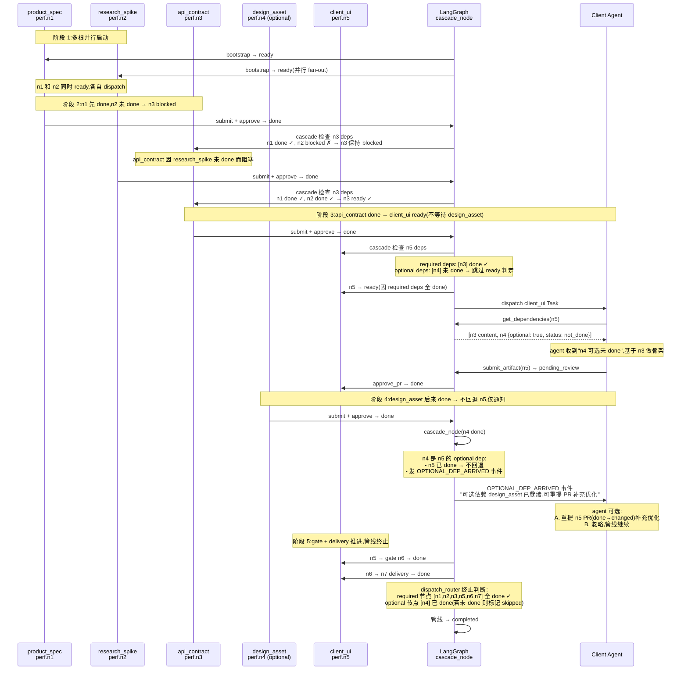
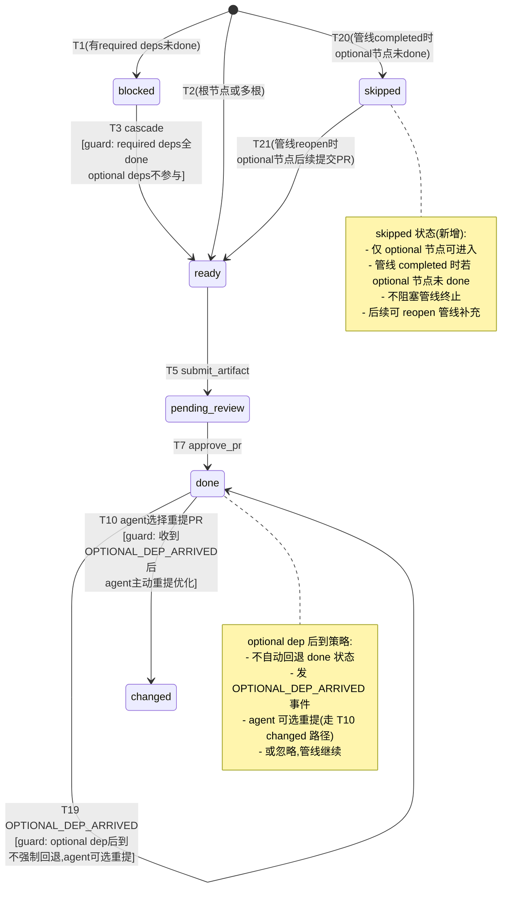

# 第五轮压力测试:多源头并行起点 + 可选依赖场景

> **文档性质**:对《coordination-platform-prd.md》v3.0 的第五轮压力测试
> **版本**:v1.0 | **日期**:2026-08-04 | **状态**:架构评审输入
> **测试方法**:选取 1 个多源头 + 可选依赖真实场景(A41)
> **父文档**:[coordination-platform-prd.md](../coordination-platform-prd.md)
> **核心张力**:需求 1"通用性"vs PRD 隐含"product 唯一起点 + 依赖全满足才 ready"假设

---

## 0. 测试方法说明

### 0.1 测试动机

前四轮 64 场景 369 缺陷,围绕"product_spec 起点链式推进"展开。第三轮虽有 `strictness=accepts_draft` 缓和"严格依赖",第四轮虽有 `derived_artifact` 派生节点,但**所有场景默认单一上游链**。本场景压测的是真实开发中**多源头并行起点**(无共同上游)与**可选依赖**(下游可选是否依赖某上游)——这两个概念 PRD 未明确支持,需走查暴露缺陷。

### 0.2 测试范围

| 维度 | 本轮测试 | 前四轮已测 |
|---|---|---|
| DAG 根节点 | **多根(2+ 独立起点)** | 单根(product_spec) |
| 依赖严格性 | strict + accepts_draft + **optional(新增)** | strict + accepts_draft |
| 级联触发条件 | 上游**全部 required dep done** | 上游全部 done |
| 终止条件 | **可选节点未 done 是否阻塞** | 全节点 done 即终止 |

### 0.3 测试场景

- A41:多源头并行起点 + 可选依赖(技术调研 + 产品需求并行驱动性能优化 feature)

---

## 1. 场景 A41:多源头并行起点 + 可选依赖

### 1.1 场景描述

**业务背景**:某团队做"性能优化"feature,该 feature 不是单源驱动的——产品提需求"优化首屏加载,目标 P95 < 1s",技术团队同时启动调研"懒加载/虚拟列表/图片优化方案"。两者**无依赖关系**,并行推进;但下游 api_contract(定义性能监控接口)需要**同时依赖** product_spec(性能目标)和 research_spike(技术方案选型)才能定义接口契约;更下游 client_ui(实现性能优化 UI)**强依赖** api_contract,**可选依赖** design_asset(有设计稿更好,没设计稿也能基于契约先做骨架)。

**节点清单**:

| 节点 ID | 类型 | 角色 | deps | 期望严格性 |
|---|---|---|---|---|
| `perf.n1` | `product_spec` | product | `[]`(根节点 1) | — |
| `perf.n2` | `research_spike`(技术调研,新增节点类型) | server/research | `[]`(根节点 2) | — |
| `perf.n3` | `api_contract` | server | `[perf.n1, perf.n2]` | 两者都 strict |
| `perf.n4` | `design_asset` | design | `[perf.n1]` | strict |
| `perf.n5` | `client_ui` | client | `[perf.n3]` strict + `[perf.n4]` **optional** | strict + optional |
| `perf.n6` | `gate` | control | `[perf.n5]` | — |
| `perf.n7` | `client_delivery` | client | `[perf.n6]` | strict |

**真实情境链**:
1. **T0**:管线启动,product 与 research 团队**同时**启动工作(n1 和 n2 均 ready)
2. **T+3d**:product_spec n1 先 done(性能目标 P95 < 1s),但 research_spike n2 仍未 done
3. **T+5d**:research_spike n2 done(选定懒加载 + 图片优化方案)
4. **T+5d**:api_contract n3 因 n1+n2 均 done → ready
5. **T+7d**:api_contract n3 done,client_ui n5 强依赖满足 → ready(此时 design_asset n4 可能未 done)
6. **T+7d**:client_ui n5 基于契约先做骨架(不阻塞等待设计稿)
7. **T+9d**:design_asset n4 done → client_ui n5 是否需重新评估?已 done 的 n5 是否要 re-evaluate?
8. **T+12d**:client_ui n5 → gate n6 → client_delivery n7 全 done → 管线终止?
9. **遗留**:若 design_asset n4 始终未提交,管线能否终止?

### 1.2 PRD 走查

#### 1.2.1 DAG 多根支持走查

**对照章节**:PRD §2 术语(P76-126)、§FR2.2 DAG 规则(P399-422)、§FR2.4 bootstrap_node(P449-461)、§5.1 Pipeline 数据模型(P1042-1074)、fr2-orchestration §2.1 T1/T2(P62-64)、§7.6 加载校验清单(P830-842)

**走查结论**:

| 走查点 | PRD 表述 | 支持多根? | 缺陷 |
|---|---|---|---|
| 根节点定义 | T2 (P64):"节点无 deps(根节点)" bootstrap 置 ready | **支持多根**(语义上) | — |
| `bootstrap_node` 行为 | §FR2.4 (P453):"初始化:无依赖根节点置 ready" | 字面支持多根 | 但**未明确**多根时如何并行 fan-out |
| DAG 加载校验 | §7.6 (P838):"至少 1 个根节点(无 deps)" | 仅"至少 1",允许多根 | 但 PRD §5.1 示例 (P1047) 只有 1 根(product_spec) | 
| `pipeline.yaml` nodes 列表 | §5.1 (P1047-1073) 示例仅有 `product_spec` 作 deps:[] | 示例**隐含单根假设** | 文档读者会误以为"必须 product_spec 起头" |
| `dispatch_router` 多根分发 | fr2 §9.4 (P1058-1085) `dispatch_router_fn` 用 `Send` 并行 fan-out | **技术上支持** | 但未在 PRD 主文档说明多根是合法用法 |
| AC2.1 | P492:"根节点(无依赖)启动时自动 ready" | 单数"根节点",未说"根节点们" | 表述歧义 |

**关键发现**:PRD **语义上支持多根**(T2 转移条件是"节点无 deps",任何无 deps 节点都符合),但**示例、AC、文档表述都隐含单根假设**(product_spec 是隐含"唯一源头")。需求 1"整体开发管理需要通用"被实例和 AC 的单根假设削弱。

#### 1.2.2 可选依赖走查

**对照章节**:§FR2.2 DAG 规则(P399-422)、`DepDeclaration` (P415-422)、§FR2.5 控制节点 fork(P471)、§FR5.4 Skill deps 必须包含(P783-790)、§6.5 get_dependencies(P1295-1312)

**走查结论**:

| 走查点 | PRD 表述 | 支持 optional? | 缺陷 |
|---|---|---|---|
| DepDeclaration.strictness | P421:"strict(默认,要求 done) \| accepts_draft(允许 draft 态上游)" | **不支持 optional** | strictness 只有 2 值,无"可选"语义 |
| 多入边 ready 条件 | §FR2.2 (P407):"多入边节点:全部 done → 本节点 ready" | **严格要求全满足** | 无法表达"design_asset 缺失也不阻塞" |
| fork 控制节点 | §FR2.5 (P471):"fork:多入边依赖全 done 后透传" | **严格要求全 done** | fork 与 optional 语义冲突 |
| Skill deps 必须包含 | §FR5.4 (P783):"client-ui-skill: deps 必须包含 api_contract + design_asset" | **强制 design_asset** | 与 client_ui 可选依赖 design_asset 冲突 |
| get_dependencies 返回 | §6.5 (P1312):返回 `[{node_id, content, ...}]` | **未定义 optional dep 未 done 时返回什么** | agent 拿不到 design_asset 时无引导 |
| AC2.7 终止条件 | P498:"管线全节点 done 时管线进入 completed" | **未处理 optional 节点** | optional 节点不 done 是否阻塞终止? |

**关键发现**:PRD 的依赖模型是**严格 AND 语义**——deps 数组中所有依赖必须 done(或 draft,若 accepts_draft)才能 ready。**完全没有"可选依赖"概念**。strictness 字段只区分"要求 done vs 允许 draft",不区分"必须 vs 可选"。client_ui 可选依赖 design_asset 在当前模型下**无法表达**。

#### 1.2.3 可选依赖级联走查

**对照章节**:§FR2.2 级联解锁(P408)、§FR2.5 控制节点(P467-473)、fr2 §8.3 fork 边界(P879-887)

**走查结论**:

| 走查点 | PRD 表述 | optional dep 级联如何处理? |
|---|---|---|
| cascade_node 解锁下游 | §FR2.4 (P456):"done 节点解锁下游" | 解锁逻辑是"上游 done → 检查下游 deps 全满足"——若 design_asset 后来 done,client_ui 已 done,是否触发 re-evaluate?**未定义** |
| T3 cascade 转移 | fr2 §2.1 T3 (P65):"`all(dep_state==done for dep in deps(nid))`" | 全 done 才 ready——若 design_asset 是 optional,公式应改为"required deps 全 done" |
| fork 节点边界 | fr2 §8.3 (P884):"多入边部分 done 部分 blocked → fork 保持 blocked" | fork 全 done 才透传——与 optional 冲突,无法表达"design_asset blocked 但 client_ui 仍可推进" |
| 已 done 节点 re-evaluate | 状态机 P349-360 无"done → 重新检查依赖"转移 | **缺失**:optional dep 后到时,已 done 节点不应回退,但应通知 agent 可补充优化 |
| done → changed | T10 (P72):"重提已 done 节点 PR 且 commit 不同" | 仅触发于"重提",不触发于"optional dep 后到"——PRD 无机制感知 optional dep 后到 |

**关键发现**:PRD 的级联是**严格的"上游 done → 下游 ready"单向流**。optional dep 后来 done 时,(a) 已 done 的 client_ui 是否要 re-evaluate?(b) 还在 blocked 的 client_ui 是否要 ready?PRD 完全未定义这两种情况。

#### 1.2.4 终止条件走查

**对照章节**:AC2.7 (P498)、fr2 §9.4 dispatch_router_fn (P1080-1083)、§FR2.7 管线级 5 态(P508-514)

**走查结论**:

| 走查点 | PRD 表述 | optional 节点未 done 时? |
|---|---|---|
| AC2.7 | P498:"管线全节点 done 时管线进入 completed" | 若 design_asset 始终未提交,管线**永远无法 completed** |
| dispatch_router 终止判断 | fr2 §9.4 (P1081):"`if all(s == NodeStatus.DONE for s in state['node_states'].values()): return END`" | **全 done 才终止**——optional 节点未 done 阻塞终止 |
| 管线级 completed 进入条件 | §FR2.7 (P514):"completed:全节点 done" | 同上,未区分 optional 节点 |
| 管线级 cancelled | §FR2.7 (P513):"cancelled:cancel_pipeline" | 用户可手动取消,但**自动化场景下无法终止** |
| 节点 deprecated/sunset | P359-360:"deprecated → sunset(终态)" | design_asset 不是 deprecated,只是"未提交",状态仍为 blocked |

**关键发现**:AC2.7 "全节点 done" 假设所有节点都"应该 done"。可选节点未提交时,管线**永久卡在 active**,无法自动 completed。这是**严重缺陷**——真实开发中"可选依赖"意味着"有则用,无则跳过",不应阻塞终止。

#### 1.2.5 SkillRegistry 匹配走查

**对照章节**:§FR5.3 Skill 匹配(P766-776)、§FR5.4 7 个 Skill 约束(P778-790)

**走查结论**:

| 走查点 | PRD 表述 | optional dep 时如何匹配? |
|---|---|---|
| Skill deps 必须包含 | P783:"client-ui-skill:deps 必须包含 api_contract + design_asset" | **强制包含 design_asset**——但 client_ui 可选依赖 design_asset,无 design_asset 时 skill 应如何匹配? |
| Skill 匹配三级 | P772:"精确 → 角色通配(client.*) → 通用(*)" | 三级匹配基于 node_type,与 deps 无关——**skill 不感知 optional dep** |
| PR 审核依赖完整性 | §FR6.2 (P838):"PR 声明的 deps 节点状态满足 strictness" | strictness 只有 strict/accepts_draft,无 optional——**审核会拒绝"deps 缺 design_asset"** 的 PR |
| Skill 引导 guide.md | §FR5.4 (P783):"建议含 UI 实现引用" | guide 未提示"有设计稿则参考,无则基于契约做骨架" |

**关键发现**:SkillRegistry 的 deps 校验是**强制的**,client-ui-skill 强制要求 design_asset 在 deps 中。可选依赖场景下,client_ui 提交 PR 时若 deps 不含 design_asset(因为还没 done),会被 skill 审核拒绝。**可选依赖与 skill 强制 deps 直接冲突**。

#### 1.2.6 控制节点 fork vs 可选依赖走查

**对照章节**:§FR2.5 fork (P471)、fr2 §8.3 fork 边界(P879-887)

**走查结论**:

| 走查点 | PRD 表述 | fork 与 optional 区分? |
|---|---|---|
| fork 定义 | P122:"fork:并行汇合:多入边依赖全 done 后透传" | fork 是**全 done 语义**,与 optional"有则用"冲突 |
| fork 边界 | fr2 §8.3 (P884):"多入边部分 done 部分 blocked → fork 保持 blocked" | fork 无法表达"design_asset blocked 但 client_ui 仍可推进" |
| fork vs deps 数组 | §FR2.2 (P407):"多入边:节点依赖 N 个上游:全部 done → 本节点 ready(fork 节点同理)" | **deps 数组本身就是"全 done"语义**——deps 中所有元素都 required,无 optional 标记 |

**关键发现**:PRD 的 fork 控制节点和 deps 数组都是**严格 AND 语义**,无法区分"必需依赖"和"可选依赖"。可选依赖需要新的 DSL 标记(如 `optional: true` 或 `required: false`)。

### 1.3 设计缺陷

#### DA41-R5.1 [Critical] PRD 示例与 AC 隐含"product_spec 唯一源头"假设,与需求 1 通用性冲突

**位置**:§5.1 Pipeline 示例 (P1047-1073)、AC2.1 (P492)、§2.1 节点类型清单 (P99-114)

**问题**:PRD 全文示例的 pipeline 均以 `product_spec` 为唯一根节点(deps: []),AC2.1 用单数"根节点"表述。需求 1"整体开发管理需要通用"要求支持多源头(技术调研、安全审计、合规要求、运维工单等独立起点),但 PRD 实例与 AC 的单根假设让读者误以为"必须 product_spec 起头"。

**影响**:多源头场景(如 A41 的 product_spec + research_spike 双根)在文档层面无引导,实施者可能拒绝加载多根 pipeline.yaml,或不知道如何编写多根 DSL。

**严重度**:Critical(阻断需求 1 通用性)

#### DA41-R5.2 [Critical] DepDeclaration 无 optional 标记,无法表达可选依赖

**位置**:§FR2.2 DepDeclaration (P415-422)、§FR2.2 多入边规则 (P407)

**问题**:`DepDeclaration` 字段只有 `node_id/hub_ref/version_constraint/format_slot/strictness`,其中 `strictness` 只有 `strict/accepts_draft` 两值,均为"必需"语义(只是允许 draft 态)。无法表达"design_asset 是可选的,有则用,无则不阻塞"。

**影响**:client_ui 可选依赖 design_asset 在当前 DSL 下无法声明——若放进 deps 数组,则 design_asset 必须 done 才 ready(阻塞);若不放,则 skill 审核会因"deps 缺 design_asset"拒绝(参见 DA41-R5.5)。

**严重度**:Critical(阻断可选依赖场景)

#### DA41-R5.3 [High] 多入边 ready 公式 `all(dep_state==done)` 未区分 required/optional

**位置**:fr2 §2.1 T3 (P65)、§FR2.2 多入边规则 (P407)

**问题**:T3 cascade 转移条件 `all(dep_state==done for dep in deps(nid))` 要求**所有 deps 全 done**,未区分 required dep 与 optional dep。即使 DA41-R5.2 增加 optional 标记,T3 公式也需改为"所有 required dep 全 done"(optional dep 不参与 ready 判定)。

**影响**:即使声明 design_asset 为 optional,T3 公式仍会要求 design_asset done 才让 client_ui ready,optional 标记失效。

**严重度**:High(级联逻辑需修改)

#### DA41-R5.4 [High] AC2.7 "全节点 done" 假设所有节点"应该 done",optional 节点未 done 时管线无法终止

**位置**:AC2.7 (P498)、fr2 §9.4 dispatch_router_fn (P1081)、§FR2.7 管线 completed 进入条件 (P514)

**问题**:AC2.7 "管线全节点 done 时管线进入 completed" 假设所有节点都"应该 done"。可选节点(如 design_asset 在 client_ui 已基于契约完成时)未提交时,管线**永久卡在 active**,无法自动 completed。

**影响**:A41 中若 design_asset 始终未提交,client_ui/gate/client_delivery 全 done 后,管线仍因 design_asset 处于 blocked 而无法 completed——卡死。

**严重度**:High(管线无法终止)

#### DA41-R5.5 [High] SkillRegistry 强制 deps 校验,与可选依赖直接冲突

**位置**:§FR5.4 7 个 Skill 约束 (P783)、§FR6.2 依赖完整性校验 (P838)

**问题**:client-ui-skill 的 `deps 必须包含 api_contract + design_asset` 是强制约束。可选依赖场景下,client_ui 提交 PR 时若 deps 不含 design_asset(因为还没 done 或选择不依赖),会被 skill 审核拒绝(`AC5.3: 依赖未 done 的 PR 被拒`)。

**影响**:可选依赖无法通过审核,DSL 与 skill 约束矛盾。

**严重度**:High(可选依赖被审核阻断)

#### DA41-R5.6 [High] optional dep 后来 done 时,已 done 下游节点无 re-evaluate 机制

**位置**:§FR2.4 cascade_node (P456)、状态机 P349-360

**问题**:状态机无"done → 重新检查 optional dep"转移。client_ui 已 done(基于契约骨架),design_asset 后来 done——agent 应被通知"可选依赖已就绪,可补充优化",但 PRD 无此机制。

**影响**:optional dep 后到时,agent 无感知,可选优化机会丢失。这与 `draft_subscribers` 通知机制(P440)类似,但作用于 done 节点而非 draft。

**严重度**:High(可选优化机会丢失)

#### DA41-R5.7 [Medium] get_dependencies 对 optional dep 未 done 时的返回未定义

**位置**:§6.5 get_dependencies (P1295-1312)、返回结构 (P1312)

**问题**:get_dependencies 返回 `[{node_id, content, key_constraints}]`,未定义 optional dep 未 done 时返回什么——空?警告?标记 `optional_skipped`?agent 拿不到 design_asset 时无引导,不知道"可选依赖缺失,可基于契约先做"还是"必须等待"。

**影响**:agent 行为不确定——可能误判"必须等待 design_asset"而阻塞,或误判"design_asset 不存在"而放弃。

**严重度**:Medium(agent 行为不确定)

#### DA41-R5.8 [Medium] fork 控制节点与 optional 语义混淆,无区分机制

**位置**:§FR2.5 fork (P471)、fr2 §8.3 fork 边界 (P879-887)

**问题**:fork 是"多入边全 done 后透传",与 optional"有则用"语义冲突。若用户误用 fork 表达"client_ui 等 api_contract + design_asset(optional)",fork 会因 design_asset 未 done 而永久 blocked。PRD 未说明 fork 与 optional 的边界——何时用 fork,何时用 optional deps。

**影响**:用户 DSL 编写歧义,可能误用 fork 导致管线卡死。

**严重度**:Medium(DSL 歧义)

#### DA41-R5.9 [Medium] bootstrap_node 对多根 fan-out 未在 PRD 主文档说明

**位置**:§FR2.4 bootstrap_node (P453)、fr2 §9.4 dispatch_router_fn (P1058)

**问题**:fr2 §9.4 的 `dispatch_router_fn` 用 `Send` 并行 fan-out 多个 ready 节点,技术上支持多根。但 PRD 主文档 §FR2.4 只说"无依赖根节点置 ready",未说明多根时如何并行 fan-out、如何确保 n1 和 n2 同时 dispatch 给不同角色 agent。

**影响**:实施者读 PRD 主文档可能不知道多根是合法用法,或不知道如何实现多根并行 dispatch。

**严重度**:Medium(文档不完整)

#### DA41-R5.10 [Low] research_spike 节点类型未在 §2.1 节点清单中

**位置**:§2.1 节点类型完整清单 (P99-114)

**问题**:§2.1 列出 10 种产物节点,无 `research_spike`(技术调研)。虽然 §2.1 注释说"节点类型采用 `{role}.{name}` 开放命名空间"(P101),理论上可扩展,但无示例引导。

**影响**:用户不知道如何声明 research_spike 节点(role 应填什么?skill 如何匹配?)。

**严重度**:Low(可扩展但无引导)

### 1.4 修正方案

#### 1.4.1 多根 DAG 显式支持(修正 DA41-R5.1, DA41-R5.9)

**PRD §FR2.2 DAG 规则补充**:

| 规则 | 描述 |
|---|---|
| **多根支持** | 管线可有 **0 个或多个根节点**(无 deps 的节点),bootstrap_node 对所有根节点并行置 ready,通过 `Send` API fan-out 给不同角色 agent |
| 根节点最小数量 | 至少 1 个根节点(加载校验,§7.6 已有) |
| 根节点角色不限 | 根节点不限于 `product_spec`,可为任意产物节点类型(如 `research_spike`/`security_audit`/`compliance_requirement`/`ops_runbook`) |

**PRD §FR2.4 bootstrap_node 行为补充**:

```python
def bootstrap_node(state: PipelineState) -> PipelineState:
    """初始化:所有无 deps 的根节点并行置 ready,通过 Send fan-out 给 CrewAI"""
    root_nodes = [nid for nid, node in get_pipeline_def(state["pipeline_id"]).nodes.items()
                   if not node.deps]
    for nid in root_nodes:
        state["node_states"][nid] = NodeStatus.READY
        state["events"].append({"type": "READY", "node_id": nid, "reason": "root_node"})
    # 多根并行 fan-out 由 dispatch_router_fn 处理(见 fr2 §9.4)
    return state
```

**AC2.1 修正**:

> AC2.1(修正):根节点(无依赖,可多个)启动时**全部并行** ready,各根节点独立 dispatch 给对应角色 agent

**§5.1 Pipeline 示例补充多根示例**:

```yaml
pipeline:
  id: "perf-optimization"
  name: "性能优化全链路(多源头)"
  status: "active"
  nodes:
    - id: "perf.n1"
      type: "product_spec"
      role: "product"
      instance_id: "product_team"
      deps: []                       # 根节点 1
    - id: "perf.n2"
      type: "research_spike"          # 开放命名空间,新节点类型
      role: "server"                 # research 角色 fallback 到 server
      instance_id: "perf_team_server"
      deps: []                       # 根节点 2(与 n1 并行)
    - id: "perf.n3"
      type: "api_contract"
      role: "server"
      instance_id: "perf_team_server"
      deps:
        - node_id: "perf.n1"
          strictness: strict
        - node_id: "perf.n2"
          strictness: strict
    - id: "perf.n4"
      type: "design_asset"
      role: "design"
      instance_id: "design_team"
      deps:
        - node_id: "perf.n1"
          strictness: strict
    - id: "perf.n5"
      type: "client_ui"
      role: "client"
      instance_id: "client_team"
      deps:
        - node_id: "perf.n3"
          strictness: strict
        - node_id: "perf.n4"
          strictness: strict
          optional: true             # 新增:可选依赖标记
    - id: "perf.n6"
      type: "gate"
      role: "control"
      deps: ["perf.n5"]
      policy: { lint: true, test: true, coverage_min: 80, security_scan: true }
    - id: "perf.n7"
      type: "client_delivery"
      role: "client"
      instance_id: "client_team"
      deps: ["perf.n6"]
  edges: []  # 由 deps 推导
```

#### 1.4.2 optional 标记 DSL 扩展(修正 DA41-R5.2)

**DepDeclaration 字段扩展**:

```python
class DepDeclaration(TypedDict):
    node_id: str | None
    hub_ref: str | None
    version_constraint: str
    format_slot: str | None
    strictness: str                  # strict(默认,要求 done) | accepts_draft(允许 draft 态上游)
    optional: bool                   # 新增:false(默认,必需依赖) | true(可选依赖:有则用,无则不阻塞 ready)
```

**optional 语义**:

| optional 值 | 含义 | ready 判定 | 终止判定 | get_dependencies 返回 |
|---|---|---|---|---|
| `false`(默认) | 必需依赖 | 必须 done(或 draft,若 accepts_draft)才 ready | 未 done 阻塞管线 completed | 必返回内容 |
| `true` | 可选依赖 | **不参与 ready 判定**(仅 required deps 全 done 即 ready) | **未 done 不阻塞**管线 completed | 未 done 时返回 `{node_id, status: "not_done", optional: true}`,agent 可选择等待或跳过 |

**YAML DSL 示例**(已在 1.4.1 示例 `perf.n5` 中体现):

```yaml
deps:
  - node_id: "perf.n3"
    strictness: strict
    optional: false                  # 必需:api_contract 必须 done 才 ready
  - node_id: "perf.n4"
    strictness: strict
    optional: true                  # 可选:design_asset 有则用,无则不阻塞
```

#### 1.4.3 级联公式修正(修正 DA41-R5.3)

**T3 cascade 转移条件修正**(fr2 §2.1):

```python
# 修正前
def is_ready(state, node_id):
    return all(state["node_states"][dep["node_id"]] == NodeStatus.DONE
               for dep in get_deps(node_id))

# 修正后:仅 required deps 参与 ready 判定
def is_ready(state, node_id):
    required_deps = [dep for dep in get_deps(node_id) if not dep.get("optional", False)]
    return all(satisfies_dep(state, dep) for dep in required_deps)

def satisfies_dep(state, dep):
    dep_state = state["node_states"][dep["node_id"]]
    if dep["strictness"] == "strict":
        return dep_state == NodeStatus.DONE
    elif dep["strictness"] == "accepts_draft":
        return dep_state in (NodeStatus.DONE, NodeStatus.DRAFT)
    return False
```

**fork 控制节点与 optional 区分**(修正 DA41-R5.8):

| 概念 | 适用场景 | DSL | 语义 |
|---|---|---|---|
| `fork` 控制节点 | 多入边**全 done 后透传**(汇合点) | `type: fork` + `deps: [...]` | 严格 AND,所有 deps required |
| `optional: true` | 下游**可选**依赖某上游 | `deps: [{node_id, optional: true}]` | 软依赖,不参与 ready 判定 |

**何时用 fork vs optional**:
- 用 fork:多个上游产物**必须汇合**后才能产出下游(如 api_contract 同时依赖 product_spec + research_spike,两者都 required)
- 用 optional:下游**可独立产出**,但若上游可用则参考(如 client_ui 可基于 api_contract 独立产出,有 design_asset 则优化)

#### 1.4.4 终止条件修正(修正 DA41-R5.4)

**AC2.7 修正**:

> AC2.7(修正):管线**所有 required 节点** done 时(可选节点 optional: true 的节点未 done 不阻塞)管线进入 completed;可选节点未 done 时标记为 `skipped`(新增状态或元数据标记)

**dispatch_router_fn 终止判断修正**(fr2 §9.4):

```python
def dispatch_router_fn(state: PipelineState) -> list[Send] | str:
    # ... 既有 fan-out 逻辑

    if not sends:
        # 修正:仅 required 节点全 done 才终止
        required_nodes = [nid for nid in get_all_nodes(state["pipeline_id"])
                         if not is_optional_node(nid)]
        if all(state["node_states"][nid] == NodeStatus.DONE for nid in required_nodes):
            # 标记可选节点为 skipped(若未 done)
            for nid in get_all_nodes(state["pipeline_id"]):
                if is_optional_node(nid) and state["node_states"][nid] != NodeStatus.DONE:
                    state["node_states"][nid] = NodeStatus.SKIPPED  # 新增状态
                    state["events"].append({"type": "SKIPPED", "node_id": nid,
                                            "reason": "optional_dep_not_done"})
            return END
        return "wait"
    return sends

def is_optional_node(node_id):
    """节点是否为某下游的可选依赖(若任一下游将其声明为 optional,且本节点无其他 required 角色)"""
    downstream_nodes = get_downstream_nodes(node_id)
    # 若节点对所有下游都是 optional,且自身无 required 角色,则可 skip
    return all(dep.get("optional", False) for dep in get_deps_of_all_downstream(node_id))
```

**可选节点 skipped 状态语义**(新增状态,扩展 10 态为 11 态):

| 状态 | 含义 | 进入条件 | 退出条件 |
|---|---|---|---|
| `skipped` | 可选节点在管线终止时仍未 done | 管线 completed 时可选节点未 done | 后续提交 PR 时若管线仍 active 可转 ready;若管线已 completed 则需 reopen 管线 |

**§FR2.7 管线 completed 进入条件修正**:

> completed 进入条件(修正):所有 required 节点 done(可选节点未 done 不阻塞);可选节点自动标记 `skipped`

#### 1.4.5 SkillRegistry optional deps 校验修正(修正 DA41-R5.5)

**§FR5.4 client-ui-skill 修正**:

```yaml
# client-ui-skill/skill.yaml 修正
name: client-ui-skill
trigger:
  node_type: client_ui
  role: client
artifact_constraints:
  required_fields: [...]
  deps:
    required:
      - api_contract              # 必需依赖
    optional:                     # 新增:可选依赖列表(skill 不强制)
      - design_asset
  min_version:
    api_contract: "1.0.0"
  # ... 其他约束
```

**§FR6.2 依赖完整性校验修正**:

| 校验项 | 逻辑 | 失败结果 |
|---|---|---|
| 依赖完整性(修正) | PR 声明的 **required deps** 节点状态满足 strictness;**optional deps** 不强制 done(若 done 则校验 strictness,若未 done 则跳过) | reject(仅 required deps 未满足时) |

#### 1.4.6 optional dep 后到级联策略(修正 DA41-R5.6)

**新增 `optional_dep_arrival_node` StateGraph 节点**:

| 节点 | 作用 | 触发条件 |
|---|---|---|
| `optional_dep_arrival_node` | optional dep 后来 done 时,通知已 done 的下游 agent"可选依赖已就绪,可补充优化" | optional dep done 且有已 done 下游 |

**级联策略**:

```python
def cascade_node(state: PipelineState, done_node_id: str) -> PipelineState:
    """done 节点解锁下游——区分 required 与 optional"""
    downstream_nodes = get_downstream_nodes(done_node_id)
    for downstream_id in downstream_nodes:
        deps = get_deps(downstream_id)
        done_dep = next(d for d in deps if d["node_id"] == done_node_id)

        if done_dep.get("optional", False):
            # optional dep done:不改变下游状态,但通知下游 agent
            if state["node_states"][downstream_id] == NodeStatus.DONE:
                # 下游已 done:发 OPTIONAL_DEP_ARRIVED 事件,agent 可选重新提 PR 优化
                state["events"].append({
                    "type": "OPTIONAL_DEP_ARRIVED",
                    "node_id": downstream_id,
                    "optional_dep": done_node_id,
                    "payload": {"message": f"可选依赖 {done_node_id} 已就绪,可重新提 PR 补充优化"}
                })
                # 不触发状态回退(下游保持 done),agent 自行决定是否重提
            elif state["node_states"][downstream_id] == NodeStatus.READY:
                # 下游未产出:可选 dep 内容加入 get_dependencies 返回
                pass  # 下次 get_dependencies 自动包含
            # blocked/其他状态:不处理
        else:
            # required dep done:原有级联逻辑
            if is_ready(state, downstream_id):
                state["node_states"][downstream_id] = NodeStatus.READY
    return state
```

**`OPTIONAL_DEP_ARRIVED` 事件处理**:
- agent 可订阅此事件(类似 `subscribe_draft`)
- 收到事件后,agent 可调 `submit_artifact` 重提已 done 节点的 PR(走 `done → changed` 路径,T10),补充基于 optional dep 的优化
- 不强制——agent 可选择忽略

#### 1.4.7 get_dependencies optional 返回结构修正(修正 DA41-R5.7)

**§6.5 get_dependencies 返回结构扩展**:

```json
[
  {
    "node_id": "perf.n3",
    "content": "...",
    "stability": "stable",
    "optional": false,
    "key_constraints": [{"level": "must", "text": "..."}]
  },
  {
    "node_id": "perf.n4",
    "content": null,
    "stability": "not_done",
    "optional": true,
    "status": "not_done",
    "message": "可选依赖 design_asset 未 done,可基于必需依赖先做骨架;若 design_asset 后续 done,会发 OPTIONAL_DEP_ARRIVED 事件通知"
  }
]
```

**agent backstory 补充约束**(§FR3.5):

> agent backstory 强制:"若 get_dependencies 返回 `optional: true` 且 `status: not_done` 的依赖,可基于必需依赖先产出;不要阻塞等待可选依赖"

#### 1.4.8 节点类型开放命名空间补充示例(修正 DA41-R5.10)

**§2.1 节点类型清单补充**:

> 节点类型采用 `{role}.{name}` 开放命名空间。除下列预置节点类型外,真实场景中可声明:
> - `research_spike`(技术调研,role: server 或 research):技术方案调研、POC、选型报告
> - `security_audit`(安全审计,role: server 或 security):安全威胁建模、漏洞扫描报告
> - `compliance_requirement`(合规要求,role: product 或 compliance):合规清单、法规约束
> - `ops_runbook`(运维手册,role: server 或 ops):部署手册、运维 SOP
>
> 这些节点类型可作为管线的**独立根节点**(无 deps),与 product_spec 并行驱动 feature 开发。SkillRegistry 按"精确匹配 → 角色通配 → 通用(*)"三级匹配,无匹配时用 `generic-artifact-skill`(新增)兜底。

### 1.5 设计图

#### 图 1:多源头 DAG + 可选依赖标记

```mermaid
flowchart TB
    %% 多根节点
    n1[product_spec<br/>perf.n1<br/>根节点 1<br/>deps: []]
    n2[research_spike<br/>perf.n2<br/>根节点 2<br/>deps: []]

    %% 多入边 required 汇合
    n3[api_contract<br/>perf.n3<br/>deps: n1 + n2<br/>strictness: strict<br/>optional: false]

    %% 单依赖
    n4[design_asset<br/>perf.n4<br/>deps: n1<br/>strictness: strict]

    %% 可选依赖
    n5[client_ui<br/>perf.n5<br/>deps: n3 strict + n4 optional<br/>有 n4 更好,无 n4 也可 ready]

    %% 后续链
    n6[gate<br/>perf.n6<br/>deps: n5]
    n7[client_delivery<br/>perf.n7<br/>deps: n6]

    %% 根节点并行 fan-out
    n1 --> n3
    n1 --> n4
    n2 --> n3

    %% required dep(实线)
    n3 -.->|required<br/>optional: false| n5
    n4 -.->|optional: true<br/>不阻塞 ready| n5

    n5 --> n6
    n6 --> n7

    %% 标注
    classDef root fill:#3fb950,color:#fff
    classDef optional fill:#d29922,color:#fff
    classDef required fill:#58a6ff,color:#fff
    class n1,n2 root
    class n4 optional
    class n3,n5,n6,n7 required

    %% 图例
    subgraph legend[图例]
        r1[根节点<br/>deps: []]
        r2[必需依赖<br/>optional: false]
        r3[可选依赖<br/>optional: true]
        class r1 root
        class r2 required
        class r3 optional
    end
```

#### 图 2:可选依赖级联策略(三阶段)



#### 图 3:optional dep 后到时已 done 下游的状态机扩展



---

## 2. 缺陷汇总表

| 编号 | 严重度 | 缺陷描述 | 影响章节 | 修正方案 |
|---|---|---|---|---|
| DA41-R5.1 | Critical | PRD 示例与 AC 隐含"product_spec 唯一源头"假设,与需求 1 通用性冲突 | §2.1、§5.1、AC2.1 | §1.4.1 多根 DAG 显式支持 + AC2.1 修正 + 多根示例 |
| DA41-R5.2 | Critical | DepDeclaration 无 optional 标记,无法表达可选依赖 | §FR2.2 DepDeclaration | §1.4.2 optional 标记 DSL 扩展 |
| DA41-R5.3 | High | 多入边 ready 公式 `all(dep_state==done)` 未区分 required/optional | fr2 §2.1 T3、§FR2.2 | §1.4.3 级联公式修正 |
| DA41-R5.4 | High | AC2.7 "全节点 done" 假设所有节点"应该 done",optional 节点未 done 时管线无法终止 | AC2.7、§FR2.7、fr2 §9.4 | §1.4.4 终止条件修正 + skipped 状态 |
| DA41-R5.5 | High | SkillRegistry 强制 deps 校验,与可选依赖直接冲突 | §FR5.4、§FR6.2 | §1.4.5 SkillRegistry optional deps 校验修正 |
| DA41-R5.6 | High | optional dep 后来 done 时,已 done 下游节点无 re-evaluate 机制 | §FR2.4、状态机 | §1.4.6 optional dep 后到级联策略 |
| DA41-R5.7 | Medium | get_dependencies 对 optional dep 未 done 时的返回未定义 | §6.5 | §1.4.7 get_dependencies optional 返回结构 |
| DA41-R5.8 | Medium | fork 控制节点与 optional 语义混淆,无区分机制 | §FR2.5、fr2 §8.3 | §1.4.3 fork vs optional 区分表 |
| DA41-R5.9 | Medium | bootstrap_node 对多根 fan-out 未在 PRD 主文档说明 | §FR2.4、fr2 §9.4 | §1.4.1 bootstrap_node 行为补充 |
| DA41-R5.10 | Low | research_spike 节点类型未在 §2.1 节点清单中 | §2.1 | §1.4.8 节点类型开放命名空间补充示例 |

### 2.1 缺陷统计

| 严重度 | 数量 |
|---|---|
| Critical | 2 |
| High | 4 |
| Medium | 3 |
| Low | 1 |
| **合计** | **10** |

### 2.2 根因归类

| 根因 | 影响缺陷 | 核心问题 |
|---|---|---|
| **R9-1. 单根假设(新发现)** | DA41-R5.1, DA41-R5.9 | PRD 示例/AC/文档表述隐含 product_spec 唯一源头,与需求 1 通用性冲突 |
| **R9-2. 依赖模型严格 AND(延续 R5)** | DA41-R5.2, DA41-R5.3, DA41-R5.5, DA41-R5.8 | deps 数组全满足才 ready,无 optional 标记;strictness 只区分 strict/accepts_draft,不区分 required/optional |
| **R9-3. 终止条件未考虑可选节点(新发现)** | DA41-R5.4 | AC2.7 "全节点 done" 假设所有节点"应该 done",optional 节点未 done 时管线卡死 |
| **R9-4. optional dep 后到级联缺失(新发现)** | DA41-R5.6, DA41-R5.7 | 状态机无"optional dep 后到"转移,get_dependencies 未定义 optional 返回 |
| **R9-5. 节点类型清单不完整(延续)** | DA41-R5.10 | §2.1 节点清单无 research_spike 等调研类节点 |

### 2.3 P0 修正项

| # | 修正项 | 影响缺陷 | 阶段 |
|---|---|---|---|
| P0-21 | DepDeclaration 新增 `optional: bool` 字段 | DA41-R5.2 | Phase 1 |
| P0-22 | T3 cascade 公式区分 required/optional deps | DA41-R5.3 | Phase 1 |
| P0-23 | AC2.7 修正为"required 节点全 done 即 completed",新增 `skipped` 状态 | DA41-R5.4 | Phase 1 |
| P0-24 | SkillRegistry deps 拆分 required/optional,审核仅校验 required | DA41-R5.5 | Phase 1 |
| P0-25 | 新增 `OPTIONAL_DEP_ARRIVED` 事件 + optional dep 后到级联策略 | DA41-R5.6 | Phase 1 |
| P0-26 | PRD §FR2.4 显式说明多根 fan-out,AC2.1 修正为"根节点们" | DA41-R5.1, DA41-R5.9 | Phase 1 |
| P0-27 | get_dependencies 返回结构区分 required/optional | DA41-R5.7 | Phase 2 |
| P0-28 | fork vs optional DSL 区分文档 | DA41-R5.8 | Phase 2 |

### 2.4 关键认知

1. **需求 1"通用性"要求多源头支持**:真实开发中 feature 不只由 product_spec 驱动,还可能由技术调研、安全审计、合规要求、运维工单等独立起点驱动——PRD 必须显式支持多根 DAG,不能在示例和 AC 中隐含单根假设。
2. **严格 AND 依赖模型必须打破**:deps 数组"全满足才 ready"无法表达"有则用,无则不阻塞"的可选依赖语义——需要 `optional: bool` 标记区分 required/optional。
3. **可选依赖与 strictness 正交**:strictness(strict/accepts_draft)是"依赖完成度要求",optional 是"是否必需"——两者正交,可组合(strict+required、strict+optional、accepts_draft+required、accepts_draft+optional)。
4. **管线终止条件必须区分 required/optional 节点**:AC2.7 "全节点 done"假设所有节点"应该 done",可选节点未 done 不应阻塞终止——需要 `skipped` 状态。
5. **optional dep 后到不应回退已 done 下游**:已 done 的 client_ui 不应因 design_asset 后到而自动回退——应发 `OPTIONAL_DEP_ARRIVED` 事件通知 agent,agent 自行决定是否重提优化。
6. **fork 与 optional 语义不同**:fork 是"多入边全 done 后透传"(严格 AND 汇合),optional 是"下游可选依赖某上游"(软依赖)——PRD 必须明确区分。

---

## 3. 与前四轮的关系

### 3.1 与第三轮 `strictness=accepts_draft` 的关系

第三轮引入 `strictness=accepts_draft` 缓和"严格依赖",允许 draft 态上游。但 `accepts_draft` 仍是"必需依赖"(只是允许 draft 完成度),不是"可选依赖"。本场景的 `optional: true` 是**新的维度**,与 strictness 正交:

| strictness \ optional | false(必需) | true(可选) |
|---|---|---|
| strict(要求 done) | 必需 + 必须 done(默认) | 可选 + 若 done 则用,若未 done 不阻塞 |
| accepts_draft(允许 draft) | 必需 + 允许 draft(第三轮新增) | 可选 + 允许 draft(组合用法) |

### 3.2 与第四轮 `derived_artifact` 的关系

第四轮的 `derived_artifact`(派生产物)是基于上游产物自动生成,是"派生关系"不是"可选依赖"。本场景的 optional dep 是"下游可选是否依赖某上游",与派生无关。

### 3.3 与第三轮 `draft` 状态的关系

第三轮的 `draft` 状态是"未完成但可共享"的产物完成度。本场景的 `skipped` 状态是"可选节点在管线终止时仍未 done"——与 draft 不同,draft 是"进行中",skipped 是"放弃"(可选放弃)。

---

## 4. 测试结论

### 4.1 测试覆盖

- 场景数:1(A41)
- 走查点:8(多根/fan-out、可选依赖、级联、终止、get_dependencies、SkillRegistry、fork vs optional、bootstrap)
- 缺陷数:10(2 Critical / 4 High / 3 Medium / 1 Low)

### 4.2 核心结论

PRD v3.0 的 DAG 模型在**语义上**支持多根(T2 转移条件是"节点无 deps"),但**示例/AC/文档表述隐含单根假设**(product_spec 唯一源头)。依赖模型是**严格 AND 语义**,无"可选依赖"概念——`strictness` 字段只区分 strict/accepts_draft,不区分 required/optional。这导致:

1. 多源头场景(技术调研 + 产品需求并行)在文档层面无引导(DA41-R5.1, DA41-R5.9)
2. 可选依赖场景(client_ui 可选依赖 design_asset)在 DSL 层面无法表达(DA41-R5.2)
3. 可选节点未 done 时管线无法终止(DA41-R5.4)
4. optional dep 后到时已 done 下游无 re-evaluate 机制(DA41-R5.6)

**修正核心**:引入 `optional: bool` 标记(与 strictness 正交)+ 修改 ready 公式(仅 required deps 参与)+ 新增 `skipped` 状态(可选节点未 done 不阻塞终止)+ 新增 `OPTIONAL_DEP_ARRIVED` 事件(optional dep 后到通知)+ SkillRegistry deps 拆分 required/optional。

### 4.3 与需求 1 的对齐

需求 1"整体开发管理需要通用,通过通用来扩展支持整体开发流程"要求平台支持多源头驱动(不只是 product_spec 单源)。本场景暴露的 2 个 Critical 缺陷(DA41-R5.1 单根假设、DA41-R5.2 无 optional 标记)直接阻断需求 1 的通用性目标,必须在 Phase 1 修正。
