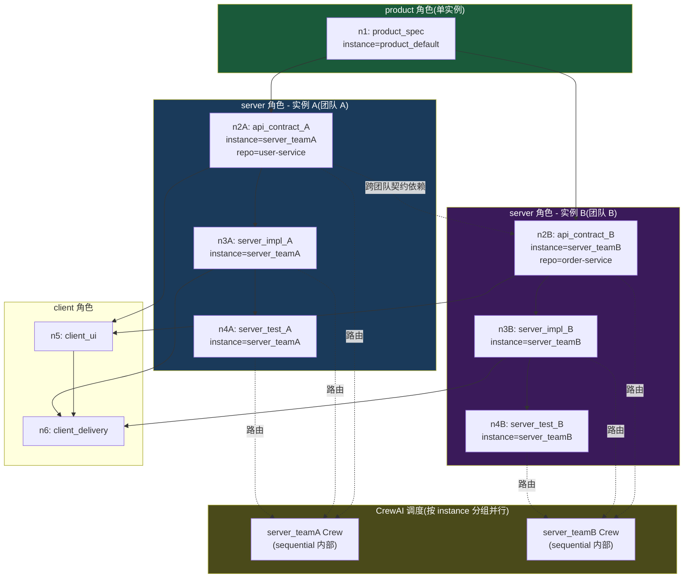
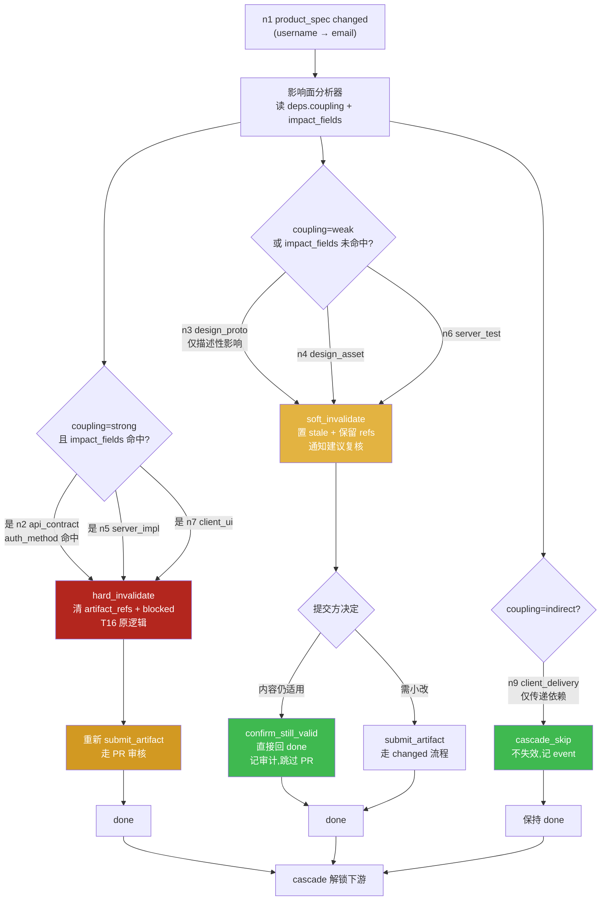
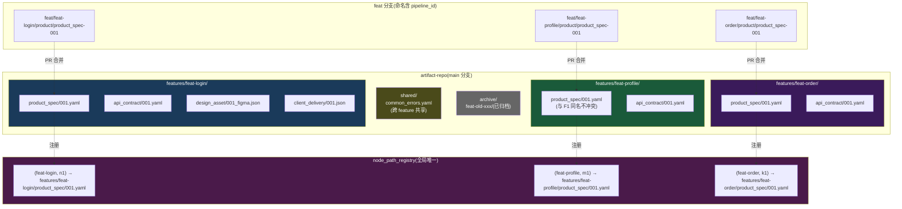
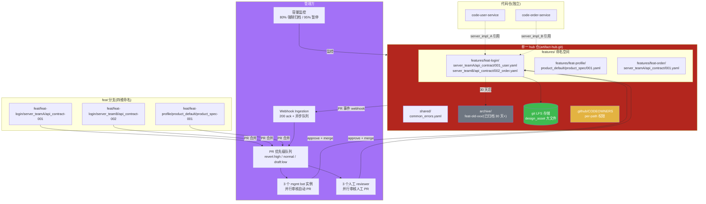

# PRD 压力测试报告:多团队协同 / 全链路回滚 / 多 Feature 并行

> **文档性质**:对《coordination-platform-prd.md》v2.0 及其深化文档(fr2-orchestration / fr3-fr5-crew-skills)的真实场景压力测试
> **版本**:v1.0 | **日期**:2026-08-04 | **状态**:架构评审输入
> **测试方法**:选取 3 个真实开发场景,逐步走查 PRD 当前设计能否承载,定位设计缺陷并提出修正方案
> **被测文档**:
> - [coordination-platform-prd.md](../coordination-platform-prd.md)(主 PRD)
> - [fr2-orchestration.md](../deep-dive/fr2-orchestration.md)(FR2 深化)
> - [fr3-fr5-crew-skills.md](../deep-dive/fr3-fr5-crew-skills.md)(FR3/FR5 深化)

---

## 0. 测试结论摘要

| 场景 | PRD 能否承载 | 核心缺陷数 | 严重度 |
|---|---|---|---|
| 场景 4:跨服务端团队接口协调 | ❌ 不能 | 7 | **高**(角色模型根本性缺失) |
| 场景 15:全链路回滚(product_spec 理解偏差) | ⚠️ 勉强能跑但代价不可控 | 6 | **高**(可能管线永远跑不完) |
| 场景 16:多 Feature 并行产物仓库分支策略 | ⚠️ 部分能跑 | 5 | **中**(规模一上来就崩) |

**总体判断**:PRD v2.0 的单 agent-per-role + 全量级联失效 + 扁平产物仓库设计,在 MVP 单 feature 单团队场景下成立,但**一旦进入真实多团队/多 feature/大规模回滚场景,会出现角色瓶颈、回滚雪崩、产物仓库污染三类系统性问题**,需在 Phase 1 实施前修正。

---

## 1. 场景 4:跨服务端团队的接口协调(角色细分)

### 1.1 场景描述

某公司用本平台开发一个电商订单功能,服务端拆成两个团队:

| 团队 | 负责服务 | 产出节点 | 依赖 |
|---|---|---|---|
| 团队 A(用户服务团队) | user-service | `api_contract_A`(用户信息查询接口) | 依赖 `product_spec` |
| 团队 B(订单服务团队) | order-service | `api_contract_B`(订单创建接口,需调用户信息) | 依赖 `product_spec` + `api_contract_A` |

两个团队的实际差异:

- **代码仓库不同**:user-service 与 order-service 是两个独立 git 仓库
- **工作流不同**:团队 A 用 trunk-based + PR,团队 B 用 git-flow + release 分支
- **开发方法论不同**:团队 A 用 DDD,团队 B 用贫血模型
- **方法论工具链不同**:团队 A 契约用 OpenSpec,团队 B 用 spec-kit
- **审批人不同**:团队 A 主管是张三,团队 B 主管是李四
- **发布节奏不同**:团队 A 每日发布,团队 B 每周发布

需求方期望:平台能同时协调两个团队,且双方契约变更能相互通知。

### 1.2 PRD 当前设计走查

#### 走查点 1:角色粒度——PRD 只有 1 个 server 角色

**引用**:
- 主 PRD §3.1 角色定义:`server` 角色产出 `api_contract / server_impl / server_test`
- 主 PRD §2.1 节点清单:`api_contract` 节点的 `role=server`
- FR3.1:`server_agent` 单个 Agent

**走查结果**:PRD 的角色模型是「角色 = 节点 type 集合」的扁平映射,1 个 server 角色对应 1 个 `server_agent`。本场景需要 2 个 server 团队,但 PRD 没有任何「角色实例化」机制——无法表达「团队 A 的 server agent」与「团队 B 的 server agent」是两个独立协调实体。

#### 走查点 2:1 个 server_agent 能否同时协调两个团队

**引用**:
- FR3.1 server_agent 的 backstory:「接口协议优先,用任意工具产出契约」
- fr3-fr5 §2.1:`server_agent` LLM 配置 Claude Sonnet 4, max_rpm=30
- fr3-fr5 §5.3 并发控制:「同角色节点串行(sequential)」「全局并发 Crew ≤ 4(每角色一个)」

**走查结果**:`server_agent` 串行处理同角色 Task,且全局只有 1 个 server Crew。本场景两个团队的 `api_contract_A` 与 `api_contract_B` 都 role=server,会被串行排队,无法并行。更严重的是:LLM 的 backstory 是单一人格,无法在「团队 A 的 DDD 方法论」与「团队 B 的贫血模型」间切换上下文——一次 kickoff 上下文混入两套方法论,agent 输出会漂移。

#### 走查点 3:DAG 能否表达「同角色节点间依赖」

**引用**:
- FR2.2 依赖 DAG 规则:「节点 `deps` 数组声明上游依赖(边由 deps 推导)」
- fr2 §7.3 节点引用完整性:`deps` 引用存在即可,不限制角色

**走查结果**:DAG 层面**能**表达——`api_contract_B.deps = ["product_spec", "api_contract_A"]` 合法,无环。问题不在 DAG,而在**调度**:`api_contract_A` 与 `api_contract_B` 都是 server 角色,FR3.2 `build_crew_for_ready_nodes` 用 `role_to_agent.get(node["role"])` 单值映射,二者会绑到同一个 `server_agent`,无法分发到不同团队实例。

#### 走查点 4:团队 A 契约变更如何通知团队 B

**引用**:
- FR2.1 状态机 T10/T16:`api_contract_A` changed → 下游 `api_contract_B` 被 T16 递归置 blocked + 清 `artifact_refs`
- FR2.5 控制节点:`notify` 节点可触发飞书/Slack 通知

**走查结果**:状态推进上,`api_contract_B` 会被自动 blocked(因为 deps 含 A)。但**通知**只能靠在 A→B 之间显式插一个 `notify` 控制节点——管线设计者得手工加。PRD 没有默认的「下游跨团队通知」机制,blocked 节点不会主动 ping 团队 B 的 channel,团队 B 可能要等到查 dashboard 才发现自己的 contract 被 blocked 了。延迟感知 = 延迟恢复。

#### 走查点 5:权限能否隔离两个团队

**引用**:
- 主 PRD §3.2 权限矩阵:`server` 角色可提交 server 类产物
- fr3-fr5 §2.4 参数级约束:`node_id` 必须属于本 agent 角色(按 `pipeline.yaml` 的 `node.role` 校验)

**走查结果**:权限只校验到 `node.role == agent.role`(都是 server),**不校验团队归属**。团队 A 的 server agent 理论上可以提交 `api_contract_B` 的产物,反之亦然。在单团队场景这是无害的,但在多团队场景会造成「团队 A 误改团队 B 的契约」事故。

#### 走查点 6:分支命名冲突

**引用**:
- FR1.2 分支保护规则:`feat` 分支命名规范 `feat/{role}/{node_type}-{seq}`
- fr3-fr5 §2.4:`branch` 命名 `feat/{role}/{node_type}-{seq}`

**走查结果**:两个团队都提交 `api_contract` 时,分支名会撞 `feat/server/api_contract-001`。即使序号不同(001 vs 002),团队 A 的 `api_contract_A` 节点和团队 B 的 `api_contract_B` 节点都映射到同一个 `api_contract` 目录,产物路径 `api_contract/001.yaml` 也会冲突(详见场景 16)。

### 1.3 设计缺陷

| # | 缺陷 | 根因 | 影响 |
|---|---|---|---|
| D4.1 | **角色无实例化机制** | PRD §3.1 角色是 type 集合,1 role = 1 agent | 多团队无法分配独立 agent,要么挤一个 agent 串行,要么手工绕过 |
| D4.2 | **同角色节点强制串行** | fr3-fr5 §5.3 「同角色节点 sequential」 | 团队 A/B 本可并行,被强行串行,管线周期翻倍 |
| D4.3 | **role_assignments 单值映射** | FR2.3 `role_assignments: dict[str, str]` node_id→agent_id 是 1:1,但 `role_to_agent` 是 role→agent 单值 | 无法把不同 team 的 server 节点路由到不同 agent 实例 |
| D4.4 | **权限不校验团队归属** | §3.2 + fr3-fr5 §2.4 只校验 role | 团队 A agent 可误操作团队 B 产物,无技术隔离 |
| D4.5 | **跨团队契约变更无主动通知** | FR2.5 notify 是可选控制节点,非默认 | 团队 B 感知 contract_A 变更滞后,blocked 节点静默等待 |
| D4.6 | **LLM backstory 单一人格** | FR3.1 server_agent backstory 固定 | 无法承载多团队方法论差异,上下文漂移 |
| D4.7 | **feat 分支命名缺 team 维度** | FR1.2 `feat/{role}/{node_type}-{seq}` | 多团队同 type 提交分支名冲突 |

### 1.4 修正方案

#### 修正 1:引入「角色实例化(Role Instance)」模型

在 PRD §3.1 角色定义之上,新增「角色实例(RoleInstance)」层:

```yaml
# pipeline.yaml 扩展
roles:
  - name: server
    instances:
      - instance_id: server_teamA
        team: user-service
        backstory_override: "团队 A 用 DDD,契约由 OpenSpec 产出"
        llm_config: { model: claude-sonnet-4, temperature: 0.2 }
        allowed_node_ids: [api_contract_A, server_impl_A, server_test_A]
        allowed_repos: [user-service-repo]
        reviewer: zhang_san
      - instance_id: server_teamB
        team: order-service
        backstory_override: "团队 B 用贫血模型,契约由 spec-kit 产出"
        llm_config: { model: claude-sonnet-4, temperature: 0.2 }
        allowed_node_ids: [api_contract_B, server_impl_B, server_test_B]
        allowed_repos: [order-service-repo]
        reviewer: li_si
```

**节点绑定 instance**:`node.instance_id` 字段(替代或补充 `node.role`)。CrewAI 调度时按 `instance_id` 而非 `role` 路由。

#### 修正 2:并发模型从「按 role 分组」改为「按 instance 分组」

```python
# 修正 fr3-fr5 §5.2
async def handle_ready_batch(events: list[ReadyEvent]):
    by_instance: dict[str, list[ReadyEvent]] = {}
    for e in events:
        by_instance.setdefault(e.instance_id, []).append(e)
    # 不同 instance 并行(团队 A 与团队 B 真并行)
    # 同 instance 内仍 sequential(避免同团队节点抢分支)
    results = await asyncio.gather(
        *[run_instance_crew(inst, evs) for inst, evs in by_instance.items()],
        return_exceptions=True,
    )
```

#### 修正 3:权限矩阵增加 team 维度

`submit_artifact` 入口校验从「`node.role == agent.role`」升级为「`node.instance_id == caller.instance_id` AND `node.allowed_repos ∋ requested_repo`」。

#### 修正 4:跨团队契约变更默认通知

在 `invalidate_node`(fr2 T16)执行时,对所有被 blocked 的下游节点,若其 `instance_id ≠ changed 节点的 instance_id`,**自动**触发跨团队通知(无需手工插 notify 节点):

```python
async def invalidate_node(state, changed_node_id):
    downstream = get_downstream_recursive(changed_node_id)
    for nid in downstream:
        if get_node(nid).instance_id != get_node(changed_node_id).instance_id:
            await notify_team(
                target_instance=get_node(nid).instance_id,
                message=f"上游 {changed_node_id} 变更,本节点 {nid} 已 blocked",
            )
```

#### 修正 5:分支命名加 instance 维度

`feat/{instance_id}/{node_type}-{seq}`,如 `feat/server_teamA/api_contract-001`。

### 1.5 设计图:角色实例化与多团队 DAG



**图示要点**:
- 同一 `server` 角色下挂两个 instance,各自独立的 Crew、LLM 配置、backstory、reviewer、repo 白名单。
- `api_contract_B` 通过 `deps` 声明对 `api_contract_A` 的跨团队契约依赖,DAG 合法。
- 团队 A 与团队 B 的 Crew 真并行,不串行排队。
- `instance_id` 是权限隔离边界:团队 A agent 调 `submit_artifact` 时,MCP 校验 `node.instance_id == agent.instance_id` 且 repo 在白名单内。

---

## 2. 场景 15:全链路回滚(product_spec 一开始就理解错了)

### 2.1 场景描述

某登录功能开发到 `client_delivery`(最后一个节点),整个 9 节点链路状态:

| 节点 | 状态 | 已投入 |
|---|---|---|
| n1 product_spec | done | 2 天 |
| n2 api_contract | done | 1 天 |
| n3 design_proto | done | 2 天 |
| n4 design_asset | done | 1 天 |
| n5 server_impl | done | 3 天 |
| n6 server_test | done | 1 天 |
| n7 client_ui | done | **5 天** |
| n8 client_func | done | 2 天 |
| n9 client_delivery | pending_review | 1 天 |

联调时发现:`product_spec` 把「用户名登录」理解错了,实际需求是「**邮箱登录**」。需要把 n1 打回重做。

**期望影响面**(工程师直觉判断):
- n1 product_spec:重写登录方式描述(小改,30 分钟)
- n2 api_contract:端点路径 `/login` 不变,但请求 schema 从 `{username}` 改 `{email}`,正则变了(小改,1 小时)
- n3 design_proto:登录页 UI 基本不变,输入框 placeholder 改一下(微调,15 分钟)
- n4 design_asset:输入框标注改 placeholder 文案(微调,15 分钟)
- n5 server_impl:登录逻辑里 username 查询改 email 查询(小改,1 小时)
- n6 server_test:测试用例改数据(小改,30 分钟)
- n7 client_ui:输入框校验正则改 + placeholder(小改,30 分钟)
- n8 client_func:联调用例改数据(小改,30 分钟)
- n9 client_delivery:重新跑联调(小改,1 小时)

**实际总工作量约 5 小时**,但 PRD 当前设计会触发什么?

### 2.2 PRD 当前设计走查

#### 走查点 1:changed 级联是「全量失效」

**引用**:
- 主 PRD FR2.2 DAG 规则:「级联失效:节点 `changed` → 所有下游产物引用清除 + 置 `blocked`(递归)」
- fr2 §2.1 T16:「下游 cascade 失效(上游 changed 递归)... 清 `artifact_refs[nid]`,清 `pending_prs[nid]`... 发 `INVALIDATED` event」
- fr2 §3.2 锁机制:`invalidate_node` 递归抢下游锁,按拓扑序

**走查结果**:n1 changed → n2/n3/n4/n5/n6/n7/n8/n9 **全部** 递归 blocked + `artifact_refs` 全部清空。无论下游对 n1 的依赖是「强耦合」还是「弱耦合」,一律全量失效。本场景实际只有 n2/n5/n7 的 schema 强依赖 n1 的字段,n3/n4/n6/n8/n9 只是间接影响,但 PRD 不区分。

#### 走查点 2:清引用后,代码还在代码仓库怎么办

**引用**:
- 主 PRD §5.1 ArtifactRef:`node_id / repo / path / commit / toolspec_framework / trace_id`,管理方只持引用不持内容
- T16 清 `artifact_refs[nid]`:引用被清

**走查结果**:n7 client_ui 的 `artifact_refs["n7"]` 被清,但客户端代码仓库的 commit 还在(git 不可变历史)。问题:重新 ready 后,agent 是基于旧 commit 修改,还是从头提交?PRD 没说。`submit_artifact` 只接受新 commit(T10 guard:`新 commit ≠ 旧 commit`),但旧引用已清,agent 无法 `get_dependencies` 拿到旧实现做 diff——agent 上下文丢失「之前写了什么」,只能让人员手工指认旧 commit。

#### 走查点 3:有无「增量失效」或「影响面评估」

**引用**:
- fr2 §2.1 T16:无影响面评估逻辑
- fr2 §8 控制节点边界:gate/approval/fork/switch/notify 均无 impact analysis
- fr3-fr5 §6 skill.yaml:无 dependency_coupling_strength 字段

**走查结果**:**完全没有**。PRD 的级联是「拓扑可达即失效」,不区分:
- 强依赖(字段级 schema 变更,下游必改)
- 弱依赖(描述性变更,下游可能不用改)
- 无依赖(下游产物虽拓扑可达,但实际未引用变更字段)

#### 走查点 4:能否「恢复旧引用」而非从头提交

**引用**:
- fr2 §10 事件溯源:`events` 表 append-only,可回放重建 state
- T16 副作用:清 `artifact_refs[nid]` 是 state 修改,会发 `INVALIDATED` event

**走查结果**:事件流能查到「n7 之前 done 时 artifact_refs 是 commit X」,但 PRD 没有提供「恢复旧引用」的 MCP 工具或状态转移。已 blocked 节点的恢复路径只有一条:重新 ready → 重新 submit_artifact(新 commit)→ 重新 pending_review → 重新 approve_pr。即使产物内容一字不改,也得走完整审核流。

#### 走查点 5:级联后下游能否「并行恢复」

**引用**:
- fr2 §9.4 dispatch_router_fn:`ready_nodes` 多个时返回 `list[Send]` 并行 fan-out
- FR2.2 级联解锁:「节点 done → 检查所有下游,依赖全满足的下游置 ready」

**走查结果**:理论上下游可并行 ready,但**依赖链是串行瓶颈**。本场景:
- n1(新)done → n2 ready(n2 deps=[n1])→ n2 done → n5 ready(n5 deps=[n2])
- n1(新)done → n3 ready → n3 done → n4 ready → n4 done → n7 ready(n7 deps=[n2,n4])
- n7 done → n8 ready → n8 done → n9 ready

即使每个节点 1 小时,关键路径 n1→n2→n5 + n1→n3→n4→n7→n8→n9 ≈ 5 小时,且 n2/n5 串行、n3/n4 串行。原本 5 小时工作量,因串行依赖拉到至少 8 小时。更糟的是,每一步都要走 PR 审核(approve_pr 合并),每次审核 ~30 分钟,9 节点 × 30min = 4.5 小时额外开销。

#### 走查点 6:大规模回滚成本 PRD 有无评估

**引用**:
- fr3-fr5 §2.3 Cost 控制:单 Task ≤ 10k token,单 Agent/日 ≤ $5,管线级 ≤ $50
- NFR 系列:无「回滚成本」相关 NFR

**走查结果**:**无评估**。本场景 9 节点重新 submit + 9 次 PR 审核 + 9 次 LLM 调用,按 Sonnet 4 单次 ~5k token 估算:
- LLM token:9 × 5k × $3/Mtok ≈ $0.135(看起来不贵)
- 但**人工成本**:9 次人员重新介入(每次 30min~1h),约 6-9 人时
- **时间成本**:关键路径 8h + 审核 4.5h ≈ 12.5h,且需要人员全程在场响应 ready 事件
- **隐性成本**:管线停滞期间,依赖该 feature 的其他工作全部阻塞

如果回滚发生在更大管线(20+ 节点),关键路径可能 2-3 天,管线「永远跑不完」概率显著上升。

### 2.3 设计缺陷

| # | 缺陷 | 根因 | 影响 |
|---|---|---|---|
| D15.1 | **全量级联失效,无影响面评估** | T16 拓扑可达即失效 | 实际只需小改的下游被强制重做,工作量放大 5-10x |
| D15.2 | **清引用丢失下游上下文** | T16 清 `artifact_refs[nid]` | agent 无法 `get_dependencies` 拿旧实现,只能人员手工指认 |
| D15.3 | **无「恢复旧引用」路径** | state 转移只有重新 submit 一条路 | 内容不变的节点也得重走 PR 审核,审核成本叠加 |
| D15.4 | **DAG 依赖无耦合强度标注** | skill.yaml / node 定义无 coupling 字段 | 无法区分强/弱/无依赖,级联一刀切 |
| D15.5 | **关键路径串行瓶颈** | 依赖链拓扑序 + 每步 PR 审核 | 大规模回滚关键路径过长,可能数天 |
| D15.6 | **回滚成本未纳入 NFR** | 非功能需求无回滚预算 | 无阈值告警,管线 silently 跑不完 |

### 2.4 修正方案

#### 修正 1:节点依赖增加「耦合强度(coupling)」标注

扩展 `pipeline.yaml` 节点 deps 结构:

```yaml
nodes:
  - id: n2
    type: api_contract
    deps:
      - node_id: n1
        coupling: strong        # strong | weak | none
        impact_fields: [auth_method, user_identifier]  # n1 中影响本节点的字段
  - id: n3
    type: design_proto
    deps:
      - node_id: n1
        coupling: weak           # 设计只受需求描述影响,字段级无强绑
  - id: n9
    type: client_delivery
    deps:
      - node_id: n1
        coupling: indirect       # 间接依赖,仅传递性影响
```

#### 修正 2:级联失效改为「分级失效」

将 T16 拆为三种失效级别:

| 失效级别 | 触发条件 | 副作用 |
|---|---|---|
| **hard_invalidate**(原 T16) | `coupling=strong` 且 `impact_fields` 命中变更字段 | 清 `artifact_refs` + 置 blocked + 通知 |
| **soft_invalidate**(新增) | `coupling=weak` 或 `impact_fields` 未命中 | 置 `stale`(新状态)+ 保留 `artifact_refs` + 通知「建议复核」 |
| **cascade_skip**(新增) | `coupling=indirect/none` | 不失效,仅记录 `CASCADE_SKIPPED` event |

新增状态 `stale`:表示「产物可能过期但引用仍有效,提交方可选择复核或确认仍适用」。`stale` 节点可:
- 调 `confirm_still_valid` 工具 → 直接回 done(不走 PR 审核,但记审计)
- 或调 `submit_artifact` 提交新版本 → 走正常 changed 流程

#### 修正 3:提供「恢复旧引用」工具

新增 MCP 工具 `restore_artifact_ref`:

```json
{
  "name": "restore_artifact_ref",
  "description": "恢复被级联失效清除的旧产物引用(适用于内容仍适用的下游)",
  "inputSchema": {
    "type": "object",
    "properties": {
      "node_id": {"type": "string"},
      "reason": {"type": "string", "description": "为何恢复(审计用)"}
    },
    "required": ["node_id", "reason"]
  }
}
```

内部实现:从 `events` 表回放找到该 node 最后一次 `DONE` event 的 `artifact_ref`,写回 `artifact_refs[nid]`,状态 blocked→done(跳过 PR 审核,但强制记审计 + 触发下游 cascade 解锁)。**前提**:上游变更已确认不影响本节点(由 `coupling` + `impact_fields` 判定,或人工签字)。

#### 修正 4:回滚成本 NFR

新增 NFR:

| 编号 | 需求 |
|---|---|
| NFR21 | 单次 changed 级联的 LLM token 消耗 ≤ $1(避免回滚 token 失控) |
| NFR22 | 9 节点管线全量回滚的关键路径恢复时间 ≤ 4h(含审核) |
| NFR23 | 回滚影响节点数 > 总节点数 60% 时,自动告警并建议「重建管线」而非「逐节点恢复」 |

#### 修正 5:并行恢复策略

对 `stale` 状态节点(修正 2),允许批量 `confirm_still_valid`(一次 MCP 调用传多个 node_id),内部用 LangGraph Send API 并行处理,绕过串行 PR 审核瓶颈。

### 2.5 设计图:全链路回滚的增量失效流程



**图示要点**:
- changed 触发后,先跑「影响面分析器」,按 `deps.coupling` + `impact_fields` 分流。
- 强依赖走原 T16 hard_invalidate(全量失效)。
- 弱依赖走新增 soft_invalidate(stale 状态,保留引用,可恢复)。
- 间接依赖走 cascade_skip(不失效)。
- `stale` 节点可 `confirm_still_valid` 直接回 done,绕过串行 PR 审核瓶颈。
- 本场景预期:n2/n5/n7 hard(3 节点重做),n3/n4/n6 soft(3 节点快速确认),n9 skip,n1 重做 + n8 跟随 n7。关键路径从 12.5h 降到 ~4h。

---

## 3. 场景 16:产物仓库分支策略与多 Feature 并行

### 3.1 场景描述

同一时期平台上有 3 个 feature 并行开发:

| Feature | pipeline_id | 涉及节点 |
|---|---|---|
| 登录功能 | `feat-login` | n1..n9(9 节点) |
| 用户中心 | `feat-profile` | m1..m7(7 节点) |
| 订单列表 | `feat-order` | k1..k8(8 节点) |

3 个 feature 都需要往**同一个产物仓库**提交产物。预期产物仓库 main 分支上能看到所有 feature 的产物,且互相不污染。

### 3.2 PRD 当前设计走查

#### 走查点 1:feat 分支命名是否冲突

**引用**:
- FR1.2:`feat` 分支命名规范 `feat/{role}/{node_type}-{seq}`
- fr3-fr5 §2.4:`branch` 命名 `feat/{role}/{node_type}-{seq}`

**走查结果**:三个 feature 都有 `product_spec` 节点,都 role=product,seq 都从 001 起。分支名会撞:`feat/product/product_spec-001` 在产物仓库全局唯一,三个 feature 无法各开各的分支。即使加 `feat/product/product_spec-001-login`、`-profile`、`-order` 后缀,PRD 没有命名规范约束,靠人自觉不可靠。

#### 走查点 2:产物路径冲突

**引用**:
- FR1.1 仓库结构:`product_spec/001.yaml`、`api_contract/001.yaml` 按类型分目录,序号前缀
- fr2 §4.2:`node_path_registry(pipeline_id, node_id, artifact_path)`,`UNIQUE(pipeline_id, artifact_path)`

**走查结果**:`node_path_registry` 的 UNIQUE 是 `(pipeline_id, artifact_path)` 组合唯一——**同 pipeline 内**路径不冲突,但**跨 pipeline**(跨 feature)路径可以重复。三个 feature 都提交 `product_spec/001.yaml` 到 main 分支,git 层面:
- feat-login 的 PR 合并 `product_spec/001.yaml`
- feat-profile 的 PR 也想合并 `product_spec/001.yaml` → git merge 冲突(同 path 不同内容)
- feat-order 同理

PRD 的路径注册表防了同 pipeline 冲突,没防跨 pipeline 冲突。

#### 走查点 3:main 分支上多 feature 产物如何区分归属

**引用**:
- FR1.1:目录结构按产物类型分,无 feature 维度
- FR6.5 审计日志:`node_id / pipeline_id` 有记录,但产物文件本身不携带

**走查结果**:main 分支上 `product_spec/001.yaml` 到底属于哪个 feature?只能查审计日志反查 `node_id → pipeline_id`。文件内容里 PRD 模板有 `node_id` 字段,但 node_id 是 pipeline 内的,跨 pipeline 可能重复(n1 在三个 feature 里都存在)。**产物文件无法自证归属**。

#### 走查点 4:有无 feature 命名空间机制

**引用**:
- FR1.1 仓库结构:无 feature 目录
- FR1.2 分支保护:无 feature 前缀规范
- fr2 §4.2 路径冲突处理:仅 `(pipeline_id, artifact_path)` 唯一

**走查结果**:**完全没有**。PRD 的产物仓库是「按类型扁平分目录」的单命名空间,多 feature 并行时必然路径冲突。

#### 走查点 5:产物仓库膨胀

**引用**:
- FR1.1:所有产物进一个 git 仓库
- NFR:无仓库容量/clone 性能相关需求

**走查结果**:3 个 feature × 平均 8 节点 = 24 个产物文件,看似不大。但放大到真实场景:100 个 feature/年 × 8 产物 = 800 文件/年,5 年 4000 文件。git clone 时间线性增长,且每次 clone 拉全量历史。PRD 无 git LFS / 浅克隆 / 分库策略。

### 3.3 设计缺陷

| # | 缺陷 | 根因 | 影响 |
|---|---|---|---|
| D16.1 | **feat 分支命名无 feature 维度** | FR1.2 `feat/{role}/{node_type}-{seq}` | 多 feature 同 type 分支名冲突 |
| D16.2 | **产物路径跨 feature 冲突** | fr2 §4.2 UNIQUE 仅 `(pipeline_id, path)` | 同 path 不同 feature 的 PR 互撞,合并冲突 |
| D16.3 | **main 分支产物无 feature 归属** | 产物文件不携带 pipeline_id | 无法从文件本身判断归属,审计反查成本高 |
| D16.4 | **无 feature 命名空间** | FR1.1 扁平按类型分目录 | 多 feature 产物混在 main,污染 |
| D16.5 | **产物仓库无容量治理** | 无 LFS / 浅克隆 / 分库策略 | 仓库膨胀,clone 越来越慢 |

### 3.4 修正方案

#### 修正 1:产物仓库引入 feature 命名空间(目录隔离)

调整 FR1.1 仓库结构:

```
artifact-repo/
├─ features/
│  ├─ feat-login/                    # feature 命名空间
│  │  ├─ product_spec/001.yaml
│  │  ├─ api_contract/001.yaml
│  │  ├─ api_contract/002.yaml       # 多个 api_contract 仍按序号
│  │  ├─ design_asset/001_figma.json
│  │  └─ client_delivery/001.json
│  ├─ feat-profile/
│  │  └─ product_spec/001.yaml       # 跨 feature 不冲突(不同命名空间)
│  └─ feat-order/
│     └─ product_spec/001.yaml
├─ shared/                           # 跨 feature 共享产物(如通用错误码契约)
│  └─ api_contract/common_errors.yaml
└─ .github/pull_request_template.md
```

**路径规范**:`features/{pipeline_id}/{node_type}/{seq}.{ext}`

#### 修正 2:分支命名加 pipeline_id 维度

`feat/{pipeline_id}/{role}/{node_type}-{seq}`,如 `feat/feat-login/product/product_spec-001`。

#### 修正 3:node_path_registry 升级为全局唯一

```sql
-- 修改 fr2 §6.1 schema
CREATE TABLE node_path_registry (
    pipeline_id TEXT NOT NULL,
    node_id TEXT NOT NULL,
    artifact_path TEXT NOT NULL,          -- 含 features/{pipeline_id}/ 前缀
    commit TEXT NOT NULL,
    registered_at TIMESTAMPTZ NOT NULL DEFAULT now(),
    PRIMARY KEY (pipeline_id, node_id),
    UNIQUE (artifact_path)                -- 改为全局唯一(去掉 pipeline_id 组合)
);
```

校验时:`artifact_path` 必须以 `features/{pipeline_id}/` 开头(强约束 feature 命名空间)。

#### 修正 4:产物文件强制携带 feature 元数据

扩展 PR1.3 PR 模板:

```yaml
node_id: n1
node_type: product_spec
role: product
pipeline_id: feat-login              # 必填,feature 命名空间标识
artifact:
  path: features/feat-login/product_spec/001.yaml   # 含命名空间
```

产物文件 header 也建议带 `pipeline_id` 字段(YAML front matter / JSON 顶层字段),实现「文件自证归属」。

#### 修正 5:仓库容量治理策略

| 策略 | 适用阶段 | 实现 |
|---|---|---|
| 浅克隆(`--depth 1`) | agent 拉产物内容 | MCP `get_dependencies` 内部 `git clone --depth 1` |
| git LFS | 设计稿/标注大文件 | `design_asset/*.json` 超 512KB 走 LFS |
| feature 归档 | feature 已交付且超 6 个月 | `features/feat-xxx/` 移到 `archive/feat-xxx/`(独立分支或独立仓库) |
| 分库(长期) | 仓库超 5GB | 按 feature 维度拆子仓库,主仓库仅存索引 |

新增 NFR:

| 编号 | 需求 |
|---|---|
| NFR24 | 产物仓库 clone `--depth 1` 时间 ≤ 10s(单 feature 命名空间) |
| NFR25 | feature 交付超 6 个月自动归档,main 分支仅保留活跃 feature |

### 3.5 设计图:产物仓库多 feature 命名空间



**图示要点**:
- 三个 feature 各有独立命名空间目录 `features/{pipeline_id}/`,内部产物路径自由(001.yaml 互不冲突)。
- feat 分支命名含 `pipeline_id`,全局唯一,不撞。
- `node_path_registry` 的 `artifact_path` 全局唯一(含命名空间前缀),跨 feature 不冲突。
- `shared/` 放跨 feature 共享产物(如通用错误码契约),多 feature 共同依赖。
- `archive/` 归档已交付 feature,控制 main 分支体积。

---

## 4. 缺陷汇总表

| 场景 | 缺陷 ID | 缺陷描述 | 严重度 | 影响章节 | 修正方案 |
|---|---|---|---|---|---|
| 场景 4 | D4.1 | 角色无实例化机制,1 role = 1 agent | **高** | §3.1, FR3.1 | 引入 RoleInstance 模型,server 角色可多实例 |
| 场景 4 | D4.2 | 同角色节点强制 sequential,多团队无法并行 | **高** | fr3-fr5 §5.3 | 改为按 instance 分组并行 |
| 场景 4 | D4.3 | role_assignments 单值映射,无法路由到不同实例 | **高** | FR2.3 | 节点增 instance_id 字段,按 instance 路由 |
| 场景 4 | D4.4 | 权限不校验团队归属,跨团队可误操作 | **高** | §3.2, fr3-fr5 §2.4 | 权限校验升级到 instance + repo 白名单 |
| 场景 4 | D4.5 | 跨团队契约变更无主动通知,blocked 静默 | 中 | FR2.5 | invalidate_node 自动跨 instance 通知 |
| 场景 4 | D4.6 | LLM backstory 单一人格,无法承载多方法论 | 中 | FR3.1 | instance 级 backstory_override |
| 场景 4 | D4.7 | feat 分支命名缺 team 维度,分支冲突 | 中 | FR1.2 | `feat/{instance_id}/{type}-{seq}` |
| 场景 15 | D15.1 | 全量级联失效,无影响面评估,工作量放大 5-10x | **高** | FR2.2, fr2 §2.1 T16 | 分级失效 hard/soft/skip |
| 场景 15 | D15.2 | 清引用丢失下游上下文,agent 无法 get_dependencies | **高** | fr2 T16 | 旧引用保留在 events,提供查询工具 |
| 场景 15 | D15.3 | 无「恢复旧引用」路径,内容不变的节点也得重走审核 | **高** | 状态机 T16 | 新增 restore_artifact_ref MCP 工具 |
| 场景 15 | D15.4 | DAG 依赖无耦合强度标注,无法区分强/弱/无 | **高** | FR2.2, fr3-fr5 §6 | deps 增 coupling + impact_fields |
| 场景 15 | D15.5 | 关键路径串行瓶颈 + 每步 PR 审核,大规模回滚数天 | **高** | FR2.2, FR6 | stale 节点批量 confirm,绕过审核 |
| 场景 15 | D15.6 | 回滚成本未纳入 NFR,无阈值告警 | 中 | §7 | 新增 NFR21-23 |
| 场景 16 | D16.1 | feat 分支命名无 feature 维度,分支冲突 | 中 | FR1.2 | `feat/{pipeline_id}/{role}/{type}-{seq}` |
| 场景 16 | D16.2 | 产物路径跨 feature 冲突,UNIQUE 仅 pipeline 内 | **高** | fr2 §4.2 | 路径含 `features/{pipeline_id}/` 前缀,全局唯一 |
| 场景 16 | D16.3 | main 分支产物无 feature 归属,审计反查成本高 | 中 | FR1.1, FR6.5 | 产物文件强制带 pipeline_id 元数据 |
| 场景 16 | D16.4 | 无 feature 命名空间,多 feature 产物混在 main | **高** | FR1.1 | `features/{pipeline_id}/` 目录隔离 |
| 场景 16 | D16.5 | 产物仓库无容量治理,clone 越来越慢 | 中 | NFR | 浅克隆 + LFS + 归档 + 分库,NFR24-25 |

---

## 5. 修正优先级建议

按「实施成本 × 缓解价值」排序,建议在 Phase 1 MVP 前落实以下修正(否则后续返工成本高):

| 优先级 | 修正项 | 实施阶段 | 理由 |
|---|---|---|---|
| **P0** | D16.4 feature 命名空间 + D16.2 路径全局唯一 | Phase 1 | 产物仓库结构一旦上线有数据,迁移成本极高 |
| **P0** | D4.1 角色实例化模型 + D4.3 instance_id 路由 | Phase 1 | 角色模型是状态机/CrewAI/权限的基础,后改影响面大 |
| **P0** | D15.4 耦合强度标注 + D15.1 分级失效 | Phase 1 | 级联逻辑一旦写成全量,后续改回分级要动状态机和 T16 |
| **P1** | D15.3 restore_artifact_ref 工具 + D15.5 stale 批量恢复 | Phase 2 | 依赖分级失效落地,可在 MVP 后补 |
| **P1** | D4.4 instance 级权限 + D4.5 跨团队通知 | Phase 2 | MVP 单团队可暂缓,多团队上线前必做 |
| **P2** | D16.5 容量治理(LFS/归档/分库) | Phase 3 | 仓库未膨胀前可延后 |
| **P2** | D15.6 回滚成本 NFR | Phase 2 | 需先有分级失效才能合理估算回滚成本 |

---

## 6. 与主 PRD / 深化文档的对齐说明

本报告发现的缺陷均**不与 PRD v2.0 现有设计冲突**,而是**补充未覆盖场景**:

| 缺陷类 | 与 PRD 关系 |
|---|---|
| 角色实例化(D4.x) | 扩展 §3.1 角色模型,不破坏现有 4 角色 |
| 分级失效(D15.x) | 扩展 fr2 T16,新增 `stale` 状态与 T16 并存 |
| feature 命名空间(D16.x) | 扩展 FR1.1 仓库结构,不破坏现有分支保护逻辑 |

建议将本报告作为 PRD v2.1 评审输入,修正方案落地后回写主 PRD 与对应深化文档。

---

**报告结束。** 共定位 18 项设计缺陷(7+6+5),提出 18 项修正方案,含 3 张 Mermaid 设计图(角色实例化多团队 DAG / 全链路回滚增量失效 / 产物仓库多 feature 命名空间)。

---

## 第三部分:基于需求 9(产物自由)+ 单一 hub 仓模型的重新走查(第三轮)

> **重新走查背景**:第二轮压力测试后,产物仓库模型从"多产物仓库 + RepoRegistry"修正为**单一 hub 仓 + 多代码仓**(详见主 PRD 附录 D7 与场景 A14)。同时需求 9"产物完全自由、设计只提供 figma 链接、客户端/服务端开发不限制方式、产物由各端自己定义和演进"被进一步明确。本部分在新模型下重新走查场景 4 / 15 / 16,评估原修正方案是否仍然成立,以及新设计引入的张力。
>
> **核心张力**:单一 hub 仓是"信息同步枢纽"(各端共同提交、集中编排),但需求 9 要求"各端自由定义产物"——集中与自由在多团队 / 全链路回滚 / 多 Feature 并行三个场景下产生新的设计缺陷。

### 3.1 场景 4 重新走查:多团队往单一 hub 仓提交的角色实例化与分支隔离

#### 3.1.1 旧结论回顾

第一轮走查定位 7 项缺陷(D4.1-D4.7),核心结论:

- **角色无实例化机制**(D4.1):1 role = 1 agent,无法表达团队 A/B 两个独立 server agent
- **同角色节点强制 sequential**(D4.2):两团队 api_contract 被串行排队
- **role_assignments 单值映射**(D4.3):无法路由到不同团队实例
- **权限不校验团队归属**(D4.4):团队 A agent 可误操作团队 B 产物
- **跨团队契约变更无主动通知**(D4.5):blocked 节点静默等待
- **LLM backstory 单一人格**(D4.6):无法承载多团队方法论差异
- **feat 分支命名缺 team 维度**(D4.7):分支名冲突

原修正方案:引入 RoleInstance 模型 + `instance_id` 路由 + 按 instance 分组并行 + instance 级权限校验 + 跨 instance 自动通知 + `feat/{instance_id}/{node_type}-{seq}` 分支命名。

#### 3.1.2 新设计影响

**走查点 1:单一 hub 仓 vs 多团队提交——分支命名空间全局化**

引用:
- 主 PRD 附录 D7:产物仓库采用单一 hub 仓,各端共同提交
- 主 PRD §5.1 `ArtifactRef.repo`:指向 hub 仓(单一 string)
- 场景 A14 §2.4 修正 4:权限校验从"角色→仓库"改为"角色→node_type"(因只有一个 hub 仓)

走查结果:原 D4.7 修正方案 `feat/{instance_id}/{node_type}-{seq}` 在单一 hub 仓下**仍然不够**。hub 仓是全局命名空间,3 个 feature × 2 团队 = 6 个 instance 同时提 feat 分支,若两个 feature 都有 `server_teamA` instance,分支名 `feat/server_teamA/api_contract-001` 跨 feature 仍会撞。修正方案需扩展为 `feat/{pipeline_id}/{instance_id}/{node_type}-{seq}`(同时含 pipeline_id 与 instance_id 两个维度)。

**走查点 2:代码仓独立——引用型产物的 external_repo 归属未校验**

引用:
- 主 PRD §5.1 `ArtifactRef`:`external_repo: str | None`(引用型指向代码仓)
- 场景 A14 §2.4 修正 5:`ArtifactStore.verify_external_ref` 仅做 `git ls-remote` 存在性校验
- fr3-fr5 §2.4 权限矩阵:`submit_artifact` 校验 `node_id` 归属 + `node_type` 白名单

走查结果:新设计引入"引用型产物"指向代码仓 commit,但 `verify_external_ref` 只校验 commit 存在性,**不校验提交方是否有权引用该代码仓**。本场景团队 A 的 server_agent 可提交 `server_impl_A` 指向团队 B 的 `code-order-service` 仓 commit——管理方无技术隔离。原 D4.4 修正方案"`allowed_repos` 白名单"在单一 hub 仓下退化为"node_type 白名单",丢失了团队→代码仓的归属校验维度。

**走查点 3:权限模型从"角色→仓库"改为"角色→node_type"——团队粒度丢失**

引用:
- 场景 A14 §2.4 修正 4:`authorize_submit(caller_role, node_type)` 只校验角色只能提交本端 node_type
- fr3-fr5 §2.4:`server_agent` 可提交 `{api_contract, server_impl, server_test}`

走查结果:新权限模型解决了"design 越权提 api_contract"问题,但**无法区分团队 A 的 server_agent 与团队 B 的 server_agent**——两者都是 `server` 角色,都能提交 `api_contract`。本场景团队 A 的 server_agent 理论上可提交 `api_contract_B` 节点(只要 node.role==server)。原 D4.4 的 `allowed_repos` 在单一 hub 仓下失效(只有一个仓),需要新的团队隔离机制。

**走查点 4:跨团队契约依赖在 hub 仓内——get_dependencies 简化但通知仍缺失**

引用:
- 场景 A14 §2.4 修正 5:`ArtifactStore.get_content` 只从 hub 仓 mirror git show(单仓库,无跨仓)
- fr2 §2.1 T16:`api_contract_A` changed → 下游 `api_contract_B` 递归 blocked + 清 artifact_refs

走查结果:**好消息**:跨团队契约依赖(`api_contract_B.deps = [api_contract_A]`)在 hub 仓内,`get_dependencies` 只需单仓库 clone,简化了原 D4.x 走查点 4 的"跨仓库 clone"问题。**坏消息**:T16 仍然只把下游置 blocked + 清引用,**不发跨团队通知**。团队 B 的 server_agent 要等到查 dashboard 才发现 `api_contract_B` 被 blocked——原 D4.5 跨团队通知缺失问题**未因 hub 仓而自动解决**。

**走查点 5:多团队 seq 分配原子性——并发提交同 node_type 序号冲突**

引用:
- 场景 A14 §2.4 修正 1:HubRepoConfig.directory_layout.pattern = `features/{pipeline_id}/{node_type}/{seq}_{slug}.{ext}`
- fr2 §4.2:`node_path_registry` UNIQUE(pipeline_id, artifact_path)

走查结果:目录模式 `features/{pipeline_id}/api_contract/{seq}_{slug}.yaml` 中,`seq` 是序号位(001/002/...)。本场景同一 pipeline 内团队 A 提交 `api_contract_A`(user-service 契约)、团队 B 提交 `api_contract_B`(order-service 契约),两者 node_type 都是 `api_contract`。若两团队并发提交,seq 分配无原子性保障——团队 A 拿 001、团队 B 也想拿 001,路径 `features/login/api_contract/001_user.yaml` vs `001_order.yaml` 不冲突(slug 不同),但 `node_path_registry` 的 PRIMARY KEY 是 `(pipeline_id, node_id)`,seq 序号本身无注册表约束,导致序号混乱(团队 A 自报 001,团队 B 也自报 001,main 分支出现两个 001_* 文件,排序混乱)。

#### 3.1.3 需求 9 张力

**张力 1:多团队方法论不同,产物都往单一 hub 仓提交,管理方如何中立审核**

- 团队 A 用 OpenSpec(产出 YAML schema),团队 B 用 spec-kit(产出 JSON)
- 两者 `toolspec_framework` 不同,但都进 hub 仓 `features/{pipeline_id}/api_contract/`
- 管理方 skill `api-contract-skill` 的 `required_fields`(title/version/source/toolspec.framework)是元数据约束,中立 ✓
- **但** `file_constraints.allowed_extensions: [.yaml, .yml, .json]` 限制了扩展名——若某团队方法论用 `.toml` 或自定义 `.apicontract` 扩展名,被 CI 拒绝,违反需求 9"产物完全自由"
- 需求 9 要求产物自由定义,但 skill file_constraints 是格式约束,二者张力明显

**张力 2:产物自由定义,多团队产物命名/目录如何避免冲突**

- 需求 9:"产物怎么定义,由各端自己定义和演进"
- 但单一 hub 仓是共享资源,多团队自由定义产物名/目录会冲突
- 当前 `features/{pipeline_id}/{node_type}/{seq}_{slug}.{ext}` 模式:slug 由提交方自定,两团队可能都叫 `login_contract`,导致 `001_login_contract.yaml` 路径冲突
- 需要在"自由"与"不冲突"间找平衡:slug 可自由,但 seq + slug 组合必须全局唯一

**张力 3:代码仓完全独立,引用型产物只校验 commit 存在性,跨团队代码依赖如何追溯**

- 需求 9:"客户端和服务端开发怎么开发也不需要限制"
- 代码仓完全独立(user-service 仓 / order-service 仓),server_impl 只存 hub 仓引用 + `git ls-remote` 校验
- 跨团队代码依赖:order-service 代码调 user-service API,若 user-service 代码 break,order-service 受影响
- 但管理方只看 hub 仓引用(user-service 的 server_impl_A → code-user-service commit X),无法感知 code-user-service commit X 之后的代码变更
- 跨团队代码依赖追溯链断在代码仓边界——管理方视野仅限 hub 仓

#### 3.1.4 新发现的设计缺陷

| # | 缺陷 | 根因 | 影响 | 严重度 |
|---|---|---|---|---|
| **D4-R3.1** | HubRepoConfig 缺 `branch_naming` 字段,多团队/多 feature feat 分支在 hub 仓全局冲突 | 场景 A14 修正 1 只定义 directory_layout,未定义 branch_naming;原 D4.7 修正 `feat/{instance_id}/...` 未含 pipeline_id | 6 个 instance × 3 feature 的 feat 分支互相撞,PR 误合并风险 | **高** |
| **D4-R3.2** | 引用型产物 `external_repo` 无归属校验,团队 A 可提交指向团队 B 代码仓的引用 | `ArtifactStore.verify_external_ref` 只做 `git ls-remote` 存在性,不校验提交方对代码仓的引用权 | 跨团队代码仓越权引用,安全隔离破坏;团队 A 误引 team B 私有代码 commit | **高** |
| **D4-R3.3** | 权限从"角色→仓库"退化为"角色→node_type",丢失团队粒度 | 场景 A14 修正 4 因单仓而简化权限,但多团队同 role 同 node_type 仍可互相误操作 | 团队 A server_agent 可提交 `api_contract_B` 节点(node.role==server 即可),无技术隔离 | **高** |
| **D4-R3.4** | hub 仓 seq 分配无原子性,多团队并发提交同 node_type 序号冲突 | directory_layout 用 `{seq}` 占位但无集中 seq 分配器;`node_path_registry` 不约束 seq | main 分支出现多个 `001_*` 文件,序号混乱,追溯困难 | **高** |
| **D4-R3.5** | 跨团队契约变更通知在 hub 仓模型下仍未补齐 | T16 仍只置 blocked + 清引用,不主动通知下游 instance;A14 未引入跨 instance 通知 | 团队 B 感知 `api_contract_A` 变更滞后,blocked 节点静默等待(原 D4.5 在新设计下未解决) | 中 |
| **D4-R3.6** | skill `file_constraints.allowed_extensions` 限制扩展名,违反需求 9 方法论中立 | fr3-fr5 §6.2 api-contract-skill 限定 `[.yaml, .yml, .json]`;自定义方法论格式被 CI 拒绝 | 团队采用 `.toml` / `.apicontract` 等扩展名被拒,被迫改造方法论工具链 | 中 |
| **D4-R3.7** | 多团队方法论差异(DDD vs 贫血)未在 ArtifactRef 记录,agent 上下文丢失 | `toolspec_framework` 只记录工具(OpenSpec/spec-kit),不记录方法论;原 D4.6 修正 backstory_override 未落地 | server_agent 处理团队 A/B 节点时上下文漂移,LLM 输出方法论混淆 | 低 |

#### 3.1.5 修正方案

**修正 1:HubRepoConfig 增加 `branch_naming` 字段(四维命名)**

```yaml
# config/hub-repo.yaml 扩展
hub_repo:
  url: git@gitlab.internal:platform/artifact-hub.git
  provider: gitlab
  directory_layout:
    version: 2
    pattern: "features/{pipeline_id}/{node_type}/{seq}_{slug}.{ext}"
  branch_naming:                       # 新增
    version: 2
    pattern: "feat/{pipeline_id}/{instance_id}/{node_type}-{seq}"
    # 示例:feat/login/server_teamA/api_contract-001
    # 全局唯一(pipeline_id + instance_id + node_type + seq 四维)
```

GitProvider 适配器在 `create_branch` 时按 pattern 生成,CI 校验分支名匹配 pattern。

**修正 2:引用型产物 external_repo 归属校验(实例级代码仓白名单)**

扩展 RoleInstance 模型(原 D4.1 修正 1),增加 `allowed_external_repos`:

```yaml
roles:
  - name: server
    instances:
      - instance_id: server_teamA
        team: user-service
        allowed_node_ids: [api_contract_A, server_impl_A, server_test_A]
        allowed_external_repos:                  # 新增:可引用的代码仓白名单
          - git@gitlab.internal:service/code-user-service.git
      - instance_id: server_teamB
        team: order-service
        allowed_node_ids: [api_contract_B, server_impl_B, server_test_B]
        allowed_external_repos:
          - git@gitlab.internal:service/code-order-service.git
          - git@gitlab.internal:service/code-user-service.git   # B 依赖 A,可引用
```

`submit_artifact` 入口校验扩展:

```python
def authorize_submit_reference(
    caller_instance: RoleInstance,
    external_repo: str | None,
) -> bool:
    """引用型产物校验:external_repo 必须在 instance 的白名单内"""
    if external_repo and external_repo not in caller_instance.allowed_external_repos:
        return False  # team A 引用 team B 私有代码仓,拒绝
    return True
```

`ArtifactStore.verify_external_ref` 增加归属校验层(在 `git ls-remote` 之前):

```python
async def verify_external_ref(self, instance, external_repo, external_commit):
    # L1: 归属校验(本修正)
    if external_repo not in instance.allowed_external_repos:
        raise ForbiddenError(f"instance {instance.id} 无权引用代码仓 {external_repo}")
    # L2: 存在性校验(原 A14 设计)
    return await self.provider.ls_remote(external_repo, external_commit)
```

**修正 3:权限矩阵恢复团队粒度(node_id + instance_id 双校验)**

```python
def authorize_submit(caller_instance: RoleInstance, node: NodeDef) -> bool:
    # L1: node_type 白名单(原 A14 修正 4)
    if node["type"] not in ROLE_NODE_TYPE_WHITELIST.get(caller_instance.role, []):
        return False
    # L2: instance_id 归属(本修正:恢复团队粒度)
    if node.get("instance_id") and node["instance_id"] != caller_instance.id:
        return False  # team A agent 不能提交 team B 的 node
    # L3: 引用型 external_repo 白名单(修正 2)
    if node["type"] in REFERENCE_TYPES:
        if not authorize_submit_reference(caller_instance, node.get("external_repo")):
            return False
    return True
```

**修正 4:hub 仓 seq 集中分配器(原子序号)**

新增 MCP 内部工具 `allocate_seq`(不暴露给 agent,由 `submit_artifact` 内部调用):

```python
async def allocate_seq(pipeline_id: str, node_type: str) -> int:
    """原子分配 seq:Postgres sequence per (pipeline_id, node_type)"""
    # 用 Postgres sequence 保证原子性
    seq_name = f"seq_{hashlib.md5(f'{pipeline_id}_{node_type}'.encode()).hexdigest()[:8]}"
    async with db.acquire() as conn:
        await conn.execute(f"CREATE SEQUENCE IF NOT EXISTS {seq_name}")
        row = await conn.fetchrow(f"SELECT nextval('{seq_name}') as seq")
        return row["seq"]
```

`submit_artifact` 流程:调用 `allocate_seq` → 用返回的 seq 构造 path → 推 feat 分支。CI 校验 path 中的 seq 必须等于 `allocate_seq` 的返回值(防自报)。

**修正 5:跨团队契约变更自动通知(确认在新设计下落地)**

在 fr2 `invalidate_node`(T16)中增加跨 instance 通知(原 D4.5 修正 4 在新设计下仍然适用,需明确写入):

```python
async def invalidate_node(state, changed_node_id):
    downstream = get_downstream_recursive(changed_node_id)
    for nid in downstream:
        # 清引用 + 置 blocked(原 T16 逻辑)
        state["artifact_refs"].pop(nid, None)
        state["node_states"][nid] = "blocked"
        # 新增:跨 instance 自动通知
        if get_node(nid).instance_id != get_node(changed_node_id).instance_id:
            await notify_team(
                target_instance=get_node(nid).instance_id,
                message=f"上游 {changed_node_id} 变更,本节点 {nid} 已 blocked,需复核",
                # 通知渠道:飞书/Slack + SSE 推送 + Dashboard 高亮
            )
```

**修正 6:skill file_constraints 放宽扩展名(需求 9 中立性)**

```yaml
# skills/api-contract-skill/skill.yaml 修正
artifact_constraints:
  file_constraints:
    # 原:allowed_extensions: [.yaml, .yml, .json]
    # 新:放宽为"任意非可执行扩展名",由 toolspec_framework 自描述格式
    allowed_extensions: [.yaml, .yml, .json, .md, .toml, .json5, .apicontract, .proto, .wsdl]
    # 或更彻底:用 disallowed_extensions 黑名单(禁可执行)
    disallowed_extensions: [.exe, .sh, .bat, .py, .js]
    max_size_kb: 1024
```

管理方不解析内容,扩展名约束应"宽进严元数据"——只要文件存在 + 元数据齐全即过 CI,格式由 toolspec_framework 自描述。

**修正 7:ArtifactRef 增加 `methodology` 字段(可选,记录方法论)**

```python
class ArtifactRef(TypedDict):
    # ... 既有字段
    toolspec_framework: str       # 工具(spec-kit/OpenSpec/custom)
    methodology: str | None       # 新增:方法论(DDD/anemic/clean-arch,可选,由 instance 配置)
    trace_id: str
```

RoleInstance 配置 `methodology` 字段,submit_artifact 时从 instance 配置注入。server_agent 处理团队 A/B 节点时,从 `artifact_refs.deps_info.methodology` 读取方法论上下文,避免 LLM 漂移。

#### 3.1.6 设计图:多团队往单一 hub 仓提交的分支/路径/权限模型

```mermaid
graph TB
    subgraph MGMT["管理方"]
        HUBCFG[HubRepoConfig<br/>branch_naming + directory_layout]
        GP[GitProvider<br/>GitLab/GitHub/Bitbucket]
        AS[ArtifactStore<br/>hub 仓 mirror(单一)]
        SEQ[SeqAllocator<br/>Postgres sequence 原子分配]
        AUTH[AuthorizeSubmit<br/>3 层校验]
    end

    subgraph HUB["单一 hub 仓(artifact-hub.git)"]
        F1[features/login/api_contract/<br/>001_user.yaml<br/>002_order.yaml]
        BR1[feat/login/server_teamA/api_contract-001<br/>feat/login/server_teamB/api_contract-002]
    end

    subgraph CODE["代码仓(独立,各业务方)"]
        CA1[code-user-service.git<br/>团队 A]
        CA2[code-order-service.git<br/>团队 B]
    end

    subgraph INST_A["server_teamA(团队 A)"]
        SA1[server_agent_A<br/>allowed_external_repos:<br/>code-user-service]
        NA1[node: api_contract_A<br/>instance=server_teamA]
        NA2[node: server_impl_A<br/>external_repo=code-user-service]
    end

    subgraph INST_B["server_teamB(团队 B)"]
        SA2[server_agent_B<br/>allowed_external_repos:<br/>code-order-service, code-user-service]
        NB1[node: api_contract_B<br/>deps=[api_contract_A]<br/>instance=server_teamB]
        NB2[node: server_impl_B<br/>external_repo=code-order-service]
    end

    SA1 -->|submit_artifact| AUTH
    SA2 -->|submit_artifact| AUTH
    AUTH -->|L1: node_type 白名单| HUBCFG
    AUTH -->|L2: instance_id 归属| NA1
    AUTH -->|L3: external_repo 白名单| SA1
    AUTH -->|seq 分配| SEQ
    SEQ --> BR1
    AUTH -->|推 feat 分支| GP
    GP --> HUB

    NA2 -.->|引用型产物| CA1
    NB2 -.->|引用型产物| CA2
    AS -.->|verify_external_ref<br/>L1 归属 + L2 ls-remote| CA1
    AS -.-> CA2

    NA1 --> F1
    NB1 --> F1
    NB1 -.->|跨团队契约依赖<br/>get_dependencies 单仓拉取| NA1

    style HUB fill:#b3261e,color:#fff
    style AUTH fill:#a371f7,color:#fff
    style SEQ fill:#e3b341,color:#fff
    style INST_A fill:#1a3a5a,color:#fff
    style INST_B fill:#3a1a5a,color:#fff
```

**图示要点**:
- 单一 hub 仓全局命名空间,feat 分支命名含 `pipeline_id + instance_id + node_type + seq` 四维,全局唯一。
- `authorize_submit` 三层校验:node_type 白名单 → instance_id 归属 → external_repo 白名单(引用型产物)。
- `SeqAllocator` 用 Postgres sequence 保证多团队并发提交同 node_type 时 seq 原子分配。
- 跨团队契约依赖(api_contract_B → api_contract_A)在 hub 仓内,`get_dependencies` 单仓拉取简化。
- 引用型产物 `external_repo` 受 instance 白名单约束,团队 A 不能引用团队 B 私有代码仓。

---

### 3.2 场景 15 重新走查:单一 hub 仓的全链路回滚与代码仓引用同步

#### 3.2.1 旧结论回顾

第一轮走查定位 6 项缺陷(D15.1-D15.6),核心结论:

- **全量级联失效,无影响面评估**(D15.1):T16 拓扑可达即失效
- **清引用丢失下游上下文**(D15.2):T16 清 `artifact_refs[nid]`,agent 无法 get_dependencies
- **无"恢复旧引用"路径**(D15.3):内容不变的节点也得重走 PR 审核
- **DAG 依赖无耦合强度标注**(D15.4):无法区分强/弱/无依赖
- **关键路径串行瓶颈**(D15.5):每步 PR 审核,9 节点回滚 12.5h
- **回滚成本未纳入 NFR**(D15.6):无阈值告警

原修正方案:deps 增加 `coupling` 字段 + 分级失效(hard/soft/skip)+ `restore_artifact_ref` 工具 + `stale` 状态 + 回滚成本 NFR21-23 + 批量 `confirm_still_valid` 并行恢复。

#### 3.2.2 新设计影响

**走查点 1:引用型产物的回滚语义——external_commit 是否清除**

引用:
- 主 PRD §5.1 `ArtifactRef`:`external_repo / external_commit`(引用型指向代码仓)
- fr2 §2.1 T16:清 `artifact_refs[nid]`(清整个引用对象)
- 场景 A14 §2.4 修正 5:`verify_external_ref` 只校验存在性

走查结果:本场景 9 节点链路中,n5 `server_impl` 是引用型产物,指向 `code-user-service` 仓的 commit X。当 n1 `product_spec` changed 触发 T16 级联:
- T16 清 `artifact_refs["n5"]`——整个 ArtifactRef 对象被清,包括 `external_repo` 和 `external_commit`
- 但 code-user-service 仓的 commit X **仍然存在**(git 不可变历史)
- 问题:n5 重新 ready 后,若代码逻辑仍适用(如只改了登录字段名,代码层 username→email 改动小),能否复用 commit X?还是必须让代码团队提交新 commit Y?
- PRD 无引用型产物的回滚语义定义。原 D15.3 `restore_artifact_ref` 修正方案只考虑内容型产物(hub 仓内 commit),未覆盖引用型(代码仓 commit)。

**走查点 2:代码仓回滚不归管理方管——跨系统回滚协调缺失**

引用:
- 主 PRD §1.2:代码仓库不归管理方管,各业务方独立维护
- 场景 A14 §2.4 修正 6:明确"代码仓库不归管理方管"
- fr2 T16:只清 hub 仓 artifact_refs,不触发代码仓操作

走查结果:本场景 n1 `product_spec` 改"用户名登录"→"邮箱登录",影响:
- n2 `api_contract`(内容型):hub 仓内,管理方可 revert PR 回滚 ✓
- n5 `server_impl`(引用型):hub 仓引用文件可 revert,但 `code-user-service` 仓的代码 commit **管理方无权操作**
- 代码团队必须独立 rollback:在 `code-user-service` 仓 `git revert` commit X,提交新 commit Y,再往 hub 仓提 `server_impl` 新引用

**问题**:管理方如何通知代码团队"你的 commit X 已失效,需 rollback"?当前 T16 只发 `INVALIDATED` event 给管理方 state,不触发代码仓通知。跨系统回滚协调机制完全缺失——代码团队可能数天后才发现 commit X 已不被引用,期间代码仓 HEAD 已推进多次,rollback 难度放大。

**走查点 3:hub 仓 revert PR 级联审核吞吐瓶颈**

引用:
- 主 PRD FR1.2:main 分支禁止直接 push,只接受 PR 合并
- 主 PRD FR6.4:api_contract 首次需人工审核,design_asset 人工审核,client_delivery 人工审核
- fr2 §3.2:`approve_pr` 抢 node_id + 下游节点集锁

走查结果:本场景 9 节点全量回滚,在单一 hub 仓下:
- 9 个 revert PR(每个节点一个)都进 hub 仓 main 分支
- 其中 n2/n4/n9 需人工审核(api_contract/design_asset/client_delivery)
- 3 个人工审核 PR 串行(假设同一 reviewer),每个 30min = 1.5h 额外延迟
- 自动审核 PR(6 个)也需 mgmt bot 逐一处理,每个 ~30s skill 校验 + git merge
- 单 hub 仓 = 单审核队列,revert PR 与正常 PR 抢同一队列

原 D15.5 关键路径串行瓶颈在单一 hub 仓下**更严重**——所有 revert PR 在同一仓库排队,无法跨仓库并行。

**走查点 4:shared/ 共享产物回滚跨管线影响**

引用:
- 场景 A14 §2.4 修正 1:`shared/` 目录放跨 feature 共享产物(如 common_errors.yaml)
- 场景 16 修正 1:`shared/` 与 `features/{pipeline_id}/` 并列

走查结果:本场景若回滚 `shared/common_errors.yaml`(多 feature 共享的错误码契约),影响多个 pipeline。原 D15.1 全量级联失效在跨管线维度放大——`shared/common_errors.yaml` changed → 所有依赖它的 pipeline 的下游节点全部 blocked。PRD 无跨管线影响评估机制,`coupling` 字段(原 D15.4 修正 1)只在单管线内定义,未覆盖跨管线共享产物。

**走查点 5:引用型产物耦合强度评估未定义**

引用:
- 原 D15.4 修正 1:`deps.coupling`(strong/weak/indirect)+ `impact_fields`
- 场景 A14:引用型产物 `external_repo / external_commit`

走查结果:`server_impl` 是引用型产物,其内容在代码仓(hub 仓只存引用文件)。当 `api_contract` 变更时:
- 内容型产物(如 n7 `client_ui` 也是引用型):代码仓的客户端实现是否真用了变更的 contract 字段?
- 管理方不解析代码内容(需求 9),无法判断代码层耦合强度
- 原 D15.4 `coupling=strong` 是节点级声明,但引用型产物的真实耦合在代码层——管理方无法验证

**问题**:`server_impl.deps = [{node_id: api_contract, coupling: ???}]`——coupling 由谁声明?提交方自报可信吗?管理方无技术手段校验代码层耦合。

#### 3.2.3 需求 9 张力

**张力 1:产物自由定义,但回滚需统一协调**

- 需求 9:产物由各端自己定义和演进
- 但全链路回滚需统一协调(product_spec 变 → 所有下游同步回滚)
- 单一 hub 仓便于统一回滚(hub 仓 revert PR),但代码仓独立(需求 9 不限制开发方式),代码层回滚无法统一
- 平台只能回滚 hub 仓引用,代码层回滚靠各团队自觉——回滚完整性无保障

**张力 2:管理方不解析内容(需求 9),但回滚影响面评估需解析内容**

- 需求 9:管理方不限制产物格式,不解析内容
- 但回滚影响面评估(原 D15.1 修正 1)需读 product_spec 内容,判断下游哪些字段受影响
- `impact_fields` 字段(原 D15.4)由提交方声明,但管理方无法校验声明真实性(不解析内容)
- 影响:提交方可能漏报 impact_fields,导致回滚失效范围不准

**张力 3:代码仓 commit 引用只校验存在性,但回滚需校验"代码是否仍适用"**

- 需求 9:代码仓独立,引用型产物只做 `git ls-remote` 存在性校验
- 但回滚场景需判断"commit X 的代码是否仍适用于新 api_contract"
- 管理方无代码层校验能力(不解析代码),只能靠代码团队人工确认
- `restore_artifact_ref`(原 D15.3 修正)对引用型产物需附加"代码团队确认"环节,否则引用恢复后代码与新契约不一致

#### 3.2.4 新发现的设计缺陷

| # | 缺陷 | 根因 | 影响 | 严重度 |
|---|---|---|---|---|
| **D15-R3.1** | 引用型产物回滚语义未定义(external_commit 是否清除 / 代码仓 HEAD 漂移) | T16 清整个 artifact_refs(含 external_repo/external_commit);未区分内容型 vs 引用型回滚策略 | n5 server_impl 被清后,代码 commit X 仍存在但 HEAD 已推进,复用 commit X 风险高(代码与新契约不一致) | **高** |
| **D15-R3.2** | 代码仓回滚不归管理方管,无跨系统回滚协调机制 | T16 只清 hub 仓引用,不通知代码仓;代码团队无感知 | 代码团队数天后才发现 commit X 失效,期间代码仓 HEAD 推进多次,rollback 难度放大;回滚完整性无保障 | **高** |
| **D15-R3.3** | 单 hub 仓 revert PR 级联审核吞吐瓶颈 | 9 个 revert PR 进同一 hub 仓队列,3 个需人工审核;单 mgmt bot 串行 | 9 节点回滚关键路径从 12.5h 升至 14h+(单队列排队延迟) | **高** |
| **D15-R3.4** | shared/ 共享产物回滚跨管线影响,无多管线影响评估 | `shared/common_errors.yaml` changed → 多 pipeline 下游 blocked;coupling 字段未覆盖跨管线 | 共享产物回滚引发跨管线雪崩,影响不可控 | 中 |
| **D15-R3.5** | 引用型产物耦合强度评估未定义,代码层耦合管理方无法校验 | coupling 是节点级声明,引用型产物真实耦合在代码层;管理方不解析代码(需求 9) | 提交方可能漏报 coupling,导致 hard_invalidate 误判为 soft,回滚失效范围不准 | 中 |
| **D15-R3.6** | 回滚成本 NFR 未纳入代码仓协调延迟 | 原 NFR21-23 只算 LLM token + 关键路径;未含代码团队响应延迟 | 代码团队响应慢(数小时~数天),回滚总时间不可控,管线长期 blocked | 低 |

#### 3.2.5 修正方案

**修正 1:引用型产物分级回滚策略(内容型 vs 引用型)**

扩展原 D15.1 修正 2 的分级失效,区分内容型与引用型:

| 失效级别 | 内容型产物(hub 仓内) | 引用型产物(hub 仓引用 + 代码仓 commit) |
|---|---|---|
| **hard_invalidate** | 清 artifact_refs + 置 blocked + 通知 | 清整个 artifact_refs(含 external_commit)+ 置 blocked + 通知代码团队 |
| **soft_invalidate** | 置 stale + 保留 artifact_refs + 通知"建议复核" | 置 stale + 保留 external_commit + 通知代码团队"确认代码仍适用" |
| **cascade_skip** | 不失效,记 event | 不失效,记 event(代码层无影响) |

`stale` 状态下引用型产物的恢复路径:

```python
async def restore_reference_artifact_ref(node_id: str, reason: str) -> dict:
    """引用型产物恢复:需代码团队确认代码仍适用"""
    # 1. 校验 external_commit 仍存在(git ls-remote)
    ref = state["artifact_refs"][node_id]  # stale 态保留
    exists = await artifact_store.verify_external_ref(ref.external_repo, ref.external_commit)
    if not exists:
        return {"ok": False, "error": "代码 commit 已被强制删除(git gc / force push),无法恢复"}
    # 2. 触发代码团队确认(异步,等待 ack)
    await notify_code_team(
        repo=ref.external_repo, commit=ref.external_commit,
        message=f"上游契约变更,请确认代码 commit {ref.external_commit[:8]} 仍适用于新契约。"
                f"回复 confirm(确认仍适用)或 resubmit(需提交新 commit)。",
    )
    # 3. 节点保持 stale,等代码团队 ack
    return {"ok": True, "status": "waiting_code_team_ack"}
```

代码团队通过新 MCP 工具 `confirm_reference_still_valid(node_id)` 或 `resubmit_reference(node_id, new_external_commit)` 响应。

**修正 2:跨系统回滚协调机制(代码仓通知 + ack 追踪)**

扩展 `invalidate_node`,对引用型产物下游触发代码仓通知:

```python
async def invalidate_node(state, changed_node_id):
    downstream = get_downstream_recursive(changed_node_id)
    for nid in downstream:
        ref = state["artifact_refs"].get(nid)
        is_reference = ref and ref.get("artifact_kind") == "reference"
        # 原有:清引用 + 置 blocked
        state["artifact_refs"].pop(nid, None)
        state["node_states"][nid] = "blocked"
        # 新增:引用型产物跨系统通知
        if is_reference:
            await notify_code_team_rollback(
                external_repo=ref["external_repo"],
                external_commit=ref["external_commit"],
                changed_node=changed_node_id,
                impacted_node=nid,
                deadline=now() + CODE_TEAM_ACK_SLA,  # 如 4h
            )
            # 记录 pending_code_rollback,追踪代码团队 ack
            state["pending_code_rollbacks"][nid] = {
                "external_repo": ref["external_repo"],
                "external_commit": ref["external_commit"],
                "notified_at": now(),
                "deadline": now() + CODE_TEAM_ACK_SLA,
            }
```

新增 NFR:

| 编号 | 需求 |
|---|---|
| NFR26 | 引用型产物回滚通知代码团队后,团队需在 4h 内 ack(confirm 仍适用 / resubmit 新 commit / escalate),超时告警 admin |
| NFR27 | 代码仓回滚协调状态(pending_code_rollbacks)在 Dashboard 实时展示,含 SLA 倒计时 |

**修正 3:hub 仓 revert PR 批量审核 + 优先级队列**

```python
async def batch_revert_prs(pipeline_id: str, node_ids: list[str]) -> dict:
    """批量回滚:单 PR 含多个 revert commit,绕过串行审核瓶颈"""
    # 1. 按 coupling 分组,只对 hard_invalidate 节点开 revert PR
    hard_nodes = [nid for nid in node_ids if get_coupling(nid) == "strong"]
    # 2. 单 PR 含多个 revert commit(squash 到一个 PR)
    pr_id = await git_provider.create_pr(
        title=f"[batch-revert] pipeline {pipeline_id} 回滚 {len(hard_nodes)} 节点",
        commits=[build_revert_commit(nid) for nid in hard_nodes],
    )
    # 3. 单次审核通过 → 多节点同时 set_done + cascade
    # 4. soft/skip 节点走 confirm_still_valid 批量恢复
    return {"pr_id": pr_id, "reverted_nodes": hard_nodes}
```

对需人工审核的产物(api_contract/design_asset/client_delivery),batch PR 标记 `requires_human_review=true`,但只审一次(审整体回滚合理性),而非逐节点审。

**修正 4:shared/ 共享产物跨管线影响评估**

```python
async def assess_shared_rollback_impact(shared_artifact_path: str) -> dict:
    """评估 shared/ 产物回滚的跨管线影响"""
    # 1. 找所有依赖该 shared 产物的 pipeline
    dependent_pipelines = await db.fetch_all(
        "SELECT DISTINCT pipeline_id FROM node_path_registry WHERE artifact_path = $1",
        shared_artifact_path,
    )
    # 2. 按 pipeline 聚合下游节点数
    impact = {}
    for p in dependent_pipelines:
        impact[p["pipeline_id"]] = count_downstream_nodes(p["pipeline_id"], shared_artifact_path)
    # 3. 若影响 > 阈值(如 3 pipeline 或 20 节点),告警 admin
    total_impacted = sum(impact.values())
    if total_impacted > SHARED_ROLLBACK_ALERT_THRESHOLD:
        await alert_admin(f"shared 产物 {shared_artifact_path} 回滚影响 {total_impacted} 节点,建议分管线逐步回滚")
    return {"dependent_pipelines": impact, "total_impacted": total_impacted}
```

`shared/` 产物 changed 时,先跑 `assess_shared_rollback_impact`,影响面超阈值则要求 admin 确认。

**修正 5:引用型产物 coupling 由代码团队声明 + 抽样校验**

```yaml
# pipeline.yaml 扩展
nodes:
  - id: n5
    type: server_impl
    deps:
      - node_id: n2  # api_contract
        coupling: strong
        impact_fields: [auth_method, user_identifier]
        declared_by: server_teamA   # 由代码团队声明
        # 管理方不校验代码层耦合(需求 9),但记录声明方供审计
```

管理方对 `coupling=indirect` 的引用型产物,在 hard_invalidate 触发时**抽样**要求代码团队复核(如每 10 次回滚抽 1 次人工确认 coupling 声明真实性),长期积累 coupling 准确性数据。

**修正 6:回滚成本 NFR 扩展(含代码仓协调)**

| 编号 | 需求 |
|---|---|
| NFR28 | 全链路回滚总时间(含代码仓 ack 等待)≤ 8h(9 节点管线),超时告警 admin |
| NFR29 | 引用型产物回滚的代码团队 ack 率 ≥ 90%(4h SLA 内响应),低于阈值告警组织级流程问题 |
| NFR30 | 跨管线 shared 产物回滚影响节点数 > 50 时,强制 admin 确认 + 分管线逐步回滚 |

#### 3.2.6 设计图:引用型产物回滚与跨系统协调流程

```mermaid
flowchart TD
    CHG["n1 product_spec changed<br/>(用户名→邮箱登录)"] --> ANALYZE[影响面分析器<br/>读 deps.coupling + impact_fields]

    ANALYZE --> KIND{产物类型?}

    KIND -->|内容型 n2 api_contract<br/>n3 design_proto| CONTENT[内容型回滚路径<br/>hub 仓 revert PR]
    KIND -->|引用型 n5 server_impl<br/>n7 client_ui| REF[引用型回滚路径<br/>hub 仓 revert 引用文件 + 代码仓通知]

    CONTENT --> CSTRONG{coupling=strong?}
    CSTRONG -->|是 n2| HARD_C[hard_invalidate<br/>清 artifact_refs + blocked<br/>开 revert PR]
    CSTRONG -->|否 n3| SOFT_C[soft_invalidate<br/>置 stale + 保留 refs<br/>建议复核]

    REF --> RSTRONG{coupling=strong?}
    RSTRONG -->|是 n5| HARD_R[hard_invalidate<br/>清整个 artifact_refs(含 external_commit)<br/>置 blocked + 通知代码团队]
    RSTRONG -->|否 n7| SOFT_R[soft_invalidate<br/>置 stale + 保留 external_commit<br/>通知代码团队确认仍适用]

    HARD_R --> NOTIFY[通知代码团队<br/>code-user-service 仓<br/>commit X 已失效]
    NOTIFY --> ACK_WAIT{代码团队 ack}
    ACK_WAIT -->|4h 内 confirm| RESTORE_R[restore_reference_artifact_ref<br/>保留 external_commit + 回 done]
    ACK_WAIT -->|4h 内 resubmit| NEW_COMMIT[代码团队提新 commit Y<br/>submit_artifact 新引用]
    ACK_WAIT -->|4h 超时| ESCALATE[告警 admin<br/>管线长期 blocked]

    HARD_C --> REVERT_PR[hub 仓 revert PR<br/>batch_revert_prs 批量]
    REVERT_PR --> REVIEW{审核}
    REVIEW -->|自动| AUTO_MERGE[bot merge + set_done]
    REVIEW -->|人工| HUMAN_MERGE[reviewer 审整体回滚合理性]

    SOFT_C --> CONFIRM_C[confirm_still_valid 批量恢复]
    SOFT_R --> CONFIRM_R[代码团队 confirm_reference_still_valid]

    AUTO_MERGE & HUMAN_MERGE & RESTORE_R & NEW_COMMIT & CONFIRM_C & CONFIRM_R --> CASCADE[cascade 解锁下游]

    style HARD_R fill:#b3261e,color:#fff
    style HARD_C fill:#b3261e,color:#fff
    style SOFT_R fill:#e3b341,color:#fff
    style SOFT_C fill:#e3b341,color:#fff
    style RESTORE_R fill:#3fb950,color:#fff
    style NEW_COMMIT fill:#3fb950,color:#fff
    style ESCALATE fill:#b3261e,color:#fff
```

**图示要点**:
- 回滚分流:内容型走 hub 仓 revert PR,引用型走 hub 仓 revert 引用文件 + 代码仓通知。
- 引用型 hard_invalidate 清整个 artifact_refs(含 external_commit),并触发代码团队 ack 追踪(4h SLA)。
- 引用型 soft_invalidate 保留 external_commit,代码团队确认仍适用则 `restore_reference_artifact_ref`。
- 代码团队三种响应:confirm(复用旧 commit)/ resubmit(提新 commit)/ 超时告警。
- 内容型走 batch_revert_prs,单 PR 含多 revert commit,绕过串行审核瓶颈。
- shared/ 跨管线产物回滚前先跑 `assess_shared_rollback_impact`,影响超阈值告警 admin。

---

### 3.3 场景 16 重新走查:多 Feature 并行在单一 hub 仓中的分支策略

#### 3.3.1 旧结论回顾

第一轮走查定位 5 项缺陷(D16.1-D16.5),核心结论:

- **feat 分支命名无 feature 维度**(D16.1):多 feature 同 type 分支冲突
- **产物路径跨 feature 冲突**(D16.2):`node_path_registry` UNIQUE 仅 `(pipeline_id, path)`
- **main 分支产物无 feature 归属**(D16.3):文件不携带 pipeline_id
- **无 feature 命名空间**(D16.4):多 feature 产物混在 main
- **产物仓库无容量治理**(D16.5):clone 越来越慢

原修正方案:`features/{pipeline_id}/` 目录隔离 + `feat/{pipeline_id}/{role}/{type}-{seq}` 分支 + `node_path_registry` 全局唯一 + 产物文件带 pipeline_id + 容量治理(LFS/归档/分库)+ NFR24-25。

#### 3.3.2 新设计影响

**走查点 1:单一 hub 仓确认 features/ 命名空间——但分支命名缺 instance 维度**

引用:
- 场景 A14 §2.4 修正 1:HubRepoConfig.directory_layout.pattern = `features/{pipeline_id}/{node_type}/{seq}_{slug}.{ext}`
- 原场景 16 修正 2:`feat/{pipeline_id}/{role}/{node_type}-{seq}`

走查结果:**好消息**:新设计的 `directory_layout` 已采用 `features/{pipeline_id}/` 命名空间(原 D16.4 修正方案已被采纳)。**坏消息**:分支命名 `feat/{pipeline_id}/{role}/{node_type}-{seq}` 仍缺 `instance_id` 维度。本场景若每个 feature 有多团队(如 feat-login 含 server_teamA + server_teamB),分支名 `feat/feat-login/server/api_contract-001` 在两团队间冲突。需扩展为 `feat/{pipeline_id}/{instance_id}/{node_type}-{seq}`(与场景 4 D4-R3.1 一致)。

**走查点 2:多 feature × 多团队并发提交——PR 审核队列拥塞**

引用:
- 主 PRD FR1.2:main 分支 PR 至少 1 个管理方 bot approve
- 主 PRD FR6.4:api_contract/design_asset/client_delivery 需人工审核
- 场景 A14:单一 hub 仓,单 mgmt bot

走查结果:本场景 3 feature × 8 节点 = 24 产物提交,假设 5 个并发 PR:
- 5 PR 进 hub 仓审核队列
- mgmt bot 串行处理(每个 ~30s skill 校验 + git merge)= 2.5min 排队
- 若含人工审核 PR(api_contract/design_asset/client_delivery),人工 reviewer 串行 = 阻塞更久
- 单 hub 仓 = 单审核队列,无跨仓库并行

原场景 16 未考虑审核吞吐(只考虑路径冲突)。新设计下,单 hub 仓集中了所有 feature 的 PR,审核吞吐成为新瓶颈。

**走查点 3:webhook 单端点高 PR 体积限流风险**

引用:
- 场景 A14 §2.4 修正 2:GitProvider.parse_webhook
- 主 PRD FR6.1:PR 提交 → webhook 通知管理方

走查结果:单一 hub 仓,所有 PR 事件进同一 webhook 端点。3 feature × 8 节点 = 24 PR 事件,若 5 并发 webhook:
- GitLab webhook 默认 rate limit(如 100 req/min)
- 高峰期(多 feature 同时合并)可能触发限流,webhook 丢失
- PRD 无 webhook 限流处理 + 重试机制

**走查点 4:单 hub 仓不可分库——容量治理更迫切**

引用:
- 场景 A14 §2.4 修正 1:hub 仓单一(设计原则,不分库)
- 原场景 16 修正 5:分库(仓库超 5GB 按 feature 拆子仓库)

走查结果:**矛盾**:原 D16.5 修正方案含"分库"策略,但新设计明确"单一 hub 仓不分库"。5 年 4000 文件全在一个 hub 仓,clone 时间线性增长。原修正方案的 LFS + 归档仍适用,但分库失效,需更激进的容量治理:
- 强制 LFS(设计稿/标注大文件必走 LFS)
- 深度归档(已交付 feature 1 个月即归档,而非 6 个月)
- 浅克隆(`--depth 1`)+ 按 pipeline_id 稀疏检出(`--sparse-checkout`)

**走查点 5:GitProvider 仓库容量上限未纳入容量规划**

引用:
- 场景 A14:HubRepoConfig.provider = gitlab/github/bitbucket
- GitLab/GitHub 仓库大小限制(如 GitLab.com 10GB,GitHub 5GB 推荐)

走查结果:单一 hub 仓容量受 GitProvider 限制。5 年 4000 文件 + LFS 大文件,可能触达 provider 上限。PRD 无:
- HubRepoConfig 容量配额字段
- 容量监控 + 告警
- 接近上限时的应对策略(如强制归档 / 迁移 provider)

**走查点 6:多团队对 hub 仓 feat 分支的 push 权限未定义**

引用:
- 主 PRD FR1.2:main 分支禁止直接 push,feat 分支允许
- fr3-fr5 §2.4:权限校验只到 node_type 级

走查结果:单一 hub 仓,所有团队都能 push feat 分支。但分支保护只保护 main,feat 分支无 per-team 隔离:
- 团队 A 可 push 到 `feat/feat-login/server_teamB/...` 分支(分支名含 teamB,但团队 A 也能 push)
- 无 CODEOWNERS per-path 机制,feat 分支可被任意团队篡改

#### 3.3.3 需求 9 张力

**张力 1:产物自由定义 vs 单 hub 仓集中审核**

- 需求 9:产物由各端自己定义和演进
- 但单一 hub 仓集中审核,mgmt bot 成单一瓶颈
- 多 feature 自由提交产物 → 审核 backlog → 管线 ready 节点等待审核 → 管线停滞
- 需求 9 的"自由"在审核层被限流

**张力 2:产物自由定义 vs 单 hub 仓容量上限**

- 需求 9:各端自由演进产物,产物格式/数量不限
- 但单一 hub 仓容量受 GitProvider 限制
- 长期演进下,产物累积 → 仓库膨胀 → clone 慢 → 管线 ready 节点 get_dependencies 超时
- 需求 9 的"自由演进"与 hub 仓容量治理矛盾

**张力 3:代码仓完全独立 vs hub 仓集中——多 feature 跨代码仓引用**

- 需求 9:代码仓完全独立
- 多 feature 可能引用同一代码仓(如 feat-login 和 feat-profile 都改 code-user-service)
- hub 仓 `server_impl` 引用 code-user-service 的不同 commit
- 两 feature 的 server_impl 引用 commit 可能冲突(如 feat-login 引 commit X,feat-profile 引 commit Y,但 X 和 Y 在同一分支不兼容)
- 管理方不解析代码,无法检测跨 feature 的代码 commit 冲突

#### 3.3.4 新发现的设计缺陷

| # | 缺陷 | 根因 | 影响 | 严重度 |
|---|---|---|---|---|
| **D16-R3.1** | 多 feature × 多团队分支命名缺 instance_id 维度 | 原 D16.1 修正 `feat/{pipeline_id}/{role}/...` 未含 instance_id;新设计 HubRepoConfig.branch_naming 未定义 | 6 团队 × 3 feature 的 feat 分支在 hub 仓冲突,分支被误覆盖 | **高** |
| **D16-R3.2** | 单 hub 仓 PR 审核队列拥塞,单 mgmt bot 吞吐瓶颈 | 单 hub 仓 = 单审核队列;mgmt bot 串行处理;人工审核 PR 串行 | 5 并发 PR 排队 2.5min+,含人工审核 PR 阻塞更久;管线 ready 节点等待审核 | **高** |
| **D16-R3.3** | webhook 单端点高 PR 体积限流风险 | 单 hub 仓所有 PR 事件进同一 webhook;GitProvider rate limit;无重试机制 | 高峰期 webhook 丢失,PR 审核流程未触发,产物提交静默失败 | 中 |
| **D16-R3.4** | 单 hub 仓不可分库,容量治理更迫切 | 新设计明确不分库;原 D16.5 分库策略失效 | 5 年 4000 文件 + LFS 大文件全在一个仓,clone 越来越慢,NFR24(≤10s)不可达 | 中 |
| **D16-R3.5** | GitProvider 仓库容量上限未纳入容量规划 | HubRepoConfig 无容量配额字段;GitLab/GitHub 仓库大小限制未告警 | hub 仓触达 provider 上限,无法 push 新产物,管线全局阻塞 | 中 |
| **D16-R3.6** | 多团队对 hub 仓 feat 分支 push 权限未定义 | 分支保护只保护 main;feat 分支无 per-team CODEOWNERS | 团队 A 可篡改团队 B 的 feat 分支,产物被恶意/误改 | 中 |

#### 3.3.5 修正方案

**修正 1:分支命名四维 + HubRepoConfig.branch_naming 强制**

(与场景 4 D4-R3.1 修正 1 一致)`feat/{pipeline_id}/{instance_id}/{node_type}-{seq}`,写入 HubRepoConfig.branch_naming.pattern,CI 强制校验。

**修正 2:hub 仓 PR 审核并行 + 多 bot 实例**

```yaml
# config/hub-repo.yaml 扩展
hub_repo:
  review:
    bot_count: 3                    # 多 bot 实例并行审核(自动审核 PR)
    human_reviewers:                # 人工审核 reviewer 池
      - reviewer_alice
      - reviewer_bob
      - reviewer_carol
    human_review_parallel: 3        # 人工审核并行度(每 reviewer 串行,多 reviewer 并行)
    pr_priority:
      revert_pr: high               # 回滚 PR 优先(场景 15)
      normal_pr: normal
      draft_pr: low                 # 草案 PR(场景 A13)低优先级
```

mgmt bot 多实例(3 个),每个独立处理 PR(skill 校验 + git merge 串行,但 3 bot 并行)。人工审核 PR 按 reviewer 池分配,3 reviewer 并行。

**修正 3:webhook 限流处理 + 重试**

```python
class WebhookIngestion:
    """hub 仓 webhook 入口,带限流处理 + 重试"""
    async def handle(self, headers, body):
        # 1. 立即 ack(GitProvider 收到 200,不丢 webhook)
        event_id = hashlib.md5(body).hexdigest()
        await self.queue.put({"event_id": event_id, "headers": headers, "body": body})
        return web.Response(status=200)
        # 2. 异步处理(webhook 入队后处理,不受 GitProvider rate limit 影响)
        # 3. 处理失败 → 重试 3 次 → 入 DLQ
```

GitProvider webhook 入口立即 200 ack,事件入队(asyncio.Queue / Redis Stream),异步消费。处理失败重试 3 次,仍失败入 DLQ + 告警 admin。

**修正 4:容量治理强化(强制 LFS + 深度归档 + 稀疏检出)**

```yaml
# config/hub-repo.yaml 扩展
hub_repo:
  capacity:
    lfs_mandatory_patterns:         # 强制 LFS(原 D16.5 修正 5 升级)
      - "features/*/design_asset/*.json"
      - "features/*/design_proto/*.json"
      - "**/*.psd"
      - "**/*.fig"
    archive_policy:
      auto_archive_after_days: 30   # 已交付 feature 30 天归档(原 180 天收紧)
      archive_to: "archive/{pipeline_id}/"
    sparse_checkout_default: true   # get_dependencies 默认稀疏检出(只拉目标 pipeline 目录)
    capacity_alert_threshold_gb: 5  # 仓库超 5GB 告警(预留 50% 余量到 provider 上限)
```

`get_dependencies` 内部用 `git sparse-checkout set features/{pipeline_id}/` 只拉目标 pipeline 目录,避免全量 clone。

**修正 5:GitProvider 容量监控 + 应对策略**

```python
async def check_hub_capacity() -> dict:
    """定期检查 hub 仓容量"""
    size_gb = await git_provider.get_repo_size(hub_config.url)
    provider_limit = PROVIDER_LIMITS[hub_config.provider]  # 如 gitlab=10GB
    usage = size_gb / provider_limit
    if usage > 0.8:
        await alert_admin(f"hub 仓容量 {size_gb}GB / {provider_limit}GB({usage:.0%}),触发强制归档")
        await force_archive_old_features(older_than_days=30)
    if usage > 0.95:
        await alert_admin(f"hub 仓容量接近上限,暂停新 pipeline 创建,考虑迁移 provider")
        # 应对:迁移到更大容量的 provider,或拆分 archive/ 到独立仓
    return {"size_gb": size_gb, "usage": usage}
```

新增 NFR:

| 编号 | 需求 |
|---|---|
| NFR31 | hub 仓容量超 80% 触发强制归档(archive 30 天前已交付 feature) |
| NFR32 | hub 仓容量超 95% 暂停新 pipeline 创建,告警 admin 评估迁移 provider |
| NFR33 | `get_dependencies` 用 sparse-checkout,P95 延迟 ≤ 5s(单 pipeline 命名空间) |

**修正 6:feat 分支 per-team CODEOWNERS**

```yaml
# hub 仓 .github/CODEOWNERS(或 GitLab CODEOWNERS)
# 按 features/{pipeline_id}/ + instance_id 维度限制 feat 分支 push 权限
features/feat-login/server_teamA/   @server-team-a-leads
features/feat-login/server_teamB/   @server-team-b-leads
features/feat-login/product_default/ @product-team-leads
features/feat-profile/...           @profile-team-leads
```

GitProvider 适配器将 CODEOWNERS 翻译为各平台原生 per-path 权限(GitHub CODEOWNERS / GitLab push rules)。团队 A 试图 push 到 `features/feat-login/server_teamB/` 被拒绝。

#### 3.3.6 设计图:单一 hub 仓多 feature 并行与容量治理



**图示要点**:
- 单一 hub 仓全局命名空间,feat 分支四维命名(pipeline_id + instance_id + node_type + seq)全局唯一。
- 多 mgmt bot(3 实例)+ 多人工 reviewer(3)并行审核,缓解单队列瓶颈。
- webhook 入口立即 200 ack + 异步队列,避免 GitProvider rate limit 丢失。
- 容量治理:强制 LFS(design_asset)+ 30 天深度归档 + sparse-checkout + 80%/95% 双阈值告警。
- CODEOWNERS per-path 限制团队 push 权限,防止跨团队篡改 feat 分支。

---

### 3.4 第三轮缺陷汇总表

| 场景 | 缺陷 ID | 缺陷描述 | 严重度 | 影响章节 | 修正方案 |
|---|---|---|---|---|---|
| 场景 4 | D4-R3.1 | HubRepoConfig 缺 branch_naming 字段,多团队/多 feature feat 分支在 hub 仓全局冲突 | **高** | 场景 A14 §2.4 修正 1,主 PRD §5.1 | HubRepoConfig 增 branch_naming,四维命名 `feat/{pipeline_id}/{instance_id}/{node_type}-{seq}` |
| 场景 4 | D4-R3.2 | 引用型产物 external_repo 无归属校验,团队 A 可提交指向团队 B 代码仓的引用 | **高** | 场景 A14 §2.4 修正 5 | RoleInstance 增 allowed_external_repos,verify_external_ref 增归属校验层 |
| 场景 4 | D4-R3.3 | 权限从"角色→仓库"退化为"角色→node_type",丢失团队粒度 | **高** | 场景 A14 §2.4 修正 4 | authorize_submit 三层校验:node_type + instance_id + external_repo |
| 场景 4 | D4-R3.4 | hub 仓 seq 分配无原子性,多团队并发提交同 node_type 序号冲突 | **高** | 场景 A14 §2.4 修正 1 | 新增 SeqAllocator(Postgres sequence per pipeline_id + node_type) |
| 场景 4 | D4-R3.5 | 跨团队契约变更通知在 hub 仓模型下仍未补齐 | 中 | fr2 §2.1 T16 | invalidate_node 增跨 instance 自动通知(落地原 D4.5 修正 4) |
| 场景 4 | D4-R3.6 | skill file_constraints 限制扩展名,违反需求 9 方法论中立 | 中 | fr3-fr5 §6.2 | 放宽 allowed_extensions 或改用 disallowed_extensions 黑名单 |
| 场景 4 | D4-R3.7 | 多团队方法论差异未在 ArtifactRef 记录,agent 上下文丢失 | 低 | 主 PRD §5.1,fr3-fr5 §2.1 | ArtifactRef 增 methodology 字段(可选,由 instance 配置注入) |
| 场景 15 | D15-R3.1 | 引用型产物回滚语义未定义(external_commit 是否清除 / 代码仓 HEAD 漂移) | **高** | fr2 §2.1 T16,主 PRD §5.1 | 分级回滚策略:内容型 vs 引用型;引用型 restore 需代码团队确认 |
| 场景 15 | D15-R3.2 | 代码仓回滚不归管理方管,无跨系统回滚协调机制 | **高** | fr2 §2.1 T16,场景 A14 §2.4 修正 6 | invalidate_node 增引用型跨系统通知 + pending_code_rollbacks 追踪 |
| 场景 15 | D15-R3.3 | 单 hub 仓 revert PR 级联审核吞吐瓶颈 | **高** | fr2 §4.1,主 PRD FR1.2 | batch_revert_prs 单 PR 含多 revert commit,绕过串行审核 |
| 场景 15 | D15-R3.4 | shared/ 共享产物回滚跨管线影响,无多管线影响评估 | 中 | 场景 A14 §2.4 修正 1,fr2 §2.1 T16 | assess_shared_rollback_impact 影响面评估 + 阈值告警 |
| 场景 15 | D15-R3.5 | 引用型产物耦合强度评估未定义,代码层耦合管理方无法校验 | 中 | 原 D15.4 修正 1,场景 A14 | coupling 由代码团队声明 + 抽样校验 + 长期准确性数据 |
| 场景 15 | D15-R3.6 | 回滚成本 NFR 未纳入代码仓协调延迟 | 低 | §7 NFR | 新增 NFR28-30(总时间含代码 ack / ack 率 / shared 阈值) |
| 场景 16 | D16-R3.1 | 多 feature × 多团队分支命名缺 instance_id 维度 | **高** | 原 D16.1 修正 2,场景 A14 | 分支四维命名 `feat/{pipeline_id}/{instance_id}/{node_type}-{seq}` |
| 场景 16 | D16-R3.2 | 单 hub 仓 PR 审核队列拥塞,单 mgmt bot 吞吐瓶颈 | **高** | 主 PRD FR1.2,FR6.4 | 多 mgmt bot 实例 + 多 reviewer 池 + PR 优先级队列 |
| 场景 16 | D16-R3.3 | webhook 单端点高 PR 体积限流风险 | 中 | 主 PRD FR6.1,场景 A14 §2.4 修正 2 | webhook 200 ack + 异步队列 + 失败重试 + DLQ |
| 场景 16 | D16-R3.4 | 单 hub 仓不可分库,容量治理更迫切 | 中 | 场景 A14 §2.4 修正 1,原 D16.5 | 强制 LFS + 30 天深度归档 + sparse-checkout |
| 场景 16 | D16-R3.5 | GitProvider 仓库容量上限未纳入容量规划 | 中 | 场景 A14 §2.4 修正 2 | HubRepoConfig 增 capacity 配额 + 80%/95% 双阈值告警 + NFR31-33 |
| 场景 16 | D16-R3.6 | 多团队对 hub 仓 feat 分支 push 权限未定义 | 中 | 主 PRD FR1.2 | CODEOWNERS per-path + GitProvider 翻译为各平台原生权限 |

**第三轮缺陷统计**:

| 严重度 | 场景 4 | 场景 15 | 场景 16 | 合计 |
|---|---|---|---|---|
| Critical(阻断) | 0 | 0 | 0 | 0 |
| High | 4 | 3 | 2 | **9** |
| Medium | 3 | 2 | 4 | **9** |
| Low | 0 | 1 | 0 | **1** |
| **合计** | **7** | **6** | **6** | **19** |

### 3.5 修正优先级建议

| 优先级 | 缺陷 | 实施阶段 | 理由 |
|---|---|---|---|
| **P0**(MVP 必修) | D4-R3.1, D4-R3.2, D4-R3.3, D4-R3.4 | Phase 1 | 多团队往 hub 仓提交的基础机制(分支/权限/seq),不修则多团队场景不可用 |
| **P0**(MVP 必修) | D15-R3.1, D15-R3.2 | Phase 1 | 引用型产物回滚语义 + 跨系统协调,不修则代码仓回滚失控 |
| **P0**(MVP 必修) | D16-R3.1, D16-R3.2 | Phase 1 | 多 feature × 多团队分支命名 + 审核吞吐,不修则规模化不可用 |
| **P1**(Phase 2) | D4-R3.5, D4-R3.6, D15-R3.3, D15-R3.4, D16-R3.3, D16-R3.6 | Phase 2 | 影响协同效率与隔离,可在 MVP 后补 |
| **P1**(Phase 2) | D15-R3.5 | Phase 2 | 引用型 coupling 抽样校验,依赖分级失效落地 |
| **P2**(Phase 3) | D4-R3.7, D15-R3.6, D16-R3.4, D16-R3.5 | Phase 3 | 优化项,不影响主干 |

### 3.6 与新设计(单一 hub 仓)的对齐说明

| 缺陷类 | 与新设计的关系 |
|---|---|
| 分支/路径命名(D4-R3.1, D16-R3.1) | 扩展 HubRepoConfig.branch_naming,与 directory_layout 并列,不破坏单仓模型 |
| 引用型产物权限(D4-R3.2, D4-R3.3) | 扩展 RoleInstance + ArtifactStore,不破坏 GitProvider 抽象 |
| 引用型产物回滚(D15-R3.1, D15-R3.2) | 扩展 T16 分级失效 + 跨系统通知,与原 D15.x 分级失效方案一致 |
| 审核吞吐(D16-R3.2, D15-R3.3) | 多 bot 实例 + batch PR,不破坏 PR 审核闭环 |
| 容量治理(D16-R3.4, D16-R3.5) | 强化原 D16.5 方案(去掉分库,加强归档 + sparse-checkout) |

**关键认知升级**:
1. **单一 hub 仓是"信息枢纽"而非"权限枢纽"**:hub 仓集中产物便于编排,但权限隔离需在 RoleInstance + CODEOWNERS 层补充,不能靠仓库物理隔离
2. **引用型产物是"代码仓的 hub 仓投影"**:回滚时 hub 仓引用可 revert,但代码仓 commit 不可变,需跨系统协调(代码团队 ack)
3. **需求 9 的"自由"边界在"管理约束"之内**:产物格式自由,但分支命名/路径/seq 需全局唯一(避免冲突);方法论自由,但 toolspec_framework 需记录(供下游感知)
4. **原修正方案大部分仍然成立**:D4.1 角色实例化、D15.1 分级失效、D16.4 feature 命名空间在新设计下是基础,第三轮是在此基础上的"hub 仓特化"修正

建议将本第三轮走查作为 PRD v2.2 评审输入,修正方案落地后回写主 PRD §5.1(ArtifactRef 扩展 methodology)、场景 A14(HubRepoConfig 扩展 branch_naming / capacity)、fr2 §2.1 T16(引用型回滚 + 跨系统通知)、fr3-fr5 §2.4(权限三层校验)。

---

**第三轮走查结束。** 共重新走查 3 个场景(场景 4 / 15 / 16),在新设计(单一 hub 仓 + 需求 9)下定位 19 项新缺陷(9 High + 9 Medium + 1 Low),提出 19 项修正方案,含 3 张 Mermaid 设计图(多团队 hub 仓分支/路径/权限模型 / 引用型产物回滚与跨系统协调 / 单一 hub 仓多 feature 并行与容量治理)。
