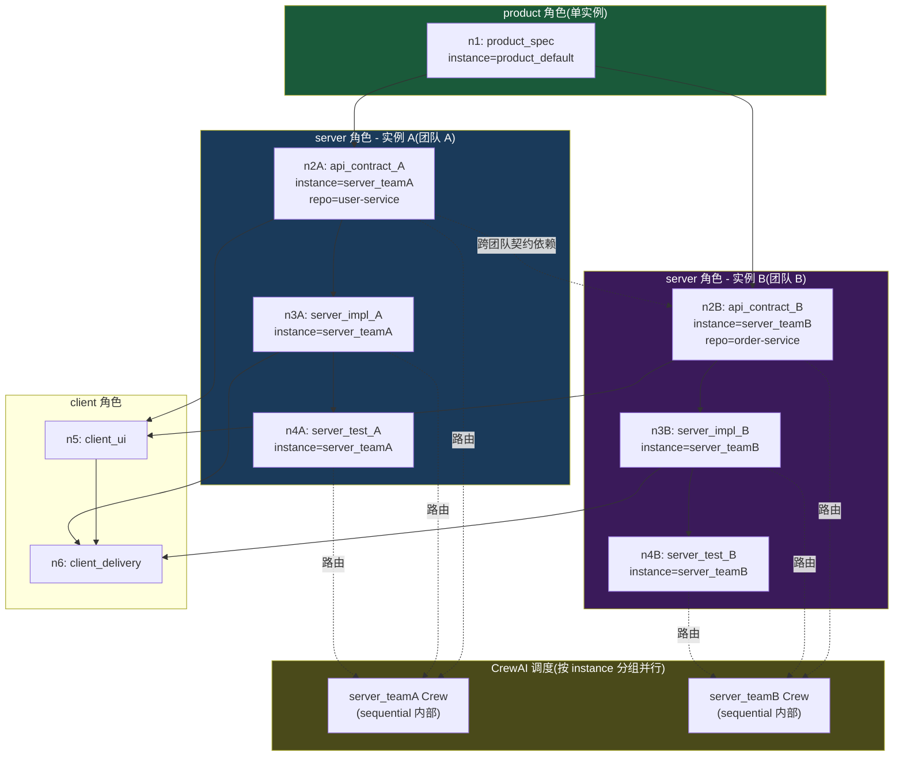
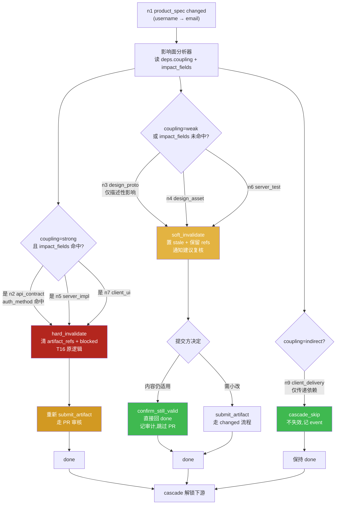
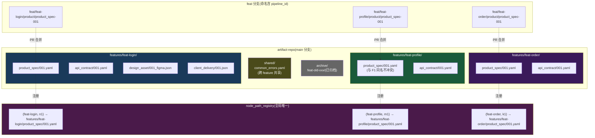

# PRD 压力测试报告:多团队协同 / 全链路回滚 / 多 Feature 并行

> **文档性质**:对《coordination-platform-prd.md》v2.0 及其深化文档(fr2-orchestration / fr3-fr5-crew-skills)的真实场景压力测试
> **版本**:v1.0 | **日期**:2026-08-04 | **状态**:架构评审输入
> **测试方法**:选取 3 个真实开发场景,逐步走查 PRD 当前设计能否承载,定位设计缺陷并提出修正方案
> **被测文档**:
> - [coordination-platform-prd.md](../coordination-platform-prd.md)(主 PRD)
> - [fr2-orchestration.md](../deep-dive/fr2-orchestration.md)(FR2 深化)
> - [fr3-fr5-crew-skills.md](../deep-dive/fr3-fr5-crew-skills.md)(FR3/FR5 深化)

---

## 0. 测试结论摘要

| 场景 | PRD 能否承载 | 核心缺陷数 | 严重度 |
|---|---|---|---|
| 场景 4:跨服务端团队接口协调 | ❌ 不能 | 7 | **高**(角色模型根本性缺失) |
| 场景 15:全链路回滚(product_spec 理解偏差) | ⚠️ 勉强能跑但代价不可控 | 6 | **高**(可能管线永远跑不完) |
| 场景 16:多 Feature 并行产物仓库分支策略 | ⚠️ 部分能跑 | 5 | **中**(规模一上来就崩) |

**总体判断**:PRD v2.0 的单 agent-per-role + 全量级联失效 + 扁平产物仓库设计,在 MVP 单 feature 单团队场景下成立,但**一旦进入真实多团队/多 feature/大规模回滚场景,会出现角色瓶颈、回滚雪崩、产物仓库污染三类系统性问题**,需在 Phase 1 实施前修正。

---

## 1. 场景 4:跨服务端团队的接口协调(角色细分)

### 1.1 场景描述

某公司用本平台开发一个电商订单功能,服务端拆成两个团队:

| 团队 | 负责服务 | 产出节点 | 依赖 |
|---|---|---|---|
| 团队 A(用户服务团队) | user-service | `api_contract_A`(用户信息查询接口) | 依赖 `product_spec` |
| 团队 B(订单服务团队) | order-service | `api_contract_B`(订单创建接口,需调用户信息) | 依赖 `product_spec` + `api_contract_A` |

两个团队的实际差异:

- **代码仓库不同**:user-service 与 order-service 是两个独立 git 仓库
- **工作流不同**:团队 A 用 trunk-based + PR,团队 B 用 git-flow + release 分支
- **开发方法论不同**:团队 A 用 DDD,团队 B 用贫血模型
- **方法论工具链不同**:团队 A 契约用 OpenSpec,团队 B 用 spec-kit
- **审批人不同**:团队 A 主管是张三,团队 B 主管是李四
- **发布节奏不同**:团队 A 每日发布,团队 B 每周发布

需求方期望:平台能同时协调两个团队,且双方契约变更能相互通知。

### 1.2 PRD 当前设计走查

#### 走查点 1:角色粒度——PRD 只有 1 个 server 角色

**引用**:
- 主 PRD §3.1 角色定义:`server` 角色产出 `api_contract / server_impl / server_test`
- 主 PRD §2.1 节点清单:`api_contract` 节点的 `role=server`
- FR3.1:`server_agent` 单个 Agent

**走查结果**:PRD 的角色模型是「角色 = 节点 type 集合」的扁平映射,1 个 server 角色对应 1 个 `server_agent`。本场景需要 2 个 server 团队,但 PRD 没有任何「角色实例化」机制——无法表达「团队 A 的 server agent」与「团队 B 的 server agent」是两个独立协调实体。

#### 走查点 2:1 个 server_agent 能否同时协调两个团队

**引用**:
- FR3.1 server_agent 的 backstory:「接口协议优先,用任意工具产出契约」
- fr3-fr5 §2.1:`server_agent` LLM 配置 Claude Sonnet 4, max_rpm=30
- fr3-fr5 §5.3 并发控制:「同角色节点串行(sequential)」「全局并发 Crew ≤ 4(每角色一个)」

**走查结果**:`server_agent` 串行处理同角色 Task,且全局只有 1 个 server Crew。本场景两个团队的 `api_contract_A` 与 `api_contract_B` 都 role=server,会被串行排队,无法并行。更严重的是:LLM 的 backstory 是单一人格,无法在「团队 A 的 DDD 方法论」与「团队 B 的贫血模型」间切换上下文——一次 kickoff 上下文混入两套方法论,agent 输出会漂移。

#### 走查点 3:DAG 能否表达「同角色节点间依赖」

**引用**:
- FR2.2 依赖 DAG 规则:「节点 `deps` 数组声明上游依赖(边由 deps 推导)」
- fr2 §7.3 节点引用完整性:`deps` 引用存在即可,不限制角色

**走查结果**:DAG 层面**能**表达——`api_contract_B.deps = ["product_spec", "api_contract_A"]` 合法,无环。问题不在 DAG,而在**调度**:`api_contract_A` 与 `api_contract_B` 都是 server 角色,FR3.2 `build_crew_for_ready_nodes` 用 `role_to_agent.get(node["role"])` 单值映射,二者会绑到同一个 `server_agent`,无法分发到不同团队实例。

#### 走查点 4:团队 A 契约变更如何通知团队 B

**引用**:
- FR2.1 状态机 T10/T16:`api_contract_A` changed → 下游 `api_contract_B` 被 T16 递归置 blocked + 清 `artifact_refs`
- FR2.5 控制节点:`notify` 节点可触发飞书/Slack 通知

**走查结果**:状态推进上,`api_contract_B` 会被自动 blocked(因为 deps 含 A)。但**通知**只能靠在 A→B 之间显式插一个 `notify` 控制节点——管线设计者得手工加。PRD 没有默认的「下游跨团队通知」机制,blocked 节点不会主动 ping 团队 B 的 channel,团队 B 可能要等到查 dashboard 才发现自己的 contract 被 blocked 了。延迟感知 = 延迟恢复。

#### 走查点 5:权限能否隔离两个团队

**引用**:
- 主 PRD §3.2 权限矩阵:`server` 角色可提交 server 类产物
- fr3-fr5 §2.4 参数级约束:`node_id` 必须属于本 agent 角色(按 `pipeline.yaml` 的 `node.role` 校验)

**走查结果**:权限只校验到 `node.role == agent.role`(都是 server),**不校验团队归属**。团队 A 的 server agent 理论上可以提交 `api_contract_B` 的产物,反之亦然。在单团队场景这是无害的,但在多团队场景会造成「团队 A 误改团队 B 的契约」事故。

#### 走查点 6:分支命名冲突

**引用**:
- FR1.2 分支保护规则:`feat` 分支命名规范 `feat/{role}/{node_type}-{seq}`
- fr3-fr5 §2.4:`branch` 命名 `feat/{role}/{node_type}-{seq}`

**走查结果**:两个团队都提交 `api_contract` 时,分支名会撞 `feat/server/api_contract-001`。即使序号不同(001 vs 002),团队 A 的 `api_contract_A` 节点和团队 B 的 `api_contract_B` 节点都映射到同一个 `api_contract` 目录,产物路径 `api_contract/001.yaml` 也会冲突(详见场景 16)。

### 1.3 设计缺陷

| # | 缺陷 | 根因 | 影响 |
|---|---|---|---|
| D4.1 | **角色无实例化机制** | PRD §3.1 角色是 type 集合,1 role = 1 agent | 多团队无法分配独立 agent,要么挤一个 agent 串行,要么手工绕过 |
| D4.2 | **同角色节点强制串行** | fr3-fr5 §5.3 「同角色节点 sequential」 | 团队 A/B 本可并行,被强行串行,管线周期翻倍 |
| D4.3 | **role_assignments 单值映射** | FR2.3 `role_assignments: dict[str, str]` node_id→agent_id 是 1:1,但 `role_to_agent` 是 role→agent 单值 | 无法把不同 team 的 server 节点路由到不同 agent 实例 |
| D4.4 | **权限不校验团队归属** | §3.2 + fr3-fr5 §2.4 只校验 role | 团队 A agent 可误操作团队 B 产物,无技术隔离 |
| D4.5 | **跨团队契约变更无主动通知** | FR2.5 notify 是可选控制节点,非默认 | 团队 B 感知 contract_A 变更滞后,blocked 节点静默等待 |
| D4.6 | **LLM backstory 单一人格** | FR3.1 server_agent backstory 固定 | 无法承载多团队方法论差异,上下文漂移 |
| D4.7 | **feat 分支命名缺 team 维度** | FR1.2 `feat/{role}/{node_type}-{seq}` | 多团队同 type 提交分支名冲突 |

### 1.4 修正方案

#### 修正 1:引入「角色实例化(Role Instance)」模型

在 PRD §3.1 角色定义之上,新增「角色实例(RoleInstance)」层:

```yaml
# pipeline.yaml 扩展
roles:
  - name: server
    instances:
      - instance_id: server_teamA
        team: user-service
        backstory_override: "团队 A 用 DDD,契约由 OpenSpec 产出"
        llm_config: { model: claude-sonnet-4, temperature: 0.2 }
        allowed_node_ids: [api_contract_A, server_impl_A, server_test_A]
        allowed_repos: [user-service-repo]
        reviewer: zhang_san
      - instance_id: server_teamB
        team: order-service
        backstory_override: "团队 B 用贫血模型,契约由 spec-kit 产出"
        llm_config: { model: claude-sonnet-4, temperature: 0.2 }
        allowed_node_ids: [api_contract_B, server_impl_B, server_test_B]
        allowed_repos: [order-service-repo]
        reviewer: li_si
```

**节点绑定 instance**:`node.instance_id` 字段(替代或补充 `node.role`)。CrewAI 调度时按 `instance_id` 而非 `role` 路由。

#### 修正 2:并发模型从「按 role 分组」改为「按 instance 分组」

```python
# 修正 fr3-fr5 §5.2
async def handle_ready_batch(events: list[ReadyEvent]):
    by_instance: dict[str, list[ReadyEvent]] = {}
    for e in events:
        by_instance.setdefault(e.instance_id, []).append(e)
    # 不同 instance 并行(团队 A 与团队 B 真并行)
    # 同 instance 内仍 sequential(避免同团队节点抢分支)
    results = await asyncio.gather(
        *[run_instance_crew(inst, evs) for inst, evs in by_instance.items()],
        return_exceptions=True,
    )
```

#### 修正 3:权限矩阵增加 team 维度

`submit_artifact` 入口校验从「`node.role == agent.role`」升级为「`node.instance_id == caller.instance_id` AND `node.allowed_repos ∋ requested_repo`」。

#### 修正 4:跨团队契约变更默认通知

在 `invalidate_node`(fr2 T16)执行时,对所有被 blocked 的下游节点,若其 `instance_id ≠ changed 节点的 instance_id`,**自动**触发跨团队通知(无需手工插 notify 节点):

```python
async def invalidate_node(state, changed_node_id):
    downstream = get_downstream_recursive(changed_node_id)
    for nid in downstream:
        if get_node(nid).instance_id != get_node(changed_node_id).instance_id:
            await notify_team(
                target_instance=get_node(nid).instance_id,
                message=f"上游 {changed_node_id} 变更,本节点 {nid} 已 blocked",
            )
```

#### 修正 5:分支命名加 instance 维度

`feat/{instance_id}/{node_type}-{seq}`,如 `feat/server_teamA/api_contract-001`。

### 1.5 设计图:角色实例化与多团队 DAG



**图示要点**:
- 同一 `server` 角色下挂两个 instance,各自独立的 Crew、LLM 配置、backstory、reviewer、repo 白名单。
- `api_contract_B` 通过 `deps` 声明对 `api_contract_A` 的跨团队契约依赖,DAG 合法。
- 团队 A 与团队 B 的 Crew 真并行,不串行排队。
- `instance_id` 是权限隔离边界:团队 A agent 调 `submit_artifact` 时,MCP 校验 `node.instance_id == agent.instance_id` 且 repo 在白名单内。

---

## 2. 场景 15:全链路回滚(product_spec 一开始就理解错了)

### 2.1 场景描述

某登录功能开发到 `client_delivery`(最后一个节点),整个 9 节点链路状态:

| 节点 | 状态 | 已投入 |
|---|---|---|
| n1 product_spec | done | 2 天 |
| n2 api_contract | done | 1 天 |
| n3 design_proto | done | 2 天 |
| n4 design_asset | done | 1 天 |
| n5 server_impl | done | 3 天 |
| n6 server_test | done | 1 天 |
| n7 client_ui | done | **5 天** |
| n8 client_func | done | 2 天 |
| n9 client_delivery | pending_review | 1 天 |

联调时发现:`product_spec` 把「用户名登录」理解错了,实际需求是「**邮箱登录**」。需要把 n1 打回重做。

**期望影响面**(工程师直觉判断):
- n1 product_spec:重写登录方式描述(小改,30 分钟)
- n2 api_contract:端点路径 `/login` 不变,但请求 schema 从 `{username}` 改 `{email}`,正则变了(小改,1 小时)
- n3 design_proto:登录页 UI 基本不变,输入框 placeholder 改一下(微调,15 分钟)
- n4 design_asset:输入框标注改 placeholder 文案(微调,15 分钟)
- n5 server_impl:登录逻辑里 username 查询改 email 查询(小改,1 小时)
- n6 server_test:测试用例改数据(小改,30 分钟)
- n7 client_ui:输入框校验正则改 + placeholder(小改,30 分钟)
- n8 client_func:联调用例改数据(小改,30 分钟)
- n9 client_delivery:重新跑联调(小改,1 小时)

**实际总工作量约 5 小时**,但 PRD 当前设计会触发什么?

### 2.2 PRD 当前设计走查

#### 走查点 1:changed 级联是「全量失效」

**引用**:
- 主 PRD FR2.2 DAG 规则:「级联失效:节点 `changed` → 所有下游产物引用清除 + 置 `blocked`(递归)」
- fr2 §2.1 T16:「下游 cascade 失效(上游 changed 递归)... 清 `artifact_refs[nid]`,清 `pending_prs[nid]`... 发 `INVALIDATED` event」
- fr2 §3.2 锁机制:`invalidate_node` 递归抢下游锁,按拓扑序

**走查结果**:n1 changed → n2/n3/n4/n5/n6/n7/n8/n9 **全部** 递归 blocked + `artifact_refs` 全部清空。无论下游对 n1 的依赖是「强耦合」还是「弱耦合」,一律全量失效。本场景实际只有 n2/n5/n7 的 schema 强依赖 n1 的字段,n3/n4/n6/n8/n9 只是间接影响,但 PRD 不区分。

#### 走查点 2:清引用后,代码还在代码仓库怎么办

**引用**:
- 主 PRD §5.1 ArtifactRef:`node_id / repo / path / commit / toolspec_framework / trace_id`,管理方只持引用不持内容
- T16 清 `artifact_refs[nid]`:引用被清

**走查结果**:n7 client_ui 的 `artifact_refs["n7"]` 被清,但客户端代码仓库的 commit 还在(git 不可变历史)。问题:重新 ready 后,agent 是基于旧 commit 修改,还是从头提交?PRD 没说。`submit_artifact` 只接受新 commit(T10 guard:`新 commit ≠ 旧 commit`),但旧引用已清,agent 无法 `get_dependencies` 拿到旧实现做 diff——agent 上下文丢失「之前写了什么」,只能让人员手工指认旧 commit。

#### 走查点 3:有无「增量失效」或「影响面评估」

**引用**:
- fr2 §2.1 T16:无影响面评估逻辑
- fr2 §8 控制节点边界:gate/approval/fork/switch/notify 均无 impact analysis
- fr3-fr5 §6 skill.yaml:无 dependency_coupling_strength 字段

**走查结果**:**完全没有**。PRD 的级联是「拓扑可达即失效」,不区分:
- 强依赖(字段级 schema 变更,下游必改)
- 弱依赖(描述性变更,下游可能不用改)
- 无依赖(下游产物虽拓扑可达,但实际未引用变更字段)

#### 走查点 4:能否「恢复旧引用」而非从头提交

**引用**:
- fr2 §10 事件溯源:`events` 表 append-only,可回放重建 state
- T16 副作用:清 `artifact_refs[nid]` 是 state 修改,会发 `INVALIDATED` event

**走查结果**:事件流能查到「n7 之前 done 时 artifact_refs 是 commit X」,但 PRD 没有提供「恢复旧引用」的 MCP 工具或状态转移。已 blocked 节点的恢复路径只有一条:重新 ready → 重新 submit_artifact(新 commit)→ 重新 pending_review → 重新 approve_pr。即使产物内容一字不改,也得走完整审核流。

#### 走查点 5:级联后下游能否「并行恢复」

**引用**:
- fr2 §9.4 dispatch_router_fn:`ready_nodes` 多个时返回 `list[Send]` 并行 fan-out
- FR2.2 级联解锁:「节点 done → 检查所有下游,依赖全满足的下游置 ready」

**走查结果**:理论上下游可并行 ready,但**依赖链是串行瓶颈**。本场景:
- n1(新)done → n2 ready(n2 deps=[n1])→ n2 done → n5 ready(n5 deps=[n2])
- n1(新)done → n3 ready → n3 done → n4 ready → n4 done → n7 ready(n7 deps=[n2,n4])
- n7 done → n8 ready → n8 done → n9 ready

即使每个节点 1 小时,关键路径 n1→n2→n5 + n1→n3→n4→n7→n8→n9 ≈ 5 小时,且 n2/n5 串行、n3/n4 串行。原本 5 小时工作量,因串行依赖拉到至少 8 小时。更糟的是,每一步都要走 PR 审核(approve_pr 合并),每次审核 ~30 分钟,9 节点 × 30min = 4.5 小时额外开销。

#### 走查点 6:大规模回滚成本 PRD 有无评估

**引用**:
- fr3-fr5 §2.3 Cost 控制:单 Task ≤ 10k token,单 Agent/日 ≤ $5,管线级 ≤ $50
- NFR 系列:无「回滚成本」相关 NFR

**走查结果**:**无评估**。本场景 9 节点重新 submit + 9 次 PR 审核 + 9 次 LLM 调用,按 Sonnet 4 单次 ~5k token 估算:
- LLM token:9 × 5k × $3/Mtok ≈ $0.135(看起来不贵)
- 但**人工成本**:9 次人员重新介入(每次 30min~1h),约 6-9 人时
- **时间成本**:关键路径 8h + 审核 4.5h ≈ 12.5h,且需要人员全程在场响应 ready 事件
- **隐性成本**:管线停滞期间,依赖该 feature 的其他工作全部阻塞

如果回滚发生在更大管线(20+ 节点),关键路径可能 2-3 天,管线「永远跑不完」概率显著上升。

### 2.3 设计缺陷

| # | 缺陷 | 根因 | 影响 |
|---|---|---|---|
| D15.1 | **全量级联失效,无影响面评估** | T16 拓扑可达即失效 | 实际只需小改的下游被强制重做,工作量放大 5-10x |
| D15.2 | **清引用丢失下游上下文** | T16 清 `artifact_refs[nid]` | agent 无法 `get_dependencies` 拿旧实现,只能人员手工指认 |
| D15.3 | **无「恢复旧引用」路径** | state 转移只有重新 submit 一条路 | 内容不变的节点也得重走 PR 审核,审核成本叠加 |
| D15.4 | **DAG 依赖无耦合强度标注** | skill.yaml / node 定义无 coupling 字段 | 无法区分强/弱/无依赖,级联一刀切 |
| D15.5 | **关键路径串行瓶颈** | 依赖链拓扑序 + 每步 PR 审核 | 大规模回滚关键路径过长,可能数天 |
| D15.6 | **回滚成本未纳入 NFR** | 非功能需求无回滚预算 | 无阈值告警,管线 silently 跑不完 |

### 2.4 修正方案

#### 修正 1:节点依赖增加「耦合强度(coupling)」标注

扩展 `pipeline.yaml` 节点 deps 结构:

```yaml
nodes:
  - id: n2
    type: api_contract
    deps:
      - node_id: n1
        coupling: strong        # strong | weak | none
        impact_fields: [auth_method, user_identifier]  # n1 中影响本节点的字段
  - id: n3
    type: design_proto
    deps:
      - node_id: n1
        coupling: weak           # 设计只受需求描述影响,字段级无强绑
  - id: n9
    type: client_delivery
    deps:
      - node_id: n1
        coupling: indirect       # 间接依赖,仅传递性影响
```

#### 修正 2:级联失效改为「分级失效」

将 T16 拆为三种失效级别:

| 失效级别 | 触发条件 | 副作用 |
|---|---|---|
| **hard_invalidate**(原 T16) | `coupling=strong` 且 `impact_fields` 命中变更字段 | 清 `artifact_refs` + 置 blocked + 通知 |
| **soft_invalidate**(新增) | `coupling=weak` 或 `impact_fields` 未命中 | 置 `stale`(新状态)+ 保留 `artifact_refs` + 通知「建议复核」 |
| **cascade_skip**(新增) | `coupling=indirect/none` | 不失效,仅记录 `CASCADE_SKIPPED` event |

新增状态 `stale`:表示「产物可能过期但引用仍有效,提交方可选择复核或确认仍适用」。`stale` 节点可:
- 调 `confirm_still_valid` 工具 → 直接回 done(不走 PR 审核,但记审计)
- 或调 `submit_artifact` 提交新版本 → 走正常 changed 流程

#### 修正 3:提供「恢复旧引用」工具

新增 MCP 工具 `restore_artifact_ref`:

```json
{
  "name": "restore_artifact_ref",
  "description": "恢复被级联失效清除的旧产物引用(适用于内容仍适用的下游)",
  "inputSchema": {
    "type": "object",
    "properties": {
      "node_id": {"type": "string"},
      "reason": {"type": "string", "description": "为何恢复(审计用)"}
    },
    "required": ["node_id", "reason"]
  }
}
```

内部实现:从 `events` 表回放找到该 node 最后一次 `DONE` event 的 `artifact_ref`,写回 `artifact_refs[nid]`,状态 blocked→done(跳过 PR 审核,但强制记审计 + 触发下游 cascade 解锁)。**前提**:上游变更已确认不影响本节点(由 `coupling` + `impact_fields` 判定,或人工签字)。

#### 修正 4:回滚成本 NFR

新增 NFR:

| 编号 | 需求 |
|---|---|
| NFR21 | 单次 changed 级联的 LLM token 消耗 ≤ $1(避免回滚 token 失控) |
| NFR22 | 9 节点管线全量回滚的关键路径恢复时间 ≤ 4h(含审核) |
| NFR23 | 回滚影响节点数 > 总节点数 60% 时,自动告警并建议「重建管线」而非「逐节点恢复」 |

#### 修正 5:并行恢复策略

对 `stale` 状态节点(修正 2),允许批量 `confirm_still_valid`(一次 MCP 调用传多个 node_id),内部用 LangGraph Send API 并行处理,绕过串行 PR 审核瓶颈。

### 2.5 设计图:全链路回滚的增量失效流程



**图示要点**:
- changed 触发后,先跑「影响面分析器」,按 `deps.coupling` + `impact_fields` 分流。
- 强依赖走原 T16 hard_invalidate(全量失效)。
- 弱依赖走新增 soft_invalidate(stale 状态,保留引用,可恢复)。
- 间接依赖走 cascade_skip(不失效)。
- `stale` 节点可 `confirm_still_valid` 直接回 done,绕过串行 PR 审核瓶颈。
- 本场景预期:n2/n5/n7 hard(3 节点重做),n3/n4/n6 soft(3 节点快速确认),n9 skip,n1 重做 + n8 跟随 n7。关键路径从 12.5h 降到 ~4h。

---

## 3. 场景 16:产物仓库分支策略与多 Feature 并行

### 3.1 场景描述

同一时期平台上有 3 个 feature 并行开发:

| Feature | pipeline_id | 涉及节点 |
|---|---|---|
| 登录功能 | `feat-login` | n1..n9(9 节点) |
| 用户中心 | `feat-profile` | m1..m7(7 节点) |
| 订单列表 | `feat-order` | k1..k8(8 节点) |

3 个 feature 都需要往**同一个产物仓库**提交产物。预期产物仓库 main 分支上能看到所有 feature 的产物,且互相不污染。

### 3.2 PRD 当前设计走查

#### 走查点 1:feat 分支命名是否冲突

**引用**:
- FR1.2:`feat` 分支命名规范 `feat/{role}/{node_type}-{seq}`
- fr3-fr5 §2.4:`branch` 命名 `feat/{role}/{node_type}-{seq}`

**走查结果**:三个 feature 都有 `product_spec` 节点,都 role=product,seq 都从 001 起。分支名会撞:`feat/product/product_spec-001` 在产物仓库全局唯一,三个 feature 无法各开各的分支。即使加 `feat/product/product_spec-001-login`、`-profile`、`-order` 后缀,PRD 没有命名规范约束,靠人自觉不可靠。

#### 走查点 2:产物路径冲突

**引用**:
- FR1.1 仓库结构:`product_spec/001.yaml`、`api_contract/001.yaml` 按类型分目录,序号前缀
- fr2 §4.2:`node_path_registry(pipeline_id, node_id, artifact_path)`,`UNIQUE(pipeline_id, artifact_path)`

**走查结果**:`node_path_registry` 的 UNIQUE 是 `(pipeline_id, artifact_path)` 组合唯一——**同 pipeline 内**路径不冲突,但**跨 pipeline**(跨 feature)路径可以重复。三个 feature 都提交 `product_spec/001.yaml` 到 main 分支,git 层面:
- feat-login 的 PR 合并 `product_spec/001.yaml`
- feat-profile 的 PR 也想合并 `product_spec/001.yaml` → git merge 冲突(同 path 不同内容)
- feat-order 同理

PRD 的路径注册表防了同 pipeline 冲突,没防跨 pipeline 冲突。

#### 走查点 3:main 分支上多 feature 产物如何区分归属

**引用**:
- FR1.1:目录结构按产物类型分,无 feature 维度
- FR6.5 审计日志:`node_id / pipeline_id` 有记录,但产物文件本身不携带

**走查结果**:main 分支上 `product_spec/001.yaml` 到底属于哪个 feature?只能查审计日志反查 `node_id → pipeline_id`。文件内容里 PRD 模板有 `node_id` 字段,但 node_id 是 pipeline 内的,跨 pipeline 可能重复(n1 在三个 feature 里都存在)。**产物文件无法自证归属**。

#### 走查点 4:有无 feature 命名空间机制

**引用**:
- FR1.1 仓库结构:无 feature 目录
- FR1.2 分支保护:无 feature 前缀规范
- fr2 §4.2 路径冲突处理:仅 `(pipeline_id, artifact_path)` 唯一

**走查结果**:**完全没有**。PRD 的产物仓库是「按类型扁平分目录」的单命名空间,多 feature 并行时必然路径冲突。

#### 走查点 5:产物仓库膨胀

**引用**:
- FR1.1:所有产物进一个 git 仓库
- NFR:无仓库容量/clone 性能相关需求

**走查结果**:3 个 feature × 平均 8 节点 = 24 个产物文件,看似不大。但放大到真实场景:100 个 feature/年 × 8 产物 = 800 文件/年,5 年 4000 文件。git clone 时间线性增长,且每次 clone 拉全量历史。PRD 无 git LFS / 浅克隆 / 分库策略。

### 3.3 设计缺陷

| # | 缺陷 | 根因 | 影响 |
|---|---|---|---|
| D16.1 | **feat 分支命名无 feature 维度** | FR1.2 `feat/{role}/{node_type}-{seq}` | 多 feature 同 type 分支名冲突 |
| D16.2 | **产物路径跨 feature 冲突** | fr2 §4.2 UNIQUE 仅 `(pipeline_id, path)` | 同 path 不同 feature 的 PR 互撞,合并冲突 |
| D16.3 | **main 分支产物无 feature 归属** | 产物文件不携带 pipeline_id | 无法从文件本身判断归属,审计反查成本高 |
| D16.4 | **无 feature 命名空间** | FR1.1 扁平按类型分目录 | 多 feature 产物混在 main,污染 |
| D16.5 | **产物仓库无容量治理** | 无 LFS / 浅克隆 / 分库策略 | 仓库膨胀,clone 越来越慢 |

### 3.4 修正方案

#### 修正 1:产物仓库引入 feature 命名空间(目录隔离)

调整 FR1.1 仓库结构:

```
artifact-repo/
├─ features/
│  ├─ feat-login/                    # feature 命名空间
│  │  ├─ product_spec/001.yaml
│  │  ├─ api_contract/001.yaml
│  │  ├─ api_contract/002.yaml       # 多个 api_contract 仍按序号
│  │  ├─ design_asset/001_figma.json
│  │  └─ client_delivery/001.json
│  ├─ feat-profile/
│  │  └─ product_spec/001.yaml       # 跨 feature 不冲突(不同命名空间)
│  └─ feat-order/
│     └─ product_spec/001.yaml
├─ shared/                           # 跨 feature 共享产物(如通用错误码契约)
│  └─ api_contract/common_errors.yaml
└─ .github/pull_request_template.md
```

**路径规范**:`features/{pipeline_id}/{node_type}/{seq}.{ext}`

#### 修正 2:分支命名加 pipeline_id 维度

`feat/{pipeline_id}/{role}/{node_type}-{seq}`,如 `feat/feat-login/product/product_spec-001`。

#### 修正 3:node_path_registry 升级为全局唯一

```sql
-- 修改 fr2 §6.1 schema
CREATE TABLE node_path_registry (
    pipeline_id TEXT NOT NULL,
    node_id TEXT NOT NULL,
    artifact_path TEXT NOT NULL,          -- 含 features/{pipeline_id}/ 前缀
    commit TEXT NOT NULL,
    registered_at TIMESTAMPTZ NOT NULL DEFAULT now(),
    PRIMARY KEY (pipeline_id, node_id),
    UNIQUE (artifact_path)                -- 改为全局唯一(去掉 pipeline_id 组合)
);
```

校验时:`artifact_path` 必须以 `features/{pipeline_id}/` 开头(强约束 feature 命名空间)。

#### 修正 4:产物文件强制携带 feature 元数据

扩展 PR1.3 PR 模板:

```yaml
node_id: n1
node_type: product_spec
role: product
pipeline_id: feat-login              # 必填,feature 命名空间标识
artifact:
  path: features/feat-login/product_spec/001.yaml   # 含命名空间
```

产物文件 header 也建议带 `pipeline_id` 字段(YAML front matter / JSON 顶层字段),实现「文件自证归属」。

#### 修正 5:仓库容量治理策略

| 策略 | 适用阶段 | 实现 |
|---|---|---|
| 浅克隆(`--depth 1`) | agent 拉产物内容 | MCP `get_dependencies` 内部 `git clone --depth 1` |
| git LFS | 设计稿/标注大文件 | `design_asset/*.json` 超 512KB 走 LFS |
| feature 归档 | feature 已交付且超 6 个月 | `features/feat-xxx/` 移到 `archive/feat-xxx/`(独立分支或独立仓库) |
| 分库(长期) | 仓库超 5GB | 按 feature 维度拆子仓库,主仓库仅存索引 |

新增 NFR:

| 编号 | 需求 |
|---|---|
| NFR24 | 产物仓库 clone `--depth 1` 时间 ≤ 10s(单 feature 命名空间) |
| NFR25 | feature 交付超 6 个月自动归档,main 分支仅保留活跃 feature |

### 3.5 设计图:产物仓库多 feature 命名空间



**图示要点**:
- 三个 feature 各有独立命名空间目录 `features/{pipeline_id}/`,内部产物路径自由(001.yaml 互不冲突)。
- feat 分支命名含 `pipeline_id`,全局唯一,不撞。
- `node_path_registry` 的 `artifact_path` 全局唯一(含命名空间前缀),跨 feature 不冲突。
- `shared/` 放跨 feature 共享产物(如通用错误码契约),多 feature 共同依赖。
- `archive/` 归档已交付 feature,控制 main 分支体积。

---

## 4. 缺陷汇总表

| 场景 | 缺陷 ID | 缺陷描述 | 严重度 | 影响章节 | 修正方案 |
|---|---|---|---|---|---|
| 场景 4 | D4.1 | 角色无实例化机制,1 role = 1 agent | **高** | §3.1, FR3.1 | 引入 RoleInstance 模型,server 角色可多实例 |
| 场景 4 | D4.2 | 同角色节点强制 sequential,多团队无法并行 | **高** | fr3-fr5 §5.3 | 改为按 instance 分组并行 |
| 场景 4 | D4.3 | role_assignments 单值映射,无法路由到不同实例 | **高** | FR2.3 | 节点增 instance_id 字段,按 instance 路由 |
| 场景 4 | D4.4 | 权限不校验团队归属,跨团队可误操作 | **高** | §3.2, fr3-fr5 §2.4 | 权限校验升级到 instance + repo 白名单 |
| 场景 4 | D4.5 | 跨团队契约变更无主动通知,blocked 静默 | 中 | FR2.5 | invalidate_node 自动跨 instance 通知 |
| 场景 4 | D4.6 | LLM backstory 单一人格,无法承载多方法论 | 中 | FR3.1 | instance 级 backstory_override |
| 场景 4 | D4.7 | feat 分支命名缺 team 维度,分支冲突 | 中 | FR1.2 | `feat/{instance_id}/{type}-{seq}` |
| 场景 15 | D15.1 | 全量级联失效,无影响面评估,工作量放大 5-10x | **高** | FR2.2, fr2 §2.1 T16 | 分级失效 hard/soft/skip |
| 场景 15 | D15.2 | 清引用丢失下游上下文,agent 无法 get_dependencies | **高** | fr2 T16 | 旧引用保留在 events,提供查询工具 |
| 场景 15 | D15.3 | 无「恢复旧引用」路径,内容不变的节点也得重走审核 | **高** | 状态机 T16 | 新增 restore_artifact_ref MCP 工具 |
| 场景 15 | D15.4 | DAG 依赖无耦合强度标注,无法区分强/弱/无 | **高** | FR2.2, fr3-fr5 §6 | deps 增 coupling + impact_fields |
| 场景 15 | D15.5 | 关键路径串行瓶颈 + 每步 PR 审核,大规模回滚数天 | **高** | FR2.2, FR6 | stale 节点批量 confirm,绕过审核 |
| 场景 15 | D15.6 | 回滚成本未纳入 NFR,无阈值告警 | 中 | §7 | 新增 NFR21-23 |
| 场景 16 | D16.1 | feat 分支命名无 feature 维度,分支冲突 | 中 | FR1.2 | `feat/{pipeline_id}/{role}/{type}-{seq}` |
| 场景 16 | D16.2 | 产物路径跨 feature 冲突,UNIQUE 仅 pipeline 内 | **高** | fr2 §4.2 | 路径含 `features/{pipeline_id}/` 前缀,全局唯一 |
| 场景 16 | D16.3 | main 分支产物无 feature 归属,审计反查成本高 | 中 | FR1.1, FR6.5 | 产物文件强制带 pipeline_id 元数据 |
| 场景 16 | D16.4 | 无 feature 命名空间,多 feature 产物混在 main | **高** | FR1.1 | `features/{pipeline_id}/` 目录隔离 |
| 场景 16 | D16.5 | 产物仓库无容量治理,clone 越来越慢 | 中 | NFR | 浅克隆 + LFS + 归档 + 分库,NFR24-25 |

---

## 5. 修正优先级建议

按「实施成本 × 缓解价值」排序,建议在 Phase 1 MVP 前落实以下修正(否则后续返工成本高):

| 优先级 | 修正项 | 实施阶段 | 理由 |
|---|---|---|---|
| **P0** | D16.4 feature 命名空间 + D16.2 路径全局唯一 | Phase 1 | 产物仓库结构一旦上线有数据,迁移成本极高 |
| **P0** | D4.1 角色实例化模型 + D4.3 instance_id 路由 | Phase 1 | 角色模型是状态机/CrewAI/权限的基础,后改影响面大 |
| **P0** | D15.4 耦合强度标注 + D15.1 分级失效 | Phase 1 | 级联逻辑一旦写成全量,后续改回分级要动状态机和 T16 |
| **P1** | D15.3 restore_artifact_ref 工具 + D15.5 stale 批量恢复 | Phase 2 | 依赖分级失效落地,可在 MVP 后补 |
| **P1** | D4.4 instance 级权限 + D4.5 跨团队通知 | Phase 2 | MVP 单团队可暂缓,多团队上线前必做 |
| **P2** | D16.5 容量治理(LFS/归档/分库) | Phase 3 | 仓库未膨胀前可延后 |
| **P2** | D15.6 回滚成本 NFR | Phase 2 | 需先有分级失效才能合理估算回滚成本 |

---

## 6. 与主 PRD / 深化文档的对齐说明

本报告发现的缺陷均**不与 PRD v2.0 现有设计冲突**,而是**补充未覆盖场景**:

| 缺陷类 | 与 PRD 关系 |
|---|---|
| 角色实例化(D4.x) | 扩展 §3.1 角色模型,不破坏现有 4 角色 |
| 分级失效(D15.x) | 扩展 fr2 T16,新增 `stale` 状态与 T16 并存 |
| feature 命名空间(D16.x) | 扩展 FR1.1 仓库结构,不破坏现有分支保护逻辑 |

建议将本报告作为 PRD v2.1 评审输入,修正方案落地后回写主 PRD 与对应深化文档。

---

**报告结束。** 共定位 18 项设计缺陷(7+6+5),提出 18 项修正方案,含 3 张 Mermaid 设计图(角色实例化多团队 DAG / 全链路回滚增量失效 / 产物仓库多 feature 命名空间)。
