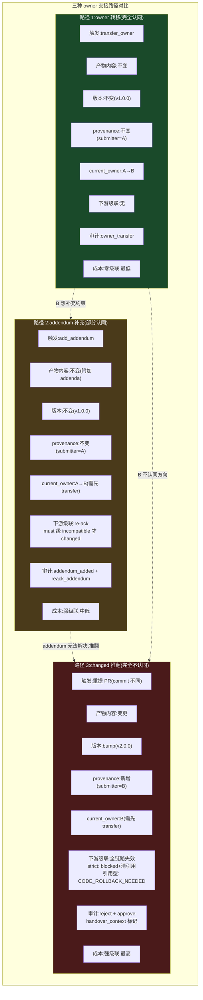
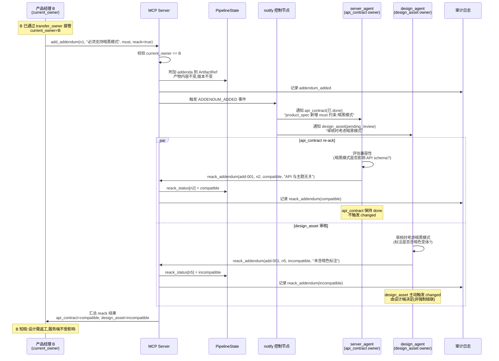
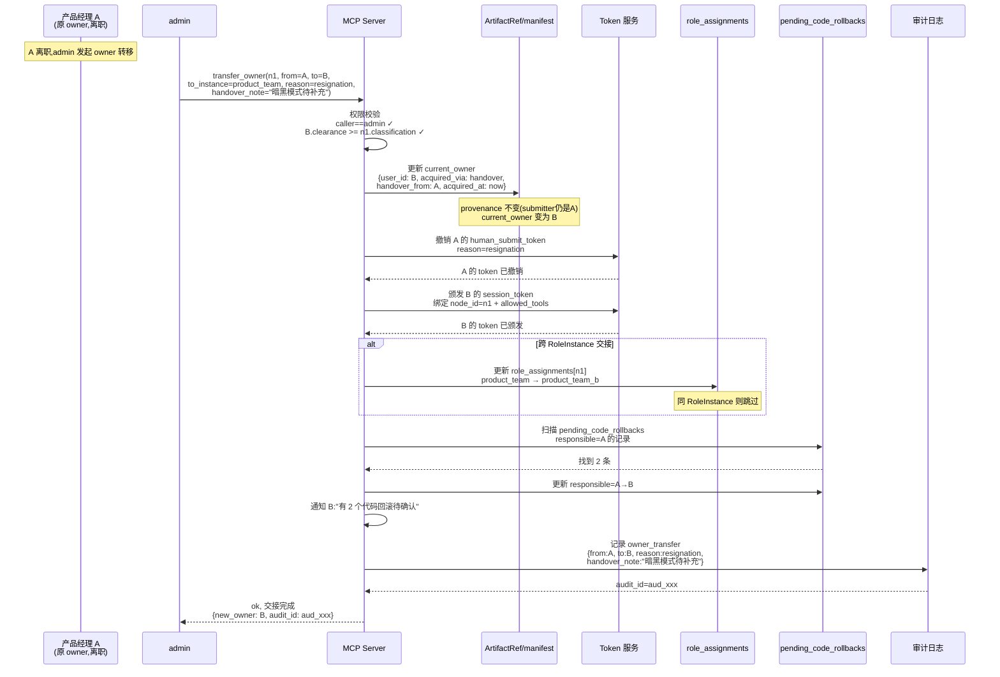

# 第五轮压力测试:产品需求 owner 交接场景

> **文档性质**:对《coordination-platform-prd.md》v3.0 的第五轮压力测试
> **版本**:v1.0 | **日期**:2026-08-04 | **状态**:架构评审输入
> **测试方法**:选取 1 个产品 owner 交接真实场景(A40,含 3 个子场景)
> **父文档**:[coordination-platform-prd.md](../coordination-platform-prd.md)
> **核心张力**:RoleInstance 团队级实例化 vs 同角色内人员交接;changed 全链路回滚 vs 轻量补充

---

## 0. 测试方法说明

### 0.1 为什么需要第五轮

前四轮 64 个场景覆盖了产物管理/异常流程/多团队/并行依赖/并发/跨仓/演进/运维/安全合规/外部依赖/管线生命周期/产物消费/agent 行为,但**同一角色内的人员交接**(产品经理 A 离职、产品经理 B 接手)这一真实开发中必遇场景**完全未覆盖**。

| 未覆盖维度 | 为什么重要 | 前四轮盲区 |
|---|---|---|
| 产物 owner 概念缺失 | PRD 的 RoleInstance 是**团队级**实例化(如 `team_a_server`),无人员级 owner。A 离职 B 接手,产物"归谁"无法表达 | provenance 只记录 `submitter_instance_id`(提交者),无"当前 owner"字段 |
| 轻量补充机制缺失 | done 产物只能 `changed`(全链路回滚),无"addendum 附加说明"机制。B 想微调(如补充"必须支持暗黑模式"约束)要么不改要么全链路失效 | draft 是"未完成产物的草案",不能用于"已完成产物的附加说明" |
| owner 转移流程缺失 | 无 `owner_transfer` MCP 工具,无转移审计 action,无 token 继承/注销规则 | 第四轮 P0-20 的 `transfer_approvals` 是审批人代理,不是产物 owner 转移 |
| agent 上下文传承缺失 | A 的 product_agent 决策历史(为何定这个优先级、为何拒绝某方案)B 无法获取 | PRD 的 agent 是无状态 Task 执行器,无 `decision_log` 概念 |

### 0.2 测试场景选取

本轮选取 **1 个真实场景(A40),含 3 个子场景**,覆盖 owner 交接的三种典型情况:

| 子场景 | 情况 | 触发机制 | 级联影响 |
|---|---|---|---|
| A40-1 | B 完全认同,只接管 owner 身份 | owner 转移,产物不变 | 无级联 |
| A40-2 | B 部分认同,微调(补充"暗黑模式"约束) | addendum 轻量补充 | 下游 re-ack(不 blocked) |
| A40-3 | B 完全不认同,推翻重做 | changed 全链路回滚 | 全链路失效 |

### 0.3 与场景 15 的区别

场景 15(全链路回滚)测的是**内容错误导致回滚**(product_spec 一开始理解错,后续发现要改)。本场景测的是**人员交接导致的 owner 变更**,不一定是内容错误——B 可能完全认同(子场景 1)、部分认同(子场景 2)、完全不认同(子场景 3)。核心差异是"owner 转移"这一**人员维度**的机制缺失。

---

## 1. 场景 A40:产品需求 owner 交接

### 1.1 场景描述

**真实情境**:产品经理 A 负责的"用户中心改版"管线已推进到 60%。

**管线当前状态**:
- `product_spec`(节点 `user-center.n1`):**done**,v1.0.0,由 A 通过 `product_team` RoleInstance 提交
- `api_contract`(节点 `user-center.n2`):**done**,v1.0.0,服务端基于 A 的 product_spec 完成
- `design_asset`(节点 `user-center.n5`):**pending_review**,设计师基于 A 的 product_spec 完成,正在审核
- `client_ui`(节点 `user-center.n7`):**blocked**,等待 design_asset done

**事件**:A 突然离职,B 接手。B 读完 product_spec 后,有以下三种情况。

#### 子场景 A40-1:B 完全认同,只接管 owner 身份

B 读完 product_spec,完全认同 A 的方向(用户故事、验收标准、优先级),只是接管后续推进。产物内容**不变**,下游 `design_asset` 继续审核、`client_ui` 继续等待。

**期望行为**:
- product_spec 产物内容不变,版本不变(v1.0.0)
- product_spec 的"当前 owner"从 A 变为 B
- 下游节点状态不变(design_asset 仍 pending_review,client_ui 仍 blocked)
- 审计记录:"owner 从 A 转移到 B,产物不变"
- B 获得后续对该 product_spec 的 changed 权限(若后续需要变更)
- A 的 token 自动失效(离职),B 的 token 生效

#### 子场景 A40-2:B 部分认同,微调(补充"暗黑模式"约束)

B 读完 product_spec,基本认同,但发现 A 漏了一个约束:"**必须支持暗黑模式**"。B 想补充这个约束,但**不希望触发全链路 changed**——因为 `api_contract` 已 done(基于原 product_spec),触发 changed 会让服务端返工重做契约。

**期望行为**:
- product_spec 原内容**不变**(v1.0.0 保持),provenance 不变(submitter 仍是 A)
- 附加一个 `addendum`(补充说明),记录"B 补充:必须支持暗黑模式"
- addendum **不触发 changed**,product_spec 状态仍为 done
- 下游 `api_contract`(已 done)收到 `ADDENDUM_ADDED` 通知,需 **re-ack**(确认是否兼容暗黑模式约束):
  - 若兼容:re-ack 通过,api_contract 保持 done
  - 若不兼容:api_contract 主动触发 changed(由服务端决定,而非强制级联)
- `design_asset`(pending_review)收到通知,审核时需考虑暗黑模式约束
- 审计记录:"B 附加 addendum,下游 re-ack 状态:api_contract=compatible, design_asset=pending"

#### 子场景 A40-3:B 完全不认同,推翻重做

B 读完 product_spec,完全不认同 A 的方向(如 A 定义"用户中心改版"是重构,B 认为应该是新增"个人主页"功能)。B 要推翻 product_spec 重做。

**期望行为**:
- B 提交新的 product_spec PR(内容大改),触发 `changed`(节点 `user-center.n1` done → changed)
- 级联失效下游:
  - `api_contract`(已 done):内容型产物,直接 revert hub 仓 PR,清除 `artifact_refs`,状态 → blocked
  - `design_asset`(pending_review):PR 自动 reject(依赖失效,`R_DEPS_CHANGED`),状态 → blocked
  - `client_ui`(blocked):保持 blocked(依赖仍未满足)
- 引用型产物(server_impl/client_ui 代码仓 commit)不可变,发 `CODE_ROLLBACK_NEEDED` 通知
- B 提交新 product_spec 后,下游重新 ready,服务端/设计师基于新 spec 重做
- 审计记录:"B 推翻 A 的 product_spec,全链路级联失效"
- A 的决策历史(为何定原方向)需可追溯,供 B 参考

---

### 1.2 PRD 走查

#### 走查点 1:RoleInstance 是否支持 owner 转移?

**PRD §3.1(第 130-149 行)角色定义 + RoleInstance**:
- RoleInstance 定义(§5.1 第 1186-1194 行):`instance_id` / `role` / `agent_config` / `allowed_node_types` / `allowed_external_repos` / `approvers` / `clearance`
- **无 `owner` 字段**:RoleInstance 是团队级配置,不含人员级 owner 信息
- **无转移流程**:PRD 无 `owner_transfer` MCP 工具(§FR4.1 第 628-639 行 + §FR4.3 第 658-682 行工具清单均无)

**结论**:RoleInstance **不支持** owner 转移。A/B 若同一 RoleInstance(`product_team`),则 agent 配置共享,无个人 owner 概念;若不同 RoleInstance,需新建实例,但产物归属不变。

#### 走查点 2:子场景 1——owner 变更如何记录?

**PRD §5.1 Provenance(第 1102-1110 行)**:
```python
class Provenance(TypedDict):
    submitter_instance_id: str    # 提交方 RoleInstance
    submitter_token_scope: str
    llm_model: str
    llm_prompt_hash: str
    submitted_at: str
    merged_at: str
    reviewer: str
```
- Provenance 只记录**提交时**的信息(`submitter_instance_id`),是**不可变历史记录**
- **无 `current_owner` 字段**:产物 done 后,谁是目前负责的 owner 无法表达
- **无 owner 转移审计 action**:§FR6.5(第 884-908 行)审计日志的 `action` 字段只有 `approve | reject | needs_human | security_incident`,无 `owner_transfer`

**结论**:子场景 1 **无法记录** owner 变更。产物 provenance 的 submitter 不变(A 提交),但当前 owner 变了(A→B),PRD 无机制表达。

#### 走查点 3:子场景 2——微调 product_spec 是否必须触发 changed?

**PRD §FR2.1 状态机(第 345-397 行)**:
- `done → changed`:T10 转移,"重提且 commit 不同"
- `draft` 状态:D1 `soft_submit_artifact` 进 draft,是"未完成但可共享"的产物
- **done 产物无"轻量补充"机制**:done 后要么保持不变,要么 changed(重提 PR)

**PRD §FR2.2 依赖 DAG(第 399-422 行)**:
- `strictness` 字段:`strict`(默认,要求 done)| `accepts_draft`(允许 draft 上游)
- **无"addendum"概念**:deps 只有 strictness 维度,无"补充约束"的级联力度控制

**结论**:子场景 2 **必须触发 changed**(若要修改产物内容)。无 addendum 机制,B 无法"轻量补充"而不触发全链路回滚。

#### 走查点 4:子场景 2——若用 addendum,下游 re-ack 机制?

**PRD §FR2.5 控制节点行为(第 463-486 行)**:
- `notify` 节点:读取产物 `consumers` 配置,在 `done` / `changed` / `deprecated` 事件时触发分发
- **无 `ADDENDUM_ADDED` 事件**:notify 只覆盖 done/changed/deprecated,无 addendum 事件
- **无 re-ack 机制**:下游收到 addendum 后,如何确认兼容性?PRD 无 `reack_addendum` 工具,无"兼容性确认"状态

**结论**:addendum 的级联力度**无法控制**。即便引入 addendum,下游 re-ack 机制缺失,要么忽略(信息丢失)要么强制 changed(过度级联)。

#### 走查点 5:子场景 3——推翻重做,引用型产物如何回滚?

**PRD §FR2.5 引用型产物分层清除 + 双层回滚(第 475-480 行)**:
- 内容型(content)产物 changed:直接 revert hub 仓 PR,清除 `artifact_refs`
- 引用型(reference)产物 changed:hub 仓引用层清除,代码仓 commit 层**不清除**(git 不可变),发 `CODE_ROLLBACK_NEEDED` 通知,追踪 `pending_code_rollbacks`
- 需代码团队确认 `restore` 后,管理方才重新接受该节点新引用

**结论**:子场景 3 的引用型产物回滚机制**已有设计**(第四轮补充),但存在 owner 交接视角的特有问题:
- `pending_code_rollbacks` 的责任人是谁?A 离职后,通知发给谁?
- 代码团队的 `restore` 确认,是否需要 B(新 owner)知晓?

#### 走查点 6:审计——三种路径的审计记录差异?

**PRD §FR6.5 审计日志(第 878-910 行)**:
- `action` 字段:`approve | reject | needs_human | security_incident`
- **无 `owner_transfer` action**:子场景 1 无审计记录
- **无 `addendum_added` action**:子场景 2 无审计记录
- 子场景 3 走 changed,会记录 `reject`(下游 PR 自动 reject)+ 后续 `approve`(新 product_spec),但**无法表达"owner 交接导致的推翻"**

**结论**:三种路径的审计记录**无差异化的 owner 交接标记**,无法区分"内容错误回滚"与"owner 交接回滚"。

#### 走查点 7:权限——B 接手后是否自动获得 A 的权限?token 如何转移?

**PRD §3.1 Token 类型(第 146-149 行)**:
- `bot_token`:管理方 bot
- `human_submit_token`(per-user):仅允许推 feat 分支 + 开 PR,无 merge 权限,用于 agent 故障时人工 fallback
- `admin_token`:admin 权限

**PRD §FR3.5 Agent 身份强绑定(第 605-608 行)**:
- token 从 RoleInstance 级升级为 **session 级**:绑定 `node_id + allowed_tools + expires_at`
- 每次 MCP 调用校验 token scope

**结论**:
- A 的 `human_submit_token` 是 per-user,A 离职后需**主动注销**,但 PRD 无 `revoke_human_token` 工具
- session 级 token 绑定 `node_id`,A 的 session 会随 `expires_at` 自然失效,但**无主动撤销机制**
- B 接手后需新建 token,但是否自动继承 A 对 `user-center.n1` 的权限?PRD 无继承规则
- 若 A/B 同一 RoleInstance(`product_team`),权限共享(无个人维度);若不同 RoleInstance,需 admin 调整 `role_assignments`

#### 走查点 8:CrewAI——A 的 product_agent 实例是否继续使用?上下文如何传承?

**PRD §FR3.1 角色 Agent 定义(第 541-551 行)+ fr3-fr5 §2.2(第 138-211 行)**:
- 4 个 agent(product/server/design/client)是 RoleInstance 级,不是人员级
- agent backstory 是**静态配置**(fr3-fr5 §2.2 第 145-156 行),无动态上下文
- **无 `decision_log`**:agent 是无状态 Task 执行器,每次 Task 独立;A 的决策历史(为何定这个优先级、为何拒绝某方案)无记录

**PRD §FR3.2 Task 动态生成(第 558-573 行)**:
- Task 的 `context` 字段含 `node_id` / `instance_id` / `deps`,**无历史决策上下文**

**结论**:
- A/B 若同一 RoleInstance,agent 实例共享(无个人概念),B 接手后 agent 不变
- A 的决策历史**无法传承**给 B——agent 无状态,产物 provenance 只记录 prompt_hash(不可读),无决策日志
- B 读 product_spec 只能看到最终产物,看不到"为何这么定"的推理过程

---

### 1.3 设计缺陷

#### DA40-R5.1 [Critical] RoleInstance 团队级,无人员级 owner 概念

**位置**:§3.1(第 130-149 行)、§5.1 RoleInstance(第 1186-1194 行)

**问题**:RoleInstance 的 `instance_id` 是团队级(如 `product_team`),不含人员信息。同一 RoleInstance 内多个人员(A/B)共享配置,产物无"当前 owner"字段。A 离职 B 接手,平台无法表达"产物归谁"。

**影响**:
- 子场景 1:owner 变更不可记录,产物"无主"
- 子场景 3:推翻重做时,无法确认"B 有权推翻 A 的产物"(权限只校验 RoleInstance,不校验 owner)
- 跨团队交接(如 product_team → product_team_b)无机制

**严重度**:Critical——owner 概念缺失导致后续所有交接机制无基础

#### DA40-R5.2 [High] Provenance 只记录提交者,无当前 owner 字段

**位置**:§5.1 Provenance(第 1102-1110 行)

**问题**:`Provenance.submitter_instance_id` 是提交时的**不可变历史记录**,无 `current_owner` 字段表达产物当前归属。子场景 1 中,产物 provenance 的 submitter 仍是 A,但实际 owner 是 B,信息不一致。

**影响**:
- 下游节点想知道"product_spec 找谁确认"时,只能查 submitter(A,已离职),找不到 B
- 审计追溯"谁在负责"时,provenance 误导(指向已离职的 A)

**严重度**:High——信息失真影响协同

#### DA40-R5.3 [High] 无 owner_transfer MCP 工具和审计 action

**位置**:§FR4.1(第 628-639 行)、§FR4.3(第 658-682 行)、§FR6.5(第 884-908 行)

**问题**:
- MCP 工具清单无 `owner_transfer` 工具
- 审计日志 `action` 字段只有 `approve | reject | needs_human | security_incident`,无 `owner_transfer`
- 第四轮 P0-20 的 `transfer_approvals` 是审批人代理(approval 节点级),不是产物 owner 转移(产物级)

**影响**:
- 子场景 1:B 接手 owner 身份无标准流程,只能 admin 手动改 RoleInstance 配置(不入审计)
- owner 转移无审计记录,合规追溯缺失

**严重度**:High——流程缺失 + 合规盲区

#### DA40-R5.4 [High] done 产物无 addendum 机制,微调只能走 changed

**位置**:§FR2.1 状态机(第 345-397 行)

**问题**:done 产物的修改路径只有 `changed`(T10:重提且 commit 不同),无"轻量补充"机制。`draft` 状态(D1:soft_submit)是**未完成产物的草案**,不能用于"已完成产物的附加说明"。子场景 2 中,B 想补充"暗黑模式"约束,要么不改(信息丢失)要么 changed(全链路回滚,服务端返工)。

**影响**:
- 子场景 2:B 被迫在"不改"和"全链路回滚"之间二选一,无中间路径
- 真实开发中"补充约束/澄清需求"是高频操作,强制 changed 会导致下游频繁返工

**严重度**:High——级联力度过粗(延续第三轮根因 R3,但聚焦 owner 交接视角)

#### DA40-R5.5 [High] addendum 的级联力度无法控制,无 re-ack 机制

**位置**:§FR2.2 依赖 DAG(第 399-422 行)、§FR2.5 控制节点(第 463-486 行)

**问题**:即便引入 addendum,下游如何响应?PRD 的 `notify` 只覆盖 `done` / `changed` / `deprecated` 事件,无 `ADDENDUM_ADDED` 事件。`deps` 的 `strictness` 字段只有 `strict` / `accepts_draft`,无"addendum 触发 re-ack"的级联力度。下游收到 addendum 后,要么忽略(信息丢失)要么强制 changed(过度级联)。

**影响**:
- 子场景 2:api_contract(已 done)收到"暗黑模式"约束,无法"确认兼容后保持 done",只能 changed 或忽略
- 缺少 `reack_addendum` MCP 工具,下游无法回传兼容性结论

**严重度**:High——addendum 机制不完整

#### DA40-R5.6 [High] A 的 token 注销机制缺失,人员级 token 无主动撤销

**位置**:§3.1 Token 类型(第 146-149 行)、§FR3.5 Agent 身份强绑定(第 605-608 行)

**问题**:
- `human_submit_token` 是 per-user,A 离职后需主动注销,但 PRD 无 `revoke_human_token` 工具
- session 级 token 绑定 `node_id + allowed_tools + expires_at`,A 的 session 靠 `expires_at` 自然失效,**无主动撤销机制**
- A 离职后,其 token 在 expires_at 前仍可用(安全风险)

**影响**:
- A 离职后 token 泄露风险(仍可提交产物)
- B 接手后是否继承 A 对 `user-center.n1` 的权限?PRD 无继承规则

**严重度**:High——安全风险 + 权限继承模糊

#### DA40-R5.7 [High] B 接手后权限继承规则不明确,跨团队交接无机制

**位置**:§3.2 权限矩阵(第 151-173 行)、§FR3.5 Agent 身份强绑定(第 605-608 行)

**问题**:
- A/B 同一 RoleInstance(`product_team`):权限共享,无个人维度,B 自动获得权限——但 owner 概念缺失(DA40-R5.1)
- A/B 不同 RoleInstance(`product_team` → `product_team_b`):需 admin 调整 `role_assignments[node_id]`,但无标准流程,无审计
- 跨团队交接(如产品团队 A 的产物移交给产品团队 B)无机制

**影响**:
- 同团队交接:权限自动继承,但无 owner 标记
- 跨团队交接:无标准流程,admin 手动操作,易出错

**严重度**:High——权限模型不完整

#### DA40-R5.8 [Medium] agent decision_log 无传承机制,A 的决策历史 B 无法获取

**位置**:§FR3.1 角色 Agent(第 541-551 行)、§FR3.2 Task 动态生成(第 558-573 行)、fr3-fr5 §2.2(第 138-211 行)

**问题**:
- agent 是无状态 Task 执行器,每次 Task 独立
- Provenance 记录 `llm_prompt_hash`(hash,不可读),无决策日志
- A 在产出 product_spec 时的决策(为何定这个优先级、为何拒绝某方案、考虑过哪些备选)无记录
- B 接手后只能看到最终产物,看不到推理过程

**影响**:
- 子场景 3:B 推翻 A 的方向时,缺乏 A 的决策上下文,可能误判(如 A 其实考虑过 B 的方案但有特殊原因否决)
- 知识传承缺失,owner 交接后 B 需从零理解"为何这么做"

**严重度**:Medium——影响决策质量,但不阻断流程

#### DA40-R5.9 [Medium] 三种路径的审计记录无 owner 交接标记,无法区分回滚类型

**位置**:§FR6.5 审计日志(第 878-910 行)

**问题**:
- 子场景 1(owner 转移):无审计记录(无 `owner_transfer` action)
- 子场景 2(addendum):无审计记录(无 `addendum_added` action)
- 子场景 3(changed):会记录 `reject` + `approve`,但**无法区分"内容错误回滚"与"owner 交接回滚"**
- 审计 `note` 字段是自由文本,无结构化的 `handover_context`(交接上下文:原 owner、新 owner、交接原因)

**影响**:
- 合规审计无法统计"owner 交接导致的回滙"占比
- 无法追溯"这次回滚是 A 的内容错误还是 B 的方向调整"

**严重度**:Medium——影响审计分析,但不阻断流程

#### DA40-R5.10 [Medium] pending_code_rollbacks 的责任人通知缺失,A 离职后通知发给谁?

**位置**:§FR2.5 引用型产物分层清除(第 475-480 行)

**问题**:子场景 3 触发全链路 changed 时,引用型产物(server_impl/client_ui)发 `CODE_ROLLBACK_NEEDED` 通知,追踪 `pending_code_rollbacks`。但通知的责任人是基于产物 provenance 的 `submitter_instance_id`(A 的 RoleInstance)。A 离职后:
- 通知是否发给 B(新 owner)?
- `pending_code_rollbacks` 的确认责任人如何更新?
- 代码团队的 `restore` 确认,是否需要 B 知晓?

**影响**:
- 子场景 3:引用型产物回滚协调可能因 A 离职而通知丢失
- `pending_code_rollbacks` 可能成为孤儿(无人确认)

**严重度**:Medium——回滚协调可能卡住

---

### 1.4 修正方案

#### 修正 1:owner 概念模型(对应 DA40-R5.1、DA40-R5.2)

**在 ArtifactRef / manifest 引入 `current_owner` 字段**,与 `provenance.submitter_instance_id` 正交:

```python
class ArtifactRef(TypedDict):
    # ... 既有字段
    current_owner: OwnerRef            # 新增:当前 owner(可变,随交接更新)
    provenance: Provenance             # 既有:提交时历史记录(不可变)

class OwnerRef(TypedDict):
    instance_id: str                   # RoleInstance(如 product_team)
    user_id: str | None                # 人员标识(per-user,如 employee_id)
    acquired_at: str                   # 接管时间(ISO 8601)
    acquired_via: str                  # "submit" | "handover" | "reassign"
    handover_from: str | None          # 前任 owner user_id(交接时填)
```

**语义**:
- `provenance.submitter_instance_id`:**不可变历史**,记录"谁提交的"(永远是 A)
- `current_owner`:**可变状态**,记录"谁目前负责"(A→B)
- 两者解耦:提交者不一定是当前 owner(交接后)

**manifest 同步新增 `current_owner` 字段**(JSON Schema 扩展),CI 校验存在性。

#### 修正 2:owner_transfer MCP 工具 + 审计 action(对应 DA40-R5.3、DA40-R5.9)

**新增 MCP 工具 `transfer_owner`**:

```json
{
  "name": "transfer_owner",
  "description": "转移产物 owner:当前 owner 或 admin 将产物归属转给新 owner",
  "inputSchema": {
    "type": "object",
    "properties": {
      "node_id": {"type": "string", "description": "产物节点 ID"},
      "from_user_id": {"type": "string", "description": "原 owner(当前 owner 或 admin 可省)"},
      "to_user_id": {"type": "string", "description": "新 owner"},
      "to_instance_id": {"type": "string", "description": "新 owner 的 RoleInstance(跨团队交接时填)"},
      "reason": {"type": "string", "enum": ["resignation", "transfer", "reassign", "other"], "description": "交接原因"},
      "handover_note": {"type": "string", "maxLength": 2000, "description": "交接说明(可选,A 留给 B 的备注)"}
    },
    "required": ["node_id", "to_user_id", "reason"]
  }
}
```

**返回**: `{"ok": true, "node_id": "...", "new_owner": {...}, "audit_id": "..."}`

**权限校验**:
- 调用方必须是当前 owner(`current_owner.user_id == caller`)或 admin
- 若 `to_instance_id` 与当前不同(跨团队交接),需 admin 权限
- 新 owner 的 `clearance` 必须 ≥ 产物 `classification`(密级继承)

**审计日志扩展**:

```python
# AuditLogEntry.action 枚举扩展
action: str  # approve | reject | needs_human | security_incident | owner_transfer | addendum_added | reack_addendum

# owner_transfer 审计记录
{
  "action": "owner_transfer",
  "node_id": "user-center.n1",
  "from_user_id": "A",
  "to_user_id": "B",
  "from_instance_id": "product_team",
  "to_instance_id": "product_team",
  "reason": "resignation",
  "handover_note": "暗黑模式约束待补充,优先级 P1",
  "actor": "admin",  # 谁执行了转移
  "ts": "..."
}
```

#### 修正 3:addendum 轻量补充机制(对应 DA40-R5.4、DA40-R5.5)

**引入 addendum(附加说明)机制**:done 产物可附加补充说明,**不触发 changed**,但通知下游 re-ack。

**manifest 新增 `addenda` 字段**(append-only):

```python
class ArtifactRef(TypedDict):
    # ... 既有字段
    addenda: list[Addendum]            # 新增:附加说明列表(append-only)

class Addendum(TypedDict):
    addendum_id: str                   # 唯一标识(如 "add-001")
    added_by: str                      # 添加者 user_id(必须是 current_owner)
    added_at: str                      # 时间
    content: str                       # 补充内容(自由文本,如"必须支持暗黑模式")
    constraint_level: str              # "must" | "should" | "info"
    affected_deps: list[str]           # 受影响的下游 node_id(空表示全部下游)
    reack_required: bool               # 是否需要下游 re-ack
    reack_status: dict[str, str]       # {node_id: "pending" | "compatible" | "incompatible"}
```

**新增 MCP 工具 `add_addendum`**:

```json
{
  "name": "add_addendum",
  "description": "为 done 产物附加补充说明(不触发 changed,通知下游 re-ack)",
  "inputSchema": {
    "type": "object",
    "properties": {
      "node_id": {"type": "string"},
      "content": {"type": "string", "description": "补充内容"},
      "constraint_level": {"type": "string", "enum": ["must", "should", "info"]},
      "affected_deps": {"type": "array", "items": {"type": "string"}, "description": "受影响下游(空=全部)"},
      "reack_required": {"type": "boolean", "default": true}
    },
    "required": ["node_id", "content", "constraint_level"]
  }
}
```

**权限校验**:调用方必须是 `current_owner`(B 接手后才有权 add_addendum)。

**新增 MCP 工具 `reack_addendum`**(下游回传兼容性):

```json
{
  "name": "reack_addendum",
  "description": "下游对 addendum 回传兼容性确认",
  "inputSchema": {
    "type": "object",
    "properties": {
      "addendum_id": {"type": "string"},
      "node_id": {"type": "string", "description": "确认方节点(下游)"},
      "verdict": {"type": "string", "enum": ["compatible", "incompatible", "need_change"]},
      "note": {"type": "string", "description": "说明(如'已支持暗黑模式'或'需调整 schema')"}
    },
    "required": ["addendum_id", "node_id", "verdict"]
  }
}
```

**级联力度控制**:

| addendum.constraint_level | reack_required | 下游 reack=compatible | 下游 reack=incompatible | 下游不 reack |
|---|---|---|---|---|
| `must` | true | 保持 done | **下游主动触发 changed**(由下游决定) | SLA 超时后强制 needs_human |
| `should` | true | 保持 done | 标记 warning(不强制 changed) | 标记 warning |
| `info` | false | —(不通知) | — | — |

**关键设计**:
- addendum **不改原产物内容**(provenance 不变,version 不 bump)
- addendum 是 **append-only**(不可删,只能追加)
- `must` 级 addendum 下游 incompatible 时,**由下游主动 changed**(而非强制级联)——尊重下游判断
- `notify` 控制节点扩展 `ADDENDUM_ADDED` 事件,触发 re-ack 通知

#### 修正 4:token 撤销 + 权限继承(对应 DA40-R5.6、DA40-R5.7)

**新增 MCP 工具 `revoke_human_token`**:

```json
{
  "name": "revoke_human_token",
  "description": "撤销人员的 human_submit_token(A 离职时调用)",
  "inputSchema": {
    "type": "object",
    "properties": {
      "user_id": {"type": "string"},
      "reason": {"type": "string", "enum": ["resignation", "revoked", "expired"]},
      "cascade_to_sessions": {"type": "boolean", "default": true, "description": "是否同时撤销该 user 的所有 session token"}
    },
    "required": ["user_id", "reason"]
  }
}
```

**权限继承规则**(`transfer_owner` 工具内置):

| 交接类型 | 权限继承 | token 处理 |
|---|---|---|
| 同 RoleInstance(A→B,同一 `product_team`) | B 自动获得 A 对该 RoleInstance 的所有权限(因 RoleInstance 共享) | A 的 human_submit_token 撤销;B 用自己的 token;session token 重新颁发(绑定 B 的 user_id) |
| 跨 RoleInstance(`product_team` → `product_team_b`) | 需 admin 调整 `role_assignments[node_id]` 指向新 instance_id;B 的 clearance 必须 ≥ 产物 classification | A 的 token 撤销;B 的 token 颁发;`role_assignments` 更新入审计 |

**`transfer_owner` 副作用**:
1. 更新 `current_owner`(ArtifactRef + manifest)
2. 撤销 A 的 human_submit_token(可选,由 `cascade_to_sessions` 控制)
3. 颁发 B 的 session token(绑定 node_id + allowed_tools)
4. 若跨 RoleInstance,更新 `role_assignments[node_id]`
5. 记录 `owner_transfer` 审计日志

#### 修正 5:agent decision_log 传承(对应 DA40-R5.8)

**在 Provenance 扩展 `decision_log` 字段**(可选,渐进落地):

```python
class Provenance(TypedDict):
    # ... 既有字段
    decision_log: list[DecisionEntry] | None   # 新增:决策日志(可选)

class DecisionEntry(TypedDict):
    decision: str                    # 决策内容(如"优先级定为 P1")
    rationale: str                   # 理由(如"业务方强调 Q3 上线")
    alternatives: list[str]          # 备选方案(如["P0:但资源不足", "P2:但错过窗口"])
    decided_by: str                  # 决策者 user_id
    decided_at: str
```

**写入时机**:
- agent 在提交产物时,若 backstory 中要求"记录关键决策",agent 将决策写入 manifest 的 `decision_log`(LLM 提取,非强制)
- 人工 fallback 提交时,提交者手动填写

**B 接手时的读取**:
- `get_dependencies` 返回增加 `decision_log` 字段(若存在)
- `transfer_owner` 时,`handover_note` 字段可补充 A 对决策的口头说明

**落地节奏**:
- Phase 1:仅 `handover_note`(transfer_owner 工具已含)
- Phase 2:`decision_log` 字段(agent LLM 提取,非强制)

#### 修正 6:pending_code_rollbacks 责任人更新(对应 DA40-R5.10)

**`transfer_owner` 副作用扩展**:
- 转移 owner 时,扫描 `pending_code_rollbacks` 中责任人 = 原 owner 的记录,更新为新 owner
- `CODE_ROLLBACK_NEEDED` 通知发给 `current_owner`(而非 provenance.submitter)

**实现**:
```python
def transfer_owner(node_id, from_user, to_user):
    # ... 更新 current_owner
    # 更新 pending_code_rollbacks 责任人
    for rollback in get_pending_rollbacks(submitter=from_user):
        rollback.responsible_user = to_user
        notify(to_user, f"代码回滚待确认:{rollback.node_id}")
    # ...
```

#### 修正 7:分级级联策略(对应 DA40-R5.4、DA40-R5.5,整合)

**owner 交接的三种路径级联力度对比**:

| 路径 | 触发机制 | 产物内容 | 版本 | provenance | 下游级联 | 审计 action |
|---|---|---|---|---|---|---|
| **owner 转移**(子场景 1) | `transfer_owner` | 不变 | 不变 | 不变(submitter 仍是 A) | 无 | `owner_transfer` |
| **addendum 补充**(子场景 2) | `add_addendum` | 不变(附加 addenda) | 不变 | 不变 | re-ack(must 级 incompatible 才 changed) | `addendum_added` + `reack_addendum` |
| **changed 推翻**(子场景 3) | 重提 PR(commit 不同) | 变更 | bump | 新增(submitter=B) | 全链路失效(strict)/ 分级(accepts_draft) | `reject`(下游)+ `approve`(新 PR) |

**关键原则**:
- owner 转移:**零级联**(只改归属,不改内容)
- addendum:**弱级联**(通知 + re-ack,下游自主决定)
- changed:**强级联**(全链路失效,强制重做)

---

### 1.5 设计图

#### 图 1:owner 交接流程(三种路径决策)

```mermaid
flowchart TD
    START([A 离职,B 接手]) --> READ[B 读完 product_spec]
    READ --> DECIDE{B 认同程度?}

    DECIDE -->|完全认同| PATH1[路径 1:owner 转移]
    DECIDE -->|部分认同,微调| PATH2[路径 2:addendum 补充]
    DECIDE -->|完全不认同| PATH3[路径 3:changed 推翻]

    %% 路径 1:owner 转移
    PATH1 --> TO1[调用 transfer_owner<br/>node_id, to_user=B, reason=resignation]
    TO1 --> TO2{权限校验<br/>调用方=当前owner/admin?<br/>B.clearance >= classification?}
    TO2 -->|失败| TO_ERR[拒绝,记录越权审计]
    TO2 -->|通过| TO3[更新 current_owner: A→B<br/>撤销 A 的 human_token<br/>颁发 B 的 session_token<br/>更新 pending_code_rollbacks 责任人]
    TO3 --> TO4[审计:owner_transfer<br/>handover_note 保存]
    TO4 --> TO5[下游无级联<br/>design_asset 继续审核<br/>client_ui 继续等待]
    TO5 --> DONE1([交接完成])

    %% 路径 2:addendum 补充
    PATH2 --> AD1[B 先 transfer_owner 接管<br/>再 add_addendum]
    AD1 --> AD2[调用 add_addendum<br/>content=必须支持暗黑模式<br/>constraint_level=must<br/>reack_required=true]
    AD2 --> AD3[附加 addenda(append-only)<br/>产物内容不变,版本不变<br/>provenance 不变]
    AD3 --> AD4[notify: ADDENDUM_ADDED<br/>通知 affected_deps]
    AD4 --> AD5{下游 re-ack}

    AD5 --> AD_API[api_contract(已done)<br/>reack_addendum]
    AD5 --> AD_DESIGN[design_asset(pending_review)<br/>审核时考虑约束]

    AD_API --> AD_VERDICT1{verdict?}
    AD_VERDICT1 -->|compatible| AD_KEEP[api_contract 保持 done<br/>reack_status=compatible]
    AD_VERDICT1 -->|incompatible| AD_CHANGE[api_contract 主动 changed<br/>由服务端决定]
    AD_VERDICT1 -->|超时未 reack| AD_HUMAN[强制 needs_human<br/>人工确认]

    AD_KEEP --> AD_AUDIT[审计:addendum_added + reack_addendum]
    AD_CHANGE --> AD_AUDIT
    AD_AUDIT --> DONE2([补充完成])

    %% 路径 3:changed 推翻
    PATH3 --> CH1[B 先 transfer_owner 接管<br/>再提交新 product_spec PR]
    CH1 --> CH2[提交新 PR<br/>commit 不同 → 触发 changed<br/>version bump]
    CH2 --> CH3[节点 user-center.n1: done → changed]
    CH3 --> CH4[级联失效下游]

    CH4 --> CH_API[api_contract(已done,内容型)<br/>revert hub 仓 PR<br/>清除 artifact_refs<br/>状态 → blocked]
    CH4 --> CH_DESIGN[design_asset(pending_review)<br/>PR 自动 reject<br/>R_DEPS_CHANGED<br/>状态 → blocked]
    CH4 --> CH_CLIENT[client_ui(blocked)<br/>保持 blocked]
    CH4 --> CH_CODE[引用型产物(server_impl等)<br/>CODE_ROLLBACK_NEEDED<br/>通知 current_owner(B)<br/>pending_code_rollbacks 追踪]

    CH_API --> CH_REDO[下游重新 ready<br/>基于新 product_spec 重做]
    CH_DESIGN --> CH_REDO
    CH_REDO --> CH_AUDIT[审计:reject + approve<br/>handover_context 标记]
    CH_AUDIT --> DONE3([推翻完成])

    style PATH1 fill:#3fb950,color:#fff
    style PATH2 fill:#e3b341,color:#fff
    style PATH3 fill:#b3261e,color:#fff
    style DONE1 fill:#3fb950,color:#fff
    style DONE2 fill:#3fb950,color:#fff
    style DONE3 fill:#3fb950,color:#fff
    style TO_ERR fill:#b3261e,color:#fff
    style AD_CHANGE fill:#b3261e,color:#fff
    style AD_HUMAN fill:#b3261e,color:#fff
```

#### 图 2:三种路径对比(级联力度 + 审计差异)



#### 图 3:addendum re-ack 时序(子场景 2 细节)



#### 图 4:owner 转移 + token/权限/审计联动



---

## 2. 缺陷汇总表

### 2.1 缺陷清单

| 编号 | 严重度 | 缺陷描述 | 影响子场景 | 修正方案 |
|---|---|---|---|---|
| DA40-R5.1 | Critical | RoleInstance 团队级,无人员级 owner 概念 | 1/2/3 | 修正 1:引入 `current_owner` 字段 |
| DA40-R5.2 | High | Provenance 只记录提交者,无当前 owner | 1 | 修正 1:`current_owner` 与 `provenance` 解耦 |
| DA40-R5.3 | High | 无 owner_transfer MCP 工具和审计 action | 1 | 修正 2:`transfer_owner` 工具 + `owner_transfer` action |
| DA40-R5.4 | High | done 产物无 addendum 机制,微调只能 changed | 2 | 修正 3:`add_addendum` + append-only addenda |
| DA40-R5.5 | High | addendum 级联力度无法控制,无 re-ack | 2 | 修正 3:`reack_addendum` + 分级级联表 |
| DA40-R5.6 | High | A 的 token 注销缺失,无主动撤销 | 1/3 | 修正 4:`revoke_human_token` 工具 |
| DA40-R5.7 | High | B 权限继承规则不明确,跨团队交接无机制 | 1/3 | 修正 4:`transfer_owner` 内置继承规则 |
| DA40-R5.8 | Medium | agent decision_log 无传承,A 的决策 B 不知 | 3 | 修正 5:Provenance 扩展 `decision_log` |
| DA40-R5.9 | Medium | 三种路径审计无 owner 交接标记 | 1/2/3 | 修正 2+3:扩展 action 枚举 + handover_context |
| DA40-R5.10 | Medium | pending_code_rollbacks 责任人通知缺失 | 3 | 修正 6:`transfer_owner` 更新责任人 |

### 2.2 严重度统计

| 严重度 | 数量 |
|---|---|
| Critical | 1 |
| High | 6 |
| Medium | 3 |
| Low | 0 |
| **合计** | **10** |

### 2.3 根因归类

| 根因 | 影响缺陷数 | 核心问题 |
|---|---|---|
| **R1. RoleInstance 团队级,无人员维度** | 4(DA40-R5.1/2/3/7) | 实例化粒度止于团队,人员交接无机制 |
| **R2. done 产物修改路径单一(只有 changed)** | 3(DA40-R5.4/5/9) | 缺少"轻量补充"中间路径,级联力度过粗 |
| **R3. token/权限模型无人员生命周期** | 2(DA40-R5.6/7) | token 只有颁发,无撤销;权限只有继承,无交接 |
| **R4. agent 上下文无状态传承** | 1(DA40-R5.8) | agent 无状态,决策历史丢失 |
| **R5. 引用型产物回滚协调缺 owner 维度** | 1(DA40-R5.10) | pending_code_rollbacks 责任人基于提交者,不随 owner 更新 |

### 2.4 P0 修正项(Phase 1 必做)

| # | 修正项 | 修正缺陷 | 影响章节 | 阶段 |
|---|---|---|---|---|
| P0-1 | `current_owner` 字段(ArtifactRef + manifest) | DA40-R5.1/2 | §5.1、fr1-fr6 §3 | Phase 1 |
| P0-2 | `transfer_owner` MCP 工具 + `owner_transfer` 审计 action | DA40-R5.3/9 | §FR4、§FR6.5 | Phase 1 |
| P0-3 | `add_addendum` + `reack_addendum` 工具 + addendum 数据模型 | DA40-R5.4/5 | §FR2、§FR4、§5.1 | Phase 1 |
| P0-4 | `revoke_human_token` 工具 + token 撤销机制 | DA40-R5.6 | §FR4、§FR3.5 | Phase 1 |
| P0-5 | `transfer_owner` 内置权限继承 + 跨团队交接规则 | DA40-R5.7 | §3.2、§FR4 | Phase 1 |
| P0-6 | `transfer_owner` 更新 pending_code_rollbacks 责任人 | DA40-R5.10 | §FR2.5 | Phase 1 |
| P1-1 | Provenance 扩展 `decision_log`(agent LLM 提取) | DA40-R5.8 | §5.1、fr3-fr5 §2.2 | Phase 2 |

### 2.5 关键认知

1. **RoleInstance 解决了"多团队",但没解决"同团队内人员交接"**:团队级实例化是组织维度,人员交接是个人维度,两者正交——需要 `current_owner` 字段补充人员维度
2. **done 产物的修改路径不应只有 changed**:真实开发中"补充约束/澄清需求"是高频操作,强制 changed 会导致下游频繁返工——addendum 机制提供"弱级联"中间路径
3. **addendum 的级联力度必须可控**:`must`/`should`/`info` 三级 + 下游 re-ack,让下游自主决定是否兼容,而非强制级联
4. **provenance(不可变历史)与 current_owner(可变状态)必须解耦**:提交者不一定是当前 owner,两者正交
5. **token 生命周期必须覆盖"撤销"**:只有颁发没有撤销,A 离职后 token 仍有效是安全风险
6. **owner 交接的三种路径级联力度递进**:零级联(转移)→ 弱级联(addendum)→ 强级联(changed),对应真实开发的"认同/微调/推翻"三种情况
7. **agent 无状态是 owner 交接的隐性损失**:A 的决策推理过程丢失,B 只能看到最终产物——`decision_log` 是知识传承的载体

### 2.6 与前四轮的关系

| 前四轮相关 | 本轮补充 |
|---|---|
| 场景 4(跨团队接口协调)→ RoleInstance 实例化 | RoleInstance 解决团队级,但无人员级——本轮补 `current_owner` |
| 场景 15(全链路回滚)→ changed 级联 | changed 是内容错误回滚;本轮新增 owner 交接视角 + addendum 弱级联路径 |
| 场景 7(审批人不在)→ transfer_approvals | transfer_approvals 是审批人代理(approval 节点级);本轮 `transfer_owner` 是产物 owner 转移(产物级) |
| A11(权限误操作)→ 校验失败入审计 | A11 是误操作审计;本轮是 owner 转移审计 + token 撤销 |
| A33(agent 误判)→ completeness_contract | A33 是 agent 行为护栏;本轮是 agent 上下文传承(decision_log) |
| 第三轮根因 R3(级联失效粒度过粗)→ strictness 分级 | strictness 是依赖严格性;本轮 addendum 是产物补充级联,与 strictness 正交 |

### 2.7 五轮累计统计

| 轮次 | 场景数 | 缺陷数 | Critical | High | 核心覆盖维度 |
|---|---|---|---|---|---|
| 第一轮 | 16 | ~80 | 0 | ~40 | 节点粒度/依赖模型/跨管线共享 |
| 第二轮 | 12 | 107 | 0 | ~50 | 并发竞争/跨仓库引用/演进迁移/运维操作 |
| 第三轮 | 16 | 83 | 1 | 44 | 需求 9 + 单一 hub 仓重新走查 |
| 第四轮 | 20 | 99 | 17 | 45 | 安全合规/外部依赖/管线生命周期/产物消费/agent 行为 |
| **第五轮** | **1(含3子场景)** | **10** | **1** | **6** | **产品 owner 交接/人员维度/addendum 轻量补充** |
| **累计** | **65** | **~379** | **19** | **~185** | **6 大维度全覆盖** |

**趋势分析**:
- 第五轮聚焦"人员维度",发现 1 个 Critical(RoleInstance 无 owner 概念)——这是前四轮"组织维度"覆盖的盲区
- addendum 机制是"级联力度"的进一步细化:第三轮 strictness 分级(依赖严格性)+ 第五轮 addendum 分级(产物补充级联),两者正交
- owner 交接的三种路径(零级联/弱级联/强级联)补全了"产物修改"的完整光谱

---

## 附录:修正方案落地检查清单

### A1. 数据模型变更(Phase 1)

- [ ] `ArtifactRef` 新增 `current_owner: OwnerRef` 字段
- [ ] `ArtifactRef` 新增 `addenda: list[Addendum]` 字段
- [ ] `Provenance` 保持不变(不可变历史)
- [ ] manifest JSON Schema 新增 `current_owner` / `addenda` 字段
- [ ] CI 校验 `current_owner` 存在性

### A2. MCP 工具新增(Phase 1)

- [ ] `transfer_owner`(owner 转移)
- [ ] `add_addendum`(附加补充说明)
- [ ] `reack_addendum`(下游兼容性确认)
- [ ] `revoke_human_token`(撤销人员 token)
- [ ] `get_owner_history`(查询 owner 历史,可选)

### A3. 审计 action 扩展(Phase 1)

- [ ] `owner_transfer`(owner 转移)
- [ ] `addendum_added`(附加补充)
- [ ] `reack_addendum`(兼容性确认)
- [ ] `token_revoked`(token 撤销)
- [ ] 审计 `note` 字段支持结构化 `handover_context`

### A4. 状态机/级联扩展(Phase 1)

- [ ] `notify` 控制节点支持 `ADDENDUM_ADDED` 事件
- [ ] addendum `constraint_level`(must/should/info)分级级联逻辑
- [ ] `pending_code_rollbacks` 责任人随 `transfer_owner` 更新

### A5. 权限模型扩展(Phase 1)

- [ ] `transfer_owner` 权限校验(当前 owner 或 admin)
- [ ] 跨 RoleInstance 交接需 admin 权限
- [ ] 新 owner 的 `clearance` ≥ 产物 `classification`
- [ ] `human_submit_token` 撤销机制
- [ ] session token 随 owner 转移重新颁发

### A6. agent 上下文(Phase 2)

- [ ] `Provenance.decision_log` 字段(可选)
- [ ] agent backstory 增加决策记录引导
- [ ] `get_dependencies` 返回 `decision_log`
- [ ] `transfer_owner` 的 `handover_note` 字段
