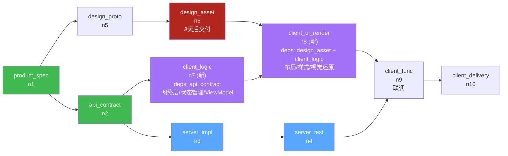
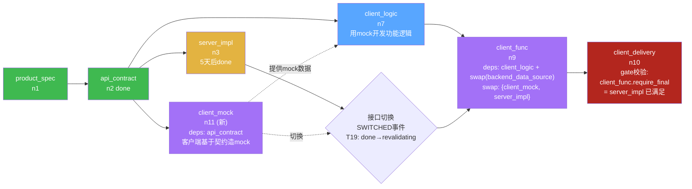
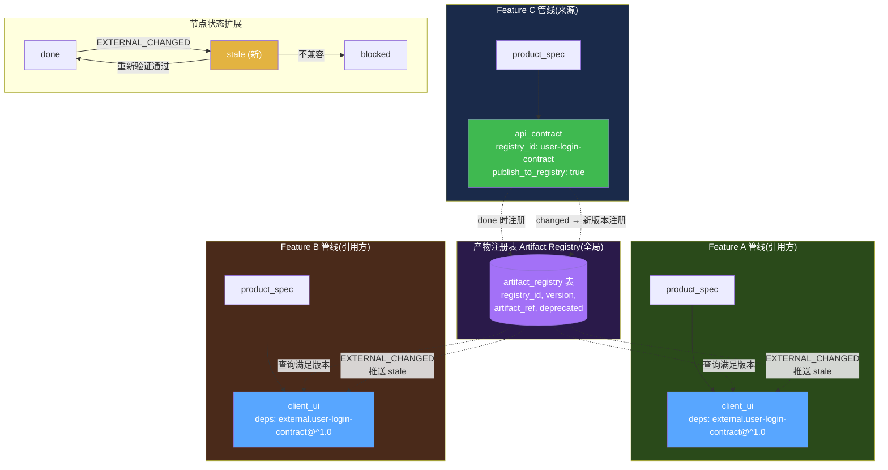
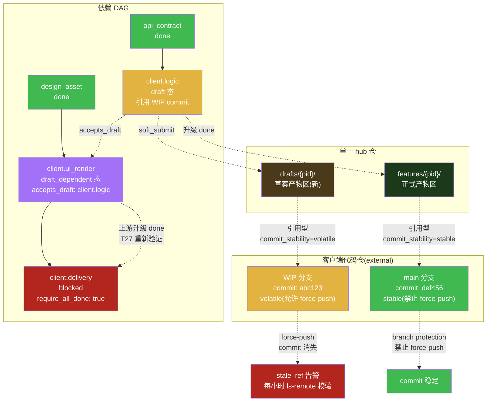
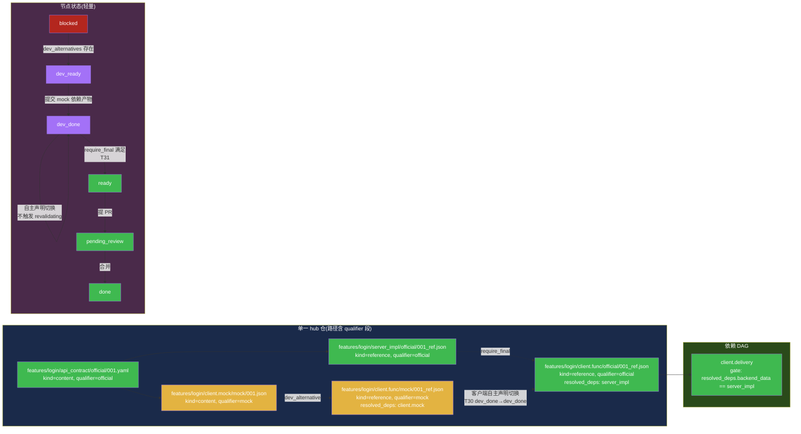

# PRD 压力测试:并行依赖场景走查与设计缺陷修正

> **文档性质**:对《coordination-platform-prd.md》v2.0 及其深化文档(fr2-orchestration.md / fr3-fr5-crew-skills.md)的真实开发场景压力测试报告
> **版本**:v1.0 | **日期**:2026-08-04 | **状态**:待评审
> **方法**:选取 3 个真实开发中常见的"并行 + 依赖"场景,逐步走查 PRD 当前设计能否处理,定位设计缺陷并提出修正方案
> **父文档**:[coordination-platform-prd.md](../coordination-platform-prd.md)
> **关联深化**:[fr2-orchestration.md](../deep-dive/fr2-orchestration.md) | [fr3-fr5-crew-skills.md](../deep-dive/fr3-fr5-crew-skills.md)

---

## 0. 测试方法说明

本文不验证 HappyPath(TC-01 已覆盖),而是用 3 个"边界但常见"的真实场景压力测试 PRD 的依赖模型与节点抽象:

| 场景 | 核心挑战 | 压测的 PRD 设计点 |
|---|---|---|
| 场景 2 | 设计稿延迟,客户端功能逻辑可先行 | 节点粒度 + 多入边严格依赖 |
| 场景 12 | 客户端需 mock 数据先行开发 | 产物类型完整性 + 依赖模型线性度 |
| 场景 10 | 多 feature 共享同一契约产物 | Pipeline 隔离模型 + 跨管线依赖 |

每个场景按 **场景描述 → PRD 走查 → 设计缺陷 → 修正方案 → 设计图** 组织,所有缺陷均可定位到 PRD 具体章节。

---

## 1. 场景 2:设计稿延迟,服务端先行的并行策略

### 1.1 场景描述

**业务背景**:登录功能管线启动,product_spec(n1)已 done。

**资源约束**:
- 设计师在忙别的项目,design_asset(n6)要 **3 天后**才能交付
- 服务端可立即做 api_contract(n2)+ server_impl(n3),只依赖 product_spec
- 客户端按 PRD 设计,client_ui(n7)依赖 api_contract AND design_asset(多入边)

**真实开发拆分**:
- 客户端的"**功能逻辑**"(网络层 / API client / 状态管理 / ViewModel / 路由骨架)其实只依赖 api_contract,不依赖设计稿
- 客户端的"**UI 还原**"(布局 / 样式 / 视觉细节 / 切图接入)才依赖 design_asset
- 这两部分在真实工程中是可分离的——前端框架(MVVM)天然支持先写逻辑层、再套 UI

**期望**:客户端 agent 在 design_asset 缺失的 3 天里,能并行启动"功能逻辑"开发,而不是完全闲置。

### 1.2 PRD 走查

**走查点 1:client_ui 节点定义与依赖**

PRD §2.1《节点类型完整清单》:
```
| client_ui | client | 客户端 UI 实现 |
```

fr3-fr5-crew-skills.md §6.5《client-ui-skill》:
```yaml
artifact_constraints:
  deps:
    - api_contract              # UI 依赖接口契约(数据绑定)
    - design_asset              # UI 依赖设计标注(视觉还原)
```

→ client_ui 被定义为**单节点**,deps 是 `[api_contract, design_asset]` 多入边,严格 AND 关系。

**走查点 2:多入边依赖的 ready 判定**

PRD §2.2《依赖 DAG 规则》:
```
| 多入边 | 节点依赖 N 个上游:全部 done → 本节点 ready(fork 节点同理) |
```

fr2-orchestration.md §2.1 T3 转移:
```
T3 | blocked → ready | cascade_node 上游全 done | all(dep_state==done for dep in deps(nid))
```

PRD AC2.3 验收标准:
```
AC2.3: 多入边节点,部分依赖 done 时仍 blocked
```

→ 当 api_contract done 但 design_asset 未 done 时,client_ui **必须保持 blocked**。

**走查点 3:CrewAI 分配**

PRD FR3.3 + fr3-fr5-crew-skills.md §4.3:
```python
async def on_langgraph_ready(self, node_id, state):
    # 仅当节点 ready 时才 emit ReadyEvent 给 CrewAI
```

→ client_ui 不 ready,CrewAI 不分配 Task,client_agent **完全闲置 3 天**。

**走查点 4:变更级联影响范围**

fr2-orchestration.md §2.1 T10/T16:
- design_asset changed → client_ui 级联 blocked → 递归失效 client_func、client_delivery

PRD §2.1 节点链:
```
client_ui → client_func → client_delivery
```

→ 即使后续 design_asset changed,也会把整个客户端链路全部 blocked,无法做"只失效 UI 还原、保留功能逻辑"的细粒度级联。

**走查点 5:节点类型扩展性**

PRD §2.1 节点类型固定 9 种产物节点,新增节点类型需要:
- 改 §2.1 节点类型清单
- 新增对应 skill(fr3-fr5 §6 SkillRegistry 强制 node_type → skill 一对一)
- 改 §3.1 角色权限矩阵
- 改 fr2 §7.3 节点引用完整性校验

fr3-fr5-crew-skills.md §8.1 SkillRegistry.build_index:
```python
if nt in self.index:
    raise ValueError(f"node_type {nt} 重复匹配 skill")
```

→ 节点类型扩展是"全局 breaking change",没有插件化机制。

### 1.3 设计缺陷

**缺陷 2-A:节点粒度过粗,功能逻辑与 UI 还原被绑死**

client_ui 把"功能逻辑"和"UI 还原"绑成一个节点。真实工程中这两部分依赖不同(api_contract vs design_asset)、变更频率不同(契约稳定 vs 设计迭代)、产出工具不同(API client 生成器 vs UI 还原工具),绑死导致设计稿延迟时客户端无法并行。

**缺陷 2-B:严格 AND 依赖,缺少"部分满足可启动子任务"机制**

PRD §2.2 和 AC2.3 明确"部分依赖 done 仍 blocked",这是严格 DAG 的简化假设。真实开发中"功能逻辑先行、UI 还原等设计稿"是普遍模式,严格 AND 模型逼着用户要么破坏 DAG(把 deps 改成单入边)、要么忍受闲置。

**缺陷 2-C:变更级联粒度过粗**

design_asset 变更只应失效"UI 还原"部分,但 PRD 模型下会级联整个 client_ui → client_func → client_delivery。fr2 §2.1 T16 递归失效"无差别"传播,无法表达"只失效产物的一部分"。

**缺陷 2-D:节点类型扩展成本高,无插件化机制**

fr3-fr5 §8.1 SkillRegistry 强制 node_type → skill 一对一映射,重复匹配直接 raise;新增节点类型需改 4 处文档/代码,缺少"扩展节点类型"的低成本路径。

### 1.4 修正方案

**方案 2-1(推荐):拆分 client_ui 为两个节点类型**

引入两个新节点类型替换 client_ui:

| 新节点类型 | 角色 | deps | 说明 |
|---|---|---|---|
| `client_logic` | client | api_contract | 客户端功能逻辑:网络层 / 状态管理 / API client / ViewModel / 路由骨架 |
| `client_ui_render` | client | design_asset + client_logic | UI 还原:布局 / 样式 / 视觉细节 / 切图接入 |

**收益**:
- design_asset 缺失时 client_logic 可立即 ready,client agent 不闲置
- design_asset changed 只级联 client_ui_render,不动 client_logic(细粒度级联)
- 严格 DAG 哲学不变,只是把"粗节点"拆成"细节点",模型自洽

**节点类型扩展原则(对应缺陷 2-D)**:
- 把 §2.1 的 9 种节点分成两层:**核心节点类型(8 种,固定)+ 扩展节点类型(可插拔)**
- SkillRegistry 改为支持"基础 skill + 扩展 skill",node_type 命名空间用前缀区分(`client.*` 归 client 角色),避免硬编码清单
- 角色权限矩阵改为"按 role 允许的 node_type 前缀"而非"枚举每个 node_type"

**方案 2-2(备选,不推荐):引入"部分依赖满足的子任务"机制**

保持 client_ui 单节点,但允许节点声明 `partial_ready_tasks`:
```yaml
node:
  type: client_ui
  deps: [api_contract, design_asset]
  partial_ready_tasks:
    - name: logic_impl
      requires: [api_contract]    # 部分依赖即可启动
    - name: ui_render
      requires: [design_asset, api_contract]
```

**为什么不推荐**:破坏严格 DAG 的简洁性,引入"节点内子状态机",与 LangGraph 节点级状态机不对齐,且 partial task 的产物归属、审核流程都需要重新定义,复杂度高于方案 2-1。

### 1.5 设计图:客户端节点拆分 DAG



**关键说明**:
- design_asset(n6)blocked 时,client_logic(n7)已 ready,client agent 可立即开发功能逻辑
- client_ui_render(n8)等多入边全 done 才 ready,符合严格 DAG
- design_asset 后续 changed 只级联 client_ui_render,client_logic 不动

### 1.6 修正后变更级联对比

| 触发 | PRD 当前(粗粒度) | 修正后(细粒度) |
|---|---|---|
| design_asset changed | client_ui → client_func → client_delivery 全失效 | 仅 client_ui_render 失效;client_logic 保留;client_func 看下游依赖是否含 client_ui_render 决定 |
| api_contract changed | client_ui → client_func → client_delivery 全失效 | client_logic + client_ui_render 同时失效(都依赖契约),级联 client_func |
| 3 天 design_asset 延迟 | client agent 闲置 3 天 | client agent 在 client_logic 上工作 3 天 |

---

## 2. 场景 12:客户端需要 Mock 服务端接口先行开发

### 2.1 场景描述

**业务背景**:api_contract(n2)已 done,契约清晰。

**资源约束**:
- 服务端在忙别的项目,server_impl(n3)要 **5 天后**才能 done
- 客户端开发不能等 5 天,需要基于契约先做 mock 数据并自测

**真实开发流程**:
1. 客户端基于 api_contract 生成/手写 mock 数据(可独立完成,不需要服务端代码)
2. 客户端用 mock 数据开发功能逻辑、跑单测、UI 联调
3. server_impl done 后,客户端从 mock 切换到真实接口
4. 切换通常只需改"数据源配置",不需重写客户端代码

**关键问题**:
- mock 数据谁产出?服务端?客户端?管理方?
- mock 产物要不要纳入管理(版本化 / 审核 / 可追溯)?
- mock 与 server_impl 是并行的两条线,怎么表达?
- mock → 真实接口的"切换"在 PRD 里怎么表达?

### 2.2 PRD 走查

**走查点 1:产物类型清单是否有 mock 类型**

PRD §2.1《节点类型完整清单》9 种产物节点:
```
product_spec / api_contract / server_impl / server_test /
design_proto / design_asset / client_ui / client_func / client_delivery
```

→ **没有 mock 类型**。客户端无节点类型可挂 mock 产物,无 skill 约束 mock 格式,无审核流程。

**走查点 2:依赖模型能否表达"基于契约造 mock"**

PRD §2.2 依赖规则只支持"节点 deps 全 done 才 ready",无任何"并行替代依赖"概念。

fr2-orchestration.md §7.3 节点引用完整性:
```
| deps 引用存在 | 每个 dep 必须在 nodes 列表中 | DANGLING_REF |
```

→ mock 节点若存在,deps = [api_contract] 是合法的(契约 done 即可 ready);但**当前 PRD 没有这个节点类型,无从声明**。

**走查点 3:client_func 的依赖链锁死**

fr3-fr5-crew-skills.md §6.6《client-delivery-skill》:
```yaml
artifact_constraints:
  deps:
    - client_ui
    - server_impl               # 联调依赖服务端实现
```

→ client_func deps = [client_ui, server_impl]。server_impl 不 done 时 client_func blocked,**即使客户端用 mock 跑通了联调,也无法提交 client_func 产物**。

**走查点 4:mock → 真实接口切换无表达**

PRD 状态机(fr2 §2.1)只有:
- T7: pending_review → done(产物合并)
- T10: done → changed(产物重新提交,新 commit ≠ 旧 commit)

→ "切换接口"不是"产物变更",而是"依赖切换"。客户端 client_func 产物本身没变(代码还是那套代码,只是数据源配置从 mock 切到 real),但 PRD 没有表达"依赖切换触发重新校验"的机制:
- 如果走 changed:语义不对(产物没变),且会清空下游 client_delivery 的产物引用
- 如果不走 changed:client_func 一直挂在 mock 上,server_impl done 后没有事件触发"重新联调验证"

**走查点 5:mock 产物的归属与角色权限**

PRD §3.1《角色定义》:
- server 角色:api_contract / server_impl / server_test
- client 角色:client_ui / client_func / client_delivery

→ mock 数据归属模糊:
- 若归 server:server agent 在忙,5 天内产不出 mock
- 若归 client:client 角色没有 mock 节点类型,§3.2 权限矩阵会 FORBIDDEN_NODE_ROLE
- 若归管理方:违背 PRD §1.2 "管理方不执行开发"原则

### 2.3 设计缺陷

**缺陷 12-A:产物类型缺失,无 mock 类型**

PRD §2.1 节点类型清单遗漏 mock 类产物。真实开发中 mock 数据是客户端并行开发的"准产物",不纳入管理会导致:
- mock 数据散落在客户端本地,无版本、无审核、无追溯
- mock 与契约的版本对齐无机制,契约变了 mock 不变,联调时出问题

**缺陷 12-B:依赖模型过于线性,无法表达"并行替代依赖"**

PRD §2.2 的依赖模型是"串行+汇合"语义:client_func 必须等 server_impl done。但真实开发中,"基于契约造 mock"和"基于契约实现服务"是**并行的两条线**,客户端在 mock 上工作不影响后续切真实接口。PRD 表达不了这种"开发态 mock 依赖 + 生产态 real 依赖"的双轨模型。

**缺陷 12-C:mock → 真实接口切换无表达**

PRD 状态机只有"产物变更(changed)"概念,没有"依赖切换"概念。client_func 产物本身没变,但其依赖从 mock 切到 real,理应触发"重新联调验证",但 PRD 没有对应事件和状态。

**缺陷 12-D:mock 产物归属模糊,角色权限不支持**

PRD §3.1 / §3.2 角色权限矩阵没有 mock 产出的角色,server 在忙时无法产出,client 又无权限,管理方又不能产出。归属未定义。

### 2.4 修正方案

**方案 12-1:新增 `client_mock` 节点类型 + 引入"可替换依赖(swap dep)"机制**

**步骤 1:新增节点类型**

PRD §2.1 节点类型清单增加:
```
| client_mock | client | 客户端 mock 数据(基于 api_contract 生成,供 client_func 并行开发) |
```

- 角色归属:client(client 角色自己造 mock,合理——客户端最清楚自己需要什么 mock)
- deps:`[api_contract]`(只依赖契约,不依赖 server_impl)
- skill:`client-mock-skill`(约束 mock 数据必须对照 api_contract 的 schema)

**步骤 2:引入"可替换依赖"声明**

client_func 的 deps 改为:
```yaml
deps:
  - client_ui
  - server_impl
swap_deps:                      # 新字段:可替换依赖
  - group: backend_data_source
    alternatives:
      - client_mock             # 开发态:用 mock 跑联调
      - server_impl             # 生产态:用真实接口跑联调
    require_final: server_impl  # 交付前必须切换到 server_impl
```

**语义**:
- `deps` 是"硬依赖",必须 done 才能 ready
- `swap_deps` 是"可替换依赖组",**任一 alternative done 即可让节点 ready(开发态)**
- `require_final` 声明"交付态必须满足的 alternative",节点 ready 不阻塞,但 client_delivery(下游叶子)的 gate 校验"client_func 的 backend_data_source 是否已切到 server_impl"

**步骤 3:状态机扩展——新增 `SWITCHED` 事件**

fr2 §2.1 状态转移表新增:
```
T19 | done → revalidating | swap_dep_alternative changed(mock → real 或 real → mock)
T20 | revalidating → done | 重新联调验证通过(可选 gate)
```

- `revalidating` 是新中间态:产物本身没变,但依赖切换,需重新验证(可选跑一遍 gate)
- 切换不强制清空下游产物引用(与 changed 区分),只触发"重新验证"事件

**步骤 4:mock 产物的版本管理**

client_mock 产物含 `compatible_contract_version` 字段,与 api_contract 版本对齐:
- api_contract changed → 检查 client_mock 的 compatible_contract_version,不兼容时 client_mock 标 `stale`(新状态)或强制 changed
- client_mock 重新生成后 bump version,与 api_contract 新版本对齐

**方案 12-2(更激进,长期演进):引入"开发态/交付态"双 DAG 视图**

把每个管线拆成两层 DAG:
- 开发态 DAG:允许 mock / 临时依赖 / 部分满足
- 交付态 DAG:严格依赖,所有 require_final 满足才能交付

这是更大的设计变更,建议作为 v3 演进方向,v2 先用方案 12-1 兜底。

### 2.5 设计图:Mock 并行依赖图



**关键说明**:
- api_contract done 后,client_mock 立即 ready(client agent 自己造,不等 server)
- client_func 通过 swap_deps 在 mock 上 ready,可立即联调
- server_impl done 后,触发 SWICTHED 事件,client_func 进 revalidating 重新验证
- 验证通过后,client_delivery 的 gate 才放行(require_final = server_impl)

### 2.6 修正前后对比

| 维度 | PRD 当前 | 修正后 |
|---|---|---|
| mock 产物管理 | 无类型,散落本地 | client_mock 节点 + skill 约束 + 版本对齐 |
| 客户端并行度 | 等 server_impl 5 天 | 立即用 mock 开发,server_impl done 后切换验证 |
| 切换表达 | 无机制,只能走 changed(语义错) | SWITCHED 事件 + revalidating 状态,不清空下游 |
| 交付门禁 | 无差别 | require_final gate 确保交付前切到真实接口 |
| mock 归属 | 模糊 | client 角色(client 最清楚自己要什么 mock) |

---

## 3. 场景 10:多个 feature 管线共享同一产物

### 3.1 场景描述

**业务背景**:三个 feature 并行开发:

| Feature | 管线 | 内容 |
|---|---|---|
| Feature C | pipeline-c | 用户登录功能(产出 api_contract: user-login-contract) |
| Feature A | pipeline-a | 用户登录页 UI(依赖 user-login-contract) |
| Feature B | pipeline-b | 用户资料页(也依赖 user-login-contract,因资料页需要登录态) |

**真实开发情况**:
- Feature C 先做,产出 user-login-contract v1.0
- Feature A 和 B 的管线都"引用"这份契约,不重新造
- 后续 Feature C 升级契约到 v2.0(如新增 OAuth 字段),Feature A 和 B 需感知并适配

**类似场景(更广义)**:
- 组件库 / 设计系统 / 通用错误码 schema / 公共 API 类型定义——都是跨 feature 共享的产物

### 3.2 PRD 走查

**走查点 1:Pipeline 隔离模型**

PRD §2.1《核心概念与术语》:
```
| 管线(Pipeline) | 一个功能需求的全链路 DAG,由节点和依赖边组成 |
```

→ Pipeline 是"一个功能需求"的 DAG,定义上就是隔离的。

**走查点 2:节点引用完整性校验明确禁止跨管线引用**

fr2-orchestration.md §7.3《节点引用完整性》:
```
| deps 引用存在 | 每个 dep 必须在 nodes 列表中 | DANGLING_REF |
```

fr2 §7.2 `validate_dag_acyclic` 实现:
```python
for dep in n.get("deps", []):
    if dep not in adj:
        return False, [f"DANGLING_REF: {n['id']} 依赖不存在的 {dep}"]
```

→ 节点 deps 只能引用**本管线 nodes 列表内**的 node_id。Feature A 的节点若 deps 引用 Feature C 的 node_id,加载时直接 `DANGLING_REF` 拒绝。

**走查点 3:无产物注册表概念**

PRD §5.2《存储方案》只有:
- PipelineState(checkpointer)
- artifact_refs(随 state 持久化,本管线内)
- audit_log
- 产物内容(产物仓库)

fr2 §6.1 平台扩展表:`idempotency_keys / node_path_registry / dlq / audit_log / events / pipeline_registry / lock_wait_log`

→ `node_path_registry` 是**同管线内路径占用校验**(§4.2),不是跨管线共享产物的注册表。`pipeline_registry` 是管线元数据注册,不是产物注册。

**走查点 4:变更级联只在管线内递归**

fr2-orchestration.md §2.1 T16:
```
T16 | blocked/ready/.../pending_review → blocked | 下游 cascade 失效(上游 changed 递归) | 本节点是某 changed 节点的下游可达节点
```

fr2 §2.1 备注:
```
T16 是递归失效,需用 visited set 防环(虽然 DAG 无环,但跨管线引用需防护)。
```

→ 备注"跨管线引用需防护"暗示设计时考虑过但未落地。当前级联只在**本管线 DAG 可达节点**内递归,Feature C 的契约 changed 不会触发 Feature A/B 的节点 blocked。

**走查点 5:DRY 违反——重复提交契约的后果**

如果 Feature A 和 B 各自重新提交一份相同的 user-login-contract 产物:
- 违反 DRY:同一份契约在产物仓库有 3 份副本(Feature C 原始 + A 复制 + B 复制)
- 一致性风险:Feature A 复制时手抖改了字段,Feature B 又是另一版本,三方契约漂移
- 审核资源浪费:三份契约都要走 api-contract-skill 的 requires_human_review=true 人工审

### 3.3 设计缺陷

**缺陷 10-A:Pipeline 强隔离,无跨管线依赖机制**

PRD §2.1 + fr2 §7.3 明确禁止跨管线节点引用。真实开发中跨 feature 共享契约 / 组件库 / 设计系统是常态,强隔离模型逼着用户要么复制产物(违反 DRY)、要么把多个 feature 塞进一个超大管线(违反"一个功能需求一个管线"的定义)。

**缺陷 10-B:无产物注册表,已发布产物无全局视图**

PRD §5.2 存储方案没有"已发布产物"的全局索引。新管线启动时,无法查询"已有哪些契约 / 组件库可复用",只能靠人记忆或外部文档。node_path_registry 只是同管线路径占用,不是产物发现机制。

**缺陷 10-C:跨管线变更感知缺失**

Feature C 契约 changed 后,Feature A/B 的节点不会被级联失效。fr2 T16 递归只在管线内,跨管线引用"需防护"但未落地。后果:Feature C 升级契约到 v2.0,Feature A/B 还在用 v1.0,联调时才发现不兼容。

**缺陷 10-D:版本对齐无机制**

跨管线引用的产物如何保证版本一致?Feature A 引用 v1.0,Feature C 已升 v2.0,Feature A 何时升级?PRD 的 ArtifactRef 只有 commit,没有 version_range 概念,无法表达"接受 v1.x 但不接受 v2"。

### 3.4 修正方案

**方案 10-1:引入"产物注册表(Artifact Registry)" + "外部产物引用(External ArtifactRef)"**

**步骤 1:产物注册表(全局)**

PRD §5.2 存储方案新增 `artifact_registry` 表:
```sql
CREATE TABLE artifact_registry (
    registry_id TEXT PRIMARY KEY,          -- 全局唯一,如 "user-login-contract"
    source_pipeline_id TEXT NOT NULL,      -- 来源管线
    source_node_id TEXT NOT NULL,          -- 来源节点
    node_type TEXT NOT NULL,               -- api_contract / design_asset / ...
    version TEXT NOT NULL,                 -- semver
    artifact_ref JSONB NOT NULL,           -- {repo, path, commit, toolspec_framework, trace_id}
    published_at TIMESTAMPTZ NOT NULL DEFAULT now(),
    deprecated BOOLEAN NOT NULL DEFAULT false,
    UNIQUE (source_pipeline_id, source_node_id, version)
);
CREATE INDEX idx_registry_type_version ON artifact_registry(node_type, version);
```

**注册时机**:节点 done 时,若该节点声明 `publish_to_registry: true`(pipeline.yaml 节点配置),自动写入 artifact_registry。

**注册规则**:
- registry_id 由来源管线声明(如 Feature C 的 api_contract 节点声明 `registry_id: user-login-contract`)
- 同一 registry_id 多版本共存(v1.0 / v2.0 都在注册表)
- 版本废弃:`deprecated: true`,新引用不允许,旧引用触发告警

**步骤 2:外部产物引用(External ArtifactRef)**

节点 deps 扩展支持外部引用:
```yaml
# pipeline-a.yaml(Feature A)
nodes:
  - id: "a2"
    type: "client_ui"
    role: "client"
    deps:
      - node_id: "a1"                    # 管线内依赖(原有)
      - external:                         # 外部依赖(新)
          registry_id: "user-login-contract"
          version_range: "^1.0.0"         # semver range,接受 1.x.x
          fallback: "block"               # 注册表无满足版本时的策略:block / warn
```

**加载校验扩展**(fr2 §7.3 新增):
- `external` 依赖校验:从 artifact_registry 查询满足 version_range 的最新版本
- 找到 → 注入为"虚拟上游节点"(只读 ArtifactRef,无状态机参与)
- 找不到 → 按 fallback 策略(block 则管线加载失败;warn 则标记节点 stale)

**ready 判定扩展**:
- 外部依赖视为"已 done 上游"(注册表中的产物都是 done 状态才注册)
- 节点 ready 时,get_dependencies 返回外部产物内容(git show 拉取)

**步骤 3:跨管线变更感知**

Feature C 的 api_contract changed → 重新 done 后写入 artifact_registry 新版本 → 触发 `EXTERNAL_CHANGED` 事件推送:

```python
# 监听 registry 变更,推送给所有引用方
async def on_registry_update(registry_id: str, new_version: str):
    referrers = await db.fetch_all(
        "SELECT pipeline_id, node_id FROM external_refs WHERE registry_id=$1",
        registry_id,
    )
    for r in referrers:
        if not semver_satisfies(new_version, r["version_range"]):
            # 新版本不在接受范围 → 不强制失效,只告警
            await emit_event(r["pipeline_id"], r["node_id"], "EXTERNAL_OUT_OF_RANGE", ...)
        else:
            # 新版本在接受范围 → 推送 EXTERNAL_CHANGED,节点本地置 stale
            await langgraph_invoke(r["pipeline_id"], {
                "node_id": r["node_id"],
                "event": "EXTERNAL_CHANGED",
                "new_ref": new_artifact_ref,
            })
```

**新增节点状态 `stale`**(fr2 §2.1 状态机扩展):
```
T21 | done → stale | 外部依赖 EXTERNAL_CHANGED(新版本可用)
T22 | stale → done | 节点重新验证(可选重新提交 / 显式 ack 接受新版本)
T23 | stale → blocked | 节点重新验证发现不兼容,需重做
```

`stale` 与 `changed` 区分:
- `changed`:本管线内上游变更,强制失效下游
- `stale`:外部依赖变更,软通知,不强制失效下游,由节点决定是否重新验证

**步骤 4:版本对齐机制**

artifact_registry 支持版本查询:
- 新管线加载时,external dep 查询满足 version_range 的最新版本,自动绑定
- version_range 用 semver:`^1.0.0`(接受 1.x.x)、`~1.0.0`(接受 1.0.x)、`>=1.0.0 <2.0.0`
- 来源管线废弃旧版本时,引用方收到 `EXTERNAL_DEPRECATED` 告警,需迁移到新版本

**步骤 5:权限与安全**

- 注册表写入:只有来源管线的 done 节点可注册(防越权注册)
- 注册表读取:所有管线可读(公开产物)
- 外部引用声明:pipeline.yaml 加载时校验 registry_id 存在
- 外部产物内容访问:get_dependencies 拉取时校验调用方管线是否声明了该 external dep(防越权读取)

### 3.5 设计图:跨管线共享产物架构



**关键说明**:
- Feature C 的 api_contract done 后自动注册到全局 artifact_registry
- Feature A/B 通过 external 引用,加载时从注册表拉取满足 version_range 的最新版本
- Feature C 升级契约 → 注册表新版本 → 推送 EXTERNAL_CHANGED → A/B 节点置 stale(软通知,不强制失效)
- A/B 自主决定是否重新验证(重新提交 / 显式 ack)

### 3.6 修正前后对比

| 维度 | PRD 当前 | 修正后 |
|---|---|---|
| 跨管线引用 | 禁止(DANGLING_REF) | 通过 external dep + 注册表支持 |
| 共享产物发现 | 无机制,靠人记忆 | artifact_registry 全局查询 |
| DRY | 三份副本,可能漂移 | 单一来源,引用方共享 |
| 变更感知 | 无,联调时才发现 | EXTERNAL_CHANGED 推送 + stale 状态 |
| 版本对齐 | 无,只有 commit | semver version_range,自动绑定满足版本 |
| 强制失效 | 全或无 | stale 软通知,节点自主决定 |

---

## 4. 缺陷汇总表

| 缺陷 ID | 场景 | 缺陷描述 | 影响 PRD 章节 | 严重度 | 修正方案 |
|---|---|---|---|---|---|
| **2-A** | 场景 2 | client_ui 节点粒度过粗,功能逻辑与 UI 还原绑死 | §2.1 / FR5.4 / fr3-fr5 §6.5 | 高 | 拆分为 client_logic + client_ui_render |
| **2-B** | 场景 2 | 严格 AND 依赖,缺少"部分满足可启动子任务"机制 | §2.2 / AC2.3 / fr2 §2.1 T3 | 高 | 通过节点拆分规避(方案 2-1),非引入 partial ready |
| **2-C** | 场景 2 | 变更级联粒度过粗,design_asset changed 全链路失效 | fr2 §2.1 T16 | 中 | 节点拆分后级联自然细化 |
| **2-D** | 场景 2 | 节点类型扩展成本高,无插件化机制 | §2.1 / §3.1 / fr3-fr5 §8.1 | 中 | 节点类型分核心+扩展两层,SkillRegistry 改前缀匹配 |
| **12-A** | 场景 12 | 产物类型缺失,无 mock 类型 | §2.1 | 高 | 新增 client_mock 节点类型 + client-mock-skill |
| **12-B** | 场景 12 | 依赖模型过于线性,无法表达"并行替代依赖" | §2.2 / fr2 §2.1 T3 | 高 | 引入 swap_deps 可替换依赖组 |
| **12-C** | 场景 12 | mock → 真实接口切换无表达,只能走 changed(语义错) | fr2 §2.1 状态机 | 高 | 新增 SWITCHED 事件 + revalidating 状态(T19/T20) |
| **12-D** | 场景 12 | mock 产物归属模糊,角色权限不支持 | §3.1 / §3.2 | 中 | 归属 client 角色,扩展权限矩阵 |
| **10-A** | 场景 10 | Pipeline 强隔离,无跨管线依赖机制 | §2.1 / fr2 §7.3 | 高 | 引入 external dep 外部产物引用 |
| **10-B** | 场景 10 | 无产物注册表,已发布产物无全局视图 | §5.2 / fr2 §6.1 | 高 | 新增 artifact_registry 表 + publish_to_registry 机制 |
| **10-C** | 场景 10 | 跨管线变更感知缺失,Feature C 升级 A/B 不知道 | fr2 §2.1 T16(仅管线内) | 高 | EXTERNAL_CHANGED 事件 + stale 状态(T21/T22/T23) |
| **10-D** | 场景 10 | 版本对齐无机制,只有 commit 无 version_range | §5.1 ArtifactRef | 中 | artifact_registry 支持 semver version_range |

### 严重度统计

| 严重度 | 数量 | 缺陷 ID |
|---|---|---|
| 高 | 8 | 2-A, 2-B, 12-A, 12-B, 12-C, 10-A, 10-B, 10-C |
| 中 | 4 | 2-C, 2-D, 12-D, 10-D |
| 低 | 0 | — |
| **合计** | **12** | — |

### 修正涉及的 PRD 章节变更清单

| PRD 章节 | 变更内容 | 关联缺陷 |
|---|---|---|
| §2.1 节点类型清单 | 9 种 → 11 种(+ client_logic / client_ui_render / client_mock),引入"核心+扩展"分层 | 2-A, 2-D, 12-A |
| §2.2 依赖 DAG 规则 | 新增 swap_deps 可替换依赖组语义 | 12-B |
| §2.1 状态机 | 新增 revalidating / stale 两态;新增 T19~T23 转移 | 12-C, 10-C |
| §2.1 Pipeline 定义 | 引入 external dep 概念,允许跨管线引用 | 10-A |
| §3.1 角色定义 | client 角色新增 client_logic / client_ui_render / client_mock 节点类型 | 2-A, 12-A |
| §3.2 权限矩阵 | 节点类型改为"前缀匹配"而非枚举(如 client.* 归 client) | 2-D |
| §5.1 ArtifactRef | 新增 external_ref 子类型,含 registry_id + version_range | 10-D |
| §5.2 存储方案 | 新增 artifact_registry 表 + external_refs 表 | 10-B |
| FR5.4 skill 摘要 | 新增 client-logic-skill / client-ui-render-skill / client-mock-skill | 2-A, 12-A |
| fr2 §7.3 节点引用完整性 | 新增 external dep 校验规则(registry_id 存在性 + version_range 满足性) | 10-A |
| fr2 §2.1 状态转移表 | 新增 T19~T23(SWITCHED / EXTERNAL_CHANGED 相关) | 12-C, 10-C |
| fr2 §6.1 Postgres schema | 新增 artifact_registry / external_refs 表 DDL | 10-B |
| fr3-fr5 §8.1 SkillRegistry | node_type 改为前缀匹配,支持扩展节点类型 | 2-D |

---

## 5. 整体结论与优先级建议

### 5.1 三类缺陷的根因归纳

3 个场景暴露的 12 个缺陷,根因可归纳为 **3 类设计假设过强**:

| 根因 | 涉及缺陷 | 表现 |
|---|---|---|
| **节点粒度假设过粗** | 2-A, 2-B, 2-C, 12-A | 假设 9 种节点类型够用,真实工程的"功能逻辑/UI 还原/mock"分离未覆盖 |
| **依赖模型假设过线性** | 12-B, 12-C, 12-D | 假设严格 AND 依赖 + 单一 commit 引用够用,真实工程的"并行替代依赖 / 依赖切换 / 版本范围"未覆盖 |
| **Pipeline 隔离假设过强** | 10-A, 10-B, 10-C, 10-D | 假设管线完全独立,真实工程的"跨 feature 共享产物 / 全局注册表 / 变更感知"未覆盖 |

### 5.2 修正优先级建议

**P0(本期必须修,否则平台无法支撑真实并行开发)**:
- 缺陷 2-A:client_ui 拆分(影响客户端并行度,核心场景)
- 缺陷 12-A:client_mock 节点(影响客户端并行度,核心场景)
- 缺陷 12-B:swap_deps 机制(缺陷 12-A 的依赖基础)
- 缺陷 10-A:external dep 机制(影响跨 feature 协作,核心场景)
- 缺陷 10-B:artifact_registry(缺陷 10-A 的存储基础)

**P1(本期建议修,否则变更感知有盲区)**:
- 缺陷 12-C:SWITCHED 事件 + revalidating 状态
- 缺陷 10-C:EXTERNAL_CHANGED + stale 状态
- 缺陷 10-D:version_range 版本对齐

**P2(本期可缓,演进优化)**:
- 缺陷 2-C:级联细化(节点拆分后自然缓解)
- 缺陷 2-D:节点类型插件化(用前缀匹配临时兜底)
- 缺陷 12-D:mock 归属(归 client 角色即可,权限矩阵小改)

### 5.3 与现有深化文档的对齐

本报告的修正方案均**不与现有深化文档冲突**,而是**扩展**:

| 修正项 | 对齐的深化文档 | 扩展方式 |
|---|---|---|
| 节点拆分 | fr3-fr5 §6 skill.yaml | 新增 3 个 skill,结构同现有 |
| swap_deps | fr2 §2.2 DAG 规则 | 新增依赖类型,不修改原有 deps 语义 |
| revalidating / stale 状态 | fr2 §2.1 状态机 | 新增 2 态 + 5 转移,不修改 T1~T18 |
| external dep | fr2 §7.3 引用完整性 | 新增校验规则,原有 DANGLING_REF 保留 |
| artifact_registry | fr2 §6.1 Postgres schema | 新增 2 表,原有表不动 |

建议本报告作为 PRD v2.1 的输入,在主 PRD §2.1 / §2.2 / §5 / §3.1 章节增量补充,并在 fr2 / fr3-fr5 深化文档中追加对应小节,不破坏现有 v2.0 的设计自洽性。

---

## 附录:走查引用的 PRD 章节速查

| 引用章节 | 出处 | 用途 |
|---|---|---|
| §2.1 节点类型清单 | coordination-platform-prd.md | 9 种产物节点定义 |
| §2.2 依赖 DAG 规则 | coordination-platform-prd.md | 多入边全 done 才 ready |
| §2.1 状态机 7 态 | coordination-platform-prd.md | blocked/ready/.../changed |
| §3.1 角色定义 | coordination-platform-prd.md | 4 角色 + 可产出节点类型 |
| §5.1 ArtifactRef | coordination-platform-prd.md | 产物引用结构(repo/path/commit) |
| §5.2 存储方案 | coordination-platform-prd.md | 无产物注册表 |
| AC2.3 | coordination-platform-prd.md | 多入边部分 done 仍 blocked |
| FR5.4 skill 约束摘要 | coordination-platform-prd.md | client-ui-skill deps |
| fr2 §2.1 T1~T18 | fr2-orchestration.md | 状态转移表 |
| fr2 §2.1 T16 | fr2-orchestration.md | 递归失效(仅管线内) |
| fr2 §6.1 Postgres schema | fr2-orchestration.md | 平台扩展表清单(无 registry) |
| fr2 §7.3 节点引用完整性 | fr2-orchestration.md | deps 必须在本管线(DANGLING_REF) |
| fr3-fr5 §6.5 client-ui-skill | fr3-fr5-crew-skills.md | deps: api_contract + design_asset |
| fr3-fr5 §6.6 client-delivery-skill | fr3-fr5-crew-skills.md | deps: client_ui + server_impl |
| fr3-fr5 §8.1 SkillRegistry | fr3-fr5-crew-skills.md | node_type → skill 一对一,重复 raise |

---

**报告结束。** 共定位 12 个设计缺陷(8 高 / 4 中 / 0 低),提出 3 套修正方案(节点拆分 / swap_deps + SWITCHED / artifact_registry + external dep),包含 3 张 Mermaid 设计图。所有缺陷均可定位到 PRD 具体章节,修正方案与现有深化文档对齐不冲突。

---

## 第三部分:基于需求 9(产物自由)+ 单一 hub 仓模型的重新走查(第三轮)

> **重新走查背景**:需求 9(产物完成度自由 + 产物自由定义)与严格依赖图、固定节点类型之间的张力需要重新评估。同时,产物仓库模型已从"多产物仓库 RepoRegistry"修正为"单一 hub 仓"(附录 D7),ArtifactRef 增加 `artifact_kind`(content/reference)、`external_repo`、`external_commit` 字段,引用型产物只做 `git ls-remote` 存在性校验。第二轮 A13 已引入 `draft` 态(P0-12),A6 已引入 `free_artifact` + `side_node`(P0-13)。本部分基于这些演进,对场景 2 / 12 / 10 重新走查。

### 3.1 场景 2 重新走查:设计稿延迟下的草案依赖与产物完成度自由

#### 3.1.1 旧结论回顾

第一轮走查定位 4 个缺陷:
- 2-A:client_ui 节点粒度过粗(拆分为 client_logic + client_ui_render)
- 2-B:严格 AND 依赖,缺少"部分满足可启动子任务"机制
- 2-C:变更级联粒度过粗
- 2-D:节点类型扩展成本高,无插件化机制

修正方案 2-1 提出拆分 client_ui 为 `client_logic`(deps: api_contract)+ `client_ui_render`(deps: design_asset + client_logic),并建议节点类型分"核心+扩展"两层。

#### 3.1.2 新设计影响

**影响 1:draft 态( A13)与需求 9"完成度自由"的叠加**

第二轮 A13 已引入 `draft` 状态(P0-12),允许"软提交"草案产物。需求 9 进一步说"产物完成度自由",意味着 client_logic 可以是部分完成的草案。但旧修正方案 2-1 假设 client_logic 是正式节点(done 态),未考虑 draft 态下 client_ui_render 能否依赖 draft 产物。

**走查点**:fr2 §2.1 T3 转移要求 `all(dep_state==done for dep in deps(nid))`,draft ≠ done,client_ui_render 仍 blocked。需求 9 的"完成度自由"在依赖链上被严格依赖图截断。

**影响 2:单一 hub 仓下草案产物的存储**

旧方案假设产物仓库按类型分目录(`client_logic/001.yaml`)。单一 hub 仓模型下(附录 D7),所有产物在一个 git 仓库。若 draft 产物也 squash merge 到 main,会污染正式产物视图——下游 get_dependencies 拉取时无法区分正式产物与草案。

**走查点**:PRD §5.1 ArtifactRef 只有 `artifact_kind`(content/reference)区分物理形态,没有区分"正式/draft"的逻辑角色。fr1-fr6 §2 的目录结构没有 draft 专属区域。

**影响 3:引用型 draft 产物的 commit 稳定性**

client_logic 是客户端代码,在单一 hub 仓中作为**引用型产物**(`artifact_kind=reference`),`external_commit` 指向客户端代码仓的 commit。附录 D7 明确"引用型产物只做 `git ls-remote` 存在性校验"。

**走查点**:draft 阶段的 client_logic 指向代码仓 WIP 分支的 commit。WIP 分支常被 force-push,commit 可能消失。`git ls-remote` 只校验 commit 当前存在,不保证未来稳定。下游 client_ui_render 若依赖 draft 引用,后续追溯产物时 commit 可能已失效。

#### 3.1.3 需求 9 张力

**张力 1:"产物完成度自由" vs 严格依赖图(全部 done 才 ready)**

需求 9 允许产物以任意完成度存在(draft / partial / done),但 fr2 §2.1 T3 要求上游全 done 下游才 ready。这意味着:
- client_logic 以 draft 提交后,client_ui_render 仍 blocked
- 客户端 agent 无法基于"功能逻辑草案"并行启动 UI 还原的预备工作(如读 draft 契约确定数据结构)
- 需求 9 的"完成度自由"在单节点内有意义,但跨节点依赖链上被严格 DAG 否定

**张力 2:"产物自由定义" vs 节点类型固定(9 种)+ SkillRegistry 一对一**

需求 9 说"产物怎么定义,由各端自己定义和演进"。client_logic 是客户端自定义的节点类型(旧方案 2-1 提出)。但:
- fr3-fr5 §8.1 SkillRegistry.build_index 强制 `node_type → skill` 一对一,重复 raise
- fr2 §7.3 校验"产物节点 type 在 9 种产物类型中",否则 `INVALID_NODE_TYPE`
- client_logic 不在 9 种中,管线加载时直接拒绝

A6 引入的 `free_artifact` + `side_node`(P0-13)是为"无依赖旁路产物"设计的,但 client_logic 在主依赖链上(被 client_ui_render 依赖),不是旁路产物。

#### 3.1.4 新发现的设计缺陷

**D2-R3.1:草案产物作为下游依赖的语义未定义(高)**

A13 引入 draft 态 + soft_submit,但未定义 draft 产物能否作为下游依赖。fr2 §2.1 T3 的 `all(dep_state==done)` 明确排除 draft。需求 9"完成度自由"与严格依赖图直接冲突:若允许 draft 依赖,破坏 DAG 严格性;若不允许,需求 9 在依赖链上失效。当前设计无 `accepts_draft_dep` 之类的声明机制。

**D2-R3.2:引用型 draft 产物的 commit 稳定性无保障(高)**

附录 D7 规定引用型产物只做 `git ls-remote` 存在性校验。但 draft 引用型产物指向代码仓 WIP 分支 commit,WIP 分支常被 force-push。当前设计:
- 无 `commit_stability` 字段区分 stable/volatile commit
- 无定期校验机制确认 commit 仍存在
- commit 消失后下游产物引用追溯失败,审计链断裂

**D2-R3.3:单一 hub 仓中 draft 产物的存储位置与正式产物混存(中)**

PRD §5.1 ArtifactRef 只有 `artifact_kind`(content/reference),无 draft/official 逻辑角色区分。fr1-fr6 §2 目录结构无 draft 专属区域。draft 产物若 squash merge 到 main,正式产物视图被污染;若不开 PR(soft_submit),又不进 main,get_dependencies 无法拉取。

**D2-R3.4:client_logic 自定义节点类型被 SkillRegistry + fr2 §7.3 双重拒绝(高)**

需求 9"各端自己演进"要求节点类型可扩展。但:
- fr2 §7.3 `INVALID_NODE_TYPE` 拒绝 9 种外的节点类型
- fr3-fr5 §8.1 SkillRegistry 重复匹配 raise
- A6 的 free_artifact 不适用主链路节点
- 旧方案 2-1 的"核心+扩展分层"未落地,无具体命名空间与匹配规则

#### 3.1.5 修正方案

**方案 2-R3:引入 draft 依赖声明 + commit 稳定性分级 + 自定义节点命名空间**

**步骤 1:draft 依赖声明(对应 D2-R3.1)**

节点 deps 扩展 `strictness` 字段:

```yaml
nodes:
  - id: "n8"
    type: "client.ui_render"
    role: client
    deps:
      - node_id: "n7"            # client_logic
        strictness: accepts_draft  # 接受 draft 态上游(开发态依赖)
      - node_id: "n6"            # design_asset
        strictness: done_only      # 必须 done(默认)
```

**语义**:
- `done_only`(默认):上游必须 done,符合现有 T3 严格依赖
- `accepts_draft`:上游 draft 或 done 均可让本节点 ready
- 当上游为 draft 时,本节点进入 `draft_dependent` 新态(非 done,产物可提交但标注依赖草案)
- `draft_dependent` 节点的下游若声明 `done_only`,则 blocked(草案依赖不传递)
- 交付门禁(client_delivery)可声明 `require_all_done: true`,强制全链路 done 才放行

**状态机扩展**(fr2 §2.1 新增):
```
T24 | blocked → draft_ready | cascade 上游全 done 或 draft(accepts_draft dep) | 上游为 draft 时进入 draft_ready
T25 | draft_ready → draft_dependent | submit_artifact(草案产物提交) | 产物合并但标注 draft_dependent
T26 | draft_dependent → blocked | 上游 draft → changed/失效 | 级联失效
T27 | draft_dependent → done | 上游升级 done + 本节点重新验证 | 草案依赖升级为正式依赖
```

**步骤 2:引用型产物 commit 稳定性分级(对应 D2-R3.2)**

ArtifactRef 引用型字段扩展:

```python
class ArtifactRef(TypedDict):
    # ... 现有字段
    external_commit: str | None
    commit_stability: str        # "stable"(默认) | "volatile"(draft 专用)
    commit_verified_at: str      # ISO8601,上次 git ls-remote 校验时间
```

**校验规则**:
- `stable`:代码仓必须配置 branch protection 禁止 force-push;平台合并时校验 branch protection 存在
- `volatile`:允许 force-push;平台每小时 git ls-remote 校验 commit 存在性,消失时标 `stale_ref` 状态并通知引用方
- draft 引用型产物默认 volatile;升级 done 时强制要求 stable(否则拒绝升级)

**步骤 3:单一 hub 仓 draft 存储区(对应 D2-R3.3)**

hub 仓增加 `drafts/` 顶层目录:

```
artifact-hub-repo/
├─ features/{pipeline_id}/{node_type}/...     # 正式产物(P0-4 路径)
├─ drafts/{pipeline_id}/{node_type}/...        # 草案产物(新)
│  └─ {node_id}.yaml
└─ .manifest.yaml                              # 产物元数据索引
```

- draft 产物用 `soft_submit`(A13)合并到 main 的 `drafts/` 目录(不走正式 PR 审核,仅格式校验)
- get_dependencies 返回时带 `artifact_qualifier: draft` 字段,agent 可自主决定是否接受
- draft 升级 done 时,产物从 `drafts/` 移到 `features/`,触发 changed 级联

**步骤 4:自定义节点类型命名空间(对应 D2-R3.4)**

节点类型改为 `{role}.{custom_name}` 命名空间:

```yaml
# pipeline.yaml
nodes:
  - id: "n7"
    type: "client.logic"          # 自定义:client 角色的 logic 节点
    role: client
    deps: ["n2"]
  - id: "n8"
    type: "client.ui_render"      # 自定义:client 角色的 ui_render 节点
    role: client
    deps:
      - node_id: "n6"
      - node_id: "n7"
        strictness: accepts_draft
```

**SkillRegistry 改为三级匹配**(fr3-fr5 §8.1 扩展):
1. 精确匹配:`client.logic` → `client-logic-skill`(若存在)
2. 前缀匹配:`client.logic` → `client-default-skill`(角色级兜底)
3. 无匹配:用 `generic-artifact-skill`(通用校验:文件存在 + 元数据基本字段)

**fr2 §7.3 校验放宽**:产物节点 type 不再限定 9 种,改为 `{role}.{name}` 命名空间格式校验 + role 一致性校验(`type` 前缀 == `role`)。

#### 3.1.6 设计图:草案依赖与 commit 稳定性



**关键说明**:
- client.logic 以 draft 态提交到 hub 仓 `drafts/` 区,引用代码仓 WIP commit(volatile)
- client.ui_render 声明 `accepts_draft`,可基于 draft 上游进入 `draft_dependent` 态并行开发
- client.delivery 声明 `require_all_done`,强制全链路 done 才放行(交付门禁)
- draft 升级 done 时,产物从 drafts/ 移到 features/,commit 从 volatile 升级为 stable
- volatile commit 被 force-push 消失时,平台每小时 ls-remote 校验,标 stale_ref 通知引用方

#### 3.1.7 修正前后对比

| 维度 | 旧修正方案 2-1 | 第三轮修正 |
|---|---|---|
| client_logic 完成度 | 必须 done 才能被下游依赖 | draft 态即可被 accepts_draft 下游依赖 |
| 引用型 commit 稳定性 | 未考虑 | stable/volatile 分级 + 定期 ls-remote 校验 |
| draft 产物存储 | 未定义 | hub 仓 drafts/ 专属区,与正式产物隔离 |
| 节点类型扩展 | "核心+扩展分层"(未落地) | {role}.{name} 命名空间 + SkillRegistry 三级匹配 |
| 交付门禁 | 无差别 | require_all_done 强制全链路 done 才放行 |

---

### 3.2 场景 12 重新走查:mock 数据产物的自由定义与节点类型扩展

#### 3.2.1 旧结论回顾

第一轮走查定位 4 个缺陷:
- 12-A:产物类型缺失,无 mock 类型(新增 client_mock)
- 12-B:依赖模型过于线性,无"并行替代依赖"(swap_deps)
- 12-C:mock → 真实接口切换无表达(SWITCHED 事件 + revalidating)
- 12-D:mock 产物归属模糊(归 client)

修正方案 12-1 提出新增 `client_mock` 节点类型 + `swap_deps` 可替换依赖组 + `SWITCHED` 事件 + `revalidating` 状态。

#### 3.2.2 新设计影响

**影响 1:需求 9"产物自由定义"下 mock 的定位**

旧方案 12-1 把 mock 定义为新的固定节点类型 `client_mock`。但需求 9 说"产物怎么定义,由各端自己定义和演进",mock 的形态应由客户端自主决定:
- 可能是 JSON mock 数据文件(内容型,存 hub 仓)
- 可能是 MSW mock 配置(引用型,指向客户端代码仓 mock 目录)
- 可能是 mock server 启动脚本(引用型)
- 可能是 OpenAPI examples 字段(内容型,附在 api_contract 产物中)

固定为 `client_mock` 节点类型无法覆盖所有形态,违反需求 9。

**走查点**:PRD §5.1 ArtifactRef 的 `artifact_kind` 只有 content/reference 两值,无法表达"这是 mock 数据"。下游 client_func 如何区分拉取的是 mock 还是真实契约?

**影响 2:单一 hub 仓中 mock 与真实产物的区分**

单一 hub 仓中,mock 产物和正式产物在同一个 git 仓库。若 mock 用 `client_mock/` 目录、正式用 `server_impl/` 目录,路径隐含了类型。但需求 9 说"各端自由定义",客户端可能把 mock 放在 `client.mock/` 自定义节点类型下,路径变成 `features/{pid}/client.mock/...`,与 `server_impl` 平级,下游无法从路径判断 mock/real 性质。

**走查点**:fr1-fr6 §2 目录结构 + P0-4 的 `features/{pipeline_id}/...` 路径模型,没有 mock/real 的路径段或元数据字段。

**影响 3:mock → 真实接口切换的"自主性"**

旧方案 12-1 提出平台强制的 `SWITCHED` 事件 + `revalidating` 状态。但需求 9 说"客户端和服务端开发怎么开发也不需要限制,提供产物和更新状态即可"。切换 mock→real 本质是客户端的自主决策:客户端在 client_func 产物提交时声明"我已切换到真实接口"即可,平台不应强制 revalidating 流程。

**走查点**:旧方案的 `swap_deps` + `require_final` 是平台强制的门禁,与需求 9 的"不限制开发方式"有张力。

#### 3.2.3 需求 9 张力

**张力 1:"产物自由定义" vs 节点类型固定(9 种)+ mock 类型归属**

mock 数据不是单一节点类型能覆盖的。需求 9 要求各端自主定义 mock 形态,但:
- 固定 `client_mock` 类型无法覆盖 MSW/mock server/OpenAPI examples 等多形态
- 用 `free_artifact`(A6)则 mock 成为旁路产物,无法被 client_func 声明为开发态依赖
- mock 归属也因形态而异:JSON mock 归 client,OpenAPI examples 归 server,mock server 归 client

**张力 2:"各端自己演进" vs mock/real 区分的平台级机制**

需求 9 说各端自主演进产物定义,但 mock 与 real 的区分是**跨端协作的关键信息**——client_func 需要知道自己依赖的是 mock 还是 real。若完全由各端自定义,平台不记录 mock/real 性质,下游无法自动判断。这是"自由定义"与"协作可感知"的张力。

**张力 3:"不需要限制开发方式" vs 平台强制 SWITCHED/revalidating**

旧方案的 SWITCHED 事件 + revalidating 是平台强制的切换流程。需求 9 说"提供产物和更新状态即可",暗示切换应由客户端在产物提交时声明,而非平台触发独立的状态机流程。

#### 3.2.4 新发现的设计缺陷

**D12-R3.1:ArtifactRef 缺少 mock/real 逻辑角色维度(高)**

PRD §5.1 ArtifactRef 只有 `artifact_kind`(content/reference)区分物理形态,没有 `artifact_qualifier` 区分逻辑角色(official/mock/draft)。单一 hub 仓中,mock 产物与正式产物混存,下游 get_dependencies 无法区分。需求 9"自由定义"下,mock 形态多样,路径命名无法可靠区分。

**D12-R3.2:mock 产物在单一 hub 仓中的路径与正式产物冲突(中)**

P0-4 路径模型 `features/{pipeline_id}/{node_type}/...` 下,mock 产物若用自定义节点类型 `client.mock`,路径为 `features/{pid}/client.mock/...`;若用 `client_mock`,路径为 `features/{pid}/client_mock/...`。无论哪种,都与正式产物平级,无独立的 mock 区域。同一管线内 mock 产物与正式产物共存于 `features/{pid}/` 下,产物视图混乱。

**D12-R3.3:mock 作为开发态依赖的声明机制与 free_artifact 冲突(高)**

mock 是 client_func 的开发态依赖(用 mock 跑联调),但又不是 done_only 硬依赖(交付时切到 real)。A6 的 `free_artifact` + `side_node` 是为"无依赖旁路产物"设计的,不参与主 DAG。但 mock 需要被 client_func 声明为依赖(开发态),且需要在交付时被替换为 real。当前设计无"开发态可替换依赖"的声明机制——旧方案 swap_deps 未在第二轮落地,A6 的 free_artifact 不适用。

**D12-R3.4:mock → real 切换的平台强制性与需求 9"自主性"冲突(中)**

旧方案 12-1 的 SWITCHED 事件 + revalidating 是平台强制流程。需求 9 说"不需要限制开发方式",切换应由客户端自主声明。当前设计无"客户端自主声明切换"的轻量机制,只有平台强制的状态机流程。

#### 3.2.5 修正方案

**方案 12-R3:artifact_qualifier 二维标记 + 开发态依赖声明 + 自主切换声明**

**步骤 1:ArtifactRef 增加 artifact_qualifier 字段(对应 D12-R3.1)**

```python
class ArtifactRef(TypedDict):
    # ... 现有字段
    artifact_kind: str          # "content" | "reference"(物理形态,不变)
    artifact_qualifier: str     # "official" | "mock" | "draft" | "experimental"(逻辑角色,新)
```

**二维组合语义**:

| artifact_kind | artifact_qualifier | 含义 | 示例 |
|---|---|---|---|
| content | official | 正式内容型产物 | api_contract YAML |
| content | mock | mock 数据文件 | JSON mock 数据 |
| content | draft | 草案内容型产物 | draft 契约 |
| reference | official | 正式引用型产物 | 代码仓 main commit |
| reference | mock | 引用型 mock | 代码仓 mock 目录 commit |
| reference | draft | 草案引用型产物 | 代码仓 WIP commit |

- get_dependencies 返回时包含 `artifact_qualifier`,agent 自主决定是否接受 mock/draft
- 产物提交时由提交方声明 `artifact_qualifier`,平台不解析内容,只记录标记

**步骤 2:hub 仓路径增加 qualifier 段(对应 D12-R3.2)**

```
artifact-hub-repo/
├─ features/{pipeline_id}/{node_type}/{qualifier}/...   # qualifier: official/mock/draft
│  └─ {node_id}.yaml
```

示例:
```
features/login-feature/client.mock/mock/001.json          # mock 数据
features/login-feature/client.logic/draft/001_ref.json     # 草案引用
features/login-feature/api_contract/official/001.yaml     # 正式契约
```

- qualifier 段由 submit_artifact 根据 artifact_qualifier 自动推导
- 同一 node_id 的产物可在不同 qualifier 下共存(如 client_logic 既有 draft 又有 official)

**步骤 3:开发态可替换依赖声明(对应 D12-R3.3)**

节点 deps 扩展 `dev_alternatives` 字段(替代旧方案 swap_deps,更轻量):

```yaml
nodes:
  - id: "n9"
    type: "client.func"
    role: client
    deps:
      - node_id: "n8"              # client.ui_render(硬依赖)
        strictness: done_only
      - group: backend_data        # 可替换依赖组
        dev_alternatives:
          - node_id: "n11"         # client.mock(开发态)
            artifact_qualifier: mock
          - node_id: "n3"          # server_impl(生产态)
            artifact_qualifier: official
        require_final: "n3"        # 交付前必须切换到 server_impl
```

**语义**:
- `dev_alternatives`:任一 alternative 存在(含 draft/mock)即可让节点进入 `dev_ready` 新态(开发态就绪)
- `require_final`:声明交付态必须满足的 alternative,client_delivery gate 校验
- 与旧方案 swap_deps 的区别:不引入 SWITCHED 事件 + revalidating 状态机,切换由客户端在产物提交时自主声明(见步骤 4)

**状态机扩展**(fr2 §2.1 新增,轻量版):
```
T28 | blocked → dev_ready | dev_alternatives 任一存在 | 开发态就绪,可提交 dev 产物
T29 | dev_ready → dev_done | submit_artifact(mock 依赖下提交) | 产物合并但标注 dev_done
T30 | dev_done → dev_done | 客户端自主声明切换(resolved_deps 变更) | 不触发 revalidating,只记录切换事实
T31 | dev_done → ready | require_final 满足 | 升级为正式 ready,可进 pending_review → done
```

**步骤 4:客户端自主声明切换(对应 D12-R3.4)**

切换不由平台触发 SWITCHED 事件,而是客户端在 client_func 产物提交时通过 `resolved_deps` 字段声明:

```yaml
# client_func 产物提交时的 PR 模板
node_id: n9
artifact:
  path: features/login-feature/client.func/official/001_ref.json
resolved_deps:                       # 声明实际依赖(新字段)
  backend_data: server_impl          # 已切换到真实接口
  # backend_data: client.mock       # 仍在用 mock(开发态)
```

- 平台只记录 `resolved_deps` 事实,不强制 revalidating
- client_delivery gate 校验 `resolved_deps.backend_data == server_impl`(require_final 满足)
- 需求 9 的"不限制开发方式"得到尊重:客户端自主决定何时切换,平台只在交付门禁校验

#### 3.2.6 设计图:mock 产物的二维标记与自主切换



**关键说明**:
- mock 产物用 `artifact_qualifier=mock` 标记,路径含 `mock/` 段,与正式产物隔离
- client.func 通过 `dev_alternatives` 声明 mock/real 可替换依赖,开发态用 mock 进入 `dev_done`
- 切换由客户端在产物提交时通过 `resolved_deps` 自主声明,平台不强制 revalidating(需求 9)
- client.delivery gate 校验 `resolved_deps` 满足 `require_final`,确保交付前切到真实接口
- 二维标记(kind × qualifier)覆盖所有 mock 形态:content+mock(JSON 数据)、reference+mock(代码仓 mock 目录)

#### 3.2.7 修正前后对比

| 维度 | 旧修正方案 12-1 | 第三轮修正 |
|---|---|---|
| mock 节点类型 | 固定 client_mock | 自定义节点类型 + artifact_qualifier=mock 标记 |
| mock 形态覆盖 | 仅内容型 | content/reference × official/mock/draft 二维组合 |
| mock/real 区分 | 路径命名 | artifact_qualifier 字段 + 路径 qualifier 段 |
| 切换机制 | 平台强制 SWITCHED + revalidating | 客户端自主声明 resolved_deps,平台只记录 |
| 交付门禁 | require_final gate | 同(保留),但校验 resolved_deps 而非状态机 |
| 需求 9 对齐 | 部分冲突(平台强制切换) | 完全对齐(自主声明 + 门禁兜底) |

---

### 3.3 场景 10 重新走查:跨管线共享产物在单一 hub 仓中的引用与变更通知

#### 3.3.1 旧结论回顾

第一轮走查定位 4 个缺陷:
- 10-A:Pipeline 强隔离,无跨管线依赖(external dep)
- 10-B:无产物注册表(artifact_registry)
- 10-C:跨管线变更感知缺失(EXTERNAL_CHANGED + stale)
- 10-D:版本对齐无机制(version_range)

修正方案 10-1 提出引入 `artifact_registry` 全局表 + `external` 依赖引用 + `EXTERNAL_CHANGED` 事件 + `stale` 状态 + semver version_range。

#### 3.3.2 新设计影响

**影响 1:单一 hub 仓简化跨仓库 clone,但跨管线引用仍然存在**

附录 D7 修正后,所有内容型产物在单一 hub 仓,get_dependencies 不需要跨仓库 clone。但 Pipeline 隔离模型(fr2 §7.3 DANGLING_REF)仍然禁止跨管线节点引用——Feature A 的节点 deps 不能引用 Feature C 的 node_id。

旧方案 10-1 的 artifact_registry + external dep 仍然适用,但存储模型变了:artifact_registry 不再是跨仓库索引,而是同仓库内的跨管线索引。

**走查点**:P0-4 路径模型 `features/{pipeline_id}/{node_type}/...` 下,跨管线引用是引用 `features/{另一 pipeline_id}/...` 的产物。fr2 §7.3 的 `DANGLING_REF` 校验只查本管线 nodes 列表,跨管线引用仍被拒绝。

**影响 2:artifact_registry 在单一 hub 仓中的必要性存疑**

旧方案 10-1 提出 Postgres `artifact_registry` 表。但单一 hub 仓本身是全局视图——所有产物在一个 git 仓库,`git ls-tree` 即可列出所有产物。是否还需要单独的 Postgres 表?

**走查点**:单一 hub 仓的 git log + 路径约定 + manifest 文件即可构建轻量索引,不需要额外 Postgres 表。但跨管线引用的版本绑定(哪个 commit 的产物)仍需明确。

**影响 3:需求 9"各端自己演进"与跨管线共享产物的格式兼容性**

需求 9 说"产物怎么定义,由各端自己定义和演进"。跨管线共享产物时,产物定义可能变化:
- Feature C 的 api_contract 从 v1 OpenAPI 格式升级到 v2 gRPC 格式
- Feature A 的客户端还在用 REST client,不兼容 gRPC
- 单一 hub 仓中,产物路径不变(`features/pipeline-c/api_contract/official/...`),但内容格式变了

**走查点**:旧方案 10-1 的 `version_range`(semver)只校验版本号,不校验格式兼容性。需求 9 的"自主演进"下,格式变化是各端自主决策,但引用方需要感知格式变化并判断兼容性。

#### 3.3.3 需求 9 张力

**张力 1:"各端自己演进" vs 跨管线共享产物的格式兼容性**

需求 9 允许各端自主演进产物定义(如 OpenAPI→gRPC)。但跨管线共享产物时,产物方演进格式,引用方可能不兼容。当前设计:
- semver version_range 只校验版本号,不校验格式
- 没有"格式兼容性声明"机制
- 引用方无法在加载时判断新版本是否兼容

**张力 2:"不需要限制开发方式" vs 跨管线变更通知的强制性**

需求 9 说"提供产物和更新状态即可"。跨管线共享产物变更时:
- 旧方案 10-1 的 EXTERNAL_CHANGED + stale 是平台强制推送
- 需求 9 暗示变更通知应是"各端自主订阅",而非平台强制
- 若引用方不订阅,变更感知缺失(旧缺陷 10-C 复现);若平台强制推送,违反需求 9

**张力 3:引用型产物跨管线共享的 force-push 风险**

附录 D7 规定引用型产物(代码仓 commit)只做 `git ls-remote` 存在性校验。跨管线共享的引用型产物(如 Feature C 的 server_impl commit 被 Feature A 引用):
- Feature C 的代码仓 force-push 会导致 commit 消失
- 所有引用方(Feature A/B)的引用同时失效
- 单一 hub 仓不存代码内容,无法兜底恢复

#### 3.3.4 新发现的设计缺陷

**D10-R3.1:单一 hub 仓中跨管线引用的路径模型与 P0-4 冲突(高)**

P0-4 路径模型 `features/{pipeline_id}/{node_type}/...` 按管线分目录。跨管线引用需要引用 `features/{另一 pipeline_id}/...` 的产物,但 fr2 §7.3 `DANGLING_REF` 禁止跨管线节点引用。旧方案 10-1 的 external dep 用 `registry_id`,但单一 hub 仓中 registry_id 与路径的映射关系未定义。引用方如何在 hub 仓中定位共享产物?

**D10-R3.2:artifact_registry 在单一 hub 仓中的必要性与实现形态未重新评估(中)**

旧方案 10-1 假设多产物仓库,需 Postgres artifact_registry 表做跨仓库索引。单一 hub 仓下,所有产物在一个 git 仓库,artifact_registry 的必要性存疑。但第二轮未重新评估,旧方案直接沿用可能导致冗余设计。需明确:是用 Postgres 表,还是用 hub 仓 git 索引 + manifest 文件?

**D10-R3.3:产物定义变化(格式演进)对引用方的兼容性判定缺失(高)**

需求 9 允许各端自主演进产物定义。旧方案 10-1 的 semver version_range 只校验版本号,不校验格式兼容性。例如 api_contract 从 OpenAPI(REST)升级到 gRPC,版本号 2.0.0,引用方 `^1.0.0` 不接受——但若引用方改成 `^2.0.0` 接受,格式不兼容(REST client 无法调 gRPC),运行时才暴露。当前设计无格式兼容性声明与校验机制。

**D10-R3.4:跨管线变更通知在单一 hub 仓中的机制与需求 9"自主性"冲突(中)**

旧方案 10-1 用 EXTERNAL_CHANGED + stale 状态做平台强制推送。单一 hub 仓下,可用 post-receive hook 检测路径变更,但需求 9 说"不需要限制开发方式",变更通知应是自主订阅而非强制推送。当前设计无"自主订阅 + 软通知"机制——stale 是平台强制的状态变更,引用方无法选择"不接收通知"。

**D10-R3.5:引用型产物跨管线共享的 force-push 风险(高)**

附录 D7 规定引用型产物只做 `git ls-remote` 存在性校验。跨管线共享的引用型产物(代码仓 commit)被多管线引用时:
- 代码仓 force-push 导致 commit 消失
- 所有引用方同时失效
- 场景 2 的 D2-R3.2(commit 稳定性)在跨管线场景下放大:单管线内 force-push 影响一个管线,跨管线共享时影响所有引用方
- 当前设计无跨管线引用型产物的 commit 稳定性强制要求

#### 3.3.5 修正方案

**方案 10-R3:hub:// 协议跨管线引用 + 轻量 manifest 索引 + 兼容性声明 + 自主订阅通知**

**步骤 1:hub:// 协议跨管线引用(对应 D10-R3.1)**

节点 deps 扩展 `hub_ref` 字段,用 `hub://` 协议引用同仓库内跨管线产物:

```yaml
# pipeline-a.yaml(Feature A)
nodes:
  - id: "a2"
    type: "client.ui"
    role: client
    deps:
      - node_id: "a1"                          # 管线内依赖
      - hub_ref:                                # 跨管线引用(新)
          path: "features/pipeline-c/api_contract/official/001.yaml"
          commit: "def456"                      # 锁定的 hub 仓 commit
          version_range: "^1.0.0"               # 接受的版本范围
```

**fr2 §7.3 校验扩展**:
- `hub_ref` 不查本管线 nodes 列表(不触发 DANGLING_REF)
- 校验 `hub_ref.path` 在 hub 仓 `commit` 上存在(`git cat-file -e {commit}:{path}`)
- 校验 `hub_ref.commit` 在 hub 仓历史中存在(非 force-push 消失)
- `hub_ref` 视为"已 done 虚拟上游",不参与状态机,只提供产物内容

**步骤 2:轻量 manifest 索引替代 Postgres artifact_registry(对应 D10-R3.2)**

单一 hub 仓下,不需要 Postgres artifact_registry 表。改用 hub 仓根目录的 `.manifest.yaml` 索引文件:

```yaml
# .manifest.yaml(hub 仓根目录,随产物提交自动更新)
artifacts:
  - path: "features/pipeline-c/api_contract/official/001.yaml"
    registry_id: "user-login-contract"          # 人类可读 ID
    version: "1.2.0"
    pipeline_id: "pipeline-c"
    node_id: "c2"
    artifact_kind: "content"
    artifact_qualifier: "official"
    published_at: "2026-08-01T10:00:00Z"
    deprecated: false
```

- 产物合并时,CIM 自动更新 `.manifest.yaml`(类似 npm 的 package-lock.json)
- 跨管线引用方通过 `git show {commit}:.manifest.yaml` 查询可用产物
- 无需额外 Postgres 表,索引与产物同仓库,版本一致

**步骤 3:兼容性声明与校验(对应 D10-R3.3)**

产物提交时声明兼容性(产物方声明),引用方声明接受范围(引用方声明):

```yaml
# 产物方提交 api_contract v2.0.0 时声明
artifact:
  path: "features/pipeline-c/api_contract/official/001.yaml"
  version: "2.0.0"
  compatibility:
    format: "grpc"                               # 格式标识
    compatible_with: ["grpc-client", "grpc-gateway"]
    breaking_changes: ["removed REST endpoints"]  # 破坏性变更说明
```

```yaml
# 引用方 pipeline-a.yaml 声明接受范围
nodes:
  - id: "a2"
    deps:
      - hub_ref:
          path: "features/pipeline-c/api_contract/official/001.yaml"
          version_range: "^1.0.0"
          accepts_compat: ["rest-client"]        # 引用方只接受 REST 格式
```

**校验逻辑**:
- 加载时校验 `hub_ref.accepts_compat` 与产物方 `compatibility.compatible_with` 有交集
- 无交集 → 加载失败 `INCOMPATIBLE_FORMAT`,明确提示格式不兼容
- 有交集 → 允许引用,记录兼容性匹配事实

**步骤 4:自主订阅变更通知(对应 D10-R3.4)**

变更通知改为"自主订阅 + 软通知",非平台强制:

```yaml
# pipeline-a.yaml 声明订阅
subscriptions:
  - hub_ref: "features/pipeline-c/api_contract/official/001.yaml"
    notify_on: ["changed", "deprecated"]         # 订阅变更/废弃事件
    action: "stale"                                # 收到通知后置 stale(软通知)
    # action: "ignore"                             # 也可选择忽略(需求 9 自主性)
```

**通知机制**:
- hub 仓 post-receive hook 检测某路径变更,扫描所有管线的 `subscriptions`,匹配则推送 `HUB_CHANGED` 事件
- 引用方节点进入 `stale` 态(保留旧方案 10-1 的 stale 态,但改为可选)
- `action: "ignore"` 的引用方不接收通知(需求 9 自主性)
- `stale` 不强制失效下游,由引用方自主决定是否升级(保留旧方案语义)

**步骤 5:跨管线引用型产物的 commit 稳定性强制(对应 D10-R3.5)**

跨管线共享的引用型产物(代码仓 commit)强制 `commit_stability: stable`:

- 跨管线 `hub_ref` 引用引用型产物时,校验 `commit_stability == stable`
- 若为 volatile(draft),拒绝跨管线引用 `CROSS_PIPELINE_VOLATILE_REF`
- 代码仓必须配置 branch protection 禁止 force-push
- 平台每小时 git ls-remote 校验跨管线引用型 commit 存在性,消失时标 `stale_ref` 并通知所有订阅方

#### 3.3.6 设计图:跨管线共享产物在单一 hub 仓中的引用

```mermaid
graph TB
    subgraph HUB["单一 hub 仓"]
        MANIFEST[".manifest.yaml<br/>产物索引(随提交自动更新)"]
        FC_AC["features/pipeline-c/api_contract/official/001.yaml<br/>registry_id: user-login-contract<br/>v1.2.0, format=rest"]
        FC_AC_V2["features/pipeline-c/api_contract/official/001.yaml<br/>v2.0.0, format=grpc(破坏性升级)"]
        FA_UI["features/pipeline-a/client.ui/official/..."]
        FB_UI["features/pipeline-b/client.ui/official/..."]
    end

    subgraph PIPE_C["Feature C 管线(来源)"]
        CC["api_contract<br/>publish_to_manifest: true"]
    end

    subgraph PIPE_A["Feature A 管线(引用方)"]
        FA_UI_NODE["client.ui<br/>hub_ref: pipeline-c/api_contract<br/>version_range: ^1.0.0<br/>accepts_compat: rest-client"]
    end

    subgraph PIPE_B["Feature B 管线(引用方)"]
        FB_UI_NODE["client.ui<br/>hub_ref: pipeline-c/api_contract<br/>version_range: ^2.0.0<br/>accepts_compat: grpc-client"]
    end

    CC -.done 时合并.-> FC_AC
    FC_AC -.自动更新.-> MANIFEST
    CC -.升级 v2.0.0(grpc).-> FC_AC_V2

    FA_UI_NODE -.hub_ref 查询 manifest<br/>accepts_compat=rest-client.-> MANIFEST
    MANIFEST -.v1.2.0 兼容 rest<br/>v2.0.0 不兼容.-> FA_UI_NODE

    FB_UI_NODE -.hub_ref 查询 manifest<br/>accepts_compat=grpc-client.-> MANIFEST
    MANIFEST -.v2.0.0 兼容 grpc.-> FB_UI_NODE

    FC_AC_V2 -.post-receive hook<br/>HUB_CHANGED 事件.-> SUB_A["Feature A 订阅<br/>action: stale<br/>软通知,自主升级"]
    FC_AC_V2 -.post-receive hook<br/>HUB_CHANGED 事件.-> SUB_B["Feature B 订阅<br/>action: stale<br/>软通知,自主升级"]

    subgraph COMPAT["兼容性校验"]
        CHECK["加载时校验<br/>产物 compatibility.compatible_with<br/>∩ 引用方 accepts_compat"]
        CHECK -->|有交集| ALLOW["允许引用"]
        CHECK -->|无交集| REJECT["INCOMPATIBLE_FORMAT<br/>加载失败"]
    end

    classDef official fill:#3fb950,color:#fff
    classDef v2 fill:#e3b341,color:#fff
    classDef ref fill:#58a6ff,color:#fff
    classDef stale fill:#a371f7,color:#fff
    classDef reject fill:#b3261e,color:#fff

    class FC_AC,FA_UI,FB_UI official
    class FC_AC_V2 v2
    class FA_UI_NODE,FB_UI_NODE ref
    class SUB_A,SUB_B stale
    class REJECT reject

    style HUB fill:#1a2a4a,color:#fff
    style COMPAT fill:#4a2a1a,color:#fff
```

**关键说明**:
- Feature C 的 api_contract done 后自动更新 hub 仓 `.manifest.yaml`(轻量索引,无需 Postgres 表)
- Feature A/B 通过 `hub_ref` + `accepts_compat` 声明引用,加载时校验格式兼容性
- Feature C 升级 v2.0.0(grpc)后,post-receive hook 推送 `HUB_CHANGED` 给订阅方
- Feature A(rest-client)收到通知置 stale,自主决定是否升级(需求 9 自主性)
- Feature B(grpc-client)兼容 v2.0.0,可自主升级
- 跨管线引用型产物强制 `commit_stability: stable`,防止 force-push 导致多管线引用失效

#### 3.3.7 修正前后对比

| 维度 | 旧修正方案 10-1 | 第三轮修正 |
|---|---|---|
| 跨管线引用 | external dep + registry_id | hub:// 协议 + hub_ref 路径引用 |
| 产物索引 | Postgres artifact_registry 表 | hub 仓 .manifest.yaml 轻量索引(同仓库) |
| 格式兼容性 | 仅 semver version_range | compatibility.compatible_with × accepts_compat 交集校验 |
| 变更通知 | 平台强制 EXTERNAL_CHANGED + stale | 自主订阅 + 软通知(action: stale/ignore) |
| 引用型 commit 稳定性 | 未考虑 | 跨管线强制 stable,拒绝 volatile |
| 需求 9 对齐 | 部分冲突(平台强制推送) | 完全对齐(自主订阅 + 兼容性声明) |

---

### 3.4 第三轮缺陷汇总表

| 缺陷 ID | 场景 | 缺陷描述 | 影响 PRD 章节 | 严重度 | 修正方案 |
|---|---|---|---|---|---|
| **D2-R3.1** | 场景 2 | draft 态产物能否作为下游依赖的语义未定义,需求 9"完成度自由"被严格依赖图截断 | fr2 §2.1 T3 / A13 draft 态 | 高 | 引入 strictness: accepts_draft + draft_dependent 态(T24-T27) |
| **D2-R3.2** | 场景 2 | 引用型 draft 产物的 commit 稳定性无保障,git ls-remote 不防 force-push | 附录 D7 / §5.1 ArtifactRef | 高 | commit_stability: stable/volatile 分级 + 定期 ls-remote 校验 |
| **D2-R3.3** | 场景 2 | 单一 hub 仓中 draft 产物与正式产物混存,无隔离区 | §5.1 / fr1-fr6 §2 | 中 | hub 仓 drafts/ 专属区 + artifact_qualifier 标记 |
| **D2-R3.4** | 场景 2 | client_logic 自定义节点类型被 SkillRegistry + fr2 §7.3 双重拒绝 | §2.1 / fr2 §7.3 / fr3-fr5 §8.1 | 高 | {role}.{name} 命名空间 + SkillRegistry 三级匹配 |
| **D12-R3.1** | 场景 12 | ArtifactRef 缺少 mock/real 逻辑角色维度,仅 content/reference 不够 | §5.1 ArtifactRef | 高 | 新增 artifact_qualifier: official/mock/draft/experimental |
| **D12-R3.2** | 场景 12 | mock 产物在 hub 仓路径与正式产物混存,无独立 qualifier 段 | fr1-fr6 §2 / P0-4 | 中 | 路径增加 qualifier 段 features/{pid}/{type}/{qualifier}/ |
| **D12-R3.3** | 场景 12 | mock 作为开发态依赖的声明机制缺失,free_artifact 不适用主链路 | A6 free_artifact / fr2 §2.2 | 高 | dev_alternatives + require_final + dev_ready/dev_done 态(T28-T31) |
| **D12-R3.4** | 场景 12 | mock→real 切换的平台强制性(SWITCHED)与需求 9"自主性"冲突 | 旧方案 12-1 / 需求 9 | 中 | 改为 resolved_deps 自主声明,平台只记录不强制 |
| **D10-R3.1** | 场景 10 | 单一 hub 仓中跨管线引用的路径模型与 P0-4 + DANGLING_REF 冲突 | P0-4 / fr2 §7.3 | 高 | hub:// 协议 + hub_ref 字段,绕过 DANGLING_REF |
| **D10-R3.2** | 场景 10 | artifact_registry Postgres 表在单一 hub 仓下冗余,未重新评估 | 旧方案 10-1 / §5.2 | 中 | 改用 hub 仓 .manifest.yaml 轻量索引 |
| **D10-R3.3** | 场景 10 | 产物格式演进(OpenAPI→gRPC)对引用方的兼容性判定缺失 | 需求 9 / 旧方案 version_range | 高 | compatibility.compatible_with × accepts_compat 交集校验 |
| **D10-R3.4** | 场景 10 | 跨管线变更通知的平台强制性(EXTERNAL_CHANGED)与需求 9"自主性"冲突 | 旧方案 10-1 / 需求 9 | 中 | 自主订阅 subscriptions + action: stale/ignore |
| **D10-R3.5** | 场景 10 | 跨管线引用型产物的 force-push 风险,多管线引用同时失效 | 附录 D7 / §5.1 | 高 | 跨管线引用强制 commit_stability: stable,拒绝 volatile |

### 3.4.1 严重度统计

| 严重度 | 数量 | 缺陷 ID |
|---|---|---|
| 高 | 8 | D2-R3.1, D2-R3.2, D2-R3.4, D12-R3.1, D12-R3.3, D10-R3.1, D10-R3.3, D10-R3.5 |
| 中 | 5 | D2-R3.3, D12-R3.2, D12-R3.4, D10-R3.2, D10-R3.4 |
| 低 | 0 | — |
| **合计** | **13** | — |

### 3.4.2 修正涉及的 PRD 章节变更清单

| PRD 章节 | 变更内容 | 关联缺陷 |
|---|---|---|
| §5.1 ArtifactRef | 新增 artifact_qualifier(official/mock/draft/experimental)+ commit_stability(stable/volatile)+ commit_verified_at | D2-R3.2, D12-R3.1, D10-R3.5 |
| §2.1 状态机 | 新增 draft_dependent / dev_ready / dev_done 三态 + T24~T31 转移 | D2-R3.1, D12-R3.3 |
| §2.2 依赖 DAG 规则 | deps 扩展 strictness(done_only/accepts_draft)+ dev_alternatives + require_final + hub_ref | D2-R3.1, D12-R3.3, D10-R3.1 |
| §2.1 节点类型 | 节点类型改为 {role}.{name} 命名空间,不限于 9 种 | D2-R3.4 |
| fr1-fr6 §2 目录结构 | 路径增加 qualifier 段:features/{pid}/{type}/{qualifier}/ + drafts/ 专属区 | D2-R3.3, D12-R3.2 |
| fr2 §7.3 节点引用完整性 | hub_ref 校验规则(绕过 DANGLING_REF)+ {role}.{name} 命名空间校验 | D10-R3.1, D2-R3.4 |
| fr2 §2.1 状态转移表 | 新增 T24~T31(draft_dependent / dev_ready / dev_done 相关) | D2-R3.1, D12-R3.3 |
| fr3-fr5 §8.1 SkillRegistry | 改为三级匹配:精确 → 角色前缀兜底 → generic-artifact-skill | D2-R3.4 |
| §5.2 存储方案 | artifact_registry 改为 hub 仓 .manifest.yaml 轻量索引(非 Postgres 表) | D10-R3.2 |
| FR6 PR 模板 | 新增 resolved_deps 字段(自主声明切换)+ compatibility 字段(格式兼容性声明) | D12-R3.4, D10-R3.3 |
| fr2 §7 管线加载 | 加载时校验 hub_ref.accepts_compat ∩ compatibility.compatible_with | D10-R3.3 |
| 新增 subscriptions 机制 | pipeline.yaml 声明订阅 + post-receive hook 推送 HUB_CHANGED | D10-R3.4 |
| 附录 D7 | 引用型产物增加 commit_stability 强制要求(跨管线引用必须 stable) | D10-R3.5 |

### 3.4.3 根因归纳

第三轮 13 个缺陷的根因可归纳为 **3 类需求 9 与旧设计的张力**:

| 根因 | 涉及缺陷 | 表现 |
|---|---|---|
| **需求 9"完成度自由" vs 严格依赖图** | D2-R3.1, D2-R3.2, D2-R3.3 | draft 态产物在依赖链上被 done_only 截断,引用型 draft commit 不稳定,hub 仓无 draft 隔离区 |
| **需求 9"产物自由定义" vs 固定节点类型 + 单维 artifact_kind** | D2-R3.4, D12-R3.1, D12-R3.2, D12-R3.3 | 自定义节点类型被双重拒绝,mock/real 无逻辑角色维度,free_artifact 不适用主链路依赖 |
| **需求 9"各端自主演进" vs 平台强制流程** | D12-R3.4, D10-R3.1, D10-R3.2, D10-R3.3, D10-R3.4, D10-R3.5 | 切换/通知的平台强制性与自主性冲突,跨管线引用的路径/索引/兼容性/commit 稳定性未在单一 hub 仓下重新评估 |

### 3.4.4 修正优先级建议

**P0(本期必须修,否则需求 9 在依赖链上失效)**:
- D2-R3.1:draft 依赖声明(strictness: accepts_draft + draft_dependent 态)
- D2-R3.4:自定义节点命名空间({role}.{name} + SkillRegistry 三级匹配)
- D12-R3.1:artifact_qualifier 二维标记(official/mock/draft)
- D12-R3.3:dev_alternatives 开发态依赖声明
- D10-R3.1:hub:// 协议跨管线引用
- D10-R3.3:兼容性声明与校验
- D10-R3.5:跨管线引用型 commit 强制 stable

**P1(本期建议修,否则产物视图混乱)**:
- D2-R3.2:commit_stability 分级 + 定期校验
- D2-R3.3:hub 仓 drafts/ 隔离区
- D12-R3.2:路径 qualifier 段
- D10-R3.2:.manifest.yaml 轻量索引
- D10-R3.4:自主订阅通知

**P2(本期可缓,自主性优化)**:
- D12-R3.4:resolved_deps 自主声明切换(已有 dev_alternatives 兜底)

### 3.4.5 与前两轮修正的对齐说明

本第三轮修正**不否定**前两轮修正,而是**在需求 9 + 单一 hub 仓模型下重新校准**:

| 前两轮修正 | 第三轮校准 | 关系 |
|---|---|---|
| 旧方案 2-1:拆分 client_ui 为 client_logic + client_ui_render | 节点类型改为 {role}.{name} 命名空间 | 推广:不止 client_logic,所有自定义节点统一命名空间 |
| 旧方案 12-1:swap_deps + SWITCHED + revalidating | dev_alternatives + resolved_deps 自主声明 | 简化:去掉平台强制的 SWITCHED/revalidating,改为客户端自主声明 |
| 旧方案 10-1:artifact_registry Postgres 表 + external dep | hub 仓 .manifest.yaml + hub_ref | 简化:单一 hub 仓下无需 Postgres 表,用 git 索引 |
| A13 draft 态(P0-12) | strictness: accepts_draft + draft_dependent 态 | 扩展:draft 态可声称为下游依赖,但限制传递(draft_dependent 不传递给 done_only 下游) |
| A6 free_artifact + side_node(P0-13) | dev_alternatives(主链路)+ free_artifact(旁路)区分 | 澄清:free_artifact 仅限旁路,主链路开发态依赖用 dev_alternatives |
| 附录 D7 单一 hub 仓 + artifact_kind | artifact_qualifier(逻辑角色)+ commit_stability | 扩展:二维标记(kind × qualifier)+ commit 稳定性分级 |

### 3.4.6 第三轮核心认知升级

1. **需求 9"完成度自由"需要依赖图支持 draft 依赖**:严格 done_only 依赖图在依赖链上否定完成度自由,需引入 `accepts_draft` 声明 + `draft_dependent` 态,但限制 draft 依赖不传递(交付门禁兜底)。
2. **需求 9"产物自由定义"需要节点类型开放 + 二维产物标记**:固定 9 种节点类型 + 单维 artifact_kind 无法覆盖 mock/draft/自定义形态,需 {role}.{name} 命名空间 + artifact_qualifier 二维标记。
3. **需求 9"各端自主演进"需要平台从"强制"退为"记录 + 门禁"**:SWITCHED/EXTERNAL_CHANGED 等平台强制流程与需求 9 冲突,改为 resolved_deps 自主声明 + subscriptions 自主订阅 + 交付门禁兜底。
4. **单一 hub 仓简化存储但需重新评估跨管线机制**:artifact_registry 从 Postgres 表简化为 .manifest.yaml 索引;跨管线引用用 hub:// 协议;引用型 commit 跨管线共享时强制 stable。

---

**第三轮走查结束。** 共定位 13 个新设计缺陷(8 高 / 5 中 / 0 低),提出 3 套修正方案(strictness + commit_stability + 命名空间 / artifact_qualifier + dev_alternatives + resolved_deps / hub_ref + manifest + compatibility + subscriptions),包含 3 张 Mermaid 设计图。所有缺陷均源于需求 9(产物完成度自由 + 产物自由定义 + 各端自主演进)与严格依赖图、固定节点类型、平台强制流程之间的张力,在单一 hub 仓模型下重新评估后暴露。修正方案不否定前两轮,而是校准为需求 9 + 单一 hub 仓模型下的最终形态。
