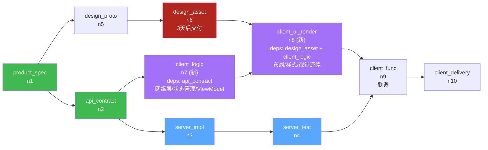
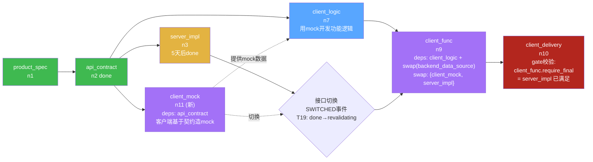
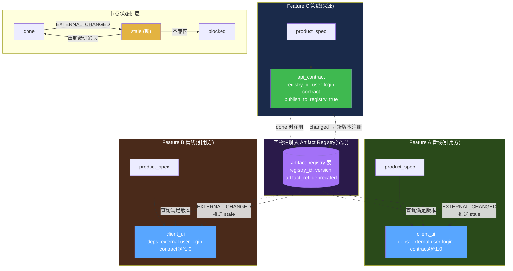

# PRD 压力测试:并行依赖场景走查与设计缺陷修正

> **文档性质**:对《coordination-platform-prd.md》v2.0 及其深化文档(fr2-orchestration.md / fr3-fr5-crew-skills.md)的真实开发场景压力测试报告
> **版本**:v1.0 | **日期**:2026-08-04 | **状态**:待评审
> **方法**:选取 3 个真实开发中常见的"并行 + 依赖"场景,逐步走查 PRD 当前设计能否处理,定位设计缺陷并提出修正方案
> **父文档**:[coordination-platform-prd.md](../coordination-platform-prd.md)
> **关联深化**:[fr2-orchestration.md](../deep-dive/fr2-orchestration.md) | [fr3-fr5-crew-skills.md](../deep-dive/fr3-fr5-crew-skills.md)

---

## 0. 测试方法说明

本文不验证 HappyPath(TC-01 已覆盖),而是用 3 个"边界但常见"的真实场景压力测试 PRD 的依赖模型与节点抽象:

| 场景 | 核心挑战 | 压测的 PRD 设计点 |
|---|---|---|
| 场景 2 | 设计稿延迟,客户端功能逻辑可先行 | 节点粒度 + 多入边严格依赖 |
| 场景 12 | 客户端需 mock 数据先行开发 | 产物类型完整性 + 依赖模型线性度 |
| 场景 10 | 多 feature 共享同一契约产物 | Pipeline 隔离模型 + 跨管线依赖 |

每个场景按 **场景描述 → PRD 走查 → 设计缺陷 → 修正方案 → 设计图** 组织,所有缺陷均可定位到 PRD 具体章节。

---

## 1. 场景 2:设计稿延迟,服务端先行的并行策略

### 1.1 场景描述

**业务背景**:登录功能管线启动,product_spec(n1)已 done。

**资源约束**:
- 设计师在忙别的项目,design_asset(n6)要 **3 天后**才能交付
- 服务端可立即做 api_contract(n2)+ server_impl(n3),只依赖 product_spec
- 客户端按 PRD 设计,client_ui(n7)依赖 api_contract AND design_asset(多入边)

**真实开发拆分**:
- 客户端的"**功能逻辑**"(网络层 / API client / 状态管理 / ViewModel / 路由骨架)其实只依赖 api_contract,不依赖设计稿
- 客户端的"**UI 还原**"(布局 / 样式 / 视觉细节 / 切图接入)才依赖 design_asset
- 这两部分在真实工程中是可分离的——前端框架(MVVM)天然支持先写逻辑层、再套 UI

**期望**:客户端 agent 在 design_asset 缺失的 3 天里,能并行启动"功能逻辑"开发,而不是完全闲置。

### 1.2 PRD 走查

**走查点 1:client_ui 节点定义与依赖**

PRD §2.1《节点类型完整清单》:
```
| client_ui | client | 客户端 UI 实现 |
```

fr3-fr5-crew-skills.md §6.5《client-ui-skill》:
```yaml
artifact_constraints:
  deps:
    - api_contract              # UI 依赖接口契约(数据绑定)
    - design_asset              # UI 依赖设计标注(视觉还原)
```

→ client_ui 被定义为**单节点**,deps 是 `[api_contract, design_asset]` 多入边,严格 AND 关系。

**走查点 2:多入边依赖的 ready 判定**

PRD §2.2《依赖 DAG 规则》:
```
| 多入边 | 节点依赖 N 个上游:全部 done → 本节点 ready(fork 节点同理) |
```

fr2-orchestration.md §2.1 T3 转移:
```
T3 | blocked → ready | cascade_node 上游全 done | all(dep_state==done for dep in deps(nid))
```

PRD AC2.3 验收标准:
```
AC2.3: 多入边节点,部分依赖 done 时仍 blocked
```

→ 当 api_contract done 但 design_asset 未 done 时,client_ui **必须保持 blocked**。

**走查点 3:CrewAI 分配**

PRD FR3.3 + fr3-fr5-crew-skills.md §4.3:
```python
async def on_langgraph_ready(self, node_id, state):
    # 仅当节点 ready 时才 emit ReadyEvent 给 CrewAI
```

→ client_ui 不 ready,CrewAI 不分配 Task,client_agent **完全闲置 3 天**。

**走查点 4:变更级联影响范围**

fr2-orchestration.md §2.1 T10/T16:
- design_asset changed → client_ui 级联 blocked → 递归失效 client_func、client_delivery

PRD §2.1 节点链:
```
client_ui → client_func → client_delivery
```

→ 即使后续 design_asset changed,也会把整个客户端链路全部 blocked,无法做"只失效 UI 还原、保留功能逻辑"的细粒度级联。

**走查点 5:节点类型扩展性**

PRD §2.1 节点类型固定 9 种产物节点,新增节点类型需要:
- 改 §2.1 节点类型清单
- 新增对应 skill(fr3-fr5 §6 SkillRegistry 强制 node_type → skill 一对一)
- 改 §3.1 角色权限矩阵
- 改 fr2 §7.3 节点引用完整性校验

fr3-fr5-crew-skills.md §8.1 SkillRegistry.build_index:
```python
if nt in self.index:
    raise ValueError(f"node_type {nt} 重复匹配 skill")
```

→ 节点类型扩展是"全局 breaking change",没有插件化机制。

### 1.3 设计缺陷

**缺陷 2-A:节点粒度过粗,功能逻辑与 UI 还原被绑死**

client_ui 把"功能逻辑"和"UI 还原"绑成一个节点。真实工程中这两部分依赖不同(api_contract vs design_asset)、变更频率不同(契约稳定 vs 设计迭代)、产出工具不同(API client 生成器 vs UI 还原工具),绑死导致设计稿延迟时客户端无法并行。

**缺陷 2-B:严格 AND 依赖,缺少"部分满足可启动子任务"机制**

PRD §2.2 和 AC2.3 明确"部分依赖 done 仍 blocked",这是严格 DAG 的简化假设。真实开发中"功能逻辑先行、UI 还原等设计稿"是普遍模式,严格 AND 模型逼着用户要么破坏 DAG(把 deps 改成单入边)、要么忍受闲置。

**缺陷 2-C:变更级联粒度过粗**

design_asset 变更只应失效"UI 还原"部分,但 PRD 模型下会级联整个 client_ui → client_func → client_delivery。fr2 §2.1 T16 递归失效"无差别"传播,无法表达"只失效产物的一部分"。

**缺陷 2-D:节点类型扩展成本高,无插件化机制**

fr3-fr5 §8.1 SkillRegistry 强制 node_type → skill 一对一映射,重复匹配直接 raise;新增节点类型需改 4 处文档/代码,缺少"扩展节点类型"的低成本路径。

### 1.4 修正方案

**方案 2-1(推荐):拆分 client_ui 为两个节点类型**

引入两个新节点类型替换 client_ui:

| 新节点类型 | 角色 | deps | 说明 |
|---|---|---|---|
| `client_logic` | client | api_contract | 客户端功能逻辑:网络层 / 状态管理 / API client / ViewModel / 路由骨架 |
| `client_ui_render` | client | design_asset + client_logic | UI 还原:布局 / 样式 / 视觉细节 / 切图接入 |

**收益**:
- design_asset 缺失时 client_logic 可立即 ready,client agent 不闲置
- design_asset changed 只级联 client_ui_render,不动 client_logic(细粒度级联)
- 严格 DAG 哲学不变,只是把"粗节点"拆成"细节点",模型自洽

**节点类型扩展原则(对应缺陷 2-D)**:
- 把 §2.1 的 9 种节点分成两层:**核心节点类型(8 种,固定)+ 扩展节点类型(可插拔)**
- SkillRegistry 改为支持"基础 skill + 扩展 skill",node_type 命名空间用前缀区分(`client.*` 归 client 角色),避免硬编码清单
- 角色权限矩阵改为"按 role 允许的 node_type 前缀"而非"枚举每个 node_type"

**方案 2-2(备选,不推荐):引入"部分依赖满足的子任务"机制**

保持 client_ui 单节点,但允许节点声明 `partial_ready_tasks`:
```yaml
node:
  type: client_ui
  deps: [api_contract, design_asset]
  partial_ready_tasks:
    - name: logic_impl
      requires: [api_contract]    # 部分依赖即可启动
    - name: ui_render
      requires: [design_asset, api_contract]
```

**为什么不推荐**:破坏严格 DAG 的简洁性,引入"节点内子状态机",与 LangGraph 节点级状态机不对齐,且 partial task 的产物归属、审核流程都需要重新定义,复杂度高于方案 2-1。

### 1.5 设计图:客户端节点拆分 DAG



**关键说明**:
- design_asset(n6)blocked 时,client_logic(n7)已 ready,client agent 可立即开发功能逻辑
- client_ui_render(n8)等多入边全 done 才 ready,符合严格 DAG
- design_asset 后续 changed 只级联 client_ui_render,client_logic 不动

### 1.6 修正后变更级联对比

| 触发 | PRD 当前(粗粒度) | 修正后(细粒度) |
|---|---|---|
| design_asset changed | client_ui → client_func → client_delivery 全失效 | 仅 client_ui_render 失效;client_logic 保留;client_func 看下游依赖是否含 client_ui_render 决定 |
| api_contract changed | client_ui → client_func → client_delivery 全失效 | client_logic + client_ui_render 同时失效(都依赖契约),级联 client_func |
| 3 天 design_asset 延迟 | client agent 闲置 3 天 | client agent 在 client_logic 上工作 3 天 |

---

## 2. 场景 12:客户端需要 Mock 服务端接口先行开发

### 2.1 场景描述

**业务背景**:api_contract(n2)已 done,契约清晰。

**资源约束**:
- 服务端在忙别的项目,server_impl(n3)要 **5 天后**才能 done
- 客户端开发不能等 5 天,需要基于契约先做 mock 数据并自测

**真实开发流程**:
1. 客户端基于 api_contract 生成/手写 mock 数据(可独立完成,不需要服务端代码)
2. 客户端用 mock 数据开发功能逻辑、跑单测、UI 联调
3. server_impl done 后,客户端从 mock 切换到真实接口
4. 切换通常只需改"数据源配置",不需重写客户端代码

**关键问题**:
- mock 数据谁产出?服务端?客户端?管理方?
- mock 产物要不要纳入管理(版本化 / 审核 / 可追溯)?
- mock 与 server_impl 是并行的两条线,怎么表达?
- mock → 真实接口的"切换"在 PRD 里怎么表达?

### 2.2 PRD 走查

**走查点 1:产物类型清单是否有 mock 类型**

PRD §2.1《节点类型完整清单》9 种产物节点:
```
product_spec / api_contract / server_impl / server_test /
design_proto / design_asset / client_ui / client_func / client_delivery
```

→ **没有 mock 类型**。客户端无节点类型可挂 mock 产物,无 skill 约束 mock 格式,无审核流程。

**走查点 2:依赖模型能否表达"基于契约造 mock"**

PRD §2.2 依赖规则只支持"节点 deps 全 done 才 ready",无任何"并行替代依赖"概念。

fr2-orchestration.md §7.3 节点引用完整性:
```
| deps 引用存在 | 每个 dep 必须在 nodes 列表中 | DANGLING_REF |
```

→ mock 节点若存在,deps = [api_contract] 是合法的(契约 done 即可 ready);但**当前 PRD 没有这个节点类型,无从声明**。

**走查点 3:client_func 的依赖链锁死**

fr3-fr5-crew-skills.md §6.6《client-delivery-skill》:
```yaml
artifact_constraints:
  deps:
    - client_ui
    - server_impl               # 联调依赖服务端实现
```

→ client_func deps = [client_ui, server_impl]。server_impl 不 done 时 client_func blocked,**即使客户端用 mock 跑通了联调,也无法提交 client_func 产物**。

**走查点 4:mock → 真实接口切换无表达**

PRD 状态机(fr2 §2.1)只有:
- T7: pending_review → done(产物合并)
- T10: done → changed(产物重新提交,新 commit ≠ 旧 commit)

→ "切换接口"不是"产物变更",而是"依赖切换"。客户端 client_func 产物本身没变(代码还是那套代码,只是数据源配置从 mock 切到 real),但 PRD 没有表达"依赖切换触发重新校验"的机制:
- 如果走 changed:语义不对(产物没变),且会清空下游 client_delivery 的产物引用
- 如果不走 changed:client_func 一直挂在 mock 上,server_impl done 后没有事件触发"重新联调验证"

**走查点 5:mock 产物的归属与角色权限**

PRD §3.1《角色定义》:
- server 角色:api_contract / server_impl / server_test
- client 角色:client_ui / client_func / client_delivery

→ mock 数据归属模糊:
- 若归 server:server agent 在忙,5 天内产不出 mock
- 若归 client:client 角色没有 mock 节点类型,§3.2 权限矩阵会 FORBIDDEN_NODE_ROLE
- 若归管理方:违背 PRD §1.2 "管理方不执行开发"原则

### 2.3 设计缺陷

**缺陷 12-A:产物类型缺失,无 mock 类型**

PRD §2.1 节点类型清单遗漏 mock 类产物。真实开发中 mock 数据是客户端并行开发的"准产物",不纳入管理会导致:
- mock 数据散落在客户端本地,无版本、无审核、无追溯
- mock 与契约的版本对齐无机制,契约变了 mock 不变,联调时出问题

**缺陷 12-B:依赖模型过于线性,无法表达"并行替代依赖"**

PRD §2.2 的依赖模型是"串行+汇合"语义:client_func 必须等 server_impl done。但真实开发中,"基于契约造 mock"和"基于契约实现服务"是**并行的两条线**,客户端在 mock 上工作不影响后续切真实接口。PRD 表达不了这种"开发态 mock 依赖 + 生产态 real 依赖"的双轨模型。

**缺陷 12-C:mock → 真实接口切换无表达**

PRD 状态机只有"产物变更(changed)"概念,没有"依赖切换"概念。client_func 产物本身没变,但其依赖从 mock 切到 real,理应触发"重新联调验证",但 PRD 没有对应事件和状态。

**缺陷 12-D:mock 产物归属模糊,角色权限不支持**

PRD §3.1 / §3.2 角色权限矩阵没有 mock 产出的角色,server 在忙时无法产出,client 又无权限,管理方又不能产出。归属未定义。

### 2.4 修正方案

**方案 12-1:新增 `client_mock` 节点类型 + 引入"可替换依赖(swap dep)"机制**

**步骤 1:新增节点类型**

PRD §2.1 节点类型清单增加:
```
| client_mock | client | 客户端 mock 数据(基于 api_contract 生成,供 client_func 并行开发) |
```

- 角色归属:client(client 角色自己造 mock,合理——客户端最清楚自己需要什么 mock)
- deps:`[api_contract]`(只依赖契约,不依赖 server_impl)
- skill:`client-mock-skill`(约束 mock 数据必须对照 api_contract 的 schema)

**步骤 2:引入"可替换依赖"声明**

client_func 的 deps 改为:
```yaml
deps:
  - client_ui
  - server_impl
swap_deps:                      # 新字段:可替换依赖
  - group: backend_data_source
    alternatives:
      - client_mock             # 开发态:用 mock 跑联调
      - server_impl             # 生产态:用真实接口跑联调
    require_final: server_impl  # 交付前必须切换到 server_impl
```

**语义**:
- `deps` 是"硬依赖",必须 done 才能 ready
- `swap_deps` 是"可替换依赖组",**任一 alternative done 即可让节点 ready(开发态)**
- `require_final` 声明"交付态必须满足的 alternative",节点 ready 不阻塞,但 client_delivery(下游叶子)的 gate 校验"client_func 的 backend_data_source 是否已切到 server_impl"

**步骤 3:状态机扩展——新增 `SWITCHED` 事件**

fr2 §2.1 状态转移表新增:
```
T19 | done → revalidating | swap_dep_alternative changed(mock → real 或 real → mock)
T20 | revalidating → done | 重新联调验证通过(可选 gate)
```

- `revalidating` 是新中间态:产物本身没变,但依赖切换,需重新验证(可选跑一遍 gate)
- 切换不强制清空下游产物引用(与 changed 区分),只触发"重新验证"事件

**步骤 4:mock 产物的版本管理**

client_mock 产物含 `compatible_contract_version` 字段,与 api_contract 版本对齐:
- api_contract changed → 检查 client_mock 的 compatible_contract_version,不兼容时 client_mock 标 `stale`(新状态)或强制 changed
- client_mock 重新生成后 bump version,与 api_contract 新版本对齐

**方案 12-2(更激进,长期演进):引入"开发态/交付态"双 DAG 视图**

把每个管线拆成两层 DAG:
- 开发态 DAG:允许 mock / 临时依赖 / 部分满足
- 交付态 DAG:严格依赖,所有 require_final 满足才能交付

这是更大的设计变更,建议作为 v3 演进方向,v2 先用方案 12-1 兜底。

### 2.5 设计图:Mock 并行依赖图



**关键说明**:
- api_contract done 后,client_mock 立即 ready(client agent 自己造,不等 server)
- client_func 通过 swap_deps 在 mock 上 ready,可立即联调
- server_impl done 后,触发 SWICTHED 事件,client_func 进 revalidating 重新验证
- 验证通过后,client_delivery 的 gate 才放行(require_final = server_impl)

### 2.6 修正前后对比

| 维度 | PRD 当前 | 修正后 |
|---|---|---|
| mock 产物管理 | 无类型,散落本地 | client_mock 节点 + skill 约束 + 版本对齐 |
| 客户端并行度 | 等 server_impl 5 天 | 立即用 mock 开发,server_impl done 后切换验证 |
| 切换表达 | 无机制,只能走 changed(语义错) | SWITCHED 事件 + revalidating 状态,不清空下游 |
| 交付门禁 | 无差别 | require_final gate 确保交付前切到真实接口 |
| mock 归属 | 模糊 | client 角色(client 最清楚自己要什么 mock) |

---

## 3. 场景 10:多个 feature 管线共享同一产物

### 3.1 场景描述

**业务背景**:三个 feature 并行开发:

| Feature | 管线 | 内容 |
|---|---|---|
| Feature C | pipeline-c | 用户登录功能(产出 api_contract: user-login-contract) |
| Feature A | pipeline-a | 用户登录页 UI(依赖 user-login-contract) |
| Feature B | pipeline-b | 用户资料页(也依赖 user-login-contract,因资料页需要登录态) |

**真实开发情况**:
- Feature C 先做,产出 user-login-contract v1.0
- Feature A 和 B 的管线都"引用"这份契约,不重新造
- 后续 Feature C 升级契约到 v2.0(如新增 OAuth 字段),Feature A 和 B 需感知并适配

**类似场景(更广义)**:
- 组件库 / 设计系统 / 通用错误码 schema / 公共 API 类型定义——都是跨 feature 共享的产物

### 3.2 PRD 走查

**走查点 1:Pipeline 隔离模型**

PRD §2.1《核心概念与术语》:
```
| 管线(Pipeline) | 一个功能需求的全链路 DAG,由节点和依赖边组成 |
```

→ Pipeline 是"一个功能需求"的 DAG,定义上就是隔离的。

**走查点 2:节点引用完整性校验明确禁止跨管线引用**

fr2-orchestration.md §7.3《节点引用完整性》:
```
| deps 引用存在 | 每个 dep 必须在 nodes 列表中 | DANGLING_REF |
```

fr2 §7.2 `validate_dag_acyclic` 实现:
```python
for dep in n.get("deps", []):
    if dep not in adj:
        return False, [f"DANGLING_REF: {n['id']} 依赖不存在的 {dep}"]
```

→ 节点 deps 只能引用**本管线 nodes 列表内**的 node_id。Feature A 的节点若 deps 引用 Feature C 的 node_id,加载时直接 `DANGLING_REF` 拒绝。

**走查点 3:无产物注册表概念**

PRD §5.2《存储方案》只有:
- PipelineState(checkpointer)
- artifact_refs(随 state 持久化,本管线内)
- audit_log
- 产物内容(产物仓库)

fr2 §6.1 平台扩展表:`idempotency_keys / node_path_registry / dlq / audit_log / events / pipeline_registry / lock_wait_log`

→ `node_path_registry` 是**同管线内路径占用校验**(§4.2),不是跨管线共享产物的注册表。`pipeline_registry` 是管线元数据注册,不是产物注册。

**走查点 4:变更级联只在管线内递归**

fr2-orchestration.md §2.1 T16:
```
T16 | blocked/ready/.../pending_review → blocked | 下游 cascade 失效(上游 changed 递归) | 本节点是某 changed 节点的下游可达节点
```

fr2 §2.1 备注:
```
T16 是递归失效,需用 visited set 防环(虽然 DAG 无环,但跨管线引用需防护)。
```

→ 备注"跨管线引用需防护"暗示设计时考虑过但未落地。当前级联只在**本管线 DAG 可达节点**内递归,Feature C 的契约 changed 不会触发 Feature A/B 的节点 blocked。

**走查点 5:DRY 违反——重复提交契约的后果**

如果 Feature A 和 B 各自重新提交一份相同的 user-login-contract 产物:
- 违反 DRY:同一份契约在产物仓库有 3 份副本(Feature C 原始 + A 复制 + B 复制)
- 一致性风险:Feature A 复制时手抖改了字段,Feature B 又是另一版本,三方契约漂移
- 审核资源浪费:三份契约都要走 api-contract-skill 的 requires_human_review=true 人工审

### 3.3 设计缺陷

**缺陷 10-A:Pipeline 强隔离,无跨管线依赖机制**

PRD §2.1 + fr2 §7.3 明确禁止跨管线节点引用。真实开发中跨 feature 共享契约 / 组件库 / 设计系统是常态,强隔离模型逼着用户要么复制产物(违反 DRY)、要么把多个 feature 塞进一个超大管线(违反"一个功能需求一个管线"的定义)。

**缺陷 10-B:无产物注册表,已发布产物无全局视图**

PRD §5.2 存储方案没有"已发布产物"的全局索引。新管线启动时,无法查询"已有哪些契约 / 组件库可复用",只能靠人记忆或外部文档。node_path_registry 只是同管线路径占用,不是产物发现机制。

**缺陷 10-C:跨管线变更感知缺失**

Feature C 契约 changed 后,Feature A/B 的节点不会被级联失效。fr2 T16 递归只在管线内,跨管线引用"需防护"但未落地。后果:Feature C 升级契约到 v2.0,Feature A/B 还在用 v1.0,联调时才发现不兼容。

**缺陷 10-D:版本对齐无机制**

跨管线引用的产物如何保证版本一致?Feature A 引用 v1.0,Feature C 已升 v2.0,Feature A 何时升级?PRD 的 ArtifactRef 只有 commit,没有 version_range 概念,无法表达"接受 v1.x 但不接受 v2"。

### 3.4 修正方案

**方案 10-1:引入"产物注册表(Artifact Registry)" + "外部产物引用(External ArtifactRef)"**

**步骤 1:产物注册表(全局)**

PRD §5.2 存储方案新增 `artifact_registry` 表:
```sql
CREATE TABLE artifact_registry (
    registry_id TEXT PRIMARY KEY,          -- 全局唯一,如 "user-login-contract"
    source_pipeline_id TEXT NOT NULL,      -- 来源管线
    source_node_id TEXT NOT NULL,          -- 来源节点
    node_type TEXT NOT NULL,               -- api_contract / design_asset / ...
    version TEXT NOT NULL,                 -- semver
    artifact_ref JSONB NOT NULL,           -- {repo, path, commit, toolspec_framework, trace_id}
    published_at TIMESTAMPTZ NOT NULL DEFAULT now(),
    deprecated BOOLEAN NOT NULL DEFAULT false,
    UNIQUE (source_pipeline_id, source_node_id, version)
);
CREATE INDEX idx_registry_type_version ON artifact_registry(node_type, version);
```

**注册时机**:节点 done 时,若该节点声明 `publish_to_registry: true`(pipeline.yaml 节点配置),自动写入 artifact_registry。

**注册规则**:
- registry_id 由来源管线声明(如 Feature C 的 api_contract 节点声明 `registry_id: user-login-contract`)
- 同一 registry_id 多版本共存(v1.0 / v2.0 都在注册表)
- 版本废弃:`deprecated: true`,新引用不允许,旧引用触发告警

**步骤 2:外部产物引用(External ArtifactRef)**

节点 deps 扩展支持外部引用:
```yaml
# pipeline-a.yaml(Feature A)
nodes:
  - id: "a2"
    type: "client_ui"
    role: "client"
    deps:
      - node_id: "a1"                    # 管线内依赖(原有)
      - external:                         # 外部依赖(新)
          registry_id: "user-login-contract"
          version_range: "^1.0.0"         # semver range,接受 1.x.x
          fallback: "block"               # 注册表无满足版本时的策略:block / warn
```

**加载校验扩展**(fr2 §7.3 新增):
- `external` 依赖校验:从 artifact_registry 查询满足 version_range 的最新版本
- 找到 → 注入为"虚拟上游节点"(只读 ArtifactRef,无状态机参与)
- 找不到 → 按 fallback 策略(block 则管线加载失败;warn 则标记节点 stale)

**ready 判定扩展**:
- 外部依赖视为"已 done 上游"(注册表中的产物都是 done 状态才注册)
- 节点 ready 时,get_dependencies 返回外部产物内容(git show 拉取)

**步骤 3:跨管线变更感知**

Feature C 的 api_contract changed → 重新 done 后写入 artifact_registry 新版本 → 触发 `EXTERNAL_CHANGED` 事件推送:

```python
# 监听 registry 变更,推送给所有引用方
async def on_registry_update(registry_id: str, new_version: str):
    referrers = await db.fetch_all(
        "SELECT pipeline_id, node_id FROM external_refs WHERE registry_id=$1",
        registry_id,
    )
    for r in referrers:
        if not semver_satisfies(new_version, r["version_range"]):
            # 新版本不在接受范围 → 不强制失效,只告警
            await emit_event(r["pipeline_id"], r["node_id"], "EXTERNAL_OUT_OF_RANGE", ...)
        else:
            # 新版本在接受范围 → 推送 EXTERNAL_CHANGED,节点本地置 stale
            await langgraph_invoke(r["pipeline_id"], {
                "node_id": r["node_id"],
                "event": "EXTERNAL_CHANGED",
                "new_ref": new_artifact_ref,
            })
```

**新增节点状态 `stale`**(fr2 §2.1 状态机扩展):
```
T21 | done → stale | 外部依赖 EXTERNAL_CHANGED(新版本可用)
T22 | stale → done | 节点重新验证(可选重新提交 / 显式 ack 接受新版本)
T23 | stale → blocked | 节点重新验证发现不兼容,需重做
```

`stale` 与 `changed` 区分:
- `changed`:本管线内上游变更,强制失效下游
- `stale`:外部依赖变更,软通知,不强制失效下游,由节点决定是否重新验证

**步骤 4:版本对齐机制**

artifact_registry 支持版本查询:
- 新管线加载时,external dep 查询满足 version_range 的最新版本,自动绑定
- version_range 用 semver:`^1.0.0`(接受 1.x.x)、`~1.0.0`(接受 1.0.x)、`>=1.0.0 <2.0.0`
- 来源管线废弃旧版本时,引用方收到 `EXTERNAL_DEPRECATED` 告警,需迁移到新版本

**步骤 5:权限与安全**

- 注册表写入:只有来源管线的 done 节点可注册(防越权注册)
- 注册表读取:所有管线可读(公开产物)
- 外部引用声明:pipeline.yaml 加载时校验 registry_id 存在
- 外部产物内容访问:get_dependencies 拉取时校验调用方管线是否声明了该 external dep(防越权读取)

### 3.5 设计图:跨管线共享产物架构



**关键说明**:
- Feature C 的 api_contract done 后自动注册到全局 artifact_registry
- Feature A/B 通过 external 引用,加载时从注册表拉取满足 version_range 的最新版本
- Feature C 升级契约 → 注册表新版本 → 推送 EXTERNAL_CHANGED → A/B 节点置 stale(软通知,不强制失效)
- A/B 自主决定是否重新验证(重新提交 / 显式 ack)

### 3.6 修正前后对比

| 维度 | PRD 当前 | 修正后 |
|---|---|---|
| 跨管线引用 | 禁止(DANGLING_REF) | 通过 external dep + 注册表支持 |
| 共享产物发现 | 无机制,靠人记忆 | artifact_registry 全局查询 |
| DRY | 三份副本,可能漂移 | 单一来源,引用方共享 |
| 变更感知 | 无,联调时才发现 | EXTERNAL_CHANGED 推送 + stale 状态 |
| 版本对齐 | 无,只有 commit | semver version_range,自动绑定满足版本 |
| 强制失效 | 全或无 | stale 软通知,节点自主决定 |

---

## 4. 缺陷汇总表

| 缺陷 ID | 场景 | 缺陷描述 | 影响 PRD 章节 | 严重度 | 修正方案 |
|---|---|---|---|---|---|
| **2-A** | 场景 2 | client_ui 节点粒度过粗,功能逻辑与 UI 还原绑死 | §2.1 / FR5.4 / fr3-fr5 §6.5 | 高 | 拆分为 client_logic + client_ui_render |
| **2-B** | 场景 2 | 严格 AND 依赖,缺少"部分满足可启动子任务"机制 | §2.2 / AC2.3 / fr2 §2.1 T3 | 高 | 通过节点拆分规避(方案 2-1),非引入 partial ready |
| **2-C** | 场景 2 | 变更级联粒度过粗,design_asset changed 全链路失效 | fr2 §2.1 T16 | 中 | 节点拆分后级联自然细化 |
| **2-D** | 场景 2 | 节点类型扩展成本高,无插件化机制 | §2.1 / §3.1 / fr3-fr5 §8.1 | 中 | 节点类型分核心+扩展两层,SkillRegistry 改前缀匹配 |
| **12-A** | 场景 12 | 产物类型缺失,无 mock 类型 | §2.1 | 高 | 新增 client_mock 节点类型 + client-mock-skill |
| **12-B** | 场景 12 | 依赖模型过于线性,无法表达"并行替代依赖" | §2.2 / fr2 §2.1 T3 | 高 | 引入 swap_deps 可替换依赖组 |
| **12-C** | 场景 12 | mock → 真实接口切换无表达,只能走 changed(语义错) | fr2 §2.1 状态机 | 高 | 新增 SWITCHED 事件 + revalidating 状态(T19/T20) |
| **12-D** | 场景 12 | mock 产物归属模糊,角色权限不支持 | §3.1 / §3.2 | 中 | 归属 client 角色,扩展权限矩阵 |
| **10-A** | 场景 10 | Pipeline 强隔离,无跨管线依赖机制 | §2.1 / fr2 §7.3 | 高 | 引入 external dep 外部产物引用 |
| **10-B** | 场景 10 | 无产物注册表,已发布产物无全局视图 | §5.2 / fr2 §6.1 | 高 | 新增 artifact_registry 表 + publish_to_registry 机制 |
| **10-C** | 场景 10 | 跨管线变更感知缺失,Feature C 升级 A/B 不知道 | fr2 §2.1 T16(仅管线内) | 高 | EXTERNAL_CHANGED 事件 + stale 状态(T21/T22/T23) |
| **10-D** | 场景 10 | 版本对齐无机制,只有 commit 无 version_range | §5.1 ArtifactRef | 中 | artifact_registry 支持 semver version_range |

### 严重度统计

| 严重度 | 数量 | 缺陷 ID |
|---|---|---|
| 高 | 8 | 2-A, 2-B, 12-A, 12-B, 12-C, 10-A, 10-B, 10-C |
| 中 | 4 | 2-C, 2-D, 12-D, 10-D |
| 低 | 0 | — |
| **合计** | **12** | — |

### 修正涉及的 PRD 章节变更清单

| PRD 章节 | 变更内容 | 关联缺陷 |
|---|---|---|
| §2.1 节点类型清单 | 9 种 → 11 种(+ client_logic / client_ui_render / client_mock),引入"核心+扩展"分层 | 2-A, 2-D, 12-A |
| §2.2 依赖 DAG 规则 | 新增 swap_deps 可替换依赖组语义 | 12-B |
| §2.1 状态机 | 新增 revalidating / stale 两态;新增 T19~T23 转移 | 12-C, 10-C |
| §2.1 Pipeline 定义 | 引入 external dep 概念,允许跨管线引用 | 10-A |
| §3.1 角色定义 | client 角色新增 client_logic / client_ui_render / client_mock 节点类型 | 2-A, 12-A |
| §3.2 权限矩阵 | 节点类型改为"前缀匹配"而非枚举(如 client.* 归 client) | 2-D |
| §5.1 ArtifactRef | 新增 external_ref 子类型,含 registry_id + version_range | 10-D |
| §5.2 存储方案 | 新增 artifact_registry 表 + external_refs 表 | 10-B |
| FR5.4 skill 摘要 | 新增 client-logic-skill / client-ui-render-skill / client-mock-skill | 2-A, 12-A |
| fr2 §7.3 节点引用完整性 | 新增 external dep 校验规则(registry_id 存在性 + version_range 满足性) | 10-A |
| fr2 §2.1 状态转移表 | 新增 T19~T23(SWITCHED / EXTERNAL_CHANGED 相关) | 12-C, 10-C |
| fr2 §6.1 Postgres schema | 新增 artifact_registry / external_refs 表 DDL | 10-B |
| fr3-fr5 §8.1 SkillRegistry | node_type 改为前缀匹配,支持扩展节点类型 | 2-D |

---

## 5. 整体结论与优先级建议

### 5.1 三类缺陷的根因归纳

3 个场景暴露的 12 个缺陷,根因可归纳为 **3 类设计假设过强**:

| 根因 | 涉及缺陷 | 表现 |
|---|---|---|
| **节点粒度假设过粗** | 2-A, 2-B, 2-C, 12-A | 假设 9 种节点类型够用,真实工程的"功能逻辑/UI 还原/mock"分离未覆盖 |
| **依赖模型假设过线性** | 12-B, 12-C, 12-D | 假设严格 AND 依赖 + 单一 commit 引用够用,真实工程的"并行替代依赖 / 依赖切换 / 版本范围"未覆盖 |
| **Pipeline 隔离假设过强** | 10-A, 10-B, 10-C, 10-D | 假设管线完全独立,真实工程的"跨 feature 共享产物 / 全局注册表 / 变更感知"未覆盖 |

### 5.2 修正优先级建议

**P0(本期必须修,否则平台无法支撑真实并行开发)**:
- 缺陷 2-A:client_ui 拆分(影响客户端并行度,核心场景)
- 缺陷 12-A:client_mock 节点(影响客户端并行度,核心场景)
- 缺陷 12-B:swap_deps 机制(缺陷 12-A 的依赖基础)
- 缺陷 10-A:external dep 机制(影响跨 feature 协作,核心场景)
- 缺陷 10-B:artifact_registry(缺陷 10-A 的存储基础)

**P1(本期建议修,否则变更感知有盲区)**:
- 缺陷 12-C:SWITCHED 事件 + revalidating 状态
- 缺陷 10-C:EXTERNAL_CHANGED + stale 状态
- 缺陷 10-D:version_range 版本对齐

**P2(本期可缓,演进优化)**:
- 缺陷 2-C:级联细化(节点拆分后自然缓解)
- 缺陷 2-D:节点类型插件化(用前缀匹配临时兜底)
- 缺陷 12-D:mock 归属(归 client 角色即可,权限矩阵小改)

### 5.3 与现有深化文档的对齐

本报告的修正方案均**不与现有深化文档冲突**,而是**扩展**:

| 修正项 | 对齐的深化文档 | 扩展方式 |
|---|---|---|
| 节点拆分 | fr3-fr5 §6 skill.yaml | 新增 3 个 skill,结构同现有 |
| swap_deps | fr2 §2.2 DAG 规则 | 新增依赖类型,不修改原有 deps 语义 |
| revalidating / stale 状态 | fr2 §2.1 状态机 | 新增 2 态 + 5 转移,不修改 T1~T18 |
| external dep | fr2 §7.3 引用完整性 | 新增校验规则,原有 DANGLING_REF 保留 |
| artifact_registry | fr2 §6.1 Postgres schema | 新增 2 表,原有表不动 |

建议本报告作为 PRD v2.1 的输入,在主 PRD §2.1 / §2.2 / §5 / §3.1 章节增量补充,并在 fr2 / fr3-fr5 深化文档中追加对应小节,不破坏现有 v2.0 的设计自洽性。

---

## 附录:走查引用的 PRD 章节速查

| 引用章节 | 出处 | 用途 |
|---|---|---|
| §2.1 节点类型清单 | coordination-platform-prd.md | 9 种产物节点定义 |
| §2.2 依赖 DAG 规则 | coordination-platform-prd.md | 多入边全 done 才 ready |
| §2.1 状态机 7 态 | coordination-platform-prd.md | blocked/ready/.../changed |
| §3.1 角色定义 | coordination-platform-prd.md | 4 角色 + 可产出节点类型 |
| §5.1 ArtifactRef | coordination-platform-prd.md | 产物引用结构(repo/path/commit) |
| §5.2 存储方案 | coordination-platform-prd.md | 无产物注册表 |
| AC2.3 | coordination-platform-prd.md | 多入边部分 done 仍 blocked |
| FR5.4 skill 约束摘要 | coordination-platform-prd.md | client-ui-skill deps |
| fr2 §2.1 T1~T18 | fr2-orchestration.md | 状态转移表 |
| fr2 §2.1 T16 | fr2-orchestration.md | 递归失效(仅管线内) |
| fr2 §6.1 Postgres schema | fr2-orchestration.md | 平台扩展表清单(无 registry) |
| fr2 §7.3 节点引用完整性 | fr2-orchestration.md | deps 必须在本管线(DANGLING_REF) |
| fr3-fr5 §6.5 client-ui-skill | fr3-fr5-crew-skills.md | deps: api_contract + design_asset |
| fr3-fr5 §6.6 client-delivery-skill | fr3-fr5-crew-skills.md | deps: client_ui + server_impl |
| fr3-fr5 §8.1 SkillRegistry | fr3-fr5-crew-skills.md | node_type → skill 一对一,重复 raise |

---

**报告结束。** 共定位 12 个设计缺陷(8 高 / 4 中 / 0 低),提出 3 套修正方案(节点拆分 / swap_deps + SWITCHED / artifact_registry + external dep),包含 3 张 Mermaid 设计图。所有缺陷均可定位到 PRD 具体章节,修正方案与现有深化文档对齐不冲突。
