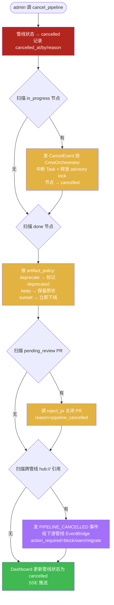
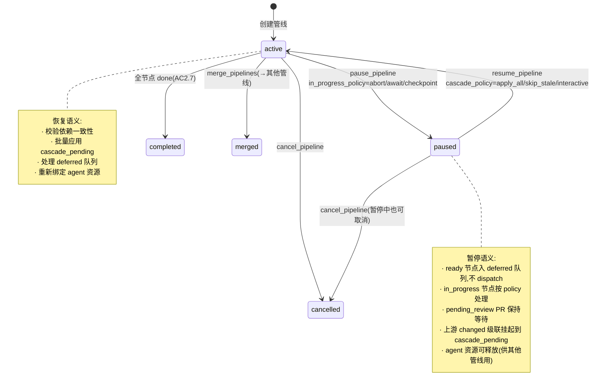
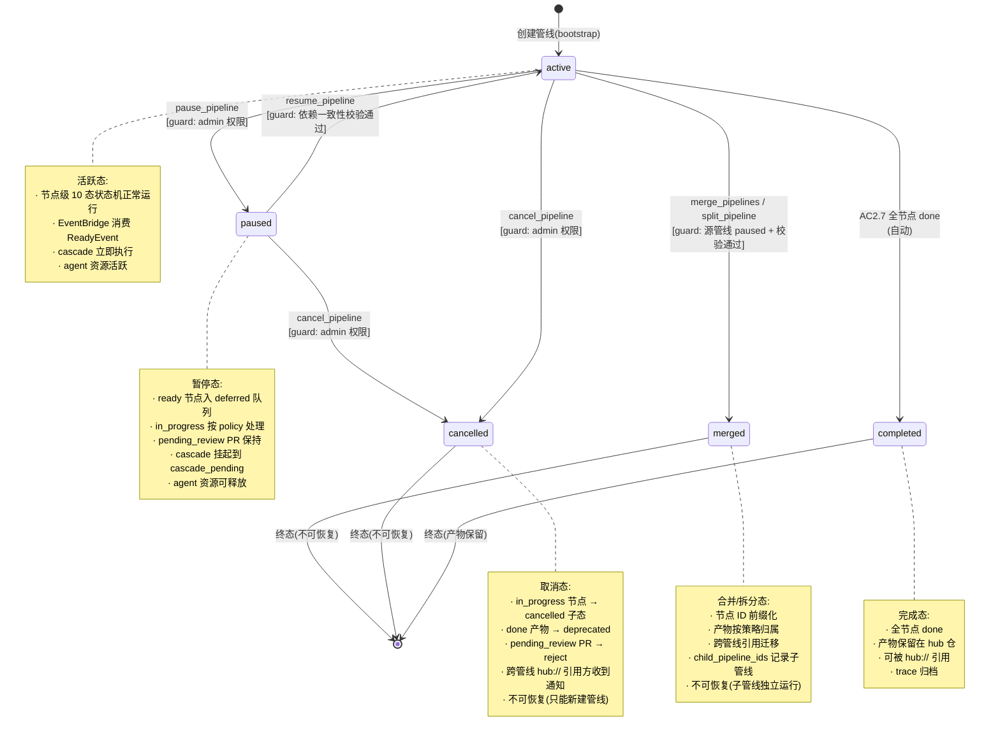

# 第四轮压力测试:管线生命周期场景

> **文档性质**:对《coordination-platform-prd.md》v2.0 + 第三轮修正的第四轮压力测试
> **版本**:v1.0 | **日期**:2026-08-04 | **状态**:架构评审输入
> **测试方法**:选取 4 个管线生命周期真实场景(A25-A28)
> **父文档**:[coordination-platform-prd.md](../coordination-platform-prd.md)
> **核心张力**:PRD 只有节点级状态机,无管线级生命周期管理(取消/暂停/合并/拆分)

---

## 0. 测试方法说明

### 0.1 测试范围与前置认知

前三轮共压测 48 个场景,场景 9 测过"管线中途修改漏加节点"(节点级热重载,见 [scenario-artifact-trust.md](./scenario-artifact-trust.md)),但**管线级的取消/暂停/合并/拆分**始终是 PRD 的盲区。本轮第四轮专门针对这一盲区。

| 前三轮已覆盖 | 本轮新覆盖 |
|---|---|
| 节点级状态机(7→10 态) | **管线级状态机**(新增 paused/cancelled/merged/split) |
| 节点级热重载(§7.5 增删节点) | **管线级生命周期**(取消/暂停/合并/拆分) |
| 节点级 cascade/invalidate | **跨管线事件广播**(hub:// 增强) |
| hub:// 跨管线引用(只读引用) | **管线合并/拆分时的产物归属迁移** |

### 0.2 核心论点

PRD 主文档对管线(Pipeline)的处理是"**只生不死**":
- §2 术语表定义 Pipeline = "一个功能需求的全链路 DAG",但无生命周期;
- §5.1 Pipeline 数据结构只有 `id / name / nodes / edges`,**无 status 字段**;
- AC2.7 仅规定"管线全节点 done 时自动终止"(正向终态),**无负向取消/暂停/合并/拆分**;
- §FR2.4 wait_node 只是节点级等待,不是管线级暂停。

真实开发中,feature 会被砍掉(取消)、被降级(暂停)、被合并(两个变一个)、被拆分(一个变多个)。这些操作在 PRD 中**完全空白**。

### 0.3 测试场景概览

| 编号 | 场景 | 核心张力 | 预期缺陷数 |
|---|---|---|---|
| A25 | 管线取消(feature 被砍) | 无 cancelled 状态 / in_progress 锁释放 / 产物 deprecated | 6 |
| A26 | 管线暂停与恢复 | 无 paused/resumed 状态 / agent 资源释放 / 恢复后依赖一致性 | 5 |
| A27 | 管线合并(两个 feature 合为一个) | 节点 ID 冲突 / 产物合并 / 依赖图拼接 | 5 |
| A28 | 管线拆分(大 feature 拆成多个) | 跨拆分管线依赖 / 节点归属变更 / 产物归属迁移 | 5 |
| **合计** | — | — | **21** |

---

## 1. 场景 A25:管线取消(feature 被砍)

### 1.1 场景描述

**真实情境**:产品经理决定砍掉"直播功能"管线(`pipeline_id=live-stream-feature`),因战略调整取消。该管线已推进到 60%:

| 节点 | 类型 | 状态 | 备注 |
|---|---|---|---|
| n1 | product_spec | done | 直播需求文档 |
| n2 | api_contract | done | 推拉流接口契约 |
| n3 | server_impl | **in_progress** | 服务端正在开发,持有 advisory lock |
| n4 | design_asset | pending_review | 设计标注 PR 在审 |
| n5 | client_ui | blocked | 等待 n3/n4 |

**取消后需回答的问题**:
1. `in_progress` 的 n3 怎么办?持有的 advisory lock(`/Users/zuiyou/develop/skills/ai-delivery-kit/docs/prd/deep-dive/fr2-orchestration.md` §3.2 `pg_advisory_xact_lock(hash(n3))`)如何释放?
2. 已 `done` 的 n1/n2 产物保留还是删除?其他管线若通过 `hub://live-stream-feature/n2@1.0.0`(D8 修正 13)引用了 n2 的契约,取消后怎么办?
3. `pending_review` 的 n4 PR 是关闭还是合并?
4. agent 如何被通知停止?CrewOrchestrator(`fr3-fr5-crew-skills.md` §4.3)已派发的 Task 如何取消?
5. 管线状态如何标记?PRD 主文档无 `cancelled` 状态;第三轮新增的 `deprecated/sunset` 是**节点级**状态,不是管线级。

### 1.2 PRD 走查

| 走查点 | PRD 章节(行号) | 现状 | 缺口 |
|---|---|---|---|
| 管线数据结构 | §5.1 Pipeline(L662-693) | 只有 `id/name/nodes/edges` | **无 status 字段** |
| 管线终止条件 | §FR2.6 AC2.7(L304) | "管线全节点 done 时自动终止" | **仅正向终态,无负向取消** |
| 节点级状态机 | §FR2.1(L228-249) | 7 态 | 无 cancelled,且 cancelled 是管线级而非节点级 |
| 第三轮扩展 | 附录 D8(L1176) | 节点级扩展 draft/deprecated/sunset | **仍是节点级,非管线级** |
| 锁释放 | fr2-orchestration.md §3.2(L261-268) | `pg_advisory_xact_lock` 在事务结束时自动释放 | **未定义管线取消时的强制释放路径** |
| 跨管线引用 | 附录 D8 修正 13(L1188) | `hub://` 协议跨管线引用 | **未定义被引用管线取消时的通知机制** |
| agent 取消 | fr3-fr5-crew-skills.md §4.3(L476-496) | `_handle_ready` 派发 Task | **无 Task 取消/中止接口** |
| 产物处置 | 附录 D7 hub 仓模型 | 已 done 产物在 hub 仓 main 分支 | **无自动 deprecated 标记** |

### 1.3 设计缺陷

#### D25-R4.1:Pipeline 数据结构无 status 字段【Critical】

`§5.1` Pipeline 定义只有 `id/name/nodes/edges`,**无 `status` 字段**。管线无法表达"已取消"语义。AC2.7 的"自动终止"是隐式行为(全 done 即结束),无显式状态记录,导致:
- 管线取消后,Dashboard(`§FR8.1`)无法显示 cancelled 状态;
- `get_pipeline_state` MCP 工具(§6.6)返回的 `node_states` 仍是各节点态,管线级状态丢失;
- 事件溯源(`fr2-orchestration.md` §10)的 events 表无 `pipeline_status` 字段,无法回放管线取消事件。

#### D25-R4.2:无管线级 cancelled 状态机【High】

第三轮扩展的 `draft/deprecated/sunset`(附录 D8 修正 1)是**节点级产物生命周期**状态,不是管线级。管线级取消需要独立的 `cancelled` 状态,且需定义进入条件(谁有权取消)、副作用(下游节点如何处理)、退出条件(不可恢复,只能新建管线)。

#### D25-R4.3:in_progress 节点的 advisory lock 强制释放机制缺失【High】

`fr2-orchestration.md` §3.2 的 `pg_advisory_xact_lock` 是事务级锁,事务结束自动释放。但 in_progress 的 n3 节点可能:
- agent 正在调 LLM(长耗时,30s+),锁在事务外被持有;
- 代码仓 commit 已推但 PR 未开;
- 管线取消时,n3 的部分进度如何处理?是丢弃还是归档?

PRD 未定义"管线取消时 in_progress 节点的清理协议"。

#### D25-R4.4:已 done 产物无自动 deprecated 标记【Medium】

n1/n2 已 done,产物在 hub 仓 main 分支。取消后:
- 产物**不应删除**(git 不可变,且其他管线可能引用);
- 但应标记为 `deprecated`(第三轮节点级状态),避免新管线依赖;
- 跨管线引用 `hub://live-stream-feature/n2@1.0.0` 的下游管线应收到通知。

PRD 未定义"管线取消时已 done 产物的批量 deprecated 标记 + 下游通知"机制。

#### D25-R4.5:跨管线 hub:// 引用通知机制缺失【High】

D8 修正 13 引入了 `hub://` 跨管线引用协议,但**只定义了引用读取,未定义被引用管线取消时的通知**。若管线 B 通过 `hub://live-stream-feature/n2` 依赖了 n2 的契约,管线 A 取消后:
- B 的下游节点是否应自动 `blocked`?
- B 是否应收到 `PIPELINE_CANCELLED` 事件?
- B 的 `deps` 中的 `hub_ref` 是否应标记为 `cancelled`?

#### D25-R4.6:agent task 取消通知机制缺失【Medium】

`fr3-fr5-crew-skills.md` §4.3 的 `EventBridge` 只有 `ReadyEvent`(派发)和 `CompletionEvent`(完成)两类事件,**无 `CancelEvent`**(取消)。管线取消时:
- 正在执行的 CrewAI Task 如何中断?CrewAI `crew.kickoff_async()` 返回的 future 如何 cancel?
- `role_assignments[n3]` 的 agent 如何收到停止通知?
- 节点 n3 的状态如何回退(从 in_progress 到 cancelled)?

### 1.4 修正方案

#### 1.4.1 管线级状态机(新增 4 态)

在 Pipeline 数据结构新增 `status` 字段,定义管线级状态机:

```python
class PipelineStatus(TypedDict):
    status: str  # "active" | "paused" | "cancelled" | "merged" | "completed"
    paused_at: str | None  # ISO8601,暂停时间戳
    cancelled_at: str | None
    cancelled_by: str | None  # admin_id
    cancel_reason: str | None
    parent_pipeline_id: str | None  # 合并/拆分时的父管线
    child_pipeline_ids: list[str]  # 合并/拆分时的子管线
```

| 管线状态 | 含义 | 进入条件 | 退出条件 |
|---|---|---|---|
| `active` | 正常运行 | 创建 | 全 done→completed / 暂停→paused / 取消→cancelled |
| `paused` | 暂停(可恢复) | admin 调 `pause_pipeline` | admin 调 `resume_pipeline`→active |
| `cancelled` | 取消(不可恢复) | admin 调 `cancel_pipeline` | —(终态,只能新建管线) |
| `merged` | 已合并入其他管线 | admin 调 `merge_pipelines` | —(终态) |
| `completed` | 全链路 done | AC2.7 自动触发 | —(终态) |

#### 1.4.2 新增 MCP 工具:cancel_pipeline

```json
{
  "name": "cancel_pipeline",
  "description": "取消管线:中止所有 in_progress 节点,标记已 done 产物为 deprecated,通知跨管线引用方",
  "inputSchema": {
    "type": "object",
    "properties": {
      "pipeline_id": {"type": "string"},
      "reason": {"type": "string"},
      "artifact_policy": {"type": "string", "enum": ["deprecate", "keep", "sunset"], "default": "deprecate"},
      "cancel_in_progress": {"type": "boolean", "default": true}
    },
    "required": ["pipeline_id", "reason"]
  }
}
```

**行为契约**:
1. 管线状态 → `cancelled`,记录 `cancelled_at/cancelled_by/cancel_reason`;
2. 对所有 `in_progress` 节点:发 `CancelEvent` 给 CrewOrchestrator → 中断 Task → 释放 advisory lock → 节点状态置 `cancelled`(新增节点级 cancelled 子态);
3. 对所有 `done` 节点:按 `artifact_policy` 处理:
   - `deprecate`(默认):产物标记 `artifact_qualifier=deprecated`,hub 仓路径加 `deprecated/` 段;
   - `keep`:产物保留原状,不标记(供历史追溯);
   - `sunset`:立即 sunset(跳过 deprecated 宽限期);
4. 对所有 `pending_review` 的 PR:调 `reject_pr` 关闭,标记 `reason=pipeline_cancelled`;
5. 对所有 `blocked/ready` 节点:直接置 `cancelled`;
6. 扫描所有跨管线 `hub://` 引用本管线的下游管线,发 `PIPELINE_CANCELLED` 事件给下游管线的 EventBridge。

#### 1.4.3 跨管线引用通知机制

扩展 `hub://` 协议,新增**反向通知**:

```python
class HubRefCancelNotification(TypedDict):
    event_type: str = "hub_ref_pipeline_cancelled"
    cancelled_pipeline_id: str
    cancelled_node_ids: list[str]  # 被取消的节点
    affected_downstream_pipeline: str  # 受影响的下游管线
    affected_downstream_nodes: list[str]  # 受影响的下游节点
    action_required: str  # "block" | "warn" | "migrate"
```

下游管线收到通知后:
- `action_required=block`:受影响下游节点自动 `blocked`;
- `action_required=warn`:仅告警,不阻塞(管理员决定);
- `action_required=migrate`:提示管理员迁移到替代产物。

### 1.5 Mermaid 设计图:管线取消流程



---

## 2. 场景 A26:管线暂停与恢复

### 2.1 场景描述

**真实情境**:"用户积分功能"管线(`pipeline_id=user-points-feature`)因优先级降低,暂停 2 周后再恢复。

**暂停时**(`pause_pipeline`):
- `ready` 节点不再 dispatch(抑制 CrewOrchestrator 消费 ReadyEvent);
- `pending_review` 的 PR 保持等待(不自动 reject);
- `in_progress` 节点释放 advisory lock + agent 资源,但**保留进度**(已推的 feat 分支、已开的 PR 不动);
- 暂停期间上游管线可能变更,如 `product_spec` 所在管线将 spec 改为 `changed`。

**恢复时**(`resume_pipeline`):
- 管线状态 → `active`;
- 重新校验所有节点的依赖一致性(上游可能 changed);
- 暂停期间积累的上游 changed 事件,恢复后**批量应用级联**(而非逐个);

### 2.2 PRD 走查

| 走查点 | PRD 章节(行号) | 现状 | 缺口 |
|---|---|---|---|
| 管线暂停 | §FR2 全章 | 无 | **完全空白** |
| wait_node | §FR2.4(L284) | "等待(无待处理节点)" | **节点级等待,非管线级暂停** |
| approval interrupt | fr2-orchestration.md §9.2(L989-1012) | `interrupt_before=["approval"]` 暂停等人工 | **节点级 HITL 暂停,非管线级** |
| agent 资源释放 | fr3-fr5-crew-skills.md §3.3(L293-298) | Task 超时/失败降级 | **无主动暂停释放** |
| 依赖一致性 | fr2-orchestration.md §7.1(L730-758) 管线加载校验 | 加载时校验 | **无恢复时校验** |
| 级联延迟 | §FR2.2(L259) changed→下游 blocked(递归) | 立即级联 | **无延迟级联(暂停期间挂起)** |

### 2.3 设计缺陷

#### D26-R4.1:无管线级 paused/resumed 状态【Critical】

同 D25-R4.2,管线级状态机缺少 `paused` 状态。`paused` 与 `cancelled` 的本质区别:
- `paused` **可恢复**(`resume_pipeline` → `active`);
- `cancelled` **不可恢复**(只能新建管线);
- `paused` 保留所有节点状态 + 产物引用 + PR;
- `cancelled` 清理 in_progress + deprecated 已 done。

#### D26-R4.2:暂停期间 agent 资源释放机制缺失【High】

`fr3-fr5-crew-skills.md` §4.3 的 `EventBridge` 是常驻协程,持续消费 `ReadyEvent`。管线暂停时:
- `ready` 节点不应再 dispatch,但 ReadyEvent 已入队怎么办?
- 正在执行的 CrewAI Task 如何处理?中断还是等完成?
- `role_assignments[node_id]` 的 agent 绑定是否释放(供其他管线用)?

PRD 未定义"管线暂停时 EventBridge 的抑制协议"。

#### D26-R4.3:恢复后依赖一致性校验机制缺失【High】

暂停 2 周期间,上游可能 changed。恢复时:
- 所有 `done` 节点的上游是否仍 done?
- 所有 `blocked` 节点的上游是否 ready?
- 暂停期间上游 changed 的级联是否延迟到恢复后批量应用?

PRD `fr2-orchestration.md` §7.1 的管线加载校验只在**初次加载**时跑,无"恢复时重新校验"机制。

#### D26-R4.4:暂停期间上游 changed 级联延迟策略缺失【Medium】

§FR2.2(L259)规定 `changed → 下游 blocked(递归)`,立即级联。但管线暂停时:
- 若管线 A 暂停,上游管线 B 的 n1 changed,是否立即级联到 A 的 n2?
- 立即级联会导致 A 的 n2 从 ready 变 blocked,但 A 暂停不应有状态变更;
- 应延迟到 A 恢复后再批量应用。

PRD 未定义"暂停期间级联事件的挂起/批量应用机制"。

#### D26-R4.5:暂停期间 ready 节点 dispatch 抑制机制缺失【Medium】

`fr3-fr5-crew-skills.md` §4.3 的 `_crew_orchestrator` 持续消费 `ready_queue`。暂停时:
- 已入队的 ReadyEvent 应出队但**不 dispatch**,标记 `deferred=true`;
- 新产生的 ReadyEvent(暂停期间上游 done 触发的)直接入 `deferred` 队列;
- 恢复时批量处理 `deferred` 队列。

PRD 未定义"EventBridge 的 deferred 队列机制"。

### 2.4 修正方案

#### 2.4.1 新增 MCP 工具:pause_pipeline / resume_pipeline

```json
{
  "name": "pause_pipeline",
  "description": "暂停管线:抑制 ready 节点 dispatch,释放 in_progress 节点的 agent 资源,挂起上游级联",
  "inputSchema": {
    "type": "object",
    "properties": {
      "pipeline_id": {"type": "string"},
      "reason": {"type": "string"},
      "in_progress_policy": {"type": "string", "enum": ["abort", "await", "checkpoint"], "default": "await"}
    },
    "required": ["pipeline_id", "reason"]
  }
}
```

**`in_progress_policy` 选项**:
- `abort`:立即中断 in_progress 节点的 Task(类似 cancel,但保留进度);
- `await`(默认):等 in_progress 节点自然完成(最多等 N 小时),再正式暂停;
- `checkpoint`:强制 checkpoint 当前进度,中断 Task,恢复时从 checkpoint 继续。

```json
{
  "name": "resume_pipeline",
  "description": "恢复暂停的管线:重新校验依赖一致性,批量应用挂起的级联事件,处理 deferred 队列",
  "inputSchema": {
    "type": "object",
    "properties": {
      "pipeline_id": {"type": "string"},
      "cascade_policy": {"type": "string", "enum": ["apply_all", "skip_stale", "interactive"], "default": "apply_all"}
    },
    "required": ["pipeline_id"]
  }
}
```

**`cascade_policy` 选项**:
- `apply_all`(默认):批量应用所有挂起的级联事件;
- `skip_stale`:跳过超过 N 天的陈旧级联事件(认为下游已自适应);
- `interactive`:逐个提示管理员决定(高价值管线)。

#### 2.4.2 EventBridge deferred 队列机制

扩展 `fr3-fr5-crew-skills.md` §4.3 的 EventBridge:

```python
class EventBridge:
    ready_queue: asyncio.Queue[ReadyEvent]          # 活跃队列
    deferred_queue: asyncio.Queue[ReadyEvent]       # 暂停挂起队列(新增)
    cascade_pending: list[CascadeEvent]             # 挂起的级联事件(新增)
    pipeline_status: dict[str, str]                 # pipeline_id → status(新增)

    async def on_langgraph_ready(self, node_id: str, state: PipelineState):
        pid = state["pipeline_id"]
        if self.pipeline_status.get(pid) == "paused":
            # 暂停中:入 deferred 队列,不 dispatch
            event = ReadyEvent(...)
            await self.deferred_queue.put(event)
            await self.langgraph_app.ainvoke({
                "events": [{"type": "READY_DEFERRED", "node": node_id, "pipeline": pid}]
            })
            return
        # 正常:入 ready 队列
        await self.ready_queue.put(event)

    async def on_upstream_changed(self, downstream_pid: str, event: CascadeEvent):
        """上游 changed 通知下游(跨管线)"""
        if self.pipeline_status.get(downstream_pid) == "paused":
            # 下游暂停:挂起级联,不立即应用
            self.cascade_pending.append(event)
            return
        # 正常:立即级联
        await self._apply_cascade(event)

    async def resume_pipeline(self, pipeline_id: str):
        """恢复:处理 deferred + cascade_pending"""
        self.pipeline_status[pipeline_id] = "active"
        # 1. 校验依赖一致性(新增)
        await self._verify_deps_consistency(pipeline_id)
        # 2. 批量应用挂起的级联
        for ev in self.cascade_pending:
            if ev.downstream_pid == pipeline_id:
                await self._apply_cascade(ev)
        self.cascade_pending = [e for e in self.cascade_pending if e.downstream_pid != pipeline_id]
        # 3. 处理 deferred 队列
        while not self.deferred_queue.empty():
            event = await self.deferred_queue.get()
            await self.ready_queue.put(event)  # 转入活跃队列
```

### 2.5 Mermaid 设计图:管线暂停/恢复状态机



---

## 3. 场景 A27:管线合并(两个 feature 合为一个)

### 3.1 场景描述

**真实情境**:feature A"用户登录"(`pipeline_id=login-feature`)和 feature B"用户注册"(`pipeline_id=register-feature`)决定合并为 feature C"统一身份认证"(`pipeline_id=unified-auth-feature`)。

**两管线当前状态**:

| 管线 A (login) | 状态 | 管线 B (register) | 状态 |
|---|---|---|---|
| n1: product_spec_A | done | n1: product_spec_B | done |
| n2: api_contract_A | done | n2: api_contract_B | done |
| n3: server_impl_A | in_progress | n3: server_impl_B | blocked |
| n4: client_ui_A | blocked | n4: client_ui_B | blocked |

**合并后需回答的问题**:
1. **节点 ID 冲突**:两个管线都有 `n1/n2/n3/n4`,合并后如何区分?需 `pipeline_id` 前缀化(如 `login.n1` vs `register.n1`)。
2. **产物合并**:两个 `api_contract` 内容不同(登录接口 vs 注册接口),合并为一份还是保留两份?若合并,谁来做合并?冲突如何解决?
3. **依赖图合并**:管线 A 的 n3 依赖 n2,管线 B 的 n3 也依赖 n2,合并后依赖图如何拼接?
4. **下游引用迁移**:其他管线若通过 `hub://login-feature/n2` 引用了 A 的契约,合并后是否要改引用到 `hub://unified-auth-feature/n2`?
5. **状态一致性**:合并期间 A/B 是否还能继续运行?还是先暂停?

### 3.2 PRD 走查

| 走查点 | PRD 章节(行号) | 现状 | 缺口 |
|---|---|---|---|
| Pipeline 数据结构 | §5.1(L662-693) | `nodes[].id` 在管线下唯一 | **无跨管线 ID 命名空间** |
| 节点 ID 唯一性 | fr2-orchestration.md §7.6(L831-842) | "所有 node.id 唯一" | **仅在单管线内唯一,合并时冲突** |
| 产物路径 | 附录 D7(L1133-1156) | `features/{pipeline_id}/...` | 路径含 pipeline_id,合并时需迁移 |
| hub:// 协议 | 附录 D8 修正 13(L1188) | 跨管线只读引用 | **非合并,被引用管线合并后引用失效** |
| 管线模板 | 附录 D4 P0-10(L1101) | 模板继承 | **非实例合并** |
| 产物合并 | §FR6 审核 | PR 级审核 | **无产物级合并冲突解决** |
| 状态机 | §FR2.1 | 7 态 | **无 merged 状态** |

### 3.3 设计缺陷

#### D27-R4.1:节点 ID 命名空间缺失(pipeline_id 前缀)【Critical】

`fr2-orchestration.md` §7.6 的"所有 node.id 唯一"只在**单管线内**校验。合并时:
- 管线 A 的 `n2` 和管线 B 的 `n2` 都叫 `n2`,合并不是冲突;
- 但 PRD 的 `node_states`、`artifact_refs`、`pending_prs` 都是 `dict[node_id, ...]`,合并后 key 冲突会覆盖。

需引入**全局唯一节点 ID**:`{pipeline_id}.{node_id}`,如 `login.n2` / `register.n2`。合并时保留原 ID(可追溯来源),新管线内可加别名。

#### D27-R4.2:产物合并冲突解决机制缺失【High】

两个 `api_contract` 内容不同(登录接口 `/login` + 注册接口 `/register`),合并为一份时:
- **自动合并**:不可能(API 语义不同,无法自动拼接);
- **人工合并**:管理员创建新产物,引用 A/B 两份契约,人工拼接;
- **保留两份**:不合并,新管线有两个 api_contract 节点(分别对应登录/注册)。

PRD 未定义"产物合并策略矩阵",未提供"产物合并工具"。

#### D27-R4.3:依赖图合并算法缺失【High】

管线 A 的依赖图:`n1 → n2 → n3 → n4`
管线 B 的依赖图:`n1 → n2 → n3 → n4`
合并后:
- 选项 1:**串联**(A 的 n4 → B 的 n1,但语义错误,两者应并行);
- 选项 2:**并联**(共享 product_spec,api_contract 各自独立,server_impl 并行);
- 选项 3:**重构**(管理员手动设计新 DAG,引用 A/B 的产物)。

PRD 未定义依赖图合并算法,未提供"依赖图合并工具"。

#### D27-R4.4:下游客户端跨管线引用迁移机制缺失【Medium】

其他管线 C 若通过 `hub://login-feature/n2@1.0.0` 引用了 A 的契约,合并后:
- 原 `hub://login-feature/...` 是否仍可用?(管线 A 状态 → `merged`,产物保留)
- 是否应自动迁移到 `hub://unified-auth-feature/login.n2@1.0.0`?
- 迁移是自动还是提示管理员?

PRD 未定义"被引用管线合并后的引用迁移机制"。

#### D27-R4.5:合并期间状态一致性保证缺失【Medium】

合并期间:
- 管线 A/B 是否暂停?(若不暂停,A 的 n3 可能在合并中从 in_progress 变 done,合并逻辑需处理)
- 合并操作是否原子?(要么全部成功,要么回滚)
- 合并期间 EventBridge 如何处理 A/B/C 三个管线的事件?

PRD 未定义"管线合并的事务性保证"。

### 3.4 修正方案

#### 3.4.1 全局唯一节点 ID(pipeline_id 前缀)

修改 §5.1 Pipeline 数据结构,节点 ID 强制 `{pipeline_id}.{node_id}` 格式:

```python
class NodeDef(TypedDict):
    id: str  # 全局唯一:"{pipeline_id}.{local_id}",如 "login.n2"
    local_id: str  # 管线内简称:"n2"(向后兼容)
    pipeline_id: str  # 归属管线
    type: str
    role: str
    deps: list[str]  # 全局唯一 ID
    # ... 其他字段
```

**向后兼容**:单管线内引用 `n2` 自动解析为 `{pipeline_id}.n2`;跨管线引用用 `hub://` 协议或全局 ID。

#### 3.4.2 新增 MCP 工具:merge_pipelines

```json
{
  "name": "merge_pipelines",
  "description": "合并多个管线为一个新管线:节点 ID 前缀化,产物按策略合并,依赖图按策略拼接",
  "inputSchema": {
    "type": "object",
    "properties": {
      "source_pipeline_ids": {"type": "array", "items": {"type": "string"}},
      "target_pipeline_id": {"type": "string"},
      "target_name": {"type": "string"},
      "node_id_strategy": {"type": "string", "enum": ["prefix", "rename", "alias"], "default": "prefix"},
      "artifact_merge_strategy": {"type": "string", "enum": ["keep_both", "manual_merge", "auto_deprecate"], "default": "keep_both"},
      "dag_merge_strategy": {"type": "string", "enum": ["parallel", "sequential", "manual"], "default": "parallel"},
      "pause_source_during_merge": {"type": "boolean", "default": true}
    },
    "required": ["source_pipeline_ids", "target_pipeline_id", "target_name"]
  }
}
```

**策略说明**:
- `node_id_strategy=prefix`(默认):节点 ID 改为 `{source_pid}.{local_id}`,保留来源追溯;
- `artifact_merge_strategy=keep_both`(默认):两份产物都保留,新管线有两个 api_contract 节点;
- `dag_merge_strategy=parallel`(默认):两管线共享 product_spec,后续节点并行;
- `pause_source_during_merge=true`:合并期间源管线暂停(D26 机制)。

**行为契约**:
1. 源管线 A/B 状态 → `paused`(D26);
2. 创建新管线 C,节点 ID 前缀化(`login.n1` / `register.n1`);
3. 按 `artifact_merge_strategy` 处理产物(keep_both 默认,直接复制 ArtifactRef);
4. 按 `dag_merge_strategy` 拼接依赖图;
5. 源管线 A/B 状态 → `merged`,记录 `child_pipeline_ids=[C]`;
6. 扫描跨管线 `hub://` 引用 A/B 的下游,发 `PIPELINE_MERGED` 事件,提示引用迁移;
7. 管线 C 状态 → `active`,开始运行。

#### 3.4.3 产物合并策略矩阵

| 策略 | 适用场景 | 行为 |
|---|---|---|
| `keep_both` | 产物内容不冲突(如不同 API 端点) | 保留两份,新管线有两个同类型节点 |
| `manual_merge` | 产物需人工拼接(如两份契约合并) | 管理员创建新产物,引用 A/B,人工合并 |
| `auto_deprecate` | 一份产物已过时(如 A 的 spec 被 B 的 supersede) | A 的产物标记 deprecated,B 的保留 |

### 3.5 Mermaid 设计图:管线合并流程

```mermaid
flowchart TD
    START([admin 调 merge_pipelines<br/>source=A,B target=C]) --> PAUSE[源管线 A/B 状态 → paused]

    PAUSE --> PREFIX[节点 ID 前缀化<br/>A.n1 → login.n1<br/>B.n1 → register.n1]
    PREFIX --> COPY_ARTIFACTS[复制 ArtifactRef 到新管线 C<br/>artifact_refs[C.login.n1] = A 的引用<br/>artifact_refs[C.register.n1] = B 的引用]

    COPY_ARTIFACTS --> MERGE_DAG[按 dag_merge_strategy 拼接依赖图<br/>parallel:共享 product_spec,后续并行<br/>sequential:A 的叶子 → B 的根<br/>manual:管理员设计新 DAG]
    MERGE_DAG --> VERIFY[校验新管线 C:<br/>DAG 无环 + 引用完整 + 角色匹配]
    VERIFY -->|失败| ROLLBACK[回滚:A/B 恢复 active,C 删除]
    VERIFY -->|成功| UPDATE_HUB[更新 hub:// 引用映射<br/>hub://login-feature/* → hub://unified-auth-feature/login.*<br/>(软迁移,旧引用仍可用)]

    UPDATE_HUB --> NOTIFY[发 PIPELINE_MERGED 事件<br/>给下游引用方]
    NOTIFY --> SET_MERGED[A/B 状态 → merged<br/>记录 child_pipeline_ids=[C]]
    SET_MERGED --> ACTIVATE[C 状态 → active<br/>开始运行]

    style PAUSE fill:#e3b341,color:#fff
    style PREFIX fill:#a371f7,color:#fff
    style MERGE_DAG fill:#a371f7,color:#fff
    style ROLLBACK fill:#b3261e,color:#fff
    style ACTIVATE fill:#3fb950,color:#fff
```

---

## 4. 场景 A28:管线拆分(大 feature 拆成多个)

### 4.1 场景描述

**真实情境**:大 feature"电商系统"(`pipeline_id=ecommerce-system`)有 20 个节点,因团队并行开发需求,拆分为三个独立 feature:
- 管线 C1"商品管理"(`product-mgmt-feature`)
- 管线 C2"订单管理"(`order-mgmt-feature`)
- 管线 C3"支付"(`payment-feature`)

**拆分时需回答的问题**:
1. **节点如何分配**:20 个节点如何分配到 3 个管线?节点 ID 如何重命名?
2. **跨拆分管线依赖**:订单依赖商品(如 `order.m3` 依赖 `product.m2`),如何表达?用 `hub://` 还是管线下 deps?
3. **已 done 产物归属**:原管线 n1(product_spec)已 done,拆分后归 C1/C2/C3 哪个?还是共享?
4. **拆分期间状态一致性**:拆分期间原管线是否暂停?已 in_progress 的节点如何处理?
5. **拆分后 trace 追溯**:原管线的 Langfuse trace 如何关联到拆分后的三个管线?

### 4.2 PRD 走查

| 走查点 | PRD 章节(行号) | 现状 | 缺口 |
|---|---|---|---|
| 跨管线依赖 | §FR2.2(L253-260) | `deps` 数组声明上游 | **仅管线内,跨拆分管线依赖无表达** |
| hub:// 协议 | 附录 D8 修正 13(L1188) | 跨管线只读引用 | **可表达跨拆分依赖,但语义是"引用"非"依赖"** |
| fork 节点 | §2.1(L113) | 管线内并行汇合 | **非跨管线并行** |
| 节点归属 | §5.1 Pipeline(L662-693) | 节点在 `pipeline.nodes` 列表内 | **无节点归属变更机制** |
| 产物归属 | 附录 D7(L1133-1156) | 路径 `features/{pipeline_id}/...` | **拆分时产物路径迁移机制缺失** |
| 管线模板派生 | 附录 D4 P0-10(L1101) | 模板继承 | **非实例拆分** |
| trace 追溯 | §FR7.2(L587-588) | `trace_id` 串联产物 | **无跨管线 trace 继承** |

### 4.3 设计缺陷

#### D28-R4.1:跨拆分管线依赖表达机制缺失【Critical】

拆分后 C2 的 `order.m3` 依赖 C1 的 `product.m2`,两种表达方式都有问题:
- **`deps` 数组**:`fr2-orchestration.md` §7.6 的 `DANGLING_REF` 校验会拒绝(跨管线节点不在本管线 `nodes` 列表内);
- **`hub://` 协议**:D8 修正 13 的 `hub_ref` 是只读引用,不触发 cascade(若 `product.m2` changed,`order.m3` 不会自动 blocked)。

需定义"跨拆分管线的强依赖"(不同于 `hub://` 只读引用)。

#### D28-R4.2:节点归属(pipeline_id)变更机制缺失【High】

§5.1 的节点在 `pipeline.nodes` 列表内,无独立 `pipeline_id` 字段。拆分时:
- 节点从原管线的 `nodes` 列表移除,加入新管线的 `nodes` 列表;
- 节点的 `node_states`、`artifact_refs`、`pending_prs` 等状态如何迁移?
- 节点的 `role_assignments` 绑定是否失效?

PRD 未定义"节点跨管线迁移协议"。

#### D28-R4.3:已 done 产物归属变更机制缺失【High】

原管线 n1(product_spec)已 done,拆分后:
- **选项 1:归 C1**(商品管理),C2/C3 通过 `hub://product-mgmt-feature/n1` 引用;
- **选项 2:共享**(三管线都持有引用),但 ArtifactRef 是单值,无法被多管线同时持有;
- **选项 3:复制**(三管线各一份),但产物内容相同,违反 DRY。

PRD 未定义"已 done 产物的拆分归属策略"。

#### D28-R4.4:拆分期间状态一致性保证缺失【Medium】

拆分期间:
- 原管线是否暂停?(D26 机制)
- 拆分操作是否原子?(类似 D27-R4.5)
- 拆分期间原管线的 EventBridge 如何处理?

#### D28-R4.5:拆分后 trace_id 跨管线追溯缺失【Low】

§FR7.2 的 `trace_id` 串联产物,但拆分后:
- 原管线的 Langfuse trace 如何关联到拆分后的三个管线?
- 新管线是否继承原管线的 `trace_id`?(不应,应是新 trace)
- 但应能从新管线的 trace 反查到拆分前的原管线 trace。

PRD 未定义"拆分后的 trace 继承链"。

### 4.4 修正方案

#### 4.4.1 跨管线强依赖(扩展 hub:// 协议)

D8 修正 13 的 `hub://` 是只读引用,新增**跨管线强依赖**变体:

```python
class DepDeclaration(TypedDict):
    node_id: str | None       # 管线内依赖
    hub_ref: str | None      # 跨管线只读引用(D8 修正 13)
    # 新增:跨管线强依赖
    cross_pipeline_dep: str | None  # "strong://{pipeline_id}/{node_id}@{version}"
```

**`strong://` 与 `hub://` 的区别**:
| 协议 | 语义 | cascade 行为 |
|---|---|---|
| `hub://` | 只读引用(如文档参考) | 上游 changed 不级联下游 |
| `strong://` | 强依赖(如订单依赖商品 API) | 上游 changed → 下游 blocked(级联) |

**实现**:`strong://` 依赖在 `fr2-orchestration.md` §3 的 `invalidate_node` 中加入跨管线级联逻辑(类似 A25 的 `PIPELINE_CANCELLED` 通知)。

#### 4.4.2 新增 MCP 工具:split_pipeline

```json
{
  "name": "split_pipeline",
  "description": "拆分管线:将原管线节点分配到多个新管线,处理跨拆分依赖,迁移产物归属",
  "inputSchema": {
    "type": "object",
    "properties": {
      "source_pipeline_id": {"type": "string"},
      "target_pipelines": {
        "type": "array",
        "items": {
          "type": "object",
          "properties": {
            "pipeline_id": {"type": "string"},
            "name": {"type": "string"},
            "node_ids": {"type": "array", "items": {"type": "string"}}
          }
        }
      },
      "done_artifact_policy": {"type": "string", "enum": ["assign_to_one", "share_via_hub", "copy"], "default": "share_via_hub"},
      "cross_dep_protocol": {"type": "string", "enum": ["strong", "hub", "inline"], "default": "strong"},
      "pause_source_during_split": {"type": "boolean", "default": true}
    },
    "required": ["source_pipeline_id", "target_pipelines"]
  }
}
```

**`done_artifact_policy` 选项**:
- `assign_to_one`:产物归属一个新管线,其他管线 `hub://` 引用(默认,符合单一归属原则);
- `share_via_hub`:多管线通过 `hub://` 共享引用(产物不复制);
- `copy`:每管线复制一份(违反 DRY,不推荐)。

**`cross_dep_protocol` 选项**:
- `strong`(默认):跨拆分依赖用 `strong://`,触发级联;
- `hub`:用 `hub://`,只读引用;
- `inline`:将依赖节点的产物复制到下游管线(不推荐)。

**行为契约**:
1. 源管线状态 → `paused`(D26);
2. 按 `target_pipelines` 创建新管线,节点 ID 前缀化(`product.n1` / `order.n1` / `payment.n1`);
3. 跨拆分依赖按 `cross_dep_protocol` 表达;
4. 已 done 产物按 `done_artifact_policy` 归属;
5. 校验新管线 DAG 无环 + 引用完整;
6. 源管线状态 → `merged`(语义:已拆分为多个子管线),记录 `child_pipeline_ids=[C1,C2,C3]`;
7. 新管线状态 → `active`;
8. 新管线继承原管线的 `trace_id` 作为 `parent_trace_id`(新增字段,供追溯)。

#### 4.4.3 节点跨管线迁移协议

```python
async def migrate_node_to_pipeline(
    node_id: str,
    source_pid: str,
    target_pid: str,
    new_local_id: str | None = None,  # 新管线内的 local_id(可选重命名)
) -> dict:
    """节点跨管线迁移(拆分的核心操作)"""
    # 1. 从源管线 nodes 列表移除
    source_pipeline.nodes = [n for n in source_pipeline.nodes if n.id != node_id]
    # 2. 节点 ID 重命名(可选)
    new_id = f"{target_pid}.{new_local_id or node_id.split('.')[-1]}"
    # 3. 加入目标管线 nodes 列表
    node.pipeline_id = target_pid
    node.id = new_id
    target_pipeline.nodes.append(node)
    # 4. 迁移状态(node_states / artifact_refs / pending_prs)
    state = langgraph_get_state(source_pid)
    state.node_states[new_id] = state.node_states.pop(node_id)
    if node_id in state.artifact_refs:
        state.artifact_refs[new_id] = state.artifact_refs.pop(node_id)
    # 5. 迁移 hub:// 引用映射
    update_hub_ref_mapping(old=f"hub://{source_pid}/{node_id}", new=f"hub://{target_pid}/{new_id}")
    # 6. 记录迁移事件
    await langgraph_invoke(target_pid, {
        "events": [{"type": "NODE_MIGRATED", "from": node_id, "to": new_id, "source_pid": source_pid}]
    })
```

### 4.5 Mermaid 设计图:管线拆分流程

```mermaid
flowchart TD
    START([admin 调 split_pipeline<br/>source=ecommerce target=product/order/payment]) --> PAUSE[源管线状态 → paused]

    PAUSE --> ASSIGN[按 target_pipelines.node_ids 分配节点<br/>product.m1-m7 / order.m1-m7 / payment.m1-m6]
    ASSIGN --> RENAME[节点 ID 前缀化<br/>n1 → product.n1 / order.n1 / payment.n1]

    RENAME --> MIGRATE_STATE[迁移状态<br/>node_states / artifact_refs / pending_prs<br/>从源管线 → 目标管线]
    MIGRATE_STATE --> CROSS_DEP[处理跨拆分依赖<br/>order.m3 依赖 product.m2<br/>用 strong://product-mgmt-feature/product.m2 表达]

    CROSS_DEP --> DONE_ARTIFACT[已 done 产物归属<br/>share_via_hub:多管线 hub:// 引用<br/>assign_to_one:归一管线,其他引用]
    DONE_ARTIFACT --> VERIFY[校验 3 个新管线:<br/>DAG 无环 + 引用完整 + 角色匹配]
    VERIFY -->|失败| ROLLBACK[回滚:源管线恢复 active,新管线删除]
    VERIFY -->|成功| SET_MERGED[源管线状态 → merged<br/>child_pipeline_ids=[product,order,payment]]

    SET_MERGED --> TRACE[新管线继承 parent_trace_id<br/>供 Langfuse 跨管线追溯]
    TRACE --> ACTIVATE[3 个新管线状态 → active<br/>开始并行运行]

    style PAUSE fill:#e3b341,color:#fff
    style RENAME fill:#a371f7,color:#fff
    style CROSS_DEP fill:#a371f7,color:#fff
    style ROLLBACK fill:#b3261e,color:#fff
    style ACTIVATE fill:#3fb950,color:#fff
```

---

## 5. 缺陷汇总表

### 5.1 缺陷清单

| 编号 | 场景 | 缺陷描述 | 严重度 | 根因 |
|---|---|---|---|---|
| D25-R4.1 | A25 | Pipeline 数据结构无 status 字段 | Critical | 管线级状态机缺失 |
| D25-R4.2 | A25 | 无管线级 cancelled 状态 | High | 管线级状态机缺失 |
| D25-R4.3 | A25 | in_progress 节点 advisory lock 强制释放缺失 | High | 锁机制未覆盖取消路径 |
| D25-R4.4 | A25 | 已 done 产物无自动 deprecated 标记 | Medium | 产物生命周期与管线生命周期脱节 |
| D25-R4.5 | A25 | 跨管线 hub:// 引用通知机制缺失 | High | hub:// 协议单向(只读) |
| D25-R4.6 | A25 | agent task 取消通知机制缺失 | Medium | EventBridge 无 CancelEvent |
| D26-R4.1 | A26 | 无管线级 paused/resumed 状态 | Critical | 管线级状态机缺失 |
| D26-R4.2 | A26 | 暂停期间 agent 资源释放机制缺失 | High | EventBridge 无抑制协议 |
| D26-R4.3 | A26 | 恢复后依赖一致性校验机制缺失 | High | 管线加载校验仅在初次加载 |
| D26-R4.4 | A26 | 暂停期间上游 changed 级联延迟策略缺失 | Medium | 级联立即执行,无挂起机制 |
| D26-R4.5 | A26 | 暂停期间 ready 节点 dispatch 抑制缺失 | Medium | EventBridge 无 deferred 队列 |
| D27-R4.1 | A27 | 节点 ID 命名空间缺失(pipeline_id 前缀) | Critical | node.id 仅管线内唯一 |
| D27-R4.2 | A27 | 产物合并冲突解决机制缺失 | High | 无产物级合并工具 |
| D27-R4.3 | A27 | 依赖图合并算法缺失 | High | 无 DAG 合并工具 |
| D27-R4.4 | A27 | 下游客户端跨管线引用迁移机制缺失 | Medium | hub:// 引用无迁移协议 |
| D27-R4.5 | A27 | 合并期间状态一致性保证缺失 | Medium | 无管线合并事务性 |
| D28-R4.1 | A28 | 跨拆分管线依赖表达机制缺失 | Critical | hub:// 只读,strong:// 未定义 |
| D28-R4.2 | A28 | 节点归属(pipeline_id)变更机制缺失 | High | 节点无 pipeline_id 字段 |
| D28-R4.3 | A28 | 已 done 产物归属变更机制缺失 | High | ArtifactRef 单值归属 |
| D28-R4.4 | A28 | 拆分期间状态一致性保证缺失 | Medium | 无管线拆分事务性 |
| D28-R4.5 | A28 | 拆分后 trace_id 跨管线追溯缺失 | Low | 无 parent_trace_id 继承 |

### 5.2 按严重度统计

| 严重度 | 数量 | 占比 |
|---|---|---|
| Critical | 4 | 19% |
| High | 8 | 38% |
| Medium | 8 | 38% |
| Low | 1 | 5% |
| **合计** | **21** | 100% |

### 5.3 按根因归类

| 根因 | 影响缺陷 | 核心问题 |
|---|---|---|
| **R1. 管线级状态机完全缺失** | D25-R4.1/4.2, D26-R4.1, D27-R4.5, D28-R4.4 | Pipeline 无 status 字段,无 cancelled/paused/merged 状态 |
| **R2. 节点 ID 命名空间缺失** | D27-R4.1, D28-R4.2 | node.id 仅管线内唯一,合并/拆分时冲突 |
| **R3. 跨管线事件广播单向** | D25-R4.5, D28-R4.1 | hub:// 只读引用,无反向通知/强依赖 |
| **R4. EventBridge 无生命周期事件** | D25-R4.6, D26-R4.2/4.5 | 无 CancelEvent,无 deferred 队列 |
| **R5. 产物归属与管线生命周期脱节** | D25-R4.4, D28-R4.3 | 已 done 产物无 deprecated 标记,无归属变更 |
| **R6. 锁/资源未覆盖生命周期路径** | D25-R4.3 | advisory lock 未定义取消时强制释放 |
| **R7. 级联无延迟/挂起机制** | D26-R4.3/4.4 | changed 立即级联,暂停时无挂起 |
| **R8. 合并/拆分算法空白** | D27-R4.2/4.3, D28-R4.3 | 无产物合并/依赖图合并工具 |

### 5.4 P0 修正项(Phase 1 必做)

| # | 修正项 | 修正缺陷 | 影响章节 |
|---|---|---|---|
| P0-21 | Pipeline 数据结构增 status 字段 + 5 态状态机(active/paused/cancelled/merged/completed) | D25-R4.1, D26-R4.1 | §5.1 + 新增 §FR2.7 |
| P0-22 | 节点 ID 全局唯一(`{pipeline_id}.{local_id}`) | D27-R4.1, D28-R4.2 | §5.1 + fr2 §7.6 |
| P0-23 | 新增 4 个管线级 MCP 工具:`cancel_pipeline` / `pause_pipeline` / `resume_pipeline` / `merge_pipelines` / `split_pipeline`(共 5 个) | D25-R4.2/4.3, D26-R4.2/4.5, D27-R4.2/4.3, D28-R4.2/4.3 | §FR4.1 |
| P0-24 | EventBridge 增 `CancelEvent` + deferred 队列 + cascade_pending | D25-R4.6, D26-R4.2/4.5 | fr3-fr5 §4.3 |
| P0-25 | hub:// 协议扩展:反向通知(`PIPELINE_CANCELLED`/`PIPELINE_MERGED`)+ `strong://` 强依赖变体 | D25-R4.5, D28-R4.1 | 附录 D8 修正 13 |
| P0-26 | 已 done 产物管线级生命周期:cancel → deprecated + 下游通知 | D25-R4.4 | §FR2.5 + fr2 §8 |
| P0-27 | 恢复后依赖一致性校验(resume_pipeline 内置) | D26-R4.3 | fr2 §7.1 |
| P0-28 | 级联延迟/挂起机制(pause 期间 cascade_pending) | D26-R4.4 | fr2 §2.2 |

### 5.5 与前三轮的衔接

| 前三轮修正 | 本轮衔接 |
|---|---|
| 第三轮 P0-1 状态机 10 态(draft/deprecated/sunset) | 本轮 P0-21 管线级 5 态(active/paused/cancelled/merged/completed),**与节点级 10 态正交** |
| 第三轮 P0-13 hub:// 跨管线引用 | 本轮 P0-25 扩展 hub://:反向通知 + `strong://` 强依赖变体 |
| 第三轮 P0-9 管线版本/热重载(P0-9) | 本轮 P0-22 节点 ID 前缀化,与管线版本正交(版本是时间维,前缀是空间维) |
| 第一轮 P0-9 管线版本 | 本轮 P0-21 管线级状态机与管线版本正交(状态是生命周期维,版本是演进维) |

---

## 6. 管线级状态机总图(汇总)



---

## 7. 本轮关键认知

1. **管线级状态机与节点级状态机正交**:第三轮扩展的 10 态(draft/deprecated/sunset)是**节点级产物生命周期**,本轮新增的 5 态(active/paused/cancelled/merged/completed)是**管线级生命周期**,两者独立设计,不冲突。

2. **hub:// 协议需从单向只读升级为双向**:第三轮 P0-13 的 hub:// 是"只读引用",本轮发现管线取消/合并/拆分需要"反向通知"(被引用方变化通知引用方)和"强依赖"(`strong://`,触发级联)。

3. **节点 ID 必须全局唯一**:`{pipeline_id}.{local_id}` 前缀化是管线合并/拆分的前提,否则 `node_states` 等 `dict[node_id, ...]` 在合并时 key 冲突。

4. **EventBridge 需支持生命周期事件**:现有 `ReadyEvent`/`CompletionEvent` 两类事件不足以支撑管线级生命周期管理,需新增 `CancelEvent` + `deferred` 队列 + `cascade_pending` 挂起机制。

5. **管线合并/拆分是事务性操作**:必须原子完成(校验失败回滚),不能部分成功(否则状态不一致)。这与第一轮 P0-9 的"管线版本/热重载"不同——热重载是增量,合并/拆分是原子重构。

6. **管线取消不可恢复,暂停可恢复**:这是管线级状态机的核心不变量——cancelled/merged/completed 都是终态,只能新建管线;paused 是中间态,可恢复到 active。

---

## 8. 附录:新增 MCP 工具清单

本轮新增 5 个管线级 MCP 工具:

| 工具名 | 调用方 | 作用 | 关键参数 |
|---|---|---|---|
| `cancel_pipeline` | admin | 取消管线(不可恢复) | pipeline_id, reason, artifact_policy, cancel_in_progress |
| `pause_pipeline` | admin | 暂停管线(可恢复) | pipeline_id, reason, in_progress_policy |
| `resume_pipeline` | admin | 恢复暂停的管线 | pipeline_id, cascade_policy |
| `merge_pipelines` | admin | 合并多管线为一新管线 | source_pipeline_ids[], target_pipeline_id, *_strategy |
| `split_pipeline` | admin | 拆分管线为多新管线 | source_pipeline_id, target_pipelines[], *_policy |

**权限要求**:5 个工具均限 `admin` 角色(对齐 §3.2 权限矩阵),agent/role 均无权调用。

**Langfuse 埋点**:5 个工具均经 `@langfuse_trace` 装饰器,记录 span + `pipeline_id` 属性,对齐 §FR7.1。
