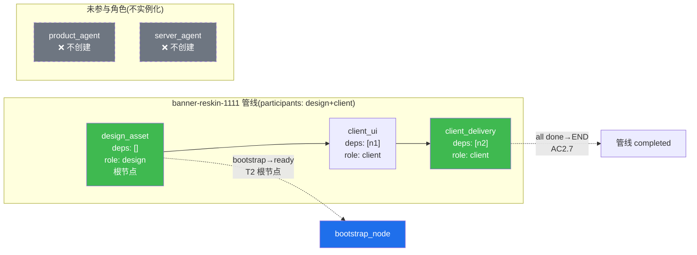
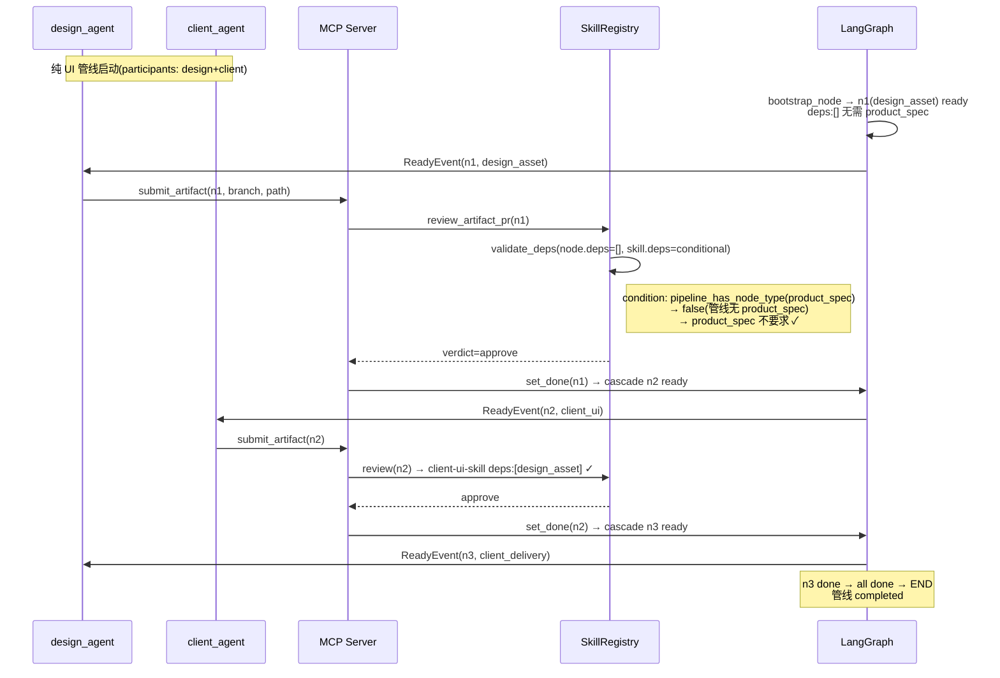
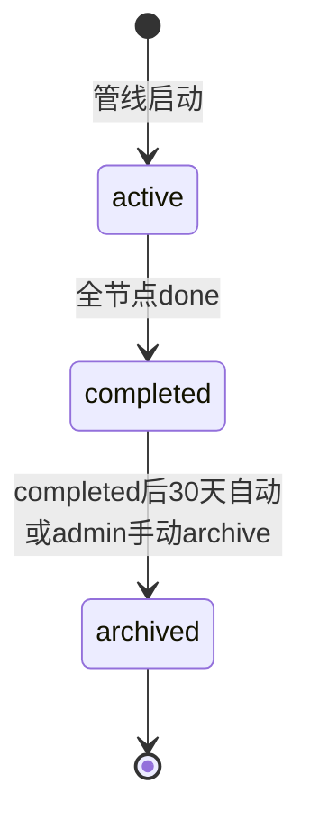
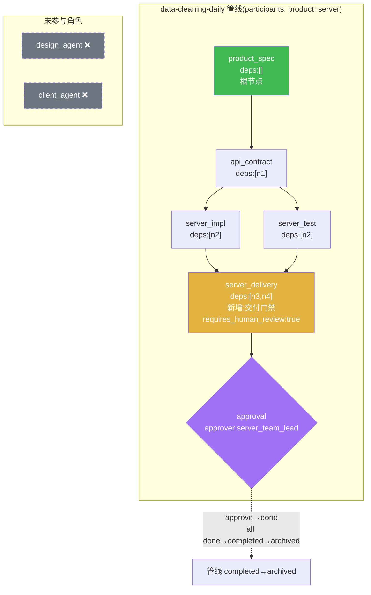
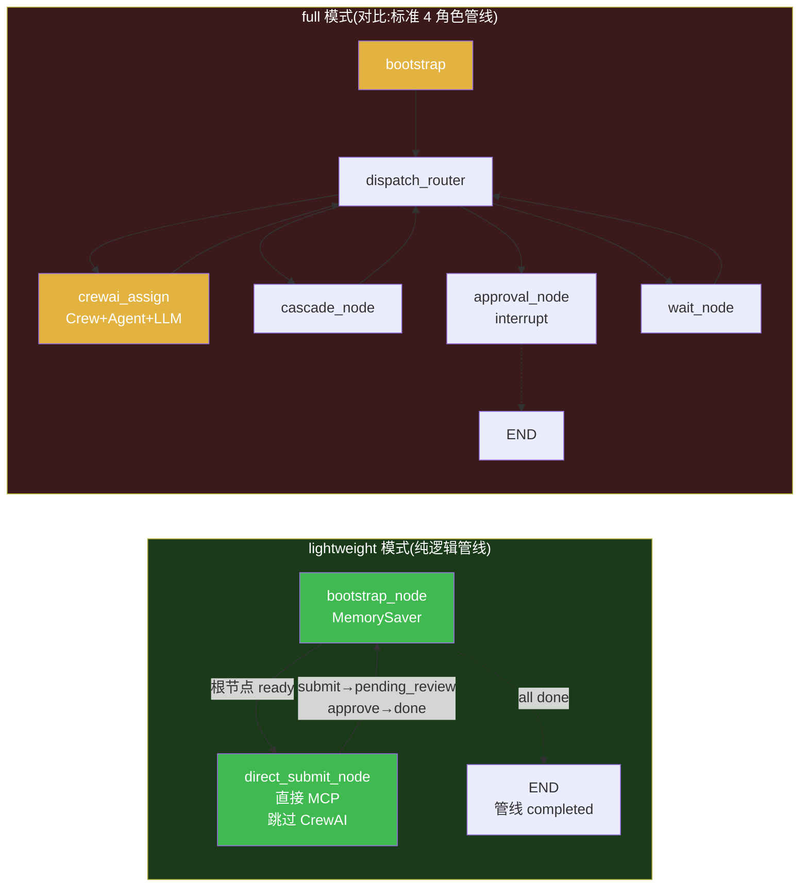
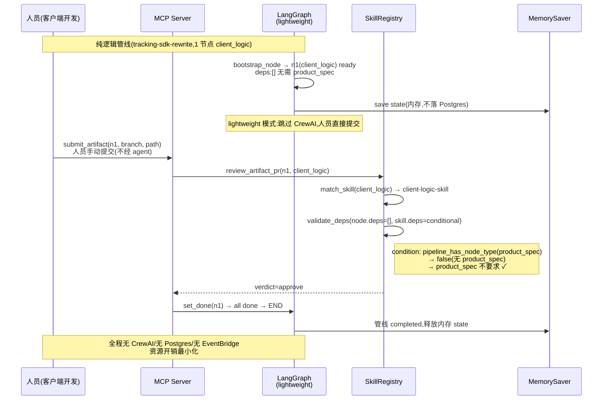

# 第五轮压力测试:角色缺位场景(纯 UI / 纯服务端 / 纯逻辑功能)

> **文档性质**:对《coordination-platform-prd.md》v3.0 的第五轮压力测试
> **版本**:v1.0 | **日期**:2026-08-04 | **状态**:架构评审输入
> **测试方法**:选取 3 个角色缺位真实全流程场景(A37-A39)
> **父文档**:[coordination-platform-prd.md](../coordination-platform-prd.md)
> **核心张力**:需求 1"通用性"vs PRD 隐含"4 角色全参与 + product 唯一起点"假设

---

## 0. 测试方法说明

### 0.1 为什么需要第五轮

前四轮 48 个场景(第一轮 16 + 第二轮 16 + 第三轮重走 16 + 第四轮 20)**均假设 4 角色(product/server/design/client)全参与,且 product_spec 是唯一起点**。但真实开发中存在大量"角色缺位"场景:

| 缺位类型 | 真实业务 | 缺失角色 | 缺失节点 |
|---|---|---|---|
| 纯 UI 驱动 | banner 换皮、运营弹窗、主题切换 | product + server | product_spec / api_contract / server_impl |
| 纯服务端 | 数据清洗、定时任务、内部接口 | design + client | design_asset / client_ui / client_func |
| 纯逻辑功能 | 埋点上报、网络层改造、缓存优化、AB 实验 | product + design + server | product_spec(可选)/ design_asset / api_contract / server_impl |

需求 1 明确要求:"整体开发管理需要通用,通过通用来扩展支持整体开发流程"。但 PRD 在三处隐含了"4 角色全参与"假设:

1. **6 个 skill.yaml 的 deps 全部硬编码为标准链路**(见 fr3-fr5 §6.1-§6.6):design_asset 强制 deps:[product_spec]、client_func 强制 deps:[client_ui, server_impl]
2. **4 角色 agent 固定实例化**(fr3-fr5 §2.2 `ROLE_TO_AGENT` 字典):无论管线是否用到该角色,4 个 agent 总被创建
3. **fr2 §7.3 加载校验要求 node.type 在预定义枚举中**,与 prd §2.1 line 101 "开放命名空间 {role}.{name}" 自相矛盾,阻断自定义节点类型(如 client_logic)

### 0.2 测试场景矩阵

| 场景 | 主题 | 参与角色 | 缺失角色 | 节点数 | 核心压测点 |
|---|---|---|---|---|---|
| A37 | 纯 UI 驱动(banner 换皮) | design + client | product + server | 3 | skill.deps 硬编码 product_spec 阻断无需求文档管线 |
| A38 | 纯服务端(数据清洗任务) | product + server | design + client | 4-5 | 无 server_delivery 节点 + 叶子节点无交付门禁 |
| A39 | 纯客户端逻辑(埋点上报) | client(可选 product) | product + design + server | 1-2 | client_func skill 硬编码 UI+server 依赖 + 无轻量路径 |

### 0.3 走查依据定位

| 走查点 | PRD 章节 | 深化文档章节 |
|---|---|---|
| 根节点定义 | §FR2.1 状态机 T2(prd line 351) | fr2 §2.1 T2(line 64) |
| DAG 加载校验 | §FR2.2(prd line 399-411) | fr2 §7.3(line 788-800) |
| skill.deps 硬约束 | §FR5.4(prd line 778-790) | fr3-fr5 §6.1-§6.6(line 675-913) |
| skill 匹配机制 | §FR5.3(prd line 766-776) | fr3-fr5 §8.1-§8.2(line 976-1075) |
| 角色 agent 实例化 | §FR3.1(prd line 541-554) | fr3-fr5 §2.2(line 138-211) |
| 管线终止 | §FR2.6 AC2.7(prd line 498) | fr2 §9.4 dispatch_router(line 1058-1084) |
| 节点类型开放命名空间 | §2.1(prd line 101) | fr2 §7.3(line 800)矛盾 |

---

## 1. 场景 A37:纯 UI 驱动型功能(banner 换皮/运营弹窗)

### 1.1 场景描述

**真实业务**:电商 App 首页 banner 换皮,迎接双十一大促。运营人员在 figma 出新设计稿,客户端开发把新 banner 图切图接入首页,替换旧资源。**不涉及新需求文档**(运营直接提需求,口头或飞书沟通)、**不涉及服务端新接口**(banner 图 URL 已有接口)、**不涉及服务端实现**。

**角色缺位**:
- ❌ product:运营直接提需求,无需正式 product_spec 文档
- ❌ server:无新接口,复用已有 banner 配置接口
- ✅ design:设计师出 banner 设计稿 + 切图(design_asset)
- ✅ client:客户端接入新 banner 资源(client_ui)+ 交付(client_delivery)

**理想 DAG**:
```
design_asset(deps:[]) → client_ui(deps:[design_asset]) → client_delivery(deps:[client_ui])
```
3 个节点,2 个角色,无 product_spec 起点。

### 1.2 PRD 走查

#### 走查点 1:DAG 的根节点是否必须是 product_spec?

**PRD 定位**:
- prd §FR2.1 状态机 T2(prd line 351):"`ready` | 依赖满足,待产出 | cascade 解锁 / PR 驳回 / 废弃草案 | submit_artifact 提 PR"
- fr2 §2.1 T2(line 64):"`(初始)` → `ready` | `bootstrap_node` | 节点无 deps(根节点)"
- prd §FR5.4(line 784):product-spec-skill deps = **无**(根节点)

**走查结论**:PRD 的状态机定义中,根节点 = "无 deps 节点",**未强制要求根节点必须是 product_spec**。理论上 design_asset 节点声明 `deps: []` 即可成为根节点,bootstrap_node 会将其置 ready。

**但是**——见走查点 4,skill.deps 会阻断。

#### 走查点 2:AC2.7"全节点 done 时自动终止"——只有 3 个节点的管线如何终止?

**PRD 定位**:
- prd §FR2.6 AC2.7(line 498):"管线全节点 done 时管线进入 completed"
- fr2 §9.4 dispatch_router_fn(line 1080-1083):`if all(s == NodeStatus.DONE for s in state["node_states"].values()): return END`

**走查结论**:AC2.7 的"全节点"指**本管线声明的所有节点**,不含未参与的角色节点。3 个节点(design_asset + client_ui + client_delivery)全部 done 后,`dispatch_router_fn` 检测到 `all done` → 返回 END,管线进入 completed。**此机制可正常工作,无缺陷**。

#### 走查点 3:CrewAI 的 4 角色 agent 中,product_agent 和 server_agent 空闲,资源如何释放?

**PRD 定位**:
- fr3-fr5 §2.2(line 205-210):`ROLE_TO_AGENT = {"product": product_agent, "server": server_agent, "design": design_agent, "client": client_agent}` —— **4 个 agent 在模块加载时固定实例化**
- fr3-fr5 §2.1(line 130-135):`LLM_CONFIG` 字典也是 4 角色固定创建
- fr3-fr5 §5.2 handle_ready_batch(line 634-652):按 `by_role` 分组,只有有 ready 节点的角色才创建 Crew

**走查结论**:CrewAI 的 `handle_ready_batch` 只为有 ready 节点的角色创建 Crew,product_agent 和 server_agent **不会被分配 Task**。但 `ROLE_TO_AGENT` 和 `LLM_CONFIG` 在模块加载时已固定实例化 4 个 agent 对象——虽然 agent 对象本身是轻量配置(LLM 连接是惰性的,不持连接池),但存在两个问题:
1. **无显式声明"本管线只用 design+client"**:管线加载时不声明参与者,系统无法提前知道哪些角色不参与,只能等 ready 事件驱动后"发现"无节点
2. **LLM 配置加载浪费**:4 套 LLM 配置全部初始化(含 API Key 读取),即使 2 套永远不会用

严重度:Medium(不阻断,但违反需求 1"通用性"的资源效率诉求)

#### 走查点 4:SkillRegistry 对 design_asset 的 skill 是否假设上游有 product_spec?没有时 get_dependencies 返回什么?

**PRD 定位**:
- prd §FR5.4(line 786):design-handoff-skill deps = **product_spec**
- fr3-fr5 §6.3 design-handoff-skill(line 770):`deps: - product_spec` —— **硬编码强制依赖**
- fr3-fr5 §6.3(line 771):`min_version: product_spec: "1.0.0"`
- prd §FR5.5 AC5.3(line 798):"依赖未 done 的 PR 被拒(skill.deps 校验)"
- fr3-fr5 §8.2 _handle_ready(line 1037-1043):无匹配 skill → task_failed

**走查结论**:**阻断性缺陷**。design-handoff-skill 的 `deps: [product_spec]` 是强制硬约束。在本场景中:
- design_asset 节点声明 `deps: []`(无 product_spec)
- 但 PR 审核时(review_artifact_pr),skill.deps 校验发现"design_asset 必须依赖 product_spec"(AC5.3)
- 结果:design_asset 的 PR 被 **reject**,错误码 `DEPS_NOT_DONE` 或 `MISSING_REQUIRED_DEP`
- 连锁:design_asset 无法 done → client_ui 无法 ready → client_delivery 无法 ready → 管线永远不 completed

`get_dependencies` 在 design_asset ready 时被 agent 调用,因 node.deps=[] 返回空列表 `[]`——**不报错,但 agent 拿不到上游上下文**。真正阻断发生在 PR 审核阶段的 skill.deps 校验。

严重度:**Critical**(直接阻断纯 UI 管线创建)

#### 走查点 5:pipeline.yaml DSL 如何表达"本管线只有 design + client 角色"?

**PRD 定位**:
- prd §5.1 Pipeline(line 1042-1074):pipeline.yaml 结构含 `id / name / status / nodes / edges`,**无 `participants` 字段**
- fr2 §7.3(line 799):"产物节点 `role` 必填 | 在 product/server/design/client 中"

**走查结论**:pipeline.yaml **无法显式声明"本管线只有 design + client 角色"**。角色参与情况只能通过 `nodes[].role` 隐式推导(扫描所有节点的 role 集合)。这导致:
1. 无法在加载时提前校验"声明参与者 vs 实际节点角色"一致性
2. 无法提前跳过未参与角色的 agent 实例化
3. 管线模板无法参数化"可选角色"(见走查点 6)

严重度:Medium

#### 走查点 6:跨管线引用:其他管线能否引用本管线的 design_asset(无 product_spec 上下文)?

**PRD 定位**:
- prd §FR2.2(line 411):`hub_ref: "hub://{pipeline_id}/{node_id}@{version}"` 跨管线引用
- prd §5.1 CrossPipelineReferenceRegistry(line 1149-1163):注册表只记录 `source_pipeline_id / source_node_id / target_pipeline_id / target_node_id / version_constraint`,**不要求 product_spec 上下文**

**走查结论**:跨管线引用机制**不依赖 product_spec 上下文**。其他管线可通过 `hub_ref: "hub://banner-reskin/n1@1.0.0"` 引用本管线 design_asset,注册表正常记录。design_asset deprecated 时,查注册表通知引用方管线。**此机制可正常工作,无缺陷**。

### 1.3 设计缺陷

#### D-A37-R5.1(Critical):design-handoff-skill.deps 硬编码 [product_spec],阻断纯 UI 管线

- **定位**:prd §FR5.4 line 786;fr3-fr5 §6.3 line 770
- **现象**:design_asset 节点在纯 UI 场景无 product_spec 上游,但 skill.deps=[product_spec] 强制要求,PR 审核时被 reject(AC5.3),管线卡死
- **根因**:skill.deps 是**静态硬约束**,无"可选依赖"/"条件依赖"语义,无法表达"如果管线有 product_spec 则依赖,否则可选"
- **影响**:所有纯 UI 驱动功能(banner 换皮/运营弹窗/主题切换/活动页静态替换)无法创建管线

#### D-A37-R5.2(High):skill.deps 无"可选依赖"语义,node.deps 与 skill.deps 冲突

- **定位**:prd §FR5.2 line 742(skill.deps 字段);fr3-fr5 §6.1-§6.6(全部 6 个 skill)
- **现象**:pipeline.yaml 中节点可声明 `deps: []`,但 skill.deps 强制 `[product_spec]`。两者语义冲突,node.deps 允许但 skill.deps 拒绝
- **根因**:skill.deps 只有"必须包含"语义,缺少 `required: false` / `condition` / `deps_mode: any|all` 等条件化语义
- **影响**:不仅影响 A37,还影响 A39(client_func 无 client_ui)及任何非标准链路管线

#### D-A37-R5.3(Medium):pipeline.yaml 无 participants 声明,4 agent 总被实例化

- **定位**:prd §5.1 line 1042-1074;fr3-fr5 §2.2 line 205-210
- **现象**:pipeline.yaml 无 `participants` 字段,无法显式声明"本管线只有 design+client";4 个 agent 在模块加载时固定实例化
- **根因**:管线模型缺少"参与者声明"维度,角色参与情况只能隐式推导
- **影响**:资源浪费(LLM 配置加载),无法提前校验角色一致性,管线模板无法参数化可选角色

#### D-A37-R5.4(Low):无"纯 UI"管线模板,每次需手写节点

- **定位**:prd §9 实施阶段(无模板机制);round2 A16 已提出模板需求但未落地
- **现象**:每次创建纯 UI 管线需手写 design_asset + client_ui + client_delivery 三节点,无模板复用
- **根因**:第二轮 A16 提出的"管线模板继承/参数化"修正未在 v3.0 落地
- **影响**:易出错(漏节点/错 deps),开发效率低

### 1.4 修正方案

#### 修正 1:skill.deps 支持"条件依赖"(修 D-A37-R5.1 + D-A37-R5.2)

扩展 skill.yaml 的 `deps` 字段,从"节点类型列表"升级为"依赖声明对象列表":

```yaml
# skills/design-handoff-skill/skill.yaml 修正后
name: design-handoff-skill
version: "2.0.0"   # MAJOR 升级(语义变更)
trigger:
  node_type: [design_proto, design_asset]
  role: design
artifact_constraints:
  deps:
    # 修正:product_spec 从"强制"改为"条件可选"
    - node_type: product_spec
      required: false                    # 新增:false 表示可选依赖
      condition: "pipeline_has_node_type(product_spec)"  # 管线含 product_spec 时才要求
      min_version: "1.0.0"
  deps_mode: conditional                 # 新增:conditional(按 condition 评估) | all(全满足,默认) | any(任一满足)
  # 纯 UI 场景:管线无 product_spec → condition 不满足 → product_spec 不要求
  # 标准场景:管线有 product_spec → condition 满足 → product_spec 必须 done
```

**审核逻辑修正**(fr3-fr5 §8.2 + fr1-fr6 review_artifact_pr):
```python
def validate_deps(node_deps: list, skill_deps: list, pipeline_nodes: list) -> Verdict:
    """PR 审核时校验依赖,支持条件依赖"""
    for dep_spec in skill_deps:
        if dep_spec.get("required", True) is False:
            # 可选依赖:评估 condition
            if not eval_condition(dep_spec.get("condition", "true"), pipeline_nodes):
                continue  # 条件不满足,跳过此依赖
        # 必须依赖或条件满足:校验 node.deps 包含此类型且状态 done
        if not has_dep_of_type(node_deps, dep_spec["node_type"], pipeline_nodes):
            return Verdict(ok=False, code="MISSING_REQUIRED_DEP",
                          reason=f"缺少必需依赖 {dep_spec['node_type']}")
    return Verdict(ok=True)
```

#### 修正 2:pipeline.yaml 新增 participants 声明(修 D-A37-R5.3)

```yaml
# pipeline.yaml 修正后
pipeline:
  id: "banner-reskin-1111"
  name: "双十一 banner 换皮"
  status: "active"
  participants: [design, client]          # 新增:显式声明参与角色
  nodes:
    - id: "banner-reskin-1111.n1"
      type: "design_asset"
      role: "design"
      instance_id: "design_team_a"
      deps: []                            # 纯 UI,无 product_spec
      toolspec: { framework: "figma" }
    - id: "banner-reskin-1111.n2"
      type: "client_ui"
      role: "client"
      instance_id: "client_team_ios"
      deps: ["banner-reskin-1111.n1"]
    - id: "banner-reskin-1111.n3"
      type: "client_delivery"
      role: "client"
      instance_id: "client_team_ios"
      deps: ["banner-reskin-1111.n2"]
  edges: []
```

**加载校验补充**(fr2 §7.1):
- 新增校验:`pipeline.participants` 中每个角色至少有 1 个节点(`PARTICIPANT_NO_NODE` warning)
- 新增校验:所有 `nodes[].role` 必须在 `participants` 中(`NODE_ROLE_NOT_DECLARED` reject)
- agent 按需实例化:`get_agent_for_role(role, participants)` 只为 participants 中的角色创建 agent

#### 修正 3:新增"纯 UI"管线模板(修 D-A37-R5.4)

```yaml
# templates/pure-ui.yaml.j2  管线模板(Jinja2 参数化)
pipeline:
  id: "{{ pipeline_id }}"
  name: "{{ name }}"
  status: "active"
  participants: [design, client]
  template: "pure-ui@1.0.0"              # 模板溯源
  nodes:
    - id: "{{ pipeline_id }}.n1"
      type: "design_asset"
      role: "design"
      deps: []
    - id: "{{ pipeline_id }}.n2"
      type: "client_ui"
      role: "client"
      deps: ["{{ pipeline_id }}.n1"]
    - id: "{{ pipeline_id }}.n3"
      type: "client_delivery"
      role: "client"
      deps: ["{{ pipeline_id }}.n2"]
```

创建时:`create_pipeline_from_template(template="pure-ui", pipeline_id="banner-reskin-1111", name="双十一 banner 换皮")`

### 1.5 Mermaid 设计图:纯 UI 管线 DAG(修正后)





---

## 2. 场景 A38:纯服务端/后端功能(数据清洗/定时任务/内部接口)

### 2.1 场景描述

**真实业务**:数据团队开发每日数据清洗任务。产品提简短需求(1 页 markdown,描述清洗规则和数据源),服务端定接口契约(api_contract,定义输入数据 schema 和输出统计 schema)+ 实现(server_impl,定时任务代码)+ 测试(server_test,单元测试 + 覆盖率)。**不涉及设计**(无 UI)、**不涉及客户端**(内部任务,无前端消费)。

**角色缺位**:
- ✅ product:提简短 product_spec(1 页 markdown)
- ✅ server:api_contract + server_impl + server_test
- ❌ design:无 UI,无设计稿
- ❌ client:无前端,无客户端节点

**理想 DAG**:
```
product_spec(deps:[]) → api_contract(deps:[product_spec]) → server_impl(deps:[api_contract])
                                                          → server_test(deps:[api_contract])
```
4 个节点,2 个角色,无 design/client。

### 2.2 PRD 走查

#### 走查点 1:pipeline.yaml 如何表达"无 design 无 client 角色"?

**PRD 定位**:
- prd §5.1(line 1042-1074):pipeline.yaml `nodes` 数组,可只列 product + server 节点
- fr3-fr5 §6.1-§6.4:product-spec-skill deps=[] ✓、api-contract-skill deps=[product_spec] ✓、server-impl-skill deps=[api_contract] ✓

**走查结论**:product_spec → api_contract → server_impl / server_test 的 DAG **符合现有 skill.deps 约束**(与 A37 不同,A38 保留了 product_spec 起点)。pipeline.yaml 可只列这 4 个节点,无需 design/client 节点。**DAG 结构合法,无阻断**。

但同 A37-D-R5.3:pipeline.yaml 无 `participants` 声明,design_agent 和 client_agent 仍被固定实例化。

#### 走查点 2:server_test 节点类型在 PRD 中是否存在?

**PRD 定位**:
- prd §2.1(line 108):"`server_test` | server | 服务端测试结果引用" —— **存在**
- fr3-fr5 §6.4 server-impl-skill(line 799):`trigger: node_type: [server_impl, server_test]` —— **server_test 被 server-impl-skill 覆盖**
- prd §3.1(line 135):server 角色可产出 `api_contract, server_impl, server_test`

**走查结论**:server_test 节点类型**存在且被 skill 覆盖**,server 角色有权提交。**无缺陷**。

#### 走查点 3:DAG 中 server_impl 的下游默认是 client_func,但本场景无 client,server_impl 是叶子节点,如何触发交付/完成?

**PRD 定位**:
- prd §2.1(line 107-113):标准链路 server_impl → client_func → client_delivery,server_impl 通常非叶子
- prd §FR2.6 AC2.7(line 498):"管线全节点 done 时管线进入 completed"
- fr2 §9.4(line 1080-1083):`all done → END`
- prd §FR2.5(line 469-473):`gate` 控制节点可作质量门禁;`approval` 控制节点可作审批门

**走查结论**:AC2.7 的"全节点 done"指本管线所有节点。server_impl 作为叶子节点 done 后,若所有节点(含 server_test)均 done,管线自动 completed。**终止机制可工作**。

**但是**——标准链路中 `client_delivery` 是"交付门禁节点"(prd §FR5.4 line 789:`requires_human_review: true`),承担"最终把关"职责。纯服务端管线**无对应的 `server_delivery` 节点**,server_impl/server_test done 后直接 completed,**缺少最终交付门禁**。

严重度:High(质量风险:服务端代码无最终交付审批就直接 completed)

#### 走查点 4:"交付门禁 require_all_done"在没有 client 节点时如何定义"all"?

**PRD 定位**:
- prd §FR2.6 AC2.7(line 498):"管线全节点 done 时管线进入 completed"
- fr2 §9.4(line 1080):`all(s == NodeStatus.DONE for s in state["node_states"].values())`

**走查结论**:"all" = 本管线 `node_states` 中所有节点的状态。纯服务端管线只有 product_spec + api_contract + server_impl + server_test 四节点,"all" = 这四节点全 done。**此机制可正常工作,无缺陷**。

#### 走查点 5:控制节点 gate(approval)是否可配置为"服务端自审即可合并"?

**PRD 定位**:
- prd §FR2.5(line 469):`gate` 上游 done → 评估 policy
- prd §FR2.5(line 470):`approval` 上游 done → review;approve→done
- fr2 §7.4(line 807):`approval` 节点 `approver` 必填,非空字符串
- fr2 §8.2(line 870):多审批人,全部 approve 才 done

**走查结论**:approval 节点的 `approver` 可配置为服务端团队的 reviewer(如 `server_team_lead`),实现"服务端自审"。gate 节点的 policy 可配置 lint/test/coverage/security_scan,纯服务端适用。**可配置,无缺陷**。

但需注意:prd §FR6.4(line 864-873)审核策略矩阵中,`server_impl 引用` 的 `requires_human_review` 为 `❌`(仅引用,代码在代码仓库审)。纯服务端管线若无 approval 节点,server_impl done 后**无人工把关**,直接 completed。

#### 走查点 6:管线 completed 后,产物如何归档?无客户端消费,server_impl 产物的"下游"是谁?

**PRD 定位**:
- prd §FR2.5(line 483-486):产物 `consumers` 声明下游消费动作(webhook/API/内部处理器)
- prd §FR2.5(line 473):`notify` 节点读取 `consumers` 分发
- prd §5.1(line 1098):`ArtifactRef.consumers: list[ArtifactConsumer]`
- prd §FR2.7(line 508-514):管线 completed 是终态,**无"归档"状态**

**走查结论**:server_impl 产物的"下游"由 `consumers` 声明决定。纯服务端场景可配置 `consumers: [{type: webhook, target: "https://ci.internal/deploy", event: done}]`,server_impl done 后触发 CI/CD 部署。**若 consumers 已配置,消费机制可工作**。

**但是**:
1. 若 server_impl **未声明 consumers**(数据清洗任务无 CI/CD,只跑定时任务),产物 done 后**无任何下游消费**,产物停留在 done 状态"孤悬"
2. 管线 completed 后**无归档机制**,产物与管线状态停留在 active checkpointer 中,长期积累占用存储
3. prd §FR2.7(line 514):completed 是终态,但**无"completed 后产物转入归档仓/冷存储"机制**

严重度:Medium(不阻断,但产物生命周期不完整)

### 2.3 设计缺陷

#### D-A38-R5.1(High):无 server_delivery 产物节点,服务端交付无显式交付物/门禁

- **定位**:prd §2.1 line 107-108(server_impl/server_test 无 delivery 节点);prd §FR5.4 line 789(client_delivery 有但 server 无对应)
- **现象**:标准链路 client_delivery 是"最终交付门禁"(requires_human_review: true),纯服务端管线无对应节点,server_impl/server_test done 后直接 completed,缺少最终交付审批
- **根因**:节点类型清单不对称——client 有 `client_delivery` 交付节点,server 无 `server_delivery`
- **影响**:纯服务端功能(数据清洗/定时任务/内部接口)无最终交付把关,代码质量风险

#### D-A38-R5.2(Medium):管线 completed 后无产物归档机制,无消费者产物"孤悬"

- **定位**:prd §FR2.7 line 508-514(completed 终态,无归档);prd §FR2.5 line 483-486(consumers 机制)
- **现象**:纯服务端管线 completed 后,若 server_impl 未声明 consumers(如纯定时任务无 CI/CD),产物 done 后无下游消费,停留在 checkpointer 中"孤悬";管线 completed 后无归档/冷存储机制
- **根因**:管线生命周期只有 5 态(active/paused/cancelled/merged/completed),无"archived"归档态;产物无"无消费者"状态处理
- **影响**:长期积累占用存储;产物 done 但无消费者时无告警,潜在"交付但未使用"浪费

#### D-A38-R5.3(Medium):同 A37,pipeline.yaml 无 participants 声明,4 agent 固定实例化

- **定位**:同 D-A37-R5.3
- **现象**:纯服务端管线无 design/client 节点,但 design_agent 和 client_agent 仍被固定实例化
- **影响**:资源浪费,无法提前校验角色一致性

### 2.4 修正方案

#### 修正 1:新增 server_delivery 产物节点(修 D-A38-R5.1)

扩展 prd §2.1 节点类型清单,新增 server_delivery:

```yaml
# prd §2.1 新增
| server_delivery | server | 服务端交付物(部署包/发布标记/运维手册) |
```

```yaml
# skills/server-delivery-skill/skill.yaml  新增 skill
name: server-delivery-skill
version: "1.0.0"
description: 约束服务端交付物(server_delivery)的提交规范
trigger:
  node_type: server_delivery
  role: server
artifact_constraints:
  required_fields:
    - title
    - version
    - source.repo
    - source.path
    - source.commit
    - toolspec.framework
  deps:
    - node_type: server_impl
      required: true
      min_version: "1.0.0"
    - node_type: server_test
      required: false                   # server_test 可选(某些任务无测试)
      condition: "pipeline_has_node_type(server_test)"
  deps_mode: conditional
  file_constraints:
    allowed_extensions: [.json, .md, .yaml]
    max_size_kb: 256
  requires_human_review: true            # 服务端交付最终把关(对称 client_delivery)
  completeness_contract:
    required_structures:
      - jsonpath: "$.delivery_checklist"
        min_items: 1
    on_fail: reject
allowed_mcp_tools:
  - submit_artifact
  - update_progress
  - get_dependencies
  - request_approval
```

**纯服务端管线 DAG(修正后)**:
```
product_spec → api_contract → server_impl → server_delivery(deps:[server_impl, server_test?])
                            → server_test ─┘
```
server_delivery 作为叶子节点 + 交付门禁(requires_human_review: true),对称 client_delivery。

#### 修正 2:管线新增 archived 态 + 产物归档(修 D-A38-R5.2)

```yaml
# prd §FR2.7 管线状态扩展(6 态)
| archived | 已归档(产物转入冷存储) | completed 后 N 天自动 / admin 手动 | —(终态) |
```



```python
# 产物归档逻辑
def archive_pipeline(pipeline_id: str):
    """管线归档:产物引用转入冷存储,checkpointer state 归档"""
    state = load_state(pipeline_id)
    for node_id, refs in state["artifact_refs"].items():
        if not has_consumers(refs):  # 无消费者的产物
            alert(f"产物 {node_id} 无消费者,可能未使用")
        move_to_cold_storage(refs)   # 产物内容转冷存储
    archive_checkpointer_state(pipeline_id)
    set_pipeline_status(pipeline_id, "archived")
```

#### 修正 3:同 A37,pipeline.yaml 新增 participants 声明(修 D-A38-R5.3)

```yaml
# 纯服务端管线 pipeline.yaml
pipeline:
  id: "data-cleaning-daily"
  name: "每日数据清洗任务"
  participants: [product, server]       # 显式声明:无 design/client
  nodes:
    - id: "data-cleaning-daily.n1"
      type: "product_spec"
      role: "product"
      deps: []
    - id: "data-cleaning-daily.n2"
      type: "api_contract"
      role: "server"
      deps: ["data-cleaning-daily.n1"]
    - id: "data-cleaning-daily.n3"
      type: "server_impl"
      role: "server"
      deps: ["data-cleaning-daily.n2"]
    - id: "data-cleaning-daily.n4"
      type: "server_test"
      role: "server"
      deps: ["data-cleaning-daily.n2"]
    - id: "data-cleaning-daily.n5"
      type: "server_delivery"           # 新增:服务端交付门禁
      role: "server"
      deps: ["data-cleaning-daily.n3", "data-cleaning-daily.n4"]
    - id: "data-cleaning-daily.n6"
      type: "approval"                  # 最终审批门
      role: "control"
      deps: ["data-cleaning-daily.n5"]
      approver: "server_team_lead"
```

### 2.5 Mermaid 设计图:纯服务端管线 DAG(修正后)



---

## 3. 场景 A39:纯客户端逻辑功能(埋点/网络层/缓存/AB 实验)

### 3.1 场景描述

**真实业务**:客户端做埋点上报逻辑改造——新增事件埋点、修改上报协议(用**已有接口**,不涉及服务端新接口)、优化上报重试策略。**不涉及新 UI**(埋点代码在逻辑层)、**不涉及服务端新接口**(复用已有上报 API)、**不涉及设计**(无界面变更)。只有 client 侧逻辑代码改动,可能依赖一个简短的 product_spec(描述埋点需求)或无 product_spec(技术优化任务)。

**角色缺位**:
- ⚠️ product:可选(技术优化任务无 product_spec,埋点需求可能有简短 spec)
- ❌ server:无新接口,复用已有 API
- ❌ design:无 UI 变更
- ✅ client:纯逻辑功能(client_func 或新节点类型)

**理想 DAG**(极简):
```
# 有简短 spec:
product_spec(deps:[]) → client_func(deps:[product_spec])

# 无 spec(技术优化):
client_func(deps:[])   # 单节点管线
```
1-2 个节点,1 个角色。

### 3.2 PRD 走查

#### 走查点 1:client_func 节点在 PRD 中是否可独立存在?还是必须依赖 client_ui/design_asset/api_contract?

**PRD 定位**:
- prd §2.1(line 112):"`client_func` | client | 客户端功能联调"
- prd §FR5.4(line 789):client-delivery-skill deps = **client_ui + server_impl**
- fr3-fr5 §6.6 client-delivery-skill(line 891-896):`deps: - client_ui - server_impl` —— **硬编码强制依赖**
- fr3-fr5 §6.6(line 881):`trigger: node_type: [client_func, client_delivery]` —— client_func 和 client_delivery 共用此 skill

**走查结论**:**阻断性缺陷**。client_func 被 client-delivery-skill 覆盖,skill.deps 硬编码 `[client_ui, server_impl]`。在本场景中:
- 埋点逻辑无 client_ui(非 UI 联调)
- 埋点逻辑无 server_impl(复用已有接口,无服务端新实现)
- client_func 节点声明 `deps: []` 或 `deps: [product_spec]`
- 但 PR 审核时 skill.deps 校验要求 client_ui + server_impl 必须 done(AC5.3)
- 结果:client_func 的 PR 被 **reject**,管线卡死

严重度:**Critical**(直接阻断纯客户端逻辑功能)

#### 走查点 2:pipeline.yaml 如何表达"client_func 无 design_asset 依赖"?

**PRD 定位**:
- prd §5.1(line 1042-1074):pipeline.yaml `nodes[].deps` 数组,可声明 `deps: []`
- fr3-fr5 §6.6(line 891):client-delivery-skill.deps = `[client_ui, server_impl]`

**走查结论**:**node.deps 与 skill.deps 语义冲突**(同 D-A37-R5.2)。pipeline.yaml 中 client_func 节点可声明 `deps: []`,但 PR 审核时 skill.deps 强制要求 `[client_ui, server_impl]`。node.deps 允许但 skill.deps 拒绝,两者矛盾。

严重度:High

#### 走查点 3:SkillRegistry 对 client_func 的 skill 默认假设依赖 design_asset,如何处理无设计稿情况?

**PRD 定位**:
- fr3-fr5 §6.6(line 891-896):client-delivery-skill.deps = `[client_ui, server_impl]`(不直接依赖 design_asset,但 client_ui 传递依赖 design_asset)
- fr3-fr5 §6.5 client-ui-skill(line 850-855):client_ui deps = `[api_contract, design_asset]`

**走查结论**:client_func 的 skill 不直接依赖 design_asset,但通过 client_ui 传递依赖。纯逻辑功能无 client_ui,因此无 design_asset 依赖问题。**真正阻断是 skill.deps=[client_ui, server_impl] 的硬编码**(走查点 1)。

#### 走查点 4:client_delivery 节点是否必须?纯逻辑功能如何定义"交付"?

**PRD 定位**:
- prd §2.1(line 113):"`client_delivery` | client | 客户端交付物"
- fr3-fr5 §6.6(line 881):client_delivery 与 client_func 共用 client-delivery-skill
- fr3-fr5 §6.6(line 901):`requires_human_review: true`(交付物最终把关)

**走查结论**:client_delivery 的 skill 也强制 deps:[client_ui, server_impl](同 client_func)。纯逻辑功能即使想走"交付"节点也被阻断。**纯逻辑功能的"交付"定义缺失**——埋点 SDK 改造、网络层优化算不算"交付物"?PRD 无"纯逻辑交付"语义。

严重度:High

#### 走查点 5:角色权限:client agent 提交 client_func 时,get_dependencies 拉不到 design_asset,是否报错?

**PRD 定位**:
- fr3-fr5 §2.4(line 232):"`get_dependencies` | `node_id` 必须是调用方节点的上游(防越权读取无关节点产物)"
- prd §6.5(line 1304-1312):get_dependencies 返回上游产物内容

**走查结论**:若 client_func 节点 `deps: []`,get_dependencies 返回空列表 `[]`,**不报错**。若 `deps: [product_spec]`,返回 product_spec 内容。**get_dependencies 本身不阻断**,阻断发生在 PR 审核的 skill.deps 校验。

#### 走查点 6:DAG 终止:只有 1-2 个节点的极简管线,LangGraph+CrewAI 是否过重?是否需要轻量路径?

**PRD 定位**:
- fr2 §9.1(line 928-985):StateGraph 编译,含 `AsyncPostgresSaver` checkpointer + `interrupt_before` + `recursion_limit=200` + `dispatch_router` 条件路由 + `Send` fan-out
- fr3-fr5 §4.1(line 369-401):事件队列桥接器 `EventBridge` + `CrewOrchestrator` + `asyncio.Queue` + `CompletionEvent` 回写
- fr3-fr5 §5.2(line 633-653):`handle_ready_batch` 按角色分组 + `asyncio.gather` 并行 Crew
- fr3-fr5 §3.3(line 303-318):`fallback_direct_submit` 规则引擎降级(仅 LLM 不可用时触发)
- fr2 §9.3(line 1020-1049):`recursion_limit=200`(单管线一次 invoke 上限)

**走查结论**:**对于 1-2 节点的极简管线,现有 LangGraph+CrewAI 全流程过重**:
1. **StateGraph 编译开销**:即使 1 个节点,仍需编译完整 StateGraph(bootstrap→dispatch_router→crewai_assign→cascade→wait 回环)+ Postgres checkpointer 建表
2. **CrewAI Crew 开销**:1 个 client_func 节点 → 创建 Crew + Task + Agent + LLM 调用(只为提交 1 个产物引用)
3. **事件桥接开销**:ReadyEvent → asyncio.Queue → CrewOrchestrator → CompletionEvent → 状态回写,4 次异步跳转
4. **recursion_limit=200**:为 1 节点管线预留 200 递归深度,资源浪费

`fallback_direct_submit` 存在但**仅在 LLM 不可用时触发**(fr3-fr5 §3.3 line 300),不是"极简管线的常规轻量路径"。

严重度:Medium(不阻断,但资源开销与任务复杂度不成比例,违反需求 1"通用性"的效率诉求)

### 3.3 设计缺陷

#### D-A39-R5.1(Critical):client-delivery-skill.deps 硬编码 [client_ui, server_impl],阻断纯逻辑功能

- **定位**:prd §FR5.4 line 789;fr3-fr5 §6.6 line 891-896
- **现象**:client_func 节点在纯逻辑场景(埋点/网络层/缓存)无 client_ui(非 UI 联调)、无 server_impl(复用已有接口),但 skill.deps=[client_ui, server_impl] 强制要求,PR 被 reject
- **根因**:client_func 节点类型混合了"UI 联调"与"纯逻辑"两种语义,skill 按 UI 联调设计,纯逻辑场景被阻断
- **影响**:所有纯客户端逻辑功能(埋点上报/网络层改造/缓存优化/AB 实验 SDK)无法创建管线

#### D-A39-R5.2(High):node.deps 与 skill.deps 语义冲突(同 D-A37-R5.2)

- **定位**:prd §FR5.2 line 742;fr3-fr5 §6.6 line 891
- **现象**:pipeline.yaml 中 client_func 可声明 `deps: []`,但 skill.deps 强制 `[client_ui, server_impl]`,PR 审核时被 reject
- **根因**:同 D-A37-R5.2,skill.deps 无条件依赖语义

#### D-A39-R5.3(High):client_func 混合"UI 联调"与"纯逻辑"语义,无 client_logic 节点区分

- **定位**:prd §2.1 line 112(client_func 定义"客户端功能联调")
- **现象**:client_func 的"联调"语义隐含 UI + 服务端联调,但埋点/网络层/缓存是"纯逻辑"无联调对象。节点类型清单无 `client_logic` 区分
- **根因**:节点类型清单按"产物形态"分类(client_ui/client_func/client_delivery),未按"是否涉及 UI/联调"分类
- **影响**:纯逻辑功能强行用 client_func,skill 约束不适配

#### D-A39-R5.4(High):fr2 §7.3 加载校验要求 type 在枚举中,与 prd §2.1 开放命名空间矛盾

- **定位**:prd §2.1 line 101("节点类型采用 {role}.{name} 开放命名空间");fr2 §7.3 line 800("产物节点 type 合法 | 在 9 种产物类型中 | INVALID_NODE_TYPE")
- **现象**:prd §2.1 声称支持自定义节点类型(如 `client.client_logic`),但 fr2 §7.3 加载校验要求 type 在预定义枚举中,自定义类型被 `INVALID_NODE_TYPE` 拒绝
- **根因**:主 PRD 与深化文档对"开放命名空间"的实现不一致——prd 声明开放但 fr2 实现封闭
- **影响**:即使想新增 `client_logic` 节点类型,管线加载时被 fr2 §7.3 拒绝

#### D-A39-R5.5(Medium):无轻量执行路径,极简管线开销过大

- **定位**:fr2 §9.1(line 928-985);fr3-fr5 §4.1(line 369-401)
- **现象**:1-2 节点的极简管线(纯埋点/纯网络层优化)仍走完整 LangGraph StateGraph(bootstrap→dispatch_router→crewai_assign→cascade→wait)+ CrewAI Crew + EventBridge 事件队列 + Postgres checkpointer,资源开销与任务复杂度不成比例
- **根因**:无"执行模式"区分——所有管线无论复杂度都走同一套重型编排
- **影响**:简单任务过重,LLM token 消耗( CrewAI agent 协调提交)远超任务本身

### 3.4 修正方案

#### 修正 1:新增 client_logic 节点类型 + 专属 skill(修 D-A39-R5.1 + D-A39-R5.3)

扩展 prd §2.1 节点类型清单,新增 client_logic:

```yaml
# prd §2.1 新增
| client_logic | client | 客户端纯逻辑功能(埋点/网络层/缓存/AB 实验,无 UI 无联调) |
```

```yaml
# skills/client-logic-skill/skill.yaml  新增 skill
name: client-logic-skill
version: "1.0.0"
description: 约束客户端纯逻辑功能(client_logic)的提交规范
trigger:
  node_type: client_logic
  role: client
artifact_constraints:
  required_fields:
    - title
    - version
    - source.repo
    - source.path
    - source.commit
    - toolspec.framework
  deps:
    # 纯逻辑功能:product_spec 可选(技术优化任务无 spec)
    - node_type: product_spec
      required: false
      condition: "pipeline_has_node_type(product_spec)"
      min_version: "1.0.0"
  deps_mode: conditional
  file_constraints:
    allowed_extensions: [.json, .md]     # 代码引用 + 逻辑说明
    max_size_kb: 64
  requires_human_review: false            # 纯逻辑,代码在代码仓库审
  completeness_contract:
    required_structures:
      - jsonpath: "$.change_summary"
        min_items: 1
    on_fail: warn                         # 逻辑功能结构约束宽松
allowed_mcp_tools:
  - submit_artifact
  - update_progress
  - get_dependencies
```

**纯逻辑管线 DAG(修正后)**:
```
# 有简短 spec:
product_spec(deps:[]) → client_logic(deps:[product_spec])

# 无 spec(技术优化):
client_logic(deps:[])   # 单节点管线,client_logic 为根节点
```

#### 修正 2:fr2 §7.3 加载校验对齐开放命名空间(修 D-A39-R5.4)

修正 fr2 §7.3 line 800,从"封闭枚举"改为"开放命名空间 + 注册表":

```python
# fr2 §7.3 修正:节点类型校验
def validate_node_type(node_type: str, role: str) -> list[str]:
    """校验节点类型:预定义类型 OR 开放命名空间 {role}.{name}"""
    errors = []
    PREDEFINED_TYPES = {
        "product_spec", "api_contract", "server_impl", "server_test",
        "server_delivery",  # 新增
        "design_proto", "design_asset",
        "client_ui", "client_func", "client_delivery",
        "client_logic",     # 新增
        "derived_artifact",
    }
    if node_type in PREDEFINED_TYPES:
        return []  # 预定义类型合法
    # 开放命名空间:校验 {role}.{name} 格式
    if "." in node_type:
        prefix, name = node_type.split(".", 1)
        if prefix in {"product", "server", "design", "client", "generator"} and name.isidentifier():
            return []  # 开放命名空间合法(需有对应 skill 或通配 skill 匹配)
        errors.append(f"INVALID_NODE_TYPE: {node_type} 命名空间前缀非法")
    else:
        errors.append(f"INVALID_NODE_TYPE: {node_type} 不在预定义类型且非 {role}.{name} 格式")
    return errors
```

#### 修正 3:pipeline.yaml 新增 execution_mode 轻量路径(修 D-A39-R5.5)

```yaml
# pipeline.yaml 新增 execution_mode 字段
pipeline:
  id: "tracking-sdk-rewrite"
  name: "埋点上报逻辑改造"
  participants: [client]                 # 纯客户端
  execution_mode: lightweight            # 新增:full(默认) | lightweight
  nodes:
    - id: "tracking-sdk-rewrite.n1"
      type: "client_logic"               # 新节点类型
      role: "client"
      instance_id: "client_team_android"
      deps: []                           # 技术优化,无 product_spec
```

**轻量执行路径语义**:

| 维度 | full 模式(默认) | lightweight 模式(新增) |
|---|---|---|
| LangGraph StateGraph | 完整编译(bootstrap→dispatch_router→crewai_assign→cascade→wait 回环) | **简化编译**(bootstrap→direct_submit→END,无 dispatch_router 回环) |
| Checkpointer | `AsyncPostgresSaver`(Postgres 持久化) | `MemorySaver`(内存,管线 completed 后释放) |
| CrewAI | 创建 Crew + Agent + LLM 调用 | **跳过 CrewAI**,直接 MCP submit_artifact(人员手动提交) |
| EventBridge | asyncio.Queue 异步桥接 | **同步调用**,无事件队列 |
| recursion_limit | 200 | 20 |
| interrupt_before | ["approval"](HITL) | [](轻量管线无 approval) |
| 适用场景 | 4 角色全链路 / 多节点 / 含 approval | 1-3 节点 / 单角色 / 无 approval / 技术优化 |

```python
# orchestration/pipeline_loader.py  修正
def compile_graph(pipeline: Pipeline) -> CompiledGraph:
    if pipeline.execution_mode == "lightweight":
        return compile_lightweight_graph(pipeline)
    return compile_full_graph(pipeline)  # 现有逻辑

def compile_lightweight_graph(pipeline: Pipeline) -> CompiledGraph:
    """轻量管线:bootstrap → direct_submit → END"""
    builder = StateGraph(PipelineState)
    builder.add_node("bootstrap", bootstrap_node)
    builder.add_node("direct_submit", direct_submit_node)  # 直接调 MCP,不经 CrewAI
    builder.add_edge(START, "bootstrap")
    builder.add_conditional_edges("bootstrap", {
        "submit": "direct_submit",
        "end": END,
    })
    builder.add_edge("direct_submit", "bootstrap")  # 回环检查下一个 ready
    return builder.compile(
        checkpointer=MemorySaver(),          # 内存,不持久化
        interrupt_before=[],                  # 无 HITL
        recursion_limit=20,
    )
```

#### 修正 4:同 A37,skill.deps 支持条件依赖(修 D-A39-R5.2)

同 D-A37-R5.2 修正方案,skill.deps 支持 `required: false` + `condition`。

### 3.5 Mermaid 设计图:纯逻辑管线轻量路径(修正后)





---

## 4. 缺陷汇总表

### 4.1 缺陷明细

| 编号 | 场景 | 严重度 | 缺陷描述 | PRD 定位 | 修正方案 |
|---|---|---|---|---|---|
| D-A37-R5.1 | A37 纯 UI | **Critical** | design-handoff-skill.deps 硬编码 [product_spec],阻断无 product_spec 的纯 UI 管线 | prd §FR5.4 line 786;fr3-fr5 §6.3 line 770 | 修正 1:skill.deps 条件依赖 |
| D-A37-R5.2 | A37 纯 UI | High | skill.deps 无"可选依赖"语义,node.deps 与 skill.deps 冲突 | prd §FR5.2 line 742;fr3-fr5 §6.1-§6.6 | 修正 1:skill.deps 条件依赖 |
| D-A37-R5.3 | A37 纯 UI | Medium | pipeline.yaml 无 participants 声明,4 agent 总被实例化 | prd §5.1 line 1042;fr3-fr5 §2.2 line 205 | 修正 2:participants 声明 |
| D-A37-R5.4 | A37 纯 UI | Low | 无"纯 UI"管线模板,每次需手写节点 | prd §9(无模板机制) | 修正 3:管线模板 |
| D-A38-R5.1 | A38 纯服务端 | High | 无 server_delivery 产物节点,服务端交付无显式交付物/门禁 | prd §2.1 line 107-108;prd §FR5.4 line 789 | 修正 1:新增 server_delivery |
| D-A38-R5.2 | A38 纯服务端 | Medium | 管线 completed 后无产物归档机制,无消费者产物"孤悬" | prd §FR2.7 line 508-514 | 修正 2:archived 态 + 归档 |
| D-A38-R5.3 | A38 纯服务端 | Medium | 同 D-A37-R5.3,pipeline.yaml 无 participants 声明 | 同 D-A37-R5.3 | 同修正 2 |
| D-A39-R5.1 | A39 纯逻辑 | **Critical** | client-delivery-skill.deps 硬编码 [client_ui, server_impl],阻断纯逻辑功能 | prd §FR5.4 line 789;fr3-fr5 §6.6 line 891 | 修正 1:新增 client_logic 节点 |
| D-A39-R5.2 | A39 纯逻辑 | High | node.deps 与 skill.deps 语义冲突(同 D-A37-R5.2) | 同 D-A37-R5.2 | 同修正 1(条件依赖) |
| D-A39-R5.3 | A39 纯逻辑 | High | client_func 混合"UI 联调"与"纯逻辑"语义,无 client_logic 区分 | prd §2.1 line 112 | 修正 1:新增 client_logic |
| D-A39-R5.4 | A39 纯逻辑 | High | fr2 §7.3 加载校验要求 type 在枚举中,与 prd §2.1 开放命名空间矛盾 | prd §2.1 line 101 vs fr2 §7.3 line 800 | 修正 2:加载校验对齐开放命名空间 |
| D-A39-R5.5 | A39 纯逻辑 | Medium | 无轻量执行路径,极简管线(1-2 节点)LangGraph+CrewAI 开销过大 | fr2 §9.1 line 928;fr3-fr5 §4.1 line 369 | 修正 3:execution_mode lightweight |

### 4.2 缺陷统计

| 严重度 | A37 纯 UI | A38 纯服务端 | A39 纯逻辑 | 合计 |
|---|---|---|---|---|
| Critical(阻断) | 1 | 0 | 1 | **2** |
| High | 1 | 1 | 3 | **5** |
| Medium | 1 | 2 | 1 | **4** |
| Low | 1 | 0 | 0 | **1** |
| **合计** | **4** | **3** | **5** | **12** |

### 4.3 根因归类

| 根因 | 影响缺陷 | 核心问题 | 影响范围 |
|---|---|---|---|
| **R1. skill.deps 静态硬约束** | D-A37-R5.1/R5.2, D-A39-R5.1/R5.2 | skill.deps 无"可选依赖"/"条件依赖"语义,强制按标准 4 角色链路设计 | 全部 6 个 skill,阻断 3 类角色缺位场景 |
| **R2. 节点类型不对称/缺失** | D-A38-R5.1, D-A39-R5.3 | client 有 client_delivery 但 server 无 server_delivery;client_func 混合 UI 联调与纯逻辑语义,无 client_logic | 节点类型清单 §2.1 |
| **R3. 开放命名空间名实不符** | D-A39-R5.4 | prd §2.1 声称开放命名空间,fr2 §7.3 实现封闭枚举,自定义节点类型被拒 | prd §2.1 vs fr2 §7.3 |
| **R4. 管线无参与者声明** | D-A37-R5.3, D-A38-R5.3 | pipeline.yaml 无 participants 字段,4 agent 固定实例化,无法显式表达角色缺位 | prd §5.1 + fr3-fr5 §2.2 |
| **R5. 无轻量执行路径** | D-A39-R5.5 | 所有管线无论复杂度都走完整 LangGraph+CrewAI+Postgres,极简管线开销过大 | fr2 §9.1 + fr3-fr5 §4.1 |
| **R6. 管线无归档态** | D-A38-R5.2 | 管线 completed 是终态但无 archived,产物无归档/冷存储,无消费者产物"孤悬" | prd §FR2.7 |

### 4.4 P0 修正项(Phase 1 必做)

| 编号 | 修正项 | 影响缺陷 | 影响章节 | 阶段 |
|---|---|---|---|---|
| P0-1 | skill.deps 支持条件依赖(`required: false` + `condition` + `deps_mode`) | D-A37-R5.1/R5.2, D-A39-R5.1/R5.2 | §FR5.2 + fr3-fr5 §6 全部 skill 升级 MAJOR | Phase 1 |
| P0-2 | 新增 client_logic 节点类型 + client-logic-skill | D-A39-R5.1/R5.3 | §2.1 + §FR5 新增 skill | Phase 1 |
| P0-3 | 新增 server_delivery 节点类型 + server-delivery-skill | D-A38-R5.1 | §2.1 + §FR5 新增 skill | Phase 1 |
| P0-4 | fr2 §7.3 加载校验对齐开放命名空间(支持 {role}.{name}) | D-A39-R5.4 | fr2 §7.3 line 800 修正 | Phase 1 |
| P0-5 | pipeline.yaml 新增 participants 声明 + agent 按需实例化 | D-A37-R5.3, D-A38-R5.3 | §5.1 + fr3-fr5 §2.2 | Phase 1 |

### 4.5 P1 修正项(Phase 2)

| 编号 | 修正项 | 影响缺陷 | 影响章节 | 阶段 |
|---|---|---|---|---|
| P1-1 | pipeline.yaml 新增 execution_mode(lightweight 轻量路径) | D-A39-R5.5 | §5.1 + fr2 §9.1 | Phase 2 |
| P1-2 | 管线新增 archived 态 + 产物归档/冷存储 | D-A38-R5.2 | §FR2.7 + §5.2 | Phase 2 |
| P1-3 | 角色缺位管线模板(pure-ui / pure-server / pure-logic) | D-A37-R5.4 | §9 + 新增模板机制 | Phase 2 |

---

## 5. 关键认知

1. **需求 1"通用性"的核心挑战是角色缺位**:前四轮 48 场景均假设 4 角色全参与 + product_spec 唯一起点,但真实开发中纯 UI / 纯服务端 / 纯逻辑功能是常态。PRD 的 skill.deps 硬编码标准链路,直接阻断角色缺位场景。

2. **skill.deps 必须从"静态硬约束"升级为"条件依赖"**:这是 P0-1 修正,影响全部 6 个 skill。`required: false` + `condition` + `deps_mode: conditional` 三字段组合,可表达"如果管线有 product_spec 则依赖,否则可选"的语义。

3. **节点类型清单需要对称补全**:client 有 client_delivery(交付门禁)但 server 无 server_delivery;client_func 混合 UI 联调与纯逻辑语义需拆分为 client_func + client_logic。节点类型不能只按"产物形态"分类,还要按"是否涉及 UI/联调"分类。

4. **"开放命名空间"不能只声明不实现**:prd §2.1 line 101 声称支持 {role}.{name} 开放命名空间,但 fr2 §7.3 line 800 加载校验仍用封闭枚举。主 PRD 与深化文档必须对齐——要么 fr2 §7.3 改为开放校验,要么 prd §2.1 删除"开放命名空间"声明。

5. **极简管线需要轻量执行路径**:1-2 节点的纯逻辑管线(埋点/网络层优化)走完整 LangGraph+CrewAI+Postgres+EventBridge 是"用大炮打蚊子"。`execution_mode: lightweight` 跳过 CrewAI、用 MemorySaver、简化 StateGraph,资源开销与任务复杂度匹配。

6. **管线生命周期需要"归档"终态**:completed 后产物停留在 checkpointer 中"孤悬",无消费者时无告警。新增 archived 态 + 产物归档/冷存储 + 无消费者告警,补全产物生命周期。

---

## 6. 与前四轮的关系

| 轮次 | 核心张力 | 本轮关系 |
|---|---|---|
| 第一轮 | 节点粒度/依赖模型/跨管线共享 | 本轮 D-A37-R5.2(node.deps vs skill.deps)延续第一轮"依赖模型过于线性"根因(R5) |
| 第二轮 | 并发竞争/跨仓库引用/演进迁移/运维 | 本轮 D-A37-R5.4(管线模板)延续第二轮 A16"管线模板复用"未落地项 |
| 第三轮 | 需求 9 + 单一 hub 仓重新走查 | 本轮 D-A39-R5.4(开放命名空间名实不符)延续第三轮"节点类型开放命名空间"修正未在 fr2 落地 |
| 第四轮 | 安全合规/外部依赖/管线生命周期/产物消费/agent 行为 | 本轮 D-A38-R5.2(管线归档态)延续第四轮"管线级生命周期管理"根因(根因 3),补充 archived 态 |

**第五轮新增根因**(前四轮未覆盖):
- **R1. skill.deps 静态硬约束**:6 个 skill 全部按标准 4 角色链路硬编码 deps,无条件依赖语义
- **R5. 无轻量执行路径**:所有管线无论复杂度都走重型编排,无"按需减配"机制

---

## 附录:修正后 6 + 3 = 9 个 skill 约束摘要对照表

| Skill | node_type | deps(修正后) | deps_mode | requires_human_review |
|---|---|---|---|---|
| product-spec-skill | product_spec | 无 | — | false |
| api-contract-skill | api_contract | product_spec(required: true) | all | true(首次) |
| design-handoff-skill | design_proto / design_asset | product_spec(**required: false**, condition: pipeline_has_node_type) | **conditional** | true(design_asset) |
| server-impl-skill | server_impl / server_test | api_contract(required: true) | all | false |
| **server-delivery-skill**(新增) | server_delivery | server_impl(required: true) + server_test(required: false, condition) | **conditional** | **true** |
| client-ui-skill | client_ui | api_contract + design_asset(required: true) | all | false |
| client-delivery-skill | client_func / client_delivery | client_ui + server_impl(**required: false**, condition: pipeline_has_node_type) | **conditional** | true |
| **client-logic-skill**(新增) | client_logic | product_spec(**required: false**, condition: pipeline_has_node_type) | **conditional** | false |
| derived-artifact-skill | derived_artifact | 派生来源节点(required: true) | all | false |

**关键变更**:3 个 skill 从 `all` 改为 `conditional`(design-handoff / client-delivery / 新增 server-delivery / 新增 client-logic),支持角色缺位场景。

---

**第五轮压力测试结束。** 本轮 3 个角色缺位场景(A37-A39)发现 12 个缺陷(2 Critical / 5 High / 4 Medium / 1 Low),归因为 6 大根因(2 个新发现),提出 5 项 P0 修正 + 3 项 P1 修正。核心修正:skill.deps 条件依赖 + 节点类型对称补全 + 开放命名空间对齐 + participants 声明 + 轻量执行路径。
