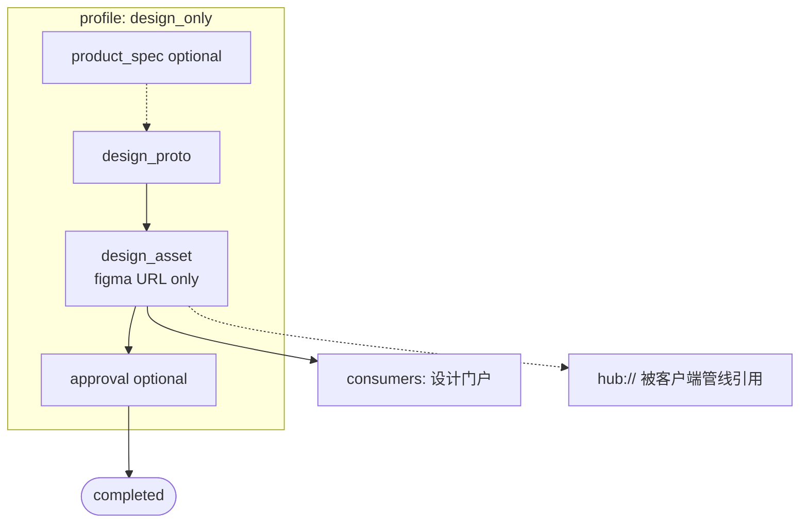
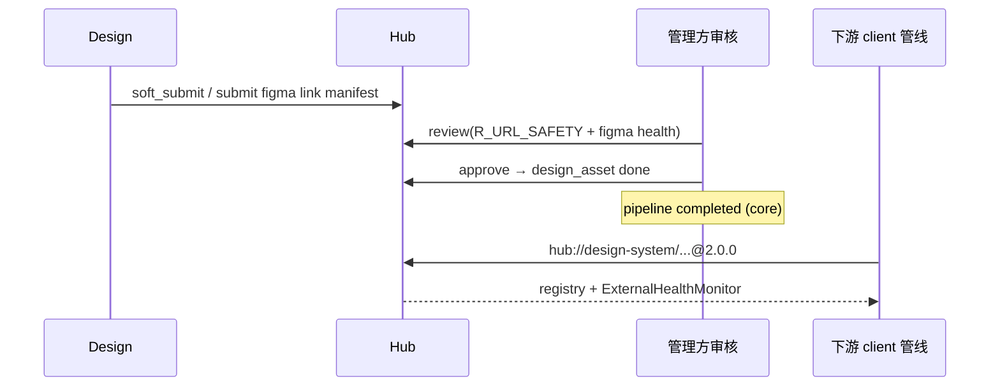

# 第五轮压力测试:B3 纯设计迭代全流程拓扑

> **文档性质**:第五轮「角色参与拓扑」压力测试
> **版本**:v1.0 | **日期**:2026-08-04 | **父文档**:[coordination-platform-prd.md](../coordination-platform-prd.md)
> **核心**:需求 1「UI 设计(设计原型提交和管理)」应可**独立成管线**,不绑架 server/client

---

## 1. 与已测场景差异

| 已测 | 差异 |
|---|---|
| A5 纯链接产物 | 测外链校验,仍常嵌在全栈 feature |
| A21 Figma 失效 | 外部健康,假设设计嵌在开发管线 |
| A31 设计门户消费 | design_asset done → 门户;未测「管线仅设计即 completed」 |
| A16 设计交付模板(叙述) | 提到设计团队自有模板,未完整走查无 server/client 时 Crew/权限/跨管线引用 |

---

## 2. 场景描述

**业务**:设计系统 Button/Modal 刷新 + 业务页视觉改版

- 参与:product(可选轻量 brief) + design
- **永久无** server / client
- DAG:

```
[product_spec?] → design_proto → design_asset(figma URL) → [approval?] → completed
                         └→ consumers: 设计门户
```

后续「登录改版」客户端管线通过 `hub://design-system-v3/design_asset@2.0.0` 引用。

---

## 3. PRD 走查

### 3.1 角色模型暗示「功能开发默认四人组」

§3.1 四角色并列;文档无 `design_only` 管线示例。designer 单独跑通时:
- 是否必须有 product 根节点?A6 free_artifact / side_node 部分相关,但「设计系统迭代以 design_proto 为根」是否合法未写清。

### 3.2 AC2.7 completed

仅 design 两节点 done 即 completed —— 语义正确,但验收剧本从未覆盖 → 易被实现成「缺少 client_delivery 不算完成」。

### 3.3 design-handoff-skill

`requires_figma_link: true` 符合需求 9。纯设计管线 OK。  
若错误继承 fullstack 模板未裁剪 server,会出现永远 blocked 的幽灵 server 节点。

### 3.4 跨管线消费

第四轮 CrossPipelineReferenceRegistry + A24 覆盖失效通知。缺口在于:

- 设计-only 管线 **completed 后长期维护**多个 minor 版本 design_asset,消费方 version_constraint 升级策略;
- 设计管线 `cancel`/`deprecated` 对大量 hub:// 消费方的爆炸通知(扇出)。

### 3.5 CrewAI

仅 design(+product) RoleInstance:需禁止 server/client session token 误发。  
generator 拉取 figma 发门户:可用 consumers,不必强行 server 角色。

### 3.6 产品可选

轻量 brief 用 `soft_submit` draft 或 `free_artifact`?PRD 未给「design_only 允许无 product 根」的显式合法性(与 B5 同类根因)。

---

## 4. 设计缺陷

| # | 严重度 | 缺陷 | 定位 |
|---|---|---|---|
| D-B3-1 | **Critical** | 无 `design_only` ParticipationProfile;设计管理无法证明为独立一等流程 | §1.2/1.3、§FR2 |
| D-B3-2 | **High** | 是否允许 design_proto 作管线根(无 product)未定义 | §FR2.2、A6 |
| D-B3-3 | **High** | 验收/MVP 无纯设计 completed 用例 | implementation-plan AC |
| D-B3-4 | **High** | 设计管线多版本 + 跨管线扇出升级策略仅部分覆盖,缺 profile 级默认 | §FR2 hub_ref、A24 |
| D-B3-5 | **Medium** | 误用 fullstack 模板未裁剪 → 幽灵 server/client 节点 | A16 裁剪未入主 PRD |
| D-B3-6 | **Medium** | 设计审批门(approval)与 auto-review 对「仅链接」的人工门槛策略未按 profile 区分 | §FR6 |
| D-B3-7 | **Low** | Dashboard 依赖图在无下游开发节点时「交付感」弱(需突出 consumers) | §FR8 |

**统计**:7 = 1C / 3H / 2M / 1L

---

## 5. 修正方案

```yaml
participation:
  profile: design_only
  roles_present: [design]
  roles_absent: [server, client]
  allow_non_product_root: true   # 允许 design_proto 为根
  completion:
    mode: core_nodes_done
    core_node_types: [design_proto, design_asset]
```

预设模板 `templates/design-delivery.yaml`:+ consumers 设计门户。  
跨管线:`on_producer_deprecated: notify_fanout` + 消费方 `on_dep_deprecated` 策略沿用第四轮。

### 设计图





---

## 6. 结论

纯设计管线是需求 1 明文能力,却被全栈默认叙事吞没。需 profile + 允许非 product 根 + 独立模板/验收。
