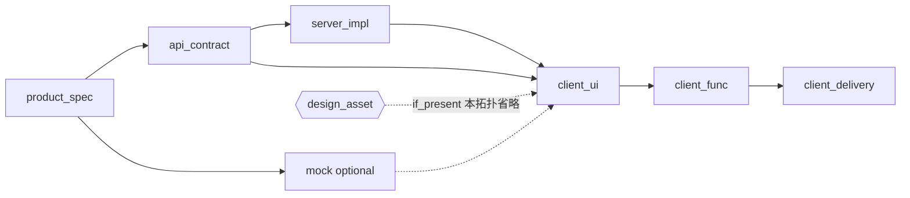
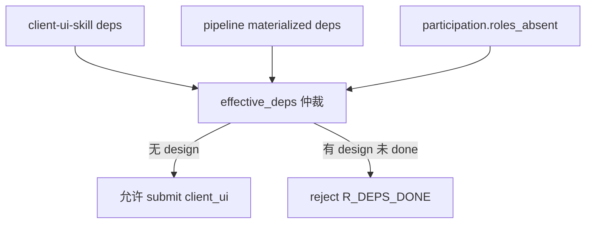

# 第五轮压力测试:B2 无设计客户端全流程拓扑

> **文档性质**:第五轮「角色参与拓扑」压力测试
> **版本**:v1.0 | **日期**:2026-08-04 | **父文档**:[coordination-platform-prd.md](../coordination-platform-prd.md)
> **核心矛盾**:场景 2 测的是「设计延迟并行」;本场景测「**永久无设计**」——Admin/内部工具大量如此

---

## 1. 与已测场景差异

| 已测 | 差异 |
|---|---|
| 场景 2 设计稿延迟 | 设计节点仍存在,只是慢;`accepts_draft` / 并行壳子 |
| 场景 12 mock 先行 | 缺的是正式契约,不是设计 |
| A16 skip_design | 示例常把 client 一并裁掉;未深测「有 client、无 design」时 **deps 重写 + skill 硬编码** |

---

## 2. 场景描述

**业务**:内部 Admin「批量封禁用户」

- 参与:product + server + client
- **永久无** `design_proto` / `design_asset`(Ant Design / 现有表格组件,无 Figma)
- DAG 期望:

```
product_spec → api_contract → server_impl ─┐
             ↘ (optional mock) ────────────┼→ client_ui → client_func → client_delivery
                                          │
                         (无 design_asset)─┘
```

---

## 3. PRD 走查

### 3.1 client-ui-skill 硬编码依赖 design_asset

`fr3-fr5-crew-skills.md` §6.5:

```yaml
deps:
  - api_contract
  - design_asset              # UI 依赖设计标注
requires_human_review: false
```

审核规则会按 skill.deps 检查上游 done。若管线中**没有** design_asset 节点:

- 要么校验失败永远无法 submit client_ui(**Critical**);
- 要么人为塞一个空 design_asset「占位 Figma」——直接违反需求 9「设计可能无 / 只给链接且无则不给」。

### 3.2 DepDeclaration 无 optional/omitted

主 PRD §FR2.2 仅有 `strictness: strict | accepts_draft`。`accepts_draft` 解决「草案可用」,**不解决「上游节点不存在」**。

不存在 ≠ draft。缺席节点不能靠 strictness 表达。

### 3.3 A16 deps_dynamic 未规格化

实施计划示例:

```yaml
deps_dynamic: "${skip_design ? [contract, impl] : [contract, asset, impl]}"
```

问题:

1. 主 PRD 数据模型无 `deps_dynamic` / `condition` 字段;
2. 与 Constraint Skill 静态 `deps` 谁优先?**未定义仲裁**;
3. CI 审核读 skill.yaml 还是 pipeline.yaml?

### 3.4 client agent backstory

fr3: client backstory「必须遵守 api_contract 和 design_asset 的 must 级约束」。无 design 时 LLM 仍会试图 `get_dependencies(design)` → 失败或幻觉。

### 3.5 视觉验收 / gate

ai-delivery-orchestrator 式「visual_acceptance」不在本协同平台范围内(无执行层),但若将来 gate policy 引用「对照 design」——无 design 拓扑会被误伤。需 `gate.policy.visual_ref: none | figma | screenshot`。

---

## 4. 设计缺陷

| # | 严重度 | 缺陷 | 定位 |
|---|---|---|---|
| D-B2-1 | **Critical** | client-ui-skill 强制 deps 含 design_asset,无设计管线 client_ui 无法过审 | fr3-fr5 §6.5 |
| D-B2-2 | **Critical** | DepDeclaration 无法表达「上游角色/节点永久缺席」(≠ accepts_draft) | 主 PRD §FR2.2 |
| D-B2-3 | **High** | skill 静态 deps vs pipeline deps_dynamic 无仲裁规则 | FR5 vs A16 草案 |
| D-B2-4 | **High** | client agent backstory/key_constraints 假设必有 design | §FR3 |
| D-B2-5 | **High** | ParticipationProfile `no_design_client` 不存在;skip_design 常误裁 client | A16 / §1.3 |
| D-B2-6 | **Medium** | mock 与「无设计」正交组合未给标准模板(product+server+client+mock) | §2.1 qualifier |
| D-B2-7 | **Medium** | gate/审核若隐式要求 figma,无开关 | §FR2.5 / design-handoff-skill |
| D-B2-8 | **Low** | Dashboard 仍显示「等待 design」空槽易误导 | §FR8 |

**统计**:8 = 2C / 3H / 2M / 1L

---

## 5. 修正方案

### 5.1 Dep presence

```python
class DepDeclaration(TypedDict):
    node_id: str | None
    presence: str   # "required" | "optional" | "if_present"
    # if_present: 仅当管线 materialized 后仍存在该 node_type/role 时才成为硬依赖
```

Skill 侧改为:

```yaml
# client-ui-skill
deps:
  - node_type: api_contract
    presence: required
  - node_type: design_asset
    presence: if_present      # 管线无 design → 不校验
```

审核引擎:`effective_deps = pipeline_deps ∩ skill_deps.resolve(presence, participation)`。

### 5.2 profile: no_design_client

```yaml
participation:
  profile: no_design_client
  roles_absent: [design]
  roles_present: [product, server, client]
```

materialize 后自动重写 client_ui.deps,去掉 design_*。

### 5.3 设计图





---

## 6. 结论

「无设计客户端」与「设计延迟」是不同问题。当前 skill 硬编码 + 依赖模型缺失 `if_present`,使需求 1/9 下的 Admin 类需求**无法过审**。必须 Skill×Pipeline×Participation 三方仲裁 deps。
