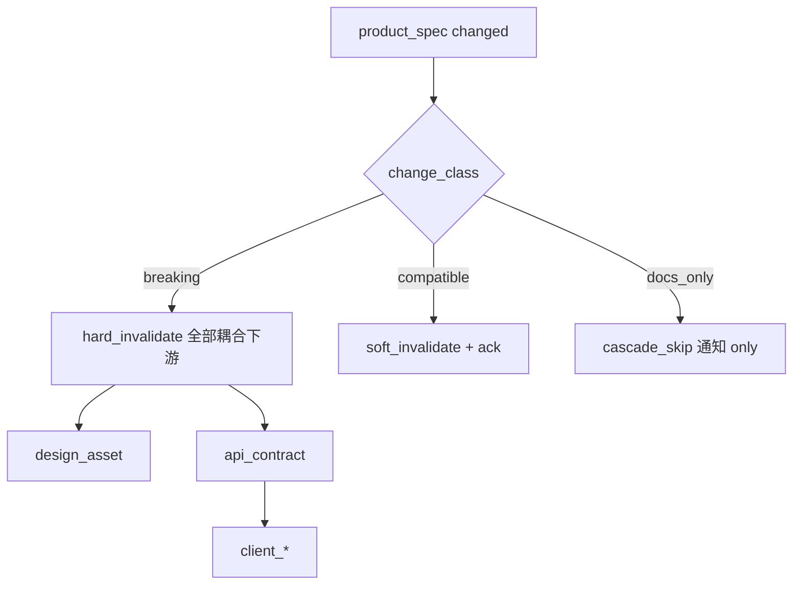
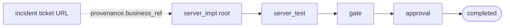
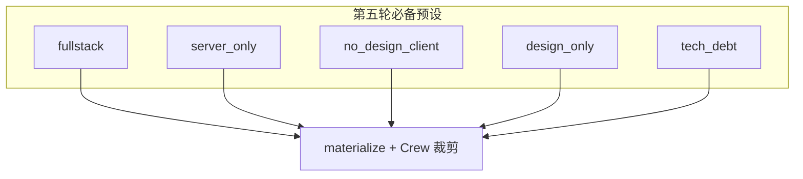

# 第五轮压力测试:B4 产品回流 + B5 无产品技术债拓扑

> **文档性质**:第五轮「角色参与拓扑」压力测试
> **版本**:v1.0 | **日期**:2026-08-04 | **父文档**:[coordination-platform-prd.md](../coordination-platform-prd.md)

---

# 场景 B4:产品需求中途回流

## 1. 与已测差异

| 已测 | 差异 |
|---|---|
| 场景 1 契约中途变更 | 变更源是 **api_contract** |
| 场景 15 全链路回滚 | 偏运维回滚 / 影响面粗粒度 |
| 场景 13 逆向打回 | 下游反馈打回,不是产品根重提 |

本场景:**根节点 product_spec changed**,按严格依赖图冲击已 done 的 design/server/client——真实「产品改需求」全流程。

## 2. 情境

登录改版管线已有:

- product_spec v1 done
- api_contract / design_asset / server_impl 部分 done
- client_ui in_progress

产品突然要求「必须支持 biometric」。product 重提 v2 → changed。

## 3. 走查

### 3.1 级联源

FR2 T16:节点 changed → 按 strictness 失效下游。product 为多下游根(server ‖ design),会扇出。  
P0-6 coupling / cascade_skip 在场景 15 提出,**主 PRD DepDeclaration 仍无 `coupling` 字段**(仅 strictness/format_slot/hub_ref)→ 产品改文案类兼容变更与破坏性变更无法区分 → **全量打回**(纸上谈兵残留)。

### 3.2 影响面评估

无 `impact_assessment` MCP/控制节点:产品改「文案」vs「新增认证因子」对 api/design/client 冲击不同。管理方不解析内容原则下,需要 **提交方声明 change_class**(breaking/compatible/docs_only)+ 下游 ack 快速通道(场景 1 已提,产品源未强制)。

### 3.3 部分下游已 in_progress

client 正在写代码:cascade 时 session token / 节点锁 / 人工 fallback 如何与产品回流协同——第四轮有 agent 行为,但无「根因来自产品」的 runbook。

## 4. 缺陷 B4

| # | 严重度 | 缺陷 |
|---|---|---|
| D-B4-1 | **Critical** | DepDeclaration 缺 coupling/change_class,产品回流只能全量失效 |
| D-B4-2 | **High** | 无 product 变更专用 impact_assessment / 下游兼容确认工具链 |
| D-B4-3 | **High** | 根节点扇出(design‖server)并发失效顺序与锁协议未按「产品回流」演练 |
| D-B4-4 | **Medium** | Langfuse 无「回流原因=product_spec」归因视图 |
| D-B4-5 | **Medium** | in_progress 下游被回流打断时的人机 runbook 缺失 |

**统计 B4**:5 = 1C / 2H / 2M

### 修正要点

```python
class DepDeclaration(TypedDict):
    ...
    coupling: str  # hard | soft | informational

class ArtifactResubmitMeta(TypedDict):
    change_class: str  # breaking | compatible | docs_only
    impact_claim: list[str]  # 声称受影响的下游 node_id;审核可驳回低估
```

级联引擎:`breaking → hard_invalidate`;`compatible → soft + request_ack`;`docs_only → cascade_skip 默认`。



---

# 场景 B5:无产品规格的技术债 / 热修管线

## 1. 与已测差异

| 已测 | 差异 |
|---|---|
| 场景 3 hotfix 插队 | 测优先级 / 抢占队列,不测「无 product 节点」合法性 |
| A12 冷启动单节点 | 测单节点终止语义,不是「有意无产品多节点技术债管线」 |

## 2. 情境

支付服务连接池泄漏紧急修复:

- **无 product_spec**(技术决策在工单/邮件)
- 节点:server_impl → server_test → gate → approval
- profile: `tech_debt`

## 3. 走查

### 3.1 根节点必须是 product?

§FR2 bootstrap「无依赖根节点 ready」。**未规定根的 node_type 必须是 product_spec**——手写可行。但:

- 权限/审计 provenance 常假设业务需求溯源;
- 第四轮 Provenance 有 submitter/llm,无 `business_source: product | engineering_decision | incident`;
- admin 创建管线的 UI/MCP 可能强制选 fullstack 模板。

### 3.2 completed 语义

技术债管线 approval 通过即 completed——合理。但若误套 fullstack 模板,会永远等 client。

### 3.3 审核

无产品时 `requires_human_review` 应变严(tech lead approval),profile 级默认审批策略缺失。

## 4. 缺陷 B5

| # | 严重度 | 缺陷 |
|---|---|---|
| D-B5-1 | **Critical** | 无 `tech_debt` / `allow_non_product_root` 一等公民;无产品管线合法性靠口口相传 |
| D-B5-2 | **High** | Provenance 缺 business_source,合规无法区分「有需求」vs「纯工程变更」 |
| D-B5-3 | **High** | profile 级默认审批/gate 策略缺失(tech_debt 应更高人工门槛) |
| D-B5-4 | **Medium** | 与场景 3 priority 未组合:tech_debt + p0 hotfix 标准模板 |
| D-B5-5 | **Low** | 文档无「事故复盘链接」作为旁路产物示例 |

**统计 B5**:5 = 1C / 2H / 1M / 1L

### 修正要点

```yaml
participation:
  profile: tech_debt
  roles_present: [server]
  roles_absent: [product, design, client]
  allow_non_product_root: true
  default_policies:
    requires_human_review: true
    gate: { lint: true, test: true, coverage_min: 70 }
completion:
  core_node_types: [server_impl, server_test, gate, approval]
```

```python
class Provenance(TypedDict):
    ...
    business_source: str  # product_spec | engineering_decision | incident | design_brief
    business_ref: str | None  # 工单 URL / incident id
```





---

## 5. 两场景合计

| 场景 | 缺陷 | C | H | M | L |
|---|---|---|---|---|---|
| B4 | 5 | 1 | 2 | 2 | 0 |
| B5 | 5 | 1 | 2 | 1 | 1 |
| **合计** | **10** | **2** | **4** | **3** | **1** |

## 6. 结论

B4 暴露**级联仍缺 coupling/change_class**(前轮提出未完全回写)。B5 暴露**无产品根**与 provenance/审批策略空白。二者与 B1–B3 共同证明:真正缺口是 **Participation × 变更分类 × 完成谓词**,不是再找零散异常路径。
