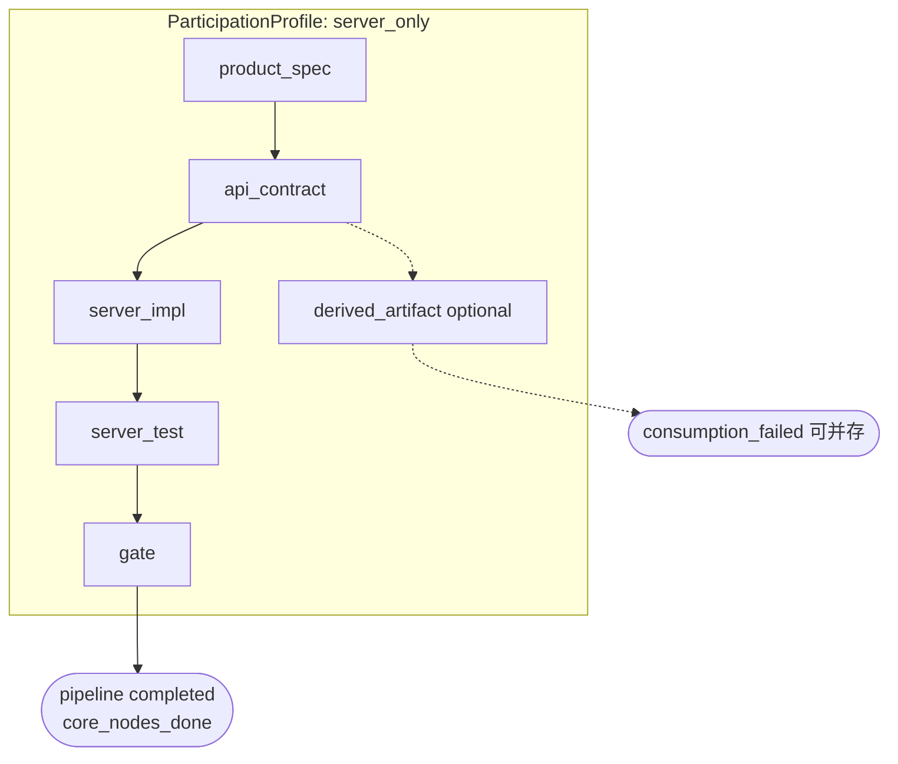
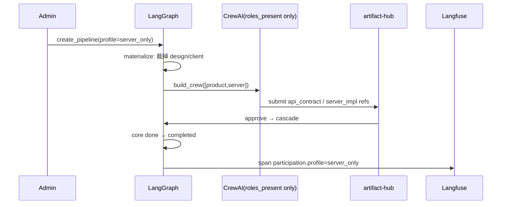

# 第五轮压力测试:B1 服务端独占全流程拓扑

> **文档性质**:对《coordination-platform-prd.md》v3.0 的第五轮「角色参与拓扑」压力测试
> **版本**:v1.0 | **日期**:2026-08-04 | **状态**:架构评审输入
> **父文档**:[coordination-platform-prd.md](../coordination-platform-prd.md)
> **测试方法**:真实全流程场景逐步走查 PRD,定位「纸上谈兵」缺陷
> **核心原则**:需求 1 明确「设计/服务端/客户端可能无」——本场景验证**永久无设计、无客户端**的服务端独占管线

---

## 1. 与已测场景的差异声明

| 已测场景 | 测了什么 | 本场景新在哪 |
|---|---|---|
| 登录全栈(多数场景默认) | product→design→server→client | 本场景**永久裁掉** design + client |
| A12 冷启动单节点 | 单节点终止语义 | 本场景是**有意识的多节点服务端闭环**(spec→contract→impl→test→gate) |
| A16 管线模板 | 提出 skip_design / 裁剪概念 | 修正方案在场景报告/实施计划 Phase 3,**未回写主 PRD FR2**;且 A16 的 skip_design 仍保留 client 节点假设 |
| A30 派生产物 SDK | api_contract done → SDK | 假设上游仍在全栈管线中;未测「产物完成即管线完成」的服务端独占 completed |

**判定**:属于**非常重要**的真实拓扑——内部 API / 计费 / 管理接口大量无客户端 UI。

---

## 2. 场景描述

**业务背景**:内部计费微服务 Feature「发票开具 API」

| 角色 | 是否参与 | 产物 |
|---|---|---|
| product | ✅ | `product_spec`(开票规则 / 税率 / 幂等要求) |
| server | ✅ | `api_contract`(OpenAPI) → `server_impl`(代码仓 commit) → `server_test` |
| design | ❌ 永久缺席 | — |
| client | ❌ 永久缺席 | — |
| generator | 可选 | `derived_artifact`(多端 SDK) |

期望 DAG:

```
product_spec → api_contract → server_impl → server_test → gate → [derived_artifact?] → completed
```

人员用 **spec-kit** 写契约;实现与测试以**引用型产物**指向代码仓。管理方**不执行**开发,只收产物 + 审核。

---

## 3. PRD 逐点走查

### 3.1 MVP / 验收默认全栈

主 PRD §1.3「通用性:覆盖服务端/客户端/UI 设计全流程」——措辞覆盖服务端,**但未给出服务端独占的一等公民模型**。

`implementation-plan.md` Phase 1:

> 支持单一 feature 从 product_spec → api_contract → design_asset → client_ui → client_delivery

AC-P1-01 / MS1 / T1 验收剧本全部绑定 design + client。**服务端独占在 MVP 验收中不可见** → 通用性只停留在口号。

### 3.2 依赖 DAG 无「角色缺席」语义

主 PRD §FR2.2:依赖声明只有 `node_id` / `hub_ref` / `strictness` / `format_slot`,**无 `presence` / `optional` / `omitted`**。  
若手写 pipeline.yaml 省略 design/client 节点,理论可跑——但:

1. 无 ParticipationProfile 校验「本管线声明不参与 design」与「skill 强制 deps」冲突;
2. AC2.7「全节点 done → completed」依赖「pipeline.yaml 里有哪些节点」——靠人工写对拓扑,平台不认识「拓扑变体」。

### 3.3 Skill 与 CrewAI 默认假设全角色

`fr3-fr5-crew-skills.md` 默认注册 `design_agent` + `client_agent`。服务端独占管线:

- `build_crew_for_ready_nodes` 若仍按全局 4 角色建 Crew,design/client agent **空转却占预算**(第四轮 A36 成本问题在拓扑上放大);
- `role_assignments` 未设计「缺席角色禁止被 assign」。

### 3.4 管线模板裁剪未入主 PRD

A16 / implementation-plan §14.8 有 `skip_design` + `condition` + `deps_dynamic`,但:

- **主 PRD FR2 无 PipelineTemplate / ParticipationProfile 章节**;
- A16 示例在 `skip_design=true` 时把 **client_ui 也 condition 裁掉**,与「纯后端但仍要对外提供 API」一致——却没有独立 `profile: server_only` 预设;
- `skip_design` 命名只能表达「无设计」,不能表达「无客户端」。

### 3.5 completed / 派生产物

AC2.7:全节点 done → completed。若额外挂 `derived_artifact`(SDK):

- 主产物全 done 但 SDK 生成失败时,**管线永远不可 completed**(消费失败 vs 交付完成未分岔);
- 第四轮 consumers / report_generation_status 存在,但未定义「核心节点集合 vs 可选派生节点」对 completed 的影响。

### 3.6 Langfuse Dashboard

FR7/FR8 视图「角色负载」聚合 4 角色。服务端独占时 design/client 列恒为 0,**无 topology filter**,容易误读为「设计阻塞」。

---

## 4. 设计缺陷

| # | 严重度 | 缺陷 | 定位 |
|---|---|---|---|
| D-B1-1 | **Critical** | 需求 1「角色可缺席」在主 PRD 无一等模型(ParticipationProfile / 拓扑预设);通用性无法落地 | §1.2–1.3、§FR2 |
| D-B1-2 | **Critical** | MVP/验收剧本硬编码 fullstack,服务端独占不在 Phase 1 AC | implementation-plan AC-P1-01/MS1 |
| D-B1-3 | **High** | PipelineTemplate 裁剪(skip_design)仅在场景修正/Phase3 示例,未回写 FR2 | A16、implementation-plan §14.8 vs 主 PRD FR2 |
| D-B1-4 | **High** | `skip_design` 语义不足以表达 server_only(无 client);无 `roles_absent` | A16 修正草案 |
| D-B1-5 | **High** | AC2.7 completed 不区分「核心交付节点」与「可选派生产物节点」 | §FR2.6 AC2.7、§FR2.5 consumers |
| D-B1-6 | **High** | CrewAI 按全局角色建 Crew,缺席角色 agent 空转耗预算 | §FR3、fr3-fr5 |
| D-B1-7 | **Medium** | SkillRegistry 无「按管线实际节点绑定 skill」;假想依赖 design 的 skill 可能污染校验 | §FR5、fr3 §6 |
| D-B1-8 | **Medium** | Dashboard/Langfuse 无 topology/profile 维度,误报角色阻塞 | §FR7.3、§FR8 |
| D-B1-9 | **Medium** | 服务端独占的 gate 默认策略未定义(无 client_delivery 时 coverage/security 出口在哪) | §FR2.5 gate |
| D-B1-10 | **Low** | 文档示例几乎全是登录全栈,新人照抄会造出幽灵 design 节点 | 全文示例 |

**统计**:10 缺陷 = 2 Critical / 4 High / 3 Medium / 1 Low

---

## 5. 修正方案

### 5.1 ParticipationProfile(主 PRD 新增)

```yaml
# pipeline.yaml 头部
participation:
  profile: server_only          # 预设枚举,见下表
  roles_present: [product, server, generator?]
  roles_absent: [design, client]
  completion:
    mode: core_nodes_done       # 非 blindly all nodes
    core_node_types: [product_spec, api_contract, server_impl, server_test, gate]
    optional_node_types: [derived_artifact]  # 失败不挡 completed;记 consumption_failed
```

预设 profile:

| profile | roles_present | 典型用途 |
|---|---|---|
| `fullstack` | product,server,design,client | 默认登录类 |
| `server_only` | product,server(+generator?) | 内部 API / 计费 |
| `no_design_client` | product,server,client | Admin/CLI 无 Figma |
| `design_only` | product?,design | 设计系统迭代 |
| `tech_debt` | server(+approval) | 无产品规格热修 |
| `custom` | 显式列表 | 自由组合 |

### 5.2 实例化规则(LangGraph bootstrap)

```python
def materialize_pipeline(template, participation):
    nodes = [n for n in template.nodes if n.role not in participation.roles_absent
             and eval_condition(n.condition, participation)]
    # 禁止保留「指向已裁剪节点」的 dangling deps
    validate_no_dangling_deps(nodes)
    # Crew 只实例化 roles_present
    crew = build_crew(roles=participation.roles_present)
    return nodes, crew
```

### 5.3 completed 谓词

```python
def maybe_complete(state, participation):
    core = participation.completion.core_node_types
    if all(state.node_states[n] == "done" for n in nodes_of_types(core)):
        state.pipeline_status = "completed"
        # optional 未完成 → 告警,不挡 completed
```

### 5.4 设计图





---

## 6. 结论

服务端独占是真实高频拓扑。当前 PRD **理论上**可用手写 pipeline.yaml 省略节点运行,但:**无 ParticipationProfile、MVP 不验收、模板裁剪未入主 PRD、completed/Crew/Dashboard 均假设全栈** → 通用性仍属纸上谈兵。必须把拓扑变体提升为一等设计。
