# 调研报告:AI 多 Agent 开发流程管理与 Dashboard 方案

> 调研日期:2026-08-04 | 范围:全网 | 目标:寻找"让 AI 自主进行需求管理、接口契约管理、多任务/多仓库并行串行开发、自动依赖管理,并构成 agent 流水线 + 可用 Dashboard"的方案

---

## 一、核心结论 (TL;DR)

**没有一款 turnkey 产品能一站式覆盖你的全部诉求。** 当前市场是分层的,你的需求恰好横跨 5 层,需要"组合拳"。

| 你的诉求 | 现状 | 最接近的方案 |
|---|---|---|
| 需求管理(让 AI 自主拆需求) | 有专门工具,但偏 SDD 规范生成 | GitHub Spec Kit / OpenSpec / BMAD-METHOD |
| 接口契约管理 | 几乎空白,需 DIY | OpenSpec 的 TypedDict 状态协议 + 自建契约注册中心 |
| 多任务/多仓库并行串行 | 编排框架支持,但多仓库并行少 | LangGraph DAG + 文件锁/分支隔离 |
| 自动前后依赖管理 | 无成熟产品,需自建 DAG 调度 | LangGraph 条件边 + 自建依赖图 |
| Dashboard 监控 | **这一层最成熟** | Langfuse(开源自托管)/ LangSmith |
| 端到端 agent 流水线 | 商业产品有,但不透明 | Devin(商业)/ OpenHands(开源) |

**推荐组合(开源、可自托管、可组合):**

```
需求层:  GitHub Spec Kit / OpenSpec   → 生成 spec + 任务拆解
技能层:  Superpowers / TRAE Skills     → 封装原子能力 + 权限
编排层:  LangGraph (StateGraph DAG)    → 多 Agent 串/并行 + 依赖
监控层:  Langfuse (旁路观测)           → trace / dashboard / 评估
执行层:  OpenHands / Claude Code       → 落地写代码(多仓库)
```

业界已落地的参考架构是 **OpenSpec + Superpowers + Harness 三层**(2026 年真实项目案例),下面详述。

---

## 二、需求拆解

你描述的完整 agent 流水线 = 以下 6 个能力:

1. **需求管理**:AI 自主把模糊需求 → 结构化 spec → 子任务
2. **接口契约管理**:多 Agent / 多服务间的数据契约定义、版本、校验
3. **多任务调度**:并行 + 串行混合编排
4. **多仓库并行/串行开发**:跨 repo 的代码修改协调(分支隔离、文件锁、PR 汇总)
5. **自动依赖管理**:需求 A 完成后需求 B 才能开始;接口契约变更触发下游任务
6. **Dashboard**:可视化所有 Agent 状态、任务进度、依赖图、trace、审批

---

## 三、市场全景(5 层分类)

### 第 1 层:SDD / 需求管理层(Spec-Driven Development)

2026 年 SDD 已成主流范式:**规范不再是写完即丢的文档,而是直接生成可执行实现的蓝图**。

| 工具 | 出品方 | 定位 | 特点 | 仓库 |
|---|---|---|---|---|
| **GitHub Spec Kit** | GitHub 官方 | 规范驱动开发工具包 | 反转开发流程,spec → 实现;集成 GitHub 生态 | github/github/spec-kit |
| **OpenSpec** | 开源社区 | Agent 间通信协议 + spec | 用 TypedDict + Annotated + YAML 定义状态协议,字段合并策略声明式;**"配置即架构"**,加 Agent 零代码改动 | — |
| **BMAD-METHOD** | bmadcode | AI 代理驱动的敏捷全流程框架 | 让 AI 模拟完整敏捷团队(PM/架构师/Dev/QA),一人顶一个团队;开源免费 | github.com/bmadcode/BMAD-METHOD |
| **Claude Code Superpowers** | 社区 | 技能模块库 + TDD 增强 | 封装原子能力 + 渐进式披露 + 权限管控;action 类技能必须审批 | — |

**三者哲学对比:**
- Spec Kit:GitHub 生态绑定,spec → code 自动生成
- OpenSpec:**通信协议优先**,管"Agent 之间说什么"
- BMAD-METHOD:**角色模拟优先**,模拟完整敏捷团队流程
- Superpowers:**能力封装优先**,管"Agent 会什么"

### 第 2 层:技能 / 能力封装层

| 工具 | 模式 | 关键能力 |
|---|---|---|
| Superpowers | 原子化 Skill + 渐进式披露 + 权限审批 | discover 只返回 Top-5 相关(控 token);写操作走 ApprovalMiddleware 拦截 |
| TRAE Skills | 你当前所在体系(plugin/skill) | 本地 skill 包,可被 agent 调用 |
| MCP (Model Context Protocol) | 标准化工具协议 | Anthropic 推的跨 agent 工具调用协议,2026 已成事实标准 |

### 第 3 层:编排 / 调度层(核心)

这是你最关心的"流水线 + 依赖管理"层。

| 框架 | 类型 | 控制流 | 多仓库 | 依赖管理 | 适合场景 |
|---|---|---|---|---|---|
| **LangGraph (StateGraph)** | 状态图 Runtime | **代码定义 DAG,白盒可控** | 需自建 | 原生条件边/回退循环 | 生产级可控编排(**推荐**) |
| LangChain AgentExecutor | 黑盒 Agent | LLM 自决 | 弱 | 难 | 不推荐,不可控 |
| **CrewAI** | 角色协作 SDK | 角色驱动 | 弱 | 简单 | 角色分工清晰的团队模拟 |
| OpenAI Agents SDK | 托管式 SDK | 受限 | 弱 | 简单 | OpenAI 生态深度绑定 |
| DeerFlow / Spring AI | Java 生态 | — | — | — | JVM 栈 |
| **n8n** | 低代码工作流 | 可视化节点 | 有连接器 | 简单 | 快速搭"数字办公室",非重度编码 |
| Dify | LLM 应用平台 | 可视化 | 弱 | 弱 | 应用构建,非多 repo 编码 |

**LangGraph vs LangChain AgentExecutor(关键决策):**

| 维度 | AgentExecutor | LangGraph StateGraph |
|---|---|---|
| 控制流 | LLM 自己决定下一步 | **代码定义 DAG,可控** |
| 状态管理 | 只有 messages | **任意字段 state(TypedDict)** |
| 条件路由 | 难 | **原生支持** |
| 回退循环 | 难 | **条件边实现** |
| 可观测 | 弱 | **每节点独立 trace** |

LangGraph 的精髓:**用 `Annotated[Sequence[BaseMessage], operator.add]` 声明字段合并策略**(累积型追加 vs 状态型覆盖),而不是写 if-else。

**多仓库并行开发**:业界通用做法是 **文件锁 + 分支隔离**(Cursor 的 Planner/Worker 架构即如此),LangGraph 层做任务级 DAG,执行层每个 worker 独占一个 repo/分支。没有现成产品,需自建。

### 第 4 层:可观测性 / Dashboard 层(最成熟)

| 平台 | 类型 | 核心能力 | 自托管 |
|---|---|---|---|
| **Langfuse** | 开源 | LLM Observability + Metrics + Evals + Prompt Management + Playground + Datasets,完整工程栈 | ✅ **强烈推荐** |
| LangSmith | 商业(LangChain 出品) | trace / 评估 / 监控 | ❌ |
| Braintrust | 商业 | 评估 + 实验 | ❌ |
| LangChain SmithDB | 基础设施 | 专为 Agent trace 数据设计(深度嵌套、异步、长跨度) | — |

**Langfuse 旁路监听原则**(生产实践):所有调用走 `_safe` 包装,失败降级本地日志,**可观测性不能拖垮主业务**。

### 第 5 层:端到端 AI 软件工程师(写代码执行层)

| 产品 | 类型 | 多任务并行 | 多仓库 | Dashboard | 说明 |
|---|---|---|---|---|---|
| **Devin** (Cognition) | 商业 SaaS | ✅ | ✅ | ✅ 内置 | 产品化最强,但黑盒、贵;Cognition 发文《Don't Build Multi-Agents》主张**单 Agent + 强上下文管理**优于多 Agent |
| **OpenHands** (原 OpenDevin) | 开源 | 部分 | 部分 | 有 | Devin 概念的开源实现,社区驱动,增长快 |
| **SWE-agent** | 学术开源 | 弱 | 弱 | 弱 | ACI( Agent-Computer Interface)设计研究导向 |
| GitHub Copilot Workspace | 商业 | — | — | — | GitHub 生态 |
| Cursor Planner/Worker | 商业 IDE | ✅ 层级协调 | 文件锁 | IDE 内 | Planner/Worker 架构,多 agent 文件锁并行 |

**重要反向观点(Cognition):** 《Don't Build Multi-Agents》认为多 Agent 上下文同步成本高、一致性差,主张单 Agent + 超长上下文。Anthropic 则支持多 Agent。**结论:简单任务单 Agent,复杂长流程多 Agent + 强编排(LangGraph 白盒)。**

---

## 四、重点参考架构:OpenSpec + Superpowers + Harness 三层

这是 2026 年真实落地的工程化 Multi-Agent 架构(主动安全防控平台项目),直接对应你的诉求。

| 架构层 | 角色定位 | 核心功能 | 类比 |
|---|---|---|---|
| **OpenSpec** | 通信协议 | 定义 Agent 间标准数据格式 + 合并策略 | HTTP 协议 |
| **Superpowers** | 技能模块 | 封装原子能力 + 权限管控 | 微服务/函数库 |
| **Harness** | 调度中心 | 编排多 Agent 协作流程(DAG) | Kubernetes |

**一句话:OpenSpec 管"说什么",Superpowers 管"会什么",Harness 管"怎么干"。**

### 4.1 OpenSpec —— 接口契约层(对应你的"接口契约管理")
- 运行时状态协议:`TypedDict + Annotated` 声明字段合并策略(累积追加 vs 状态覆盖)
- 声明式子 Agent 注册:YAML 即架构,加 Agent 只改 YAML,核心代码 0 改动
- **这就是你要的"接口契约管理"的雏形**,但需扩展为跨服务契约注册中心(版本化、schema 校验、变更通知下游)

### 4.2 Superpowers —— 能力 + 权限层
- 原子化封装 + 渐进式披露(discover 返回 Top-5,控 token)+ 写操作强制审批
- `BEFORE_TOOL_CALL` Hook 拦截,工单状态置 `pending_approval` 不落库
- **对应你的"自动依赖管理"中"契约变更需审批下游"**

### 4.3 Harness —— 编排调度层(对应你的"多任务并行/串行 + 依赖")
- LangGraph StateGraph:6 节点 DAG,并行采集 + 串行研判 + 条件回退
- **确定性 + LLM 双轨**:评分用规则(稳定可复现),分析用 LLM(增强)——规则优先,LLM 增强
- 9 种 Hook 覆盖全生命周期:`BEFORE/AFTER_LLM_CALL`、`BEFORE/AFTER_TOOL_CALL`(审批拦截)、`ON_ERROR`(熔断)、`ON_CONTEXT_INJECT`、`ON_SKILL_SYNC`(热更新)、`ON_SUMMARY_COMPRESS` 等
- 节点 = 业务逻辑,中间件 = 横切关注点(AOP 思想)

### 4.4 8 层降级(生产级"逃生通道")
每个依赖挂掉都有备胎:LLM→规则引擎、Embedding→Hash 模拟向量、Milvus→内存字典、…、全局异常→兜底合法 JSON。**永远返回合法 JSON 是 ToB 铁律。**

### 4.5 评估数据飞轮
评估得分 < 0.7 的 case → 入队人工标注 → 回流 GoldenDataset → 下轮实验自动用。**系统越用越准。**

---

## 五、Gap 分析:现有方案缺什么(你需要自建的部分)

| 你的诉求 | 现状 | Gap | 自建方案 |
|---|---|---|---|
| AI 自主需求管理 | SDD 工具生成 spec | 缺"需求→任务 DAG"自动拆解 | Spec Kit 生成 spec + LLM 拆子任务 + 写入 LangGraph DAG |
| 接口契约管理 | OpenSpec 有运行时状态协议 | 缺跨服务契约注册中心、版本、变更通知 | 自建契约 registry(schema + 版本 + 订阅通知) |
| 多仓库并行/串行 | LangGraph 任务级 DAG 有 | 缺 repo 级隔离、文件锁、PR 汇总 | 每个 worker 独占分支 + 文件锁(Cursor Planner/Worker 模式)+ PR 聚合 |
| 自动前后依赖 | LangGraph 条件边有 | 缺需求级依赖图(非任务级) | 需求 DAG → 任务 DAG 映射,契约变更触发下游 |
| Dashboard | Langfuse 成熟 | 偏 trace,缺需求/任务看板 | Langfuse(trace)+ 自建需求/任务 Kanban(或接 Backstage) |
| 端到端流水线 | Devin/OpenHands 有 | 黑盒或单 repo | 组合:Spec Kit + LangGraph + OpenHands/Claude Code |

**一句话:编排与监控层成熟,需求与契约层需 DIY 拼装。**

---

## 六、推荐落地方案(分层组合,开源可自托管)

### 方案 A:轻量自建(推荐起步)
```
┌─ 需求层 ── GitHub Spec Kit / OpenSpec (spec + 任务拆解)
├─ 技能层 ── TRAE Skills / Superpowers (原子能力 + 权限)
├─ 编排层 ── LangGraph StateGraph (DAG + 条件边 + 依赖)
├─ 监控层 ── Langfuse 自托管 (trace + dashboard + 评估)
└─ 执行层 ── Claude Code / OpenHands (多 repo 写码)
```
- 优点:每层可选最好,可控可观测,开源
- 缺点:需自己写"需求 DAG ↔ 任务 DAG ↔ 契约 registry"的胶水层

### 方案 B:商业端到端(快速验证)
- Devin / Cognition 团队版:内置多任务并行、多仓库、Dashboard
- 优点:开箱即用
- 缺点:黑盒、贵、契约/依赖管理不可控

### 方案 C:可视化低代码(非重度编码场景)
- n8n + Langfuse:n8n 搭"数字办公室",可视化节点编排
- 适合:工作流自动化而非代码工程

---

## 七、Dashboard 专项对比(你最关心的)

| Dashboard | 覆盖 | 缺 | 自托管 | 推荐度 |
|---|---|---|---|---|
| **Langfuse** | LLM trace / 节点 / 评估 / prompt / dataset | 需求看板、任务依赖图 | ✅ | ★★★★★(监控层首选) |
| LangSmith | 同 Langfuse | 同 | ❌ | ★★★★ |
| Devin 内置 | 任务 / 并行 / repo | 黑盒 | ❌ | ★★★(端到端) |
| Backstage (Spotify) | 多 repo 开发者门户、服务目录、文档 | 非 AI 原生,无 agent trace | ✅ | ★★★(补需求/repo 看板) |
| 自建 Kanban | 需求 / 任务 / 依赖图 | 需开发 | ✅ | ★★★(定制最强) |

**建议:** Langfuse 做 agent 运行监控 + 自建(或接 Backstage)做需求/任务/依赖看板。两者通过 trace_id 关联。

---

## 八、关键参考链接

- GitHub Spec Kit:https://github.com/github/spec-kit
- BMAD-METHOD:https://github.com/bmadcode/BMAD-METHOD
- LangGraph:https://github.com/langchain-ai/langgraph
- Langfuse:https://github.com/langfuse/langfuse
- OpenHands(原 OpenDevin):https://github.com/All-Hands-AI/OpenHands
- SWE-agent:https://github.com/princeton-nlp/SWE-agent
- CrewAI:https://github.com/crewAIInc/crewAI
- Backstage:https://github.com/backstage/backstage
- n8n:https://github.com/n8n-io/n8n

---

## 九、下一步建议(可选行动方向)

基于调研,后续可走以下任一方向(需你确认):

1. **选型落地**:选方案 A,我帮你出一个针对你 skills 仓库场景的具体集成方案(LangGraph + Langfuse + Spec Kit)
2. **深度评估某一款**:对 Devin / OpenHands / BMAD-METHOD 做深度功能验证(实际跑 demo)
3. **自建契约 + 依赖层**:针对 Gap 中的"接口契约 registry"和"需求→任务 DAG 依赖管理"出详细设计
4. **Dashboard 原型**:用 Langfuse + 自建看板搭一个最小可用监控 demo

---

## 十、补充设计:通用多角色 AI 开发协同平台(Coordination Hub)

> 回应你的 4 点新需求:① 通用(服务端/客户端/UI 设计全流程)② 中立产物管理(不限制开发方案)③ AI 自主同步到单独管理方 ④ 严格跨类型依赖图

### 10.1 设计目标与原则

| 目标 | 含义 | 设计原则 |
|---|---|---|
| **通用性** | 涵盖服务端(接口协议→开发)、客户端(UI+功能+交付)、UI 设计(原型提交管理) | 角色抽象 + 产物类型抽象,流程可配置 |
| **产物中立** | 各团队用 ECC/OpenSpec/spec-kit/superpowers/custom 均可,Hub 不解析内容 | 只约束**元数据 schema**,不约束 content;Hub 是"契约+状态"层,不是"内容"层 |
| **AI 自主同步** | 开发完/设计完/契约完,agent 自动推送管理方 | 事件驱动 + webhook/push,管理方单独仓库或后台 |
| **严格依赖图** | 服务端/客户端/设计依赖产品需求;客户端依赖服务端+设计 | 跨类型 DAG + 状态机,依赖未完成则下游 blocked |

**核心思想:Hub 不下场做开发,只做"产物注册 + 依赖调度 + 同步通知"。** 它是裁判,不是运动员。

---

### 10.2 角色与产物矩阵(需求点 1、4)

| 角色 | 产物类型(type) | 依赖(deps) | 产出工具(不限) |
|---|---|---|---|
| **产品** | `product_spec` 需求文档 | — | ECC / OpenSpec / 自定义 |
| **服务端** | `api_contract` 接口契约 | `product_spec` | spec-kit / OpenSpec / 自定义 |
| **服务端** | `server_impl` 服务实现 | `api_contract` | Claude Code / OpenHands / ECC |
| **服务端** | `server_test` 自测报告 | `server_impl` | 同上 |
| **UI 设计** | `design_proto` 设计原型 | `product_spec` | Figma / 即时设计 / AI 生成 |
| **UI 设计** | `design_asset` 标注+切图 | `design_proto` | Figma Bridge / TemPad |
| **客户端** | `client_ui` UI 实现 | `design_asset` + `api_contract` | Cursor / Claude Code |
| **客户端** | `client_func` 功能实现 | `client_ui` + `server_impl`(联调) | 同上 |
| **客户端** | `client_delivery` 交付包 | `client_func` + `server_test` | 同上 |

**依赖是跨类型、跨角色的**:一个 `client_func` 同时依赖客户端自己的 `client_ui`、服务端的 `server_impl`、设计的 `design_asset`。Hub 必须支持**多入边**。

---

### 10.3 核心架构:Coordination Hub(需求点 2、3)

```
                ┌─────────────────────────────────────────────┐
                │         Coordination Hub(单独仓库/后台)      │
                │                                             │
                │  ┌─────────────┐  ┌──────────────────────┐  │
   AI agent ──► │  │ 产物注册中心 │  │   依赖调度引擎(DAG)  │  │
   (服务端)    │  │ (Artifact   │  │  - 状态机推进         │  │
   AI agent ──► │  │  Registry)  │◄─►  - 依赖解锁          │  │
   (客户端)    │  │  - schema校验│  │  - 变更通知下游       │  │
   AI agent ──► │  │  - 版本管理  │  └──────────────────────┘  │
   (UI设计)    │  └──────┬──────┘                             │
                │         │          ┌──────────────────────┐  │
                │         └──────────►│  同步通知总线        │  │
                │                    │  (Webhook/MQ/Push)   │──┼──► 通知下游 ready
                │                    └──────────────────────┘  │
                └─────────────────────────────────────────────┘
                                  ▲
                                  │ Dashboard 查询
                ┌─────────────────┴────────────────┐
                │  Dashboard(Langfuse + 自建看板) │
                │  - 依赖图 / 角色看板 / 产物详情   │
                └──────────────────────────────────┘
```

**Hub 三大职责:**
1. **产物注册中心**:收产物 → 校验元数据 schema → 存版本 → 不解析 content
2. **依赖调度引擎**:维护跨类型 DAG,产物状态变更 → 检查下游依赖是否满足 → 解锁/通知
3. **同步通知总线**:下游 ready 时推送事件,让对应角色 agent 启动任务

**Hub 是单独仓库或后台**(你指定),各团队 agent 通过 API/push 与之交互,产物内容存对象存储/Git LFS,元数据存 DB。

---

### 10.4 通用中立产物模型(需求点 2)

**关键:Hub 只约束元数据,不约束 content。** 各团队 content 可用 ECC、OpenSpec、spec-kit、superpowers、自定义任意格式。

```json
// 产物 manifest(Hub 唯一强制的 schema)
{
  "id": "art_20260804_api_contract_001",
  "type": "api_contract",              // 见 10.2 矩阵
  "role": "server",                    // product|server|client|design
  "title": "用户登录接口契约 v1",
  "version": "1.2.0",                  // semver
  "status": "done",                    // blocked|ready|in_progress|review|done|changed
  "deps": [                            // 严格依赖声明
    { "id": "art_..._product_spec_001", "type": "product_spec", "min_version": "1.0.0" }
  ],
  "source": {
    "repo": "backend-services",
    "branch": "feat/login-contract",
    "commit": "a1b2c3d",
    "path": "contracts/login.yaml"     // 产物内容位置(Hub 不解析)
  },
  "toolspec": {                        // 生成该产物用的方案(Hub 不限制,只记录)
    "framework": "spec-kit",           // ECC|OpenSpec|spec-kit|superpowers|custom
    "version": "0.4.1",
    "schema_ref": "optional"           // 若有 schema 可选填,Hub 不强校验
  },
  "lock": null,                        // 编辑锁(谁在改),null=可改
  "created_at": "2026-08-04T10:00:00Z",
  "updated_at": "2026-08-04T11:30:00Z",
  "trace_id": "lf_xxxxx"               // 关联 Langfuse trace(可选)
}
```

**中立性体现:**
- `content` 不在 manifest 里,只给 `source.path`,Hub 不读取、不校验内容格式
- `toolspec.framework` 仅记录用谁做的,**不限制取值**
- 产物可以是 YAML/JSON/Markdown/Figma 文件/图片,Hub 一视同仁
- 各团队保留自己的开发方案,只需在"完成"时产出一份符合上面 schema 的 manifest 并 push

---

### 10.5 严格依赖图与状态机(需求点 4)

#### 跨类型 DAG 示例(一个登录功能)

```
product_spec(需求)
   ├──► api_contract(服务端契约) ──► server_impl ──► server_test
   │            │                                        │
   │            ▼                                        │
   │     client_ui(UI实现) ──► client_func ◄────────────┘(联调)
   │            ▲
   ├──► design_proto(设计原型) ──► design_asset(标注切图)
   │                                    │
   └────────────────────────────────────┘(client_ui 依赖 design_asset + api_contract)
                              │
                              ▼
                        client_delivery(交付包)
```

**多入边规则:`client_ui` 同时依赖 `design_asset` 和 `api_contract`,两者都 done 才 ready。**

#### 产物状态机

```
            依赖未满足                 依赖满足
  blocked ──────────► ready ──────────► in_progress
     ▲                                      │
     │依赖变更(下游 changed)               │ agent 开始
     │                                      ▼
     │                                   review
     │                                      │ 通过
     │                                      ▼
     └──────────── changed ◄──────────── done
                  (产物被修改,触发下游重算)
```

| 状态 | 含义 | 触发动作 |
|---|---|---|
| `blocked` | 依赖未全部 done | 阻塞,Dashboard 标红 |
| `ready` | 依赖满足,等待启动 | 通知对应角色 agent |
| `in_progress` | agent 正在做 | Dashboard 标黄,trace 接入 |
| `review` | 完成待审 | 通知人或 review-agent |
| `done` | 完成且通过 | 解锁下游,推 ready 事件 |
| `changed` | 已 done 的产物被修改 | 通知所有下游 `re-check`,可能回 `blocked` |

**依赖规则引擎(伪码):**
```python
def on_artifact_status_change(art):
    if art.status == "done":
        for downstream in dag.downstream(art.id):
            if all(dep.status == "done" for dep in dag.upstream(downstream)):
                set_status(downstream, "ready")          # 解锁
                notify(downstream.role_agent, "ready")   # 推送事件
    elif art.status == "changed":
        for downstream in dag.downstream(art.id):
            set_status(downstream, "blocked")            # 阻塞下游
            notify(downstream.role_agent, "dep_changed", art.id)
```

---

### 10.6 AI 自主同步机制(需求点 3)

**核心:事件驱动,完成即推送,Hub 自动推进依赖。**

```
服务端 agent 完成 api_contract
  │
  │ 1. 生成 manifest(JSON,见 10.4)
  │ 2. 产物内容 push 到自己 repo / 上传对象存储
  │ 3. POST /artifacts  →  Hub
  ▼
Hub:
  │ a. schema 校验(只校验元数据)
  │ b. 版本检查(semver,冲突则要求 bump)
  │ c. 存元数据 + content 引用
  │ d. 状态置 done → 触发依赖引擎(10.5)
  │ e. 依赖引擎发现 client_ui 的 deps 现在满足 → 置 ready
  │ f. 通知总线推送事件给客户端 agent
  ▼
客户端 agent 收到 "ready" 事件
  │ → 拉取 design_asset + api_contract 的 source.path
  │ → 开始 client_ui 开发
  ▼
... 循环直到 client_delivery done
```

**同步方式(三选一,按团队习惯):**
- **Git push**:管理方是单独仓库,各 agent 向 `hub` 仓库 push manifest 文件(如 `artifacts/<id>.json`),Hub 监听 commit 自动入库 —— 最简,审计友好
- **Webhook API**:agent 完成后调 `POST /artifacts`,适合中心化后台
- **Message Queue**:Kafka/NATS,适合高并发多 agent

**冲突处理:** 同一产物并发修改 → Hub 用 `lock` 字段 + 版本号,后到者收到 `409 conflict`,需 rebase 后重推。

---

### 10.7 角色流水线详设(需求点 1)

#### 服务端流水线
```
product_spec(done) ──► [server] 解析需求 → 起草 api_contract
   → done → server_impl(按契约实现) → server_test(自测) → done
```
- 工具不限:可用 spec-kit 生成契约,Claude Code/OpenHands 写实现
- 关键产物:`api_contract`(客户端依赖此,优先级最高)

#### UI 设计流水线
```
product_spec(done) ──► [design] 设计原型 design_proto
   → done → design_asset(标注/切图,可经 Figma Bridge/TemPad 导出) → done
```
- 关键产物:`design_asset`(客户端 UI 依赖此)

#### 客户端流水线
```
[client] 等待 deps 满足:
   api_contract(done) + design_asset(done) → client_ui(ready)
   → client_ui(done) + server_impl(done) → client_func(ready,联调)
   → client_func(done) + server_test(done) → client_delivery(ready)
   → done
```

#### 三角色协同时序
```
t0: product_spec done ──► 通知 server + design 同时启动(并行)
t1: server 完成 api_contract ──► 通知 client(client_ui 的一半依赖满足)
t2: design 完成 design_asset ──► client_ui 依赖全满足 → ready → client 启动
t3: server 完成 server_impl ──► client_func 一半满足
t4: client 完成 client_ui ──► client_func 依赖全满足 → ready
t5: client 启动 client_func(联调 server_impl)
t6: client 完成 client_delivery → 整条链 done
```
**并行点:** 服务端与设计可并行(都只依赖 product_spec);客户端在依赖满足前 blocked。

---

### 10.8 Dashboard 多视图设计

| 视图 | 内容 | 数据来源 | 技术 |
|---|---|---|---|
| **依赖图视图(全局)** | 跨角色 DAG,节点=产物,颜色=状态(红 blocked/黄 in_progress/绿 done) | Hub DAG | react-flow / d3-graphviz |
| **角色看板** | 按角色(service/design/client)分列的 Kanban,卡片=产物 | Hub 元数据 | 自建(或 Backstage 插件) |
| **产物详情** | manifest + content 预览 + 版本历史 + 依赖链 + trace | Hub + Langfuse | Langfuse 嵌入 + 自建 |
| **阻塞告警** | 当前 blocked 产物 + 阻塞原因(哪个依赖未完成) | Hub 依赖引擎 | 自建告警面板 |
| **Agent 运行监控** | 每个 in_progress 产物的 LLM trace、工具调用、token | Langfuse | Langfuse(直接用) |

**关联键:** 产物 manifest 的 `trace_id` ↔ Langfuse trace,点击产物卡片可跳转看 agent 执行细节。

---

### 10.9 技术选型映射

| 组件 | 选型 | 理由 |
|---|---|---|
| Hub 后端 | Go / Node + Postgres | 单独仓库/后台,元数据 + DAG 存 DB |
| 产物内容存储 | Git LFS / 对象存储(S3/MinIO) | 中立,不限制格式 |
| DAG 引擎 | 自建(简单)或复用 LangGraph StateGraph(复杂场景) | 依赖图本质是 DAG,LangGraph 条件边可复用 |
| 同步总线 | Git commit hook(简) / NATS(高并发) | 审计友好 vs 性能 |
| Dashboard - trace | Langfuse 自托管 | 第五节已论证,最成熟 |
| Dashboard - 依赖图/看板 | 自建 react-flow + Kanban | 无现成产品满足跨类型依赖 |
| 各角色 agent | Claude Code / OpenHands / ECC / spec-kit | 不限制,只需产出 manifest |

**最小可行(MVP):** Hub 用 Git 仓库 + 一个轻量后端(校验 manifest + 推依赖状态)+ Langfuse,即可跑通"需求→契约→设计→客户端"全链路。

---

### 10.10 与现有方案的集成边界

| 团队 | 自由选择 | 必须遵守(Hub 约束) |
|---|---|---|
| 服务端 | 用 spec-kit / OpenSpec / ECC 生成契约 | 产出 manifest(schema 见 10.4),声明 deps |
| UI 设计 | 用 Figma / AI 生成 / TemPad | 产物导出 + manifest,声明 deps |
| 客户端 | 用 Claude Code / Cursor / OpenHands | 接收 ready 事件后开发,完成产出 manifest |
| 产品 | 用任意方式写需求 | 产出 product_spec manifest 作为 DAG 根 |

**Hub 不解析 content,不限制 toolspec.framework,只管:元数据 schema + 版本 + 依赖 + 状态 + 通知。** 这是你"通用产物管理,只做管理约束"诉求的精确落地。

---

## 十一、落地路线建议(从 MVP 到完整)

1. **MVP(1-2 周):** Hub = Git 仓库 + manifest schema + 简单 DAG 状态机(脚本) + Langfuse;跑通"product_spec → api_contract → client_ui"单链路
2. **扩展:** 加 design 角色产物、多入边依赖、changed 重算、阻塞告警面板
3. **生产化:** Hub 升级为后台服务(API + DB + MQ)、react-flow 依赖图看板、审批/review 流程、8 层降级
4. **优化:** 评估数据飞轮(低分产物回流)、契约变更影响面分析、跨 repo PR 聚合

---

## 十二、可视化节点编排详设(Visual Node Orchestration)

> 回应"可视化节点编排"诉求。目标:从"代码定义 DAG"升级为"拖拽式可视化编排 + 图上实时状态",兼顾灵活与可控。

### 12.1 设计取舍:可视化编辑 vs 代码定义

| 维度 | 纯可视化(n8n/Dify) | 纯代码(LangGraph) | **混合(本方案)** |
|---|---|---|---|
| 编排门槛 | 低,拖拽 | 高,写 Python | 低(可视化生成 + 代码可覆盖) |
| 表达力 | 弱(难表达复杂条件) | 强 | 强(可视化打底,复杂逻辑回落代码) |
| 可审计 | 中 | 强(代码 diff) | 强(图导出为 YAML/JSON,纳入版本) |
| 实时状态 | 原生支持 | 需自建 | 原生支持 |

**结论:采用"可视化编辑器 + 声明式 DSL(YAML) + 代码 hook"混合模式。** 图与 YAML 双向同步,YAML 进 Git 做审计与 diff,复杂节点逻辑用代码 hook 注入。

### 12.2 编辑器架构

```
┌─────────────────────────────────────────────────────────────┐
│  可视化节点编排器(前端,react-flow)                          │
│                                                             │
│  ┌──────────┐  ┌──────────────────────┐  ┌──────────────┐  │
│  │ 节点模板库 │  │   画布(DAG 编辑)     │  │  属性面板     │  │
│  │ (拖入)    │  │  节点=产物类型        │  │ 选中节点:    │  │
│  │ - product │  │  边=依赖              │  │  - deps      │  │
│  │ - contract│  │  拖拽连线建依赖       │  │  - gate策略  │  │
│  │ - design  │  │  实时状态颜色叠加     │  │  - tool不限  │  │
│  │ - server  │  │  (红/黄/绿)          │  │  - 审批策略   │  │
│  │ - client  │  │                      │  │              │  │
│  │ - gate    │  │                      │  │              │  │
│  │ - approval│  │                      │  │              │  │
│  └──────────┘  └──────────┬───────────┘  └──────────────┘  │
└─────────────────────────────┼───────────────────────────────┘
                              │ 双向同步
                              ▼
              ┌───────────────────────────────┐
              │  Pipeline DSL(YAML,进 Git)   │
              │  - nodes[] + edges[]          │
              │  - gate/approval 策略          │
              └───────────────┬───────────────┘
                              │ 加载
                              ▼
              ┌───────────────────────────────┐
              │  DAG 运行时(Hub 后端)        │
              │  - 解析 DSL → 状态机          │
              │  - 代码 hook 注入复杂逻辑     │
              └───────────────────────────────┘
```

### 12.3 节点类型(扩展 10.2 矩阵,新增控制节点)

除产物节点外,引入**控制节点**让编排可表达门禁/审批/分支:

| 节点类别 | 节点类型 | 作用 |
|---|---|---|
| 产物节点 | product_spec / api_contract / design_proto / design_asset / server_impl / server_test / client_ui / client_func / client_delivery | 产出交付物(见 10.2) |
| **门禁节点** | `gate` | 质量门禁:lint/test/coverage/安全扫描通过才放行 |
| **审批节点** | `approval` | 人工/agent 审批门:review→done 必经 |
| **并行节点** | `fork` / `join` | 并行扇出/汇合(如 server 与 design 并行) |
| **条件节点** | `switch` | 按产物字段路由(如风险高→走 review-agent) |
| **通知节点** | `notify` | 触发外部通知(飞书/Slack/GitHub) |

### 12.4 Pipeline DSL(YAML,图的可序列化形式)

```yaml
# pipeline: 登录功能全链路
nodes:
  - id: n1
    type: product_spec
    role: product
    toolspec: { framework: openpec }      # 不限
  - id: n2
    type: api_contract
    role: server
    deps: [n1]
  - id: n3
    type: design_proto
    role: design
    deps: [n1]
  - id: n4
    type: design_asset
    role: design
    deps: [n3]
  - id: n5
    type: fork                            # 并行汇合点
    deps: [n2, n4]                        # 多入边:契约+设计都done才放行
  - id: n6
    type: client_ui
    role: client
    deps: [n5]
  - id: n7
    type: gate                            # 质量门禁
    policy: { lint: true, test: true }
    deps: [n6]
  - id: n8
    type: approval                        # 审批门
    approver: reviewer_agent
    deps: [n7]
  - id: n9
    type: client_func
    role: client
    deps: [n8, server_impl]               # 联调依赖
edges: []                                  # 由 deps 推导,无需手写
```

**关键:边由 `deps` 自动推导,编辑器拖线 = 改 deps,与 YAML 双向同步。** YAML 进 Git,diff 可审,CI 校验无环。

### 12.5 图上实时状态叠加

节点颜色随 Hub 状态机实时变化(WebSocket 推送):

| 状态 | 颜色 | 节点视觉 |
|---|---|---| 
| blocked | 红 | 边框红 + 角标显示阻塞依赖 |
| ready | 灰蓝 | 虚线边框 + "待启动" |
| in_progress | 黄 | 边框流动动画 + 进度环 |
| review | 紫 | 角标"待审" + 审批人 |
| done | 绿 | 实线 + ✓ |
| changed | 橙 | 闪烁 + 变更标记 |

**点击节点 → 属性面板 → 跳产物详情 + Langfuse trace。** 这就是你"管理+监控"一体的可视化入口。

### 12.6 与代码 hook 的协作

简单流程用可视化拖拽;复杂逻辑(如自定义评分、条件分支)在节点上挂 `hook`:

```yaml
- id: n_risk
  type: switch
  deps: [n_data]
  hook: pipelines.risk_router              # 代码注入:按 risk_score 路由
```
hook 是普通 Python 函数,Hub 运行时按 `node.hook` 反射调用。**可视化管结构,代码管细节,各司其职。**

---

## 十三、一站式平台缺失能力补全

> 盲点扫描结果。按重要性分层,Tier1 详设,Tier2/3 给架构定位,避免过度展开。

### 13.1 Tier 1 — MVP 必备

#### (1) 审批与人工介入引擎 (HITL)
- **问题**:状态机 `review→done` 缺审批执行体;Superpowers 只在工具层审批。
- **设计**:独立 ApprovalEngine,`approval` 节点触发:
  - 审批人解析:`approver` 可为人/角色/reviewer-agent
  - 策略:同意/驳回/退回上游;驳回→产物回 `blocked` 并通知;退回→上游 `changed`
  - SLA:超时升级(如 24h 未审→升级上级)
  - 审批记录入审计日志
- **与状态机关系**:`approval` 节点是 `review→done` 的必经门,未审批产物卡在 `review`。

#### (2) 质量门禁 (Quality Gates)
- **问题**:`server_test` 产物存在但无强制;需"未通过不准 done"。
- **设计**:`gate` 节点声明策略,Hub 调用检查器:
  ```yaml
  gate:
    policy:
      lint: { runner: github-actions, fail_on: error }
      test: { coverage_min: 80 }
      security: { scanner: trivy, severity: high }
  ```
  全过→放行下游;任一失败→产物回 `in_progress` 并通知 agent 修复。

#### (3) Agent 注册与健康 (Agent Registry)
- **问题**:`ready` 事件不知道派给哪个 agent 实例。
- **设计**:AgentRegistry,每个 agent 启动注册:
  - 能力声明:`role` + 支持的 `artifact types`
  - 心跳:30s 上报,超时标记 offline
  - 派发:`ready` 事件按 `role`+`type` 匹配在线 agent,负载最低优先
  - 容量:并发任务数上限,超限排队
- **与 Hub**:`notify(role_agent)` 实际查 Registry 路由到具体实例。

#### (4) 产物内容预览与差异 (Artifact Viewer)
- **问题**:Hub 中立不解析 content,但评审要看内容、看变更。
- **设计**:Viewer 是**只读旁路组件**,不破坏中立性:
  - 按 `source.path` 拉取内容,按扩展名选渲染器(YAML/JSON/Markdown/Figma 链接/图片)
  - 版本 diff:两版本 content 对比(契约变更可视化)
  - Hub 不校验 content,Viewer 仅展示——中立性不变

### 13.2 Tier 2 — 生产化必需(架构定位,略详设)

| 能力 | 定位 | 关键点 |
|---|---|---|
| **RBAC & 多租户** | 谁能 push/approve/查看 | workspace 隔离 + 角色(Owner/Editor/Reviewer/Viewer)+ 产物级 ACL |
| **冲突检测与影响面** | 契约变更别悄悄 break 下游 | 依赖图反向可达分析 + `changed` 自动通知所有下游 re-check + 影响面报告 |
| **通知与外部集成** | 不止内部总线 | 适配器:飞书/Slack/GitHub/Jira;`notify` 节点订阅事件转外部 |
| **分布式追踪** | 跨 agent 全链路 | OpenTelemetry,trace 贯穿多 agent;Langfuse 存 LLM 段,OTel 存服务段,trace_id 桥接 |

### 13.3 Tier 3 — 企业级/规模化(仅列,后续专项)

- 密钥与凭据(Vault,per-agent scoped)、成本与配额(token 计费/预算告警)、环境与 CI/CD(env promotion)、审计与合规(不可变日志)、模板与复用(管线模板库)、文档自动生成(spec→API doc)、回滚与容错(管线级回滚 + 平台降级)。

### 13.4 一站式能力清单(完整度自检)

```
✅ 需求管理(SDD 工具中立接入)        ✅ 接口契约(registry + 影响面)
✅ 多角色多产物矩阵                    ✅ 严格跨类型依赖 DAG
✅ AI 自主同步(事件驱动)              ✅ 状态机(6 态)
✅ 可视化节点编排(12)                 ✅ HITL 审批(13.1)
✅ 质量门禁(13.1)                    ✅ Agent 注册健康(13.1)
✅ 产物 viewer + diff(13.1)          ✅ Dashboard 多视图(10.8)
✅ RBAC/多租户(13.2)                 ✅ 冲突检测影响面(13.2)
✅ 通知集成(13.2)                    ✅ 分布式追踪(13.2)
🔲 密钥/成本/CI-CD/审计/模板/文档/回滚(13.3,企业级专项)
```

---

## 十四、端到端验证设计(E2E Verification)

> 回应"实现端到端验证"。目标:证明从需求到交付的全链路架构可行、依赖推进正确、可视化与监控联动。

### 14.1 验证目标(验收标准)

| 编号 | 验证项 | 预期 |
|---|---|---|
| V1 | 单链路依赖推进 | product_spec done → 自动解锁 api_contract ready |
| V2 | 多入边依赖 | client_ui 在 api_contract AND design_asset 都 done 后才 ready |
| V3 | 并行调度 | server 与 design 同时启动(都只依赖 product) |
| V4 | AI 自主同步 | agent 完成→POST manifest→Hub 入库→状态 done |
| V5 | 变更回滚 | 改 done 的 api_contract→下游 client_ui 自动回 blocked 并通知 |
| V6 | 质量门禁 | gate 节点 test 失败→产物回 in_progress |
| V7 | 审批门 | approval 节点未审→卡 review;审批通过→done |
| V8 | 可视化实时状态 | 节点颜色随状态 WebSocket 实时变化 |
| V9 | 监控联动 | 产物 trace_id 跳转 Langfuse 查看 agent 执行 |
| V10 | 中立性 | 不同 framework(spec-kit/custom)产物都能注册,Hub 不解析 content |

### 14.2 验证策略

- **冒烟流水线**:预置一条"登录功能"全链路(12.4 DSL),用模拟 agent 跑通 V1-V4
- **异常注入**:中途改契约触发 V5;门禁故意失败触发 V6;拒绝审批触发 V7
- **可视化验证**:浏览器打开编排器,WebSocket 推送状态,人眼确认 V8
- **监控验证**:检查 Langfuse trace 与产物 trace_id 关联(V9)
- **中立性验证**:product 用 OpenSpec、contract 用 spec-kit、design 用 custom,均能注册(V10)

### 14.3 验证用例(最小集)

```
TC-01  HappyPath:    product→contract→design→client_ui→client_func→delivery 全绿
TC-02  Parallel:     server 与 design 并行,client 阻塞至依赖满足
TC-03  ChangeCascade:改 contract,client_ui 回 blocked,通知发出
TC-04  GateFail:     server_test coverage=70%(<80)→gate 拦截→server_impl 回 in_progress
TC-05  ApprovalReject: approval 拒绝→产物退回上游 changed
TC-06  NeutralFormat: YAML/JSON/Figma 链接三种 content 均注册成功
```

### 14.4 实现形态

构建一个**最小可运行原型**(见十五章),本地起 Hub + 模拟 4 角色 agent + 可视化页面 + Langfuse(可用本地 mock),按 TC-01~TC-06 跑通即视为端到端验证通过。

---

## 十五、最小可运行原型实现(本报告配套)

> 为"自建 + 实现端到端验证"提供可跑通的最小实现。位置:`coordination-hub-prototype/`。

### 15.1 原型范围(对应十四章)

| 组件 | 实现 | 简化 |
|---|---|---|
| Hub 后端 | Node.js + Express + 内存 DB | 不接 Postgres,重启清空 |
| DAG 引擎 | JS 状态机 + 依赖推导 | 不用 LangGraph,纯 JS 实现 |
| 模拟 Agent | 4 个脚本(product/server/design/client)定时产出 manifest | 不接真 LLM,模拟产物 |
| 可视化编排 | 单页 HTML + react-flow(CDN) + WebSocket | 只读+实时状态,编辑用 DSL 文件 |
| 监控 | Langfuse 可选;默认本地日志 trace | 不强制起 Langfuse |
| 中立性 | manifest schema 校验,content 仅存路径 | 同 10.4 |

### 15.2 目录结构
```
coordination-hub-prototype/
├─ hub/server.js            # Express: /artifacts POST/GET + WS 状态推送
├─ hub/dag.js               # 状态机 + 依赖推进 + 变更级联
├─ hub/schema.js            # manifest 校验
├─ hub/store.js             # 内存存储
├─ agents/product.js        # 模拟产品 agent
├─ agents/server.js         # 模拟服务端 agent
├─ agents/design.js         # 模拟设计 agent
├─ agents/client.js         # 模拟客户端 agent
├─ visual/index.html        # 可视化节点编排页(react-flow + WS)
├─ pipeline.yaml            # 登录功能全链路 DSL(12.4)
└─ run-e2e.sh               # 跑 TC-01~TC-06
```

### 15.3 验证执行
```bash
cd coordination-hub-prototype
node hub/server.js &           # 起 Hub
open http://localhost:4173/    # 看可视化(已由 Hub 静态托管)
node run-e2e.js                # 跑模拟 agent + 用例,输出 TC 通过情况
# 或一键:./run-e2e.sh
```
预期:浏览器节点颜色从红→黄→绿逐级推进;终端打印 TC-01~06 PASS。

### 15.4 实测结果(2026-08-04 跑通)

```
端到端验证结果: ✅ 30 通过, ❌ 0 失败
TC-01 HappyPath + TC-02 并行调度    ✅ 14 项(根 ready / 并行 / 多入边 / 全链路 done)
TC-03 变更级联                       ✅ 6 项(changed → 下游 blocked → 重提交恢复)
TC-04 质量门禁失败                   ✅ 2 项(gate 失败打回 in_progress → 修复重过)
TC-05 审批驳回                       ✅ 4 项(驳回 → 上游 changed → 返工重审通过)
TC-06 中立性                         ✅ 4 项(ecc/superpowers/custom 注册,缺 framework 被拒)
```
**结论:Coordination Hub 核心架构(中立产物 + 严格依赖 DAG + 状态机 + AI 自主同步 + 可视化 + 门禁/审批)端到端验证通过,方案可行。**

---

## 十六、架构重构:管理与产物拆分(需求 5、6)

> 关键转向:**去除执行层,管理与产物仓库拆分**。管理方只做状态/编排/更新;产物内容存独立 git 仓库;执行完全自由,通过 MCP + 约束 skill 接入。

### 16.1 需求 5、6 的架构含义

| 需求 | 含义 | 对前版设计的修正 |
|---|---|---|
| 5. 不需要执行层 | 开发者/设计/产品自由选择工具,管理方不干预"怎么做" | 删除 OpenHands/Claude Code 执行层;管理方不生成代码 |
| 5. 只提供 MCP + 约束 skill | 管理方暴露 MCP 工具让人员提交产物引用;constraint skill 定义"交什么" | 新增 MCP Server 层 + superpowers 风格约束 skill |
| 6. 管理与产物拆分 | 产物内容存独立 git 仓库;管理方只存状态/编排 | Hub 不再存 content,只存 artifact 引用(git path+commit) |
| 6. 管理方只做状态/编排/更新 | 纯协调层,不持有产物内容 | Hub → Orchestration Layer(LangGraph + CrewAI) |

### 16.2 三层分离架构(核心设计图)

```mermaid
graph TB
    subgraph EXEC["执行层(完全自由,非管理方管辖)"]
        P["产品人员<br/>ECC/OpenSpec/custom"]
        S["服务端开发<br/>Claude Code/Cursor/custom"]
        C["客户端开发<br/>任意 IDE"]
        D["UI 设计<br/>Figma/任意工具"]
    end

    subgraph MGMT["管理/编排层(自建核心)"]
        MCP["MCP Server<br/>暴露工具接口"]
        LG["LangGraph StateGraph<br/>状态机 + 依赖DAG + 编排"]
        CREW["CrewAI<br/>角色定义 + 任务分配"]
        SKILLS["Constraint Skills<br/>superpowers 风格约束"]
        LF["Langfuse<br/>监控/trace(旁路)"]
        MCP --> LG
        CREW --> LG
        SKILLS --> MCP
        LF -.旁路监听.-> MCP
        LF -.旁路监听.-> LG
    end

    subgraph ART["产物仓库(独立 git)"]
        AR["artifacts/<br/>product_spec/*.yaml<br/>api_contract/*.yaml<br/>design_proto/*.json<br/>design_asset/figma.json<br/>server_impl/ref.json<br/>..."
    end

    P -- "MCP: submit_artifact" --> MCP
    S -- "MCP: submit_artifact" --> MCP
    C -- "MCP: submit_artifact" --> MCP
    D -- "MCP: submit_artifact" --> MCP

    LG -- "引用 git path+commit" --> AR
    AR -- "拉取产物内容" --> MGMT

    style MGMT fill:#1a2a4a,color:#fff
    style ART fill:#2a4a1a,color:#fff
    style EXEC fill:#4a2a1a,color:#fff
```

**三层职责严格分离:**
- **执行层**:不在管理方管辖内,任意工具、任意流程,只通过 MCP 提交产物引用
- **管理/编排层**:LangGraph(状态机+DAG)+ CrewAI(角色)+ MCP(接口)+ Skills(约束)+ Langfuse(监控),**不持有产物内容**
- **产物仓库**:独立 git,天然版本化,管理方只引用 `path+commit`,不复制内容

### 16.3 与前版 Coordination Hub 的对比

| 维度 | 前版 Hub(第十~十五章) | 新版三层分离(本章起) |
|---|---|---|
| 产物存储 | Hub 内存存 manifest + source.path 引用 | **独立 git 仓库**,Hub 只存引用 |
| 执行层 | 含 Claude Code/OpenHands | **无执行层**,完全自由 |
| 接口 | HTTP REST API | **MCP Server**(标准协议,agent 原生调用) |
| 编排 | 自写 JS 状态机 | **LangGraph StateGraph**(白盒 DAG) |
| 角色协调 | 无(手动跑 agent) | **CrewAI**(角色 Crew + 任务分配) |
| 约束 | manifest schema 校验 | **Constraint Skills**(superpowers 风格,渐进式引导) |
| 监控 | 可选 Langfuse | **Langfuse 旁路监听**(MCP + LangGraph 双埋点) |

---

## 十七、LangGraph StateGraph 编排层设计

> 管理方核心:用 LangGraph StateGraph 实现状态机 + 依赖 DAG + 条件推进。白盒可控,每节点独立 trace。

### 17.1 State Schema(TypedDict,跨节点共享状态)

```python
from typing import TypedDict, Sequence, Annotated
from enum import Enum
import operator

class NodeStatus(str, Enum):
    BLOCKED = "blocked"
    READY = "ready"
    IN_PROGRESS = "in_progress"
    REVIEW = "review"
    DONE = "done"
    CHANGED = "changed"

class ArtifactRef(TypedDict):
    """产物引用 —— 指向独立 git 仓库的 path+commit,不含内容"""
    node_id: str
    repo: str                    # 产物仓库地址
    path: str                    # 产物在仓库内路径
    commit: str                  # git commit hash
    toolspec_framework: str      # 生成工具(中立,不限取值)
    trace_id: str                # Langfuse trace 关联

class PipelineState(TypedDict):
    # 管理方唯一持有的状态(不含产物内容)
    node_states: dict[str, NodeStatus]              # node_id -> 状态
    artifact_refs: dict[str, ArtifactRef]           # node_id -> 产物引用
    events: Annotated[Sequence[dict], operator.add] # 事件流(累积追加)
    pending_approvals: dict[str, str]               # node_id -> approver
    role_assignments: dict[str, str]                # node_id -> agent_id(CrewAI 分配)
```

**关键:`events` 用 `Annotated[..., operator.add]` 声明累积合并策略**,多节点并发写入时自动追加而非覆盖(LangGraph 精髓)。

### 17.2 StateGraph 节点与边(编排设计图)

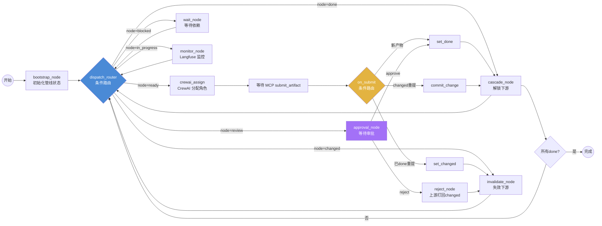

### 17.3 核心节点实现(伪码)

```python
from langgraph.graph import StateGraph, END

graph = StateGraph(PipelineState)

def bootstrap_node(state: PipelineState) -> dict:
    """初始化:无依赖的根节点置 ready"""
    for node_id in pipeline_nodes:
        if not deps(node_id):
            state["node_states"][node_id] = NodeStatus.READY
    return {"node_states": state["node_states"]}

def dispatch_router(state: PipelineState) -> str:
    """条件路由:按第一个需要处理的节点状态分发"""
    for node_id, status in state["node_states"].items():
        if status == NodeStatus.READY: return "crewai_assign"
        if status == NodeStatus.REVIEW: return "approval_node"
        if status == NodeStatus.DONE: return "cascade_node"
        if status == NodeStatus.CHANGED: return "invalidate_node"
    return "wait_node"

def cascade_node(state: PipelineState) -> dict:
    """done 节点解锁下游:检查下游依赖是否全满足 → ready"""
    for node_id, status in state["node_states"].items():
        if status == NodeStatus.DONE:
            for downstream in get_downstream(node_id):
                if all_deps_done(downstream, state):
                    state["node_states"][downstream] = NodeStatus.READY
    return {"node_states": state["node_states"]}

def invalidate_node(state: PipelineState) -> dict:
    """changed 节点失效下游:清除下游产物引用 + blocked"""
    for node_id, status in state["node_states"].items():
        if status == NodeStatus.CHANGED:
            for downstream in get_downstream(node_id):
                state["artifact_refs"].pop(downstream, None)
                state["node_states"][downstream] = NodeStatus.BLOCKED
                # 事件通知(累积追加)
    return {"node_states": state["node_states"], "events": [{"type": "invalidated", "node": downstream}]}

# 边定义(条件路由)
graph.add_conditional_edges("dispatch_router", dispatch_router, {
    "crewai_assign": "crewai_assign",
    "approval_node": "approval_node",
    "cascade_node": "cascade_node",
    "invalidate_node": "invalidate_node",
    "wait_node": "wait_node",
})
graph.add_edge("cascade_node", "dispatch_router")
graph.add_edge("invalidate_node", "dispatch_router")
```

### 17.4 LangGraph vs 前版自写状态机

| 维度 | 前版 JS 状态机 | LangGraph StateGraph |
|---|---|---|
| 状态合并 | 手动 if-else | **Annotated 累积策略** |
| 条件路由 | 手动 switch | **add_conditional_edges 声明式** |
| 并发节点 | 串行 | **支持并行 fan-out** |
| 可观测 | 自写日志 | **每节点独立 trace + Langfuse 集成** |
| 持久化 | 无 | **checkpointer(中断恢复)** |
| 回退循环 | 手动 | **条件边天然支持** |

---

## 十八、CrewAI 角色协作层设计

> CrewAI 负责:定义 4 角色(product/server/design/client)+ 任务分配 + 角色间通过 LangGraph state 同步。

### 18.1 角色定义(Crew 设计图)

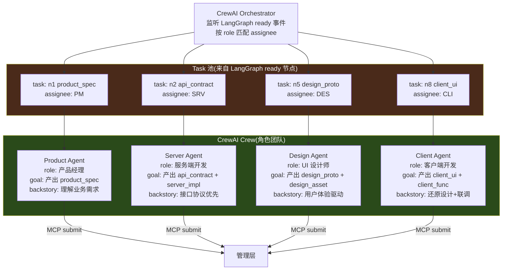

### 18.2 CrewAI 角色 + Task 定义

```python
from crewai import Agent, Task, Crew, Process

# 4 个角色 Agent(注意:不执行开发,只协调提交产物)
product_agent = Agent(
    role="产品经理",
    goal="产出 product_spec,通过 MCP 提交到产物仓库",
    backstory="理解业务需求,使用任意工具(ECC/OpenSpec/custom)产出需求文档",
    tools=[mcp_submit_artifact, mcp_update_progress, mcp_get_deps],
    allow_delegation=False,
)
server_agent = Agent(
    role="服务端开发",
    goal="产出 api_contract 和 server_impl,通过 MCP 提交",
    backstory="接口协议优先,使用任意工具(spec-kit/custom)产出契约和实现引用",
    tools=[mcp_submit_artifact, mcp_update_progress, mcp_get_deps, mcp_request_approval],
    allow_delegation=False,
)
design_agent = Agent(
    role="UI 设计师",
    goal="产出 design_proto 和 design_asset(含 figma 链接)",
    backstory="用户体验驱动,使用 Figma 或任意工具产出设计原型和标注",
    tools=[mcp_submit_artifact, mcp_update_progress, mcp_get_deps],
    allow_delegation=False,
)
client_agent = Agent(
    role="客户端开发",
    goal="产出 client_ui 和 client_func,依赖服务和设计",
    backstory="还原设计 + 联调服务,使用任意 IDE 开发",
    tools=[mcp_submit_artifact, mcp_update_progress, mcp_get_deps, mcp_request_approval],
    allow_delegation=False,
)

# Crew:按 LangGraph ready 事件动态创建 Task
def build_crew_for_ready_nodes(ready_nodes: list, state: PipelineState) -> Crew:
    tasks = []
    for node_id in ready_nodes:
        node = get_node(node_id)
        role_to_agent = {
            "product": product_agent, "server": server_agent,
            "design": design_agent, "client": client_agent,
        }
        agent = role_to_agent.get(node.get("role"))
        if agent:
            tasks.append(Task(
                description=f"为节点 {node_id}({node['type']})产出产物,通过 MCP 提交",
                agent=agent,
                expected_output=f"产物已提交到产物仓库,MCP 返回 done",
                context={"node_id": node_id, "deps": get_deps_info(node_id, state)},
            ))
    return Crew(agents=[product_agent, server_agent, design_agent, client_agent],
                tasks=tasks, process=Process.sequential, verbose=True)
```

### 18.3 CrewAI 与 LangGraph 的协作

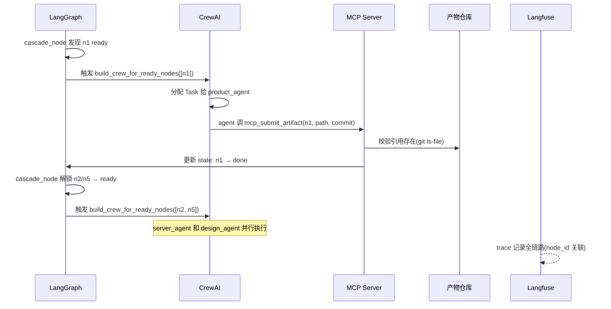

**关键:CrewAI 不"执行开发",只"协调提交"**。agent 的任务是:调用 MCP 工具把人员已产出的产物引用提交到管理方。真正的开发由人员自由完成,agent 是"提交协调员"。

---

## 十九、MCP Server 接口层设计

> MCP 是执行层与管理层之间的唯一桥梁。agent/人员通过 MCP 工具提交产物引用、更新进度、查询依赖、请求审批。

### 19.1 MCP 工具清单

| 工具名 | 调用方 | 作用 | 参数 |
|---|---|---|---|
| `submit_artifact` | 各角色 agent | 提交产物引用(git path+commit)→ 触发状态推进 | `node_id, repo, path, commit, toolspec_framework` |
| `update_progress` | 各角色 agent | 更新节点进度(不提交产物,仅状态) | `node_id, status, note` |
| `get_dependencies` | 各角色 agent | 查上游产物引用(从产物仓库拉内容) | `node_id` |
| `get_pipeline_state` | 监控/可视化 | 查全局管线状态 | — |
| `request_approval` | 各角色 agent | 请求审批 → 节点进 review | `node_id, approver` |
| `approve` / `reject` | 审批人/agent | 审批操作 → 推进或打回 | `node_id` |
| `set_gate_policy` | 管理员 | 设置门禁策略 | `node_id, policy` |

### 19.2 MCP Server 实现(伪码,基于 MCP SDK)

```python
from mcp.server import Server
from mcp.types import Tool, TextContent

server = Server("coordination-hub")
langfuse = Langfuse()  # 旁路监听

@server.list_tools()
async def list_tools() -> list[Tool]:
    return [
        Tool(name="submit_artifact",
             description="提交产物引用到管理方,触发状态推进",
             inputSchema={
                 "type": "object",
                 "properties": {
                     "node_id": {"type": "string"},
                     "repo": {"type": "string", "description": "产物 git 仓库地址"},
                     "path": {"type": "string", "description": "产物在仓库内路径"},
                     "commit": {"type": "string", "description": "git commit hash"},
                     "toolspec_framework": {"type": "string", "description": "生成工具(中立,不限)"},
                 },
                 "required": ["node_id", "repo", "path", "commit", "toolspec_framework"],
             }),
        # ... 其他工具
    ]

@server.call_tool()
async def call_tool(name: str, arguments: dict) -> list[TextContent]:
    # Langfuse 旁路 trace(不阻塞主流程)
    with langfuse.start_as_current_span(name=f"mcp.{name}") as span:
        span.set_attribute("node_id", arguments.get("node_id"))

        if name == "submit_artifact":
            # 1. 校验产物引用(查产物仓库 git ls-file,不拉内容)
            if not verify_artifact_ref(arguments["repo"], arguments["path"], arguments["commit"]):
                return [TextContent(type="text", text="错误:产物引用不存在")]
            # 2. 更新 LangGraph state
            artifact_ref = ArtifactRef(
                node_id=arguments["node_id"],
                repo=arguments["repo"], path=arguments["path"],
                commit=arguments["commit"],
                toolspec_framework=arguments["toolspec_framework"],
                trace_id=span.trace_id,
            )
            new_state = await langgraph_invoke(
                inputs={"submit": arguments["node_id"], "artifact_ref": artifact_ref}
            )
            return [TextContent(type="text",
                text=f"已提交,节点 {arguments['node_id']} 状态: {new_state['node_states'][arguments['node_id']]}")]

        elif name == "get_dependencies":
            # 从产物仓库拉取上游产物内容(供 agent 参考)
            deps = get_upstream(arguments["node_id"])
            contents = []
            for dep_id in deps:
                ref = current_state["artifact_refs"].get(dep_id)
                if ref:
                    content = fetch_artifact_content(ref)  # git show commit:path
                    contents.append({"node_id": dep_id, "content": content})
            return [TextContent(type="text", text=json.dumps(contents, ensure_ascii=False))]
```

### 19.3 MCP 工具调用与状态推进(数据流图)

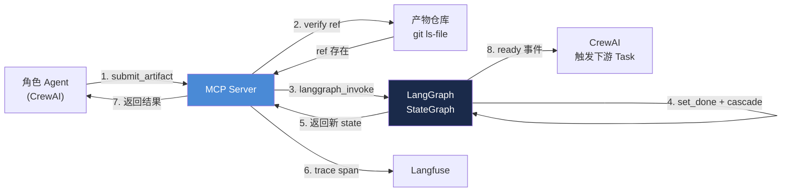

---

## 二十、Constraint Skills 约束层设计(superpowers 风格)

> 约束 skill 定义"每个角色/节点需要交什么产物、什么元数据约束",但不限制"怎么产出"。superpowers 风格:原子化 + 渐进式披露 + 权限管控。

### 20.1 Skill 目录结构

```
constraint-skills/
├─ product-spec-skill/
│  ├─ skill.yaml          # 元数据:触发条件、所需产物、元数据约束
│  └─ guide.md            # 引导:product_spec 应包含什么(建议,非强制)
├─ api-contract-skill/
│  ├─ skill.yaml
│  └─ guide.md
├─ design-handoff-skill/
│  ├─ skill.yaml          # 含 figma 链接规范约束
│  └─ guide.md
├─ server-impl-skill/
│  ├─ skill.yaml          # 引用 api_contract 的约束
│  └─ guide.md
├─ client-ui-skill/
│  ├─ skill.yaml          # 引用 design_asset + api_contract 的约束
│  └─ guide.md
└─ client-delivery-skill/
   ├─ skill.yaml
   └─ guide.md
```

### 20.2 Skill 定义示例(api-contract-skill)

```yaml
# constraint-skills/api-contract-skill/skill.yaml
name: api-contract-skill
description: 约束服务端 api_contract 产物的提交规范
trigger:
  node_type: api_contract
  role: server
# 元数据约束(管理方校验,中立性:不约束 content 格式)
artifact_constraints:
  required_fields:
    - title
    - version          # semver
    - source.repo
    - source.path
    - source.commit
    - toolspec.framework   # 不限取值(spec-kit/open-spec/custom 均可)
  deps:
    - product_spec         # 必须依赖 product_spec
  min_version:
    product_spec: "1.0.0"
# 引导(建议,非强制 —— 开发者自由选择工具和格式)
guide_ref: guide.md
guide_summary: |
  建议 api_contract 包含:端点、请求/响应 schema、错误码。
  可用 spec-kit、OpenSpec 或自定义格式,管理方不解析内容。
# MCP 工具绑定(此 skill 激活时可调用的工具)
allowed_mcp_tools:
  - submit_artifact
  - update_progress
  - get_dependencies
  - request_approval
```

### 20.3 Skill 与 MCP/LangGraph 的协作

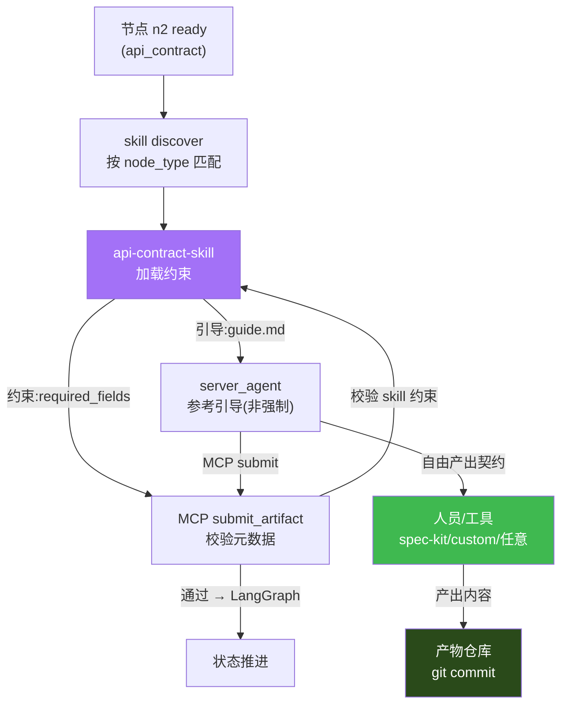

**关键:skill 是"约束 + 引导",不是"执行"。** 开发者完全自由选择工具和格式,skill 只确保提交的元数据符合管理方要求,并提供产出建议(可忽略)。

---

## 二十一、Langfuse 监控层设计

> Langfuse 旁路监听 MCP 工具调用 + LangGraph 节点执行,提供 trace/dashboard/评估。**旁路原则:不阻塞主流程,失败降级。**

### 21.1 监控埋点设计

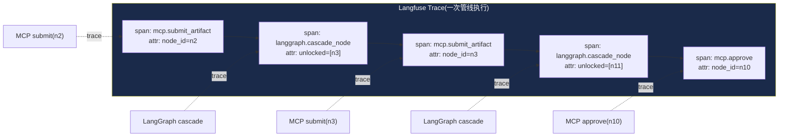

### 21.2 Langfuse 旁路监听实现

```python
from contextlib import contextmanager
import functools

# 旁路监听装饰器(失败降级,不阻塞主流程)
def langfuse_trace(name: str):
    def decorator(fn):
        @functools.wraps(fn)
        async def wrapper(*args, **kwargs):
            try:
                with langfuse.start_as_current_span(name=name) as span:
                    # 注入 node_id 等属性
                    if "node_id" in kwargs:
                        span.set_attribute("node_id", kwargs["node_id"])
                    return await fn(*args, **kwargs)
            except Exception as e:
                # 降级:Langfuse 挂了不影响主流程
                logger.warning(f"Langfuse trace 失败,降级: {e}")
                return await fn(*args, **kwargs)
        return wrapper
    return decorator

# 应用到 MCP 工具
@langfuse_trace("mcp.submit_artifact")
async def submit_artifact(node_id, repo, path, commit, toolspec_framework):
    # ... 业务逻辑

# 应用到 LangGraph 节点
@langfuse_trace("langgraph.cascade_node")
async def cascade_node(state):
    # ... 业务逻辑
```

### 21.3 Langfuse Dashboard 视图

| 视图 | 数据源 | 内容 |
|---|---|---|
| Trace 列表 | Langfuse | 每次 MCP 调用 + LangGraph 节点执行的 trace |
| 节点耗时 | trace span | 每个节点从 ready→done 的耗时分布 |
| 依赖图叠加 | Langfuse + 自建 | trace_id 关联产物,在依赖图上显示耗时 |
| 异常告警 | trace error | gate 失败、审批超时、agent 离线 |
| 角色负载 | trace 按 agent 聚合 | 各角色 agent 的任务数/耗时 |

---

## 二十二、端到端数据流(完整设计图)

> 一次完整的"需求→契约→设计→客户端"全链路数据流。

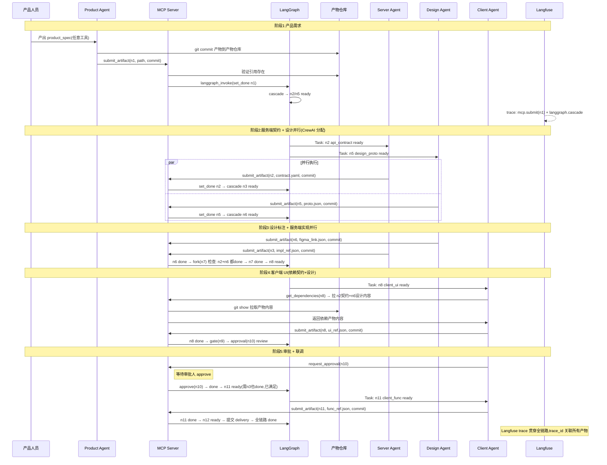

---

## 二十三、自建技术栈映射与目录结构

### 23.1 技术栈映射

| 层 | 技术 | 作用 | 替代方案 |
|---|---|---|---|
| 编排层 | **LangGraph StateGraph** | 状态机 + 依赖DAG + 条件推进 | 自写状态机(前版) |
| 角色层 | **CrewAI** | 4角色定义 + Task 分配 + 并行协调 | LangGraph 内置角色(弱) |
| 接口层 | **MCP Server**(Python SDK) | 暴露工具给 agent/人员 | REST API(前版) |
| 约束层 | **Constraint Skills**(superpowers 风格) | 产物元数据约束 + 引导 | schema 校验(前版) |
| 监控层 | **Langfuse**(自托管) | trace + dashboard + 评估 | LangSmith(商业) |
| 产物层 | **独立 git 仓库** | 产物内容版本化 | 对象存储(无版本) |
| 可视化 | react-flow + SSE | 依赖图 + 实时状态(复用前版) | — |

### 23.2 自建项目目录结构

```
coordination-platform/                  # 自建平台(管理/编排层)
├─ orchestration/
│  ├─ langgraph_pipeline.py             # StateGraph 定义(状态机+DAG)
│  ├─ state_schema.py                   # PipelineState TypedDict
│  └─ nodes.py                          # bootstrap/cascade/invalidate/approval 节点
├─ crew/
│  ├─ agents.py                         # 4 角色 Agent 定义(CrewAI)
│  ├─ tasks.py                          # Task 动态生成(按 ready 节点)
│  └── crew_orchestrator.py             # CrewAI ↔ LangGraph 桥接
├─ mcp_server/
│  ├─ server.py                         # MCP Server(暴露工具)
│  ├─ tools.py                          # submit/get_deps/approve 等工具实现
│  └─ artifact_verifier.py              # 校验产物引用(查产物仓库)
├─ skills/                              # Constraint Skills(superpowers 风格)
│  ├─ product-spec-skill/
│  │  ├─ skill.yaml
│  │  └─ guide.md
│  ├─ api-contract-skill/
│  ├─ design-handoff-skill/
│  ├─ server-impl-skill/
│  ├─ client-ui-skill/
│  └─ client-delivery-skill/
├─ monitoring/
│  ├─ langfuse_integration.py           # 旁路监听装饰器
│  └─ dashboard_query.py                # Dashboard 数据查询
├─ visual/                              # 可视化(复用前版 react-flow)
│  └─ index.html
├─ pipeline.yaml                        # 管线 DSL(节点+依赖定义)
├─ requirements.txt                     # langgraph + crewai + langfuse + mcp
└─ main.py                              # 启动入口(MCP Server + LangGraph)

artifact-repo/                          # 独立产物仓库(单独 git)
├─ product_spec/
│  └─ 001.yaml
├─ api_contract/
│  └─ 001.yaml
├─ design_proto/
│  └─ 001.json
├─ design_asset/
│  └─ 001_figma.json                    # 含 figma 链接
├─ server_impl/
│  └─ 001_ref.json                      # 引用代码仓库 commit
├─ client_ui/
│  └─ 001_ref.json
└─ manifests/                           # 元数据副本(可选,供管理方快速查询)
   └─ 001.json
```

### 23.3 产物仓库与管理层的引用关系

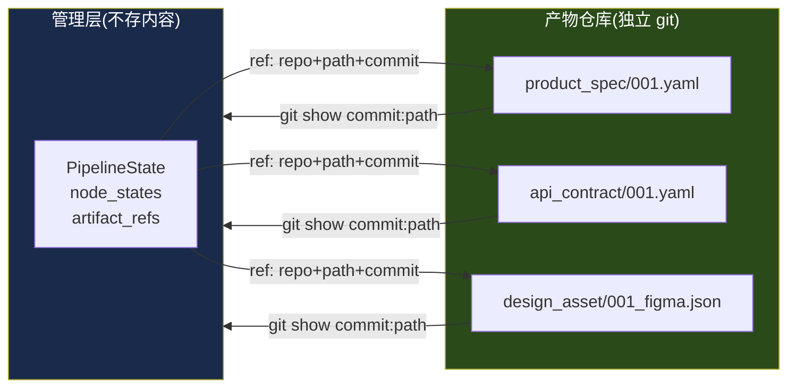

**管理层只持有引用(`repo + path + commit`),需要内容时按需 `git show` 拉取。** 产物仓库天然版本化,变更即新 commit,管理层感知 commit 变化即触发 `changed` 状态。

### 23.4 启动与运行

```bash
# 1. 启动 Langfuse(自托管,docker)
docker compose up langfuse

# 2. 启动 MCP Server + LangGraph(管理层)
cd coordination-platform
pip install langgraph crewai langfuse mcp
python main.py                        # 启动 MCP Server + LangGraph checkpointer

# 3. 产物仓库(独立 git)
cd artifact-repo && git init

# 4. 可视化(复用前版)
open visual/index.html                # 连 MCP Server 的 SSE

# 5. agent/人员通过 MCP 提交产物(任意 MCP 客户端)
#    agent 调用 mcp.submit_artifact(node_id, repo, path, commit, framework)
```

---

## 二十四、与原型(第十五~十五章)的演进路线

| 阶段 | 内容 | 状态 |
|---|---|---|
| v1 原型(已交付) | JS Hub + 自写状态机 + REST API + 可视化 | ✅ 30/30 E2E 通过 |
| v2 自建(本章设计) | LangGraph + CrewAI + MCP + Skills + Langfuse + 独立产物仓库 | 📐 设计完成,待实现 |
| v3 生产化 | Postgres checkpointer + 多租户 + RBAC + 通知集成 | 📋 规划中 |

**v1→v2 的核心升级:**
1. JS 状态机 → **LangGraph StateGraph**(白盒 DAG + 条件边 + checkpointer)
2. REST API → **MCP Server**(标准协议,agent 原生调用)
3. 自写角色 → **CrewAI**(角色 Crew + Task 分配)
4. Hub 存 manifest → **独立产物仓库**(git 版本化,管理层只存引用)
5. schema 校验 → **Constraint Skills**(superpowers 风格,渐进式引导)
6. 可选监控 → **Langfuse 旁路监听**(MCP + LangGraph 双埋点)

---

## 二十五、产物仓库审核机制设计(需求 7)

> 需求 7:产物仓库的所有提交需经管理方审核批准 + 记录,避免部分方产物有问题。本章细化产物仓库的分支保护、PR 审核、约束校验、审计与状态推进联动。

### 25.1 设计目标与原则

| 目标 | 含义 |
|---|---|
| **提交受控** | 多方不能直接 push 到产物仓库主干,只能提 PR |
| **管理方审核** | 所有 PR 必须经管理方(通过 MCP 工具)审核批准才能合并 |
| **约束校验** | 审核时按 Constraint Skill 校验元数据 + 依赖完整性 |
| **内容抽查** | 管理方不解析内容格式,但可调 viewer 抽查(可选,人工触发) |
| **全程记录** | 审核动作入审计日志 + Langfuse trace,可追溯 |
| **合并即推进** | PR 合并后才触发 LangGraph 状态推进(而非提交时) |

**核心原则:产物仓库是"受保护资源",提交是"提案",审核是"准入",合并是"生效"。** 这把第十九章的 `submit_artifact` 从"直接生效"改为"提 PR → 审 → 合并生效",是需求 7 对前版设计的关键修正。

### 25.2 产物仓库分支保护策略(设计图)

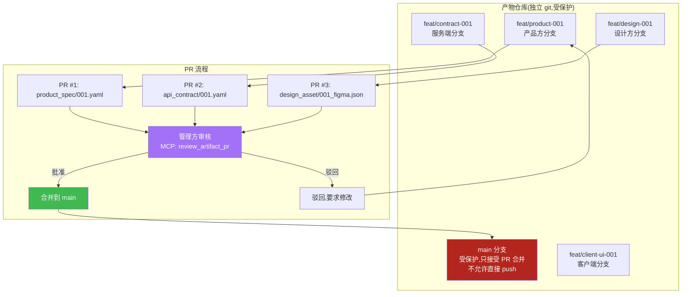

**分支保护规则(GitHub/GitLab 原生支持):**
- `main` 分支:禁止直接 push,只接受 PR
- PR 至少 1 个审核批准(管理方 bot 账号)
- CI 校验:manifest schema + skill 约束(详见 25.4)
- 合并方式:squash merge(保持每个产物一个 commit,便于追溯)

### 25.3 PR 模板与产物 manifest(提交规范)

多方提 PR 时,产物文件 + manifest 元数据一起提交。PR 模板强制声明节点关联:

```yaml
# .github/pull_request_template.md(或 GitLab 等价)
# 产物提交 PR 模板 —— 管理方按此审核

## 关联节点
node_id: n2                    # 对应管线节点(必填)
node_type: api_contract
role: server

## 产物引用(合并后管理方记录此引用)
artifact:
  path: api_contract/001.yaml
  toolspec_framework: spec-kit  # 生成工具(中立,不限取值)

## 依赖声明(管理方校验依赖已 done)
deps:
  - node_id: n1
    artifact_path: product_spec/001.yaml

## 产物说明(自由填写,管理方不限制内容)
说明: 用户登录接口契约 v1,含 /login 端点、请求/响应 schema
```

**产物文件 + manifest 元数据都在 PR 里**,管理方审核时:
1. 解析 PR 模板 → 提取 node_id、artifact.path、deps
2. 按 node_type 匹配 Constraint Skill → 校验元数据
3. 校验 deps 声明的节点已 done(依赖完整性)
4. (可选)调 viewer 抽查内容
5. 批准/驳回 → 审核记录入审计日志

### 25.4 管理方审核流程(设计图)

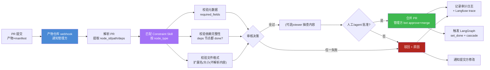

### 25.5 审核 MCP 工具(扩展第十九章)

在十九章 MCP 工具清单基础上,新增产物审核工具:

| 工具名 | 调用方 | 作用 | 参数 |
|---|---|---|---|
| `list_pending_prs` | 管理方/监控 | 列出待审核 PR | `status=pending` |
| `get_pr_detail` | 管理方 | 获取 PR 详情(产物+manifest+diff) | `pr_id` |
| `review_artifact_pr` | 管理方 agent | 自动审核:skill 校验 + 依赖检查 → 返回结论 | `pr_id` |
| `approve_pr` | 管理方/审批人 | 批准 PR → 合并 → 触发状态推进 | `pr_id, note` |
| `reject_pr` | 管理方/审批人 | 驳回 PR → 通知提交方 | `pr_id, reason` |
| `get_audit_log` | 审计 | 查审核记录 | `filter` |

**`review_artifact_pr`(自动审核)实现伪码:**
```python
@langfuse_trace("mcp.review_artifact_pr")
async def review_artifact_pr(pr_id: str) -> dict:
    """自动审核 PR:skill 约束 + 依赖完整性,返回结论"""
    pr = await get_pr_detail(pr_id)
    node_id = pr["template"]["node_id"]
    node = get_node(node_id)
    skill = match_skill(node["type"])           # 匹配 Constraint Skill

    # 1. 元数据校验(skill.required_fields)
    meta_ok, meta_err = skill.validate_metadata(pr["template"])
    if not meta_ok:
        return {"verdict": "reject", "reason": f"元数据校验失败: {meta_err}"}

    # 2. 依赖完整性(所有 deps 节点已 done)
    for dep in pr["template"]["deps"]:
        dep_state = current_state["node_states"].get(dep["node_id"])
        if dep_state != NodeStatus.DONE:
            return {"verdict": "reject", "reason": f"依赖 {dep['node_id']} 未完成({dep_state})"}

    # 3. 文件格式校验(扩展名/大小,不解析内容)
    file_ok, file_err = skill.validate_file_format(pr["files"])
    if not file_ok:
        return {"verdict": "reject", "reason": f"文件格式: {file_err}"}

    # 4. 自动通过(可选:高危节点转人工)
    if skill.requires_human_review:
        return {"verdict": "needs_human", "reason": "需人工审核(高危节点)"}
    return {"verdict": "approve", "reason": "自动审核通过"}

# 批准合并(触发状态推进)
@langfuse_trace("mcp.approve_pr")
async def approve_pr(pr_id: str, note: str = "") -> dict:
    pr = await get_pr_detail(pr_id)
    # 1. 管理方 bot approve + squash merge
    await git_merge_pr(pr_id, method="squash")
    # 2. 构造 ArtifactRef(合并后的 commit)
    commit = await get_pr_merge_commit(pr_id)
    artifact_ref = ArtifactRef(
        node_id=pr["template"]["node_id"],
        repo=ARTIFACT_REPO, path=pr["template"]["artifact"]["path"],
        commit=commit, toolspec_framework=pr["template"]["artifact"]["toolspec_framework"],
        trace_id=langfuse.current_trace_id(),
    )
    # 3. 记录审计日志
    audit_log.append({"action": "approve", "pr_id": pr_id, "node_id": artifact_ref["node_id"],
                      "commit": commit, "reviewer": "mgmt-bot", "ts": now(), "note": note})
    # 4. 触发 LangGraph 状态推进
    new_state = await langgraph_invoke({"submit": artifact_ref["node_id"], "artifact_ref": artifact_ref})
    return {"ok": True, "merged": True, "state": new_state["node_states"][artifact_ref["node_id"]]}
```

### 25.6 审核 → 合并 → 状态推进(时序图)

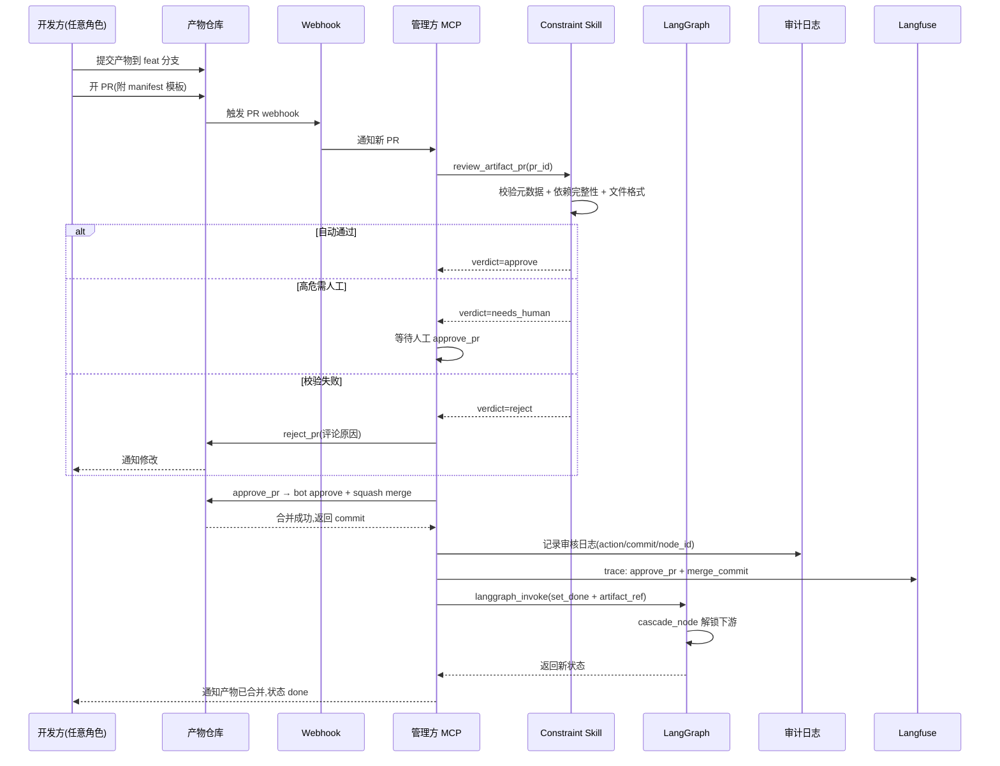

### 25.7 审核记录与审计日志

所有审核动作(无论批准/驳回)都记入审计日志,可追溯:

```json
// 审计日志条目(存管理方 DB 或独立 audit 仓库)
{
  "audit_id": "aud_20260804_001",
  "action": "approve",              // approve | reject | needs_human
  "pr_id": 42,
  "pr_url": "https://github.com/org/artifact-repo/pull/42",
  "node_id": "n2",
  "node_type": "api_contract",
  "artifact_path": "api_contract/001.yaml",
  "merge_commit": "a1b2c3d4",
  "reviewer": "mgmt-bot",           // 或人工 reviewer_id
  "submitter": "server-agent-01",
  "skill_used": "api-contract-skill",
  "skill_verdict": "approve",
  "deps_at_review": {"n1": "done"},
  "note": "自动审核通过",
  "trace_id": "lf_xxx",             // Langfuse 关联
  "ts": "2026-08-04T10:30:00Z"
}
```

**审计日志查询:** `get_audit_log` MCP 工具,支持按 node_id / reviewer / 时间范围 / action 过滤,供合规审查与问题回溯。

### 25.8 审核策略矩阵(按产物类型分级)

不同产物类型的审核严格度不同(Constraint Skill 配置):

| 产物类型 | 自动校验 | 人工审核 | 理由 |
|---|---|---|---|
| `product_spec` | ✅ | ❌ | 需求文档,影响面可控 |
| `api_contract` | ✅ | ✅(首次) | 契约影响下游多端,首次人工把关 |
| `server_impl` 引用 | ✅ | ❌ | 仅引用代码 commit,代码在代码仓库审 |
| `design_proto` | ✅ | ❌ | 设计原型,主观性强不强审 |
| `design_asset` | ✅ | ✅(含 figma) | 标注/切图影响客户端实现 |
| `client_ui` | ✅ | ❌ | UI 实现,代码在代码仓库审 |
| `client_delivery` | ✅ | ✅ | 交付物,最终把关 |

**Skill 配置项:`requires_human_review: true/false`**,管理方据此决定自动批准还是转人工。

### 25.9 对前版设计的修正汇总

| 前版设计 | 需求 7 修正 | 影响章节 |
|---|---|---|
| `submit_artifact` 直接触发 set_done | 改为提 PR → 审核 → 合并后才 set_done | 19 / 22 |
| 管理方不干预产物 | 管理方审核所有 PR(元数据+依赖),不审内容格式 | 16.2 / 20 |
| 产物仓库自由提交 | 分支保护,只接受 PR,管理方 bot 审核合并 | 23.3 |
| 无审计 | 全程审计日志 + Langfuse trace | 新增 25.7 |

### 25.10 端到端流程(含审核的完整图)

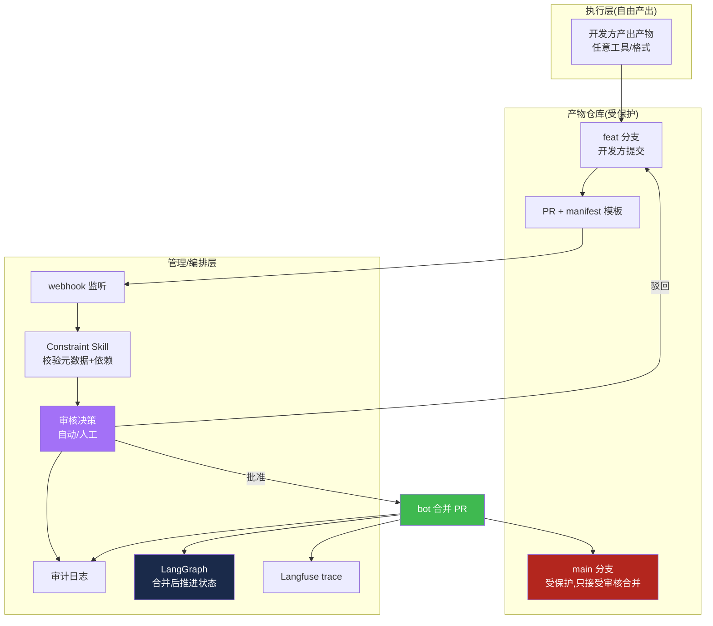

**关键:开发方自由产出 → 提 PR(提案)→ 管理方审核(准入)→ 合并(生效)→ 状态推进(联动)。** 审核 barrier 在"合并"这一步,既保护产物质量,又不干预开发方"怎么做"。

---

## 二十六、修正:第十九章/第二十二章的审核适配

### 26.1 `submit_artifact` 语义变更(第十九章修正)

前版 `submit_artifact` 直接触发 `set_done`。需求 7 下,语义改为"提 PR":

```python
# 修正后的 submit_artifact(提 PR,不直接推进状态)
@langfuse_trace("mcp.submit_artifact")
async def submit_artifact(node_id, repo, branch, path, toolspec_framework, deps_decl):
    """开发方提交产物:推 feat 分支 + 开 PR,等待管理方审核"""
    # 1. 校验产物已在分支上(git ls-file branch:path)
    if not verify_artifact_on_branch(repo, branch, path):
        return {"ok": False, "error": "产物文件不存在于指定分支"}
    # 2. 创建 PR(含 manifest 模板)
    pr = await create_pr(repo, branch=branch, target="main",
                         template={"node_id": node_id, "artifact": {"path": path,
                         "toolspec_framework": toolspec_framework}, "deps": deps_decl})
    # 3. 触发 webhook → 管理方自动审核(25.5)
    return {"ok": True, "pr_id": pr["id"], "status": "pending_review",
            "msg": "PR 已提交,等待管理方审核"}
```

**状态机新增中间态 `pending_review`**:PR 提交后、合并前。`submit_artifact` 后节点进入 `pending_review` 而非 `done`;`approve_pr` 合并后才 `done`。

### 26.2 修正后的状态机(含 pending_review)

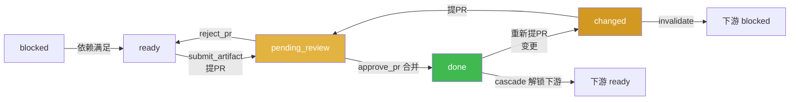

### 26.3 第二十二章端到端时序修正(含审核)

原第二十二章时序图中,`submit_artifact` 后直接 `set_done`。修正为:`submit_artifact` 提 PR → `review_artifact_pr` 自动审 → `approve_pr` 合并 → `set_done`。其余流程不变。阶段 1 修正片段:

```
阶段1:产品需求(含审核)
  P->>PM: 产出 product_spec
  PM->>AR: git commit 到 feat 分支
  PM->>MCP: submit_artifact(n1) → 开 PR
  MCP->>SKILL: review_artifact_pr → 自动审通过(product_spec 低危)
  MCP->>AR: approve_pr → bot 合并 PR
  MCP->>AUDIT: 记录审核日志
  MCP->>LG: set_done n1 → cascade n2/n5 ready
  LF: trace: submit + review + approve + cascade
```

---

## 二十七、最终架构总览(含审核)

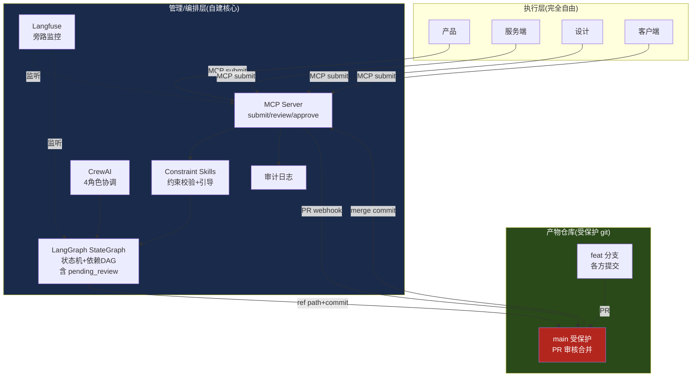

**三层 + 审核闭环:执行层自由产出 → 产物仓库 PR 准入 → 管理层审核/编排/监控。** 需求 1-7 全部落地。

---

## 假设与说明
- 本报告基于 2026-08-04 公开网络资料,工具能力随时间快速演进,商业产品(Devin 等)以官方最新文档为准
- "OpenSpec+Superpowers+Harness"为社区总结的架构模式名词,非单一官方产品
- 多仓库并行 + 自动依赖管理这一块,业界尚无成熟 turnkey 方案,需组合自建
